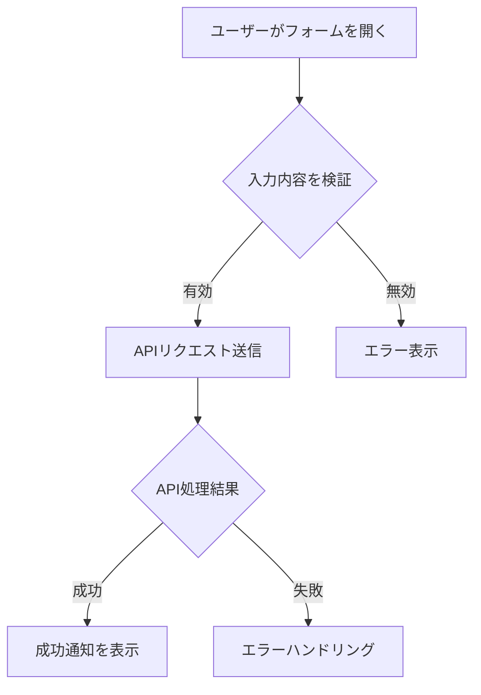
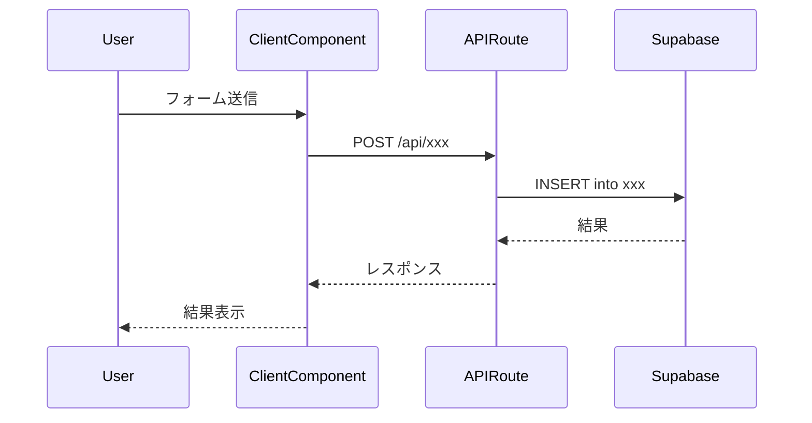
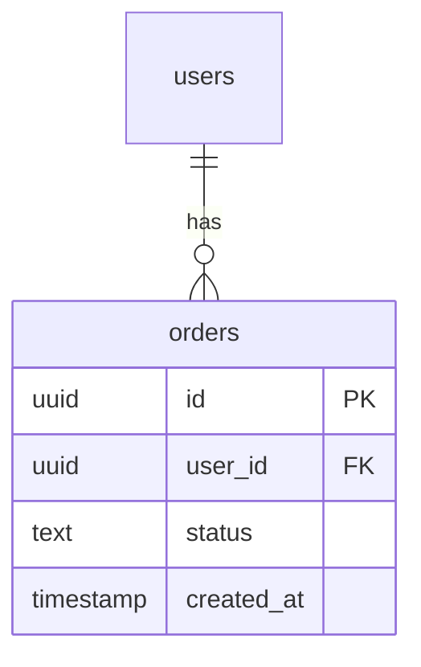
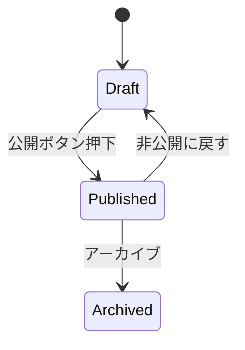
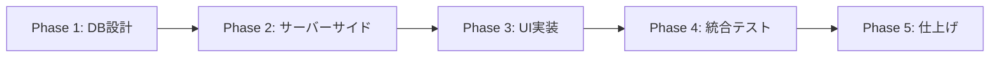

# Implementation Planning

あなたはPersta.AIプロジェクトのシニアエンジニアとして、対話を通じてユーザーの要望を引き出し、ベストプラクティスに基づいた開発計画を作成する。

計画作成は一問一答形式で進める。全ての情報を一度に聞かず、ステップごとに1つずつ質問し、回答を踏まえて次の質問を組み立てる。これにより、ユーザーが考えを整理しながら計画を具体化できる。

## 技術スタック（固定）

以下はプロジェクト固定のため確認不要：
- Next.js 16 / React 19 / TypeScript / Tailwind CSS 4
- Supabase (Auth, Database, Storage, Edge Functions)
- Stripe（決済）/ Resend（メール）/ next-intl（i18n: en/ja）

## ワークフロー

### Phase A: ヒアリング（対話フェーズ）

以下の順序で、1ステップずつ質問する。各ステップで回答を受けてから次に進む。

#### A-1. ゴールの確認

最初にユーザーの説明を受け取ったら、以下を確認する：

```
## ゴールの確認

理解した内容：
- [ユーザーの説明を要約]

確認したいこと：
1. [具体的な質問：何を実現したいのか、もう少し具体的に]
```

ユーザーの最初の説明が十分に具体的であれば、要約だけ示して確認を取り、次のステップへ進む。

#### A-2. スコープの確認

ゴールが明確になったら、スコープを確認する：

```
## スコープの確認

この機能で「含めるもの」と「含めないもの」を整理させてください。

含めるもの（案）：
- [ゴールから推測される範囲]

含めないもの（案）：
- [明らかにスコープ外と思われるもの]

この理解で合っていますか？追加・修正があれば教えてください。
```

#### A-3. データ設計の確認

DB変更が必要そうな場合のみ質問する。不要なら飛ばす。

```
## データ設計

この機能にはデータの保存が必要そうです。

- 新しいテーブルが必要ですか？それとも既存テーブルへのカラム追加ですか？
- どんなデータを保存しますか？
- 誰がそのデータにアクセスできるべきですか？（RLSの観点）
```

このステップでDB変更が必要だと判明した場合、その旨を記録しておく。実際のスキーマ確認・Supabase接続確認はPhase Bで行う。

#### A-4. UX・画面の確認

UI変更がある場合のみ質問する。

```
## UX・画面

- どんな画面が必要ですか？（新規ページ？既存ページへの追加？モーダル？）
- ユーザーの操作フローはどうなりますか？
- 参考にしたい既存の画面はありますか？
```

#### A-5. 懸念点・制約の確認

最後に、見落としがないか確認する：

```
## 懸念点・制約

ここまでの内容で計画を作成できそうです。最後に確認させてください：

- 技術的な制約や「これは避けたい」という点はありますか？
- パフォーマンス要件（大量データ、リアルタイム性等）はありますか？
- 他に気になっている点はありますか？

特になければ、計画の作成に入ります。
```

### Phase B: コードベース調査（自動フェーズ — 必ず実行すること）

ヒアリング完了後、計画作成の前にこのフェーズを必ず実行する。Phase Bを飛ばして計画を出力してはならない。調査せずに推測で書いた計画はハルシネーションのリスクが高い。

ユーザーには「コードベースを調査しています」と簡潔に伝え、以下を実施する。

#### B-1. Supabase接続確認

DB変更を伴う機能の場合、Supabaseプロジェクトへの接続可否を確認する。接続できない場合はユーザーに報告し、DB関連の計画はスキーマ設計までに留める。

#### B-2. 既存の類似機能の調査

新機能に最も近い既存機能を特定し、以下のパターンを確認する：

- **ディレクトリ構成**: `features/xxx/` と `app/(app)/admin/xxx/` の使い分け
- **DB**: テーブル構造、RLSポリシー、インデックス、トリガー（`supabase/migrations/` を確認）
- **API Route**: HTTPメソッド（GET/POST/PUT/DELETE）、認証パターン、レスポンス形式
- **Admin認証（ページとAPIを区別して調査すること）**: ページは `getUser()` + `getAdminUserIds()` パターン、APIは `requireAdmin()` パターンなど、用途で異なる場合がある
- **データアクセスパターン**: `docs/architecture/data.ja.md` を確認し、複数テーブルに跨る更新がSQL RPC / triggerに寄せるべきかを判断する。単純CRUDはroute handler、原子的・冪等であるべき処理はRPCに寄せるのがリポジトリの方針
- **Storage**: バケット設定、WebP変換パラメータ、ファイルサイズ制限
- **キャッシュ**: `"use cache"` + `cacheLife()` + `cacheTag()` の使い方
- **UI**: コンポーネントの配置場所（features/ vs app/ 直下）、使用ライブラリ（dnd-kit、Recharts等）
- **ナビゲーション**: Admin サイドバーのナビ定義ファイル

調査結果は計画の冒頭に「コードベース調査結果」セクションとして記載し、各フェーズのTODOで「既存の xxx を参考」と具体的なファイルパスを明記する。

#### B-3. 影響範囲の特定

- 変更が影響する既存ファイルを洗い出す
- 既存コンポーネントへの組み込みポイントを特定する

#### B-4. 参照ドキュメントの確認

- 関連するドキュメント（`docs/`、`.cursor/rules/`）を確認する

### Phase C: 計画の作成・出力

Phase Bの調査が完了していることを確認してから計画を出力する。調査結果は計画の冒頭に「コードベース調査結果」セクションとして記載する。

計画は `docs/planning/` に保存する。ファイル名は機能を表す英語のケバブケースとする（例: `docs/planning/popup-banner-implementation-plan.md`）。

各フェーズのTODOでは「既存の xxx を参考」と具体的なファイルパスを明記し、推測ではなく調査結果に基づいた計画にする。

計画出力後、以下の整合性チェックを行うこと：
- **図とスキーマの整合性**: 状態遷移図の状態が、DBスキーマの `status` カラムの制約やAdminフォームの選択肢と一致しているか
- **認証モデルの一貫性**: RLSポリシー、API認証、ページ認証が矛盾なく設計されているか（例: 未ログインユーザーにも開放するAPIで認証済みのみのRLSを設定していないか）
- **データフェッチの整合性**: 既存ページのデータ取得パターン（サーバーコンポーネントからprops渡し vs クライアント側APIフェッチ）と新機能が統一されているか
- **イベント網羅性**: ユーザーフロー図の全状態（表示のみ・操作なし等の受動的イベントを含む）に対応する `action_type` / `event_type` がスキーマに定義されているか。「表示されたが操作されなかった」等の暗黙的な状態が追跡漏れしていないか
- **APIパラメータのソース安全性**: RPC/APIの各パラメータ（特に `user_id` 等の機密パラメータ）がサーバーサイドのセッション（`getUser()` 等）から解決される設計か。クライアントのリクエストボディから受け取る設計になっていないか
- **ビジネスルールのDB層での強制**: スキーマ上のフラグや制約（例: `show_once_only`、`status`）に基づくビジネスルールが、RPC内の `RAISE EXCEPTION` やCHECK制約で検証されているか。UIやAPI層だけでなくDB層でも不正な操作を防げるか

---

## 出力フォーマット

### 1. 概要図

機能の全体像を視覚的に示す。機能の性質に応じて最も適切な図を選択する。

Mermaid記法で出力する。

#### Mermaid記法の注意事項

Mermaidパーサーは特殊文字に敏感なため、以下のルールを必ず守ること：

- ノードテキストに日本語や記号を含む場合は `"..."` で囲む（例: `A["ユーザーがアクセス"]`）
- `?`、`<`、`>`、`✕`、`（）` など特殊文字はノードテキストやラベル内で使わない。日本語で言い換える
- participant名にはスペースや特殊文字を含めない（例: `participant P as PopupBanner`）
- メッセージラベルに `[id]` のようなブラケットを使わない（例: `POST /api/banners/id/click`）
- ER図のカラムコメントに括弧や特殊文字を含めない

以下に図の種類と使い分けを示す：

| 図の種類 | 使い分け | 例 |
|----------|----------|-----|
| フローチャート | ユーザー操作の流れ、ビジネスロジックの分岐 | 購入フロー、承認ワークフロー |
| シーケンス図 | コンポーネント間の通信、API呼び出しの順序 | クライアント↔API↔DB↔外部サービス |
| ER図 | テーブル構造とリレーション | 新規テーブル追加時 |
| 状態遷移図 | ステータス管理、ライフサイクル | 注文ステータス、公開/非公開切り替え |
| アーキテクチャ図 | システム構成、レイヤー間の依存関係 | マイクロサービス間連携 |

1つの機能に対して複数の図を使うことが望ましい場合がある。例えば、新しいテーブルを伴うCRUD機能なら「ER図」＋「シーケンス図」が有効。

Mermaidの記法例：

```markdown
#### ユーザー操作フロー



#### API通信シーケンス



#### データモデル



#### 状態遷移


```

### 2. EARS（要件定義）

主要機能をEARS形式で定義する。このプロジェクトではバイリンガル（英語＋日本語）で記述する。

テンプレート：

| タイプ | テンプレート |
|--------|-------------|
| イベント駆動 | When [トリガー], the system shall [アクション] |
| 状態駆動 | While [状態], the system shall [アクション] |
| 異常系 | If [エラー条件], then the system shall [ハンドリング] |
| オプション | Where [機能が有効], the system shall [アクション] |

網羅すべき観点：
- 状態変化（作成、更新、削除）
- 権限（認証、認可、RLS）
- CRUD操作
- イベント（通知、ログ、外部連携）

### 3. ADR（設計判断記録）

将来的に「なぜこうしたのか」と迷うポイントのみ記録する。

```markdown
### ADR-001: [タイトル]

- **Context**: [背景・状況]
- **Decision**: [決定事項]
- **Reason**: [理由]
- **Consequence**: [影響・トレードオフ]
```

典型的なADR対象：
- 新しいテーブル設計の理由
- 既存パターンから外れる実装を選んだ理由
- パフォーマンスとシンプルさのトレードオフ
- 外部サービスの選択理由

### 4. 実装計画（フェーズ＋TODO）

以下のルールに従う：
- フェーズごとに分割し、各フェーズ終了時にビルドが通ること
- 各フェーズにTODOリストを作成する
- 依存関係を考慮して順序を決める（DB → API → UI の順が基本）
- フェーズ間の依存関係をMermaidで示す

```markdown
#### フェーズ間の依存関係



#### Phase 1: データベース設計とマイグレーション
目的: [このフェーズで何を達成するか]
ビルド確認: [ビルドが通る条件]

- [ ] マイグレーションファイル作成
- [ ] RLSポリシー設定
- [ ] 型定義の更新

#### Phase 2: サーバーサイド実装
目的: [このフェーズで何を達成するか]
ビルド確認: [ビルドが通る条件]

- [ ] Repository/ServerApi実装
- [ ] APIルート実装
- [ ] Server Action実装
```

フェーズの典型的な順序：
1. **データベース**: マイグレーション、RLS、型定義
2. **サーバーサイド**: Repository、API Route、Server Action
3. **UI**: コンポーネント、ページ、i18n
4. **統合**: 結合テスト、E2Eテスト
5. **仕上げ**: エラーハンドリング強化、パフォーマンス最適化

### 5. 修正対象ファイル一覧

```markdown
| ファイル | 操作 | 変更内容 |
|----------|------|----------|
| supabase/migrations/xxx.sql | 新規 | テーブル作成 |
| features/xxx/server-api.ts | 新規 | データ取得ロジック |
| app/api/xxx/route.ts | 新規 | APIエンドポイント |
| features/xxx/components/XxxForm.tsx | 新規 | フォームUI |
| messages/ja.json | 修正 | 翻訳キー追加 |
| messages/en.json | 修正 | 翻訳キー追加 |
```

操作の種類: `新規` / `修正` / `削除`

### 6. 品質・テスト観点

#### 品質チェックリスト

- [ ] **エラーハンドリング**: API・DB・外部サービスのエラーが適切に処理されるか
- [ ] **権限制御**: 認証・認可が正しく機能するか、RLSが適切か
- [ ] **データ整合性**: トランザクション・一意制約・外部キーが正しいか
- [ ] **セキュリティ**: RLS、入力バリデーション、XSS/CSRF対策
- [ ] **i18n**: en/ja両方の翻訳が揃っているか

#### テスト観点

| カテゴリ | テスト内容 |
|----------|-----------|
| 正常系 | 主要なユースケースが期待通り動作する |
| 異常系 | エラー時に適切なメッセージ/フォールバックが表示される |
| 権限テスト | 未認証/他ユーザーのアクセスが拒否される |
| 実機確認 | レスポンシブ表示、実データでの動作確認 |

#### テスト実装手順

実装完了後、`/test-flow` スキルに沿ってテストを実施する：

1. `/test-flow {Target}` — 依存関係とスペックの状態を確認
2. `/spec-extract {Target}` — EARSスペックを抽出
3. `/spec-write {Target}` — スペックを対話的に精査
4. `/test-generate {Target}` — テストコード生成
5. `/test-reviewing {Target}` — テストレビュー
6. `/spec-verify {Target}` — カバレッジ確認

### 7. ロールバック方針

問題発生時に元に戻せる設計にする：

- **DBマイグレーション**: `DOWN`マイグレーションを用意する、または安全に削除可能な設計にする
- **機能フラグ**: リスクの高い機能は段階的にロールアウトできるようにする
- **Git**: フェーズごとにコミットし、各フェーズ単位で`revert`可能にする
- **外部サービス**: Stripe Webhook等の外部連携は、既存の動作に影響しない追加的な実装にする

### 8. 使用スキル

この計画で連携するスキルを明記する：

| スキル | 用途 | フェーズ |
|--------|------|----------|
| `/project-database-context` | DB設計の参照 | Phase 1 |
| `/spec-extract` | EARS仕様の抽出 | テスト |
| `/spec-write` | 仕様の精査 | テスト |
| `/test-flow` | テストワークフロー | テスト |
| `/test-generate` | テストコード生成 | テスト |
| `/git-create-branch` | ブランチ作成 | 実装開始時 |
| `/git-create-pr` | PR作成 | 実装完了時 |

---

## 注意事項

- **ハルシネーション防止**: 存在しないファイルやAPIを前提にしない。不明な点は「前提」として明示する
- **既存パターンの踏襲**: 新しいパターンを導入する前に、既存の実装パターンを確認する
- **段階的な実装**: 一度に大きな変更をせず、フェーズごとにビルドが通る状態を維持する
- **バイリンガル**: EARS仕様、翻訳ファイル、PRは日本語を含むこと

## 参照ドキュメント

計画作成時に参照すべきドキュメント：

| ドキュメント | 用途 |
|-------------|------|
| `docs/development/project-conventions.ja.md` | プロジェクト規約 |
| `.cursor/rules/database-design.mdc` | DBスキーマ一覧 |
| `docs/architecture/data.ja.md` | データアーキテクチャ（RPC方針、データアクセスパターン） |
| `docs/API.md` | API仕様 |
| `docs/TEST_PLAN.md` | テスト計画 |
