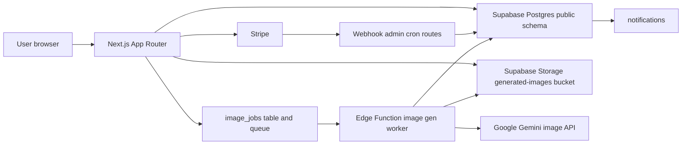

# Data & Supabase Architecture: Persta.AI

- Version: `v1.0`
- Last verified: `2026-03-14`
- Audience: New developers joining this repository
- Scope: Next.js app, Supabase `public` schema, Supabase Storage, Edge Function worker, Stripe purchase flow
- Sources:
  - `app/api/**/*.ts`
  - `features/**/lib/**/*.ts`
  - `lib/auth.ts`
  - `lib/supabase/server.ts`
  - `lib/supabase/admin.ts`
  - `supabase/functions/image-gen-worker/index.ts`
  - `supabase/migrations/*.sql`
  - `.cursor/rules/database-design.mdc`
  - `docs/API.md`

## Why this document exists

`.cursor/rules/database-design.mdc` is the exact schema reference. This document is the onboarding-first companion that explains how the schema is actually used by the app.

Recommended reading order:

1. This file for architecture and main flows
2. `.cursor/rules/database-design.mdc` for the exact table/RLS/index inventory
3. `docs/API.md` for route-level request/response details
4. `supabase/migrations/` when changing DB behavior

## System overview

Persta.AI is a Next.js App Router application backed by Supabase. The application uses three different data-access modes:

- Session-scoped reads/writes through `createClient()` and RLS
- Server-only reads/writes through `createAdminClient()` and the service role
- Multi-table business operations through `public` RPCs and triggers

The important design choice is that simple CRUD stays in route handlers or server helpers, while any operation that must stay atomic or idempotent is pushed into SQL functions.

## Main building blocks

| Layer | Main location | Responsibility | Access mode |
| --- | --- | --- | --- |
| Web pages and API routes | `app/` | UI, request validation, auth checks, cache revalidation | `createClient()` for user flows, `createAdminClient()` for admin/webhook/cron |
| Feature server helpers | `features/**/lib/` | Domain-specific reads/writes for posts, credits, generation, my page | Mixed |
| Auth helpers | `lib/auth.ts` | `getUser()`, `requireAuth()`, `requireAdmin()` | Wraps Supabase auth |
| User Supabase client | `lib/supabase/server.ts` | Session-based Postgres and Storage access | RLS enforced |
| Admin Supabase client | `lib/supabase/admin.ts` | Service-role access for admin, background, cached server components | RLS bypass |
| Postgres schema | `supabase/migrations/` | Tables, indexes, RLS, RPCs, triggers | Source of truth |
| Background generation worker | `supabase/functions/image-gen-worker/` | Queue consumption, billing, Gemini generation, result persistence | Service role |

## Access model

### 1. Session client: normal user flows

Use `createClient()` when the current authenticated user should be protected by RLS.

Typical examples:

- `GET /api/generation-status`
- `POST /api/posts/post`
- `POST /api/posts/[id]/comments`
- `GET /api/notifications`

This keeps route handlers simple and lets Postgres enforce ownership rules.

### 2. Admin client: privileged and cached flows

Use `createAdminClient()` only on the server when the app must bypass RLS.

Typical examples:

- Admin APIs and admin pages
- Stripe webhook and internal purge route
- Edge Function worker
- `use cache` server components that cannot read cookies inside the cached scope

Important implementation nuance:

- Cached components such as `features/posts/components/CachedPostDetail.tsx`, `features/notifications/components/CachedNotificationList.tsx`, and `features/my-page/components/CachedMyPageContent.tsx` use `createAdminClient()`
- When doing this, visibility filtering must be re-applied in application code
- `features/posts/lib/server-api.ts` already does this for blocked users, reported posts, and ownership-sensitive reads

Admin authorization has two layers in this repo:

- App-layer admin routes use `requireAdmin()` and `ADMIN_USER_IDS`
- Some DB RPCs also verify `public.admin_users`

If you add or rotate an admin user, keep both sources aligned.

### 3. RPC-first business rules

Use Postgres RPCs when the change spans multiple tables or needs strict idempotency.

Examples:

- Wallet mutation and billing
- Referral and bonus grants
- Account deletion scheduling
- Auto-moderation and admin moderation decisions
- Atomic stock image insert with quota checks

This matches Supabase/Postgres best practices used in this repo:

- Keep multi-table mutations in SQL, not in scattered app code
- Put idempotency on the database side
- Keep client-facing tables protected by RLS and expose only the necessary RPCs

## Domain map

| Domain | Main tables | Main SQL functions | Main entry points |
| --- | --- | --- | --- |
| Signup and account bootstrap | `profiles`, `user_credits`, `credit_transactions`, `free_percoin_batches`, `notifications` | `handle_new_user`, `generate_referral_code` | `auth.users` trigger, `/api/referral/generate` |
| Wallet and purchase | `user_credits`, `credit_transactions`, `free_percoin_batches`, `generation_percoin_allocations` | `apply_percoin_transaction`, `deduct_free_percoins`, `refund_percoins`, `get_percoin_balance_breakdown` | `/api/credits/checkout`, `/api/stripe/webhook`, cached my-page screens |
| Async image generation | `image_jobs`, `generated_images`, `source_image_stocks`, `credit_transactions` | `deduct_free_percoins`, `refund_percoins`, `insert_source_image_stock`, `pgmq_send/read/delete` | `/api/generate-async`, `/api/generation-status`, Edge Function worker |
| Posting and social | `generated_images`, `likes`, `comments`, `follows`, `notifications`, `post_reports`, `user_blocks` | `grant_daily_post_bonus`, `create_notification` | `/api/posts/post`, `/api/posts/[id]/like`, `/api/posts/[id]/comments`, `/api/users/[userId]/follow` |
| Bonuses and growth | `percoin_bonus_defaults`, `percoin_streak_defaults`, `referrals`, `notifications`, `free_percoin_batches` | `grant_tour_bonus`, `grant_streak_bonus`, `check_and_grant_referral_bonus_on_first_login_with_reason`, `grant_referral_bonus` | `/api/tutorial/complete`, `/api/streak/check`, `/api/referral/check-first-login` |
| Moderation and admin | `post_reports`, `moderation_audit_logs`, `admin_users`, `admin_audit_log`, `generated_images` | `mark_post_pending_by_report`, `apply_admin_moderation_decision`, `grant_admin_bonus`, `deduct_percoins_admin`, `get_user_ids_by_emails` | `/api/reports/posts`, `/api/admin/**` |
| Deactivation and purge | `profiles`, `credit_forfeiture_ledger`, `generated_images`, `source_image_stocks` | `request_account_deletion`, `cancel_account_deletion`, `get_due_deletion_candidates`, `record_forfeiture_ledger` | `/api/account/deactivate`, `/api/account/reactivate`, `/api/internal/account-purge` |

## Core flow 1: Signup, signup bonus, and referral bootstrap

### What happens

1. `auth.users` receives a new row.
2. The `on_auth_user_created` trigger calls `public.handle_new_user()`.
3. `handle_new_user()` creates:
   - `profiles`
   - a `signup_bonus` row in `credit_transactions`
   - a matching expiring batch in `free_percoin_batches`
   - a `user_credits` row or balance increment
   - a signup bonus notification in `notifications`
4. `handle_new_user()` also calls `generate_referral_code()` so each user gets a shareable code.
5. On first login with `?ref=...`, `/api/referral/check-first-login` calls `check_and_grant_referral_bonus_on_first_login_with_reason`.

### Why this matters

- New-user bootstrap does not live in Next.js code
- If signup bonus rules change, the migration and trigger function are the first place to inspect
- Referral code existence is guaranteed at DB level, not only in UI flow

## Core flow 2: Purchase and wallet mutation

### What happens

1. `/api/credits/checkout` validates `packageId` and creates a Stripe Checkout session.
2. Stripe sends `checkout.session.completed` to `/api/stripe/webhook`.
3. The webhook:
   - extracts `client_reference_id` as `userId`
   - extracts `payment_intent`
   - checks `credit_transactions.stripe_payment_intent_id` for idempotency
   - calls `recordPercoinPurchase()`
4. `recordPercoinPurchase()` calls `apply_percoin_transaction` with `mode = purchase_paid`.
5. The SQL function updates the wallet and transaction ledger atomically.

### What to remember

- Purchases are finalized in the webhook, not on the browser redirect
- Idempotency lives in both code and DB constraints
- `credit_transactions` is the audit trail; `user_credits` is the current balance snapshot

## Core flow 3: Async image generation and billing

### What happens

1. `/api/generate-async` validates the request.
2. It resolves the source image from either:
   - `sourceImageStockId`, or
   - temporary Base64 upload to Storage
3. It performs an optimistic balance check from `user_credits`.
4. It inserts a row in `image_jobs` with status `queued`.
5. It sends a queue message through `pgmq_send` and also tries to invoke the Edge Function immediately.
6. The Edge Function:
   - reads queue messages via `pgmq_read`
   - marks the job `processing`
   - calls `deduct_free_percoins`
   - calls Gemini
   - uploads the result to Storage
   - inserts a row in `generated_images`
   - updates `image_jobs` to `succeeded`
   - backfills `credit_transactions.related_generation_id`
7. If generation reaches terminal failure, the worker calls `refund_percoins` exactly once.

### Why the design looks this way

- The route handler checks balance early for user feedback
- The worker owns the real deduction so billing happens close to the external side effect
- Refund logic is also centralized in SQL to keep allocation bookkeeping consistent

## Core flow 4: Posting, likes, comments, follows, and notifications

### What happens

1. `/api/posts/post` updates `generated_images.is_posted = true` and may call `grant_daily_post_bonus`.
2. Likes, comments, and follows are mostly direct table writes through session-scoped routes.
3. Notifications are not normally inserted from app code.
4. Postgres triggers create and delete notification rows:
   - `likes` INSERT/DELETE
   - `comments` INSERT/DELETE
   - `follows` INSERT/DELETE
5. `/api/notifications` reads notifications, joins actor profile data, and resolves post thumbnails.

### What to remember

- If a social action needs a notification, start from trigger design, not from route handler design
- Notification deduplication is enforced by unique indexes on the `notifications` table
- User visibility on posts also depends on blocks and reports, and those filters are applied in app code for cached reads

## Core flow 5: Reporting and moderation

### What happens

1. `/api/reports/posts` inserts a row in `post_reports`.
2. The same route uses `createAdminClient()` to aggregate all reports and active-user metrics.
3. When thresholds are crossed, it calls `mark_post_pending_by_report`.
4. This updates `generated_images.moderation_status` and writes `moderation_audit_logs`.
5. An admin later calls `/api/admin/moderation/posts/[postId]/decision`.
6. That route calls `apply_admin_moderation_decision` and writes `admin_audit_log`.

### Why this matters

- Normal users can only see their own reports because of RLS
- Threshold calculation needs service-role reads
- Pending/approve/reject is a DB-backed state machine, not only a UI state

## Core flow 6: Deactivation, reactivation, and hard purge

### What happens

1. `/api/account/deactivate` reauthenticates email/password users, then calls `request_account_deletion`.
2. The RPC schedules deletion and updates profile lifecycle fields.
3. `/api/account/reactivate` calls `cancel_account_deletion`.
4. A secret-protected internal route `/api/internal/account-purge` periodically:
   - fetches candidates with `get_due_deletion_candidates`
   - deletes Storage assets
   - records `credit_forfeiture_ledger`
   - deletes the Auth user through the Admin API

### What to remember

- User-triggered deactivation is soft state
- Real destruction is a separate operational step
- Purge logic spans Auth, Storage, profile data, generated assets, and wallet audit

## Critical implementation contracts

These are EARS-inspired summaries for the flows that new developers most often break.

### GEN-ASYNC-001

- `ears`: When an authenticated user submits a valid generation request, the system shall create an `image_jobs` record, enqueue it, and eventually produce exactly one terminal outcome for that job.
- `ears_ja`: 認証済みユーザーが有効な生成リクエストを送信したとき、システムは `image_jobs` レコードを作成してキュー投入し、そのジョブに対して最終的にただ1つの終端結果を確定しなければならない。
- `preconditions`: Authenticated session; valid request payload; source image resolved from stock or upload; optimistic balance check passed.
- `preconditions_ja`: 認証済みセッションであること。リクエストが妥当であること。元画像がストックまたはアップロードから解決できること。事前残高チェックを満たすこと。
- `postconditions`: On success, `generated_images` is inserted, `image_jobs.status = succeeded`, and the consumption transaction is linked to the generated image. On terminal failure, the job ends in `failed` and refund is attempted once.
- `postconditions_ja`: 成功時は `generated_images` が追加され、`image_jobs.status = succeeded` となり、消費トランザクションが生成画像に紐づく。終端失敗時はジョブが `failed` で確定し、返金が1回だけ試行される。

### BILLING-STRIPE-001

- `ears`: When Stripe confirms `checkout.session.completed`, the system shall apply the purchase exactly once to the user wallet.
- `ears_ja`: Stripe が `checkout.session.completed` を通知したとき、システムは購入結果をユーザーのウォレットへ厳密に1回だけ反映しなければならない。
- `preconditions`: Valid Stripe signature; `client_reference_id` present; `payment_intent` present; package amount resolvable from metadata or price mapping.
- `preconditions_ja`: Stripe 署名が有効であること。`client_reference_id` が存在すること。`payment_intent` が存在すること。購入量が metadata か price mapping から解決できること。
- `postconditions`: A `purchase` transaction exists, `user_credits` is incremented, duplicate webhook delivery does not duplicate crediting.
- `postconditions_ja`: `purchase` 取引が記録され、`user_credits` が増加し、Webhook の重複配信では二重付与されない。

### SOCIAL-NOTIFY-001

- `ears`: When a like, comment, or follow row is inserted or removed, the system shall keep the corresponding notification row in sync.
- `ears_ja`: いいね、コメント、フォローの行が追加または削除されたとき、システムは対応する通知行を同期した状態に保たなければならない。
- `preconditions`: The underlying social row passes RLS and is committed successfully.
- `preconditions_ja`: 対応するソーシャル行が RLS を通過し、正常にコミットされること。
- `postconditions`: Insert creates a notification through triggers; delete removes the matching notification; the social action itself remains successful even if notification creation fails.
- `postconditions_ja`: 追加時は trigger により通知が作成され、削除時は対応する通知が削除される。通知作成に失敗してもソーシャル操作自体は成功を維持する。

### ACCOUNT-PURGE-001

- `ears`: If a user reaches the scheduled deletion time, the system shall purge the account through the internal purge job and record wallet forfeiture before auth deletion.
- `ears_ja`: ユーザーが削除予定時刻に到達した場合、システムは内部 purge ジョブによってアカウントを削除し、Auth 削除前にウォレット失効記録を残さなければならない。
- `preconditions`: Secret-authenticated internal request; candidate row returned by `get_due_deletion_candidates`; service-role access available.
- `preconditions_ja`: Bearer secret 付きの内部リクエストであること。`get_due_deletion_candidates` が候補を返すこと。service role アクセスが利用可能であること。
- `postconditions`: Storage assets are removed, forfeiture ledger is recorded, and the Auth user is deleted. Failures are isolated per user and reported in the batch response.
- `postconditions_ja`: Storage 資産が削除され、失効台帳が記録され、Auth ユーザーが削除される。失敗はユーザー単位で分離され、バッチレスポンスに報告される。

## App-facing RPC catalog

The table below focuses on RPCs that application developers are likely to touch.

| RPC | Main callers | Arguments | Returns | Main side effects |
| --- | --- | --- | --- | --- |
| `apply_percoin_transaction` | `features/credits/lib/percoin-service.ts` | user, amount, mode, metadata, payment intent, generation id | `balance`, `from_promo`, `from_paid` | Atomic wallet mutation for purchase or consumption |
| `deduct_free_percoins` | Edge Function worker | user, amount, metadata, generation id | `balance`, `from_promo`, `from_paid` | Deducts promo/paid balance and writes consumption ledger |
| `refund_percoins` | Edge Function worker | user, amount, refund split, job id, metadata | `void` | Restores balances after terminal failure |
| `grant_tour_bonus` | `/api/tutorial/complete` | user | `amount_granted`, `already_completed` | Idempotent tutorial bonus grant |
| `grant_daily_post_bonus` | `/api/posts/post` | user, generation | `integer` | Idempotent daily-post reward |
| `grant_streak_bonus` | `/api/streak/check` | user | `integer` | Updates `profiles` streak state and grants reward |
| `check_and_grant_referral_bonus_on_first_login_with_reason` | `/api/referral/check-first-login` | user, referral code | `bonus_granted`, `reason_code` | Validates referral window and grants once |
| `generate_referral_code` | `/api/referral/generate`, `handle_new_user` | user | `text` | Ensures a persistent referral code |
| `insert_source_image_stock` | `/api/source-image-stocks` | user, image URL, storage path, display name | `source_image_stocks` row | Atomic quota check plus stock insert |
| `get_percoin_balance_breakdown` | my-page and credit screens | user | total and bucketed balances | Read model for wallet UI |
| `get_free_percoin_batches_expiring` | `/api/credits/free-percoin-expiring` | user | expiring batch rows | Read model for expiry warning UI |
| `get_expiring_this_month_count` | `/api/credits/free-percoin-expiring` | user | `expiring_this_month` | Read model for badge/count UI |
| `get_percoin_transactions_with_expiry` | credit history UI | user, filter, sort, limit, offset | transaction rows with `expire_at` | Read model for history screen |
| `get_percoin_transactions_count` | credit history UI | user, filter | `integer` | Count for paginated history |
| `grant_admin_bonus` | `/api/admin/bonus/grant`, `/api/admin/bonus/grant-batch` | user, amount, reason, admin, notify flag, balance type | `amount_granted`, `transaction_id` | Admin credit grant with optional notification |
| `deduct_percoins_admin` | `/api/admin/deduction` | user, amount, balance type, idempotency key, metadata | `balance`, `amount_deducted` | Admin deduction with DB-level idempotency |
| `get_user_ids_by_emails` | admin bulk lookup/grant | email array | `email`, `user_id`, `balance` rows | Bulk admin lookup helper |
| `mark_post_pending_by_report` | `/api/reports/posts` | post, actor, reason, metadata | `boolean` | Moves post to pending and writes moderation audit |
| `apply_admin_moderation_decision` | `/api/admin/moderation/posts/[postId]/decision` | post, actor, action, reason, time, metadata | `boolean` | Final approve/reject decision |
| `request_account_deletion` | `/api/account/deactivate` | user, confirm text, reauth ok | `status`, `scheduled_for` | Schedules deletion lifecycle |
| `cancel_account_deletion` | `/api/account/reactivate` | user | `status` | Cancels scheduled deletion |
| `get_due_deletion_candidates` | `/api/internal/account-purge` | limit | candidate rows | Lists users ready for purge |
| `record_forfeiture_ledger` | `/api/internal/account-purge` | user, email hash, deleted time | `void` | Writes wallet forfeiture audit |

## Trigger map

| Trigger source | Trigger function | Why it exists |
| --- | --- | --- |
| `auth.users` `AFTER INSERT` | `handle_new_user()` | Bootstrap profile, signup bonus, initial notification, referral code |
| `likes` `AFTER INSERT` | `notify_on_like()` | Create like notification |
| `likes` `AFTER DELETE` | `delete_notification_on_like_removal()` | Remove like notification when like is removed |
| `comments` `AFTER INSERT` | `notify_on_comment()` | Create comment notification |
| `comments` `AFTER DELETE` | `delete_notification_on_comment_deletion()` | Remove comment notification on delete |
| `follows` `AFTER INSERT` | `notify_on_follow()` | Create follow notification |
| `follows` `AFTER DELETE` | `delete_notification_on_follow_removal()` | Remove follow notification on unfollow |
| `generated_images` `AFTER INSERT` | `update_stock_image_last_used()` | Update stock-image usage metadata after generation |
| `comments`, `image_jobs`, `profiles`, `source_image_stocks`, `user_credits` `BEFORE UPDATE` | `update_updated_at_column()` | Maintain generic `updated_at` values |
| `notification_preferences` `BEFORE UPDATE` | `update_notification_preferences_updated_at()` | Maintain notification preference timestamp |
| `banners` `BEFORE UPDATE` | `update_banners_updated_at()` | Maintain banner timestamp |
| `materials_images` `BEFORE UPDATE` | `update_materials_images_updated_at()` | Maintain materials image timestamp |

## RLS summary by development intent

Use this section to decide whether a new feature should use session access, service-role access, or a new RPC.

### Safe for session-scoped app CRUD

| Table | Typical access |
| --- | --- |
| `profiles` | Public read, owner insert/update |
| `generated_images` | Public read for posted visible rows, owner CRUD otherwise |
| `image_jobs` | Owner CRUD |
| `source_image_stocks` | Owner CRUD |
| `likes` | Public read, owner insert/delete |
| `comments` | Public read for active comments, owner write |
| `follows` | Related-user read, owner write |
| `notifications` | Recipient read/update/delete, direct insert blocked |
| `notification_preferences` | Owner `ALL` |
| `push_subscriptions` | Owner `ALL` |
| `user_credits` | Owner read |
| `credit_transactions` | Owner read |
| `free_percoin_batches` | Owner read |
| `free_percoin_expiration_log` | Owner read |
| `referrals` | Party-only read, referred user insert |
| `post_reports` | Reporter-only read/write |
| `user_blocks` | Related-user read, blocker write |

### Public content tables

| Table | Access |
| --- | --- |
| `banners` | Public select only |
| `materials_images` | Public select only |

### Service-role or RPC oriented tables

| Table | Why it is not a normal client CRUD target |
| --- | --- |
| `generation_percoin_allocations` | Internal billing allocation detail |
| `percoin_bonus_defaults` | Operational defaults table |
| `percoin_streak_defaults` | Operational defaults table |
| `credit_forfeiture_ledger` | Audit-only, direct public access blocked |
| `admin_users` | Admin authorization source |
| `admin_audit_log` | Admin audit trail |
| `moderation_audit_logs` | Operational audit; readable by authenticated users but managed by moderation flow |

## Change guide: where to edit what

| If you need to change... | Start here | Then inspect |
| --- | --- | --- |
| Signup bonus, streak, tutorial, referral amounts | `percoin_bonus_defaults`, `percoin_streak_defaults`, related migrations | `/api/tutorial/complete`, `/api/streak/check`, `/api/referral/check-first-login`, wallet UI |
| Purchase flow or package mapping | `app/api/credits/checkout/route.ts`, `app/api/stripe/webhook/route.ts` | `features/credits/lib/percoin-service.ts`, related migrations and indexes |
| Generation request schema or billing timing | `app/api/generate-async/handler.ts` | `supabase/functions/image-gen-worker/index.ts`, wallet RPCs |
| Generated image fields | latest migration + `generated_images` reads | galleries, post detail, search, worker insert path |
| Social notification behavior | notification triggers in migrations | social routes and `app/api/notifications/route.ts` |
| Moderation thresholds or decision behavior | `app/api/reports/posts/route.ts` | moderation RPCs, admin decision route, audit tables |
| Deactivation or purge behavior | account routes and purge route | deletion RPCs, `credit_forfeiture_ledger`, Storage cleanup |
| A new admin action | `requireAdmin()` route | `createAdminClient()`, audit logging, RLS impact |

## Practical rules for new developers

1. Do not add wallet mutations as ad hoc `.update()` calls. Use or extend the SQL RPCs.
2. Do not use `createAdminClient()` in user flows unless you also re-apply visibility and ownership rules yourself.
3. If a feature needs eventual consistency across Storage, queue, and Postgres, document who owns the final state transition.
4. When a social action needs notifications, prefer DB triggers over duplicate app-side inserts.
5. When a new route needs idempotency, design the unique key at DB level first.
6. If a change touches `generated_images`, inspect moderation, notifications, my page, search, and admin screens before merging.

## References

- Schema reference: `../../.cursor/rules/database-design.mdc`
- API reference: `../../docs/API.md`
- Migration source of truth: `../../supabase/migrations/`
- Worker implementation: `../../supabase/functions/image-gen-worker/index.ts`
- User auth helpers: `../../lib/auth.ts`
- Supabase clients: `../../lib/supabase/server.ts`, `../../lib/supabase/admin.ts`
- Post domain helpers: `../../features/posts/lib/server-api.ts`
- Credits service: `../../features/credits/lib/percoin-service.ts`
