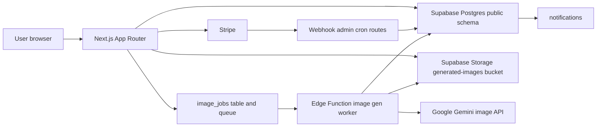

# データ・Supabase アーキテクチャ: Persta.AI

- バージョン: `v1.0`
- 最終確認日: `2026-03-14`
- 想定読者: このリポジトリに新しく参加する開発者
- 対象範囲: Next.js アプリ、Supabase `public` スキーマ、Supabase Storage、Edge Function ワーカー、Stripe 購入フロー
- 参照元:
  - `app/api/**/*.ts`
  - `features/**/lib/**/*.ts`
  - `lib/auth.ts`
  - `lib/supabase/server.ts`
  - `lib/supabase/admin.ts`
  - `supabase/functions/image-gen-worker/index.ts`
  - `supabase/migrations/*.sql`
  - `.cursor/rules/database-design.mdc`
  - `docs/API.md`

## このドキュメントの役割

`.cursor/rules/database-design.mdc` は正確なスキーマ台帳です。  
このファイルは、そのスキーマがアプリ実装の中でどう使われているかを、新規開発者向けに説明する onboarding-first の資料です。

推奨の読み順:

1. このファイルで全体像と主要フローを掴む
2. `.cursor/rules/database-design.mdc` でテーブル、RLS、インデックスの正確な定義を確認する
3. `docs/API.md` で Route Handler の入出力を確認する
4. DB 挙動を変更する時だけ `supabase/migrations/` を読む

## システム概要

Persta.AI は Next.js App Router をベースにした Web アプリで、バックエンドに Supabase を使っています。  
このアプリでは、データアクセスを次の 3 つに分けています。

- `createClient()` と RLS を使う、セッションスコープの読み書き
- `createAdminClient()` と service role を使う、サーバー専用の読み書き
- 複数テーブルに跨る業務処理を SQL 関数と trigger に寄せる方式

重要な設計方針は、単純な CRUD は route handler や server helper に置き、原子的であるべき処理や冪等性が必要な処理は SQL 関数に寄せることです。

## 主な構成要素

| レイヤー | 主な配置 | 役割 | アクセス方式 |
| --- | --- | --- | --- |
| Web ページ / API Routes | `app/` | UI、入力検証、認証チェック、cache revalidate | ユーザーフローは `createClient()`、管理/cron/webhook は `createAdminClient()` |
| 機能別 server helper | `features/**/lib/` | 投稿、課金、生成、マイページなどのドメイン別処理 | 混在 |
| 認証 helper | `lib/auth.ts` | `getUser()`、`requireAuth()`、`requireAdmin()` | Supabase Auth ラッパー |
| ユーザー用 Supabase client | `lib/supabase/server.ts` | セッション付きの Postgres / Storage アクセス | RLS 有効 |
| 管理用 Supabase client | `lib/supabase/admin.ts` | 管理画面、バックグラウンド、cached server component 用 | RLS バイパス |
| Postgres スキーマ | `supabase/migrations/` | テーブル、インデックス、RLS、RPC、trigger | 真の source of truth |
| 画像生成ワーカー | `supabase/functions/image-gen-worker/` | キュー消費、課金、Gemini 呼び出し、結果保存 | service role |

## アクセスモデル

### 1. セッション client: 通常のユーザーフロー

現在のログインユーザーを RLS で保護したい場合は `createClient()` を使います。

代表例:

- `GET /api/generation-status`
- `POST /api/posts/post`
- `POST /api/posts/[id]/comments`
- `GET /api/notifications`

この方式では route handler 側の責務が小さくなり、所有権や可視性の制約を Postgres に任せられます。

### 2. Admin client: 特権処理と cached 読み取り

RLS をバイパスする必要があるサーバー処理では `createAdminClient()` を使います。

代表例:

- 管理画面と管理 API
- Stripe webhook と内部 purge route
- Edge Function ワーカー
- `use cache` 内で cookies を読めない cached server component

実装上の重要ポイント:

- `features/posts/components/CachedPostDetail.tsx`
- `features/notifications/components/CachedNotificationList.tsx`
- `features/my-page/components/CachedMyPageContent.tsx`

これらは `createAdminClient()` を使っています。

そのため:

- 可視性や所有権の条件をアプリ側で再適用する必要があります
- `features/posts/lib/server-api.ts` では、block、report、自分の投稿かどうか、などの条件を再度絞り込んでいます

このリポジトリの管理者認可は二重構成です。

- アプリ側の管理 API は `requireAdmin()` と `ADMIN_USER_IDS` を使う
- 一部の DB RPC は `public.admin_users` も検証する

管理者ユーザーを追加・変更する時は、この 2 つを揃えてください。

### 3. RPC 中心の業務ロジック

複数テーブルに跨る変更や、厳密な冪等性が必要な処理は Postgres RPC に寄せます。

代表例:

- ウォレット更新と課金
- 紹介・特典付与
- 退会予約
- 自動モデレーションと管理者判定
- ストック画像の上限チェック付き INSERT

これはこのリポジトリで採っている Supabase / Postgres のベストプラクティスに沿っています。

- 複数テーブルをまたぐ更新はアプリコードに散らさない
- 冪等性は DB 側で担保する
- クライアントが触るテーブルは RLS で守り、必要な操作だけ RPC で公開する

## ドメイン別マップ

| ドメイン | 主なテーブル | 主な SQL 関数 | 主な入口 |
| --- | --- | --- | --- |
| 新規登録と初期化 | `profiles`, `user_credits`, `credit_transactions`, `free_percoin_batches`, `notifications` | `handle_new_user`, `generate_referral_code` | `auth.users` trigger, `/api/referral/generate` |
| ウォレットと購入 | `user_credits`, `credit_transactions`, `free_percoin_batches`, `generation_percoin_allocations` | `apply_percoin_transaction`, `deduct_free_percoins`, `refund_percoins`, `get_percoin_balance_breakdown` | `/api/credits/checkout`, `/api/stripe/webhook`, マイページ系 cached view |
| 非同期画像生成 | `image_jobs`, `generated_images`, `source_image_stocks`, `credit_transactions` | `deduct_free_percoins`, `refund_percoins`, `insert_source_image_stock`, `pgmq_send/read/delete` | `/api/generate-async`, `/api/generation-status`, Edge Function worker |
| One-Tap Style | `style_presets`, `style_usage_events`, `style_guest_generate_attempts` | `consume_style_authenticated_generate_attempt`, `create_style_preset`, `update_style_preset`, `delete_style_preset_and_reorder`, `reorder_style_presets` | `/style`, `/style/events`, `/style/generate`, `/admin/style-presets`, `/admin` |
| 投稿とソーシャル | `generated_images`, `likes`, `comments`, `follows`, `notifications`, `post_reports`, `user_blocks` | `grant_daily_post_bonus`, `create_notification` | `/api/posts/post`, `/api/posts/[id]/like`, `/api/posts/[id]/comments`, `/api/users/[userId]/follow` |
| 特典とグロース | `percoin_bonus_defaults`, `percoin_streak_defaults`, `referrals`, `notifications`, `free_percoin_batches` | `grant_tour_bonus`, `grant_streak_bonus`, `check_and_grant_referral_bonus_on_first_login_with_reason`, `grant_referral_bonus` | `/api/tutorial/complete`, `/api/streak/check`, `/api/referral/check-first-login` |
| モデレーションと管理 | `post_reports`, `moderation_audit_logs`, `admin_users`, `admin_audit_log`, `generated_images` | `mark_post_pending_by_report`, `apply_admin_moderation_decision`, `grant_admin_bonus`, `deduct_percoins_admin`, `get_user_ids_by_emails` | `/api/reports/posts`, `/api/admin/**` |
| ホーム訴求バナー | `popup_banners`, `popup_banner_views`, `popup_banner_analytics`, `popup_banner_guest_events` | `record_popup_banner_interaction`, `reorder_popup_banners` | `/api/popup-banners/**`, `/api/admin/popup-banners/**`, `/admin/popup-banners` |
| 退会と完全削除 | `profiles`, `credit_forfeiture_ledger`, `generated_images`, `source_image_stocks` | `request_account_deletion`, `cancel_account_deletion`, `get_due_deletion_candidates`, `record_forfeiture_ledger` | `/api/account/deactivate`, `/api/account/reactivate`, `/api/internal/account-purge` |

## 主要フロー 1: 新規登録、初期ボーナス、紹介コード初期化

### 何が起きるか

1. `auth.users` に新しいユーザー行が入る
2. `on_auth_user_created` trigger が `public.handle_new_user()` を呼ぶ
3. `handle_new_user()` が次を作る
   - `profiles`
   - `credit_transactions` の `signup_bonus`
   - 対応する `free_percoin_batches`
   - `user_credits`
   - `notifications` の新規登録ボーナス通知
4. 同じ `handle_new_user()` の中で `generate_referral_code()` を呼び、紹介コードも初期化する
5. 初回ログイン時に `?ref=...` が付いていれば、`/api/referral/check-first-login` が `check_and_grant_referral_bonus_on_first_login_with_reason` を呼ぶ

### 重要な点

- 新規ユーザー初期化は Next.js 側ではなく DB trigger 側にある
- 新規登録ボーナスの仕様を変える時は migration と trigger 関数を最初に見る
- 紹介コードの存在は UI ではなく DB 側で保証されている

## 主要フロー 2: 購入とウォレット更新

### 何が起きるか

1. `/api/credits/checkout` が `packageId` を検証して Stripe Checkout Session を作る
2. Stripe が `/api/stripe/webhook` に `checkout.session.completed` を送る
3. Webhook 側で次を実行する
   - `client_reference_id` から `userId` を取る
   - `payment_intent` を取る
   - `credit_transactions.stripe_payment_intent_id` で冪等性を確認する
   - `recordPercoinPurchase()` を呼ぶ
4. `recordPercoinPurchase()` が `apply_percoin_transaction` を `mode = purchase_paid` で呼ぶ
5. SQL 関数がウォレットと取引台帳を原子的に更新する

### 重要な点

- 購入確定はブラウザのリダイレクト先ではなく webhook 側で行われる
- 冪等性はアプリコードと DB 制約の両方で担保している
- `credit_transactions` は監査台帳、`user_credits` は現在残高のスナップショット

## 主要フロー 3: 非同期画像生成と課金

### 何が起きるか

1. `/api/generate-async` がリクエストを検証する
2. 元画像を以下のどちらかから解決する
   - `sourceImageStockId`
   - Base64 アップロードの一時保存
3. `user_credits` から事前残高チェックを行う
4. `image_jobs` に `status = queued`, `processing_stage = queued` の行を入れる
5. `pgmq_send` でキュー投入し、同時に Edge Function の即時起動も試す
6. Edge Function 側で次を行う
   - `pgmq_read` でキュー取得
   - `image_jobs` を `status = processing`, `processing_stage = processing` に更新
   - `processing_stage = charging` にして `deduct_free_percoins` を実行
   - `processing_stage = generating` にして Gemini を呼ぶ
   - `processing_stage = uploading` にして生成画像を Storage に保存
   - `processing_stage = persisting` にして `generated_images` を INSERT
   - `image_jobs` を `status = succeeded`, `processing_stage = completed` に更新
   - `credit_transactions.related_generation_id` を後で埋める
7. 終端失敗になった場合は `processing_stage = failed` を保存し、`refund_percoins` を 1 回だけ呼ぶ

### 重要な点

- route handler 側の残高チェックは、ユーザーへの早いフィードバックが目的
- 実際の減算は外部副作用に最も近い worker 側が担う
- 返金ロジックも SQL に寄せているため、配分の整合性が保たれる

## 主要フロー 4: 投稿、いいね、コメント、フォロー、通知

### 何が起きるか

1. `/api/posts/post` が `generated_images.is_posted = true` を更新し、必要なら `grant_daily_post_bonus` を呼ぶ
2. いいね、コメント、フォローは基本的に session client から各テーブルへ直接書き込む
3. 通知は通常アプリコードから直接 INSERT しない
4. Postgres trigger が通知の作成・削除を行う
   - `likes` の INSERT / DELETE
   - `comments` の INSERT / DELETE
   - `follows` の INSERT / DELETE
5. `/api/notifications` が通知一覧を取り、actor 情報と投稿サムネイルを付けて返す

### 重要な点

- ソーシャル操作で通知が必要になったら、まず trigger 設計を疑う
- 通知の重複防止は `notifications` の unique index で担保している
- 投稿の見え方には block と report も影響し、cached 読み取りではアプリ側で再フィルタしている

## 主要フロー 5: 通報とモデレーション

### 何が起きるか

1. `/api/reports/posts` が `post_reports` に通報を追加する
2. 同じ route 内で `createAdminClient()` を使い、全通報とアクティブユーザー数を集計する
3. 閾値を超えたら `mark_post_pending_by_report` を呼ぶ
4. その結果 `generated_images.moderation_status` と `moderation_audit_logs` が更新される
5. 管理者は `/api/admin/moderation/posts/[postId]/decision` を呼ぶ
6. その route が `apply_admin_moderation_decision` を呼び、`admin_audit_log` にも記録する

### 重要な点

- 一般ユーザーは RLS により自分の通報しか読めない
- 閾値判定には service role での集計が必要
- `pending / approve / reject` は UI 状態ではなく DB 状態遷移

## 主要フロー 6: 退会予約、復帰、完全削除

### 何が起きるか

1. `/api/account/deactivate` が email/password ユーザーを再認証し、`request_account_deletion` を呼ぶ
2. RPC が削除予定を設定し、プロフィールのライフサイクル項目を更新する
3. `/api/account/reactivate` が `cancel_account_deletion` を呼ぶ
4. secret 保護された `/api/internal/account-purge` が定期実行され、次を行う
   - `get_due_deletion_candidates` で対象を取る
   - Storage 上の資産を削除する
   - `credit_forfeiture_ledger` を記録する
   - Admin API で Auth ユーザーを削除する

### 重要な点

- ユーザー操作の退会はソフト状態
- 実際の破壊的削除は別の運用フロー
- purge は Auth、Storage、プロフィール、生成画像、ウォレット監査を横断する

## 重要な実装契約

新規開発者が壊しやすい主要フローを、EARS 風の要約で整理します。

### GEN-ASYNC-001

- `ears`: 認証済みユーザーが有効な生成リクエストを送信したとき、システムは `image_jobs` レコードを作成してキュー投入し、そのジョブに対して最終的にただ1つの終端結果を確定しなければならない。
- `preconditions`: 認証済みセッションであること。リクエストが妥当であること。元画像がストックまたはアップロードから解決できること。事前残高チェックを満たすこと。
- `postconditions`: 成功時は `generated_images` が追加され、`image_jobs.status = succeeded` となり、消費トランザクションが生成画像に紐づく。終端失敗時はジョブが `failed` で確定し、返金が1回だけ試行される。

### BILLING-STRIPE-001

- `ears`: Stripe が `checkout.session.completed` を通知したとき、システムは購入結果をユーザーのウォレットへ厳密に1回だけ反映しなければならない。
- `preconditions`: Stripe 署名が有効であること。`client_reference_id` が存在すること。`payment_intent` が存在すること。購入量が metadata か price mapping から解決できること。
- `postconditions`: `purchase` 取引が記録され、`user_credits` が増加し、Webhook の重複配信では二重付与されない。

### SOCIAL-NOTIFY-001

- `ears`: いいね、コメント、フォローの行が追加または削除されたとき、システムは対応する通知行を同期した状態に保たなければならない。
- `preconditions`: 対応するソーシャル行が RLS を通過し、正常にコミットされること。
- `postconditions`: 追加時は trigger により通知が作成され、削除時は対応する通知が削除される。通知作成に失敗してもソーシャル操作自体は成功を維持する。

### ACCOUNT-PURGE-001

- `ears`: ユーザーが削除予定時刻に到達した場合、システムは内部 purge ジョブによってアカウントを削除し、Auth 削除前にウォレット失効記録を残さなければならない。
- `preconditions`: Bearer secret 付きの内部リクエストであること。`get_due_deletion_candidates` が候補を返すこと。service role アクセスが利用可能であること。
- `postconditions`: Storage 資産が削除され、失効台帳が記録され、Auth ユーザーが削除される。失敗はユーザー単位で分離され、バッチレスポンスに報告される。

## アプリから使う主要 RPC カタログ

新規開発者が触る可能性の高い SQL 関数だけを抜粋します。

| RPC | 主な呼び出し元 | 引数 | 戻り値 | 主な副作用 |
| --- | --- | --- | --- | --- |
| `apply_percoin_transaction` | `features/credits/lib/percoin-service.ts` | user, amount, mode, metadata, payment intent, generation id | `balance`, `from_promo`, `from_paid` | 購入/消費の原子的なウォレット更新 |
| `deduct_free_percoins` | Edge Function worker | user, amount, metadata, generation id | `balance`, `from_promo`, `from_paid` | 残高減算と consumption 台帳記録 |
| `refund_percoins` | Edge Function worker | user, amount, refund split, job id, metadata | `void` | 終端失敗時の返金 |
| `grant_tour_bonus` | `/api/tutorial/complete` | user | `amount_granted`, `already_completed` | チュートリアル特典の冪等付与 |
| `grant_daily_post_bonus` | `/api/posts/post` | user, generation | `integer` | デイリー投稿特典の冪等付与 |
| `grant_streak_bonus` | `/api/streak/check` | user | `integer` | `profiles` のストリーク更新と特典付与 |
| `check_and_grant_referral_bonus_on_first_login_with_reason` | `/api/referral/check-first-login` | user, referral code | `bonus_granted`, `reason_code` | 紹介成立判定と一度きりの付与 |
| `generate_referral_code` | `/api/referral/generate`, `handle_new_user` | user | `text` | 紹介コードの永続化 |
| `insert_source_image_stock` | `/api/source-image-stocks` | user, image URL, storage path, display name | `source_image_stocks` row | 上限チェック付きの原子的 INSERT |
| `get_percoin_balance_breakdown` | マイページ、課金 UI | user | bucket ごとの残高 | ウォレット UI 向け read model |
| `get_free_percoin_batches_expiring` | `/api/credits/free-percoin-expiring` | user | 失効間近の batch 一覧 | 失効警告 UI 向け read model |
| `get_expiring_this_month_count` | `/api/credits/free-percoin-expiring` | user | `expiring_this_month` | バッジ/件数表示向け read model |
| `get_percoin_transactions_with_expiry` | 取引履歴 UI | user, filter, sort, limit, offset | `expire_at` 付き取引一覧 | 履歴画面向け read model |
| `get_percoin_transactions_count` | 取引履歴 UI | user, filter | `integer` | ページネーション用 count |
| `grant_admin_bonus` | `/api/admin/bonus/grant`, `/api/admin/bonus/grant-batch` | user, amount, reason, admin, notify flag, balance type | `amount_granted`, `transaction_id` | 通知付き管理者付与 |
| `deduct_percoins_admin` | `/api/admin/deduction` | user, amount, balance type, idempotency key, metadata | `balance`, `amount_deducted` | 冪等性付き管理者減算 |
| `get_user_ids_by_emails` | 一括 lookup / 一括付与 | email array | `email`, `user_id`, `balance` | 管理者用の一括検索 helper |
| `mark_post_pending_by_report` | `/api/reports/posts` | post, actor, reason, metadata | `boolean` | 投稿を pending にし、審査ログを書き込む |
| `apply_admin_moderation_decision` | `/api/admin/moderation/posts/[postId]/decision` | post, actor, action, reason, time, metadata | `boolean` | 最終審査の反映 |
| `request_account_deletion` | `/api/account/deactivate` | user, confirm text, reauth ok | `status`, `scheduled_for` | 退会予約の設定 |
| `cancel_account_deletion` | `/api/account/reactivate` | user | `status` | 退会予約の取り消し |
| `get_due_deletion_candidates` | `/api/internal/account-purge` | limit | 対象ユーザー一覧 | purge 対象列挙 |
| `record_forfeiture_ledger` | `/api/internal/account-purge` | user, email hash, deleted time | `void` | ウォレット失効台帳の記録 |

## Trigger 一覧

| Trigger 元 | Trigger 関数 | 役割 |
| --- | --- | --- |
| `auth.users` `AFTER INSERT` | `handle_new_user()` | プロフィール、初期ボーナス、初期通知、紹介コードの bootstrap |
| `likes` `AFTER INSERT` | `notify_on_like()` | いいね通知作成 |
| `likes` `AFTER DELETE` | `delete_notification_on_like_removal()` | いいね解除時の通知削除 |
| `comments` `AFTER INSERT` | `notify_on_comment()` | コメント通知作成 |
| `comments` `AFTER DELETE` | `delete_notification_on_comment_deletion()` | コメント削除時の通知削除 |
| `follows` `AFTER INSERT` | `notify_on_follow()` | フォロー通知作成 |
| `follows` `AFTER DELETE` | `delete_notification_on_follow_removal()` | フォロー解除時の通知削除 |
| `generated_images` `AFTER INSERT` | `update_stock_image_last_used()` | 元画像ストックの利用状況更新 |
| `comments`, `image_jobs`, `profiles`, `source_image_stocks`, `user_credits` `BEFORE UPDATE` | `update_updated_at_column()` | 汎用 `updated_at` 更新 |
| `notification_preferences` `BEFORE UPDATE` | `update_notification_preferences_updated_at()` | 通知設定の更新時刻管理 |
| `banners` `BEFORE UPDATE` | `update_banners_updated_at()` | バナー更新時刻管理 |
| `materials_images` `BEFORE UPDATE` | `update_materials_images_updated_at()` | 素材画像更新時刻管理 |
| `style_presets` `BEFORE UPDATE` | `update_updated_at_column()` | One-Tap Style プリセット更新時刻管理 |

## 開発判断のための RLS 要約

新しい機能を作る時に、session client で良いか、service role が必要か、新しい RPC にすべきかを判断するための要約です。

### session client で扱いやすいテーブル

| テーブル | 典型的なアクセス |
| --- | --- |
| `profiles` | 公開 SELECT、本人 INSERT/UPDATE |
| `generated_images` | 投稿済み visible は公開 SELECT、それ以外は本人 CRUD |
| `image_jobs` | 本人 CRUD |
| `source_image_stocks` | 本人 CRUD |
| `likes` | 公開 SELECT、本人 INSERT/DELETE |
| `comments` | 公開 SELECT、本人書き込み |
| `follows` | 当事者 SELECT、本人書き込み |
| `notifications` | 受信者の read/update/delete、直接 insert 禁止 |
| `notification_preferences` | 本人 `ALL` |
| `push_subscriptions` | 本人 `ALL` |
| `user_credits` | 本人 SELECT |
| `credit_transactions` | 本人 SELECT |
| `free_percoin_batches` | 本人 SELECT |
| `free_percoin_expiration_log` | 本人 SELECT |
| `referrals` | 当事者 SELECT、被紹介者 INSERT |
| `post_reports` | 通報者本人のみ read/write |
| `user_blocks` | 関係者 SELECT、blocker が write |

### 公開コンテンツ系テーブル

| テーブル | アクセス |
| --- | --- |
| `banners` | 公開 SELECT のみ |
| `materials_images` | 公開 SELECT のみ |
| `style_presets` | `published` のみ公開 SELECT |

### service role / RPC 向けテーブル

| テーブル | 理由 |
| --- | --- |
| `generation_percoin_allocations` | 内部課金配分の明細 |
| `percoin_bonus_defaults` | 運用設定テーブル |
| `percoin_streak_defaults` | 運用設定テーブル |
| `credit_forfeiture_ledger` | 監査専用で、直接公開アクセス禁止 |
| `admin_users` | DB 側の管理者権限ソース |
| `admin_audit_log` | 管理操作監査 |
| `moderation_audit_logs` | 運用監査。参照はできても管理フロー経由で扱うべき |
| `style_usage_events` | One-Tap Style の利用ログ。authenticated / guest を区別して service role 経由で記録し、Admin 集計では訪問・生成成功・ダウンロード・上限超過リクエストを集計する。authenticated の日次制限は RPC `consume_style_authenticated_generate_attempt()` で `generate_attempt` を原子的に消費する |
| `style_guest_generate_attempts` | guest の `/style/generate` を IP hash ベースで `1分2回 / 1日3回` に制限する内部テーブル |
| `style_presets` | One-Tap Style の管理プリセット。admin route は service role + RPC で create/update/delete/reorder を原子的に処理し、公開側は `published` のみ参照する。現在は `styling_prompt` と任意の `background_prompt` を持ち、背景変更 UI と generate route がそれぞれ参照する |

## 変更ガイド: 何を変える時にどこから読むか

| 変更したい内容 | 最初に見る場所 | 次に見る場所 |
| --- | --- | --- |
| 新規登録、ストリーク、チュートリアル、紹介の付与量 | `percoin_bonus_defaults`, `percoin_streak_defaults`, 関連 migration | `/api/tutorial/complete`, `/api/streak/check`, `/api/referral/check-first-login`, ウォレット UI |
| 購入フローや package mapping | `app/api/credits/checkout/route.ts`, `app/api/stripe/webhook/route.ts` | `features/credits/lib/percoin-service.ts`, 関連 migration と index |
| 生成リクエストや課金タイミング | `app/api/generate-async/handler.ts` | `supabase/functions/image-gen-worker/index.ts`, wallet RPC |
| 生成画像のフィールド | 最新 migration と `generated_images` の参照箇所 | gallery、post detail、検索、worker の insert |
| ソーシャル通知の挙動 | 通知 trigger の migration | 各 social route と `app/api/notifications/route.ts` |
| モデレーション閾値や判定ロジック | `app/api/reports/posts/route.ts` | moderation RPC、管理者判定 route、監査テーブル |
| 退会や purge | account route と purge route | 退会 RPC、`credit_forfeiture_ledger`、Storage cleanup |
| 新しい管理者操作 | `requireAdmin()` を使う route | `createAdminClient()`, 監査ログ、RLS 影響 |

## 新規開発者向け実務ルール

1. ウォレット更新を ad hoc な `.update()` で書かない。既存 RPC を使うか拡張する。
2. ユーザーフローで `createAdminClient()` を使うなら、可視性や所有権の条件を必ず再適用する。
3. Storage、queue、Postgres を跨ぐ処理では、最終状態を誰が確定するかを明文化する。
4. ソーシャル操作に通知が必要なら、まず DB trigger を使う設計を考える。
5. 冪等性が必要な route は、最初に DB 側の unique key / unique index を考える。
6. `generated_images` を触る変更では、モデレーション、通知、マイページ、検索、管理画面まで確認する。

## 関連ドキュメント

- スキーマ詳細: `../../.cursor/rules/database-design.mdc`
- API 詳細: `../../docs/API.md`
- migration の source of truth: `../../supabase/migrations/`
- ワーカー実装: `../../supabase/functions/image-gen-worker/index.ts`
- 認証 helper: `../../lib/auth.ts`
- Supabase client: `../../lib/supabase/server.ts`, `../../lib/supabase/admin.ts`
- 投稿系 helper: `../../features/posts/lib/server-api.ts`
- 課金 service: `../../features/credits/lib/percoin-service.ts`
