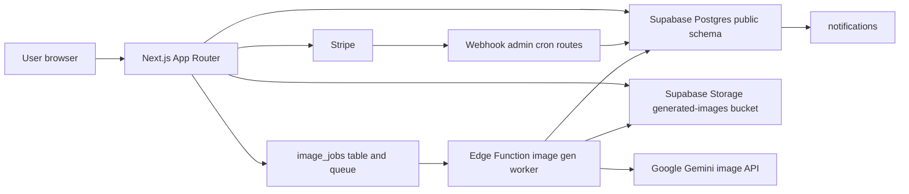

# データ・Supabase アーキテクチャ: Persta.AI

- バージョン: `v1.0`
- 最終確認日: `2026-03-14`
- 想定読者: このリポジトリに新しく参加する開発者
- 対象範囲: Next.js アプリ、Supabase `public` スキーマ、Supabase Storage、Edge Function ワーカー、Stripe 購入フロー
- 参照元:
  - `app/api/**/*.ts`
  - `features/**/lib/**/*.ts`
  - `lib/auth.ts`
  - `lib/supabase/server.ts`
  - `lib/supabase/admin.ts`
  - `supabase/functions/image-gen-worker/index.ts`
  - `supabase/migrations/*.sql`
  - `.cursor/rules/database-design.mdc`
  - `docs/API.md`

## このドキュメントの役割

`.cursor/rules/database-design.mdc` は正確なスキーマ台帳です。  
このファイルは、そのスキーマがアプリ実装の中でどう使われているかを、新規開発者向けに説明する onboarding-first の資料です。

推奨の読み順:

1. このファイルで全体像と主要フローを掴む
2. `.cursor/rules/database-design.mdc` でテーブル、RLS、インデックスの正確な定義を確認する
3. `docs/API.md` で Route Handler の入出力を確認する
4. DB 挙動を変更する時だけ `supabase/migrations/` を読む

## システム概要

Persta.AI は Next.js App Router をベースにした Web アプリで、バックエンドに Supabase を使っています。  
このアプリでは、データアクセスを次の 3 つに分けています。

- `createClient()` と RLS を使う、セッションスコープの読み書き
- `createAdminClient()` と service role を使う、サーバー専用の読み書き
- 複数テーブルに跨る業務処理を SQL 関数と trigger に寄せる方式

重要な設計方針は、単純な CRUD は route handler や server helper に置き、原子的であるべき処理や冪等性が必要な処理は SQL 関数に寄せることです。

```mermaid
graph LR
  browser[User browser] --> nextjs[Next.js App Router]
  nextjs --> db[Supabase Postgres public schema]
  nextjs --> storage[Supabase Storage generated-images bucket]
  nextjs --> stripe[Stripe]
  stripe --> webhook[Webhook admin cron routes]
  webhook --> db
  nextjs --> jobs[image_jobs table and queue]
  jobs --> worker[Edge Function image gen worker]
  worker --> gemini[Google Gemini image API]
  worker --> db
  worker --> storage
  db --> notif[notifications]
```

## 主な構成要素

| レイヤー | 主な配置 | 役割 | アクセス方式 |
| --- | --- | --- | --- |
| Web ページ / API Routes | `app/` | UI、入力検証、認証チェック、cache revalidate | ユーザーフローは `createClient()`、管理/cron/webhook は `createAdminClient()` |
| 機能別 server helper | `features/**/lib/` | 投稿、課金、生成、マイページなどのドメイン別処理 | 混在 |
| 認証 helper | `lib/auth.ts` | `getUser()`、`requireAuth()`、`requireAdmin()` | Supabase Auth ラッパー |
| ユーザー用 Supabase client | `lib/supabase/server.ts` | セッション付きの Postgres / Storage アクセス | RLS 有効 |
| 管理用 Supabase client | `lib/supabase/admin.ts` | 管理画面、バックグラウンド、cached server component 用 | RLS バイパス |
| Postgres スキーマ | `supabase/migrations/` | テーブル、インデックス、RLS、RPC、trigger | 真の source of truth |
| 画像生成ワーカー | `supabase/functions/image-gen-worker/` | キュー消費、課金、Gemini 呼び出し、結果保存 | service role |

## アクセスモデル

### 1. セッション client: 通常のユーザーフロー

現在のログインユーザーを RLS で保護したい場合は `createClient()` を使います。

代表例:

- `GET /api/generation-status`
- `POST /api/posts/post`
- `POST /api/posts/[id]/comments`
- `GET /api/notifications`

この方式では route handler 側の責務が小さくなり、所有権や可視性の制約を Postgres に任せられます。

### 2. Admin client: 特権処理と cached 読み取り

RLS をバイパスする必要があるサーバー処理では `createAdminClient()` を使います。

代表例:

- 管理画面と管理 API
- Stripe webhook と内部 purge route
- Edge Function ワーカー
- `use cache` 内で cookies を読めない cached server component

実装上の重要ポイント:

- `features/posts/components/CachedPostDetail.tsx`
- `features/notifications/components/CachedNotificationList.tsx`
- `features/my-page/components/CachedMyPageContent.tsx`

これらは `createAdminClient()` を使っています。

そのため:

- 可視性や所有権の条件をアプリ側で再適用する必要があります
- `features/posts/lib/server-api.ts` では、block、report、自分の投稿かどうか、などの条件を再度絞り込んでいます

このリポジトリの管理者認可は二重構成です。

- アプリ側の管理 API は `requireAdmin()` と `ADMIN_USER_IDS` を使う
- 一部の DB RPC は `public.admin_users` も検証する

管理者ユーザーを追加・変更する時は、この 2 つを揃えてください。

### 3. RPC 中心の業務ロジック

複数テーブルに跨る変更や、厳密な冪等性が必要な処理は Postgres RPC に寄せます。

代表例:

- ウォレット更新と課金
- 紹介・特典付与
- 退会予約
- 自動モデレーションと管理者判定
- ストック画像の上限チェック付き INSERT

これはこのリポジトリで採っている Supabase / Postgres のベストプラクティスに沿っています。

- 複数テーブルをまたぐ更新はアプリコードに散らさない
- 冪等性は DB 側で担保する
- クライアントが触るテーブルは RLS で守り、必要な操作だけ RPC で公開する

## ドメイン別マップ

| ドメイン | 主なテーブル | 主な SQL 関数 | 主な入口 |
| --- | --- | --- | --- |
| 新規登録と初期化 | `profiles`, `user_credits`, `credit_transactions`, `free_percoin_batches`, `notifications` | `handle_new_user`, `generate_referral_code` | `auth.users` trigger, `/api/referral/generate` |
| ウォレットと購入 | `user_credits`, `credit_transactions`, `free_percoin_batches`, `generation_percoin_allocations` | `apply_percoin_transaction`, `deduct_free_percoins`, `refund_percoins`, `get_percoin_balance_breakdown` | `/api/credits/checkout`, `/api/stripe/webhook`, マイページ系 cached view |
| 非同期画像生成 | `image_jobs`, `generated_images`, `source_image_stocks`, `credit_transactions` | `deduct_free_percoins`, `refund_percoins`, `insert_source_image_stock`, `pgmq_send/read/delete` | `/api/generate-async`, `/api/generation-status`, Edge Function worker |
| One-Tap Style | `style_presets`, `style_usage_events`, `style_guest_generate_attempts`, `image_jobs` | `reserve_style_authenticated_generate_attempt`, `release_style_authenticated_generate_attempt`, `reserve_style_guest_generate_attempt`, `release_style_guest_generate_attempt`, `attach_style_authenticated_generate_attempt_job`, `create_style_preset`, `update_style_preset`, `delete_style_preset_and_reorder`, `reorder_style_presets` | `/style`, `/style/events`, `/style/generate`, `/style/generate-async`, `/admin/style-presets`, `/admin` |
| コレクション | `preset_categories`, `image_jobs`, `collection_completions`, Storage `collection-mount-templates` / `generated-images` | `get_collection_progress`, `reserve_collection_completion`, `finalize_collection_completion`, `fail_collection_completion` | `/api/collections/progress`, `/api/collections/mount`, `/m/[token]`, `/admin/collections`, `/admin/preset-categories` |
| 投稿とソーシャル | `generated_images`, `likes`, `comments`, `follows`, `notifications`, `post_reports`, `user_blocks` | `grant_daily_post_bonus`, `create_notification`, `delete_comment_thread` | `/api/posts/post`, `/api/posts/[id]/like`, `/api/posts/[id]/comments`, `/api/users/[userId]/follow` |
| 特典とグロース | `percoin_bonus_defaults`, `percoin_streak_defaults`, `referrals`, `notifications`, `free_percoin_batches` | `grant_tour_bonus`, `grant_streak_bonus`, `check_and_grant_referral_bonus_on_first_login_with_reason`, `grant_referral_bonus` | `/api/tutorial/complete`, `/api/streak/check`, `/api/referral/check-first-login` |
| モデレーションと管理 | `post_reports`, `moderation_audit_logs`, `moderation_notification_outbox`, `post_moderation_appeals`, `admin_users`, `admin_audit_log`, `generated_images` | `mark_post_pending_by_report`, `apply_admin_moderation_decision_v2`, `dispatch_moderation_notification_outbox`, `create_post_moderation_appeal`, `decide_post_moderation_appeal`, `grant_admin_bonus`, `deduct_percoins_admin`, `get_user_ids_by_emails` | `/api/reports/posts`, `/api/moderation/appeals`, `/api/admin/**` |
| ホーム訴求バナー | `popup_banners`, `popup_banner_views`, `popup_banner_analytics`, `popup_banner_guest_events` | `record_popup_banner_interaction`, `reorder_popup_banners` | `/api/popup-banners/**`, `/api/admin/popup-banners/**`, `/admin/popup-banners` |
| 退会と完全削除 | `profiles`, `credit_forfeiture_ledger`, `generated_images`, `source_image_stocks` | `request_account_deletion`, `cancel_account_deletion`, `get_due_deletion_candidates`, `record_forfeiture_ledger` | `/api/account/deactivate`, `/api/account/reactivate`, `/api/internal/account-purge` |
| Inspire (ユーザー投稿スタイルテンプレ) | `user_style_templates`, `user_style_template_preview_attempts`, `style_template_audit_logs`, `image_jobs` (拡張列), `generated_images` (拡張列), `notifications` (拡張) | `apply_user_style_template_decision`, `promote_user_style_template_draft`, `create_user_style_template_draft`, `enforce_user_style_template_submission_cap` | `/api/style-templates/**`, `/api/admin/style-templates/**`, `/api/generate-async` (inspire 経路), `/inspire/[templateId]`, `/admin/style-templates`, ホーム (env で gate) |
| 絵師カタログ | `catalog_campaigns`, `catalog_entries`, `catalog_public_entries` view, `catalog_audit_logs`, `notifications` (拡張), Storage `catalog-images` | `apply_catalog_entry_decision`, `enforce_catalog_entry_submission_cap` | `/catalog`, `/catalog/[slug]`, `/catalog/submit`, `/api/catalog/**`, `/api/admin/catalog/**`, `/admin/catalog/**` |

## 主要フロー 1: 新規登録、初期ボーナス、紹介コード初期化

### 何が起きるか

1. `auth.users` に新しいユーザー行が入る
2. `on_auth_user_created` trigger が `public.handle_new_user()` を呼ぶ
3. `handle_new_user()` が次を作る
   - `profiles`
   - `credit_transactions` の `signup_bonus`
   - 対応する `free_percoin_batches`
   - `user_credits`
   - `notifications` の新規登録ボーナス通知
4. 同じ `handle_new_user()` の中で `generate_referral_code()` を呼び、紹介コードも初期化する
5. 初回ログイン時に `?ref=...` が付いていれば、`/api/referral/check-first-login` が `check_and_grant_referral_bonus_on_first_login_with_reason` を呼ぶ

### 重要な点

- 新規ユーザー初期化は Next.js 側ではなく DB trigger 側にある
- 新規登録ボーナスの仕様を変える時は migration と trigger 関数を最初に見る
- 紹介コードの存在は UI ではなく DB 側で保証されている

## 主要フロー 2: 購入とウォレット更新

### 何が起きるか

1. `/api/credits/checkout` が `packageId` を検証して Stripe Checkout Session を作る
2. Stripe が `/api/stripe/webhook` に `checkout.session.completed` を送る
3. Webhook 側で次を実行する
   - `client_reference_id` から `userId` を取る
   - `payment_intent` を取る
   - `credit_transactions.stripe_payment_intent_id` で冪等性を確認する
   - `recordPercoinPurchase()` を呼ぶ
4. `recordPercoinPurchase()` が `apply_percoin_transaction` を `mode = purchase_paid` で呼ぶ
5. SQL 関数がウォレットと取引台帳を原子的に更新する

### 重要な点

- 購入確定はブラウザのリダイレクト先ではなく webhook 側で行われる
- 冪等性はアプリコードと DB 制約の両方で担保している
- `credit_transactions` は監査台帳、`user_credits` は現在残高のスナップショット

## 主要フロー 3: 非同期画像生成と課金

### 何が起きるか

1. `/api/generate-async` がリクエストを検証する
2. 元画像を以下のどちらかから解決する
   - `sourceImageStockId`
   - Base64 アップロードの一時保存
3. `user_credits` から事前残高チェックを行う
4. `image_jobs` に `status = queued`, `processing_stage = queued` の行を入れる。OpenAI バッチ生成では `requested_image_count` に受理枚数を保持し、ワンタップスタイルのカード情報など後続UIで復元したい内容は `generation_metadata` に保持する
5. `pgmq_send` でキュー投入し、同時に Edge Function の即時起動も試す
6. Edge Function 側で次を行う
   - `pgmq_read` でキュー取得
   - `image_jobs` を `status = processing`, `processing_stage = processing` に更新
   - `processing_stage = charging` にして、課金が必要なジョブのみ `deduct_free_percoins` を実行
   - `processing_stage = generating` にして Gemini または OpenAI Images Edit API を呼ぶ。OpenAI バッチでは 1 回の API 呼び出しに `n=requested_image_count` を渡す
   - `processing_stage = uploading` にして生成画像を Storage に保存する。OpenAI バッチでは同一 `jobId` 配下に result index 付きのファイル名で複数保存する
   - `processing_stage = persisting` にして、Gemini / OpenAIの両方を `complete_image_job_with_prompt_secrets` RPC で確定する。同RPCが `generated_images` とauthor secretの作成、`image_jobs` 成功更新、`credit_transactions.related_generation_id` の更新を 1 transaction に閉じる。競合で今回のStorage uploadが採用されなかった場合は、RPCが返した `storage_path` との差分を削除する
7. 終端失敗になった場合は `processing_stage = failed` を保存し、記録済み消費トランザクションの金額で冪等な `refund_percoins` または無料枠releaseを実行する。課金後処理が失敗した場合はqueue messageを残し、failed再配送をreconciliationとして同じ処理を繰り返す

### 重要な点

- route handler 側の残高チェックは、ユーザーへの早いフィードバックが目的
- 実際の減算は外部副作用に最も近い worker 側が担う
- 返金ロジックも SQL に寄せているため、配分の整合性が保たれる
- reconciliation時も現在のモデル料金表から再計算せず、減算時の`credit_transactions.amount`を返金額の正本にする
- OpenAI バッチは all-or-nothing。返却枚数不足や永続化失敗は job 失敗 + 全額返金扱いにし、部分成功の保存・課金はしない

## 主要フロー 4: 投稿、いいね、コメント、フォロー、通知

### 何が起きるか

1. `/api/posts/post` が `generated_images.is_posted = true` を更新し、必要なら `grant_daily_post_bonus` を呼ぶ
2. いいねとフォローは基本的に session client から各テーブルへ直接書き込む。コメントは `comments.parent_comment_id` で親子構造を持ち、親コメント削除の意味論は `delete_comment_thread` RPC に集約される。親に返信が残る間は tombstone を返し、最後の返信が消えた時点で tombstone 親も物理削除する。返信への返信（引用リプライ）は `comments.reply_to_comment_id` の参照で表現する（1階層フラット構造は維持）。「同一スレッド内の返信のみ引用可・親コメント引用不可」は `validate_parent_comment` trigger が強制し、引用先が物理削除されると `mark_reply_to_deleted` trigger が `reply_to_deleted = true` を立ててから FK が参照を NULL 化する（通常返信と削除済み引用を区別可能）。引用リプライの通知は引用先の作成者のみに届き、親コメント作成者には届かない
3. 通知は通常アプリコードから直接 INSERT しない
4. Postgres trigger が通知の作成・削除に加えて、`comments.last_activity_at` の維持と reply lifecycle の Broadcast を行う
   - `likes` の INSERT / DELETE
   - `comments` の INSERT / DELETE
   - `follows` の INSERT / DELETE
5. `/api/notifications` が通知一覧を取り、actor 情報と投稿サムネイルを付けて返す

### 重要な点

- ソーシャル操作で通知が必要になったら、まず trigger 設計を疑う
- 通知の重複防止は `notifications` の unique index で担保している
- 投稿の見え方には block と report も影響し、cached 読み取りではアプリ側で再フィルタしている

## 主要フロー 5: 通報とモデレーション

### 何が起きるか

1. `/api/reports/posts` が `post_reports` に通報を追加する
2. 同じ route 内で `createAdminClient()` を使い、全通報とアクティブユーザー数を集計する
3. 閾値を超えたら `mark_post_pending_by_report` を呼ぶ（**service_role クライアント経由**。同 RPC は service_role 専用）
4. その結果 `generated_images.moderation_status` と `moderation_audit_logs` が更新される
5. 管理者は `/api/admin/moderation/posts/[postId]/decision` を呼ぶ
6. その route が `apply_admin_moderation_decision_v2` を呼び、状態更新・`moderation_audit_logs`・`moderation_notification_outbox` を同一トランザクションで確定し、`admin_audit_log` にも記録する
7. `dispatch_moderation_notification_outbox` が outbox から `notifications` へ配送する（route が best effort で呼び、`pg_cron` が毎分再試行）
8. 投稿者は通知から `/my-page/moderation/decisions/[decisionId]` へ遷移し、`create_post_moderation_appeal` RPC で異議を申し立てられる
9. 管理者が `decide_post_moderation_appeal` で判定する。`overturn` は投稿の `visible` 復帰まで同一トランザクションで行う

### 重要な点

- 一般ユーザーは RLS により自分の通報しか読めない
- 閾値判定には service role での集計が必要
- `pending / approve / reject` は UI 状態ではなく DB 状態遷移

## 主要フロー 6: 退会予約、復帰、完全削除

### 何が起きるか

1. `/api/account/deactivate` が email/password ユーザーを再認証し、`request_account_deletion` を呼ぶ
2. RPC が削除予定を設定し、プロフィールのライフサイクル項目を更新する
3. `/api/account/reactivate` が `cancel_account_deletion` を呼ぶ
4. secret 保護された `/api/internal/account-purge` が定期実行され、次を行う
   - `get_due_deletion_candidates` で対象を取る
   - Storage 上の資産を削除する
   - `credit_forfeiture_ledger` を記録する
   - Admin API で Auth ユーザーを削除する

### 重要な点

- ユーザー操作の退会はソフト状態
- 実際の破壊的削除は別の運用フロー
- purge は Auth、Storage、プロフィール、生成画像、ウォレット監査を横断する

## 重要な実装契約

新規開発者が壊しやすい主要フローを、EARS 風の要約で整理します。

### GEN-ASYNC-001

- `ears`: 認証済みユーザーが有効な生成リクエストを送信したとき、システムは `image_jobs` レコードを作成してキュー投入し、そのジョブに対して最終的にただ1つの終端結果を確定しなければならない。
- `preconditions`: 認証済みセッションであること。リクエストが妥当であること。元画像がストックまたはアップロードから解決できること。事前残高チェックを満たすこと。
- `postconditions`: 成功時は `generated_images` が 1 件以上追加され、`image_jobs.status = succeeded` となり、消費トランザクションが生成画像に紐づく。OpenAI バッチでは `generated_images.image_job_id` が集計キーになる。終端失敗時はジョブが `failed` で確定し、返金が1回だけ試行される。

### PROMPT-SECRECY-001

- `ears`: システムはプロンプト本文をユーザーが読める行（`generated_images.prompt` / `image_jobs.prompt_text`）へ保存してはならず、本文は service-only の `generated_image_prompt_secrets`（原作者入力）と `generation_prompt_snapshots`（生成実行入力）にのみ存在しなければならない。
- `preconditions`: job 作成は `create_image_job_with_prompt_execution`（job と実行入力を同一トランザクションで作成）、完了は `complete_image_job_with_prompt_secrets`（画像・author secret・job 成功・課金紐づけを同一トランザクションで確定）を通ること。
- `postconditions`: 公開列は `CHECK (prompt = '')` で常に空（service_role でも非空は書けない）。読み取りは `resolveVisiblePrompts`（サーバー）経由で fail closed（secret が無ければ空。legacy 列へのフォールバック禁止）。`/free` の本文は一覧 payload から無条件で落とし（`stripFreePromptsForList`）、詳細 payload には本人と管理者にだけ載せる。第三者は `/api/posts/[id]/prompt-text`（公開のみ・フォロワー限定）で取る。派生生成はクライアントから `sourcePostId` のみを受け取り、本文は Worker が provider 送信直前に `resolve_derived_prompt_source` で解決してメモリ上でのみ使う。認可は API の job 作成前・Worker の減算前・完了 RPC の画像 INSERT 前の3ヶ所で `validate_derived_prompt_source` により再検証され、完了時に失効していた場合は成果物を破棄して返金する。
- 関連: `docs/planning/free-prompt-private-mode-implementation-plan.md`（ADR-001〜ADR-011）、`tests/unit/features/generation/prompt-read-paths.test.ts`（未経由の読み取り経路を機械検出）。

### BILLING-STRIPE-001

- `ears`: Stripe が `checkout.session.completed` を通知したとき、システムは購入結果をユーザーのウォレットへ厳密に1回だけ反映しなければならない。
- `preconditions`: Stripe 署名が有効であること。`client_reference_id` が存在すること。`payment_intent` が存在すること。購入量が metadata か price mapping から解決できること。
- `postconditions`: `purchase` 取引が記録され、`user_credits` が増加し、Webhook の重複配信では二重付与されない。

### SOCIAL-NOTIFY-001

- `ears`: いいね、コメント、フォローの行が追加または削除されたとき、システムは対応する通知行を同期した状態に保たなければならない。
- `preconditions`: 対応するソーシャル行が RLS を通過し、正常にコミットされること。
- `postconditions`: 追加時は trigger により通知が作成され、削除時は対応する通知が削除される。通知作成に失敗してもソーシャル操作自体は成功を維持する。

### ACCOUNT-PURGE-001

- `ears`: ユーザーが削除予定時刻に到達した場合、システムは内部 purge ジョブによってアカウントを削除し、Auth 削除前にウォレット失効記録を残さなければならない。
- `preconditions`: Bearer secret 付きの内部リクエストであること。`get_due_deletion_candidates` が候補を返すこと。service role アクセスが利用可能であること。
- `postconditions`: Storage 資産が削除され、失効台帳が記録され、Auth ユーザーが削除される。失敗はユーザー単位で分離され、バッチレスポンスに報告される。

### INSPIRE-SUBMIT-001

- `ears`: ホワイトリスト済み認証ユーザーが申請プレビューを要求したとき、システムは draft 行を作成し、運営テストキャラ画像と組み合わせて OpenAI と Gemini で並列に 1 枚ずつ生成し、結果を Storage に保存して draft 行を更新しなければならない。
- `preconditions`: 認証済みかつ `INSPIRE_SUBMISSION_ALLOWED_USER_IDS` 内（ADR-010 の fail-open）。直近 24h で 10 回未満の試行（REQ-S-03）。アップロード画像が PNG/JPEG/WebP/HEIC で 10MB 以下。`INSPIRE_TEST_CHARACTER_IMAGE_URL` が解決可能。
- `postconditions`: 全失敗時は draft 行と Storage オブジェクトを削除し 4xx/500 を返す。片方成功時は draft を残して `partial`、両方成功時は `success` を返す。preview 画像はすべて private bucket `style-templates` に格納され、`user_style_template_preview_attempts` に試行を記録する。

### INSPIRE-DECISION-001

- `ears`: 管理者が pending または visible のテンプレートに対して approve/reject/unpublish を要求したとき、システムは `apply_user_style_template_decision` RPC で状態と監査ログを atomic に更新し、申請者に対応する `style_template_*` 通知を直 INSERT で発行し、ホームカルーセルの cacheTag を無効化しなければならない。
- `preconditions`: `requireAdmin()` 通過済（API 層強制、RPC 内部では admin チェックしない既存パターン踏襲）。p_action は `approve|reject|unpublish` のいずれか。
- `postconditions`: `user_style_templates` の `moderation_status` / `moderation_decided_by` / `moderation_reason` / `moderation_updated_at` が更新され、`style_template_audit_logs` に履歴行が追加され、`admin_audit_log` に admin 横断ログが追加され、`notifications` に直 INSERT で 1 行追加され、`revalidateTag('home-user-style-templates','max')` が呼ばれる。

## アプリから使う主要 RPC カタログ

新規開発者が触る可能性の高い SQL 関数だけを抜粋します。

| RPC | 主な呼び出し元 | 引数 | 戻り値 | 主な副作用 |
| --- | --- | --- | --- | --- |
| `apply_percoin_transaction` | `features/credits/lib/percoin-service.ts` | user, amount, mode, metadata, payment intent, generation id | `balance`, `from_promo`, `from_paid` | 購入/消費の原子的なウォレット更新 |
| `deduct_free_percoins` | Edge Function worker | user, amount, metadata, generation id | `balance`, `from_promo`, `from_paid` | 残高減算と consumption 台帳記録 |
| `refund_percoins` | Edge Function worker | user, amount, refund split, job id, metadata | `void` | 終端失敗時の返金 |
| `grant_tour_bonus` | `/api/tutorial/complete` | user | `amount_granted`, `already_completed` | チュートリアル特典の冪等付与 |
| `grant_daily_post_bonus` | `/api/posts/post` | user, generation | `integer` | デイリー投稿特典の冪等付与 |
| `grant_streak_bonus` | `/api/streak/check` | user | `integer` | `profiles` のストリーク更新と特典付与 |
| `check_and_grant_referral_bonus_on_first_login_with_reason` | `/api/referral/check-first-login` | user, referral code | `bonus_granted`, `reason_code` | 紹介成立判定と一度きりの付与 |
| `grant_collection_completion_reward` | `/api/collections/mount`(finalize成功後) | completion id, user | `amount_granted`, `already_granted` | 完走報酬の冪等付与(`reward_granted_at` test-and-set、額は `preset_categories.completion_reward_percoins`、5万キャップ適用、service_role専用) |
| `generate_referral_code` | `/api/referral/generate`, `handle_new_user` | user | `text` | 紹介コードの永続化 |
| `insert_source_image_stock` | `/api/source-image-stocks` | user, image URL, storage path, display name | `source_image_stocks` row | 上限チェック付きの原子的 INSERT |
| `get_percoin_balance_breakdown` | マイページ、課金 UI | user | bucket ごとの残高 | ウォレット UI 向け read model |
| `get_free_percoin_batches_expiring` | `/api/credits/free-percoin-expiring` | user | 失効間近の batch 一覧 | 失効警告 UI 向け read model |
| `get_expiring_this_month_count` | `/api/credits/free-percoin-expiring` | user | `expiring_this_month` | バッジ/件数表示向け read model |
| `get_percoin_transactions_with_expiry` | 取引履歴 UI | user, filter, sort, limit, offset | `expire_at` 付き取引一覧 | 履歴画面向け read model |
| `get_percoin_transactions_count` | 取引履歴 UI | user, filter | `integer` | ページネーション用 count |
| `grant_admin_bonus` | `/api/admin/bonus/grant`, `/api/admin/bonus/grant-batch` | user, amount, reason, admin, notify flag, balance type | `amount_granted`, `transaction_id` | 通知付き管理者付与 |
| `deduct_percoins_admin` | `/api/admin/deduction` | user, amount, balance type, idempotency key, metadata | `balance`, `amount_deducted` | 冪等性付き管理者減算 |
| `get_user_ids_by_emails` | 一括 lookup / 一括付与 | email array | `email`, `user_id`, `balance` | 管理者用の一括検索 helper |
| `mark_post_pending_by_report` | `/api/reports/posts`(service_role クライアント) | post, actor, reason, metadata | `boolean` | 投稿を pending にし、審査ログを書き込む。**service_role 専用**。`reason` は `report_threshold` / `admin_immediate` のみ、後者は `admin_users` で fail-closed 検証 |
| `apply_admin_moderation_decision` | (v2 に移行済み。権限のみ service_role に是正) | post, actor, action, reason, time, metadata | `boolean` | 旧版。新規の呼び出しは v2 を使う |
| `apply_admin_moderation_decision_v2` | `/api/admin/moderation/posts/[postId]/decision` | post, actor, action, idempotency key, policy(code/version/anchor), author facing reason, internal note, restriction scope/duration, decision source, automated flag, time, metadata | `uuid`(判定 ID) | 状態更新・`moderation_audit_logs`・`moderation_notification_outbox` を同一トランザクションで確定。対象が `pending` のときだけ適用し、同一 idempotency key の再送は既存判定 ID を返す。**service_role 専用**かつ `admin_users` で fail-closed 検証 |
| `dispatch_moderation_notification_outbox` | 判定 API の best effort 呼び出し + `pg_cron`(毎分) | limit | `integer`(配送件数) | outbox から `notifications` へ冪等に配送。`FOR UPDATE SKIP LOCKED` と行ごとの例外処理で、1件の失敗が他行を巻き込まない。失敗時は指数バックオフで pending 維持 |
| `decide_post_moderation_appeal` | `/api/admin/moderation/appeals/[appealId]/decision` | appeal, actor, action(`uphold`/`overturn`), note, independence exception reason, time | `boolean` | 異議申立ての判定。`overturn` は申立て更新・投稿の `visible` 復帰・監査ログ・結果 outbox を同一トランザクションで確定。理由必須。元判定者と同一 actor のときは例外理由を必須化。**service_role 専用** |
| `request_account_deletion` | `/api/account/deactivate` | user, confirm text, reauth ok | `status`, `scheduled_for` | 退会予約の設定 |
| `cancel_account_deletion` | `/api/account/reactivate` | user | `status` | 退会予約の取り消し |
| `get_due_deletion_candidates` | `/api/internal/account-purge` | limit | 対象ユーザー一覧 | purge 対象列挙 |
| `record_forfeiture_ledger` | `/api/internal/account-purge` | user, email hash, deleted time | `void` | ウォレット失効台帳の記録 |
| `create_image_job_with_prompt_execution` | `/api/generate-async`(admin client) | job jsonb, prompt execution jsonb | `image_jobs` row | job と `generation_prompt_snapshots` を同一トランザクションで作成。`prompt_text` は常に空へ正規化。**service_role 専用** |
| `complete_image_job_with_prompt_secrets` | Edge Function worker | job id, images jsonb, metadata, result url, model, background mode | 生成画像の一覧 | 生成画像・author secret・job 成功更新・`credit_transactions` 紐づけを同一トランザクションで確定。派生 job は完了前に認可を再検証し、失効なら例外（成果物破棄→返金）。**service_role 専用** |
| `validate_derived_prompt_source` | `/api/generate-async`, worker, 完了RPC内, 参照カード解決 | source post id, requester id | `is_available / root_post_id / origin_author_id` | 派生生成の認可判定。**本文も理由も返さない**（ADR-005）。公開/非公開とも可・本人は未投稿も可。**service_role 専用** |
| `resolve_derived_prompt_source` | Edge Function worker（provider 送信直前のみ） | source post id, requester id | `author_input` | 認可を再検証してから原作者の入力を返す。**本文を返す唯一の RPC**。**service_role 専用** |
| `record_prompt_usage` | 完了RPC内 | image job id | `void` | 派生生成の成功イベントを冪等記録（`image_job_id` UNIQUE）。引数を信用せず job から導出。記録後に原作者への還元付与を試みる（**内側の例外ブロックで隔離**し、失敗しても生成完了を巻き込まない） |
| `apply_usage_reward_grant` | 還元付与RPC内 | recipient, source, metadata | 付与額 | 還元の付与本体。設定額0/キャップ0なら0を返す。**service_role 専用** |
| `grant_prompt_usage_reward` | `record_prompt_usage` / 再処理 | 利用イベント id | `void` | Free 派生の原作者へ還元。自己利用・原作非公開・額0は `skipped` 確定。`reward_status` の test-and-set で冪等。**service_role 専用** |
| `grant_style_preset_usage_reward` | 記録トリガー / 再処理 | `generated_image_id`（このテーブルの PK） | `void` | One-Tap Style のクリエイターへ還元。provider は profiles 経由で解決。自己利用・provider 未設定・額0は `skipped`。**service_role 専用** |
| `reprocess_pending_usage_rewards` | pg_cron（10分毎） | 上限件数 | 処理件数 | `pending` のまま残った還元を再処理。**行単位の例外ブロック**＋`FOR UPDATE SKIP LOCKED`＋指数バックオフ（指数部は `LEAST(n,9)` で頭打ち）。**service_role 専用** |
| `upsert_usage_reward_notification` | 還元の付与RPC内 | recipient, 付与額 | `void` | 還元通知を**受け手×JST日付で1行**に集約して UPSERT。`usage_count`/`total_amount` を加算し、未読へ戻して `created_at` も進める（一覧の先頭へ浮上）。`created_at` は `now()` ではなく `clock_timestamp()`（`now()` はトランザクション開始時刻のため再処理バッチで浮上しない）。**service_role 専用** |
| `get_grantable_free_percoin_amount` | 各付与RPC内 | user id, 要求額 | 付与可能額 | 5万無料残高キャップ。**ロックは持たない**（共有関数に入れると既存経路とロック取得順が食い違い、デイリー報酬×ストリーク報酬でデッドロックになるため）。受け手単位の直列化は**還元の付与RPC 2本が冒頭で取る advisory lock** のみで、キャップの強制はその2経路間で成立する。既存ボーナスとの並行時の超過、および登録/ツアー/紹介/admin付与/返金がそもそもこの関数を通らない点は、いずれも本機能導入前からの既存仕様 |
| `get_prompt_usage_count` | 投稿詳細の参照カード解決 | origin post id | `integer` | ユニーク利用者数（原作者除外）。**service_role 専用**（任意 UUID の列挙防止） |

## Trigger 一覧

| Trigger 元 | Trigger 関数 | 役割 |
| --- | --- | --- |
| `auth.users` `AFTER INSERT` | `handle_new_user()` | プロフィール、初期ボーナス、初期通知、紹介コードの bootstrap |
| `likes` `AFTER INSERT` | `notify_on_like()` | いいね通知作成 |
| `likes` `AFTER DELETE` | `delete_notification_on_like_removal()` | いいね解除時の通知削除 |
| `comments` `AFTER INSERT` | `notify_on_comment()` | コメント通知作成 |
| `comments` `AFTER DELETE` | `delete_notification_on_comment_deletion()` | コメント削除時の通知削除 |
| `comments` `BEFORE INSERT/UPDATE` | `validate_parent_comment()` | 親子整合性の保証と `deleted_at` 直更新の防止 |
| `comments` `BEFORE DELETE` | `prevent_direct_parent_delete_with_replies()` | reply を持つ親コメントの直接削除を防止 |
| `comments` `AFTER INSERT` | `update_parent_last_activity_at()` | reply 追加時に親スレッドの並び順を更新 |
| `comments` `AFTER DELETE` | `update_parent_last_activity_at_on_delete()` | reply 削除時に親スレッドの並び順を再計算 |
| `comments` `AFTER INSERT/DELETE` | `broadcast_reply_lifecycle_event()` | reply insert/delete の public realtime payload を配信 |
| `follows` `AFTER INSERT` | `notify_on_follow()` | フォロー通知作成 |
| `follows` `AFTER DELETE` | `delete_notification_on_follow_removal()` | フォロー解除時の通知削除 |
| `generated_images` `AFTER INSERT` | `update_stock_image_last_used()` | 元画像ストックの利用状況更新 |
| `generated_images` `BEFORE INSERT / UPDATE OF id, source_post_id, source_author_id, prompt_visibility, generation_type` | `enforce_generated_image_lineage()` | 出所列のクライアント設定拒否・作成後不変・派生の private 強制・free 以外の可視性正規化。ホットな `impression_count` 更新では発火しない |
| `generated_images` `AFTER UPDATE OF is_posted` | `notify_on_derived_post_published()` | 派生投稿（`source_post_id` 非NULL）の公開で原作者へ `derived_post_published` 通知を作成（1作品=1通知）。自己派生・双方向ブロックはスキップし、失敗は WARNING に留め投稿を巻き込まない |
| `generated_images` `AFTER UPDATE OF is_posted` | `delete_notification_on_derived_post_removal()` | 派生投稿の非公開化（取消・公開停止・退会一括取消）でその作品の通知を削除。他の作品の通知には触れない |
| `generated_images` `AFTER UPDATE OF is_posted` | `delete_usage_milestone_on_origin_removal()` | 原作（free root）の非公開化でその投稿の `derived_usage_milestone` 通知を削除（リンク切れ回避） |
| `prompt_usage_events` `AFTER INSERT` | `notify_on_prompt_usage_milestone()` | 派生生成の累計回数（原作者除外）が節目 (1,5,10,25,50,100,250,500,1000) にちょうど達したとき、原作者へ `derived_usage_milestone` 通知を匿名で作成（actor=本人・`create_notification` 不使用の直接 INSERT） |
| `generated_images` `AFTER UPDATE OF is_posted` | `notify_on_style_preset_post_published()` | One-Tap Style プリセット利用画像の投稿で provider へ実名の `style_preset_post_published` 通知。provider 解決はクレジット表示と同一規則（プリセット→カテゴリ）。**投稿時点で公開中かつ生成時点でも適格（`was_public_at_generation=true` の利用イベントが存在）な場合のみ**対象。自己利用・双方向ブロックはスキップ |
| `generated_images` `AFTER UPDATE OF is_posted` | `delete_style_preset_post_notification()` | プリセット利用画像の非公開化でその投稿の実名通知を削除（リンク切れ回避） |
| `generated_images` `BEFORE UPDATE OF generation_type, generation_metadata, image_job_id, style_template_id` | `enforce_generated_image_generation_fields()` | 生成由来フィールドの非信頼クライアント変更を拒否（通知偽造対策）。クライアント INSERT はポリシー撤去＋REVOKE で遮断済み |
| `generated_images` `AFTER INSERT` | `record_style_preset_usage()` | One-Tap 生成を append-only の `style_preset_usage_events` へ記録（節目通知の正本）。**公開中（preset published × カテゴリ public/有効 × 表示期間内）の生成のみ**対象で、運営の公開前・期間外テストは記録されない。記録後にクリエイターへの還元付与を試みる。**付与は内側の例外ブロックに隔離**する（この関数は全体が単一の EXCEPTION ブロック＝サブトランザクションのため、裸で呼ぶと付与失敗で利用イベントの INSERT ごと巻き戻り、利用数と節目通知の正本を失う） |
| `style_preset_usage_events` `AFTER INSERT` | `notify_on_style_preset_usage_milestone()` | One-Tap 利用の累計（provider 除外）が節目にちょうど達したとき provider へ匿名の `style_preset_usage_milestone` 通知（直接 INSERT・プリセット×節目で最大1件） |
| `image_jobs` `BEFORE INSERT / UPDATE OF origin_post_id` | `enforce_image_job_origin()` | `origin_post_id` の設定経路（信頼された書き込みのみ）と作成後不変 |
| `generation_prompt_snapshots` `BEFORE INSERT/UPDATE` | `enforce_prompt_execution_kind()` | `image_jobs.origin_post_id` の有無と `snapshot_kind` の整合を cross-table で強制 |
| `generated_image_prompt_secrets` `BEFORE INSERT/UPDATE` | `reject_derived_image_prompt_secret()` | 派生画像への author secret 作成を service_role でも拒否 |
| `comments`, `image_jobs`, `profiles`, `source_image_stocks`, `user_credits` `BEFORE UPDATE` | `update_updated_at_column()` | 汎用 `updated_at` 更新 |
| `notification_preferences` `BEFORE UPDATE` | `update_notification_preferences_updated_at()` | 通知設定の更新時刻管理 |
| `banners` `BEFORE UPDATE` | `update_banners_updated_at()` | バナー更新時刻管理 |
| `materials_images` `BEFORE UPDATE` | `update_materials_images_updated_at()` | 素材画像更新時刻管理 |
| `style_presets` `BEFORE UPDATE` | `update_updated_at_column()` | One-Tap Style プリセット更新時刻管理 |

## 開発判断のための RLS 要約

新しい機能を作る時に、session client で良いか、service role が必要か、新しい RPC にすべきかを判断するための要約です。

### session client で扱いやすいテーブル

| テーブル | 典型的なアクセス |
| --- | --- |
| `profiles` | 公開 SELECT、本人 INSERT/UPDATE |
| `generated_images` | 投稿済み visible は公開 SELECT、それ以外は本人 CRUD |
| `image_jobs` | 本人 CRUD |
| `source_image_stocks` | 本人 CRUD |
| `likes` | 公開 SELECT、本人 INSERT/DELETE |
| `comments` | 公開 SELECT、本人書き込み |
| `follows` | 当事者 SELECT、本人書き込み |
| `notifications` | 受信者の read/update/delete、直接 insert 禁止 |
| `notification_preferences` | 本人 `ALL` |
| `push_subscriptions` | 本人 `ALL` |
| `user_credits` | 本人 SELECT |
| `credit_transactions` | 本人 SELECT |
| `free_percoin_batches` | 本人 SELECT |
| `free_percoin_expiration_log` | 本人 SELECT |
| `referrals` | 当事者 SELECT、被紹介者 INSERT |
| `post_reports` | 通報者本人のみ read/write |
| `user_blocks` | 関係者 SELECT、blocker が write |

### 公開コンテンツ系テーブル

| テーブル | アクセス |
| --- | --- |
| `banners` | 公開 SELECT のみ |
| `materials_images` | 公開 SELECT のみ |
| `style_presets` | `published` のみ公開 SELECT |

### service role / RPC 向けテーブル

| テーブル | 理由 |
| --- | --- |
| `generation_percoin_allocations` | 内部課金配分の明細 |
| `generated_image_prompt_secrets` | プロンプト本文（原作者入力）の正本。`authenticated` の直接 SELECT は本人行のみ・書き込みは service role / SECURITY DEFINER のみ。フォロワーへの開示はサーバー経路が可視性ルールを適用する |
| `generation_prompt_snapshots` | 生成実行入力（job と 1:1）。全ロール deny で service role のみ。One-Tap Style の運営プリセット全文もここ |
| `prompt_usage_events` | 派生生成の成功イベント（利用数の根拠）。全ロール deny。`image_job_id` に FK を張らない（本人の job 削除で利用数が減るのを防ぐ） |
| `style_preset_usage_events` | One-Tap Style 生成の成功イベント（節目通知の正本）。全ロール deny。FK を張らない（本人の画像削除で累計が減るのを防ぐ） |
| `percoin_bonus_defaults` | 運用設定テーブル |
| `percoin_streak_defaults` | 運用設定テーブル |
| `credit_forfeiture_ledger` | 監査専用で、直接公開アクセス禁止 |
| `admin_users` | DB 側の管理者権限ソース |
| `admin_audit_log` | 管理操作監査 |
| `moderation_audit_logs` | 運用監査。参照はできても管理フロー経由で扱うべき |
| `style_usage_events` | One-Tap Style の利用ログ。authenticated / guest を区別して service role 経由で記録し、Admin 集計では訪問・生成成功・ダウンロード・上限超過リクエストに加えて signup CTA クリックも集計する。Phase 5 で /style 認証ユーザーの「1 日 5 回無料」枠は廃止されたため、`reserve_style_authenticated_generate_attempt()` 系 RPC は新しい code path からは呼ばれない。残回数表示の互換のため定義は残してあるが、将来削除予定 |
| `collection_completions` | コレクションシリーズの達成・台紙生成状態。本人 SELECT のみで、予約は `reserve_collection_completion()`、完了/失敗確定は service role route 専用 RPC が行う。台紙テンプレは private `collection-mount-templates`、生成済み台紙は `generated-images/collection-mounts/{userId}/{categoryKey}/mount-{timestamp}.png` に保存する |
| `style_guest_generate_attempts` | 名前は歴史的経緯で `style_*` のままだが、Phase 2 以降は **画面横断ゲスト生成試行** (`/style` と `/coordinate` を合算) を記録する内部テーブル。`client_ip_hash` カラムには `SHA-256("<client_ip>|<persta_guest_id>|<salt>")` を保存し、IP + 永続 Cookie の複合識別子で重複を防ぐ。制限は **JST 1 日 1 回**（短期 1 分上限は実質無効化）。識別子が取れない場合は reserve 前に 400 で拒否する。system failure 時は `release_style_guest_generate_attempt()` で reservation を無効化できる。詳細は `docs/planning/unify-style-coordinate-usage-limits-plan.md` の ADR-002 / ADR-009 / UCL-002 / UCL-010 |
| `style_presets` | One-Tap Style の管理プリセット。admin route は service role + RPC で create/update/delete/reorder を原子的に処理し、公開側は `published` のみ参照する。現在は `styling_prompt` と任意の `background_prompt` を持ち、背景変更 UI と generate route がそれぞれ参照する |
| `preset_categories` | One-Tap Style プリセットのカテゴリメタデータ。管理者はバッジ表示、raw モード、デフォルト入力画像モード、出力比率 (`source` / `square`)、ユーザー向け説明文、`/style` 画面の項目表示可否、公開範囲 (`public` / `admin_only`) を管理できる |
| `profiles.signup_source` | 初回登録の導線属性。`/style` 起点の新規登録を `style`、ゲスト保存導線経由の新規登録を `wardrobe` として保持し、admin の One-Tap Style ファネル集計と保存転換 KPI で使用する |
| `profiles.coordinate_stocks_tab_seen_at` | `/coordinate` のストックタブを最後に開いた日時。`MAX(source_image_stocks.created_at)` と比較し、未確認ストックの赤丸表示を判定する |

## 変更ガイド: 何を変える時にどこから読むか

| 変更したい内容 | 最初に見る場所 | 次に見る場所 |
| --- | --- | --- |
| 新規登録、ストリーク、チュートリアル、紹介の付与量 | `percoin_bonus_defaults`, `percoin_streak_defaults`, 関連 migration | `/api/tutorial/complete`, `/api/streak/check`, `/api/referral/check-first-login`, ウォレット UI |
| 購入フローや package mapping | `app/api/credits/checkout/route.ts`, `app/api/stripe/webhook/route.ts` | `features/credits/lib/percoin-service.ts`, 関連 migration と index |
| 生成リクエストや課金タイミング | `app/api/generate-async/handler.ts` | `supabase/functions/image-gen-worker/index.ts`, wallet RPC |
| 生成画像のフィールド | 最新 migration と `generated_images` の参照箇所 | gallery、post detail、検索、worker の insert |
| ソーシャル通知の挙動 | 通知 trigger の migration | 各 social route と `app/api/notifications/route.ts` |
| モデレーション閾値や判定ロジック | `app/api/reports/posts/route.ts` | moderation RPC、管理者判定 route、監査テーブル |
| 退会や purge | account route と purge route | 退会 RPC、`credit_forfeiture_ledger`、Storage cleanup |
| 新しい管理者操作 | `requireAdmin()` を使う route | `createAdminClient()`, 監査ログ、RLS 影響 |

## 新規開発者向け実務ルール

1. ウォレット更新を ad hoc な `.update()` で書かない。既存 RPC を使うか拡張する。
2. ユーザーフローで `createAdminClient()` を使うなら、可視性や所有権の条件を必ず再適用する。
3. Storage、queue、Postgres を跨ぐ処理では、最終状態を誰が確定するかを明文化する。
4. ソーシャル操作に通知が必要なら、まず DB trigger を使う設計を考える。
5. 冪等性が必要な route は、最初に DB 側の unique key / unique index を考える。
6. `generated_images` を触る変更では、モデレーション、通知、マイページ、検索、管理画面まで確認する。

## 関連ドキュメント

- スキーマ詳細: `../../.cursor/rules/database-design.mdc`
- API 詳細: `../../docs/API.md`
- migration の source of truth: `../../supabase/migrations/`
- ワーカー実装: `../../supabase/functions/image-gen-worker/index.ts`
- 認証 helper: `../../lib/auth.ts`
- Supabase client: `../../lib/supabase/server.ts`, `../../lib/supabase/admin.ts`
- 投稿系 helper: `../../features/posts/lib/server-api.ts`
- 課金 service: `../../features/credits/lib/percoin-service.ts`
