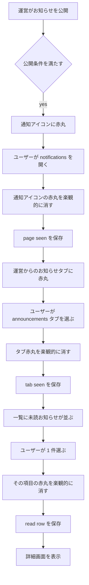
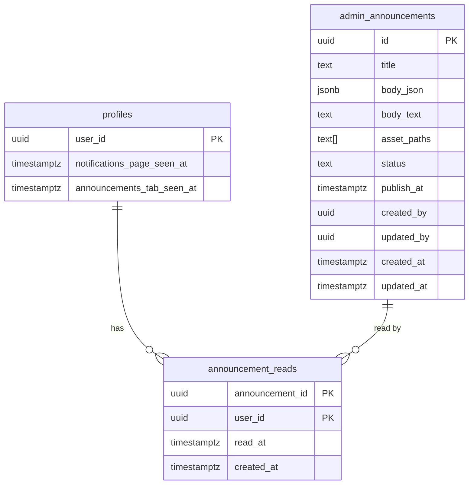
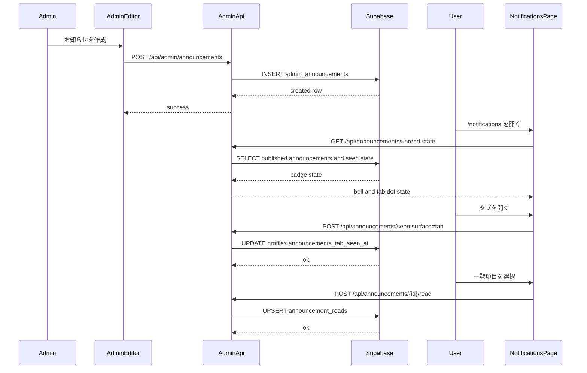
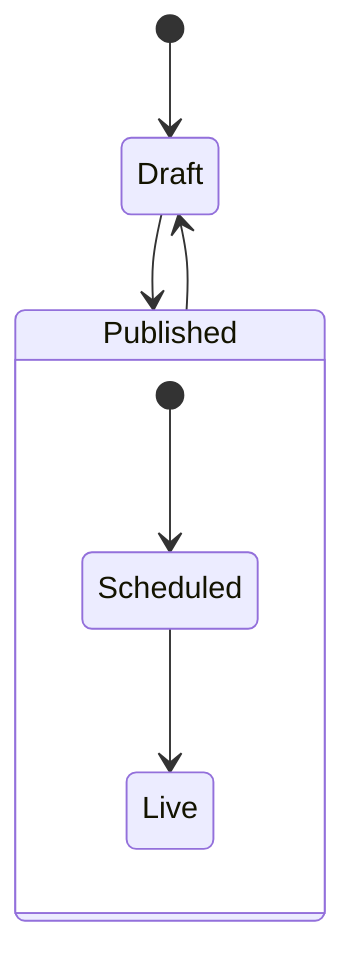
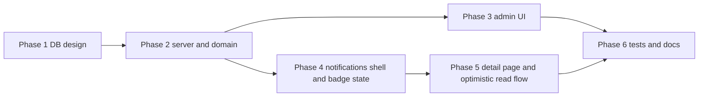

# 運営からのお知らせ機能 実装計画

作成日: 2026-04-19

## コードベース調査結果

### 既存通知・未読バッジの構成

| レイヤー | ファイル | 役割 |
|----------|---------|------|
| ページ | `app/(app)/notifications/page.tsx` | `/notifications` のシェル。現状は単一リスト前提 |
| サーバー表示 | `features/notifications/components/CachedNotificationList.tsx` | `notifications-${userId}` タグで初期通知一覧をキャッシュ |
| クライアント一覧 | `features/notifications/components/NotificationList.tsx` | 通知一覧描画、無限スクロール、全件既読ボタン |
| 通知状態管理 | `features/notifications/hooks/useNotifications.ts` | 一覧取得、既読化、Realtime、画面入場時の全件既読 |
| 未読バッジProvider | `features/notifications/components/UnreadNotificationProvider.tsx` | `notifications` テーブルの未読数を取得し、Sidebar に提供 |
| ナビゲーション | `components/AppSidebar.tsx` | `/notifications` アイコンの赤丸表示。現在は `unreadCount > 0` のみ |
| API | `app/api/notifications/unread-count/route.ts` | `notifications.is_read = false` の件数を返す |
| API | `app/api/notifications/mark-read/route.ts` | 指定通知を既読化 |
| API | `app/api/notifications/mark-all-read/route.ts` | 画面入場時の全件既読化 |
| 型 | `features/notifications/types.ts` | `NotificationType = 'like' | 'comment' | 'follow' | 'bonus'` |

### 既存の公開コンテンツ管理パターン

| 領域 | ファイル | 参考にする点 |
|------|---------|-------------|
| One-Tap Style 管理 | `app/(app)/admin/style-presets/page.tsx` | 管理ページの構成、ページ認証 |
| One-Tap Style CRUD API | `app/api/admin/style-presets/route.ts` | `requireAdmin()` を使う admin API パターン |
| One-Tap Style Repository | `features/style-presets/lib/style-preset-repository.ts` | admin 用一覧取得と published 一覧取得の分離 |
| One-Tap Style Storage | `features/style-presets/lib/style-preset-storage.ts` | Supabase Storage バケット作成、WebP変換、公開URL取得 |
| ポップアップバナー | `features/popup-banners/lib/schema.ts` | `draft/published` と `display_start_at` による予約公開相当の前例 |
| ポップアップバナー API | `app/api/popup-banners/interact/route.ts` | サーバー側で user を解決して RPC/集約処理を呼ぶパターン |
| Admin ナビ | `app/(app)/admin/admin-nav-items.ts` | 管理画面メニューへの追加方法 |
| Admin Sidebar | `app/(app)/admin/AdminSidebar.tsx` | `AdminNavIconKey` と `iconMap` の整合が必要 |
| Admin 認証 | `lib/auth.ts` | ページは `getUser() + getAdminUserIds()`、API は `requireAdmin()` |
| Admin 監査ログ | `lib/admin-audit.ts` | admin 操作の監査ログ記録ヘルパー |

### リッチテキスト・画像アップロード前提

- 現在の `package.json` には Tiptap / Lexical / CKEditor / TinyMCE 系の依存は未導入
- 既存の画像アップロードは `style-presets` と `popup-banners` が Supabase Storage + WebP 変換で実装済み
- 画像挿入つきのリッチエディタを実装する場合、既存 UI との親和性と自由度を考えると `Tiptap` が最も自然
- 参考:
  - `features/style-presets/lib/style-preset-storage.ts`
  - `features/popup-banners/lib/popup-banner-storage.ts`

### Supabase 接続確認結果

- Supabase MCP で `public` スキーマのテーブル一覧取得を確認済み
- 現行テーブルとして以下を確認:
  - `notifications` 622 rows, RLS enabled
  - `style_presets` 20 rows, RLS enabled
  - `popup_banners` 1 row, RLS enabled
  - `popup_banner_views` 18 rows, RLS enabled
  - `admin_users` 1 row, RLS enabled
  - `admin_audit_log` 88 rows, RLS enabled
- `admin_announcements` / `announcement_reads` 相当のテーブルは未存在
- `notifications` の RLS は「受信者本人だけ SELECT/UPDATE/DELETE、直接 INSERT 禁止」
- `style_presets` / `popup_banners` には「published 行のみ公開 SELECT」の既存パターンがある
- 既存インデックスとして `notifications` には `idx_notifications_recipient_unread` があり、未読件数 API はこの前提で動いている

### 既存スキーマから導ける設計上の示唆

- `notifications` テーブルは個人向けイベント通知に強く寄っており、型・遷移・既読化ロジックをそのまま運営告知へ流用すると影響範囲が広い
- そのため、運営からのお知らせは `notifications` とは別ドメインに分離する方が安全
- 一方、ユーザー単位の軽い UI 状態は `profiles` に `last_coordinate_toast_ack_at` のような前例があるため、ページ／タブの赤丸消込タイムスタンプは `profiles` 追加カラムで持つのが妥当

### 影響範囲

- `/notifications` ページは単一リスト前提から、2タブシェルへ再編が必要
- Sidebar の赤丸は「個人通知未読数」から「個人通知未読 or 運営お知らせのページレベル新着」に拡張が必要
- 運営お知らせは admin CRUD、公開予約、Storage 画像アップロード、ユーザー向け一覧・詳細・既読管理まで新規追加が必要
- DB変更に伴い以下の更新が必要
  - `docs/architecture/data.ja.md`
  - `docs/architecture/data.en.md`
  - `.cursor/rules/database-design.mdc`
  - `docs/API.md`
  - `docs/product/screen-flow.md`
  - `docs/product/screen-flow.en.md`

---

## 1. 概要図

### ユーザー側の赤丸消込フロー

### データモデル

### Admin 作成からユーザー閲覧までのシーケンス

### 公開状態の扱い

注記:
- DB の `status` は `draft | published` の 2 状態に留める
- `status = published` で保存する際は `publish_at` を必ず保存する。admin が未指定なら保存時刻を補完する
- `publish_at` が未来なら admin 表示上は `Scheduled`、`publish_at <= now()` になった時点で user 表示上は `Live` とみなす

---

## 2. EARS（要件定義）

### Admin 作成・公開予約

| ID | Type | Spec |
|----|------|------|
| AN-001 | Event | When an admin creates or edits an announcement, the system shall allow rich-text content with bold text, font size, text color, and inline image insertion. |
| AN-002 | Event | When an admin saves an announcement as draft, the system shall keep it hidden from users. |
| AN-003 | Event | When an admin saves an announcement with `status = published`, the system shall persist a non-null `publish_at`; if the admin does not specify one, the system shall use the current time. |
| AN-004 | Event | When an admin saves an announcement with `status = published` and a future `publish_at`, the system shall treat it as scheduled and keep it hidden until `publish_at <= now()`. |
| AN-005 | State | While an announcement is `published` and `publish_at` is in the past or present, the system shall expose it to users in the announcements tab and detail page. |
| AN-006 | Event | When an admin updates or deletes an announcement, the system shall record the operation in `admin_audit_log`. |

### ユーザー側の閲覧

| ID | Type | Spec |
|----|------|------|
| AN-010 | State | While the user is on `/notifications`, the system shall show two tabs: activity notifications and admin announcements. |
| AN-011 | State | While the user is viewing the admin announcements tab, the system shall render a title-first list ordered by newest publish time first. |
| AN-012 | Event | When the user selects an announcement list item, the system shall navigate to a dedicated detail page. |
| AN-013 | State | While the user is viewing the detail page, the system shall render the rich-text body including inline images safely. |
| AN-014 | State | While the user is not authenticated, the system shall deny access to the announcements list and detail because they live under `/notifications`. |

### 赤丸と既読管理

| ID | Type | Spec |
|----|------|------|
| AN-020 | Event | When a newly visible admin announcement exists after the user last opened `/notifications`, the system shall show a red dot on the notifications icon. |
| AN-021 | Event | When the user opens `/notifications`, the system shall optimistically clear the notifications icon red dot and then persist `profiles.notifications_page_seen_at`. |
| AN-022 | Event | When a newly visible admin announcement exists after the user last opened the announcements tab, the system shall show a red dot on the admin announcements tab. |
| AN-023 | Event | When the user selects the admin announcements tab, the system shall optimistically clear the tab red dot and then persist `profiles.announcements_tab_seen_at`. |
| AN-024 | State | While an announcement has no `announcement_reads` row for the current user, the system shall show a red dot on that list item. |
| AN-025 | Event | When the user selects an unread announcement item, the system shall optimistically clear that item red dot and then upsert a read row for the current user. |
| AN-026 | State | While the notifications icon is rendered in the sidebar, the system shall show the red dot if either personal notifications are unread or the page-level admin announcement dot is active. |
| AN-027 | Event | When the user opens an announcement detail directly, the system shall persist only the item-level read state and shall not update `notifications_page_seen_at` or `announcements_tab_seen_at`. |

### 公開予約の表示反映

| ID | Type | Spec |
|----|------|------|
| AN-030 | State | While the app is open and a scheduled announcement reaches `publish_at`, the system shall detect the new visibility state via focus refresh or periodic refresh and update the red-dot state without requiring a full reload. |
| AN-031 | Abnormal | If saving a seen state or read state fails after the optimistic update, the system shall refetch the relevant state and restore the red dot if needed. |

---

## 3. ADR（設計判断記録）

### ADR-001: 運営お知らせは `notifications` テーブルへ統合しない

- Context: 既存 `notifications` は `like/comment/follow/bonus` の個人向けイベント通知に最適化されている
- Decision: `admin_announcements` を新規追加し、運営告知は別ドメインとして扱う
- Reason: `NotificationType`、既読化、クリック遷移、トリガー、unique index への影響を避けられる
- Consequence: Sidebar の赤丸は 2 系統の状態を集約する必要がある

### ADR-002: 3段階の赤丸は 2 つの仕組みに分ける

- Context: 要件上、赤丸は「通知アイコン」「タブ」「個別項目」で別々に消える必要がある
- Decision:
  - 個別項目の既読は `announcement_reads`
  - 通知アイコンとタブの消込は `profiles.notifications_page_seen_at` と `profiles.announcements_tab_seen_at`
- Reason: ページ／タブの赤丸は「一覧を見たか」、項目の赤丸は「詳細を開いたか」で粒度が異なるため
- Consequence: 新規テーブルは 2 つで済み、ユーザー単位 UI 状態は既存 `profiles` の前例に合わせて保持できる

### ADR-003: 公開予約は `status + publish_at` の派生表示で扱う

- Context: 予約公開に対して cron で状態を切り替えるか、クエリで可視性を判定するかを決める必要がある
- Decision: DB の永続状態は `draft | published` のままにし、`status = published` の保存時は `publish_at` を必須で埋める。`publish_at` が未来なら admin 表示上だけ `scheduled` とみなす
- Reason: `popup_banners` の `status + display_start_at` パターンと整合し、状態遷移を増やさずに済む
- Consequence:
  - save 時に `publish_at` 未指定ならサーバーが `now()` を補完する
  - user 向けクエリは `status = 'published' AND publish_at <= now()` を必須条件にする
  - app を開きっぱなしのユーザー向けに、focus 時と定期ポーリングで badge state を更新する

### ADR-004: リッチテキストの保存形式は `body_json` を正とする

- Context: rich-text 本文を HTML で保存するか、エディタネイティブな JSON で保存するかを決める必要がある
- Decision: `Tiptap` のドキュメント JSON を `body_json` に保存し、`body_text` を派生テキストとして保持する
- Reason: HTML サニタイズの複雑さを下げつつ、太字、色、文字サイズ、画像ノードを構造化して保持できる。ただし JSON 保存でも入力検証は必要
- Consequence:
  - save API は許可ノード、mark、属性のホワイトリスト検証を行う
  - `href` / `src` などの URL 属性は `/` 始まりの内部 path、`https://`、および `announcement-images` バケットの公開 URL のみに制限し、`javascript:` 等は拒否する
  - detail 表示には read-only renderer が必要
  - 一覧は `title` のみを主表示にし、本文抜粋に強く依存しない設計にする
  - `body_text` は plain-text 抽出結果として保持し、非空本文の検証と低リッチ文脈での fallback に使う

### ADR-005: エディタ内画像は専用バケットに保存し、参照パスを announcement に保持する

- Context: 本文内の画像は複数枚アップロードされるため、削除・差し替え時の cleanup 戦略が必要
- Decision:
  - 新規 Storage バケット `announcement-images` を使う
  - upload API が `publicUrl` と `storagePath` を返す
  - `admin_announcements.asset_paths` に本文で参照する Storage path を保存する
- Reason: 画像差し替え時に参照外 asset を検出しやすく、announcement 削除時も best-effort cleanup できる
- Consequence:
  - save API は本文 JSON だけでなく `asset_paths` も受け取る
  - create/save 失敗時は今回アップロードした asset を best-effort で巻き戻す
  - update/save 成功時は旧 `asset_paths` と新 `asset_paths` の差分を取り、参照されなくなった asset を best-effort で削除する
  - announcement 削除時は保持中 `asset_paths` をまとめて削除する
  - 作成途中で離脱した未保存 asset の定期クリーンアップは初期スコープ外とし、必要なら運用タスクで別途扱う

### ADR-006: 楽観的更新はページ、タブ、項目の 3 箇所で独立して行う

- Context: ユーザー要件では各赤丸が異なるタイミングで消える
- Decision:
  - bell dot は `/notifications` へ遷移する時点で消す
  - tab dot は announcements タブ選択時に消す
  - item dot は一覧項目クリック時に消す
- 補足:
  - 詳細ページの直接オープン時は item read のみ保存し、page/tab seen は更新しない
- Reason: UX 要件に忠実であり、サーバー保存待ちで赤丸が残る体験を避けられる
- Consequence: 失敗時の再フェッチとロールバック制御が必要になる

---

## 4. 実装計画（フェーズ＋TODO）

### フェーズ間の依存関係

### Phase 1: データベース設計とマイグレーション

**目的**: 新規 announcement ドメインと seen/read 状態の土台を確定する  
**参考**:
- `supabase/migrations/20260322100000_add_style_presets.sql`
- `supabase/migrations/20260326231403_harden_popup_banner_access_and_interactions.sql`
- `.cursor/rules/database-design.mdc`

- [ ] `admin_announcements` テーブルを新規作成
  - `id uuid primary key`
  - `title text not null`
  - `body_json jsonb not null`
  - `body_text text not null default ''`
  - `asset_paths text[] not null default '{}'`
  - `status text not null check (status in ('draft', 'published'))`
  - `publish_at timestamptz null`
  - check 制約: `status <> 'published' OR publish_at IS NOT NULL`
  - `created_by uuid null references auth.users`
  - `updated_by uuid null references auth.users`
  - `created_at timestamptz not null default now()`
  - `updated_at timestamptz not null default now()`
- [ ] `announcement_reads` テーブルを新規作成
  - `announcement_id uuid references admin_announcements(id) on delete cascade`
  - `user_id uuid references auth.users(id) on delete cascade`
  - `read_at timestamptz not null default now()`
  - `created_at timestamptz not null default now()`
  - 主キーまたは unique 制約は `(announcement_id, user_id)`
- [ ] `profiles` に 2 カラム追加
  - `notifications_page_seen_at timestamptz null`
  - `announcements_tab_seen_at timestamptz null`
- [ ] `admin_announcements` に `update_updated_at_column()` trigger を設定
- [ ] RLS を設定
  - `admin_announcements`
    - SELECT: `status = 'published'` かつ `publish_at <= now()` の rows のみ
    - INSERT/UPDATE/DELETE: 直接許可しない。admin API は `createAdminClient()` 前提
  - `announcement_reads`
    - SELECT: `auth.uid() = user_id`
    - INSERT: `auth.uid() = user_id`
    - UPDATE: `auth.uid() = user_id`
    - DELETE は初期スコープ外
  - `profiles`
    - 既存 owner update policy を利用する想定
- [ ] インデックスを追加
  - `idx_admin_announcements_public_publish_at` on `(publish_at desc, created_at desc)` where `status = 'published'`
  - `idx_announcement_reads_user_read_at` on `(user_id, read_at desc)`
- [ ] `admin_announcements` 用のコメントを migration に追加
- [ ] Supabase 型定義更新前提の schema diff を確認

**完了条件**: 新規テーブル 2 件と `profiles` 追加カラムが実DBに矛盾なく載り、既存 notification スキーマと衝突しないこと

### Phase 2: ドメイン層・API 契約の実装

**目的**: admin CRUD、ユーザー一覧／詳細、badge state、既読保存の API 契約を先に固定する  
**参考**:
- `features/style-presets/lib/style-preset-repository.ts`
- `app/api/admin/style-presets/route.ts`
- `features/notifications/lib/api.ts`
- `app/api/popup-banners/interact/route.ts`

- [ ] `features/announcements/lib/schema.ts` を新規作成
  - `AnnouncementAdmin`
  - `AnnouncementSummary`
  - `AnnouncementDetail`
  - `AnnouncementStatus`
  - `AnnouncementUnreadState`
  - Zod schema for admin save payload
  - rich-text JSON の許可ノード、mark、属性ホワイトリストを定義
- [ ] `features/announcements/lib/announcement-repository.ts` を新規作成
  - admin 一覧取得
  - admin 単体取得
  - 公開済み一覧取得
  - 公開済み単体取得
  - user ごとの read 情報付き一覧取得
  - page/tab seen 判定 helper
- [ ] `features/announcements/lib/revalidate-announcements.ts` を新規作成
  - `/admin/announcements`
  - `/notifications`
  - announcement detail path の再検証を集約
- [ ] `features/announcements/lib/announcement-storage.ts` を新規作成
  - 既存 `style-preset-storage.ts` パターンで bucket 作成
  - bucket 名は `announcement-images`
  - 5MB 制限
  - jpeg/png/webp を許可
  - 画像は WebP 変換して保存
  - create/save rollback 用の複数 path 削除 helper を持つ
  - update 時の差分 cleanup に使う delete helper を持つ
- [ ] `features/announcements/lib/announcement-rich-text.ts` を新規作成
  - `body_json` から `body_text` を派生させる helper
  - `asset_paths` 抽出 helper
  - 非空本文の判定 helper
  - URL 属性の安全プロトコル検証 helper
- [ ] admin API を追加
  - `app/api/admin/announcements/route.ts`
    - GET: admin 一覧
    - POST: 新規作成
  - `app/api/admin/announcements/[id]/route.ts`
    - GET: 編集用単体取得
    - PATCH: 更新
    - DELETE: 削除
  - `app/api/admin/announcements/images/route.ts`
    - POST: エディタ画像アップロード
    - `requireAdmin()` で保護
- [ ] user API を追加
  - `app/api/announcements/route.ts`
    - GET: current user 向け一覧。title 主表示、`is_read` を含める
  - `app/api/announcements/[id]/route.ts`
    - GET: current user 向け詳細
  - `app/api/announcements/[id]/read/route.ts`
    - POST: `announcement_reads` upsert
  - `app/api/announcements/seen/route.ts`
    - POST: `surface = page | tab`
    - `profiles.notifications_page_seen_at` or `profiles.announcements_tab_seen_at` を更新
  - `app/api/announcements/unread-state/route.ts`
    - GET: `hasPageDot`, `hasTabDot`
- [ ] admin save API の正規化ルールを固定
  - `status = 'published'` かつ `publish_at` 未指定ならサーバーで `now()` を補完
  - 一覧の並び順と未読判定の基準時刻は `publish_at` を正とする
  - `body_json` は save 前にホワイトリスト検証し、未知ノード、未知属性、危険な URL プロトコルを拒否する
  - `body_text` は plain-text fallback と非空本文判定に使う
  - update 時は旧 `asset_paths` と新 `asset_paths` の差分 cleanup を行う
- [ ] `lib/admin-audit.ts` の `AdminAuditAction` を拡張
  - `announcement_create`
  - `announcement_update`
  - `announcement_delete`
- [ ] admin API で `logAdminAction()` を呼ぶ
  - `metadata` に `status` と `publish_at` の before/after を含める

**完了条件**: UI 実装前に route contract が固定され、red dot 3段階の保存先と API が定義されていること

### Phase 3: Admin 管理画面とエディタ

**目的**: 運営がお知らせを作成、下書き保存、公開予約、更新、削除できる UI を作る  
**参考**:
- `app/(app)/admin/style-presets/page.tsx`
- `app/(app)/admin/style-presets/StylePresetListClient.tsx`
- `app/(app)/admin/popup-banners/PopupBannerListClient.tsx`
- `app/(app)/admin/admin-nav-items.ts`
- `app/(app)/admin/AdminSidebar.tsx`

- [ ] Tiptap 依存を追加
  - `@tiptap/react`
  - `@tiptap/starter-kit`
  - `@tiptap/extension-image`
  - `@tiptap/extension-text-style`
- [ ] `app/(app)/admin/announcements/page.tsx` を新規作成
  - `getUser() + getAdminUserIds()` でページ認証
  - admin 一覧をサーバー取得
- [ ] `app/(app)/admin/announcements/AnnouncementListClient.tsx` を新規作成
  - 一覧
  - 新規作成 Dialog
  - 編集 Dialog
  - 削除 AlertDialog
  - 表示状態バッジ:
    - `下書き`
    - `公開予約`
    - `公開中`
  - 並び替えは初期スコープ外
- [ ] `app/(app)/admin/announcements/AnnouncementForm.tsx` を新規作成
  - タイトル入力
  - 公開状態 select or segmented control
  - 公開日時 input
  - Tiptap editor
  - 画像アップロードボタン
  - asset_paths 管理
- [ ] `features/announcements/components/AnnouncementEditor.tsx` を新規作成
  - bold
  - font size
  - text color
  - image insert
  - 既存 shadcn Button を使ったカスタム toolbar
- [ ] `app/(app)/admin/admin-nav-items.ts` にメニュー追加
  - `path: "/admin/announcements"`
  - `label: "運営お知らせ"`
  - `description: "notifications の運営告知を管理"`
  - `iconKey` は既存 key を再利用するか、必要なら `AdminNavIconKey` と `AdminSidebar` の `iconMap` を同時に拡張する
- [ ] admin 画面の日本語文言をコンポーネント内に追加
  - 現行 admin 画面の実装方針に合わせ、まずはページ近接で持つ

**完了条件**: admin が公開予約つきのお知らせを作成・更新・削除でき、本文に画像を挿入できること

### Phase 4: `/notifications` 2タブ化と sidebar 赤丸統合

**目的**: 既存通知一覧を壊さずに、運営お知らせタブと bell/tab 赤丸を追加する  
**参考**:
- `app/(app)/notifications/page.tsx`
- `features/subscription/components/BillingPageTabs.tsx`
- `features/notifications/components/UnreadNotificationProvider.tsx`
- `components/AppSidebar.tsx`

- [ ] `features/notifications/lib/notification-tab.ts` を新規作成
  - `activity | announcements`
  - searchParams から parse
  - href builder
- [ ] `app/(app)/notifications/page.tsx` を修正
  - page shell のまま `NotificationsHub` をレンダリング
  - `searchParams.tab` を読む
- [ ] `features/notifications/components/NotificationsHub.tsx` を新規作成
  - 2タブの state 管理
  - announcements タブ選択時の楽観的 tab-dot clear
  - back from detail で tab 維持
  - activity タブが active の時だけ activity list 側の auto mark all read が有効になるよう制御する
- [ ] `features/notifications/components/NotificationsPageTabs.tsx` を新規作成
  - `BillingPageTabs.tsx` 相当のセグメント UI
  - announcements タブに赤丸を表示
- [ ] `features/notifications/components/UnreadNotificationProvider.tsx` を拡張
  - 既存 `unreadCount` は維持
  - 新しく announcement page-level dot を fetch
  - focus 時 refresh
  - 60 秒間隔の lightweight polling を追加
  - provider の戻り値に `hasAnnouncementPageDot` と `hasSidebarDot` を追加
- [ ] `components/AppSidebar.tsx` を修正
  - bell red dot 条件を `unreadCount > 0 || hasAnnouncementPageDot` に変更
  - `/notifications` 遷移開始時に announcement page dot を楽観的に消す
- [ ] `features/notifications/lib/api.ts` を拡張
  - personal notifications API は維持
  - announcement unread-state fetch helper を追加
- [ ] 既存 personal notifications の既読化ロジックは維持
  - `useNotifications()` の auto mark all read は activity notifications のみ対象
  - `pathname === "/notifications"` だけでは自動既読化しないよう、tab または explicit prop で制御する

**完了条件**: `/notifications` を開くと bell 赤丸が消え、announcements タブを開くと tab 赤丸が消えること

### Phase 5: 運営お知らせ一覧、詳細画面、項目赤丸の楽観的更新

**目的**: ユーザーが announcements 一覧から詳細へ遷移し、個別項目赤丸を消せるようにする  
**参考**:
- `features/notifications/components/NotificationList.tsx`
- `features/notifications/hooks/useNotifications.ts`

- [ ] `features/announcements/components/AnnouncementList.tsx` を新規作成
  - タイトル主表示の一覧
  - 各行に未読 red dot
  - 行クリック時に item red dot を楽観的に消してから遷移
  - 初期スコープではページネーションなし、最新順固定
- [ ] `features/announcements/components/AnnouncementListItem.tsx` を新規作成
  - title
  - publish date の補助表示は任意
  - red dot
- [ ] `features/announcements/hooks/useAnnouncements.ts` を新規作成
  - 一覧取得
  - item read optimistic update
  - tab seen optimistic update
  - 失敗時の rollback/re-fetch
- [ ] `app/(app)/notifications/announcements/[id]/page.tsx` を新規作成
  - `requireAuth()` で保護
  - title
  - published date
  - rich text body
  - back link to `/notifications?tab=announcements`
- [ ] `features/announcements/components/AnnouncementDetail.tsx` を新規作成
  - read-only Tiptap renderer
  - 画像の幅制御
  - body_json rendering
- [ ] detail page でも idempotent に read 保存
  - 一覧経由でなく直接開いたケースを補完
  - `announcement_reads` のみ更新し、page/tab seen は更新しない
- [ ] `messages/ja.ts` / `messages/en.ts` を拡張
  - notifications page tab labels
  - announcements empty state
  - detail back label
  - red dot aria labels

**完了条件**: 一覧の未読項目がクリックで即座に消え、詳細画面に遷移できること

### Phase 6: テスト、ドキュメント、仕上げ

**目的**: 仕様と実装の整合を確認し、DB/ドキュメント更新を完了する  
**参考**:
- `docs/architecture/data.ja.md`
- `docs/architecture/data.en.md`
- `docs/API.md`
- `docs/product/screen-flow.md`
- `docs/product/screen-flow.en.md`

- [ ] DB ドキュメントを更新
  - `docs/architecture/data.ja.md`
  - `docs/architecture/data.en.md`
  - `.cursor/rules/database-design.mdc`
- [ ] route contract を `docs/API.md` に追記
- [ ] 画面遷移を `docs/product/screen-flow.md` / `screen-flow.en.md` に追記
  - `/notifications?tab=announcements`
  - `/notifications/announcements/[id]`
  - `/admin/announcements`
- [ ] 単体テスト観点を整理
  - repository
  - badge state helper
  - optimistic update rollback
  - editor payload normalization
- [ ] 実機／手動確認
  - bell dot
  - tab dot
  - item dot
  - scheduled publish after focus refresh
  - rich text + image render
- [ ] build verification
  - `codex-webpack-build` のワークフローに沿って本番 build を確認

**完了条件**: DB、API、画面、ドキュメントが一致し、scheduled publish と 3段階の赤丸が期待どおりに確認できること

---

## 5. 修正対象ファイル一覧

| ファイル | 操作 | 内容 |
|----------|------|------|
| `supabase/migrations/YYYYMMDDHHMMSS_add_admin_announcements.sql` | 新規 | `admin_announcements`, `announcement_reads`, `profiles` 追加カラム, RLS, index, trigger |
| `features/announcements/lib/schema.ts` | 新規 | announcement ドメイン型定義 |
| `features/announcements/lib/announcement-repository.ts` | 新規 | admin/public 取得と unread state 判定 |
| `features/announcements/lib/announcement-storage.ts` | 新規 | editor 画像アップロードと Storage 操作 |
| `features/announcements/lib/announcement-rich-text.ts` | 新規 | `body_json`, `body_text`, `asset_paths`, URL 検証 helper |
| `features/announcements/lib/revalidate-announcements.ts` | 新規 | admin/user announcement 関連の revalidate 集約 |
| `features/announcements/hooks/useAnnouncements.ts` | 新規 | 一覧取得と楽観的既読管理 |
| `features/announcements/components/AnnouncementEditor.tsx` | 新規 | Tiptap editor |
| `features/announcements/components/AnnouncementList.tsx` | 新規 | 一覧 |
| `features/announcements/components/AnnouncementListItem.tsx` | 新規 | 一覧行 |
| `features/announcements/components/AnnouncementDetail.tsx` | 新規 | 詳細表示 |
| `features/notifications/lib/notification-tab.ts` | 新規 | tab parse/build helper |
| `features/notifications/components/NotificationsHub.tsx` | 新規 | 2タブ shell |
| `features/notifications/components/NotificationsPageTabs.tsx` | 新規 | tab UI |
| `features/notifications/components/CachedNotificationList.tsx` | 修正 | activity タブ連動の表示/既読制御 |
| `features/notifications/components/NotificationList.tsx` | 修正 | activity タブ連動の表示/既読制御 |
| `features/notifications/hooks/useNotifications.ts` | 修正 | auto mark all read の tab/prop 制御 |
| `features/notifications/components/UnreadNotificationProvider.tsx` | 修正 | bell dot 集約 state 追加 |
| `features/notifications/lib/api.ts` | 修正 | announcement unread-state helper 追加 |
| `components/AppSidebar.tsx` | 修正 | bell dot 条件と楽観的 page seen |
| `app/(app)/notifications/page.tsx` | 修正 | hub 化、searchParams 対応 |
| `app/(app)/notifications/announcements/[id]/page.tsx` | 新規 | detail page |
| `app/(app)/admin/announcements/page.tsx` | 新規 | admin page |
| `app/(app)/admin/announcements/AnnouncementListClient.tsx` | 新規 | admin 一覧 |
| `app/(app)/admin/announcements/AnnouncementForm.tsx` | 新規 | admin form |
| `app/api/admin/announcements/route.ts` | 新規 | admin GET/POST |
| `app/api/admin/announcements/[id]/route.ts` | 新規 | admin GET/PATCH/DELETE |
| `app/api/admin/announcements/images/route.ts` | 新規 | editor image upload |
| `app/api/announcements/route.ts` | 新規 | user list |
| `app/api/announcements/[id]/route.ts` | 新規 | user detail |
| `app/api/announcements/[id]/read/route.ts` | 新規 | item read upsert |
| `app/api/announcements/seen/route.ts` | 新規 | page/tab seen 保存 |
| `app/api/announcements/unread-state/route.ts` | 新規 | bell/tab dot state |
| `app/(app)/admin/admin-nav-items.ts` | 修正 | admin メニュー追加 |
| `lib/admin-audit.ts` | 修正 | announcement action type 追加 |
| `messages/ja.ts` | 修正 | notifications / announcements 文言追加 |
| `messages/en.ts` | 修正 | notifications / announcements 文言追加 |
| `docs/architecture/data.ja.md` | 修正 | announcement ドメイン追記 |
| `docs/architecture/data.en.md` | 修正 | announcement ドメイン追記 |
| `.cursor/rules/database-design.mdc` | 修正 | schema ledger 更新 |
| `docs/API.md` | 修正 | route contract 追加 |
| `docs/product/screen-flow.md` | 修正 | route 追加 |
| `docs/product/screen-flow.en.md` | 修正 | route 追加 |

---

## 6. 品質・テスト観点

### 品質チェックリスト

- [ ] bell dot と tab dot と item dot が別々に消える
- [ ] optimistic update 失敗時に state が再フェッチされる
- [ ] scheduled announcement は `publish_at` 前に user 一覧へ出ない
- [ ] `publish_at` 到達後に focus refresh または polling で dot が現れる
- [ ] `status = 'published'` 保存時に `publish_at` 未指定ならサーバーで現在時刻が補完される
- [ ] rich-text JSON の未知ノード、未知属性、危険な URL プロトコルが save 時に拒否される
- [ ] personal notifications の既存未読カウント動作を壊さない
- [ ] `/notifications` 配下でも announcements タブでは personal notifications の auto mark all read が走らない
- [ ] admin 以外は admin announcement API に入れない
- [ ] announcement detail は auth 必須
- [ ] rich text body と inline image が崩れず表示される
- [ ] create/save 失敗時、update 差分、delete 時に `asset_paths` ベースの cleanup が想定どおりに動く
- [ ] `admin_audit_log` に create/update/delete が残る
- [ ] `admin_audit_log` に `publish_at` / `status` 変更差分が残る
- [ ] detail 直開きでは item read のみ保存され、bell/tab seen は変化しない

### テスト観点

| カテゴリ | テスト内容 |
|----------|-----------|
| DB | published policy, `publish_at` フィルタ, draft/scheduled の user SELECT 拒否, `announcement_reads` owner RLS, 他ユーザー read row へのアクセス拒否, `profiles` seen timestamp update |
| API 正常系 | admin create/update/delete, image upload, list/detail fetch, seen 保存, read upsert |
| API 異常系 | 非 admin 投稿拒否, 不正 ID, draft 詳細への user アクセス拒否, publish_at 前アクセス不可, 危険な rich-text JSON 拒否 |
| UI 正常系 | bell dot clear, tab dot clear, item dot clear, detail 遷移, back で tab 維持 |
| UI 異常系 | optimistic update failure rollback, announcement list fetch failure, detail fetch failure, activity 以外のタブで personal notifications が誤って auto mark all read されない |
| 公開予約 | future `publish_at` の row が focus refresh 後に可視化される |
| リッチテキスト | bold, font size, color, image insert の round-trip, 不許可ノード/属性/URL の拒否 |

### 推奨テスト順

1. Phase 1 後に migration と RLS を検証
2. Phase 2 後に route contract を API テストで固定
3. Phase 3 後に admin authoring の手動確認
4. Phase 4-5 後に bell/tab/item の赤丸シナリオを E2E で確認

---

## 7. ロールバック方針

- **DBマイグレーション**:
  - `admin_announcements` と `announcement_reads` は新規テーブルなので切り戻しは比較的安全
  - `profiles` 追加カラム 2 件は additive change のため、緊急時はアプリ側だけ戻してスキーマは残してよい
- **アプリケーション**:
  - `/notifications` の 2タブ shell は feature 単位で revert 可能
  - Sidebar の bell dot 条件は `AppSidebar.tsx` と Provider の 2 ファイルに閉じる
- **Storage**:
  - 新規バケット `announcement-images` は既存バケットから独立
  - ロールバック時にアップロード済み画像が残る可能性があるため、初期運用では bucket 自体は残置し、必要に応じて参照切れ path を後日 cleanup する
- **運用**:
  - 問題が出た場合、admin 側で対象 announcement を `draft` に戻せば user 側から即時除外できる

---

## 8. 使用スキル

| スキル | 用途 | フェーズ |
|--------|------|----------|
| `implementation-planning` | 実装計画の作成 | 全体 |
| `project-database-context` | Supabase スキーマと RLS 前提の確認 | Phase 1 |
| `codex-webpack-build` | 実装後の build verification | Phase 6 |

---

## 9. 実装時の補足メモ

- 既存 `useNotifications()` は `/notifications` 入場時に personal notifications を全件既読化する。announcement 側の bell/tab/item 既読設計とは別軸なので、そのまま維持する
- 本文の多言語化は初期スコープ外とし、announcement 本文は単一 `body_json` / `body_text` のみを扱う
- 予約公開時刻ちょうどに bell dot を厳密秒単位で出したい場合は、将来的に cron で `scheduled` を materialize する案を別タスクで検討できる
- 初期スコープでは announcement 一覧は title 主表示で十分。検索、ピン留め、並び替え、セグメント配信は含めない
