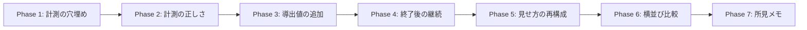
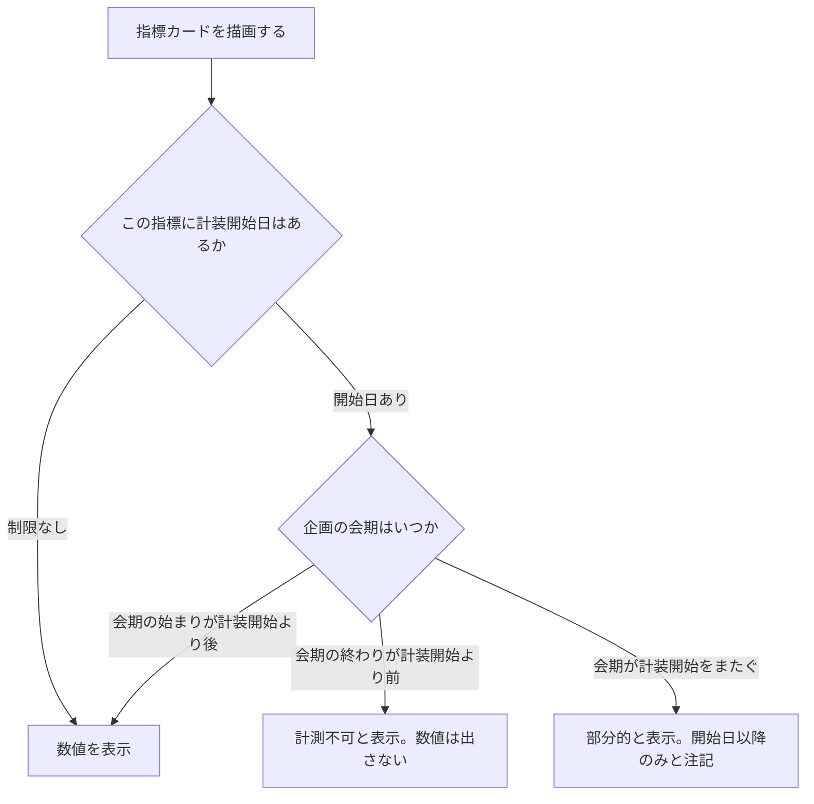
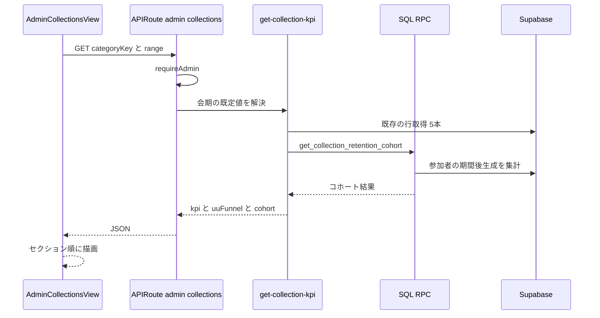

# 企画レポート（Admin コレクションダッシュボード）実装計画書

作成日: 2026-08-19
対象: `/admin` ダッシュボードの「コレクション」タブ

---

## 背景と目的

「#うちの子のファッション雑誌」企画（2026/8/8–8/16）の KPI 抽出を手作業で行い、
その結果を1枚のレポートにまとめた。今後この作業を毎回行わず、
**企画が動くたびに数値が自動で積み上がり、そのまま振り返り資料として読める状態**にしたい。

調査の結果、**必要なデータの大半はすでに毎日蓄積され、画面にも出ている**ことが分かった。
足りないのはデータではなく、(a) 集計の正しさ、(b) いくつかの導出値、(c) 読む順序、(d) 判断の記録。

### 手作業レポートとの差分（実測）

| # | 項目 | 現状 |
|---|------|------|
| 1 | 運営アカウントの除外 | **無し**。今回は生成の5.4%・完走の5%が運営分だった |
| 2 | 到達ページ数の分布 | 無し。最も行動につながった数字 |
| 3 | ページ別の到達UU | 無し（生成数のみ。「人が多い」と「一人が粘った」を区別できない） |
| 4 | 終了後の継続 | 無し |
| 5 | 企画の横並び比較 | 無し（1企画ずつしか見られない） |
| 6 | 会期が既定期間になっていない | 既定は「直近30日」（`dashboard-range.ts`） |
| 7 | 「0」と「計測していない」の区別 | 無し。訪問カードは会期が計装前でも `0` と表示する |
| 8 | 所見（判断の理由）の記録 | 無し |

### 現状のダッシュボードで残すべきもの（レポートに無かったもの）

前期間比（delta）／ゲストとログインの分解／お試し生成／ダウンロード／
保存クリック／登録CTAクリック／台紙生成失敗（運用アラート）／完走者一覧／
CSV出力／任意期間指定。**これらは削らない。**

---

## コードベース調査結果

### Supabase 接続

`supabase db query --linked` で本番DBへの読み取りを確認済み。
本計画の数値はすべて実際のクエリ結果に基づく。

### 既存の実装

| 対象 | ファイル | 内容 |
|------|----------|------|
| 画面 | `features/admin-dashboard/components/AdminCollectionsView.tsx` | 企画選択タブ・KPIカード11枚・日別トレンド・UUファネル・柱別生成数・完走者一覧 |
| API | `app/api/admin/collections/route.ts` | `requireAdmin()` → `getCollectionKpi` / `getCollectionUuFunnel` / `getCollectionCompleters` を `Promise.all` |
| 集計（取得） | `features/admin-dashboard/lib/get-collection-kpi.ts` | admin client で行を取得し純関数へ渡す |
| 集計（純関数） | `features/admin-dashboard/lib/build-collection-kpi.ts` | delta・日別トレンド・柱別集計 |
| 集計（UU） | `features/admin-dashboard/lib/build-collection-uu-funnel.ts` | 生成→完走→シェア、登録→完走 |
| 期間 | `features/admin-dashboard/lib/dashboard-range.ts` | `24h/7d/30d/90d/custom`、既定 `30d` |
| CSV | `features/admin-dashboard/lib/admin-csv.ts`, `build-collection-trend-csv.ts` | 3種の CSV |
| カテゴリ | `features/style-presets/lib/preset-category-repository.ts` | `PresetCategoryAdmin` / `PresetCategoryUpdate` の列マッピング |
| カテゴリ更新API | `app/api/admin/preset-categories/[id]/route.ts` | `requireAdmin()` + `logAdminAction()` |
| 管理者判定 | `lib/auth.ts` `requireAdmin()` / `lib/env.ts` `getAdminUserIds()` | env `ADMIN_USER_IDS` 由来。DB の `admin_users` とは別系統 |
| テスト | `tests/unit/features/admin-dashboard/build-collection-kpi.test.ts` ほか | 純関数に対する単体テストが揃っている |

**設計上の重要点**: 「行の取得」（`get-*.ts`）と「集計」（`build-*.ts` 純関数）が分離されており、
テストは純関数側に集中している。新しい指標もこの分離を守る。

### 計装開始日（実測）

`style_usage_events` の各列に最初に値が入った日時。**「取得不可」判定の根拠**になる。

| 指標 | 企画に紐づけられる開始日 | 根拠列 |
|------|------------------------|--------|
| 訪問UU・ゲストUU | **2026-08-17** | `visit.category_key` / `viewer_key` |
| ゲスト生成UU | **2026-08-17** | `generate.viewer_key` |
| シェア（企画別） | **2026-06-13** | `mount_shared.style_id` に categoryKey |
| 生成（企画別） | 2026-03-20 | `generate.style_id`（preset UUID） |
| 登録CTAクリック | 2026-04-12 | `signup_click.style_id` |
| ダウンロード | 2026-03-20 | `download.style_id` |
| 完走 | 制限なし | `collection_completions` が正本 |

**神コレクション（6/10開始）のシェア数は 6/13 以降しか紐づいていない**ため、
現在表示されている13名は過小である。これも「部分的」として表示する必要がある。

### 壊れている計測

| 項目 | 状態 | 影響 |
|------|------|------|
| `profiles.signup_source` | 全期間で8件しか記録がない。ファッション誌企画の新規18名は全員 NULL | 「企画で登録が増えた」が言えない |
| X応募ボタン | `XLotteryEntryButton` が通常シェアと同じ `trackMountShareEvent` を呼ぶ（`features/campaigns/components/XLotteryEntryButton.tsx:69`） | 応募数を分離できない |

### 既存の不具合

`AdminCollectionsView.tsx:150-151` — 「コンプリート達成数」と「台紙生成数」が
**同じ `kpi.completions` を参照**しており、常に同じ数字が2枚並ぶ。

### 参考にできる既存パターン

- **運営テストの除外**: `style_preset_usage_events.was_public_at_generation`
  （`.cursor/rules/database-design.mdc` 参照）が「運営の公開前・期間外テストを除外」に既に使われている。
- **バッチ RPC**: `validate_derived_prompt_sources` / `get_prompt_usage_counts`
  （`20260819120000`）が、単体版を `unnest` + `CROSS JOIN LATERAL` で包む形の先例。
  **判定や集計を写して二重管理にしない**という方針もここに記録済み。
- **キャッシュ**: `features/posts/lib/prompt-action-cache.ts` の `"use cache"` + `cacheTag` + `cacheLife`。

---

## 概要図

### フェーズ間の依存関係

**Phase 1 を先頭に置く理由**: 計装の穴は、埋めるのが遅れるほど**取り返しのつかないデータが失われる**。
豪州企画は 8/17 から既に走っている。他のフェーズは後からでも過去データに遡って適用できるが、
記録されなかったイベントは復元できない。

**Phase 5 を後ろに置く理由**: 見せ方の再構成で UI を触るのは1回にしたい。
先に数値を出し切ってから、全体の並びを一度で決める。

### 計測可否の判定

現状はこの分岐が無く、**E と F のケースでも `0` と表示している**。
これは `#532` で直した「終了した企画が黙って無反応になる」と同じ型の問題である。

### データ取得（Phase 4 以降）

---

## EARS（要件定義）

### 計測の正しさ

1. **Where** 運営アカウント除外が有効なとき、the system shall 集計から `ADMIN_USER_IDS` と
   `admin_users` の和集合に属するユーザーの行を除外し、除外した人数を画面に表示しなければならない。
   *Where operator exclusion is enabled, the system shall exclude rows belonging to users in the
   union of `ADMIN_USER_IDS` and `admin_users`, and display the number of excluded operators.*

2. **When** 企画を選択したとき、the system shall その企画の表示期間（`collection_display_starts_at`
   から `collection_display_ends_at`）を集計期間の初期値として設定しなければならない。
   *When a campaign is selected, the system shall set its display period as the default range.*

3. **If** 指標の計装開始日が企画の会期の終わりより後である場合、then the system shall
   数値の代わりに「計測不可」と、その理由（計装開始日）を表示しなければならない。
   *If a metric's instrumentation start is later than the campaign's end, then the system shall
   display "not measurable" with the instrumentation start date instead of a number.*

4. **If** 計装開始日が企画の会期の途中である場合、then the system shall 数値に「部分的」の
   注記と対象期間を併記しなければならない。
   *If instrumentation started mid-campaign, the system shall annotate the number as partial.*

### 導出値

5. **When** KPI を集計するとき、the system shall 各ページの到達UU（そのページを1回以上生成した
   ユーザー数）を、生成数とは別に算出しなければならない。
   *When aggregating KPI, the system shall compute per-page reached UU separately from generation count.*

6. **When** KPI を集計するとき、the system shall 参加者が生成したページ数の分布（1ページ〜N ページ）を
   算出しなければならない。
   *When aggregating KPI, the system shall compute the distribution of distinct pages generated per user.*

7. **When** KPI を集計するとき、the system shall 1ユーザーあたり平均生成回数と、
   同一ページの2回目以降が全生成に占める割合（撮り直し率）を算出しなければならない。
   *When aggregating KPI, the system shall compute average generations per user and the redo ratio.*

### 終了後の継続

8. **While** 企画の会期が終了している間、the system shall 生成到達者・完走者・会期中の新規登録者
   それぞれについて、会期終了後に生成したユーザーの割合を表示しなければならない。
   *While a campaign has ended, the system shall display the post-campaign generation rate for
   each of: generators, completers, and users registered during the campaign.*

9. **If** 会期終了からの経過日数が7日未満である場合、then the system shall 継続率が暫定値である
   ことを明示しなければならない。
   *If fewer than 7 days have passed since the campaign ended, the system shall mark retention as provisional.*

### 横並び比較

10. **When** 比較ビューを開いたとき、the system shall コレクション企画をカテゴリ単位の通算で並べ、
    ページ数・生成数・生成UU・完走・完走率・シェアUU を1つの表で表示しなければならない。
    *When the comparison view is opened, the system shall list campaigns with lifetime totals.*

### 計測の穴埋め

11. **When** ユーザーが「Xで応募する」を押したとき、the system shall 通常のシェアとは区別できる
    イベント種別を記録しなければならない。
    *When a user taps the X lottery entry button, the system shall record a distinct event type.*

12. **When** シェアURL経由で着地したユーザーが新規登録を完了したとき、the system shall
    `profiles.signup_source` に企画キーを保存しなければならない。
    *When a user who landed via a share URL completes signup, the system shall persist the campaign key.*

### 所見メモ

13. **When** 管理者が所見を保存したとき、the system shall 本文と更新日時を企画に紐づけて保存し、
    監査ログに記録しなければならない。
    *When an admin saves a retrospective note, the system shall persist it with a timestamp and
    write an audit log entry.*

14. **If** 管理者以外が所見の保存を要求した場合、then the system shall 403 を返さなければならない。
    *If a non-admin requests to save a note, the system shall return 403.*

---

## ADR（設計判断記録）

### ADR-001: 既存の「コレクション」タブを育てる。レポート画面を新設しない

- **Context**: 手作業レポートと同じ体裁の画面が欲しい。新規ページを作る案もあった。
- **Decision**: `AdminCollectionsView.tsx` を育てる。新しいルートは作らない。
- **Reason**: 同じ数字を2画面が別々に計算すると、必ずどこかでずれる。
  今回の `prompt-actions` バッチRPCで学んだ「判定と集計の正本は1つ」と同じ理屈。
- **Consequence**: 1つのコンポーネントが大きくなる。セクション単位で子コンポーネントに分割して抑える。

### ADR-002: 運営の判定は env と DB の和集合を使い、除外人数を画面に出す

- **Context**: `getAdminUserIds()` は env `ADMIN_USER_IDS` 由来、`admin_users` は DB のテーブルで、
  両者は別系統。現在 `admin_users` は1行。`getAdminPreviewUserIds()`（admin_only 閲覧権限）も存在し、
  公開前のテスト生成を行う可能性がある。
- **Decision**: 除外対象は `ADMIN_USER_IDS` ∪ `ADMIN_PREVIEW_USER_IDS` ∪ `admin_users` の和集合とする。
  そのうえで**「運営N名を除外中」を画面に常時表示**する。
- **Reason**: どちらか一方だと取りこぼす。和集合なら安全側。ただし黙って引くと
  「なぜこの数字なのか」が追えなくなるため、引いた事実を見せる。
- **Consequence**: 除外前の生の数字が見たい場合に見られない。トグルは付けない（数字が2種類あると
  どちらを資料に使ったか分からなくなる）。生値が必要なときは CSV に両方入れる。

### ADR-003: 計装開始日は定数表としてコードに持つ

- **Context**: 「0」と「計測していない」を区別する必要がある。開始日は実測できる。
- **Decision**: 指標ごとの計装開始日を `collection-metric-availability.ts` に定数表として持ち、
  会期と突き合わせて `available` / `partial` / `unavailable` を返す純関数を置く。
- **Reason**: DB から動的に「最初の非NULL」を引くこともできるが、
  テストデータや将来のバックフィルで簡単に狂う。事実として確定した日付は定数の方が安全。
- **Consequence**: 新しい計装を入れるたびに表への追記が要る。追記漏れは
  「計測できているのに部分的と出る」方向（安全側）に倒れる。

### ADR-004: 所見メモは `preset_categories` の列にする。別テーブルにしない

- **Context**: 企画ごとに1つの自由記述を保存する。
- **Decision**: `preset_categories.retrospective_note`（text, NULL可）と
  `retrospective_note_updated_at` を追加する。履歴は持たない。
- **Reason**: 1企画1件で、履歴要件がない。別テーブルにすると join と RLS が増えるだけで得がない。
  既存の `PresetCategoryAdmin` / `PresetCategoryUpdate` の列マッピングにそのまま乗る。
- **Consequence**: 過去の所見を辿れない。必要になったら `admin_audit_log` に本文を残しているので
  そこから復元できる（ADR-007）。

### ADR-005: 重い集計だけ SQL RPC に寄せる。既存の集計方式は変えない

- **Context**: 継続コホートと横並び比較は、参加者リストを跨いだ集計になる。
  現在の方式（行を取得して JS で集計）だと取得行数が読めない。
- **Decision**: 継続コホートと横並び比較は `SECURITY DEFINER` の SQL RPC にする（service_role 限定）。
  既存の指標は現在の「行取得 + 純関数」方式のまま変えない。
- **Reason**: `docs/architecture/data.ja.md` の方針（単純なものは route handler、
  重い・原子的なものは SQL）に沿う。既存を書き換えると、既に揃っている純関数のテストが失われる。
- **Consequence**: 集計ロジックが2箇所（TS と SQL）に分かれる。
  **同じ指標を両方で計算しない**ことで二重管理を避ける。

### ADR-006: 既定の集計期間は企画の会期にする

- **Context**: 既定は「直近30日」で、会期を毎回手入力していた。
- **Decision**: 企画を選んだ時点で、その企画の表示期間を初期値に入れる。
  従来の `24h/7d/30d/90d/custom` も残す。
- **Reason**: 会期は DB にある。手入力は毎回同じ操作の繰り返しで、入力ミスがそのまま誤った資料になる。
- **Consequence**: 表示期間が未設定の企画は従来どおり `30d` にフォールバックする。

### ADR-007: 所見の保存は `logAdminAction` で監査ログに残す

- **Context**: 既存の `preset-categories` PATCH は `logAdminAction()` を呼んでいる。
- **Decision**: 所見の保存も同じ経路で監査ログに残す（本文を含める）。
- **Reason**: 既存パターンに合わせる。副次的に、履歴を持たない設計（ADR-004）の保険になる。
- **Consequence**: 監査ログのレコードサイズが少し増える。

### ADR-008: 横並び比較だけキャッシュする

- **Context**: 単一企画のビューは「今動いている企画」を見るため、鮮度が要る。
  横並び比較は通算値で、分単位で変わるものではない。
- **Decision**: 横並び比較のみ `"use cache"` + `cacheLife("minutes")` + タグを付ける。
  単一企画のビューはキャッシュしない。
- **Reason**: 全企画×全期間の集計を毎回走らせる必要はない。一方、開催中の企画の数字が
  数分古いのは admin として困る。
- **Consequence**: 比較表だけ最大数分古くなる。表に「最終更新」を出して明示する。

---

## 実装計画

### Phase 1: 計測の穴埋め

**目的**: これ以上データを失わない。豪州企画が走っている今、最優先。
**ビルド確認**: 既存の画面・APIに影響なし。新イベント種別が記録されることを実機で確認。

- [ ] `style_usage_events.event_type` に `lottery_entry_click` を追加（CHECK制約があれば拡張）
- [ ] `XLotteryEntryButton.tsx` を、通常シェアとは別のイベントを記録するよう変更
      （`trackMountShareEvent` はそのまま呼ぶ。シェアURL発行の事実は変わらないため）
- [ ] `share-event` route に応募用の分岐、または新 route を追加
- [ ] `signup_source` が保存されない原因を調査
      （`buildCollectionSignupSource` → `SignupSourceCapture` → cookie → `profiles` の
      どこで落ちているか。全期間8件しか記録がないため経路のどこかが常に失敗している）
- [ ] 原因に応じて修正
- [ ] `.cursor/rules/database-design.mdc` の `style_usage_events` の項に新イベントを追記
- [ ] テスト: 応募ボタンが2種のイベントを記録すること／通常シェアが応募イベントを記録しないこと

### Phase 2: 計測の正しさ

**目的**: 表示されている数字を正しくする。
**ビルド確認**: 既存カードの数値が運営分だけ減り、会期が既定になる。

- [ ] `features/admin-dashboard/lib/collection-operator-exclusion.ts` を新規作成
      （env と `admin_users` の和集合を返す。`getAdminUserIds` / `getAdminPreviewUserIds` を利用）
- [ ] `get-collection-kpi.ts` の全クエリに除外を適用（`.not("user_id", "in", ...)`）
- [ ] 除外人数を API レスポンスに含め、画面に「運営N名を除外中」を表示
- [ ] `features/admin-dashboard/lib/collection-metric-availability.ts` を新規作成
      （計装開始日の定数表 + `available` / `partial` / `unavailable` を返す純関数）
- [ ] KPIカードに `unavailable` / `partial` の表示を追加（数値を出さない・注記を出す）
- [ ] `AdminCollectionRangeControls` に「会期」ボタンを追加し、既定にする
- [ ] `AdminCollectionsView.tsx:150-151` の重複カードを修正
      （「台紙生成数」は `mount_status='completed'` の件数として別途集計するか、カード自体を削除）
- [ ] テスト: 除外の和集合／計装可否判定の3分岐／会期フォールバック

### Phase 3: 導出値の追加

**目的**: 手作業レポートで最も効いた3つの数字を出す。
**ビルド確認**: API レスポンスに新フィールドが増え、既存表示は変わらない。

- [ ] `build-collection-kpi.ts` に以下を追加（既に取得している `image_jobs` 行から算出できる）
  - [ ] `pageReach`: ページ別の到達UU
  - [ ] `pageCountDistribution`: 生成したページ数の分布
  - [ ] `avgGenerationsPerUser` / `completerAvgGenerations` / `redoRatePct`
- [ ] `getCollectionKpi` の `image_jobs` クエリに `user_id` を追加（現在は取得していない）
- [ ] UI: ページ別テーブルに到達UU列を追加、分布を表として追加
- [ ] CSV に新項目を追加
- [ ] テスト: 純関数に対する単体テスト（境界: 参加者0名・全員1ページ・同一ページ複数回）

### Phase 4: 終了後の継続

**目的**: 企画の価値を判断できるようにする。
**ビルド確認**: 会期終了済みの企画で継続率が出る。開催中は「会期中」と表示。

- [ ] マイグレーション: `get_collection_retention_cohort(p_category_key, p_start, p_end, p_exclude_user_ids)`
      を `SECURITY DEFINER` で追加（生成到達者・完走者・会期中新規のそれぞれについて、
      会期終了後に生成したUUを返す）
- [ ] `REVOKE` from PUBLIC/anon/authenticated、`GRANT EXECUTE` to `service_role` のみ
- [ ] `NOTIFY pgrst, 'reload schema';` を末尾に置く（リポジトリ規約）
- [ ] 検証 DO ブロック: 実データで単体集計と突き合わせる
- [ ] `get-collection-kpi.ts` から RPC を呼ぶ
- [ ] 経過日数が7日未満なら「暫定」を明示
- [ ] `.cursor/rules/database-design.mdc` の RPC 台帳に追記
- [ ] テスト: 会期中は呼ばない／暫定判定／除外リストが効く

### Phase 5: 見せ方の再構成

**目的**: 上から読める順序にする。UI を触るのはここで1回に集約する。
**ビルド確認**: 全セクションが順に描画され、既存の数値がすべて残っている。

- [ ] セクション構成に組み替える（サマリー → ファネル → どこで止まったか → 時系列 →
      シェア → 収益 → 終了後）
- [ ] 各セクションを子コンポーネントに分割（`AdminCollectionSection*.tsx`）
- [ ] 実数と比率を併記する
- [ ] 主要な数字の下に「読み方」の短文を出す（比率から機械的に生成できる範囲のみ。
      解釈は所見メモに書く）
- [ ] **配色・フォントは既存 admin に揃える**（`Card` コンポーネント・violet 系の枠・
      `var(--font-admin-heading)`）。手作業レポートのデザインは持ち込まない
- [ ] 既存カード11枚はセクション内に配置し直す（削らない）
- [ ] テスト: 既存の表示項目がすべて残っていること（スナップショットではなく項目名の存在確認）

### Phase 6: 横並び比較

**目的**: 次回の企画設計（ページ数・会期）を決める材料を出す。
**ビルド確認**: 比較タブが表示され、単一企画ビューは変わらない。

- [ ] マイグレーション: `get_collection_campaign_summaries(p_exclude_user_ids)` を追加
      （カテゴリ単位の通算: ページ数・生成数・生成UU・完走・完走率・シェアUU・初回/最終生成日時）
- [ ] `"use cache"` + `cacheTag("admin-collection-comparison")` + `cacheLife("minutes")`
- [ ] 比較セクションを `AdminCollectionsView` の下部に追加
- [ ] 「最終更新」を表示（ADR-008）
- [ ] 完走率とページ数の関係が読めるよう、ページ数で並べ替えられるようにする
- [ ] CSV 出力
- [ ] テスト: 除外リストの反映／キャッシュタグの宣言

### Phase 7: 所見メモ

**目的**: 判断の理由を企画に紐づけて残す。
**ビルド確認**: 保存・再読込で内容が残る。

- [ ] マイグレーション: `preset_categories` に `retrospective_note text NULL` と
      `retrospective_note_updated_at timestamptz NULL` を追加
- [ ] 本文長の上限を CHECK 制約で縛る（例: 4000文字）
- [ ] `preset-category-repository.ts` の `PresetCategoryRow` / `PresetCategoryAdmin` /
      `PresetCategoryUpdate` と各マッピングに追加
- [ ] `app/api/admin/preset-categories/[id]/route.ts` の PATCH で受け付ける
      （`requireAdmin()` + `logAdminAction()` は既存経路をそのまま使う）
- [ ] 保存時に `retrospective_note_updated_at` をサーバー側で更新（クライアント値は信用しない）
- [ ] UI: レポート最上部に表示 + 編集 + 保存（未入力時はプレースホルダで書き方を示す）
- [ ] テスト: 未認証403／文字数上限／更新日時がサーバー側で入ること

---

## 修正対象ファイル一覧

| ファイル | 操作 | 変更内容 | Phase |
|----------|------|----------|-------|
| `features/campaigns/components/XLotteryEntryButton.tsx` | 修正 | 応募専用イベントの記録を追加 | 1 |
| `app/api/collections/share-event/route.ts` | 修正 | 応募イベントの受け口 | 1 |
| `features/collections/lib/share-mount.ts` | 修正 | 応募イベント送信関数 | 1 |
| `features/auth/lib/signup-source.ts` 周辺 | 修正 | `signup_source` の不具合修正 | 1 |
| `supabase/migrations/*_add_lottery_entry_event.sql` | 新規 | イベント種別の追加 | 1 |
| `features/admin-dashboard/lib/collection-operator-exclusion.ts` | 新規 | 運営IDの和集合 | 2 |
| `features/admin-dashboard/lib/collection-metric-availability.ts` | 新規 | 計装開始日の定数表と判定 | 2 |
| `features/admin-dashboard/lib/get-collection-kpi.ts` | 修正 | 除外の適用・`user_id` 取得・RPC 呼び出し | 2,3,4 |
| `features/admin-dashboard/lib/build-collection-kpi.ts` | 修正 | 到達UU・分布・平均・撮り直し率 | 3 |
| `features/admin-dashboard/lib/dashboard-range.ts` | 修正 | 会期を既定にする分岐 | 2 |
| `features/admin-dashboard/components/AdminCollectionRangeControls.tsx` | 修正 | 「会期」ボタン | 2 |
| `features/admin-dashboard/components/AdminCollectionsView.tsx` | 修正 | セクション構成・重複カード修正 | 2,5 |
| `features/admin-dashboard/components/AdminCollectionSection*.tsx` | 新規 | セクション分割 | 5 |
| `app/api/admin/collections/route.ts` | 修正 | 新フィールドの返却 | 2,3,4 |
| `supabase/migrations/*_add_collection_retention_cohort.sql` | 新規 | 継続コホート RPC | 4 |
| `supabase/migrations/*_add_collection_campaign_summaries.sql` | 新規 | 横並び比較 RPC | 6 |
| `supabase/migrations/*_add_retrospective_note.sql` | 新規 | 所見メモ列 | 7 |
| `features/style-presets/lib/preset-category-repository.ts` | 修正 | 所見メモの列マッピング | 7 |
| `app/api/admin/preset-categories/[id]/route.ts` | 修正 | 所見メモの保存 | 7 |
| `features/admin-dashboard/lib/admin-csv.ts` ほか | 修正 | CSV に新項目 | 3,6 |
| `.cursor/rules/database-design.mdc` | 修正 | 新 RPC・新列・新イベントの台帳追記 | 1,4,6,7 |
| `tests/unit/features/admin-dashboard/*` | 新規/修正 | 各純関数の単体テスト | 全 |

---

## 品質・テスト観点

### 品質チェックリスト

- [ ] **権限制御**: 新 RPC はすべて `SECURITY DEFINER` + `service_role` 限定。
      所見メモの保存は `requireAdmin()` を通る
- [ ] **データ整合性**: 運営除外の和集合が、集計するすべてのクエリに漏れなく適用されている
      （1つでも漏れるとカード間で母数がずれる）
- [ ] **エラーハンドリング**: RPC 失敗時にダッシュボード全体が落ちないこと。
      そのセクションだけ「取得できませんでした」を出す
- [ ] **表示の正しさ**: 「0」と「計測不可」が視覚的に区別されている
- [ ] **既存の維持**: 現在表示されている11枚のカード・トレンド・完走者一覧・CSV が
      すべて残っている
- [ ] **i18n**: admin 画面は日本語のみ。翻訳キーの追加は不要

### テスト観点

| カテゴリ | テスト内容 |
|----------|-----------|
| 正常系 | 運営除外後の数値／到達UUと分布／継続コホート／比較表 |
| 境界 | 参加者0名／全員が1ページ／会期が計装開始をまたぐ／会期終了直後（7日未満） |
| 異常系 | RPC 失敗時に他セクションが描画される／会期未設定の企画 |
| 権限 | 未認証・非管理者が所見を保存できない |
| 実データ検証 | マイグレーションの検証 DO ブロックで、単体集計とRPCの結果を突き合わせる |

**実データ検証を必ず入れること。** 今回のバッチRPC（`20260819120000`）では、
古い関数定義を写したことによる不一致を検証ブロックが検出した。同じ事故を防ぐ。

---

## ロールバック方針

- **マイグレーション**: 追加のみ（列追加・関数追加）で、既存の列や関数を変更しない。
  問題があれば新機能を UI から外すだけで既存の動作に戻る
- **Phase 単位**: 各 Phase を独立した PR にし、単独で `revert` できる状態を保つ
- **Phase 1 の注意**: 応募イベントの追加は既存の `mount_shared` を変更しない（追加のみ）。
  過去データとの互換が保たれる
- **Phase 2 の注意**: 運営除外により**過去に見ていた数字が変わる**。
  変わることを画面に明示し、必要なら CSV に除外前の値も出す

---

## 使用スキル

| スキル | 用途 | フェーズ |
|--------|------|----------|
| `/project-database-context` | DB設計の参照 | 1, 4, 6, 7 |
| `/git-create-branch` | ブランチ作成 | 各Phase開始時 |
| `/git-create-pr` | PR作成 | 各Phase完了時 |
| `/test-generate` | テストコード生成 | 各Phase |

---

## 前提と未確定事項

- `ADMIN_USER_IDS` の実際の値は未確認（`.env` を読まない方針のため）。
  和集合を取る設計なので、値が何であれ動作する
- `signup_source` の不具合原因は未特定。Phase 1 の調査で判明してから修正方針を決める
- 「読み方の短文」をどこまで自動生成するかは Phase 5 で実装しながら決める。
  比率の言い換え以上の解釈は所見メモに委ねる
