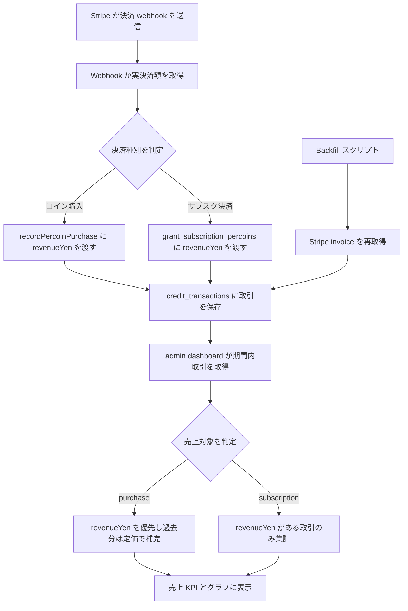
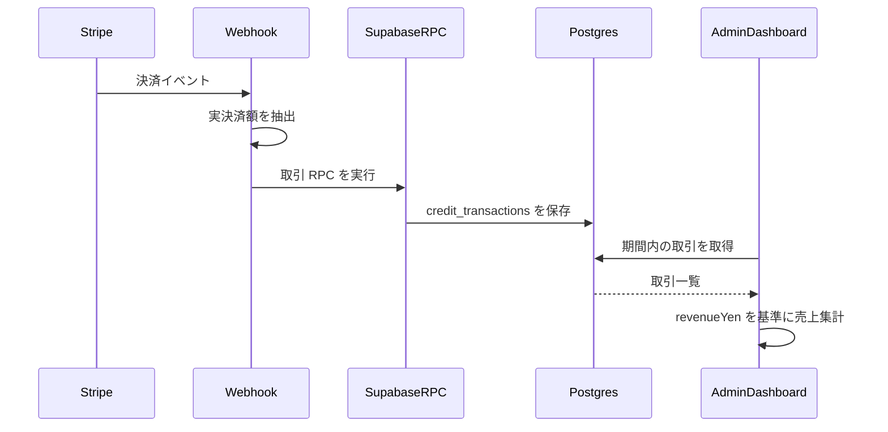
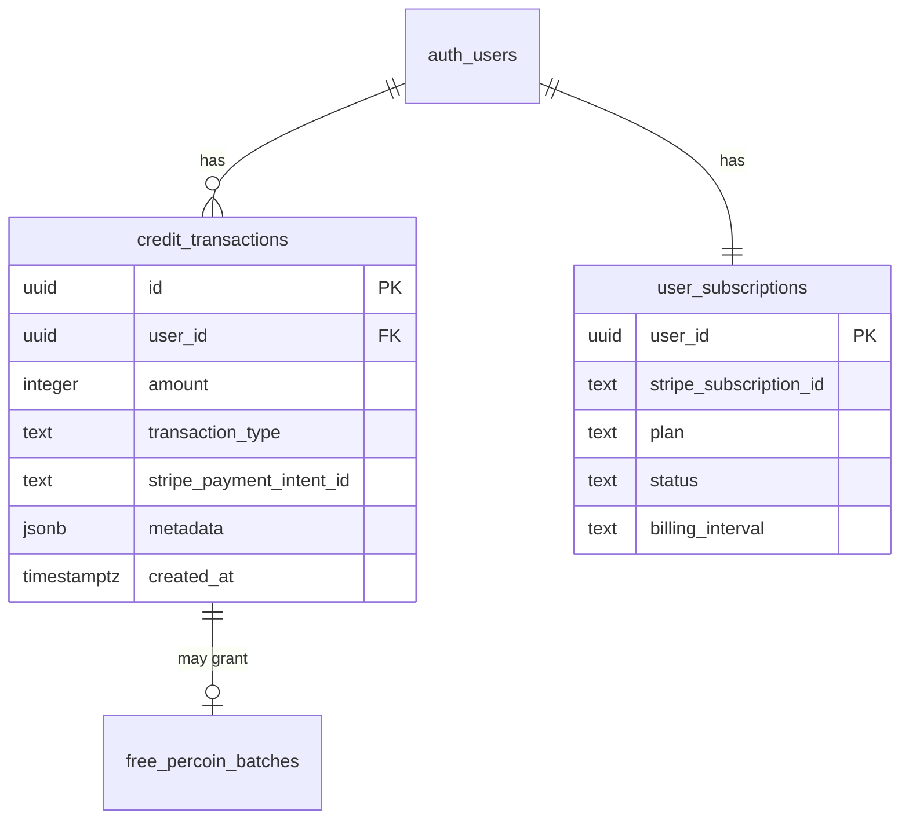
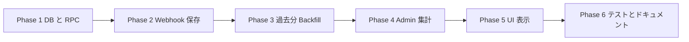

# Admin Dashboard Real Revenue Implementation Plan

## コードベース調査結果

- Supabase 接続確認: Supabase MCP の `list_tables` で `public.credit_transactions` と `public.user_subscriptions` を確認できた。`credit_transactions` は RLS 有効、主要カラムは `user_id`, `amount`, `transaction_type`, `stripe_payment_intent_id`, `metadata`, `created_at`。`user_subscriptions` は `plan`, `status`, `billing_interval`, `stripe_subscription_id` を持つ。
- データ方針: `docs/architecture/data.ja.md` では、Stripe 購入確定は `/api/stripe/webhook` が担い、ウォレット更新や冪等性が必要な処理は SQL RPC に寄せる方針。今回も webhook で実決済額を取り、既存取引台帳 `credit_transactions.metadata` に追記する。
- 既存購入フロー: `app/api/stripe/webhook/route.ts` の `handlePercoinCheckoutCompleted` が `checkout.session.completed` を処理し、`recordPercoinPurchase` を呼ぶ。`features/credits/lib/percoin-service.ts` は `apply_percoin_transaction` RPC に `metadata` を渡せるため、コイン購入は新規テーブルなしで `metadata.revenueYen` を追加できる。
- 既存サブスクフロー: `app/api/stripe/webhook/route.ts` の `handleSubscriptionCheckoutCompleted` と `handleSubscriptionInvoicePaid` がサブスク初回決済と更新決済を扱い、`grant_subscription_percoins` RPC を呼ぶ。現行 RPC は `p_metadata` を受け取らないため、サブスク決済額を台帳へ残すには migration で拡張が必要。
- 過去分反映: 既存のサブスク取引には `metadata.revenueYen` がないため、過去分は Stripe の invoice または Checkout Session を再取得して、実決済額のみを `credit_transactions.metadata` に backfill する。プラン定価からの推定補完は行わない。
- 年額サブスク月次付与: `supabase/migrations/20260331193000_add_yearly_subscription_monthly_grants.sql` の `grant_due_yearly_subscription_percoins()` が `yearly-monthly` 形式の invoice id で追加付与を行う。これは実決済ではないため、売上対象にしてはいけない。
- 既存 admin dashboard 集計: `features/admin-dashboard/lib/get-admin-dashboard-data.ts` は `credit_transactions` を期間取得し、`transaction_type = "purchase"` かつ `metadata.mode = "live"` のみを売上 KPI、売上トレンド、平均購入単価、最新購入、ファネルの購入ステップに使っている。
- 既存売上金額解決: `features/admin-dashboard/lib/purchase-value.ts` は `priceId`, `packageId`, `amount` から `PERCOIN_PACKAGES` の定価へ解決する。これは過去コイン購入データ互換のため残すが、今後のコイン購入は `metadata.revenueYen` を優先する。
- UI 配置: admin dashboard UI は `features/admin-dashboard/components/` にあり、ページは `app/(app)/admin/page.tsx` から Server Component で `getAdminDashboardData` を呼び、props で表示している。新規ページや API は不要。
- Admin 認証: admin ページは `app/(app)/admin/layout.tsx` で `getUser()` と `getAdminUserIds()` により保護される。今回の集計はページ配下の server-side データ取得であり、追加 API 認証は不要。
- 参照ドキュメント: `docs/development/project-conventions.ja.md` は feature 固有コードを `features/` に置き、複数テーブルに跨る業務処理を SQL RPC に寄せる方針。`.cursor/rules/database-design.mdc` は schema ledger だが、現行 migration に対して `subscription` 関連の備考が一部古いため、DB 挙動変更時に更新対象とする。

## 1. 概要図

#### 決済記録と売上集計フロー

#### Webhook と DB 更新シーケンス

#### データモデル

## 2. EARS 要件定義

| ID | Type | Requirement |
| --- | --- | --- |
| REV-001 | Event-driven | When a live Percoin Checkout Session is completed, the system shall store Stripe's actual paid amount in `credit_transactions.metadata.revenueYen`. / ライブのペルコイン Checkout Session が完了した場合、システムは Stripe の実決済額を `credit_transactions.metadata.revenueYen` に保存しなければならない。 |
| REV-002 | Event-driven | When a subscription checkout or renewal invoice is paid, the system shall store Stripe's actual paid amount in the subscription credit transaction metadata. / サブスクリプションの初回決済または更新 invoice が支払われた場合、システムは実決済額をサブスク付与取引の metadata に保存しなければならない。 |
| REV-003 | State-driven | While rendering the admin dashboard revenue KPI and trend, the system shall include purchase transactions using `metadata.revenueYen` when present. / 管理ダッシュボードの売上 KPI とトレンドを表示している間、システムは `metadata.revenueYen` がある購入取引ではその値を使用しなければならない。 |
| REV-004 | State-driven | While rendering legacy purchase revenue, the system shall keep the existing package-price fallback only for purchase transactions without `metadata.revenueYen`. / 既存購入データの売上を表示している間、システムは `metadata.revenueYen` がない購入取引に限り既存のパッケージ価格補完を維持しなければならない。 |
| REV-005 | State-driven | While rendering subscription revenue, the system shall include only subscription transactions that have numeric `metadata.revenueYen`. / サブスク売上を表示している間、システムは数値の `metadata.revenueYen` を持つサブスク取引のみを含めなければならない。 |
| REV-006 | State-driven | While processing yearly subscription monthly grants, the system shall not count non-payment grant transactions as revenue. / 年額サブスクの月次付与を処理している間、システムは追加決済を伴わない付与取引を売上として数えてはならない。 |
| REV-007 | Event-driven | When displaying recent revenue transactions, the admin dashboard shall label the list as latest payments and include both Percoin purchases and subscription payments. / 最新売上取引を表示する場合、管理ダッシュボードは一覧を最新決済として表示し、ペルコイン購入とサブスク決済の両方を含めなければならない。 |
| REV-008 | Error-driven | If Stripe paid amount is missing from a subscription payment event, then the system shall not infer subscription revenue from plan price. / サブスク決済イベントで Stripe の実決済額が取得できない場合、システムはプラン価格からサブスク売上を推定してはならない。 |
| REV-009 | Error-driven | If Stripe webhook processing receives a duplicate payment event, then the system shall preserve existing idempotency and avoid duplicate revenue transactions. / Stripe webhook が重複決済イベントを受け取った場合、システムは既存の冪等性を維持し、売上取引を重複作成してはならない。 |
| REV-010 | Event-driven | When a revenue backfill is executed for historical subscription transactions, the system shall retrieve the actual paid amount from Stripe invoice or Checkout Session before updating metadata. / 過去サブスク取引の売上 backfill を実行する場合、システムは metadata 更新前に Stripe invoice または Checkout Session から実決済額を取得しなければならない。 |
| REV-011 | Error-driven | If a historical subscription transaction cannot be matched to Stripe or is not JPY, then the backfill shall skip the transaction and report the reason. / 過去サブスク取引が Stripe と照合できない、または JPY ではない場合、backfill はその取引をスキップし理由を出力しなければならない。 |

## 3. ADR

### ADR-001: 実決済額は `credit_transactions.metadata` に保存する

- **Context**: 売上集計は `credit_transactions` を既に参照しており、コイン購入とサブスク付与はどちらも同じ台帳に記録される。
- **Decision**: 新規テーブルは作らず、`metadata.revenueYen` と `metadata.revenueSource` を追加する。
- **Reason**: 既存集計ルートに合流でき、RLS と service role 書き込みの既存モデルを維持できる。サブスク月次付与は `revenueYen` の有無で売上対象から除外できる。
- **Consequence**: JSONB metadata の規約をテストで固定する必要がある。将来、返金や税内訳まで扱う場合は専用 payment ledger の検討余地がある。

### ADR-002: サブスク売上はプラン価格で補完しない

- **Context**: サブスクでは割引、クーポン、日割り、更新失敗、年額月次付与などにより、プラン定価と実売上が一致しない可能性がある。
- **Decision**: サブスクは数値の `metadata.revenueYen` がある取引だけ売上対象にする。
- **Reason**: ユーザー要件は「Stripe の実決済額のみ」。推定補完は売上の過大計上につながる。
- **Consequence**: 過去のサブスク決済で `revenueYen` がないものは最小実装では集計されない。必要なら別途バックフィル計画を作る。

### ADR-003: コイン購入は過去互換のため定価補完を残す

- **Context**: 既存のコイン購入取引には `revenueYen` がないため、完全に実決済額のみへ切り替えると過去の売上グラフが欠落する。
- **Decision**: コイン購入は `metadata.revenueYen` を優先し、ない場合のみ既存のパッケージ価格解決を使う。
- **Reason**: 過去表示を壊さず、今後の精度を上げられる。
- **Consequence**: コイン購入とサブスクで fallback 方針が異なるため、`resolveTransactionRevenue` のテストで明示する。

### ADR-004: 過去サブスク売上は Stripe から backfill する

- **Context**: 実装前に発生したサブスク決済は `credit_transactions.metadata.revenueYen` を持たない。
- **Decision**: 一回限りの script を用意し、dry-run で対象と取得金額を確認してから `--apply` で metadata を更新する。
- **Reason**: Stripe の invoice / Checkout Session が実決済額の source of truth であり、プラン価格推定より正確。DB migration に推定ロジックを埋め込まず、運用時に範囲を限定できる。
- **Consequence**: backfill 実行には Stripe secret key と Supabase service role key が必要。取得できない取引はスキップされ、必要なら手動調査する。

## 4. 実装計画

#### フェーズ間の依存関係

#### Phase 1: DB と RPC 拡張

目的: サブスク付与 RPC が任意 metadata を受け取り、実決済額を `credit_transactions.metadata` に保存できるようにする。
ビルド確認: migration SQL が既存 `grant_subscription_percoins(uuid, integer, text)` 呼び出しと互換であること。

- [ ] `supabase/migrations/` に `grant_subscription_percoins(p_metadata jsonb default '{}'::jsonb)` を追加する migration を作成する。既存の `supabase/migrations/20260331110000_add_subscription_system.sql` を参考。
- [ ] `p_metadata` を既存の `invoice_id`, `requested_amount`, `granted_amount`, `granted_at` と merge して保存する。
- [ ] 既存の年額月次付与 `supabase/migrations/20260331193000_add_yearly_subscription_monthly_grants.sql` の呼び出しは引数追加なしで動くよう default を維持する。
- [ ] `.cursor/rules/database-design.mdc` の `credit_transactions.transaction_type` と `free_percoin_batches.source` 備考が現行 schema と一致するよう更新する。

#### Phase 2: Stripe webhook 保存

目的: コイン購入とサブスク決済の実決済額を台帳 metadata に保存する。
ビルド確認: `app/api/stripe/webhook/route.ts` が型チェック上、Stripe の `amount_total` / `amount_paid` を安全に扱うこと。

- [ ] `app/api/stripe/webhook/route.ts` の `handlePercoinCheckoutCompleted` で `session.amount_total` を `metadata.revenueYen` として `recordPercoinPurchase` に渡す。既存の `priceId`, `checkoutSessionId`, `mode` metadata を参考。
- [ ] `handleSubscriptionCheckoutCompleted` で `session.amount_total` を `grantSubscriptionPercoins` に渡す。
- [ ] `handleSubscriptionInvoicePaid` で `invoice.amount_paid` を `grantSubscriptionPercoins` に渡す。
- [ ] `amount_total` / `amount_paid` が数値でない場合は `revenueYen` を `null` 相当にし、サブスク売上では推定補完しない。
- [ ] 既存の `stripe_payment_intent_id` / `invoice_id` による冪等性を維持する。

#### Phase 3: 過去分 Backfill

目的: 実装前に発生したサブスク決済を、Stripe の実決済額に基づき `metadata.revenueYen` へ反映する。
ビルド確認: script が dry-run で対象取引と取得元を表示し、`--apply` なしでは DB を変更しないこと。

- [ ] `scripts/backfill-subscription-revenue.mjs` を追加する。既存 `scripts/verify-banners.mjs` の env 読み込みパターンを参考。
- [ ] `--from` と `--to` で `credit_transactions.created_at` の範囲を限定する。
- [ ] `transaction_type = "subscription"` かつ `metadata.revenueYen` が未設定の取引だけを候補にする。
- [ ] `stripe_payment_intent_id` または `metadata.invoice_id` が `in_` で始まる場合は Stripe invoice を取得し、`amount_paid` と `currency` を確認する。
- [ ] `cs_` で始まる Checkout Session しかない場合は session を取得し、`amount_total` と `currency` を確認する。
- [ ] JPY 以外、Stripe オブジェクト不明、金額欠落は skip し、理由をログに出す。
- [ ] `--apply` がある場合だけ `metadata.revenueYen`, `revenueSource`, `revenueCurrency`, `revenueBackfilledAt`, `revenueBackfillStripeObjectId` を更新する。

#### Phase 4: Admin 売上集計

目的: 既存の売上 KPI とグラフに、実決済額ベースのサブスク決済を合流させる。
ビルド確認: `features/admin-dashboard/lib/get-admin-dashboard-data.ts` と `purchase-value.ts` のユニットテストが通ること。

- [ ] `features/admin-dashboard/lib/purchase-value.ts` に `resolveTransactionRevenue` を追加する。既存 `resolvePurchasePackage` を参考。
- [ ] コイン購入は `metadata.revenueYen` を優先し、ない場合は既存の `resolvePurchasePackage` で過去互換を維持する。
- [ ] サブスクは `metadata.revenueYen` が数値の場合だけ `yenValue` を返し、プラン価格補完は行わない。
- [ ] `features/admin-dashboard/lib/get-admin-dashboard-data.ts` の売上対象を `transaction_type = purchase` の live 取引と、`transaction_type = subscription` かつ `revenueYen` がある取引へ拡張する。
- [ ] 売上 KPI、売上トレンド、平均決済単価、決済ユーザー数、ファネルの購入ステップ、最新決済一覧が同じ revenue transaction set を使うようにする。

#### Phase 5: UI 表示調整

目的: 既存 admin dashboard UI を、購入だけでなく決済全体を表す表示へ調整する。
ビルド確認: admin dashboard の RSC props と client chart props の型が一致すること。

- [ ] `features/admin-dashboard/components/AdminRecentPurchasesTable.tsx` の見出しを「最新決済」に変更する。既存テーブル構造を参考に新規コンポーネントは作らない。
- [ ] 空状態文言を「この期間に決済はありません。」へ変更する。
- [ ] `features/admin-dashboard/components/AdminOpsSummaryCard.tsx` の説明を平均決済単価、売上対象の決済件数、決済ユーザー数へ変更する。
- [ ] サブスク行のラベルは `サブスクリプション light 月額` のようにし、追加の詳細画面は作らない。

#### Phase 6: テストとドキュメント

目的: 実決済額優先、サブスク非補完、過去コイン購入互換をテストと docs に固定する。
ビルド確認: 対象ユニットテスト、変更ファイル lint、可能なら build が通ること。

- [ ] `tests/unit/features/admin-dashboard/purchase-value.test.ts` を追加し、コイン購入の `revenueYen` 優先、コイン購入の定価 fallback、サブスクの `revenueYen` 必須、年額月次付与除外を確認する。
- [ ] backfill script は dry-run と apply の手順を手動確認し、実行ログを PR または作業メモに残す。
- [ ] 必要に応じて webhook route の unit test に metadata 伝播のケースを追加する。既存 `tests/unit/app/api/subscription/checkout-route.test.ts` などの route test パターンを参考。
- [ ] `docs/API.md` と `docs/openapi.yaml` の Stripe webhook 説明が実際の処理イベントと大きくズレている場合は更新する。
- [ ] `docs/architecture/data.ja.md` は購入フローに `metadata.revenueYen` を追記するか、別 PR に分ける判断をする。

## 5. 修正対象ファイル一覧

| ファイル | 操作 | 変更内容 |
| --- | --- | --- |
| `supabase/migrations/20260501120000_add_subscription_revenue_metadata.sql` | 新規 | `grant_subscription_percoins` に `p_metadata` を追加し、サブスク決済額を metadata に保存可能にする |
| `scripts/backfill-subscription-revenue.mjs` | 新規 | 過去サブスク取引の `revenueYen` を Stripe 実決済額から backfill する |
| `app/api/stripe/webhook/route.ts` | 修正 | コイン購入とサブスク決済で Stripe 実決済額を `revenueYen` として渡す |
| `features/admin-dashboard/lib/purchase-value.ts` | 修正 | `resolveTransactionRevenue` を追加し、purchase と subscription の売上金額解決を統一 |
| `features/admin-dashboard/lib/get-admin-dashboard-data.ts` | 修正 | 売上対象取引を purchase live と subscription revenueYen 付き取引に拡張 |
| `features/admin-dashboard/components/AdminRecentPurchasesTable.tsx` | 修正 | 最新購入を最新決済の表示へ変更 |
| `features/admin-dashboard/components/AdminOpsSummaryCard.tsx` | 修正 | 購入件数表現を決済件数表現へ変更 |
| `tests/unit/features/admin-dashboard/purchase-value.test.ts` | 新規 | 売上金額解決ルールをユニットテストで固定 |
| `.cursor/rules/database-design.mdc` | 修正 | `subscription` transaction type と source の schema ledger を現行に合わせる |
| `docs/API.md` / `docs/openapi.yaml` | 修正 | 必要に応じて Stripe webhook の対象イベント説明を更新 |

## 6. 品質・テスト観点

#### 品質チェックリスト

- [ ] **エラーハンドリング**: Stripe の金額が欠ける場合、サブスク売上を推定補完しない。
- [ ] **権限制御**: admin dashboard は既存 `app/(app)/admin/layout.tsx` の `getUser()` と `getAdminUserIds()` で保護される。新規公開 API は作らない。
- [ ] **データ整合性**: コイン購入は既存 `apply_percoin_transaction`、サブスクは `grant_subscription_percoins` に寄せ、台帳と残高更新の原子性を維持する。
- [ ] **冪等性**: コイン購入は `stripe_payment_intent_id`、サブスクは `invoice_id` を使う既存重複防止を維持する。
- [ ] **セキュリティ**: `revenueYen` はクライアント入力ではなく Stripe webhook の server-side payload から解決する。
- [ ] **i18n**: admin UI の固定日本語文言のみ変更。ユーザー向け i18n 翻訳は不要。

#### テスト観点

| カテゴリ | テスト内容 |
| --- | --- |
| 正常系 | コイン購入で `metadata.revenueYen` がある場合、その金額が売上に使われる |
| 正常系 | コイン購入で `metadata.revenueYen` がない過去データは、既存パッケージ価格で表示される |
| 正常系 | サブスクで `metadata.revenueYen` がある場合、売上 KPI とトレンドに含まれる |
| 異常系 | サブスクで `metadata.revenueYen` がない場合、プラン価格で補完されず売上対象外になる |
| 異常系 | 年額サブスク月次付与の `yearly-monthly` 取引が売上対象外になる |
| 運用 | backfill dry-run で対象件数、取得元、更新予定金額が確認できる |
| 運用 | backfill apply で `metadata.revenueYen` が追加され、再実行時は対象外になる |
| 表示 | 最新決済一覧でコイン購入とサブスク決済が時系列に混在表示される |
| 回帰 | 既存の purchase live フィルタと mock/test 除外が維持される |

#### 実行コマンド

- `npm test -- tests/unit/features/admin-dashboard/purchase-value.test.ts --runInBand`
- `npx eslint app/api/stripe/webhook/route.ts features/admin-dashboard/lib/get-admin-dashboard-data.ts features/admin-dashboard/lib/purchase-value.ts features/admin-dashboard/components/AdminRecentPurchasesTable.tsx features/admin-dashboard/components/AdminOpsSummaryCard.tsx tests/unit/features/admin-dashboard/purchase-value.test.ts`
- `node --env-file=.env.local scripts/backfill-subscription-revenue.mjs --from 2026-04-30 --to 2026-05-01`
- `node --env-file=.env.local scripts/backfill-subscription-revenue.mjs --from 2026-04-30 --to 2026-05-01 --apply`
- `npm run typecheck`
- 必要に応じて `npm run build -- --webpack`

## 7. ロールバック方針

- **Git**: Phase 単位で commit し、問題発生時は該当 commit を revert する。
- **DB migration**: 追加する RPC 変更は default 引数付きで後方互換にする。問題があれば旧シグネチャ相当の `grant_subscription_percoins(uuid, integer, text)` 定義へ戻す migration を作る。
- **外部サービス**: Stripe webhook の既存処理は維持し、metadata 追加のみとする。metadata 追加に失敗する場合は既存の取引保存自体を壊さない設計を優先する。
- **表示**: Admin 集計ロジックを元の `purchase live` のみへ戻せば、UI は既存売上表示へ復帰できる。
- **バックフィルなし**: 過去サブスク売上は最小実装では対象外なので、rollback 時に過去データ修正は不要。

## 8. 使用スキル

| スキル | 用途 | フェーズ |
| --- | --- | --- |
| `implementation-planning` | EARS、ADR、フェーズ別計画作成 | 計画 |
| `project-database-context` | DB、RLS、RPC、migration 方針の確認 | Phase B、Phase 1 |
| `test-flow` | 実装後のテストワークフロー整理 | Phase 5 |
| `spec-extracting` | 実装後の EARS 仕様抽出 | Phase 5 |
| `spec-writing` | 仕様精査 | Phase 5 |
| `test-generating` | テスト追加 | Phase 5 |
| `test-reviewing` | テスト品質確認 | Phase 5 |
| `spec-verifying` | 仕様とテストの整合確認 | Phase 5 |
| `codex-webpack-build` | 本番 build 確認 | Phase 5 |

## 整合性チェック

- **図とスキーマの整合性**: 新規 status は追加しない。既存 `transaction_type` の `purchase` と `subscription`、既存 `metadata` を使う。
- **認証モデルの一貫性**: 書き込みは Stripe webhook の service role、読み取りは admin dashboard の server-side `createAdminClient()`。ユーザー入力由来の金額は使わない。
- **データフェッチの整合性**: 既存 `app/(app)/admin/page.tsx` から `getAdminDashboardData` を呼ぶ RSC パターンを維持する。
- **イベント網羅性**: 新規イベントテーブルは作らず、Stripe の既存決済イベントに metadata を追加する。表示されなかった状態などの UI analytics は対象外。
- **APIパラメータのソース安全性**: `userId` は webhook の既存 Stripe metadata または session reference から解決し、`revenueYen` は Stripe server-side payload から解決する。
- **ビジネスルールのDB層での強制**: 冪等性とウォレット更新は既存 RPC と unique index に従う。サブスク売上対象判定は admin 集計層で `metadata.revenueYen` の有無を明示的に検証する。
