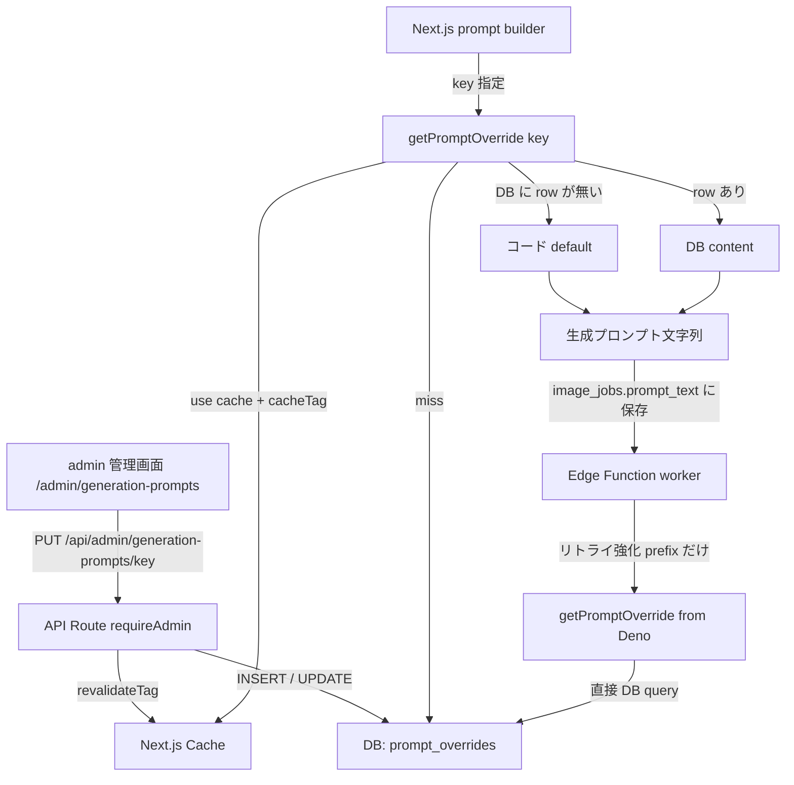
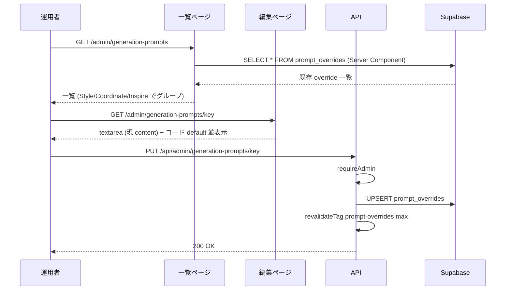
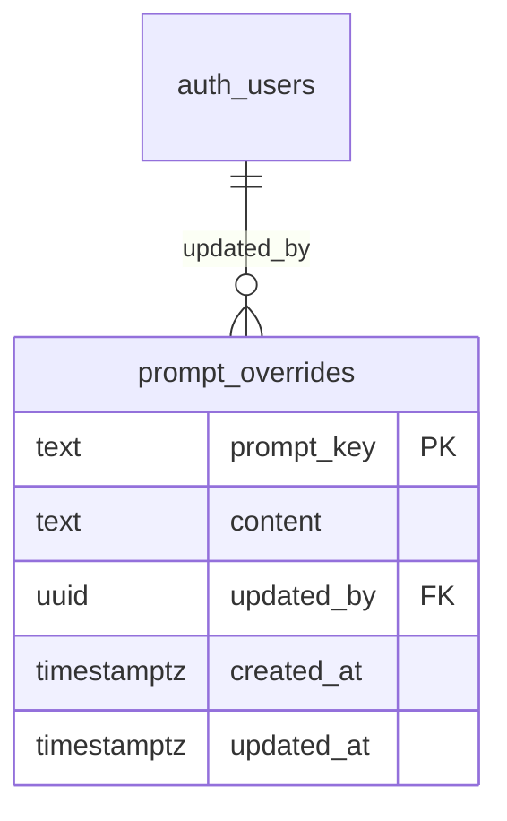
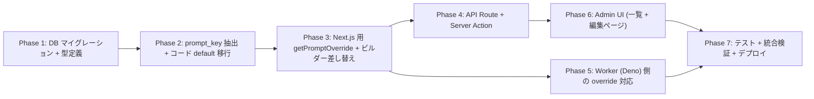

# admin 管理画面から生成プロンプトを編集可能にする

## 背景

Style / Coordinate / Inspire の生成リクエストで使われるシステムプロンプトは現状、`shared/generation/prompt-core.ts` と `shared/generation/style-prompts.ts` に TypeScript の `export const` / `export function` としてハードコードされている。文言を変更したい場合は **コード修正 + デプロイ** が必要で、運用者 (非エンジニア) が改善サイクルを回せない。

これを admin 管理画面からテキスト編集できるようにする。

## 目的

- 主要な生成プロンプトを admin 画面から運用者が直接編集できるようにする
- 保存後は次の生成ジョブから即時反映 (キャッシュ無効化込み)
- DB に override が無ければ常にコード default にフォールバック (DB 障害時も生成は止めない)
- 履歴・rollback は今回スコープ外 (将来必要になったら audit log 拡張で追加)

## やらないこと

- 編集履歴 / バージョン管理 / rollback UI
- ビルダー関数 (`buildPrompt` / `buildInspirePrompt`) の **分岐ロジック自体** や `sanitizeUserInput` の編集 (テキスト素材のみ編集可)
- override 4 種類の組み合わせ全 16 通りの個別編集 (「すべて維持」 + 「override 4 種類個別」の **5 key** のみ)
- 多言語化 (en/ja 切替。現状プロンプトはほぼ英語 + 一部日本語混在のまま)
- A/B テスト / バージョン分岐 (常に「現行版」だけが適用)
- プロンプト dry-run プレビュー (実際に生成して見るのは既存の生成画面でやる)

---

## コードベース調査結果 (Phase B)

### B-1: Supabase 接続確認

- リンク済みプロジェクト: `hnrccaxrvhtbuihfvitc` (AI coordinate, Sydney)
- `supabase db query --linked` で参照系クエリは即時実行可能 (確認済)
- `supabase migration up` / `supabase functions deploy` も別途利用可能 (CLAUDE.md 許可済)

### B-2: 既存類似機能の調査

#### 参考にする admin 機能 = `style-presets`

| 関心事 | 該当箇所 | パターン |
|--------|---------|---------|
| ページ | `app/(app)/admin/style-presets/page.tsx` | Server Component。`getUser()` + `getAdminUserIds()` で認証 → DB 取得 → Client へ props |
| クライアント | `features/style-presets/components/AdminStylePresetsClient.tsx` | useTransition + FormData POST + optimistic UI |
| API GET/POST | `app/api/admin/style-presets/route.ts` | `requireAdmin()` で認証 |
| API PUT/DELETE | `app/api/admin/style-presets/[id]/route.ts` | 同上 |
| Repository | `features/style-presets/lib/style-preset-repository.ts` | admin client で RLS バイパス |
| Cache invalidate | `features/style-presets/lib/revalidate-style-presets.ts` | `revalidateTag("style-presets", "max") + revalidatePath()` |
| Admin Nav | `app/(app)/admin/admin-nav-items.ts` L101-105 | 配列に項目追加するだけ |

#### Admin 認証パターン (二重構成)

- **ページ**: `getUser()` + `getAdminUserIds().includes(user.id)` → 不可なら `redirect("/")`
- **API**: `requireAdmin()` (`lib/auth.ts`) → 不可なら NextResponse エラー

#### キャッシュ戦略

`features/popup-banners/lib/get-active-popup-banners.ts` / `features/catalog/lib/get-public-catalog.ts` の踏襲:
- 取得関数: `"use cache"` ディレクティブ + `cacheTag(...)` + `cacheLife("minutes")`
- 更新 API: `revalidateTag("...", "max") + revalidatePath("...")` で即時反映

### B-3: 影響範囲 (Impact area)

`shared/generation/style-prompts.ts` を import している箇所:

| ファイル | 用途 | 実行コンテキスト |
|---|---|---|
| `app/(app)/style/generate-async/handler.ts` | `buildStyleGenerationPrompt()` (job 作成時にプロンプト全文を組み立てて `image_jobs.prompt_text` に保存) | Next.js Route Handler |
| `app/(app)/style/generate/handler.ts` | 同期 style 生成 | Next.js Route Handler |
| `app/api/style-templates/preview-generation/handler.ts` | `buildInspirePrompt()` (Inspire テンプレプレビュー) | Next.js Route Handler |
| `features/generation/lib/coordinate-guest-api.ts` | 各種 prompt 構築 | Next.js shared lib |
| `supabase/functions/image-gen-worker/index.ts` | `buildStyleAttemptReinforcementPrefix()` (リトライ時の強化 prefix のみ) | **Supabase Edge Function (Deno)** |

**重要**: worker は **リトライ強化文** だけ呼んでいる。本体プロンプトは Next.js 側で job 作成時に組み立て `image_jobs.prompt_text` に保存され、worker はそれを使う。

したがって:
- 本体プロンプト (`STYLE_PROMPT_BASE_PREFIX`, `buildInspirePrompt` 等) の DB 読込みは **Next.js 側だけで OK**
- リトライ強化文だけは **worker (Deno) も DB 読込みが必要**

### B-4: 参照ドキュメント

- `docs/architecture/data.ja.md` L84-113: 管理画面・cached server component では `createAdminClient()` で RLS バイパスする方針
- `docs/architecture/data.ja.md` L115-131: 複数テーブル跨る変更は RPC へ。今回は単一テーブルの単純 CRUD なので RPC 不要
- `.cursor/rules/database-design.mdc` L329-334 (`style_presets`): `created_by` / `updated_by` / `created_at` / `updated_at` を必ず持たせるパターン
- `docs/development/project-conventions.ja.md` L54-80: `features/[feature-name]/` 配下に repository / components を集約

---

## 1. 概要図

### 1.1 全体アーキテクチャ



### 1.2 編集フロー



### 1.3 データモデル



---

## 2. EARS (要件定義)

| ID | 要件 |
|----|------|
| REQ-1 | When admin が `/admin/generation-prompts` を開くと, the system shall コード default と DB override を統合した全 prompt_key の一覧をグループ別 (Style / Coordinate / Inspire / Reinforcement) で表示する。<br>**EN**: When an admin opens `/admin/generation-prompts`, the system shall display a unified list of all prompt keys (default + overrides) grouped by category. |
| REQ-2 | When admin が 1 key の編集ページを開くと, the system shall コード default テキストと現在の override テキストを並べて表示し、textarea で編集可能にする。<br>**EN**: When an admin opens a key's edit page, the system shall display both the code default and the current override in editable textarea. |
| REQ-3 | When admin が 編集後 「保存」 を押すと, the system shall DB に UPSERT し、`prompt-overrides` cache tag を revalidate して即時反映する。<br>**EN**: When an admin saves edits, the system shall UPSERT to DB and revalidate the cache tag for immediate effect. |
| REQ-4 | When admin が 「default に戻す」を押すと, the system shall DB から該当行を削除し、override 無し状態 (= コード default が使われる状態) に戻す。<br>**EN**: When an admin clicks "reset to default", the system shall DELETE the row, falling back to the code default. |
| REQ-5 | While prompt 生成中、the system shall `getPromptOverride(key)` で cache → DB → code default の順に解決する。<br>**EN**: While building prompts, the system shall resolve via cache → DB → code default. |
| REQ-6 | If DB クエリが失敗した場合, then the system shall コード default にフォールバックし、生成リクエストは続行する (`console.error` で記録)。<br>**EN**: If DB lookup fails, then the system shall fall back to code default and continue serving the request. |
| REQ-7 | Where Edge Function worker でリトライ強化 prefix を取得する時, the system shall 同等のフォールバックロジックで DB 直接クエリし、失敗時は code default を使う。<br>**EN**: Where the worker fetches retry reinforcement prefixes, the system shall use the same fallback logic via direct DB query. |
| REQ-8 | If 非 admin ユーザーが `/admin/generation-prompts` や `/api/admin/generation-prompts*` にアクセスした場合, then the system shall ページは `/` へ redirect、API は 403 を返す。<br>**EN**: If a non-admin attempts access, then the system shall redirect pages to `/` and return 403 for APIs. |
| REQ-9 | When prompt の content に `{{varname}}` プレースホルダーが含まれる時, the system shall ビルダー関数側で正しい変数値に置換する。サポートされない変数名はそのまま残す (生成ログで気づける)。<br>**EN**: When a prompt contains `{{varname}}` placeholders, the system shall substitute them with the correct runtime values; unknown variables remain unsubstituted. |
| REQ-10 | While admin 編集画面、the system shall 「保存」ボタン押下中は disabled にし、保存完了でトースト通知を出す。<br>**EN**: While saving, the system shall disable the button and show a success toast on completion. |

---

## 3. ADR (設計判断記録)

### ADR-001: コード default + DB override のフォールバック設計

- **Context**: DB 障害時にも生成が止まらないことが運用上必須。また、初期セットアップ時に default 値の seed が必要かどうか。
- **Decision**: コード側に default 値を保持し、DB に override 行があれば DB を優先。DB が空 / クエリ失敗時は default にフォールバック。
- **Reason**: (a) DB 障害耐性 (b) 初期 seed 不要 (c) コードレビューで「最後に正だったテキスト」を確認可能 (d) admin 編集の差分が `git log` から見えないトレードオフは履歴不要の方針なので許容。
- **Consequence**: コードと DB に同じテキストが二重存在する状況になる。コード修正と DB override が乖離するケースに注意 (=「コードを直してデプロイしたのに反映されない」)。これは編集画面で「default 並表示」することで気づける。

### ADR-002: 履歴・rollback 機能は実装しない

- **Context**: 当初 audit log + rollback UI を提案していたが、運用者意見で「不要」となった。
- **Decision**: 1 テーブル構成 (`prompt_overrides` のみ)。`updated_at` / `updated_by` だけ持つ。
- **Reason**: スコープを小さく保ち、初期実装コストを抑える。必要になったら admin_audit_log への記録追加で対応可能。
- **Consequence**: 誤って保存した文言を取り戻すには手動で前の文言を再入力する必要がある (またはコード default にリセット)。

### ADR-003: テンプレ変数を `{{varname}}` プレースホルダーで表現

- **Context**: `buildStyleAttemptReinforcementPrefix(attempt)` のように関数引数が文字列に埋め込まれる prompt がある。admin が text として編集する場合、変数を表現する規約が必要。
- **Decision**: `{{varname}}` (Mustache 風) をプレースホルダーとして使う。ビルダー関数側でテンプレ展開する。
- **Reason**: (a) Mustache 風は広く認知 (b) JS の `${}` と衝突しない (c) 単純な正規表現で置換可能。
- **Consequence**: 変数名のタイポは生成ログで `{{wrongname}}` が残るので気づける (silent 失敗にしない)。テンプレ展開ヘルパが必要。

### ADR-004: prompt_key の命名規約

- **Context**: 15-30 個ある prompt key を体系化する必要がある。
- **Decision**: `<category>.<subkey>` 形式の dot-separated。例: `style.base_prefix`, `coordinate.main_body`, `inspire.keep_all`, `style.reinforcement.attempt_2plus`。
- **Reason**: 一覧画面でグループ表示が容易 (前方一致でフィルタ)、ファイル系統に対応。
- **Consequence**: prompt_key を変更すると DB 行 orphan が発生する → migration で旧 key を削除する運用が必要。

### ADR-005: worker (Deno) は本体プロンプトを DB 読込みしない

- **Context**: 本体プロンプトは Next.js 側で job 作成時に組み立てて `image_jobs.prompt_text` に保存。worker は保存済みテキストを使う。リトライ強化 prefix だけ worker で動的生成。
- **Decision**: worker は **リトライ強化 prefix の override のみ** DB から取得 (Deno + supabase-js)。本体プロンプトの override 取得は Next.js 側のみ。
- **Reason**: 既存アーキテクチャを尊重。worker の DB アクセスを最小化。
- **Consequence**: worker に小規模な DB クエリヘルパーを追加するだけで済む。Edge Function 再デプロイは必要。

### ADR-006: キャッシュは `cacheLife("minutes")` (~3-5 分)

- **Context**: prompt_overrides テーブルは admin 編集時のみ更新、頻度は低い。読み込みは生成ジョブごとに発生 (頻度高)。
- **Decision**: `"use cache"` + `cacheTag("prompt-overrides")` + `cacheLife("minutes")` を使い、更新時 `revalidateTag("prompt-overrides", "max")` で失効。
- **Reason**: 既存 popup-banners / catalog と同パターン。3-5 分の遅延は admin 編集の即時性として許容範囲 (即時性が必要なら revalidate で 0 秒)。
- **Consequence**: 編集後すぐに反映される (revalidate のおかげ)。万一 revalidate に失敗しても数分以内に自然失効。

---

## 4. 実装計画 (フェーズ + TODO)

### フェーズ間の依存関係



Phase 5 (worker) は P3 と並列実装可能。

---

### Phase 1: DB マイグレーション + 型定義

**目的**: `prompt_overrides` テーブルを作成し、admin だけが読み書きできる RLS を設定する。
**ビルド確認**: `npm run typecheck` で型定義が通る。

- [ ] マイグレーションファイル新規作成: `supabase/migrations/<timestamp>_add_prompt_overrides.sql`
  ```sql
  CREATE TABLE prompt_overrides (
    prompt_key TEXT PRIMARY KEY,
    content TEXT NOT NULL,
    updated_by UUID REFERENCES auth.users(id),
    created_at TIMESTAMPTZ NOT NULL DEFAULT now(),
    updated_at TIMESTAMPTZ NOT NULL DEFAULT now()
  );

  -- updated_at trigger (既存 set_updated_at() があれば再利用、無ければ作成)
  CREATE TRIGGER set_prompt_overrides_updated_at
    BEFORE UPDATE ON prompt_overrides
    FOR EACH ROW EXECUTE FUNCTION set_updated_at();

  ALTER TABLE prompt_overrides ENABLE ROW LEVEL SECURITY;

  -- RLS: admin client (service role) のみアクセス可。anon / authenticated は読み書き不可
  -- (admin 画面と Next.js 取得は admin client 経由なので RLS バイパス)
  CREATE POLICY "block_all_for_anon_and_authenticated" ON prompt_overrides
    FOR ALL TO anon, authenticated USING (false) WITH CHECK (false);

  COMMENT ON TABLE prompt_overrides IS 'admin 編集可能な生成 prompt の override 文言。
  既存類似: 参考なし (新カテゴリ)。詳細: docs/planning/admin-generation-prompt-editor-plan.md';
  ```
- [ ] `.cursor/rules/database-design.mdc` に `prompt_overrides` テーブルの定義を追記
- [ ] 型定義: `features/generation-prompts/types.ts` (新規) に `PromptKey` enum-like type 定義
  - 全 prompt_key を列挙した union type
- [ ] `npm run typecheck` 通過確認

### Phase 2: prompt_key 抽出 + コード default 移行

**目的**: 既存プロンプトを「key + default content」のレジストリとして集約する。
**ビルド確認**: `npm run lint && npm run typecheck`、既存テストが全て通る。

- [ ] 新規ファイル: `shared/generation/prompt-registry.ts`
  - 全 prompt_key を列挙する dict 構造
  - 各 key に対し `{ description, defaultContent, category, supportedVariables }` を持つ
  - 例:
    ```ts
    export const PROMPT_REGISTRY = {
      "style.base_prefix": {
        category: "style",
        description: "Style 画面共通の CRITICAL INSTRUCTION 前文",
        defaultContent: STYLE_PROMPT_BASE_PREFIX_DEFAULT, // 既存定数を rename
        supportedVariables: [],
      },
      "style.illustration_suffix": { ... },
      "style.real_suffix": { ... },
      "style.keep_background_suffix": { ... },
      "style.change_background_suffix": { ... },
      "style.reinforcement_attempt_2plus": {
        defaultContent: "...attempt {{attempt}} of 3...",
        supportedVariables: ["attempt"],
      },
      "coordinate.main_body": { ... },          // buildPrompt() coordinate 分岐
      "coordinate.specified_main_body": { ... }, // specified_coordinate
      "coordinate.full_body_main": { ... },
      "coordinate.chibi_main": { ... },
      "coordinate.background_keep": { ... },
      "coordinate.background_ai_auto": { ... },
      "coordinate.background_include_in_prompt": { ... },
      "coordinate.reinforcement_attempt_2plus": { ... },
      "inspire.keep_all": { ... },              // 全 override false の時
      "inspire.override_outfit": { ... },
      "inspire.override_angle": { ... },
      "inspire.override_pose": { ... },
      "inspire.override_background": { ... },
    } as const satisfies Record<string, PromptDefinition>;
    ```
- [ ] 既存定数 (`STYLE_PROMPT_BASE_PREFIX` 等) を `_DEFAULT` 接尾辞付きに rename、`shared/generation/style-prompts.ts` で registry から import
- [ ] `prompt-core.ts` の各分岐内のテキストリテラルも registry の defaultContent へ移行
- [ ] テンプレ変数のあるテキストは `{{varname}}` 表記に書き換え (`Attempt ${attempt}` → `Attempt {{attempt}}`)
- [ ] テンプレ展開ヘルパ `applyTemplate(text, vars)` を `shared/generation/prompt-template.ts` (新規) に実装
  - `text.replace(/\{\{(\w+)\}\}/g, ...)` ベース。`vars[name]` が無ければそのまま残す
- [ ] 既存ユニットテスト (style-prompts.test.ts, inspire-prompt.test.ts) が引き続き通ることを確認

### Phase 3: Next.js 用 getPromptOverride + ビルダー差し替え

**目的**: ビルダー関数を DB-aware にする (Next.js 経路)。
**ビルド確認**: `npm run typecheck`、既存ビルダー関数のテストが通る。

- [ ] 新規ファイル: `features/generation-prompts/lib/get-prompt-override.ts`
  - 関数 `getPromptOverride(key: PromptKey): Promise<string>`
    - `"use cache"` + `cacheTag("prompt-overrides")` + `cacheLife("minutes")`
    - admin client で `SELECT content FROM prompt_overrides WHERE prompt_key = $1`
    - 失敗 / 行なし → registry の `defaultContent` を返す
  - 関数 `getAllPromptOverrides(): Promise<Record<PromptKey, string>>`
    - 一度に全件取得 + registry とマージ。admin 一覧画面用
- [ ] `shared/generation/prompt-core.ts` と `shared/generation/style-prompts.ts` のビルダー関数を async 化
  - `buildStyleGenerationPrompt()` → `await getPromptOverride("style.base_prefix")` 等
  - `buildPrompt()` → 同様に async
  - `buildInspirePrompt()` → 同様に async
- [ ] 呼び出し側 (`app/(app)/style/generate-async/handler.ts`, `app/api/style-templates/preview-generation/handler.ts`, etc) を全て `await` 対応に更新
- [ ] 既存テストを async に更新

### Phase 4: API Route

**目的**: admin が edit / reset するための API endpoint を提供。
**ビルド確認**: `npm run lint && npm run typecheck`、新規 API のテスト通過。

- [ ] 新規: `features/generation-prompts/lib/admin-repository.ts`
  - `listAllPrompts()` (registry + DB override マージ)
  - `upsertPromptOverride(key, content, userId)`
  - `deletePromptOverride(key)`
- [ ] 新規: `app/api/admin/generation-prompts/route.ts`
  - `GET`: 全 key を default + override 統合で返す
- [ ] 新規: `app/api/admin/generation-prompts/[key]/route.ts`
  - `PUT`: requireAdmin → upsert → revalidateTag("prompt-overrides", "max") + revalidatePath
  - `DELETE`: requireAdmin → delete (= default にリセット) → revalidate
- [ ] 入力 validation:
  - `prompt_key` は registry に存在する key のみ許可 (ホワイトリスト)
  - `content` は max 10,000 文字 (XSS / DoS 対策)
  - サポートされない `{{varname}}` を含む場合は warn (block しない、registry に supportedVariables を持たせ照合)

### Phase 5: Worker (Deno) 側の override 対応

**目的**: worker のリトライ強化 prefix も DB override を尊重する。
**ビルド確認**: `deno check supabase/functions/image-gen-worker/index.ts` で 25 件以下 (= 既存と同じベースライン)。

- [ ] 新規: `supabase/functions/image-gen-worker/prompt-override.ts`
  - `async function getReinforcementPrompt(key: ReinforcementKey, supabase): Promise<string>`
  - admin client (worker は service role) で 1 行クエリ。失敗時は registry default を返す
  - 簡易メモリキャッシュ (worker invocation 内で 1 回だけ取得) はオプション
- [ ] `supabase/functions/image-gen-worker/index.ts` の `buildStyleAttemptReinforcementPrefix` 呼出し箇所を helper 経由に変更
- [ ] `shared/generation/prompt-registry.ts` から default を import (既存 cross-import パターン)
- [ ] `deno check` で新規エラーがないこと確認

### Phase 6: Admin UI (一覧 + 編集ページ)

**目的**: 運用者が直感的に編集できる UI。
**ビルド確認**: `npm run build -- --webpack` 通過 + ローカルで admin として動作確認。

- [ ] 一覧ページ: `app/(app)/admin/generation-prompts/page.tsx`
  - getUser + adminUserIds チェック (既存 admin page pattern)
  - `listAllPrompts()` を呼んで Server Component で取得
  - Client へ props 渡し
- [ ] 一覧 Client: `features/generation-prompts/components/AdminPromptsListClient.tsx`
  - category (Style / Coordinate / Inspire) でグループ表示
  - 各 key 行: label, 短い説明, override 有無バッジ, 編集リンク
- [ ] 編集ページ: `app/(app)/admin/generation-prompts/[key]/page.tsx`
  - Server で対象 key の default + 現 override を取得
  - 不明な key は notFound()
- [ ] 編集 Client: `features/generation-prompts/components/AdminPromptEditClient.tsx`
  - 大きな `<textarea>` (rows={20})
  - 上部に「コード default」を <pre> で表示 (折り畳み可)
  - 「保存」 / 「default に戻す」 / 「キャンセル」 ボタン
  - 「使える変数」の説明 (supportedVariables が空でなければ表示)
  - 保存中 disabled + 完了で toast
- [ ] Admin Nav 追加: `app/(app)/admin/admin-nav-items.ts`
  ```ts
  { path: "/admin/generation-prompts", label: "生成プロンプト管理", iconKey: "text" }
  ```
- [ ] i18n: `messages/ja.json` / `messages/en.json` にラベル追加 (今回はキー数少ない)

### Phase 7: テスト + 統合検証 + デプロイ

**目的**: 全体動作確認 + 本番反映。
**ビルド確認**: `npm run lint && npm run typecheck && npm run test && npm run build -- --webpack`。

- [ ] ユニットテスト:
  - `applyTemplate()` のテスト (`{{var}}` 置換、未定義変数、複数変数)
  - `getPromptOverride()` のテスト (cache hit/miss, fallback)
  - `admin-repository` のテスト
  - admin API route のテスト (auth + CRUD)
- [ ] 統合テスト:
  - style generate-async が override 適用済みプロンプトで job 作成すること
  - inspire preview が override 適用済みで動作すること
- [ ] `npm run lint && npm run typecheck && npm run test`
- [ ] `npm run build -- --webpack` (Turbopack 禁止)
- [ ] migration を本番適用 (`supabase migration up` — ユーザ承認が必要)
- [ ] Edge Function 再デプロイ (`supabase functions deploy image-gen-worker` — ユーザ承認が必要)
- [ ] Vercel デプロイ (PR マージで自動)

---

## 5. 修正対象ファイル一覧

| ファイル | 操作 | 変更内容 |
|----------|------|----------|
| `supabase/migrations/<ts>_add_prompt_overrides.sql` | 新規 | `prompt_overrides` テーブル + RLS + trigger |
| `.cursor/rules/database-design.mdc` | 修正 | `prompt_overrides` の定義を追記 |
| `shared/generation/prompt-registry.ts` | 新規 | 全 prompt_key のレジストリ (description / defaultContent / category / supportedVariables) |
| `shared/generation/prompt-template.ts` | 新規 | `{{varname}}` テンプレ展開ヘルパ |
| `shared/generation/style-prompts.ts` | 修正 | 既存定数を registry から読むよう変更 + `buildStyleGenerationPrompt` を async 化 |
| `shared/generation/prompt-core.ts` | 修正 | 各分岐内テキストを registry に移行 + `buildPrompt` / `buildInspirePrompt` を async 化 |
| `features/generation-prompts/types.ts` | 新規 | `PromptKey` union type, `PromptCategory` |
| `features/generation-prompts/lib/get-prompt-override.ts` | 新規 | Next.js 用 `getPromptOverride` (use cache 付き) |
| `features/generation-prompts/lib/admin-repository.ts` | 新規 | admin client 経由の CRUD |
| `app/api/admin/generation-prompts/route.ts` | 新規 | GET (一覧) |
| `app/api/admin/generation-prompts/[key]/route.ts` | 新規 | PUT (upsert) / DELETE (reset) |
| `app/(app)/admin/generation-prompts/page.tsx` | 新規 | 一覧 Server Component |
| `app/(app)/admin/generation-prompts/[key]/page.tsx` | 新規 | 編集 Server Component |
| `features/generation-prompts/components/AdminPromptsListClient.tsx` | 新規 | 一覧 Client |
| `features/generation-prompts/components/AdminPromptEditClient.tsx` | 新規 | 編集 Client (textarea + default 並表示 + buttons) |
| `app/(app)/admin/admin-nav-items.ts` | 修正 | nav に項目追加 |
| `supabase/functions/image-gen-worker/prompt-override.ts` | 新規 | worker 用 override fetcher (Deno) |
| `supabase/functions/image-gen-worker/index.ts` | 修正 | `buildStyleAttemptReinforcementPrefix` 呼出し箇所を override 対応 |
| `app/(app)/style/generate/handler.ts` | 修正 | builder 呼出しを await |
| `app/(app)/style/generate-async/handler.ts` | 修正 | builder 呼出しを await |
| `app/api/style-templates/preview-generation/handler.ts` | 修正 | builder 呼出しを await |
| `features/generation/lib/coordinate-guest-api.ts` | 修正 | builder 呼出しを await |
| `messages/ja.json` / `messages/en.json` | 修正 | admin ナビ / ボタンラベル |
| 既存テストファイル群 | 修正 | builder の async 化に追従 |

**変更概算**: 本体 ~400 行追加 / ~80 行修正、テスト ~250 行追加。

---

## 6. 品質・テスト観点

### 品質チェックリスト

- [ ] **エラーハンドリング**: DB query 失敗時に必ず code default にフォールバックすること (try/catch + console.error)
- [ ] **権限制御**: `/admin/generation-prompts*` は admin のみ (page redirect / API 403)
- [ ] **RLS**: `prompt_overrides` は anon/authenticated 完全ブロック、admin client のみアクセス
- [ ] **入力検証**: prompt_key はホワイトリスト (registry に存在する key のみ受理)、content は max 文字数
- [ ] **キャッシュ整合性**: 編集後 revalidateTag が呼ばれること、次のリクエストで新 content が返ること
- [ ] **テンプレ展開**: `{{varname}}` の置換が全 supported variables で動くこと
- [ ] **i18n**: admin nav ラベル / ボタンラベルの ja/en 揃え
- [ ] **後方互換**: 既存 prompt 動作が DB 空状態 (= override 無し) でも変わらないこと (実質 default を使うだけ)

### テスト観点

| カテゴリ | テスト内容 |
|----------|-----------|
| 正常系 (helper) | `getPromptOverride("style.base_prefix")` が DB row なしで default、row ありで content を返す |
| 正常系 (テンプレ) | `applyTemplate("Attempt {{attempt}}", { attempt: 2 })` → `"Attempt 2"` |
| 正常系 (API) | admin が PUT/DELETE できる、その後 GET で反映済み内容が返る |
| 異常系 (auth) | non-admin が PUT すると 403、ページは `/` redirect |
| 異常系 (validation) | 未知の prompt_key を PUT すると 400、content が空 / 長過ぎると 400 |
| 異常系 (DB 障害) | DB query が throw しても getPromptOverride が default を返して生成は続行 |
| 統合 (style) | style generate-async POST → `image_jobs.prompt_text` に override 反映済みテキストが入っている |
| 統合 (inspire) | inspire preview API → override 反映済みプロンプトで Gemini 呼出し |
| worker (Deno) | リトライ強化 prefix の override fetch が動く + 失敗時 default fallback |

### テスト実装手順

実装完了後、`/test-flow` スキルに沿ってテストを実施:

1. `/test-flow generation-prompt-editor` — 状態確認
2. `/spec-extract generation-prompt-editor` — EARS スペック抽出
3. `/test-generate generation-prompt-editor` — テスト生成
4. `/test-reviewing generation-prompt-editor` — テストレビュー

---

## 7. ロールバック方針

- **Git**: フェーズごとに別コミット → `git revert` で個別ロールバック可能
- **DB**: 単純テーブル追加だけ。問題時は `DROP TABLE prompt_overrides;` で破壊できる (元コードは default を使い続けるので生成は止まらない)
- **Edge Function**: 旧バージョン再デプロイで戻せる
- **機能フラグ**: 不要 (override が無い = 自動的に default の挙動)
- **段階リリース可能性**: Phase 1-3 のみ deploy (admin UI 無し) でも既存挙動完全維持。Phase 4-6 を後で追加可能

---

## 8. 使用スキル

| スキル | 用途 | フェーズ |
|--------|------|----------|
| `/project-database-context` | DB 設計時の参照 | Phase 1 |
| `/git-create-branch` | ブランチ作成 | 実装開始時 |
| `/spec-extract` | EARS 仕様抽出 | テスト前 |
| `/test-generate` | テストコード生成 | Phase 7 |
| `/codex-webpack-build` | ビルド検証 | Phase 7 |
| `/git-create-pr` | PR 作成 | 実装完了時 |
| `/resolve-gemini-review` | レビュー対応 | PR 後 |

---

## 9. 整合性チェック結果

- [x] **図とスキーマの整合性**: ER 図と migration の 5 カラムが一致
- [x] **認証モデルの一貫性**: ページ (`getUser()` + adminUserIds) と API (`requireAdmin()`) を区別、RLS は anon/authenticated 完全ブロックで admin client 経由のみ可
- [x] **データフェッチの整合性**: 既存 `style-presets` と同じく Server Component で取得 → Client へ props 渡し
- [x] **イベント網羅性**: イベント追跡 (アクセスログ等) は今回不要 — 対象外
- [x] **APIパラメータのソース安全性**: `updated_by` は API 内で `requireAdmin()` の返り値 `user.id` から取得 (client request body から受け取らない)
- [x] **ビジネスルールの DB 層での強制**: prompt_key の存在チェックは registry によるアプリ層のホワイトリストで実施。DB 側は CHECK 制約を持たない (registry 変更で柔軟に追加できるよう) — トレードオフを ADR で明示済み (将来必要なら別途追加可)
