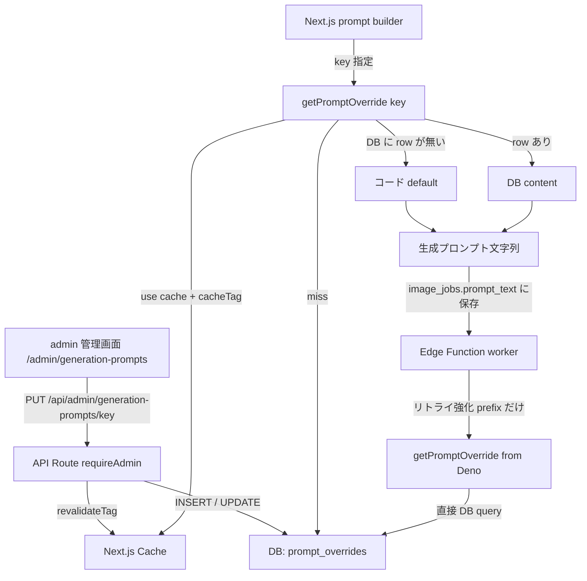
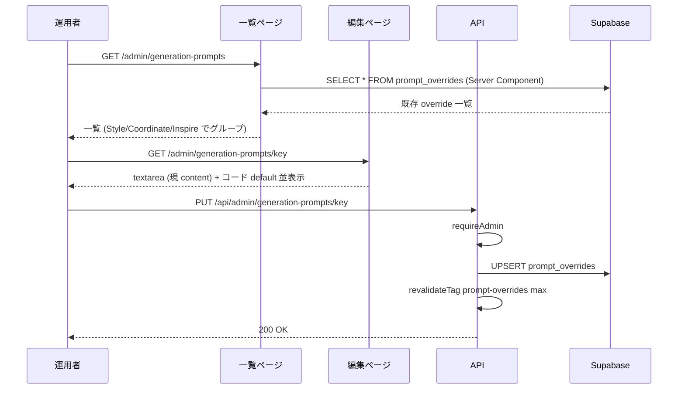
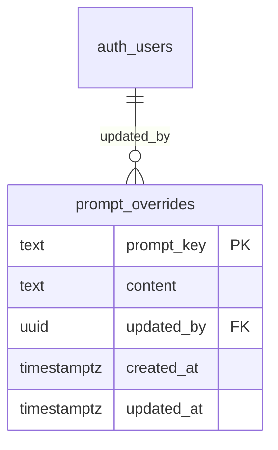
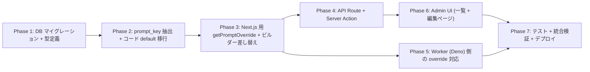

# admin 管理画面から生成プロンプトを編集可能にする

## 背景

Style / Coordinate / Inspire の生成リクエストで使われるシステムプロンプトは現状、`shared/generation/prompt-core.ts` と `shared/generation/style-prompts.ts` に TypeScript の `export const` / `export function` としてハードコードされている。文言を変更したい場合は **コード修正 + デプロイ** が必要で、運用者 (非エンジニア) が改善サイクルを回せない。

これを admin 管理画面からテキスト編集できるようにする。

## 目的

- 主要な生成プロンプトを admin 画面から運用者が直接編集できるようにする
- 保存後は次の生成ジョブから即時反映 (キャッシュ無効化込み)
- DB に override が無ければ常にコード default にフォールバック (DB 障害時も生成は止めない)
- 履歴・rollback は今回スコープ外 (将来必要になったら audit log 拡張で追加)

## やらないこと

- 編集履歴 / バージョン管理 / rollback UI
- ビルダー関数 (`buildPrompt` / `buildInspirePrompt`) の **分岐ロジック自体** や `sanitizeUserInput` の編集 (テキスト素材のみ編集可)
- override 4 種類の組み合わせ全 16 通りの個別編集 (「すべて維持」 + 「override 4 種類個別」の **5 key** のみ)
- 多言語化 (en/ja 切替。現状プロンプトはほぼ英語 + 一部日本語混在のまま)
- A/B テスト / バージョン分岐 (常に「現行版」だけが適用)
- プロンプト dry-run プレビュー (実際に生成して見るのは既存の生成画面でやる)
- 変更差分の **diff 表示 UI / rollback UI** (audit log は INSERT するが、専用閲覧画面は今回作らない。既存 `/admin/audit-log` で参照可)
- **worker (Deno) の DB query バッチ最適化** (初期実装は素直な key 単位 fetch + invocation 内 Map キャッシュ。`SELECT *` での全件取得は将来 prompt key 数が増えたら検討)

---

## コードベース調査結果 (Phase B)

### B-1: Supabase 接続確認

- リンク済みプロジェクト: `hnrccaxrvhtbuihfvitc` (AI coordinate, Sydney)
- `supabase db query --linked` で参照系クエリは即時実行可能 (確認済)
- `supabase migration up` / `supabase functions deploy` も別途利用可能 (CLAUDE.md 許可済)

### B-2: 既存類似機能の調査

#### 参考にする admin 機能 = `style-presets`

| 関心事 | 該当箇所 | パターン |
|--------|---------|---------|
| ページ | `app/(app)/admin/style-presets/page.tsx` | Server Component。`getUser()` + `getAdminUserIds()` で認証 → DB 取得 → Client へ props |
| クライアント | `features/style-presets/components/AdminStylePresetsClient.tsx` | useTransition + FormData POST + optimistic UI |
| API GET/POST | `app/api/admin/style-presets/route.ts` | `requireAdmin()` で認証 |
| API PUT/DELETE | `app/api/admin/style-presets/[id]/route.ts` | 同上 |
| Repository | `features/style-presets/lib/style-preset-repository.ts` | admin client で RLS バイパス |
| Cache invalidate | `features/style-presets/lib/revalidate-style-presets.ts` | `revalidateTag("style-presets", "max") + revalidatePath()` |
| Admin Nav | `app/(app)/admin/admin-nav-items.ts` L101-105 | 配列に項目追加するだけ |

#### Admin 認証パターン (二重構成)

- **ページ**: `getUser()` + `getAdminUserIds().includes(user.id)` → 不可なら `redirect("/")`
- **API**: `requireAdmin()` (`lib/auth.ts`) → 不可なら NextResponse エラー

#### キャッシュ戦略

`features/popup-banners/lib/get-active-popup-banners.ts` / `features/catalog/lib/get-public-catalog.ts` の踏襲:
- 取得関数: `"use cache"` ディレクティブ + `cacheTag(...)` + `cacheLife("minutes")`
- 更新 API: `revalidateTag("...", "max") + revalidatePath("...")` で即時反映

### B-3: 影響範囲 (Impact area)

`shared/generation/style-prompts.ts` を import している箇所:

| ファイル | 用途 | 実行コンテキスト |
|---|---|---|
| `app/(app)/style/generate-async/handler.ts` | `buildStyleGenerationPrompt()` (job 作成時にプロンプト全文を組み立てて `image_jobs.prompt_text` に保存) | Next.js Route Handler |
| `app/(app)/style/generate/handler.ts` | 同期 style 生成 | Next.js Route Handler |
| `app/api/style-templates/preview-generation/handler.ts` | `buildInspirePrompt()` (Inspire テンプレプレビュー) | Next.js Route Handler |
| `app/api/coordinate-generate-guest/handler.ts` | `buildPrompt()` (ゲスト同期生成、L205) | Next.js Route Handler |
| `supabase/functions/image-gen-worker/index.ts` | `buildSharedPrompt` (= buildPrompt) L1670 / `buildInspirePrompt` L1659 / `buildStyleAttemptReinforcementPrefix` | **Supabase Edge Function (Deno)** |

#### ⚠️ shared/generation/ の bundle 影響 (重要)

`prompt-core.ts` および `style-prompts.ts` は次の **client component / type-only consumer** からも import されている:

- `features/inspire/components/InspirePageClient.tsx` (`InspireOverrides` 型)
- `features/inspire/components/InspireOverrideCheckbox.tsx` (同)
- `features/style/components/StylePageClient.tsx` (`SourceImageType` 型)
- `features/generation/types.ts` / `features/generation/lib/form-preferences.ts` 等 (型のみ)

そのため `shared/generation/` 内で `"use cache"` / `import "@/lib/supabase/admin"` / `import "next/cache"` を直接使うと、**Deno worker のビルドと client bundle が壊れる**。

**結論**: `shared/generation/*` は **pure (ランタイム依存ゼロ)** に維持し、DB 解決ロジックは Next.js / Deno それぞれの wrapper に分離する設計とする (ADR-007 参照)。

#### worker と Next.js 双方で全 prompt_key を取得する

`buildInspirePrompt` / `buildSharedPrompt` / `buildStyleAttemptReinforcementPrefix` のすべてが worker でも Next.js でも呼ばれているため、両ランタイムで override 取得が必要 (ADR-005)。

### B-4: 参照ドキュメント

- `docs/architecture/data.ja.md` L84-113: 管理画面・cached server component では `createAdminClient()` で RLS バイパスする方針
- `docs/architecture/data.ja.md` L115-131: 複数テーブル跨る変更は RPC へ。今回は単一テーブルの単純 CRUD なので RPC 不要
- `.cursor/rules/database-design.mdc` L329-334 (`style_presets`): `created_by` / `updated_by` / `created_at` / `updated_at` を必ず持たせるパターン
- `docs/development/project-conventions.ja.md` L54-80: `features/[feature-name]/` 配下に repository / components を集約

---

## 1. 概要図

### 1.1 全体アーキテクチャ



### 1.2 編集フロー



### 1.3 データモデル



---

## 2. EARS (要件定義)

| ID | 要件 |
|----|------|
| REQ-1 | When admin が `/admin/generation-prompts` を開くと, the system shall コード default と DB override を統合した全 prompt_key の一覧を **4 つのカテゴリ (Style / Coordinate / Inspire / Reinforcement)** でグループ表示する。<br>**EN**: When an admin opens `/admin/generation-prompts`, the system shall display a unified list grouped by 4 categories: Style / Coordinate / Inspire / Reinforcement. |
| REQ-2 | When admin が 1 key の編集ページを開くと, the system shall コード default テキストと現在の override テキストを並べて表示し、textarea で編集可能にする。<br>**EN**: When an admin opens a key's edit page, the system shall display both the code default and the current override in editable textarea. |
| REQ-3 | When admin が 編集後 「保存」 を押すと, the system shall DB に UPSERT し、`prompt-overrides` cache tag を revalidate して即時反映する。<br>**EN**: When an admin saves edits, the system shall UPSERT to DB and revalidate the cache tag for immediate effect. |
| REQ-4 | When admin が 「default に戻す」を押すと, the system shall DB から該当行を削除し、override 無し状態 (= コード default が使われる状態) に戻す。<br>**EN**: When an admin clicks "reset to default", the system shall DELETE the row, falling back to the code default. |
| REQ-5 | While prompt 生成中、the system shall `getPromptOverride(key)` で cache → DB → code default の順に解決する。<br>**EN**: While building prompts, the system shall resolve via cache → DB → code default. |
| REQ-6 | If DB クエリが失敗した場合, then the system shall コード default にフォールバックし、生成リクエストは続行する (`console.error` で記録)。<br>**EN**: If DB lookup fails, then the system shall fall back to code default and continue serving the request. |
| REQ-7 | Where Edge Function worker で本体 prompt / リトライ強化文を取得する時, the system shall `resolveAllPromptTemplatesForWorker(supabase)` で全 prompt_key を 1 クエリ取得し、registry default で欠落を埋めた dict を pure builder に渡す。失敗時は registry default 100% で fallback。<br>**EN**: Where the worker resolves prompts, the system shall fetch all prompt_keys in one query, fall back to registry defaults, and pass the templates dict to the pure builder. |
| REQ-8 | If 非 admin ユーザーが `/admin/generation-prompts` や `/api/admin/generation-prompts*` にアクセスした場合, then the system shall ページは `/` へ redirect、API は 403 を返す。<br>**EN**: If a non-admin attempts access, then the system shall redirect pages to `/` and return 403 for APIs. |
| REQ-9 | When prompt の content に `{{varname}}` プレースホルダーが含まれる時, the system shall ビルダー関数側で正しい変数値に置換する。サポートされない変数名はそのまま残す (生成ログで気づける)。<br>**EN**: When a prompt contains `{{varname}}` placeholders, the system shall substitute them with the correct runtime values; unknown variables remain unsubstituted. |
| REQ-10 | While admin 編集画面、the system shall 「保存」ボタン押下中は disabled にし、保存完了でトースト通知を出す。<br>**EN**: While saving, the system shall disable the button and show a success toast on completion. |

---

## 3. ADR (設計判断記録)

### ADR-001: コード default + DB override のフォールバック設計

- **Context**: DB 障害時にも生成が止まらないことが運用上必須。また、初期セットアップ時に default 値の seed が必要かどうか。
- **Decision**: コード側に default 値を保持し、DB に override 行があれば DB を優先。DB が空 / クエリ失敗時は default にフォールバック。
- **Reason**: (a) DB 障害耐性 (b) 初期 seed 不要 (c) コードレビューで「最後に正だったテキスト」を確認可能 (d) admin 編集の差分が `git log` から見えないトレードオフは履歴不要の方針なので許容。
- **Consequence**: コードと DB に同じテキストが二重存在する状況になる。コード修正と DB override が乖離するケースに注意 (=「コードを直してデプロイしたのに反映されない」)。これは編集画面で「default 並表示」することで気づける。

### ADR-002: rollback UI は不要、audit log は INSERT する

- **Context**: 当初は履歴・rollback も含めて検討、運用者判断で一旦「全て不要」とした後、セキュリティレビューで「全ユーザー生成に影響する操作は追跡可能性が必要」となり audit log のみ復活。
- **Decision**: 専用履歴テーブルは作らず、既存 `admin_audit_log` に 1 行 INSERT する。専用閲覧 UI / rollback UI も今回は作らない (既存 `/admin/audit-log` 画面で参照可能)。
- **Reason**: (a) 「誰が・いつ・何を変えたか」を追跡できる (セキュリティ最低要件) (b) 既存 helper `logAdminAction()` を使うので実装コスト 5-10 行 (c) 専用 UI は YAGNI、必要になれば後から追加可能。
- **Consequence**: 誤保存時の文言回復は手動で前回値を再入力する必要がある (画面上の rollback ボタンなし)。ただし `admin_audit_log.metadata` に先頭 500 文字程度を残すので運用者が手作業で復元可能。

### ADR-003: テンプレ変数を `{{varname}}` プレースホルダーで表現

- **Context**: `buildStyleAttemptReinforcementPrefix(attempt)` のように関数引数が文字列に埋め込まれる prompt がある。admin が text として編集する場合、変数を表現する規約が必要。
- **Decision**: `{{varname}}` (Mustache 風) をプレースホルダーとして使う。ビルダー関数側でテンプレ展開する。
- **Reason**: (a) Mustache 風は広く認知 (b) JS の `${}` と衝突しない (c) 単純な正規表現で置換可能。
- **Consequence**: 変数名のタイポは生成ログで `{{wrongname}}` が残るので気づける (silent 失敗にしない)。テンプレ展開ヘルパが必要。

### ADR-004: prompt_key の命名規約 + 大型テンプレート方式

- **Context**: 初期案では `STYLE_PROMPT_BASE_PREFIX` 等の小さな文字列を 1 key = 1 row として 20 個前後並べる方針だった。しかし運用者目線で「文の途中だけ差し替える」のは文意の流れが見えず編集しにくい。
- **Decision**: prompt_key は `<category>.<subkey>` の dot-separated。**1 key = 1 つの完結したテンプレート文字列** とし、動的部分は `{{variable}}` で表現する。`buildPrompt` 内に散在していた断片は集約し、key 数は 7-8 程度に圧縮する。
- **例**:
  ```
  style.full_template       — Style 画面 1 リクエスト分の完成テンプレート
  coordinate.full_template  — Coordinate 通常
  coordinate.specified_coordinate_template — Specified Coordinate
  coordinate.full_body_template
  coordinate.chibi_template
  inspire.keep_all_template — Inspire すべて維持時の本文
  inspire.override_overlay  — 個別 override 文 (繰り返し連結)
  reinforcement.attempt_2plus — 全 generation_type 共通リトライ強化文
  ```
- **Reason**: (a) 編集単位が「完結した文」になるため運用者が文意を読み取りやすい (b) key 数が少なく一覧が見渡せる (c) 細粒度な分割は将来 PR で必要なら細分化できる (今は集約寄りでスタート) (d) `{{outfit_description}}` 等の変数で動的部分を明示できる。
- **Consequence**: コード側は registry のテンプレートを取り、`applyTemplate(template, vars)` で展開する設計に変わる。既存の `STYLE_PROMPT_BASE_PREFIX` 等の export は撤去 (registry に集約)。テンプレート展開ヘルパが必須。

### ADR-005: worker (Deno) も本体プロンプトを DB 読込みする

- **Context**: 当初は「本体プロンプトは Next.js 側で組み立て job に保存、worker はリトライ強化 prefix だけ動的生成」と想定していた。しかし実コード調査 (worker index.ts L1659, L1670) の結果、worker 内で `buildInspirePrompt` および `buildSharedPrompt (= buildPrompt)` が **直接呼ばれている** ことが判明。`job.input_image_url` の有無や `generation_type` によって、worker 実行時にプロンプトを組み立てるパスが残っている。
- **Decision**: worker (Deno) も **全 prompt_key を DB から取得** できるようにする。Deno 側に `getPromptOverride(key, supabase)` helper を追加し、本体プロンプト・リトライ強化文の両方で利用。
- **Reason**: (a) 既存の worker 内 prompt 構築ロジックを尊重 (Next.js 側に寄せる大規模リファクタを回避) (b) worker は admin client を持っているので DB アクセスのコストは小さい (c) admin 編集と worker 出力の一貫性が取れる (= Next.js 経路と worker 経路でテキストが乖離しない)。
- **Consequence**: Phase 5 のスコープが拡大 (リトライ強化文だけ → 全 key)。worker invocation あたり最大 7-8 件の DB query が増えるが、admin client + 小規模テーブルなのでパフォーマンス影響は無視できる範囲。簡易メモリキャッシュ (worker invocation 内で同 key を 1 回だけ取得) を Phase 5 で実装する。

### ADR-006: キャッシュは `cacheLife("minutes")` (~3-5 分)

- **Context**: prompt_overrides テーブルは admin 編集時のみ更新、頻度は低い。読み込みは生成ジョブごとに発生 (頻度高)。
- **Decision**: `"use cache"` + `cacheTag("prompt-overrides")` + `cacheLife("minutes")` を使い、更新時 `revalidateTag("prompt-overrides", "max")` で失効。
- **Reason**: 既存 popup-banners / catalog と同パターン。3-5 分の遅延は admin 編集の即時性として許容範囲 (即時性が必要なら revalidate で 0 秒)。
- **Consequence**: 編集後すぐに反映される (revalidate のおかげ)。万一 revalidate に失敗しても数分以内に自然失効。

### ADR-007: shared/generation/ は pure layer、DB 解決は runtime 別 wrapper に分離

- **Context**: `shared/generation/prompt-core.ts` と `style-prompts.ts` は (1) Next.js Route Handler (2) Edge Function worker (Deno) (3) client component (type import のみ) の **3 ランタイム** から import されている。これらに `"use cache"` / `next/cache` / `@/lib/supabase/admin` のような Next.js 専用依存を入れると、Deno は import 解決に失敗、client bundle は不要コード混入で肥大化する。
- **Decision**: レイヤを次の 3 段に分離する:
  1. **`shared/generation/prompt-registry.ts`** (pure): 全 key の `{ defaultContent, category, supportedVariables, previewSamples }` を持つレジストリ
  2. **`shared/generation/prompt-template.ts`** (pure): `applyTemplate(text, vars)` ヘルパ
  3. **`shared/generation/prompt-core.ts` / `style-prompts.ts`** (pure に維持): ビルダーは **pre-resolved な templates dict を受け取る pure 関数** へリファクタ
  4. **`features/generation-prompts/lib/resolve-templates.ts`** (Next.js 専用): `"use cache"` + admin client で全 key を取得して dict を返す
  5. **`supabase/functions/image-gen-worker/prompt-override.ts`** (Deno 専用): Deno + supabase-js で同じ dict を返す (invocation 内メモリキャッシュ付き)
- **呼び出しパターン**:
  ```ts
  // Next.js Route Handler
  const templates = await resolveCoordinatePromptsForNext();
  const prompt = buildPrompt({ templates, generationType: "coordinate", ... }); // pure / sync

  // Worker (Deno)
  const templates = await resolveCoordinatePromptsForWorker(supabase);
  const prompt = buildPrompt({ templates, generationType: "coordinate", ... }); // 同じ pure 関数
  ```
- **Reason**: (a) `shared/` の zero-runtime-dep を維持すれば Deno / client bundle を壊さない (b) ビルダー pure 化で単体テストが容易 (mock 不要) (c) 同じ pure 関数を両ランタイムで再利用できる (d) DB 解決の責務が一箇所 (resolver) に集約され見通しが良い。
- **Consequence**: 既存ビルダー関数のシグネチャが変わる (引数に `templates` を追加)。呼び出し側 5-6 箇所の修正が必要だが、async/await の伝播より単純。ビルダー関数が async になる従来案より caller への影響範囲が広い半面、Deno/client 破壊リスクは消える。

---

## 4. 実装計画 (フェーズ + TODO)

### フェーズ間の依存関係



Phase 5 (worker) は P3 と並列実装可能。

---

### Phase 1: DB マイグレーション + 型定義

**目的**: `prompt_overrides` テーブルを作成し、admin だけが読み書きできる RLS を設定する。
**ビルド確認**: `npm run typecheck` で型定義が通る。

- [ ] マイグレーションファイル新規作成: `supabase/migrations/<timestamp>_add_prompt_overrides.sql`
  ```sql
  -- 既存パターン参照: supabase/migrations/20260322100000_add_style_presets.sql
  CREATE TABLE IF NOT EXISTS public.prompt_overrides (
    prompt_key TEXT PRIMARY KEY CHECK (length(prompt_key) <= 100),
    -- defense in depth: API 層でも 4000 文字制限するが、DB 側にも保険
    content TEXT NOT NULL CHECK (length(content) <= 4000 AND length(trim(content)) > 0),
    -- user 削除時に attribution だけ NULL に (style_presets / admin_announcements パターン)
    created_by UUID NULL REFERENCES auth.users(id) ON DELETE SET NULL,
    updated_by UUID NULL REFERENCES auth.users(id) ON DELETE SET NULL,
    created_at TIMESTAMPTZ NOT NULL DEFAULT now(),
    updated_at TIMESTAMPTZ NOT NULL DEFAULT now()
  );

  ALTER TABLE public.prompt_overrides ENABLE ROW LEVEL SECURITY;

  -- RLS: 既存 admin-only テーブル (admin_audit_log / admin_users) と同パターン。
  -- USING(false) で anon / authenticated 全拒否。admin client (service role) のみアクセス可
  DROP POLICY IF EXISTS "prompt_overrides_no_public_access" ON public.prompt_overrides;
  CREATE POLICY "prompt_overrides_no_public_access"
    ON public.prompt_overrides
    FOR ALL
    USING (false);

  -- updated_at trigger: リポジトリ共通の update_updated_at_column() を利用
  -- (style_presets / popup_banners と同パターン)
  DROP TRIGGER IF EXISTS update_prompt_overrides_updated_at ON public.prompt_overrides;
  CREATE TRIGGER update_prompt_overrides_updated_at
    BEFORE UPDATE ON public.prompt_overrides
    FOR EACH ROW
    EXECUTE FUNCTION public.update_updated_at_column();

  -- COMMENT: スキーマ自己ドキュメント化 (style_presets と同レベルの粒度)
  COMMENT ON TABLE public.prompt_overrides IS
    'admin 編集可能な生成 prompt の override 文言。コード default + DB override のフォールバック設計。'
    '詳細: docs/planning/admin-generation-prompt-editor-plan.md';
  COMMENT ON COLUMN public.prompt_overrides.prompt_key IS
    'shared/generation/prompt-registry.ts に定義された key のいずれか (registry を真とする)';
  COMMENT ON COLUMN public.prompt_overrides.content IS
    '{{varname}} プレースホルダー記法でテンプレ変数を含む prompt テキスト。max 4000 文字';
  COMMENT ON COLUMN public.prompt_overrides.created_by IS
    '初回 override を作成した admin ユーザー id。ユーザー削除で NULL';
  COMMENT ON COLUMN public.prompt_overrides.updated_by IS
    '最終更新 admin ユーザー id。ユーザー削除で NULL';
  ```
- [ ] `.cursor/rules/database-design.mdc` に `prompt_overrides` テーブルの定義を追記
- [ ] 型定義: `features/generation-prompts/types.ts` (新規) に `PromptKey` enum-like type 定義
  - 全 prompt_key を列挙した union type
- [ ] `npm run typecheck` 通過確認

### Phase 2: prompt_key 抽出 + コード default 移行

**目的**: 既存プロンプトを「key + default content」のレジストリとして集約する。
**ビルド確認**: `npm run lint && npm run typecheck`、既存テストが全て通る。

- [ ] 新規ファイル: `shared/generation/prompt-registry.ts`
  - 全 prompt_key を列挙する dict 構造
  - 各 key に対し `{ description, defaultContent, category, supportedVariables }` を持つ
  - 例:
    ```ts
    export const PROMPT_REGISTRY = {
      "style.base_prefix": {
        category: "style",
        description: "Style 画面共通の CRITICAL INSTRUCTION 前文",
        defaultContent: STYLE_PROMPT_BASE_PREFIX_DEFAULT, // 既存定数を rename
        supportedVariables: [],
      },
      "style.full_template": {
        category: "style",
        description: "Style 画面で 1 リクエスト分使う完成テンプレート (前文 + suffix + 背景 + ユーザー指示)",
        defaultContent: "CRITICAL INSTRUCTION: ... {{style_suffix}} ... {{background_instruction}} ... Styling Direction: {{styling_prompt}} {{background_prompt_section}}",
        supportedVariables: ["style_suffix", "background_instruction", "styling_prompt", "background_prompt_section"],
      },
      "style.illustration_suffix_text": { ... },  // {{style_suffix}} に入る illustration 用文
      "style.real_suffix_text": { ... },          // 同 real 用
      "style.keep_background_text": { ... },      // {{background_instruction}} に入る keep 用
      "style.change_background_text": { ... },    // 同 change 用
      "coordinate.full_template": {
        category: "coordinate",
        description: "通常コーディネート (coordinate) の完成テンプレート",
        defaultContent: "...{{outfit_description}}...{{background_directive}}...",
        supportedVariables: ["outfit_description", "background_directive"],
      },
      "coordinate.specified_coordinate_template": { ... },
      "coordinate.full_body_template": { ... },
      "coordinate.chibi_template": { ... },
      "inspire.keep_all_template": { ... },
      // Inspire は user 選択 (override 4 種類) 別に編集できる方針 (ヒアリングで合意)
      // → keep_all + 4 個別 = 5 key
      "inspire.override_outfit_text": { description: "outfit を上書きする時の指示文" },
      "inspire.override_angle_text": { description: "angle を上書きする時の指示文" },
      "inspire.override_pose_text": { description: "pose を上書きする時の指示文" },
      "inspire.override_background_text": { description: "background を上書きする時の指示文" },
      "reinforcement.coordinate_attempt_2plus": {
        description: "coordinate 系のリトライ強化 prefix (attempt ≥ 2 で前置)",
        defaultContent: "[Retry attempt {{attempt}} of {{max_attempts}}] Previous attempt did not follow instructions strictly. ...",
        supportedVariables: ["attempt", "max_attempts"],
      },
      "reinforcement.style_attempt_2plus": {
        description: "style 系のリトライ強化 prefix",
        supportedVariables: ["attempt", "max_attempts"],
      },
    } as const satisfies Record<string, PromptDefinition>;
    ```
  - **key 数の合計目安**: 約 12-14 個 (Style 5 + Coordinate 4 + Inspire 5 + Reinforcement 2)
- [ ] 既存定数 (`STYLE_PROMPT_BASE_PREFIX` 等) を撤去し、registry に集約 (export は registry helper 経由)
- [ ] `prompt-core.ts` 内に散在していた文字列リテラルも registry に統合 (大型テンプレート化)
- [ ] テンプレ変数のある箇所は `{{varname}}` 表記に書き換え (`Attempt ${attempt}` → `Attempt {{attempt}}`)
- [ ] テンプレ展開ヘルパ `applyTemplate(text, vars)` を `shared/generation/prompt-template.ts` (新規) に実装
  - `text.replace(/\{\{(\w+)\}\}/g, ...)` ベース。`vars[name]` が無ければそのまま残す (silent 失敗回避)
- [ ] 既存ユニットテスト (style-prompts.test.ts, inspire-prompt.test.ts) を新 registry / template 展開対応に更新

### Phase 3: ビルダー pure 化 + Next.js 用 resolver

**目的**: ADR-007 に基づき、`shared/generation/` を pure に保ちつつ Next.js 側から DB override を解決できるようにする。
**ビルド確認**: `npm run typecheck`、既存ビルダー関数のテストが pure 化された新シグネチャで通る。

- [ ] `shared/generation/prompt-core.ts` / `style-prompts.ts` のビルダーを **pure 化** (async にしない、DB 依存を持たない)
  - 旧: `buildPrompt({ generationType, ... }): string` — registry 内テキストを直接参照
  - 新: `buildPrompt({ templates, generationType, ... }): string` — templates dict を引数として受け取り、`applyTemplate(templates[key], vars)` で展開
  - `templates: Partial<Record<PromptKey, string>>` 型。欠落時は registry default にフォールバック
- [ ] 新規: `features/generation-prompts/lib/resolve-templates.ts` (Next.js 専用 wrapper)
  - 関数 `resolveAllPromptTemplates(): Promise<Record<PromptKey, string>>`
    - `"use cache"` + `cacheTag("prompt-overrides")` + `cacheLife("minutes")`
    - admin client で全 prompt_key を 1 クエリで取得
    - DB に row が無い key は registry default で埋めて完全な dict を返す
    - 失敗時は registry default 100% で返す (生成は止めない)
  - 関数 `resolveTemplatesForCategory(category): Promise<...>` — 特定カテゴリだけ欲しい場合
- [ ] 呼び出し側 4 箇所を **「resolver で templates 取得 → pure builder に渡す」パターン** に書き換え
  - `app/(app)/style/generate-async/handler.ts` (`buildStyleGenerationPrompt`)
  - `app/(app)/style/generate/handler.ts` (`buildStyleGenerationPrompt`)
  - `app/api/style-templates/preview-generation/handler.ts` (`buildInspirePrompt`)
  - `app/api/coordinate-generate-guest/handler.ts` (`buildPrompt`)
- [ ] 既存テスト (`style-prompts.test.ts`, `inspire-prompt.test.ts`) を pure シグネチャ対応に更新 (`templates` 引数を渡す)
- [ ] **client component の import 影響確認**: `InspirePageClient.tsx` / `StylePageClient.tsx` 等の型のみ import が壊れていないこと (型のみ抽出は変更なし)

### Phase 4: API Route

**目的**: admin が edit / reset するための API endpoint を提供。
**ビルド確認**: `npm run lint && npm run typecheck`、新規 API のテスト通過。

- [ ] 新規: `features/generation-prompts/lib/admin-repository.ts`
  - `listAllPrompts()` (registry + DB override マージ)
  - `upsertPromptOverride(key, content, userId)`
  - `deletePromptOverride(key)`
- [ ] 新規: `app/api/admin/generation-prompts/route.ts`
  - `GET`: 全 key を default + override 統合で返す
- [ ] 新規: `app/api/admin/generation-prompts/[key]/route.ts`
  - `PUT`: requireAdmin → upsert → **logAdminAction("prompt_override_update")** → revalidateTag + revalidatePath
  - `DELETE`: requireAdmin → delete → **logAdminAction("prompt_override_reset")** → revalidate
- [ ] **`lib/admin-audit.ts` の `AdminAuditAction` union に追加**:
  - `"prompt_override_update"` / `"prompt_override_reset"` を新規アクションとして追加
  - 既存の helper `logAdminAction()` 呼び出しパターン (catalog / style-template と同様) を踏襲
- [ ] 監査 metadata の内容:
  - `target_type: "prompt_override"`、`target_id: prompt_key`
  - `metadata`: `{ content_before: prev?.content?.slice(0, 500) ?? null, content_after: newContent.slice(0, 500), content_length: newContent.length }` (先頭 500 文字のみ、PII 保護とログ肥大化抑止のため)
  - DELETE 時は `metadata.content_after = null` で「default に戻された」ことを示す
- [ ] 入力 validation:
  - **PUT 時**: `prompt_key` は registry に存在する key のみ許可 (ホワイトリスト)
  - **DELETE 時**: registry に無くても DB に row が存在すれば許可 (= 孤立 row の掃除を可能にする)
  - `content` は **max 4,000 文字** (現実の prompt 長は数百〜1,500 字程度。誤入力 / DoS 対策の妥当な上限)
  - `content` が空文字 / トリム後空のときは 400 (削除したいなら DELETE を使う)
  - サポートされない `{{varname}}` を含む場合は **warning メッセージを返す** (block しない、運用者がタイポに気づける)
  - registry の supportedVariables と照合して **diff を warning に含める**

### Phase 5: Worker (Deno) 用 resolver

**目的**: worker 内で呼ばれる `buildSharedPrompt` / `buildInspirePrompt` / `buildStyleAttemptReinforcementPrefix` も DB override 対応にする (ADR-005)。pure builder は Phase 3 でリファクタ済みなので、worker からも同じ builder を呼べる。
**ビルド確認**: `deno check supabase/functions/image-gen-worker/index.ts` の TS エラー数が既存ベースライン (25) と同じであること。

- [ ] 新規: `supabase/functions/image-gen-worker/prompt-override.ts` (Deno 専用 wrapper)
  - 関数 `resolveAllPromptTemplatesForWorker(supabase): Promise<Record<PromptKey, string>>`
    - admin client (service role、worker は既に持っている) で `SELECT prompt_key, content FROM prompt_overrides` を **1 クエリで全件取得**
    - registry default で欠落分を埋めて完全な dict を返す
    - 失敗時は registry default 100% で返す
  - **invocation 内メモリキャッシュ**: 同一 invocation 内で複数 job を処理する場合、最初の job で取得した dict を使い回す (`globalThis` レベルの WeakMap or singleton)
- [ ] `shared/generation/prompt-registry.ts` を Deno 互換 import (既存 `prompt-core.ts` の `.ts` extension パターンに準拠)
- [ ] worker の呼出し箇所を **「resolver で templates 取得 → pure builder に渡す」パターン** に書き換え
  - 該当: `supabase/functions/image-gen-worker/index.ts` L1659 (`buildInspirePrompt`), L1670 (`buildSharedPrompt`), retry 強化箇所
- [ ] テンプレ展開ヘルパ `applyTemplate` も Deno 側で利用 (pure helper を `.ts` extension で import)
- [ ] `deno check` で新規エラーがないこと確認

### Phase 6: Admin UI (一覧 + 編集ページ)

**目的**: 運用者が直感的に編集できる UI。
**ビルド確認**: `npm run build -- --webpack` 通過 + ローカルで admin として動作確認。

- [ ] 一覧ページ: `app/(app)/admin/generation-prompts/page.tsx`
  - getUser + adminUserIds チェック (既存 admin page pattern)
  - `listAllPrompts()` を呼んで Server Component で取得
  - Client へ props 渡し
- [ ] 一覧 Client: `features/generation-prompts/components/AdminPromptsListClient.tsx`
  - category **4 つ (Style / Coordinate / Inspire / Reinforcement)** でグループ表示
  - 各 key 行: label, 短い説明, override 有無バッジ, 編集リンク
- [ ] 編集ページ: `app/(app)/admin/generation-prompts/[key]/page.tsx`
  - Server で対象 key の default + 現 override を取得
  - 不明な key は notFound()
- [ ] 編集 Client: `features/generation-prompts/components/AdminPromptEditClient.tsx`
  - 大きな `<textarea>` (rows={20})、下部に **「文字数: 428 / 4,000」 + 簡易トークン目安** 表示
  - 上部に「コード default」を `<pre>` で表示 (折り畳み可)
  - **プレビューペイン**: 「使える変数」のサンプル値 (default values) を変数ごとの input で受け取り、`applyTemplate` で展開した結果を右側に表示
    - 例: `{{attempt}}` には `2` を仮置き、`{{styling_prompt}}` には "白いシャツとデニム" 等のサンプル
    - registry に `previewSampleValues: Record<string, string>` を持たせると UI 側でデフォルト埋め込み可能
  - 「使える変数」の説明 (supportedVariables が空でなければ表示)
  - 未サポートの `{{varname}}` を入力すると warning バナー
  - 「保存」 / 「default に戻す」 / 「キャンセル」 ボタン
  - **「default に戻す」は confirm ダイアログ必須** (誤操作防止)
  - **編集量が default から ±30% 以上変わる場合** は軽い注意喚起 ("大幅な変更です。確認してください")
  - 保存中 disabled + 完了で toast
- [ ] **孤立 row のハンドリング**:
  - registry に存在しないが DB に row がある key を一覧で「未知 (要対応)」セクションに表示
  - 削除リンクのみ提供 (編集不可)
- [ ] Admin Nav 追加: `app/(app)/admin/admin-nav-items.ts`
  ```ts
  { path: "/admin/generation-prompts", label: "生成プロンプト管理", iconKey: "text" }
  ```
- [ ] i18n: registry の `description` / category ラベルを ja/en 両方持たせる
  - `description: { ja: "Style 画面...", en: "Style screen ..." }` 形式に
  - admin UI は `useLocale()` に応じて表示切替
- [ ] `messages/ja.json` / `messages/en.json` にボタン / 見出しラベル追加

### Phase 7: テスト + 統合検証 + デプロイ

**目的**: 全体動作確認 + 本番反映。
**ビルド確認**: `npm run lint && npm run typecheck && npm run test && npm run build -- --webpack`。

- [ ] ユニットテスト:
  - `applyTemplate()` のテスト (`{{var}}` 置換、未定義変数、複数変数)
  - `getPromptOverride()` のテスト (cache hit/miss, fallback)
  - `admin-repository` のテスト
  - admin API route のテスト (auth + CRUD)
- [ ] 統合テスト:
  - style generate-async が override 適用済みプロンプトで job 作成すること
  - inspire preview が override 適用済みで動作すること
- [ ] **E2E スモークテスト** (新規 / Phase 7 必須):
  - `tests/integration/admin/generation-prompt-editor-e2e.test.ts` を新規作成
  - フロー: ① admin が `coordinate.full_template` を `[TEST_MARKER]` を含む文言に編集 → ② generate-async POST → ③ `image_jobs.prompt_text` に `[TEST_MARKER]` が含まれることを確認 → ④ DELETE で default に戻す
  - これがあると、async 化失敗で default が常に使われている等の致命バグを Phase 7 で検出できる
- [ ] `npm run lint && npm run typecheck && npm run test`
- [ ] `npm run build -- --webpack` (Turbopack 禁止)
- [ ] migration を本番適用 (`supabase migration up` — ユーザ承認が必要)
- [ ] Edge Function 再デプロイ (`supabase functions deploy image-gen-worker` — ユーザ承認が必要)
- [ ] Vercel デプロイ (PR マージで自動)

---

## 5. 修正対象ファイル一覧

| ファイル | 操作 | 変更内容 |
|----------|------|----------|
| `supabase/migrations/<ts>_add_prompt_overrides.sql` | 新規 | `prompt_overrides` テーブル + RLS + trigger |
| `.cursor/rules/database-design.mdc` | 修正 | `prompt_overrides` の定義を追記 |
| `shared/generation/prompt-registry.ts` | 新規 | 全 prompt_key のレジストリ (description / defaultContent / category / supportedVariables) |
| `shared/generation/prompt-template.ts` | 新規 | `{{varname}}` テンプレ展開ヘルパ |
| `shared/generation/style-prompts.ts` | 修正 | 既存定数を registry から読むよう変更 + ビルダーは pure 化 (`templates` 引数化) |
| `shared/generation/prompt-core.ts` | 修正 | 各分岐内テキストを registry に移行 + ビルダーは pure 化 (`templates` 引数化、async 化しない) |
| `features/generation-prompts/types.ts` | 新規 | `PromptKey` union type, `PromptCategory` (Style / Coordinate / Inspire / Reinforcement) |
| `features/generation-prompts/lib/resolve-templates.ts` | 新規 | Next.js 用 resolver: `resolveAllPromptTemplates()` (use cache 付き、全 key 1 クエリ) |
| `features/generation-prompts/lib/admin-repository.ts` | 新規 | admin client 経由の CRUD |
| `app/api/admin/generation-prompts/route.ts` | 新規 | GET (一覧) |
| `app/api/admin/generation-prompts/[key]/route.ts` | 新規 | PUT (upsert) / DELETE (reset) + logAdminAction 呼び出し |
| `lib/admin-audit.ts` | 修正 | `AdminAuditAction` union に `"prompt_override_update"` / `"prompt_override_reset"` 追加 |
| `app/(app)/admin/generation-prompts/page.tsx` | 新規 | 一覧 Server Component |
| `app/(app)/admin/generation-prompts/[key]/page.tsx` | 新規 | 編集 Server Component |
| `features/generation-prompts/components/AdminPromptsListClient.tsx` | 新規 | 一覧 Client |
| `features/generation-prompts/components/AdminPromptEditClient.tsx` | 新規 | 編集 Client (textarea + default 並表示 + buttons) |
| `app/(app)/admin/admin-nav-items.ts` | 修正 | nav に項目追加 |
| `supabase/functions/image-gen-worker/prompt-override.ts` | 新規 | Deno 用 resolver: `resolveAllPromptTemplatesForWorker(supabase)` (全 key 1 クエリ、invocation 内メモリキャッシュ) |
| `tests/integration/admin/generation-prompt-editor-e2e.test.ts` | 新規 | E2E スモーク (編集 → 生成 → marker 確認) |
| `app/api/coordinate-generate-guest/handler.ts` | 修正 | `buildPrompt` 呼出しを resolver 経由に (前回計画から漏れていた経路) |
| `supabase/functions/image-gen-worker/index.ts` | 修正 | `buildStyleAttemptReinforcementPrefix` 呼出し箇所を override 対応 |
| `app/(app)/style/generate/handler.ts` | 修正 | builder 呼出しを resolver 経由に |
| `app/(app)/style/generate-async/handler.ts` | 修正 | builder 呼出しを resolver 経由に |
| `app/api/style-templates/preview-generation/handler.ts` | 修正 | builder 呼出しを resolver 経由に |
| `messages/ja.json` / `messages/en.json` | 修正 | admin ナビ / ボタンラベル |
| 既存テストファイル群 | 修正 | builder の async 化に追従 |

**変更概算**: 本体 ~450 行追加 / ~100 行修正、テスト ~300 行追加 (E2E 込み)。

worker (Deno) 改修で Phase 5 のスコープが当初より拡大した点に注意。Phase 5 と Phase 3 (Next.js builder async 化) は内部 helper を別途持つため並行実装可能。

---

## 6. 品質・テスト観点

### 品質チェックリスト

- [ ] **エラーハンドリング**: DB query 失敗時に必ず code default にフォールバックすること (try/catch + console.error)
- [ ] **権限制御**: `/admin/generation-prompts*` は admin のみ (page redirect / API 403)
- [ ] **RLS**: `prompt_overrides` は anon/authenticated 完全ブロック、admin client のみアクセス
- [ ] **入力検証**: prompt_key はホワイトリスト (registry に存在する key のみ受理)、content は max 文字数
- [ ] **キャッシュ整合性**: 編集後 revalidateTag が呼ばれること、次のリクエストで新 content が返ること
- [ ] **テンプレ展開**: `{{varname}}` の置換が全 supported variables で動くこと
- [ ] **監査追跡**: PUT/DELETE 操作が `admin_audit_log` に記録されること、metadata に content 抜粋が残ること、audit log の INSERT 失敗で本体処理が止まらないこと (`logAdminAction` は try/catch で握る既存仕様)
- [ ] **i18n**: admin nav ラベル / ボタンラベルの ja/en 揃え
- [ ] **後方互換**: 既存 prompt 動作が DB 空状態 (= override 無し) でも変わらないこと (実質 default を使うだけ)

### テスト観点

| カテゴリ | テスト内容 |
|----------|-----------|
| 正常系 (helper) | `getPromptOverride("style.base_prefix")` が DB row なしで default、row ありで content を返す |
| 正常系 (テンプレ) | `applyTemplate("Attempt {{attempt}}", { attempt: 2 })` → `"Attempt 2"` |
| 正常系 (API) | admin が PUT/DELETE できる、その後 GET で反映済み内容が返る |
| 異常系 (auth) | non-admin が PUT すると 403、ページは `/` redirect |
| 異常系 (validation) | 未知の prompt_key を PUT すると 400、content が空 / 長過ぎると 400 |
| 異常系 (DB 障害) | DB query が throw しても getPromptOverride が default を返して生成は続行 |
| 統合 (style) | style generate-async POST → `image_jobs.prompt_text` に override 反映済みテキストが入っている |
| 統合 (inspire) | inspire preview API → override 反映済みプロンプトで Gemini 呼出し |
| **E2E (新規)** | admin が `[TEST_MARKER]` を含む override 保存 → generate-async → `image_jobs.prompt_text` に marker 含まれる |
| worker (Deno) | 本体 prompt + リトライ強化文の override fetch が両方動く + 失敗時 default fallback + invocation 内キャッシュ動作 |
| 孤立 row | registry に無い key を DB に手で挿入 → admin 一覧の「未知」セクションに表示され削除可能 |
| **audit** | PUT 後に admin_audit_log に action_type=prompt_override_update が記録される、DELETE 後に prompt_override_reset が記録される、metadata に content 抜粋と長さが含まれる |

### テスト実装手順

実装完了後、`/test-flow` スキルに沿ってテストを実施:

1. `/test-flow generation-prompt-editor` — 状態確認
2. `/spec-extract generation-prompt-editor` — EARS スペック抽出
3. `/test-generate generation-prompt-editor` — テスト生成
4. `/test-reviewing generation-prompt-editor` — テストレビュー

---

## 7. ロールバック方針

- **Git**: フェーズごとに別コミット → `git revert` で個別ロールバック可能
- **DB**: 単純テーブル追加だけ。問題時は `DROP TABLE prompt_overrides;` で破壊できる (元コードは default を使い続けるので生成は止まらない)
- **Edge Function**: 旧バージョン再デプロイで戻せる
- **機能フラグ**: 不要 (override が無い = 自動的に default の挙動)
- **段階リリース可能性**: Phase 1-3 のみ deploy (admin UI 無し) でも既存挙動完全維持。Phase 4-6 を後で追加可能

---

## 8. 使用スキル

| スキル | 用途 | フェーズ |
|--------|------|----------|
| `/project-database-context` | DB 設計時の参照 | Phase 1 |
| `/git-create-branch` | ブランチ作成 | 実装開始時 |
| `/spec-extract` | EARS 仕様抽出 | テスト前 |
| `/test-generate` | テストコード生成 | Phase 7 |
| `/codex-webpack-build` | ビルド検証 | Phase 7 |
| `/git-create-pr` | PR 作成 | 実装完了時 |
| `/resolve-gemini-review` | レビュー対応 | PR 後 |

---

## 9. 整合性チェック結果

- [x] **図とスキーマの整合性**: ER 図と migration の 5 カラムが一致
- [x] **認証モデルの一貫性**: ページ (`getUser()` + adminUserIds) と API (`requireAdmin()`) を区別、RLS は anon/authenticated 完全ブロックで admin client 経由のみ可
- [x] **データフェッチの整合性**: 既存 `style-presets` と同じく Server Component で取得 → Client へ props 渡し
- [x] **イベント網羅性**: イベント追跡 (アクセスログ等) は今回不要 — 対象外
- [x] **APIパラメータのソース安全性**: `updated_by` は API 内で `requireAdmin()` の返り値 `user.id` から取得 (client request body から受け取らない)
- [x] **ビジネスルールの DB 層での強制**: prompt_key の存在チェックは registry によるアプリ層のホワイトリストで実施。DB 側は CHECK 制約を持たない (registry 変更で柔軟に追加できるよう) — トレードオフを ADR で明示済み (将来必要なら別途追加可)
