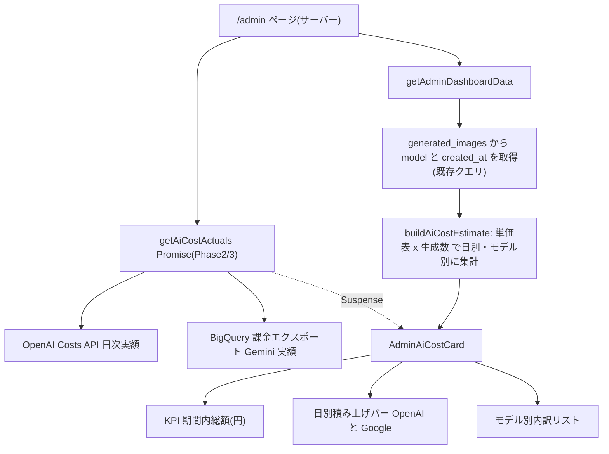
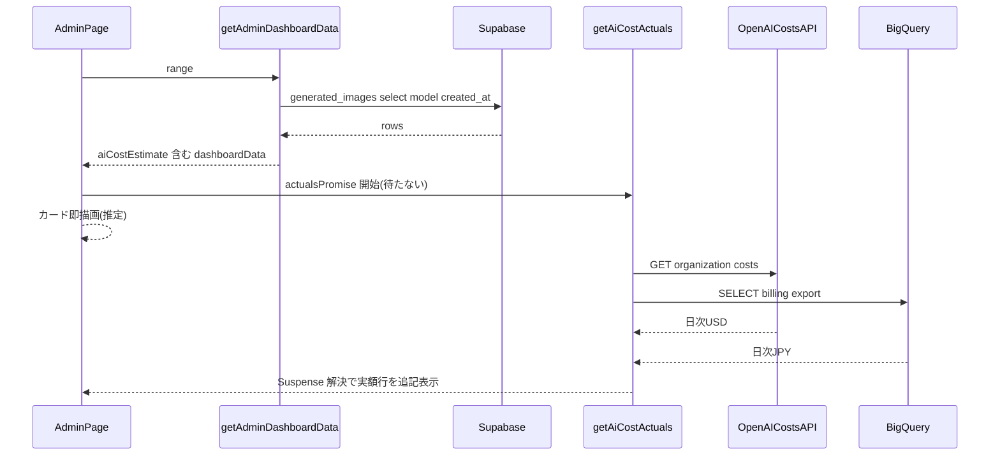
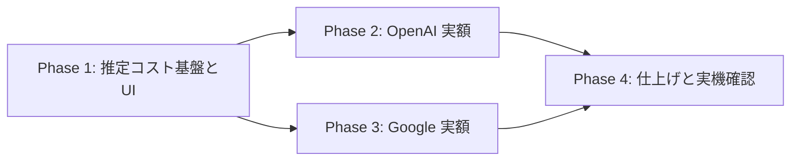

# AI 原価ダッシュボード実装計画（AI Cost Dashboard）

作成日: 2026-07-26
ステータス: 承認待ち → 実装中
関連: PR #451（ログイン方法別構成チャート）と同じ分析セクションに追加する

## 背景・ゴール

AI 画像生成の外部 API（OpenAI gpt-image-2 / Google Gemini 系）の費用を、platform.openai.com/usage や aistudio.google.com/spend を都度開かずに /admin ダッシュボードで確認できるようにする。

- 見たいもの: 期間内の総額・日別の棒グラフ・プロバイダ別/モデル別内訳（**粗利・収益対比は初版スコープ外**）
- 表示通貨: **円メイン**（USD 単価を固定レートで換算、注記を表示）
- CSV エクスポート: 初版不要
- 3段構成: Phase 1 = 自前推定（単価×生成数）/ Phase 2 = OpenAI 実額（Costs API）/ Phase 3 = Google 実額（BigQuery 課金エクスポート）

## コードベース調査結果

| 確認項目 | 結果 | 流用先 |
|---|---|---|
| 生成記録 | `generated_images.model` にモデル名が記録済み（直近30日: gpt-image-2-low-1k 1,041 / gemini-3.1-flash-image-preview-1024 6 / gemini-3-pro-image-1k 1 / null 37）。`getAdminDashboardData` が既に期間分の `model` + `created_at` を取得している | Phase 1 は**新規クエリ不要** |
| 日次バケット | `enumerateJstDateKeys` / `formatJstDateLabel`（`features/admin-dashboard/lib/dashboard-range.ts:178`）で JST 日次キー生成。`buildTrend` が使用例 | 日別集計 |
| 積み上げ棒 | `ScrollingStackedBarChart`（共通コンポーネント、`StackedBarSeries` で色・キー指定）。使用例 `AdminEntryAccessStackedCard.tsx:104` | 日別コストバー |
| カード配置 | `AdminTrendAndFunnelSection`（`AdminPageAnalyticsSection.tsx`）の `xl:grid-cols-12` グリッド。「モデル別構成」「ログイン方法別構成」カードと同型 | 配置・Card スタイル |
| 遅延ロード | `AdminModelMixChartPanel` の dynamic import (ssr:false) パターン | チャート Panel |
| 外部データの分離ロード | GA4 は `ga4Promise` + Suspense + status("ready"/"error") + `AnalyticsUnavailableCard` で優雅に劣化 | Phase 2/3 実額の取得 |
| BigQuery 基盤 | `@google-cloud/bigquery` 導入済み。`ga4-bigquery-client.ts`（サービスアカウント= `GA4_SERVICE_ACCOUNT_JSON_BASE64`、`GA4_BIGQUERY_PROJECT_ID/DATASET/LOCATION`） | Phase 3 の課金クエリ |
| env 追加 | `lib/env.ts` の env オブジェクトにキーを足す方式 | Phase 2/3 の設定 |
| 認証 | /admin ページ自体が管理者認証で保護済み。新規 API Route・RPC は作らない（すべてサーバーコンポーネント内で取得） | — |
| DB 変更 | **なし**（単価・レートはコード定数、実額は非永続・都度フェッチ） | — |

Supabase 接続: 確認済み（本セッションで `supabase db query --linked` 実行実績あり）。ただし本機能に DB 変更はない。

## 概要図

### アーキテクチャ

### 表示までのシーケンス（Phase 2/3 込み）

## EARS 要件定義

| # | タイプ | 要件 |
|---|---|---|
| E1 | イベント駆動 | When 管理者が /admin の分析セクションを開いた時, the system shall 選択中の期間タブ(24h/7d/30d/90d)に対応する推定 AI コスト（円換算）を表示する。 管理者が分析セクションを開いたとき、期間タブに連動した推定AIコストを円で表示すること |
| E2 | イベント駆動 | When 期間タブが変更された時, the system shall 総額・日別バー・内訳を再計算して表示する |
| S1 | 状態駆動 | While 表示中, the system shall 日別積み上げバーを JST 日付キーで OpenAI / Google の2系列で描画する |
| S2 | 状態駆動 | While 表示中, the system shall 適用した換算レート（例 $1=¥155 固定）を注記として表示する |
| O1 | オプション | Where OPENAI_ADMIN_API_KEY が設定されている, the system shall OpenAI の期間内実額（全 API 用途込み）を KPI 行に併記する |
| O2 | オプション | Where 課金エクスポートの BigQuery 設定が揃っている, the system shall Google の期間内実額を KPI 行に併記する |
| F1 | 異常系 | If model が null または単価表に存在しない, then the system shall 該当件数を「単価未設定」として内訳末尾に件数のみ表示し、金額合計には含めない |
| F2 | 異常系 | If 実額 API / BigQuery がエラーまたはタイムアウトした, then the system shall 推定表示を維持したまま実額行に「取得できませんでした」を表示する（ダッシュボード全体を壊さない） |
| F3 | 異常系 | If 実額連携が未設定（env 無し）, then the system shall 実額行自体を表示しない（エラー扱いにしない） |
| A1 | 権限 | While 非管理者がアクセスした場合, the system shall 既存の /admin ページ認証によりページごと拒否する（本機能専用の API Route は新設しない） |

## ADR（設計判断記録）

### ADR-001: 単価・換算レートはコード内定数で管理

- **Context**: モデル別単価（USD）と USD→JPY レートの保持方法。
- **Decision**: `features/admin-dashboard/lib/ai-cost-rates.ts` に定数として定義。DB テーブル・管理画面編集は作らない。
- **Reason**: 改定頻度は年数回・編集者は運営1名。git 履歴とレビューが効き、DB/RLS/編集UIの実装コスト(+40%)を回避（ユーザー承認済み）。
- **Consequence**: 単価改定はデプロイが必要。単価に「適用開始日」を持たせ、期間をまたぐ再計算のズレを防ぐ（初版は現行単価1本でも、構造だけ `effectiveFrom` を持てる形にする）。

### ADR-002: 日別バーは常に「推定」ベースで統一、実額は KPI 行に期間合計のみ併記

- **Context**: Phase 2/3 で日次実額も取得可能になるが、実額は反映遅延（OpenAI 最大~24h、BigQuery 数時間〜1日）があり、日によって「推定/実額」が混在する。
- **Decision**: バーは全期間一貫して推定値。実額は KPI 行の期間合計併記のみ（「推定 ¥X / 実額 ¥Y」）。
- **Reason**: 1つの系列にソースの異なる値を混ぜると急増検知の基準が日によって変わり誤読を招く。1軸1定義の原則。
- **Consequence**: 推定と実額の日次レベルの突合はできない（期間合計での妥当性確認に留まる）。必要になったら「実額バーへの表示切替」を将来追加。

### ADR-003: 円換算は固定レート定数

- **Context**: 単価は USD 建て、表示は円メイン（ユーザー指定）。
- **Decision**: `USD_JPY_RATE` 定数（例 155）で換算し、カードに「$1=¥155 固定換算」を注記。
- **Reason**: 原価把握の用途では為替の日次変動は誤差。為替 API 依存を増やさない。
- **Consequence**: 実勢レートと数%ズレる。Google 実額（Phase 3、請求通貨が円の場合）はそのまま円で扱い、OpenAI 実額（USD）のみ換算する。

### ADR-004: 実額は DB に永続化しない（都度フェッチ + Suspense 分離）

- **Context**: OpenAI Costs API / BigQuery の結果の扱い。
- **Decision**: GA4 と同じ「サーバー側フェッチ + Promise/Suspense + status で劣化」パターン。メインのダッシュボードデータをブロックしない。
- **Reason**: 既存パターンとの一貫性。履歴は各プラットフォーム側に常に存在し、二重管理を避ける。
- **Consequence**: 表示のたびに外部 API を叩く（GA4 と同等の特性。問題が出たら "use cache" + cacheLife で緩和）。

## 実装計画

### フェーズ間の依存関係

Phase 2 と 3 は独立（並行可）。それぞれ env 未設定なら非表示のため、どの時点でもデプロイ可能。

### Phase 1: 推定コスト基盤と UI（外部依存なし・即日）

目的: 推定コストの KPI・日別積み上げバー・モデル別内訳をダッシュボードに表示する。
ビルド確認: `npm run test` / `npm run build -- --webpack` 緑。env 追加なしで全環境動作。

- [ ] `ai-cost-rates.ts` 新規: `MODEL_UNIT_COSTS_USD`（モデル名→1生成あたり USD。**実装時に OpenAI / Google の公式料金ページから転記し、出典 URL をコメントに残す**）+ `USD_JPY_RATE` + プロバイダ判定（`gpt-*`→openai / `gemini-*`→google）
- [ ] `build-ai-cost.ts` 新規: `buildAiCostEstimate(generations, currentStart, now)` — 既存 `GeneratedImageRow`（model, created_at）から日別（`enumerateJstDateKeys` 使用）× プロバイダ別の推定額、モデル別内訳、単価未設定件数を算出（純関数・export）
- [ ] `dashboard-types.ts` 修正: `DashboardAiCostEstimate` 型（total円 / days[] / byModel[] / unknownCount / rateNote）
- [ ] `get-admin-dashboard-data.ts` 修正: `aiCostEstimate: buildAiCostEstimate(...)` を返却に追加（既存の generatedImages 取得を流用、**新規クエリなし**）
- [ ] `AdminAiCostCard.tsx` 新規: KPI 行（期間内合計 ¥）+ `ScrollingStackedBarChart`（OpenAI / Google 2系列、エンティティ固定色・CVD検証済みパレットから割当）+ モデル別内訳リスト + レート注記。dynamic Panel（`AdminModelMixChartPanel` パターン）
- [ ] `AdminPageAnalyticsSection(Server).tsx` / `app/(app)/admin/page.tsx` 修正: 分析セクションのグリッドにカード追加・props 配線
- [ ] `tests/unit/features/admin-dashboard/build-ai-cost.test.ts` 新規: 日別バケット境界（JST）/ モデル→プロバイダ判定 / 単価未設定（null・未知モデル）の除外と件数 / 円換算丸め

### Phase 2: OpenAI 実額（Costs API）

目的: OPENAI_ADMIN_API_KEY が設定されていれば、期間内の OpenAI 実額（USD→円換算）を KPI 行に併記する。
ビルド確認: env 未設定環境でもビルド・表示が壊れない（実額行が出ないだけ）。
事前作業（ユーザー）: platform.openai.com → Organization → Admin Keys でキー発行 → Vercel/.env.local に `OPENAI_ADMIN_API_KEY` 登録。

- [ ] `lib/env.ts` 修正: `OPENAI_ADMIN_API_KEY` 追加（サーバー専用）
- [ ] `openai-costs-client.ts` 新規: `GET https://api.openai.com/v1/organization/costs?start_time=...&bucket_width=1d` を叩き期間内合計 USD を返す（`server-only`、タイムアウト・非200は status:"error" で返す。GA4 の status パターン踏襲）
- [ ] `get-ai-cost-actuals.ts` 新規: 実額取得の Promise を返す（Phase 3 と合流する集約点）。`AdminPageAnalyticsSectionServer` に `aiCostActualsPromise` を追加し、カード内の Suspense 子コンポーネントで実額行を遅延表示
- [ ] テスト: レスポンスパース・エラー時 status の単体テスト（fetch はモック）

### Phase 3: Google 実額（BigQuery 課金エクスポート）

目的: 課金エクスポート設定が揃っていれば、期間内の Google（Generative Language API）実額を KPI 行に併記する。
ビルド確認: env 未設定環境でもビルド・表示が壊れない。
事前作業（ユーザー・一回のみ）:
1. GCP Cloud Billing → 課金エクスポート → **標準使用料金の BigQuery エクスポート**を有効化（Gemini プロジェクト `gen-lang-client-0265955886` を支払う請求先アカウントで。データセットは GA4 と同じプロジェクト推奨）
2. 既存サービスアカウント（GA4 用）に該当データセットの「BigQuery データ閲覧者」を付与
3. `BILLING_BIGQUERY_DATASET`（+ 必要ならテーブル名）を env に登録
※ エクスポートは**有効化以降のデータのみ**。早期有効化を推奨（本計画承認後すぐやってよい）。

- [ ] `lib/env.ts` 修正: `BILLING_BIGQUERY_DATASET` 追加
- [ ] `billing-bigquery-query.ts` 新規: `ga4-bigquery-client` を流用し、`service.description = "Generative Language API"`（実装時に実データの表記を確認して合わせる）の日次 cost 合計を期間で SELECT
- [ ] `get-ai-cost-actuals.ts` 修正: Google 実額を合流（OpenAI と独立に成功/失敗できる Promise.allSettled）
- [ ] テスト: クエリビルダー（SQL 文字列とパラメータ）・請求通貨の扱いの単体テスト

### Phase 4: 仕上げ・実機確認

目的: 劣化系の確認と本番検証。
ビルド確認: 検証4点セット（lint / typecheck / test / build --webpack）緑。

- [ ] env 未設定・API エラー時の表示確認（実額行なし / 「取得できませんでした」）
- [ ] 実機: /admin で期間タブ切替・モバイル幅・推定と実額の乖離確認（数%以内が期待値）
- [ ] `docs/API.md` 等への追記は不要（新規公開 API なし）。env 一覧ドキュメントがあれば追記

## 修正対象ファイル一覧

| ファイル | 操作 | 変更内容 | フェーズ |
|----------|------|----------|---------|
| features/admin-dashboard/lib/ai-cost-rates.ts | 新規 | モデル別単価・換算レート定数（出典コメント付き） | 1 |
| features/admin-dashboard/lib/build-ai-cost.ts | 新規 | 推定コスト集計の純関数 | 1 |
| features/admin-dashboard/lib/dashboard-types.ts | 修正 | DashboardAiCostEstimate 型追加 | 1 |
| features/admin-dashboard/lib/get-admin-dashboard-data.ts | 修正 | aiCostEstimate を算出・返却 | 1 |
| features/admin-dashboard/components/AdminAiCostCard.tsx | 新規 | KPI+積み上げバー+内訳カード | 1 |
| features/admin-dashboard/components/AdminAiCostCardPanel.tsx | 新規 | dynamic import ラッパー | 1 |
| features/admin-dashboard/components/AdminPageAnalyticsSection.tsx | 修正 | カード配置・props | 1 |
| features/admin-dashboard/components/AdminPageAnalyticsSectionServer.tsx | 修正 | props 配線（+Phase2 で actualsPromise） | 1,2 |
| app/(app)/admin/page.tsx | 修正 | props 配線 | 1,2 |
| tests/unit/features/admin-dashboard/build-ai-cost.test.ts | 新規 | 集計関数の単体テスト | 1 |
| lib/env.ts | 修正 | OPENAI_ADMIN_API_KEY / BILLING_BIGQUERY_DATASET | 2,3 |
| features/admin-dashboard/lib/openai-costs-client.ts | 新規 | Costs API クライアント | 2 |
| features/admin-dashboard/lib/get-ai-cost-actuals.ts | 新規 | 実額取得の集約（allSettled） | 2,3 |
| features/admin-dashboard/lib/billing-bigquery-query.ts | 新規 | 課金エクスポートのクエリ | 3 |
| tests/unit/features/admin-dashboard/（実額系） | 新規 | パース・クエリビルダーのテスト | 2,3 |

## 品質・テスト観点

- [ ] エラーハンドリング: 実額系の失敗がダッシュボード全体を壊さない（F2/F3、GA4 の AnalyticsUnavailableCard と同等の劣化）
- [ ] 権限制御: /admin ページ認証内で完結。新規 API Route なし・クライアントへ Admin キーを渡さない（`server-only`）
- [ ] データ整合性: 単価未設定モデルの除外を金額と件数で明示（silent drop しない）
- [ ] セキュリティ: `OPENAI_ADMIN_API_KEY` はサーバー専用 env。ログ・エラーメッセージにキーを含めない
- [ ] i18n: admin は日本語固定（既存カード同様）のため翻訳キー追加なし

| カテゴリ | テスト内容 |
|----------|-----------|
| 正常系 | 期間タブごとの総額・日別バケット・内訳が正しい（JST 境界含む） |
| 異常系 | model null / 未知モデル / 実額 API 失敗 / env 未設定 |
| 権限 | 非管理者は /admin 自体に到達不可（既存テストでカバー済みの認証に依存） |
| 実機 | 期間切替・モバイル幅・実額との乖離確認 |

テスト実装は `/test-flow` に沿って `build-ai-cost` を Target に実施する。

## ロールバック方針

- DB 変更ゼロのため、**revert のみで完全に戻る**（フェーズ単位でコミット）
- Phase 2/3 は env 未設定なら不活性 → 問題時は env を消すだけでも実額行を止められる（コード revert 不要の緊急停止手段）
- 外部への書き込みは一切なし（read-only 連携）

## 使用スキル

| スキル | 用途 | フェーズ |
|--------|------|----------|
| `/dataviz` | 積み上げバーの配色・マーク仕様（読込済み・CVD 検証は validate_palette.js） | 1 |
| `/test-flow` 系 | build-ai-cost のテスト整備 | 1 |
| `/git-create-pr` | フェーズごとの PR 作成 | 各 |

## 未確定事項（実装時に確定）

1. **モデル単価の正確な値**: 実装時に OpenAI 料金ページ（gpt-image-2 系）と Google AI 料金ページ（gemini-3.x image 系）から転記し、定数に出典 URL と取得日をコメントで残す。旧 `null` モデル 37 件は「単価未設定」扱い。
2. **BigQuery 課金エクスポートの `service.description` 実値**: エクスポート有効化後に実データで確認（"Generative Language API" 想定）。
3. **Google 請求通貨**: 円請求ならそのまま、USD なら OpenAI と同じ固定レート換算。
