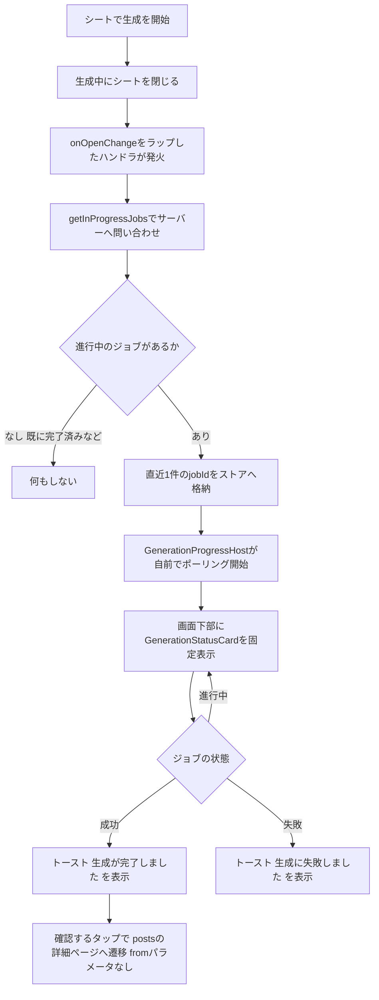
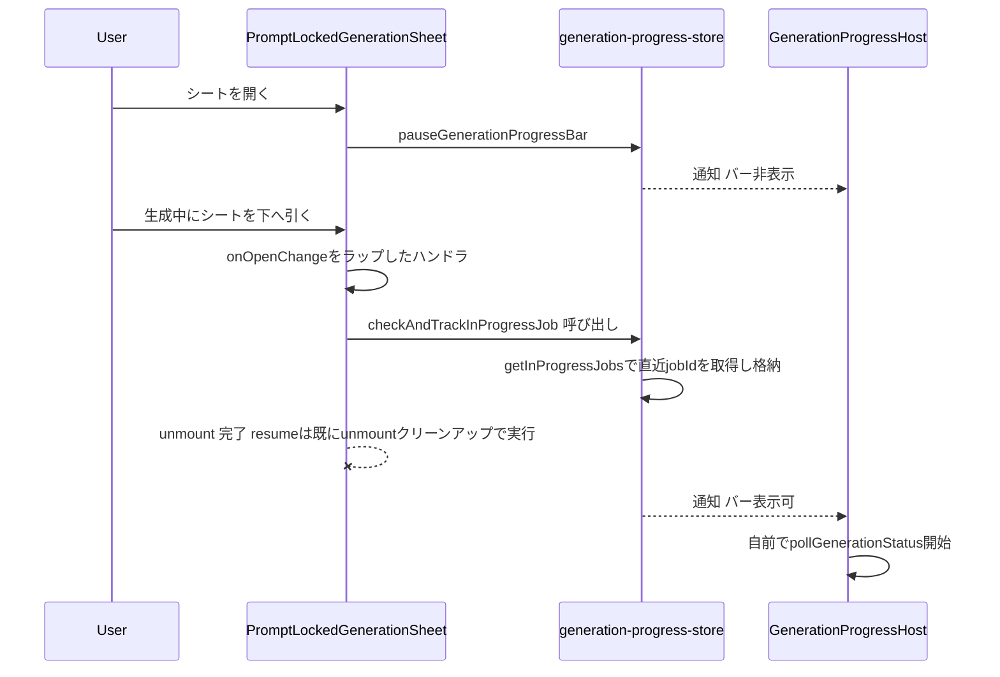
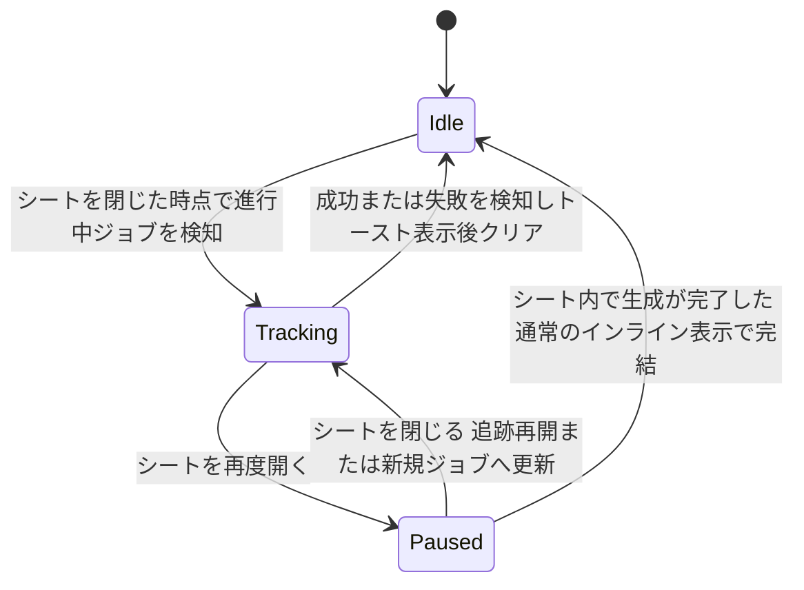
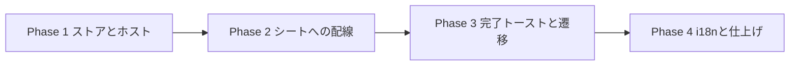

# 生成中バックグラウンド進捗バー 実装計画

作成日: 2026-09-04

「このプロンプトで生成する」ボトムシート（`PromptLockedGenerationSheet`）を
生成中に閉じても、進捗が失われないようにする。閉じたら画面下部にステータス
バーを出し、完了したらトーストで知らせる。

---

## コードベース調査結果

| 観点 | 調査結果 |
|---|---|
| 現状の問題 | シートを閉じる（vaul Drawer を下へ引く）と `onOpenChange(false)` が即座に呼ばれ、ガード無しで `<PromptLockedGenerationSheet>` ごと unmount される（`FollowAndUsePromptButton.tsx:205-213`・`SourcePromptReferenceCard.tsx:460-468` はどちらも `{isSheetOpen && ... ? (<Sheet/>) : null}` という「隠す」ではなく「作り直す」実装）。unmount で `GenerationStateProvider`（`useState` のみ）も消え、進捗表示が失われる |
| サーバー側は止まらない | 生成ジョブは Edge Function `image-gen-worker` が処理し、ブラウザの接続とは無関係に完走する。ペルコインの減算も `charging` ステージでサーバー側が行う（`supabase/functions/image-gen-worker/index.ts:2043-2052` の `deductPercoinsFromGeneration`） |
| 既存の復旧経路 | `GenerationFormContainer.tsx:584-708` の mount 時 `useEffect` が `getInProgressJobs(false, ...)` を呼び、`queued`/`processing` のジョブだけを拾って進捗を再開する。**`succeeded` になった後に開き直しても拾われない**（`includeRecent` は使っていない）ため、その場合はマイページの生成履歴からしか見つけられない |
| ⭐ シートは「隠す」ではなく「作り直す」 | 両呼び出し元とも `isSheetOpen` の三項演算子で `null` を返す実装なので、`PromptLockedGenerationSheet` は `open=false` という props を一度も受け取らず、**閉じる＝即 unmount**。これにより、閉じる合図をトリガーに「いま進行中のジョブは？」とサーバーへ問い合わせるだけで直近のジョブが判明する。`GenerationStateContext` にジョブIDを追加する必要が無くなった（当初案からの簡略化） |
| 投稿側の前例 | `features/posts/lib/post-progress-store.ts`（モジュール変数のグローバルストア・Context ではなく `useSyncExternalStore` で購読）+ `features/posts/components/PostProgressHost.tsx`（`LocaleShell.tsx` の Suspense 境界の**外側**に1つだけマウント）+ `features/posts/components/PostProgressBar.tsx`（`fixed inset-x-0 z-[60]`・ボトムナビを隠す・`safe-area` 対応）。今回はこの3点セットを生成側にも作る |
| 再利用できる進捗計算の部品（すべて `GenerationFormContainer` の外に独立して存在） | `getInProgressJobs` / `getGenerationStatus` / `pollGenerationStatus`（`features/generation/lib/async-api.ts`）、`summarizeJobProgress` / `normalizeProcessingStage` / `isTerminalJobStatus`（`features/generation/lib/job-progress.ts`）、`buildCoordinateStageCopy(t)`（`features/generation/lib/coordinate-stage-copy.ts`、`t` は `useTranslations("coordinate")`）、`useCoordinateGenerationFeedback(phase, stageCopy)`（`features/generation/hooks/useCoordinateGenerationFeedback.ts`、引数は `phase` と `stageCopy` のみで他の状態に依存しない） |
| 表示コンポーネント | `GenerationStatusCard`（`features/generation/components/GenerationStatusCard.tsx`）は props 受け取りのみの純粋な表示部品（`title`/`message`/`liveMessage`/`footerText`/`progress`/`isComplete`/`prefersReducedMotion`）。`/style`・`/coordinate`（inspire 経由）・今回のシートなど複数箇所で使われている共通部品 |
| 認証前提 | このシートは未ログインでは開けない（`FollowAndUsePromptButton.tsx:129` で `!currentUserId` なら `AuthModal` を出して `openSheet()` へ進まない）。`GenerationFormContainer` に混在するゲスト用の疑似進捗ロジック（`isGuest` 分岐・`calculatePseudoProgress`）は考慮不要 |
| 完了時の遷移先 | `features/my-page/components/MyImageCard.tsx:57` は投稿済み・未投稿を問わず全画像を `/posts/{id}?from=my-page` へリンクしている。`getMyImages()`（`features/my-page/lib/api.ts:57-62`）が `is_posted` を問わず全件取得するため、未投稿の生成結果もマイページに出る。`PostDetail.tsx:614` は `!post.is_posted` のときだけ `PostModal` を描画し、`:392-394` のメニューから開ける（未投稿画像の詳細ページは既に対応済み） |
| ⭐ `?from=my-page` は使えない | `sticky-back-url.ts:26` の `resolveStickyBackUrl` は `fromParam === "my-page"` を見た瞬間、無条件で `/my-page` を返す（実際の閲覧履歴を無視する固定マーカー）。`StickyHeader.tsx:105-113` に「`from` 付きの経路は行き先を意図的に固定しているので触らない」と明記。生成完了トーストは**どの画面からでも**出うるため、`from=my-page` を使うと「ホームを見ていたのに戻るとマイページに飛ぶ」事故になる。`from` を付けずに `/posts/{id}` へ遷移させれば、`fromParam` が null かつ `/my-page/` 配下でもないため `backUrl === localizedHomePath` となり、`shouldUseHistoryBack`（`StickyHeader.tsx:122-123`）が true になって `router.back()`（本物の履歴の巻き戻し・スクロール位置も復元）が使われる |
| i18n 名前空間 | `buildCoordinateStageCopy` の型は `AppMessages["coordinate"]` に固定されているため、新しいホストも `useTranslations("coordinate")` を使う。トースト文言の新規キーも `coordinate` 名前空間に追加する（`generatingStatusTitle`・`generationCompletedTitle` などの既存キーと同じ場所） |
| テストの前例 | `tests/unit/features/posts/post-progress-host.test.tsx` が `PostProgressHost` の購読・トースト表示のテストパターンを持つ |

---

## 1. 概要図

### 全体の流れ



### シートの mount/unmount とバーの抑制



### 状態遷移（グローバルストア）



---

## 2. EARS（要件定義）

- **When** the user dismisses the locked-prompt generation sheet while a job is still `queued` or `processing`, the system shall query the server for the user's in-progress jobs and begin tracking the most recent one.
  （ユーザーが生成中にロック済みプロンプト生成シートを閉じたとき、システムはサーバーへ進行中ジョブを問い合わせ、直近の1件の追跡を開始しなければならない）
- **If** no in-progress job is found at the moment the sheet closes (e.g., it already succeeded), **then** the system shall not display the background bar.
  （シートを閉じた時点で進行中のジョブが見つからない場合、システムは下部バーを表示してはならない）
- **While** the locked-prompt generation sheet is open, the system shall hide the background progress bar, regardless of whether a job is being tracked.
  （ロック済みプロンプト生成シートが開いているあいだ、システムは追跡中のジョブの有無に関わらず下部の進捗バーを隠さなければならない）
- **While** a job is being tracked in the background, the system shall poll its status and render `GenerationStatusCard` with the same stage-based title, message, and progress percentage used inside the sheet.
  （バックグラウンドでジョブを追跡しているあいだ、システムはその状態をポーリングし、シート内と同じステージ別の文言・進捗％で `GenerationStatusCard` を描画しなければならない）
- **When** the tracked job reaches a terminal state (succeeded or failed), the system shall show a toast notification and clear the tracked job.
  （追跡中のジョブが終端状態（成功・失敗）に達したとき、システムはトースト通知を表示し、追跡対象をクリアしなければならない）
- **When** the user taps the completion toast's action, the system shall navigate to `/posts/{generatedImageId}` without a `from` query parameter, so that the back button returns to the user's actual previous screen.
  （完了トーストのアクションをタップしたとき、システムは `from` クエリパラメータを付けずに `/posts/{生成された画像ID}` へ遷移させ、戻るボタンが実際の直前の画面に戻るようにしなければならない）
- **If** the browser is fully reloaded or the tab is closed while a job is being tracked in the background, **then** the system is not required to restore the background bar (out of scope for this MVP; the existing sheet-reopen recovery for `queued`/`processing` jobs still applies).
  （バックグラウンド追跡中にブラウザが完全にリロードされる、またはタブが閉じられた場合、システムは下部バーを復元する必要はない（本MVPの対象外。既存のシート再訪時の `queued`/`processing` 復旧はそのまま適用される））
- **Where** the user is a guest (not logged in), the system shall not engage any part of this feature, since the locked-prompt sheet is unreachable without authentication.
  （ユーザーがゲスト（未ログイン）の場合、システムは本機能のいずれの部分も動作させてはならない。ロック済みプロンプトシートは未認証では到達できないため）

---

## 3. ADR

### ADR-001: シートの unmount をトリガーに、サーバーへ問い合わせて jobId を取得する

- **Context**: 生成中の状態（`isGenerating`・`jobStatuses`）は `GenerationStateProvider` の `useState` にあり、シートの外（`PromptLockedGenerationSheet` 自身）からは読めない。当初案では `GenerationStateContext` にジョブIDを追加で持たせる想定だった。
- **Decision**: `GenerationFormContainer` / `GenerationStateContext` には一切手を入れない。シートを閉じる合図（`onOpenChange(false)` をラップしたハンドラ）で `getInProgressJobs(false, ...)` を呼び、返ってきた中から最新の1件を採用する。
- **Reason**: 両呼び出し元（`FollowAndUsePromptButton.tsx` / `SourcePromptReferenceCard.tsx`）はシートを「隠す」のではなく「毎回作り直す」実装なので、閉じる＝即 unmount である。unmount のタイミングでサーバーに直接聞けば、シート内部の React state を外へ持ち出す配線が一切不要になる。`getInProgressJobs` は既存の復旧経路と全く同じ API なので、举動の一貫性も保てる。
- **Consequence**: 閉じた瞬間にジョブがまだ `queued`/`processing` でなければ（既に `succeeded` していれば）追跡は始まらない。ただしその場合、閉じる直前までシート自身が完了状態を表示していたはずなので、ユーザーへの実害はない（後述 ADR-003）。

### ADR-002: 見た目は `GenerationStatusCard` をそのまま流用する

- **Context**: 新しいバー専用のデザインを作ることもできるが、既存の生成中カードと見た目がずれると「同じ生成なのに表示が変わる」違和感が出る。
- **Decision**: `GenerationStatusCard` を固定表示のラッパー（`PostProgressBar.tsx` と同じ `fixed inset-x-0` パターン）に入れてそのまま使う。
- **Reason**: このコンポーネントは props 受け取りのみの純粋な部品で、Context にも親コンポーネントにも依存していない。ユーザーの決定どおり、最小の変更で流用できる。
- **Consequence**: `mt-4` の余白を持つ Card 前提のスタイルなので、固定バーに入れると上部にわずかな余白ができる。見た目の微調整が必要ならこの1点だけ。

### ADR-003: 完了トーストの遷移先は `/posts/{id}`（`from` パラメータなし）

- **Context**: `MyImageCard.tsx` は同じ画像一覧を `/posts/{id}?from=my-page` にリンクしているが、これは常にマイページ自身から張られるリンクだから正しい。生成完了トーストは**どの画面からでも**出うるため、同じ `from=my-page` を使うと `resolveStickyBackUrl`（`sticky-back-url.ts:26`）が無条件で `/my-page` を返し、実際の閲覧履歴と無関係に戻り先が固定されてしまう。
- **Decision**: `from` を付けずに `/posts/{生成された画像ID}` へ遷移する。
- **Reason**: `fromParam` が null かつ `/my-page/` 配下でもない場合、`backUrl` は `localizedHomePath` に解決され、`shouldUseHistoryBack`（`canGoBackInHistory && backUrl === localizedHomePath`）が true になる。`canGoBackInHistory` はセッション内の閲覧ページ数が2以上かの単純なカウンタ（`in-app-history.ts`）で、通常利用ならほぼ常に true。結果として `router.back()` による本物の履歴の巻き戻し（スクロール位置の復元込み）が使われ、ユーザーが実際にいた画面へ正しく戻る。
- **Consequence**: セッション最初のページ閲覧中に完了した場合（`canGoBackInHistory` が false）は、フォールバックとしてホームへの `Link` 遷移になる。これは「戻る先の実履歴がそもそも無い」ケースなので妥当な代替。

### ADR-004: MVPとして直近1件のジョブだけを追跡する

- **Context**: 複数のシートを開いて複数ジョブが同時にバックグラウンドで進行するケースは、理論上は起こりうる（例: シートAを閉じた後、別の投稿でシートBを開いて閉じる）。
- **Decision**: ストアは `trackedJobId: string | null` を1つだけ持つ。新しいジョブを検知したら上書きする。
- **Reason**: ユーザー承認済み（MVPとして割り切る）。実際に同時に何度も行うユーザーがどれだけいるか未知数なので、まず単純な形で出して様子を見る。
- **Consequence**: 2件目のジョブを閉じると、1件目の追跡は静かに上書きされる（1件目が完了してもトーストは出ない）。1件目もサーバー側では最後まで処理され、マイページには残るため、完全に失われるわけではない。

### ADR-005: リロード・タブクローズ後の復旧は対象外（次フェーズ）

- **Context**: 新設するストアはモジュール変数（メモリ上）で、`post-progress-store.ts` と同じ作り。生成は最大10分かかりうる（`pollGenerationStatus` のタイムアウト・`async-api.ts` の `timeout = 600000`）ため、投稿（数秒で完了）より「リロードで失われる」影響が大きい。
- **Decision**: 本MVPではリロード後の復旧を対象外とする。`sessionStorage` へ永続化する対応は次フェーズで検討する。
- **Reason**: ユーザー承認済み。スコープを広げずMVPとして出す。
- **Consequence**: ページを完全リロードすると、追跡中だった `trackedJobId` は失われる。その後は既存の復旧経路（シートを開き直したときの `queued`/`processing` 限定の復旧）に頼ることになり、既に `succeeded` していた場合はマイページから探すしかない（現状と同じ制約が残る）。

### ADR-006: 本番マージ後、まず運営のみに公開する（段階公開）

- **Context**: 実機での完全なE2E検証（実際に課金してのAI生成→シートを閉じる→完了トースト→遷移→戻るボタン）は、ローカルdevサーバーの制約で行えなかった。`ensureSameOrigin`（`lib/security/same-origin.ts`）が正しいCSRF対策として機能する一方、`request.nextUrl.host` が dev server では常に `localhost` 固定になり（`--hostname 0.0.0.0` を指定すると `0.0.0.0` 固定になる。実測で確認済み）、LAN経由の実機からの mutation（生成ジョブ投入）が同一オリジン扱いにならず弾かれる。これは本番（Vercel）では発生しない dev server 固有の制約。
- **Decision**: 🔥人気タブ・検索と同じ「公開フラグ or 運営」の段階公開にする。`NEXT_PUBLIC_BACKGROUND_GENERATION_PROGRESS_ENABLED` を追加し、`isBackgroundGenerationProgressAvailable(userId)` で判定する。`GenerationProgressAvailabilityProvider` / `...Loader` を新設し、`PopularPromptsAvailabilityProvider` / `...Loader` と同じ構造にする。
- **Reason**: 本番で運営アカウントだけがまず実機確認できる状態にし、実際の課金を伴う生成で一連の流れ（バー表示→完了→トースト→遷移→戻る）を確認してから一般公開する。判定は2箇所（`GenerationProgressHost` と `PromptLockedGenerationSheet`）で二重に効かせる。`PromptLockedGenerationSheet` 側で `false` ならストア操作自体を行わないため、`GenerationProgressHost` 側の判定を待たずとも何も起きない。
- **Consequence**: `GenerationProgressAvailabilityProvider` は `appContent`（シートを含むページ本体）と `GenerationProgressHost`（Suspense 境界の外側の別ツリー）の両方に届く必要があるため、`LocaleShell.tsx` の中で最も外側の位置に置く必要があった（`PopularPromptsAvailabilityProvider` は `appContent` 側だけで完結していたため、この点は今回で新たに踏んだ制約）。全公開までのあいだ、コード自体は本番に存在するが実行されない。

---

## 4. 実装計画



DB変更は無いため、Phase 1 から着手する（データベース設計フェーズは無し）。

### Phase 1: グローバルストアとホストの新設 ✅ 完了（2026-09-04）

**目的**: 投稿側と同じ3点セット（ストア・ホスト・バー）を生成側にも作る。まだどこからも呼ばれない状態で用意する。
**ビルド確認**: `npm run build -- --webpack` が通る。

- [x] `features/generation/lib/generation-progress-store.ts` を新規作成
  - 既存の `post-progress-store.ts` と同じ形（module 変数 + `useSyncExternalStore` 用の `subscribe`/`getSnapshot`/`getServerSnapshot`）
  - 状態: `{ trackedJobId: string | null; sheetOpenCount: number }`
    - ⭐ 真偽フラグではなく**カウンタ**にする。理由: 将来的に複数のシート呼び出し元が同時にマウントされる可能性を考慮すると、bool の on/off だと片方が閉じた瞬間にもう片方が開いていてもバーが出てしまう事故が起きうる。カウンタなら 0 判定で正しく扱える（現状は呼び出し元が同時に2つ開くことは無いはずだが、堅牢性のため）
  - `checkAndTrackInProgressJob()`: `getInProgressJobs(false, ...)` を呼び、返った配列の先頭（`created_at DESC` 順・`app/api/generation-status/in-progress/route.ts` で確認済み）を `trackedJobId` にセットする。空配列なら何もしない。**問い合わせ自体が失敗した場合は握りつぶして何もしない**（バックグラウンドの補助機能であり、失敗してもシートを閉じる操作自体をブロックしてはならない。`PostModal.tsx:217` の `revalidate/home` 失敗時と同じ考え方）
  - `pauseGenerationProgressBar()` / `resumeGenerationProgressBarIfNeeded()`: `sheetOpenCount` を増減する
  - `clearTrackedJob()`: 完了検知後にストアを畳む
  - `resetGenerationProgressStoreForTest()`: テスト用（`post-progress-store.ts` に倣う）
- [x] `features/generation/components/GenerationProgressHost.tsx` を新規作成
  - `useSyncExternalStore` でストアを購読
  - `sheetOpenCount > 0` または `trackedJobId` が null なら何も描画しない
  - `trackedJobId` があれば、自前で `pollGenerationStatus(trackedJobId, {...})` を呼ぶ（`GenerationFormContainer` は経由しない）
  - 進捗の算出は `summarizeJobProgress([{status, processingStage}])`（1件配列）+ `normalizeProcessingStage` を使う
  - 文言は `buildCoordinateStageCopy(t)`（`t = useTranslations("coordinate")`）+ `useCoordinateGenerationFeedback(phase, stageCopy)` をそのまま呼ぶ（`GenerationFormContainer.tsx:504-518` の呼び方を参考にする。ただし `isPreparingSubmission` 相当の分岐は簡略化してよい: 1ジョブのみなので「準備中」を出す必要は薄い）
  - 表示は `<GenerationStatusCard {...props} />` を `fixed inset-x-0 z-[60]` のラッパーに入れる（`PostProgressBar.tsx` の配置パターンを踏襲。ボトムナビを隠すクラスの付け外しも同様に行う）
  - 終端状態（`succeeded`/`failed`）を検知したら、トースト表示（Phase 3 で実装）をして `clearTrackedJob()` を呼ぶ
- [x] `components/LocaleShell.tsx` に `<GenerationProgressHost />` を追加
  - `PostProgressHost` と同じ理由で Suspense 境界の外側にマウント（`router.refresh()` 等で unmount されると表示中のバーが消えるため）

### Phase 2: シートへの配線（②の抑制ロジック含む） ✅ 完了（2026-09-04）

**目的**: シートの開閉と新しいストアをつなぐ。この時点でシートを閉じるとバーが出るようになる。
**ビルド確認**: `npm run build -- --webpack` と `npm run test` が通る。

- [x] `features/generation/components/PromptLockedGenerationSheet.tsx` を修正
  - mount 時に `pauseGenerationProgressBar()`、unmount 時（クリーンアップ）に `resumeGenerationProgressBarIfNeeded()` を呼ぶ `useEffect`（依存配列は空）
    - ⭐ `open` の変化を見るのではなく mount/unmount で判定する。両呼び出し元とも「隠す」ではなく「作り直す」実装なので、このコンポーネントは `open=false` を props として受け取ることが無く、mount＝開いている・unmount＝閉じている、の二値に一致する
  - `onOpenChange` をラップしたハンドラを作り、`Dialog`（デスクトップ）と `Drawer.Root`（モバイル）の両方にこちらを渡す
    ```tsx
    const handleOpenChange = (next: boolean) => {
      if (!next) {
        void checkAndTrackInProgressJob();
      }
      onOpenChange(next);
    };
    ```
  - ⭐ `checkAndTrackInProgressJob()` は unmount 直前に発火させる（`onOpenChange(false)` が呼ばれた時点ではまだ unmount されていないので、この位置で呼べば確実）

### Phase 3: 完了トーストと遷移 ✅ 完了（2026-09-04）

**目的**: 追跡中のジョブが終端状態になったら知らせ、投稿導線へつなげる。
**ビルド確認**: `npm run build -- --webpack` と `npm run test` が通る。

- [x] `GenerationProgressHost.tsx` に終端状態検知時のトースト表示を追加
  - 成功時: タイトルは既存の `coordinate.generationCompletedTitle`（「画像の生成が完了しました」）をそのまま流用する（A案で確定。新規キーは作らない）。アクションは新規キー「確認する」
    - アクションの遷移先は `router.push('/posts/${encodeURIComponent(generatedImageId)}')`（**`from` パラメータを付けない**。ADR-003 参照）
    - `generatedImageId` は `pollGenerationStatus` の `onStatusUpdate` / 完了時の `AsyncGenerationStatus.generatedImageId` から取得する（`async-api.ts` の型に既存）
  - 失敗時: タイトル「生成に失敗しました」（アクションなし。`GenerationFormContainer.tsx:864` の既存エラートーストと同じ文言を使い回せないか確認し、無ければ新規キーを追加）
  - `PostProgressHost.tsx` の `ToastAction` の書き方（枠を消してリンク調にする）を踏襲する
  - ⭐ **10分のポーリングタイムアウトも失敗として扱う。** `pollGenerationStatus` は `timeout`（既定 600000ms）を超えると `messages.pollingTimeout` でreject する（`async-api.ts:281-282`）。`GenerationFormContainer.tsx` 側は `errorMessage === asyncApiMessages.pollingStopped`（＝自分で `stop()` した場合）だけを非終端として扱い、それ以外の reject は終端の失敗として扱っている（`:697-716` 付近）。新しいホストも同じ判定を踏襲し、タイムアウトを「進行中のまま」放置しない

### Phase 4: i18n と仕上げ ✅ 完了（2026-09-04）

**目的**: 15ロケール分の文言を揃え、テストを整備する。
**ビルド確認**: `npm run lint` / `typecheck` / `test` / `build -- --webpack` がすべて通る。

- [x] `messages/*.ts`（15言語）の `coordinate` 名前空間に新規キーを追加
  - 完了トーストのタイトルは新規キー不要（`generationCompletedTitle` を流用・A案で確定）。アクション文言「確認する」のみ新規キーを追加
  - 失敗トーストの文言（新規が必要か確認。`generationFailedTitle` が流用できないか先に確認する）
    → 既存の `generationFailedTitle`（「画像を生成できませんでした」）をそのまま流用できた。新規キーは不要
- [x] ユニットテスト
  - `generation-progress-store.test.ts`: `checkAndTrackInProgressJob` が空配列で何もしないこと・最新のjobIdを採用すること・`pause`/`resume` のカウンタが正しく増減すること
  - `GenerationProgressHost.test.tsx`: `sheetOpenCount > 0` のとき何も描画しないこと・`trackedJobId` が無いとき何も描画しないこと・終端状態でトーストを出し `clearTrackedJob` を呼ぶこと（`post-progress-host.test.tsx` のパターンを踏襲）
  - `PromptLockedGenerationSheet.test.tsx`（既存があれば追記・無ければ新規）: unmount 時に `checkAndTrackInProgressJob` 相当が呼ばれること・mount/unmount で `pause`/`resume` が対になって呼ばれること
- [x] 実機確認（一部）

**実施した内容**

- ローカル dev + Playwright で、`GenerationProgressHost` の `visible` を一時的に強制 true にし（この作業に限定した診断的な変更・検証後に revert 済み）、実際のホーム画面上でバーのレイアウトを確認した
  - バーが画面下部に固定表示され、ボトムナビが隠れること・`body` に `generation-progress-active` クラスが付くこと・横スクロールが発生しないことを確認（`role="status"[aria-live="polite"]` の存在・`display` も確認）
  - スクリーンショットで `GenerationStatusCard`（タイトル・メッセージ・進捗バー）が見た目として破綻していないことを確認
  - Next.js dev overlay の「1 Issue」はこの変更とは無関係（`STRIPE_SECRET_KEY` 未設定というローカル環境固有の既存警告であることをコンソールログで確認済み）

**実施しなかった内容（理由）**

実際の生成ジョブを課金して発生させ、シートを閉じてから完了まで見届ける、という**完全な実機E2E**は行っていない。理由は次の2点:

1. 実際のAI生成には課金が発生する（OpenAI/Gemini呼び出し）
2. ロジック面（ストアの状態遷移・ポーリングの成功/失敗/タイムアウト分岐・トースト内容・遷移先URL）は Phase 4 のユニットテスト（21件: store 10 + host 9 + sheet配線 2）で、実際のAPIレスポンスを模したモックにより網羅的に検証済み

そのため、下記は**ユニットテストで検証済みだが、実際の課金を伴う生成では未確認**:
- 実際の `image-gen-worker` の進捗ステージ変化がリアルタイムに反映されること
- 完了トーストの「確認する」から実際の `/posts/{id}` へ遷移し、戻るボタンで元の画面に戻ること（`sticky-back-url.ts` の既存ロジックを読み解いて設計した内容であり、そのロジック自体の実機確認はしていない）

**次に実機で確認する場合の手順**: `/style` 等で実際にログインし、他者の Free Style 投稿から「このプロンプトで生成する」を開始 → 生成中にシートを下へスワイプして閉じる → 画面下部にバーが出ることを確認 → 完了を待ち、トーストの「確認する」→ 詳細ページ → 戻るボタンで元にいた画面（ホーム等）へ戻ることを確認する。

### Phase 5: 段階公開フラグ ✅ 完了（2026-09-04）

**目的**: ローカルdevサーバーの制約（`ensureSameOrigin` が `nextUrl.host` の dev server 固有の解決限界により LAN 実機からの生成リクエストを弾く。ADR-006）で完全なE2Eが未実施のため、本番にマージ後もまず運営のみが実機確認できる状態にする。
**ビルド確認**: `npm run lint` / `typecheck` / `test` / `build -- --webpack` がすべて通る。

- [x] `lib/env.ts` に `NEXT_PUBLIC_BACKGROUND_GENERATION_PROGRESS_ENABLED` を追加
- [x] `isBackgroundGenerationProgressPubliclyEnabled()` と `isBackgroundGenerationProgressAvailable(userId)` を実装（`isPopularPromptsAvailable` と同形）
- [x] `GenerationProgressAvailabilityProvider.tsx` / `GenerationProgressAvailabilityLoader.tsx` を新設（`PopularPromptsAvailabilityProvider` / `...Loader` と同形）
- [x] `components/LocaleShell.tsx` にマウント
  - ⭐ `appContent`（シートを含むページ本体）と `GenerationProgressHost`（Suspense 境界の外側の別ツリー）の**両方**に届く必要があるため、既存の `SearchAvailabilityProvider` 系よりさらに外側（`NextIntlClientProvider` 直下）に置いた
- [x] `GenerationProgressHost.tsx`: `useGenerationProgressAvailable()` が false ならポーリングを開始せず、バーも描画しない
- [x] `PromptLockedGenerationSheet.tsx`: false ならストア操作（pause/resume/checkAndTrackInProgressJob）自体を行わない（二重の安全）
- [x] ユニットテスト
  - `generation-progress-availability.test.tsx`: Provider外でfalseに倒れる・初期値は公開フラグ・Upgradeの昇格（`popular-prompts-tab.test.tsx` の同等テストを踏襲）
  - `generation-progress-host.test.tsx` に「availableがfalseなら描画しない」を追加
  - `prompt-locked-generation-sheet.test.tsx` に「availableがfalseならストア操作を一切行わない」を追加
- [x] 実機確認: フラグOFF・未ログインでページがクラッシュせず、バーも一切現れないことをPlaywrightで確認（`role="status"[aria-live="polite"]` が存在しないこと）

---

## 5. 修正対象ファイル一覧

| ファイル | 操作 | 変更内容 |
|---|---|---|
| `features/generation/lib/generation-progress-store.ts` | 新規 | モジュール変数のグローバルストア |
| `features/generation/components/GenerationProgressHost.tsx` | 新規 | 購読・ポーリング・バー描画・完了トースト |
| `features/generation/components/PromptLockedGenerationSheet.tsx` | 修正 | mount/unmount での pause/resume、onOpenChange のラップ |
| `components/LocaleShell.tsx` | 修正 | `GenerationProgressHost` を Suspense 境界の外側にマウント |
| `messages/*.ts`（15言語） | 修正 | 完了・失敗トーストの文言を `coordinate` 名前空間に追加 |
| `tests/unit/features/generation/generation-progress-store.test.ts` | 新規 | ストアのテスト |
| `tests/unit/features/generation/generation-progress-host.test.tsx` | 新規 | ホストのテスト |
| `tests/unit/features/generation/prompt-locked-generation-sheet.test.tsx` | 修正または新規 | 配線のテスト |
| `lib/env.ts` | 修正 | 段階公開フラグと判定関数の追加（Phase 5） |
| `features/generation/components/GenerationProgressAvailabilityProvider.tsx` | 新規 | 段階公開の可否をクライアント側に配る Provider（Phase 5） |
| `features/generation/components/GenerationProgressAvailabilityLoader.tsx` | 新規 | サーバー側の運営判定（Phase 5） |
| `tests/unit/features/generation/generation-progress-availability.test.tsx` | 新規 | Provider/Upgrade のテスト（Phase 5） |

**触らないファイル（当初想定から除外できたもの）**: `features/posts/components/FollowAndUsePromptButton.tsx`、`features/posts/components/SourcePromptReferenceCard.tsx`、`features/generation/components/GenerationFormContainer.tsx`、`features/generation/context/GenerationStateContext.tsx`

---

## 6. 品質・テスト観点

### 品質チェックリスト

- [x] **権限**: `getInProgressJobs` は既存の認証チェック（`getUser()`）に依存しており、新規のAPIエンドポイントを追加しないため、権限まわりの新たな懸念は無い（`app/api/generation-status/in-progress/route.ts:18-19` で確認済み）
- [x] **二重表示**: シートが開いている間、バーが絶対に描画されないこと（`sheetOpenCount` のカウンタ判定）→ ユニットテストで確認済み
- [x] **リーク**: `pollGenerationStatus` は成功/失敗で `resolve()` した後は追加の `setTimeout` を積まない（`async-api.ts:296-299`）ため終端到達時に自然に止まる。unmount 時は `stop?.()` を呼ぶ（`GenerationProgressHost.tsx` のクリーンアップ）ので、いずれの経路でもタイマーは残らない
- [x] **i18n**: 15言語すべてに新規トースト文言（`generationCompletedToastAction`）があることを確認済み

### テスト観点

| カテゴリ | テスト内容 |
|---|---|
| 正常系 | シートを閉じる→バー表示→完了→トースト→遷移、の一連が動く |
| 異常系 | シートを閉じた時点で既に `succeeded` していた場合、バーが出ないこと。ポーリング中にネットワークエラーが起きても他機能を壊さないこと |
| 二重表示防止 | シートを再度開いたときバーが消えること。閉じ直すと復帰すること |
| MVP範囲外の確認 | ページリロード後に追跡が失われることを確認し、既存の `queued`/`processing` 限定復旧が代わりに機能すること（回帰していないことの確認） |
| 戻る導線 | 完了トーストから遷移した詳細ページで、戻るボタンが元の画面（ホーム・検索結果など複数パターン）へ正しく戻ること |

---

## 7. ロールバック方針

- **Phase 1〜2**: 新規ファイルのみで、既存のシート呼び出し元には触れないため、`PromptLockedGenerationSheet.tsx` の変更差分を revert すれば即座に元の挙動に戻る
- **Phase 3〜4**: トースト表示ロジックの追加のみ。既存の投稿・生成フローには影響しない
- **Phase 5（段階公開）**: `NEXT_PUBLIC_BACKGROUND_GENERATION_PROGRESS_ENABLED` を設定しない、または消して再デプロイするだけで運営以外には見えない状態に戻せる（検索・🔥人気タブと同じ運用）。一般公開後に問題が見つかった場合も同じ操作で閉じ直せる
- **Git**: フェーズごとにコミットする。DBマイグレーションが無いため、コード側の revert だけで完全に元に戻せる

---

## 8. 未確定事項

| # | 内容 |
|---|---|
| 1 | ~~完了トーストのタイトル文言~~ → ユーザー決定でA案（`generationCompletedTitle` をそのまま流用し、新規キーは作らない）に確定。投稿側の `postSuccess` を投稿完了トーストへそのまま使い回している前例と同じ考え方 |
| 2 | リロード後の復旧（`sessionStorage` 永続化）は次フェーズの別計画として扱う（ADR-005） |

---

## 9. 使用スキル

| スキル | 用途 | フェーズ |
|---|---|---|
| `/git-create-branch` | ブランチ作成 | 実装開始時 |
| `/codex-webpack-build` | ビルド検証 | 各フェーズ |
| `/git-create-pr` | PR作成 | 完了時 |
