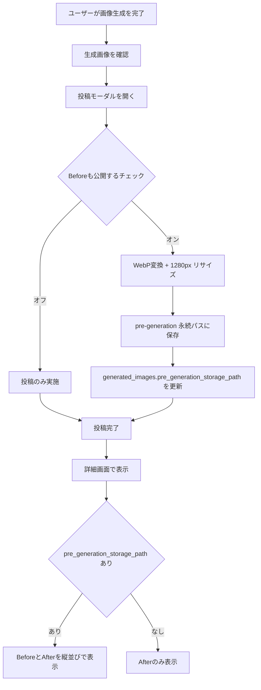
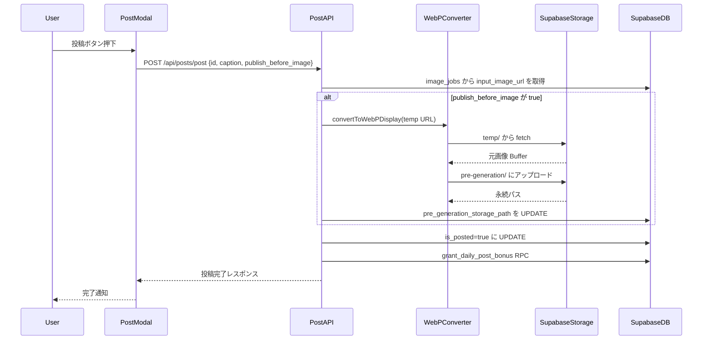
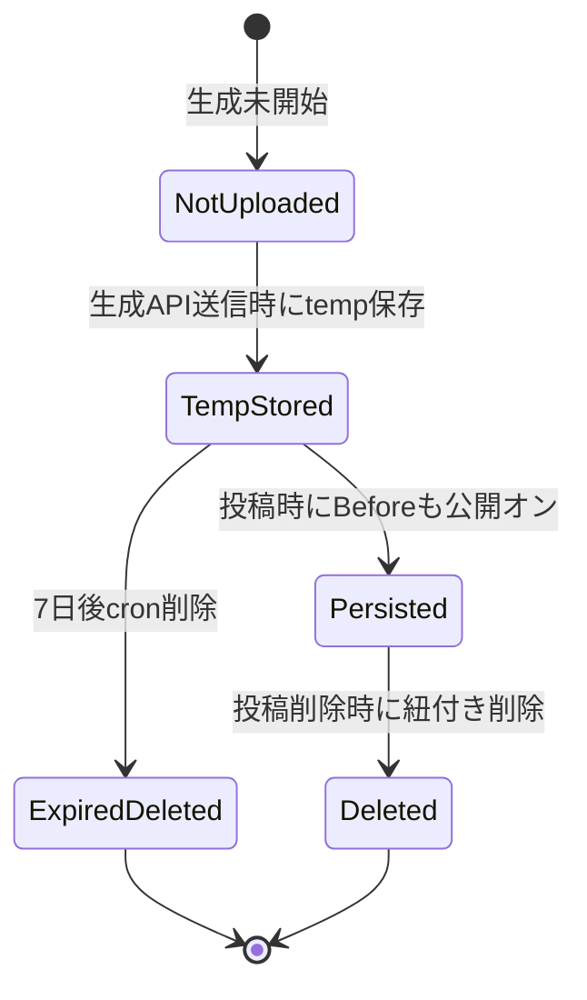
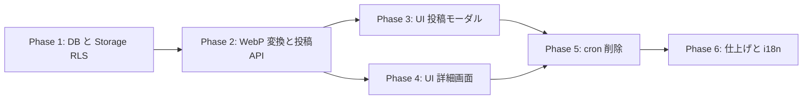

# Before/After 画像表示機能 実装計画

作成日: 2026-05-03
作成者: Claude Code (`/implementation-planning` スキル)

## このドキュメントの位置づけ

コーディネート画面で生成した画像を投稿した際に、投稿詳細画面で「Before（生成元のユーザーアップロード画像）」と「After（生成済み画像）」の両方を表示できるようにするための実装計画。

スコープ外（別タスク）:

- 既存 `temp/{user_id}/` 配下に累積した過去ファイルのクリーンアップ（追加実装の cron が回り始めた後に手動 or 一回限り batch で対応）
- 凝った Before/After 比較インタラクション（スライダー、オーバーレイ等）
- 既存ストック画像（PNG/JPEG）の WebP マイグレーション

---

## コードベース調査結果（Phase B）

計画作成にあたり、以下を確認済み。

### ストレージとテーブル

- **バケット**: 単一の Supabase Storage バケット `generated-images`（公開、10MB 上限、JPEG/PNG/WebP 許可）
  - 出典: `supabase/migrations/20250109000001_initial_setup.sql:70-77`
- **`generated_images` テーブル**: 生成画像のメタデータと「投稿状態」を 1 テーブルで管理。`is_posted=true` で投稿扱い。**`posts` テーブルは存在しない**
  - 出典: `supabase/migrations/20250109000001_initial_setup.sql:6-19`
- **WebP カラム**: `storage_path_thumb`（640px）、`storage_path_display`（長辺 1280px）が既存
  - 出典: `supabase/migrations/20250113120000_add_webp_storage_paths.sql:2-8`
- **`generated_images.input_images`（JSONB）**: 列は存在するが、書き込み実装は確認できず。今回は流用しない（用途未確定で変更耐性低）
  - 出典: `supabase/migrations/20250123140000_add_generation_types_and_stock_images.sql:17`
- **`image_jobs.input_image_url`**: 生成ジョブが参照する temp パスの URL を記録
  - 出典: `supabase/migrations/20260115054748_add_image_jobs_queue.sql`
- **`source_image_stocks`**: ストック画像。物理削除に変更済み。今回は読み取り参照のみ
  - 出典: `supabase/migrations/20251207195458_change_source_image_stocks_to_physical_delete.sql`

### 生成前画像の現状フロー

- フロント: `URL.createObjectURL()` でブラウザ Blob 化のみ（`features/generation/components/ImageUploader.tsx:106-122`）
- アップロード API: base64 を `temp/{user_id}/{ts}-{rand}.{ext}` に保存（`app/api/generate-async/handler.ts:187-200`）
- DB: `image_jobs.input_image_url` に temp の公開 URL を記録
- 削除機構: **存在しない**（grep で cleanup / cron 該当なし）

### WebP 変換パイプライン（再利用可能）

- `features/generation/lib/webp-converter.ts`
  - `convertToWebP(Buffer, options)` — Buffer 入力対応、リサイズ + 品質指定
  - `generateDisplayWebP(imageUrl)` — URL fetch → 長辺 1280px / q=85 WebP
- `features/generation/lib/webp-storage.ts`
  - `uploadWebPVariants(imageUrl, originalStoragePath, maxRetries=3)` — WebP 生成 → Storage upload（指数バックオフリトライ）
  - キャッシュタグの再検証パターン（`revalidateTag(post-detail-{id})` など）も実装済み

### 投稿詳細画面

- ルーティング: `app/posts/[id]/page.tsx`（Server Component）
- 主要コンポーネント:
  - `features/posts/components/CachedPostDetail.tsx:22-63` — `use cache` + `cacheLife("minutes")` + `cacheTag(post-detail-{id})`、admin client で取得して props 渡し
  - `features/posts/components/PostDetail.tsx:53,150-195` — クライアントコンポーネント、画像表示
- URL 解決: `features/posts/lib/utils.ts:67-79` の `getPostDisplayUrl(post)` が `storage_path_display` (WebP) → `storage_path` → `image_url` の優先度で解決

### 投稿フロー

- API: `POST /api/posts/post`、body は `{ id, caption }`（`app/api/posts/post/route.ts:96-120`）
- 投稿時に `is_posted=true` に更新 + `grant_daily_post_bonus` RPC 呼び出し
- UI: `features/posts/components/PostModal.tsx`（投稿モーダル、要確認）

### Storage RLS

- `storage.objects` の INSERT は `(storage.foldername(name))[1] = auth.uid()::text` で自フォルダ縛り
- SELECT は公開バケットなので全員可
- DELETE は自分のフォルダのみ
- 出典: `supabase/migrations/20250109000001_initial_setup.sql:84-106`

### Edge Function / Cron パターン

- `supabase/functions/image-gen-worker/index.ts` に `cronSecret` 検証 + Edge Function dispatch パターンあり
- pg_cron 利用例は他の migration で確認可能
- **既存 cleanup cron はゼロ** — 新規追加が必要

### i18n

- `messages/ja.ts` / `messages/en.ts`、フラットキー命名（例: `posts.anonymousUser`）

---

## 1. 概要図

### ユーザー操作フロー

### API シーケンス（投稿時）

### データモデル変更

```mermaid
erDiagram
    generated_images {
        uuid id PK
        uuid user_id FK
        text image_url
        text storage_path
        text storage_path_thumb
        text storage_path_display
        text pre_generation_storage_path "新規 NULL許容"
        boolean is_posted
        text caption
        timestamptz posted_at
        timestamptz created_at
    }
    image_jobs {
        uuid id PK
        uuid user_id FK
        text input_image_url "temp パス"
        uuid generated_image_id FK
        text status
    }
    generated_images ||--o| image_jobs : "via generated_image_id"
```

### 状態遷移（Before 画像のライフサイクル）

---

## 2. EARS（要件定義）

### 投稿時の Before 画像永続化

- **イベント駆動 (en)**: When a user submits a post with the "Publish before image" checkbox enabled, the system shall convert the source image to WebP at 1280px (long edge, quality 85) and persist it under `pre-generation/{user_id}/{generated_image_id}_display.webp` before completing the post.
- **Event driven (ja)**: ユーザーが「Beforeも公開する」チェックをオンにして投稿した場合、システムは生成元画像を WebP 1280px (品質 85) に変換し、`pre-generation/{user_id}/{generated_image_id}_display.webp` に保存してから投稿を完了する。

### Before 画像の表示

- **状態駆動 (en)**: While viewing a post detail page where the post's `pre_generation_storage_path` is set, the system shall display both Before and After images in a vertical layout.
- **State driven (ja)**: 投稿詳細ページで、投稿の `pre_generation_storage_path` が設定されている場合、システムは Before と After を縦並びで表示する。

### Before 画像なし時のフォールバック

- **状態駆動 (en)**: While `pre_generation_storage_path` is NULL, the system shall display only the After image without showing any placeholder or error related to Before.
- **State driven (ja)**: `pre_generation_storage_path` が NULL の場合、システムは After のみを表示し、Before に関するプレースホルダやエラーは出さない。

### WebP 変換失敗時のフォールバック

- **異常系 (en)**: If WebP conversion or upload fails during post creation, then the system shall complete the post successfully without persisting the Before image and log the error for monitoring.
- **異常系 (ja)**: 投稿時に WebP 変換またはアップロードに失敗した場合、システムは Before を永続化せずに投稿は成功扱いとし、エラーをログに残す。

### オプトアウト（チェックオフ）

- **オプション (en)**: Where the "Publish before image" checkbox remains off, the system shall not persist the source image; the temp file remains in `temp/` until cron cleanup.
- **オプション (ja)**: 「Beforeも公開する」チェックがオフのままなら、システムは生成元画像を永続化せず、temp ファイルは cron クリーンアップまで `temp/` に残る。

### temp 一時ファイルの自動削除

- **イベント駆動 (en)**: When the daily cleanup cron runs, the system shall delete all storage objects under `temp/` that are older than 7 days.
- **Event driven (ja)**: 1 日 1 回の cleanup cron が実行されたとき、システムは `temp/` 配下で 7 日経過したオブジェクトをすべて削除する。

### 認証・権限

- **状態駆動 (en)**: While a post is published (`is_posted=true`), the system shall make the `pre_generation_storage_path` image publicly readable via the public bucket.
- **State driven (ja)**: 投稿が公開状態 (`is_posted=true`) の場合、システムは `pre_generation_storage_path` の画像を公開バケット経由で誰でも閲覧可能とする。

- **異常系 (en)**: If a non-owner user attempts to set `pre_generation_storage_path` for someone else's post, then the system shall reject the request with 403 (RLS UPDATE policy enforces `auth.uid() = user_id`).
- **異常系 (ja)**: 他ユーザーの投稿の `pre_generation_storage_path` を更新しようとした場合、システムは 403 で拒否する（既存 RLS UPDATE ポリシーが `auth.uid() = user_id` で制御）。

---

## 3. ADR（設計判断記録）

### ADR-001: 新テーブルではなく `generated_images` への列追加

- **Context**: Before 画像の永続化先として、新テーブル `pre_generation_images` を作るか、既存 `generated_images` に列追加するかの選択。
- **Decision**: `generated_images` に `pre_generation_storage_path TEXT NULL` を 1 列追加する。
- **Reason**:
  - Phase A の Q2 で「Before は 1 枚のみ（メイン参照画像）」と確定済み → 1:1 で十分
  - 既存の `storage_path_thumb` / `storage_path_display` と同じ流儀（同一テーブル内のバリアント列）で一貫性が高い
  - JOIN コスト削減、`getPost` 取得時に追加クエリ不要
- **Consequence**: 将来「複数 Before（参照画像 N 枚）」要件が出たら別テーブル化の re-architecture が必要。`source_image_stock_id` 同様の単純 FK で済む可能性が高いので追従しやすい。

### ADR-002: Storage パス命名規約 `pre-generation/{user_id}/{generated_image_id}_display.webp`

- **Context**: 永続化された Before 画像の Storage パス命名。
- **Decision**: `pre-generation/{user_id}/{generated_image_id}_display.webp` 固定とする。
- **Reason**:
  - `temp/`、ルート直下（生成画像本体）、`{user_id}/stocks/`（ストック）、`pre-generation/`（今回）と「プレフィックスで用途分離」の既存パターンに沿う
  - `_display` サフィックスは既存 WebP 命名（`_thumb.webp`, `_display.webp`）と整合
  - `generated_image_id` を含めることで一意性を保証、削除も投稿削除時にパス導出可能
- **Consequence**: Storage の RLS は `(storage.foldername(name))[1] = auth.uid()::text` のままで動作（パスの第 1 階層が `pre-generation` ではなく `user_id` ではない点は要注意）。
  - **追加対応**: Storage RLS で `pre-generation` プレフィックスに対する INSERT 許可を追加するか、`{user_id}/pre-generation/{generated_image_id}_display.webp` の順に変更する。**後者を採用**（既存 RLS と整合性が高い）。
  - **最終形**: `{user_id}/pre-generation/{generated_image_id}_display.webp`

### ADR-003: 1 週間 TTL の cleanup を Supabase Edge Function + pg_cron で実装

- **Context**: temp/ 配下の自動削除機構が現状ゼロ。実装方式の選択。
- **Decision**: Supabase Edge Function `cleanup-temp-images` を新規作成し、`pg_cron` で 1 日 1 回（18:00 UTC = 03:00 JST）起動する。
- **Reason**:
  - 既存パターン `supabase/functions/image-gen-worker/index.ts` の cron secret 検証方式と整合
  - Storage 操作（list + delete）は Edge Function（Deno）から admin client で実行可能
  - Vercel Cron は対象アプリケーションにロードを掛けるため Supabase 側完結を選好
- **Consequence**: Edge Function のデプロイ手順・環境変数（`CRON_SECRET`）の管理が増える。`supabase/functions/_shared/` に共通化できれば保守性向上。

### ADR-004: 投稿 API での同期 WebP 変換（非同期化しない）

- **Context**: WebP 変換 + Storage アップロードを「投稿 API のレスポンス前に同期実行」するか、ジョブ化して非同期実行するか。
- **Decision**: **同期実行**。投稿 API のレスポンスを返す前に変換を完了させる。
- **Reason**:
  - 投稿成功 = Before 公開の保証になる（UX 上の予測可能性）
  - 1280px / q=85 の WebP 変換は数百ミリ秒オーダーで、Vercel Functions のタイムアウト許容内
  - 既存の生成完了 → WebP 化は「生成自体が長時間ジョブ」だから非同期化されているのであって、投稿は元々高速 API
- **Consequence**: 投稿 API レイテンシが Before 公開時に +500ms〜1s 程度増える。WebP 変換失敗時のフォールバック（投稿は成功、Before なし）を厳格に実装する必要あり。

### ADR-005: `input_images` JSONB 列の流用は見送る

- **Context**: 既存の `generated_images.input_images` JSONB 列を Before 画像パスの保存に使えるか。
- **Decision**: 流用しない。新列 `pre_generation_storage_path` を追加する。
- **Reason**:
  - `input_images` への書き込み実装が現状コードベースに見当たらず、用途が未確定
  - 将来 generation 系チームが別目的で使う可能性があり、衝突リスク
  - JSONB クエリよりも単純 TEXT 列のほうが index も貼りやすく、表示時の解決もシンプル
- **Consequence**: スキーマがやや冗長（同種カラムが複数）になるが、責務分離が明快。

### ADR-006: `publish_before_image` のデフォルトは OFF

- **Context**: 投稿モーダルのチェックボックスのデフォルト状態。
- **Decision**: デフォルト OFF（プライバシーセーフ寄り）。
- **Reason**:
  - 顔写り込み等の予期せぬ公開を避ける（Q4 でプライバシー関心事として確認済み）
  - オプトイン方式が GDPR / 個人情報配慮の観点で安全
- **Consequence**: Before 公開率が低めに留まる可能性あり。利用率が低ければ後日 UX を見直し（説明文強化、サンプル表示など）。

---

## 4. 実装計画（フェーズ別 TODO）

### フェーズ間の依存関係

### Phase 1: データベースマイグレーション + Storage RLS

**目的**: `generated_images.pre_generation_storage_path` を追加し、Storage の `pre-generation/` 階層への書き込みを許可する。
**ビルド確認**: `npm run typecheck` が通ること。マイグレーションが冪等に流れること。

- [ ] 既存の `supabase/migrations/20250109000001_initial_setup.sql` の RLS Storage ポリシーを確認し、`{user_id}/pre-generation/...` パスが既存ポリシーで許可されることを確認（第 1 階層が `user_id` なので OK のはず）
- [ ] `supabase/migrations/20260503100000_add_pre_generation_storage_path.sql` を新規作成
  - `ALTER TABLE generated_images ADD COLUMN pre_generation_storage_path TEXT NULL;`
  - コメント: `生成元画像 (Before) の WebP 永続パス。投稿時にユーザーが「Beforeも公開する」を選択した場合のみ設定される`
- [ ] 型定義の更新（`features/generation/lib/database.ts` の `GeneratedImageRecord` に `pre_generation_storage_path: string | null` を追加）— 既存の `webp-storage.ts:13-21` の `GeneratedImageWebPRecord` 型は変更不要（独立した select set）
- [ ] `npx supabase db reset` でローカル動作確認

### Phase 2: WebP 変換ヘルパー + 投稿 API 拡張

**目的**: 投稿 API が `publish_before_image=true` を受け取った時に Before 画像を永続化できるようにする。
**ビルド確認**: `npm run lint`, `npm run typecheck`, `npm run test`, `npm run build -- --webpack` がすべて通ること。

- [ ] `features/posts/lib/before-image-storage.ts` を新規作成（既存 `features/generation/lib/webp-storage.ts:73-151` の `uploadWebPVariants` を参考）
  - エクスポート関数 `persistBeforeImageFromTempUrl(tempImageUrl: string, userId: string, generatedImageId: string): Promise<string>` — 永続パスを返す
  - 内部実装: `generateDisplayWebP(tempImageUrl)`（既存 `features/generation/lib/webp-converter.ts:67-106` を再利用）→ `{user_id}/pre-generation/{generated_image_id}_display.webp` に upload（リトライ 3 回・指数バックオフ）
- [ ] `features/posts/lib/before-image-storage.ts` に `updatePreGenerationStoragePath(generatedImageId: string, path: string): Promise<void>` を追加（`updateWebPStoragePaths` を参考）
- [ ] `features/posts/lib/before-image-storage.ts` に `getInputImageUrlForGeneratedImage(generatedImageId: string): Promise<string | null>` を追加（`image_jobs` から `input_image_url` を取得、admin client 経由）
- [ ] `app/api/posts/post/route.ts` を修正
  - リクエスト body の Zod スキーマに `publish_before_image: z.boolean().optional().default(false)` を追加（既存スキーマ箇所を確認して合わせる）
  - 既存の `is_posted=true` 更新と `grant_daily_post_bonus` RPC の前に、`publish_before_image=true` なら以下を実行:
    1. `getInputImageUrlForGeneratedImage(id)` で temp URL を取得
    2. URL があれば `persistBeforeImageFromTempUrl(...)` を呼ぶ
    3. `updatePreGenerationStoragePath(...)` で DB 更新
    4. **失敗時**: try/catch でログのみ残して投稿処理は継続（ADR-004 のフォールバック）
    5. URL が取得できなければスキップ（ストック画像由来など、image_jobs に紐付かないケース）
  - `revalidateTag(post-detail-${id})` を最後に呼ぶ（既存パターンと整合）
- [ ] `app/api/posts/post/route.ts` 周辺の単体テスト追加（モックで Before 画像永続化の成功/失敗パスを検証）

### Phase 3: UI（投稿モーダルにチェックボックス追加）

**目的**: 投稿モーダルで「Beforeも公開する」を選択できるようにする。
**ビルド確認**: ローカルで投稿モーダルを開き、チェックボックスが表示・操作可能であること。

- [ ] `features/posts/components/PostModal.tsx`（または該当する投稿フォームコンポーネント）を修正
  - 既存 `caption` 入力欄の下にチェックボックス追加
  - ラベル: i18n キー `posts.publishBeforeImageLabel`、説明文 `posts.publishBeforeImageDescription`
  - デフォルト OFF
  - フォーム state に `publishBeforeImage: boolean` を追加し、submit 時に API へ送信
- [ ] チェックボックスの近くにヒント文を表示（「アップロードした参照画像が他のユーザーに公開されます」など）
- [ ] 投稿フローを実機（ブラウザ）で手動確認（ON/OFF の両方）

### Phase 4: UI（投稿詳細画面に Before 表示）

**目的**: `pre_generation_storage_path` がある投稿の詳細ページで Before/After を縦並び表示。
**ビルド確認**: 既存の投稿詳細ページが回帰せず、Before あり/なしの両方で正しく描画されること。

- [ ] `features/posts/lib/utils.ts` に `getPostBeforeImageUrl(post): string | null` を追加（既存 `getPostDisplayUrl` 同パターン、`pre_generation_storage_path` から公開 URL を構築）
- [ ] `features/posts/components/PostDetail.tsx` を修正
  - Before 画像 URL が取得できる場合のみ、After 画像の上または下に縦並びで表示
  - 各画像の上にラベル（「Before」「After」、i18n キー `posts.beforeImageLabel` / `posts.afterImageLabel`）を表示
  - alt 属性も i18n 化（`posts.beforeImageAlt` / `posts.afterImageAlt`）
  - 既存の `<Image>` コンポーネントとアスペクト比判定ロジック（`PostDetail.tsx:53,150-195`）に倣う
- [ ] `features/posts/components/CachedPostDetail.tsx` の `getPost` 呼び出しが `pre_generation_storage_path` を含む形で取得できるか確認（select 文の columns / 型に追加が必要なら修正）
- [ ] 既存ホーム画面のサムネイル（`PostCard` 系）は変更しない（Before は詳細画面のみ）

### Phase 5: 一時ファイル削除 cron

**目的**: `temp/` 配下のファイルを 7 日後に自動削除する。
**ビルド確認**: Supabase Edge Function がローカルで起動可能、cron secret なしの呼び出しが 401 で拒否されること。

- [ ] `supabase/functions/cleanup-temp-images/index.ts` を新規作成
  - 既存 `supabase/functions/image-gen-worker/index.ts` の cronSecret 検証パターンを踏襲
  - 処理: Storage `generated-images` バケットを `temp/` プレフィックスで list（再帰）し、`created_at` が 7 日より古いものをまとめて delete
  - バッチサイズ制限（一度に 1000 件まで等）でタイムアウト回避
  - 削除件数とエラー数を返す
- [ ] `supabase/functions/cleanup-temp-images/deno.json`（必要なら）を追加
- [ ] `supabase/migrations/20260503101000_schedule_cleanup_temp_images_cron.sql` を新規作成
  - `pg_cron` で 1 日 1 回（`0 18 * * *` UTC = 03:00 JST）`cleanup-temp-images` Edge Function を `pg_net` 経由で呼び出す
  - `CRON_SECRET` を Authorization ヘッダで送る
  - 既存 migration で pg_cron / pg_net の利用例があれば参照
- [ ] ローカルで `supabase functions serve cleanup-temp-images` 起動確認
- [ ] ステージング環境で 1 度手動トリガし、削除動作確認

### Phase 6: i18n + ドキュメント + 仕上げ

**目的**: 翻訳追加、ドキュメント整備、品質チェックリスト消化。
**ビルド確認**: 4 検証コマンドすべてパス、本番ビルドが webpack で完走すること。

- [ ] `messages/ja.ts` に翻訳追加
  - `posts.beforeImageLabel: "Before"`
  - `posts.afterImageLabel: "After"`
  - `posts.beforeImageAlt: "生成元画像"`
  - `posts.afterImageAlt: "生成済み画像"`
  - `posts.publishBeforeImageLabel: "Beforeも公開する"`
  - `posts.publishBeforeImageDescription: "アップロードした参照画像が他のユーザーに公開されます。顔写り込みなどに注意してください。"`
- [ ] `messages/en.ts` に対応する英語翻訳を追加
- [ ] `docs/architecture/data.ja.md` / `data.md` / `data.en.md` の更新（`pre_generation_storage_path` の追記）
- [ ] `docs/API.md` の `POST /api/posts/post` セクション更新（`publish_before_image` パラメータ追記）
- [ ] `npm run lint && npm run typecheck && npm run test && npm run build -- --webpack` すべて緑
- [ ] PR 作成（`/git-create-pr`）

---

## 5. 修正対象ファイル一覧

| ファイル | 操作 | 変更内容 |
|----------|------|----------|
| `supabase/migrations/20260503100000_add_pre_generation_storage_path.sql` | 新規 | `generated_images.pre_generation_storage_path TEXT NULL` 追加 |
| `supabase/migrations/20260503101000_schedule_cleanup_temp_images_cron.sql` | 新規 | pg_cron で日次 cleanup を schedule |
| `supabase/functions/cleanup-temp-images/index.ts` | 新規 | temp/ 7日 TTL クリーンアップ Edge Function |
| `features/generation/lib/database.ts` | 修正 | `GeneratedImageRecord` に `pre_generation_storage_path` 追加 |
| `features/posts/lib/before-image-storage.ts` | 新規 | Before 画像永続化ロジック (3 関数) |
| `features/posts/lib/utils.ts` | 修正 | `getPostBeforeImageUrl` 追加 |
| `features/posts/types.ts` | 修正 | `Post` 型に `pre_generation_storage_path` 追加、`PostImageRequest` に `publish_before_image` 追加 |
| `app/api/posts/post/route.ts` | 修正 | リクエスト body 拡張、Before 永続化呼び出し追加 |
| `features/posts/components/PostModal.tsx` | 修正 | チェックボックス追加、フォーム state 拡張 |
| `features/posts/components/PostDetail.tsx` | 修正 | Before/After 縦並び表示の追加 |
| `features/posts/components/CachedPostDetail.tsx` | 修正（要確認） | select する columns に `pre_generation_storage_path` を含める |
| `messages/ja.ts` | 修正 | 翻訳キー 6 件追加 |
| `messages/en.ts` | 修正 | 翻訳キー 6 件追加 |
| `docs/architecture/data.ja.md` | 修正 | スキーマ追記 |
| `docs/architecture/data.md` | 修正 | スキーマ追記 |
| `docs/architecture/data.en.md` | 修正 | スキーマ追記 |
| `docs/API.md` | 修正 | POST /api/posts/post の body 仕様更新 |
| `features/posts/lib/__tests__/before-image-storage.test.ts` | 新規 | Before 永続化の単体テスト |
| `app/api/posts/post/__tests__/route.test.ts` | 修正 / 新規 | publish_before_image パスのテスト追加 |

合計: **新規 7 ファイル / 修正 12 ファイル**（テストは合算）

---

## 6. 品質・テスト観点

### 品質チェックリスト

- [ ] **エラーハンドリング**: WebP 変換失敗時に投稿が成功扱いになるか（ADR-004）
- [ ] **エラーハンドリング**: image_jobs から temp URL が取れないケースで投稿が壊れないか
- [ ] **エラーハンドリング**: cron 実行で list 失敗・delete 失敗時のロギングと再試行戦略
- [ ] **権限制御**: 他ユーザーが他人の `pre_generation_storage_path` を更新できないこと（既存 RLS UPDATE policy で担保）
- [ ] **データ整合性**: `pre_generation_storage_path` が NULL でも詳細画面が壊れないこと
- [ ] **データ整合性**: 投稿削除時の `pre-generation/` ファイルの取り扱い（現状: 削除されない、別タスクで cron 化検討）
- [ ] **セキュリティ**: チェックボックス OFF のデフォルト挙動が確実に機能すること
- [ ] **セキュリティ**: cron secret なしで Edge Function を叩けないこと
- [ ] **パフォーマンス**: 投稿 API レイテンシが Before 公開時に +1s 以内に収まること
- [ ] **i18n**: en/ja 両方の翻訳キーが揃い、抜けがないこと

### テスト観点

| カテゴリ | テスト内容 |
|----------|-----------|
| 正常系 | Before 公開オンで投稿 → `pre_generation_storage_path` がセットされ、詳細画面で 2 枚表示される |
| 正常系 | Before 公開オフで投稿 → `pre_generation_storage_path` は NULL、詳細画面は After のみ |
| 正常系 | 過去投稿（pre_generation_storage_path NULL）→ 詳細画面が回帰せず After のみ表示 |
| 正常系 | cron 実行 → 7 日経過の temp ファイルが削除され、6 日以下は残る |
| 異常系 | WebP 変換失敗 → 投稿は 200 で成功、Before は表示されず、ログ出力 |
| 異常系 | image_jobs に input_image_url がない（ストック由来など）→ 投稿は成功、Before スキップ |
| 異常系 | cron secret なしの Edge Function 呼び出し → 401 |
| 権限テスト | 他ユーザーが publish_before_image オンで他人の投稿を更新しようとする → 403 |
| 権限テスト | 未認証ユーザーが詳細ページを開く → Before も公開バケットなので閲覧可能 |
| 実機確認 | スマホ実機で Before/After 縦並びが破綻しない（モバイル幅、Retina 解像度） |

### テスト実装手順

実装完了後、`/test-flow` スキルに沿ってテストを実施する:

1. `/test-flow before-image-storage` — 依存関係とスペックの状態を確認
2. `/spec-extract before-image-storage` — EARS スペックを抽出
3. `/spec-write before-image-storage` — スペックを対話的に精査
4. `/test-generate before-image-storage` — テストコード生成
5. `/test-reviewing before-image-storage` — テストレビュー
6. `/spec-verify before-image-storage` — カバレッジ確認

PostDetail / PostModal の UI 変更分は実機確認＋既存スナップショットテストで担保。

---

## 7. ロールバック方針

- **DB マイグレーション**: `pre_generation_storage_path` 列の追加のみ。`ALTER TABLE generated_images DROP COLUMN pre_generation_storage_path;` で安全に戻せる（NULL 許容、参照する API はフィーチャーフラグまたは Phase ごとに切り戻し可能）
- **Storage**: `{user_id}/pre-generation/...` パスは削除可能。Storage 内のファイルは Supabase ダッシュボードまたは admin SDK で一括削除可能
- **cron**: `pg_cron` の schedule を `cron.unschedule(...)` で停止可能。Edge Function は再デプロイで切り戻し
- **API**: `publish_before_image` を無視するように route handler を戻すだけ。デフォルト OFF なので互換性あり
- **UI**: PostModal のチェックボックスと PostDetail の Before 表示はコンポーネント単位で revert 可能。Phase ごとにコミットを分ける
- **段階的有効化**: 必要なら投稿 API 側に `if (env.ENABLE_BEFORE_IMAGE_PUBLISH === "true")` のガードを 1 行入れて、本番投入時のみリスクヘッジ可能（基本は不要）

---

## 8. 使用スキル

| スキル | 用途 | フェーズ |
|--------|------|----------|
| `/project-database-context` | DB 設計の参照 | Phase 1 |
| `/spec-extract` | EARS 仕様の抽出 | Phase 6（テスト） |
| `/spec-write` | 仕様の精査 | Phase 6（テスト） |
| `/test-flow` | テストワークフロー | Phase 6（テスト） |
| `/test-generate` | テストコード生成 | Phase 6（テスト） |
| `/test-reviewing` | テストレビュー | Phase 6（テスト） |
| `/spec-verify` | カバレッジ確認 | Phase 6（テスト） |
| `/git-create-branch` | ブランチ作成 | 実装開始時 |
| `/git-create-pr` | PR 作成 | 実装完了時 |
| `/codex-webpack-build` | サンドボックスでのビルド検証 | 各フェーズ末 |
| `/resolve-gemini-review` | PR レビュー対応 | PR 作成後 |

---

## 9. 整合性チェック（自己レビュー）

- **図とスキーマの整合性**: 状態遷移図の `Persisted` / `ExpiredDeleted` は `pre_generation_storage_path` の有無 + Storage 物理削除で表現。DB に明示的な status 列は不要（NULL/非NULL で十分） ✅
- **認証モデルの一貫性**: 投稿閲覧 RLS は `is_posted=true OR user_id=auth.uid()`。Before 画像も同じ可視性ルール（公開バケット + 投稿に紐付く）で一貫 ✅
- **データフェッチの整合性**: `CachedPostDetail` (Server) で props 渡しの既存パターンを踏襲。Before URL もサーバー側で構築 ✅
- **イベント網羅性**: チェックボックス OFF / WebP 失敗 / image_jobs に URL なし、すべてフォールバックパスを EARS 異常系/オプションで定義 ✅
- **API パラメータのソース安全性**: `user_id` はリクエスト body から受け取らず、`getUser()` でセッションから取得（既存パターン踏襲）。`generated_image_id` のみ body から受け取るが RLS UPDATE で他人の画像は更新不可 ✅
- **ビジネスルールの DB 層強制**: 「Before 永続化は本人のみ」は RLS UPDATE policy で担保（既存）。`publish_before_image` のフラグ自体は DB に保存しないのでアプリ層のみで OK（永続化結果が `pre_generation_storage_path` の有無に表現される） ✅

---

## 10. 前提と未確認事項

以下は計画作成時点で未確認のため、実装着手時に再確認が必要:

- `features/posts/components/PostModal.tsx` の実体（実在ファイル名・既存フォーム構造）— Phase 3 着手時に Read で確認
- `app/api/posts/post/route.ts` の Zod スキーマ実体 — Phase 2 着手時に Read で確認
- `image_jobs` と `generated_images` の FK 結線（`generated_image_id` カラムの有無と更新タイミング）— Phase 2 着手時に migration 精読
- `pg_cron` / `pg_net` の利用例が他 migration にあるか — Phase 5 着手時に grep
- ストック画像から生成した場合の temp 保存有無（実態として image_jobs.input_image_url が NULL になりうるか）— Phase 2 着手時に動作確認

これらが計画と異なっていた場合、Phase 内の TODO を微調整する。
