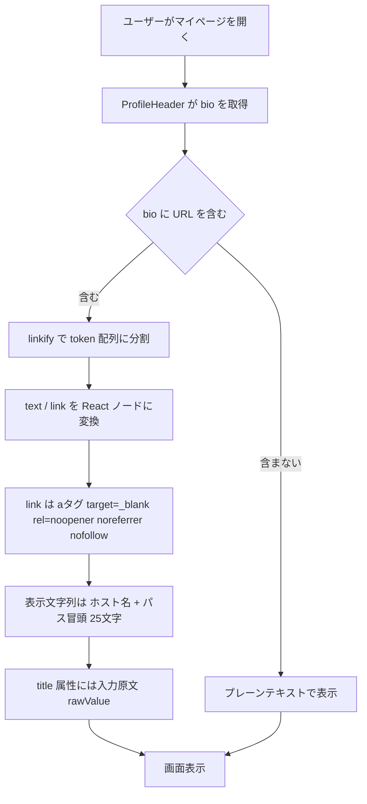
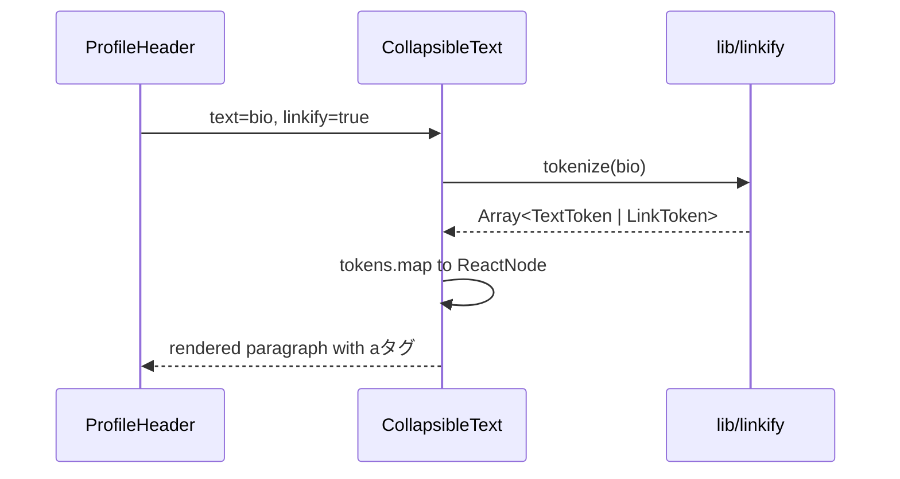
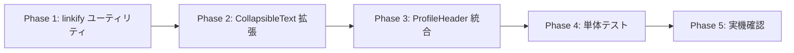

# 自己紹介 URL 自動リンク化機能 実装計画

作成日: 2026-04-19
更新日: 2026-04-19（Rev.1: rawValue 追加 / npm コマンドに修正 / 回帰テスト必須化 / linkify シャドーイング解消）

## コードベース調査結果

計画作成にあたり、以下を調査済み：

- **対象カラム**: `users.bio: string | null`、`MAX_BIO_LENGTH = 200`
  - 定義箇所: [features/my-page/components/ProfileEditModal.tsx:21](../../features/my-page/components/ProfileEditModal.tsx#L21) / [app/api/users/[userId]/profile/route.ts:11](../../app/api/users/%5BuserId%5D/profile/route.ts#L11)（既存の重複。本計画では修正対象外）
- **既存サニタイザ**: [lib/utils.ts:81-100](../../lib/utils.ts#L81) `sanitizeProfileText` は NFKC 正規化 + 不可視文字除去 + trim のみ。**URL 構成文字（`:` `/` `.`）は保持される**ため、保存された bio に URL が含まれる前提で表示層でのリンク化が成立する
- **既存バリデータ**: [lib/utils.ts:112-154](../../lib/utils.ts#L112) `validateProfileText` は `<` `>` を拒否。保存時点で HTML タグ相当の文字は混入しない
- **表示コンポーネント**: [features/my-page/components/ProfileHeader.tsx:141,177](../../features/my-page/components/ProfileHeader.tsx#L141)（自分/他ユーザー両方）が [features/posts/components/CollapsibleText.tsx](../../features/posts/components/CollapsibleText.tsx) に `{currentProfile.bio}` を渡している
- **CollapsibleText の既存利用箇所**: `PostDetail.tsx` / `PostDetailStatic.tsx` / `EditableComment.tsx` / `ProfileHeader.tsx`。後方互換を保つため既存シグネチャは壊さない
- **既存 linkify 系ユーティリティ**: `linkify|autoLink|urlify|makeLinks` で検索したが**存在しない**ため新規実装
- **類似のリンク安全性検証**: `features/banners/lib/validation.ts` の `isValidLinkUrl()` が `https://` + 内部パスのみ許可。bio では外部リンクが主眼のため同関数は流用せず、専用の軽量ガードを実装
- **テスト基盤**: Jest 29。`lib/utils.test.ts` のように utility は同階層 or `tests/unit/lib/` に配置
- **i18n**: `messages/ja.ts` / `messages/en.ts`（TypeScript）。`myPage.bioLabel` / `myPage.bioPlaceholder` が既存。本機能は表示テキストの追加が不要（`title` 属性は URL そのものを入れるため i18n 不要）
- **該当箇所の既存テスト**: `tests/**/CollapsibleText*`、`tests/**/ProfileHeader*` いずれも**未整備**

---

## 1. 概要図

### ユーザー操作フロー



### コンポーネントのデータフロー



---

## 2. EARS（要件定義）

### イベント駆動

- **EN**: When a user's profile page renders and the bio contains one or more `http://` or `https://` URLs, the system shall render each URL as a clickable anchor tag within the bio paragraph.
- **JA**: ユーザーのプロフィールページが描画される際、自己紹介に `http://` または `https://` の URL が含まれている場合、システムは自己紹介段落内で各 URL をクリック可能な `<a>` タグとして描画しなければならない。

- **EN**: When a linkified URL is rendered, the system shall apply `target="_blank"`, `rel="noopener noreferrer nofollow"`, and a `title` attribute containing the original URL string as written by the user (with only trailing punctuation stripped; no case-folding, percent-encoding, or trailing-slash normalization applied).
- **JA**: リンク化された URL を描画する際、システムは `target="_blank"`、`rel="noopener noreferrer nofollow"`、およびユーザーが入力したとおりの元 URL 文字列を含む `title` 属性を付与しなければならない（末尾句読点のみ剥離、大小文字変換・percent-encoding・末尾スラッシュの正規化は行わない）。

- **EN**: The `href` attribute of the anchor may contain the normalized URL produced by the `URL` constructor, because browsers require a resolvable URL and normalization there is intentional.
- **JA**: `<a>` の `href` 属性は `URL` コンストラクタで正規化された URL で構わない（ブラウザが解決可能な URL を要求するため、`href` 側の正規化は許容する）。

- **EN**: When the display text for a linkified URL is generated, the system shall strip the scheme and leading `www.`, then truncate the `host + path + query + hash` portion to at most 25 characters, appending `…` when truncation occurs.
- **JA**: リンク化された URL の表示文字列を生成する際、システムはスキームと先頭の `www.` を取り除き、`host + path + query + hash` 部分を最大 25 文字で切り詰め、切り詰めた場合は `…` を付与しなければならない。

### 状態駆動

- **EN**: While a bio contains no URL, the system shall render it as plain text unchanged.
- **JA**: 自己紹介が URL を含まない間、システムはそれを変更せずプレーンテキストとして描画しなければならない。

### 異常系

- **EN**: If a candidate URL fails `URL` constructor parsing or uses a scheme other than `http`/`https`, then the system shall render it as plain text and not produce an anchor tag.
- **JA**: URL 候補が `URL` コンストラクタでパースに失敗した場合、または `http`/`https` 以外のスキームを使用している場合、システムはそれをプレーンテキストとして描画し `<a>` タグを生成してはならない。

- **EN**: If a URL is immediately followed by a sentence-ending punctuation character (`.` `,` `!` `?` `;` `:` `)` `]` `}` `」` `』` `、` `。`), then the system shall exclude that trailing punctuation from the linkified portion.
- **JA**: URL の直後に文末の句読点（`.` `,` `!` `?` `;` `:` `)` `]` `}` `」` `』` `、` `。`）が続く場合、システムはその末尾の句読点をリンク化部分から除外しなければならない。

### オプション

- **EN**: Where the `CollapsibleText` component receives `linkify={true}`, the system shall apply URL linkification; otherwise the component shall preserve its existing plain-text behavior.
- **JA**: `CollapsibleText` コンポーネントが `linkify={true}` を受け取る場合、システムは URL リンク化を適用しなければならない。それ以外の場合、コンポーネントは既存のプレーンテキスト挙動を維持しなければならない。

---

## 3. ADR（設計判断記録）

### ADR-001: 表示時リンク化方式（保存データは変更しない）

- **Context**: bio カラムは既存で多数のユーザーが利用中。保存形式に Markdown や HTML を導入するとマイグレーションと編集 UI の両方に波及する。
- **Decision**: `users.bio` の保存形式は**プレーンテキストのまま**とし、表示時に正規表現で URL を検出して `<a>` にレンダリングする。
- **Reason**: DB マイグレーション不要・既存データへの遡及適用が自動・編集 UI は変更ゼロ。編集時プレビュー等が不要な今回のスコープでは表示層のみで完結する。
- **Consequence**: 投稿本文側で将来 Markdown を導入したくなった場合、同じ方針を再利用するか、bio だけ別方針にするかを別途判断する必要がある。

### ADR-002: dangerouslySetInnerHTML を使わず token 配列で返す

- **Context**: URL をリンク化する実装として `text.replace(regex, '<a>...</a>')` + `dangerouslySetInnerHTML` も考えられるが、XSS 事故が起こりやすい。
- **Decision**: `linkify(text): Array<TextToken | LinkToken>` を返す純粋関数として実装し、React 側で `tokens.map` で `<a>` と文字列を混在させる。
- **Reason**: React の自動エスケープに全任せできる。単体テストもしやすい。
- **Consequence**: `CollapsibleText` に `linkify?: boolean` プロップを追加する必要があるが、既存呼び出しは default false のため影響なし。

### ADR-005: `href` は正規化版 / `title` は入力原文（末尾句読点のみ剥離）

- **Context**: `new URL(raw).href` は大小文字や末尾スラッシュ、percent-encoding を正規化してしまう。ホバー時に表示する `title` は「ユーザーが意図した元 URL」を見せたいが、`href` はブラウザが確実に遷移できる正規化版である必要がある。
- **Decision**: `LinkToken` に `href` と `rawValue` の両方を持たせ、`href` には `URL` コンストラクタ出力、`rawValue` には「末尾句読点のみ剥離した入力そのもの」を格納する。`<a href={token.href} title={token.rawValue}>` の形で描画する。
- **Reason**: 要件「元のフル URL を title に」を厳密に満たす。`href` は正規化されていてもユーザーに見えない属性なので UX を損なわない。
- **Consequence**: トークン型が1フィールド増える（`rawValue: string`）。単体テストでも `rawValue` を検証する必要がある。

### ADR-003: URL 表示の切詰め方式（方式②）

- **Context**: 表示領域が狭い（bio カード内）ため、URL をそのまま出すと折返しでレイアウトが崩れる。
- **Decision**: `scheme` と `www.` を除去し、`host + path + query + hash` を 25 文字で切り詰め、超過時は末尾 `…` を付加する。フル URL は `title` 属性で保持。
- **Reason**: X / Instagram / TikTok など主要 SNS の多数派挙動に一致。ユーザーが飛び先ドメインを認識でき、かつコンパクト。
- **Consequence**: 表示文字数が固定値のため、将来デザイン都合で変更する場合は `linkify` の定数 `MAX_DISPLAY_LENGTH` を差し替えるだけで済む。

### ADR-004: 末尾の句読点をリンクから除外

- **Context**: `「https://example.com。」` のような日本語文脈で URL が書かれるケースがある。句読点までリンクに含めると、クリック時に 404 を引き起こす。
- **Decision**: `. , ! ? ; : ) ] } 」 』 、 。` を末尾から剥がしてテキストに戻す。
- **Reason**: 日本語ユーザーの自然な書き方を壊さず、誤リンクを防ぐ。
- **Consequence**: 対応する記号の網羅は漸進的に拡張する（必要なら後日追加）。

---

## 4. 実装計画（フェーズ＋TODO）

### フェーズ間の依存関係



### Phase 1: `linkify` ユーティリティ実装

**目的**: 文字列を `TextToken | LinkToken` の配列に変換する純粋関数を作る。UI 依存なし。
**ビルド確認**: 型エラーなし。`npx tsc --noEmit` が通る。

- [ ] `lib/linkify.ts` を新規作成
  - export type `LinkifyToken = { type: "text"; value: string } | { type: "link"; href: string; rawValue: string; displayValue: string }`
    - `href`: `URL` コンストラクタで正規化された URL（ブラウザ遷移用）
    - `rawValue`: ユーザー入力そのままの元文字列（末尾句読点のみ剥離）。`title` 属性に使う
    - `displayValue`: 25 文字に切り詰めた表示用文字列
  - export function `linkify(text: string): LinkifyToken[]`
  - 参考: 既存 utility の配置と export スタイルは [lib/utils.ts](../../lib/utils.ts) に合わせる
- [ ] URL 検出正規表現: `/https?:\/\/[^\s<>"'`]+/gi`
- [ ] 末尾句読点の剥離処理: `. , ! ? ; : ) ] } 」 』 、 。`
- [ ] `URL` コンストラクタでパース失敗したトークンは `text` 扱いに戻す
- [ ] スキームが `http` / `https` 以外は `text` 扱い
- [ ] 表示文字列生成ヘルパ（内部関数 `formatDisplayUrl`）:
  - `https?://` を除去
  - 先頭 `www.` を除去
  - `host + pathname + search + hash` を連結
  - 25 文字超過時は `slice(0, 24) + "…"`
- [ ] 定数: `const MAX_DISPLAY_LENGTH = 25;`

### Phase 2: `CollapsibleText` に `linkify` プロップを追加

**目的**: 既存呼び出しを壊さず、オプトインで URL 自動リンク化を有効にできる状態にする。
**ビルド確認**: 既存の `PostDetail` 等のビルドが通る（linkify なしで動作）。

- [ ] [features/posts/components/CollapsibleText.tsx](../../features/posts/components/CollapsibleText.tsx) の `CollapsibleTextProps` に `linkify?: boolean` を追加（default `false`）
- [ ] **import 時にユーティリティ関数を alias する**（prop 名とのシャドーイング回避）:
  - `import { linkify as linkifyText } from "@/lib/linkify";`
- [ ] `{text}` の描画部分を、`linkify` prop が `true` のときに以下へ置換:
  - `linkifyText(text).map((token, i) => token.type === "link" ? <a key={i} href={token.href} target="_blank" rel="noopener noreferrer nofollow" title={token.rawValue} className="text-blue-600 hover:underline break-all">{token.displayValue}</a> : <span key={i}>{token.value}</span>)`
  - **`title` には `token.rawValue` を使う（`token.href` ではない）** — ADR-005 に従う
- [ ] `useEffect` 内の高さ測定ロジックは既存のまま（`textRef.current.scrollHeight` は子要素込みで計測されるため問題なし）
- [ ] `break-words` は既存の `className` を維持、`<a>` には `break-all` を追加して長いリンクで段落からはみ出さないようにする

### Phase 3: `ProfileHeader` からの呼び出し更新

**目的**: マイページの bio 表示でリンク化を有効化する。
**ビルド確認**: `app/(app)` 以下のビルドが通る。

- [ ] [features/my-page/components/ProfileHeader.tsx:144](../../features/my-page/components/ProfileHeader.tsx#L144) の `<CollapsibleText text={currentProfile.bio} maxLines={3} textClassName="..." />` に `linkify` を追加
- [ ] [features/my-page/components/ProfileHeader.tsx:180](../../features/my-page/components/ProfileHeader.tsx#L180) も同様に更新
- [ ] 投稿本文側（`PostDetail.tsx`, `PostDetailStatic.tsx`, `EditableComment.tsx`）は**今回スコープ外のため変更しない**

### Phase 4: 単体テスト

**目的**: `linkify` の正常系・異常系・境界値を網羅し、将来の regression を防ぐ。**共有コンポーネント改修のため、`linkify` 未指定時の既存挙動を必ず回帰確認する。**
**ビルド確認**: `npm test -- tests/unit/lib/linkify.test.ts tests/unit/features/posts/collapsible-text.test.tsx` がグリーン。

- [ ] `tests/unit/lib/linkify.test.ts` を新規作成（既存 [tests/unit/lib/url-utils.test.ts](../../tests/unit/lib/url-utils.test.ts) の配置と書式を踏襲）
- [ ] 正常系:
  - 単一 URL のみ → `[{type:"link", href, rawValue, displayValue}]`
  - テキスト + URL + テキスト の混在
  - 複数 URL の混在
  - `https` / `http` 両方
  - `www.` 除去（`https://www.example.com/path` → `displayValue: "example.com/path"`）
  - 25 文字切詰め（境界: 24, 25, 26 文字）
  - **`rawValue` は入力原文を保持**: 大文字混じり `https://Example.com` → `rawValue: "https://Example.com"` / `href: "https://example.com/"`（正規化）
- [ ] 異常系:
  - URL なし → 1 個の text トークン
  - `ftp://...` / `javascript:alert(1)` → text として扱う
  - パース不能な文字列 → text として扱う
  - 末尾句読点の剥離: `https://example.com.` / `https://example.com。` / `(https://example.com)` / `https://example.com、`
  - **剥離された句読点は別の text トークンとして残す**（例: `["https://example.com", "。"]` の結合で元文字列に復元可能）
- [ ] **必須**: `tests/unit/features/posts/collapsible-text.test.tsx` を新規作成し、以下 2 ケースを検証:
  1. `<CollapsibleText text="see https://example.com" linkify maxLines={3} />` で `<a href="https://example.com/" title="https://example.com" rel="noopener noreferrer nofollow" target="_blank">` が描画される
  2. **回帰確認**: `<CollapsibleText text="see https://example.com" maxLines={3} />`（`linkify` 未指定）で `<a>` が描画されず、プレーンテキストとして描画される
- [ ] 上記 2 ケースで既存呼び出し箇所（`PostDetail.tsx` / `PostDetailStatic.tsx` / `EditableComment.tsx`）の挙動不変が担保される。個別画面の E2E 回帰は Phase 5 の実機確認でカバーする

### Phase 5: 実機確認

**目的**: 本番相当のデータで UI を目視確認する。既存の投稿本文・コメント表示が壊れていないことも合わせて確認する。
**ビルド確認**: `npm run build` が通る。

**新機能の確認:**
- [ ] 自分のマイページで bio に URL を含む文字列を保存し、リンク化されることを確認
- [ ] 他ユーザーのプロフィールページでも同様にリンク化されることを確認
- [ ] 長い URL（100 文字超）で折返しが崩れないこと
- [ ] 日本語混在の bio（例: `ポートフォリオはこちら https://example.com/portfolio。よろしく！`）で句読点がリンクに含まれないこと
- [ ] 大文字混じり URL（例: `https://Example.com`）で、クリック先は小文字化された URL、`title` ホバーは原文のまま表示されること
- [ ] クリックで別タブが開き、正しい URL へ飛ぶこと
- [ ] モバイル（iOS Safari / Android Chrome）で折返しと長押しプレビューの挙動を確認

**回帰確認（CollapsibleText 変更の影響範囲）:**
- [ ] 投稿詳細ページ（`PostDetail` / `PostDetailStatic`）の本文に URL を含めても、従来どおりプレーンテキストで表示される（リンク化されない）
- [ ] コメント（`EditableComment`）に URL を含めても、従来どおりプレーンテキストで表示される（リンク化されない）

---

## 5. 修正対象ファイル一覧

| ファイル | 操作 | 変更内容 |
|----------|------|----------|
| [lib/linkify.ts](../../lib/linkify.ts) | 新規 | URL 検出・切詰めのユーティリティ |
| [features/posts/components/CollapsibleText.tsx](../../features/posts/components/CollapsibleText.tsx) | 修正 | `linkify?: boolean` プロップ追加と描画分岐 |
| [features/my-page/components/ProfileHeader.tsx](../../features/my-page/components/ProfileHeader.tsx) | 修正 | 2 箇所の `CollapsibleText` 呼び出しに `linkify` を追加 |
| `tests/unit/lib/linkify.test.ts` | 新規 | `linkify` の単体テスト |
| `tests/unit/features/posts/collapsible-text.test.tsx` | 新規（**必須**） | `linkify` オプトイン時の描画検証 + `linkify` 未指定時の回帰確認 |

DB マイグレーション / API / i18n / サニタイザ の変更は**なし**。

---

## 6. 品質・テスト観点

### 品質チェックリスト

- [ ] **エラーハンドリング**: 不正 URL はリンク化せずテキストとして残す（`linkify` 内で握りつぶし、例外を外に出さない）
- [ ] **権限制御**: 表示層の変更のみで、権限・認証の影響なし
- [ ] **データ整合性**: DB 無変更、既存サニタイザ・バリデータとの互換性維持（`<` `>` は保存時点で弾かれるため XSS 経路なし）
- [ ] **セキュリティ**: `dangerouslySetInnerHTML` 不使用 / `rel="noopener noreferrer nofollow"` / `http(s)` 限定 / 末尾句読点剥離
- [ ] **i18n**: 追加テキストなし（`title` は URL 自体、hover 表記のローカライズ不要）

### テスト観点

| カテゴリ | テスト内容 |
|----------|-----------|
| 正常系 | 単一/複数 URL、`www.` 除去、25 文字切詰め、`https`/`http` 両対応 |
| 異常系 | URL なし、非対応スキーム、パース不能文字列、末尾句読点（半角/全角） |
| 権限テスト | 該当なし（表示層の純粋関数のみ） |
| 実機確認 | マイページ（自分/他人）、長 URL 折返し、日本語混在、別タブ遷移、モバイル挙動 |

### テスト実装手順

実装完了後、`/test-flow` スキルに沿って以下を実施:

1. `/test-flow linkify` — 依存関係とスペックの状態を確認
2. `/spec-extract linkify` — EARS スペックを抽出
3. `/spec-write linkify` — スペックを対話的に精査
4. `/test-generate linkify` — テストコード生成
5. `/test-reviewing linkify` — テストレビュー
6. `/spec-verify linkify` — カバレッジ確認

---

## 7. ロールバック方針

- **DB マイグレーション**: なし
- **機能フラグ**: 最悪の場合、[features/my-page/components/ProfileHeader.tsx](../../features/my-page/components/ProfileHeader.tsx) の `linkify` プロップを外すだけで即座に旧挙動（プレーンテキスト表示）へ戻せる
- **Git**: Phase 単位でコミット。各フェーズ単位で `revert` 可能
  - Phase 1 (utility) → Phase 2 (CollapsibleText) → Phase 3 (ProfileHeader) → Phase 4 (tests) の順
- **外部サービス**: なし

---

## 8. 使用スキル

| スキル | 用途 | フェーズ |
|--------|------|----------|
| `/git-create-branch` | ブランチ作成（※本件は既に `feature/mypage-sns-links` で作業中） | 実装開始時 |
| `/spec-extract` | EARS 仕様の抽出 | テスト |
| `/spec-write` | 仕様の精査 | テスト |
| `/test-flow` | テストワークフロー | テスト |
| `/test-generate` | テストコード生成 | テスト |
| `/test-reviewing` | テストレビュー | テスト |
| `/spec-verify` | カバレッジ確認 | テスト |
| `/git-create-pr` | PR 作成 | 実装完了時 |

---

## 備考: 実装サンプル（参考）

### `lib/linkify.ts`

```ts
export type LinkifyToken =
  | { type: "text"; value: string }
  | {
      type: "link";
      href: string;       // URL コンストラクタで正規化（ブラウザ遷移用）
      rawValue: string;   // 入力原文（末尾句読点のみ剥離）。title 属性に使う
      displayValue: string; // 25 文字切詰め済みの表示用文字列
    };

const URL_REGEX = /https?:\/\/[^\s<>"'`]+/gi;
const TRAILING_PUNCTUATION = /[.,!?;:)\]}」』、。]+$/;
const MAX_DISPLAY_LENGTH = 25;

export function linkify(text: string): LinkifyToken[] {
  if (!text) return [];
  const tokens: LinkifyToken[] = [];
  let lastIndex = 0;

  for (const match of text.matchAll(URL_REGEX)) {
    const start = match.index ?? 0;
    let raw = match[0];

    // 末尾句読点を剥がす
    const trailingMatch = raw.match(TRAILING_PUNCTUATION);
    const trailing = trailingMatch?.[0] ?? "";
    if (trailing) raw = raw.slice(0, raw.length - trailing.length);

    if (start > lastIndex) {
      tokens.push({ type: "text", value: text.slice(lastIndex, start) });
    }

    const parsed = safeParseHttpUrl(raw);
    if (parsed) {
      tokens.push({
        type: "link",
        href: parsed.href,
        rawValue: raw, // 正規化前の入力そのまま
        displayValue: formatDisplayUrl(parsed),
      });
    } else {
      tokens.push({ type: "text", value: raw });
    }

    if (trailing) tokens.push({ type: "text", value: trailing });
    lastIndex = start + match[0].length;
  }

  if (lastIndex < text.length) {
    tokens.push({ type: "text", value: text.slice(lastIndex) });
  }
  return tokens;
}

function safeParseHttpUrl(raw: string): URL | null {
  try {
    const url = new URL(raw);
    return url.protocol === "http:" || url.protocol === "https:" ? url : null;
  } catch {
    return null;
  }
}

function formatDisplayUrl(url: URL): string {
  const host = url.host.replace(/^www\./, "");
  const tail = url.pathname + url.search + url.hash;
  const combined = host + (tail === "/" ? "" : tail);
  return combined.length > MAX_DISPLAY_LENGTH
    ? combined.slice(0, MAX_DISPLAY_LENGTH - 1) + "…"
    : combined;
}
```

### `CollapsibleText.tsx` 差分（抜粋）

```tsx
// prop 名 `linkify` とユーティリティ関数 `linkify` のシャドーイング回避のため alias import
import { linkify as linkifyText } from "@/lib/linkify";

interface CollapsibleTextProps {
  text: string;
  maxLines: number;
  className?: string;
  textClassName?: string;
  linkify?: boolean; // 追加
}

// 描画部分
{linkify
  ? linkifyText(text).map((t, i) =>
      t.type === "link" ? (
        <a
          key={i}
          href={t.href}
          target="_blank"
          rel="noopener noreferrer nofollow"
          title={t.rawValue}  // 入力原文（大小文字・末尾スラッシュなどが保持される）
          className="text-blue-600 hover:underline break-all"
        >
          {t.displayValue}
        </a>
      ) : (
        <span key={i}>{t.value}</span>
      )
    )
  : text}
```
