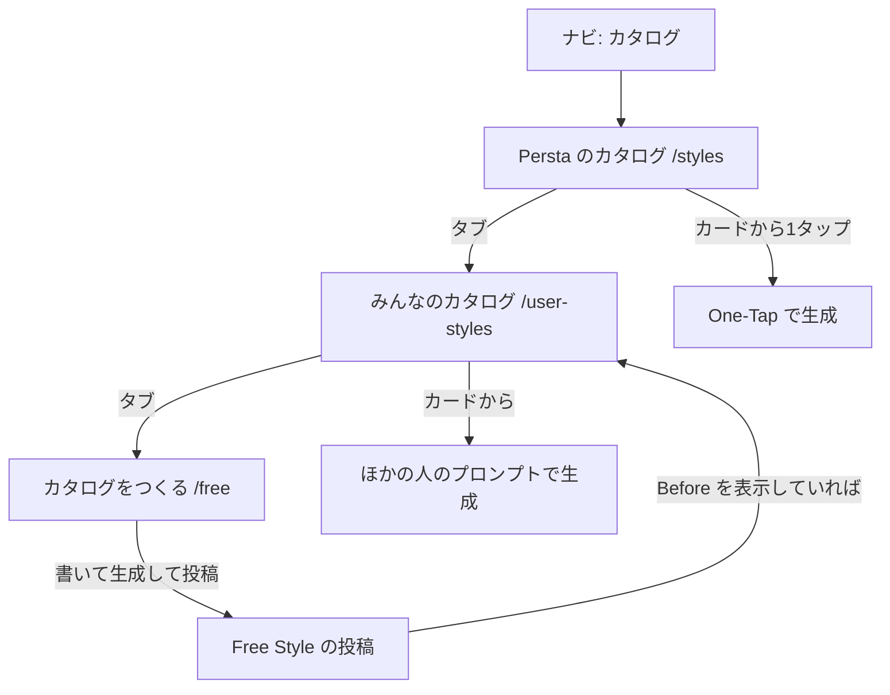
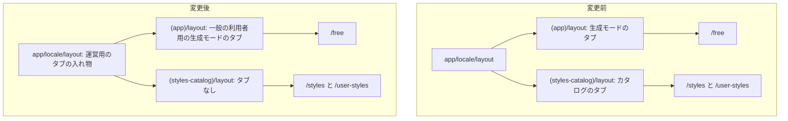
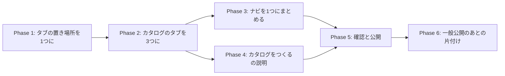

# カタログを3つのタブにする（Persta のカタログ / みんなのカタログ / カタログをつくる）実装計画

作成: 2026-09-29（main `202a456` で調査）

## 背景

カタログ刷新（段階公開中。いまは運営だけに出ている）のナビには「カタログ」と「つくる」が並んでいる。
どちらも生成の入口だが、役割が分かれて見えている。

- **「つくる」** を押すと、毎回 Free Style（白紙のプロンプト入力）が開く（`lib/nav-entries.ts:46-51`）。
  初めて来た人が「生成してみたい」と思って押すと、ペルスタらしい「スタイルを選んで1タップ」ではなく、
  いちばん難しい入口に着いてしまう
- 一方で、Free Style で作って投稿したものは、そのまま **User ORIGINAL（みんなのカタログ）に並ぶ**。
  「つくること」が「カタログを増やすこと」になっていて、ここはペルスタらしい

そこで、Free Style を「カタログをつくる」としてカタログのタブにまとめ、ナビの入口を「カタログ」1つにする。

### 使われ方（2026-09-28 時点・内部アカウントを除く）

| 項目 | 数 |
|---|---|
| 直近60日に初めて生成した人（34人）の最初の生成 | One-Tap が24人（71%） |
| 直近30日の生成：スタイルを選んでつくる | 716回（One-Tap 477回、ほかの人のプロンプト 239回） |
| 直近30日の生成：自分で書く Free Style | 380回（15人） |
| 直近30日の Free Style の投稿 | 236件（14人） |
| そのうち User ORIGINAL に並んだもの | 155件（13人）。うち140件はプロンプト非公開のまま |

User ORIGINAL に並ぶ条件は「Free Style の元の投稿・公開中・削除や停止なし・Before 画像を表示」で、
プロンプトの公開・非公開は関係ない（`supabase/migrations/20260918100000_add_user_style_page_rpc.sql:188-195`）。

## 決定事項（2026-09-29 にユーザーと合意）

| 項目 | 決定 |
|---|---|
| タブ | 3つ。左から **Persta のカタログ**（`/styles`）・**みんなのカタログ**（`/user-styles`）・**カタログをつくる**（`/free`）。名前は 2026-09-29 にユーザーが決定（ADR-008） |
| タブの中の名前（英語） | Persta のカタログ = `Persta ORIGINAL`、みんなのカタログ = `User ORIGINAL`、カタログをつくる = `CREATE`。日本語の名前はページの見出し（h1）に出す（2026-09-29 変更。ADR-002・ADR-003） |
| 英語の言葉 | 今の「Persta.AI ORIGINAL」「User ORIGINAL」を変えない（`User’s` にしない。ADR-003） |
| タブの幅 | 今の生成モードのタブと同じく、**選んでいるタブだけ名前を出し、ほかはアイコンだけ**（3つ並べると切れるため） |
| ナビ | 「カタログ」1つにまとめ、「つくる」を外す（スマホの下のナビは6つ→5つ） |
| 最初に開くタブ | Persta のカタログ（ナビの「カタログ」→ `/styles`） |
| カタログをつくるの説明 | 「投稿すると、みんなのカタログに並びます。プロンプトは見せずに使ってもらえ、使われるとペルコインが還元されます」を伝える |
| 公開の仕方 | 今のカタログ刷新と同じ段階公開に乗せる（公開前は運営だけ） |

## コードベース調査結果

### ナビ

- 生成の入口とカタログの扱いは `lib/nav-entries.ts` に集めてある
  - `CATALOG_ENTRY_PATH = "/styles"`（`:37`）
  - `resolveGenerationEntryPath`（`:46-51`）: ツアー中は `/style`、刷新後は毎回 `/free`、刷新前は前回の生成モード
  - `isNavItemActive`（`:61-`）: 刷新後は「つくる」を `/style`・`/free` で、「カタログ」を `/styles`・`/user-styles`・`/styles/[slug]` で選択中にする
- スマホの下のナビ: `components/NavigationBar.tsx:215-226`（刷新後は ホーム / カタログ / つくる / チャレンジ / 通知 / マイページ の6つ）
  - 押したときの行き先: `handleNavigation`（`:141`、生成の入口は `:149` で `resolveGenerationEntryPath`）
  - ツアー用の目印: 生成の入口に `data-tour="coordinate-nav-mobile"`（`:248`）
- PC のサイドバー: `components/AppSidebar.tsx:204-208`（同じ並び）、目印 `data-tour="coordinate-nav-desktop"`（`:264`）

### タブ

- カタログのタブ: `features/style-presets/components/OriginalKindTabs.tsx`
  - 2つ（`/styles`・`/user-styles`、`:40-41`）、**2列の等幅**でピルを translateX で動かす
  - タブの上に、カタログ全体の見出し `catalogTitle` を **h1** で出す（`:89`）。各ページの見出しは出さない
  - 公開前の `/styles` では、運営とわかるまでタブを出さない
- 生成モードのタブ: `components/GenerationModeTabs.tsx`（`/style`・`/free`、`:28`）
  - **可変幅**（選択中はアイコン＋名前、ほかはアイコンだけ）。選択中のタブの位置と幅を測ってピルを動かす

### 画面の枠（layout）

- タブは「枠」に置いてあり、同じ枠の中の移動ならタブが作り直されずにピルが滑る。
  ページの中に置くと一度消えて出直し、「UX として最悪」と言われた（`OriginalKindTabs.tsx:13-23` のコメント）
- カタログのタブは `app/(styles-catalog)/layout.tsx`、生成モードのタブは `app/(app)/layout.tsx` に置いてある
- `/style`・`/free`・`/styles`・`/user-styles` はロケール付きの公開ページで、ロケール無しで開くと
  proxy が `/{locale}/…` へ転送する（`i18n/config.ts:59-66`）。実際に描かれるのは `app/[locale]/` の下で、
  そこの layout とページは上の2つを re-export している
  （`app/[locale]/(styles-catalog)/layout.tsx`、`app/[locale]/(app)/layout.tsx`、`app/[locale]/(app)/free/page.tsx`）
- **3つの画面（`/styles`・`/user-styles`・`/free`）に共通の親の枠は `app/[locale]/layout.tsx`** だけ。
  `/free` は `(app)`、ほかの2つは `(styles-catalog)` と、枠が分かれている

### 段階公開

- `useStylesCatalogRevamp()`（`features/style-presets/hooks/useStylesCatalogRevamp.ts:19-21`）＝ `useUserStylesAvailable()`
- 初期値は公開フラグ（`UserStylesAvailabilityProvider.tsx:51`）。運営は、画面が出たあとで true に上がる（`:67` の `UserStylesAvailabilityUpgrade`）。
  `NEXT_PUBLIC_USER_STYLES_ENABLED` を立てると全員 true

### チュートリアル（新規登録ツアー）

- 最初の一歩はナビの生成の入口を指す（`features/tutorial/lib/tour-steps.ts:30` の `[data-tour="coordinate-nav-mobile"]`、
  `features/tutorial/components/TutorialTourProvider.tsx:185-186` で mobile / desktop を探す）
- ツアー中に生成の入口を押すと `/style`（ツアーの続きの画面）へ固定される（`lib/nav-entries.ts:46-49`）

### 文言（15言語）

- `messages/*.ts`。`userStyles.tabOfficial` / `tabUser` は **全言語で同じ**にしてある（`messages/ja.ts:2026-2034`。
  フィードの引用元カードと同じ言葉にするため）
- ナビ: `nav.catalog`（カタログ）/ `nav.create`（つくる）/ `nav.coordinate`（コーディネート）（`messages/ja.ts:29-31`）

### Free Style 画面の見出し

- `/free` は自分の h1（`free.pageTitle`）を持つ（`app/(app)/free/page.tsx:33-35`）。
  `/free` もカタログのタブの下に入ると、カタログの見出し（h1）と合わせて h1 が2つになる

### 関係するテスト

- `tests/unit/lib/nav-entries.test.ts`、`tests/unit/lib/nav-retap.test.ts`
- `tests/unit/components/navigation-bar.test.tsx`、`tests/unit/components/app-sidebar-auth.test.tsx`
- `tests/unit/components/generation-mode-tabs.test.tsx`
- `tests/unit/features/user-styles/original-kind-tabs.test.tsx`
- `tests/unit/lib/translation-messages.test.ts`（全言語で文言のキーがそろっているか）

## 概要図

### ナビとタブ（刷新後）

### タブを置く場所（変更前 → 変更後）

## EARS（要件定義）

| ID | 要件（英語） | 要件（日本語） |
|---|---|---|
| REQ-01 | Where the catalog revamp is enabled, when the user opens /styles, /user-styles or /free, the system shall show the catalog title and three tabs in this order: Persta's catalog, Everyone's catalog, Create a catalog. | 刷新後は、`/styles`・`/user-styles`・`/free` で、カタログの見出しと3つのタブ（Persta のカタログ・みんなのカタログ・カタログをつくる）をこの順で出す |
| REQ-02 | While a tab is selected, the system shall show the tab's English name inside the tab and its localized name as the page heading above the tabs; unselected tabs shall show only an icon with an accessible name. | 選んでいるタブは英語の名前を出し、タブの上の見出し（h1）にそのタブの名前（各言語）を出す。ほかのタブはアイコンだけにする（読み上げ用の名前は付ける）（2026-09-29 変更） |
| REQ-03 | When the user moves between the three tabs, the system shall keep the tab bar mounted and slide the active background to the new tab. | 3つのタブのあいだを移るとき、タブは消えずに残り、選択中の背景が滑って移る |
| REQ-04 | The system shall not overflow the tab bar horizontally at a viewport width of 360px or wider. | 幅 360px 以上で、タブが横にはみ出さない |
| REQ-05 | Where the catalog revamp is enabled, the navigation shall show Home, Catalog, Challenge, Notifications and My page, and Catalog shall open /styles. | 刷新後のナビは ホーム / カタログ / チャレンジ / 通知 / マイページ にし、カタログは `/styles` を開く |
| REQ-06 | Where the catalog revamp is enabled, the navigation shall show Catalog as selected on /styles, /user-styles, /styles/[slug], /free and /style. | 刷新後は、`/styles`・`/user-styles`・`/styles/[slug]`・`/free`・`/style` でナビの「カタログ」を選択中にする |
| REQ-07 | While the tutorial tour is in progress, the tour's first step shall point at Catalog, and pressing Catalog shall open /style. | ツアー中は、最初の一歩が「カタログ」を指し、押すと `/style` を開く |
| REQ-08 | Where the catalog revamp is enabled, /free shall tell the user that posts appear in Everyone's catalog, that prompts can stay private, and that creators receive Percoin when their style is used. | 刷新後の `/free` で、投稿するとみんなのカタログに並ぶこと・プロンプトは見せずに使ってもらえること・使われるとペルコインが還元されることを伝える |
| REQ-09 | Where the catalog revamp is not enabled, the system shall keep the navigation, the generation mode tabs (/style and /free) and the catalog exactly as they are today. | 刷新前（一般の利用者）は、ナビ・生成モードのタブ（`/style` ⇄ `/free`）・カタログを今のままにする |
| REQ-10 | The system shall use the same English tab names in every locale, and shall provide the page headings in all 15 locales. | タブの中の名前（英語）は全言語で同じにし、ページの見出し（タブごとの名前）は15言語すべてに用意する |
| REQ-11 | The system shall render at most one h1 on /styles, /user-styles and /free. | `/styles`・`/user-styles`・`/free` では、h1 を1つだけにする |
| REQ-12 | The system shall not show the tabs on /styles/[slug]. | `/styles/[slug]`（スタイルの個別ページ）ではタブを出さない（今と同じ） |

## ADR（設計判断）

### ADR-001: タブは `app/[locale]/layout.tsx` に置く1つの入れ物で出し分ける

- **Context**: 3つのタブのうち `/free` だけが `(app)` の枠、ほかの2つは `(styles-catalog)` の枠にある。
  枠をまたぐとタブが作り直され、ピルが滑らずに一度消える
- **Decision**: 3画面に共通の親の `app/[locale]/layout.tsx` に、タブの入れ物（クライアント部品）を1つ置く。
  **入れ物を使うのは刷新後（公開前は運営だけ）に限り、一般の利用者は今の置き場所のままにする**（2026-09-29 ユーザー指示「まずは運営だけ」）
  - 刷新後: `/styles`・`/user-styles`・`/free` → カタログの3つのタブ、`/style` → 生成モードのタブ（入れ物が出す）
  - 刷新前（一般の利用者）: 今と同じく `(app)/layout.tsx` の生成モードのタブ（`/style` ⇄ `/free`）。コードの通り道も変えない
  - `(app)/layout.tsx` の生成モードのタブは、刷新後の人には出さない（入れ物と二重にならないように）
  - カタログのタブ（`(styles-catalog)/layout.tsx`）は、公開前は運営にしか出ていない（`/styles` は運営とわかるまで出さず
    `OriginalKindTabs.tsx:73`、`/user-styles` は運営以外には「見つかりません」を返す `app/(styles-catalog)/user-styles/page.tsx:99-100`）。
    なので、入れ物へそのまま移しても一般の利用者には何も変わらない
  - 一般公開のあとで、古い置き場所を片付ける（Phase 6）
- **Reason**: URL を変えずに「枠をまたいでもタブが残る」を満たせる。しかも一般の利用者の画面は、公開の日まで今のコードのまま動く。
  `/free` を `(styles-catalog)` へ移す案だと、一般の利用者の `/style` ⇄ `/free` が枠をまたぐことになり、今のなめらかな動きが壊れる
- **Consequence**: 一般公開までは、生成モードのタブの置き場所が2つある（一般の利用者用の古い場所と、運営用の入れ物）。
  運営が画面を開いた直後は、運営だとわかるまで古い場所のタブが出て、そのあと入れ物のタブに替わることがある（ADR-007 と同じ理由で許す）。
  読み込み中のスケルトン（`[locale]/loading.tsx` など）がタブの下に出るかを確かめる。
  入れ物はサーバーで認証を引かない（`/styles` の静的シェルを崩さないため。`(styles-catalog)/layout.tsx` のコメントと同じ理由）

### ADR-002: タブは可変幅にし、選んでいるタブだけ名前を出す

- **Context**: スマホで3つ並べると1つあたり約115pxで、「カタログをつくる」＋「Persta.AI ORIGINAL」は入りきらない
- **Decision**: 生成モードのタブ（`GenerationModeTabs.tsx`）と同じ作りにする。
  選択中のタブは見出し（上）と英語（下、小さく）の2段、ほかのタブはアイコンだけ。ピルは選択中のタブを測って動かす
- **Reason**: ユーザーの指示（今の「つくる」画面のタブのように、一部を隠す形でよい）。すでに使っている作法をそのまま使える
- **Consequence**: 選んでいないタブはアイコンだけで見分けることになるので、アイコン選びが大事（ペルスタ・みんな・つくる。実装時に見本で確かめる）
- **変更（2026-09-29 ユーザー指示、#652 のあと）**: 日本語の名前はタブから外し、**ページの見出し（h1）** に出す
  （選んでいるタブに合わせて「Persta のカタログ」「みんなのカタログ」「カタログをつくる」）。タブの中は英語の名前だけ
  （Persta.AI ORIGINAL / User ORIGINAL / CREATE。選んでいるタブはアイコン＋英語、ほかはアイコンだけ）。
  タブの列は中央ぞろえをやめ、見出しの左端にそろえる。3つに共通の「カタログ」という見出し（`userStyles.catalogTitle`）は無くした
- **さらに変更（2026-09-29 ユーザー指示、スクショを見て）**:
  - タブの英語の名前は「Persta ORIGINAL」に短くする（ADR-003 の変更を参照）
  - アイコンは全部のタブに残す。選んでいないタブは、アイコン＋名前の冒頭4文字（「Pers…」「User…」「CREA…」）
    （幅 360px 未満の狭いスマホでは入りきらないので、選んでいないタブはアイコンだけ）
  - 見出しはどの言語でも1行に収める。入りきらない言語だけ文字を小さくし、3つの見出しを同じ大きさにそろえる
    （`features/style-presets/lib/fit-heading-font-size.ts`。幅 360px ではベトナム語だけ 27px、ほかは 30px のまま）

### ADR-003: タブの英語の名前は今の言葉を変えない（`User’s` にしない）

- **Context**: ユーザーの案は「User’s ORIGINAL」
- **Decision**: 「Persta.AI ORIGINAL」「User ORIGINAL」のまま。3つ目だけ「CREATE」を足す
- **変更（2026-09-29 ユーザー指示）**: タブの名前だけ「Persta ORIGINAL」に短くした（タブに入れるため）。
  フィードの引用元カード（一般の利用者に見える `posts.feedQuoteStyleTitle`）は「Persta.AI ORIGINAL」のまま
- **Reason**: フィードの引用元カードと同じ言葉で、全言語で同じにしてある（`messages/ja.ts:2026-2034`）。
  また「みんなの」は複数の人を指すが、「User’s」は単数の所有格で「ある1人のユーザーの」と読める。2026-09-29 にユーザーと合意
- **クリエイターの作品が混ざることについて**: `/styles` の公開中のスタイル236件のうち34件は、クリエイター9人の作品
  （2026-09-29 時点。アレンジ・テイスト・ことわざ辞典に多い）。それでも「ORIGINAL」は、
  「ペルスタのために作られたオリジナル」と読めば合う（配信サービスの「〇〇オリジナル」作品が、
  外部の制作会社の作品でもそう呼ばれるのと同じ）。作者の名前はカードに出る。
  「Persta.AI SELECT」も検討したが、「選んだ」の意味が入り、みんなのカタログとの間に上下がつくので採らない（ADR-008）

### ADR-004: ナビは「カタログ」1つにまとめ、ツアー中だけ `/style` へ案内する

- **Decision**:
  - 刷新後のナビから「つくる」を外し、「カタログ」だけにする
  - 「カタログ」は `/styles`・`/user-styles`・`/styles/[slug]`・`/free`・`/style` で選択中にする
  - ツアーの目印（`data-tour="coordinate-nav-mobile"` / `"coordinate-nav-desktop"`）は、刷新後は「カタログ」に付ける
  - ツアー中に「カタログ」を押したら、ツアーの続きがある `/style` を開く
- **Reason**: 目印を付け替えないと、刷新後はツアーの最初の一歩の指す先が消えて、ツアーが進まない
- **Consequence**: 刷新前は、今の「コーディネート」（前回の生成モードへ）がそのまま残る

### ADR-005: 「カタログをつくる」の URL は `/free` のままにする

- **Decision**: 新しい URL（`/styles/create` など）は作らない
- **Reason**: 次のものがすべて `/free` を前提にしている。URL を変えると、転送・正規 URL・計測の手当てが要る
  - 「このプロンプトで生成」のリンク
  - SEO（`/free` は公開ページ）
  - 生成モードの記憶（`features/generation/lib/generation-mode-preference.ts`）
  - Coordinate からの転送（`next.config.ts`）
- **Consequence**: タブの見出しは「カタログをつくる」だが、URL は `/free`

### ADR-006: `/style` と生成モードのタブは、今回は変えない

- **Decision**: `/style`（One-Tap の画面）は残し、そこでは生成モードのタブ（`/style` ⇄ `/free`）を今のまま出す
- **Reason**: ツアーの行き先で、外からのリンクもある。カタログのカードから1タップで生成できる（#643）ので、
  いずれは役割を見直すが、ツアーの作り直しを伴うので別の計画にする
- **Consequence**: 刷新後に `/style` から「Free」を押すと、`/free` ではカタログの3つのタブに替わる（タブの形が変わる）

### ADR-007: 段階公開中、運営の画面でタブが後から替わるのは許す

- **Context**: 運営かどうかは、画面が出たあとで判定される（`UserStylesAvailabilityProvider.tsx:51,67`）
- **Decision**: 運営が `/free` を開くと、はじめは生成モードのタブ、判定のあとでカタログのタブに替わる。これを許す
- **Reason**: 一般公開後は最初から true になり、起きない。今の `/styles` も、運営にはタブを遅れて出している（同じ仕組み）

### ADR-008: タブの名前は「誰が届けるか」だけで分け、よし悪しの差をつけない

- **Context**: 仮の名前「公式カタログ」は、かたくて面白さがない（ユーザーの指摘）
- **Decision**: 「Persta のカタログ」にする。「みんなのカタログ」と形（〇〇のカタログ）をそろえ、違いを「誰の」だけにする
  （2026-10-03 に「ペルスタのカタログ」から変更。ブランド名は画面のほかの文言と同じく英字の「Persta」で書く。形はそのまま）
- **Reason**: 2つの棚の名前に上下がつくと、みんなのカタログ（利用者の作品）が劣って見え、作る人の意欲をそぐ。
  検討して採らなかった名前:
  - 公式・公認: かたい。並べると、みんなのほうが「非公式・非公認」に見える
  - えりすぐり・とっておき・イチオシ・セレクト（SELECT）: 「選び抜いた＝上」の意味が入る
  - 編集部のカタログ: 楽しいが、「編集部」が誰か伝わりにくい
- **Consequence**: 今後この棚やバッジに名前を付けるときも、利用者の作品との間に上下がつかないかを確かめる
  （「ペルスタ公認」のような言葉は、棚の名前ではなく、みんなのカタログの中の作品に付けるバッジなら合う）

## 実装計画

### フェーズ間の依存関係

### Phase 1: 運営用のタブの入れ物を作る（一般の利用者は今のまま）

目的: 刷新後（運営）だけ、タブを3画面の共通の親に置き、枠をまたいでも残る土台を作る。一般の利用者の画面とコードの通り道は変えない。
ビルド確認: lint・typecheck（main と同じ件数）・test・`npm run build -- --webpack` が通る。

- [ ] タブの入れ物（例: `components/TopTabsSlot.tsx`）を新しく作る。`useStylesCatalogRevamp()` が true のときだけ、
      パスに合わせて `OriginalKindTabs`（`/styles`・`/user-styles`）か `GenerationModeTabs`（`/style`・`/free`）を出す
- [ ] `app/[locale]/layout.tsx` に入れ物を置く（サーバーで認証を引かない）
- [ ] `app/(app)/layout.tsx` の生成モードのタブは残し、刷新後の人には出さない（二重にしない）
- [ ] `app/(styles-catalog)/layout.tsx` のカタログのタブは入れ物へ移す（コメントの「理由の正本」も一緒に移す）
- [ ] 確かめ方: ローカルの dev サーバーを `NEXT_PUBLIC_USER_STYLES_ENABLED=true` で起動すると、誰でも刷新後の画面になる。
      これで運営の見え方を確かめる。付けずに起動すれば、一般の利用者の見え方になる（`.env` のファイルは変えない）
- [ ] 刷新後: `/style` ⇄ `/free` と `/styles` ⇄ `/user-styles` で、ピルが滑り、読み込み中のスケルトンがタブの下に出る
- [ ] 刷新前: 一般の利用者の `/style` ⇄ `/free` が今と同じに動く

### Phase 2: カタログのタブを3つにする（刷新後だけ）

目的: 刷新後の `/styles`・`/user-styles`・`/free` に、可変幅の3つのタブを出す。
ビルド確認: 同上。

- [ ] `OriginalKindTabs` を3つのタブにする（`/free` を追加）。`GenerationModeTabs` の作りを参考に、可変幅＋ピルの実測にする。
      ⚠️ `GenerationModeTabs` 本体は変えない（共通の部品に作り替えない）。一般の利用者のタブを1文字も変えないため
- [ ] 選択中は「見出し＋英語」の2段、ほかはアイコン＋読み上げ用の名前
      - **変更（2026-09-29 ユーザー指示）**: 選択中はアイコン＋英語の名前だけ。日本語の名前はタブの上の見出し（h1）に出し、タブの列は見出しの左端にそろえる（ADR-002）
- [ ] 刷新後の `/free` では、生成モードのタブの代わりにカタログのタブを出す（入れ物の出し分け）
- [ ] 刷新後の人だけ、`/free` で h1 が1つになるようにする（一般の利用者の `/free` の見出しは今のまま）。カタログの見出しを h1 にしないか、ページ側の見出しを隠すかは、
      `/free` の SEO（公開ページの h1）を見て実装時に決める
      - **実装時の決定（2026-09-29）**: タブの上の見出しを h1 にし、`/free` のページ側の h1（Free Style）は刷新後の人には出さない
        （`FreePageHeader`）。`/styles`・`/user-styles` と同じ形になる。
        見出しは選んでいるタブの名前なので、刷新後の `/free` の h1 は「カタログをつくる」（ADR-002 の変更を参照）。
        ページの `<title>` と説明文は今の Free Style のまま（`generateMetadata` は変えていない）ので、検索結果に出るタイトル・説明文は変わらない。
        変わるのは一般公開のあとの h1 の文言だけ（「Free Style」→「カタログをつくる」）
- [ ] 文言: `userStyles` に3つの見出し（Persta のカタログ・みんなのカタログ・カタログをつくる）と `CREATE` を15言語で追加する。タブの中の名前（英語）は全言語で同じ

### Phase 3: ナビを「カタログ」1つにまとめる

目的: 刷新後のナビを5つにし、ツアーが止まらないようにする。
ビルド確認: 同上。

- [ ] `lib/nav-entries.ts`: 刷新後は生成の入口を出さない。「カタログ」の選択中の判定に `/free`・`/style` を加える。ツアー中に「カタログ」を押したら `/style` を開く
- [ ] `components/NavigationBar.tsx`・`components/AppSidebar.tsx`: 刷新後は「つくる」を出さない。ツアーの目印を「カタログ」へ付け替える
- [ ] 刷新前（一般の利用者）のナビは変えない

### Phase 4: 「カタログをつくる」の説明

目的: 刷新後の `/free` で、つくったものがカタログに並ぶことと、還元があることを伝える。
ビルド確認: 同上。

- [ ] `features/generation/components/FreePageBody.tsx` の上部などに、刷新後だけの説明を出す
      - **実装時の変更**: 新しい見出しの部品 `features/generation/components/FreePageHeader.tsx` に置いた。一般の利用者には今の見出しを
        まったく同じ HTML で出し、刷新後の人にだけ説明を出し分けるため（`FreePageBody` は変えていない）
- [ ] 文言を15言語で追加する
- [ ] 還元の額は書かない（額は運営が変えるため。「使われるとペルコインが還元されます」まで）

### Phase 5: 確認と公開

- [ ] ローカルの dev サーバーと Playwright で、幅 360・375・390px のときにタブがはみ出さないことを測る（`scrollWidth > clientWidth` で判定）
- [ ] 一般の利用者の見え方（`NEXT_PUBLIC_USER_STYLES_ENABLED` を付けずに起動）で、変更前の main と変更後の画面を
      Playwright で撮って比べ、差が無いことを確かめる。対象: ホーム・`/style`・`/free`・`/styles`・`/styles/[slug]`・
      マイページと、スマホのナビ・PC のサイドバー。新規登録ツアーの最初の一歩も
- [ ] 本番に出したあと、運営のアカウントで実機を確かめる（タブの切り替え・ナビ・ツアー）
- [ ] 一般公開は、今のカタログ刷新と同じ `NEXT_PUBLIC_USER_STYLES_ENABLED` で行う（この計画では公開しない）

### Phase 6: 一般公開のあとの片付け（別の PR）

目的: 全員が刷新後の画面になったあとで、使われなくなった古い道を消す。

- [ ] `app/(app)/layout.tsx` の生成モードのタブ（一般の利用者用の古い置き場所）を消す。以後は入れ物だけがタブを出す
- [ ] ナビ・タブの「刷新前」の分岐を消す

Phase 1〜4 は、どれも一般の利用者には出ないので、1つの PR にまとめてよい（大きくなりすぎたら Phase 1 と 2〜4 に分ける）。

## 修正対象ファイル一覧

| ファイル | 操作 | 変更内容 |
|---|---|---|
| `components/TopTabsSlot.tsx` | 新規 | パスと刷新の状態でタブを出し分ける入れ物 |
| `app/[locale]/layout.tsx` | 修正 | 入れ物を置く |
| `app/(app)/layout.tsx` | 修正 | 生成モードのタブは一般の利用者用に残し、刷新後の人には出さない（一般公開後の Phase 6 で消す） |
| `app/(styles-catalog)/layout.tsx` | 修正 | カタログのタブを入れ物へ移す |
| `features/style-presets/components/OriginalKindTabs.tsx` | 修正 | 3つのタブ・可変幅・英語の名前・アイコン。タブの上の見出しは選んでいるタブの名前（2026-09-29 変更） |
| `components/GenerationModeTabs.tsx` | 変更しない | 出し分けは入れ物と `(app)/layout.tsx` 側で行う。一般の利用者のタブを1文字も変えないため |
| `app/(app)/free/page.tsx` | 修正 | 刷新後の人だけ h1 を1つにする（一般の利用者の見出しは今のまま） |
| `features/generation/components/FreePageHeader.tsx` | 新規 | `/free` の見出し。一般の利用者は今と同じ HTML、刷新後だけ h1 を出さず「カタログをつくる」の説明を出す（実装時に `FreePageBody` から変更） |
| `lib/nav-entries.ts` | 修正 | 刷新後の生成の入口をなくす・選択中の判定・ツアー中の行き先 |
| `components/NavigationBar.tsx` | 修正 | 刷新後は「つくる」を出さない・ツアーの目印を付け替え |
| `components/AppSidebar.tsx` | 修正 | 同上（PC） |
| `messages/*.ts`（15言語）・`messages/types.ts` | 修正 | タブの見出し・`CREATE`・カタログをつくるの説明 |
| `tests/unit/...` | 新規・修正 | 下の「テスト観点」 |

## 品質・テスト観点

### 一般の利用者の見た目を変えないための約束

一般公開の日まで、一般の利用者には見た目も動きも変えない（2026-09-29 ユーザー指示）。

- 新しい入れ物は、刷新後でなければ何も描かない（空の要素も出さない）
- 一般の利用者に見える今の部品（生成モードのタブ、ナビとサイドバー、`/free` の見出し、フィードの引用元カード）は、
  見た目もコードの通り道も変えない。変えるのは「刷新後」の分岐だけ
- 今の文言は変えない。新しい文言はキーを足すだけにする（`Persta.AI ORIGINAL`・`User ORIGINAL`・ナビの言葉もそのまま）
- 確かめ方: 変更前後の画面を撮って比べる（Phase 5）。テストでも「刷新前は今と同じものを描く」ことを押さえる

### 品質チェックリスト

- [ ] 刷新前（一般の利用者）の画面が変わらない（ナビ・生成モードのタブ・カタログ）
- [ ] `/styles` の静的シェルと JSON-LD を崩さない（タブの入れ物でサーバーの認証を引かない）
- [ ] 15言語の文言がそろっている（`tests/unit/lib/translation-messages.test.ts`）
- [ ] 1ページに h1 は1つ
- [ ] タブのタッチ領域は 44px 以上（今の作法）
- [ ] 動きを減らす設定（`motion-reduce`）ではピルを動かさない（今の作法）

### テスト観点（TDD で先に書く）

| 種類 | 観点 |
|---|---|
| 正常 | 刷新後、`/styles`・`/user-styles`・`/free` で3つのタブが出て、今いる画面のタブが選択中になる |
| 正常 | 選択中のタブは英語の名前、ほかはアイコンと読み上げ用の名前。タブの上の見出しは選んでいるタブの名前（2026-09-29 変更） |
| 正常 | 刷新後のナビは5つで「つくる」が無く、「カタログ」は `/styles` を開く |
| 正常 | 刷新後、`/free`・`/style` でも「カタログ」が選択中 |
| 正常 | ツアー中は「カタログ」に目印があり、押すと `/style` を開く |
| 境界 | 刷新前は、ナビ・生成モードのタブ（`/style` ⇄ `/free`）・2つのタブのカタログが今のまま |
| 境界 | `/styles/[slug]` ではタブを出さない |
| 境界 | 公開前の `/styles` では、運営とわかるまでタブを出さない（今と同じ） |
| 異常 | 対象外のパスでは入れ物が何も出さない |
| 実機 | 幅 360・375・390px ではみ出さない。枠をまたいでもピルが滑る |

## ロールバック方針

- Phase 1〜4 は、すべて段階公開の内側（公開前は運営だけ）に入れる。一般の利用者の画面とコードの通り道は変わらない。問題があれば PR を revert する
- データベースの変更は無い
- 一般公開したあとに戻すなら、`NEXT_PUBLIC_USER_STYLES_ENABLED` を外して再デプロイする（今のカタログ刷新と同じ）

## 残っている確認事項

- アイコンの選び方（Persta のカタログ・みんなのカタログ・カタログをつくる）。実装時に画面の見本（gpt-image-2.5）で確かめる
- `/style`（One-Tap の画面）をこの先どうするか（カタログのカードからの生成に寄せるか）。ツアーの作り直しを伴うので別の計画にする（ADR-006）
- Coordinate の廃止の段階2（画面側のコード削除）と、生成モードのタブ・ナビの箇所が近い。先にどちらを出すかを、実装を始めるときに決める

## 使用スキル

| スキル | 用途 | フェーズ |
|---|---|---|
| `git-create-worktree` | 作業フォルダの用意 | 実装開始時 |
| `tdd` | テストを先に書く | 各フェーズ |
| `external-review` | テストと変更全体のレビュー | 各フェーズ |
| `codex-webpack-build` | ビルドの確認 | 各フェーズ |
| `git-create-pr` | PR 作成（日本語） | 各 PR |
