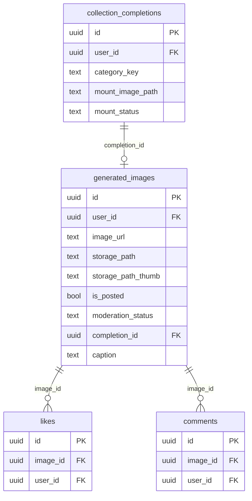
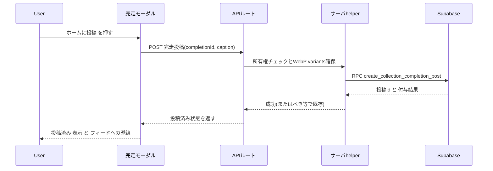
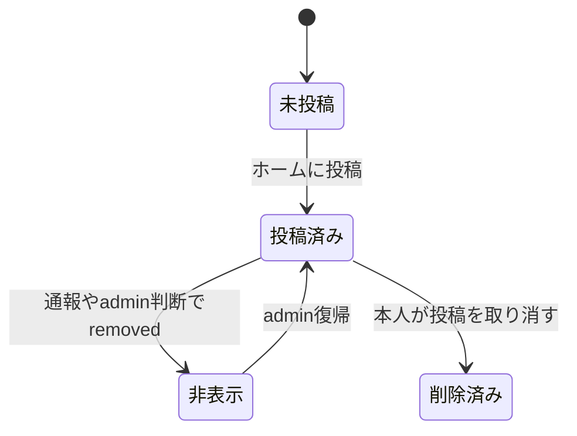
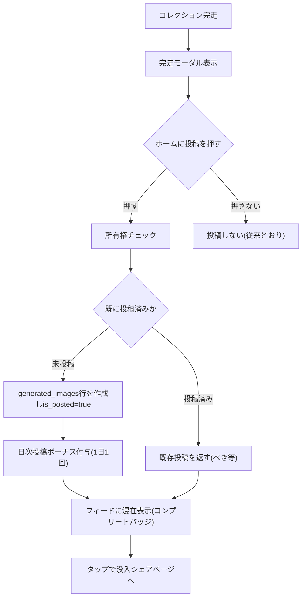
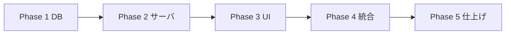

# 実装計画書: コレクション完走のホームフィード投稿(オプトイン)

作成日: 2026-06-29 / 対象: Persta.AI

## 目的

コレクションを**完走(コンプリート)**したユーザーが、**任意(オプトイン)で完走カード(台紙 / 本の表紙)をホームのフィードに投稿**できるようにする。X にシェアしなくてもアプリ内で他ユーザーに見てもらえるため、気軽に「見せたい」欲求を満たし、**社会的証明によるコンプ心理 → 生成・継続(うちの子蓄積資産ループ)**を促す。

## 確定済みの方針(ユーザー合意)

- **対象**: 全コレクション(台紙＝mount ＋ 本＝book)の完走。
- **オプトイン**: 投稿するかはユーザー判断(完走モーダルの明示ボタン)。
- **公開・名前表示**: OK(神コレ前例)。
- **反応**: いいね＋コメント(既存投稿と同等)。
- **投稿ボーナス**: 対象にする(日次1回上限のため farming リスクなし=Phase B で確認済み)。
- **発見性(コールドスタート対策)**: 当面は**専用タブを作らず**既存フィード(新着/おすすめ)に「コンプリート」バッジ付きで混在。
- **タップ先**: 没入シェアページ(`/m/<token>` ＝台紙 / `/m/<token>/book` ＝本)。

---

## コードベース調査結果(Phase B)

> 「完走」= `collection_completions` レコード。「posts」= **`generated_images` テーブル**(posts と generated_images は同一実体)。

### (a) posts データモデル / サーバ側で post を作る正攻法
- 実体 `generated_images`(`supabase/migrations/20250109000001_initial_setup.sql:8-19`、`is_posted` は `:15`)。状態 = `is_posted`(bool) × `moderation_status`(`visible`/`pending`/`removed`、`20260208193000_add_moderation_reports_blocks.sql:6-23`)。新規は `visible` 開始。
- 種別列 `generation_type`(CHECK: `coordinate`/`specified_coordinate`/`full_body`/`chibi`/`one_tap_style`/`inspire`、`20250123140000_add_generation_types_and_stock_images.sql:10-13`)。**完走用の値は未定義**。
- 非NULL必須: `user_id`, `image_url`, `storage_path`, `prompt`。WebP派生 `storage_path_display`(1280)/`storage_path_thumb`(640)(`20250113120000_add_webp_storage_paths.sql:2-4`)。
- RLS SELECT: `(is_posted=true AND moderation_status='visible') OR user_id=auth.uid()`(`20260221130000_consolidate_generated_images_select_policies.sql:5-14`)。INSERT/UPDATE/DELETE は本人のみ。
- 投稿フロー正典: `app/api/posts/post/route.ts`(`postImageServer` `features/generation/lib/server-database.ts:119-148` が `is_posted=true` 更新、`:116` で `grantDailyPostBonus`、`:135-143` で WebP variants)。

### (b) フィード / バッジ
- ホーム: `app/[locale]/page.tsx:203` → `CachedHomePostListSection` → `CachedHomePostList`(`features/posts/components/CachedHomePostList.tsx:16-28`) → `PostList`。取得 API `app/api/posts/route.ts:9-54` → `getPosts()`(`features/posts/lib/server-api.ts:416-677`)。
- タブは `newest`/`week`(おすすめ)/`following` の3種(`features/posts/components/SortTabs.tsx:15-22`)。**専用タブ不要**。
- カード `features/posts/components/PostCard.tsx`(画像 `:55-74`、投稿者メタ `:127-200`、タップ遷移 `/[locale]/posts/{id}` `:102-107`)。**バッジ挿入は `:127-200`、タップ先分岐は `:102-107`**。

### (c) いいね / コメント → **無改修で流用可**
- `likes`/`comments` とも参照キーは `image_id → generated_images(id)`(`20250109000006_likes_comments.sql:8-27`)。種別非依存。完走 post を `generated_images` 1行にすれば自動で動く。

### (d) 投稿ボーナス → **1日1回(JST)上限を確認**
- `grant_daily_post_bonus(p_user_id, p_generation_id)` は `last_daily_post_bonus_at` の JST日付が当日未満のときのみ付与(`20260228000001_update_grant_functions_percoin_defaults.sql:186-203`)。同一 `generation_id` はべき等。`/api/posts/post:116` から呼ばれ、種別非依存。→ **完走投稿でも投稿フローを通せば自動で1日1回上限が効く=farming安全**。

### (e) モデレーション → **無改修で流用可**
- `generated_images.moderation_status` ベースで種別非依存。通報 `app/api/reports/posts/route.ts:164-365`、自動pending `mark_post_pending_by_report`、admin決定 `apply_admin_moderation_decision`。完走 post を `generated_images` 行にすれば通報UI(`features/moderation/components/PostModerationMenu.tsx`)も流用可。

### (f) 完走データ / 差し込み箇所
- `collection_completions`: `id`(=シェアトークン `/m/{id}`)、`mount_image_path`(`mount-{ts}.png` + 横長 `ogp-{ts}.png`)、`book_page_paths[]`、`category_key`。`preset_categories.completion_view_mode`('mount'|'book')。シェアURL `buildPublicMountUrl`(`features/collections/lib/share-mount.ts:20`)。
- **「ホームに投稿」ボタン**: `features/collections/components/CollectionProgressModal.tsx` 完了CTA群 `:567-638`(「シェアページへ」直後 `:599-608` に挿入)。book は `features/collections/components/ScrapbookReader.tsx` にも。
- **投稿画像**: `mount_image_path`(縦長。book も「はじまり」表紙が入る)を採用(カード比率・WebPサムネ機構と整合)。

### (g) 規約
- 原子的・冪等・複数テーブル横断は **RPC/trigger** に寄せる(`data.ja.md:115-131`)。通知は直接INSERT禁止・trigger経由(`database-design.mdc:201-205`)。
- Storage 主バケット `generated-images`(台紙は `collection-mounts/{userId}/{categoryKey}/mount-{ts}.png`)。
- ビルドは `npm run build -- --webpack`。PR日本語必須。新規 `.md` は `git add -f`。

---

## キー設計判断(ADR)

### ADR-001: 完走 post を `generated_images` の1行として表現する(別テーブルにしない)
- **Context**: いいね/コメント/モデレーション/投稿ボーナス/フィード取得/通報UI が**すべて `generated_images.id` 前提**。
- **Decision**: 完走投稿は `generated_images` に1行作る。識別は新列 `completion_id`(→ `collection_completions.id`)。
- **Reason**: 別テーブル(案3)だと上記すべてを作り直し=要件「既存基盤を流用」に逆行。1行化すれば (c)(d)(e) が無改修で動く。
- **Consequence**: `generated_images` に `completion_id` 列追加 + 部分UNIQUE(重複投稿防止)。タップ先・バッジ判定は `completion_id` 有無で行う。

### ADR-002: 投稿は専用 RPC + サーバ helper(WebP/ボーナス)で原子化
- **Context**: 完走画像は既に `generated-images` バケットにある(`mount_image_path`)が、対応する `generated_images` 行が無い。投稿には行作成＋is_posted＋ボーナス＋WebP variants＋revalidate が必要。
- **Decision**: サーバ helper が WebP variants を確保し、**RPC `create_collection_completion_post(p_completion_id, p_caption)`** で「所有権検証 → 行INSERT(is_posted=true, completion_id) → ボーナス付与」を原子的・冪等に実行。`completion_id` の部分UNIQUEで二重投稿はべき等(既存を返す)。
- **Reason**: 横断・冪等処理は RPC に寄せる規約。画像処理(WebP)はRPC不可なので helper 側。
- **Consequence**: `p_user_id` はRPC内 `auth.uid()` で解決(クライアントbody不可)。

### ADR-003: `generation_type` は拡張せず `completion_id` を真の識別子にする(確定)
- **Context**: `generation_type` CHECK 拡張は既存参照(集計/フィルタ)への副作用監査が必要。
- **Decision(確定)**: バッジ/タップ先/重複判定は **`completion_id` の有無**で行う。`generation_type` は**既存値で埋める**(例 `one_tap_style`、CHECK変更なし)。
- **Reason**: 副作用を最小化し、最短で安全に出す。
- **Consequence**: 将来分析で種別が必要なら `generation_type` 値追加(別PR・監査込み)。

### ADR-004: 機能フラグで段階公開(確定)
- **Context**: 新フィード導線は段階公開・即時停止できると安全。
- **Decision**: env フラグ(例 `COLLECTION_FEED_POST_ENABLED`)で「ホームに投稿」導線とAPIをゲート。OFF時はボタン非表示＋API 403。Creator Looks `INSPIRE_FEATURE_ENABLED` と同パターン。
- **Reason**: デプロイと公開を分離し、問題時はコード切り戻し無しで即OFF。
- **Consequence**: フラグ判定を UI(ボタン表示)とサーバ(API/RPC手前)の両方に置く。

---

## 1. 概要図

### データモデル(ER)

### 投稿フロー(シーケンス)

### 投稿の状態(ステート)

### ユーザー操作フロー

### フェーズ間の依存関係

---

## 2. EARS(要件定義)

- **EARS-01(イベント)** When a user taps the post-to-home button on a completed collection, the system shall create one `generated_images` row linked to that completion and mark it posted.
  完走モーダルで「ホームに投稿」を押したら、その完走に紐づく投稿を1件作成し公開状態にする。
- **EARS-02(状態)** While a completion already has a posted feed entry, the system shall show a "投稿済み" state and not create a duplicate.
  既に投稿済みの完走は「投稿済み」を表示し、重複投稿を作らない。
- **EARS-03(権限)** Where the requester is not the owner of the completion, the system shall reject the post-to-home request.
  完走の所有者でない場合、投稿リクエストを拒否する。
- **EARS-04(イベント)** When a completion post is created, the system shall grant the daily post bonus subject to the once-per-day(JST) cap.
  完走投稿の作成時、日次投稿ボーナスを1日1回(JST)上限で付与する。
- **EARS-05(状態)** While a completion post is visible in the feed, the system shall show a "コンプリート" badge and link its tap target to the immersive share page.
  フィード上の完走投稿には「コンプリート」バッジを表示し、タップ先を没入シェアページにする。
- **EARS-06(オプション)** Where likes/comments/report features exist, completion posts shall reuse them unchanged.
  いいね/コメント/通報は完走投稿でも既存機構を流用する。
- **EARS-07(異常系)** If the completion image or WebP variants cannot be prepared, then the system shall fail the post-to-home request without creating a partial row.
  画像/WebP variants を準備できない場合、中途半端な行を作らずに失敗させる。
- **EARS-08(イベント)** When the owner cancels a completion post, the system shall remove it from the feed (the underlying completion and `/m/<token>` remain intact).
  本人が完走投稿を取り消したら、フィードから除く(完走本体とシェアページは保持)。
- **EARS-09(状態)** While a completion post is `pending`/`removed` by moderation, the system shall hide it from public feed but keep the completion and share page intact.
  モデレーションで pending/removed の間は公開フィードから隠すが、完走本体とシェアページは保持する。

---

## 4. 実装計画(フェーズ + TODO)

### Phase 1: データベース設計とマイグレーション
目的: 完走 post を `generated_images` 1行で表現できるようにする。
ビルド確認: migration 適用 + `npm run typecheck`/`build -- --webpack` が緑。

- [ ] migration 新規: `generated_images` に `completion_id UUID NULL REFERENCES collection_completions(id) ON DELETE SET NULL` を追加。
- [ ] 部分UNIQUE index: `CREATE UNIQUE INDEX ... ON generated_images(completion_id) WHERE completion_id IS NOT NULL`(重複投稿防止 = ADR-001/002)。
- [ ] フィード取得用 index: `(completion_id)` 参照 join 用(必要に応じて)。
- [ ] RPC `create_collection_completion_post(p_completion_id uuid, p_caption text)`: `SECURITY DEFINER`、`auth.uid()` で所有権検証(`collection_completions.user_id` 一致 & `mount_status='completed'`)、`generated_images` へ INSERT(`is_posted=true`,`moderation_status='visible'`,`completion_id`,`prompt=''`,`caption`,画像列は helper が渡す)、`grant_daily_post_bonus(auth.uid(), <new id>)` 呼び出し、既存があればそれを返す(べき等)。`RAISE EXCEPTION` で非所有/未完走を弾く(DB層強制)。
- [ ] `generation_type` 方針確定(ADR-003): 既存値で埋める or 値追加(その場合は `generation_type` 参照箇所を監査)。
- [ ] 型更新: `features/posts/types.ts`(post に `completionId`/`completionViewMode`/`shareToken` 等を追加)。
- [ ] 参考: `supabase/migrations/20260228000001_*.sql:186-203`(ボーナスRPC)、`20250109000006_likes_comments.sql`、`20260221130000_*.sql`(RLS)。

### Phase 2: サーバーサイド実装
目的: 完走 → 投稿の作成と、フィードへの種別/タップ先反映。
ビルド確認: API 単体で投稿作成が動く + `getPosts` がバッジ/タップ先情報を返す。

- [ ] サーバ helper: 完走の `mount_image_path` に対し WebP variants(`ensureWebPVariants` 相当、`app/api/posts/post/route.ts:135-143` 参考)を確保し、`generated_images` 行に必要な `image_url`/`storage_path`/`storage_path_display`/`storage_path_thumb` を解決して RPC を呼ぶ。
- [ ] API ルート 新規: `POST /api/collections/completions/[id]/post`(セッション認証、所有権は RPC 側でも二重防御、`p_user_id` は body 受け取り禁止=`auth.uid()`)。**機能フラグ `COLLECTION_FEED_POST_ENABLED` OFF 時は 403**。レスポンスに投稿id/状態。caption を受け取る。
- [ ] API ルート 新規: `DELETE`(投稿取り消し=本人のみ。`is_posted=false` か行削除。EARS-08)。
- [ ] 「投稿済みか」判定: 完走に対する既存 post の有無を返す(モーダル表示用)。`CachedMyPageCollections`/完走データに `feedPostId` を含めるか、軽量 API で取得。
- [ ] `getPosts()`(`features/posts/lib/server-api.ts:416-677`)拡張: 完走 post に `completion_id` と `completion_view_mode`(join)を載せ、バッジ/タップ先解決に使う。
- [ ] フィード cache の revalidate(`data.ja.md:96-107, 220-237` の方針に合わせる)。

### Phase 3: UI 実装
目的: 完走モーダルからの投稿導線と、フィードでの見せ方。
ビルド確認: 完走モーダルに投稿ボタン表示 + フィードでバッジ/遷移が動く。

- [ ] 機能フラグ `COLLECTION_FEED_POST_ENABLED` を UI 表示判定に適用(OFF時は全導線非表示)。
- [ ] `CollectionProgressModal.tsx:599-638` に「ホームに投稿する」ボタン追加(「シェアページへ」と「シェアする」の間)。`completionId`/`displayNameJa` を使用。投稿済みは「ホームに投稿済み ✓」表示＋取り消し導線。
- [ ] 没入シェアページにも常設(所有者のみ): book=`ScrapbookReader.tsx`(右上 chrome 群)、mount=`PublicMountPage`(`app/m/[token]/page.tsx` の `MountShareButton` 付近)。
- [ ] 任意キャプション入力欄(既定値/プレースホルダ「『{名前}』をコンプリート！」、編集可)。
- [ ] 投稿取り消し(本人)UI: 投稿済み状態からワンタップで取り消し → 未投稿に戻る。
- [ ] `PostCard.tsx:127-200` に「コンプリート」バッジ(amber/peach、`completion_id` 有無で表示)。
- [ ] `PostCard.tsx:102-107` のタップ先を、完走 post は `/m/<token>`(book は `/m/<token>/book`、`completion_view_mode` で直行)に分岐。
- [ ] i18n: `messages/ja.json`・`messages/en.json` にボタン/バッジ/トースト文言。

### Phase 4: 統合
目的: 一連の体験が破綻なく繋がる。
ビルド確認: 完走→投稿→フィード表示→タップ→没入シェアページ→いいね/コメント が通る。

- [ ] フィード(新着/おすすめ)に完走 post が混在表示され、バッジ付き・タップで没入シェアページに遷移。
- [ ] いいね/コメントが完走 post でそのまま機能(無改修)。
- [ ] 日次ボーナスが1日1回で付与(通常投稿と共有上限)。
- [ ] 通報→自動pending→admin決定 が完走 post でも機能。removed 時に完走本体/`/m/<token>` は無傷(EARS-09)。

### Phase 5: 仕上げ
目的: エラー/空状態/計測/テスト。
ビルド確認: lint/typecheck/test/build すべて緑。

- [ ] エラーハンドリング(画像未準備・非所有・二重投稿・ネットワーク)。
- [ ] 計測(任意): 投稿率・投稿経由のフィード閲覧・完走率の前後比較イベント。
- [ ] ユニットテスト(RPC 入出力・getPosts 拡張・PostCard 分岐・モーダル投稿状態)。
- [ ] 実機(プレビューadmin垢/シークレット推奨。既読が localStorage 端末単位な点に留意)。

---

## 5. 修正対象ファイル一覧

| ファイル | 操作 | 変更内容 |
|----------|------|----------|
| `supabase/migrations/<ts>_add_completion_id_to_generated_images.sql` | 新規 | `completion_id` 列 + 部分UNIQUE + RPC `create_collection_completion_post` |
| `features/posts/types.ts` | 修正 | post 型に `completionId`/`completionViewMode`/`shareToken` 追加 |
| `features/posts/lib/server-api.ts` | 修正 | `getPosts()` に完走メタ(completion_id, completion_view_mode)を載せる |
| `features/collections/lib/completion-feed-post.ts` | 新規 | WebP variants 確保 + RPC 呼び出し helper(サーバ) |
| `app/api/collections/completions/[id]/post/route.ts` | 新規 | 投稿作成 POST / 取り消し DELETE(セッション認証) |
| `features/collections/components/CollectionProgressModal.tsx` | 修正 | 「ホームに投稿する」ボタン + 投稿済み状態 |
| `features/collections/components/ScrapbookReader.tsx` | 修正 | book の投稿導線 |
| `features/posts/components/PostCard.tsx` | 修正 | コンプリートバッジ + タップ先分岐 |
| `features/my-page/components/CachedMyPageCollections.tsx` | 修正 | 完走の「投稿済みか」判定データを供給(任意) |
| `messages/ja.json` / `messages/en.json` | 修正 | 文言追加 |

---

## 6. 品質・テスト観点

### 品質チェックリスト
- [ ] **エラーハンドリング**: 非所有/未完走/二重投稿/画像未準備で適切に失敗。
- [ ] **権限制御**: `p_user_id` は `auth.uid()` 解決(body不可)。RLS は既存 `generated_images` ポリシーで担保。
- [ ] **データ整合性**: `completion_id` 部分UNIQUE で1完走1投稿。RPC 冪等。
- [ ] **セキュリティ**: 所有権を DB層(RPC)で二重強制(`RAISE EXCEPTION`)。
- [ ] **i18n**: en/ja 揃え。

### テスト観点
| カテゴリ | 内容 |
|----------|------|
| 正常系 | 完走→投稿→フィード表示→タップ→没入シェアページ→いいね/コメント |
| 異常系 | 二重投稿(べき等)・非所有拒否・未完走拒否・画像未準備 |
| 権限 | 他人の完走を投稿不可・未ログイン不可 |
| 実機 | フィード混在・バッジ・遷移・ボーナス1日1回・通報/モデレーション |

### テスト実装手順
実装後 `/test-flow` に沿って `/spec-extract` → `/spec-write` → `/test-generate` → `/test-reviewing` → `/spec-verify`。

---

## 7. ロールバック方針
- **DB**: migration に down(列・index・RPC drop)を用意。`completion_id` は `NULL` 許容なので既存行に無害。
- **機能フラグ**: 「ホームに投稿」ボタンを env / カテゴリ設定でフラグ化し、段階ロールアウト/即時停止可能に。
- **Git**: フェーズ単位コミットで `revert` 可能に。
- **影響局所化**: 完走 post は `generated_images` の追加行のみ。既存投稿・フィードへの破壊的変更なし。

## 8. 使用スキル
| スキル | 用途 | フェーズ |
|--------|------|----------|
| `/project-database-context` | DB設計参照 | Phase 1 |
| `/spec-extract`・`/spec-write` | EARS精査 | テスト |
| `/test-flow`・`/test-generate` | テスト | テスト |
| `/git-create-pr` | PR作成 | 各フェーズ |

---

## 確定事項(ユーザー判断 済み)

1. **投稿画像**: 縦長台紙(`mount_image_path`)を採用(book も「はじまり」表紙が入る)。
2. **キャプション**: ユーザー任意入力欄を出す(既定文「『{名前}』をコンプリート！」をプレースホルダ/初期値、編集可)。
3. **投稿取り消し(DELETE)**: 初回スコープに**含める**(本人が投稿を取り消せる)。
4. **投稿ボタンの設置場所**: 完走モーダル **＋ 没入シェアページにも常設**(book=`ScrapbookReader`/`m/<token>/book`、mount=`PublicMountPage`/`m/<token>`。いずれも所有者のみ)。
5. **機能フラグ**: 段階公開のため **env フラグを付ける**(Creator Looks の `INSPIRE_FEATURE_ENABLED` と同パターン。例: `COLLECTION_FEED_POST_ENABLED`)。フラグOFFでボタン非表示＋API拒否。
6. **`generation_type`**: **既存値で埋める**(例 `one_tap_style`。CHECK変更なし=最短/安全)。バッジ・タップ先・重複判定は `completion_id` で行うため機能影響なし。将来分析が必要なら値追加(別PR・要監査)。

> コールドスタート前提どおり「専用イベントタブ」は本計画スコープ外(効果検証後の次フェーズ)。
