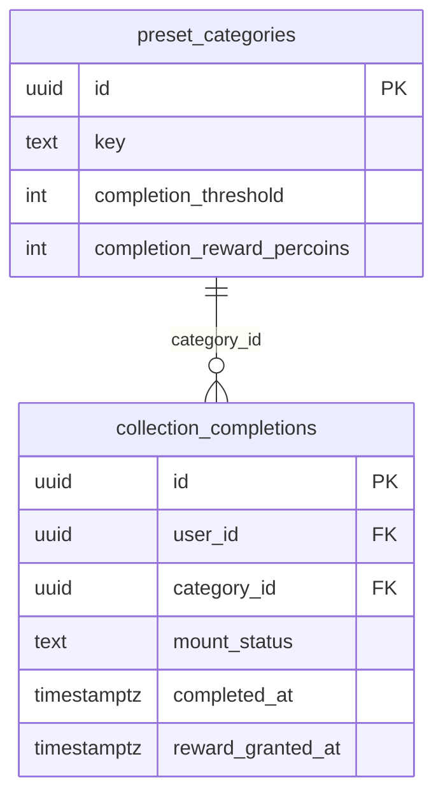
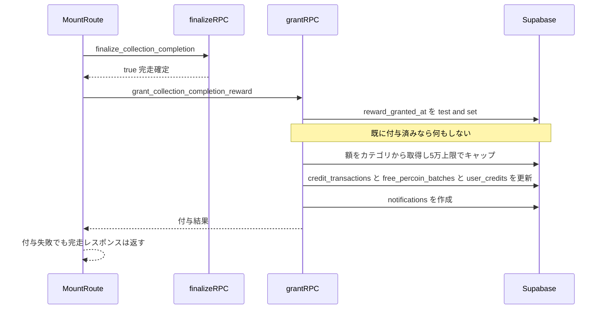
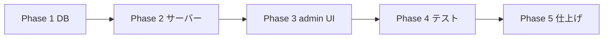

# 実装計画書: コレクション完走報酬

作成日: 2026-07-10 / 対象: Persta.AI

## 目的

コレクション(神コレ/旅行など)を完走したユーザーにペルコインを付与する。付与額は `/admin/preset-categories` の編集画面でカテゴリごとに設定できる(`preset_categories.completion_reward_percoins`)。完走はサーバー側で確定的に記録されるため、「1ユーザー×1コレクション1回」の冪等付与を保証する。

## 確定済みの方針(ユーザー合意 2026-07-10)

- 付与方式: 完走一括(100%完走時に1回のみ)。段階報酬(50/70/100%)は見送り。
- 遡及: しない。リリース後の完走から付与(既存完走者には払わない)。
- 残高上限: 5万無料残高キャップを適用(daily_post/streak と同じ `get_grantable_free_percoin_amount`)。
- 報酬額の出所: サーバーが `preset_categories` から引く(クライアントから額を渡さない=改ざん防止)。
- 段階公開: 新列デフォルト0(=報酬なし)。adminが額を設定するまで無報酬=自然な段階公開(専用フラグ不要)。

---

## コードベース調査結果(Phase B / 調査済み)

### (a) 完走の記録 = サーバー側で確定的
- テーブル `collection_completions`(`supabase/migrations/20260608090100_create_collection_completions.sql:9-25`)。UNIQUE `(user_id, category_id)` = 1ユーザー1コレクション1行。
- 確定RPC `finalize_collection_completion(p_completion_id, p_user_id, p_mount_image_path)`(初出 `20260608090600_harden_collection_completion_rpcs.sql`、**現行定義は `20260610100000_allow_versioned_collection_mount_paths.sql` で再CREATE**。SECURITY DEFINER / service_role)。`mount_status='completed'` + `completed_at=now()` を原子的に設定。
- 付与フック挿入点: `app/api/collections/mount/route.ts` — mount経路 471-486、book経路 281-296(finalize成功後・レスポンス返却前)。**いずれも `if (!isUpdate)` 配下**であり、台紙の作り直し(isUpdate=true)では finalize 自体が呼ばれない = 作り直しで二重付与しない。finalize の呼び出し元はこのルートのみ(grep確認済み)。カテゴリは同ルート187-198で取得済み。

### (b) 付与機構(踏襲パターン) = grant_tour_bonus
`supabase/migrations/20260228000001_update_grant_functions_percoin_defaults.sql:4-78`。流れ: 額決定 → `credit_transactions` に冪等INSERT → `free_percoin_batches`(expire_at=月末+約6ヶ月) → `user_credits` 残高加算 → `notifications` 作成。
- `transaction_type` のCHECK: `20260226100000_add_admin_deduction.sql:8-13`(既存11種)。ここに `collection_completion` を追加(制約張り替え)。
- **権限モデルの相違(重要)**: `grant_tour_bonus` は authenticated に EXECUTE を付与し関数内 `auth.uid()` チェックで守るが、本RPCは **service_role 専用**(finalize と同じ)。踏襲するのは内部の付与処理のみで、**GRANT文はコピーしない**こと。
- 5万キャップ: `get_grantable_free_percoin_amount`(daily_post/streak が使用)。

### (c) admin設定面(額フィールドの追加先)
- フォーム: `features/preset-categories/components/AdminPresetCategoryFormClient.tsx`(FormState 51-131 / 送信payload 636-765 / completionThresholdの数値入力 505-517 をミラー)。
- **バリデーションの実体は `collection-settings-payload.ts` のみに置く**: `[id]/route.ts` の75-354は非collection系フィールドのインライン検証で、collection系(completion_threshold等)は357-370で `parseCollectionSettings()` に一括委譲している。`completion_reward_percoins` も同様に payload parser 側で検証し、route側は existing オブジェクトへの1フィールド追加のみ(**両ファイルに重複実装しない**)。
- **新規作成 route も対象**: `POST /api/admin/preset-categories/route.ts` も `parseCollectionSettings()` を呼ぶ(408-410でexistingデフォルトを渡す)。新規作成時にデフォルト0が正しく通ることを確認。
- repositoryマッピング(DB行→camelCase): `features/style-presets/lib/preset-category-repository.ts`。**型定義(PresetCategoryRow/Admin/Insert/Update)と mapRow() はすべてこのファイル内(29-359)にあり、schema.ts は対象外**。

### (d) テストパターン
- payload: `tests/unit/features/collections/collection-settings-payload.test.ts`
- admin route: `tests/integration/api/admin-style-presets-routes.test.ts`
- repository: `tests/unit/lib/preset-category-repository.test.ts`

---

## 1. 概要図

### データモデル(ER)

### 付与シーケンス

---

## 2. EARS(要件定義)

- EARS-01(イベント) When `finalize_collection_completion` succeeds, the system shall grant the category's `completion_reward_percoins` to the user exactly once.
  完走確定時、カテゴリの完走報酬ペルコインをちょうど1回付与する。
- EARS-02(状態) While granting, the system shall enforce idempotency by a test-and-set on `collection_completions.reward_granted_at`.
  付与時は reward_granted_at の test-and-set で冪等を担保し二重付与しない。
- EARS-03(オプション) Where `completion_reward_percoins` is 0 or null, the system shall not create any transaction or notification.
  報酬額が0/nullなら取引も通知も作らない。
  ※UXトレードオフ注記: 5万キャップにより付与額が0になったユーザーは「完走したのに報酬通知が来ない」体験になる。v1ではこの挙動を許容(キャップ到達者は稀・残高十分)。問題になれば「上限のため付与見送り」通知を後付け検討。
- EARS-04(状態) While granting, the system shall cap the amount by `get_grantable_free_percoin_amount`.
  付与額は5万無料残高上限でキャップする。
- EARS-05(イベント) When a reward is granted, the system shall create a notification informing the earned amount.
  付与時、獲得額を知らせる通知を作成する。
- EARS-06(権限) Where an admin edits a preset category, the system shall validate `completion_reward_percoins` as a non-negative integer or null and persist it.
  admin編集時、報酬額を0以上の整数かnullで検証して保存する。
- EARS-07(異常系) If the grant RPC fails, then the system shall log the error and still return the completion response.
  付与RPC失敗時はログのみ残し完走レスポンスは返す(完走は既に永続化済み・付与は完走をブロックしない)。
- EARS-08(セキュリティ) While granting, the system shall derive user_id and reward amount server-side, never from the client body.
  付与時、user_idと報酬額はサーバー側(完走行とカテゴリ)から解決しクライアント入力を信用しない。
- EARS-09(イベント/演出) When the mount API response includes rewardGranted greater than 0, the completion celebration view shall show a reward panel that counts up from 0 to the granted amount and lands with a burst.
  台紙完成レスポンスの実付与額が0より大きいとき、祝賀ビューに報酬パネルを出し0からカウントアップ→着地バーストで表示する。額0/付与失敗時はパネル自体を出さない(嘘をつかない)。

---

## 3. ADR(設計判断記録)

### ADR-001: 冪等は collection_completions.reward_granted_at の test-and-set
- Context: 完走報酬は1ユーザー×1コレクション1回。credit_transactions には category/completion を指す列が無い。
- Decision: collection_completions に reward_granted_at timestamptz を追加し、grant RPC は「UPDATE ... SET reward_granted_at=now() WHERE id=対象 AND reward_granted_at IS NULL AND mount_status='completed'」の更新成功(1行)時のみ付与処理へ進む。
- Reason: 完走の真実の源泉(completion行)で付与状態も追跡でき、credit_transactionsのスキーマ変更なしで原子的な1回制御ができる。
- Consequence: 付与状態がcompletion行から一目で分かる。downでは列削除で戻せる。

### ADR-002: 報酬額はサーバーが preset_categories から引く
- Decision: grant RPC は p_completion_id, p_user_id のみ受け取り、額は completion→category を辿って取得。
- Reason: クライアントから額を渡すと改ざんで無限付与できる。source安全性の担保。

### ADR-003: 完走一括・遡及なし
- Decision: 100%完走(finalize成功)時に一括付与。既存完走者への遡及なし。
- Reason: シンプル・低リスク。フックはリリース後のfinalizeでのみ発火し、既存完走者は自然に対象外。将来遡及したければ別バッチで可能。

### ADR-004: 5万キャップ適用
- Decision: daily_post/streak と同じ get_grantable_free_percoin_amount を通す。
- Reason: 完走報酬も無料付与。無料残高上限の思想に統一し経済健全性を保つ。

---

## 4. 実装計画(フェーズ + TODO)

### Phase 1: DB
目的: 列・enum・grant RPC。ビルド確認: migration適用 + typecheck緑。

- [ ] migration(1本):
  - ALTER TABLE preset_categories ADD COLUMN completion_reward_percoins integer DEFAULT 0(CHECK: null or 0以上)
  - ALTER TABLE collection_completions ADD COLUMN reward_granted_at timestamptz
  - transaction_type CHECK に collection_completion を追加(制約張り替え)
  - RPC grant_collection_completion_reward(p_completion_id uuid, p_user_id uuid)(SECURITY DEFINER, **service_roleのみ**。authenticated への GRANT はしない): reward_granted_at の test-and-set → 額取得(category) → get_grantable_free_percoin_amount でキャップ → credit_transactions / free_percoin_batches / user_credits / notifications(grant_tour_bonus の内部処理を踏襲)。額が0以下 or キャップ後0なら reward_granted_at は立てるが取引・通知は作らない。
  - 通知は `type='bonus'` / `entity_type='user'` / **`entity_id=p_user_id`**(grant_tour_bonus と同じ整合)。コレクション情報(category_key・completion_id・付与額)は `data` jsonb に格納。
- [ ] 型: preset-category-repository の行マッピングに completionRewardPercoins を追加。

### Phase 2: サーバーサイド
目的: 付与フック + admin保存の配線。ビルド確認: adminでPATCH保存でき、完走で付与される。

- [ ] app/api/collections/mount/route.ts: mount(471-486)/book(281-296) の finalize 成功後(`if (!isUpdate)` 配下)に grant RPC を呼ぶ。try-catchで囲み、失敗しても完走レスポンスは返す。
- [ ] 付与成功時、残高表示系のキャッシュを revalidate する(`app/api/tutorial/complete/route.ts:47-50` の revalidateTag パターンを踏襲: my-page credits / challenge 等の該当タグ)。既存の `collection-completions:` タグはコレクション表示専用で残高には効かない点に注意。
- [ ] collection-settings-payload.ts: completion_reward_percoins の検証(null / 非負整数)を completion_threshold パターンで追加。
- [ ] app/api/admin/preset-categories/[id]/route.ts: 同項目のバリデーションと update への反映。

### Phase 3: admin UI + 報酬演出
目的: カテゴリ編集フォームに報酬額入力 + 祝賀ビューのカウントアップ演出。ビルド確認: 入力→保存→再表示で値が残る。演出は額>0のときのみ。

- [ ] AdminPresetCategoryFormClient.tsx: FormState に completionRewardPercoins、completionThreshold(505-517)を真似た数値入力、送信payloadに追加。ラベル「完走報酬(ペルコイン)」、補足「0またはなしで報酬なし」。
- [ ] mount route レスポンスに rewardGranted(実付与額、grant RPC戻り値)を追加(Phase 2で実装)。
- [ ] 報酬額の伝搬: CollectionMountComposer の結果型(MountGeneratedResult) → useCollectionProgress.onComposerGenerated → CollectionCelebration 型 → CollectionProgressModal。
- [ ] CountUpNumber 小コンポーネント新規(rAF + easeOut、ライブラリなし)。
- [ ] CollectionProgressModal の完走(completed)ビューに報酬パネル: 0.8秒遅延ポップイン → カウントアップ(約1.2秒) → 着地バウンス+コイン粒子バースト(いいねボタンの既存バースト演出を流用)。額0/undefined時はパネル非表示。Lottieは使わない(既存演出と同じ手書きCSS/rAF)。

### Phase 4: テスト
目的: 回帰防止。ビルド確認: test緑。

- [ ] payload: 負数reject / null accept / 0 accept / 大きい整数 accept。
- [ ] admin route: PATCH completion_reward_percoins:100 が保存・応答に反映。
- [ ] repository: DB行→completionRewardPercoins マッピング(null/0含む)。
- [ ] mount route: finalize成功時に grant RPC が呼ばれる / grant失敗でも200 / 額の引数を渡さない(completion_idとuser_idのみ)。

### Phase 5: 仕上げ
目的: 実機・非機能。ビルド確認: lint/typecheck/test/build緑。

- [ ] 実機(admin): カテゴリに報酬額設定 → 別垢で完走 → 残高増・通知表示・reward_granted_at セット確認。二重付与されないこと。
- [ ] 額未設定(0)カテゴリでは付与も通知も出ないこと。
- [ ] i18n: adminラベルは日本語。ユーザー通知はSQL内で日本語生成(既存bonus通知踏襲)。
- [ ] docs/architecture/data.ja.md の「アプリから使う主要RPCカタログ」表(315-336付近)に新RPCを追記。
- [ ] (要判断・スコープ外候補) 完走モーダル(CollectionProgressModal)内への報酬額インライン表示。v1は通知のみ、必要なら別PR。

---

## 5. 修正対象ファイル一覧

| ファイル | 操作 | 変更内容 |
|----------|------|----------|
| supabase/migrations/20260710120000_add_collection_completion_reward.sql | 新規 | 列2つ + transaction_type拡張 + grant RPC |
| features/style-presets/lib/preset-category-repository.ts | 修正 | 型(Row/Admin/Insert/Update)+mapRow に completionRewardPercoins 追加(このファイルで完結) |
| app/api/collections/mount/route.ts | 修正 | finalize後に grant RPC 呼び出し(try-catch)+残高系revalidateTag |
| app/api/admin/preset-categories/collection-settings-payload.ts | 修正 | 報酬額の検証・payload反映(バリデーション実体はここのみ) |
| app/api/admin/preset-categories/[id]/route.ts | 修正 | existing への1フィールド追加(検証は委譲) |
| app/api/admin/preset-categories/route.ts | 修正 | 新規作成時のデフォルト0の通過確認・existing追加 |
| docs/architecture/data.ja.md | 修正 | RPCカタログ表に grant_collection_completion_reward を追記 |
| features/preset-categories/components/AdminPresetCategoryFormClient.tsx | 修正 | 数値入力フィールド追加 |
| features/collections/components/CollectionMountComposer.tsx | 修正 | MountGeneratedResult に rewardGranted 追加 |
| features/collections/hooks/useCollectionProgress.ts | 修正 | celebration へ rewardGranted 伝搬 |
| features/collections/components/CollectionProgressModal.tsx | 修正 | 完走ビューに報酬パネル(カウントアップ+バースト) |
| features/collections/components/CountUpNumber.tsx | 新規 | rAF カウントアップ数値 |
| tests/unit/features/collections/collection-settings-payload.test.ts | 修正 | 報酬額バリデーションのテスト |
| tests/integration/api/admin-style-presets-routes.test.ts | 修正 | PATCH保存テスト |
| tests/unit/lib/preset-category-repository.test.ts | 修正 | マッピングテスト |

---

## 6. 品質・テスト観点

### 品質チェックリスト
- [ ] 冪等: 同一完走で二重付与しない(reward_granted_at test-and-set)。
- [ ] source安全性: user_id・額はサーバー解決(クライアント入力を信用しない)。
- [ ] 経済: 5万キャップ適用。額0/nullで完全no-op。
- [ ] 非ブロッキング: 付与失敗が完走レスポンスを妨げない。
- [ ] 権限: grant RPCは service_role のみ。admin保存は requireAdmin。
- [ ] i18n: adminラベル日本語 / 通知はSQL生成。

### テスト観点
| カテゴリ | 内容 |
|----------|------|
| 正常系 | 完走→付与→残高増・通知。admin保存→反映。 |
| 異常系 | 付与RPC失敗でも完走は成功レスポンス。 |
| 冪等 | 2回目付与はno-op。 |
| 境界 | 額0/null=no-op、キャップ超過=キャップ額、負数=reject。 |
| 権限 | 非adminはPATCH不可、grant RPCは直接呼べない。 |

---

## 7. ロールバック方針
- DB: down migration で RPC・列(completion_reward_percoins, reward_granted_at)・enum拡張を drop。列は未使用でも無害。
- 段階公開: 全カテゴリ初期値0=無報酬。adminが額を入れるまで実質OFF。問題時は額を0に戻すだけで即停止(デプロイ不要)。
- 付与フック: try-catchで完走フローに影響しない追加実装。
- Git: フェーズ単位コミットで revert 可能。

## 8. 使用スキル
| スキル | 用途 | フェーズ |
|--------|------|----------|
| /project-database-context | DB設計参照 | Phase 1 |
| /git-create-pr | PR作成 | 完了時 |
