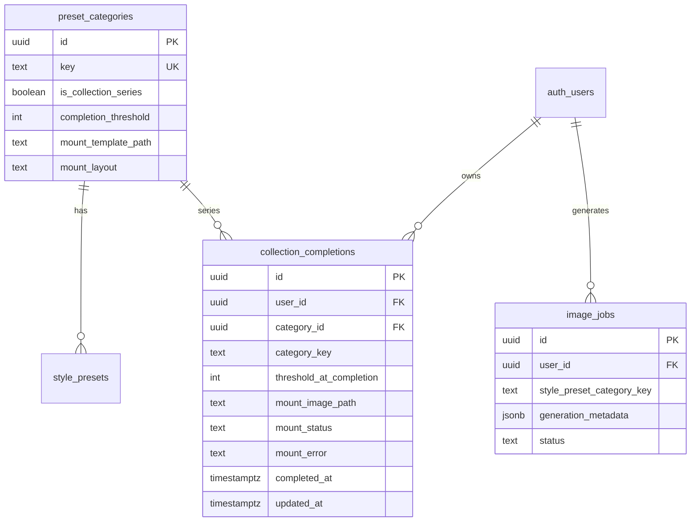
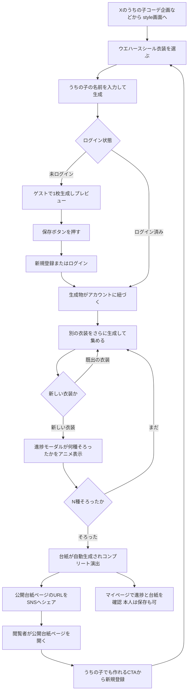
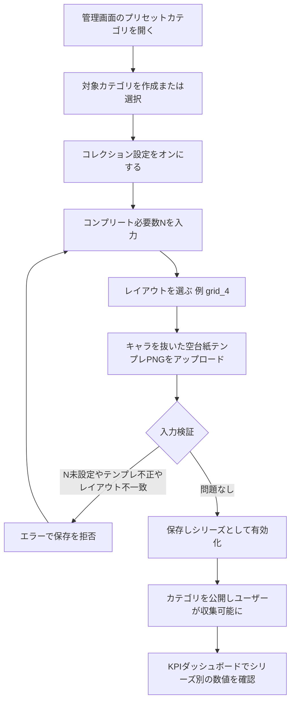
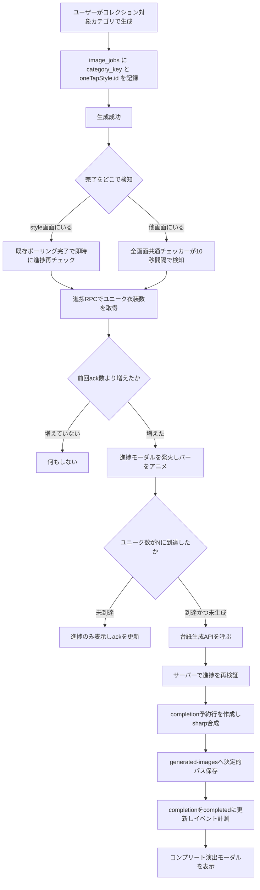
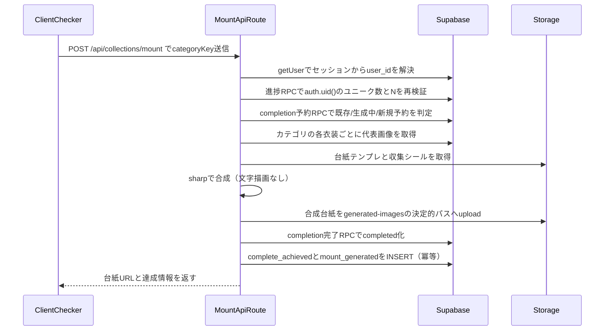
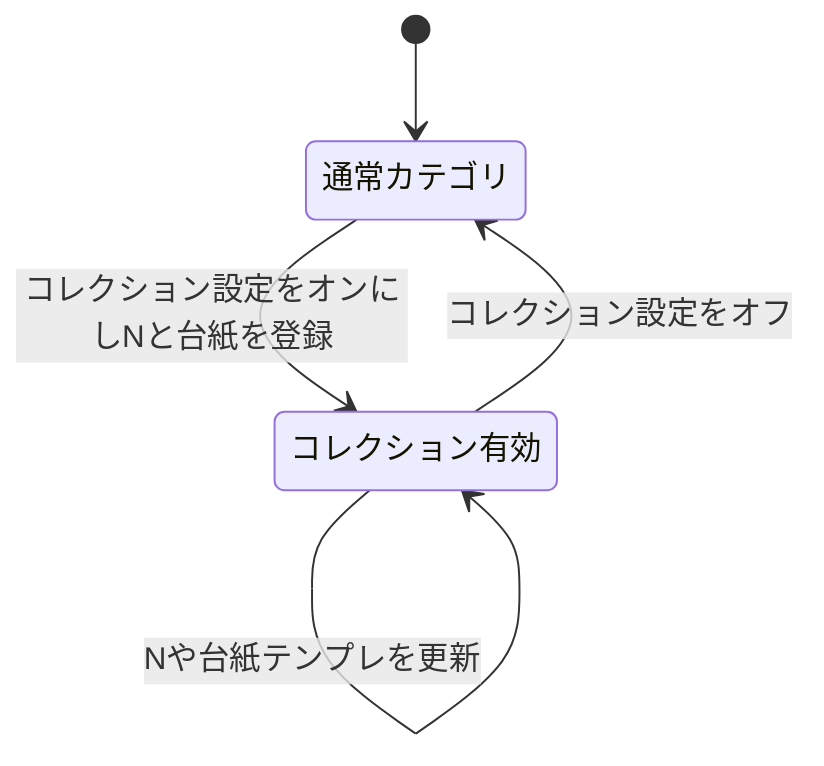
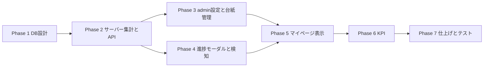

# 汎用コレクション機能 実装計画書

最終更新: 2026-06-08
初回ユースケース: marioコラボ「うちの子のウエハースシール」企画
設計方針: **特定カテゴリにハードコードせず、どのプリセットカテゴリでもコレクション化できる汎用機能**として実装する。

---

## 0. 確定済みの仕様（事前ヒアリング結果）

| 項目 | 決定 |
|---|---|
| コンプリートの数え方 | **ユニーク衣装数 N**（同一カテゴリ内の `DISTINCT oneTapStyle.id`）|
| N の設定 | **admin がカテゴリ単位で設定**（可変）|
| 汎用化 | **全カテゴリでコレクション設定可能**。複数シリーズの同時運用を許容 |
| 台紙の生成方式 | **テンプレ合成（サーバー側 sharp）**。AI生成は不採用 |
| 台紙の再生成 | **無し（初回コンプリート時に1回だけ生成）→ ペルコイン課金ロジック不要** |
| うちの子の名前 | **生成シールにプロンプト（ユーザー入力）で焼き込み済み**。台紙側では描画しない（入稿サンプルで確認） |
| 進捗モーダル | ユニーク数が増えた瞬間に**どの画面にいても**発火、進捗バーを前回値→新値へアニメ |
| マイページ進捗確認 | 進捗セクションをタップで同じモーダルを手動起動 |
| 台紙の表示 | コンプリート後、マイページの**保有ペルコイン表示の直前**にサムネ、タップで拡大モーダル |
| 複数シリーズのUI | マイページでは**一覧表示**（進捗・台紙ともに複数並べる）|

---

## 1. コードベース調査結果（Phase B）

### 1-1. 既存の土台（流用するもの）

| 領域 | 既存実装 | 流用方法 |
|---|---|---|
| プリセットカテゴリ | `preset_categories` テーブル（`supabase/migrations/20260530080000_add_preset_categories.sql`）。`key` は不変（UPDATEトリガで拒否）| コレクション設定カラムを追加 |
| 生成時のカテゴリ記録 | `image_jobs.style_preset_category_key`（`app/(app)/style/generate-async/handler.ts:481` でスナップショット保存）| 集計のソース。**追加実装不要** |
| 個別衣装の記録 | `image_jobs.generation_metadata.oneTapStyle.id`（`shared/generation/one-tap-style-metadata.ts:51`）| ユニーク衣装カウントのソース |
| admin カテゴリ管理 | `app/(app)/admin/preset-categories/{page.tsx,[id]/page.tsx,new}` ＋ API `app/api/admin/preset-categories/{route.ts,[id]/route.ts}` | コレクション設定欄・台紙管理を追加 |
| admin 認証 | API: `requireAdmin()`（`lib/auth.ts:59`）／ ページ: `getAdminUserIds()`（`@/lib/env`）| 同パターンを踏襲 |
| イベント計測 | `style_usage_events`（`event_type` は CHECK 制約。`features/style/lib/style-usage-events.ts`）。挿入API `app/(app)/style/events/handler.ts` | 新イベント種別を CHECK に追加 |
| イベント種別追加の手本 | `supabase/migrations/20260606120000_add_wardrobe_usage_event_types.sql`（DROP+ADD で冪等に再定義）| 同形式で追加 |
| グローバル通知 | `components/GeneratedImageNotificationChecker.tsx`（10秒ポーリング＋ack方式）。マウントは `components/AppShell.tsx:62` | 同型の `CollectionProgressChecker` を並置 |
| 生成完了の即時検知 | `pollGenerationStatus`（`features/generation/lib/async-api.ts:245`）。style画面側は `features/style/components/StylePageClient.tsx:1406` | 完了時に進捗再チェックを即発火 |
| 進捗バーのアニメ | `features/generation/components/GenerationStatusCard.tsx`（CSS transition）| モーダル内の進捗バーに転用 |
| ポップアップ(Dialog) | `features/popup-banners/components/PopupBannerOverlay.tsx`（shadcn Dialog）| モーダルの外枠に転用 |
| 画像拡大モーダル | `features/generation/components/ImageModal.tsx`（yet-another-react-lightbox）| 台紙サムネの拡大に流用 |
| マイページ残高 | `app/(app)/my-page/page.tsx:41` ＋ `features/my-page/components/CachedMyPagePercoinBalance.tsx`（`"use cache"` + `cacheTag`）| この直前に台紙サムネを差し込み |
| Storage 保存（台紙画像） | ゲスト保存の `features/.../save-wardrobe-image.ts`（`generated-images` バケットへ upload）| 生成済み台紙は `generated-images` にユーザー別・シリーズ別の決定的パスで保存 |
| Storage 保存（台紙テンプレ） | Supabase Storage bucket + admin API | 台紙テンプレはユーザー生成物と混在させず、専用 bucket または専用 prefix へ admin のみ upload |
| サーバー画像処理 | `sharp@^0.34.5`（`package.json`）| 台紙合成に使用（Node ランタイム） |
| うちの子の名前 | `source_image_stocks.name`（`supabase/migrations/20250123140000_*.sql`）| 名前のプリフィル元 |

### 1-2. 重要な制約

- **Supabase Edge Function（`image-gen-worker`）は Deno のため sharp 不可。** 台紙合成は **Next.js の Node ランタイム API ルート**で行う（`export const runtime = "nodejs"`）。
- `preset_categories.key` は不変。集計は key スナップショットで行うため、カテゴリ削除・改名に強い。
- 生成は非同期（数十秒〜数分）。完了検知はポーリング前提。
- `createAdminClient()` や `"use cache"` を使う箇所では RLS が効かないため、所有者条件・公開条件をアプリ側で必ず再適用する。
- クライアントから `user_id` や進捗数を受け取らない。ユーザー識別は `auth.uid()` / `getUser()` のセッション情報に限定する。
- 複数テーブルに跨る進捗確定・台紙生成予約・完了確定は、冪等性を担保する RPC に寄せる。
- 台紙テンプレ upload は MIME type、ファイルサイズ、画像寸法、保存 prefix を検証し、admin 以外の書き込みを禁止する。

### 1-4. 入稿サンプルから確定した台紙仕様（2026-06-08 受領）

- **空テンプレ**（夏ファッションコレクション）は **4枠 2×2 = `grid_4`**。各スロットはホロ背景＋金枠＋`No.0x/04` ラベルが焼き込み済み、キャラ部分のみ空。ウエハース第1弾の **N=4**。
- **生成シール**は「ホロ背景＋キャラ＋名前」まで**全部焼き込み済みの完成した正方形画像**。
- したがって台紙合成は **完成シールを各スロット（金枠の内側のホロ領域）に正方形のまま配置するだけ**。**名前・通し番号の描画は不要**（名前はシール側、番号はテンプレ側に既にある）。
- **名前は生成時にプロンプト（`show_user_prompt_input` のユーザー入力）でシールに焼き込まれる**。台紙側の名前描画機能は実装しない。
  - 前提確認（実装時）: ウエハース用 One-Tap Style の `show_user_prompt_input` が有効で、ユーザー入力がプロンプトに渡りシールに名前が出ること（① 完了済み生成フローの範囲）。

### 1-3. 前提（実装時に要確認）

- 本計画の DB 設計は `supabase/migrations/` の読み取りに基づく。実適用は実装フェーズで `supabase db diff` 確認のうえ行う（Supabase 接続は実装時に確認）。
- 台紙レイアウトのスロット座標は、提供される空テンプレPNGの実寸に合わせてコード側の定数で定義する。

---

## 2. 概要図

### 2-1. データモデル（ER図）

### 2-2. ユーザー視点のフロー（体験全体）

### 2-3. 管理者視点の設定フロー

### 2-4. 進捗カウントアップ〜コンプリートのフロー（システム挙動）

### 2-5. 台紙合成のシーケンス

### 2-6. コレクション設定の状態遷移（カテゴリ単位）

---

## 3. EARS（要件定義）

### コレクション設定（admin）

- **R-01** When an admin enables collection on a preset category and sets a threshold, a mount template, and a layout, the system shall persist `is_collection_series`, `completion_threshold`, `mount_template_path`, and `mount_layout` for that category.
  管理者がカテゴリのコレクションを有効化し、必要数・台紙テンプレを設定したとき、システムはそれらをカテゴリに保存する。
- **R-02** If an admin enables collection without a positive threshold, a supported layout, or a valid mount template path, then the system shall reject the update with a validation error.
  必要数が正でない、レイアウトが未対応、または台紙テンプレ未設定でコレクションを有効化しようとした場合、システムはバリデーションエラーで拒否する。
- **R-03** While a category is not a collection series, the system shall not show progress UI, modals, or mounts for that category.
  カテゴリが非コレクションの間、システムはそのカテゴリの進捗UI・モーダル・台紙を一切表示しない。

### 進捗・コンプリート判定

- **R-10** When a logged-in user successfully generates with a collection-series category, the system shall compute the user's unique outfit count as the distinct count of `generation_metadata.oneTapStyle.id` among succeeded `image_jobs` filtered by that category's `style_preset_category_key`.
- **R-11** When the unique outfit count increases beyond the last acknowledged value, the system shall display the progress modal with the bar animating from the previous value to the new value, regardless of the current screen.
- **R-12** While a user is unauthenticated, the system shall not count progress (no account), so completion is effectively login-gated.
- **R-13** Where multiple collection series are active, the system shall track and present each series independently.

### 台紙生成

- **R-20** When a user's unique outfit count reaches the threshold and no completed or generating completion exists for that series, the system shall reserve a completion, generate the mount by compositing the user's collected stickers (complete square images) into the slots of the category's mount template in outfit `display_order`, store it, and complete exactly one `collection_completions` row.
- **R-21** The system shall not render any name or number text onto the mount; names are baked into each sticker at generation time and slot numbers are part of the template.
  台紙には名前・番号を描画しない（名前はシール側、番号はテンプレ側に既にある）。
- **R-22** If a completion already exists for the user and series, then the system shall not regenerate the mount (idempotent via unique constraint).
- **R-23** When the mount API is called, the system shall re-validate the threshold server-side using the session `user_id`, and shall not trust client-supplied counts or user ids.
- **R-24** The system shall treat localStorage acknowledgements as UI state only; completion eligibility and mount generation shall always be decided server-side.
- **R-25** When duplicate mount API requests are sent concurrently for the same user and series, the system shall not create duplicate completions or leave untracked storage objects.

### マイページ表示

- **R-30** When a user opens My Page, the system shall list progress for every active collection series the user is participating in, each opening the progress modal on tap.
- **R-31** When a user has completed one or more series, the system shall display the mount thumbnails immediately above the percoin balance, each opening the enlargement modal on tap.

### シェア（公開ページ）

- **R-32** When the mount owner taps share, the system shall share a URL to the public mount page (OGP/Twitter `summary_large_image` card showing the mount), not the raw image file.
  所有者がシェアしたとき、システムは画像ファイルではなく公開台紙ページのURLを共有する。
- **R-33** The public mount page shall be viewable without login, render the mount and a registration CTA, be link-only via a non-guessable token (`collection_completions.id`), and be excluded from indexing (`robots noindex`).
  公開台紙ページは未ログインで閲覧でき、台紙と登録CTAを表示し、推測不能なtokenでlink-onlyとし、インデックス対象外にする。
- **R-34** While a viewer is not the mount owner, the system shall not show a download/save action; only the owner shall be able to save the mount image.
  閲覧者が所有者でない間、システムはダウンロード/保存導線を出さず、保存は所有者のみが行える。
- **R-35** For OGP cards to render, the mount image shall be served from a publicly readable URL (no signed/expiring URL for the OG image).
  OGカード表示のため、台紙画像は公開読み取り可能なURLで配信する。

### 計測（KPI）

- **R-40** When completion is achieved, the system shall record a `complete_achieved` event.
- **R-41** When a mount is generated, the system shall record a `mount_generated` event.
- **R-42** When a user shares a mount, the system shall record a `mount_shared` event.
- **R-43** Where an admin views the dashboard, the system shall present per-series aggregates (visits member/guest, generate attempts/successes/rate, downloads/rate, save clicks, signups via save, completions, mounts generated, mounts shared, per-outfit generation counts).
- **R-44** Where an admin views a collection series, the system shall provide a paginated list of completers showing the user, completion datetime, and mount thumbnail, filterable by series, with each row linking to the admin user detail page. Only `completed` rows are listed.
  管理者がシリーズを見るとき、システムは達成者一覧（ユーザー・達成日時・台紙サムネ）をシリーズで絞り込み・ページング付きで提供し、各行はユーザー詳細へリンクする。`completed` の行のみを対象とする。

---

## 4. ADR（設計判断記録）

### ADR-001: コレクション設定をカテゴリの拡張カラムとして持つ（専用テーブルにしない）

- **Context**: ウエハース専用ではなく全カテゴリで使える汎用機能にしたい。1カテゴリ=1シリーズの関係。
- **Decision**: `preset_categories` に `is_collection_series` / `completion_threshold` / `mount_*` を追加し、カテゴリ自体をシリーズとして扱う。新しいグルーピングテーブルは作らない。
- **Reason**: 衣装は既に同一 `category_id`／`key` を共有しており、カテゴリがそのままシリーズとして機能する。親子テーブルを足すと複雑化する。
- **Consequence**: 1カテゴリ=1シリーズに固定される（同一カテゴリ内で複数シリーズは作れない）。当面の運用に十分。

### ADR-002: コンプリートはユニーク衣装数で数える

- **Context**: 「四季をそろえる」体験。総生成数だと同じ衣装の連打でコンプリートしてしまう。
- **Decision**: `COUNT(DISTINCT generation_metadata->'oneTapStyle'->>'id')` を採用。
- **Reason**: 「集める」体験の本質に合致。個別衣装IDは既に記録済みで追加実装不要。
- **Consequence**: JSONB からの DISTINCT 抽出が必要。RPC に寄せて集計し、`image_jobs(user_id, style_preset_category_key, oneTapStyle.id)` 相当の partial/expression index を追加する。

### ADR-003: 台紙はサーバー側 sharp によるテンプレ合成（AI生成しない）

- **Context**: 収集シールを忠実に並べる必要がある。画像生成モデルは文字・忠実配置が苦手。入稿シールはホロ・キャラ・名前まで焼き込み済みの完成正方形。
- **Decision**: Next.js Node ランタイムの API ルートで sharp 合成。空テンプレPNGの各スロットに、完成シールを正方形のまま配置するだけ（リサイズのみ）。**名前・番号の描画はしない**。
- **Reason**: 決定論的・忠実・無料・高速。`sharp` は既に依存にある。Edge Function(Deno) は sharp 不可のため Node ルートを使う。名前はシール側に焼き込み済みのため台紙での文字描画が不要になり、実装が単純化する。
- **Consequence**: レイアウトごとにスロット座標を定数定義する必要がある。台紙テンプレはレイアウト種別（grid_3/grid_4/grid_6）に紐づく。座標は入稿PNGの実寸から算出する。

### ADR-004: 台紙は初回コンプリート時に1回だけ生成（再生成なし・コイン課金なし）

- **Context**: 合成は出力が毎回同じで原価が発生しないため、再生成課金の意味が薄い。
- **Decision**: `collection_completions` に `UNIQUE(user_id, category_id)` を張り、`mount_status`（`generating` / `completed` / `failed`）で予約から完了までを管理する。台紙画像は決定的パスに保存し、初回のみ生成する。コイン消費ロジックは実装しない。
- **Reason**: 仕様確定どおり。冪等性をDB制約で担保。
- **Consequence**: コンプリート後にNが引き上げられても、既存達成者の台紙は据え置き（後述の運用ルール）。生成途中で失敗した行は `failed` とし、再試行条件をサーバー側で制御する。

### ADR-005: 進捗検知はグローバルポーリング＋localStorage ack（既存パターン踏襲）

- **Context**: 生成は非同期。どの画面にいてもカウントアップ時にモーダルを出したい。style画面では即時に出したい。
- **Decision**: `GeneratedImageNotificationChecker` と同型のチェッカーを `AppShell` に並置（10秒間隔）。最後にackしたユニーク数を localStorage に保持し、増分でモーダル発火。style画面は完了ポーリング時に即時再チェックを発火。二重発火は ack で抑止。
- **Reason**: 既存の実績パターンを再利用でき、Realtime 接続を増やさない。
- **Consequence**: 他画面では最大10秒の表示遅延。許容範囲。ack はクライアント表示の重複抑止だけに使い、サーバーの完了判定には使わない。

### ADR-006: 台紙生成APIはサーバーで進捗を再検証する

- **Context**: クライアントのカウントや user_id を信用すると不正に台紙を作られうる。
- **Decision**: API は `getUser()` でセッションから user_id を解決し、`get_collection_progress()` は user_id 引数を受け取らず `auth.uid()` を使う。予約・完了 RPC は `SECURITY DEFINER` を使う場合でも `auth.uid()` 必須、`search_path = public, extensions` 固定、対象 user/category の再検証を行う。
- **Reason**: APIパラメータのソース安全性。リポジトリ規約に沿う。
- **Consequence**: クライアントは categoryKey のみ送る。service role を使う route handler は RLS をバイパスするため、user_id/category_key の所有者条件を必ず明示する。

### ADR-007: マイページのコレクション表示はユーザー別 cache とする

- **Context**: My Page は cached Server Component の既存パターンがあるが、コレクション進捗と台紙はユーザー固有データ。
- **Decision**: `CachedMyPageCollections` は `userId` を明示的な入力として受け取り、`cacheTag('collection-completions:' + userId)` のようにユーザー単位のタグを使う。`createAdminClient()` を使う場合は `user_id = userId` と公開条件を再適用する。
- **Reason**: ユーザー間の cache 混線と古い達成状態の表示を避ける。
- **Consequence**: 台紙生成完了時に同一 userId の collection cache を revalidate/update する。

### ADR-008: 台紙テンプレと生成済み台紙の Storage 境界を分ける

- **Context**: 台紙テンプレは admin が管理する共有素材、生成済み台紙はユーザー別の成果物であり、権限とライフサイクルが異なる。
- **Decision**: 台紙テンプレは専用 bucket（例: `collection-mount-templates`）または admin 専用 prefix に保存し、生成済み台紙は `generated-images/collection-mounts/{userId}/{categoryKey}/mount.png` の決定的パスに保存する。
- **Reason**: ユーザー生成物との混在を避け、upload 検証・公開範囲・cleanup 方針を分離できる。
- **Consequence**: Storage policy と admin API validation を migration / route 実装に含める。

### ADR-009: 台紙シェアは公開OGPページへのURL共有とする（画像直接共有にしない）

- **Context**: 本企画の最大目的は新規登録の獲得。台紙を「画像ファイル直接共有（`shareOrDownloadGeneratedImage`）」にすると、SNSに画像が貼られるだけで Persta へ戻る導線が無く、拡散しても登録に繋がらない。
- **Decision**: 台紙シェアは `posts/[id]` と同型の**公開ページ**（例 `app/m/[token]/page.tsx`、token は `collection_completions.id`（UUID）を使用）への **URL 共有**にする（`lib/share-post.ts` パターン）。公開ページは未ログインでも閲覧でき、OGP/Twitter カード（`summary_large_image`）に台紙を出し、「あなたのうちの子でも作れる」**新規登録 CTA** を表示する。
- **Reason**: 「Xで自慢 → Perstaで揃える → 登録」の funnel を成立させる。OGカードは crawler が画像を取得するため、台紙画像は**公開読み取り可能**な場所/URL である必要がある（署名URLは crawler 非対応のため不可）。
- **Consequence**:
  - 台紙画像は公開読み取りできる保存先/配信にする（private バケットなら公開コピーまたは公開 prefix を用意）。`generated-images` の公開可否を実装時に確認し、必要なら公開配信経路を用意する。
  - 公開ページは link-only（UUID token・`robots noindex`・一覧化しない）。所有者特定情報は台紙画像とうちの子の名前に限定。
  - **ダウンロード/保存は台紙の所有者のみ**に提供し、閲覧者には登録 CTA のみ表示する（OG画像自体は技術的に保存可能だが、明示導線は出さない）。台紙にシリーズ章/Persta ブランドを入れ、保存されても宣伝になるようにする。

---

## 5. 実装計画（フェーズ＋TODO）

### フェーズ間の依存関係

#### Phase 1: データベース設計とマイグレーション
目的: コレクション設定カラムと達成テーブル、計測イベント種別を追加する。
ビルド確認: 型生成後 `npm run typecheck` が通る。

- [ ] `preset_categories` に `is_collection_series`(bool default false) / `completion_threshold`(int) / `mount_template_path`(text) / `mount_layout`(text、例 `grid_3`/`grid_4`/`grid_6`) を追加（`20260530080000_*.sql` を参考）
- [ ] DB制約: `completion_threshold IS NULL OR completion_threshold > 0`、`mount_layout IN ('grid_3','grid_4','grid_6')`、`is_collection_series=true` の場合は threshold/template/layout がすべて非NULLになる CHECK を追加
- [ ] `collection_completions` テーブル新規作成（`id, user_id FK ON DELETE CASCADE, category_id FK ON DELETE RESTRICT, category_key, threshold_at_completion, mount_image_path, mount_status, mount_error, completed_at, created_at, updated_at`、`UNIQUE(user_id, category_id)`）
- [ ] `collection_completions.mount_status` は `generating` / `completed` / `failed` の CHECK。表示・KPI は原則 `completed` のみ対象
- [ ] index: `collection_completions(user_id, mount_status, completed_at desc)` / `collection_completions(category_id, completed_at desc)` / `image_jobs` の `user_id + style_preset_category_key + oneTapStyle.id` partial/expression index（`status='succeeded'`）
- [ ] RLS: `collection_completions` は RLS を有効化し、本人 `SELECT` のみ許可。public の `INSERT/UPDATE/DELETE` は許可しない。書き込みは認証付き RPC または service role route に限定
- [ ] `style_usage_events.event_type` CHECK に `complete_achieved` / `mount_generated` / `mount_shared` を追加（`20260606120000_*.sql` を参考に DROP+ADD）
- [ ] 進捗集計 RPC `get_collection_progress()` を作成（引数で user_id を受け取らず `auth.uid()` を使用。アクティブなコレクションカテゴリごとに、ユニーク衣装数・N・完了フラグ・台紙パスを返す。`image_jobs` の `style_preset_category_key` と `generation_metadata->'oneTapStyle'->>'id'` を DISTINCT 集計、`collection_completions` と LEFT JOIN）
- [ ] 台紙生成予約 RPC `reserve_collection_completion(p_category_key text)` と完了 RPC `finalize_collection_completion(...)` を作成。`SECURITY DEFINER` の場合は `auth.uid()` 必須、`search_path` 固定、N到達再検証、`UNIQUE(user_id, category_id)` 競合時の既存行返却を実装
- [ ] 台紙テンプレ用 Storage bucket/prefix と policy を定義（admin write、server read、MIME/サイズ/寸法検証は API 側）
- [ ] 型定義の再生成（`supabase gen types`）

#### Phase 2: サーバーサイド（集計・台紙合成API）
目的: 進捗取得と台紙生成のサーバーロジックを実装する。
ビルド確認: `npm run typecheck` / `npm run lint` が通る。

- [ ] `features/collections/lib/collection-progress-repository.ts`: 進捗RPC呼び出しラッパー（server、user_id 引数は渡さない）
- [ ] `features/collections/lib/mount-layouts.ts`: レイアウト種別（grid_3/grid_4/grid_6）ごとのスロット座標の定数（入稿PNG実寸ベース。grid_4=2×2を初回実装）
- [ ] `features/collections/lib/compose-mount.ts`: sharp 合成（テンプレの各スロットへ完成シールを正方形配置するのみ。文字描画なし）
- [ ] `features/collections/lib/representative-images.ts`: カテゴリの各衣装(preset)につきユーザー代表画像（最新succeeded）を取得。service role を使う場合も `user_id` / `style_preset_category_key` / preset id を必ず絞り込む
- [ ] `app/api/collections/mount/route.ts`（`runtime = "nodejs"`）: `requireAuth` → 進捗RPC再検証 → completion予約RPC → 代表画像取得 → 合成 → `generated-images/collection-mounts/{userId}/{categoryKey}/mount.png` へ `upsert=false` upload → 完了RPC → `complete_achieved`/`mount_generated` 記録（冪等）
- [ ] 台紙APIの防御: categoryKey schema validation、rate limit、同時実行時の既存/生成中 completion 応答、upload 成功後の DB 完了失敗時の retry/cleanup 方針
- [ ] `complete_achieved` / `mount_generated` は `mount_status` が初めて `completed` へ遷移した場合のみ記録し、リトライや既存 completion 応答では重複記録しない
- [ ] 計測イベント挿入に新種別を許可（`features/style/lib/style-usage-events.ts` の型 union 拡張）

#### Phase 3: admin（コレクション設定・台紙テンプレ管理）
目的: 管理画面でコレクション設定と台紙テンプレを登録できるようにする。
ビルド確認: admin編集画面が表示・保存できる。

- [ ] preset-categories 編集フォームに「コレクション設定」セクション追加（有効化・N・レイアウト選択）（`app/(app)/admin/preset-categories/[id]/page.tsx`）
- [ ] 台紙テンプレPNGアップロードUI＋プレビュー（専用 bucket または admin 専用 prefix へ保存）
- [ ] 台紙テンプレ upload validation（PNG MIME、最大サイズ、画像寸法、許可 prefix、`mount_layout` とスロット数の整合）
- [ ] API バリデーション（R-02）を `app/api/admin/preset-categories/[id]/route.ts` に追加（`requireAdmin()`）
- [ ] audit_log への記録（既存の admin 編集監査パターンに合わせる）
- [ ] i18n キー追加（ja/en）

#### Phase 4: 進捗モーダルと全画面検知
目的: カウントアップ時の進捗モーダルを全画面で発火させる。
ビルド確認: 生成→モーダル発火が手動確認できる。

- [ ] `features/collections/components/CollectionProgressModal.tsx`（`PopupBannerOverlay` の Dialog ＋ `GenerationStatusCard` の進捗アニメを転用、前回値→新値）
- [ ] `features/collections/hooks/useCollectionProgress.ts`（進捗取得＋localStorage ack 管理）
- [ ] `components/CollectionProgressChecker.tsx`（ログイン時のみ10秒ポーリング、増分検知でモーダル発火、N到達で台紙API呼び出し）を `components/AppShell.tsx` に並置
- [ ] localStorage ack は UI 表示抑止のみに使い、複数タブでは BroadcastChannel などで二重モーダル/二重API呼び出しを抑止
- [ ] style画面の完了ポーリング（`StylePageClient.tsx:1406` 付近）で即時に進捗再チェックを発火
- [ ] コンプリート演出バリアント（達成時の表示・シェア導線）

#### Phase 5: マイページ表示
目的: 進捗一覧と台紙サムネをマイページに出す。
ビルド確認: マイページが表示でき、サムネ拡大が動く。

- [ ] `features/my-page/components/CachedMyPageCollections.tsx`（進捗一覧＋台紙サムネ、`"use cache"` + ユーザー別 `cacheTag`。`userId` を明示入力にし、service role 使用時は `user_id=userId` で再フィルタ）
- [ ] `app/(app)/my-page/page.tsx` で `CachedMyPagePercoinBalance` の直前に配置
- [ ] completion 完了時に対象ユーザーの collection cache を revalidate/update
- [ ] 進捗行タップ → `CollectionProgressModal`、台紙サムネタップ → `ImageModal`（`features/generation/components/ImageModal.tsx`）
- [ ] 複数シリーズの一覧表示（R-13/R-30/R-31）
- [ ] **公開台紙ページ** `app/m/[token]/page.tsx`（未ログイン可・OGP/Twitter `summary_large_image`・`robots noindex`・登録CTA。`app/posts/[id]/page.tsx` の `generateMetadata` を参考。token は `collection_completions.id`）（R-32/R-33）
- [ ] 公開ページ用 server-api（token→completion 解決、所有者判定、台紙の公開URL解決）。台紙画像は OGP のため公開読み取り可能URLで配信（R-35）
- [ ] 所有者のシェアボタン＝公開ページURLの **URL共有**（`lib/share-post.ts` 流用）。保存/DLボタンは**所有者のみ**表示（R-34）

#### Phase 6: KPI（admin ダッシュボード）
目的: 企画KPIをシリーズ別に可視化する。
ビルド確認: ダッシュボードにカードが表示される。

- [ ] `mount_shared` のクライアント発火（公開ページURLの **URL共有時**）。サーバー側でログイン状態、completion 所有者、event_type を検証し、KPI 用イベントとして扱う
- [ ] `features/admin-dashboard/lib/get-collection-kpi.ts`（シリーズ別集計：既存イベント＋ `collection_completions` ＋ 衣装別生成数）
- [ ] admin ダッシュボードにシリーズ選択付きカードを追加（DAU/MAUカード `app/(app)/admin/page.tsx` の並びを参考）
- [ ] **達成者一覧テーブル** `features/admin-dashboard/components/AdminCollectionCompletionsTable.tsx`（シリーズで絞り込み、ユーザー・達成日時・台紙サムネを表示、行から `app/(app)/admin/users/[userId]` へリンク。`AdminRecentPurchasesTable` を参考）（R-44）
- [ ] 一覧取得 server-api `features/admin-dashboard/lib/get-collection-completions.ts`（`collection_completions` の `completed` のみをシリーズ・期間で取得しページング。admin 専用＝`requireAdmin()` 経路でのみ呼ぶ）

#### Phase 7: 仕上げ・テスト
目的: エラーハンドリング・i18n・テストを整える。
ビルド確認: `npm run lint && npm run typecheck && npm run test && npm run build -- --webpack` が全て通る。

- [ ] エラーハンドリング（台紙合成失敗・テンプレ欠落・代表画像不足）
- [ ] i18n（ja/en）総点検
- [ ] テスト（後述）

---

## 6. 修正対象ファイル一覧

| ファイル | 操作 | 変更内容 |
|----------|------|----------|
| `supabase/migrations/20260608xxxxxx_add_collection_settings_to_preset_categories.sql` | 新規 | コレクション設定カラム追加 |
| `supabase/migrations/20260608xxxxxx_create_collection_completions.sql` | 新規 | 達成テーブル＋RLS |
| `supabase/migrations/20260608xxxxxx_add_collection_usage_event_types.sql` | 新規 | event_type CHECK 拡張 |
| `supabase/migrations/20260608xxxxxx_create_get_collection_progress_rpc.sql` | 新規 | 進捗集計RPC |
| `supabase/migrations/20260608xxxxxx_create_collection_completion_rpcs.sql` | 新規 | 台紙生成予約・完了RPC |
| `supabase/migrations/20260608xxxxxx_create_collection_storage_policies.sql` | 新規 | 台紙テンプレ Storage bucket/policy |
| `features/collections/lib/collection-progress-repository.ts` | 新規 | 進捗取得 |
| `features/collections/lib/mount-layouts.ts` | 新規 | レイアウト座標定数 |
| `features/collections/lib/compose-mount.ts` | 新規 | sharp 合成 |
| `features/collections/lib/representative-images.ts` | 新規 | 代表画像取得 |
| `app/api/collections/mount/route.ts` | 新規 | 台紙生成API（Nodeランタイム）|
| `features/collections/components/CollectionProgressModal.tsx` | 新規 | 進捗モーダル |
| `features/collections/hooks/useCollectionProgress.ts` | 新規 | 進捗＋ack管理 |
| `components/CollectionProgressChecker.tsx` | 新規 | 全画面検知 |
| `components/AppShell.tsx` | 修正 | チェッカー並置 |
| `features/style/components/StylePageClient.tsx` | 修正 | 完了時に進捗即時再チェック |
| `features/my-page/components/CachedMyPageCollections.tsx` | 新規 | 進捗一覧＋台紙サムネ |
| `app/(app)/my-page/page.tsx` | 修正 | 残高の直前に配置 |
| `app/m/[token]/page.tsx` | 新規 | 公開台紙ページ（OGP・noindex・登録CTA） |
| `features/collections/lib/public-mount-server-api.ts` | 新規 | token→台紙解決・所有者判定・公開URL解決 |
| `features/collections/components/MountShareButton.tsx` | 新規 | 公開ページURLのURL共有（所有者のみ保存ボタン） |
| `app/(app)/admin/preset-categories/[id]/page.tsx` | 修正 | コレクション設定UI |
| `app/api/admin/preset-categories/[id]/route.ts` | 修正 | バリデーション |
| `features/style/lib/style-usage-events.ts` | 修正 | 新イベント種別 |
| `features/admin-dashboard/lib/get-collection-kpi.ts` | 新規 | KPI集計 |
| `features/admin-dashboard/lib/get-collection-completions.ts` | 新規 | 達成者一覧取得（admin専用） |
| `features/admin-dashboard/components/AdminCollectionCompletionsTable.tsx` | 新規 | 達成者一覧テーブル |
| `app/(app)/admin/page.tsx` | 修正 | KPIカード追加 |
| `messages/ja.ts` / `messages/en.ts` ほか全対応 locale | 修正 | 翻訳キー追加 |
| `docs/architecture/data.ja.md` / `docs/architecture/data.en.md` | 修正 | コレクション関連のデータフロー追記 |
| `.cursor/rules/database-design.mdc` | 修正 | テーブル・RLS・index・RPC 台帳更新 |
| `docs/API.md` | 修正 | コレクション進捗・台紙生成 API 契約追記 |

---

## 7. 品質・テスト観点

### 品質チェックリスト
- [ ] エラーハンドリング: 台紙合成失敗・テンプレ未設定・代表画像不足・upload失敗
- [ ] 権限制御: 台紙APIはセッションから user_id 解決（R-23）、`collection_completions` RLSは本人のみ、admin設定は `requireAdmin()`、RPC は `auth.uid()` と `search_path` を検証
- [ ] データ整合性: `UNIQUE(user_id, category_id)` と `mount_status` で台紙の冪等性（R-22/R-25）、`completion_threshold` / `mount_layout` / collection settings CHECK
- [ ] セキュリティ: クライアントから N/user_id を信用しない、入力バリデーション、rate limit、Storage path/MIME/サイズ/寸法検証
- [ ] キャッシュ: My Page のコレクション表示は userId 入力・ユーザー別 cacheTag・完了時 revalidate
- [ ] i18n: 既存 `messages/*.ts` の全対応 locale

### テスト観点
| カテゴリ | テスト内容 |
|----------|-----------|
| 正常系 | N到達で台紙が1回生成され、completionが作られ、サムネ表示される |
| 進捗 | ユニーク数の増分でモーダル発火、同一衣装連打では増えない |
| 異常系 | テンプレ未設定/代表画像不足時のフォールバック、合成失敗 |
| 冪等性 | 同一シリーズで台紙が二重生成されない |
| 同時実行 | 同一ユーザー/シリーズへ同時に台紙APIを複数回投げても completion と Storage object が重複しない |
| 権限 | 未認証でカウントされない、他ユーザーの completion を参照不可、RPC に user_id spoofing ができない |
| キャッシュ | My Page の collection cache がユーザー間で混線せず、完了後に更新される |
| Storage | 台紙テンプレ upload の MIME/サイズ/寸法/prefix validation、不正パス拒否 |
| 複数シリーズ | 2シリーズ同時進行で進捗・台紙が独立 |
| シェア/公開ページ | 未ログインで公開台紙ページが開け、OGP/Twitterカードに台紙が出る。閲覧者にDLボタンが出ず所有者のみ保存可。noindex 指定。シェアは画像ではなくURLが共有される |
| 計測 | complete_achieved / mount_generated / mount_shared が記録される |
| admin | コレクション無効化で進捗UIが消える、不正設定が拒否される |
| admin 達成者一覧 | `completed` のみ表示、シリーズで絞り込める、ページング、行からユーザー詳細へ遷移、admin 以外は取得不可 |

### テスト実装手順
`/test-flow Collections` を起点に `/spec-extract` → `/spec-write` → `/test-generate` → `/test-reviewing` → `/spec-verify` の順で実施。

---

## 8. ロールバック方針

- **DBマイグレーション**: 本番では forward-only を基本とし、問題時は追加 migration で無効化・修正する。DROP / down / rollback は破壊的操作として扱い、実施前に明示確認を取る。
- **機能フラグ**: コレクション機能は `is_collection_series=false` が既定。全カテゴリで false の間は進捗UI・モーダル・台紙・KPIが一切出ない（=実質オフ）。ウエハース企画は当該カテゴリのみ true にして段階投入。
- **Git**: フェーズごとにコミットし、フェーズ単位で revert 可能にする。
- **外部影響なし**: 既存の生成・保存・課金フローには加算的変更のみ（`image_jobs` は読み取りのみ、新イベント種別は後方互換）。

### 運用ルール（Nを後から変更した場合）
- 既に達成済みのユーザーの台紙は **据え置き**（再生成なしのため）。`collection_completions.threshold_at_completion` に達成時のNを保持し、後からの引き上げと区別する。
- 新規ユーザーは新しいNを目標にする。

---

## 9. 使用スキル

| スキル | 用途 | フェーズ |
|--------|------|----------|
| `/project-database-context` | DB設計の参照 | Phase 1 |
| `/spec-extract` `/spec-write` | EARS仕様の抽出・精査 | テスト |
| `/test-flow` `/test-generate` `/test-reviewing` `/spec-verify` | テスト一式 | テスト |
| `/git-create-branch` | ブランチ作成 | 実装開始時 |
| `/git-create-pr` | PR作成 | 実装完了時 |

---

## 10. 運営側の入稿物

1. ✅ キャラを抜いた**空テンプレPNG**（受領：夏ファッションコレクション = `grid_4` / N=4）。本番はスロット座標確定のため実寸固定の最終版を使用。
2. ✅ **単体の生成シール出力サンプル1枚**（受領：ホロ＋キャラ＋名前まで焼き込み済みの完成正方形）。
3. ✅ 名前のフォント：**生成プロンプト側で対応**（台紙では描画しないため不要）。

### 今後シリーズを追加する際の入稿物
- 新シリーズの**空テンプレPNG**（スロット数＝Nに合うレイアウト。grid_3/grid_4/grid_6 のいずれか）。
- N が既存レイアウトに無い枠数の場合は、`mount-layouts.ts` に座標定義を追加する（軽微な追加実装）。
