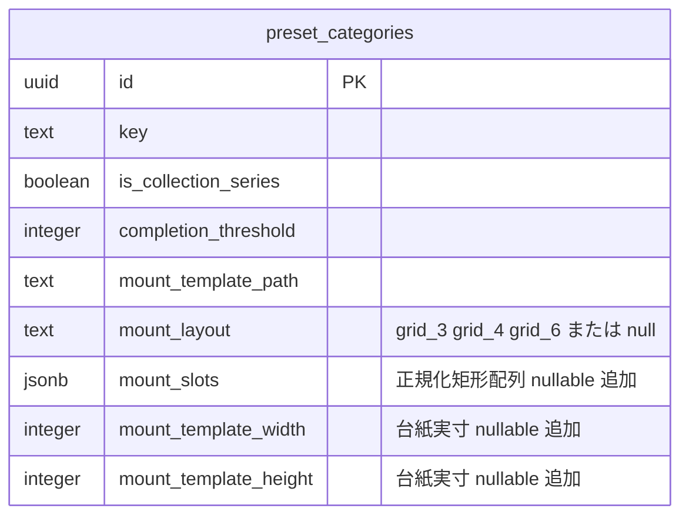
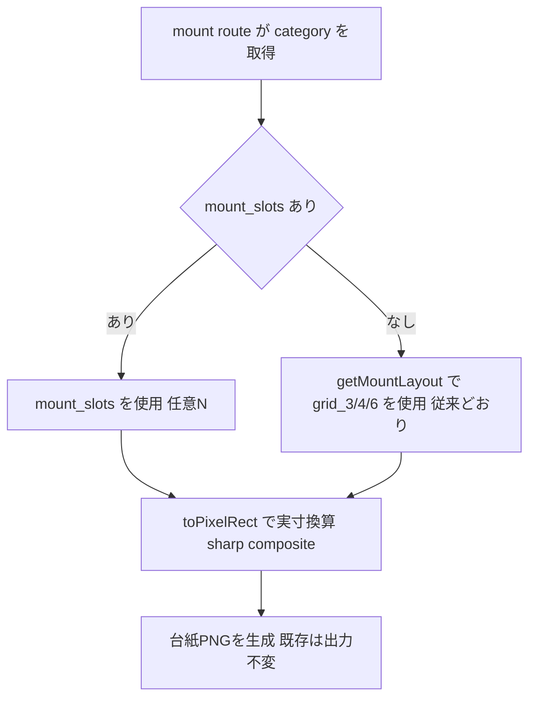
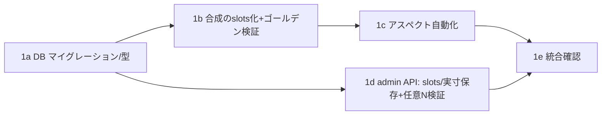

# コレクション台紙 枠（スロット）調整機能 — Phase 1（土台）実装計画

> 目的：運営が台紙をアップロードした後、枠（スロット）の位置・サイズを運営自身で調整できるようにする。本計画は **Phase 1（データ／合成／表示アスペクトの土台）** のみ。リッチなドラッグ編集UI（移動＋四隅リサイズ＋正方形/比率ロック＋合成プレビュー）は **Phase 2（別計画）**。
>
> 方針：**後方互換を最優先**。`mount_slots` が無いカテゴリは従来どおり `grid_3/4/6` プリセットで動き、既存（神コレ `collectible_wafer_sticker_god_6p`）の台紙出力は**変化しない**ことをゴールデン検証で担保する。

---

## コードベース調査結果

| 項目 | 現状 |
|---|---|
| 台紙合成（本体） | `features/collections/lib/compose-mount.ts` の `composeMount({templatePng, stickers, layout})`。`getMountLayout(layout)`→`toPixelRect(slot, W, H)`→`sharp.composite(fit:"cover")`。テンプレ実寸は sharp metadata から取得 |
| 合成の呼び出し元 | `app/api/collections/mount/route.ts`（POST）。category から `mount_template_path / mount_layout / completion_threshold / ogp_template_path / ogp_mount_placement` を取得し、`stickers`(=`resolveSelectedImages`) とともに `composeMount` を実行（L237）。OGPは別経路 `composeMountOgp(FromTemplate)` |
| スロット定義 | `features/collections/lib/mount-layouts.ts`。`MOUNT_LAYOUTS`（`grid_3/4/6` の正規化矩形）、`getMountLayout` / `slotCountForLayout` / `toPixelRect` / `isMountLayoutKey` |
| 表示アスペクト | `features/collections/lib/mount-aspects.ts`。`MOUNT_ASPECTS`（**categoryKey でハードコード**）、`DEFAULT_MOUNT_ASPECT="525 / 612"`、`mountAspectForCategory()` |
| DB | `preset_categories` に `is_collection_series / completion_threshold / mount_template_path / mount_layout(CHECK grid_3/4/6) / collection_character_path / ogp_template_path / ogp_mount_placement / collection_display_*` |
| admin 設定検証 | `app/api/admin/preset-categories/collection-settings-payload.ts`。`mount_layout` を `grid_3/4/6` で検証し、**`completion_threshold === slotCountForLayout(mount_layout)` を強制**（L193） |
| 進捗 RPC | `get_collection_progress` / `_for_user`。`completion_threshold / unique_outfit_count / is_completed / mount_status / mount_image_path` を返す（**枚数ベース**。`mount_slots` には非依存） |
| Supabase 接続 | `NEXT_PUBLIC_SUPABASE_URL`＋`SERVICE_ROLE_KEY` あり（REST 読取可）。**`SUPABASE_DB_PASSWORD`／`psql` 無し**、`supabase` CLI 2.95.4 はログイン状態不明 → **マイグレーションは作成可能だが適用は別途認証が必要（前提）** |

### スコープ
**含める（Phase 1）**
- `preset_categories.mount_slots`(jsonb 正規化矩形配列) と台紙テンプレ実寸 `mount_template_width/height`(int) の追加
- `composeMount` を「slots を受け取る」形に変更し、呼び出し元で `mount_slots ?? getMountLayout(mount_layout)` を解決
- 表示アスペクトを保存実寸から自動導出（`mount-aspects.ts` のハードコード依存を解消・フォールバックあり）
- グリッド数＝threshold＝スロット数の連動を**任意N**に対応（`mount_slots` があれば `threshold === mount_slots.length`）
- admin API（collection-settings / collection-mount-template）が `mount_slots` と台紙実寸を受け取り保存できる（**データ／API まで**）

**含めない（Phase 2 以降）**
- 枠調整エディタの UI（ドラッグ移動／四隅リサイズ／正方形・比率ロック／合成プレビュー）
- OGP 台紙（`ogp_mount_placement`）側の編集（本計画では一切触らない＝無変更）
- 運営が任意アスペクト比を「選ぶ」UI（アスペクトは台紙実寸から自動＝確定）

---

## 1. 概要図

### データモデル（追加カラム）

### 台紙合成のスロット解決フロー

---

## 2. EARS（要件定義）

- **When** an admin uploads a mount template, **the system shall** store the template image's intrinsic width and height on `preset_categories`.
  運営が台紙テンプレをアップロードしたとき、システムは台紙の実寸（幅・高さ）を `preset_categories` に保存する。
- **When** composing a completion mount, **the system shall** use `mount_slots` if present, otherwise fall back to the preset layout (`grid_3/4/6`).
  台紙合成時、システムは `mount_slots` があればそれを、無ければプリセットレイアウトを使用する。
- **Where** `mount_slots` is set, **the system shall** require `completion_threshold` to equal the number of slots.
  `mount_slots` が設定されている場合、システムは `completion_threshold` をスロット数と一致させることを要求する。
- **While** a category has stored template dimensions, **the system shall** derive the display aspect ratio from those dimensions instead of the hardcoded table.
  台紙実寸が保存されている間、システムは表示アスペクトをハードコード表ではなく実寸から導出する。
- **If** `mount_slots` is invalid (要素数不一致・範囲外0..1・矩形欠落), **then the system shall** reject the admin save with a validation error.
  `mount_slots` が不正なら、システムは admin 保存をバリデーションエラーで拒否する。
- **If** a category has neither `mount_slots` nor stored dimensions, **then the system shall** behave exactly as before (preset layout + hardcoded/default aspect).
  どちらも無いカテゴリは、従来どおり（プリセット＋ハードコード/既定アスペクト）に動作する。

---

## 3. ADR（設計判断記録）

### ADR-001: スロットを `mount_slots`(jsonb 正規化矩形) として DB に持つ
- **Context**: 現状は `mount-layouts.ts` に grid_3/4/6 の座標をハードコードしており、新台紙の枠調整にコード修正＋デプロイが必要。
- **Decision**: `preset_categories.mount_slots`(正規化 `{x,y,w,h}[]`, 0..1) を追加し、合成は「`mount_slots` 優先・無ければプリセット」とする。
- **Reason**: 正規化座標なら台紙解像度非依存（既存 `toPixelRect` がそのまま使える）。jsonb 配列で任意Nに対応。null フォールバックで完全後方互換。
- **Consequence**: Phase 2 のエディタは「この jsonb を編集するだけ」で済む。プリセットは初期テンプレ（クイックスタート）として残す。

### ADR-002: 表示アスペクトを台紙実寸から自動導出（運営は比率を選ばない）
- **Context**: `mount-aspects.ts` が categoryKey でハードコード。新台紙ごとにコード追加が必要。
- **Decision**: 台紙アップ時に画像実寸を保存し、表示アスペクト＝`width/height` から算出。`mountAspectForCategory` は DB 実寸→既存ハードコード→既定の順でフォールバック。
- **Reason**: 台紙そのものが正準なので「比率を選ぶ」より実寸追従が自然・誤設定が起きない。
- **Consequence**: アスペクト選択UIは不要。表示クロップが台紙に追従。

### ADR-003: OGP 台紙（`ogp_mount_placement`）は本計画で触らない
- **Context**: OGP は本体台紙と別の配置設定（`ogp_template_path / ogp_mount_placement`）を持つ。
- **Decision**: Phase 1 は本体台紙（`composeMount`）のみ対象。OGP 経路は無変更。
- **Reason**: 変更面を最小化し本番リスクを限定。OGP の編集対応は必要になれば別途。

---

## 4. 実装計画（フェーズ＋TODO）

### Phase 1a: DB マイグレーションと型
目的: スロット・台紙実寸を保存できる土台。既存挙動は不変。
ビルド確認: マイグレーション SQL が `supabase db diff`/レビューで妥当、型が通る。

- [ ] `supabase/migrations/<ts>_add_collection_mount_slots.sql` 新規
  - `ADD COLUMN mount_slots jsonb`（nullable）
  - `ADD COLUMN mount_template_width integer` / `mount_template_height integer`（nullable）
  - `mount_layout` の CHECK を見直し：`mount_slots` がある場合は `mount_layout` が null でも可（=任意N）。`grid_3/4/6` は引き続き許可
  - DOWN マイグレーションをコメントで用意
  - 既存（神コレ）行は `mount_slots=null` のまま＝従来動作。**任意：神コレに現行 grid_6 座標を `mount_slots` として明示投入しても良い（後の検証材料）。ただし null フォールバックで十分なので必須ではない**
- [ ] `mount-layouts.ts` の `NormalizedSlotRect` を slots の型に再利用（`mount_slots` の要素型として共有）
- [ ] 既存 RPC（`get_collection_progress*`）は **変更不要**（threshold ベース）。確認のみ
- [ ] 参考: `supabase/migrations/20260608090000_add_collection_settings_to_preset_categories.sql`

### Phase 1b: 台紙合成の slots 化（核心・ゴールデン検証必須）
目的: `composeMount` を「slots を受け取る」形にし、呼び出し元で解決。**既存出力の不変を担保**。
ビルド確認: `npm run test`（新規ゴールデンテスト含む）/ `build --webpack` 通過。

- [ ] `compose-mount.ts`: `composeMount({templatePng, stickers, slots})` に変更（`layout: MountLayoutKey` → `slots: NormalizedSlotRect[]`）。内部は `toPixelRect(slots[i], W, H)`（既存ロジックそのまま）
- [ ] `app/api/collections/mount/route.ts`: `const slots = category.mount_slots ?? getMountLayout(category.mount_layout)` を解決して渡す。`mount_layout` も `mount_slots` も無い異常系はエラー（従来通り category 不備）
- [ ] **ゴールデンテスト**（`tests/unit/features/collections/compose-mount.test.ts` 新規）:
  - `mount_slots=null` + `mount_layout="grid_6"` で解決される slots が `MOUNT_LAYOUTS.grid_6` と**完全一致**
  - 既知のテンプレ寸（1024x1608）で `toPixelRect` 結果が従来と一致（座標の数値スナップショット）
  - 可能なら小さなダミーテンプレ＋ダミーシールで `composeMount` の合成結果バッファのハッシュ/寸法が安定（重ければ座標一致のみで可）
- [ ] 参考: `compose-mount.ts` L22-48, mount route L185-237

### Phase 1c: 表示アスペクトの自動化
目的: 台紙実寸から表示アスペクトを導出し、ハードコード依存を外す（フォールバックあり）。
ビルド確認: 既存表示（神コレ）が現状と同じアスペクトで出る。

- [ ] `mount-aspects.ts`: `mountAspectForCategory` を「DB実寸(width/height) → 既存 `MOUNT_ASPECTS`(categoryKey) → `DEFAULT_MOUNT_ASPECT`」の順で解決する形へ拡張（実寸を引数で受け取れるAPIに）
  - 神コレは実寸 1024x1608 ⇒ 既存ハードコード "1024 / 1608" と一致（=無変更）
- [ ] 参照箇所を実装時に grep して置換（`mountAspectForCategory(` の利用元：`AdminCollectionsView` 他。進捗モーダル/マイページ等の object-cover コンテナ）
- [ ] アスペクトを props/データ経由で渡せるよう、進捗 RPC or 取得層に `mount_template_width/height` を含めるか検討（含めない場合は categoryKey フォールバックのままでも可＝段階導入）

### Phase 1d: admin API（slots／実寸の保存＋任意N検証）
目的: 台紙アップ時に実寸を保存し、`mount_slots` を受理・検証できる（UIはPhase 2）。
ビルド確認: 既存の collection-settings 保存が壊れない。新フィールドは任意。

- [ ] `app/api/admin/collection-mount-template`（アップロード）: 受領画像の実寸を取得（sharp metadata）して `mount_template_width/height` を保存
- [ ] `collection-settings-payload.ts`:
  - `mount_slots` を受理・検証（配列／各要素 `{x,y,w,h}` が 0..1／要素数>0）
  - threshold 連動を更新：`mount_slots` があれば `completion_threshold === mount_slots.length`、無ければ従来 `slotCountForLayout(mount_layout)`
  - `mount_layout` は `mount_slots` 指定時に省略可
- [ ] `app/api/admin/preset-categories/route.ts` 等の型に `mountSlots` / 実寸を追加
- [ ] 参考: `collection-settings-payload.ts` L86-93, L174-193

### Phase 1e: 統合確認
目的: 後方互換と新経路の両方を確認。
ビルド確認: lint / typecheck / test / build --webpack 全通過。

- [ ] 既存（神コレ）：台紙生成・進捗・表示が**現状と同一**（ゴールデン＋目視）
- [ ] 新経路（テスト用カテゴリ）：`mount_slots` を直接 DB 投入 → 台紙合成がスロットどおりに出る／threshold=N 検証が効く
- [ ] `app/(app)/admin/collections` の KPI 表示等に影響なし

---

## 5. 修正対象ファイル一覧

| ファイル | 操作 | 変更内容 |
|---|---|---|
| `supabase/migrations/<ts>_add_collection_mount_slots.sql` | 新規 | `mount_slots jsonb` / `mount_template_width,height int` 追加、`mount_layout` CHECK 緩和、DOWN |
| `features/collections/lib/compose-mount.ts` | 修正 | 引数 `layout` → `slots: NormalizedSlotRect[]` |
| `app/api/collections/mount/route.ts` | 修正 | `slots = mount_slots ?? getMountLayout(mount_layout)` を解決して渡す。category select に `mount_slots` 追加 |
| `features/collections/lib/mount-aspects.ts` | 修正 | 実寸→ハードコード→既定の順で解決するAPIへ拡張 |
| `app/api/admin/preset-categories/collection-settings-payload.ts` | 修正 | `mount_slots` 検証＋threshold連動を任意N対応 |
| `app/api/admin/preset-categories/route.ts` | 修正 | 型に `mountSlots`/実寸を追加 |
| `app/api/admin/collection-mount-template/route.ts` | 修正 | アップ画像の実寸を保存 |
| `features/collections/lib/collection-types.ts` | 修正 | `mountSlots` / 実寸の型追加 |
| `tests/unit/features/collections/compose-mount.test.ts` | 新規 | ゴールデン（slots解決・座標一致） |
| `tests/unit/features/collections/collection-settings-payload.test.ts` | 新規/修正 | mount_slots 検証・threshold連動Nのテスト |

> i18n: Phase 1 は admin API/データ中心で**ユーザー向け新規文言なし**の想定（UI＝Phase 2 で en/ja 追加）。admin 側に文言が出る場合のみ最小追加。

---

## 6. 品質・テスト観点

### 品質チェックリスト
- [ ] **後方互換**: `mount_slots=null` のカテゴリで台紙出力・アスペクト・進捗が現状不変（ゴールデンで担保）
- [ ] **データ整合性**: `mount_slots.length === completion_threshold` を API/（可能なら）CHECK で強制
- [ ] **入力検証**: `mount_slots` の各値 0..1、矩形欠落・要素数不一致を拒否
- [ ] **権限**: admin 経路は既存 `requireAdmin()` 準拠（変更なし）
- [ ] **本番安全性**: OGP 経路・進捗RPCは無変更

### テスト観点
| カテゴリ | 内容 |
|---|---|
| 正常系(既存) | 神コレ：slots解決=grid_6・座標一致・台紙出力不変 |
| 正常系(新) | mount_slots投入カテゴリ：スロットどおり合成、threshold=N |
| 異常系 | mount_slots 不正（範囲外/要素数不一致）→保存拒否 |
| 互換 | slots/実寸が無いカテゴリ→従来プリセット＋既定アスペクト |

---

## 7. ロールバック方針
- **DB**: DOWN マイグレーション用意（カラム削除）。カラムは nullable・追加のみで、残置しても既存に無害
- **合成**: `composeMount` の引数変更は呼び出し元1箇所＋テスト。問題時は当該コミットを revert（`mount_slots` カラムは残っても null フォールバックで安全）
- **段階性**: フェーズごとにコミット。1b（合成）だけ revert しても 1a（カラム）は無害に残せる
- **未適用先行**: マイグレーション適用は本番反映前に staging/ローカルで検証（DB認証が必要＝前提）

---

## 8. 使用スキル
| スキル | 用途 | フェーズ |
|---|---|---|
| `project-database-context` | DB/RLS/RPC 設計参照 | 1a |
| `codex-webpack-build` | ビルド検証 | 各フェーズ |
| `tdd` / `test-generating` | ゴールデン・検証テスト | 1b/1d |
| `git-create-branch` | ブランチ作成 | 着手時 |
| `git-create-pr` | PR 作成 | 完了時 |

---

## 前提・未確定
- マイグレーション**適用**には DB 認証（`SUPABASE_DB_PASSWORD` 等）が必要。作成のみ本計画で行い、適用は別途。
- `mount_slots.length === completion_threshold` の DB レベル CHECK（jsonb 配列長）まで強制するかは 1a で判断（最低限 API 検証は必須）。
- 表示アスペクトの実寸を進捗RPC/取得層まで通すか（1c）は、段階導入として categoryKey フォールバックのままでも可。
- **Phase 2（枠調整エディタUI）は本計画外**：ドラッグ移動＋四隅リサイズ＋正方形/比率ロック（画面px空間でロック→保存時に正規化）＋合成プレビュー＋「全枠同サイズ」一括、を別計画で。
