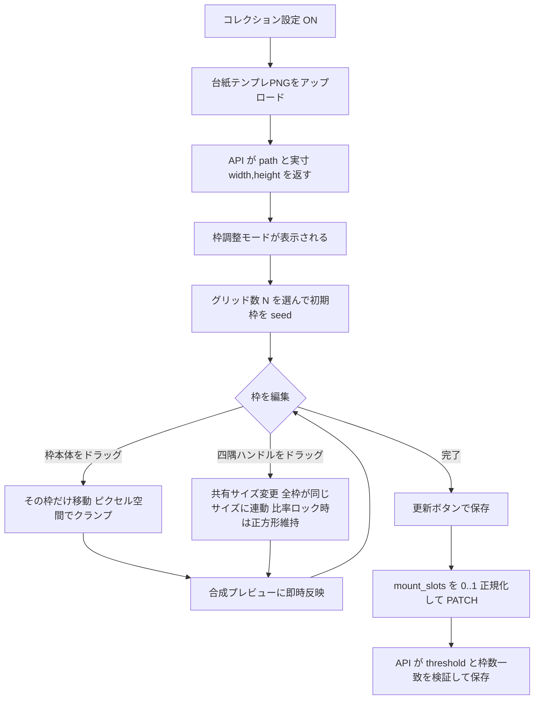
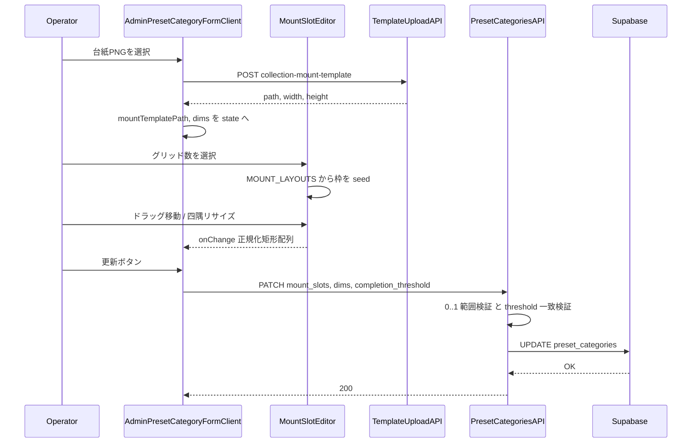
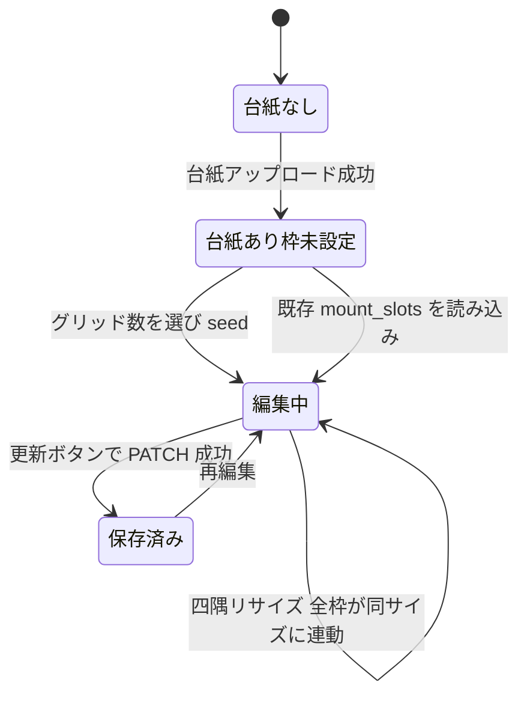
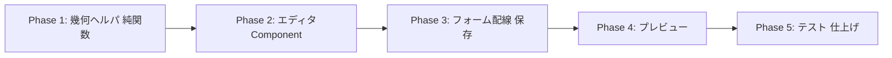

# コレクション台紙「枠(スロット)ドラッグ編集UI」 — Phase 2 実装計画

> Phase 1（DB / 合成 / admin API の土台）は完了・main マージ済み・本番 migration 適用済み。
> 本計画は **admin プリセットカテゴリ編集画面に「枠調整モード」を追加する UI フェーズ** を扱う。
> 関連: `docs/planning/collection-mount-slot-editor-implementation-plan.md`（Phase 1, ADR-001/002）。

## ゴール

運営が台紙テンプレ(空PNG)をアップロードした後、その画像を背景に **N 個のスロット矩形を
ドラッグで移動・四隅リサイズ** し、`mount_slots`(正規化矩形配列 0..1)として保存できるようにする。
これにより「枠の位置・大きさはプログラム(コード側 `MOUNT_LAYOUTS` grid_3/4/6)固定」だった制約を外し、
台紙デザインに合わせて運営が GUI で枠を微調整できる。

**編集モデル（確定）: サイズは全枠連動・位置は枠ごと自由。** 全スロットは常に **同一サイズ**
（共有 `{w,h}`）を持ち、どれか1枠の四隅をリサイズすると **全枠が同じサイズに追従** する。
一方、移動(位置 `{x,y}`)は **その枠だけ** が動く。台紙の見た目の統一感（全枠同サイズ）を保ちつつ、
配置だけ自由に置けるようにする運営の要望に基づく。

到達点: `/admin/preset-categories/[id]/edit`（およびコレクション設定を持つ create）で、
台紙アップロード → グリッド数選択で初期枠を seed → ドラッグ移動 / 四隅リサイズ（正方形・縦横比ロック可）
→ 合成プレビュー確認 → 保存で `mount_slots` を PATCH。既存の神コレ(mount_slots=NULL)は不変。

---

## コードベース調査結果

### 統合先 — `features/preset-categories/components/AdminPresetCategoryFormClient.tsx`（949行・"use client"）

| 箇所 | 行 | Phase 2 でやること |
|------|----|----|
| `FormState` 型 | 29–58 | `mountSlots: NormalizedSlotRect[] \| null` と `mountTemplateWidth/Height: number \| null` を追加 |
| `toFormState` 初期化 | 72–107 | 上記3つを `initial?.mountSlots ?? null` 等で初期化 |
| `handleTemplateUpload` | 177–206 | API が返す `{path,width,height}` の **width/height を捨てている**。これを `update()` で取り込む |
| `handleSubmit` body（create/edit 両方） | 218–284 | `mount_slots` / `mount_template_width` / `mount_template_height` を body に追加 |
| コレクション設定 fieldset | 757–918 | 台紙テンプレ `` プレビュー(876–883)の直後に「枠調整モード」セクションを挿入 |
| `mountTemplatePreviewUrl(path)` | 115–117 | 背景画像URL。`/api/admin/collection-mount-template?path=...` を流用 |

`PresetCategoryAdmin`（`preset-category-repository.ts:66`）は既に `mountSlots`(90) /
`mountTemplateWidth`(91) / `mountTemplateHeight`(92) を持つ。`mapRow`(208–213) が
`parseNormalizedSlots(row.mount_slots)` で復元済み。**ドメイン層は Phase 1 で完成しており、
フォームへの配線だけが欠けている。**

### 保存API — 変更不要（Phase 1 で完成）

- `app/api/admin/preset-categories/route.ts`(POST) / `[id]/route.ts`(PATCH) →
  `parseCollectionSettings()` → `Object.assign(payload, ...)` → repository。
- `collection-settings-payload.ts` が `mount_slots`(0..1+`SLOT_EPS=1e-6` 範囲検証, 103–135) /
  `mount_template_width`(137–146) / `mount_template_height`(149–158) を受理。
  `completion_threshold === mount_slots.length` を強制（261 付近・任意N対応）。
- repository の create(320–322) / update(384–388) も配線済み。

→ **Phase 2 は API・DB・repository を一切変更しない。フォームが正しい body を送るだけ。**

### 合成プレビュー — `composeMount` は使えない

`features/collections/lib/compose-mount.ts` の `composeMount` は **sharp 依存(server-only)**。
ブラウザでは動かない。よって「枠にサンプル画像を cover で重ねた見え方」のプレビューは
**DOM/CSS（absolute 配置 + `object-fit: cover` + overflow:hidden）で再現** する。
実合成の真値は `toPixelRect(rect, W, H)`(`mount-layouts.ts:130`, fit:"cover" と等価)であり、
DOM プレビューはこれと同じ「正規化矩形 × 表示実寸」で配置するため見た目が一致する。

### 枠データの源泉 — `features/collections/lib/mount-layouts.ts`

- `NormalizedSlotRect {x,y,w,h}`(15) / `PixelSlotRect`(23) / `toPixelRect`(130)
- `MOUNT_LAYOUTS: Record<"grid_3"|"grid_4"|"grid_6", NormalizedSlotRect[]>`(30) — 初期 seed 用
- `slotCountForLayout`(61)

### ドラッグ実装ライブラリ — `@dnd-kit` は使わない（ADR-001）

`@dnd-kit/core|sortable|utilities` は導入済みだが、用途は「離散アイテムの並べ替え D&D」。
本機能は **連続平面上の矩形を移動 + 四隅リサイズ + 縦横比ロック** であり、dnd-kit のセンサー/
衝突判定/transform モデルとは噛み合わない（リサイズハンドルは dnd-kit のプリミティブに無い）。
素の Pointer Events(`onPointerDown/Move/Up` + `setPointerCapture`)で move/resize を
ピクセル空間で実装する方が単純で正確。詳細は ADR-001。

### i18n

このフォームは admin 専用で **全面的に日本語ハードコード**（next-intl の翻訳キーを使っていない。
例: 757–916 の文言はすべて日本語リテラル）。Phase 2 の新規 UI 文言も **既存に倣い日本語リテラル**
とする（en/ja の 16 ロケールファイル追加は不要）。ユーザー(エンドユーザー)向け画面ではないため。

---

## 概要図

### ユーザー(運営)操作フロー



### 保存シーケンス



### 編集モードの状態遷移



---

## EARS（要件定義）

### 表示・初期化
- **When** the operator uploads a mount template successfully, **the system shall** capture the
  returned image `width`/`height` and reveal the slot editor with the template as background.
  運営が台紙をアップロードしたら、返却された実寸を保持し、台紙を背景にした枠エディタを表示する。
- **When** the edited category already has `mount_slots`, **the system shall** initialize the
  editor with those rectangles. 既存の `mount_slots` があればその矩形で初期化する。
- **Where** no `mount_slots` exists but a grid layout is chosen, **the system shall** seed N
  rectangles from `MOUNT_LAYOUTS`. 枠が無くグリッドを選んだ場合は `MOUNT_LAYOUTS` から N 枠を seed する。

### 編集操作
- **When** the operator drags a slot body, **the system shall** translate **only that slot** in
  pixel space, clamped within the template bounds. 枠本体ドラッグでは **その枠だけ** を台紙内にクランプして移動する。
- **When** the operator drags a corner handle of any slot, **the system shall** update the
  **shared size** so that **every slot resizes to the same size**, each keeping its own center
  fixed (so the dragged corner tracks the pointer on every corner). いずれかの枠の四隅ハンドルを
  動かすと **共有サイズ** が変わり、**全枠が同じサイズに連動** する（各枠は自分の中心を固定して追従＝
  どの角を引いてもその角がポインタに付いてくる）。
- **While** ratio-lock is enabled, **the system shall** preserve the shared pixel aspect ratio
  during resize (square stays square even on a non-square template). 比率ロック中は共有サイズの
  ピクセル縦横比を維持する（非正方形台紙でもピクセル正方形）。
- **When** the shared size grows such that a slot would exceed bounds, **the system shall** clamp
  the shared size to the largest value that keeps **all** slots inside 0..1. 共有サイズ拡大で
  どれか1枠でもはみ出す場合、**全枠が 0..1 に収まる最大サイズ** にクランプする。
- **The system shall** enforce a minimum slot size (px). 最小サイズ(px)を下回らせない。

### 保存・検証
- **When** the operator submits, **the system shall** normalize all slots to 0..1 and send
  `mount_slots`, `mount_template_width`, `mount_template_height`, and `completion_threshold`
  (= slot count). 保存時に 0..1 正規化し、枠数を threshold として送る。
- **If** the slot count does not equal `completion_threshold`, **then the system shall** block
  submission with an inline message before calling the API. 枠数と N が不一致なら送信前にエラー表示する。
- **If** the template has not been uploaded (no dims), **then the system shall** keep the editor
  disabled and fall back to the existing grid-layout select. 台紙未アップロード時はエディタを無効化し従来のレイアウト選択にフォールバックする。

### 後方互換
- **Where** the operator leaves `mount_slots` untouched, **the system shall** preserve existing
  behavior (mount_slots stays NULL, grid preset drives composition). 枠を触らなければ従来どおり NULL のまま。

---

## ADR（設計判断記録）

### ADR-001: ドラッグ/リサイズは @dnd-kit ではなく素の Pointer Events で実装する

- **Context**: リポジトリに `@dnd-kit/*` 導入済み。だが本機能は連続平面上の矩形を「移動 + 四隅
  リサイズ + 縦横比ロック」する bounding-box エディタ。
- **Decision**: `onPointerDown` + `setPointerCapture` + `onPointerMove`/`onPointerUp` で
  move/resize を **ピクセル空間** で自前実装する。dnd-kit は使わない。
- **Reason**: dnd-kit は「離散アイテムの並べ替え D&D」用でリサイズハンドルや比率ロックの
  プリミティブを持たない。transform モデルと衝突判定を回避でき、ピクセル↔正規化の数式を
  一箇所に集約できる。Pointer Events はタッチ/マウス両対応で外部依存ゼロ。
- **Consequence**: ドラッグ中の境界クランプ・最小サイズ・比率ロックの算術を自前で書く必要が
  あるが、純関数に切り出してユニットテスト可能（むしろ望ましい）。慣性/キーボード操作は範囲外。

### ADR-002: 合成プレビューは composeMount ではなく DOM/CSS で再現する

- **Context**: 真の合成 `composeMount` は sharp(server-only) でブラウザ実行不可。
- **Decision**: 台紙 `` の上に各枠を `position:absolute` + `object-fit:cover` +
  `overflow:hidden` で重ね、サンプル画像を cover 配置してプレビューする。配置率は枠の正規化矩形
  をそのまま % で適用。
- **Reason**: `composeMount` の `toPixelRect`(fit:"cover") と同じ「正規化矩形 × 実寸」で配置する
  ため、ピクセルパーフェクトではないが運営が枠位置を判断するには十分一致する。サーバー往復不要で
  ドラッグ中もリアルタイム反映できる。
- **Consequence**: 最終的な合成の厳密確認は本番の台紙生成(既存 `composeMount` 経路)で行う。
  プレビューはあくまで枠配置の目視確認用と位置づける。

### ADR-003: 編集はピクセル空間で行い、保存時にのみ正規化する

- **Context**: 「正方形を維持」は台紙が非正方形でも **画面ピクセル上の正方形** を意味する。
- **Decision**: エディタ内部状態は表示ピクセル矩形ではなく **正規化矩形(0..1)** を単一の真値
  として保持しつつ、ドラッグ算術(比率ロック・最小サイズ)は「正規化 → ピクセル換算 → 操作 →
  正規化」で行う。実寸 `mountTemplateWidth/Height` を換算係数に使う。
- **Reason**: 保存形式(0..1)と表示(任意の描画幅)を分離。描画コンテナ幅が変わっても矩形は不変。
  比率ロックだけは実寸アスペクトを使ってピクセル正方形を保証する。
- **Consequence**: 換算ヘルパ(`normalizedToPixel`/`pixelToNormalized`/`clampRect`/
  `resizeWithRatioLock`)を `mount-layouts.ts` 近傍に純関数で置き、テストする。

### ADR-004: サイズは「共有 1 値」、位置は「枠ごと」に分離して保持する

- **Context**: 全枠は常に同サイズ・位置は枠ごと自由（運営確定仕様）。`mount_slots` の保存形式は
  従来どおり `[{x,y,w,h}]`(枠ごと)。
- **Decision**: エディタの内部状態を **共有サイズ `size:{w,h}`(正規化) + 位置配列
  `positions:{x,y}[]`** に分解して持つ。保存・props 受け渡し時は `joinSlots()`
  で従来の `NormalizedSlotRect[]` に合成する。逆に既存 `mount_slots` 読み込み時は `splitSlots()` で
  **先頭枠の w,h を共有サイズの初期値** とし（全枠同値前提・差異があれば先頭に正規化）、各枠の x,y を
  positions に取る。リサイズは **中心固定**（各枠の中心を保ったまま新サイズへ）。
- **Reason**: 「1枠リサイズ → 全枠連動」を状態構造で自然に表現でき、リサイズ時に全枠ループ更新する
  命令的コードを避けられる。`mount_slots` の I/O 形式・API・DB・composeMount は一切変えずに済む。
- **Consequence**: リサイズは `size` を1回更新するだけ。ただし共有サイズ拡大時は **全 positions が
  0..1 に収まる最大値** にクランプする必要があり、その判定(`maxUniformSizeWithin(positions, ...)`)を
  純関数化してテストする。既存 mount_slots が（理論上）枠ごと別サイズだった場合は先頭サイズに揃うが、
  Phase 1 までは grid プリセット由来＝全枠同サイズのため実害なし。

---

## 実装計画（フェーズ＋TODO）

### フェーズ間の依存関係



> 各フェーズ終了時に `npm run build -- --webpack` が通ること。

### Phase 1: 幾何ヘルパ（純関数・テスト容易）
目的: ドラッグ/リサイズ/クランプ/比率ロックの算術を UI から分離。
ビルド確認: 既存利用者がいないので型のみ。lint/typecheck 緑。

- [ ] `features/collections/lib/slot-edit-geometry.ts`（新規）に純関数を追加。状態は
      **共有サイズ `size:{w,h}` + 位置 `positions:{x,y}[]`**(ADR-004)を前提:
  - [ ] `clampPositionWithin(pos, size): {x,y}` — 1枠を 0..1 内へ位置クランプ（移動用）
  - [ ] `movePosition(pos, size, dxNorm, dyNorm): {x,y}` — その枠だけ移動 + クランプ
  - [ ] `resizeSharedSize(size, corner, dxNorm, dyNorm, opts): {w,h}` — **共有サイズ** を更新。
        `opts.lockRatio` 時は実寸アスペクト(`templateW/H`)でピクセル正方形/比率維持、
        `opts.minPx` で最小サイズ(px)を下限クランプ
  - [ ] `maxUniformSizeWithin(positions, desiredSize, templateW, templateH): {w,h}` —
        全 positions を 0..1 に収める **最大共有サイズ** にクランプ（拡大時のはみ出し防止）
  - [ ] `splitSlots(slots): { size, positions }` / `joinSlots(size, positions): NormalizedSlotRect[]`
        — 既存 `mount_slots` ↔ エディタ内部状態の相互変換（先頭枠 w,h を共有サイズに採用）
  - [ ] `seedSlots(layout): NormalizedSlotRect[]` — `MOUNT_LAYOUTS` の薄いラッパ（N 変更時の再 seed 用）
- [ ] `toPixelRect`(既存) は再利用。`PixelSlotRect`/`NormalizedSlotRect` を import。

### Phase 2: 枠エディタ Component
目的: 台紙背景 + ドラッグ可能な N 枠 + 四隅ハンドル + 比率ロックトグル。
ビルド確認: 単体で import してもビルドが通る（フォーム未配線でも可）。

- [ ] `features/preset-categories/components/MountSlotEditor.tsx`（新規・"use client"）:
  - [ ] props: `{ templateUrl, templateWidth, templateHeight, slots, ratioLock, onChange }`
        （`slots: NormalizedSlotRect[]`。内部で `splitSlots` → `{size, positions}` に分解）
  - [ ] 背景 `` を実寸アスペクトで描画（`aspect-ratio` CSS）
  - [ ] 各枠を `position:absolute`（left/top を positions、width/height を **共有 size**・%）で重ねる
  - [ ] 枠本体 `onPointerDown` → **その枠だけ** move（`movePosition`）
  - [ ] 四隅 4 ハンドル `onPointerDown` → **共有サイズ** resize（`resizeSharedSize` →
        `maxUniformSizeWithin` でクランプ → **全枠の width/height が連動**）
        （`setPointerCapture`、`onPointerMove` で Phase 1 ヘルパ、`onPointerUp` で解放）
  - [ ] 変更のたび `onChange(joinSlots(size, positions))` で親へ `NormalizedSlotRect[]` を返す
  - [ ] コンテナの実描画幅は `ref` + `getBoundingClientRect()` で取得しピクセル換算に使用
  - [ ] 比率ロック(正方形維持) ON/OFF トグル、共有サイズ(w/h %)と各枠位置(x/y %)の数値表示

### Phase 3: フォーム配線と保存
目的: アップロード実寸の取り込み・エディタ表示・PATCH body 拡張。
ビルド確認: edit 画面で枠を動かして更新 → 再読込で保持。

- [ ] `FormState`(29–58) に `mountSlots` / `mountTemplateWidth` / `mountTemplateHeight` を追加
- [ ] `toFormState`(72–107) で `initial?.mountSlots ?? null` 等を初期化
- [ ] `handleTemplateUpload`(177–206) のレスポンス型に `width?/height?` を足し、成功時に
      `update("mountTemplateWidth", ...)` / `update("mountTemplateHeight", ...)` を実行
- [ ] コレクション fieldset（台紙 `` プレビュー 876–883 の直後）に:
  - [ ] グリッド数選択(既存 `mountLayout` select)変更時に「枠を seed し直す」導線
        （`seedSlotsForLayout` + `completionThreshold` を枠数へ同期）
  - [ ] `mountTemplatePath` と dims が揃った時のみ `<MountSlotEditor>` を描画。
        未アップロード時は従来の grid 選択にフォールバック（後方互換）
- [ ] `handleSubmit` body（create 220–252 / edit 253–284 の両方）に追加:
  - [ ] `mount_slots: form.mountSlots`（未編集 = null のまま送らない or null 送出で従来動作）
  - [ ] `mount_template_width: form.mountTemplateWidth`
  - [ ] `mount_template_height: form.mountTemplateHeight`
  - [ ] `completion_threshold` を `mountSlots` があれば枠数に同期
- [ ] 送信前バリデーション: `mountSlots` があり `mountSlots.length !== completionThreshold`
      なら `setError(...)` して中断（API 検証の先回り・UX 向上）

### Phase 4: 合成プレビュー（ADR-002）
目的: 枠にサンプル画像を cover で重ねた見えを即時表示。
ビルド確認: ドラッグに追従してプレビューが動く。

- [ ] エディタ内 or 隣接に「プレビュー」トグル。各枠に固定サンプル画像（または現在のキャラ画像）を
      `object-fit:cover` + `overflow:hidden` で配置、`composeMount` と同じ正規化矩形で % 配置
- [ ] 空データ/未アップロード時はプレビューを出さない

### Phase 5: テストと仕上げ
目的: 幾何ヘルパのユニットテスト・回帰確認。
ビルド確認: lint / typecheck / test / build すべて緑。

- [ ] `tests/unit/features/collections/slot-edit-geometry.test.ts`（新規）
- [ ] 既存 `mount-layouts.test.ts` / `collection-settings-payload.test.ts` の無回帰確認
- [ ] 既存 admin フォーム（コレクション以外）の無回帰目視
- [ ] 4 検証コマンドを通す

---

## 修正対象ファイル一覧

| ファイル | 操作 | 変更内容 |
|----------|------|----------|
| features/collections/lib/slot-edit-geometry.ts | 新規 | move/resize/clamp/ratio-lock/seed 純関数 |
| features/preset-categories/components/MountSlotEditor.tsx | 新規 | 枠ドラッグ/リサイズ/プレビュー Component |
| features/preset-categories/components/AdminPresetCategoryFormClient.tsx | 修正 | FormState/toFormState 拡張、アップロード実寸取込、エディタ配線、submit body 拡張、送信前検証 |
| tests/unit/features/collections/slot-edit-geometry.test.ts | 新規 | 幾何ヘルパのユニットテスト |
| app/api/admin/preset-categories/collection-settings-payload.ts | 変更なし | Phase 1 で mount_slots/dims/任意N を受理済み |
| app/api/admin/preset-categories/route.ts, [id]/route.ts | 変更なし | Phase 1 で配線済み |
| features/style-presets/lib/preset-category-repository.ts | 変更なし | mountSlots/dims 配線済み |
| supabase/migrations/* | 変更なし | DB 変更なし |
| messages/ja.ts, en.ts ほか | 変更なし | admin フォームは日本語リテラル運用（i18n 追加不要） |

---

## 品質・テスト観点

### 品質チェックリスト
- [ ] **エラーハンドリング**: アップロード失敗時の既存挙動を壊さない。送信前に枠数⁄N 不一致を検出
- [ ] **権限制御**: API は `requireAdmin`、ページは layout ガード（既存・変更なし）
- [ ] **データ整合性**: 保存は 0..1 正規化 + `SLOT_EPS` 内。`threshold === slots.length` を UI/API 二重で担保
- [ ] **後方互換**: 枠未編集なら `mount_slots` は NULL のまま、神コレ等は不変
- [ ] **i18n**: admin 専用日本語リテラル運用に一致（追加なし）

### テスト観点
| カテゴリ | テスト内容 |
|----------|-----------|
| 正常系 | move はその枠のみ移動、resize は共有サイズ変更で全枠が同サイズに連動。比率ロックで正方形維持（非正方形台紙でも） |
| 境界 | `maxUniformSizeWithin` が全枠を 0..1 に収める最大共有サイズへクランプ、最小サイズ下限、x+w/y+h が 1 を超えない |
| 連動 | `splitSlots`/`joinSlots` の往復が同値、リサイズ後に全枠の w,h が一致 |
| 異常系 | 枠数 ≠ N で送信ブロック、台紙未アップロードでエディタ無効 |
| 無回帰 | grid_3/4/6 の seed が `MOUNT_LAYOUTS` と一致、既存 mount-layouts テスト緑 |
| 実機 | edit 画面で枠移動 → 更新 → 再読込で保持、本番台紙生成で合成確認 |

recharts 等を含まない純関数中心のため、RTL ではなく **幾何ヘルパのユニットテスト** に注力
（リポジトリの既存カバレッジ方針＝純関数優先に一致）。

---

## 検証（順番に全てパス）

```
npm run lint
npm run typecheck
npm run test
npm run build -- --webpack
```

`--webpack` 必須（`codex-webpack-build` スキル: サンドボックスで Turbopack ビルドが stall しうる）。

手動E2E（任意・dev サーバ）: コレクション設定 ON → 台紙PNGアップロード → 枠エディタ表示 →
グリッド数で seed → ドラッグ移動/四隅リサイズ（比率ロック ON で正方形維持を確認）→ プレビュー追従 →
更新 → 再読込で枠保持 → 既存の神コレ(mount_slots=NULL)が無回帰。

---

## リスク / ロールバック

低〜中。DB/API/repository は不変（Phase 1 完了済み）で、変更は admin フォーム + 新規 2 ファイルに
閉じる。最大の不確実性はポインタ算術（クランプ/比率ロック）だが純関数化してテストで担保する。

- **Git**: フェーズごとにコミットし revert 可能に。
- **部分ロールバック**: `MountSlotEditor` を非表示にすれば従来の grid 選択にフォールバックする
  （`mountTemplatePath` と dims が揃った時のみ描画する条件分岐で制御）。
- **機能フラグ不要**: admin 限定・追加的。必要なら描画条件 1 行のコメントアウトで無効化できる。

> 注: グローバル gitignore が `*.md` を無視するため、本計画書のコミットには `git add -f` が必要
> （[[global-gitignore-md-files]]）。**ただし本計画はユーザー承認まではコミットしない。**

---

## 使用スキル

| スキル | 用途 | フェーズ |
|--------|------|----------|
| `/test-generate` | 幾何ヘルパのテスト生成 | Phase 5 |
| `/git-create-branch` 相当 | （本ブランチ継続 or 新規） | 実装開始時 |
| `/git-create-pr` | PR 作成 | 実装完了時 |
| `/resolve-gemini-review` | Gemini/Codecov 対応 | PR 後 |
