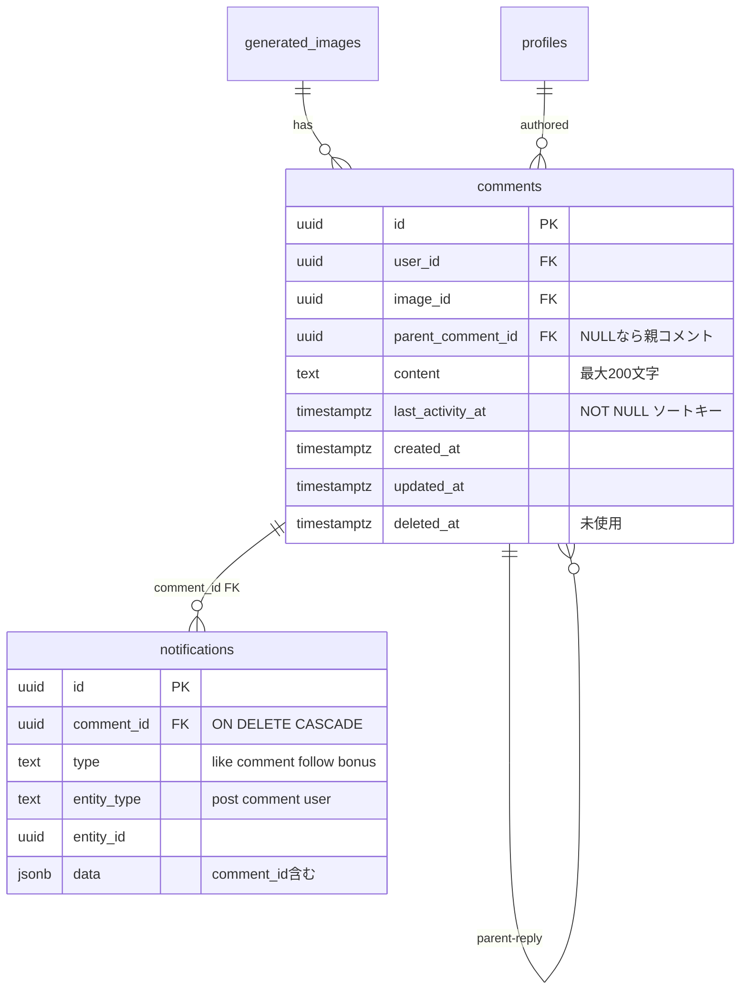
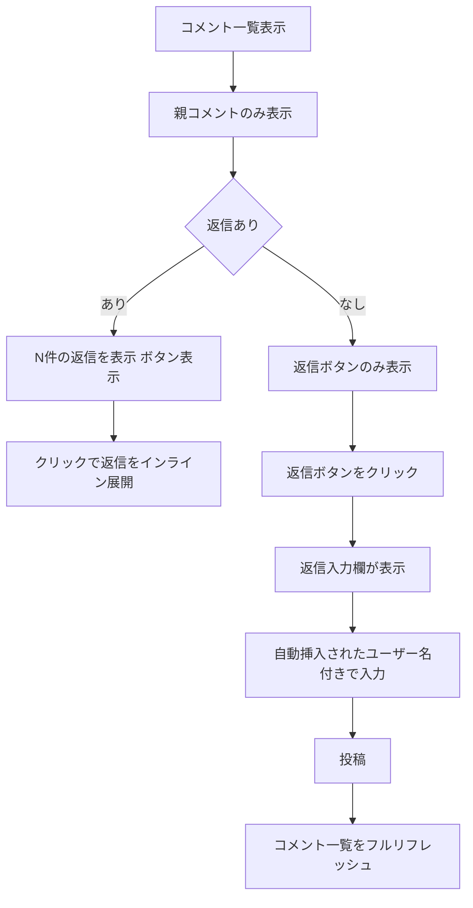
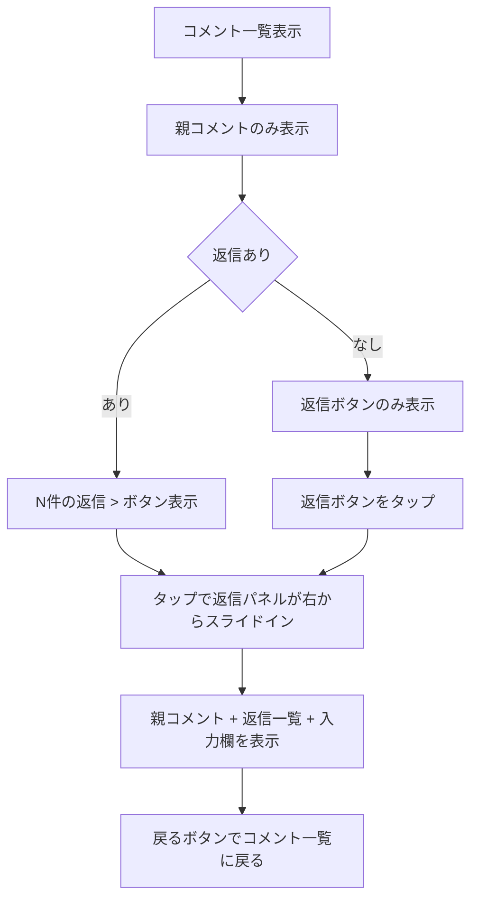
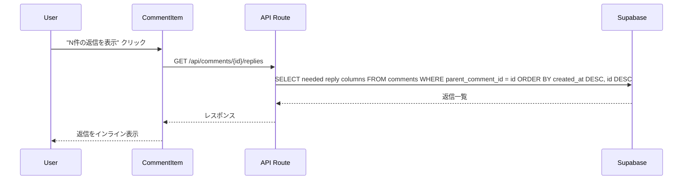
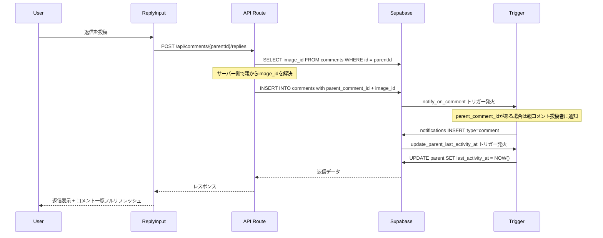
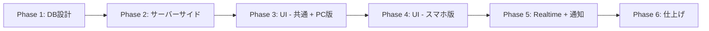

# コメントリプライ（返信）機能 実装計画

## コードベース調査結果

### 既存コメント機能の構成

| レイヤー | ファイル | 役割 |
|----------|---------|------|
| DB | `supabase/migrations/20250109000006_likes_comments.sql` | commentsテーブル定義、RLS、インデックス |
| DB | `supabase/migrations/20251213013611_notifications.sql` | `notify_on_comment()` トリガー、`create_notification()` 関数 |
| DB | `supabase/migrations/20251214185550_notifications_physical_delete.sql` | 物理削除時の通知連動トリガー、UPSERT化 |
| DB | `supabase/migrations/20251215150320_notifications_comment_per_notification.sql` | `notifications.comment_id` カラム追加、コメントごとに個別通知作成 |
| Server API | `features/posts/lib/server-api.ts` (L924-970) | getCommentCount, getCommentCountsBatch |
| Server API | `features/posts/lib/server-api.ts` (L988-1270) | getComments, createComment, updateComment, deleteComment |
| API Route | `app/api/posts/[id]/comments/route.ts` | GET/POST |
| API Route | `app/api/comments/[id]/route.ts` | PUT/DELETE |
| Client API | `features/posts/lib/api.ts` (L198-376) | フロントエンド用API関数群 |
| UI | `features/posts/components/CommentSection.tsx` | コメント全体のコンテナ |
| UI | `features/posts/components/CommentList.tsx` | 無限スクロール + Realtime購読 |
| UI | `features/posts/components/CommentItem.tsx` | 個別コメント表示 + 編集/削除 |
| UI | `features/posts/components/CommentInput.tsx` | コメント入力フォーム |
| UI | `features/posts/components/CommentSection.tsx` | CommentInput + CommentList のコンテナ（プロダクション使用） |
| UI | `features/posts/components/PostDetail.tsx` (L44, L261) | commentCount 状態管理（**テスト専用、プロダクション未使用** — プロダクションは `PostDetailStatic` + `CommentSection` 経由） |
| 通知型定義 | `features/notifications/types.ts` | `NotificationType = 'like' \| 'comment' \| 'follow' \| 'bonus'` |
| 通知表示 | `features/notifications/lib/presentation.ts` | 通知種別ごとの表示文言生成 |
| i18n | `messages/ja.ts`, `messages/en.ts` | `posts` 名前空間にコメント関連キー |

### 既存パターンの特徴

- **データアクセス**: シンプルCRUDはroute handler経由、session clientでRLS適用
- **RLS制約（comments）**: 現行の public SELECT は `deleted_at IS NULL OR auth.uid() = user_id`。トゥームストーン化した親コメントは、現状のままでは他ユーザーに返せない
- **RLS制約（notifications）**: DELETE は受信者本人のみ許可。コメント投稿者が投稿者宛の元コメント通知をアプリ層から直接削除することはできない
- **ソート**: `created_at DESC, id DESC`
- **ページネーション**: offset-based、20件ずつ
- **Realtime**: Supabaseチャネル購読（`comments:${imageId}`）、INSERT/UPDATE/DELETEをハンドリング
- **バリデーション**: クライアント + APIルート + server-api の3層で実施
- **サニタイズ**: `sanitizeProfileText()` / `validateProfileText()`
- **通知**: PostgresトリガーでINSERT時に自動作成。`type` カラムのCHECK制約は `'like', 'comment', 'follow', 'bonus'` のみ許可
- **通知削除**: `notifications.comment_id` による `ON DELETE CASCADE` で、コメント物理削除時に通知も自動削除
- **コメント数**: `getCommentCount()` / `getCommentCountsBatch()` は `parent_comment_id` フィルタなしで全件カウント
- **削除方式**: コード上は物理DELETE（`supabase.from("comments").delete()`）。`deleted_at` カラムは存在するが未使用
- **管理クライアントの前例**: `features/posts/lib/server-api.ts` では既に `createAdminClient()` を use cache 系の読み取りで利用しており、サーバー側で可視性を再適用するパターンがある
- **UIライブラリ**: shadcn/ui（Radix UI）、Tailwind CSS、Lucide Reactアイコン
- **レスポンシブ**: モバイルファースト、`sm:` / `md:` / `lg:` ブレークポイント
- **通知UIの現状**: `NotificationList.tsx` の画像プレビューは `entity_type === 'post'` の時しか描画されない

### 影響を受ける既存ファイル

- `CommentItem.tsx` — 返信ボタン、返信数表示、PC版インライン返信展開を追加
- `CommentList.tsx` — 親コメントのみ取得するようフィルタ変更、Realtimeで返信INSERT/DELETE受信時にフルリフレッシュ
- `server-api.ts` — getComments修正、getCommentCount/getCommentCountsBatch修正、getReplies / createReply追加
- `api.ts` — クライアントAPI関数追加
- `CommentSection.tsx` — プロダクションのコメント描画コンテナ（CommentList への新プロパティ受け渡し）
- **注意**: `PostDetail.tsx` はテスト専用コンポーネント。プロダクションは `PostDetailContent` → `PostDetailStatic` + `CommentSection` で描画される。コメント数の表示は `PostActions` → `CommentCount` が `initialCommentCount`（サーバー取得値）を静的表示しており、リアルタイム更新は現状ない（返信機能スコープ外）
- `messages/ja.ts`, `messages/en.ts` — 翻訳キー追加
- 通知トリガー（`notify_on_comment()`）— 返信INSERT時の動作を分岐
- `features/notifications/lib/presentation.ts` — 返信通知の表示文言追加
- `features/notifications/lib/server-api.ts` — `entity_type='comment'` の通知に対する投稿情報補完を追加
- `features/notifications/hooks/useNotifications.ts` — `entity_type='comment'` の通知クリック時の遷移処理を追加
- `features/notifications/components/NotificationList.tsx` — `entity_type='comment'` 通知でもサムネイルを描画できるよう表示条件を修正

### UIコンポーネント不足

- **Sheet/Drawer コンポーネントなし**: スマホ版の右スライドパネルに必要。shadcn/ui の Sheet コンポーネントを追加する

---

## 1. 概要図

### データモデル

### ユーザー操作フロー（PC版）

### ユーザー操作フロー（スマホ版）

### API通信シーケンス（返信取得）

### API通信シーケンス（返信投稿）

---

## 2. EARS（要件定義）

### コメント返信の作成

| # | Type | Spec (EN) | Spec (JA) |
|---|------|-----------|-----------|
| R-01 | Event | When an authenticated user clicks the "Reply" button on a comment, the system shall display a reply input field with `@{username}` pre-filled | 認証済みユーザーがコメントの「返信」ボタンをクリックした時、システムは `@ユーザー名` が自動挿入された返信入力欄を表示する |
| R-02 | Event | When a user submits a reply, the server shall resolve `image_id` from the parent comment and create a comment with `parent_comment_id` set to the parent comment's ID | ユーザーが返信を投稿した時、サーバーは親コメントから `image_id` を解決し、`parent_comment_id` に親コメントIDをセットしたコメントを作成する |
| R-03 | Event | When a reply is created, the system shall update the parent comment's `last_activity_at` to `NOW()` via DB trigger | 返信が作成された時、システムはDBトリガーで親コメントの `last_activity_at` を `NOW()` に更新する |
| R-04 | Event | When a reply is created, the system shall send a `type='comment'` notification to the parent comment's author with `entity_type='comment'` and `entity_id=parent_comment_id` | 返信が作成された時、システムは親コメントの投稿者に `type='comment'`, `entity_type='comment'`, `entity_id=親コメントID` の通知を送信する |
| R-05 | State | While the user is not authenticated, the system shall show the auth modal when the reply button is tapped | ユーザーが未認証の状態で返信ボタンをタップした場合、システムは認証モーダルを表示する |
| R-06 | Abnormal | If the reply content exceeds 200 characters, the system shall prevent submission and show an error | 返信内容が200文字を超えた場合、システムは投稿を防止しエラーを表示する |

### コメント返信の表示

| # | Type | Spec (EN) | Spec (JA) |
|---|------|-----------|-----------|
| R-10 | State | While viewing the comment list, the system shall display only parent comments (where `parent_comment_id IS NULL`) | コメント一覧表示中、システムは親コメント（`parent_comment_id IS NULL`）のみを表示する |
| R-11 | Event | When a parent comment has replies, the system shall show a "N replies" button below it | 親コメントに返信がある場合、システムはその下に「N件の返信」ボタンを表示する |
| R-12 | Event | (PC) When the user clicks "Show N replies", the system shall expand and display replies inline below the parent comment | (PC) ユーザーが「N件の返信を表示」をクリックした時、システムは親コメントの下にインラインで返信を展開表示する |
| R-13 | Event | (Mobile) When the user taps "N replies >", the system shall slide in a reply panel from the right showing the parent comment and its replies | (スマホ) ユーザーが「N件の返信 >」をタップした時、システムは右からスライドインするパネルで親コメントと返信一覧を表示する |
| R-14 | State | While viewing replies, the system shall sort them by `created_at DESC` (newest first) | 返信表示中、システムは `created_at DESC`（最新順）でソートする |
| R-15 | State | While returning a logically-deleted parent comment to non-owners, the system shall expose only a redacted payload that contains placeholder text and no original author/profile content | 論理削除された親コメントを非投稿者へ返す時、システムはプレースホルダ文言のみを含む redacted payload を返し、元の本文や投稿者プロフィール情報を露出しない |

### コメント一覧のソート

| # | Type | Spec (EN) | Spec (JA) |
|---|------|-----------|-----------|
| R-20 | State | While viewing the comment list, the system shall sort parent comments by `last_activity_at DESC, id DESC` | コメント一覧表示中、システムは親コメントを `last_activity_at DESC, id DESC` でソートする |
| R-21 | Event | When a reply is added to or deleted from a comment, the system shall full-refresh the comment list from offset 0 to reflect the updated sort order and reply counts | コメントに返信が追加/削除された時、システムはコメント一覧をoffset 0からフルリフレッシュしてソート順と返信数を反映する |

### コメント数

| # | Type | Spec (EN) | Spec (JA) |
|---|------|-----------|-----------|
| R-25 | State | While displaying comment count (on post cards and post detail), the system shall count only parent comments (`parent_comment_id IS NULL`), excluding replies and logically-deleted (tombstoned) comments (`deleted_at IS NOT NULL`) | コメント数表示時（投稿カードおよび投稿詳細）、システムは親コメント（`parent_comment_id IS NULL`）のみをカウントし、返信および論理削除（トゥームストーン化）されたコメント（`deleted_at IS NOT NULL`）を除外する |

### 返信の編集・削除

| # | Type | Spec (EN) | Spec (JA) |
|---|------|-----------|-----------|
| R-30 | Event | When the reply owner edits their reply, the system shall update the content following the same validation rules as comments | 返信の投稿者が返信を編集した時、システムはコメントと同じバリデーションルールで内容を更新する |
| R-31 | Event | When the reply owner deletes their reply, the system shall physically delete the reply | 返信の投稿者が返信を削除した時、システムは返信を物理削除する |
| R-32 | Event | When a reply is deleted, the system shall set the parent's `last_activity_at` to `GREATEST(parent.created_at, max(remaining_replies.created_at))` via DB trigger. If no replies remain, `last_activity_at` reverts to `parent.created_at` | 返信が削除された時、システムはDBトリガーで親コメントの `last_activity_at` を `GREATEST(親.created_at, 残返信の最新created_at)` に更新する。返信がなくなった場合は親の `created_at` に戻す |
| R-33 | Event | When a parent comment owner deletes a comment that has **no replies** (`reply_count = 0`), the system shall physically delete the comment, cascading deletion to its associated notification(s) via DB `ON DELETE CASCADE` | 親コメントの投稿者がリプライのない（`reply_count = 0`）コメントを削除した時、システムはコメントを物理削除し、DBの `ON DELETE CASCADE` によって関連通知も連鎖削除する |
| R-34 | Event | When a parent comment owner deletes a comment that has **one or more replies** (`reply_count > 0`), the system shall logically delete the comment by setting `deleted_at = NOW()`, keep all existing replies intact, and explicitly delete the original `type='comment'` notification(s) that were created when the comment was posted | 親コメントの投稿者がリプライのある（`reply_count > 0`）コメントを削除した時、システムは `deleted_at = NOW()` をセットして論理削除し、既存のリプライは全て保持し、そのコメント投稿時に作成された `type='comment'` 通知を明示的に削除する |
| R-35 | State | While displaying a logically-deleted (tombstoned) parent comment, the system shall render a placeholder ("このコメントは削除されました" / "This comment has been deleted"), hide the author avatar and username, hide the edit/delete/reply action buttons, and continue to show the reply count toggle and the reply thread | 論理削除（トゥームストーン化）された親コメントの表示中、システムはプレースホルダ（「このコメントは削除されました」）を描画し、投稿者のアバターとユーザー名を伏せ、編集・削除・返信ボタンを非表示にし、返信件数トグルと返信スレッドは引き続き表示する |
| R-36 | Abnormal | If a client attempts to edit or re-delete a logically-deleted comment, the server shall reject the request | 論理削除済みコメントへの編集・再削除リクエストをサーバーは拒否する |
| R-37 | Event | When all replies under a logically-deleted parent comment are subsequently deleted (either individually by their authors or due to other cascade paths), the tombstoned parent comment shall remain as a tombstone — it shall not be auto-promoted to physical deletion | 論理削除済みの親コメント配下の全リプライが後から削除された場合でも、トゥームストーン化された親コメントはそのまま維持され、自動的に物理削除には昇格しない |
| R-38 | Event | When a parent comment is physically deleted (via R-33 path only), all its replies and associated notifications shall be cascade-deleted by the DB. Logical deletion (R-34) shall never trigger cascade because the row is not DELETEed | 親コメントが（R-33 の経路でのみ）物理削除された時、全てのリプライと関連通知はDBのカスケード削除で自動削除される。論理削除（R-34）は行がDELETEされないため、カスケードは発生しない |

### リアルタイム更新

| # | Type | Spec (EN) | Spec (JA) |
|---|------|-----------|-----------|
| R-40 | Event | When another user adds or deletes a reply, the system shall update the reply count in real-time via Supabase Realtime Broadcast | 他のユーザーが返信を追加または削除した時、システムはSupabase Realtime Broadcast を通じてリアルタイムで返信数を更新する |
| R-41 | Event | When viewing expanded replies and another user adds or deletes a reply, the system shall full-refresh the reply list to maintain correct sort order | 展開中の返信を表示中に他のユーザーが返信を追加または削除した時、システムは正しいソート順を維持するため返信リストをフルリフレッシュする |

---

## 3. ADR（設計判断記録）

### ADR-001: 返信を別テーブルではなく同一テーブルで管理

- **Context**: 返信データの保存先として、新規テーブル（replies）か既存テーブル（comments）への自己参照かを選択する必要がある
- **Decision**: 既存の `comments` テーブルに `parent_comment_id` カラムを追加し、自己参照で2階層を実現する
- **Reason**: 返信とコメントは同じスキーマ（content, user_id, image_id等）を持ち、バリデーション・サニタイズ・RLS・編集/削除のロジックが完全に共通。別テーブルにすると重複コードが増える
- **Consequence**: 既存のRLSポリシーがそのまま返信にも適用される。クエリ時に `parent_comment_id IS NULL` でフィルタが必要。**既存の `notify_on_comment` トリガーと `getCommentCount` が返信も対象にしてしまうため、それぞれ修正が必要**

### ADR-002: last_activity_at 専用カラムによるソート最適化

- **Context**: 「返信がついた親コメントをリスト上部に移動する」要件を実現する必要がある
- **Decision**: `comments` テーブルに `last_activity_at TIMESTAMPTZ NOT NULL DEFAULT now()` カラムを追加する。親コメント作成時は `created_at` と同値で初期化し、返信追加時は最新返信時刻に、返信削除時は `GREATEST(created_at, 残返信の最新created_at)` に更新する。ソートは `.order("last_activity_at", { ascending: false }).order("id", { ascending: false })` で行う
- **Reason**: (1) `COALESCE(last_reply_at, created_at)` は Supabase JS の `.order()` では直接使えず RPC が必要になる。`last_activity_at` 単一カラムなら `.order()` で素直に書ける。(2) NOT NULL かつ常に値が入っているため、NULLハンドリングが不要。(3) 通常のカラムインデックスで対応でき、式インデックスが不要
- **Consequence**: データの整合性をトリガーで維持する必要がある。返信作成時と削除時にトリガーが発火する

### ADR-003: last_activity_at の更新をトリガーで実装

- **Context**: `last_activity_at` の更新方法として、アプリケーション層とDB層の選択肢がある
- **Decision**: PostgreSQLトリガーで自動更新する
- **Reason**: 既存プロジェクトのパターン（`update_updated_at_column`、`notify_on_comment`）に従い、データ整合性をDB層で保証する。アプリケーション層での更新忘れを防ぐ
- **Consequence**: マイグレーションが少し複雑になるが、どのクライアントから操作しても整合性が保たれる

### ADR-004: スマホ版の返信パネルにshadcn/ui Sheetを採用

- **Context**: スマホ版で「右からスライドイン」するパネルUIの実装方法を選択する必要がある
- **Decision**: shadcn/ui の Sheet コンポーネント（Radix Dialog ベース）を `side="right"` で使用する
- **Reason**: 既存のUIライブラリ（Radix UI）と統一。アクセシビリティ（フォーカストラップ、ESCで閉じる等）が組み込み済み
- **Consequence**: Sheet コンポーネントの追加インストールが必要（`npx shadcn@latest add sheet`）

### ADR-005: @メンションは単純テキストとして実装

- **Context**: 返信時の `@ユーザー名` をリッチなメンション（リンク/通知）として実装するか、単純テキストにするか
- **Decision**: 単純テキストとして返信入力欄の冒頭に自動挿入する
- **Reason**: 現時点ではメンション通知機能は不要。YouTubeと同様にテキスト表現で十分。将来的にメンション機能を追加する場合は別機能として切り出せる
- **Consequence**: メンションのパース・リンク化は不要。入力欄の初期値に `@ユーザー名 ` を設定するだけ

### ADR-006: 返信通知は既存の type='comment' を再利用する（reply型を新設しない）

- **Context**: 返信通知を新しい `type='reply'` として追加するか、既存の `type='comment'` に寄せるかを選択する必要がある
- **Decision**: 既存の `type='comment'` + `entity_type='comment'`（親コメントを指す）で返信通知を表現する。通常のコメント通知は `entity_type='post'`（投稿を指す）なので区別可能
- **Reason**: `notifications.type` カラムのCHECK制約（`'like', 'comment', 'follow', 'bonus'`）を変更不要。`NotificationType` 型、`notification_preferences` のカラム（`comment_enabled`）、`presentation.ts` の表示ロジックの拡張が最小限で済む
- **Consequence**: `presentation.ts` で `entity_type === 'comment'` の場合の表示文言を追加する必要がある。通知設定はコメントと返信で共通の `comment_enabled` で制御される

### ADR-007: notify_on_comment トリガーを修正して返信を分岐する（別トリガーを追加しない）

- **Context**: 返信INSERT時に、既存の `notify_on_comment` トリガーが投稿者への通知を発火してしまう。別途 `notify_on_reply` トリガーを追加すると二重通知になる
- **Decision**: 既存の `notify_on_comment()` 関数を修正し、`parent_comment_id` の有無で分岐する。親コメント（`parent_comment_id IS NULL`）なら投稿者に通知、返信（`parent_comment_id IS NOT NULL`）なら親コメントの投稿者に通知
- **Reason**: 二重通知を防止し、トリガーを1つに統合することで保守性を維持する
- **Consequence**: 既存のマイグレーションの関数を `CREATE OR REPLACE` で上書きする

### ADR-008: コメント数はトップレベルのみカウントする

- **Context**: `comment_count` に返信を含めるか含めないかを決める必要がある
- **Decision**: 含めない。トップレベルコメント（`parent_comment_id IS NULL`）のみカウントする
- **Reason**: YouTubeと同じ仕様。返信数は各コメントの下に別途表示される
- **Consequence**: `getCommentCount()` と `getCommentCountsBatch()` に `parent_comment_id IS NULL` フィルタを追加する必要がある

### ADR-009: image_id はサーバー側で親コメントから解決し、DB制約で親子整合性を保証する

- **Context**: 返信作成時の `image_id` をクライアントから受け取るか、サーバー側で解決するかを選択する必要がある。また、現行の comments INSERT RLS ポリシーは `auth.uid() = user_id` のみで、`parent_comment_id` の妥当性（同一 `image_id` のトップレベルコメントか）はDB側で保証されない
- **Decision**: 2段構えで保護する。(1) サーバー側で親コメントの `image_id` を取得して使用し、`parent_comment_id IS NULL` であることも検証する。(2) DB側にトリガーまたはCHECK制約を追加し、`parent_comment_id` が非NULLの場合に「親が同一 `image_id` のトップレベルコメントである」ことを保証する
- **Reason**: サーバーAPIのバリデーションだけでは、直接DBアクセス（Supabase Client等）に対して無防備。DB層でも整合性を強制することで、どの経路からの操作でも安全性を担保する
- **Consequence**: `createReply()` のシグネチャから `imageId` パラメータを削除。マイグレーションに `validate_parent_comment()` トリガーを追加し、返信INSERT時に親コメントの妥当性をDB層で検証する

### ADR-010: 返信通知クリック時は親コメントの投稿詳細ページに遷移する

- **Context**: 返信通知は `entity_type='comment'`, `entity_id=親コメントID` で保存される。現行の通知遷移ロジック（`useNotifications.ts` L451-455）は `entity_type='post'` と `entity_type='user'` しか対応しておらず、`entity_type='comment'` の遷移先がない。また通知API（`server-api.ts` L69）は `entity_type='post'` の通知にのみ投稿サムネイルを補完する
- **Decision**: (1) 通知API側で `entity_type='comment'` の通知に対し、親コメントの `image_id` を取得して投稿情報（サムネイル等）を補完する。(2) 遷移ロジックで `entity_type='comment'` の場合、通知の `data.image_id` を使って `/posts/{image_id}` に遷移する
- **Reason**: 返信通知をクリックしても何も起きないのはUXとして不適切。投稿詳細ページに遷移し、該当コメントのスレッドを確認できるようにする
- **Consequence**: `features/notifications/lib/server-api.ts` と `features/notifications/hooks/useNotifications.ts` の修正が必要

### ADR-011: ソート変更に伴いコメント一覧はフルリフレッシュ方式にし、reply INSERT/DELETE は Broadcast で配信する

- **Context**: `last_activity_at DESC` ソートでは、返信追加・削除のたびに親コメントの位置が変わるため、offset-based ページネーションでは重複・取りこぼしが発生する
- **Decision**: 返信の追加/削除・Realtimeイベント受信時はコメント一覧をoffset 0からフルリフレッシュする。ReplyList も INSERT/DELETE 時にフルリフレッシュする。reply INSERT/DELETE の通知は、`postgres_changes` ではなく DB trigger から Supabase Realtime Broadcast で `image_id` / `parent_comment_id` を明示的に送る。無限スクロールでの追加読み込みは引き続きoffset-basedで行う
- **Reason**: 既存のCommentListもRealtimeイベント受信時に `loadComments(0, true)` でフルリフレッシュしており、同じパターンを踏襲する。RLS 有効下では DELETE の `postgres_changes` ペイロードに親子判定用の列を安全に含められないため、reply DELETE を確実にルーティングするには Broadcast で必要な識別子を送る方が堅実。cursor-basedへの移行は将来の最適化として切り出す
- **Consequence**: 返信が頻繁に追加/削除される場合にコメント一覧が全件再取得されるが、既存の動作と一貫性がある。reply lifecycle 用の Broadcast trigger 追加が必要になる

### ADR-012: コメント削除はリプライ有無で物理/論理削除を切り替えるハイブリッド方式をRPCで実装する

- **Context**: リプライのあるコメントを親投稿者が削除した時、スレッド文脈（他ユーザーの返信内容）を保持するか、一括で消すかを選ぶ必要がある。主要SNS（YouTube, X, Reddit, Discord 等）で最も一般的なのはハイブリッド方式（リプライがあれば親だけトゥームストーン化、リプライがなければ物理削除）
- **Decision**: リプライ件数で分岐する。
  - **親コメント（リプライ数 0）**: 物理削除。`ON DELETE CASCADE` で `notifications` も連鎖削除（既存挙動）
  - **親コメント（リプライ数 ≥ 1）**: 論理削除。`deleted_at = NOW()` をセットし、行は残す。リプライは全て保持。トゥームストーン表示（「このコメントは削除されました」＋投稿者情報を伏せる＋編集/削除/返信ボタン非表示）。そのコメント投稿時に作成された `type='comment'` 通知（投稿者宛）は、RPC内で削除する
  - **リプライ**: 常に物理削除（リプライにリプライは無いため分岐不要）
- **Reason**: (1) YouTube/X 等の主要SNSで最も広く採用されている挙動で、ユーザーにとって直感的。(2) 他ユーザーのリプライ内容を勝手に消さないため、会話の文脈と発言権が保全される。(3) リプライが無い場合はトゥームストーンを残さず綺麗に消えるため、無駄な「削除されました」表示が溜まらない。(4) 既存の `deleted_at` カラム（未使用）を再利用できるため、スキーマ変更が最小限。(5) `last_activity_at` トリガーは論理削除後も正常動作する（行が存在するため）。(6) `notifications` DELETE RLS が受信者本人限定のため、元コメント通知の削除を安全に行うには `SECURITY DEFINER` RPC に集約する方が整合性と原子性を確保しやすい
- **Consequence**:
  - `deleteComment()` は分岐ロジックを直接持たず、`delete_comment_thread(p_comment_id UUID)` のような `SECURITY DEFINER` RPC の薄いラッパーにする
  - RPC 内で対象コメントを `FOR UPDATE` でロックし、`auth.uid()` ベースで所有者確認、live reply count の再計算、物理/論理削除の分岐、元コメント通知の削除を1トランザクションで完結させる
  - `getCommentCount()` / `getCommentCountsBatch()` に `deleted_at IS NULL` フィルタを追加（ADR-008 のフィルタに加えて）
  - `getComments()` はトゥームストーン化された親コメントを**含めて**返す（フィルタしない）。クライアント側で `deleted_at` の有無を判定してトゥームストーン表示に切替
  - `updateComment()` は `deleted_at IS NOT NULL` の行を拒否
  - 論理削除時は RPC 内で `notifications` から `WHERE comment_id = {削除した親コメントID} AND entity_type = 'post'` に一致する行を削除する（物理削除では `ON DELETE CASCADE` が効くため不要）
  - リプライに紐づく通知（`entity_type = 'comment'`, `entity_id = 親コメントID`）は論理削除では消さない。リプライはまだ存在し続けるため、通知経由で該当スレッドへ遷移できる必要がある
  - トゥームストーン化された親コメントは、リプライが全て削除されても自動的に物理削除には昇格しない（R-37）。将来的な清掃バッチは別タスクとして切り出す
  - DBトリガーで DELETE を横取りして論理削除へ変換する設計は採らない。削除の正規経路は RPC に一本化し、API/UI は RPC 戻り値に従って状態更新する

### ADR-013: トゥームストーンはcomments RLSを緩めず、サーバー側redactionで公開する

- **Context**: 現行の `comments` SELECT RLS は `deleted_at IS NULL OR auth.uid() = user_id` であり、論理削除された親コメントは他ユーザーに返せない。一方で、RLS を単純に緩めると削除済み本文や投稿者情報を Supabase 直接アクセス経由で読めてしまう
- **Decision**: `comments` テーブルの public SELECT RLS は緩めない。親コメント一覧の取得は Next.js サーバー側で `createAdminClient()` を使って tombstone 行も取得し、レスポンス直前に redaction する。`deleted_at IS NOT NULL` の親コメントはプレースホルダ本文、匿名化された投稿者情報、必要最小限のメタデータのみを返す
- **Reason**: 既存の RLS 安全性を維持したまま tombstone 表示要件を満たせる。直接DBアクセスでは削除済み本文を守りつつ、UI には必要なスレッド構造だけを公開できる。既にリポジトリ内に `createAdminClient()` + サーバー側可視性再適用の前例がある
- **Consequence**: `getComments()` は `createClient()` 前提の単純CRUDではなくなり、明示的な select と redaction ロジックが必要になる。ワイルドカード select や raw row の返却は禁止する

---

## 4. 実装計画

### フェーズ間の依存関係

### 推奨着手順（実装順）

1. **PR1: DB契約を先に固定する**
   - `parent_comment_id` / `last_activity_at` / reply向けindex / trigger / `delete_comment_thread` RPC をまとめて入れる
   - ここが未確定のまま UI に進むと、削除 semantics と一覧ソートの前提が後から崩れるため、最優先で閉じる
2. **PR2: サーバーAPIの response shape を固定する**
   - `getComments()` の redacted tombstone shape、`getReplies()`、`deleteComment()` の RPC 戻り値を確定する
   - 通知側で必要な `image_id` / `comment_id` の受け渡し契約もこの段階で通す
3. **PR3: PC版 UI を実装する**
   - 親コメント一覧、返信数トグル、インライン返信、tombstone 表示を先に desktop で完成させる
4. **PR4: スマホ版 ReplyPanel を分離実装する**
   - mobile 専用 UI を `next/dynamic` で遅延ロードし、desktop の基本ロジックを流用する
5. **PR5: Realtime・通知UI・テストで仕上げる**
   - Broadcast、通知文言、通知遷移、サムネイル表示、競合ケースの検証を最後に詰める

### PR分割（推奨）

- [ ] **PR1: DB migration + RPC + trigger/index**
  - スキーマ追加、partial/composite index、`delete_comment_thread`、`notify_on_comment` 修正、Broadcast trigger
- [ ] **PR2: posts/notifications server API**
  - `server-api.ts`、comments route、replies route、notification server API / hook の契約固定
- [ ] **PR3: 共通UI + PC版**
  - `CommentItem` / `CommentList` / `ReplyInput` / `ReplyList` / i18n
- [ ] **PR4: スマホ ReplyPanel + Realtime + NotificationList**
  - `ReplyPanel`、遅延ロード、Broadcast購読、通知一覧のサムネイル表示
- [ ] **PR5: テスト + polish**
  - 回帰確認、RLS/redaction、削除競合、実機確認、ドキュメント更新

### 実装ポリシー（Best Practices）

- [ ] **Supabase/Postgres**
  - RLS は緩めず、tombstone 公開は server-side redaction で実現する
  - 一覧・返信取得クエリに合わせて partial index / composite index を追加する
  - `delete_comment_thread` は短い transaction に閉じ、ロック中に外部処理を行わない
  - `auth.uid()` を参照する SQL は既存方針どおり DB 関数内に閉じ込める
- [ ] **Vercel/React**
  - API route は独立した I/O を先に開始して後で `await` する
  - mobile 専用 UI は `next/dynamic` で初期バンドルから外す
  - server から client に渡す props は最小限に保ち、削除済み本文や不要なプロフィール情報を serialize しない
  - `startTransition` は非緊急なリスト再取得や展開UI更新に限定し、入力操作には乱用しない

### Phase 1: データベース設計とマイグレーション

**目的**: commentsテーブルにリプライ対応のカラム・インデックス・トリガーを追加し、既存トリガーを返信対応に修正する
**ビルド確認**: マイグレーション適用後、既存コメント機能が正常動作すること

- [ ] マイグレーションファイル作成（`YYYYMMDDHHMMSS_add_comment_reply_support.sql`）
  - `parent_comment_id UUID REFERENCES comments(id) ON DELETE CASCADE` カラム追加
  - `last_activity_at TIMESTAMPTZ` カラムを nullable で追加
  - 既存コメントを `created_at` で backfill: `UPDATE comments SET last_activity_at = created_at WHERE last_activity_at IS NULL`
  - backfill 後に `ALTER TABLE ... ALTER COLUMN last_activity_at SET DEFAULT now()` を設定
  - backfill と default 設定後に `ALTER TABLE ... ALTER COLUMN last_activity_at SET NOT NULL` を設定
  - `idx_comments_parent_comment_id` インデックス作成
  - `idx_comments_parent_null_last_activity` 部分インデックス作成（親コメント一覧ソート用: `WHERE parent_comment_id IS NULL` on `(last_activity_at DESC, id DESC)`）
  - `idx_comments_reply_parent_created_at` 複合インデックス作成（返信一覧用: `(parent_comment_id, created_at DESC, id DESC)`）
- [ ] `last_activity_at` 自動更新トリガー作成
  - `update_parent_last_activity_at()`: 返信INSERT時に親の`last_activity_at`を`NOW()`に更新
  - `update_parent_last_activity_at_on_delete()`: 返信DELETE時に親の`last_activity_at`を`GREATEST(parent.created_at, 残返信の最新created_at)`に再計算。返信がなくなった場合は`parent.created_at`に戻す
- [ ] `broadcast_reply_lifecycle_event()` トリガー関数を作成
  - reply INSERT/DELETE 時に public Broadcast topic `comments:${image_id}` と `comments:replies:${parent_comment_id}` へ `event_type`, `image_id`, `parent_comment_id`, `comment_id` を送信
  - 理由: RLS 有効下の `postgres_changes` DELETE では `parent_comment_id` を安全に判定できないため、reply DELETE を確実に購読側へ配送する必要がある
- [ ] `validate_parent_comment()` トリガー関数を作成し、INSERT時にDB層で親子整合性を保証
  - `parent_comment_id IS NOT NULL` の場合のみ発火
  - 親コメントが同一 `image_id` であること、かつ親コメントがトップレベル（`parent_comment_id IS NULL`）であることを検証
  - 違反時は `RAISE EXCEPTION` でINSERTを拒否（返信への返信、親子image_id不整合を防止）
- [ ] `delete_comment_thread(p_comment_id UUID)` の `SECURITY DEFINER` RPC を作成
  - `auth.uid()` でコメント所有者を検証し、対象コメント行を `FOR UPDATE` でロックする
  - リプライ本人削除・親コメント物理削除・親コメント論理削除を1トランザクションで分岐する
  - 親コメント論理削除時は `notifications.comment_id = p_comment_id AND entity_type = 'post'` の元通知削除もRPC内で実施する
  - 戻り値として `deleted`（`physical` / `logical`）、`image_id`、`parent_comment_id` などUI更新に必要な値を返す
- [ ] `notify_on_comment()` 関数を `CREATE OR REPLACE` で修正
  - `NEW.parent_comment_id IS NULL` の場合: 既存動作（投稿者に `type='comment'`, `entity_type='post'`, `entity_id=image_id` の通知）
  - `NEW.parent_comment_id IS NOT NULL` の場合: 親コメント投稿者に `type='comment'`, `entity_type='comment'`, `entity_id=parent_comment_id` の通知。`data` JSONBに `image_id`（遷移用）と `comment_id=NEW.id`（返信自体のID）を含める。**注意: `comment_id` は親コメントIDではなく返信自体のID（`NEW.id`）でなければならない**。理由: `create_notification()` が `data.comment_id` を `notifications.comment_id` カラムにコピーし、返信の物理削除時に `DELETE FROM notifications WHERE comment_id = OLD.id` で通知が連動削除されるため
  - 自分自身への返信は通知しない（既存の `create_notification` 内の `p_recipient_id = p_actor_id` チェックで対応済み）
- [ ] 既存RLSポリシーの確認（INSERT ポリシーは `auth.uid() = user_id` のまま — 親子整合性は上記トリガーでDB層保証）
- [ ] `comments` / `notifications` の既存RLSは緩めないことを確認
  - `comments` の tombstone 公開はサーバー側 redaction で実現し、SELECT policy 自体は現状維持とする
  - `notifications` の delete 権限昇格はポリシー変更ではなく上記RPC内の `SECURITY DEFINER` に閉じ込める
- [ ] `deleted_at` カラムの扱いを再定義（既存カラムは未使用のまま存在）
  - スキーマ変更は不要（型は `TIMESTAMPTZ NULL` のまま流用）
  - RLS の UPDATE ポリシーが `auth.uid() = user_id` で本人のみ更新できることを確認（`deleted_at` セットのため）
  - `validate_parent_comment()` トリガーに「論理削除済み親（`deleted_at IS NOT NULL`）へのリプライINSERTを拒否する」検証を追加（トゥームストーンコメントへの新規返信を防ぐ）
- [ ] `.cursor/rules/database-design.mdc` にスキーマ情報を追記

**参考**: `supabase/migrations/20250109000006_likes_comments.sql`, `supabase/migrations/20251215150320_notifications_comment_per_notification.sql`
**完了条件**: SQL 単体で「返信作成」「返信あり親削除で tombstone」「返信なし親削除で physical delete」「投稿通知/返信通知」「Broadcast payload」が再現できる

### Phase 2: サーバーサイド実装

**目的**: 返信のCRUD用API関数・ルートを実装し、既存のコメント数取得を修正する
**ビルド確認**: APIエンドポイントが正しくレスポンスを返すこと。既存のコメント数がトップレベルのみカウントされること

- [ ] `features/posts/lib/server-api.ts` を修正
  - `getComments()`: 親コメント一覧は `createClient()` ではなく `createAdminClient()` を使って取得し、`parent_comment_id IS NULL` フィルタ + `last_activity_at DESC, id DESC` ソートを適用する。`deleted_at` 行も取得した上で、**レスポンス直前に server-side redaction** を行う
  - `getComments()` / `getReplies()` は wildcard ではなく必要カラムのみを明示的に select する（既存の表示要件に必要な列 + user 情報 + `deleted_at`）。特に `getComments()` は tombstone 行の `content` / `user_nickname` / `user_avatar_url` を redacted shape に変換してから返す
  - `getCommentCount()` (L924): `.is("parent_comment_id", null)` および `.is("deleted_at", null)` フィルタ追加
  - `getCommentCountsBatch()` (L945): `.is("parent_comment_id", null)` および `.is("deleted_at", null)` フィルタ追加
  - `deleteComment()` は**リプライ有無で分岐するハイブリッド削除**を直接実装せず、`delete_comment_thread` RPC を呼ぶ薄いラッパーにする（ADR-012）
  - `updateComment()`: 対象行が `deleted_at IS NOT NULL` なら 400/403 で拒否（R-36）
- [ ] `features/posts/lib/server-api.ts` に関数追加
  - `getReplies(parentCommentId, limit, offset)`: 特定の親コメントの返信を取得（`created_at DESC`）
  - `getReplyCount(parentCommentId)`: 返信数を取得
  - `getReplyCountsBatch(parentCommentIds)`: 複数親コメントの返信数を一括取得
  - `createReply(parentCommentId, userId, content)`: 返信作成。**サーバー側で親コメントから `image_id` を解決**。親コメントの存在確認、`parent_comment_id IS NULL` の検証、および **`deleted_at IS NULL` の検証**（トゥームストーン化した親への新規返信を拒否）もサーバー側で行う
- [ ] `app/api/comments/[id]/replies/route.ts` を新規作成
  - GET: 返信一覧取得（limit, offset パラメータ）
  - POST: 返信投稿（認証必須、body は `{ content }` のみ。`imageId` はサーバー側で解決）
- [ ] `app/api/posts/[id]/comments/route.ts` を修正
  - GET: `parent_comment_id IS NULL` フィルタ追加
  - GET: 各親コメントの返信数（`reply_count`）と `deleted_at` をレスポンスに含める
  - GET: tombstone 行は server-api 側で redaction 済みの shape を返し、削除済み本文や元投稿者情報を生で返さない
- [ ] API route の async フローを整理
  - 独立した取得処理は先に開始して後で `await` し、不要な逐次 await を避ける
  - client component に渡すレスポンスは reply/tombstone 表示に必要な最小フィールドへ絞る
- [ ] `app/api/comments/[id]/route.ts` を修正
  - DELETE: 新しい `deleteComment()` は RPC 戻り値をそのまま返す。レスポンスで物理削除されたか論理削除されたかを `{ deleted: "physical" | "logical" }` として返し、クライアント側でキャッシュ更新方法を分岐できるようにする
  - PUT: `deleted_at IS NOT NULL` のコメントへの更新を拒否（`updateComment()` 側でも拒否するが、API層で早期に返す）
- [ ] `features/posts/lib/api.ts` を修正・追加
  - `getCommentsAPI()` (L198) の戻り値型に `reply_count: number` と `deleted_at: string | null` を追加
  - `getRepliesAPI(commentId, limit, offset)` 関数を新規追加
  - `createReplyAPI(commentId, content)` 関数を新規追加 — `imageId` パラメータは不要
  - `deleteCommentAPI()` の戻り値型に `{ deleted: "physical" | "logical" }` を追加し、呼び出し側でクライアントキャッシュ更新を分岐（物理: リストから除外、論理: `deleted_at` を更新してトゥームストーン表示に切替）
- [ ] `features/posts/components/CommentList.tsx` の `Comment` インターフェース (L11) に `reply_count: number` と `deleted_at: string | null` フィールドを追加
- [ ] `docs/API.md` に新規エンドポイントを追記

**参考**: `app/api/posts/[id]/comments/route.ts`、`features/posts/lib/server-api.ts`
**完了条件**: UI 未着手でも API 単体で reply CRUD、redacted tombstone、通知遷移に必要なデータ契約が成立する

### Phase 3: UI実装 — 共通コンポーネント + PC版

**目的**: 返信の表示・入力コンポーネントを作成し、PC版のインライン展開を実装する
**ビルド確認**: PC画面で返信の表示・投稿・編集・削除が動作すること

- [ ] `features/posts/components/ReplyInput.tsx` を新規作成
  - `CommentInput.tsx` をベースに、`parentCommentId` と `replyToUsername` プロパティを追加
  - 入力欄の初期値に `@{replyToUsername} ` を自動挿入
  - 投稿時は `createReplyAPI(parentCommentId, content)` を呼び出し（imageId不要）
  - 認証チェック（AuthModal）は既存パターンを踏襲
- [ ] `features/posts/components/ReplyList.tsx` を新規作成
  - `CommentList.tsx` をベースに、`parentCommentId` でフィルタ
  - 無限スクロール対応
  - 各返信は既存の `CommentItem` を再利用（ただし返信ボタンは非表示: `isReply` プロパティで制御）
- [ ] `features/posts/components/CommentItem.tsx` を修正
  - 「返信」ボタンを追加（MessageCircle アイコン）
  - 返信数がある場合「N件の返信を表示/非表示」トグルボタンを追加
  - PC版: トグルで `ReplyList` + `ReplyInput` をインライン展開
  - `reply_count` プロパティを追加
  - `isReply` プロパティ追加（trueの場合、返信ボタン・返信数を非表示）
  - **トゥームストーン表示バリアントを追加**（ADR-012 / R-35）
    - `deleted_at` が非null の時、本文を `t("posts.commentDeletedPlaceholder")`（「このコメントは削除されました」）に置換
    - アバターをプレースホルダ（グレーの丸 or 汎用アイコン）に置換、ユーザー名は非表示または「削除されたユーザー」表示にはせず、単に伏せる
    - Like ボタン・編集ボタン・削除ボタン・返信ボタンを全て非表示
    - 「N件の返信を表示/非表示」トグルと `ReplyList`（PC） / `ReplyPanel`（スマホ）は引き続き表示する
    - タイムスタンプは保持（スレッド順序が分かるように）
    - トゥームストーン表示でも `reply_count` のリアルタイム更新は継続する
- [ ] `features/posts/components/CommentList.tsx` を修正
  - CommentItem に `reply_count` を渡す
  - 親コメントの返信数データを管理
  - **注意**: `CommentList` の既存 `onCommentAdded` プロパティはプロダクション（`CommentSection`）では使用されていない。返信機能スコープでは変更不要。コメント数のリアルタイム更新は別タスクとして切り出す
  - 非緊急な一覧再取得や reply 展開状態の更新が重くなる場合のみ `startTransition` を適用する
- [ ] `messages/ja.ts` / `messages/en.ts` に翻訳キー追加
  - `replyButton`: "返信" / "Reply"
  - `replyPlaceholder`: "返信を入力..." / "Write a reply..."
  - `replySubmit`: "返信" / "Reply"
  - `replySubmitting`: "返信中..." / "Replying..."
  - `showReplies`: "{count}件の返信を表示" / "Show {count} replies"
  - `hideReplies`: "返信を非表示" / "Hide replies"
  - `repliesCount`: "{count}件の返信" / "{count} replies"
  - `replyCreateFailed`: "返信の投稿に失敗しました" / "Failed to post reply"
  - `commentDeletedPlaceholder`: "このコメントは削除されました" / "This comment has been deleted"
  - `cannotReplyToDeletedComment`: "削除されたコメントには返信できません" / "You cannot reply to a deleted comment"
  - その他エラー系キー

**参考**: `features/posts/components/CommentInput.tsx`、`features/posts/components/CommentList.tsx`
**完了条件**: desktop で返信作成・編集・削除・展開・tombstone 表示が一通り成立する

### Phase 4: UI実装 — スマホ版返信パネル

**目的**: スマホ版の右スライドイン返信パネルを実装する
**ビルド確認**: スマホ画面で「N件の返信 >」タップ → 右からパネル → 返信一覧表示 → 戻る が動作すること

- [ ] shadcn/ui Sheet コンポーネントをインストール（`npx shadcn@latest add sheet`）
- [ ] `features/posts/components/ReplyPanel.tsx` を新規作成
  - Sheet（`side="right"`）を使用
  - ヘッダー: 戻るボタン（ChevronLeft） + "返信" タイトル + 閉じるボタン（X）
  - 親コメント表示（CommentItem の読み取り専用版）。**`deleted_at` が非null の場合はトゥームストーン表示に切替（本文プレースホルダ＋投稿者情報を伏せる）**
  - 返信一覧（ReplyList）
  - 下部固定の返信入力欄（ReplyInput）。**トゥームストーン化した親コメントに対しては入力欄を無効化し「削除されたコメントには返信できません」メッセージを表示（R-35, R-36）**
  - フルスクリーン幅（`w-full`）
  - モバイル専用UIのため、初期バンドルを増やさないよう `next/dynamic` で遅延読み込みする
- [ ] `features/posts/components/CommentItem.tsx` を修正
  - スマホ版: 「N件の返信 >」ボタンタップで遅延読み込みされた `ReplyPanel` を開く
  - レスポンシブ切り替え: `md:` 以上はPC版インライン、それ未満はスマホ版パネル
  - `useMediaQuery` または Tailwind の `hidden` / `md:block` で切り替え

**参考**: `components/ui/dialog.tsx`（Radix ベースのモーダル実装パターン）
**完了条件**: mobile で ReplyPanel の開閉、返信閲覧、返信投稿、tombstone 親の表示制御が成立する

### Phase 5: Realtime更新 + 通知表示

**目的**: 返信のリアルタイム更新と通知表示文言を実装する
**ビルド確認**: 別ブラウザで返信を投稿した時、リアルタイムで表示が更新されること。通知が正しく表示されること

- [ ] `ReplyList.tsx` に Supabase Realtime 購読を追加
  - public Broadcast topic `comments:replies:${parentCommentId}` を購読
  - reply INSERT/DELETE Broadcast 受信時: フルリフレッシュ（`loadReplies(0, true)`）— 最新順ソートを維持し、削除イベントも確実に反映するため
  - reply UPDATE は `postgres_changes`（`filter: parent_comment_id=eq.${parentCommentId}`）で受信し、該当返信のみ差し替える
  - Broadcast 重複受信や短時間の連続イベントで不要な並列再取得を起こさないよう、`loadReplies` に in-flight ガードまたは request-id ベースの重複抑止を入れる
- [ ] `CommentList.tsx` の Realtime ハンドリングを調整（ADR-011に基づきフルリフレッシュ方式に確定）
  - 既存の `postgres_changes` はトップレベルコメントの INSERT/UPDATE/DELETE 用として維持する
  - トップレベルコメントの **UPDATE イベント**で `deleted_at` が新規にセットされたケースを検出し、該当行の `deleted_at` をローカル状態に反映してトゥームストーン表示へ切替える（ADR-012、R-35）
  - reply INSERT/DELETE は public Broadcast topic `comments:${imageId}` で受信し、フルリフレッシュ（`loadComments(0, true)`）を実行する
  - 理由: 返信の追加/削除で親コメントの `last_activity_at` がトリガーで更新され、ソート順と reply_count が変わるためリスト全体の再取得が必要
  - Broadcast 重複受信時の無駄な API 再実行を避けるため、`loadComments` に in-flight ガードまたは request-id ベースの重複抑止を入れる
  - **コメント数について**: プロダクションの `CommentSection` は `CommentList` にコメント数コールバックを渡しておらず、コメント数のリアルタイム更新は現状存在しない（`PostActions` → `CommentCount` が `initialCommentCount` を静的表示）。返信機能スコープではこの動作を維持し、コメント数のリアルタイム更新は別タスクとして切り出す。Phase 2 の `getCommentCount` フィルタ修正により、ページ読み込み時の初期値は正確になる
  - 自分の操作は既存のオプティミスティックUIパターンでスキップ
- [ ] `features/notifications/lib/presentation.ts` を修正
  - `case "comment":` 内で `entity_type === 'comment'` の場合の分岐を追加
  - 返信通知用の表示文言: 「{actor}があなたのコメントに返信しました」
- [ ] `features/notifications/lib/server-api.ts` を修正
  - `entity_type === 'comment'` の通知に対し、親コメントの `image_id` を取得して投稿情報（サムネイル等）を補完する
  - 既存の `entity_type === 'post'` の投稿情報補完ロジックを拡張
- [ ] `features/notifications/components/NotificationList.tsx` を修正
  - 画像プレビュー条件を `entity_type === 'post'` 固定にせず、`notification.post` が補完済みなら `entity_type === 'comment'` でもサムネイルを表示できるようにする
- [ ] `features/notifications/hooks/useNotifications.ts` を修正
  - `handleNotificationClick` に `entity_type === 'comment'` のハンドリングを追加
  - 通知の `data.image_id` を使って `/posts/{image_id}?from=notifications` に遷移
- [ ] `features/notifications/types.ts` の確認（変更不要 — `type='comment'` を再利用するため）
- [ ] `messages/ja.ts` / `messages/en.ts` に通知表示用の翻訳キー追加
  - `replyTitle`: "{actor}があなたのコメントに返信しました" / "{actor} replied to your comment"

**参考**: `features/posts/components/CommentList.tsx` (L111-167)、`features/notifications/lib/presentation.ts`、`features/notifications/hooks/useNotifications.ts` (L417-458)、`features/notifications/lib/server-api.ts` (L68-95)
**完了条件**: 別クライアントからの reply insert/delete と返信通知が、親一覧・返信一覧・通知一覧に整合して反映される

### Phase 6: 仕上げ

**目的**: 品質向上、エッジケース対応、パフォーマンス確認
**ビルド確認**: 全機能が正常動作し、ビルドエラーがないこと

- [ ] エッジケース対応
  - 親コメントの削除: リプライ0なら物理削除で `ON DELETE CASCADE` により返信・通知が連鎖。リプライ≥1なら論理削除で `deleted_at` セット、リプライは保持、投稿者宛元通知はRPC内で削除（ADR-012）
  - トゥームストーン化した親コメントに対するあらゆる操作（編集・削除・返信）が拒否されること
  - 返信数0の場合の表示（返信ボタンのみ、件数表示なし）
  - 大量の返信がある場合の無限スクロール動作確認
  - 論理削除タイミングで他クライアントが同時に返信を投稿した場合の競合（悲観ロックまたはサーバー側で `deleted_at IS NULL` を再検証）
- [ ] アクセシビリティ確認
  - キーボードナビゲーション（返信パネルのフォーカストラップ）
  - スクリーンリーダー対応（aria-label等）
- [ ] レスポンシブ動作確認
  - PC（1024px+）: インライン展開
  - タブレット（768px-1023px）: インライン展開
  - スマホ（-767px）: 右スライドパネル
- [ ] キャッシュ対応
  - 返信投稿/削除時の `revalidateTag` 呼び出し確認

**完了条件**: 主要シナリオの回帰・競合・実機確認が完了し、既存コメント機能への退行がない

---

## 5. 修正対象ファイル一覧

| ファイル | 操作 | 変更内容 |
|----------|------|----------|
| `supabase/migrations/YYYYMMDDHHMMSS_add_comment_reply_support.sql` | 新規 | parent_comment_id, last_activity_at カラム追加と backfill、インデックス、last_activity_atトリガー、reply lifecycle Broadcast trigger、notify_on_comment修正、validate_parent_comment（`deleted_at IS NOT NULL` 親への返信拒否含む） |
| `features/posts/lib/server-api.ts` | 修正 | getComments を `createAdminClient()` + server-side redaction に変更、getCommentCount/getCommentCountsBatch修正（parent_comment_id + deleted_at フィルタ）、deleteComment を RPC ラッパー化、updateComment のトゥームストーン拒否、getReplies / getReplyCount / createReply 追加（`deleted_at IS NULL` 親検証含む）、select列の明示化 |
| `features/posts/lib/api.ts` | 修正 | getRepliesAPI / createReplyAPI追加、getCommentsAPI戻り値型にreply_count / deleted_at追加、deleteCommentAPI 戻り値に `deleted: "physical" \| "logical"` を追加 |
| `app/api/comments/[id]/replies/route.ts` | 新規 | GET/POST 返信エンドポイント |
| `app/api/posts/[id]/comments/route.ts` | 修正 | parent_comment_idフィルタ追加、reply_count + deleted_at 含める |
| `app/api/comments/[id]/route.ts` | 修正 | DELETE レスポンスに削除種別を含める、PUT でトゥームストーンへの編集を拒否 |
| `features/posts/components/CommentItem.tsx` | 修正 | 返信ボタン、返信数表示、PC版インライン展開、スマホ版パネル起動、isReplyプロパティ、ReplyPanel遅延読み込み、トゥームストーン表示バリアント（本文プレースホルダ・投稿者情報伏字・アクションボタン非表示） |
| `features/posts/components/CommentList.tsx` | 修正 | Comment interface型にreply_count追加、reply_countデータ管理、Realtime調整（reply Broadcast受信時にフルリフレッシュ）、重複再取得抑止 |
| `features/posts/components/CommentSection.tsx` | 確認 | 既存 props のまま CommentList を組み込めるか確認（変更不要の可能性あり） |
| `features/posts/components/ReplyInput.tsx` | 新規 | 返信入力コンポーネント |
| `features/posts/components/ReplyList.tsx` | 新規 | 返信一覧コンポーネント（無限スクロール + Realtime + 重複再取得抑止） |
| `features/posts/components/ReplyPanel.tsx` | 新規 | スマホ版右スライド返信パネル（モバイル時のみ遅延読み込み前提） |
| `components/ui/sheet.tsx` | 新規 | shadcn/ui Sheet コンポーネント |
| `features/notifications/lib/presentation.ts` | 修正 | 返信通知（entity_type='comment'）の表示文言追加 |
| `features/notifications/lib/server-api.ts` | 修正 | entity_type='comment' の通知に対する投稿情報補完を追加 |
| `features/notifications/components/NotificationList.tsx` | 修正 | entity_type='comment' 通知でも補完済みサムネイルを描画できるようにする |
| `features/notifications/hooks/useNotifications.ts` | 修正 | entity_type='comment' の通知クリック時の遷移処理を追加 |
| `messages/ja.ts` | 修正 | 返信関連・通知表示の翻訳キー追加 |
| `messages/en.ts` | 修正 | 返信関連・通知表示の翻訳キー追加 |
| `.cursor/rules/database-design.mdc` | 修正 | スキーマ情報追記 |
| `docs/API.md` | 修正 | 新規エンドポイント追記 |

---

## 6. 品質・テスト観点

### 品質チェックリスト

- [ ] **エラーハンドリング**: 返信API・DB操作のエラーが適切に処理されるか
- [ ] **権限制御**: 返信の編集・削除が本人のみか、RLSが適切か
- [ ] **データ整合性**: `last_activity_at` トリガーが正しく動作するか、`ON DELETE CASCADE` が返信と通知を正しく削除するか
- [ ] **通知整合性**: 返信INSERT時に投稿者ではなく親コメント投稿者に通知が行くか、二重通知が発生しないか
- [ ] **コメント数整合性**: `getCommentCount` / `getCommentCountsBatch` がトップレベルコメントのみかつ `deleted_at IS NULL` のもののみカウントするか（返信およびトゥームストーンが含まれないか）。リアルタイム更新は現状存在せず、返信機能スコープ外
- [ ] **親子整合性**: 返信の `image_id` がサーバー側で正しく解決されるか。DB層のトリガーが返信への返信・親子image_id不整合・トゥームストーン親への返信を拒否するか
- [ ] **トゥームストーン公開整合性**: `comments` の public RLS を緩めずに、API レスポンスでのみ tombstone が redacted shape として返るか。削除済み本文や元投稿者情報がレスポンスに混入しないか
- [ ] **ハイブリッド削除整合性** (ADR-012): リプライ無し親コメント削除で物理削除が走り、`ON DELETE CASCADE` で通知も消えるか。リプライ有り親コメント削除で `deleted_at` がセットされ、リプライが保持され、投稿者宛の元コメント通知のみがRPC内で削除されるか。リプライに紐づく `entity_type='comment'` 通知が誤って消えないか
- [ ] **トゥームストーン表示**: `deleted_at IS NOT NULL` の親で本文プレースホルダ・アバター伏字・アクションボタン非表示が適用されるか。リプライスレッドは引き続き表示されるか
- [ ] **トゥームストーンへの再操作**: トゥームストーン化した親コメントへの編集・削除・返信リクエストがサーバー層とDB層で拒否されるか（R-36）
- [ ] **通知遷移**: 返信通知クリックで投稿詳細ページに正しく遷移するか。`entity_type='comment'` 通知でも投稿サムネイルが表示されるか。親コメントがトゥームストーン化していても遷移できるか
- [ ] **セキュリティ**: 返信内容のサニタイズ、XSS対策（既存パターン踏襲）
- [ ] **i18n**: en/ja両方の翻訳が揃っているか（`commentDeletedPlaceholder`, `cannotReplyToDeletedComment` 含む）

### テスト観点

| カテゴリ | テスト内容 |
|----------|-----------|
| 正常系 | 返信の作成・表示・編集・削除が期待通り動作する |
| 正常系 | 返信投稿後、親コメントがリスト上部に移動する（フルリフレッシュ） |
| 正常系 | PC版でインライン展開/折りたたみが動作する |
| 正常系 | スマホ版で右スライドパネルが開閉する |
| 正常系 | `@ユーザー名` が自動挿入される |
| 正常系 | コメント数にトップレベルコメントのみ含まれる（返信は含まれない） |
| 正常系 | 返信の追加/削除でコメント数表示が変わらない（既存動作維持 — コメント数のリアルタイム更新は別タスク） |
| 正常系 | 返信通知が親コメント投稿者にのみ送られる（投稿者には送られない） |
| 正常系 | 返信通知が「{actor}があなたのコメントに返信しました」と表示される |
| 正常系 | 返信通知クリックで投稿詳細ページに遷移する |
| 正常系 | 返信通知に投稿サムネイルが表示される |
| 異常系 | 200文字超過時にエラー表示 |
| 異常系 | 未認証ユーザーの返信操作で認証モーダル表示 |
| 異常系 | 存在しない親コメントIDへの返信がエラーになる |
| 異常系 | トゥームストーン化した親コメントへの新規返信がAPI層・DB層で拒否される |
| 異常系 | トゥームストーン化したコメントへの編集・再削除がAPI層で拒否される（R-36） |
| セキュリティ | 非投稿者が tombstone コメントを閲覧しても、API レスポンスに元本文・元投稿者ニックネーム・元アバターURLが含まれない |
| 権限テスト | 他ユーザーの返信を編集/削除できない |
| リアルタイム | 他ユーザーの返信の追加/削除が Broadcast 経由のフルリフレッシュで親一覧と返信一覧に反映される |
| リアルタイム | Broadcast が短時間に重複しても、同一リストで不要な並列再取得が抑止される |
| リアルタイム | 他ユーザーの端末で論理削除された親コメントが、閲覧中の画面で postgres_changes UPDATE 経由でトゥームストーン表示に切り替わる |
| ハイブリッド削除 | リプライ0の親コメント削除 → 物理削除、行が消え、通知もカスケード削除される |
| ハイブリッド削除 | リプライ≥1の親コメント削除 → 論理削除、`deleted_at` がセットされ、リプライは全て残り、投稿者宛の元通知のみRPC内で削除される |
| ハイブリッド削除 | 論理削除後、トゥームストーン表示（本文プレースホルダ・投稿者情報伏字・アクションボタン非表示）が正しく表示される |
| ハイブリッド削除 | 論理削除された親コメントがコメント数（`getCommentCount`）からも除外される |
| ハイブリッド削除 | 論理削除された親コメント配下のリプライを後から削除しても、親は物理削除に昇格しない（R-37） |
| 削除連鎖 | 親コメントの物理削除時に返信と通知がカスケード削除される（リプライ0経路のみ） |
| 通知UI | `entity_type='comment'` 通知でも補完済みの投稿サムネイルが表示される |
| 実機確認 | レスポンシブ切り替え、タッチ操作、SafariでのSheet動作、トゥームストーンのモバイル表示 |

### テスト実装手順

実装完了後、`/test-flow` スキルに沿ってテストを実施する：

1. `/test-flow {Target}` — 依存関係とスペックの状態を確認
2. `/spec-extract {Target}` — EARSスペックを抽出
3. `/spec-write {Target}` — スペックを対話的に精査
4. `/test-generate {Target}` — テストコード生成
5. `/test-reviewing {Target}` — テストレビュー
6. `/spec-verify {Target}` — カバレッジ確認

---

## 7. ロールバック方針

- **DBマイグレーション**: `parent_comment_id` と `last_activity_at` の追加自体は forward-compatible だが、**本番で返信データが作られた後の完全なスキーマ巻き戻しは安全ではない**。`parent_comment_id` を落とすと返信関係を失うため、緊急時のロールバックは「新UI/新APIを止めるがスキーマは維持する」方針を基本とする。`deleted_at` は既存カラム再利用のため追加変更なし。`notify_on_comment` の `parent_comment_id IS NULL` 分岐は既存動作を維持する。旧コードへ戻した場合、現行コードは `getComments()` で `deleted_at IS NULL` を明示フィルタしているため、トゥームストーン親コメントは**再表示されず非表示になる**。そのため schema rollback ではなく application rollback 前提で運用する
- **Git**: フェーズごとにコミットし、各フェーズ単位で `revert` 可能にする
- **段階的リリース**: Phase 1-2（バックエンド）→ Phase 3-5（フロントエンド）の順で、バックエンドが先にデプロイされても既存機能に影響なし（新カラムはnullable、notify_on_commentは後方互換）

---

## 8. スコープ外（別タスク）

- **コメント数のリアルタイム更新**: 現状、プロダクションのコメント数（`PostActions` → `CommentCount`）は `initialCommentCount`（サーバー取得値）の静的表示であり、コメント追加/削除時にリアルタイムで増減しない。これは返信機能以前からの既存動作であり、返信機能スコープでは修正しない。`PostDetail.tsx` にはリアルタイム更新ロジックがあるが、このコンポーネントはテスト専用でプロダクションでは使用されていない（プロダクションは `PostDetailContent` → `PostDetailStatic` + `CommentSection`）

---

## 9. 使用スキル

| スキル | 用途 | フェーズ |
|--------|------|----------|
| `/project-database-context` | DB設計の参照 | Phase 1 |
| `/spec-extract` | EARS仕様の抽出 | テスト |
| `/spec-write` | 仕様の精査 | テスト |
| `/test-flow` | テストワークフロー | テスト |
| `/test-generate` | テストコード生成 | テスト |
| `/git-create-branch` | ブランチ作成 | 実装開始時 |
| `/git-create-pr` | PR作成 | 実装完了時 |
