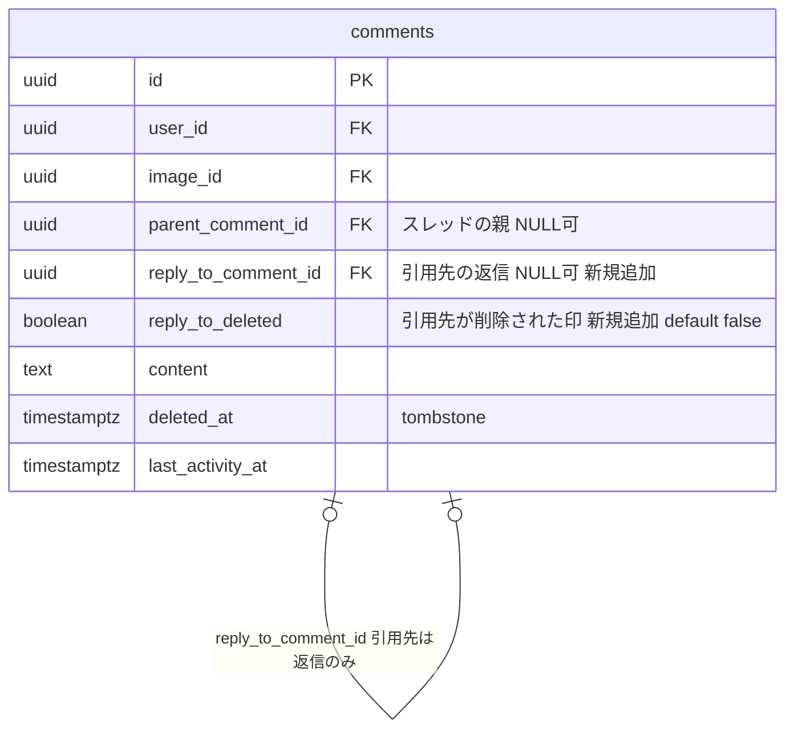
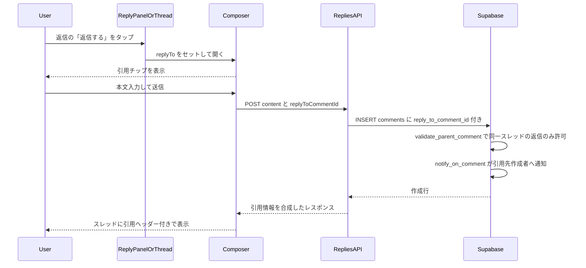
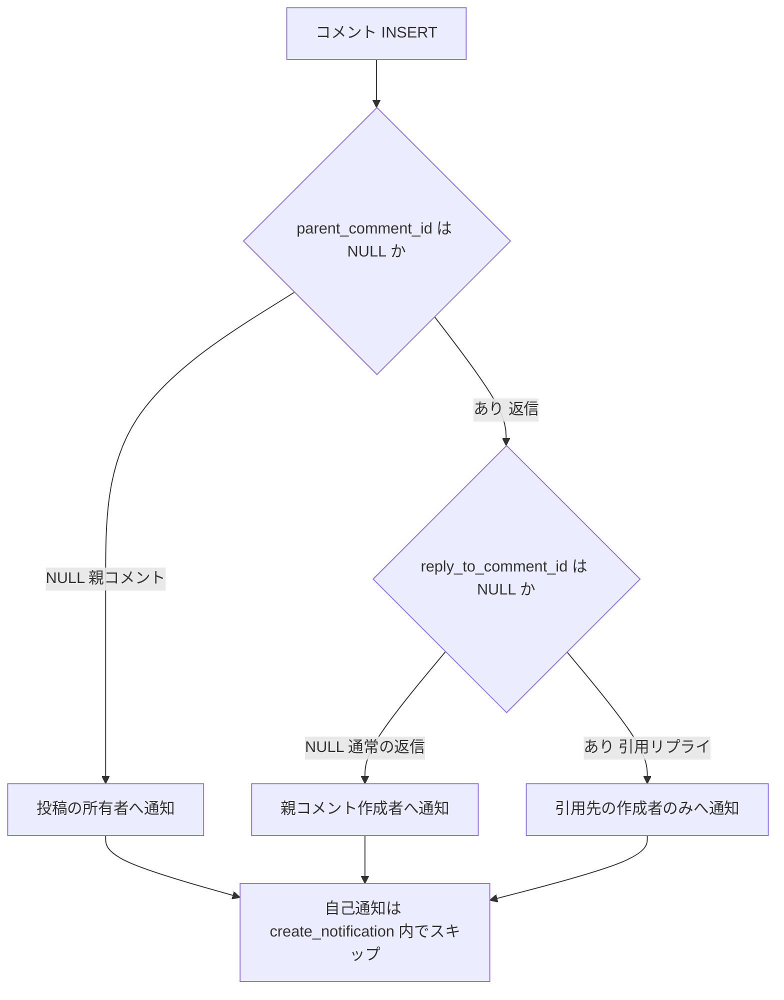
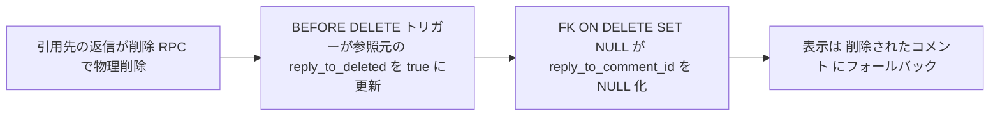
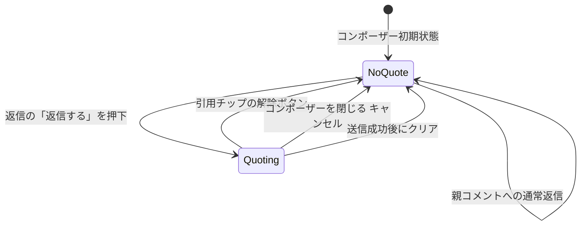
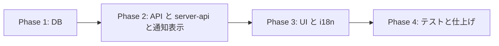

# コメント返信への返信（引用リプライ）実装計画

ユーザー間コミュニケーション活性化のため、返信（子コメント）への返信を Discord 型の「引用リプライ」方式で実現する。データ構造は現行の1階層フラットスレッドを維持し、`reply_to_comment_id` の参照を追加する。

> **改訂履歴**: v2 — レビュー指摘（削除設計と immutable の衝突 / 引用対象の明確化 / 通知 i18n / エラーマッピング / デスクトップ UI / batch lookup / DB 回帰テスト / ロールバック手順）を反映。

## ゴール・スコープ

**含めるもの**

- 各返信の下に「返信する」ボタンを常時表示（モバイル・デスクトップ両経路）
- 返信への返信は同一スレッド（同じ `parent_comment_id`）への投稿として保存し、`reply_to_comment_id` に引用先を記録
- 返信表示に引用ヘッダー（引用先のアバター + @ニックネーム + 本文プレビュー1行）を表示
- 引用ヘッダーのタップで引用先ユーザーのプロフィール（`/users/[userId]`）へ遷移
- コンポーザーに引用プレビューチップ（「↩ @ニックネーム への返信」+ 解除ボタン）を表示
- 通知: **引用先の作成者のみ**に通知（親コメント作成者・投稿所有者には通知しない）。自己返信は通知なし
- 引用先が削除された場合は「削除されたコメント」フォールバック表示（通常の返信と確実に区別できるデータ設計）

**含めないもの**

- 本文中の自由な @メンション入力
- 多階層ネスト表示（インデントは現行の1段のまま）
- **親コメント自身の引用**（引用対象は「同一スレッド内の返信」のみ。→ ADR-005）
- リアクション絵文字
- 通知のグルーピング・頻度制御（初期は1返信=1通知）

## コードベース調査結果

| 対象 | 現状 | 関連ファイル |
|---|---|---|
| データモデル | `comments` は1階層（`parent_comment_id`）。トリガー `validate_parent_comment` が2階層目を拒否。UPDATE 時のカラム不変検証あり（`deleted_at` は GUC `app.comment_delete_rpc` でのみ変更可） | `supabase/migrations/20260416120000_add_comment_reply_support.sql` |
| 削除フロー | `delete_comment_thread` RPC: 返信ありの親は tombstone 化、**返信は物理削除**。最後の返信削除で tombstone 親も物理削除 | 同上、`20260417010943_fix_delete_comment_thread_ambiguity.sql`、`20260417113000_cleanup_zero_reply_tombstone_parent_comments.sql` |
| 返信 API | `POST /api/comments/[id]/replies`（body: `content` のみ）。`server-api.ts` の `createReply` は DB エラーを汎用 `Error` に変換 → route では **500 になる**（400 マッピング未整備） | `app/api/comments/[id]/replies/route.ts`、`features/posts/lib/server-api.ts` |
| 返信一覧 | ページ単位取得。`profileMap` を一括取得して `user_nickname`/`user_avatar_url` を合成 | `features/posts/lib/server-api.ts` 151行付近 |
| UI 構造 | **モバイル**: `CommentItem` → `ReplyPanel` → `ReplyItem` → `EditableComment`。**デスクトップ**: `CommentItem` → `ReplyThread`。コンポーザーは `CommentComposerSheet`（モバイル）/ `CommentComposerTrigger` 経由（デスクトップ） | `features/posts/components/` |
| 通知（DB） | `notify_on_comment` トリガー。返信時は親コメント作成者へ通知。`create_notification` は自己通知を内部スキップ | `20260416120000` 376行付近、`20251213013611_notifications.sql` 216行付近 |
| 通知（表示） | **DB の title は表示に使われない**。`entity_type === "comment"` は `presentation.ts` で常に `replyTitle` へ変換される（115-121行）。文言変更には `notification.data` への種別保存 + presentation 分岐が必須 | `features/notifications/lib/presentation.ts`、`features/notifications/types.ts` |
| 通知タイプ制約 | `like/comment/follow/bonus`。既存 `comment` タイプを再利用（制約変更不要） | `20260108080809_update_notifications_type_constraint.sql` |
| i18n | `posts` / `notifications` namespace。**15言語すべて必須** | `messages/` |

Supabase 接続: 確認済み（本セッションで migration 適用実績あり）。

## 概要図

### データモデル（変更部分）

引用状態は次の3通りで判別する（レビュー指摘1への回答）:

| `reply_to_comment_id` | `reply_to_deleted` | 意味 | 表示 |
|---|---|---|---|
| NULL | false | 通常の返信（引用なし） | 引用ヘッダーなし |
| 値あり | false | 引用リプライ（引用先が存命） | 引用ヘッダー（アバター/@名前/プレビュー） |
| NULL | true | 引用リプライ（引用先が削除済み） | 「削除されたコメント」フォールバック |

### 返信投稿シーケンス

### 通知の宛先分岐

### 引用先削除時のデータ遷移

### コンポーザーの引用状態遷移（レビュー指摘5への回答）

モバイル（ReplyPanel）とデスクトップ（ReplyThread）で**同一の payload**（`content`, `replyToCommentId`）を送信する。

## EARS（要件定義）

| # | タイプ | 要件 |
|---|---|---|
| R1 | イベント駆動 | When ユーザーが返信の「返信する」をタップした, the system shall コンポーザーを開き引用チップ（アバター/@ニックネーム）を表示する |
| R2 | イベント駆動 | When 引用チップの解除ボタンが押された、またはコンポーザーがキャンセルされた, the system shall 引用状態をクリアし通常の親スレッド返信に切り替える |
| R3 | イベント駆動 | When 引用リプライが送信され成功した, the system shall 同一スレッドに `reply_to_comment_id` 付きで保存し、コンポーザーの引用状態をクリアする |
| R4 | イベント駆動 | When 引用リプライが作成された, the system shall 引用先コメントの作成者にのみ通知を作成する（親コメント作成者・投稿所有者には通知しない） |
| R5 | 状態駆動 | While 返信に `reply_to_comment_id` が設定されている, the system shall 引用ヘッダー（引用先の現在のアバター・@ニックネーム・本文プレビュー）を表示する |
| R6 | イベント駆動 | When 引用ヘッダーがタップされた, the system shall 引用先ユーザーのプロフィールページへ遷移する |
| R7 | 状態駆動 | While `reply_to_deleted = true`, the system shall 「削除されたコメント」フォールバックを表示する（通常返信とは区別する） |
| R8 | 異常系 | If `reply_to_comment_id` が親コメント・スレッド外・別画像・削除済みコメントを指している, then the system shall DB トリガーで INSERT を拒否し、API は 400 と安定したエラーコードを返す |
| R9 | 異常系 | If 自分自身の返信への引用リプライである, then the system shall 通知を作成しない |
| R10 | 権限 | While 未ログイン, the system shall 返信ボタンを既存返信導線と同じ扱い（ログイン誘導）にする |
| R11 | イベント駆動 | When 引用先の返信が削除された, the system shall 参照元の `reply_to_deleted` を true にした上で `reply_to_comment_id` を NULL 化する（既存の削除 RPC・cascade を失敗させない） |
| R12 | イベント駆動 | When 引用リプライ通知がタップされた, the system shall 既存のコメント通知と同様に対象投稿ページへ遷移する |

## ADR（設計判断記録）

### ADR-001: 本文 @テキスト埋め込みではなく `reply_to_comment_id` 参照方式

- **Context**: 誰宛の返信かを表現する方法として、本文への @ニックネーム 挿入と、参照カラム追加が候補
- **Decision**: `comments.reply_to_comment_id UUID NULL` を追加する参照方式
- **Reason**: ニックネーム変更に追従できる。アバター表示・プロフィール遷移・削除フォールバックが確実。本文はユーザー入力のみで汚れない
- **Consequence**: 返信一覧取得時に引用先の解決が必要（→ batch 取得、ADR-006）

### ADR-002: 多階層ネストにせず1階層フラット + 引用を維持

- **Context**: `Replies to replies are not allowed` 制約の撤廃（多階層化）も候補
- **Decision**: 1階層制約は維持し、引用参照のみ追加
- **Reason**: `delete_comment_thread` の tombstone 設計・ページネーション・通知が1階層前提。モバイル UI で多階層は可読性が急落
- **Consequence**: 会話の木構造は表現できないが、引用ヘッダーで文脈は追える

### ADR-003: 引用リプライの通知は引用先作成者のみ（単一宛先）

- **Context**: 引用リプライ時、親コメント作成者にも通知すべきか
- **Decision**: 引用先（reply_to）の作成者のみに通知。親コメント作成者・投稿所有者には通知しない
- **Reason**: ユーザー要件。「自分に向けられた発言」だけが通知される方が通知の価値が高い
- **Consequence**: 親コメント作成者はスレッドの盛り上がりに気づけない場合がある（将来「スレッド購読」等で拡張可能）

### ADR-004: 削除時は `reply_to_deleted` フラグ + FK `ON DELETE SET NULL` の二段構え（v2 改訂）

- **Context**: (1) FK の `ON DELETE SET NULL` は参照元行への UPDATE としてトリガーを発火させるため、`reply_to_comment_id` を単純に immutable 化すると削除自体が失敗する。(2) `reply_to_comment_id = NULL` だけでは「通常の返信」と「引用先が削除された返信」を区別できない
- **Decision**:
  - `reply_to_deleted BOOLEAN NOT NULL DEFAULT FALSE` を追加し、引用先の物理削除直前に **BEFORE DELETE トリガー**（`mark_reply_to_deleted`）で参照元の `reply_to_deleted = true` に更新。その後 FK の SET NULL が `reply_to_comment_id` を NULL 化する
  - immutable 検証は「**NULL 方向・true 方向の遷移のみ許可**」に緩和する: `reply_to_comment_id` は「非NULL → NULL」のみ許可（それ以外の変更は拒否）、`reply_to_deleted` は「false → true」のみ許可。これで FK の SET NULL と削除トリガーの内部 UPDATE が通り、引用先の付け替え・削除偽装は引き続き DB 層で拒否される
- **Reason**: GUC 方式（`app.comment_delete_rpc` 相当の追加）より条件が宣言的で、FK 標準動作をそのまま活かせる。既存の削除 RPC / cascade（投稿削除・アカウント削除）を変更せずに成立する
- **Consequence**: ユーザーが自分の行の `reply_to_comment_id` を NULL 化する余地が理論上残る（RLS で自行 UPDATE が可能なため）。実害は「自分の返信から引用表示が消える」のみで許容。なお引用先は返信（物理削除される行）に限定するため、tombstone 化した引用先という状態は構造的に存在しない（ADR-005）

### ADR-005: 引用対象は「同一スレッド内の返信」のみ。親コメントは引用不可（v2 追加）

- **Context**: `reply_to.id = NEW.parent_comment_id` を許すと親コメント自身も引用できてしまい、tombstone 化された親を引用する状態（削除区別が複雑化）や UI/通知の仕様が増える
- **Decision**: 検証条件は `reply_to.parent_comment_id = NEW.parent_comment_id`（= 引用先は同一スレッドの返信）のみ。親コメント引用は拒否
- **Reason**: 今回の目的は「返信への返信」。親コメントへの返信は従来の返信そのもので、引用ヘッダーがなくても文脈は明確。tombstone 引用のケースが消え、削除設計（ADR-004）が「物理削除のみ」に単純化される
- **Consequence**: 親コメント発言を明示的に引用したいニーズには将来対応（データ構造はそのまま拡張可能）

### ADR-006: 引用先の解決はページ単位の batch 取得（v2 追加）

- **Context**: 返信一覧はページ単位取得。範囲外の引用先を個別 lookup すると N+1 になる
- **Decision**: ページ内の `reply_to_comment_id` を収集 → `comments.in(...)` で一括取得 → 引用先ユーザーを含めて `profileMap` を一括取得 → メモリ上で合成。`createReply` / `updateComment` のレスポンスにも同じ合成を適用
- **Reason**: 1ページあたりのクエリ数を最大数回の batch に固定できる
- **Consequence**: server-api の合成ロジックがやや太るが、既存の profileMap 合成パターンの延長で実装できる

### ADR-007: 通知種別は `notification.data.reply_kind` で表現し、表示は presentation 層で分岐（v2 追加）

- **Context**: 通知表示は DB の title を使わず `presentation.ts` が `entity_type === "comment"` を一律 `replyTitle` に変換している。DB 側の文言変更だけでは画面に反映されない
- **Decision**: `notify_on_comment` は `data` に `reply_kind: "reply_to_reply"` と `comment_id` / `reply_to_comment_id` / `parent_comment_id` / `image_id` を保存。`presentation.ts` に `reply_kind` 分岐を追加し、`notifications` namespace の新キー（15言語）で表示。クリック遷移は既存の comment 通知と同じ投稿ページ
- **Reason**: 既存の通知アーキテクチャ（DB は data 保持・表示はクライアント i18n）に沿う
- **Consequence**: 通知タイプ制約は変更不要。古いアプリバージョンは `reply_kind` を無視して従来の `replyTitle` 表示になる（後方互換）

## エラーコード仕様（レビュー指摘4への回答）

トリガーの `RAISE EXCEPTION` にはメッセージ規約（プレフィックス `REPLY_TO_`）を設け、`server-api.ts` で判別して `PostCommentError`（既存のエラーコード付きエラー型に準拠）へ変換、route で 400 にマッピングする。

| ケース | 検出箇所 | エラーコード | HTTP | UI |
|---|---|---|---|---|
| `replyToCommentId` が UUID 形式でない | route（事前検証） | `POSTS_REPLY_TO_INVALID` | 400 | トースト「返信先が正しくありません」 |
| 引用先が存在しない | トリガー `REPLY_TO_NOT_FOUND` | `POSTS_REPLY_TO_NOT_FOUND` | 400 | トースト「返信先のコメントが見つかりません」 |
| 引用先が別スレッド/別画像/親コメント | トリガー `REPLY_TO_INVALID_TARGET` | `POSTS_REPLY_TO_INVALID` | 400 | 同上 |
| 引用先が削除済み | トリガー `REPLY_TO_DELETED` | `POSTS_REPLY_TO_DELETED` | 400 | トースト「返信先のコメントは削除されています」 |
| その他 DB エラー | — | 既存どおり | 500 | 既存の汎用エラー |

## 実装計画

### フェーズ間の依存関係

### Phase 1: データベース（マイグレーション）

目的: 引用参照カラム・削除フラグ・検証・通知分岐を DB に追加する
ビルド確認: `supabase db push` 成功。**下記の DB 回帰テスト（テスト行ラウンドトリップ）が全て通ること**

- [ ] マイグレーション作成 `add_comment_reply_to_support.sql`
  - `ALTER TABLE comments ADD COLUMN reply_to_comment_id UUID NULL REFERENCES comments(id) ON DELETE SET NULL`
  - `ALTER TABLE comments ADD COLUMN reply_to_deleted BOOLEAN NOT NULL DEFAULT FALSE`
  - 部分インデックス `ON comments (reply_to_comment_id) WHERE reply_to_comment_id IS NOT NULL`
  - `validate_parent_comment` を CREATE OR REPLACE で拡張（`20260416120000` の現行定義を出発点に）:
    - INSERT: `reply_to_comment_id` があるとき — `parent_comment_id IS NULL` なら拒否 / 引用先を `FOR KEY SHARE` でロックして取得（削除との race を直列化。既存の親ロックと同型）/ `REPLY_TO_NOT_FOUND` / `reply_to.parent_comment_id = NEW.parent_comment_id` かつ同一 `image_id` でなければ `REPLY_TO_INVALID_TARGET`（親コメント引用もここで拒否）/ `reply_to.deleted_at IS NOT NULL` なら `REPLY_TO_DELETED`。`reply_to_deleted = true` での INSERT は拒否
    - UPDATE: `reply_to_comment_id` は「非NULL → NULL」遷移のみ許可、`reply_to_deleted` は「false → true」遷移のみ許可（それ以外は RAISE）。既存の `image_id` / `parent_comment_id` immutable・`deleted_at` GUC 検証は維持
  - 新規トリガー `mark_reply_to_deleted`（BEFORE DELETE ON comments）: `UPDATE comments SET reply_to_deleted = true WHERE reply_to_comment_id = OLD.id`（FK の SET NULL より先に実行される）
  - `notify_on_comment` を CREATE OR REPLACE で拡張: 返信ブランチで `NEW.reply_to_comment_id IS NOT NULL` なら宛先を引用先作成者に差し替え（親作成者へは通知しない）。`data` に `reply_kind: 'reply_to_reply'`、`comment_id`、`reply_to_comment_id`、`parent_comment_id`、`image_id`、`comment_content` を保存
- [ ] `supabase db push` で適用
- [ ] **DB 回帰テスト**（service role でテスト行ラウンドトリップ、実施後削除）:
  - 引用リプライ作成 → 通知が引用先作成者のみに1件（親作成者・投稿所有者に無いこと）
  - 通常返信 → 従来どおり親作成者へ通知（回帰なし）
  - 引用先作成者=投稿所有者のとき通知が重複しない / 自己返信で通知が作られない
  - 親コメント引用・別スレッド引用・別画像引用・削除済み引用 → それぞれ拒否
  - 引用先の返信を削除 RPC で削除 → 参照元が `reply_to_deleted=true` + `reply_to_comment_id IS NULL` になり、削除自体が成功する
  - 最後の返信削除による tombstone 親の物理削除・投稿削除 cascade・アカウント削除 cascade が失敗しない
  - `reply_to_comment_id` の直接 UPDATE（付け替え）拒否 / NULL 化は許可
  - 通常の本文編集・`delete_comment_thread` が引き続き動作
- [ ] `.cursor/rules/database-design.mdc` に `reply_to_comment_id` / `reply_to_deleted` / トリガー変更を追記

### Phase 2: API・server-api・通知表示

目的: 引用付き返信の作成、返信一覧への引用情報の付与、通知の表示対応
ビルド確認: `npm run typecheck` / `npm run test` パス

- [ ] `features/posts/types.ts`: `ReplyComment` に `reply_to_comment_id: string | null` / `reply_to_deleted: boolean` / 表示用 `reply_to: { user_id, nickname, avatar_url, content_preview } | null` を追加（既存の snake_case 命名に合わせる）
- [ ] `features/posts/lib/server-api.ts`:
  - 返信一覧: ページ内の `reply_to_comment_id` を収集 → `comments.in(...)` 一括取得 → 引用先ユーザー分も含めて `profileMap` 一括取得 → メモリ合成（**個別 lookup 禁止**。ADR-006）
  - `createReply`: `replyToCommentId` を受けて INSERT。トリガーエラー（`REPLY_TO_*` プレフィックス）を `PostCommentError`（エラーコード付き）へ変換。レスポンスにも引用情報を合成
  - `updateComment`: レスポンスに引用情報を合成（編集後の再描画で引用ヘッダーが消えないように）
- [ ] `app/api/comments/[id]/replies/route.ts` POST: `replyToCommentId`（optional・UUID 事前検証）を受け、`PostCommentError` を 400 + エラーコードにマッピング（上記エラーコード表どおり）
- [ ] `features/posts/lib/api.ts`: `createReply` に `replyToCommentId` を追加
- [ ] 通知表示: `features/notifications/types.ts` に `reply_kind` を追加 / `features/notifications/lib/presentation.ts` の comment 分岐に `data.reply_kind === "reply_to_reply"` → 新キー `replyToReplyTitle` を追加 / クリック遷移が既存どおり投稿ページに飛ぶことを確認
- [ ] `docs/API.md`: replies エンドポイントの body / レスポンス例（引用情報含む）/ エラーコード表を追記

### Phase 3: UI・i18n

目的: 引用ヘッダー表示・返信ボタン・引用チップ付きコンポーザー（モバイル/デスクトップ両経路）
ビルド確認: `npm run build -- --webpack` 成功、実機で表示確認

- [ ] `features/posts/components/ReplyQuoteHeader.tsx`（新規）: アバター + @ニックネーム + プレビュー1行。`Link` で `/users/[userId]` へ。`reply_to_deleted` 時は「削除されたコメント」フォールバック（リンクなし）
- [ ] `EditableComment.tsx`: `reply_to` があれば `ReplyQuoteHeader` を本文上部に表示
- [ ] **モバイル経路**: `ReplyItem.tsx` に「返信する」ボタン常時表示 / `ReplyPanel.tsx` に `replyTo` state（設定・解除・キャンセル時クリア・送信成功後クリア）→ `CommentComposerSheet.tsx` / `CommentInput.tsx` に引用チップ + `replyToCommentId` 送信
- [ ] **デスクトップ経路**: `ReplyThread.tsx` / `CommentComposerTrigger.tsx` / `CommentItem.tsx` に同じ `replyTo` 連携を実装（**payload はモバイルと同一**）
- [ ] 状態遷移: コンポーザーの引用状態遷移図どおり（設定 → 解除/キャンセル/送信成功でクリア）
- [ ] i18n（**15言語すべて**）:
  - `posts`: `replyToChip`（「@{name} への返信」）、`replyToDeleted`（「削除されたコメント」）、`replyQuoteAria`、エラートースト3種
  - `notifications`: `replyToReplyTitle`（「{actor} があなたの返信に返信しました」）
- [ ] 未ログイン時は既存の返信導線と同じログイン誘導挙動を踏襲

### Phase 4: テスト・仕上げ

目的: 品質担保
ビルド確認: `npm run lint` / `npm run typecheck` / `npm run test` / `npm run build -- --webpack` すべてパス

- [ ] ユニットテスト: `ReplyQuoteHeader`（表示・削除フォールバック・プロフィールリンク）/ コンポーザー引用チップ（設定・解除・キャンセル/送信後クリア・payload）/ server-api の batch 合成（ページ内解決・引用先削除済み）/ presentation.ts の `reply_kind` 分岐
- [ ] API テスト: `replyToCommentId` 付き POST の正常系 / エラーコード表の4ケースが 400 で返ること
- [ ] 実機確認: モバイル・デスクトップ両経路、長いニックネーム/本文の truncate、通知の宛先と文言、通知タップでの遷移
- [ ] `/test-flow` に沿ったスペック整備（対象: ReplyQuoteHeader, replies API, presentation）

## 修正対象ファイル一覧

| ファイル | 操作 | 変更内容 |
|----------|------|----------|
| `supabase/migrations/2026xxxx_add_comment_reply_to_support.sql` | 新規 | カラム2本・インデックス・トリガー3関数（validate 拡張 / mark_reply_to_deleted 新規 / notify 拡張） |
| `.cursor/rules/database-design.mdc` | 修正 | comments スキーマ・トリガー追記 |
| `docs/architecture/data.ja.md` | 修正 | 引用リプライのデータフロー・削除設計を追記 |
| `docs/architecture/data.en.md` | 修正 | 同上（英語） |
| `docs/API.md` | 修正 | replies API の body / レスポンス例 / エラーコード表 |
| `features/posts/types.ts` | 修正 | ReplyComment に引用情報を追加 |
| `features/posts/lib/server-api.ts` | 修正 | batch 合成・createReply/updateComment 拡張・エラー変換 |
| `features/posts/lib/api.ts` | 修正 | createReply に replyToCommentId |
| `app/api/comments/[id]/replies/route.ts` | 修正 | POST body 拡張・400 マッピング |
| `features/posts/components/ReplyQuoteHeader.tsx` | 新規 | 引用ヘッダー表示 |
| `features/posts/components/EditableComment.tsx` | 修正 | 引用ヘッダー組み込み |
| `features/posts/components/ReplyItem.tsx` | 修正 | 返信ボタン常時表示 |
| `features/posts/components/ReplyPanel.tsx` | 修正 | replyTo state・コンポーザー連携（モバイル） |
| `features/posts/components/ReplyThread.tsx` | 修正 | replyTo state・コンポーザー連携（デスクトップ） |
| `features/posts/components/CommentItem.tsx` | 修正 | デスクトップ経路の連携 |
| `features/posts/components/CommentComposerTrigger.tsx` | 修正 | 引用チップ連携（デスクトップ） |
| `features/posts/components/CommentComposerSheet.tsx` | 修正 | 引用チップ表示・解除 |
| `features/posts/components/CommentInput.tsx` | 修正 | replyToCommentId 送信 |
| `features/notifications/types.ts` | 修正 | reply_kind 型追加 |
| `features/notifications/lib/presentation.ts` | 修正 | reply_kind 分岐追加 |
| `messages/*.ts`（15ファイル） | 修正 | posts / notifications の文言追加 |
| `tests/unit/features/posts/*` ほか | 新規/修正 | 上記のユニットテスト |

## 品質・テスト観点

### 品質チェックリスト

- [ ] **エラーハンドリング**: エラーコード表の4ケースが 400 + 安定コードで返り、トースト表示される
- [ ] **権限制御**: RLS は既存 comments のまま。通知の recipient は**トリガー内で解決**し、クライアントから受け取らない
- [ ] **データ整合性**: 同一スレッド検証・親コメント引用拒否・引用付け替え拒否を **DB トリガーで強制**。`FOR KEY SHARE` ロックで削除との race を直列化
- [ ] **削除整合性**: `reply_to_deleted` フラグにより通常返信と削除済み引用を区別。既存の削除 RPC / cascade が失敗しない
- [ ] **i18n**: posts / notifications の新キーが15言語すべてに存在
- [ ] **既存回帰**: 通常返信の通知（親作成者宛て）・削除 tombstone・reply_count・通知タップ遷移が変わらないこと
- [ ] **通知設定**: コメント通知を無効にしたユーザーに作成されないこと（既存 `create_notification` の挙動を踏襲・テストで確認）

### テスト観点

| カテゴリ | テスト内容 |
|----------|-----------|
| 正常系 | 引用リプライ作成 → 同一スレッド表示・引用ヘッダー・通知が引用先のみ |
| 異常系 | エラーコード表4ケース・引用先削除後のフォールバック表示 |
| 削除系 | 引用先削除 / tombstone 親の物理削除 / 投稿削除 cascade / アカウント削除 cascade |
| 権限 | 未ログイン導線・引用付け替え UPDATE の拒否 |
| 通知 | 宛先単一性（親・投稿所有者に飛ばない）・自己通知なし・重複なし・設定無効時なし・文言 i18n・タップ遷移 |
| 実機 | モバイル/デスクトップ両経路・truncate・プロフィール遷移 |

## ロールバック方針（v2 改訂）

DB の DOWN や適用済みマイグレーションの書き換えは行わず、**補償用の新規マイグレーション**で管理する。

**手順（問題発生時）:**

1. **新規引用リプライの投稿を停止**: 後方互換版アプリ（`replyToCommentId` を送らない版）へロールバックデプロイ。API は `replyToCommentId` 無しで完全に従来挙動のため、これだけで新規データの流入が止まる
2. **補償マイグレーションを適用**: `validate_parent_comment` / `notify_on_comment` を旧定義（`20260416120000` にあり）へ CREATE OR REPLACE で戻し、`mark_reply_to_deleted` トリガーを DROP する
3. **既存の reply_to データの扱いを決定**: 原則**保持**（カラムは NULL 許容の追加であり、旧アプリ・旧トリガーは参照しないため残置しても無害）。完全無効化が必要な場合のみ `UPDATE comments SET reply_to_comment_id = NULL` を明示的に実施
4. **通知の互換確認**: 既に作成済みの `reply_kind` 付き通知は、旧 presentation.ts では従来の `replyTitle` で表示される（分岐が無いだけ）ことを確認済みとする設計にする（新キー未参照でクラッシュしないこと）

**設計上の担保:**

- カラム追加は NULL 許容のみで、既存クエリ・RLS に影響しない
- `delete_comment_thread` 本体は**変更しない**（削除時の参照整合は BEFORE DELETE トリガー + FK に委ねる）ため、ロールバック対象はトリガー3関数に閉じる
- アプリはフェーズ単位のコミットで revert 可能

## 使用スキル

| スキル | 用途 | フェーズ |
|--------|------|----------|
| `/project-database-context` | comments/notifications スキーマ参照 | Phase 1 |
| `/git-create-branch` | ブランチ作成 | 実装開始時 |
| `/test-flow` `/spec-extract` `/test-generate` | テスト整備 | Phase 4 |
| `/git-create-pr` | PR 作成 | 実装完了時 |
