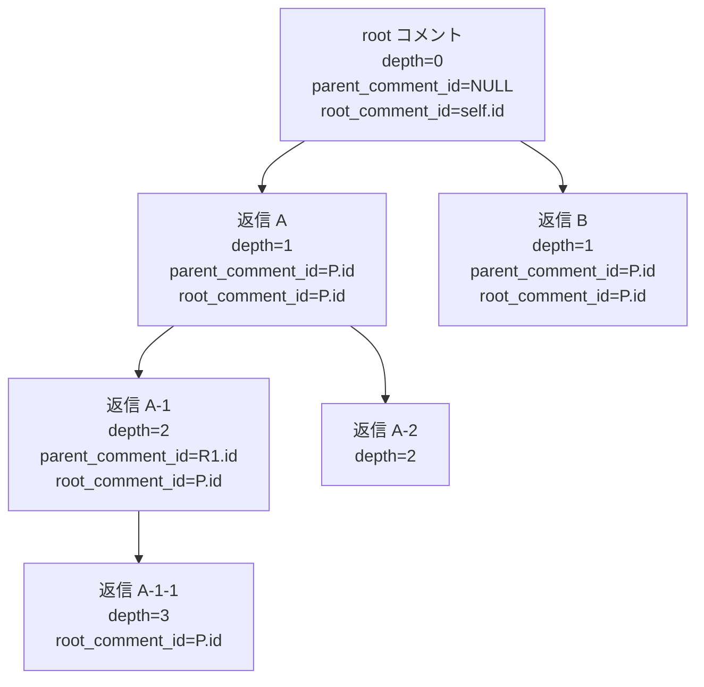
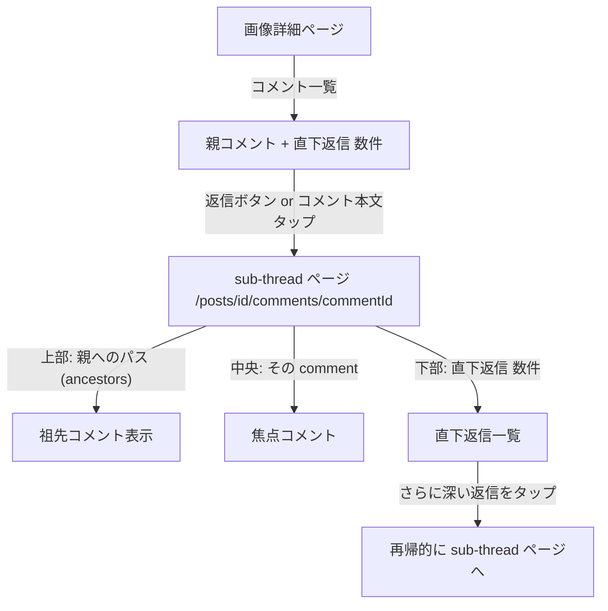
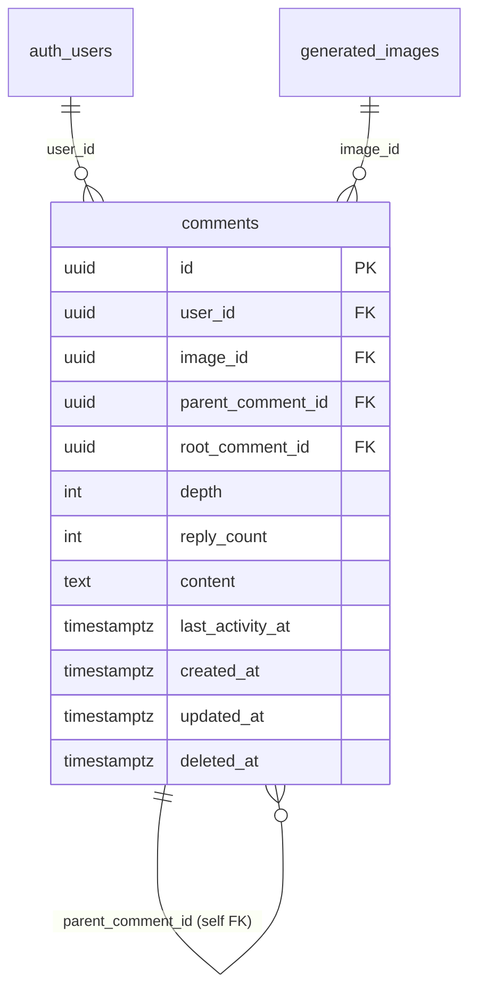
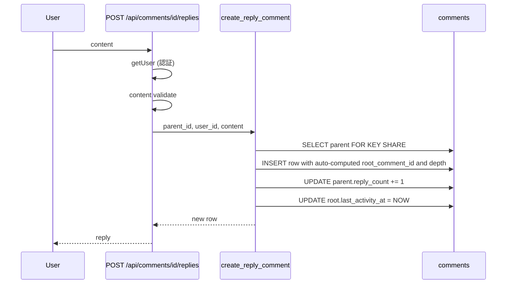
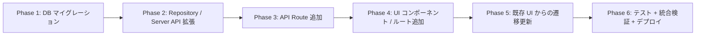

# コメントスレッドの N 階層化 (Twitter 風)

## 背景

生成画像 (`generated_images`) に紐づく既存 `comments` 機能は、2026-04 の `add_comment_reply_support` migration で「親コメント + 返信」の 2 階層を導入したが、**明示的に「返信への返信」を禁止する trigger** (`validate_parent_comment`) で N 階層化を防いでいる。

```sql
IF v_parent.parent_comment_id IS NOT NULL THEN
  RAISE EXCEPTION 'Replies to replies are not allowed';
END IF;
```

本計画は、この 2 階層制約を撤廃し、**Twitter 風の N 階層リプライツリー** を実装する。深いネストは「コメントをタップ → そのコメントを起点とする sub-thread 画面へ遷移」する UX で表現し、1 画面のインデント爆発を回避する。

## 目的

- 任意の depth (制限なし) で reply を作成できるようにする
- 既存 `comments` テーブルを拡張 (新テーブルは作らない)
- 既存の trigger / RPC / API / UI を最大限再利用し、N 階層化に必要な最小差分にとどめる
- Twitter 風の sub-thread 遷移 UI を新ルート `/posts/[id]/comments/[commentId]` で追加

## やらないこと

- 新規 `posts` テーブル化 (掲示板的な独立投稿機能ではない)
- Reddit 風のインデント爆発表示 (sub-thread 画面遷移で代替)
- Threads/X のような quote / retweet 等の派生機能
- moderator 用のコメント非表示機構 (現状の `deleted_at` 論理削除 + ユーザー本人削除のみ)
- 通知の祖先全段階への伝播 (直接の親のみ — 既存挙動維持。深いネストでの通知爆発回避)
- last_activity_at の全祖先伝播 (root のみ更新 — シンプル + パフォーマンス)
- 既存 2 階層データの再構築 (root_comment_id / depth はバックフィルで自動算出)

---

## コードベース調査結果 (Phase B)

### B-1: Supabase 接続確認
- リンク済みプロジェクト: `hnrccaxrvhtbuihfvitc` (AI coordinate, Sydney)
- `supabase db push` で本番 migration 適用可、`supabase functions deploy` も使用可
- 破壊的操作 (DROP / migration rollback) はユーザー承認必須

### B-2: 既存機能調査

#### DB (`comments` テーブル + 6 trigger + 1 RPC)

**現行 schema** (`20260416120000_add_comment_reply_support.sql`):
```
id (UUID PK), user_id (FK auth.users),
image_id (FK generated_images),
parent_comment_id (FK comments, NULL = parent),
content (TEXT, max 200, regex 制約),
last_activity_at (TIMESTAMPTZ, NOT NULL),
created_at / updated_at / deleted_at
```

**既存 indexes**:
- `idx_comments_image_top_level_last_activity`: `(image_id, last_activity_at DESC, id DESC) WHERE parent_comment_id IS NULL`
- `idx_comments_parent_comment_created_at`: `(parent_comment_id, created_at DESC, id DESC)`

**既存 trigger (全 6)**:
1. `trigger_validate_parent_comment` (BEFORE INSERT/UPDATE)
   - self-reply 禁止 / parent 存在チェック / **2 階層強制 (要削除)** / image_id 一致 / 削除済み親への返信禁止 / parent_comment_id immutable / deleted_at は RPC のみ変更可
2. `trigger_prevent_direct_parent_delete_with_replies` (BEFORE DELETE)
   - 親に返信あるなら DELETE 拒否 (RPC 経由のみ可)
3. `trigger_update_parent_last_activity_at` (AFTER INSERT)
   - 返信作成時、親の `last_activity_at = GREATEST(NOW(), reply.created_at)`
4. `trigger_update_parent_last_activity_at_on_delete` (AFTER DELETE)
   - 返信削除時、親の `last_activity_at` を残存返信の最新へ
5. `trigger_broadcast_reply_lifecycle_event` (AFTER INSERT/DELETE)
   - Realtime channel `comments:${image_id}` / `comments:replies:${parent_comment_id}` へ broadcast
6. `trigger_delete_notification_on_comment_deletion` (AFTER DELETE)
   - `notifications WHERE comment_id = OLD.id` を cascade DELETE

**既存 RPC**: `delete_comment_thread(p_comment_id UUID)` returns `(comment_id, image_id, parent_comment_id, deleted)`
- 返信 → 物理 DELETE (`deleted='physical'`)
- 親で返信なし → 物理 DELETE
- 親で返信あり → 論理削除 `deleted_at=now()` + 親通知削除 (`deleted='logical'`)
- 権限: `auth.uid() = v_comment.user_id`
- 内部: `SET search_path = public`, `SECURITY DEFINER`, `FOR UPDATE` ロック

**通知 trigger** (`notify_on_comment`):
- 親コメント INSERT → image 投稿者へ `entity_type='post'`
- 返信 INSERT → 親コメント投稿者へ `entity_type='comment'`

#### API ルート (7 経路、`app/api/posts/[id]/comments/`, `app/api/comments/[id]/`)

| ルート | メソッド | 認証 | 既存挙動 |
|---|---|---|---|
| `/posts/[id]/comments` | GET | 不要 | 親コメント一覧 (`limit`, `offset`) |
| `/posts/[id]/comments` | POST | 要 | 親コメント作成 |
| `/comments/[id]` | PUT | 要 | 編集 (本人) |
| `/comments/[id]` | DELETE | 要 | `delete_comment_thread` RPC 呼出し |
| `/comments/[id]/replies` | GET | 不要 | 直下返信一覧 |
| `/comments/[id]/replies` | POST | 要 | 返信作成 (parent から image_id 解決) |
| `/posts/comments/batch` | POST | 不要 | 複数 image の comment_count 一括取得 |

#### Repository (`features/posts/lib/server-api.ts`)

主要関数: `getComments` / `getReplies` / `createComment` / `createReply` / `updateComment` / `deleteComment` / `getReplyCount` / `getReplyCountsBatch` / `getCommentCount` / `getCommentCountsBatch`

- React `cache()` で同一 request 内の重複取得防止
- `createAdminClient()` は cache server component / count 取得用
- `"use cache"` / `cacheTag` / `cacheLife` は **コメント機能では未使用** (リアルタイム性優先)

#### UI コンポーネント (11 個、`features/posts/components/` or 周辺)

- `CommentSection.tsx` / `CommentList.tsx` / `CommentItem.tsx` / `EditableComment.tsx` / `CommentInput.tsx` / `ReplyPanel.tsx` (モバイル右スライドイン) / `CommentComposerSheet.tsx` / `CommentComposerTrigger.tsx` / `CommentCount.tsx` / `CommentLoadMoreSkeleton.tsx` / `CommentSectionSkeleton.tsx`

**既存設計の特徴**:
- 個別コメント詳細ページは **存在しない**
- 返信展開は `CommentList` の inline (PC) or `ReplyPanel` モバイル右パネル
- Realtime: `CommentList` が `comments:${imageId}` 購読、INSERT/DELETE で list 全 refresh

### B-3: 影響範囲

| 領域 | 既存ファイル | N 階層化での扱い |
|---|---|---|
| DB schema | `comments` テーブル | カラム追加 + 一部 trigger 緩和 |
| RPC | `delete_comment_thread` | 任意深さ対応に拡張 |
| Trigger | `validate_parent_comment` | 「2 階層強制」のロジックだけ削除、他は維持 |
| Trigger | `update_parent_last_activity_at` (AFTER INSERT/DELETE) | root_comment_id ベースに変更 |
| Trigger | `broadcast_reply_lifecycle_event` | channel 命名を `comments:thread:${root_id}` 追加 |
| Trigger | `notify_on_comment` | **変更なし** (直接の親のみ通知の方針維持) |
| API | `/api/comments/[id]/replies` | 既存挙動維持 (直下返信のみ) |
| API | **新規** `/api/comments/[id]/subtree` | 部分木取得 (sub-thread 画面用) |
| API | **新規** `/api/comments/[id]/ancestors` | 祖先パス取得 (sub-thread 上部の context 表示用) |
| Repository | `createReply` | RPC `create_reply_comment` 経由に変更 (root/depth 自動計算) |
| Repository | **新規** `getSubthread` / `getAncestors` | sub-thread / context 取得 |
| UI | `CommentItem.tsx` | 「返信」ボタンの遷移先を `/posts/[postId]/comments/[commentId]` に |
| UI | **新規** `app/(app)/posts/[id]/comments/[commentId]/page.tsx` | Sub-thread 画面 (Server Component) |
| UI | **新規** `features/posts/components/SubthreadView.tsx` | Sub-thread 画面の本体コンポーネント |
| UI | `ReplyPanel.tsx` | モバイル: 既存挙動維持 (1 階層展開) + 「さらに返信を表示」で sub-thread 画面へ |

### B-4: 参照ドキュメント
- `docs/architecture/data.ja.md` L115-131: 複数テーブル跨る変更は RPC へ。原子的・冪等処理は DB 側で
- `.cursor/rules/database-design.mdc`: `comments` テーブル定義 (公開済み)
- `docs/specs/api/comment_replies_route_spec.yaml` / `comment_delete_route_spec.yaml`: 既存 EARS 仕様 (CRR-001〜006 / CDR-001〜006)
- `docs/planning/comment-reply-implementation-plan.md`: 2 階層導入時の計画 (2000+ 行、設計の経緯)
- `docs/planning/mobile-comment-composer-sheet-implementation-plan.md`: Sheet 導入経緯

---

## 1. 概要図

### 1.1 N 階層スレッド構造



### 1.2 UI フロー (Twitter 風 sub-thread 遷移)



### 1.3 データモデル (ER 図)



### 1.4 返信作成シーケンス (新 RPC `create_reply_comment`)



---

## 2. EARS (要件定義)

| ID | 要件 |
|---|---|
| REQ-1 | When ユーザーが任意の depth コメントに返信する時, the system shall `create_reply_comment` RPC で row を作成し、root_comment_id と depth を DB 側で自動算出する。<br>**EN**: When a user replies at any depth, the system shall create the row via `create_reply_comment` RPC, with `root_comment_id` and `depth` computed server-side. |
| REQ-2 | While コメントが作成される時, the system shall depth の上限を設けない (制限なし、Twitter 風) が、parent_comment_id の immutability と self-reply 禁止は維持する。<br>**EN**: While creating a comment, the system shall enforce no max depth, but maintain `parent_comment_id` immutability and self-reply prohibition. |
| REQ-3 | When ユーザーが任意の comment 詳細ページを開く時, the system shall `/posts/[id]/comments/[commentId]` ルートで「focal comment + 祖先 path + 直下返信」を表示する。<br>**EN**: When a user opens any comment detail, the system shall render focal comment + ancestor path + direct replies at `/posts/[id]/comments/[commentId]`. |
| REQ-4 | When ユーザーが返信ボタンをタップする時, the system shall その comment を起点とする sub-thread 画面へ遷移する (inline 展開せず)。<br>**EN**: When clicking the reply button, the system shall navigate to the sub-thread page (no inline expansion). |
| REQ-5 | When 返信が作成される時, the system shall 直接の親 (parent_comment_id) の投稿者にのみ通知し、祖先全段階への通知は行わない。<br>**EN**: When a reply is created, notify only the direct parent's author, not all ancestors. |
| REQ-6 | When 返信が作成される時, the system shall root_comment_id の `last_activity_at` のみ更新し、中間の祖先は触らない。<br>**EN**: When a reply is created, update only the root's `last_activity_at`, not intermediate ancestors. |
| REQ-7 | When `delete_comment_thread` RPC が任意 depth の comment に対して呼ばれる時, the system shall (a) 返信が無ければ物理 DELETE、(b) 返信があれば論理削除 (`deleted_at=now()`)、(c) 親の `reply_count` を 1 減算する。<br>**EN**: When `delete_comment_thread` is invoked at any depth, perform physical or logical delete and decrement parent's `reply_count`. |
| REQ-8 | If 親 comment が削除済み (`deleted_at IS NOT NULL`) の場合, then the system shall その親への新規返信を拒否する (既存挙動維持)。<br>**EN**: If parent is deleted, reject new replies (existing behavior). |
| REQ-9 | While コメント取得時, the system shall RLS により `deleted_at IS NULL` の行のみ公開 SELECT 可能。本人は自分の deleted_at 行も SELECT 可。<br>**EN**: Public SELECT only for non-deleted; owners can see their own deleted rows. |
| REQ-10 | When sub-thread 画面で「祖先パス」を取得する時, the system shall 再帰 CTE で root から focal comment までの最短パス (`parent_comment_id` 連鎖) を返す。<br>**EN**: When fetching ancestor path, return the path via recursive CTE from root to focal comment. |
| REQ-11 | Where 既存の 2 階層データが残る場合, the system shall migration 時に root_comment_id (= 親なら self.id、返信なら parent.id) と depth (0 or 1) を backfill する。<br>**EN**: For existing 2-tier data, backfill `root_comment_id` (self for parents, parent.id for replies) and `depth` (0/1) during migration. |
| REQ-12 | When Realtime 配信時, the system shall 既存 channel (`comments:${image_id}` / `comments:replies:${parent_comment_id}`) を維持しつつ、追加で `comments:thread:${root_comment_id}` にも broadcast する。<br>**EN**: Maintain existing channels and additionally broadcast to `comments:thread:${root_comment_id}`. |

---

## 3. ADR (設計判断記録)

### ADR-001: 新 `posts` テーブルではなく既存 `comments` を拡張

- **Context**: user 提案は generic な `posts` テーブル新設だったが、本プロジェクトの discussion entity は `generated_images` への comment が唯一であり、`comments` テーブルが既に完備されている。
- **Decision**: 既存 `comments` テーブルに `root_comment_id` / `depth` / `reply_count` を追加する形で N 階層化する。
- **Reason**: (a) 既存 trigger / RPC / API / 通知 / Realtime のコード資産を最大再利用 (b) `image_id` 紐付け / RLS / moderation 連携を再設計する必要がない (c) 既存 2 階層データを backfill で連続性を保てる。
- **Consequence**: テーブル名と意味的に若干の食い違い (「post」相当の comment) が残るが、命名は `comments` を継続。N 階層対応により discussion forum 的な用途にも将来流用可能。

### ADR-002: max depth は無制限 (Twitter 風)

- **Context**: Instagram は 2 階層、Reddit は無制限 (UI で折りたたみ)、Twitter は無制限。プロジェクトのコメント文化は X (Twitter) に近い。
- **Decision**: DB の `depth` カラムに CHECK 制約を設けず、無制限。
- **Reason**: (a) UX として「タップで sub-thread 画面遷移」を採用するため、UI 上のインデント爆発は発生しない (b) 将来的に「深いネスト = スパム」と判明したら admin 設定で抑止すれば良い。
- **Consequence**: 万一極端に深いネスト (depth > 100 等) が発生した場合、`getAncestors` の再帰 CTE が重くなる可能性。`limit 100` 程度の depth 上限を CTE 内に設けて防御する。

### ADR-003: 通知は直接の親のみ (既存 `notify_on_comment` 維持)

- **Context**: 祖先全段階通知 (GitHub Issues 風) は UX 豊かだが、深いネストで通知爆発リスク大。
- **Decision**: 既存挙動を維持。返信 INSERT → `parent_comment_id` の投稿者にのみ通知。
- **Reason**: (a) Twitter / Instagram と同じパターン (b) 既存 trigger を一切変更しない (c) 通知連鎖の bug リスクなし。
- **Consequence**: 「孫返信があったことに気付かない」場面は admin 側で集約通知などを別途検討する余地あり。

### ADR-004: last_activity_at は root のみ更新

- **Context**: 既存実装は「親コメント (parent_comment_id IS NULL) のみ `last_activity_at` を更新」。N 階層では「祖先全部更新」「root のみ更新」「親のみ更新」の 3 択。
- **Decision**: **root_comment_id の `last_activity_at` のみ更新** する設計に変更。
- **Reason**: (a) 「画像詳細ページのコメント一覧を最新順で並べる」は root 単位なので root だけで十分 (b) 中間祖先まで更新するとロック競合が増える (c) UI は sub-thread 画面内では `created_at` 順で十分 (深いネストは別画面)。
- **Consequence**: 中間祖先の「最新返信が来た日時」は読めなくなる (root と直下のみ)。必要なら view を別途定義。

### ADR-005: `delete_comment_thread` RPC を N 階層対応へ拡張

- **Context**: 既存 RPC は「返信 = 物理削除、親 + 返信あり = 論理削除」の 2 階層前提。N 階層では「親に孫返信がある場合」「孫返信を削除すると親の reply_count はどうなる」等の制御が必要。
- **Decision**: RPC のシグネチャは維持 (`p_comment_id` のみ)、内部ロジックを次のように変更:
  - **(a) 当該 comment に直下返信が無い**: 物理 DELETE。親 (`parent_comment_id`) の `reply_count -= 1` (親が NULL なら不要)
  - **(b) 直下返信あり**: 論理削除 `deleted_at = now()`。親の `reply_count` はそのまま (= 削除済みとしても child node count は維持)
  - **(c) 既存の `cleanup_zero_reply_tombstone_parent_comments` migration はそのまま** (返信ゼロの tombstone を掃除する保険)
- **Reason**: 既存 RPC の API 互換を保つ + N 階層でも論理削除の意味 (= 「ここに削除済みコメントがあったことを示す」) を維持。
- **Consequence**: `reply_count` の整合性は trigger と RPC の両方で保証する必要 (= 新 RPC `create_reply_comment` でも更新、削除 RPC でも更新)。

### ADR-006: Twitter 風 sub-thread 専用ルート追加

- **Context**: 既存にはコメント詳細ページが無く、返信展開は inline (PC) / モバイル右パネル (`ReplyPanel`) のみ。N 階層では inline 展開は破綻するので、専用ルートが必要。
- **Decision**: `/posts/[id]/comments/[commentId]` を新規追加。Server Component で focal comment + 祖先 path + 直下返信を取得。
- **Reason**: Twitter / X の挙動と同等で運用者・ユーザーに馴染みがある。URL 共有可能なため SEO / シェアにも有利。
- **Consequence**: モバイル `ReplyPanel` の役割を「直下 1 階層の simple な返信フォーム」に絞り、深い遷移は新ルートに任せる。

### ADR-007: Realtime channel — 既存 channel 維持 + thread channel 追加

- **Context**: 既存は `comments:${image_id}` (画像詳細用) と `comments:replies:${parent_comment_id}` (返信パネル用) の 2 channel。N 階層 sub-thread 画面では「root の thread 全体の変化」を購読したい。
- **Decision**: 既存 2 channel を維持 + 新規 `comments:thread:${root_comment_id}` channel に broadcast を追加。`broadcast_reply_lifecycle_event` trigger を拡張。
- **Reason**: (a) 既存 listener (`CommentList` 等) を変更せずに済む (b) sub-thread 画面は新 channel だけ購読すれば良い。
- **Consequence**: trigger 内で 3 channel に broadcast するコストは無視できる範囲。channel 名規約を `comments:thread:${id}` で統一。

### ADR-008: 新 RPC `create_reply_comment` で root_comment_id / depth を DB 側自動計算

- **Context**: クライアント側で parent.root_comment_id + parent.depth + 1 を計算して INSERT すると、validation/race condition のリスクあり。
- **Decision**: `create_reply_comment(p_parent_id, p_user_id, p_content)` RPC を新設し、root_comment_id / depth を DB 側で算出。INSERT + reply_count UPDATE + root の last_activity_at UPDATE を原子的に実施。
- **Reason**: (a) docs/architecture/data.ja.md の RPC 方針に合致 (b) 既存 `validate_parent_comment` trigger の race 対策 (`FOR KEY SHARE`) と整合性が取れる (c) クライアントは parent_id だけ送れば良くなり、API 入力が簡潔。
- **Consequence**: parent → child の作成は必ず RPC 経由。直接 INSERT を試みた場合、trigger で root_comment_id / depth の整合性チェックを行い RAISE EXCEPTION する (defense in depth)。

---

## 4. 実装計画 (フェーズ + TODO)

### フェーズ間の依存関係



### Phase 1: DB マイグレーション

**目的**: `comments` テーブルに N 階層対応カラム + RPC + trigger 更新。
**ビルド確認**: `supabase db push` がローカルで成功、`npm run typecheck` パス。

- [ ] マイグレーション新規作成: `supabase/migrations/<ts>_extend_comments_for_n_level_thread.sql`
  ```sql
  -- 1. カラム追加 (nullable で追加 → backfill → NOT NULL 化)
  ALTER TABLE public.comments
    ADD COLUMN IF NOT EXISTS root_comment_id UUID REFERENCES public.comments(id) ON DELETE CASCADE,
    ADD COLUMN IF NOT EXISTS depth INTEGER,
    ADD COLUMN IF NOT EXISTS reply_count INTEGER NOT NULL DEFAULT 0;

  -- 2. backfill (既存 2 階層データ)
  UPDATE public.comments
  SET root_comment_id = COALESCE(parent_comment_id, id),
      depth = CASE WHEN parent_comment_id IS NULL THEN 0 ELSE 1 END
  WHERE root_comment_id IS NULL OR depth IS NULL;

  -- 3. reply_count backfill (parent ごとの直下返信数)
  UPDATE public.comments p
  SET reply_count = (SELECT COUNT(*) FROM public.comments c WHERE c.parent_comment_id = p.id AND c.deleted_at IS NULL)
  WHERE p.parent_comment_id IS NULL;

  -- 4. NOT NULL + CHECK 制約
  ALTER TABLE public.comments
    ALTER COLUMN root_comment_id SET NOT NULL,
    ALTER COLUMN depth SET NOT NULL,
    ADD CONSTRAINT comments_depth_check CHECK (depth >= 0),
    ADD CONSTRAINT comments_root_self_for_parents
      CHECK ((parent_comment_id IS NULL AND root_comment_id = id) OR parent_comment_id IS NOT NULL);

  -- 5. インデックス追加 (sub-thread / ancestor 取得用)
  CREATE INDEX IF NOT EXISTS idx_comments_root_created_at
    ON public.comments (root_comment_id, created_at)
    WHERE deleted_at IS NULL;

  -- 6. COMMENT
  COMMENT ON COLUMN public.comments.root_comment_id IS
    'スレッドの起点コメント。親コメントの場合は self.id、返信の場合は祖先を辿った最上位の id';
  COMMENT ON COLUMN public.comments.depth IS
    'ツリー上の深さ。親 = 0、その返信 = 1、…。CHECK depth >= 0、上限なし (Twitter 風)';
  COMMENT ON COLUMN public.comments.reply_count IS
    '直下返信数のキャッシュ。create_reply_comment / delete_comment_thread RPC で原子的に更新';
  ```
- [ ] **`validate_parent_comment` trigger の更新** (2 階層強制ロジック削除 + 新カラム整合性チェック)
  - 削除: `IF v_parent.parent_comment_id IS NOT NULL THEN RAISE EXCEPTION 'Replies to replies are not allowed'`
  - 追加: INSERT 時に root_comment_id / depth が parent と整合するか検証 (RPC 以外の直接 INSERT 防御)
- [ ] **`update_parent_last_activity_at` trigger を root 単位に変更** (ADR-004)
  - parent ではなく `root_comment_id` の row に対して `last_activity_at = NOW()`
- [ ] **`broadcast_reply_lifecycle_event` trigger に thread channel を追加** (ADR-007)
  - 既存 2 channel + `comments:thread:${root_comment_id}` への broadcast を追加
- [ ] **新 RPC `create_reply_comment(p_parent_id UUID, p_user_id UUID, p_content TEXT)` を追加**
  - parent を `FOR KEY SHARE` でロック取得
  - parent.deleted_at IS NULL チェック、parent.user_id が auth context と一致しなくても OK (他人への返信)
  - root_comment_id = parent.root_comment_id (継承)
  - depth = parent.depth + 1
  - INSERT comments + UPDATE parent.reply_count += 1 + UPDATE root.last_activity_at = NOW
  - 戻り値: 新規 row
  - `SET search_path = public`, `SECURITY DEFINER`
- [ ] **`delete_comment_thread` RPC を拡張** (ADR-005)
  - 直下返信なし: 物理 DELETE + 親 (parent_comment_id) の reply_count -= 1
  - 直下返信あり: 論理削除 + 親通知 DELETE + reply_count はそのまま
- [ ] `.cursor/rules/database-design.mdc` の `comments` 定義を更新 (新カラム + 制約)
- [ ] `npm run typecheck` + `supabase db push --dry-run` で確認

### Phase 2: Repository / Server API 拡張

**目的**: 既存 `features/posts/lib/server-api.ts` に N 階層対応の関数を追加。既存関数は内部実装を新カラムに対応。
**ビルド確認**: `npm run lint && npm run typecheck`、既存 comment 関連テストが通る。

- [ ] `features/posts/lib/server-api.ts`:
  - 既存 `createReply` を `create_reply_comment` RPC 呼出しに変更
  - 既存 `deleteComment` は変更不要 (RPC のシグネチャ維持)
  - **新規** `getCommentById(commentId: string): Promise<Comment | null>` — focal comment 取得 (RLS 経由、deleted_at IS NULL のみ)
  - **新規** `getAncestors(commentId: string): Promise<Comment[]>` — 再帰 CTE で root → focal までのパス取得 (深さ制限 100)
  - **新規** `getDirectReplies(commentId: string, limit, offset): Promise<Comment[]>` — `getReplies` のエイリアス (既存活用)
  - **新規** `getSubthread(rootCommentId: string, limit, offset): Promise<Comment[]>` — root_comment_id 単位で取得 (sub-thread 一括取得用、上限あり)
- [ ] 型定義更新 (`features/posts/types.ts` 等):
  - `Comment` 型に `root_comment_id`, `depth`, `reply_count` を追加
- [ ] 既存テスト (`tests/integration/api/posts-comments*.test.ts` 等) が引き続き通ることを確認

### Phase 3: API Route 追加

**目的**: sub-thread 画面で必要な 2 新ルートを追加。既存 API は挙動維持。
**ビルド確認**: `npm run lint && npm run typecheck`、新規 API のテスト通過。

- [ ] **新規** `app/api/comments/[id]/subtree/route.ts` (GET)
  - 入力: `limit` (default 50, max 200), `offset` (default 0)
  - 認証不要 (RLS で公開行のみ取得)
  - 出力: `{ items: Comment[] }`
  - 実装: `getSubthread(commentId, limit, offset)` 経由
- [ ] **新規** `app/api/comments/[id]/ancestors/route.ts` (GET)
  - 認証不要
  - 出力: `{ items: Comment[] }` (root → focal の順)
  - 実装: `getAncestors(commentId)` 経由
- [ ] EARS スペック YAML を追加: `docs/specs/api/comment_subtree_route_spec.yaml`, `comment_ancestors_route_spec.yaml`
  - 既存の `comment_replies_route_spec.yaml` / `comment_delete_route_spec.yaml` の形式を踏襲

### Phase 4: UI コンポーネント / ルート追加

**目的**: Twitter 風 sub-thread 画面を実装。
**ビルド確認**: `npm run build -- --webpack` 成功、ローカルで実画面確認。

- [ ] **新規ルート** `app/(app)/posts/[id]/comments/[commentId]/page.tsx` (Server Component)
  - `getCommentById` + `getAncestors` + `getDirectReplies` を Promise.all で取得
  - 404 ハンドリング (comment not found / 削除済み / image との image_id 不一致)
  - Client に props 渡し
- [ ] **新規** `features/posts/components/SubthreadView.tsx` (Client Component)
  - 上部: 祖先 path をコンパクト表示 (clickable で各 ancestor の sub-thread ページへ)
  - 中央: focal comment を強調表示 (大きめのスタイル)
  - 下部: 直下返信一覧 (既存 `CommentItem` を流用)
  - 返信入力フォーム (`CommentInput` 流用)
  - Realtime 購読: `comments:thread:${rootCommentId}` で全体変化を反映
- [ ] **`CommentItem.tsx` 更新**:
  - 既存「返信を表示」ボタンを「返信を表示 (sub-thread へ)」に変更
  - `next/link` で `/posts/${imageId}/comments/${commentId}` へ
  - インライン展開ロジックは削除 (もしくは 1 階層分だけ残してそれ以降は sub-thread 遷移)
- [ ] **`ReplyPanel.tsx` 更新**:
  - モバイル右パネルは現在の comment + 直下返信 1 階層のみ表示
  - 「さらに返信を表示」リンクで sub-thread ページへ遷移
- [ ] i18n (messages/ja.json / en.json):
  - 「会話を続ける」「返信を表示」「祖先コメントへ戻る」等のラベル追加

### Phase 5: 既存 UI からの遷移更新 + Realtime 連携

**目的**: 既存 `CommentList` / `ReplyPanel` を新 sub-thread ページと整合させる。
**ビルド確認**: 実機 (PC + モバイル) で動作確認、Realtime broadcast を 2 端末で目視確認。

- [ ] `CommentList.tsx`: 親コメントから直下返信タップで sub-thread ページ遷移するよう変更
- [ ] `CommentSection.tsx`: 「コメントを開く」ボタンを comment_count > 0 のとき表示
- [ ] sub-thread ページから戻る UX を確認 (ブラウザ back / 専用「戻る」ボタン)
- [ ] Realtime channel `comments:thread:${rootCommentId}` 購読動作を実機確認

### Phase 6: テスト + 統合検証 + デプロイ

**目的**: 全体動作確認 + 本番反映。
**ビルド確認**: `npm run lint && npm run typecheck && npm run test && npm run build -- --webpack`。

- [ ] ユニットテスト:
  - `getAncestors` の再帰 CTE 動作
  - `getSubthread` のページング
  - `create_reply_comment` RPC の depth / root 自動算出 + reply_count 更新
  - `delete_comment_thread` RPC の N 階層対応 (子なし物理、子あり論理、reply_count 減算)
- [ ] 統合テスト:
  - 新 API `/comments/[id]/subtree` / `/comments/[id]/ancestors` の正常系 + 認証
  - 既存 `/comments/[id]/replies` POST が新 RPC 経由になっても変化なし
- [ ] E2E スモーク:
  - 親コメント作成 → 返信 → 返信の返信 (3 階層) → sub-thread 画面で全階層が見える
  - 中間コメント削除 → 子返信が論理削除の placeholder で見える
- [ ] `npm run lint && npm run typecheck && npm run test`
- [ ] `npm run build -- --webpack` (Turbopack 禁止)
- [ ] migration を本番適用 (`supabase db push` — ユーザ承認要)
- [ ] Vercel デプロイ (PR マージで自動)
- [ ] 本番で 1 件 3 階層スレッドを作成 → 通知 / Realtime / sub-thread 表示すべて動くこと確認

---

## 5. 修正対象ファイル一覧

| ファイル | 操作 | 変更内容 |
|---|---|---|
| `supabase/migrations/<ts>_extend_comments_for_n_level_thread.sql` | 新規 | カラム追加 + backfill + trigger 更新 + 新 RPC + 既存 RPC 拡張 |
| `.cursor/rules/database-design.mdc` | 修正 | `comments` テーブル定義に新カラム追加 |
| `features/posts/lib/server-api.ts` | 修正 | `createReply` を新 RPC 経由に + `getAncestors` / `getSubthread` / `getCommentById` 追加 |
| `features/posts/types.ts` | 修正 | `Comment` 型に新カラム追加 |
| `app/api/comments/[id]/subtree/route.ts` | 新規 | GET sub-thread |
| `app/api/comments/[id]/ancestors/route.ts` | 新規 | GET ancestors |
| `docs/specs/api/comment_subtree_route_spec.yaml` | 新規 | EARS 仕様 |
| `docs/specs/api/comment_ancestors_route_spec.yaml` | 新規 | EARS 仕様 |
| `app/(app)/posts/[id]/comments/[commentId]/page.tsx` | 新規 | sub-thread ページ (Server Component) |
| `features/posts/components/SubthreadView.tsx` | 新規 | Sub-thread 画面の本体 (Client) |
| `features/posts/components/CommentItem.tsx` | 修正 | 「返信を表示」ボタンを sub-thread ページ遷移に |
| `features/posts/components/CommentList.tsx` | 修正 | inline 展開 → sub-thread 遷移 |
| `features/posts/components/ReplyPanel.tsx` | 修正 | 直下 1 階層のみ表示 + 「さらに返信」リンク追加 |
| `features/posts/components/CommentSection.tsx` | 修正 (任意) | thread channel 購読オプション |
| `messages/ja.json` / `en.json` | 修正 | sub-thread / 祖先表示のラベル |
| 関連既存テスト群 | 修正 | 型変更 + 新カラム対応 |
| `tests/unit/lib/posts/get-ancestors.test.ts` | 新規 | 再帰 CTE のテスト |
| `tests/unit/lib/posts/get-subthread.test.ts` | 新規 | sub-thread 取得テスト |
| `tests/integration/api/comment-subtree-route.test.ts` | 新規 | API テスト |
| `tests/integration/api/comment-ancestors-route.test.ts` | 新規 | API テスト |
| `tests/integration/db/create-reply-comment-rpc.test.ts` | 新規 | RPC depth/root 算出テスト |

**変更概算**: 本体 ~500 行追加 / ~150 行修正、テスト ~400 行追加。

---

## 6. 品質・テスト観点

### 品質チェックリスト

- [ ] **エラーハンドリング**: RPC が parent 削除済み / parent 存在しない / cycle attempt のとき適切に RAISE EXCEPTION
- [ ] **権限制御**: RLS で deleted_at IS NULL のみ公開、自分の deleted_at 行は本人可。RPC は `auth.uid()` 経由で本人確認
- [ ] **データ整合性**: `reply_count` は RPC で原子的更新、`root_comment_id` は CHECK 制約で parent 整合
- [ ] **セキュリティ**: 入力 validation (content length / charset)、XSS は既存 sanitizer 維持
- [ ] **キャッシュ整合性**: 新規返信時に既存 `revalidateTag('post-detail-${imageId}', {expire: 0})` が呼ばれる
- [ ] **i18n**: 新規 UI ラベルの ja/en 揃え
- [ ] **後方互換**: 既存 2 階層 comment データが backfill 後も正しく表示される / 既存 API のレスポンス shape 維持
- [ ] **Realtime**: 既存 channel + 新 thread channel の broadcast を実機で目視確認

### テスト観点

| カテゴリ | テスト内容 |
|---|---|
| 正常系 (RPC) | `create_reply_comment` が任意 depth で動く、root/depth 算出正しい、reply_count 増加 |
| 正常系 (RPC) | `delete_comment_thread` が任意 depth で動く、子なし物理 / 子あり論理 / parent reply_count 減算 |
| 正常系 (CTE) | `getAncestors` が root → focal の順で返す、深い tree でも 100 件で打ち切り |
| 正常系 (API) | `/comments/[id]/subtree` のページング、`/comments/[id]/ancestors` の順序 |
| 異常系 (RPC) | 削除済み親への返信を拒否、self-reply 拒否、存在しない親拒否、parent_comment_id 改変拒否 |
| 異常系 (RPC) | depth が CHECK >= 0 違反する INSERT 拒否、root_self_for_parents 違反拒否 |
| 後方互換 | backfill 後の既存 2 階層データが新スキーマで読める / API レスポンス shape が壊れない |
| 通知 | 任意 depth 返信で直接の親 (parent_comment_id) のみに通知が飛ぶ、祖先には飛ばない |
| Realtime | thread channel に broadcast される、既存 channel も継続動作 |
| E2E | 親 → 返信 → 返信の返信 → sub-thread 画面で全階層表示、中間削除で placeholder 表示 |

### テスト実装手順

実装完了後、`/test-flow` スキルに沿って:

1. `/test-flow comment-thread-n-level` — 状態確認
2. `/spec-extract comment-thread-n-level` — EARS 抽出
3. `/test-generate comment-thread-n-level` — テスト生成
4. `/test-reviewing comment-thread-n-level` — レビュー
5. `/spec-verify comment-thread-n-level` — カバレッジ確認

---

## 7. ロールバック方針

- **DB**: migration は additive (カラム追加 + trigger 更新 + RPC 追加)。問題時の rollback 戦略:
  - 新 RPC `create_reply_comment` の DROP は安全 (旧コードは直接 INSERT に戻せる)
  - 既存 trigger の更新は `OR REPLACE` なので旧定義を保存しておけば差し戻し可
  - 新カラム (`root_comment_id` / `depth` / `reply_count`) の DROP は最終手段 (データ消失あり、ただし backfill 可能)
- **Git**: Phase 単位で別コミット。問題時に Phase 6 → 5 → 4 と部分的に revert 可能
- **段階リリース**: Phase 1-2 だけデプロイすれば、UI は旧 2 階層挙動を維持できる (新 API / 新ルート未公開なら影響なし)
- **機能フラグ**: 必要に応じて `NEXT_PUBLIC_COMMENT_THREAD_N_LEVEL_ENABLED` フラグで UI 側の sub-thread 遷移を制御可能 (DB は先行 deploy、UI は段階的)
- **Edge Function**: 本機能では worker 変更なし、再デプロイ不要

---

## 8. 使用スキル

| スキル | 用途 | フェーズ |
|---|---|---|
| `/project-database-context` | DB 設計時の参照 | Phase 1 |
| `/git-create-branch` | ブランチ作成 | 実装開始時 |
| `/spec-extract` | EARS 仕様抽出 | テスト前 |
| `/spec-write` | 仕様の精査 | テスト前 |
| `/test-flow` | テストワークフロー | Phase 6 |
| `/test-generate` | テストコード生成 | Phase 6 |
| `/codex-webpack-build` | ビルド検証 | Phase 6 |
| `/git-create-pr` | PR 作成 | 実装完了時 |
| `/resolve-gemini-review` | レビュー対応 | PR 後 |

---

## 9. 整合性チェック結果

- [x] **図とスキーマの整合性**: ER 図のカラムと migration SQL が完全一致 (root_comment_id, depth, reply_count)
- [x] **認証モデルの一貫性**: 既存 RLS (deleted_at IS NULL = 公開) を維持、RPC は `auth.uid()` で本人確認。API は GET 認証不要 (RLS で保護)、POST/PUT/DELETE は要認証
- [x] **データフェッチの整合性**: sub-thread ページは Server Component で取得 → Client へ props 渡し (既存 `style-presets` / `catalog` と同パターン)
- [x] **イベント網羅性**: 通知は INSERT 時のみ (= 既存挙動)、Realtime は INSERT/DELETE で broadcast。「閲覧のみ」イベントは未対応 (本機能スコープ外)
- [x] **API パラメータのソース安全性**: `create_reply_comment` の `p_user_id` は API route 内で `getUser().id` から渡す (client request body から受け取らない)。RPC 内でも `auth.uid()` 検証あり
- [x] **ビジネスルールの DB 層での強制**:
  - max depth 上限: なし (Twitter 風、ADR-002 で明示) — `depth >= 0` のみ CHECK
  - self-reply / cycle: trigger で検証 + parent_comment_id immutable
  - root_comment_id 整合性: `comments_root_self_for_parents` CHECK 制約 (`parent_comment_id IS NULL` → `root_comment_id = id`)
  - reply_count 正確性: RPC で原子的更新 (trigger ではない理由 = trigger だと「直下返信のみ」のような条件ロジックが煩雑になるため、RPC で明示的制御)
