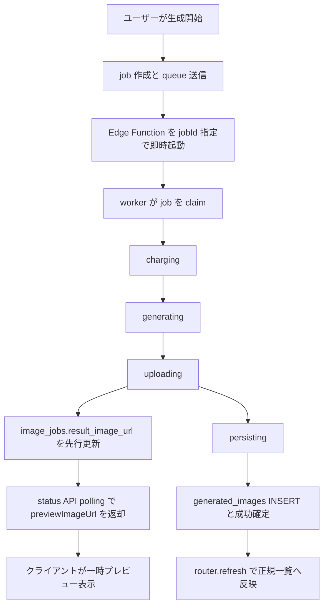
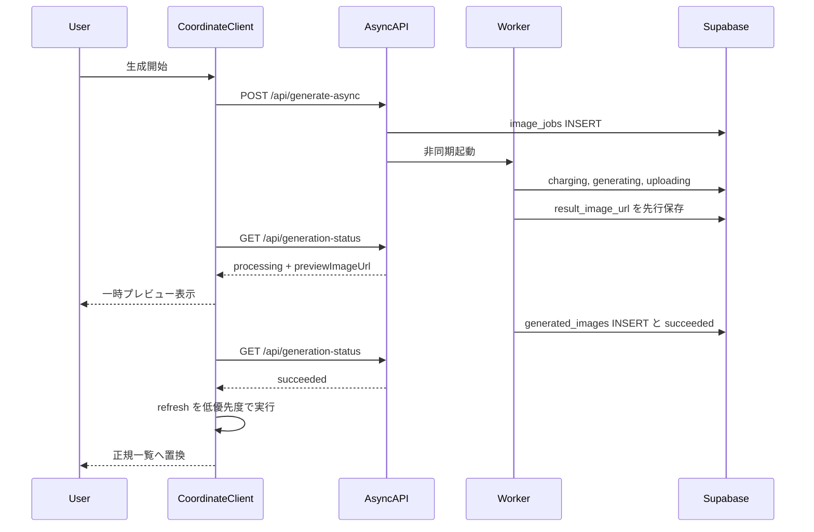

# コーディネート生成レイテンシ短縮計画

作成日: 2026-03-28

## コードベース調査結果

計画作成にあたり、以下を調査済み。

- **適用した指針**:
  - `supabase-postgres-best-practices`
    - `query-missing-indexes`
    - `lock-short-transactions`
    - `lock-skip-locked`
    - `security-rls-performance`
    - `data-batch-inserts`
  - `vercel-react-best-practices`
    - `async-api-routes`
    - `async-parallel`
    - `server-after-nonblocking`
    - `client-swr-dedup`
    - `rerender-dependencies`
- **Supabase 接続**: 確認済み。対象プロジェクトは `https://hnrccaxrvhtbuihfvitc.supabase.co`。
- **現行テーブルとインデックス**:
  - `public.image_jobs`, `public.generated_images`, `public.credit_transactions` を確認済み。
  - `image_jobs` には `id` 主キー、`user_id`, `status`, `created_at` のインデックスがある。
  - `credit_transactions` には `user_id + metadata->>'job_id'` の部分ユニークインデックスがあり、生成課金の冪等性クエリは既に索引化されている。
  - このため、現行の `queueWait / charging / persisting` に対して「まず不足インデックスを足す」優先度は低い。
- **非同期生成の現行フロー**:
  - [app/api/generate-async/handler.ts](../../app/api/generate-async/handler.ts) がジョブ作成、キュー投入、Edge Function の即時起動を行う。
  - [supabase/functions/image-gen-worker/index.ts](../../supabase/functions/image-gen-worker/index.ts) が `pgmq_read` で最大20件取り、`for ... of` で直列処理する。
  - `charging -> generating -> uploading -> persisting` の各段階で `image_jobs.processing_stage` を更新している。
- **ユーザーに結果が見える条件**:
  - 生成画像は `Storage upload` 後に `generated_images` へ INSERT される。
  - `/coordinate` は [features/generation/components/GenerationFormContainer.tsx](../../features/generation/components/GenerationFormContainer.tsx) で 2 秒間隔の polling を行い、終端時に `router.refresh()` して一覧を更新する。
  - 現在は `Storage` 保存済みでも `generated_images` INSERT と `router.refresh()` が終わるまで、ユーザーは一覧上の新画像を見られない。
- **クライアント側の前処理コスト**:
  - [features/generation/lib/async-api.ts](../../features/generation/lib/async-api.ts) で画像の縮小・圧縮・Base64化を行う。
  - [app/api/generate-async/handler.ts](../../app/api/generate-async/handler.ts) で一時画像を Storage に upload してから job を作成する。
  - これは worker ログの `queueWait` より前の体感時間に効く。
- **データレイヤ方針**:
  - [docs/architecture/data.ja.md](../architecture/data.ja.md) と `project-database-context` の方針どおり、複数テーブルの成功確定処理は route handler に散らさず、RPC も選択肢に入れるのが妥当。
- **RLS と status API**:
  - [app/api/generation-status/route.ts](../../app/api/generation-status/route.ts) は `createClient()` で本人の job を取得しており、RLS 保護下で動いている。
  - 現行クエリは `id + user_id` で十分絞られており、RLS 性能面の重大な懸念は見当たらない。

## スコープ

### 含めるもの

- `/coordinate` の「ユーザーが最初の生成結果を見るまでの時間」を短縮する改善案の評価
- `queueWait / charging / uploading / persisting` の短縮余地の分析
- billing 整合性と UI 早見せを両立する実装計画
- DB, worker, status API, React UI の影響範囲整理
- 段階的ロールアウト案

### 含めないもの

- `generating` そのものを速くするモデル変更やプロンプト最適化
- `/style` の挙動変更
- Realtime 導入
- 大規模なギャラリー刷新

## 1. 概要図

### 目標アーキテクチャ

### 現行と改善後の差分

## 2. EARS 要件定義

| ID | タイプ | EARS 文（EN） | 要件文（JA） |
| --- | --- | --- | --- |
| CGL-001 | 状態駆動 | While a coordinate job is still finalizing after Storage upload, the system shall allow the client to show an ephemeral preview without waiting for gallery persistence. | コーディネート job が Storage 保存後の最終確定中である間、システムは gallery 永続化完了を待たずにクライアントが一時プレビューを表示できるようにしなければならない。 |
| CGL-002 | イベント駆動 | When the worker completes Storage upload, the system shall persist a preview-safe URL on the job before final success persistence starts. | worker が Storage 保存を完了したとき、システムは最終成功確定の前に preview 用 URL を job に保存しなければならない。 |
| CGL-003 | 状態駆動 | While billing has not been durably recorded, the system shall not expose a terminal success state to the client. | 課金と成功確定が耐久化される前に、システムはクライアントへ終端成功状態を公開してはならない。 |
| CGL-004 | イベント駆動 | When the route creates a new image job, the system shall attempt a low-latency direct worker invocation in addition to queue durability. | route が新しい image job を作成したとき、システムは queue の耐久性を維持しつつ低レイテンシな worker 直接起動を試行しなければならない。 |
| CGL-005 | 状態駆動 | While `/coordinate` polls a running job, the client shall use a shorter or stage-aware polling interval than the current fixed 2 seconds near completion. | `/coordinate` が進行中 job を polling している間、クライアントは完了間際に現行 2 秒固定より短い、または stage-aware な polling 間隔を使わなければならない。 |
| CGL-006 | 異常系 | If preview exposure fails before persistence succeeds, then the system shall remove the ephemeral preview and keep the job in a non-terminal error path. | 永続化成功前に preview 公開が失敗した場合、システムは一時プレビューを除去し、job を非終端または失敗経路で扱わなければならない。 |

## 3. 提案別評価

### 提案A: `charging` を他処理と並列化する

- **結論**: 不採用
- **理由**:
  - `charging` は課金整合性の起点であり、`generating` より先に完了している必要がある。
  - `lock-short-transactions` の観点では、外部 API 呼び出しより前に最小 DB 更新だけで済ませる現行順序は正しい。
  - 0.59 秒のため、リスクに対して改善幅が小さい。

### 提案B: Storage 保存前にユーザーへ見せる

- **結論**: 不採用
- **理由**:
  - 永続 URL が未確定で、別経路で生画像をブラウザに戻す必要がある。
  - queue/worker 構成と整合せず、失敗時の扱いも複雑になる。
  - 「見せる」より「upload 完了直後に見せる」方が安全。

### 提案C: Storage 保存直後に先に見せ、DB 永続化は後で行う

- **結論**: 採用候補
- **理由**:
  - ユーザーが欲しいのは「最初の1枚を早く見ること」であり、`uploading` 完了後なら公開 URL を持てる。
  - ただし DB と API の意味を分ける必要があり、少なくとも API では `previewImageUrl` を専用フィールドとして返すべきである。
  - UI 側は「仮表示」と「正式保存済み」を明確に分ける必要がある。

### 提案D: optimistic update で gallery に先出しする

- **結論**: 採用候補
- **理由**:
  - Vercel の `async-parallel` と `server-after-nonblocking` の考え方に沿い、`router.refresh()` を待たずに preview を出すのは妥当。
  - ただし正式データ源は引き続き `generated_images` であるべきで、preview は一時状態として管理する。
  - 成功確定後に `router.refresh()` で正規データへ置き換える設計が安全。

### 提案E: `queueWait` を direct invocation で縮める

- **結論**: 採用候補
- **理由**:
  - 現行 worker は `pgmq_read` 後に batch を直列処理するため、即時起動されても前段の待ちが残る。
  - `jobId` を指定した direct path を追加すれば、単発生成の初速を改善しやすい。
  - queue 自体は fallback と耐久性のため残す。

### 提案F: worker の batch 並列化

- **結論**: 後続検討
- **理由**:
  - `lock-skip-locked` の方向性には合うが、Gemini API の外部制約、メモリ、課金整合性の再検証が必要。
  - まず direct invocation と preview で体感改善を取る方が安全。

### 提案G: `persisting` の後処理を background 化する

- **結論**: 採用候補
- **理由**:
  - `credit_transactions.related_generation_id` 更新は表示に不要で、成功確定のクリティカルパスから外せる可能性がある。
  - ただし downstream 参照の有無を確認した上で、`waitUntil` または別 queue に逃がすのが安全。

## 4. ADR（設計判断記録）

### ADR-001: 最適化対象は `total worker time` ではなく `time to first visible result` とする

- **Context**: `generating` が最大だが、`queueWait / uploading / persisting / polling / refresh` も体感に効く。
- **Decision**: 今回の改善は「ユーザーが最初の1枚を見るまでの時間」を最重要指標にする。
- **Reason**: 総処理時間を少し削るより、見え始めを早める方が UX 効果が大きい。
- **Consequence**: preview 表示と polling 短縮を優先する。

### ADR-002: billing は server-authoritative のまま維持し、`charging` の並列化はしない

- **Context**: 課金と生成は失敗時返金、冪等性、再試行が絡む。
- **Decision**: `charging` は現行どおり `generating` の前に完了させる。
- **Reason**: 0.59 秒短縮のために billing 整合性を複雑化する価値がない。
- **Consequence**: `charging` は計測継続のみ、最適化対象から外す。

### ADR-003: preview は API で分離し、DB はまず `result_image_url` の先行セットで始める

- **Context**: `result_image_url` は現在「成功済みの結果 URL」として読まれている。
- **Decision**: DB は最初の段階では `image_jobs.result_image_url` を upload 完了時点で先行セットし、API レイヤで `status !== succeeded` の間だけ `previewImageUrl` として返す。
- **Reason**: 新規カラムを増やさずに進めつつ、クライアントには preview と正式結果の意味を分けて渡せる。
- **Consequence**: API helper にマッピング責務が増える。将来 shared column が危険だと判明した場合のみ専用カラム追加へ切り替える。

### ADR-004: 複数テーブル成功確定は RPC 化を優先検討する

- **Context**: `generated_images INSERT` と `image_jobs UPDATE` は成功確定の核心で、現在はアプリコードで連続実行している。
- **Decision**: `persisting` 改善時は、複数テーブル更新を SQL RPC に寄せる選択肢を優先検討する。
- **Reason**: `lock-short-transactions` とデータレイヤ方針に沿い、外部 API 呼び出し後の短い DB トランザクションに閉じ込める方が安全。
- **Consequence**: route/worker コードは薄くなり、将来の再試行戦略も整理しやすい。

### ADR-005: queue は耐久性のため残し、direct invocation は補助経路とする

- **Context**: queue を外すと worker 起動失敗時に job が詰まりやすい。
- **Decision**: queue を primary durability path としつつ、direct invocation を fast path として追加する。
- **Reason**: 速度と復旧性の両立ができる。
- **Consequence**: direct path 失敗時も queue で最終的に処理される。

## 5. データ設計

### 推奨データ設計

対象テーブル:
- `public.image_jobs`

推奨案:

- 新規カラムは追加しない
- `uploading` 完了直後に `image_jobs.result_image_url` を先行セットする
- `GET /api/generation-status` は
  - `status = succeeded` のときだけ `resultImageUrl` として返す
  - `status != succeeded` かつ URL があるときは `previewImageUrl` として返す

補足:
- テーブル追加は不要であり、当初提案していた `preview_image_url` は「テーブル」ではなく `image_jobs` の追加カラム案だった。
- 現時点では、カラム追加も不要な shared-column 案を第一候補とする。
- ただし今後、`result_image_url` を成功済み前提で直接読む箇所が増えた場合のみ、専用カラム追加を再検討する。

### 既存インデックス評価

- `image_jobs.id` 主キー: direct invocation に十分
- `image_jobs.user_id, status`: in-progress 一覧に十分
- `credit_transactions (user_id, metadata->>'job_id') WHERE transaction_type='consumption'`: 課金取引の逆引きに十分
- したがって、最初のフェーズで新規 index 追加は不要

## 6. 実装フェーズ

### Phase 0: 計測強化

目的:
- worker ログだけでなく、ユーザー体感に効く前後の時間を可視化する。

TODO:
- [features/generation/lib/async-api.ts](../../features/generation/lib/async-api.ts)
  - 画像前処理時間を計測する
- [app/api/generate-async/handler.ts](../../app/api/generate-async/handler.ts)
  - 一時画像 upload, job insert, queue send, worker invoke の各所要時間をログ化する
- [supabase/functions/image-gen-worker/index.ts](../../supabase/functions/image-gen-worker/index.ts)
  - `queueWait` と `charging / generating / uploading / persisting` の計測を継続

参考:
- `vercel-react-best-practices/async-api-routes`

### Phase 1: fast path なしの安全な UX 短縮

目的:
- worker の総時間をいじらず、ユーザーに見えるまでの待ちを減らす。

TODO:
- [features/generation/lib/job-types.ts](../../features/generation/lib/job-types.ts)
  - `previewImageUrl` 型を追加する
- [app/api/generation-status/route.ts](../../app/api/generation-status/route.ts)
  - `status` と `result_image_url` から `previewImageUrl` を導出して返せるようにする
- [features/generation/lib/async-api.ts](../../features/generation/lib/async-api.ts)
  - polling response に `previewImageUrl` を含める
- [features/generation/components/GenerationFormContainer.tsx](../../features/generation/components/GenerationFormContainer.tsx)
  - preview URL を受けたら local state に仮画像を差し込む
  - `router.refresh()` は成功確定後にのみ行う
  - polling 間隔を `processingStage` ベースで短縮する
  - preview から正式画像への切り替え時は、同一表示枠を維持し、正式画像の preload 完了後に差し替える
- [features/generation/components/GeneratedImageGalleryClient.tsx](../../features/generation/components/GeneratedImageGalleryClient.tsx)
  - server 由来画像と preview 由来画像の統合ポイントを作る
  - jobId ベースの一時キーを持ち、正式画像の取得後も即座に unmount/remount しないようにする
- [features/generation/components/GeneratedImageGallery.tsx](../../features/generation/components/GeneratedImageGallery.tsx)
  - preview から正式画像への差し替えを opacity transition で行い、チラつきを抑える

参考:
- `vercel-react-best-practices/async-parallel`
- `vercel-react-best-practices/rerender-dependencies`

### Phase 2: worker と DB の preview 対応

目的:
- `uploading` 完了直後に preview 情報を公開できるようにする。

TODO:
- [supabase/functions/image-gen-worker/index.ts](../../supabase/functions/image-gen-worker/index.ts)
  - Storage 保存完了後に `result_image_url` を先行更新する
  - `persisting` 中でも polling API が preview を返せるようにする
- [app/api/generation-status/in-progress/route.ts](../../app/api/generation-status/in-progress/route.ts)
  - 必要なら preview 情報も返す

注意:
- preview は「正式保存済み」ではない
- persist 失敗時は preview を除去し、error toast を出す
- shared-column 案で意味が曖昧になる箇所が見つかった場合のみ、専用カラム追加へ切り替える

### Phase 3: `queueWait` 短縮の fast path

目的:
- 単発生成の初速を改善する。

TODO:
- [app/api/generate-async/handler.ts](../../app/api/generate-async/handler.ts)
  - Edge Function 呼び出し時に `jobId` を body で渡せるようにする
- [supabase/functions/image-gen-worker/index.ts](../../supabase/functions/image-gen-worker/index.ts)
  - `jobId` 指定時は `pgmq_read` より先に direct claim を試す
  - claim は `status in ('queued','failed')` の update returning で行い、二重処理を防ぐ
  - direct path が失敗しても queue path は残す

参考:
- `supabase-postgres-best-practices/lock-skip-locked`
- `vercel-react-best-practices/async-api-routes`

### Phase 4: `persisting` クリティカルパス短縮

目的:
- 成功確定に必要な DB 往復を減らす。

TODO:
- 新 RPC を検討する
  - 例: `finalize_generated_image_job`
  - `generated_images INSERT`
  - `image_jobs succeeded/completed 更新`
  - 必要最小限の成功確定のみを1トランザクションにまとめる
- [supabase/functions/image-gen-worker/index.ts](../../supabase/functions/image-gen-worker/index.ts)
  - 上記 RPC 呼び出しへ置換
- `credit_transactions.related_generation_id` 更新は別経路へ分離できるか調査する
  - 即時必須でなければ background 化

参考:
- `supabase-postgres-best-practices/lock-short-transactions`
- `docs/architecture/data.ja.md`

### Phase 5: 混雑時の tail latency 改善

目的:
- 同時 job 数が増えたときの遅延悪化を抑える。

TODO:
- `MAX_MESSAGES` の見直し
- bounded concurrency の実験
- direct invocation と queue path の成功率比較

注意:
- Gemini レート制限と Edge Function メモリを観測しながら段階導入する
- このフェーズは Phase 1-4 の後でよい

## 7. 変更ファイル候補

### DB / Supabase

- `supabase/functions/image-gen-worker/index.ts`

### API / Server

- `app/api/generate-async/handler.ts`
- `app/api/generation-status/route.ts`
- `app/api/generation-status/in-progress/route.ts`
- `features/generation/lib/async-generation-job-repository.ts`
- `features/generation/lib/job-types.ts`
- `features/generation/lib/async-api.ts`

### UI / Client

- `features/generation/components/GenerationFormContainer.tsx`
- `features/generation/components/GeneratedImageGalleryClient.tsx`
- `features/generation/components/GeneratedImageGallery.tsx`

### Docs / Tests

- `docs/architecture/data.ja.md`
- `docs/API.md`
- `docs/openapi.yaml`
- `tests/integration/api/generate-async-route.test.ts`
- `tests/integration/api/generation-status-route.test.ts`
- `tests/integration/api/generation-status-in-progress-route.test.ts`
- `tests/unit/**` の generation 関連 helper テスト

## 8. テスト観点

- preview URL が `processing/persisting` 中だけ返ること
- preview 表示後に `succeeded` で正規 gallery に置換されること
- preview 表示後に `failed` になったら一時画像が消えること
- preview から正式画像への差し替え時に DOM の unmount/remount が起きず、視覚的なチラつきがないこと
- `queueWait` 短縮用 fast path が失敗しても queue 経由で最終的に処理されること
- direct invocation と queue worker が同時に当たっても二重課金・二重 INSERT が起きないこと
- `credit_transactions.related_generation_id` を background 化しても downstream 機能が壊れないこと
- polling 間隔短縮で request 数が過剰に増えないこと

## 9. リスクと対策

| リスク | 内容 | 対策 |
| --- | --- | --- |
| preview と正式保存の不一致 | upload 後に persist が失敗する | preview を一時状態に限定し、失敗時は UI から除去する |
| 二重処理 | direct path と queue path が同じ job を取りに行く | `status` 条件付き claim を単一 update で行う |
| billing 破綻 | 最適化で課金順序が崩れる | `charging` は順序維持し、最適化対象から外す |
| request 増加 | polling 短縮で status API が増える | stage-aware interval と stop 条件を設ける |
| 既存呼び出し側の意味論破壊 | `result_image_url` を preview と混用する | DB は共有しても API は `previewImageUrl` と `resultImageUrl` を分離し、呼び出し側を helper 経由へ寄せる |

## 10. ロールバック方針

- preview UI が不安定なら、まずクライアント側の preview 表示を feature flag で無効化する
- direct invocation が不安定なら、route 側で `jobId` 指定呼び出しをやめて queue only に戻す
- RPC 化で問題が出た場合は、worker の既存逐次更新フローへ戻す

## 11. 推奨実施順

1. Phase 0 で end-to-end 計測を増やす
2. Phase 1 と Phase 2 で preview 表示を実装する
3. 効果測定後に Phase 3 の direct invocation を入れる
4. 必要なら Phase 4 の RPC 化で `persisting` を削る
5. 最後に Phase 5 の並列化実験を行う

## 12. 結論

今回の提案群のうち、慎重に進めるべき観点で見ると次が有力。

- **採用優先**:
  - upload 完了後の preview 早見せ
  - polling / refresh の見直し
  - direct invocation による `queueWait` 短縮
- **後回し**:
  - worker batch 並列化
  - 課金処理の速度改善
- **不採用**:
  - Storage 保存前の表示
  - `charging` の並列化

最も安全で効果が大きいのは、`uploading` 完了後の preview 表示と、`router.refresh()` 依存からの脱却である。
