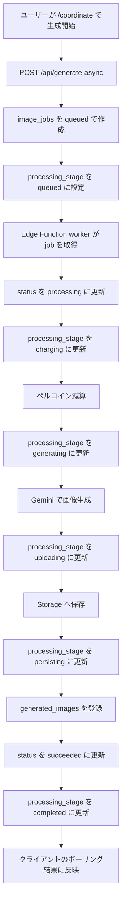
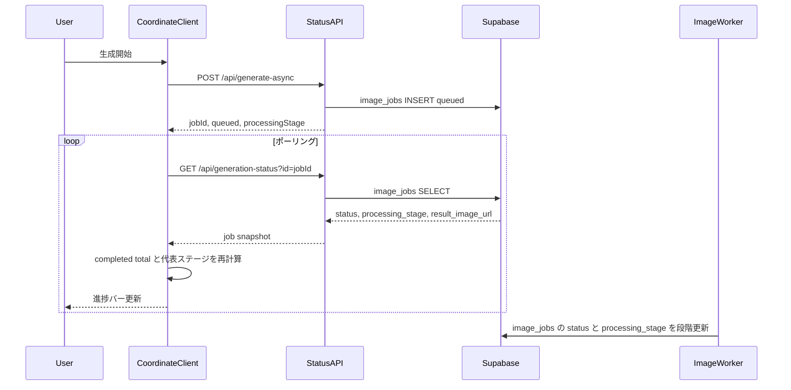
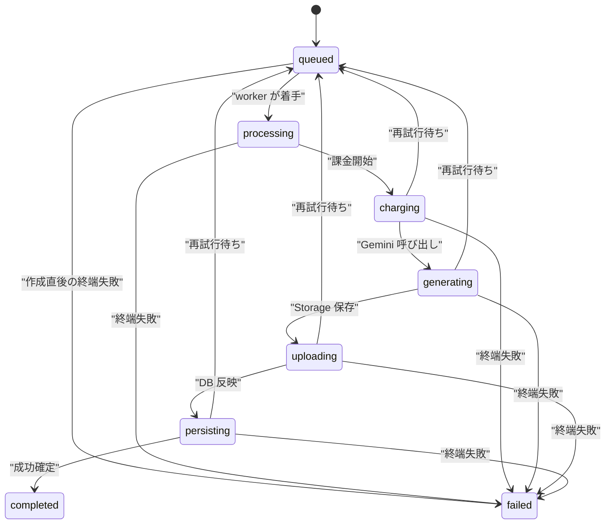

# コーディネート生成ステージステータスバー実装計画

作成日: 2026-03-27

## コードベース調査結果

計画作成にあたり、以下を調査済み。

- **Supabase接続**: 確認済み。`public.image_jobs` は 454 件、`public.generated_images` は 519 件存在する。現行 `image_jobs` には `processing_stage` カラムはなく、`status` は `queued / processing / succeeded / failed` の4値のみ。
- **既存 DB 制約**: [supabase/migrations/20260115054748_add_image_jobs_queue.sql](../../supabase/migrations/20260115054748_add_image_jobs_queue.sql) で `image_jobs` が作成され、既存 RLS は本人の `SELECT / INSERT / UPDATE / DELETE` を許可している。今回の追加カラムは既存 RLS の範囲で扱える。
- **非同期生成のアーキテクチャ**: [docs/architecture/data.ja.md](../architecture/data.ja.md) にある通り、`/api/generate-async` が `image_jobs` を `queued` で作成し、Edge Function ワーカーが `processing` に更新して課金、Gemini 呼び出し、Storage 保存、`generated_images` 登録、`succeeded` 更新まで担う。
- **コーディネート画面の現状 UI**: [features/generation/components/GenerationFormContainer.tsx](../../features/generation/components/GenerationFormContainer.tsx) は、生成中に青い簡易バナーだけを表示している。進捗バーや段階表示はまだない。
- **コーディネート画面の状態管理**: [features/generation/components/GenerationFormContainer.tsx](../../features/generation/components/GenerationFormContainer.tsx) が複数ジョブを投入し、`pollGenerationStatus()` で各ジョブをポーリングして `completedCount` と `generatingCount` を更新している。`/coordinate` は単発生成ではなく複数ジョブ集約フローである。
- **生成状態の解除タイミング**: [features/generation/components/GeneratedImageGalleryClient.tsx](../../features/generation/components/GeneratedImageGalleryClient.tsx) は、新規画像が 1 件でもサーバーから届くと `isGenerating` を `false` に戻す。リッチな完了演出を入れるならこの挙動を見直す必要がある。
- **再利用できる既存 UI**: [features/style/components/StyleGenerationStatusCard.tsx](../../features/style/components/StyleGenerationStatusCard.tsx) に、進捗バー付きカード UI がある。見た目は流用可能だが、[features/style/hooks/useGenerationFeedback.ts](../../features/style/hooks/useGenerationFeedback.ts) は `/style` 専用の擬似進捗ロジックなので、`/coordinate` にはそのまま使わない方が整合的。
- **ステータス API の現状**: [app/api/generation-status/route.ts](../../app/api/generation-status/route.ts) は `id / status / resultImageUrl / errorMessage` のみ返し、[app/api/generation-status/in-progress/route.ts](../../app/api/generation-status/in-progress/route.ts) も `id / status / createdAt` しか返していない。`processing_stage` を表示したいなら API 拡張が必要。
- **ワーカー内部の実ステージ**: [supabase/functions/image-gen-worker/index.ts](../../supabase/functions/image-gen-worker/index.ts) では、実際には `processing` の中で「課金」「Gemini 呼び出し」「Storage 保存」「generated_images INSERT」「成功/失敗更新」まで順番に処理している。ユーザー向けの実進捗はこの段階を `image_jobs` に書き戻すことで表現できる。
- **API 契約文書**: [docs/API.md](../API.md) と [docs/openapi.yaml](../openapi.yaml) に `generation-status` 契約があり、レスポンス拡張時は同期が必要。
- **既存テスト**: [tests/integration/api/generation-status-route.test.ts](../../tests/integration/api/generation-status-route.test.ts) と [tests/integration/api/generate-async-route.test.ts](../../tests/integration/api/generate-async-route.test.ts) が API 回帰ポイント。`GenerationFormContainer` の UI ロジックには現状専用テストがないため、今回追加した方が安全。
- **データレイヤ方針**: [docs/architecture/data.ja.md](../architecture/data.ja.md) と [project-database-context](../../.agents/skills/project-database-context/SKILL.md) の方針どおり、今回は単一テーブル `image_jobs` の状態更新で足りるため新規 RPC は不要。ワーカーと route handler で `processing_stage` を一貫更新する。

## スコープ

### 含めるもの

- `/coordinate` の生成中表示を、実ステージ駆動のステータスカードへ置き換える
- `image_jobs.processing_stage` の追加
- `generation-status` 系 API のレスポンス拡張
- Edge Function ワーカーによる中間ステージ更新
- 複数ジョブ時の集約進捗ロジック
- i18n 文言追加
- 関連テストと API / データアーキテクチャ文書の更新

### 含めないもの

- `/style` の UX ロジック変更
- Supabase Realtime 導入や WebSocket 化
- 管理画面でのジョブステージ閲覧
- 過去履歴の厳密なステージ復元
- 画像生成処理そのものの性能改善

## 1. 概要図

### 生成ステージ更新フロー



### クライアント表示シーケンス



### ステージ状態遷移



## 2. EARS 要件定義

| ID | タイプ | EARS 文（EN） | 要件文（JA） |
| --- | --- | --- | --- |
| CGS-001 | イベント駆動 | When a coordinate generation request creates a new image job, the system shall persist `processing_stage = queued` together with `status = queued`. | コーディネート生成リクエストが新しい `image_jobs` 行を作成したとき、システムは `status = queued` と同時に `processing_stage = queued` を保存しなければならない。 |
| CGS-002 | 状態駆動 | While one or more coordinate jobs remain unfinished, the system shall display a progress card on `/coordinate` instead of the current simple spinner banner. | 1件以上のコーディネートジョブが未完了である間、システムは `/coordinate` 上で現在の簡易スピナーバナーの代わりに進捗カードを表示しなければならない。 |
| CGS-003 | イベント駆動 | When the worker starts charging Percoins for a job, the system shall update that job to `status = processing` and `processing_stage = charging`. | ワーカーがジョブのペルコイン減算を開始したとき、システムはそのジョブを `status = processing` かつ `processing_stage = charging` に更新しなければならない。 |
| CGS-004 | 状態駆動 | While the worker is waiting for Gemini image generation, the system shall store `processing_stage = generating` for the active job. | ワーカーが Gemini の画像生成結果を待っている間、システムはアクティブジョブに `processing_stage = generating` を保存しなければならない。 |
| CGS-005 | 状態駆動 | While the worker is saving image output to Storage or persisting metadata, the system shall expose `processing_stage = uploading` or `processing_stage = persisting` accordingly. | ワーカーが画像を Storage に保存している間、またはメタデータを永続化している間、システムはそれぞれ `processing_stage = uploading` または `processing_stage = persisting` を公開しなければならない。 |
| CGS-006 | イベント駆動 | When `GET /api/generation-status` or `GET /api/generation-status/in-progress` is called, the system shall return `processingStage` in addition to the existing status fields. | `GET /api/generation-status` または `GET /api/generation-status/in-progress` が呼ばれたとき、システムは既存の状態フィールドに加えて `processingStage` を返さなければならない。 |
| CGS-007 | 状態駆動 | While multiple coordinate jobs are in progress, the client shall aggregate `completed / total` and derive a representative progress bar value from each job's terminal status or processing stage. | 複数のコーディネートジョブが進行中である間、クライアントは `completed / total` を集約し、各ジョブの終端状態または `processing_stage` から代表進捗バー値を算出しなければならない。 |
| CGS-008 | 状態駆動 | While the progress card is visible on `/coordinate`, the system shall render both the message above the bar and the message below the bar from randomized copy pools keyed by `processing_stage`, following the same presentation pattern as `/style`. | `/coordinate` で進捗カードが表示されている間、システムはバーの上とバーの下の両方の文言を `processing_stage` ごとのランダム文言プールから選び、`/style` と同じ表示パターンで描画しなければならない。 |
| CGS-009 | 異常系 | If a job has no recognized processing stage, then the system shall fall back to the legacy queued or processing copy and shall not break the progress UI. | ジョブに認識可能な `processing_stage` がない場合、システムは従来の queued または processing 文言へフォールバックし、進捗 UI を壊してはならない。 |
| CGS-010 | イベント駆動 | When a job reaches a terminal success or failure, the system shall set `processing_stage = completed` or `processing_stage = failed` and shall stop showing that job as active progress. | ジョブが終端の成功または失敗に達したとき、システムは `processing_stage = completed` または `processing_stage = failed` を設定し、そのジョブをアクティブ進捗として表示し続けてはならない。 |
| CGS-011 | 状態駆動 | While the `/style` screen keeps using its own pseudo-progress behavior, the shared visual status card shall remain compatible with both `/style` and `/coordinate`. | `/style` 画面が既存の擬似進捗挙動を維持している間、共有する視覚部品のステータスカードは `/style` と `/coordinate` の両方で互換性を保たなければならない。 |

## 3. ADR（設計判断記録）

### ADR-001: 実進捗は `status` ではなく `processing_stage` で表現する

- **Context**: 現行 `status` は `queued / processing / succeeded / failed` の4値で、ユーザー向けの中間段階を表現できない。
- **Decision**: `image_jobs` に `processing_stage` を追加し、ユーザー向けの進行段階はこのカラムで表現する。
- **Reason**: 既存 `status` は監視・課金整合性・失敗再試行の制御に使われており、そこへ表示用の粒度を混ぜるとワーカー制御と UI 要件が干渉する。
- **Consequence**: API、型、migration、worker 更新箇所が増えるが、表示ロジックと処理制御を分離できる。

### ADR-002: ステージは固定語彙で管理し、外部サービスの内部進捗率は扱わない

- **Context**: Gemini API はパーセンテージ進捗を返さないため、「何%生成済みか」は正確に分からない。
- **Decision**: `processing_stage` は `queued / processing / charging / generating / uploading / persisting / completed / failed` の固定語彙で扱う。
- **Reason**: 実際に取得できる情報だけで UI を構築した方が、表示の信頼性が高い。
- **Consequence**: 進捗バーの値は stage-to-progress マップによる擬似比率になるが、段階は実データに基づく。ユーザー向けテキストは raw stage 名ではなく、stage ごとのランダム文言プールから選ぶ。

### ADR-003: `/coordinate` の進捗バーは「複数ジョブの加重平均」で計算する

- **Context**: `/coordinate` は複数枚同時生成が可能で、1本のジョブだけを見ても全体進捗にならない。
- **Decision**: 各ジョブの `status / processing_stage` を 0.0 から 1.0 の進捗率へ変換し、その平均をカードのバー幅に使う。
- **Reason**: `completed / total` だけでは、全ジョブが `processing` 中の間にバーが止まって見える。各ジョブの実ステージを進捗率へ射影すれば、多枚数生成でも自然に動く。
- **Consequence**: フロントに集約 helper が必要になる。

### ADR-004: `/style` からは「見た目のカード部品」だけを共通化し、擬似進捗フックは分離する

- **Context**: `/style` は単発同期生成で、[useGenerationFeedback.ts](../../features/style/hooks/useGenerationFeedback.ts) の擬似進捗とタイピング演出が成立している。一方 `/coordinate` は実ステージ駆動にしたい。
- **Decision**: 共有するのはカード UI コンポーネントと文言の出し方のパターンとし、`/style` の擬似進捗フックはそのまま残す。`/coordinate` では `processing_stage` ごとのランダム文言プールを使う集約 helper を新設する。
- **Reason**: 見た目と演出トーンは揃えたいが、進捗の意味論は分けた方が保守しやすい。
- **Consequence**: `StyleGenerationStatusCard` は共通名称へ移設し、`StylePageClient` の import だけ差し替える。`/coordinate` 側には stage ごとのランダム copy テーブルが追加で必要になる。

### ADR-005: Realtime は使わず、既存ポーリングを拡張する

- **Context**: 現行の `/coordinate` は既にポーリングベースで動いている。
- **Decision**: `generation-status` 系 API に `processingStage` を追加し、既存ポーリング経路のまま UI を更新する。
- **Reason**: 最小変更で導入でき、認証・RLS・監視の経路も既存のまま維持できる。
- **Consequence**: 将来 Realtime 化する余地は残るが、今回の計画には含めない。

### ADR-006: 文言は flat な i18n key と専用 helper で整理する

- **Context**: 現行の `messages/ja.ts` / `messages/en.ts` は flat key ベースで管理されており、`useMessages()` や `t.raw()` を前提にした深いメッセージネストはまだ採用されていない。
- **Decision**: `processing_stage` ごとの文言は flat key を維持しつつ、`features/generation/lib/coordinate-stage-copy.ts` のような専用 helper に key 群をまとめる。各 stage について「バー上 5件」「バー下 5件」の key を最初から作る。
- **Reason**: 既存の i18n パターンを崩さず、あとから文言を差し替える人が `messages/*.ts` と helper の 2 箇所を見るだけで済む。
- **Consequence**: key 数は増えるが、命名規則と配置順を固定すれば編集しやすい。コンポーネントに key 名を直書きしないことで保守性を上げる。実装完了後は、各 stage ごとに 10 個の文言キーを埋め替えるだけで演出を調整できる。

## 4. データ設計

### 追加カラム

対象テーブル:
- `public.image_jobs`

追加カラム案:

| カラム | 型 | NULL | Default | 用途 |
| --- | --- | --- | --- | --- |
| `processing_stage` | `text` | `NOT NULL` | `'queued'` | ユーザー向け進行段階の保存 |

CHECK 制約案:

- `processing_stage IN ('queued', 'processing', 'charging', 'generating', 'uploading', 'persisting', 'completed', 'failed')`

### migration 方針

- 新規 migration を追加する
- 既存行の backfill は以下で行う
  - `status = queued` -> `processing_stage = queued`
  - `status = processing` -> `processing_stage = processing`
  - `status = succeeded` -> `processing_stage = completed`
  - `status = failed` -> `processing_stage = failed`
- 既存の RLS は列追加だけでは変更不要
- `status` 用インデックスが既にあるため、今回 `processing_stage` 単独インデックスは追加しない

### ステージ更新タイミング

| タイミング | `status` | `processing_stage` |
| --- | --- | --- |
| job 作成直後 | `queued` | `queued` |
| worker が着手した直後 | `processing` | `processing` |
| 減算処理の直前 | `processing` | `charging` |
| Gemini 呼び出し直前から応答待ち | `processing` | `generating` |
| Storage 保存中 | `processing` | `uploading` |
| `generated_images` 登録と成功反映中 | `processing` | `persisting` |
| 成功確定 | `succeeded` | `completed` |
| 再試行待ちへ戻す失敗 | `queued` | `queued` |
| 終端失敗 | `failed` | `failed` |

## 5. 実装フェーズ

### Phase 1: DB スキーマと型定義の拡張

目的:
- `image_jobs` が進行段階を保持できるようにする。

TODO:
- 新 migration を追加する
  - 例: `supabase/migrations/<timestamp>_add_image_job_processing_stage.sql`
  - `processing_stage` カラム追加
  - 既存データ backfill
  - CHECK 制約追加
- [features/generation/lib/job-types.ts](../../features/generation/lib/job-types.ts)
  - `ImageJobStatus` とは別に `ImageJobProcessingStage` 型を追加する
  - `ImageJob` と `ImageJobUpdateInput` に `processing_stage` を追加する
- `.cursor/rules/database-design.mdc`
  - `image_jobs` の主要カラム説明に `processing_stage` を追加する

参考:
- [supabase/migrations/20260115054748_add_image_jobs_queue.sql](../../supabase/migrations/20260115054748_add_image_jobs_queue.sql)
- [features/generation/lib/job-types.ts](../../features/generation/lib/job-types.ts)
- [.cursor/rules/database-design.mdc](../../.cursor/rules/database-design.mdc)

### Phase 2: job 作成と status API の契約更新

目的:
- 新しい job と status API が `processingStage` を返せるようにする。

TODO:
- [app/api/generate-async/handler.ts](../../app/api/generate-async/handler.ts)
  - `image_jobs` 作成時に `processing_stage: "queued"` を保存する
- [features/generation/lib/async-generation-job-repository.ts](../../features/generation/lib/async-generation-job-repository.ts)
  - `createImageJob()` の戻り値に `processing_stage` を含めるか、少なくとも insert payload を型安全に通す
- [features/generation/lib/async-api.ts](../../features/generation/lib/async-api.ts)
  - `AsyncGenerationResponse`, `AsyncGenerationStatus`, `JobStatus` に `processingStage` を追加する
- [app/api/generation-status/route.ts](../../app/api/generation-status/route.ts)
  - `resultImageUrl` と同様に `processingStage` を返す
- [app/api/generation-status/in-progress/route.ts](../../app/api/generation-status/in-progress/route.ts)
  - `jobs` 配列の各要素に `processingStage` を含める
- [docs/API.md](../API.md) / [docs/openapi.yaml](../openapi.yaml)
  - `generation-status` と `generation-status/in-progress` のレスポンス例を更新する

参考:
- [app/api/generate-async/handler.ts](../../app/api/generate-async/handler.ts)
- [app/api/generation-status/route.ts](../../app/api/generation-status/route.ts)
- [app/api/generation-status/in-progress/route.ts](../../app/api/generation-status/in-progress/route.ts)
- [docs/API.md](../API.md)

### Phase 3: Edge Function worker の段階更新

目的:
- 実処理に沿って `processing_stage` が更新されるようにする。

TODO:
- [supabase/functions/image-gen-worker/index.ts](../../supabase/functions/image-gen-worker/index.ts)
  - `status = processing` へ更新する箇所で `processing_stage = processing` をセットする
  - ペルコイン減算前に `processing_stage = charging`
  - Gemini 呼び出し前に `processing_stage = generating`
  - Storage アップロード前に `processing_stage = uploading`
  - `generated_images` insert 前に `processing_stage = persisting`
  - 成功更新時に `processing_stage = completed`
  - retryable failure で `queued` に戻す時は `processing_stage = queued`
  - terminal failure で `failed` にする時は `processing_stage = failed`
- stale job 処理や減算失敗分岐でも、`processing_stage` が `status` と矛盾しないように揃える

参考:
- [supabase/functions/image-gen-worker/index.ts](../../supabase/functions/image-gen-worker/index.ts)

### Phase 4: `/coordinate` 用の集約進捗ロジック追加

目的:
- 複数ジョブの `status / processing_stage` から、カード表示用の progress と copy を計算する。

TODO:
- 新 helper を追加する
  - 例: `features/generation/lib/job-progress.ts`
  - `processing_stage` ごとの進捗率マップを定義する
  - 例:
    - `queued = 0.05`
    - `processing = 0.12`
    - `charging = 0.2`
    - `generating = 0.65`
    - `uploading = 0.82`
    - `persisting = 0.92`
    - `completed / failed = 1`
  - 全ジョブ平均から 0-100 のバー値を返す
  - 未完了ジョブの代表ステージを返す
  - 代表ステージに紐づく「バー上文言」「バー下文言」のランダム文言候補を返す
  - `processing_stage` 欠落時は `status` ベースでフォールバックする
- [features/generation/components/GenerationFormContainer.tsx](../../features/generation/components/GenerationFormContainer.tsx)
  - 各 job の最新 snapshot を `Map<jobId, status + processingStage>` で保持する
  - `completedCount` と別に `jobProgressState` を更新する
  - 再開時の `getInProgressJobs(true)` でも stage を seed する
- `isGenerating` の解除条件を見直す
  - 現状の「新着画像が1枚でも来たら false」から、少なくとも全 job の終端判定が済むまではカードを残す方針を採る
  - 画像ギャラリー側のスケルトン置換は維持しつつ、カード表示用フラグを別管理する

参考:
- [features/generation/components/GenerationFormContainer.tsx](../../features/generation/components/GenerationFormContainer.tsx)
- [features/generation/components/GeneratedImageGalleryClient.tsx](../../features/generation/components/GeneratedImageGalleryClient.tsx)

### Phase 5: ステータスカード UI の共通化と `/coordinate` 反映

目的:
- `/style` の見た目と文言演出パターンを再利用しつつ、`/coordinate` では stage ごとのランダム文言を表示する。

TODO:
- [features/style/components/StyleGenerationStatusCard.tsx](../../features/style/components/StyleGenerationStatusCard.tsx)
  - 共通コンポーネントへ移設する
  - 例: `features/generation/components/GenerationStatusCard.tsx`
  - 必要なら `showCursor` prop を追加し、`/coordinate` では静的表示も選べるようにする
- [features/style/components/StylePageClient.tsx](../../features/style/components/StylePageClient.tsx)
  - 新しい共通カードへ import を差し替える
- [features/generation/components/GenerationFormContainer.tsx](../../features/generation/components/GenerationFormContainer.tsx)
  - 現在の青い簡易バナーを削除し、共通カードを表示する
  - タイトルは `completed / total` と代表 stage から構成する
  - バーの上と下の文言は、`/style` と同じくランダム表示パターンに寄せる
  - ただし文言の選択元は `processing_stage` ごとのプールにする
- `features/generation/lib/coordinate-stage-copy.ts`
  - `processing_stage` ごとの message key と hint key を一元管理する
  - 例:
    - `queued: { messages: ["generationStageQueuedMessage1", ..., "generationStageQueuedMessage5"], hints: ["generationStageQueuedHint1", ..., "generationStageQueuedHint5"] }`
    - `charging: { messages: [...5件], hints: [...5件] }`
  - コンポーネントから i18n key 名を直接参照しない構成にする
- [messages/ja.ts](../../messages/ja.ts) / [messages/en.ts](../../messages/en.ts)
  - `/coordinate` 用に以下を追加する
    - `generationProgressTitle`
    - `generationProgressCount`
    - `generationStageQueuedMessage1..5`
    - `generationStageQueuedHint1..5`
    - `generationStageProcessingMessage1..5`
    - `generationStageProcessingHint1..5`
    - `generationStageChargingMessage1..5`
    - `generationStageChargingHint1..5`
    - `generationStageGeneratingMessage1..5`
    - `generationStageGeneratingHint1..5`
    - `generationStageUploadingMessage1..5`
    - `generationStageUploadingHint1..5`
    - `generationStagePersistingMessage1..5`
    - `generationStagePersistingHint1..5`
    - `generationStageCompletedMessage1..5`
    - `generationStageCompletedHint1..5`
    - `generationStageFailedMessage1..5`
    - `generationStageFailedHint1..5`
  - `messages/ja.ts` と `messages/en.ts` では、stage ごとにまとまったコメントブロックで配置順を固定する
  - 初期実装の段階で、全 stage 分の 5件 x 2系統の key を空欄にせず埋める
  - 文言を後から入れ替えやすいよう、1 stage ごとに同じ並び順でブロック化する
  - 初期値は `/style` の既存文言群をベースに複製または軽微調整した仮文言で埋め、実装完了後にユーザーが差し替えられる状態にする

参考:
- [features/style/components/StyleGenerationStatusCard.tsx](../../features/style/components/StyleGenerationStatusCard.tsx)
- [features/style/components/StylePageClient.tsx](../../features/style/components/StylePageClient.tsx)
- [messages/ja.ts](../../messages/ja.ts)
- [messages/en.ts](../../messages/en.ts)

### Phase 6: テストと文書の同期

目的:
- 挙動の退行を防ぎ、仕様と契約を同期する。

TODO:
- [tests/integration/api/generation-status-route.test.ts](../../tests/integration/api/generation-status-route.test.ts)
  - `processingStage` を返すケースを追加する
  - `failed` 正規化時にも `processingStage` が落ちないことを確認する
- [tests/integration/api/generate-async-route.test.ts](../../tests/integration/api/generate-async-route.test.ts)
  - job 作成レスポンスまたは repository insert payload に `processing_stage = queued` が含まれることを確認する
- 新規 unit test を追加する
  - 例: `tests/unit/features/generation/job-progress.test.ts`
  - stage-to-progress マップ
  - 複数 job の集約
  - 欠落 stage のフォールバック
- 新規 component test を追加する
  - 例: `tests/unit/features/generation/generation-form-container-status.test.tsx`
  - 進捗カード表示
  - 完了枚数表示
  - 代表 stage 表示
- [docs/architecture/data.ja.md](../architecture/data.ja.md) / [docs/architecture/data.en.md](../architecture/data.en.md)
  - 非同期画像生成フローに `processing_stage` の追記
- 必要であれば spec ドキュメントを追加する
  - 例: `docs/specs/api/generation_status_route_spec.yaml`
  - ただし最小変更を優先する場合は、まず API 文書とテスト同期を優先する

参考:
- [tests/integration/api/generation-status-route.test.ts](../../tests/integration/api/generation-status-route.test.ts)
- [tests/integration/api/generate-async-route.test.ts](../../tests/integration/api/generate-async-route.test.ts)
- [docs/architecture/data.ja.md](../architecture/data.ja.md)
- [docs/openapi.yaml](../openapi.yaml)

## 6. 変更ファイル一覧

実装対象候補:

- `supabase/migrations/<timestamp>_add_image_job_processing_stage.sql`
- [features/generation/lib/job-types.ts](../../features/generation/lib/job-types.ts)
- [features/generation/lib/async-generation-job-repository.ts](../../features/generation/lib/async-generation-job-repository.ts)
- [features/generation/lib/async-api.ts](../../features/generation/lib/async-api.ts)
- [features/generation/lib/job-progress.ts](../../features/generation/lib/job-progress.ts)
- `features/generation/lib/coordinate-stage-copy.ts`
- [features/generation/components/GenerationFormContainer.tsx](../../features/generation/components/GenerationFormContainer.tsx)
- [features/generation/components/GeneratedImageGalleryClient.tsx](../../features/generation/components/GeneratedImageGalleryClient.tsx)
- `features/generation/components/GenerationStatusCard.tsx`
- [features/style/components/StyleGenerationStatusCard.tsx](../../features/style/components/StyleGenerationStatusCard.tsx)
- [features/style/components/StylePageClient.tsx](../../features/style/components/StylePageClient.tsx)
- [app/api/generate-async/handler.ts](../../app/api/generate-async/handler.ts)
- [app/api/generation-status/route.ts](../../app/api/generation-status/route.ts)
- [app/api/generation-status/in-progress/route.ts](../../app/api/generation-status/in-progress/route.ts)
- [supabase/functions/image-gen-worker/index.ts](../../supabase/functions/image-gen-worker/index.ts)
- [messages/ja.ts](../../messages/ja.ts)
- [messages/en.ts](../../messages/en.ts)
- [docs/API.md](../API.md)
- [docs/openapi.yaml](../openapi.yaml)
- [docs/architecture/data.ja.md](../architecture/data.ja.md)
- [docs/architecture/data.en.md](../architecture/data.en.md)
- [.cursor/rules/database-design.mdc](../../.cursor/rules/database-design.mdc)
- [tests/integration/api/generation-status-route.test.ts](../../tests/integration/api/generation-status-route.test.ts)
- [tests/integration/api/generate-async-route.test.ts](../../tests/integration/api/generate-async-route.test.ts)
- `tests/unit/features/generation/job-progress.test.ts`
- `tests/unit/features/generation/generation-form-container-status.test.tsx`

## 7. テスト観点

### DB / Worker

- migration 適用後、既存行に `processing_stage` が入り、CHECK 制約違反がないこと
- worker 成功系で `queued -> processing -> charging -> generating -> uploading -> persisting -> completed` の順に更新されること
- retryable failure で `status = queued` と `processing_stage = queued` に戻ること
- terminal failure で `status = failed` と `processing_stage = failed` になること

### API

- `GET /api/generation-status` が `processingStage` を返すこと
- `GET /api/generation-status/in-progress` が各 job に `processingStage` を返すこと
- `POST /api/generate-async` の新規 job に `processing_stage = queued` が入ること
- `processing_stage` 欠落レコードを読んだ時でも API が 500 にならず、UI フォールバック可能な値を返せること

### UI

- 単一 job 時に stage 変化に応じてカード文言とバーが更新されること
- 単一 job 時にバーの上と下の文言が、stage ごとの候補からランダムに選ばれること
- i18n 文言キーが `coordinate-stage-copy.ts` に集約され、コンポーネントへ散らばっていないこと
- 各 stage について `Message1..5` と `Hint1..5` が揃っていること
- 複数 job 時に `completed / total` とバー値が集約されること
- 最初の画像が一覧に現れても、残ジョブがある間はカードが消えないこと
- 全 job 終端後にカードが適切に消えること
- `/style` のカード見た目が壊れていないこと

### 回帰

- 既存のトースト、チュートリアル、`generation-complete` event のタイミングが壊れていないこと
- 画像ギャラリーの無限スクロールが影響を受けないこと
- `/coordinate` 再訪時の「未完了ジョブ再開」が stage 付きで復元されること

## 8. ロールバック方針

1. 先にアプリコードをロールバックし、`processingStage` を参照しない旧 UI / API ロジックへ戻す。
2. worker 側の `processing_stage` 更新を止めても、追加カラムは既存処理を壊さないため、DB は即時ロールバック不要とする。
3. カラム追加 migration の down を即時適用するより、まず列を未使用化して安定性を確認する。
4. 本当に列削除が必要な場合だけ、別 migration で `processing_stage` を drop する。

## 9. 実装順の推奨

1. migration と型定義
2. `generate-async` と status API の契約拡張
3. worker の stage 更新
4. 進捗集約 helper
5. 共通カード化と `/coordinate` 差し替え
6. テストと文書同期

## 10. 残課題

- `processing_stage` を `text` のまま持つか、将来 enum 化するかは今回は見送る
- 代表ステージを「最も進んだ job」で出すか「最も多い stage」で出すかは、実装時に UI 確認で微調整余地がある
- `GenerationFormContainer` の責務がさらに大きくなるため、着手時に helper 抽出を前提に進める方が安全

## 11. 文言雛形の想定

実装時は、各 stage について以下の 10 キーを最初から用意する。

- バー上の文言:
  - `generationStage<StageName>Message1`
  - `generationStage<StageName>Message2`
  - `generationStage<StageName>Message3`
  - `generationStage<StageName>Message4`
  - `generationStage<StageName>Message5`
- バー下の文言:
  - `generationStage<StageName>Hint1`
  - `generationStage<StageName>Hint2`
  - `generationStage<StageName>Hint3`
  - `generationStage<StageName>Hint4`
  - `generationStage<StageName>Hint5`

対象 stage:

- `Queued`
- `Processing`
- `Charging`
- `Generating`
- `Uploading`
- `Persisting`
- `Completed`
- `Failed`

例:

```ts
// messages/ja.ts
coordinate: {
  generationProgressTitle: "画像を生成中...",
  generationProgressCount: "{completed} / {total} 枚完了",

  // queued
  generationStageQueuedMessage1: "順番を整えています...",
  generationStageQueuedMessage2: "準備を進めています...",
  generationStageQueuedMessage3: "もうすぐ生成に入ります...",
  generationStageQueuedMessage4: "コーデの段取りを整えています...",
  generationStageQueuedMessage5: "最初の確認をしています...",
  generationStageQueuedHint1: "生成キューに登録済みです。",
  generationStageQueuedHint2: "順番が来るまで少しお待ちください。",
  generationStageQueuedHint3: "まもなく処理を開始します。",
  generationStageQueuedHint4: "混雑状況により少し時間がかかる場合があります。",
  generationStageQueuedHint5: "このまま画面を開いたままでお待ちください。",
}
```

この雛形どおりに作っておけば、実装後は文言ファイルだけを編集して演出を調整できる。
