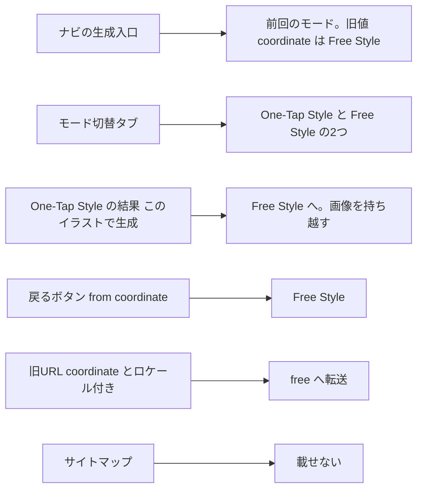
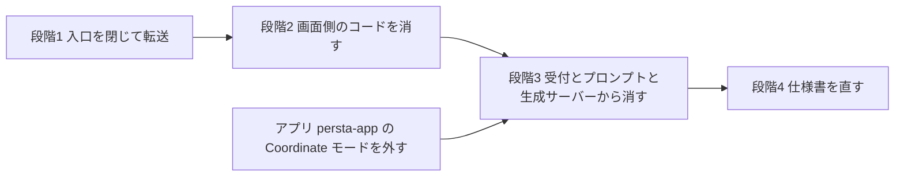

# 生成モード「Coordinate」（/coordinate）の廃止

作成日: 2026-09-27
関連: `app/(app)/coordinate/page.tsx` / `components/GenerationModeTabs.tsx` / `features/generation/components/GenerationFormContainer.tsx` / `supabase/functions/image-gen-worker/index.ts`
前例: [[remove-multi-image-generation-plan]]（複数枚生成の廃止）、#290（`specified_coordinate` / `full_body` / `chibi` の撤去。`shared/generation/prompt-core.ts:26-33`）

## 背景と判断

生成モード「Coordinate」（`/coordinate`、`generation_type = 'coordinate'`）を廃止する。
運営が One-Tap Style と Free Style へ意図して誘導し、ほぼ使われなくなった。

### ほぼ使われていない

2026-09-27 の集計。生成の試行回数（失敗を含む）で、内部アカウント2つ（本人・テスト用）を除く。

| 期間 | Coordinate | Free Style | One-Tap Style |
|---|---:|---:|---:|
| 直近30日（8/28〜9/27） | **3回・2人** | 712回・22人 | 551回・33人 |
| その前の30日（7/29〜8/27） | 89回・9人 | 416回・18人 | 799回・46人 |

- 週ごとでは、7月後半〜8月前半は週15〜35回。8/17 の週から週0〜2回になり、8/31・9/7 の週は0回
- 8月までに10回以上使っていた6人のうち5人は、直近30日も Free Style と One-Tap Style で生成している。
  やめたのではなく乗り換えた。残る1人は 7/31 以降どのモードでも生成していない
- **ゲスト（未ログイン）の利用は分からない。** ゲスト生成は保存しない作りで
  （`app/api/coordinate-generate-guest/handler.ts:100-105`）、回数制限の記録 `style_guest_generate_attempts` は
  `/style` と共用のうえ、どの画面から来たかの列が無い
  （列は `id` / `client_ip_hash` / `created_at` / `released_at` / `release_reason`。
  `supabase/migrations/20260321113000_add_style_guest_generate_attempts.sql:4-8`、
  `supabase/migrations/20260412170000_add_style_attempt_release_reservations.sql:59-61`）

### 過去のデータ

全期間・全アカウントで、ジョブ 1,454件（成功 1,308・失敗 146・**未完了 0**）、画像 1,392枚、うち投稿 255件。
これらは表示し続ける（ADR-002）。

### 決まったこと・決めること

| 項目 | 内容 | 状態 |
|---|---|---|
| 廃止するか | する | 決定（2026-09-27） |
| 直近の利用者2人への案内 | 出さない | 決定（2026-09-27） |
| 進め方 | 段階的に進める | 決定（2026-09-27）。段階の切り方は本書の提案 |
| `/coordinate` の転送先 | `/free`（ADR-001） | 決定（2026-09-27） |

## 「coordinate」は4つの意味で使われている

廃止するのは 1 だけ。2〜4 を取り違えて消さないこと。

| # | 何か | 場所の例 | 今回 |
|---|---|---|---|
| 1 | 生成モード「Coordinate」 | `/coordinate`、`generation_type = 'coordinate'`、ゲスト生成 API | **廃止** |
| 2 | One-Tap Style のプリセットカテゴリ `coordinate` | 既定カテゴリでバッジを出さない（`features/style-presets/components/PublicStyleCard.tsx:43`）。コメント上「ゲストは coordinate 以外のカテゴリを生成できない」（`features/style/components/StylePageClient.tsx:410-415`、判定は `allowGuestGeneration`） | 触らない |
| 3 | ナビの生成入口「コーディネート」 | `nav.coordinate`（`messages/ja.ts:29`）。押すと前回使ったモードを開く（`lib/nav-entries.ts:37-44`） | ラベルは据え置き（ADR-005） |
| 4 | 名前に coordinate を含む共有部品 | i18n の `coordinate` 名前空間（`messages/ja.ts:952-1320`）、`useCoordinateGenerationFeedback`、`coordinate-stage-copy.ts`、イベント `coordinate:apply-from-history` など。Free Style・One-Tap Style・Inspire も使う（例: `features/style/components/StylePageBody.tsx:236` の `coordinateT("resultsTitle")`） | 改名しない（ADR-003） |

## 概要図

### 段階1のあとの行き先



### 段階の依存関係



当初は「入口を閉じる → コードを消す → 仕様書」の3段階で合意したが、コード削除を画面側（段階2）と
サーバー側（段階3）に分けた。サーバー側だけが Edge Function のデプロイを伴い、アプリの対応を待つ必要があるため。

## コードベース調査結果

2026-09-27 時点の `main`（97c72c4）で確認。

### /coordinate への入口

| 入口 | 場所 | 段階1 |
|---|---|---|
| モード切替タブの Coordinate | `components/GenerationModeTabs.tsx:28-32` | 外す |
| ナビの生成入口（前回のモード） | 読む: `lib/nav-entries.ts:37-44` → `features/generation/lib/generation-mode-preference.ts:39-49`。書く: `components/GenerationModeTabs.tsx:92-95` | 旧値 `/coordinate` を `/free` として読む |
| ナビの先読み | `components/NavigationBar.tsx:94`、`components/AppSidebar.tsx:99` | 外す |
| 「このイラストで生成」（One-Tap Style の結果一覧） | `features/style/components/StylePageBody.tsx:239` → `features/generation/components/GeneratedImageList.tsx:217-231`（`router.push("/coordinate")` は `:229`）。確認ダイアログは「コーディネートに移動します」（`messages/ja.ts:1274`） | `/free` へ（ADR-004） |
| 同上（Inspire。本番は機能フラグで非表示: `app/(app)/inspire/[templateId]/page.tsx:45-47`） | `app/(app)/inspire/[templateId]/page.tsx:182` | 同じ部品なので一緒に `/free` へ |
| 戻るボタンの `?from=coordinate` | `features/posts/lib/sticky-back-url.ts:29`。付くのは Coordinate の結果一覧（`features/generation/components/CoordinatePageBody.tsx:83`）、Inspire の結果一覧（`app/(app)/inspire/[templateId]/page.tsx:180`）、ペルコイン購入へのリンク（`CoordinatePageBody.tsx:55` → `features/credits/lib/urls.ts:10-14`） | `/free` へ。この対応は段階2以降も残す（Inspire が付け続けるうえ、旧URLにも残る。消すとホームへ戻ってしまう: `sticky-back-url.ts:32-33`） |
| サイトマップ（15言語） | `app/sitemap.ts:17, 53, 69` | 外す |
| 旧URL（検索・ブックマーク・外部リンク） | 公開パス（`i18n/config.ts:60`）。お知らせ「✨コーデ生成がアップデート!」（2026-06-24 公開）の本文に `https://www.persta.ai/coordinate` へのリンク。バナー（全17件）・ポップアップ（全11件）のリンク先と、通知の本文・データには1件も無い（2026-09-27 DB 確認） | 転送（ADR-001） |
| ゲストの新規登録後の戻り先 | `app/api/coordinate-generate-guest/handler.ts:94-97`（`next=/coordinate`） | 段階2で API ごと削除。配布済みのリンクは転送が拾う |

### 全ページに常駐している Coordinate 専用の処理

`components/GeneratedImageNotificationChecker.tsx`（`components/AppShell.tsx:99` でマウント）は、ログイン中は
表示中のタブで10秒ごとに（`:169-176`）、既読位置（`profiles.last_coordinate_toast_ack_at`。
`features/generation/lib/coordinate-toast-ack.ts:6-22`）と Coordinate の新着画像
（`features/generation/lib/database.ts:116-130`、`generation_type = 'coordinate'` で絞る）を問い合わせる。
Coordinate の生成が無くなれば役目が無いので、段階1で止める。

### 画面の部品：Coordinate 専用か、共有か

Next.js の全エントリ（`app/**` の page / layout / route 等と `proxy.ts`）から import をたどると、
2つのページ・ゲスト生成 API・一覧の更新 API・常駐チェッカーを消して参照が無くなるのは次の7つだけだった。
`CoordinatePageBody` / `CoordinateGuestLoginCta` / `CoordinateGeneratedListHashScroll` / `CoordinateTourButton` /
`coordinate-tour-steps` / `coordinate-toast-ack` / `guest-rate-limit`。ほかは共有されている。

| 部品 | 使うところ | 扱い |
|---|---|---|
| `GenerationFormContainer.tsx` / `GenerationForm.tsx` | Coordinate（`mode` の既定値が `"coordinate"`: `GenerationFormContainer.tsx:177`）、Free Style（`FreePageBody.tsx:61-65`）、派生生成シート（`PromptLockedGenerationSheet.tsx:175-178`） | 残す。Coordinate 用の分岐だけ段階2で消す |
| ゲスト生成の分岐（`authState="guest"`） | Coordinate だけ（`CoordinatePageBody.tsx:67-70`）。Free Style は未ログインにフォームを出さない（`FreePageBody.tsx:32-35`） | 段階2で消す |
| 結果一覧 `CachedGeneratedImageGallery` → `GeneratedImageList` | Coordinate / Free Style / One-Tap Style / Inspire | 残す |
| i18n `coordinate` 名前空間（312キー） | 上のすべて | 残す。Coordinate 専用の部品だけが使うキーを段階2で消す（目安で約25。大半は無効化中のストック保存案内の文言） |
| 参照の無い既存ファイル | `features/credits/components/CoordinatePercoinBalance.tsx`、`features/generation/components/CoordinatePageSkeleton.tsx`、`features/generation/lib/prompt-config.ts`（どこからも import されていない） | 段階2・3で消す |

### 無効化中の「元画像をストックに保存する案内」

生成の3秒後に元画像のストック保存を促す仕組み一式は、起動側がコメントアウトされていて動いていない
（`GenerationFormContainer.tsx:1000-1083`）。起動条件に `/coordinate` 滞在も含む（同 `:1037-1043`）。
それでも全ページ常駐のホスト（`components/LocaleShell.tsx:111`）とナビの赤丸の購読
（`components/NavigationBar.tsx:134-138`、`components/AppSidebar.tsx:118-122`）は残っている。
赤丸を立てる `markCoordinateSourceStockSavePromptDot` は呼び出し元が無い。→ ADR-006

### 離れた場所をつなぐ経路（書く側と読む側）

| 経路 | 書く側 | 読む側 | 今回 |
|---|---|---|---|
| sessionStorage `persta-ai:coordinate-pending-source-image-url` | `GeneratedImageList.tsx:217-231` | `GenerationForm.tsx:508-535`（Free Style では読まない: `:513`） | 段階1: Free Style で読む（派生生成シートを除く） |
| イベント `coordinate:apply-from-history` | `GeneratedImageList.tsx:192-215`、`GenerationForm.tsx:530-534` | `GenerationForm.tsx:485-506` | 名前は残す |
| localStorage `persta-ai:last-generation-mode` | `GenerationModeTabs.tsx:92-95` | `generation-mode-preference.ts:39-49` | 段階1: 旧値を `/free` へ |
| キャッシュタグ `coordinate-${userId}` | 付ける側は `CoordinatePageBody.tsx:81`（結果一覧）だけ | 無効化は14か所: `app/api/revalidate/coordinate/route.ts:22`、`features/subscription/lib/change-service.ts:294`、`features/generation/lib/webp-storage.ts:53`、`app/api/` の `posts/post/route.ts:192`・`credits/consume/route.ts:58`・`credits/mock-complete/route.ts:45`・`stripe/webhook/route.ts:139`・`streak/check/route.ts:155`・`referral/check-first-login/route.ts:86`・`tutorial/complete/route.ts:50`・`collections/mount/route.ts:100`・`admin/bonus/grant/route.ts:137`・`admin/bonus/grant-batch/route.ts:192`・`admin/deduction/route.ts:167` | 段階2で付ける側が消えると14か所とも空振りになるので、同じ段階で消す |
| `profiles.last_coordinate_toast_ack_at` | `coordinate-toast-ack.ts:24-48` | `coordinate-toast-ack.ts:6-22`（常駐チェッカーから） | 段階1でコードを消す。列は残す（ADR-002） |
| ゲスト識別 Cookie の発行 | `proxy.ts:53-57, 228-233`（対象パスは `lib/guest-id.ts:95-96`） | `features/style/lib/style-rate-limit.ts` | 段階2で正規表現から `coordinate` を外す |
| チュートリアル①の目印 `data-tour="coordinate-nav-*"` | `NavigationBar.tsx:247`、`AppSidebar.tsx:263` | `features/tutorial/components/TutorialTourProvider.tsx:183-187`、`features/tutorial/lib/tour-steps.ts:30` | 触らない（生成入口の目印で、名前はただの識別子） |
| チュートリアル用イベント（`tutorial:set-prompt` / `set-background-mode` / `set-demo-image` / `prepare-coordinate-state` / `step-11-changed`） | **書く側が無い**（旧コーデ・チュートリアルの残骸） | `GenerationForm.tsx:481, 548, 560, 617` ほか | Coordinate 専用の2つ（`set-background-mode` / `prepare-coordinate-state`）は段階2で消す。残りは範囲外 |
| イベント `tutorial:advance-to-next` | `GenerationForm.tsx:366-375`（Coordinate の送信時だけ） | **読む側が無い** | 段階2で Coordinate の送信経路ごと消える |

### 生成の受付・プロンプト・生成サーバー

| 場所 | 内容 |
|---|---|
| `features/generation/lib/schema.ts:87-98` | `generationType` の既定値が `'coordinate'`。#290 でプロンプトを撤去した `specified_coordinate` / `full_body` / `chibi` も列挙に残っている |
| `features/generation/lib/schema.ts:264-272` | `framingMode` は coordinate のときだけ指定できる |
| `app/api/generate-async/handler.ts:535, 582` | 未指定の `generationType` を `'coordinate'` とみなす。`features/generation/lib/async-api.ts:175`、`features/generation/components/GenerationFormContainer.tsx:890, 983` も同じ |
| `app/api/generate-async/handler.ts:183-186` | 未指定の `framingMode` を既定値にする（coordinate 専用の項目） |
| `shared/generation/prompt-core.ts:181-229, 346-367` | Coordinate のプロンプト組み立てとリトライ強化文 |
| `shared/generation/prompt-registry.ts:25-32, 72-92, 126, 136, 317-375, 439-446, 454-461` | 管理画面で編集できるテンプレのうち Coordinate の10キー（`coordinate.*` が8、`reinforcement.coordinate_*` が2）。本番の上書き（`prompt_overrides`）は0件（2026-09-27 確認） |
| `features/generation-prompts/components/AdminPromptListClient.tsx:29` | 管理画面のカテゴリ名 |
| `supabase/functions/image-gen-worker/index.ts:8, 1959-1961, 2790-2814` | import、作者入力の必須判定、Gemini のリトライ強化 |
| 課金と組み立ての順序 | 生成サーバーは課金（`index.ts:2092-2110`）の後にプロンプトを組み立てる（`:2434-2448`） → ADR-008 |
| ジョブの書き換え | 本人は自分の `image_jobs` を追加・更新できる（RLS: `supabase/migrations/20260214120004_rls_auth_uid_initplan_and_merge_policies.sql:93-104`）。作成後に変更を禁じているのは `origin_post_id` だけ（`supabase/migrations/20260730200000_add_free_prompt_visibility.sql:292-300`）なので、`generation_type` は書き換えられる → ADR-008 |
| 派生生成のジョブ | 事前チェック（`index.ts:1958` 以降）は派生でないジョブだけが通る（`isDerivedJob` は `:1899`）。派生ジョブも課金（`:2092`）の後に `generation_type` でプロンプトを組み立てる（`:2434-2448`） → ADR-008 |
| アプリ（persta-app） | 生成タブが Coordinate / One-Tap Style / Free Style の3モード（`lib/presentation/screens/coordinate/widgets/generation_mode_tabs.dart:22-26`）で、既定が Coordinate（`lib/presentation/screens/coordinate/coordinate_page.dart:34`、`lib/presentation/screens/coordinate/coordinate_state.dart:77`）。`generationType: 'coordinate'` を送る（`lib/domain/models/generation_mode.dart:7-11`）。確認したのはローカルの `036-generation-header-parity`（805622b）。ストア審査は未提出（`docs/planning/flutter-app-parity-implementation-plan.md:434-457`） |

### 残すもの（過去のデータを読む仕組み）

| もの | 場所 |
|---|---|
| 投稿・詳細の「コーディネート」ラベル | `features/posts/lib/generation-mode-label.ts:15-33` |
| マイページの画像一覧（生成方法で絞らない） | `features/my-page/lib/server-api.ts:278-295`（`app/api/my-page/images/route.ts:31-35` から呼ばれる） |
| 投稿の作成（生成方法で分けない） | `app/posts/new/[imageId]/page.tsx:51` → `app/api/posts/post/route.ts` |
| 投稿ボーナスの `daily_post_coordinate` | `features/credits/lib/percoin-bonus-defaults.ts:35-40`、`get_post_bonus_amounts()`（`supabase/migrations/20260830100000_add_scheduled_percoin_amounts.sql:260-265`）、管理画面 `app/(app)/admin/percoin-defaults/page.tsx:15` |
| 原価推定の coordinate | `features/admin-dashboard/lib/ai-cost-rates.ts:260-273` |
| DB の CHECK 制約 | `image_jobs_generation_type_check`（coordinate 系4値を含む） |

## EARS（要件）

| ID | 種類 | 英語 | 日本語 | 段階 |
|---|---|---|---|---|
| DEP-01 | Event | When a request for `/coordinate` or `/{locale}/coordinate` arrives, the system shall redirect it to `/free` or `/{locale}/free`, keeping the query string. | `/coordinate` または `/{locale}/coordinate` へのリクエストは、クエリを保ったまま `/free` または `/{locale}/free` へ転送しなければならない | 1 |
| DEP-02 | Unwanted | If a path only ends with `/coordinate` after a segment that is not a locale (e.g. `/styles/coordinate`), then the system shall not redirect it. | ロケールでない階層の後ろに `/coordinate` が付くだけのパス（例: `/styles/coordinate`）は転送してはならない | 1 |
| DEP-03 | State | While a generation mode page is shown, the system shall offer only One-Tap Style and Free Style in the mode tabs. | 生成モードの画面では、モード切替タブに One-Tap Style と Free Style だけを出さなければならない | 1 |
| DEP-04 | Event | When the user taps the generation entry in the navigation, the system shall not navigate to or prefetch `/coordinate`; a stored last mode of `/coordinate` shall be read as `/free`. | ナビの生成入口を押したとき、`/coordinate` へ遷移も先読みもしてはならない。前回のモードに `/coordinate` が保存されていれば `/free` として扱う | 1 |
| DEP-05 | Event | When the user confirms "Generate with this illustration" on a One-Tap Style or Inspire result, the system shall open `/free` with that image set as the source image. | One-Tap Style（または Inspire）の結果で「このイラストで生成」を確定したとき、その画像を元画像に入れた状態で `/free` を開かなければならない | 1 |
| DEP-06 | Unwanted | If a carried-over image is pending while the derived-generation sheet is mounted, then the system shall not insert it into the sheet. | 持ち越し画像が残っていても、派生生成シート（プロンプト施錠）には差し込んではならない | 1 |
| DEP-07 | Event | When a page is opened with `?from=coordinate`, the system shall lead the back button to `/free`. | `?from=coordinate` 付きで開いたページでは、戻るボタンの行き先を `/free` にしなければならない | 1 |
| DEP-08 | Ubiquitous | The sitemap shall not list `/coordinate` in any locale. | サイトマップにはどの言語の `/coordinate` も載せてはならない | 1 |
| DEP-09 | Ubiquitous | The system shall not poll for new coordinate images on any page. | どの画面でも、Coordinate の新着画像を定期的に問い合わせてはならない | 1 |
| DEP-10 | State | While coordinate images and posts exist, the system shall keep showing them with the "Coordinate" label and shall keep them postable. | 過去の Coordinate の画像・投稿は「コーディネート」ラベル付きで表示し続け、投稿もできなければならない | 全段階 |
| DEP-11 | Unwanted | If a request reaches `/api/coordinate-generate-guest`, then the system shall neither generate an image nor consume the guest trial. | `/api/coordinate-generate-guest` へのリクエストでは、画像を生成してもゲストのお試し回数を消費してもならない（ルートごと無くなり 404） | 2 |
| DEP-12 | Unwanted | If a generation request has a coordinate-family `generationType` or none, then the system shall reject it with 400 before creating a job or charging Percoin. | `generationType` が coordinate 系（coordinate / specified_coordinate / full_body / chibi）または未指定の生成リクエストは、ジョブ作成・ペルコイン消費の前に 400 で拒否しなければならない | 3 |
| DEP-13 | Unwanted | If the worker picks up a coordinate-family job, then the system shall fail it before charging Percoin. | 生成サーバーが coordinate 系のジョブを受け取ったら、ペルコインを消費する前に失敗させなければならない | 3 |

## ADR

### ADR-001: 転送先は /free。段階1は一時転送、段階2で恒久転送

- **Context**: `/coordinate` は公開パスで（`i18n/config.ts:60`）、サイトマップに15言語で載っている（`app/sitemap.ts:17`）。
  外部にも旧URLがある（上記のお知らせ本文）。404 にはしたくない。候補は `/free` と `/style`。
- **Decision**: **`/free`（2026-09-27 決定）。** `next.config.ts` の `redirects()`（既存の前例 `next.config.ts:12-24`）に
  `/coordinate` → `/free` と `/:locale(ja|en|…)/coordinate` → `/:locale/free` を足す。ロケールは
  `i18n/config.ts:1-17` の `locales` から組み立てる。段階1は `permanent: false`（307）、
  ページを消す段階2で `permanent: true`（308）にする。
- **Reason**:
  - Free Style は Coordinate と同じフォーム部品で動き（`FreePageBody.tsx:61-65`）、説明文も
    「着せ替えはもちろん、ポーズ・背景・シーンごと」（`messages/ja.ts:1429`）で Coordinate の用途を含む
  - カタログ刷新後の生成入口「つくる」も毎回 `/free` を開く（`lib/nav-entries.ts:41-43`）
  - ロケールを列挙するのは、`/:locale/coordinate` のような任意の1階層だと `/styles/coordinate`
    （`/styles/[slug]`）のような別ページまで転送してしまうため
  - 恒久転送はブラウザや検索エンジンに覚えられ、戻しにくい。コードを消すまでは一時転送にしておく
  - 導入済みの Next 16.0.7 では、`redirects()` は proxy より先に評価される
    （`node_modules/next/dist/server/lib/router-utils/resolve-routes.js:49-55`）。状態コードは
    `permanent` が true なら 308、false なら 307（`node_modules/next/dist/lib/redirect-status.js:36`）。
    上の書式で15ロケールが受理され、`/styles/coordinate`・`/coordinate/x`・`/xx/coordinate` は一致しないことを
    Next 自身のルート照合で確認済み（2026-09-27）
- **Consequence**:
  - 未ログインで来た人は `/free` でログイン誘導だけを見る（`FreePageBody.tsx:32-35`）。
    比べた `/style` なら、ログインせずに1日1回試せた。未ログインの流入よりも、後継としての自然さを取った
    （GA4 の閲覧数は見ていない。管理画面の Top Pages は上位8件しか出さない:
    `features/analytics/lib/get-ga4-page-summary-data.ts:14`）
  - ロケール無しの `/coordinate` は `/free` へ転送されたあと、proxy がもう一度 `/{locale}/free` へ転送する
    （`proxy.ts:47-58`）。2回になるが実害は無い
  - 本番（Vercel）では `redirects()` を Next の外側（プラットフォーム）が処理する。上の評価順は
    ローカルの確認なので、段階1のデプロイ後に本番でも curl で確かめる

### ADR-002: 過去のデータと、それを読む仕組みは残す

- **Context**: 画像 1,392枚・投稿 255件がある。DB の CHECK 制約も coordinate を含む。
- **Decision**: 行・CHECK 制約・表示ラベル・投稿ボーナスの設定・原価推定（上の「残すもの」）を残す。
  `profiles.last_coordinate_toast_ack_at` も、読み書きするコードだけ消して列は残す。マイグレーションは作らない。
- **Reason**: 過去の作品は今後も表示され、マイページから投稿もできる。列の DROP は本番DBへの破壊的操作で
  承認が要るうえ、得るものが無い（前例: [[remove-multi-image-generation-plan]] ADR-010）。
- **Consequence**: 使われない列が1つ残る。

### ADR-003: 名前に coordinate を含む共有部品は改名しない

- **Context**: i18n の `coordinate` 名前空間（15言語）、`useCoordinateGenerationFeedback`、
  `coordinate-stage-copy.ts`、イベント名 `coordinate:apply-from-history`、sessionStorage のキー、
  ナビの `data-tour="coordinate-nav-*"`、Vercel Analytics のイベント名 `coordinate_generation_complete` /
  `coordinate_generation_failed`（Free Style の生成でも送られる: `GenerationFormContainer.tsx:1216, 1225`）。
- **Decision**: 改名しない。使われなくなったキー・関数だけ消す。
  例外は `applyActionMode` の `"navigate-coordinate"`。行き先が変わって名前が嘘になるので、段階1で名前も変える。
- **Reason**: 改名は15言語・数百キーの移し替えと、分析イベントの連続性の断絶を招く。
  廃止の目的に対して利益が無く、範囲外のリファクタリングになる。
- **Consequence**: coordinate という名前がコードに残る。触る箇所には「名前は歴史的経緯」とコメントを添える。

### ADR-004: 「このイラストで生成」は /free へ付け替える

- **Context**: One-Tap Style と Inspire の結果一覧の「このイラストで生成」は、確認ダイアログを出して
  `/coordinate` へ画像を持ち越す（`GeneratedImageList.tsx:217-231`）。
- **Decision**: 行き先を `/free` に変え、Free Style のフォームが持ち越し画像を受け取るようにする
  （`GenerationForm.tsx:513` の除外をやめる）。派生生成シートでは受け取らない。
  ダイアログの文言は「Free Style に移動します」にする（15言語）。
- **Reason**: 生成画像を次の元画像にする導線は、Coordinate が無くなっても役に立つ。Free Style は
  元画像を受け付ける同じフォーム部品で、ボタンを消すより変更が小さい。
- **Consequence**: 派生生成シート（`PromptLockedGenerationSheet.tsx:175-178`）も同じ `mode="free"` で、
  別の画面の上に開く。遷移に失敗してキーが残ったとき、後で開いたシートが画像を拾わないよう条件を足す。

### ADR-005: ナビの「コーディネート」ラベルは据え置く

- **Context**: ナビの生成入口のラベルは、カタログ刷新前は「コーディネート」、刷新後は「つくる」
  （`components/NavigationBar.tsx:220`、`components/AppSidebar.tsx:207`）。刷新は段階公開中で運営だけに出ている。
  モード切替タブのラベルは別キーの `coordinate.tabLabel`「Coordinate」（`components/GenerationModeTabs.tsx:24-26`）。
- **Decision**: ナビのラベルは変えない。行き先から `/coordinate` を外すだけにする。
- **Reason**: ナビの「コーディネート」は着せ替え全般の入口で、押すと前回のモード（既定は One-Tap Style。
  `generation-mode-preference.ts:25`）を開く。ラベルを変えると一般の人の見た目が変わるので、
  カタログ刷新の一般公開（「つくる」への切り替え）に任せる。
- **Consequence**: 刷新の一般公開までは、ナビに「コーディネート」があり、タブには無い状態になる。

### ADR-006: 無効化中のストック保存案内は段階2で一緒に消す

- **Context**: 上の「無効化中の『元画像をストックに保存する案内』」のとおり、動いていないのに
  全ページ常駐のホストとナビの購読が残っている。起動条件に `/coordinate` 滞在を含む。
- **Decision**: 段階2で一式を消す（ホスト、ダイアログ、状態、ナビの赤丸、`PATCH /api/generation-status/link-stock`、
  `coordinate-stocks-*`、`GenerationStateContext` の保留バッチ）。差分が大きければ段階2を2つの PR に分ける。
- **Reason**: `/coordinate` が無くなると、コメントを外しても二度と表示されない。残すと何もしない常駐処理だけが残る。
- **Consequence**: 再開したくなったら Free Style 向けに作り直す（git の履歴から戻せる）。

### ADR-007: 受付で coordinate を拒否するのは段階3。generationType は必須にする

- **Context**: 受付の既定値が `'coordinate'`（`schema.ts:87-98`）で、`handler.ts:535, 582`・
  `async-api.ts:175`・`GenerationFormContainer.tsx:890, 983` も未指定を coordinate とみなす。
  アプリは `generationType: 'coordinate'` を送る。ほかの呼び出し元（`features/inspire/components/InspirePageClient.tsx`、
  `CreatorLooksDetailClient.tsx`）は `inspire` を明示して送るので、必須にしても困らない。
- **Decision**: 段階3で coordinate 系4値を受け付けず、既定値を消して `generationType` を必須にする。
  coordinate 専用の `framingMode`（`schema.ts:264-272`）も受付から外す。
- **Reason**: 既定値のまま別のモードへ黙って振り替えると、古いクライアントが意図しない生成で課金される。
  400 で止める方が安全（派生生成を free に限る `schema.ts:148-160` と同じ考え方）。
  段階3まで待つのは、画面（段階2）とアプリが送らなくなる前に拒否すると、動いている画面を壊すため。
- **Consequence**: アプリの古いビルド（TestFlight など）の Coordinate モードは 400 になる。
  ストア未公開なので一般の利用者への影響は無い。公開済みになっていたら、アプリの更新が行き渡るまで段階3を待つ。

### ADR-008: 生成サーバーは coordinate 系のジョブを課金前に失敗させる

- **Context**: 生成サーバーは課金（`index.ts:2092-2110`）の後にプロンプトを組み立てる（`:2434-2448`）。
  Coordinate の組み立て（`prompt-core.ts:181-229`）を消した版が coordinate のジョブを拾うと、課金してから失敗する。
  段階3の受付で新規作成は止まるが、本人は作成後のジョブの `generation_type` を書き換えられる（RLS。上の表）。
  既存の事前チェック（`index.ts:1958` 以降）は派生でないジョブにしか効かず、派生ジョブはそこを通らずに課金へ進む。
- **Decision**: 課金（`index.ts:2092`）より前、かつ派生かどうかの分岐（`:1958`）の外で、coordinate 系の
  ジョブを失敗させる。あわせて、デプロイ前に未完了の coordinate ジョブが0件であることを確かめる。
- **Reason**: 分岐の外で止めれば、残っていたジョブも、書き換えられた通常・派生のジョブも課金せずに止まる。
  2026-09-27 時点で未完了は0件（全1,454件が成功か失敗で終わっている）。
- **Consequence**: デプロイは main の生成サーバー全体を上げるので、他の PR の未デプロイ変更も一緒に出る。
  本番の更新日時以降に main へ入った `supabase/functions/image-gen-worker/` と `shared/generation/` の変更を
  デプロイ前に確かめる。

### ADR-009: アプリ（persta-app）も Coordinate モードを外す（段階3より前）

- **Context**: アプリの生成タブは Web と同じ3モードで、既定が Coordinate（上の表。画面と状態の初期値の2か所）。
  Web のタブ構成をそのまま写している（`docs/planning/flutter-app-parity-implementation-plan.md:345`）。
- **Decision**: 段階1の後、段階3の前に、アプリから Coordinate モードを外し、既定を One-Tap Style にする
  （Web の既定 `generation-mode-preference.ts:25` と同じ）。
- **Reason**: 段階3以降、アプリの Coordinate モードは 400 になる。Web のモバイル版と揃える。
- **Consequence**: 別リポジトリの作業になる。Phase 7 の実機チェックリストの「3 モードの生成」も2モードに直す。

## 実装計画

各段階の終わりで、検証コマンド4つ（下の「検証コマンド」）が通ること。

### 段階1: 入口を閉じて転送する（Next.js・1 PR）

目的: 誰も `/coordinate` にたどり着かないようにする。コードはまだ消さない（常駐チェッカーだけは止める）。
ビルド確認: `npm run build -- --webpack` が通り、ローカルで `/coordinate` が `/free` へ 307 で転送される。

- [ ] 転送ルールを小さなモジュールに切り出し（仮: `lib/legacy-redirects.ts`）、`next.config.ts` の `redirects()` から読む。
      ロケールは `i18n/config.ts` の `locales` から組み立てる。`permanent: false`
- [ ] `components/GenerationModeTabs.tsx`: タブから `/coordinate` を外す（`:28-32`、ラベル配列 `:100-104`）
- [ ] `features/generation/lib/generation-mode-preference.ts`: `coordinate` を外し、保存済みの `/coordinate` を `/free` として読む
- [ ] `components/NavigationBar.tsx:94`・`components/AppSidebar.tsx:99`: `/coordinate` の先読みを外す
- [ ] `features/generation/components/GeneratedImageList.tsx`: 確定時の遷移先を `/free` に。
      `applyActionMode` の `"navigate-coordinate"` を `"navigate-free"` に改名（`CachedGeneratedImageGallery.tsx`、
      `GeneratedImageGalleryClient.tsx`、`StylePageBody.tsx:239`、`app/(app)/inspire/[templateId]/page.tsx:182`）
- [ ] `features/generation/components/GenerationForm.tsx:508-535`: Free Style で持ち越し画像を受け取る。施錠時（派生生成シート）は受け取らない
- [ ] `messages/*.ts`（15言語）: `coordinate.listApplyForNextConfirmTitle` を Free Style 向けに
- [ ] `features/posts/lib/sticky-back-url.ts:29`: `from=coordinate` → `ROUTES.FREE`（この対応は段階2以降も残す）
- [ ] `app/sitemap.ts`: `/coordinate` を外す（`:17, 53, 69`）
- [ ] 常駐チェッカーを止める: `components/AppShell.tsx:9, 99` のマウントを外し、
      `components/GeneratedImageNotificationChecker.tsx`・`features/generation/lib/coordinate-toast-ack.ts`・
      `database.ts` の `listCoordinateImagesCreatedAfter` とそのテストを消す
- [ ] E2E を片付ける（転送で段階1から落ちるため。CI では動いていない: `.github/workflows/coverage.yml` は Jest のみ）:
      `tests/e2e/coordinate.spec.ts` と `docs/specs/generation/coordinate_page_e2e_spec.yaml` を消し、
      それだけを対象にした `playwright.config.ts:35-41` の `chromium-auth` と `:32` の除外指定を外す。
      `tests/e2e/auth.setup.ts:19` の `next=/coordinate` は `/free` に
- [ ] テスト（下の「テスト」）

### 段階2: 画面側のコードを消す（Next.js・1〜2 PR）

目的: `/coordinate` とゲスト生成、Coordinate 用の分岐を消す。サーバーの受付はまだ coordinate を受け付ける。
ビルド確認: 検証コマンド4つが通り、Free Style・派生生成シート・One-Tap Style（ゲストのお試しを含む）で生成できる。

- [ ] ページを消す: `app/(app)/coordinate/page.tsx`、`app/[locale]/(app)/coordinate/page.tsx`
- [ ] API を消す: `app/api/coordinate-generate-guest/`、`app/api/revalidate/coordinate/`
- [ ] Coordinate 専用の部品を消す: `CoordinatePageBody` / `CoordinateGuestLoginCta` / `CoordinateGeneratedListHashScroll` /
      `CoordinateTourButton` / `coordinate-tour-steps` / `guest-rate-limit` / `GuestResultPreview` / `coordinate-guest-api`、
      参照の無い `CoordinatePageSkeleton`・`CoordinatePercoinBalance`
- [ ] `GenerationFormContainer.tsx` / `GenerationForm.tsx`: `mode` と `authState` を無くし、Free Style 専用にする
      （ゲスト送信 `:869-919`・ゲスト結果 `:1299-1311`、背景・ポーズ・元画像タイプの設定 `GenerationForm.tsx:666, 732-800`、
      Coordinate の送信 `:403-417`、チュートリアル用の `set-background-mode` / `prepare-coordinate-state`、
      `revalidatePath` と `purchaseSource` の分岐 `GenerationFormContainer.tsx:184-189`、
      未指定を coordinate とみなす `:890, 983`）。
      `FreePageBody.tsx`・`PromptLockedGenerationSheet.tsx` から不要になった props を外す
- [ ] ただしログイン後の保存（`useWardrobeSave` と `WardrobeClaimOverlay`: `GenerationFormContainer.tsx:199, 1314`）は残す。
      段階1より前に送られた確認メールの `/coordinate?claim_wardrobe=1` は転送で `/free?claim_wardrobe=1` に着き、
      Free Style のフォームがこれで受け取る
- [ ] `features/generation/lib/async-api.ts:175`: 未指定を coordinate とみなす既定をやめる
- [ ] ストック保存案内一式を消す（ADR-006）
- [ ] 空振りになる `` revalidateTag(`coordinate-…`) `` を14か所とも消す（一覧は「離れた場所をつなぐ経路」の表。
      Stripe webhook の1行も含むが、空振りの1行を消すだけ）
- [ ] 参照を消す: `constants/index.ts` の `ROUTES.COORDINATE`、`StickyHeader.tsx:76-78`、`features/credits/lib/urls.ts:4`、
      `i18n/config.ts:60`、`lib/guest-id.ts:95-96`（とコメント）、`features/analytics/lib/get-ga4-page-flow-data.ts:20`、
      `features/generation/lib/route-copy.ts` のゲスト用文言（15言語）、`lib/api/revalidate-route-copy.ts` の `coordinateFailed`。
      `sticky-back-url.ts` の `from=coordinate` → `/free` は残す
- [ ] コメントを直す: `lib/nav-entries.ts`（`GENERATION_ENTRY_PATH` はルートではなくナビ項目の識別子。
      押すと必ず行き先を決め直す: `NavigationBar.tsx:147-156`）、`proxy.ts`、`lib/navigation-auth.ts`、`lib/build-current-url.ts`、
      `app/(app)/layout.tsx`、`app/(styles-catalog)/layout.tsx`、`components/LocaleShell.tsx`
- [ ] `messages/*.ts`（15言語）: 使われなくなった `coordinate.*` キーをスクリプトで洗い出して消す
- [ ] 転送を恒久（`permanent: true`）にする
- [ ] ドキュメント: `docs/API.md` から3つの API（ゲスト生成・一覧の更新・link-stock）を、`docs/openapi.yaml` から
      2つ（link-stock は載っていない）を消す
- [ ] テストを消す・直す

### 段階3: 受付・プロンプト・生成サーバーから消す（Next.js と Edge Function・1 PR）

前提: 段階2が本番に出ている。アプリの Coordinate モード削除が配布済み（ADR-009）。
目的: coordinate のジョブを作れなくし、プロンプトと生成サーバーから Coordinate を消す。
ビルド確認: 検証コマンド4つが通り、Free Style・One-Tap Style・派生生成の生成が本番で成功する。

- [ ] `features/generation/lib/schema.ts`: coordinate 系4値を外し、`generationType` を必須に。`framingMode` を外す
- [ ] `app/api/generate-async/handler.ts:183-186, 535, 582`: coordinate の既定と framing の扱いを外す
- [ ] `shared/generation/prompt-core.ts`: `GenerationType` から coordinate を外し、`:181-229` と `:346-367` を消す
- [ ] `shared/generation/prompt-registry.ts`: coordinate カテゴリ・10キー・既定文の定数を消す。
      `features/generation-prompts/components/AdminPromptListClient.tsx:29` も
- [ ] `features/generation/lib/prompt-config.ts` を消す（参照なし）
- [ ] `supabase/functions/image-gen-worker/index.ts`: import（`:8`）とリトライ強化（`:2790-2814`）を外し、
      課金（`:2092`）より前・派生かどうかの分岐（`:1958`）の外で coordinate 系を失敗させる（ADR-008）
- [ ] 手元の検証スクリプトの `generationType: 'coordinate'` を `'free'` に（課金・返金の確認に使うもの）:
      `scripts/test-percoin-deduction.mjs:117`、`scripts/test-percoin-deduction-simple.mjs:112`、
      `scripts/test-refund-polling.js:49`、`scripts/test-refund-browser-console.js:27, 83`、
      `scripts/test-refund-prompt-injection.js:46`、`scripts/test-refund-with-balance.js:49`
- [ ] デプロイ前の確認（下の SQL と、本番 worker と main の差分）→ `supabase functions deploy image-gen-worker`
- [ ] テスト

### アプリ（persta-app・段階1の後、段階3の前）

- [ ] `lib/domain/models/generation_mode.dart`: `coordinate` を外す
- [ ] `lib/presentation/screens/coordinate/coordinate_page.dart:34`・`coordinate_state.dart:77`: 既定を One-Tap Style に
- [ ] `lib/presentation/screens/coordinate/widgets/generation_mode_tabs.dart:22-26`: 2タブに
- [ ] 送信の分岐（`lib/domain/repository/coordinate_generation_api.dart`）、文言、テスト

### 段階4: 仕様書を直す（docs のみ・1 PR）

- [ ] `docs/product/requirements.md` / `.en.md`、`docs/product/user-stories.md` / `.en.md`、`docs/product/screen-flow.md` / `.en.md`
- [ ] `docs/architecture/data.ja.md` / `data.en.md`、`.cursor/rules/database-design.mdc`（ゲスト試行の表は `/style` だけになった旨）
- [ ] `docs/TEST_PLAN.md`、`docs/test-progress.yaml`
- [ ] `docs/planning/flutter-app-parity-implementation-plan.md`（「3 モードの生成」→ 2モード）

## 修正対象ファイル一覧

### 段階1

| ファイル | 操作 | 変更内容 |
|---|---|---|
| `lib/legacy-redirects.ts`（仮） | 新規 | 転送ルールを返す純関数 |
| `next.config.ts` | 修正 | 上のルールを `redirects()` に加える |
| `components/GenerationModeTabs.tsx` | 修正 | Coordinate タブを外す |
| `features/generation/lib/generation-mode-preference.ts` | 修正 | coordinate を外し、旧値を `/free` として読む |
| `components/NavigationBar.tsx` / `components/AppSidebar.tsx` | 修正 | `/coordinate` の先読みを外す |
| `features/generation/components/GeneratedImageList.tsx` ほか4ファイル | 修正 | 遷移先を `/free` に、`"navigate-free"` へ改名 |
| `features/generation/components/GenerationForm.tsx` | 修正 | Free Style で持ち越し画像を受け取る（施錠時を除く） |
| `features/posts/lib/sticky-back-url.ts` | 修正 | `from=coordinate` → `/free`（恒久） |
| `app/sitemap.ts` | 修正 | `/coordinate` を外す |
| `messages/*.ts`（15） | 修正 | 確認ダイアログの見出し |
| `components/AppShell.tsx` | 修正 | 常駐チェッカーを外す |
| `components/GeneratedImageNotificationChecker.tsx`、`features/generation/lib/coordinate-toast-ack.ts` | 削除 | 常駐チェッカー |
| `features/generation/lib/database.ts` | 修正 | `listCoordinateImagesCreatedAfter` を消す |
| `tests/e2e/coordinate.spec.ts`、`docs/specs/generation/coordinate_page_e2e_spec.yaml` | 削除 | 転送で到達できなくなるページの E2E |
| `playwright.config.ts`、`tests/e2e/auth.setup.ts` | 修正 | `chromium-auth` と除外指定を外す。ログイン後の行き先を `/free` に |

### 段階2

| ファイル | 操作 | 変更内容 |
|---|---|---|
| `app/(app)/coordinate/page.tsx`、`app/[locale]/(app)/coordinate/page.tsx` | 削除 | ページ |
| `app/api/coordinate-generate-guest/{handler,route}.ts`、`app/api/revalidate/coordinate/route.ts` | 削除 | API |
| `app/api/generation-status/link-stock/route.ts` | 削除 | ストック保存案内の API |
| `features/generation/components/` の `CoordinatePageBody` / `CoordinateGuestLoginCta` / `CoordinateGeneratedListHashScroll` / `CoordinateTourButton` / `CoordinatePageSkeleton` / `GuestResultPreview` / `CoordinateSourceStockSavePromptDialogHost` / `SaveSourceImageToStockDialog` | 削除 | Coordinate 専用の部品 |
| `features/generation/lib/` の `coordinate-guest-api` / `coordinate-tour-steps` / `guest-rate-limit` / `coordinate-source-stock-save-prompt-state` / `coordinate-stocks-constants` / `coordinate-stocks-repository` / `coordinate-stocks-route-copy` | 削除 | 同上 |
| `features/credits/components/CoordinatePercoinBalance.tsx` | 削除 | 参照なし |
| `features/generation/components/GenerationFormContainer.tsx` / `GenerationForm.tsx` | 修正 | Free Style 専用にする（ログイン後の保存は残す） |
| `features/generation/components/FreePageBody.tsx` / `PromptLockedGenerationSheet.tsx` | 修正 | 不要な props を外す |
| `features/generation/context/GenerationStateContext.tsx` | 修正 | ストック保存案内の保留バッチを外す |
| `features/generation/lib/database.ts` / `form-preferences.ts` / `async-api.ts` / `route-copy.ts` | 修正 | ストック保存案内・ゲスト・既定値の名残を外す |
| `components/LocaleShell.tsx`、`components/NavigationBar.tsx`、`components/AppSidebar.tsx` | 修正 | 常駐ホストと赤丸を外す |
| `constants/index.ts`、`features/posts/components/StickyHeader.tsx`、`features/credits/lib/urls.ts` | 修正 | `ROUTES.COORDINATE` と購入導線の `"coordinate"` を外す（`sticky-back-url.ts` の `from=coordinate` 対応は残す） |
| `i18n/config.ts`、`lib/guest-id.ts`、`proxy.ts` | 修正 | 公開パスとゲスト Cookie の対象から外す |
| `features/analytics/lib/get-ga4-page-flow-data.ts` | 修正 | 追跡ページから外す |
| `features/subscription/lib/change-service.ts`、`features/generation/lib/webp-storage.ts`、`app/api/` の11ルート | 修正 | 空振りの `revalidateTag` を消す（14か所） |
| `lib/api/revalidate-route-copy.ts` | 修正 | `coordinateFailed` を消す |
| `lib/legacy-redirects.ts`（仮） | 修正 | 恒久転送にする |
| `messages/*.ts`（15） | 修正 | 使われなくなったキーを消す |
| `docs/API.md`、`docs/openapi.yaml` | 修正 | API を消す（API.md は3つ、openapi.yaml は2つ） |
| コメントだけの修正 | 修正 | `lib/nav-entries.ts`、`lib/navigation-auth.ts`、`lib/build-current-url.ts`、`app/(app)/layout.tsx`、`app/(styles-catalog)/layout.tsx` |

### 段階3

| ファイル | 操作 | 変更内容 |
|---|---|---|
| `features/generation/lib/schema.ts` | 修正 | coordinate 系を拒否、`generationType` 必須、`framingMode` を外す |
| `app/api/generate-async/handler.ts` | 修正 | coordinate の既定と framing を外す |
| `shared/generation/prompt-core.ts` | 修正 | Coordinate の組み立てとリトライ強化を消す |
| `shared/generation/prompt-registry.ts`、`features/generation-prompts/components/AdminPromptListClient.tsx` | 修正 | Coordinate のテンプレとカテゴリを消す |
| `features/generation/lib/prompt-config.ts` | 削除 | 参照なし |
| `supabase/functions/image-gen-worker/index.ts` | 修正 | coordinate の分岐を外し、課金前に coordinate 系を失敗させる |
| `scripts/test-percoin-deduction*.mjs`、`scripts/test-refund-*.js`（6ファイル・7か所） | 修正 | 送る `generationType` を `'free'` に |

**マイグレーションはどの段階にも無い。**

## 品質・テスト観点

### テスト

| 段階 | 観点 | 種類 |
|---|---|---|
| 1 | `/coordinate` と15ロケールの `/{locale}/coordinate` が `/free` 系へ、クエリ付きで。`permanent: false` | 正常 |
| 1 | `/styles/coordinate`、`/coordinate/x`、`/xx/coordinate`（ロケールでない）は転送しない | 境界 |
| 1 | 保存済みの `/coordinate` → `/free`。`/style`・`/free` は従来どおり。値が無い・壊れている → `/style` | 正常・異常 |
| 1 | ナビの生成入口が `/coordinate` を返さない（刷新前・刷新後・チュートリアル中） | 正常 |
| 1 | タブが2つで、`/coordinate` へのリンクが無い | 正常 |
| 1 | 「このイラストで生成」を確定 → sessionStorage に URL が入り `/free` へ遷移 | 正常 |
| 1 | Free Style のフォームは持ち越し画像を受け取り、キーを消す。施錠時は受け取らずキーも消さない | 正常・異常 |
| 1 | `from=coordinate` → `/free` | 正常 |
| 2 | ゲスト Cookie は `/style` だけで発行され、`/coordinate` では発行されない | 正常 |
| 2 | Free Style・派生生成シートの生成が今までどおり（`mode` を消した後の回帰） | 回帰 |
| 2 | `/free?claim_wardrobe=1` でログイン後の保存が今までどおり動く | 回帰 |
| 2 | 転送が `permanent: true` | 正常 |
| 3 | coordinate 系4値と未指定は 400、ジョブを作らない。`free` / `inspire` は通る | 正常・異常 |
| 3 | 生成サーバーは coordinate 系のジョブを課金前に失敗させる。派生ジョブ（`origin_post_id` あり）で `generation_type` を書き換えた場合も | 異常 |
| 全 | 過去の Coordinate 投稿にラベルが出る（`generation-mode-label` の既存テストを残す） | 回帰 |

### 手動確認

- 段階1（ローカル）:
  ```sh
  curl -sI http://localhost:3000/coordinate | grep -iE '^(HTTP|location)'
  curl -sI 'http://localhost:3000/ja/coordinate?x=1' | grep -iE '^(HTTP|location)'
  ```
  307 と `/free`、`/ja/free?x=1` が返ること。タブ、ナビ、「このイラストで生成」→ Free Style に画像が入ること、
  詳細からの戻る、`/sitemap.xml` を確かめる。開発者ツールの Network で10秒ごとの問い合わせが消えていること
- 段階1（本番）: デプロイ後に同じ curl を `https://www.persta.ai` に対して行う（本番では転送を Vercel が処理するため）
- 段階2（本番）: Free Style・派生生成シート・One-Tap Style（ゲストのお試しを含む）で生成、マイページで過去の
  Coordinate 画像を開いて投稿できること
- 段階3（本番）: デプロイ前に次の SQL が0行であること。デプロイ後に Free Style・One-Tap Style・派生生成で1回ずつ生成
  ```sql
  select status, count(*) from image_jobs
  where generation_type in ('coordinate', 'specified_coordinate', 'full_body', 'chibi')
    and status in ('queued', 'processing')
  group by status;
  ```

### 検証コマンド

`npm run lint` / `npm run typecheck` / `npm run test` / `npm run build -- --webpack`。
lint と typecheck には main 時点の既存エラーがあるので、main と件数を比べて増やさないこと。

## ロールバック方針

- **段階1**: PR を revert する。転送は一時（307）なので、ブラウザや検索エンジンに覚えられていない
- **段階2**: PR を revert する。転送は恒久（308）になっているので、一度転送された人のブラウザには残る。
  ページを戻す必要が出たら、転送も外して再デプロイする
- **段階3**: PR を revert し、生成サーバーを前のコミットから再デプロイする
- **DB**: どの段階も変更しない。過去のデータはそのまま

## 整合性チェック

- **図とスキーマ**: 新しい状態・テーブルは無い
- **認証モデル**: `/free` はページ公開・生成はログイン必須のまま（`FreePageBody.tsx:32-35`）。
  ゲストの生成は `/style` の経路（`app/(app)/style/generate/handler.ts`）だけになる
- **データ取得**: 変更なし
- **イベント**: 新しい計測イベントは無い。`coordinate_generation_*` は名前のまま（ADR-003）
- **API パラメータ**: `generationType` をサーバー側で必須にする（段階3）。利用者の特定は従来どおりセッションから
- **DB 層での強制**: CHECK 制約は過去データのため coordinate を許したまま。新規の拒否は受付（段階3）と
  生成サーバーの事前チェック（ADR-008）で行う。ジョブと実行入力を作る RPC
  （`supabase/migrations/20260729140000_fix_job_creation_rpc_dropped_column.sql:100-103`）とキュー投入の `pgmq_send`
  （`supabase/migrations/20260831120000_lock_down_anon_rpc_execute.sql:85-88`）は service_role 専用。
  ただし利用者は自分の `image_jobs` の行を INSERT・UPDATE できる（RLS:
  `supabase/migrations/20260214120004_rls_auth_uid_initplan_and_merge_policies.sql:93-104`）ので、
  書き換えへの備えは事前チェックが担う

## 使用スキル

| スキル | 用途 | 段階 |
|---|---|---|
| `/git-create-worktree` | 段階ごとの作業場所 | 各段階 |
| `tdd` | 転送ルール・行き先の解決・持ち越し画像・受付の拒否 | 1〜3 |
| `/codex-webpack-build` | ビルド確認 | 各段階 |
| `/git-create-pr` | PR 作成（本文は日本語） | 各段階 |

## 範囲外・残タスク

1. **お知らせの文言**: 2026-08-13 のお知らせ「【大切なお知らせ】投稿ボーナスの対象が変わります」に
   「『coordinate』での生成・投稿は、これまでどおりご利用いただけます。」とある。過去の記録として触らない。
   利用者への案内は出さない決定（2026-09-27）
2. 書く側の無いチュートリアル用イベント（`tutorial:set-prompt` / `tutorial:set-demo-image` / `tutorial:step-11-changed`、
   `data-tour-step-first-image`）の読む側は Free Style などの共有部品にも残る。今回は Coordinate 専用の2つだけ消す
3. `features/generation/lib/prompt-builder.ts` も参照が無いが、Coordinate 専用ではないので今回は触らない
4. `profiles.last_coordinate_toast_ack_at` の DROP は、必要なら承認を得て別途
5. `docs/planning/implementation-roadmap.md` は 2026-03 以降更新されていないため、本書は追記しない
