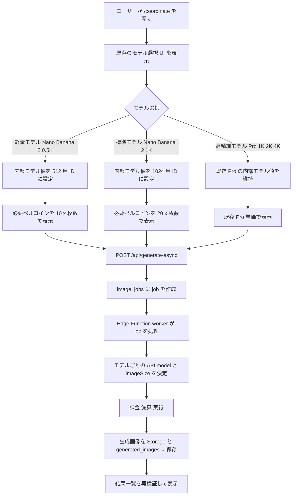
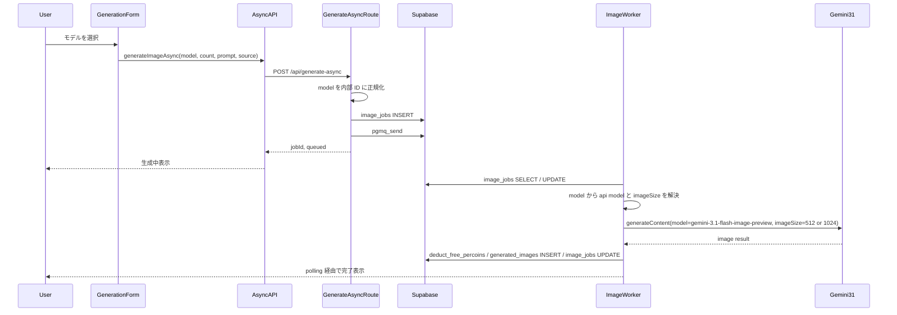
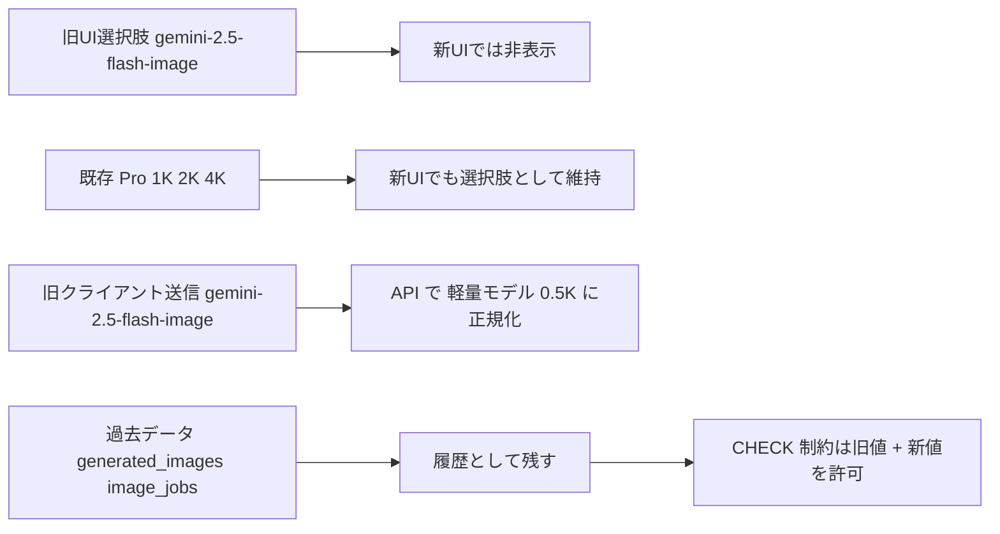

# コーディネート画面 Nano Banana 2 モデル更新 実装計画

作成日: 2026-03-27

## コードベース調査結果

計画作成にあたり、以下を調査済み。

- **Supabase接続**: 確認済み。`public.generated_images` は 510 件、`public.image_jobs` は 444 件存在する。
- **既存モデル分布**: `generated_images` は `gemini-2.5-flash-image` 400 件、`gemini-3-pro-image-1k` 93 件、`gemini-3-pro-image-2k` 4 件、`gemini-3-pro-image-4k` 13 件。`image_jobs` は `gemini-2.5-flash-image` 344 件、`gemini-3-pro-image-1k` 87 件、`gemini-3-pro-image-2k` 1 件、`gemini-3-pro-image-4k` 12 件。過去データは旧値のまま残す前提で問題ない。
- **コーディネート UI**: 既存のモデル選択 UI は [features/generation/components/GenerationForm.tsx](/Users/hide/ai_coordinate/features/generation/components/GenerationForm.tsx) の `Select` 実装。初期値は `gemini-2.5-flash-image`。
- **クライアント送信経路**: [features/generation/components/GenerationFormContainer.tsx](/Users/hide/ai_coordinate/features/generation/components/GenerationFormContainer.tsx) から [features/generation/lib/async-api.ts](/Users/hide/ai_coordinate/features/generation/lib/async-api.ts) を通して `POST /api/generate-async` に到達する。`async-api` のデフォルトモデルも `gemini-2.5-flash-image`。
- **API バリデーション**: [features/generation/lib/schema.ts](/Users/hide/ai_coordinate/features/generation/lib/schema.ts) と [features/generation/types.ts](/Users/hide/ai_coordinate/features/generation/types.ts) が `model` enum と正規化ロジックの正本。ここは UI より先に更新しないと route handler が新しいモデルを拒否する。
- **ワーカー実装**: [supabase/functions/image-gen-worker/index.ts](/Users/hide/ai_coordinate/supabase/functions/image-gen-worker/index.ts) に `normalizeModelName`、`toApiModelName`、`extractImageSize`、`getPercoinCost` の複製があり、現在は `gemini-2.5-flash-image` と `gemini-3-pro-image-preview` 系のみを直接扱う。
- **3.1 Flash Image Preview の既存参照実装**: [app/(app)/style/generate/handler.ts](/Users/hide/ai_coordinate/app/(app)/style/generate/handler.ts) と [features/style/lib/constants.ts](/Users/hide/ai_coordinate/features/style/lib/constants.ts) では `gemini-3.1-flash-image-preview` と `imageConfig.imageSize = "512"` を既に利用している。コーディネート実装はこの送信形を踏襲するのが最短。
- **DB 制約**: [supabase/migrations/20260115054748_add_image_jobs_queue.sql](/Users/hide/ai_coordinate/supabase/migrations/20260115054748_add_image_jobs_queue.sql) と [supabase/migrations/20251223003919_update_model_check_constraint.sql](/Users/hide/ai_coordinate/supabase/migrations/20251223003919_update_model_check_constraint.sql) で `image_jobs.model` と `generated_images.model` の CHECK 制約が旧モデル集合に固定されている。新規テーブルは不要だが migration は必要。
- **購入導線と価格表示**: [features/credits/percoin-packages.ts](/Users/hide/ai_coordinate/features/credits/percoin-packages.ts)、[features/credits/components/PercoinPurchaseCard.tsx](/Users/hide/ai_coordinate/features/credits/components/PercoinPurchaseCard.tsx)、[app/(marketing)/pricing/page.tsx](/Users/hide/ai_coordinate/app/(marketing)/pricing/page.tsx)、[messages/ja.ts](/Users/hide/ai_coordinate/messages/ja.ts)、[messages/en.ts](/Users/hide/ai_coordinate/messages/en.ts) が、旧「標準モデル 20 / 1K 高精度 50」の説明を持っている。
- **API 契約文書**: [docs/API.md](/Users/hide/ai_coordinate/docs/API.md) と [docs/openapi.yaml](/Users/hide/ai_coordinate/docs/openapi.yaml) に旧 enum と default が残っている。
- **プロダクト文書**: [docs/product/user-stories.md](/Users/hide/ai_coordinate/docs/product/user-stories.md) では「選択したモデルと枚数に応じた必要ペルコイン数が表示される」要件がある。今回の変更はこの要件の延長線上にある。
- **データアクセス方針**: [docs/architecture/data.ja.md](/Users/hide/ai_coordinate/docs/architecture/data.ja.md) の方針どおり、この変更は単純 CRUD とワーカー内ロジック更新で完結し、新規 RPC や新規テーブルは不要。
- **既存テスト**: [tests/unit/features/generation/generation-form.test.tsx](/Users/hide/ai_coordinate/tests/unit/features/generation/generation-form.test.tsx)、[tests/integration/api/generate-async-route.test.ts](/Users/hide/ai_coordinate/tests/integration/api/generate-async-route.test.ts)、[tests/characterization/api/generate-async-route.char.test.ts](/Users/hide/ai_coordinate/tests/characterization/api/generate-async-route.char.test.ts) が主な回帰防止ポイント。

## 1. 概要図

### ユーザー操作フロー

### API 通信シーケンス

### モデル移行方針

## 2. EARS 要件定義

| ID | タイプ | EARS 文（EN） | 要件文（JA） |
| --- | --- | --- | --- |
| CNB-001 | イベント駆動 | When a user opens `/coordinate`, the system shall add `軽量モデル：Nano Banana 2 \| 0.5K` and `標準モデル：Nano Banana 2 \| 1K` to the existing model selector while keeping `gemini-3-pro-image-1k`, `gemini-3-pro-image-2k`, and `gemini-3-pro-image-4k` available. | ユーザーが `/coordinate` を開いたとき、システムは既存のモデル選択 UI に `軽量モデル：Nano Banana 2 \| 0.5K` と `標準モデル：Nano Banana 2 \| 1K` を追加しつつ、`gemini-3-pro-image-1k`、`gemini-3-pro-image-2k`、`gemini-3-pro-image-4k` を引き続き選択可能な状態で表示しなければならない。 |
| CNB-002 | イベント駆動 | When the user selects the light model, the system shall display and charge `10 ペルコイン / 枚`. | ユーザーが軽量モデルを選択したとき、システムは `10ペルコイン / 枚` を表示し、その単価で課金しなければならない。 |
| CNB-003 | イベント駆動 | When the user selects the standard model, the system shall display and charge `20 ペルコイン / 枚`. | ユーザーが標準モデルを選択したとき、システムは `20ペルコイン / 枚` を表示し、その単価で課金しなければならない。 |
| CNB-004 | 状態駆動 | While the user is on the coordinate screen, the system shall no longer offer `gemini-2.5-flash-image` as a selectable model and shall keep the existing `gemini-3-pro-image-1k`, `gemini-3-pro-image-2k`, and `gemini-3-pro-image-4k` options available. | ユーザーがコーディネート画面を利用している間、システムは `gemini-2.5-flash-image` を選択肢として表示してはならず、既存の `gemini-3-pro-image-1k`、`gemini-3-pro-image-2k`、`gemini-3-pro-image-4k` は引き続き利用可能でなければならない。 |
| CNB-005 | イベント駆動 | When the request reaches `POST /api/generate-async` with the new internal 0.5K or 1K model value, the system shall persist that value to `image_jobs.model`, validate the user balance against the correct percoin cost, and enqueue the job. | 新しい内部モデル値の `0.5K` または `1K` を含むリクエストが `POST /api/generate-async` に到達したとき、システムはその値を `image_jobs.model` に保存し、正しいペルコイン消費量で残高を検証し、ジョブをキュー投入しなければならない。 |
| CNB-006 | 状態駆動 | While the worker is processing a coordinate job with the new internal model value, the system shall call `gemini-3.1-flash-image-preview` and set the matching `imageConfig.imageSize` (`512` or `1024`). | ワーカーが新しい内部モデル値を持つコーディネートジョブを処理している間、システムは `gemini-3.1-flash-image-preview` を呼び出し、対応する `imageConfig.imageSize` として `512` または `1024` を設定しなければならない。 |
| CNB-007 | 状態駆動 | While historical rows still contain `gemini-2.5-flash-image`, the system shall keep those rows readable and shall not rewrite past `generated_images` or `image_jobs` records. | 履歴行に `gemini-2.5-flash-image` が残っている間、システムはそれらの行を引き続き読み取り可能に保ち、過去の `generated_images` と `image_jobs` を書き換えてはならない。 |
| CNB-008 | 異常系 | If an older client sends `gemini-2.5-flash-image` after the rollout, then the system shall normalize it to the new light 0.5K model instead of creating a new 2.5-based coordinate job. | ロールアウト後に古いクライアントが `gemini-2.5-flash-image` を送信した場合、システムはそれを新しい軽量 `0.5K` モデルへ正規化し、新しい `2.5` ベースのコーディネートジョブを作成してはならない。 |
| CNB-009 | 状態駆動 | While the user is viewing purchase-related copy from the coordinate flow, the system shall show package descriptions and estimated generation counts that match the new `0.5K=10` and `1K=20` rule. | ユーザーがコーディネート導線内の購入関連文言を見ている間、システムは新しい `0.5K=10` と `1K=20` のルールに一致するパッケージ説明と生成枚数目安を表示しなければならない。 |
| CNB-010 | 状態駆動 | While API documentation is published, the documented `model` enum and default shall match the new internal coordinate model values. | API ドキュメントが公開されている間、記載される `model` enum と default は新しいコーディネート内部モデル値に一致していなければならない。 |

## 3. ADR（設計判断記録）

### ADR-001: DB 保存値には API モデル名ではなく解像度付きの内部識別子を使う

- **Context**: `gemini-3.1-flash-image-preview` は同じ API モデル名で `512` と `1024` の両方を扱う。DB に API モデル名だけを保存すると、履歴・課金・管理集計で解像度を再現できない。
- **Decision**: DB 保存用の内部モデル値を `gemini-3.1-flash-image-preview-512` と `gemini-3.1-flash-image-preview-1024` とする。
- **Reason**: 既存の `gemini-3-pro-image-1k/2k/4k` と同じく、DB 値だけで UI 表示、課金、worker の `imageSize` 解決、履歴分析ができる。
- **Consequence**: 型、Zod、worker、DB CHECK 制約、OpenAPI を同時に更新する必要がある。

### ADR-002: 新しい既定モデルは `軽量モデル：Nano Banana 2 | 0.5K` とする

- **Context**: 新モデル導入後の初期選択肢を `0.5K` と `1K` のどちらにするかで、既存ユーザーの体験と期待値が変わる。
- **Decision**: 既定値は `gemini-3.1-flash-image-preview-512` とする。
- **Reason**: コーディネート画面の初回体験をより低コストにし、ユーザーが最初に迷わず生成を始めやすくするため。`標準モデル` は画質重視の上位オプションとして明示的に選ばせる。
- **Consequence**: `GenerationForm`、`async-api`、`schema`、`route handler` の default/fallback を同値に合わせる。

### ADR-003: 旧 `gemini-2.5-flash-image` だけを新規 UI から外し、既存 Pro は維持する

- **Context**: ロールアウト直後は、古いブラウザキャッシュや stale client code が旧モデル値を送る可能性がある。
- **Decision**: `gemini-2.5-flash-image` だけを新規 UI から除外し、`gemini-3-pro-image-1k/2k/4k` はそのまま残す。API の入力互換としてのみ `gemini-2.5-flash-image` を受け付けて `gemini-3.1-flash-image-preview-512` に正規化する。
- **Reason**: 低価格帯の Nano Banana 2 を追加しつつ、既存の高精細 Pro 導線を維持したい。ユーザー向けの `2.5` 提供停止も同時に守れる。
- **Consequence**: UI、i18n、購入文言では `Nano Banana 2` と `Pro` の併存を前提に整理する必要がある。

### ADR-004: 過去データの backfill は行わず、CHECK 制約だけを拡張する

- **Context**: `generated_images` と `image_jobs` に旧モデル値の履歴が既に大量に存在する。
- **Decision**: 既存行の `model` は書き換えず、新旧両方の値を許可する migration を追加する。
- **Reason**: 履歴の真正性を保ちつつ、作業量とリスクを抑えられる。ユーザー要件でも過去履歴はそのまま残せれば十分としている。
- **Consequence**: DB 制約は旧値 + 新値の和集合になる。管理画面で raw model が見える箇所は必要に応じて別途ラベル変換を行う。

### ADR-005: `gemini-3.1-flash-image-preview` のリクエスト形は style 実装を踏襲する

- **Context**: coordinate worker は現在 `gemini-3-pro-image-preview` 向けの `imageSize = 1K/2K/4K` 分岐しか持っていない。一方で style は既に `gemini-3.1-flash-image-preview` と `imageSize = "512"` を実運用している。
- **Decision**: coordinate worker の 3.1 path は [app/(app)/style/generate/handler.ts](/Users/hide/ai_coordinate/app/(app)/style/generate/handler.ts) の payload 形に寄せ、`responseModalities` と `imageConfig.imageSize` を明示する。
- **Reason**: 新しいモデルの一次参照実装がリポジトリ内に既にあり、仕様の当て推量を減らせる。
- **Consequence**: worker 側の request body 型は `"512" | "1024" | "1K" | "2K" | "4K"` を扱えるように拡張する。

## 4. 実装フェーズ

### Phase 1: モデルドメインの再定義

目的:
- 新旧モデルの内部識別子と default/fallback を整理する。

TODO:
- [features/generation/types.ts](/Users/hide/ai_coordinate/features/generation/types.ts)
  - `GeminiModel` に `gemini-3.1-flash-image-preview-512` と `gemini-3.1-flash-image-preview-1024` を追加する。
  - `GeminiApiModel` に `gemini-3.1-flash-image-preview` を追加する。
  - `normalizeModelName()` を更新し、旧 `gemini-2.5-flash-image` は `...-512` に正規化する。
  - `toApiModelName()` と `extractImageSize()` を新モデル対応に更新する。
- [features/generation/lib/model-config.ts](/Users/hide/ai_coordinate/features/generation/lib/model-config.ts)
  - `...-512 => 10`、`...-1024 => 20` を追加する。
  - 既存 `gemini-2.5-flash-image` は当面 20 のまま残し、履歴互換だけ確保する。
- [features/generation/lib/job-types.ts](/Users/hide/ai_coordinate/features/generation/lib/job-types.ts) / [features/generation/lib/database.ts](/Users/hide/ai_coordinate/features/generation/lib/database.ts)
  - 型追従のみ確認する。

参考:
- [features/generation/types.ts](/Users/hide/ai_coordinate/features/generation/types.ts)
- [features/generation/lib/model-config.ts](/Users/hide/ai_coordinate/features/generation/lib/model-config.ts)

### Phase 2: コーディネート UI と i18n の差し替え

目的:
- 既存のモデル選択 UI に 2 つの Nano Banana 2 プランを追加しつつ、既存 Pro 選択肢を維持する。

TODO:
- [features/generation/components/GenerationForm.tsx](/Users/hide/ai_coordinate/features/generation/components/GenerationForm.tsx)
  - 既定値を `gemini-3.1-flash-image-preview-512` にする。
  - `gemini-2.5-flash-image` の `SelectItem` を削除し、`Nano Banana 2` の `0.5K` / `1K` を追加する。
  - `gemini-3-pro-image-1k/2k/4k` の `SelectItem` は残す。
  - チュートリアルクリア時の reset 値も新既定値に合わせる。
  - `countCostDescription` が新単価に追従することを維持する。
- [messages/ja.ts](/Users/hide/ai_coordinate/messages/ja.ts) / [messages/en.ts](/Users/hide/ai_coordinate/messages/en.ts)
  - `軽量モデル：Nano Banana 2 | 0.5K` と `標準モデル：Nano Banana 2 | 1K` の文言を追加する。
  - 既存の `model1k` / `model2k` / `model4k` は Pro 用として残すか、`modelPro1k` / `modelPro2k` / `modelPro4k` に整理する。
- [tests/unit/features/generation/generation-form.test.tsx](/Users/hide/ai_coordinate/tests/unit/features/generation/generation-form.test.tsx)
  - 初期値、選択肢、送信 payload、必要ペルコイン表示の期待値を更新する。
  - `gemini-3-pro-image-1k/2k/4k` が引き続き選択可能であることを確認する。

参考:
- [features/generation/components/GenerationForm.tsx](/Users/hide/ai_coordinate/features/generation/components/GenerationForm.tsx)
- [messages/ja.ts](/Users/hide/ai_coordinate/messages/ja.ts)
- [messages/en.ts](/Users/hide/ai_coordinate/messages/en.ts)

### Phase 3: API 入力と非同期ジョブ作成の更新

目的:
- route handler が新モデルを受け付け、旧クライアント入力も安全に吸収できるようにする。

TODO:
- [features/generation/lib/schema.ts](/Users/hide/ai_coordinate/features/generation/lib/schema.ts)
  - `model` enum に新内部モデル値を追加する。
  - default を `gemini-3.1-flash-image-preview-512` に更新する。
  - 旧 `gemini-2.5-flash-image` と、必要なら bare な `gemini-3.1-flash-image-preview` を受け付けて `normalizeModelName()` に委譲する。
- [features/generation/lib/async-api.ts](/Users/hide/ai_coordinate/features/generation/lib/async-api.ts)
  - クライアント側 fallback を新既定値に合わせる。
- [app/api/generate-async/handler.ts](/Users/hide/ai_coordinate/app/api/generate-async/handler.ts)
  - 残高計算 fallback を新既定値に合わせる。
  - `jobData.model` に新内部値が入ることを前提に integration/char test を更新する。
- [tests/integration/api/generate-async-route.test.ts](/Users/hide/ai_coordinate/tests/integration/api/generate-async-route.test.ts)
  - 新モデルで job が作成されるケースを追加する。
- [tests/characterization/api/generate-async-route.char.test.ts](/Users/hide/ai_coordinate/tests/characterization/api/generate-async-route.char.test.ts)
  - inline snapshot の `model` と残高不足メッセージを新仕様に合わせる。

参考:
- [app/api/generate-async/handler.ts](/Users/hide/ai_coordinate/app/api/generate-async/handler.ts)
- [features/generation/lib/schema.ts](/Users/hide/ai_coordinate/features/generation/lib/schema.ts)

### Phase 4: Edge Function worker の 3.1 対応

目的:
- coordinate job が `gemini-3.1-flash-image-preview` で正しく実行されるようにする。

TODO:
- [supabase/functions/image-gen-worker/index.ts](/Users/hide/ai_coordinate/supabase/functions/image-gen-worker/index.ts)
  - worker 内の `GeminiModel` / `GeminiApiModel` union を更新する。
  - `normalizeModelName()`, `toApiModelName()`, `extractImageSize()`, `getPercoinCost()` を新内部モデル値に対応させる。
  - 旧 `gemini-2.5-flash-image` は、履歴互換と in-flight job 処理のため当面残す。
  - request body の `generationConfig.imageConfig.imageSize` を `512` / `1024` でも扱えるようにする。
  - `gemini-3.1-flash-image-preview` 使用時は [app/(app)/style/generate/handler.ts](/Users/hide/ai_coordinate/app/(app)/style/generate/handler.ts) を参考に `responseModalities` を含めた payload を組み立てる。
- 必要に応じて [features/generation/lib/nanobanana-client.ts](/Users/hide/ai_coordinate/features/generation/lib/nanobanana-client.ts) も型だけ追従させる。

参考:
- [supabase/functions/image-gen-worker/index.ts](/Users/hide/ai_coordinate/supabase/functions/image-gen-worker/index.ts)
- [app/(app)/style/generate/handler.ts](/Users/hide/ai_coordinate/app/(app)/style/generate/handler.ts)
- [app/i2i/[slug]/generate/route.ts](/Users/hide/ai_coordinate/app/i2i/[slug]/generate/route.ts)

### Phase 5: DB 制約と履歴互換

目的:
- 新モデル値を DB が受け付けるようにしつつ、旧履歴を壊さない。

TODO:
- 新 migration を追加する。
  - `generated_images.model` CHECK 制約に新旧両方の値を許可する。
  - `image_jobs.model` CHECK 制約に新旧両方の値を許可する。
  - 既存データの UPDATE は行わない。
- migration 名の例:
  - `supabase/migrations/<timestamp>_add_coordinate_nano_banana_2_models.sql`

参考:
- [supabase/migrations/20260115054748_add_image_jobs_queue.sql](/Users/hide/ai_coordinate/supabase/migrations/20260115054748_add_image_jobs_queue.sql)
- [supabase/migrations/20251223003919_update_model_check_constraint.sql](/Users/hide/ai_coordinate/supabase/migrations/20251223003919_update_model_check_constraint.sql)

### Phase 6: 購入コピー、マーケ文言、API 文書の同期

目的:
- ユーザー向け表示と API 契約を新仕様に揃える。

TODO:
- [features/credits/percoin-packages.ts](/Users/hide/ai_coordinate/features/credits/percoin-packages.ts)
  - パッケージ説明を `Nano Banana 2 0.5K/1K` の新単価追加に合わせて更新する。
  - 既存の Pro 1K/2K/4K が提供継続であることと矛盾しない表現にする。
  - `GENERATION_PERCOIN_COST` をどう扱うか明示する。
    - 現時点の推奨: 既定モデルが `0.5K = 10` になるため、`GENERATION_PERCOIN_COST` は `10` に合わせるか、`DEFAULT_GENERATION_PERCOIN_COST` などへ改名して意味を明確化する。
- [messages/ja.ts](/Users/hide/ai_coordinate/messages/ja.ts) / [messages/en.ts](/Users/hide/ai_coordinate/messages/en.ts)
  - 購入カード用 description の重複コピーも同値に更新する。
- [app/(marketing)/pricing/page.tsx](/Users/hide/ai_coordinate/app/(marketing)/pricing/page.tsx)
  - 英語 inline copy の package description を更新する。
  - 必要なら estimate 文言を「標準モデル 1K 基準」だと誤解しない表現に調整する。
- [docs/API.md](/Users/hide/ai_coordinate/docs/API.md) / [docs/openapi.yaml](/Users/hide/ai_coordinate/docs/openapi.yaml)
  - `model` enum と default を新仕様に更新する。
- [docs/business/monetization.md](/Users/hide/ai_coordinate/docs/business/monetization.md)
  - 既に更新済みの想定だが、名称や default の整合だけ最終確認する。

参考:
- [features/credits/percoin-packages.ts](/Users/hide/ai_coordinate/features/credits/percoin-packages.ts)
- [features/credits/components/PercoinPurchaseCard.tsx](/Users/hide/ai_coordinate/features/credits/components/PercoinPurchaseCard.tsx)
- [app/(marketing)/pricing/page.tsx](/Users/hide/ai_coordinate/app/(marketing)/pricing/page.tsx)

### Phase 7: 運用表示と管理画面の仕上げ

目的:
- 運用者が新内部モデル ID を読める状態にする。

TODO:
- [features/admin-dashboard/lib/get-admin-dashboard-data.ts](/Users/hide/ai_coordinate/features/admin-dashboard/lib/get-admin-dashboard-data.ts) と [features/admin-dashboard/components/AdminModelMixChart.tsx](/Users/hide/ai_coordinate/features/admin-dashboard/components/AdminModelMixChart.tsx)
  - raw model string のままでも機能はするが、必要なら `Nano Banana 2 | 0.5K / 1K` に整形表示する helper を追加する。

注:
- この phase はユーザー向け必須ではないが、内部運用の可読性改善として推奨。

## 5. 変更対象ファイル一覧

- UI / i18n
  - `features/generation/components/GenerationForm.tsx`
  - `messages/ja.ts`
  - `messages/en.ts`
  - `tests/unit/features/generation/generation-form.test.tsx`
- クライアント送信 / route validation
  - `features/generation/types.ts`
  - `features/generation/lib/model-config.ts`
  - `features/generation/lib/schema.ts`
  - `features/generation/lib/async-api.ts`
  - `app/api/generate-async/handler.ts`
  - `tests/integration/api/generate-async-route.test.ts`
  - `tests/characterization/api/generate-async-route.char.test.ts`
- Worker
  - `supabase/functions/image-gen-worker/index.ts`
  - 必要なら `features/generation/lib/nanobanana-client.ts`
- DB
  - `supabase/migrations/<timestamp>_add_coordinate_nano_banana_2_models.sql`
- 購入導線 / 文言
  - `features/credits/percoin-packages.ts`
  - `app/(marketing)/pricing/page.tsx`
  - 必要に応じて `features/admin-dashboard/lib/get-admin-dashboard-data.ts`
  - 必要に応じて `features/admin-dashboard/components/AdminModelMixChart.tsx`
- ドキュメント
  - `docs/API.md`
  - `docs/openapi.yaml`
  - `docs/business/monetization.md` の整合確認

## 6. テスト観点

### Unit

- `GenerationForm` の初期モデルが `軽量モデル：Nano Banana 2 | 0.5K` になっている。
- モデル切替で必要ペルコイン表示が `10` / `20` / `50` / `80` / `100` に正しく変わる。
- `onSubmit` payload が新内部モデル値を返す。
- `gemini-3-pro-image-1k/2k/4k` が引き続き選択肢に残っている。

### Integration

- `POST /api/generate-async` が新内部モデル値を受け付ける。
- 旧 `gemini-2.5-flash-image` を送ると新軽量モデル値へ正規化される。
- 残高不足メッセージが新単価に一致する。
- `gemini-3-pro-image-1k/2k/4k` を送った場合の既存挙動が変わらない。

### Characterization

- 旧 route の主要レスポンス形は維持される。
- snapshot の差分は `model` 値と必要ペルコイン数の変化に限定される。

### Worker / E2E に近い確認

- `...-512` が `gemini-3.1-flash-image-preview + imageSize=512` へ変換される。
- `...-1024` が `gemini-3.1-flash-image-preview + imageSize=1024` へ変換される。
- 旧 `gemini-2.5-flash-image` job も処理不能にならない。

### Copy / Docs

- 購入カード、価格ページ、API ドキュメントの表記が新仕様と一致する。
- `Nano Banana 2` 追加後も `gemini-3-pro-image-1k/2k/4k` の提供継続と矛盾しない。
- `docs/business/monetization.md` の数値と UI 表示が矛盾しない。

## 7. ロールバック方針

- UI のロールバック:
  - `GenerationForm` と i18n を元のモデル選択へ戻す。
- API / worker のロールバック:
  - `types.ts` / `schema.ts` / `async-api.ts` / `handler.ts` / worker の追加 enum と正規化を元に戻す。
- DB のロールバック:
  - 新 migration で追加した CHECK 制約を旧集合へ戻す。ただし、ロールバック前に新内部モデル値の row が投入済みなら、そのままでは制約違反になるため、先に旧値へ再マップするか、ロールバックを見送る。
- 運用判断:
  - 実データに新モデル値が書き込まれた後は、アプリだけ戻して DB 制約は新旧併存のまま維持する方が安全。

## 8. 整合性チェック

- `GenerationForm` の表示名、`getPercoinCost()`、残高不足メッセージ、購入カード説明が同じ単価前提になっているか。
- `GeminiModel` の union、Zod enum、OpenAPI enum、DB CHECK 制約が一致しているか。
- 旧 `gemini-2.5-flash-image` の履歴 row を壊さず、新規 coordinate job だけ停止できているか。
- `gemini-3-pro-image-1k/2k/4k` が UI、API、worker、文言の各層で継続提供になっているか。
- `imageSize` の値が `512` / `1024` として style 実装に揃っているか。
- 管理画面や分析で新内部モデル ID が運用上読めるか。

## 9. 実装順の推奨

1. `types.ts` / `model-config.ts` / `schema.ts` でモデル定義を固める。
2. `GenerationForm` と i18n を差し替え、unit test を先に通す。
3. `generate-async` route と API テストを更新する。
4. worker を 3.1 対応し、旧 2.5 job 互換を残す。
5. migration を追加する。
6. 購入文言、価格ページ、API ドキュメントを同期する。
7. 最後に admin model mix の表示整形が必要か判断する。
