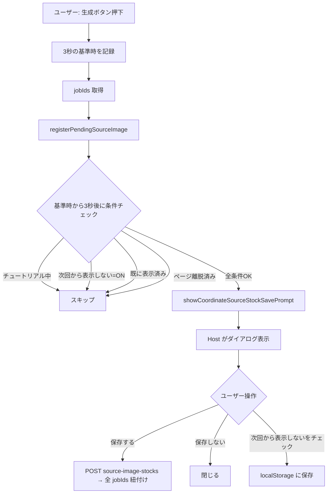
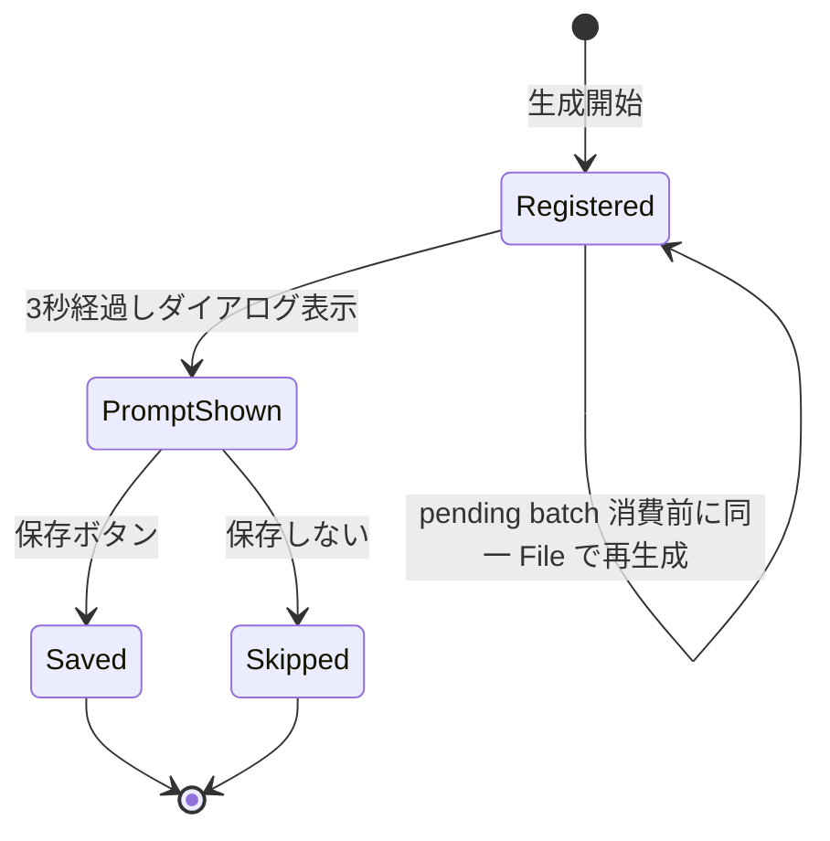
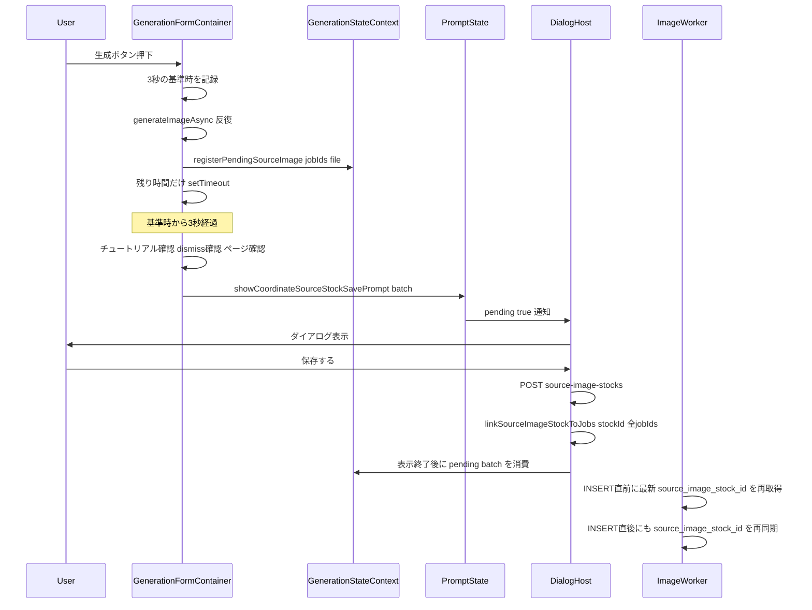
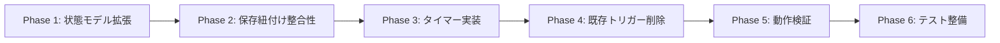

# コーディネート元画像ストック保存案内 ─ 生成中表示への移行

## 概要

現在は「拡大画面を閉じた時」または「投稿成功時」に表示している `SaveSourceImageToStockDialog` を、**生成ボタン押下から 3 秒後** に表示するよう変更する。生成は 20 秒以上かかるため、待機時間を有効活用してユーザーが結果を見る前にストック保存判断を済ませられる UX へ刷新する。

関連 PR: [#240 コーディネートの元画像ストック保存導線を追加](https://github.com/3balljugglerYu/ai_coordinate/pull/240)（既存実装のリファクタ）

---

## コードベース調査結果

### 1. チュートリアル状態の検出
- `features/tutorial/types.ts:11-16` で `TUTORIAL_STORAGE_KEYS` 定義
  - `IN_PROGRESS = "tutorial_in_progress"`（`sessionStorage` 上で `"true"` 文字列）
- `GenerationFormContainer.tsx:668-673, 1026-1033` で `sessionStorage.getItem(TUTORIAL_STORAGE_KEYS.IN_PROGRESS) === "true"` の判定実績あり
- → **同じ判定式を新トリガー実行直前に再利用する**

### 2. 元画像ストック関連スキーマ
- `source_image_stocks` テーブル（[20250123140000_add_generation_types_and_stock_images.sql](supabase/migrations/20250123140000_add_generation_types_and_stock_images.sql)）
- `image_jobs` / `generated_images` に `source_image_stock_id` FK（[20260115054748_add_image_jobs_queue.sql:30](supabase/migrations/20260115054748_add_image_jobs_queue.sql#L30)）
- 1:N 関係。1 ストック → 複数 jobs に紐付け可能 ✅
- 紐付け API: `linkSourceImageStockToJobs(stockId, jobIds[])` [features/generation/lib/database.ts:527-550](features/generation/lib/database.ts#L527-L550) → `PATCH /api/generation-status/link-stock`
- `PATCH /api/generation-status/link-stock` は `COORDINATE_STOCKS_LINK_MAX_JOBS = 4` で jobIds を制限している（現行の最大同時生成数 4 と一致）
- 生成完了前に保存した場合、`link-stock` は `image_jobs.source_image_stock_id` を更新できるが、worker が既に job を読み込んでいると `generated_images.source_image_stock_id` へ反映されない可能性がある
- → **DB スキーマ変更は不要。ただし worker が `generated_images` INSERT 直前に最新の `image_jobs.source_image_stock_id` を再取得する修正が必要**

### 3. ペンディング元画像バッチのライフサイクル
[features/generation/context/GenerationStateContext.tsx:18-178](features/generation/context/GenerationStateContext.tsx#L18-L178)

```ts
interface PendingSourceImageBatch {
  file: File;
  jobIds: string[];
  promptShown: boolean;
}
```
- 現行 `registerPendingSourceImage(jobIds, file)` は呼び出しごとに新規 `batchId` を作るため、**同一 File 参照でも自動蓄積は未対応**
- `consumePendingSourceImageBatch(jobId)`: バッチを取り出して削除
- `bindPendingSourceImageResult` / `dropPendingSourceImageJob`: ギャラリーのプレビュー連動・失敗時クリーンアップ。今回のリファクタ後も継続利用
- → **バッチモデルは `promptShown` だけでなく、同一 File の既存 batchId 再利用・read-only 取得・表示後の消費タイミングを明示して拡張する**

### 4. 「次回から表示しない」フラグ
- localStorage キー: `"persta-ai:coordinate-stock-save-prompt-dismissed"`
- 読み書き: [features/generation/lib/form-preferences.ts:163-183](features/generation/lib/form-preferences.ts#L163-L183)
- → **新トリガーでもこのフラグを尊重**

### 5. 生成開始トリガーポイント
[features/generation/components/GenerationFormContainer.tsx](features/generation/components/GenerationFormContainer.tsx) 内
- `handleGenerate()` (line 732 付近): フォーム submit ハンドラ
- jobIds 蓄積ループ (line 832-878): `generateImageAsync` 成功で `jobIds.push(response.jobId)` (line 848)
- `registerPendingSourceImage([...jobIds], data.sourceImage)` (line 876-877): 全 jobId 揃った直後

### 6. 既存の表示トリガー（廃止対象）
- [GeneratedImageGallery.tsx:385-407](features/generation/components/GeneratedImageGallery.tsx#L385-L407): 拡大画面 onClose で `consumePendingSourceImageBatch` → ローカル `openSavePrompt`
- [GeneratedImageGallery.tsx:420-438](features/generation/components/GeneratedImageGallery.tsx#L420-L438): ローカル `<SaveSourceImageToStockDialog />` レンダリング
- [GeneratedImageGallery.tsx:448-457](features/generation/components/GeneratedImageGallery.tsx#L448-L457): `onPostSuccess` → `showCoordinateSourceStockSavePrompt`

### 7. タイマークリーンアップの既存パターン
[GenerationFormContainer.tsx:719-730](features/generation/components/GenerationFormContainer.tsx#L719-L730) に `useRef<BrowserTimerId>` + `useEffect` cleanup の典型例あり。**これを踏襲**。

---

## 1. 概要図

### ユーザー操作フロー（変更後）



### 状態遷移（PendingSourceImageBatch）



### コンポーネント間シーケンス（3秒トリガー）



---

## 2. EARS 要件定義

### イベント駆動

| ID | 要件 |
|---|---|
| EARS-1 | When the user submits generation on the coordinate screen with an uploaded source image and the submit passes client validation, the system shall record the submit time as the start of the 3-second prompt delay.<br>**ja**: ユーザーがコーディネート画面でアップロード元画像を伴う生成を送信し、クライアント検証を通過したとき、システムは元画像ストック保存案内の3秒遅延の起点として送信時刻を記録すること。 |
| EARS-2 | When 3 seconds have elapsed after the timer started AND the user is still on the coordinate page AND the prompt has not yet been shown for the current batch, the system shall display `SaveSourceImageToStockDialog` via the global host.<br>**ja**: タイマー開始から3秒経過時に、ユーザーがコーディネート画面に滞在しており、かつ現在のバッチに対してダイアログが未表示である場合、システムはグローバルホスト経由で `SaveSourceImageToStockDialog` を表示すること。 |
| EARS-3 | When the user saves the source image via the dialog, the system shall persist the image to `source_image_stocks` and link **all jobIds** accumulated in the batch via `linkSourceImageStockToJobs`, chunking requests when the batch exceeds the API limit.<br>**ja**: ダイアログから保存を行ったとき、システムは元画像を `source_image_stocks` に保存し、`linkSourceImageStockToJobs` でバッチに蓄積された **全 jobIds** を紐付けること。バッチが API 上限を超える場合は分割して呼び出すこと。 |

### 状態駆動

| ID | 要件 |
|---|---|
| EARS-4 | While the user is in tutorial mode (`sessionStorage[tutorial_in_progress] === "true"`), the system shall not display the source-image stock save prompt regardless of timer expiry.<br>**ja**: ユーザーがチュートリアル中である間、タイマー満了に関わらずシステムは元画像ストック保存案内を表示しないこと。 |
| EARS-5 | While the "次回から表示しない" preference is set in localStorage, the system shall not display the prompt.<br>**ja**: 「次回から表示しない」フラグが localStorage に設定されている間、システムはダイアログを表示しないこと。 |

### 異常系・破棄

| ID | 要件 |
|---|---|
| EARS-6 | If the user navigates away from the coordinate page before the 3-second timer expires, then the system shall cancel the timer and not display the prompt.<br>**ja**: 3秒タイマー満了前にユーザーがコーディネート画面から離脱した場合、システムはタイマーを破棄しダイアログを表示しないこと。 |
| EARS-7 | If one of the generation requests fails before the timer fires after at least one jobId has been registered, then the system shall continue the timer; the prompt may still appear if other conditions are met.<br>**ja**: 少なくとも1件の jobId 登録後、タイマー発火前に一部の生成リクエストが失敗した場合、システムはタイマーを継続する。他の条件を満たせばダイアログを表示してよい。（割り切り） |

### オプション

| ID | 要件 |
|---|---|
| EARS-8 | Where the same `File` object is registered again before the previous pending batch is consumed, the system shall reuse the existing batch, display the prompt only once, and link all jobIds in that pending batch upon save.<br>**ja**: 前回の pending batch が消費される前に同一 `File` オブジェクトが再登録された場合、システムは既存バッチを再利用し、ダイアログ表示を1回に抑え、保存時にはその pending batch 内の全 jobIds を紐付けること。 |

### データ整合性

| ID | 要件 |
|---|---|
| EARS-9 | When a source image stock is linked to an `image_jobs` row before or during the worker's `generated_images` persistence step, the worker shall use the latest `image_jobs.source_image_stock_id` at insert time and perform an idempotent post-insert sync when needed.<br>**ja**: worker の `generated_images` 永続化ステップ前後に `image_jobs` へ元画像ストックが紐付けられた場合、worker は INSERT 時に最新 `image_jobs.source_image_stock_id` を使い、必要に応じて INSERT 直後にも冪等に同期すること。 |

---

## 3. ADR

### ADR-001: タイマートリガーを `GenerationFormContainer` に直接配置する

- **Context**: 3秒後のダイアログ表示を実装するにあたり、(a) `GenerationFormContainer` 内に `setTimeout` を直接書く、(b) 別 hook (`useStockPromptTimer`) に切り出す、(c) `GenerationStateContext` に時刻情報を持たせて Host 側で計算する、の3案がある。
- **Decision**: (a) `GenerationFormContainer` 内に直接配置する。生成送信時刻を記録し、jobIds 登録後に `Math.max(0, 3000 - elapsed)` で残り時間だけ `setTimeout` する。`useRef<BrowserTimerId>` + `useEffect` cleanup の既存パターン（line 719-730）と一貫させる。
- **Reason**: 3秒の起点は生成送信時だが、ダイアログ表示には jobIds 登録済み batch が必要になる。送信時刻だけ先に記録し、batch 登録後に残り時間でタイマーを張ると、要件とデータ依存の両方を満たせる。破棄条件（コンポーネントアンマウント）も同コンポーネント内で完結する。
- **Consequence**: `GenerationFormContainer` のコード量がわずかに増える。将来 `useStockPromptTimer` への抽出が必要になっても、ロジックが局所化されているため切り出しは容易。

### ADR-002: 「表示済み」フラグはバッチ単位で持つ

- **Context**: 未消費 pending batch 内の同一 `File` 連続生成でダイアログを1回のみ表示するため、表示済み判定をどこで行うか。グローバルな `coordinate-source-stock-save-prompt-state` だけで判定すると、別画像の次回生成まで抑止してしまうか、逆に同一 pending batch で二重表示する可能性がある。
- **Decision**: `PendingSourceImageEntry` に `promptShown: boolean` を追加し、`getPendingSourceImageBatch(jobId)` が batch 単位の `promptShown` を返す。表示確定時は同じ `batchId` の全 entry を `promptShown: true` にする。
- **Reason**: 現行の実体は `PendingSourceImageBatch` ではなく `PendingSourceImageEntry` の Map なので、保存すべき状態は entry 側に置く必要がある。read-only 取得と consume を分離すると、タイマー満了時の条件確認と表示後の後始末を安全に分けられる。
- **Consequence**: `PendingSourceImageBatch` 型も `promptShown` を含む DTO に拡張する。未消費 pending batch 内では1回表示に抑え、保存/スキップ後や別画像の次回生成では正しく再表示される。

### ADR-003: 表示中保存に備えて worker 側で最新 `source_image_stock_id` を同期する

- **Context**: 新トリガーでは生成完了前にユーザーが元画像を保存できる。`link-stock` が `image_jobs.source_image_stock_id` を更新しても、worker が既に job を読み込んでいる場合、`generated_images` INSERT 時に古い `job.source_image_stock_id` を使う可能性がある。
- **Decision**: worker の `generated_images` INSERT 直前に `image_jobs.source_image_stock_id` を再取得し、最新値を `generated_images.source_image_stock_id` に使う。さらに INSERT 直後にも再取得し、INSERT 前再取得と INSERT の間に `link-stock` が走った場合は `generated_images.source_image_stock_id` を冪等に更新する。
- **Reason**: `image_jobs` を source of truth にすれば、保存タイミングが worker の処理開始前でも処理中でも結果画像に紐付けが伝播する。DB スキーマや新規 RPC は不要。
- **Consequence**: Edge Function worker に小さな SELECT が2回増える。保存導線のタイミング変更によるデータ不整合を避けられる。

### ADR-004: 既存トリガー（拡大閉じ・投稿成功）は完全に削除する

- **Context**: 互換性のため既存トリガーを残すか、あるいは完全に削除するか。
- **Decision**: 完全に削除する。ローカル `<SaveSourceImageToStockDialog />` レンダリング（GeneratedImageGallery.tsx:420-438）も削除し、Host 経由の単一表示経路に統一する。
- **Reason**: 表示経路が複数あると、新トリガーで表示されたダイアログを「保存しない」で閉じた後に既存トリガーで再表示される事故が起きる。ユーザーから明示的に廃止指示あり。
- **Consequence**: ロールバックは Git revert 一発で可能。Host への一本化により、コードがシンプルになる。

---

## 4. 実装計画

### フェーズ間の依存関係



### Phase 1: 状態モデルの拡張（pending batch の read/mark/consume 分離）

**目的**: バッチ単位で「ダイアログ表示済み」を追跡できるようにする。

**ビルド確認**: `npm run typecheck` がパスする。

- [ ] [features/generation/context/GenerationStateContext.tsx](features/generation/context/GenerationStateContext.tsx) の `PendingSourceImageEntry` に `promptShown: boolean` を追加
- [ ] `PendingSourceImageBatch` インターフェースに `promptShown: boolean` を追加
- [ ] `registerPendingSourceImage` で、未消費の `pendingSourceImageMap` に同一 `File` 参照の entry があれば既存 `batchId` を再利用し、新規 jobIds を同じ batch に追加する
- [ ] 新規 batch 作成時は `promptShown: false`、既存 batch 追記時は既存の `promptShown` を維持する
- [ ] バッチ取得用 read-only ヘルパー `getPendingSourceImageBatch(jobId: string): PendingSourceImageBatch | null` を Context に追加
- [ ] バッチを「表示済み」にマークするヘルパー `markSourceImageBatchPromptShown(jobId: string): void` を Context に追加し、同一 `batchId` の全 entry を更新する
- [ ] `consumePendingSourceImageBatch` / `consumePendingSourceImageBatchByResultUrl` は既存の削除責務を維持し、表示後・スキップ時の後始末に使う

### Phase 2: 保存紐付け整合性の修正

**目的**: 生成完了前に保存しても `image_jobs` と `generated_images` の `source_image_stock_id` がずれないようにする。

**ビルド確認**: `npm run typecheck` `npm run lint` がパスする。

- [ ] `features/generation/lib/coordinate-stocks-constants.ts` を追加し、`COORDINATE_STOCKS_LINK_MAX_JOBS = 4` を pure module として定義する
- [ ] [features/generation/lib/coordinate-stocks-repository.ts](features/generation/lib/coordinate-stocks-repository.ts) と [app/api/generation-status/link-stock/route.ts](app/api/generation-status/link-stock/route.ts) は上記 constant を参照するよう整理する
- [ ] [features/generation/lib/database.ts](features/generation/lib/database.ts) の `linkSourceImageStockToJobs` で jobIds を `COORDINATE_STOCKS_LINK_MAX_JOBS` ごとに分割し、複数 PATCH の結果をマージして返す
- [ ] [supabase/functions/image-gen-worker/index.ts](supabase/functions/image-gen-worker/index.ts) の `generated_images` INSERT 直前で `image_jobs.source_image_stock_id` を再取得し、`job.source_image_stock_id` ではなく最新値を優先する
- [ ] [docs/API.md](docs/API.md) の generation-status 一覧に `PATCH /api/generation-status/link-stock` を追記する

### Phase 3: 3 秒タイマーの実装（新トリガー）

**目的**: `GenerationFormContainer` で生成送信から 3 秒後に条件付きでダイアログを表示する。

**ビルド確認**: `npm run typecheck` `npm run lint` がパスする。

- [ ] [GenerationFormContainer.tsx](features/generation/components/GenerationFormContainer.tsx) に `stockPromptTimerRef = useRef<BrowserTimerId | null>(null)` を追加
- [ ] `stockPromptPendingJobIdRef = useRef<string | null>(null)` を追加し、アンマウント時・スキップ時に pending batch を消費できるようにする
- [ ] 認証ユーザーの `handleGenerate` 開始時点で、`data.sourceImage` がある場合のみ `stockPromptSubmittedAt = performance.now()` を記録する
- [ ] 新規生成開始時に古い `stockPromptTimerRef` を clear し、古い `stockPromptPendingJobIdRef` があれば `consumePendingSourceImageBatch` で消費する
- [ ] `registerPendingSourceImage([...jobIds], data.sourceImage)` (line 876-877) の直後で、以下を満たす場合のみ `setTimeout(..., remainingDelay)` を起動:
  - `data.sourceImage` が存在する
  - `jobIds.length > 0`
  - `remainingDelay = Math.max(0, 3000 - (performance.now() - stockPromptSubmittedAt))`
- [ ] タイマーコールバック内で以下の順に判定し、表示しない場合は pending batch を消費して終了する:
  1. `window.location.pathname` が `/coordinate` 系である
  2. `sessionStorage.getItem(TUTORIAL_STORAGE_KEYS.IN_PROGRESS) !== "true"` （チュートリアル外）
  3. `!readCoordinateStockSavePromptDismissed()` （表示しないフラグ未設定）
  4. バッチが `getPendingSourceImageBatch(jobIds[0])` で取得可能
  5. `!batch.promptShown` （バッチ未表示）
  6. `getCoordinateSourceStockSavePromptPending() === false`（グローバル Host 側で別 prompt が pending ではない）
- [ ] 表示確定時に `markSourceImageBatchPromptShown(jobIds[0])` を呼ぶ
- [ ] `showCoordinateSourceStockSavePrompt(batch, { onSettled })` のように、ダイアログ終了時に `consumePendingSourceImageBatch(jobIds[0])` を呼ぶ後始末 callback を渡す
- [ ] [coordinate-source-stock-save-prompt-state.ts](features/generation/lib/coordinate-source-stock-save-prompt-state.ts) と [CoordinateSourceStockSavePromptDialogHost.tsx](features/generation/components/CoordinateSourceStockSavePromptDialogHost.tsx) に `onSettled` の保持・呼び出しを追加する
- [ ] 既存の cleanup `useEffect` (line 719-730) に `stockPromptTimerRef` clear と pending batch 消費を追加（アンマウント時にタイマー破棄・メモリ解放）

### Phase 4: 既存トリガーの削除

**目的**: 拡大閉じトリガー・投稿成功トリガー・ローカルダイアログレンダリングを削除し、Host 経由の単一表示経路に統一する。

**ビルド確認**: `npm run typecheck` `npm run lint` `npm run build -- --webpack` がパスする。

- [ ] [GeneratedImageGallery.tsx:385-407](features/generation/components/GeneratedImageGallery.tsx#L385-L407): `ImageModal` の `onClose` から `consumePendingSourceImageBatch` → `openSavePrompt` の処理ブロックを削除
- [ ] [GeneratedImageGallery.tsx:420-438](features/generation/components/GeneratedImageGallery.tsx#L420-L438): ローカル `<SaveSourceImageToStockDialog />` レンダリングと付随する state（`savePromptBatch` など）を削除
- [ ] [GeneratedImageGallery.tsx:448-457](features/generation/components/GeneratedImageGallery.tsx#L448-L457): `onPostSuccess` 内の `showCoordinateSourceStockSavePrompt` 呼び出しを削除（投稿成功で `consumePendingSourceImageBatch` を行う処理も削除）
- [ ] `consumePendingSourceImageBatchForImage` / `openSavePrompt` / `closeSavePrompt` / `scrollToPageTopOnSaveStart` / `navigateHomeAfterPostSuccess` など、削除に伴い未参照になる関数を整理
- [ ] 未参照になる `SaveSourceImageToStockDialog` / `PendingSourceImageBatch` / `showCoordinateSourceStockSavePrompt` / `readCoordinateStockSavePromptDismissed` / `useRouter` / `HOME_POST_REFRESH_EVENT` import を削除

### Phase 5: 動作検証

**目的**: 主要フローおよびエッジケースを実機（dev サーバー）で確認する。

**検証コマンド**: `npm run dev` を起動し、ブラウザで `/coordinate` を操作。

- [ ] **正常系**: 元画像をアップロード → 生成 → 3秒後にダイアログが表示される
- [ ] **チュートリアル中**: チュートリアル開始（`sessionStorage[tutorial_in_progress] = "true"`）→ 生成 → 3秒経過してもダイアログが**表示されない**
- [ ] **「次回から表示しない」**: フラグ ON → 生成 → ダイアログが**表示されない**
- [ ] **複数枚生成**: 同じ元画像で 4 枚生成 → 保存ボタン押下 → 全 jobIds が紐付く（DB の `source_image_stock_id` カラムを確認）
- [ ] **ページ離脱**: 生成直後に pathname が `/coordinate` 外へ変わる画面へ遷移 → 3 秒経過してもダイアログが表示されない（戻ってきても表示されない）
- [ ] **生成失敗**: 複数生成の一部 API がエラーになっても、少なくとも1件の jobId があれば 3 秒後にダイアログ表示されてよい（割り切り通り）
- [ ] **生成完了前保存**: worker 処理中にダイアログで保存 → `image_jobs.source_image_stock_id` と生成完了後の `generated_images.source_image_stock_id` が一致する
- [ ] **モバイル幅**: ダイアログが画面内に収まり、ボタンタップ可能

### Phase 6: テスト整備

**目的**: 重要分岐を回帰テストで担保する。既存の Jest 構成と `tests/` 配下の配置に合わせる。

- [ ] `/test-flow GenerationFormContainer-stockPromptTimer` で依存関係確認
- [ ] `/spec-extract` → `/spec-write` で EARS スペックを精査
- [ ] `/test-generate` でユニットテスト雛形生成（`@testing-library/react` + `jest`）
- [ ] テストファイルは `tests/unit/features/generation/...` を基本配置にする
- [ ] テストケース:
  - 3秒経過後に `showCoordinateSourceStockSavePrompt` が呼ばれる
  - チュートリアル中は呼ばれない
  - 「次回から表示しない」フラグ ON では呼ばれない
  - アンマウント時にタイマーがクリアされる
  - スキップ条件時・アンマウント時に pending batch が消費される
  - 未消費 pending batch 内の同一 File 連続生成では 1 度しか呼ばれない
  - `linkSourceImageStockToJobs` が 5 件以上の jobIds を 4 件単位で分割して PATCH する
  - worker が `generated_images` INSERT 直前の最新 `source_image_stock_id` を使う
- [ ] `/test-reviewing` でレビュー、`/spec-verify` でカバレッジ確認

---

## 5. 修正対象ファイル一覧

| ファイル | 操作 | 変更内容 |
|---|---|---|
| [features/generation/context/GenerationStateContext.tsx](features/generation/context/GenerationStateContext.tsx) | 修正 | `PendingSourceImageEntry.promptShown` / `PendingSourceImageBatch.promptShown` 追加、同一 `File` の batchId 再利用、`markSourceImageBatchPromptShown` / `getPendingSourceImageBatch` ヘルパー追加 |
| [features/generation/components/GenerationFormContainer.tsx](features/generation/components/GenerationFormContainer.tsx) | 修正 | `stockPromptTimerRef` / `stockPromptPendingJobIdRef` 追加、生成送信から 3 秒後トリガー実装、cleanup と pending batch 消費を拡張 |
| [features/generation/components/GeneratedImageGallery.tsx](features/generation/components/GeneratedImageGallery.tsx) | 修正 | 既存トリガー2箇所削除、ローカル `SaveSourceImageToStockDialog` レンダリング削除、関連 state 整理 |
| [features/generation/lib/coordinate-source-stock-save-prompt-state.ts](features/generation/lib/coordinate-source-stock-save-prompt-state.ts) | 修正 | prompt 表示終了時の `onSettled` callback を保持・クリアできるようにする |
| [features/generation/components/CoordinateSourceStockSavePromptDialogHost.tsx](features/generation/components/CoordinateSourceStockSavePromptDialogHost.tsx) | 修正 | Dialog close / save 完了後に `onSettled` を呼び、pending batch を消費できるようにする |
| [features/generation/components/SaveSourceImageToStockDialog.tsx](features/generation/components/SaveSourceImageToStockDialog.tsx) | 変更なし | ダイアログ本体は既存のまま |
| [features/generation/lib/coordinate-stocks-constants.ts](features/generation/lib/coordinate-stocks-constants.ts) | 新規 | `COORDINATE_STOCKS_LINK_MAX_JOBS` を client/server 共有の pure constant として定義 |
| [features/generation/lib/database.ts](features/generation/lib/database.ts) | 修正 | `linkSourceImageStockToJobs` を jobIds 上限ごとに chunk して呼び出す |
| [features/generation/lib/coordinate-stocks-repository.ts](features/generation/lib/coordinate-stocks-repository.ts) | 修正 | jobIds 上限 constant を shared module 参照へ変更 |
| [app/api/generation-status/link-stock/route.ts](app/api/generation-status/link-stock/route.ts) | 修正 | zod schema の jobIds 上限 constant を shared module 参照へ変更 |
| [supabase/functions/image-gen-worker/index.ts](supabase/functions/image-gen-worker/index.ts) | 修正 | `generated_images` INSERT 直前・直後に最新 `source_image_stock_id` を同期 |
| [docs/API.md](docs/API.md) | 修正 | `PATCH /api/generation-status/link-stock` を API 一覧へ追加 |
| `tests/unit/features/generation/...` | 新規 | 上記テストケースの実装 |

DB マイグレーション: **なし**（既存スキーマで充足）
i18n (`messages/ja.ts` / `messages/en.ts`): **なし**（既存翻訳キーをそのまま利用）

---

## 6. 品質・テスト観点

### 品質チェックリスト

- [ ] **エラーハンドリング**: タイマーコールバック内で例外が発生してもアプリがクラッシュしない（`getPendingSourceImageBatch` が `null` 返却時に安全に early return）
- [ ] **権限制御**: 既存の `POST /api/source-image-stocks` の認証パターンをそのまま利用（変更なし）
- [ ] **データ整合性**: `linkSourceImageStockToJobs` が複数 jobIds を API 上限ごとに分割更新し、worker が INSERT 直前・直後の最新 `source_image_stock_id` を同期する
- [ ] **i18n**: 既存翻訳キーを流用（追加・変更なし）
- [ ] **メモリリーク**: タイマーが unmount 時に確実にクリアされ、表示しない条件・ページ離脱・ダイアログ終了時に pending batch が消費される
- [ ] **タイミング競合**: 3秒経過直前にユーザーがアクション → アンマウントが先に走れば cleanup でクリアして batch 消費、走らなければ通常表示。worker は latest `source_image_stock_id` の INSERT 前後同期で保存タイミング差を吸収する

### テスト観点

| カテゴリ | テスト内容 |
|---|---|
| 正常系 | 3秒後にダイアログ表示、保存で全 jobIds 紐付け |
| 異常系 | 一部生成失敗でも登録済み jobId があればタイマーは継続（割り切り通り）、API エラー時のダイアログ内エラー表示は既存通り、link API 上限超過は client helper の chunk で吸収 |
| 状態テスト | チュートリアル中・dismiss フラグ ON で非表示 |
| ライフサイクル | アンマウントでタイマー破棄と batch 消費、未消費の同一 pending batch で1回のみ表示 |
| 実機確認 | モバイル/PC 両方、pathname が `/coordinate` 外へ変わる画面遷移で破棄 |

---

## 7. ロールバック方針

- **Git**: フェーズごとにコミットし、各フェーズ単位で `git revert` 可能。特に Phase 4（既存トリガー削除）は単体で revert すれば旧挙動に戻る
- **DB**: マイグレーションなし → ロールバック対象なし
- **機能フラグ**: 不要（実装規模小、リスク低）。万一問題発生時は PR ごと revert する
- **localStorage**: `persta-ai:coordinate-stock-save-prompt-dismissed` キーは既存のまま。新旧コードで互換
- **互換性**: `PendingSourceImageEntry.promptShown` / `PendingSourceImageBatch.promptShown` は in-memory の新規フィールドなので、旧コードに戻しても永続データへの影響なし

---

## 8. 使用スキル

| スキル | 用途 | フェーズ |
|---|---|---|
| `/git-create-branch` | 実装ブランチ作成 | 実装開始時 |
| `/test-flow` | テストワークフロー起動 | Phase 6 |
| `/spec-extract` | EARS 仕様抽出 | Phase 6 |
| `/spec-write` | 仕様の精査 | Phase 6 |
| `/test-generate` | テストコード生成 | Phase 6 |
| `/test-reviewing` | テストレビュー | Phase 6 |
| `/spec-verify` | カバレッジ確認 | Phase 6 |
| `/git-create-pr` | PR 作成 | 実装完了時 |

---

## 整合性チェック

- ✅ **図とスキーマ**: 状態遷移図の `Registered → PromptShown → Saved/Skipped` は `PendingSourceImageEntry.promptShown` / `PendingSourceImageBatch.promptShown` と一致
- ✅ **認証モデル**: 既存 API（`POST /api/source-image-stocks`、`PATCH /api/generation-status/link-stock`）の認証ポリシーを流用、矛盾なし
- ✅ **データフェッチ**: クライアント側は既存 API を流用し、必要な追加は link API の chunk 呼び出しと worker の INSERT 直前 SELECT に限定
- ✅ **イベント網羅性**: EARS-1〜EARS-9 で「表示」「スキップ（チュートリアル/dismiss/離脱）」「保存」「保存しない」「生成完了前保存の伝播」を網羅
- ✅ **APIパラメータのソース安全性**: `user_id` はサーバー側 `getUser()` で解決される既存実装を流用、クライアント送信なし
- ✅ **ビジネスルール強制**: 「次回から表示しない」「チュートリアル中はスキップ」はクライアント側ロジック。ストレージへの書き込み自体は既存 API の RLS で制約あり
