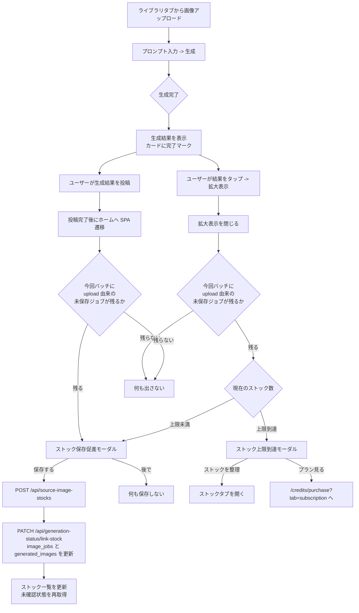
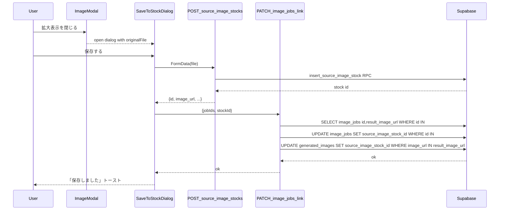
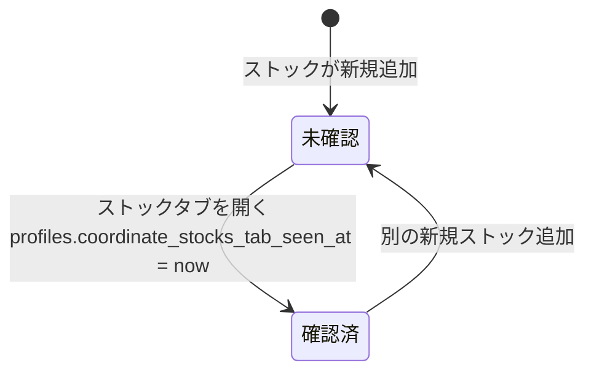
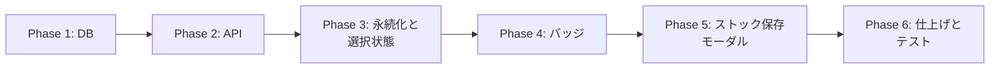

# コーディネート 元画像ストック保存導線 実装計画

## 0. 目的

`/coordinate` のライブラリタブから生成した結果と元画像を比較できるようにするため、
生成完了後に「元画像をストックに保存しますか？」という導線をモーダルで提示し、
ユーザーが保存した場合に `image_jobs.source_image_stock_id` を紐づける。
あわせて、ストックタブの未確認バッジ表示と、「ストック」タブ選択状態の永続化を行う。

対象画面: `/coordinate` のみ（`/style` は将来対応）。

---

## 1. コードベース調査結果

| 観点 | 既存実装 | 採用方針 |
|------|----------|----------|
| `image_jobs.source_image_stock_id` | 既に存在（[`20260115054748_add_image_jobs_queue.sql`](../../supabase/migrations/20260115054748_add_image_jobs_queue.sql)）。FK は `ON DELETE SET NULL` | カラム追加は不要。事後 UPDATE で値を埋める |
| `generated_images.source_image_stock_id` | 既に存在。[`getGeneratedImagesBySourceImage`](../../features/generation/lib/database.ts) はこの列で過去結果を引く。ただし `generated_images.job_id` は存在しない | 紐づけ更新は `image_jobs.result_image_url` と `generated_images.image_url` の一致で best-effort に反映。`job_id` 前提は禁止 |
| 元画像ストック CRUD | [`/api/source-image-stocks`](../../app/api/source-image-stocks/route.ts) POST + RPC `insert_source_image_stock`（原子的に上限チェック） | そのまま再利用 |
| 上限超過 | `insert_source_image_stock` が `RAISE EXCEPTION '%上限...'`、エラーメッセージで判定 | 保存促進ダイアログ内で専用の上限到達状態を表示し、「ストックを整理」と「プランを見る」の両導線を出す |
| localStorage 永続化 | [`features/generation/lib/form-preferences.ts`](../../features/generation/lib/form-preferences.ts) が `persta-ai:` プレフィックスで `BackgroundMode` / `GeminiModel` を SSR セーフに保存。`selectedStockId` は別キー `"selectedStockId"` で素朴に保存 | `form-preferences.ts` に統一。新キー `persta-ai:last-image-source-type`、`persta-ai:last-selected-stock-id` を追加。既存 `"selectedStockId"` は移行ブロックで吸収 |
| 拡大表示モーダル | [`features/generation/components/ImageModal.tsx`](../../features/generation/components/ImageModal.tsx)。`onClose` フックあり。ただし現状は close 時の current image を親へ返していない。利用箇所は [`GeneratedImageGallery`](../../features/generation/components/GeneratedImageGallery.tsx) と [`GeneratedImagesFromSource`](../../features/generation/components/GeneratedImagesFromSource.tsx) | `onClose(image)` 形式へ拡張し、「直近 close した画像が今回の生成由来 & ソースが upload」だった場合にストック保存ダイアログを開く |
| 生成完了検知 | [`GenerationFormContainer`](../../features/generation/components/GenerationFormContainer.tsx) に `feedbackPhase` / `previewImages` / async API レスポンスの `jobId` がある。`completedJobIds` は関数内のローカル Set | 「直近の生成 batch」「ストック由来か」「元画像ファイル/URL」「jobIds」を Context/ref に保持して Gallery にバトンタッチ |
| 未確認バッジ参照実装 | [`NotificationsPageTabs`](../../features/notifications/components/NotificationsPageTabs.tsx) + [`announcement-repository.ts`](../../features/announcements/lib/announcement-repository.ts) — profiles の `*_seen_at` と最新 `publish_at` を比較 | 同パターンを踏襲。`profiles.coordinate_stocks_tab_seen_at` と `MAX(source_image_stocks.created_at)` を比較。現行は物理削除なので `deleted_at IS NULL` 前提は置かない |
| Provider | [`UnreadNotificationProvider`](../../features/notifications/components/UnreadNotificationProvider.tsx) は `/notifications` 用に Layout レベルで適用 | ストックバッジは `/coordinate` 内に閉じるため、`GenerationStateProvider` 配下の薄いフックで完結させる（新規 Provider は作らない） |
| RLS | `image_jobs` / `source_image_stocks` は本人 CRUD。`generated_images` は投稿済み visible の公開 SELECT + 本人 CRUD。`profiles` は公開 SELECT + 本人 INSERT/UPDATE | profiles の新カラム追加に伴う追加ポリシーは不要（既存の owner UPDATE と公開 SELECT で足りる） |
| Supabase 型 | 現行 repo には `types/supabase.ts` が存在しない | 自動生成ファイル更新は計画対象外。型ファイルを新設しない |
| サンドボックスビルド注意 | `.agents/skills/codex-webpack-build/` の規定で `npm run build -- --webpack` 必須 | ロールバック手順・検証コマンドに反映 |

---

## 2. 概要図

### 2.1 ユーザー操作フロー



### 2.2 シーケンス: ストック保存とリンク



### 2.3 ストック未確認バッジの状態遷移



### 2.4 データモデル（追加分のみ）

```mermaid
erDiagram
    profiles ||--o{ source_image_stocks : "owns"
    image_jobs }o--|| source_image_stocks : "source_image_stock_id"
    generated_images }o--|| source_image_stocks : "source_image_stock_id"
    profiles {
        uuid id PK
        uuid user_id UNIQUE
        timestamptz coordinate_stocks_tab_seen_at "新規"
    }
    source_image_stocks {
        uuid id PK
        uuid user_id FK
        text image_url
        timestamptz created_at
    }
    image_jobs {
        uuid id PK
        uuid source_image_stock_id FK "既存"
    }
    generated_images {
        uuid id PK
        uuid source_image_stock_id FK "既存"
    }
```

---

## 3. EARS 要件定義

### 生成完了後のストック保存導線

- **R1 / EARS-EVENT**: When ライブラリタブで `upload` 由来の生成が完了し、ユーザーが拡大表示を閉じたとき、the system shall ストック保存促進モーダルを表示する。
  When the user closes the zoom view after a generation that originated from an uploaded source image, the system shall display the save-to-stock prompt modal.
- **R2 / EARS-OPT**: Where 当該生成バッチの元画像が既に `source_image_stock_id` を持つ（ストック由来）, the system shall モーダルを表示しない。
  Where the source image of the current generation batch is already linked to a stock, the system shall not display the modal.
- **R3 / EARS-EVENT**: When ユーザーがモーダルで「保存する」を選択したとき, the system shall ストック画像を作成し、当該バッチの `image_jobs.source_image_stock_id` と、`image_jobs.result_image_url` に一致する `generated_images.source_image_stock_id` を更新する。
- **R4 / EARS-IF**: If 「保存する」操作時に保有ストック数が上限以上であるとき, then the system shall 上限到達モーダルを表示し、不要なストックを削除して空きを作る導線と、サブスクで保存上限を増やす導線を提示する。
- **R5 / EARS-EVENT**: When ユーザーがモーダルで「後で」または閉じるを選択したとき, the system shall ストック画像を作成しない。
- **R19 / EARS-EVENT**: When ストック保存促進モーダルからの保存が成功したとき, the system shall 次回 `/coordinate` 表示でストックタブが選択されるよう `imageSourceType="stock"` を永続化し、保存した `stockId` を `selectedStockId` として永続化する。

### 未確認バッジ

- **R6 / EARS-STATE**: While ユーザーが少なくとも 1 件のストック画像を保有し、`coordinate_stocks_tab_seen_at < MAX(source_image_stocks.created_at)` の状態にある間, the system shall ストックタブに赤丸ドットを表示する。
- **R7 / EARS-EVENT**: When ユーザーがストックタブを選択したとき, the system shall `profiles.coordinate_stocks_tab_seen_at` を `now()` に更新し、ドット表示を解除する。
- **R8 / EARS-OPT**: Where ストック画像が 0 件または `coordinate_stocks_tab_seen_at` が最新ストックの `created_at` 以後である場合, the system shall ドットを表示しない。

### 永続化

- **R9 / EARS-EVENT**: When ユーザーがストックタブを選択したとき, the system shall ローカルストレージに `imageSourceType="stock"` を永続化する。
- **R10 / EARS-EVENT**: When ユーザーがストック画像を選択したとき, the system shall ローカルストレージに `selectedStockId` を永続化する。
- **R11 / EARS-EVENT**: When `/coordinate` を再度開いたとき, the system shall 永続化された `imageSourceType` と `selectedStockId` を復元する（該当ストックが既に削除されている場合は `imageSourceType="upload"` にフォールバック）。
- **R12 / EARS-IF**: If 永続化された `selectedStockId` が現在のストック一覧に存在しないとき, then the system shall 値を破棄して `imageSourceType="upload"` に戻す。

### 異常系

- **R13 / EARS-IF**: If ストック保存 API が失敗したとき, then the system shall モーダル内にエラーメッセージを表示し、image_jobs の更新は行わない。
- **R14 / EARS-IF**: If link-stock UPDATE が失敗したとき, then the system shall ユーザーには「ストック保存は完了したが紐づけに失敗した」旨を通知しつつコンソールに warning を残し、ストック自体は維持する（次回手動関連付けは v2 で検討）。
- **R15 / EARS-IF**: If 上限到達モーダルから「プラン見る」を選択したとき, then the system shall `${ROUTES.CREDITS_PURCHASE}?tab=subscription` に遷移する。
- **R16 / EARS-IF**: If 上限到達モーダルから「ストックを整理」を選択したとき, then the system shall モーダルを閉じて `/coordinate` のストックタブを選択状態にし、ユーザーが既存ストックを削除できる状態にする。
- **R17 / EARS-EVENT**: When `/coordinate` で `upload` 由来の生成結果を投稿し、投稿が成功したとき, the system shall ホームへ SPA 遷移した後も同じストック保存促進モーダルを表示する。
- **R18 / EARS-STATE**: While 投稿完了後のストック保存促進モーダルが pending である間, the system shall スマホ版ボトムナビと PC 版サイドメニューの「コーディネート」に赤丸ドットを表示し、モーダルを保存・後で・閉じる・導線遷移で解消したときにドットを解除する。

---

## 4. ADR

### ADR-001: source_image_stock_id の事後 UPDATE 方式（client-driven PATCH）

- **Context**: 生成時点では元画像が「保存対象」かどうか不明なため、`image_jobs.source_image_stock_id` は NULL のまま生成が走る。生成完了後、ユーザーが「保存する」を押した瞬間に紐づける必要がある。
- **Decision**: ストック作成 → 続けて自前のサーバーサイド endpoint `PATCH /api/generation-status/link-stock` を 1 回呼び、`image_jobs` と `generated_images` の `source_image_stock_id` を更新する。`generated_images` には `job_id` カラムがないため、サーバー側で対象 `image_jobs` の `result_image_url` を取得し、同一 user の `generated_images.image_url` と一致する行だけを best-effort に更新する。対象更新は本人所有行に限定できるが、バリデーションと監査のため必ず route handler 経由にする。
- **Reason**:
  - RLS に加えて、サーバー側で「この jobId 群が本当にこの user の物か」「この stockId が同 user の物か」を再検証することで、改ざんリスクを下げる
  - 関連する 2 テーブルの更新を 1 リクエストで包めるため、監査ログ追加が容易
  - RPC ではなく route handler を選ぶのは、現行の `/api/source-image-stocks` 群と統一感が出るため（複雑な原子性は不要 — 失敗してもストック自体は消さない方針）
- **Consequence**:
  - 1 ジョブを 2 回 UPDATE する race を避けるため、API は冪等（既に値が入っていたら no-op）
  - サーバー側で job IDs の上限（例: 一度に最大 4 件 ＝ 現行の最大生成枚数）を設けて DoS 軽減
  - `generated_images` 側の紐づけは `result_image_url` が未保存または不一致の場合 no-op。より強い整合性が必要になったら `generated_images.image_job_id` 追加を v2 で検討する

### ADR-002: ストックタブの未確認バッジは announcements パターンを踏襲

- **Context**: `/notifications` の運営お知らせタブは、`profiles.announcements_tab_seen_at` と `MAX(admin_announcements.publish_at)` の比較でドットを出している（[`getAnnouncementUnreadStateForUser`](../../features/announcements/lib/announcement-repository.ts:373)）。ストックは「ユーザー自身が追加するアイテム」なので、状態の主体が違う。
- **Decision**:
  - `profiles` に `coordinate_stocks_tab_seen_at TIMESTAMPTZ` を追加
  - フラグは「`MAX(source_image_stocks.created_at WHERE user_id = me) > coordinate_stocks_tab_seen_at`」で算出（NULL の場合は「ストックがあれば未確認」）
  - 「タブを開いた時」=「`imageSourceType` を `stock` に変更した時」「マウント時にストアド `imageSourceType` が `stock` だった時」に `seen_at` を `now()` に更新
- **Reason**:
  - announcements と同じく「タブを開く＝既読」のシンプルセマンティクス
  - 個別 stock に `seen_at` を付ける案より migration が小さく、表示コストも低い
  - ライブラリタブの保存モーダルから追加した直後は「未確認状態 → ストックタブ確認 → 既読」という UX が成立する。ストックタブ上で追加した場合だけ UI 側で即時既読化する
- **Consequence**:
  - 同一ユーザーがマルチデバイス利用するケースでは、片方で確認すると両方で既読になる（仕様として許容）
  - 現行のストック保存上限では 1 ユーザーあたりの stock 数が小さいため、`idx_source_image_stocks_user_id` で十分。増加時は `(user_id, created_at DESC)` index を追加する

### ADR-003: localStorage キーは `form-preferences.ts` に統一

- **Context**: 既存 `selectedStockId` は素朴な `localStorage.setItem("selectedStockId", id)` 方式。背景設定とモデルは `persta-ai:last-*` プレフィックス付きで [`form-preferences.ts`](../../features/generation/lib/form-preferences.ts) に集約されている。`imageSourceType` は永続化されていない。
- **Decision**:
  - `form-preferences.ts` に以下を追加:
    - `IMAGE_SOURCE_TYPE_STORAGE_KEY = "persta-ai:last-image-source-type"`
    - `SELECTED_STOCK_ID_STORAGE_KEY = "persta-ai:last-selected-stock-id"`
    - `readPreferredImageSourceType()` / `writePreferredImageSourceType()`
    - `readPreferredSelectedStockId()` / `writePreferredSelectedStockId()`（UUID バリデーションあり）
  - 既存 `"selectedStockId"` キーは初回マウント時に新キーへマイグレーションし `removeItem` する（次回以降は新キー）
- **Reason**:
  - SSR セーフな try/catch ラッパー、検証ロジック（PERSISTABLE_MODELS 相当）が既にある
  - 後で localStorage キー一覧を変える際に grep しやすい
  - `imageSourceType` の値域は `"upload" | "stock"` しかなく検証が容易
- **Consequence**:
  - 既存ユーザーは初回 `/coordinate` 訪問時にだけ古キーを読み取って捨てる小さな移行コストが発生

### ADR-004: stock 作成時に自動既読化せず、UI surface で既読化する

- **Context**: stock 作成導線には「ストックタブ上の uploader」と「ライブラリタブの生成結果 close 後モーダル」がある。前者はユーザーが既にストックタブを見ているが、後者はまだストックタブを見ていない。
- **Decision**:
  - `insert_source_image_stock` RPC / `/api/source-image-stocks` は `coordinate_stocks_tab_seen_at` を自動更新しない
  - ストックタブ上の `StockImageUploadCard` 経由で作成した場合は、成功後に `markStocksTabSeen()` を呼び、ドットを出さない
  - ライブラリタブの保存促進モーダル経由で作成した場合は、既読化せず `coordinate-stock-created` event を発火して未確認状態を再取得する
- **Reason**: 「ストックタブを見たら既読」というセマンティクスを保ちつつ、保存モーダルから作った stock はストックタブ未確認として自然に通知できる
- **Consequence**: route handler / RPC は UI 状態を知らずに済む。stock 作成後の既読化は呼び出し元 UI の責務になる

### ADR-005: 元画像ファイル参照は in-memory のみ（生成完了まで保持）

- **Context**: ストック保存ダイアログを開く時点で、元画像ファイル（File Blob）が必要。リロード/タブ切替の影響を考えると DB に保存することもできるが、generate-async API 既存実装は base64 を temp Storage に上げて URL を返すだけ。
- **Decision**:
  - GenerationFormContainer に Map（`jobId -> File`）を `useRef` で持つ
  - 生成完了 → 拡大表示 → 閉じた時、対応 jobId の File を取り出してダイアログに渡す
  - 投稿完了後にホームへ遷移してから保存促進モーダルを出すケースでは、`window.location.href` のフルリロードでは File が失われるため、`PostModal` の投稿成功フックから AppShell 配下のグローバルホストへ pending batch を渡し、`router.push("/")` の SPA 遷移後も in-memory File を保持する
  - リロードや別画面からの戻りでは元画像ファイルが取れないので、その場合はモーダルを出さない（次回生成時のみ）
- **Reason**: シンプル。Storage の temp/ 経由で再ダウンロードするより明確で速い
- **Consequence**: ページリロード後に過去生成の元画像を後追いストック化することは不可（v2 で必要なら image_jobs.input_image_url から再取得）

---

## 5. フェーズ別実装計画

### フェーズ間の依存関係



### Phase 1: データベース・型定義
**目的**: profiles に `coordinate_stocks_tab_seen_at` を追加し、ストックタブ既読状態を保存できるようにする。
**ビルド確認**: マイグレーション適用 → `npm run typecheck` が通る。

- [ ] [`supabase/migrations/`](../../supabase/migrations/) に新規マイグレーション作成
  - `ALTER TABLE public.profiles ADD COLUMN IF NOT EXISTS coordinate_stocks_tab_seen_at timestamptz;`
  - `COMMENT ON COLUMN ...` を付与
- [ ] 既存 `insert_source_image_stock` RPC は更新しない
  - stock 作成時の既読化は UI surface 依存のため、RPC/route handler では `coordinate_stocks_tab_seen_at` を触らない（ADR-004）
- [ ] 既存 announcements パターンと同じく、`profiles` カラム追加だけで RLS 追加ポリシーは不要であることを確認（既存 `Allow users to update their own profile` で足りるか current ポリシー一覧で確認、足りなければ追記）
- [ ] 現行 repo に `types/supabase.ts` は存在しないため、自動生成ファイル更新は行わない（将来導入する場合は別計画）
- [ ] [`features/generation/lib/database.ts`](../../features/generation/lib/database.ts) の `SourceImageStock` 型に変更なし（profiles 追加のみのため）

### Phase 2: サーバーサイド API
**目的**: ストック未確認状態取得、ストックタブ既読化、image_jobs 紐づけ更新の 3 endpoint を実装。
**ビルド確認**: `npm run typecheck` `npm run lint` が通る。

- [ ] `app/api/coordinate/stocks-unread-state/route.ts` 新規（GET）
  - 認証必須。`getUser()` → repository → `{ hasDot: boolean, latestStockCreatedAt: string|null }`
- [ ] `app/api/coordinate/stocks-tab-seen/route.ts` 新規（POST）
  - 認証必須。`profiles.coordinate_stocks_tab_seen_at = now()` を UPDATE
- [ ] `app/api/generation-status/link-stock/route.ts` 新規（PATCH）
  - 認証必須。body: `{ stockId: string, jobIds: string[] }`
  - サーバーサイドで以下を直列実行（owner 検証込み）:
    1. `source_image_stocks` で `id = stockId AND user_id = me` を SELECT し存在確認
    2. `image_jobs` を `id IN jobIds AND user_id = me` で SELECT し、`id`, `result_image_url`, `source_image_stock_id` を取得
    3. `image_jobs` を `id IN jobIds AND user_id = me AND source_image_stock_id IS NULL` のみ UPDATE（冪等）
    4. `generated_images` を `user_id = me AND image_url IN (result_image_url[]) AND source_image_stock_id IS NULL` で UPDATE（`generated_images.job_id` は存在しないため使用しない）
  - jobIds の最大件数を 4 件に制限（現行最大生成枚数に合わせて DoS 軽減）
- [ ] `features/generation/lib/coordinate-stocks-repository.ts`（仮）に Supabase 操作をまとめる（announcement-repository に倣う）
- [ ] [`features/generation/lib/database.ts`](../../features/generation/lib/database.ts) にクライアント呼び出し関数を追加:
  - `getStocksTabUnreadState()`
  - `markStocksTabSeen()`
  - `linkSourceImageStockToJobs(stockId, jobIds)`
- [ ] `lib/api/json-error.ts` などプロジェクト規約に沿ったエラー形式で返す（既存 [`/api/announcements/seen`](../../app/api/announcements/seen/route.ts) を参考）
- [ ] route handler のエラーメッセージは `features/generation/lib/route-copy.ts` か新規 `coordinate-stocks-route-copy.ts` に追加（UI 文言は `messages/ja.ts` / `messages/en.ts`）

### Phase 3: 永続化レイヤー（localStorage）
**目的**: `imageSourceType` と `selectedStockId` を `form-preferences.ts` に統一して永続化。
**ビルド確認**: `npm run typecheck` `npm run test`（form-preferences の単体テストがあれば）が通る。

- [ ] [`features/generation/lib/form-preferences.ts`](../../features/generation/lib/form-preferences.ts) に追加:
  - `IMAGE_SOURCE_TYPE_STORAGE_KEY = "persta-ai:last-image-source-type"`
  - `SELECTED_STOCK_ID_STORAGE_KEY = "persta-ai:last-selected-stock-id"`
  - `readPreferredImageSourceType()` / `writePreferredImageSourceType()`
  - `readPreferredSelectedStockId()` / `writePreferredSelectedStockId()`（UUID 形式バリデーション）
  - `migrateLegacySelectedStockIdKey()`（旧 `"selectedStockId"` を新キーへ移し、旧キーを削除）
- [ ] [`features/generation/components/GenerationForm.tsx`](../../features/generation/components/GenerationForm.tsx) を更新:
  - `imageSourceType` の初期 setState は `"upload"` のまま（SSR / hydration mismatch 回避）
  - マウント `useEffect` で `migrateLegacySelectedStockIdKey()` → `readPreferredImageSourceType()` / `readPreferredSelectedStockId()` を読み込み state に反映
  - 旧 `localStorage.getItem("selectedStockId")` の直接アクセスを削除
  - `setImageSourceType` のラッパー `handleImageSourceTypeChange` を追加して `writePreferredImageSourceType` を併走
  - `setSelectedStockId` 周りの `localStorage.removeItem("selectedStockId")` 等を新ヘルパー経由に書き換え
- [ ] R12 対応: ストック一覧フェッチ後、永続化された `selectedStockId` が一覧に含まれない場合 `setImageSourceType("upload")` + clear
  - 旧 `"selectedStockId"` に UUID ではない値が入っている場合は移行せず破棄する

### Phase 4: ストックタブ未確認バッジ
**目的**: ストックタブにドット表示を追加し、タブを開いた瞬間に既読化。
**ビルド確認**: `npm run typecheck` `npm run lint` 通過 + 手動で /coordinate の保存モーダルから新規ストック追加 → タブにドット → タブクリックで消えるのを確認。

- [ ] `features/generation/hooks/useCoordinateStocksUnread.ts` 新規
  - useState で `hasDot` を保持
  - マウント時に `getStocksTabUnreadState()` を呼ぶ
  - `markSeen()` を返し、呼ばれたら state を即時 false にしつつ `markStocksTabSeen()` を投げる（楽観更新）
  - `refresh()` を返し、`window` の `focus` / `visibilitychange` / `coordinate-stock-created` event で refetch（announcement Provider と同じ流儀）
- [ ] [`features/generation/components/GenerationForm.tsx`](../../features/generation/components/GenerationForm.tsx) を更新:
  - フックを呼び出し `hasStockTabDot` を受け取る
  - 「ストック」タブボタンに [`NotificationsPageTabs`](../../features/notifications/components/NotificationsPageTabs.tsx) と同じ赤丸 span を条件付き表示
  - タブクリック時 (`setImageSourceType("stock")` の前後) に `markSeen()` を呼ぶ
  - 復元時に既に `imageSourceType="stock"` だった場合もマウント直後に `markSeen()` を呼ぶ
  - `StockImageUploadCard` 経由のアップロード成功時は、ストックタブ表示中なので `markSeen()` を呼んでドットを出さない
- [ ] aria-label に未読件数の概念がない（ドットだけ）ので、`coordinate.stockTabUnreadDotLabel` 翻訳を追加

### Phase 5: ストック保存促進モーダル
**目的**: 拡大表示閉じる → ダイアログ → 保存 → 紐づけ更新の一連を実装。
**ビルド確認**: 上限未到達ユーザーで保存 → image_jobs に `source_image_stock_id` が入ることを確認。上限到達ユーザーで「ストックを整理」と「プランを見る」が出ることを確認。

- [ ] `features/generation/components/SaveSourceImageToStockDialog.tsx` 新規（クライアントコンポーネント）
  - shadcn `Dialog` ベース。保存促進状態と上限到達状態を同一ダイアログ内で切り替える
  - props: `open`, `onOpenChange`, `originalFile: File`, `relatedJobIds: string[]`, `onSaved?: (stock) => void`, `onRequestManageStocks?: () => void`
  - 内部状態: `isSaving`, `error`, `isLimitReached`
  - 「保存する」押下: `POST /api/source-image-stocks` (FormData) → 成功なら `linkSourceImageStockToJobs(stockId, jobIds)`
  - エラー時: `error.message` または `errorCode === "SOURCE_IMAGE_LIMIT_REACHED"` なら `isLimitReached` に切り替え、通常エラーはモーダル内に表示
  - 上限到達状態の文言:
    - title: 「ストック画像の上限に達しています」
    - description: 「元画像を保存するには、不要なストック画像を削除して空きを作るか、サブスクプランで保存上限を増やしてください。」
    - actions: 「キャンセル」「ストックを整理」「プランを見る」
  - 「ストックを整理」押下: `onRequestManageStocks` を呼び、ダイアログを閉じてストックタブを開く
  - 「プランを見る」押下: `${ROUTES.CREDITS_PURCHASE}?tab=subscription` に遷移
  - 成功時は `window.dispatchEvent(new CustomEvent("coordinate-stock-created"))` を発火して、ストックタブ未確認状態を再取得させる
  - 成功時は `writePreferredImageSourceType("stock")` と `writePreferredSelectedStockId(stockId)` を実行し、次回 `/coordinate` 表示でストックタブと保存済みストックを復元できるようにする
  - 翻訳キー: `coordinate.saveStockDialogTitle`, `coordinate.saveStockDialogDescription`, `coordinate.saveStockAction`, `coordinate.saveStockSaving`, `coordinate.saveStockLater`, `coordinate.saveStockCancel`, `coordinate.saveStockSucceeded`, `coordinate.saveStockFailed`, `coordinate.saveStockLimitTitle`, `coordinate.saveStockLimitDescription`, `coordinate.manageStocksAction`, `coordinate.seeSubscriptionPlansAction`
- [ ] [`features/generation/context/GenerationStateContext.tsx`](../../features/generation/context/GenerationStateContext.tsx) を拡張:
  - `pendingSourceImageMap: Map<string /*jobId*/, File>` を `useRef` ベースで持つ（state にすると render が爆発するため、ref + getter）
  - `registerPendingSourceImage(jobId, file)` / `consumePendingSourceImageBatch(jobId): { file: File; jobIds: string[] } | null`（同じ File オブジェクトで生成された全 jobId をまとめて取り出し、対象を消費する）
  - `requestOpenStockTab()` / `openStockTabRequestId` を追加し、Gallery 側の「ストックを整理」から Form 側へストックタブ選択を依頼できるようにする
- [ ] [`features/generation/components/GenerationFormContainer.tsx`](../../features/generation/components/GenerationFormContainer.tsx) を更新:
  - `handleGenerate` で `data.sourceImage` があるとき、API レスポンスの `jobId` 群を `registerPendingSourceImage(jobId, data.sourceImage)` で登録
  - 生成が全失敗した jobId は pending から除去し、成功した jobId だけ保存促進対象に残す
- [ ] [`features/generation/components/GenerationForm.tsx`](../../features/generation/components/GenerationForm.tsx) を更新:
  - `openStockTabRequestId` が変わったら `imageSourceType="stock"` に切り替え、`writePreferredImageSourceType("stock")` と `markSeen()` を実行
  - 必要に応じてストック選択領域へスクロールできるよう、ストックタブ領域に ref を置く
- [ ] [`features/generation/components/GeneratedImageGallery.tsx`](../../features/generation/components/GeneratedImageGallery.tsx) を更新:
  - [`ImageModal`](../../features/generation/components/ImageModal.tsx) の `onClose` を `onClose(image)` に拡張し、close 時点の current image を親へ渡す
  - `onClose` ハンドラに「close した画像の `jobId` から context を引いて pending file を取得 → あれば `SaveSourceImageToStockDialog` を開く」処理を追加
  - 同一バッチで複数画像のうち 1 枚閉じた瞬間に出すか、すべて閉じてからにするかは仕様検討。**最初に閉じた対象画像が pending jobId を持つ場合に 1 回だけ出す**に決定し、出した直後に `consumePendingSourceImageBatch(jobId)` で対象を消費して再表示を防ぐ
  - 永続化済み gallery 画像には `jobId` がない場合があるため、その場合は保存促進モーダルを出さない
  - `SaveSourceImageToStockDialog` の `onRequestManageStocks` から `requestOpenStockTab()` を呼ぶ
- [ ] 投稿完了後の保存促進導線を追加:
  - `PostModal` に投稿成功後の既定ホーム遷移を呼び出し元が抑止できるフックを追加
  - `/coordinate` の投稿成功時は pending batch をグローバルな保存促進状態へ渡し、`router.push("/")` でホームへ SPA 遷移する
  - `AppShell` 配下に `CoordinateSourceStockSavePromptDialogHost` を置き、ホーム遷移後も保存促進モーダルを表示する
  - pending 中は `NavigationBar` のスマホ版「コーディネート」と `AppSidebar` の PC 版「コーディネート」に赤丸ドットを表示し、モーダル解消時に解除する
- [ ] R2 対応: stock 由来生成（`sourceImageStockId` あり）はそもそも `registerPendingSourceImage` を呼ばないため、自動的にダイアログは出ない

### Phase 6: 仕上げ・i18n・テスト
**目的**: 翻訳、エラーケース、E2E 確認、ビルド検証。
**ビルド確認**: `npm run lint`, `npm run typecheck`, `npm run test`, `npm run build -- --webpack` 全部通過。

- [ ] `messages/ja.ts` `messages/en.ts`:
  - `coordinate.saveStockDialogTitle`「元画像をストックに保存しますか？」
  - `coordinate.saveStockDialogDescription`「保存すると元画像と生成結果を比較できます」
  - `coordinate.saveStockAction`「保存する」
  - `coordinate.saveStockLater`「後で」
  - `coordinate.saveStockSucceeded`「ストックに保存しました」
  - `coordinate.saveStockFailed`「ストックの保存に失敗しました」
  - `coordinate.saveStockLimitTitle`「ストック画像の上限に達しています」
  - `coordinate.saveStockLimitDescription`「元画像を保存するには、不要なストック画像を削除して空きを作るか、サブスクプランで保存上限を増やしてください。」
  - `coordinate.manageStocksAction`「ストックを整理」
  - `coordinate.seeSubscriptionPlansAction`「プランを見る」
  - `coordinate.stockTabUnreadDotLabel`「未確認のストックがあります」
  - `coordinate.linkStockFailed`「ストックの紐づけに失敗しました」
- [ ] 単体テスト:
  - `form-preferences.ts` の新ヘルパーに対する Jest テスト（既存のテストファイルがあれば追記）
  - `SaveSourceImageToStockDialog` のコンポーネントテスト（モック API で成功 / 上限 / 一般エラー）
  - `useCoordinateStocksUnread` のフックテスト
- [ ] E2E（Playwright）: `/coordinate` で
  - upload → 生成 → 拡大 → close → ダイアログ → 保存 → image_jobs に stock_id が入る
  - 保存成功後、ストックタブをまだ開いていなければ赤丸が出る
  - 拡大 → close → 「後で」→ stock_id 入らない
  - 上限到達ユーザーで「保存する」→ 上限到達モーダルに「ストックを整理」「プランを見る」が出る
  - 上限到達モーダルで「ストックを整理」→ ダイアログが閉じ、ストックタブに切り替わり、既存ストックを削除できる
  - 上限到達モーダルで「プランを見る」→ `/credits/purchase?tab=subscription` に遷移する
  - upload → 生成 → 投稿 → ホームへ SPA 遷移 → 保存促進モーダルが表示され、スマホ版ボトムナビと PC 版サイドメニューの「コーディネート」に赤丸が出る
  - 保存促進モーダルで「保存する」成功 → 次回 `/coordinate` 表示でストックタブが選択され、保存したストックが復元対象になる
  - 投稿後保存促進モーダルで「後で」または閉じる → 赤丸が消える
  - 別タブから新規ストック追加 → /coordinate 戻ると赤丸 → ストックタブクリックで消える
- [ ] サンドボックス build 確認: `npm run build -- --webpack`

---

## 6. 修正対象ファイル一覧

| ファイル | 操作 | 変更内容 |
|----------|------|----------|
| `supabase/migrations/<timestamp>_add_coordinate_stocks_tab_seen_at.sql` | 新規 | profiles にカラム追加 |
| `app/api/coordinate/stocks-unread-state/route.ts` | 新規 | GET 未確認状態 |
| `app/api/coordinate/stocks-tab-seen/route.ts` | 新規 | POST 既読化 |
| `app/api/generation-status/link-stock/route.ts` | 新規 | PATCH image_jobs / generated_images 紐づけ |
| `features/generation/lib/coordinate-stocks-repository.ts` | 新規 | サーバーサイド DB 操作 |
| `features/generation/lib/route-copy.ts` または `features/generation/lib/coordinate-stocks-route-copy.ts` | 修正または新規 | route handler 用エラーメッセージ |
| `features/generation/lib/database.ts` | 修正 | client API 関数追加 |
| `features/generation/lib/form-preferences.ts` | 修正 | image source type / stock id を永続化 |
| `features/generation/hooks/useCoordinateStocksUnread.ts` | 新規 | バッジ用フック |
| `features/generation/components/GenerationForm.tsx` | 修正 | localStorage 経路統一、タブにドット、imageSourceType 永続化 |
| `features/generation/components/GenerationFormContainer.tsx` | 修正 | 元画像ファイルを ref 登録 |
| `features/generation/context/GenerationStateContext.tsx` | 修正 | pendingSourceImage の get/register とストックタブを開く要求を追加 |
| `features/generation/lib/coordinate-source-stock-save-prompt-state.ts` | 新規 | 投稿後保存促進モーダルとスマホ下部ナビ赤丸の in-memory 状態 |
| `features/generation/components/CoordinateSourceStockSavePromptDialogHost.tsx` | 新規 | AppShell 配下で投稿後保存促進モーダルを表示 |
| `components/AppShell.tsx` | 修正 | 投稿後保存促進モーダルホストを配置 |
| `components/NavigationBar.tsx` | 修正 | スマホ版ボトムナビのコーディネート赤丸を表示 |
| `components/AppSidebar.tsx` | 修正 | PC 版サイドメニューのコーディネート赤丸を表示 |
| `features/posts/components/PostModal.tsx` | 修正 | 投稿成功後の既定遷移を呼び出し元が抑止できるフック追加 |
| `features/generation/components/ImageModal.tsx` | 修正 | close 時の current image を親へ返す |
| `features/generation/components/GeneratedImageGallery.tsx` | 修正 | ImageModal close 時と投稿成功時にダイアログを開く |
| `features/generation/components/SaveSourceImageToStockDialog.tsx` | 新規 | 保存導線モーダル |
| `messages/ja.ts` `messages/en.ts` | 修正 | 翻訳キー追加 |
| `tests/...` (E2E + 単体) | 新規 | 上記要件に沿うテスト |

---

## 7. 品質・テスト観点

### 品質チェックリスト

- [ ] 認可: `/api/generation-status/link-stock` で他ユーザーの jobId を渡しても 404/403 になること（owner 検証）
- [ ] 認可: stock 作成は既存 RPC の RLS / 上限ロジックに任せ、サーバー側で再検証しない（重複ロジック禁止）
- [ ] バリデーション: `selectedStockId` の localStorage 値は UUID 形式チェック後に採用
- [ ] 冪等性: link-stock を二度呼んでも image_jobs.source_image_stock_id が上書きされない（`IS NULL` ガード）
- [ ] 紐づけ: `generated_images.job_id` は存在しないため、`image_jobs.result_image_url` と `generated_images.image_url` の一致で更新する
- [ ] エラー表示: 上限到達時のメッセージは ja/en 両方
- [ ] 上限到達 UX: 「ストックを整理」と「プランを見る」の両方が表示され、削除で空きを作れることが文言から分かる
- [ ] hydration: `imageSourceType` 初期値は "upload" のまま、useEffect で復元（SSR mismatch 防止）
- [ ] レースコンディション: 連続生成中に link-stock が走った場合の挙動（古い jobIds は IS NULL ガードで弾かれて影響なし）
- [ ] アクセシビリティ: ダイアログのフォーカストラップ、ESC で閉じる、ドットは aria-label つき span

### テスト観点

| カテゴリ | テスト内容 |
|----------|-----------|
| 正常系 | upload → 生成完了 → close → ダイアログ → 保存 → image_jobs.source_image_stock_id が埋まる |
| 正常系 | stock 由来生成では close 後にダイアログが出ない |
| 永続化 | imageSourceType="stock" + selectedStockId を保存 → リロード後も維持 |
| フォールバック | localStorage 上の selectedStockId に対応する stock が削除済み → upload に戻る |
| 上限 | ストック保存上限到達ユーザーで保存ボタン → 上限到達モーダルに整理導線とプラン導線が出る |
| 上限 | 上限到達モーダルの「ストックを整理」→ ストックタブに切り替わり、削除後に再度保存できる |
| 上限 | 上限到達モーダルの「プランを見る」→ `/credits/purchase?tab=subscription` に遷移する |
| バッジ | ユーザー B が API 経由で stock 追加（テスト用 fixture）→ ユーザー B が /coordinate 開く → ドット表示 → ストックタブを押す → ドット消える + DB の seen_at が前進 |
| 自分追加 | ストックタブ上の既存 StockImageUploadCard 経由で自分追加 → 既にストックタブ表示中なので `markSeen()` が走りドットは出ない |
| 認可 | 他ユーザーの jobId を含む link-stock → 当該行は更新されない |
| 異常系 | link-stock 失敗時もストックは残り、ユーザーには warning 通知 |

### テスト実装手順（プロジェクト標準）

1. `testing-flow` で SaveSourceImageToStockDialog のテスト対象を確認
2. `spec-extracting` で SaveSourceImageToStockDialog の仕様を抽出
3. `spec-writing` で仕様を精査
4. `test-generating` でテストコードを生成
5. `test-reviewing` でテストを実行・レビュー
6. `spec-verifying` で仕様とテストの対応を確認
（同様に `useCoordinateStocksUnread`, `form-preferences` 拡張部に対しても）

---

## 8. ロールバック方針

- **DB**: 新マイグレーションは追加カラムのみで破壊変更なし。ロールバックは
  - `ALTER TABLE public.profiles DROP COLUMN coordinate_stocks_tab_seen_at;`
  だけで済む。down コメントをマイグレーション末尾に書く。
- **API**: 新規 endpoint のみで既存契約に変更がないため、route ファイル削除でロールバック可能。
- **UI**: 既存 GenerationForm への変更は `imageSourceType` 永続化と stockTab ドット程度なので、コミットを `revert` するだけ。
- **段階リリース**: モーダル表示部分は `process.env.NEXT_PUBLIC_FF_COORDINATE_STOCK_PROMPT === "1"` のような単純なフラグでガード可能（必要ならフェーズ 6 で追加）。
- **検証コマンド** (CLAUDE.md 準拠):
  - `npm run lint`
  - `npm run typecheck`
  - `npm run test`
  - `npm run build -- --webpack`（サンドボックスでは `--webpack` 必須）

---

## 9. 使用スキル

| スキル | 用途 | フェーズ |
|--------|------|----------|
| `project-database-context` | profiles / image_jobs / generated_images / source_image_stocks のスキーマ確認 | Phase 1 |
| `git-create-branch` | 着手時のブランチ確認（既に `feature/create-image-display-base-picture` ブランチが切られている） | 着手 |
| `testing-flow` | 各テスト対象でのワークフロー駆動 | テスト |
| `spec-extracting` | 新規モジュールの EARS 抽出 | テスト |
| `spec-writing` | 仕様精査 | テスト |
| `test-generating` | テストコード生成 | テスト |
| `test-reviewing` | テスト実行・レビュー | テスト |
| `spec-verifying` | カバレッジ確認 | テスト |
| `git-create-pr` | PR 作成 | 完了時 |

---

## 10. 整合性チェックの結果

- **認証モデルの一貫性**: 全ての新 API は `getUser()` で userId を解決し、更新対象を本人所有行に限定する。RLS と矛盾なし
- **データフェッチの整合性**: 既存 `/api/announcements/unread-state` と同じ「クライアントから fetch、Provider/Hook で polling」のパターンを踏襲
- **APIパラメータのソース安全性**: `link-stock` API では `userId` をクライアントから受け取らず、必ず `getUser()` で解決
- **ビジネスルールのDB層強制**: 上限チェックは既存 `insert_source_image_stock` RPC 内の `RAISE EXCEPTION` に任せる（クライアント側ロジックの重複なし）
- **イベント網羅性**: ユーザーフロー上「拡大表示を開かずに次の生成を始めた」「ダイアログを閉じてリロードした」ケースは ADR-005 の通りファイルが揮発するため自然に no-op
- **状態遷移とスキーマの整合**: `imageSourceType` は `"upload" | "stock"` の 2 値のみ（既存 [`GenerationForm.tsx`](../../features/generation/components/GenerationForm.tsx:70)）、永続化バリデーションもこれに合わせる
- **生成結果紐づけの整合**: `generated_images.job_id` は存在しないため、`image_jobs.result_image_url` と `generated_images.image_url` の一致で best-effort 更新する。強整合が必要になったら `generated_images.image_job_id` 追加を別計画にする
