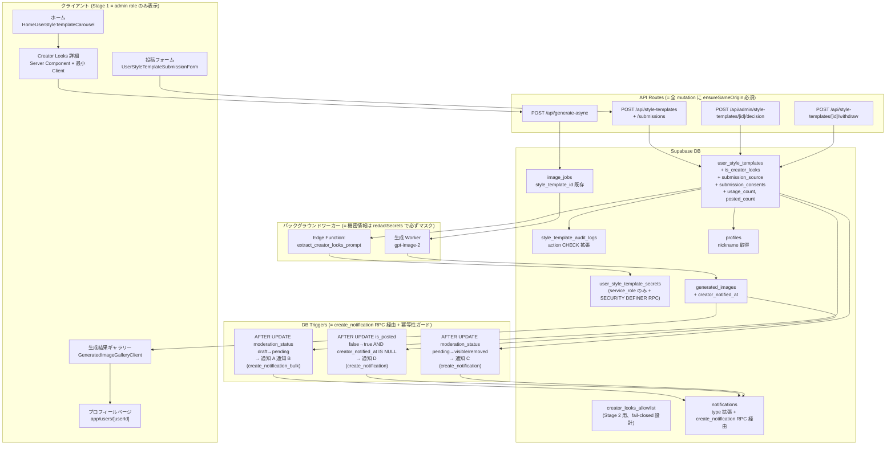
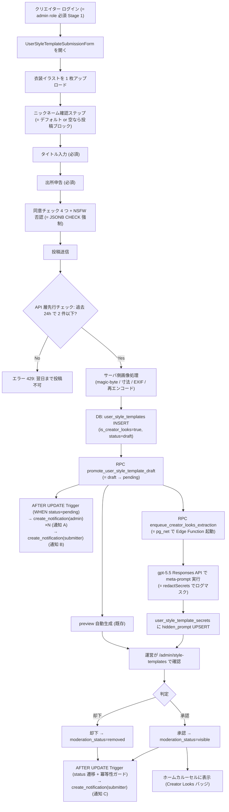
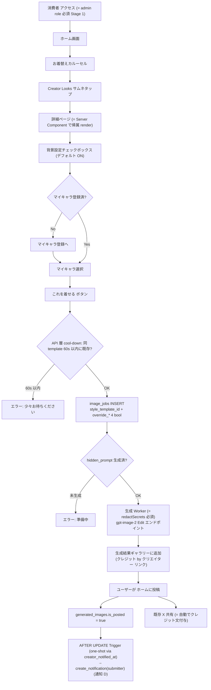
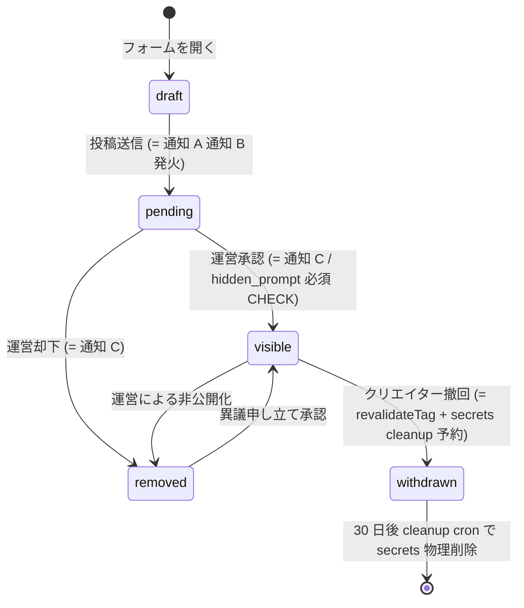
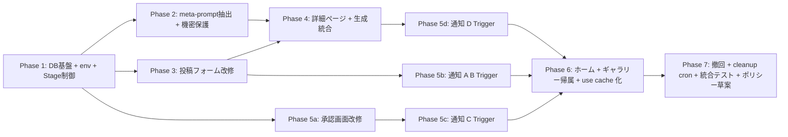

# Creator Looks 実装計画書 (v2)

## メタ情報

- **機能名**: Creator Looks
- **コード層**: `creator-looks` (= URL / クラス名 / i18n キー / DB ENUM)
- **戦略文書**: `memory/persta_strategy_outfit_library.md`
- **対応 Stage**: Stage 1 (= 運営 only β、コードをマージしても一般ユーザーには無効)
- **作成日**: 2026-06-01
- **改訂**: v2 (2026-06-01) — Supabase / Next.js / Security レビュー結果を反映 (Critical 12 件すべて + 重要 High を取り込み)
- **モデル仮称**: 計画内で `gpt-5.5` / `gpt-image-2` と表記しているのは内部仮称。実装時点で利用可能な最新の Vision (VLM) モデル / Image Edit モデルに置き換える

---

## v2 で適用したレビュー指摘 (67 件中)

### 適用済み (= v2 に反映)

| カテゴリ | # | 内容 |
|---|---|---|
| Critical | A-1 | `notifications` への INSERT は `create_notification` RPC (SECURITY DEFINER) 経由必須 |
| Critical | A-2 | `get_creator_looks_secret_for_admin` の SECURITY DEFINER + admin チェック擬似コードを ADR-008 に明記 |
| Critical | A-3 | hidden_prompt をログ / レスポンス / 通知本文に出さないルールを ADR-009 に明記 |
| Critical | A-4 | `prompt_overrides` の Creator Looks 行は閲覧監査 log + super_admin 化を ADR-010 |
| Critical | B-1 | `NEXT_PUBLIC_CREATOR_LOOKS_ENABLED` → `CREATOR_LOOKS_ENABLED` (サーバ専用) |
| Critical | B-2 | 全 mutation route に `ensureSameOrigin` 必須をチェックリスト化 |
| Critical | B-3 | API + DB Trigger/RPC で `is_creator_looks=true` 投稿を admin (or allowlist) に限定 |
| Critical | C-1 | 改修対象を `UserStyleTemplateSubmissionForm.tsx` (1 画面式) に修正 |
| Critical | C-2 | `CachedHomeUserStyleTemplateSection` を実際に `use cache` 化する作業を Phase 6 に追加 |
| Critical | C-3 | i18n を 15 言語必須に統一 |
| Critical | D-1 | Trigger に冪等性ガード (`IF OLD.x IS DISTINCT FROM NEW.x` / `creator_notified_at`) を必須化 |
| Critical | D-2 | pg_net 経由 Edge Function 起動の認証・トランザクション境界を ADR-011 |
| High | HI-002(S) | `submission_consents` JSONB の 5 項目を CHECK 制約で強制 |
| High | HI-004(S) | Trigger 発火条件を `WHEN (NEW.moderation_status='pending')` に固定 |
| High | HI-006(S) | `image_jobs` + `generated_images` 両側で CHECK 拡張 |
| High | HI-008(S) | `notifications.type` CHECK 拡張マイグレーション追加 |
| High | HG-001(N) | `loading.tsx` / `error.tsx` の改修を Phase 4 に追加 |
| High | HG-002(N) | 詳細ページは Server Component で render、Client は最小化 |
| High | HG-003(N) | 詳細ページに Suspense 境界を明示 |
| High | HG-005(N) | Server Action vs Route Handler の選定を ADR-012 |
| High | HG-006(N) | 撤回時に `revalidateTag` 呼び出しを明示 |
| High | HI-001(Sec) | allowlist は fail-closed (= 空 = 全拒否) で実装 |
| High | HI-003(Sec) | EXIF 除去・MIME magic-byte 検証・寸法上限を server 側強制 |
| High | HI-004(Sec) | 投稿頻度制限を API 層でも先行 reject (= upload 前) |
| High | HI-005(Sec) | 「Try this look」に per-user-per-template cool-down |
| High | HI-006(Sec) | 撤回時に secrets を cleanup cron で削除 |
| High | HI-007(Sec) | 通知 D は `generated_images.creator_notified_at` 列で重複防止 |
| High | HI-008(Sec) | 投稿フォームで `profiles.nickname` 確認ステップ追加 |
| High | HI-009(Sec) | Trigger 失敗時の挙動 (= notification INSERT は EXCEPTION 抑止 + audit log) |
| Medium | ME-001/004/007 等 | 列のデフォルト・既存トリガとの干渉・型生成タイミング等を Phase 1 に追記 |
| Medium | MD-001/006/007 等 | Server Component 帰属 render、polling 再利用、メタデータ Stage 2/3 設計 |

### 個別言及せず後続フェーズで対応するもの

- Low 系の 11 件すべて (= 通報フロー詳細 / DMCA 窓口 / IP 監査 / 通知 D 文言詳細 等) → Phase 7 ポリシー文書草案 / Stage 3 公開準備で対応

---

## コードベース調査結果

### 既存資産 (= 流用するもの)

| 既存資産 | パス | 流用ポイント |
|---|---|---|
| `user_style_templates` テーブル | `supabase/migrations/20260502124531_*.sql` | レコードのストレージ。`is_creator_looks BOOLEAN` 列追加で Inspire と区別 |
| `image_jobs.style_template_id` + `override_*` 4 bool | `supabase/migrations/20260502120100_*.sql` + `20260516120000_*.sql` | 既に存在。Creator Looks も `generation_type='inspire'` + `override_outfit/angle/pose/background` を流用 |
| `notifications` テーブル + `create_notification(...)` RPC (SECURITY DEFINER) | `supabase/migrations/20251213013611_notifications.sql` + 既存 RPC | 通知 A/C/D は `create_notification` RPC 経由。通知 B は既存 RPC が自己通知を skip するため、専用 self-notification RPC を新規追加 |
| `style_template_audit_logs` | `supabase/migrations/20260502124647_*.sql` | 監査履歴を流用 (`action` CHECK 拡張で `extract_failed` 追加) |
| `promote_user_style_template_draft` RPC | `supabase/migrations/20260502124719_*.sql` | 投稿フォーム → 状態昇格に流用 |
| `apply_user_style_template_decision` RPC | `supabase/migrations/20260502124705_*.sql` | 承認 / 却下 / 非公開化 |
| `enforce_user_style_template_submission_cap` Trigger | `supabase/migrations/20260502124531_*.sql` (67〜102 行) | **WHERE 句で `is_creator_looks=false` 除外を追加** (Creator Looks は別 Trigger で管理) |
| `/admin/style-templates` 承認画面 | `app/(app)/admin/style-templates/AdminStyleTemplatesClient.tsx` | バッジ表示 + hidden_prompt 表示の改修 (= admin 信頼境界扱い) |
| `UserStyleTemplateSubmissionForm.tsx` (= 1 画面 3-Step 形式) | `features/inspire/components/UserStyleTemplateSubmissionForm.tsx` | **Step 1/2/3 のどこに Creator Looks 用フィールドを差し込むか Phase 3 で明示** |
| `InspirePageClient.tsx` / `InspireGenerationFlow.tsx` | `features/inspire/components/` | 詳細ページの参考実装。Creator Looks 用は **Server Component で帰属 render、Client は最小化** |
| `HomeUserStyleTemplateCarousel.tsx` | `features/home/components/` | バッジ追加。`is_creator_looks=true` のみピル形バッジ |
| `lib/security/same-origin.ts` (`ensureSameOrigin`) | `lib/security/` | **全 mutation route に必須適用** (= 既存 user 投稿 route は未適用なので注意) |
| `prompt_overrides` テーブル + `/admin/generation-prompts` | `features/generation-prompts/` | meta-prompt テンプレートを admin 編集可能化 (= ADR-010 で閲覧監査 + super_admin 化) |
| `/users/[userId]` プロフィールページ | `app/(app)/users/[userId]/page.tsx` | 帰属リンク先 (= 新規実装不要) |
| 既存 polling adaptive interval | `InspireGenerationFlow.tsx` 42〜60 行 | 完全流用 |

### 新規実装が必要なもの

| 新規 | 内容 |
|---|---|
| `user_style_templates` 列追加 | `is_creator_looks` / `submission_source` / `submission_consents` / `usage_count` / `posted_count` |
| 列レベル CHECK 強化 | `submission_consents` JSONB 5 項目すべて true / `submission_source` ENUM。admin/allowlist 判定や secrets 存在確認など cross-table 条件は Trigger/RPC で強制 |
| `user_style_template_secrets` テーブル (新規) | 抽出済み hidden_prompt の保管 (admin/service_role のみ) |
| `creator_looks_allowlist` テーブル (新規) | Stage 2 用、fail-closed 設計 |
| `creator_notified_at` 列 (`generated_images` に追加) | 通知 D の重複防止 |
| `CREATOR_LOOKS_ENABLED` 環境変数 (= サーバ専用) | Stage 制御 |
| `create_notification_bulk` RPC (= 既存 `create_notification` の bulk 版) | 通知 A の admin 一斉発火用 |
| `get_creator_looks_secret_for_admin` RPC (SECURITY DEFINER + admin チェック) | admin が hidden_prompt 確認用 |
| `enqueue_creator_looks_extraction` RPC | pg_net 経由で Edge Function 起動 |
| `extract-creator-looks-prompt` Edge Function | gpt-5.5 Responses API で meta-prompt 実行 |
| 通知発火 DB Trigger 4 種 (`create_notification[_bulk]` 経由) | A/B/C/D の発火 |
| `trg_enforce_creator_looks_daily_cap` Trigger (1 日 2 件) | 既存 Inspire trigger とは別管理 |
| `prompt_overrides_audit_logs` | `creator_looks.%` prompt の閲覧 / 更新監査 |
| `redactSecrets()` ヘルパ | Edge Function / Worker / Sentry の logger でこれを必須通過 |
| `PROMPT_REGISTRY` 新カテゴリ `creator_looks` + キー `creator_looks.meta_extractor` | meta-prompt テンプレート (admin 編集可能、ただし監査 log 必須) |
| 投稿フォーム改修 | タイトル必須化 / 出所申告 select / 4 つの同意チェック + NSFW 否認 |
| 投稿フォーム ニックネーム確認ステップ | `profiles.nickname` がデフォルト値 / 空なら投稿ブロック |
| サーバ側画像処理 | sharp で magic-byte 検証 / 寸法上限 (4096×4096) / EXIF 除去 / 再エンコード (= polyglot 無害化) |
| 詳細ページの Server Component 部分 | 帰属表示・利用回数を Server 側 render |
| 詳細ページの Client Component (最小限) | ImageUploader + 背景チェックボックス + Submit + GenerationFlow |
| ホームカルーセルのバッジ | `is_creator_looks=true` 専用、左上ピル形 |
| `CachedHomeUserStyleTemplateSection` の `use cache` 化 | 現状未実装 → 今回新規実装 |
| ギャラリーカードの帰属リンク | `is_creator_looks=true` のジョブから派生した generated_images にのみ表示 |
| 撤回 API + secrets cleanup cron | `withdrawn` 遷移時に 30 日後に secrets を物理削除 |
| API 層 cool-down (per-user-per-template) | Try this look 連打防止 |
| 通知 D 重複防止 | `generated_images.creator_notified_at` で one-shot |

---

## 1. 概要図

### システム構成



### Creator Looks 投稿 → 公開フロー



### 消費者使用フロー



### 投稿の状態遷移



---

## 2. EARS (要件定義)

### イベント駆動 (When ...)

- **REQ-001 (ja/en)**: When クリエイターが投稿フォームから「投稿する」を押したとき, the system shall サーバ側で画像処理 (magic-byte / 寸法 / EXIF / 再エンコード) を完了し、`user_style_templates` を `is_creator_looks=true`、`moderation_status='draft'` で INSERT、続いて `promote_user_style_template_draft` RPC で pending に昇格する。
  - When a creator clicks "Submit" on the submission form, the system shall perform server-side image processing (magic-byte check / dimension limit / EXIF strip / re-encode), INSERT a `user_style_templates` record with `is_creator_looks=true` and `moderation_status='draft'`, then promote to `pending` via RPC.

- **REQ-002**: When `user_style_templates.moderation_status` が `draft` から `pending` に遷移したとき, the system shall Trigger 内で `create_notification_bulk(...)` で admin 全員 (= 投稿者本人は除外) に通知 A (`creator_looks_submission_received`) を発行し、自己通知を許可する専用 `create_creator_looks_self_notification(...)` RPC で投稿者に通知 B (`creator_looks_submission_acknowledged`) を発行する。既存 `create_notification(...)` は `recipient_id = actor_id` を skip するため、通知 B には使わない。

- **REQ-003**: When 投稿が pending 状態になったとき, the system shall `enqueue_creator_looks_extraction` RPC を呼び、pg_net 経由で `extract-creator-looks-prompt` Edge Function を非同期起動する。Edge Function は gpt-5.5 Responses API でクリエイター画像を解析、出力テキストを `user_style_template_secrets` に UPSERT する。**全 log / error response は `redactSecrets()` を必ず通過させる。**

- **REQ-004**: When 運営が `/admin/style-templates` で「承認」を押したとき, the system shall `moderation_status='visible'` に更新する。Trigger は OLD != NEW のときのみ通知 C (`creator_looks_moderation_result`, action=approved) を発行する。`apply_user_style_template_decision` RPC と DB guard trigger は `user_style_template_secrets.hidden_prompt IS NOT NULL` を `EXISTS` で確認し、未生成なら visible 遷移を失敗させる。cross-table 条件は PostgreSQL CHECK 制約では表現しない。

- **REQ-005**: When 「却下」を押したとき, the system shall `moderation_status='removed'` に更新し、通知 C (action=rejected) を発行する。

- **REQ-006**: When 消費者が Creator Looks 経由の生成結果をホーム投稿し、`generated_images.is_posted` が false → true になったとき, the system shall Trigger 内で `creator_notified_at IS NULL` の場合のみ通知 D (`creator_looks_post_published`) を発行し、`creator_notified_at = now()` で one-shot 化する。

- **REQ-007**: When 消費者が詳細ページで「Try this look」を押したとき, the system shall API 層で「同 template 60 秒以内の生成」をチェックし、cool-down 期間内なら 429 を返す。OK なら既存 Inspire API と同じ `styleTemplateId` + `overrides` object を受け、`image_jobs` に `style_template_id` + `override_outfit=true` / `override_angle=false` / `override_pose=false` / `override_background=<背景ON>` を INSERT する。

- **REQ-008**: When 生成 Worker が image_jobs を処理するとき, the system shall `user_style_template_secrets.hidden_prompt` を取得 (= NULL なら失敗ステータスで終了)、gpt-image-2 Images API Edit エンドポイントに消費者キャラ画像 + hidden_prompt を送る。**`error.message` から hidden_prompt を sanitize してから client に返す。**

### 状態駆動 (While ...)

- **REQ-009**: While 環境変数 `CREATOR_LOOKS_ENABLED` (= サーバ専用) が false の間, the system shall Creator Looks 関連の UI と API を一般ユーザーには見せない (= admin role のみアクセス可)。**`NEXT_PUBLIC_` プレフィックスは使用しない。**

- **REQ-010**: While 投稿が `pending` 状態の間, the system shall クリエイター本人のみが投稿詳細を閲覧でき、運営は `/admin/style-templates` で確認できる。一般ユーザーは見えない。

### 異常系 (If ...)

- **REQ-011**: If クリエイターが過去 24 時間以内 (= `now() - interval '24 hours'`) に 2 件以上 Creator Looks 投稿していた場合, the system shall API 層で先に 429 を返し、Storage upload と Edge Function 起動を行わない。DB Trigger は二重ガードとして残す。

- **REQ-012**: If meta-prompt 抽出ジョブが gpt-5.5 API エラーで失敗した場合, the system shall 最大 3 回まで指数バックオフでリトライし、最終失敗時は `style_template_audit_logs` に `action='extract_failed'` を記録、admin に通知 (**hidden_prompt は本文に含めない**)。

- **REQ-013**: If 投稿フォームの 5 つの同意チェックすべて + 出所申告が揃っていない場合, the system shall (a) 投稿ボタンを disabled に、(b) サーバ側で再検証、(c) DB CHECK 制約 `submission_consents` 5 項目すべて true を強制 (= 3 段で守る)。

- **REQ-014**: If クリエイターが投稿を撤回した場合, the system shall `moderation_status='withdrawn'` に更新し、`revalidateTag("home-user-style-templates")` で即座にホームから消す。`secrets` 行は 30 日後 cleanup cron で物理削除する。

- **REQ-015**: If 生成時に `user_style_template_secrets.hidden_prompt` が未生成 (= NULL) の場合, the system shall 「準備中です。しばらくお待ちください」エラーを返す (= IDOR ではなく明示エラー)。

- **REQ-016**: If 一般ユーザーが直接 API を叩いて `is_creator_looks=true` で投稿を試みた場合, the system shall API 層で 403 を返し、DB guard trigger / RPC 内でも `admin_users` または Stage 2 allowlist を確認して reject する (= 二重ガード)。`EXISTS` を含む cross-table 条件は CHECK 制約ではなく trigger/RPC に置く。

### オプション (Where ...)

- **REQ-017**: Where Stage 2 の allowlist 機能が有効な場合, the system shall `creator_looks_allowlist.user_id IS NOT NULL AND is_active=true` のユーザーに Creator Looks UI を開放する (= **fail-closed: テーブルが空なら全拒否**)。

- **REQ-018**: Where 詳細ページの背景チェックボックスが ON の場合, the system shall 生成プロンプトに hidden_prompt の Background 行を含める。OFF の場合は Background 行を除外し「keep original background」指示を追加する。

---

## 3. ADR (設計判断記録)

### ADR-001: 隠し meta-prompt を別テーブル `user_style_template_secrets` に保存

- **Context**: meta-prompt は Persta の moat。クリエイター含む通常ユーザーから一切見えてはいけない。
- **Decision**: 専用テーブル `user_style_template_secrets` を新規作成。RLS で `authenticated` / `anon` を REVOKE ALL し、`service_role` および SECURITY DEFINER 関数のみが触れる。
- **Reason**: Postgres RLS は行単位なので、同テーブル列の一部だけ隠すのは困難。テーブル分離が最も堅牢。
- **Consequence**: テーブル 1 つ増えるが、JOIN 1 回で済む。**admin は信頼境界に含まれる** (= 表示は admin sheet のみ、漏洩責任は admin と運営契約に帰属)。

### ADR-002: `user_style_templates.is_creator_looks` BOOLEAN で Inspire と区別

- **Context**: 新規テーブル vs 既存テーブル拡張の選択。
- **Decision**: `user_style_templates` を流用し、`is_creator_looks BOOLEAN NOT NULL DEFAULT false` を追加。
- **Reason**: 投稿フロー、承認画面、ホームカルーセル、生成パイプラインが Inspire と 90% 同じ。テーブル分離はコード重複が激しい。
- **Consequence**: SELECT で `WHERE is_creator_looks = true` 条件が必要 → 専用 partial index で性能担保。

### ADR-003: meta-prompt 抽出は pg_net + Edge Function による非同期処理

- **Context**: gpt-5.5 Responses API は 5〜15 秒かかる。投稿者を待たせるべきか。
- **Decision**: 投稿は draft INSERT → pending 昇格まで同期で完了。`enqueue_creator_looks_extraction` RPC が `net.http_post` (= pg_net) で Edge Function を非同期起動。
- **Reason**: 投稿時の長時間待ちは離脱要因。バックグラウンドで処理すれば admin レビュー時 (24h 以内) に間に合う。
- **Consequence**: 抽出失敗時のリトライ (REQ-012)、生成時のガード (REQ-015) が必要。pg_net 認証は ADR-011 参照。

### ADR-004: 通知発火は DB Trigger + `create_notification` SECURITY DEFINER RPC 経由

- **Context**: 通知 A/B/C/D を app 層か DB Trigger か。
- **Decision**: DB Trigger 採用。ただし `notifications` の RLS は `WITH CHECK (false)` なので、通知 A/C/D は `create_notification(...)` (既存 SECURITY DEFINER RPC) または新規 `create_notification_bulk(...)` 経由で INSERT する。通知 B は投稿者本人への自己通知であり、既存 `create_notification(...)` は `recipient_id = actor_id` を skip するため、`type='creator_looks_submission_acknowledged'` だけを許可する専用 `create_creator_looks_self_notification(...)` SECURITY DEFINER RPC を追加する。Trigger 自身は `SECURITY DEFINER SET search_path = public`。
- **Reason**: 「原子的・冪等な処理は RPC/Trigger に寄せる」(`docs/architecture/data.ja.md`) と整合。RLS 直接バイパスより監査性が高い。
- **Consequence**: bulk RPC と self-notification RPC を新規追加する必要あり。Trigger 失敗時は EXCEPTION を握り潰して `style_template_audit_logs` に書き残す (= REQ-002 が user_style_templates INSERT を ROLLBACK しない設計)。

### ADR-005: meta-prompt テンプレートは `prompt_overrides` に登録 (= `/admin/generation-prompts` で編集可)

- **Context**: meta-prompt はチューニングが頻発。コード変更なしに編集したい。
- **Decision**: 既存 `prompt-registry.ts` + `prompt_overrides` テーブルに新規キー `creator_looks.meta_extractor` を追加。
- **Reason**: 既存 admin 編集インフラがそのまま使える。
- **Consequence**: ADR-010 で閲覧監査 + super_admin 化を義務化。

### ADR-006: 機能フラグは server-only env (`CREATOR_LOOKS_ENABLED`) + admin role check の二段構え

- **Context**: Stage 1 では運営にしか見えてはいけない。
- **Decision**: `CREATOR_LOOKS_ENABLED` (= NEXT_PUBLIC を **付けない**) env flag と各 UI/API での `requireAdmin()` を併用。クライアントへの flag 伝達は Server Component → props 経由か `/api/me/features` endpoint で。
- **Reason**: `NEXT_PUBLIC_` を付けるとクライアントバンドルにインライン展開され、attacker が bundle を読んで Stage 1 中に既存 UI/API を叩ける危険。
- **Consequence**: Stage 2 で `admin OR allowlist 該当` に変更 (1 行修正)。

### ADR-007: 投稿頻度制限 1 日 2 件、API 層 + DB Trigger の二段ガード

- **Context**: スパム / 低品質量産対策。Storage upload と gpt-5.5 コストを先に消費させない。
- **Decision**:
  - API 層: `POST /api/style-templates` 入口で「過去 24 時間の Creator Looks 投稿 count」を SELECT。2 件以上なら 429 で即時 reject (Storage upload しない)。
  - DB 層: `trg_enforce_creator_looks_daily_cap` Trigger で二重ガード。
  - 既存 `enforce_user_style_template_submission_cap` Trigger は `WHERE NOT NEW.is_creator_looks` で除外するよう修正 (= Inspire の 5 件カウントに Creator Looks を含めない)。
- **Reason**: DB Trigger 単独だと「重い処理が走ってから reject」になりコスト攻撃の的。
- **Consequence**: 二重実装の負担はあるが、設計上の保険。

### ADR-008: `get_creator_looks_secret_for_admin` RPC の SECURITY DEFINER + admin チェック擬似コード

- **Context**: admin が hidden_prompt を確認するための RPC が必要だが、SECURITY DEFINER だと admin 確認を関数内で必ず実装する必要がある。
- **Decision**: RPC は以下のパターンで必ず実装:

```sql
CREATE OR REPLACE FUNCTION public.get_creator_looks_secret_for_admin(p_template_id uuid)
RETURNS text
LANGUAGE plpgsql
SECURITY DEFINER
SET search_path = public
AS $$
BEGIN
  IF NOT EXISTS (
    SELECT 1 FROM public.admin_users WHERE user_id = (SELECT auth.uid())
  ) THEN
    RAISE EXCEPTION 'not_authorized' USING ERRCODE = '42501';
  END IF;
  RETURN (
    SELECT hidden_prompt
    FROM public.user_style_template_secrets
    WHERE template_id = p_template_id
  );
END;
$$;
REVOKE EXECUTE ON FUNCTION public.get_creator_looks_secret_for_admin(uuid) FROM PUBLIC, anon;
GRANT EXECUTE ON FUNCTION public.get_creator_looks_secret_for_admin(uuid) TO authenticated;
```

- **Reason**: admin 判定を関数内に必ず含めないと、認証ユーザー誰でも secret を取得できる。
- **Consequence**: admin 判定の真実源は `public.admin_users` テーブル (= `requireAdmin` env と二重ソース。既存と同じ運用)。

### ADR-009: hidden_prompt はログ / レスポンス / 通知本文に絶対含めない (= レッドライン)

- **Context**: Edge Function / Worker / Sentry / 通知 / Slack の各層で hidden_prompt が意図せず漏洩する経路が多数存在する。
- **Decision**:
  - `redactSecrets(obj: unknown): unknown` ヘルパを新規作成。Edge Function / Worker / Sentry breadcrumb の logger は必ずこれを通過させる。
  - 生成 API レスポンスは `image_url` のみ返す。`prompt_text` 系フィールドは含めない。
  - REQ-012 のアラート通知本文に hidden_prompt を含めない (= template_id と error_code のみ)。
- **Reason**: moat の漏洩は復旧不能なので、複数経路で防御する。
- **Consequence**: logger ヘルパの実装 + コードレビュー時の必須チェック項目。

### ADR-010: `prompt_overrides` の Creator Looks 行は閲覧監査 log 必須 + super_admin 化を将来検討

- **Context**: meta-prompt テンプレートを `/admin/generation-prompts` で編集可能にすると、内部不正者によるコピペ漏洩リスクが残る。
- **Decision**:
  - Stage 1 では: `prompt_overrides` のうち `prompt_key LIKE 'creator_looks.%'` 行への SELECT / UPDATE をすべて `prompt_overrides_audit_logs` (新規) に記録。
  - Stage 2 までに: `creator_looks.meta_extractor` を編集可能な admin を `super_admin` ロールに限定する移行を検討。
- **Reason**: ADR-001 の「漏洩防御」と整合性を取る。admin = 信頼境界の中にも階層を作る。
- **Consequence**: 監査ログテーブル 1 つ追加。Stage 2 で super_admin ロール導入のマイグレーション必要。

### ADR-011: pg_net 経由 Edge Function 起動の認証 + トランザクション境界

- **Context**: `enqueue_creator_looks_extraction` から `net.http_post` で Edge Function を起動する際の認証と整合性。
- **Decision**:
  - 認証: Edge Function 側で `Authorization: Bearer <vault シークレット>` を必須検証。vault シークレットは Supabase Vault に保管し、既存 cron migration と同じく `vault.decrypted_secrets` から取得して `net.http_post` の `Authorization` ヘッダを組み立てる。
  - トランザクション境界: `net.http_post` の HTTP リクエストは **トランザクションコミット後** に飛ぶ (= pg_net 仕様)。promote RPC 内で enqueue を呼んで OK。promote が ROLLBACK されれば enqueue も飛ばない (= 整合性自動保証)。
  - 監視: `net.http_response` を 5 分毎の cron で polling、失敗を `style_template_audit_logs` に記録 + admin 通知。
- **Reason**: 認証なしの Edge Function は誰でも叩ける。トランザクション境界の曖昧さは整合性破綻のもと。
- **Consequence**: Supabase Vault のセットアップ必要。`pg_cron` で監視ジョブ追加。

### ADR-012: 投稿 API は Route Handler を維持 (= Server Action は採用しない)

- **Context**: React 19 / Next.js 16 では Server Action (`'use server'`) が新しい選択肢として存在する。
- **Decision**: 既存 `UserStyleTemplateSubmissionForm.tsx` が `fetch + useState` で書かれており、画像 multipart upload + 既存 image processing pipeline と一貫しているため、**Route Handler を維持** する。
- **Reason**: Server Action 化は progressive enhancement の利得があるが、既存パターンとの混在を増やすデメリットが上回る。
- **Consequence**: 将来的に Inspire 系を一括で Server Action 化する PR を切る際は別途検討。

### ADR-013: cross-table 不変条件は CHECK ではなく Trigger/RPC で担保

- **Context**: `is_creator_looks=true` の投稿者が admin/allowlist に含まれることや、visible 遷移前に `user_style_template_secrets.hidden_prompt` が存在することは、別テーブル参照を伴う。PostgreSQL CHECK 制約では subquery / cross-table 参照を使えない。
- **Decision**: 同一行だけで完結する条件 (`submission_consents` JSONB 5 項目、`submission_source` 許可値など) は CHECK 制約で強制する。admin/allowlist 判定、secrets 存在確認、visible 遷移ガードは `BEFORE INSERT/UPDATE` trigger と `promote_user_style_template_draft` / `apply_user_style_template_decision` RPC 内の明示検証で強制する。
- **Reason**: DB 層の二重ガードを維持しつつ、Postgres で実行可能な制約として実装するため。
- **Consequence**: Trigger/RPC の単体テストで「一般ユーザーの直叩き reject」「hidden_prompt 未生成時の承認 reject」を必須化する。

---

## 4. 実装計画

### フェーズ間の依存関係



各フェーズ終了時にビルドが通り、既存ユーザー機能に影響を出さない (= `CREATOR_LOOKS_ENABLED=false` で既存と完全同じ挙動)。

---

### Phase 1: DB 基盤 + 環境変数 + Stage 制御 (0.5〜1 週間)

**目的**: DB 列・テーブル・Trigger・環境変数を整備し、Stage 1 制御を効かせる。

**ビルド確認**: マイグレーション適用後、`npm run lint && npm run typecheck && npm run test && npm run build -- --webpack` がパス。

#### マイグレーション順序 (重要)

1. `user_style_templates` 列追加 + self-contained CHECK
2. `user_style_template_secrets` 新規 (RLS + admin RPC)
3. `creator_looks_allowlist` 新規 (RLS + fail-closed)
4. `generated_images.creator_notified_at` 列追加
5. `notifications.type` + `entity_type` CHECK 拡張
6. `style_template_audit_logs.action` CHECK 拡張 (`extract_failed` 追加)
7. `creator_looks` DB guard trigger / RPC 拡張 (admin/allowlist + hidden_prompt 存在確認)
8. `create_notification_bulk(...)` + `create_creator_looks_self_notification(...)` SECURITY DEFINER RPC 新規
9. `prompt_overrides_audit_logs` 新規 + admin route 監査
10. `enforce_user_style_template_submission_cap` を `WHERE NOT NEW.is_creator_looks` で除外更新
11. `trg_enforce_creator_looks_daily_cap` Trigger 新規
12. `get_creator_looks_secret_for_admin` RPC (= ADR-008 擬似コード)
13. `enqueue_creator_looks_extraction` RPC + promote RPC 拡張

※ 生成 override は既存 `override_*` 4 bool を流用するため、新規 CHECK 拡張マイグレーションは作らない。

#### TODO

- [ ] **マイグレーション 1** (`YYYYMMDDHHmmss_add_creator_looks_columns.sql`):
  - `is_creator_looks BOOLEAN NOT NULL DEFAULT false`
  - `submission_source TEXT NULL` + CHECK
  - `submission_consents JSONB NOT NULL DEFAULT '{}'::JSONB`
  - `usage_count INTEGER NOT NULL DEFAULT 0`
  - `posted_count INTEGER NOT NULL DEFAULT 0`
  - CHECK `creator_looks_requires_consent` (= JSONB 5 項目すべて true、`submission_source` 必須、`is_creator_looks=true` 時のみ強制)
  - CHECK は同一行だけで完結する条件に限定。`admin_users` / `creator_looks_allowlist` / `user_style_template_secrets` 参照は Trigger/RPC に置く

- [ ] **マイグレーション 2** (`*_create_creator_looks_secrets.sql`):
  - `user_style_template_secrets` (template_id FK / hidden_prompt / generator_version / vlm_model / generated_at)
  - RLS 有効化 + `REVOKE ALL FROM PUBLIC, anon, authenticated`
  - インデックス: template_id PK

- [ ] **マイグレーション 3** (`*_create_creator_looks_allowlist.sql`):
  - `creator_looks_allowlist` (id / user_id UNIQUE / added_by / invited_at / note / is_active)
  - RLS: 本人 SELECT のみ、admin のみ CRUD
  - `REVOKE ALL FROM PUBLIC, anon, authenticated`

- [ ] **マイグレーション 4** (`*_add_creator_notified_at.sql`):
  - `generated_images.creator_notified_at TIMESTAMPTZ NULL`
  - インデックス: `(style_template_id, creator_notified_at) WHERE is_posted = true`

- [ ] **生成 override 実装タスク**:
  - DB は既存 `override_outfit` / `override_angle` / `override_pose` / `override_background` CHECK を流用
  - 新しい `override_target` 値は追加しない
  - TypeScript schema / route / worker で Creator Looks の背景 ON/OFF を `override_background` にマッピングする

- [ ] **マイグレーション 5** (`*_extend_notifications_for_creator_looks.sql`):
  - `notifications.type` CHECK 拡張: `creator_looks_submission_received` / `_acknowledged` / `_moderation_result` / `_post_published`
  - `notifications.entity_type` CHECK 拡張: `creator_looks_template` 等

- [ ] **マイグレーション 6** (`*_extend_audit_log_action_for_creator_looks.sql`):
  - `style_template_audit_logs.action` CHECK 拡張: `extract_failed`

- [ ] **マイグレーション 7** (`*_creator_looks_db_guard_triggers.sql`):
  - `BEFORE INSERT OR UPDATE OF is_creator_looks, moderation_status` trigger を追加
  - `is_creator_looks=true AND moderation_status IN ('pending','visible')` のとき `admin_users` または Stage 2 allowlist を確認
  - `is_creator_looks=true AND moderation_status='visible'` のとき `user_style_template_secrets.hidden_prompt IS NOT NULL` を `EXISTS` で確認
  - `promote_user_style_template_draft` / `apply_user_style_template_decision` にも同じ guard を呼ぶ明示検証を追加

- [ ] **マイグレーション 8** (`*_create_creator_looks_notification_rpcs.sql`):
  - `create_notification_bulk(p_recipients UUID[], p_actor UUID, p_type TEXT, ...)` SECURITY DEFINER
  - 既存 `create_notification` の bulk 版。1 行ずつ INSERT
  - `create_creator_looks_self_notification(p_user_id UUID, p_template_id UUID, ...)` SECURITY DEFINER
  - self-notification RPC は `type='creator_looks_submission_acknowledged'` のみ許可し、任意 type の自己通知作成に使えないようにする

- [ ] **マイグレーション 9** (`*_create_prompt_overrides_audit_logs.sql`):
  - `prompt_overrides_audit_logs` (id / prompt_key / actor_id / action=`select|update` / metadata / created_at)
  - `/admin/generation-prompts` の Creator Looks 行取得・更新時に必ず INSERT
  - Stage 2 までに super_admin 制約を追加できるよう action / actor を保持

- [ ] **マイグレーション 10** (`*_update_inspire_cap_exclude_creator_looks.sql`):
  - `enforce_user_style_template_submission_cap` の WHERE 句に `AND NOT NEW.is_creator_looks` を追加

- [ ] **マイグレーション 11** (`*_creator_looks_daily_submission_cap.sql`):
  - `trg_enforce_creator_looks_daily_cap` Trigger
  - 過去 24 時間 (= `now() - interval '24 hours'`) で 2 件以上なら EXCEPTION
  - `pg_advisory_xact_lock(hashtextextended('creator_looks_cap_' || NEW.submitted_by_user_id::text, 0))` で race 防止

- [ ] **マイグレーション 12** (`*_creator_looks_secret_admin_rpc.sql`): ADR-008 の擬似コードをそのまま実装

- [ ] **マイグレーション 13** (`*_creator_looks_enqueue_extraction_rpc.sql`):
  - `enqueue_creator_looks_extraction(p_template_id UUID)` RPC
  - 既存 cron migration と同じく `vault.decrypted_secrets` から `creator_looks_extract_secret` を取得し、`net.http_post(... headers := jsonb_build_object('Authorization', 'Bearer ' || v_secret) ...)` を呼び出す
  - 既存 `promote_user_style_template_draft` を拡張し、Creator Looks のときに enqueue を呼ぶ

- [ ] **環境変数**:
  - `lib/env.ts` に `CREATOR_LOOKS_ENABLED` を **サーバ専用** で追加 (= `NEXT_PUBLIC_` プレフィックス禁止)
  - 本番では未設定 (= false) のまま、開発時に true で確認

- [ ] **ヘルパ作成**:
  - `lib/auth/creator-looks.ts`: `isCreatorLooksEnabled(user)` を実装
    - `if (!env.CREATOR_LOOKS_ENABLED) return false`
    - `if (isAdmin(user)) return true`
    - `if (await isInAllowlist(user)) return true` (= Stage 2 で初めて使う)
    - Stage 1 では allowlist は **空であることを前提とした fail-closed**: `creator_looks_allowlist` テーブルが空でも問題なく動作

- [ ] **`prompt-registry.ts` 更新**:
  - `PROMPT_CATEGORIES` に `"creator_looks"` 追加
  - `creator_looks.meta_extractor` キー新規 (defaultContent にユーザー提供の英語 meta-prompt 全文)

- [ ] **Supabase 型再生成**: `npx supabase gen types typescript --linked > types/supabase.ts` で typecheck パス

- [ ] **Supabase Vault**: `creator_looks_extract_secret` キーをセット (Edge Function 起動認証用)。Edge Function 側の `EDGE_FUNCTION_SECRET` と同じ値を登録する

---

### Phase 2: meta-prompt 抽出 + 機密保護 (1〜1.5 週間)

**目的**: Edge Function で gpt-5.5 抽出を実装し、hidden_prompt 漏洩経路をすべて閉じる。

**ビルド確認**: 手動で 1 件投稿 → secrets に hidden_prompt が入る + ログにマスクされていることを確認。

- [ ] **`redactSecrets()` ヘルパ作成** (`lib/security/redact-secrets.ts`):
  - 入力: `unknown` (object / string / error)
  - 出力: hidden_prompt 系フィールド (`hidden_prompt`, `prompt`, `meta_extractor_output`) を `[REDACTED]` に置換
  - 全 logger / Sentry breadcrumb / 通知 body はこのヘルパを通す

- [ ] **Edge Function 新規** (`supabase/functions/extract-creator-looks-prompt/index.ts`):
  - Header `Authorization: Bearer ${EDGE_FUNCTION_SECRET}` を検証
  - 入力: `{ template_id: string }`
  - `prompt_overrides` から `creator_looks.meta_extractor` を取得 (= override なければ registry default)
  - `user_style_templates` から signed URL で画像を取得
  - OpenAI Responses API (gpt-5.5) に画像 + meta-prompt を送る
  - 出力テキストを `user_style_template_secrets` に UPSERT
  - エラー時は最大 3 回リトライ (指数バックオフ)
  - 最終失敗時は `style_template_audit_logs` に `action='extract_failed'` を記録、admin にアラート通知 (= **本文に hidden_prompt 含めない**、template_id と error_code のみ)
  - 全ログは `redactSecrets()` を通過

- [ ] **`pg_cron` 監視ジョブ** (`*_creator_looks_extract_response_monitor.sql`):
  - `net.http_response` テーブルを 5 分毎に scan
  - 失敗 (status != 200) を `style_template_audit_logs` に記録 + admin 通知

- [ ] **ユニットテスト**:
  - `redactSecrets()` のテスト (各種入力形式で必ずマスクされる)
  - Edge Function の入力検証 / OpenAI 呼び出しモック / DB UPSERT

---

### Phase 3: 投稿フォーム改修 (= 既存 `UserStyleTemplateSubmissionForm.tsx` 拡張) (1 週間)

**目的**: Creator Looks 投稿に必要な追加フィールドを既存 1 画面 3-Step フォームに統合。

**ビルド確認**: admin で投稿フォームを開けて送信が完了し、DB に `is_creator_looks=true` で記録、通知 A/B が飛ぶ。

- [ ] **`UserStyleTemplateSubmissionForm.tsx` 改修**:
  - Server Component で `isCreatorLooksEnabled(user)` を判定し、Client Component に props で `isCreatorLooksMode: boolean` を渡す
  - Step 1 (= 画像 + プレビュー): Creator Looks モード時のみ「タイトル必須」と「出所申告 select」を追加
  - Step 2 (= 試着プレビュー確認): そのまま流用
  - Step 3 (= 申請): Creator Looks モード時のみ「同意チェック 4 つ + NSFW 否認」を追加
  - 新規 Step 0 (ニックネーム確認): `profiles.nickname` がデフォルト or 空なら投稿ブロック + プロフィール編集へ誘導

- [ ] **`POST /api/style-templates` (= 既存 route) 拡張**:
  - 冒頭で `ensureSameOrigin(request)` を必ず呼ぶ
  - `body.is_creator_looks === true && !isCreatorLooksEnabled(user)` で 403
  - 過去 24 時間の Creator Looks 投稿 count を SELECT、2 件以上なら 429
  - Creator Looks モード時のリクエストを処理: `is_creator_looks=true` / `submission_source` / `submission_consents` を保存
  - サーバ側で **sharp** を使い: magic-byte 検証 / 寸法 (max 4096×4096) / EXIF 除去 / WebP 再エンコード

- [ ] **`POST /api/style-templates/submissions` (= draft → pending 昇格 route) 改修**:
  - `ensureSameOrigin(request)` 追加
  - 既存 RPC `promote_user_style_template_draft` 拡張で Creator Looks 用 enqueue が走る

- [ ] **サーバ側 zod スキーマ**:
  - `submission_source ∈ ENUM` を必須
  - `submission_consents` 5 項目すべて true

- [ ] **i18n キー追加** (= `messages/{ar,de,en,es,fr,hi,id,it,ja,ko,pt,th,vi,zh-CN,zh-TW}.ts` の 15 ファイル):
  - 「タイトル」「出所申告」「同意」「NSFW 禁止」「ニックネーム確認」「投稿頻度上限」など
  - ja/en は手動レビュー必須、他言語は initial machine translation で OK (= Stage 3 公開前に法務レビュー)

---

### Phase 4: 詳細ページ + 生成統合 (1〜1.5 週間)

**目的**: Creator Looks 投稿の詳細ページで「これを着せる」フローを実装。

**ビルド確認**: admin で投稿 → 承認 → 詳細から生成 → 生成結果ギャラリーに表示 → ホーム投稿 → 通知 D 発火。

- [ ] **`app/(app)/inspire/[templateId]/page.tsx` (Server Component) 改修**:
  - `is_creator_looks=true` のとき、Server 側で `template` + `profiles.nickname` を fetch
  - `generateMetadata` を `is_creator_looks=true` 時に「{タイトル} by {nickname} - Persta.AI」+ `openGraph.images` で動的化

- [ ] **`features/inspire/components/CreatorLooksDetailServer.tsx` 新規** (Server Component):
  - 大画像表示 / タイトル / `by クリエイター` (`/users/[userId]` リンク、Server 側 next/link で生成) / 利用回数 / 注釈テキスト
  - 子に `CreatorLooksDetailClient` を埋め込み、Client が必要な部分 (= ImageUploader + Checkbox + Submit + GenerationFlow) のみを props で渡す

- [ ] **`features/inspire/components/CreatorLooksDetailClient.tsx` 新規** (`"use client"`, 最小限):
  - マイキャラ ImageUploader (= 既存パターン流用)
  - 背景設定チェックボックス (= `StylePageClient.tsx:1716-1752` パターンをコピー、デフォルト ON)
  - 「Try this look」CTA ボタン
  - `InspireGenerationFlow` をそのまま埋め込み (= polling adaptive interval も既存流用)

- [ ] **詳細ページ用 `loading.tsx` 改修**:
  - 大画像 + CTA ボタン型の中立スケルトンに変更 (= Inspire/Creator Looks の両方に対応)

- [ ] **詳細ページ用 `error.tsx` 新規**:
  - エラーバウンダリ追加 (= 現状なし)

- [ ] **`POST /api/generate-async` 改修**:
  - `ensureSameOrigin(request)` 必須
  - Creator Looks 経由のリクエストには既存 Inspire と同じ `styleTemplateId` + `overrides` object を受ける
  - 背景 ON/OFF は `overrides.background` に対応させ、`overrides` は `{ outfit: true, angle: false, pose: false, background: boolean }` を基本形にする
  - API 層 cool-down: per-user-per-template で 60 秒以内に既存ジョブがあれば 429

- [ ] **生成 Worker 改修** (`supabase/functions/image-gen-worker/index.ts`):
  - `style_template_id` から `user_style_template_secrets.hidden_prompt` を取得 (= NULL なら `STYLE_HIDDEN_PROMPT_NOT_READY` で失敗)
  - `override_background=true` のとき: hidden_prompt をそのまま使用
  - `override_background=false` のとき: hidden_prompt から Background セクションを除去 + 「keep original background」指示を追加
  - gpt-image-2 Images API Edit エンドポイントに送る
  - **`error.message` 文字列から hidden_prompt を `redactSecrets` 経由で削除してから client に返す**

---

### Phase 5: 承認画面 + 通知 4 種 (0.5〜1 週間)

**目的**: 運営承認画面に Creator Looks 投稿を表示、4 種類の通知 Trigger を実装。

**ビルド確認**: 投稿 → 通知 A/B が運営 + クリエイターに届く / 承認 → 通知 C / 消費者がホーム投稿 → 通知 D が届く + 二重発火なし。

- [ ] **`AdminStyleTemplatesClient.tsx` 改修**:
  - リスト各行で `is_creator_looks=true` のときバッジ表示
  - Sheet 内で admin 用に hidden_prompt 表示 (= `get_creator_looks_secret_for_admin` RPC 呼び出し、ADR-008 の admin 信頼境界扱い)

- [ ] **`POST /api/admin/style-templates/[id]/decision` 改修**:
  - `ensureSameOrigin(request)` は既に適用済み (流用)
  - Creator Looks 投稿の承認時に `hidden_prompt IS NULL` なら 422 で reject

- [ ] **DB Trigger 1: 通知 A + B** (`*_creator_looks_notifications_promote_trigger.sql`):
  - `user_style_templates AFTER UPDATE OF moderation_status`
  - WHEN clause: `(OLD.moderation_status = 'draft' AND NEW.moderation_status = 'pending' AND NEW.is_creator_looks)`
  - SECURITY DEFINER。失敗時は EXCEPTION 抑止 + audit log
  - admin 全員に `create_notification_bulk(...)` で通知 A (= 投稿者除外)
  - 投稿者本人には self-notification 専用 `create_creator_looks_self_notification(...)` で通知 B

- [ ] **DB Trigger 2: 通知 C** (`*_creator_looks_notifications_moderation_trigger.sql`):
  - `user_style_templates AFTER UPDATE OF moderation_status`
  - WHEN clause: `(NEW.is_creator_looks AND OLD.moderation_status IS DISTINCT FROM NEW.moderation_status AND NEW.moderation_status IN ('visible', 'removed'))`
  - SECURITY DEFINER + 冪等性ガード (= 同じ status への再 UPDATE は無視)
  - 投稿者本人に `create_notification(...)`、`data->>'action'` で `approved` / `rejected` 区別

- [ ] **DB Trigger 3: 通知 D** (`*_creator_looks_notifications_publication_trigger.sql`):
  - `generated_images AFTER UPDATE OF is_posted`
  - WHEN clause: `(OLD.is_posted IS DISTINCT FROM NEW.is_posted AND NEW.is_posted = true AND NEW.creator_notified_at IS NULL)`
  - 該当 `image_jobs.style_template_id` を取得 → `is_creator_looks=true` のとき
  - `UPDATE generated_images SET creator_notified_at = now() WHERE id = NEW.id` (= one-shot 化)
  - 投稿者本人に `create_notification(...)`

- [ ] **通知 type 文言の i18n 追加** (15 言語):
  - A: 「Creator Looks に新規投稿があります」
  - B: 「投稿を受け付けました」
  - C 承認: 「投稿が公開されました 🎉」 / 却下: 「投稿について確認のお願い」
  - D: 「あなたの衣装で投稿が公開されました」

- [ ] **既存通知エンジン (Resend) との連携確認**:
  - `notifications.push_status='pending'` 行が cron で Resend に流れるか
  - Creator Looks 用文言が `notification_preferences` のデフォルトで送信される設定か確認

---

### Phase 6: ホーム + ギャラリー帰属 + `use cache` 化 (1 週間)

**目的**: ホームにバッジ表示、ギャラリーに帰属リンク、既存 carousel section の cache 化を完了。

**ビルド確認**: ホームで Creator Looks 投稿にバッジ表示 / ギャラリーで「by クリエイター」リンクが `/users/[userId]` に遷移 / cache invalidation が承認・撤回時に効く。

- [ ] **`CachedHomeUserStyleTemplateSection.tsx` 改修** (= **現状 `use cache` 化されていないので新規実装**):
  - `"use cache"` ディレクティブ追加
  - `cacheTag("home-user-style-templates")` (= 一般ユーザー向け)
  - `cacheLife("minutes")` (= signed URL TTL 30 分との整合性を取る)
  - admin 向けは `CachedHomeUserStyleTemplateSectionAdmin` として別 Server Component に分離
    - `"use cache: private"` + `cacheTag("home-user-style-templates-admin")`
  - `app/[locale]/page.tsx` で admin / 非 admin で出し分け

- [ ] **`HomeUserStyleTemplateCarousel.tsx` 改修**:
  - カード描画時に `template.is_creator_looks=true` なら左上「Creator Looks」バッジ (= 角丸ピル / 半透明黒地 / 白文字 10〜12px)
  - 既存 `` タグは維持 (= signed URL の都合)

- [ ] **`GeneratedImageGalleryClient.tsx` 改修**:
  - カード下部に「by クリエイター」リンク (`/users/[userId]`)、`image_jobs.style_template_id` が Creator Looks の場合のみ表示
  - `profiles.nickname` JOIN 追加

- [ ] **詳細ページの帰属リンクも同様**:
  - Server Component で `next/link` で生成

---

### Phase 7: 撤回 + cleanup cron + 統合テスト + ポリシー草案 (1〜1.5 週間)

**目的**: 撤回フロー / cleanup cron / X 共有 / 統合テスト / ポリシー文書を整備。

**ビルド確認**: `npm run lint && npm run typecheck && npm run test && npm run build -- --webpack` がすべてパス。

- [ ] **撤回 API** (`POST /api/style-templates/[id]/withdraw`):
  - `ensureSameOrigin(request)` 必須
  - 投稿者本人のみ実行可 (= 既存 RLS で守られているが、API でも明示)
  - `moderation_status='withdrawn'` に更新
  - `revalidateTag("home-user-style-templates")` と `revalidateTag("home-user-style-templates-admin")` の両方を呼ぶ
  - 監査 log は既存 trigger で記録

- [ ] **secrets cleanup cron** (`*_creator_looks_secrets_cleanup_cron.sql`):
  - `pg_cron` で毎日 03:00 JST に実行
  - `user_style_template_secrets` のうち、`user_style_templates.moderation_status='withdrawn' AND withdrawn_at < now() - interval '30 days'` の secrets を DELETE
  - `user_style_templates` 側にも `withdrawn_at` 列を追加 (= 既存にない場合)

- [ ] **X 共有テキスト改修**:
  - 既存 X 共有フックに、`style_template_id` が Creator Looks のとき「by {nickname}」を含める

- [ ] **統合テスト**:
  - 投稿 → 抽出 → 承認 → 詳細 → 生成 → ギャラリー → ホーム投稿 → 通知 D まで E2E
  - admin / 一般ユーザー の Stage 1 gating が正しく機能 (= 一般ユーザー は何も見えない / 何も操作できない)
  - DB Trigger 4 種の冪等性テスト (= 同じ UPDATE を 2 度実行しても二重通知なし)
  - hidden_prompt がレスポンス / ログに絶対含まれないことを e2e で確認

- [ ] **ポリシー文書 P-1〜P-7 の草案作成** (= Stage 3 公開直前まで非公開):
  - `docs/policies/creator-looks/submission-terms.md`
  - `docs/policies/creator-looks/creator-conduct.md`
  - `docs/policies/creator-looks/moderation-policy.md`
  - `docs/policies/creator-looks/withdrawal-policy.md` (= 30 日 cleanup を明記)
  - `docs/policies/creator-looks/attribution-policy.md`
  - `docs/policies/creator-looks/nsfw-prohibition.md`
  - `docs/policies/creator-looks/dmca-policy.md` (= 連絡窓口、24h SLA)
  - `docs/privacy-policy.md` の更新 (EXIF 除去 / VLM 第三国 (USA) 移転 / 保持期間)

- [ ] **Stage 1 公開準備**:
  - env `CREATOR_LOOKS_ENABLED=true` を本番に設定
  - 運営 1〜2 名が実機で投稿 → 承認 → 生成 → ホーム投稿まで動作確認
  - meta-prompt の品質チューニング

---

## 5. 修正対象ファイル一覧

| ファイル | 操作 | 変更内容 |
|---|---|---|
| `supabase/migrations/*_add_creator_looks_columns.sql` | 新規 | 列追加 + self-contained CHECK |
| `supabase/migrations/*_create_creator_looks_secrets.sql` | 新規 | secrets テーブル + RLS deny all |
| `supabase/migrations/*_create_creator_looks_allowlist.sql` | 新規 | allowlist テーブル + RLS |
| `supabase/migrations/*_add_creator_notified_at.sql` | 新規 | `generated_images.creator_notified_at` 追加 |
| `supabase/migrations/*_creator_looks_db_guard_triggers.sql` | 新規 | admin/allowlist + hidden_prompt 存在確認を Trigger/RPC で強制 |
| `supabase/migrations/*_extend_notifications_for_creator_looks.sql` | 新規 | notifications.type / entity_type CHECK 拡張 |
| `supabase/migrations/*_extend_audit_log_action_for_creator_looks.sql` | 新規 | audit log action CHECK 拡張 |
| `supabase/migrations/*_create_creator_looks_notification_rpcs.sql` | 新規 | bulk INSERT RPC + self-notification RPC |
| `supabase/migrations/*_create_prompt_overrides_audit_logs.sql` | 新規 | Creator Looks prompt override 閲覧/更新監査 |
| `supabase/migrations/*_update_inspire_cap_exclude_creator_looks.sql` | 新規 | 既存 trigger に WHERE 句追加 |
| `supabase/migrations/*_creator_looks_daily_submission_cap.sql` | 新規 | 1 日 2 件 trigger |
| `supabase/migrations/*_creator_looks_secret_admin_rpc.sql` | 新規 | ADR-008 RPC |
| `supabase/migrations/*_creator_looks_enqueue_extraction_rpc.sql` | 新規 | pg_net 呼び出し RPC |
| `supabase/migrations/*_creator_looks_notifications_promote_trigger.sql` | 新規 | 通知 A + B |
| `supabase/migrations/*_creator_looks_notifications_moderation_trigger.sql` | 新規 | 通知 C |
| `supabase/migrations/*_creator_looks_notifications_publication_trigger.sql` | 新規 | 通知 D |
| `supabase/migrations/*_creator_looks_extract_response_monitor.sql` | 新規 | pg_cron 監視ジョブ |
| `supabase/migrations/*_creator_looks_secrets_cleanup_cron.sql` | 新規 | 30 日後削除 cron |
| `supabase/functions/extract-creator-looks-prompt/index.ts` | 新規 | Edge Function (= redactSecrets 必須) |
| `lib/env.ts` | 修正 | `CREATOR_LOOKS_ENABLED` (= サーバ専用) 追加 |
| `lib/auth/creator-looks.ts` | 新規 | `isCreatorLooksEnabled(user)` + `isInAllowlist(user)` |
| `lib/security/redact-secrets.ts` | 新規 | hidden_prompt マスクヘルパ |
| `shared/generation/prompt-registry.ts` | 修正 | `creator_looks` カテゴリ + `meta_extractor` キー追加 |
| `features/inspire/components/UserStyleTemplateSubmissionForm.tsx` | 修正 | Creator Looks モード分岐 + 追加フィールド + ニックネーム確認 |
| `features/inspire/components/CreatorLooksDetailServer.tsx` | 新規 | Server Component (= 帰属 render) |
| `features/inspire/components/CreatorLooksDetailClient.tsx` | 新規 | Client Component (= 最小限) |
| `app/(app)/inspire/[templateId]/page.tsx` | 修正 | `is_creator_looks` で分岐 + `generateMetadata` 動的化 |
| `app/(app)/inspire/[templateId]/loading.tsx` | 修正 | 中立スケルトンに変更 |
| `app/(app)/inspire/[templateId]/error.tsx` | 新規 | エラーバウンダリ |
| `app/api/style-templates/route.ts` | 修正 | `ensureSameOrigin` + Creator Looks 対応 + サーバ画像処理 |
| `app/api/style-templates/submissions/route.ts` | 修正 | `ensureSameOrigin` 追加 |
| `app/api/style-templates/[id]/withdraw/route.ts` | 新規 or 修正 | `ensureSameOrigin` + revalidateTag |
| `app/api/generate-async/route.ts` | 修正 | `ensureSameOrigin` + cool-down + Creator Looks overrides 4 bool |
| `supabase/functions/image-gen-worker/index.ts` | 修正 | hidden_prompt 読み込み + gpt-image-2 Edit + redactSecrets |
| `features/generation-prompts/**` | 修正 | `creator_looks.%` prompt の SELECT / UPDATE 監査 |
| `features/home/components/CachedHomeUserStyleTemplateSection.tsx` | 修正 | `use cache` 化 + admin 分離 |
| `features/home/components/HomeUserStyleTemplateCarousel.tsx` | 修正 | Creator Looks バッジ |
| `features/generation/components/GeneratedImageGalleryClient.tsx` | 修正 | 帰属リンク表示 |
| `app/(app)/admin/style-templates/AdminStyleTemplatesClient.tsx` | 修正 | バッジ + hidden_prompt 表示 |
| `messages/{15言語}.ts` | 修正 | Creator Looks 関連キー 15 言語追加 |
| `docs/policies/creator-looks/*.md` | 新規 | P-1〜P-7 + DMCA |
| `docs/privacy-policy.md` | 修正 | EXIF / VLM 第三国移転 / 保持期間 追記 |
| `types/supabase.ts` | 自動再生成 | Supabase 型再生成 |

---

## 6. 品質・テスト観点

### 品質チェックリスト

- [ ] **エラーハンドリング**: gpt-5.5 API エラー / gpt-image-2 API エラー / DB 制約違反 / 投稿頻度上限 / cool-down がすべて適切な HTTP コードとメッセージで返る
- [ ] **権限制御**: Stage 1 で一般ユーザーが Creator Looks 関連 URL に直接アクセスしても 404 (= 詳細ページ) / 403 (= API)
- [ ] **データ整合性**: hidden_prompt 未生成のまま消費者が生成 → ガード / 撤回時の secrets cleanup / 通知 D 冪等性
- [ ] **セキュリティ**:
  - `user_style_template_secrets` RLS が service_role 以外を完全遮断 (= pgTAP テスト)
  - hidden_prompt がレスポンス / ログ / 通知本文に出ない (= e2e で確認、`redactSecrets` ユニットテスト)
  - `creator_looks.%` prompt override の閲覧 / 更新が `prompt_overrides_audit_logs` に残る
  - 全 mutation route に `ensureSameOrigin` 適用 (= grep で 100% カバー)
- [ ] **i18n**: 15 言語すべて揃っているか (= ESLint で漏れ検出)
- [ ] **CSRF**: 上記セキュリティと重複

### テスト観点

| カテゴリ | テスト内容 | 環境 |
|---|---|---|
| 正常系 | 投稿 → 抽出 → 承認 → 生成 → ホーム投稿 → 通知 D の E2E | node + Playwright |
| 異常系 | 同意未チェック / 頻度超過 / hidden_prompt 未生成 / API 失敗 / cool-down | jsdom + node |
| 権限テスト | env=false 時、admin 以外がアクセス試行 → 403 / 404 | node |
| 既存機能回帰 | Inspire 投稿 / 生成 / 承認が変わらず動作 | jsdom + node |
| 通知テスト | A/B/C/D それぞれが想定の宛先に正しい文言で届く + 二重発火なし | pgTAP |
| DB Trigger テスト | INSERT/UPDATE で正しく fire、冪等性ガード機能 | pgTAP |
| 漏洩テスト | hidden_prompt が想定外の場所に絶対出ない | node + grep |
| 実機確認 | スマホで投稿 → 詳細 → 生成 → ホーム投稿 までの一連 | Playwright |

### テスト実装手順

1. `/test-flow {Creator Looks 投稿}`
2. `/spec-extract {Creator Looks}` (= 本計画書 EARS から)
3. `/spec-write {Creator Looks}`
4. `/test-generate {Phase X}`
5. `/test-reviewing {Creator Looks}`
6. `/spec-verify {Creator Looks}`

---

## 7. ロールバック方針

### DB マイグレーション

- すべて **追加のみ** (= 既存列・テーブルを変更しない)
- ロールバック手順:
  - 列追加 → `DROP COLUMN` (= データ消える)
  - テーブル追加 → `DROP TABLE`
  - Trigger / RPC 追加 → `DROP TRIGGER` / `DROP FUNCTION`
  - CHECK 拡張 → 既存 CHECK に戻すマイグレーション

### 機能フラグ

- `CREATOR_LOOKS_ENABLED=false` で機能全体 OFF (= サーバ再デプロイ約 2 分)
- Stage 1 中の緊急停止はこの方法で

### Git

- 各 Phase ごとに 1 PR → squash merge
- Phase N まで完了した状態でも env=false で本番影響なし
- 任意の Phase で `git revert` 可能

### 外部サービス

- gpt-5.5 / gpt-image-2 の API キーは既存設定流用
- Edge Function `extract-creator-looks-prompt` の削除は `supabase functions delete` (= ユーザー承認必要)

---

## 8. 使用スキル

| スキル | 用途 | フェーズ |
|---|---|---|
| `/project-database-context` | スキーマ確認 | Phase 1 |
| `/spec-extract` | EARS 抽出 | テスト全体 |
| `/spec-write` | スペック精査 | テスト全体 |
| `/test-flow` | テストワークフロー | テスト全体 |
| `/test-generate` | テストコード生成 | Phase 1-7 |
| `/test-reviewing` | テストレビュー | Phase 7 |
| `/git-create-branch` | ブランチ作成 | Phase 開始時 |
| `/git-create-pr` | PR 作成 | Phase 完了時 |
| `/resolve-gemini-review` | レビュー対応 | PR レビュー時 |
| `/codex-webpack-build` | サンドボックスビルド | Phase 完了確認時 |

---

## 整合性チェック (v2 自己レビュー)

- ✅ **図とスキーマの整合性**: 状態遷移図 (draft/pending/visible/removed/withdrawn) はマイグレーション CHECK と一致
- ✅ **認証モデルの一貫性**: Stage 1 = `CREATOR_LOOKS_ENABLED` + admin role / Stage 2 = + allowlist (fail-closed) / Stage 3 = 全開放
- ✅ **データフェッチの整合性**: Server Component → fetch → Client に props のパターン (= ADR-002 / 既存 Inspire 同様)
- ✅ **イベント網羅性**: 投稿 / 受付 / 承認 / 却下 / 撤回 / 公開の全状態に通知タイプを定義 + 冪等性ガード
- ✅ **API パラメータのソース安全性**: `submitted_by_user_id` は API route で `getUser()` から取得 (= リクエストボディから受け取らない)
- ✅ **ビジネスルールの DB 層強制**: 投稿頻度 (API 先行 reject + Trigger) / 同意必須 (CHECK 強制) / `is_creator_looks=true` の admin/allowlist 制約 (Trigger/RPC)
- ✅ **moat 防御の多層化**: テーブル分離 (ADR-001) / SECURITY DEFINER + admin チェック (ADR-008) / 全層 redactSecrets (ADR-009) / 監査 + super_admin 化 (ADR-010)
- ✅ **CSRF 対策**: 全 mutation route で `ensureSameOrigin` (= チェックリスト化)
- ✅ **既存パターンへの準拠**: SECURITY DEFINER + REVOKE/GRANT + `(SELECT auth.uid())` + advisory_xact_lock を踏襲

---

## 工数感 (v2)

| Phase | 工数 |
|---|---|
| Phase 1 (DB + 環境 + Stage 制御 + 12 マイグレーション) | 0.5〜1 週間 |
| Phase 2 (Edge Function + redactSecrets + pg_cron) | 1〜1.5 週間 |
| Phase 3 (投稿フォーム改修 + サーバ画像処理) | 1 週間 |
| Phase 4 (詳細ページ + 生成統合 + Server/Client 分離) | 1〜1.5 週間 |
| Phase 5 (通知 4 種 + 承認画面 + Trigger 冪等性) | 0.5〜1 週間 |
| Phase 6 (ホーム + ギャラリー + use cache 化) | 1 週間 |
| Phase 7 (撤回 + cleanup + 統合テスト + ポリシー草案) | 1〜1.5 週間 |
| **合計** | **約 6〜8.5 週間** |

(v1 の 5 週間からセキュリティ対応分が加算)

---

## 次のアクション

1. この v2 計画書をレビュー → 修正・承認
2. `feature/creator-looks-phase-1` ブランチ (= 既存 push 済み) で Phase 1 着手
3. Phase 1 完了時に `npm run lint && npm run typecheck && npm run test && npm run build -- --webpack` を必ず実行
4. Stage 1 公開時 (= 全 Phase 完了) に env を ON にして運営確認
