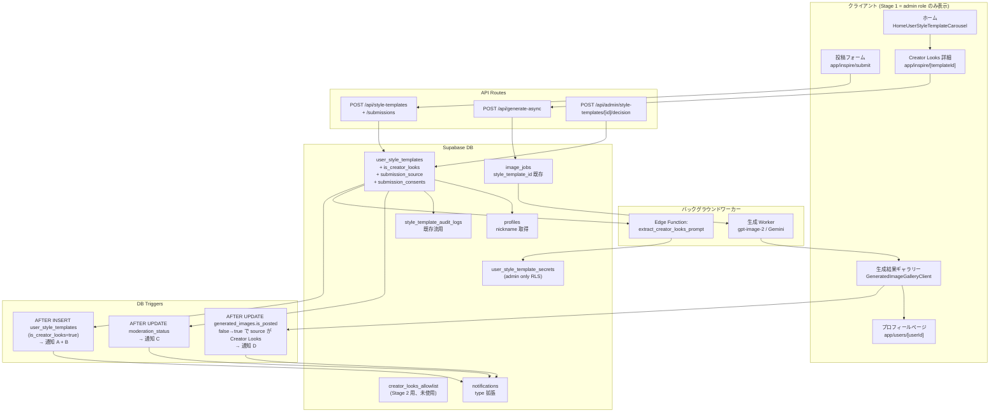
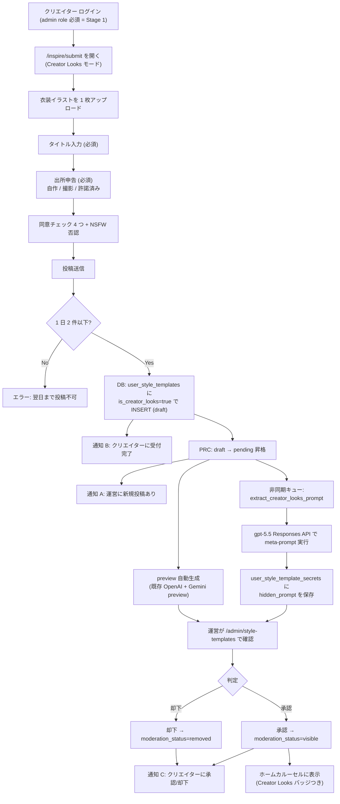
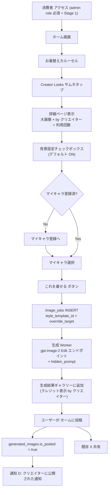
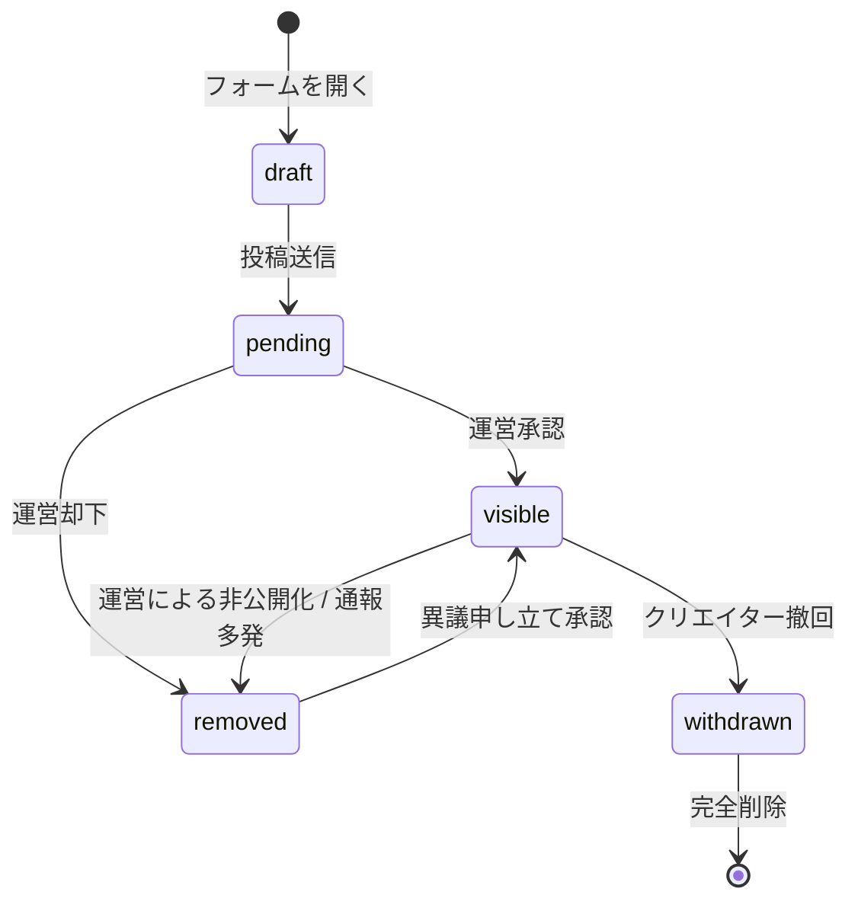
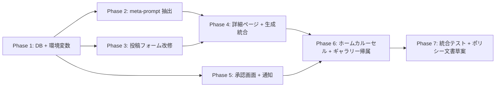

# Creator Looks 実装計画書

## メタ情報

- **機能名**: Creator Looks
- **コード層**: `creator-looks` (= URL / クラス名 / i18n キー / DB ENUM)
- **戦略文書**: `memory/persta_strategy_outfit_library.md`
- **対応 Stage**: Stage 1 (= 運営 only β、コードをマージしても一般ユーザーには無効)
- **作成日**: 2026-06-01

---

## コードベース調査結果

### 既存資産 (= 流用するもの)

| 既存資産 | パス | 流用ポイント |
|---|---|---|
| `user_style_templates` テーブル | `supabase/migrations/20260502120000_*.sql` | 投稿レコードのストレージ。`is_creator_looks BOOLEAN` 列追加で Inspire と区別 |
| `image_jobs.style_template_id` | `supabase/migrations/20260502120100_*.sql` | 既に存在。新規追加不要 |
| `image_jobs.override_target` | 同上 | `outfit_with_background` 値を追加 (CHECK 拡張) |
| `notifications` テーブル | `supabase/migrations/20251213013611_notifications.sql` | type 拡張で新規 4 種類追加 (`creator_looks_submission_received` 等) |
| `style_template_audit_logs` | `supabase/migrations/20260502120200_*.sql` | 監査履歴をそのまま流用 |
| `promote_user_style_template_draft` RPC | (要 grep 確認) | 投稿フォーム → 状態昇格に流用 |
| `apply_user_style_template_decision` RPC | (要 grep 確認) | 承認 / 却下 / 非公開化に流用 |
| `/admin/style-templates` 承認画面 | `app/(app)/admin/style-templates/AdminStyleTemplatesClient.tsx` | バッジ表示の改修のみで Creator Looks 投稿も承認できる |
| 投稿フォーム | `features/inspire/components/UserStyleTemplateSubmissionDialog.tsx` | フィールド追加で対応 |
| 詳細ページ | `app/(app)/inspire/[templateId]/page.tsx` + `features/inspire/components/InspirePageClient.tsx` | `is_creator_looks=true` 時に UI 分岐 |
| ホームカルーセル | `features/home/components/HomeUserStyleTemplateCarousel.tsx` | バッジ追加 (Creator Looks 投稿のみ) |
| 既存「いいね」 | (現状機能) | そのまま流用 |
| 既存「ホームに投稿 → X 共有」 | (現状機能) | そのまま流用 |
| `prompt_overrides` テーブル + `/admin/generation-prompts` | `features/generation-prompts/` | meta-prompt テンプレートを admin 編集可能に登録 |
| `style_template_id` を持つ Inspire 生成パイプライン | `app/api/...` 配下 | Creator Looks の override_target = `outfit_with_background` で動かす |
| WebP 変換 / EXIF 除去 | 既存 Storage アップロードロジック | Creator Looks 投稿でも自動適用 |
| 投稿頻度制限 | `trg_enforce_user_style_template_submission_cap` | 既存トリガを 5 件 → 1 日 2 件版に置き換え or 並列追加 |
| `/users/[userId]` プロフィールページ | `app/(app)/users/[userId]/page.tsx` | 帰属リンク先として流用 |

### 新規実装が必要なもの

| 新規 | 内容 |
|---|---|
| `user_style_templates.is_creator_looks` BOOLEAN 列 | Creator Looks 投稿フラグ |
| `user_style_templates.submission_source` TEXT 列 | 出所申告 (`self_created` / `self_photographed` / `licensed_other`) |
| `user_style_templates.submission_consents` JSONB 列 | 同意チェック 5 項目 + バージョン |
| `user_style_templates.usage_count` INTEGER 列 | 利用回数キャッシュ |
| `user_style_templates.posted_count` INTEGER 列 | ホーム投稿回数キャッシュ |
| `user_style_template_secrets` テーブル (新規) | 隠し meta-prompt 出力 (admin/service_role のみ) |
| `creator_looks_allowlist` テーブル (新規) | Stage 2 用、Stage 1 では未使用 |
| `mark_creator_looks_submission_pending` RPC (or 既存 RPC 拡張) | 投稿頻度 1 日 2 件制限 |
| `extract_creator_looks_prompt` Edge Function | 投稿時に gpt-5.5 で meta-prompt 実行 → secrets に保存 |
| 4 種類の通知トリガ DB Trigger | A/B/C/D の通知発火 (A: 運営, B: 受付完了, C: 承認/却下, D: 公開された) |
| `PROMPT_REGISTRY` 新カテゴリ `creator_looks` + キー `creator_looks.meta_extractor` | meta-prompt テンプレートを admin 編集可能化 |
| 環境変数 `NEXT_PUBLIC_CREATOR_LOOKS_ENABLED` | Stage 制御 |
| 投稿フォームの拡張 | タイトル / 出所申告 / 4 つの同意チェック / NSFW 禁止文言追加 |
| 詳細ページの分岐 UI | `is_creator_looks=true` のとき「これを着せる」シンプル UI + 背景チェックボックス |
| ホームカルーセルのバッジ表示 | `is_creator_looks=true` のサムネ左上に「Creator Looks」ピル |
| 生成結果ギャラリーの帰属表示 | カードに「by クリエイター」リンク (`/users/[userId]` へ) |
| X 共有テキストのクレジット | 「by {creator_nickname}」自動追加 |
| 投稿削除 (撤回) フロー | クリエイター本人がいつでも非公開化 |

---

## 1. 概要図

### システム構成

### Creator Looks 投稿 → 公開フロー

### 消費者使用フロー

### 投稿の状態遷移

---

## 2. EARS (要件定義)

### イベント駆動 (When ...)

- **REQ-001 (ja/en)**: When クリエイターが投稿フォームから「投稿する」を押したとき、the system shall `user_style_templates` レコードを `is_creator_looks=true`、`moderation_status='draft'` で INSERT し、続いて draft → pending に昇格する。
  - When a creator clicks "Submit" on the submission form, the system shall INSERT a `user_style_templates` record with `is_creator_looks=true` and `moderation_status='draft'`, then promote to `pending`.

- **REQ-002**: When `user_style_templates` が `is_creator_looks=true` で INSERT されたとき, the system shall 運営 admin 全員に通知 A (「Creator Looks に新規投稿があります」)、クリエイター本人に通知 B (「投稿を受け付けました」) を発行する。
  - When `user_style_templates` is INSERTed with `is_creator_looks=true`, the system shall create notification A (to all admins) and notification B (to submitter).

- **REQ-003**: When 投稿が pending 状態になったとき, the system shall 非同期キューに「meta-prompt 抽出ジョブ」を投入する。ジョブは gpt-5.5 Responses API でクリエイター画像を解析し、抽出済みプロンプトを `user_style_template_secrets` に保存する。
  - When a submission enters `pending` state, the system shall enqueue an async job for meta-prompt extraction via gpt-5.5 Responses API, storing the result in `user_style_template_secrets`.

- **REQ-004**: When 運営が `/admin/style-templates` で「承認」を押したとき, the system shall `moderation_status` を `visible` に更新し、クリエイター本人に通知 C (「投稿が公開されました 🎉」) を発行する。
  - When an admin clicks "Approve" on `/admin/style-templates`, the system shall update `moderation_status` to `visible` and create notification C to the submitter.

- **REQ-005**: When 運営が「却下」を押したとき, the system shall `moderation_status` を `removed` に更新し、通知 C (却下版) を発行する。

- **REQ-006**: When 消費者が Creator Looks 経由で生成し、結果をホーム投稿 (= `generated_images.is_posted` が false → true) したとき, the system shall クリエイター本人に通知 D (「あなたの衣装で投稿が公開されました」) を発行する。

- **REQ-007**: When 消費者が詳細ページで「Try this look」を押したとき, the system shall `image_jobs` を `style_template_id` + `override_target` (背景 ON: `outfit_with_background`、OFF: `outfit`) で INSERT し、生成 Worker を起動する。

- **REQ-008**: When 生成 Worker が image_jobs を処理するとき, the system shall `user_style_template_secrets.hidden_prompt` を取得して、`gpt-image-2 Images API Edit` エンドポイントに消費者キャラ画像 + hidden_prompt を送る。

### 状態駆動 (While ...)

- **REQ-009**: While 環境変数 `NEXT_PUBLIC_CREATOR_LOOKS_ENABLED` が false の間, the system shall Creator Looks 関連の UI と API を一般ユーザーには見せない (admin role のみアクセス可)。
  - While `NEXT_PUBLIC_CREATOR_LOOKS_ENABLED` is false, the system shall hide Creator Looks UI/APIs from regular users (admin only access).

- **REQ-010**: While 投稿が `pending` 状態の間, the system shall クリエイター本人のみが投稿詳細を閲覧でき、運営は `/admin/style-templates` で確認できる。

### 異常系 (If ...)

- **REQ-011**: If クリエイターが過去 24 時間以内に 2 件以上投稿していた場合, the system shall 「明日また投稿できます」エラーを返し、INSERT を拒否する。

- **REQ-012**: If meta-prompt 抽出ジョブが gpt-5.5 API エラーで失敗した場合, the system shall 最大 3 回まで指数バックオフでリトライし、最終失敗時は `user_style_template_secrets` に失敗フラグを記録、運営にアラート通知を出す。

- **REQ-013**: If 投稿フォームの 5 つの同意チェックすべてが入っていない場合, the system shall 投稿ボタンを disabled にする (= サーバ側でも検証する)。

- **REQ-014**: If クリエイターが投稿を撤回した場合, the system shall `moderation_status` を `withdrawn` に更新し、ホームカルーセルから即座に消す (= cache invalidation)。

- **REQ-015**: If 生成時に `user_style_template_secrets.hidden_prompt` が未生成 (= 抽出ジョブ未完了 or 失敗) の場合, the system shall ユーザーに「準備中です。しばらくお待ちください」エラーを返す。

### オプション (Where ...)

- **REQ-016**: Where Stage 2 の allowlist 機能が有効な場合, the system shall `creator_looks_allowlist.user_id` に該当する一般ユーザーにも Creator Looks UI を開放する (admin role + allowlist のいずれかで OK)。

- **REQ-017**: Where 詳細ページの背景チェックボックスが ON の場合, the system shall 生成プロンプトに hidden_prompt の Background 行を含める。OFF の場合は Background 行を除外し、「keep original background」指示を追加する。

---

## 3. ADR (設計判断記録)

### ADR-001: 隠し meta-prompt を別テーブル (`user_style_template_secrets`) に保存

- **Context**: meta-prompt は Persta の moat (差別化堀)。クリエイターを含む通常ユーザーから一切見えてはいけない。
- **Decision**: `user_style_templates` の列にせず、専用テーブル `user_style_template_secrets` を新規作成。RLS で `service_role` のみ SELECT/INSERT/UPDATE/DELETE 可能とし、通常ユーザーは存在自体を知ることができない。
- **Reason**: Postgres の RLS は行単位なので、同テーブル列の一部だけを隠すのは困難。テーブル分離が最も堅牢で設計意図が明確。
- **Consequence**: テーブル 1 つ増えるが、JOIN 1 回で済む。worker / Edge Function 経由でのみアクセス。検索性は犠牲になるが Creator Looks では検索不要。

### ADR-002: `user_style_templates.is_creator_looks` BOOLEAN で Inspire と区別

- **Context**: 新規テーブル作成 vs 既存テーブル拡張の選択。
- **Decision**: 既存 `user_style_templates` テーブルを流用し、`is_creator_looks BOOLEAN` 列で区別する。
- **Reason**: 投稿フロー、承認画面、ホームカルーセル、生成パイプラインが Inspire と 90% 同じ。テーブル分離するとコード重複が激しくなる。
- **Consequence**: 一部の SELECT で `WHERE is_creator_looks = true` 条件が必要になる。マイグレーション 1 件で済む。

### ADR-003: meta-prompt 抽出は非同期キュー

- **Context**: gpt-5.5 Responses API 呼び出しは 5-15 秒かかる。投稿者を待たせるべきか?
- **Decision**: 投稿時は draft INSERT + pending 昇格までを同期で完了し、`extract_creator_looks_prompt` Edge Function を非同期で起動。クリエイターには即座に「投稿受付完了」通知を送る。
- **Reason**: UX 上、投稿時の長時間待ちは離脱要因。バックグラウンドで処理すれば admin レビュー時 (24h 以内) に間に合う。
- **Consequence**: 抽出失敗時のリトライ・運営アラートが必要 (REQ-012)。生成時に hidden_prompt 未生成のガード必要 (REQ-015)。

### ADR-004: 通知発火は DB Trigger ベース

- **Context**: 通知 A/B/C/D の発火を app 層 (route handler) でやるか、DB Trigger でやるか。
- **Decision**: DB Trigger を採用。`user_style_templates` AFTER INSERT/UPDATE と `generated_images` AFTER UPDATE で発火する。
- **Reason**: Persta の設計方針「原子的・冪等な処理は RPC/Trigger に寄せる」(`docs/architecture/data.ja.md`) と整合。app 層では同じ INSERT が複数経路から起き得るが、Trigger なら確実に 1 回発火する。
- **Consequence**: Trigger のテストは pgTAP or SQL 直接実行で。デバッグはやや困難になる。

### ADR-005: meta-prompt テンプレートは `/admin/generation-prompts` に登録

- **Context**: meta-prompt はチューニングが頻発する。コード変更なしに編集できる仕組みが欲しい。
- **Decision**: 既存の `prompt-registry.ts` + `prompt_overrides` テーブル (= `/admin/generation-prompts` 編集画面) に新規キー `creator_looks.meta_extractor` を追加。デフォルト値として、ユーザーからお渡しいただいた長い英語プロンプトを登録。
- **Reason**: 既存の admin 編集インフラがそのまま流用できる。チューニング時にコードレビュー不要。
- **Consequence**: 新規 PROMPT_CATEGORIES = `"creator_looks"` を追加。registry を真とする設計に従う。

### ADR-006: 機能フラグは env + admin role check の二段構え

- **Context**: Stage 1 では運営にしか見えてはいけない。完成度が低いまま一般公開されると評判が落ちる。
- **Decision**: `NEXT_PUBLIC_CREATOR_LOOKS_ENABLED` env flag (= 機能全体の ON/OFF) と、各 UI/API での `admin role check` を併用。
- **Reason**: env flag だけだと「admin だけに見せる」が難しい。admin check だけだと緊急停止ができない。両方あれば柔軟。
- **Consequence**: Stage 2 では `admin OR allowlist 該当` に変更 (1 行修正)。Stage 3 では env flag = true で全公開。

### ADR-007: 投稿頻度制限 1 日 2 件

- **Context**: スパム / 低品質量産対策。
- **Decision**: クリエイター 1 人あたり 1 日 2 件まで投稿可能。既存の `trg_enforce_user_style_template_submission_cap` (5 件上限) は Inspire 用に残し、Creator Looks には別 trigger or RPC ガードで実装。
- **Reason**: 既存 trigger を上書きすると Inspire 投稿者にも影響する。
- **Consequence**: 2 つの上限ルールが共存。コード可読性のため、Creator Looks 専用 trigger の名前を明示する (`trg_enforce_creator_looks_daily_cap`)。

---

## 4. 実装計画

### フェーズ間の依存関係

各フェーズ終了時にビルドが通り、既存ユーザー機能に影響を出さない (= Stage 1 = admin role の人のみが新機能を見える状態)。

---

### Phase 1: DB + 環境変数 + Stage 制御 (0.5 週間)

**目的**: Creator Looks に必要なテーブル / 列 / 環境変数を整備し、Stage 1 制御を効かせる。

**ビルド確認**: マイグレーション適用後、`npm run typecheck` と `npm run test` が通ること。

- [ ] マイグレーション 1: `supabase/migrations/YYYYMMDDHHmmss_add_creator_looks_columns.sql`
  - `user_style_templates` に列追加: `is_creator_looks`, `submission_source`, `submission_consents`, `usage_count`, `posted_count`
  - CHECK 制約追加: `creator_looks_requires_consent`
  - `submission_source` の ENUM CHECK
  - 既存 RLS は変更しない (= 既存 Inspire 動作維持)
  
- [ ] マイグレーション 2: `supabase/migrations/YYYYMMDDHHmmss_create_creator_looks_secrets.sql`
  - `user_style_template_secrets` テーブル新規作成
  - RLS で service_role のみアクセス可
  - admin 編集用 RPC `get_creator_looks_secret_for_admin(template_id)` を追加 (= admin role 確認 + 取得)
  
- [ ] マイグレーション 3: `supabase/migrations/YYYYMMDDHHmmss_create_creator_looks_allowlist.sql`
  - `creator_looks_allowlist` テーブル新規作成 (Stage 2 用、Stage 1 では未使用)
  - RLS で本人のみ SELECT、admin のみ INSERT/UPDATE/DELETE
  
- [ ] マイグレーション 4: `supabase/migrations/YYYYMMDDHHmmss_extend_image_jobs_for_creator_looks.sql`
  - `image_jobs.override_target` の CHECK 制約を拡張: 既存 (`angle`, `pose`, `outfit`, `background`, NULL) に `outfit_with_background` を追加
  
- [ ] マイグレーション 5: `supabase/migrations/YYYYMMDDHHmmss_creator_looks_daily_submission_cap.sql`
  - `trg_enforce_creator_looks_daily_cap` トリガを追加
  - 1 日 (24 時間) に Creator Looks 投稿 2 件を超えると INSERT を拒否
  
- [ ] 環境変数追加: `NEXT_PUBLIC_CREATOR_LOOKS_ENABLED` (デフォルト `false`)
  - `lib/env.ts` に追加
  - 本番では未設定 (= false) のまま、開発時に true で確認
  
- [ ] admin role 判定ヘルパー: 既存 `requireAdmin()` を使う形で OK。Creator Looks 用に新規ヘルパー `isCreatorLooksEnabled(user)` を `lib/auth/creator-looks.ts` に作成
  - 内部で `env.NEXT_PUBLIC_CREATOR_LOOKS_ENABLED === true && (isAdmin(user) || isInAllowlist(user))` を返す
  - Stage 1 では allowlist は空なので実質 admin only
  
- [ ] `prompt-registry.ts` に新カテゴリ `creator_looks` と キー `creator_looks.meta_extractor` を追加
  - `defaultContent` にお渡しいただいた meta-prompt 全文を埋め込む
  - `category: "creator_looks"` を `PROMPT_CATEGORIES` に追加

---

### Phase 2: meta-prompt 抽出 (バックグラウンド処理) (1 週間)

**目的**: 投稿時の VLM 抽出を非同期で実行し、`user_style_template_secrets` に hidden_prompt を保存する。

**ビルド確認**: Edge Function デプロイ後、手動で 1 件投稿 → secrets に行が入ることを確認。

- [ ] Edge Function 新規作成: `supabase/functions/extract-creator-looks-prompt/index.ts`
  - 入力: `template_id`
  - 既存 `prompt_overrides` から `creator_looks.meta_extractor` を取得 (= admin が編集していればその内容)
  - `user_style_templates` から画像 URL を取得
  - OpenAI Responses API (gpt-5.5) で画像 + meta-prompt を送る
  - 出力テキストを `user_style_template_secrets.hidden_prompt` に INSERT (UPSERT)
  - エラー時は最大 3 回リトライ (指数バックオフ)
  - 最終失敗時は admin にアラート通知を発行
  
- [ ] PRC `enqueue_creator_looks_extraction(template_id)` を新規作成
  - 投稿時 (draft → pending 昇格時) に呼ばれる
  - Supabase の `pg_net` 経由で Edge Function を非同期起動
  
- [ ] 既存 `promote_user_style_template_draft` RPC を拡張
  - Creator Looks 投稿のときに `enqueue_creator_looks_extraction` を併せて呼ぶ
  
- [ ] ユニットテスト: Edge Function の主要関数 (= 入力検証 / Responses API 呼び出し / DB UPSERT) をモックでカバー

---

### Phase 3: 投稿フォーム改修 (`/inspire/submit`) (0.5 週間)

**目的**: Creator Looks 投稿に必要な追加フィールド (タイトル / 出所申告 / 4 つの同意) を追加。

**ビルド確認**: フォームを admin で開けて投稿が完了し、DB に `is_creator_looks=true` で記録されること。

- [ ] `features/inspire/components/UserStyleTemplateSubmissionDialog.tsx` を改修
  - Stage 1 では `isCreatorLooksEnabled(user)` で表示分岐 (= 通常ユーザーには既存 UI のまま)
  - Creator Looks モード時:
    - タイトル入力フィールド追加 (= 既存 `alt` フィールドを「タイトル」とラベル変更)
    - 出所申告 select 追加 (`self_created` / `self_photographed` / `licensed_other`)
    - 同意チェック 4 つ + NSFW 否認 1 つ (= 計 5 つすべて必須)
    - 投稿ボタンの label を「投稿する」に変更
  
- [ ] `app/api/style-templates/route.ts` (or 該当 handler) を拡張
  - Creator Looks モード時のリクエストを処理: `is_creator_looks=true`、`submission_source`、`submission_consents` を保存
  - 投稿頻度制限のエラーメッセージを返却
  
- [ ] サーバ側バリデーション
  - `submission_consents` の 5 項目すべて true であること
  - `submission_source` が定義済みの値であること
  - 1 日 2 件の制限超過時は 429 エラー
  
- [ ] i18n キー追加: `messages/ja.ts` と `messages/en.ts` に Creator Looks 関連キー (= 「タイトル」「出所」「同意」「投稿頻度上限」など)

---

### Phase 4: 詳細ページ + 生成統合 (1 週間)

**目的**: Creator Looks 投稿の詳細ページで「これを着せる」フローを実装。

**ビルド確認**: admin で投稿 → 承認 → 詳細ページから生成 → 結果が生成結果ギャラリーに表示されること。

- [ ] `app/(app)/inspire/[templateId]/page.tsx` を改修
  - `is_creator_looks=true` のとき `CreatorLooksDetailClient` を返す (= 別コンポーネント)
  - 既存の InspirePageClient はそのまま既存 Inspire 投稿に使う
  
- [ ] `features/inspire/components/CreatorLooksDetailClient.tsx` を新規作成
  - レイアウト: モックアップ 03 に従う
  - 大画像表示
  - タイトル / `by クリエイター` (`/users/[userId]` リンク)
  - 利用回数 + いいね数 (既存いいね機能流用)
  - 背景設定チェックボックス (= `StylePageClient.tsx:1716-1752` のパターンをコピー)
    - デフォルト ON
  - 注釈テキスト 「※ カメラアングルとポーズは変わりません。今後のアップデートで対応予定です」
  - 「Try this look」 大きい CTA ボタン
  - マイキャラ選択 UI (= 既存パターン流用)
  
- [ ] 生成リクエスト時の `override_target` 設定
  - 背景チェック ON: `override_target='outfit_with_background'`
  - 背景チェック OFF: `override_target='outfit'`
  
- [ ] 生成 Worker を改修 (= `supabase/functions/image-gen-worker/` 内)
  - `style_template_id` から `user_style_template_secrets` の hidden_prompt を取得
  - `override_target='outfit_with_background'` のとき: hidden_prompt をそのまま使う
  - `override_target='outfit'` のとき: hidden_prompt から Background セクションを除去し、「keep original background」指示を追加
  - 最終プロンプト + 消費者キャラ画像を `gpt-image-2 Images API Edit` エンドポイントに送る
  - レスポンスを既存パイプラインで保存
  - hidden_prompt が未生成 (= NULL) の場合は STYLE_HIDDEN_PROMPT_NOT_READY エラーで失敗とする

---

### Phase 5: 承認画面 + 通知 (0.5 週間 + DB Trigger は Phase 1 と並行)

**目的**: 運営承認画面に Creator Looks 投稿を表示し、4 種類の通知 (A/B/C/D) を発火させる。

**ビルド確認**: 投稿 → 通知 A/B が運営とクリエイターに届く / 承認 → 通知 C / 消費者がホーム投稿 → 通知 D が届く。

- [ ] `app/(app)/admin/style-templates/AdminStyleTemplatesClient.tsx` にバッジ表示追加
  - リストの各行で `is_creator_looks=true` のときに「Creator Looks」バッジを表示
  - sheet 内で `user_style_template_secrets.hidden_prompt` を admin 向けに表示 (= デバッグ用)
  
- [ ] DB Trigger 1: 通知 A + B
  - マイグレーション: `YYYYMMDDHHmmss_creator_looks_notifications_trigger.sql`
  - `user_style_templates` AFTER INSERT (NEW.is_creator_looks=true) で発火
  - admin 全員に type=`creator_looks_submission_received` の notifications を INSERT (通知 A)
  - クリエイター本人に type=`creator_looks_submission_acknowledged` の notifications を INSERT (通知 B)
  
- [ ] DB Trigger 2: 通知 C
  - `user_style_templates` AFTER UPDATE OF moderation_status (NEW.is_creator_looks=true) で発火
  - `moderation_status` が `visible` または `removed` に遷移したら、クリエイターに type=`creator_looks_moderation_result` の通知 INSERT
  - body は `data.action='approved'` or `'rejected'` で区別
  
- [ ] DB Trigger 3: 通知 D
  - `generated_images` AFTER UPDATE OF is_posted で発火
  - 条件: NEW.is_posted = true AND OLD.is_posted = false
  - 該当 image_jobs から `style_template_id` を取得
  - その template が `is_creator_looks=true` のとき、クリエイターに type=`creator_looks_post_published` の通知 INSERT
  
- [ ] 通知 type の i18n 文言追加
  - `app/api/admin/style-templates/[id]/decision/route.ts` 周辺の route-copy を参考に Creator Looks 用文言を追加
  
- [ ] 既存通知システム (Resend or アプリ内) のフックを確認
  - 新規 type が `push_status='pending'` で INSERT されたら通知エンジンが自動で送信するか確認 (= 既存と整合性を取る)

---

### Phase 6: ホームカルーセル + 生成結果ギャラリー帰属 (0.5 週間)

**目的**: ホームに Creator Looks バッジを表示、生成結果ギャラリーに帰属リンクを表示。

**ビルド確認**: ホームで Creator Looks 投稿にバッジが見える / ギャラリーで「by クリエイター」リンクが動く。

- [ ] `features/home/components/HomeUserStyleTemplateCarousel.tsx` を改修
  - カード描画時に `template.is_creator_looks=true` なら左上に「Creator Looks」バッジ (= 角丸ピル形、半透明黒地 + 白文字 10-12px)
  - Stage 1 では admin role の人のみが該当カルーセルを表示 (= サーバ側 fetcher で gating)
  
- [ ] `features/home/components/CachedHomeUserStyleTemplateSection.tsx` を確認・改修
  - `isCreatorLooksEnabled(user)` の結果で取得対象を変える (= Stage 1 は admin のみ visible カルーセルに Creator Looks を混ぜる)
  - cache invalidation tag (`home-user-style-templates`) は既存パターン流用
  
- [ ] `features/generation/components/GeneratedImageGalleryClient.tsx` (or 該当コンポーネント) に帰属表示追加
  - 生成結果カードの下部に「by クリエイター」リンク (`/users/[userId]` へ)
  - リンク対象: `image_jobs.style_template_id` が Creator Looks の場合のみ表示
  - 表示には `profiles.nickname` を使用 (= JOIN 1 回追加)

---

### Phase 7: 統合テスト + 撤回フロー + ポリシー文書草案 (1 週間)

**目的**: 既存 Inspire 機能の回帰がないことを確認し、撤回フロー + ポリシー文書を整備。

**ビルド確認**: `npm run lint && npm run typecheck && npm run test && npm run build -- --webpack` がすべてパス。

- [ ] クリエイター撤回 API 実装
  - `POST /api/style-templates/[id]/withdraw` を新規 (or 既存流用)
  - `is_creator_looks=true` でも撤回可能とする
  - 撤回時に `moderation_status='withdrawn'` に更新 → DB Trigger で audit log に記録
  
- [ ] X 共有テキスト改修
  - 既存の生成結果 X 共有フックに、`style_template_id` が Creator Looks なら「by {creator_nickname}」を含める処理を追加
  
- [ ] 統合テスト
  - 投稿 → 抽出 → 承認 → 詳細 → 生成 → ギャラリー → ホーム投稿 → 通知 D まで E2E で確認
  - admin/一般ユーザー の Stage 1 gating が正しく機能すること
  
- [ ] ポリシー文書 P-1〜P-7 の草案作成 (= Stage 3 公開直前まで非公開)
  - `docs/policies/creator-looks/submission-terms.md`
  - `docs/policies/creator-looks/creator-conduct.md`
  - `docs/policies/creator-looks/moderation-policy.md`
  - `docs/policies/creator-looks/withdrawal-policy.md`
  - `docs/policies/creator-looks/attribution-policy.md`
  - `docs/policies/creator-looks/nsfw-prohibition.md`
  - `docs/privacy-policy.md` の更新 (EXIF 除去 / VLM 内部利用)
  
- [ ] Stage 1 公開準備
  - env `NEXT_PUBLIC_CREATOR_LOOKS_ENABLED=true` を本番に設定 (= admin role の人だけ機能が表示される)
  - 運営 1〜2 名が自分で投稿 → 承認 → 生成 → ホーム投稿まで動作確認
  - meta-prompt の品質チューニング

---

## 5. 修正対象ファイル一覧

| ファイル | 操作 | 変更内容 |
|---|---|---|
| `supabase/migrations/YYYYMMDDHHmmss_add_creator_looks_columns.sql` | 新規 | user_style_templates に列追加 + CHECK |
| `supabase/migrations/YYYYMMDDHHmmss_create_creator_looks_secrets.sql` | 新規 | secrets テーブル + RLS + admin RPC |
| `supabase/migrations/YYYYMMDDHHmmss_create_creator_looks_allowlist.sql` | 新規 | allowlist テーブル + RLS |
| `supabase/migrations/YYYYMMDDHHmmss_extend_image_jobs_for_creator_looks.sql` | 新規 | override_target CHECK 拡張 |
| `supabase/migrations/YYYYMMDDHHmmss_creator_looks_daily_submission_cap.sql` | 新規 | 1 日 2 件制限 trigger |
| `supabase/migrations/YYYYMMDDHHmmss_creator_looks_notifications_trigger.sql` | 新規 | 4 種類の通知 trigger |
| `supabase/functions/extract-creator-looks-prompt/index.ts` | 新規 | meta-prompt 抽出 Edge Function |
| `lib/env.ts` | 修正 | `NEXT_PUBLIC_CREATOR_LOOKS_ENABLED` 追加 |
| `lib/auth/creator-looks.ts` | 新規 | `isCreatorLooksEnabled(user)` ヘルパー |
| `shared/generation/prompt-registry.ts` | 修正 | `creator_looks` カテゴリ + キー追加 |
| `features/inspire/components/UserStyleTemplateSubmissionDialog.tsx` | 修正 | Creator Looks モード分岐 + 追加フィールド |
| `features/inspire/components/CreatorLooksDetailClient.tsx` | 新規 | Creator Looks 詳細ページ |
| `app/(app)/inspire/[templateId]/page.tsx` | 修正 | `is_creator_looks` で分岐レンダリング |
| `app/api/style-templates/route.ts` | 修正 | Creator Looks 投稿対応 |
| `app/api/style-templates/[id]/withdraw/route.ts` | 新規 or 修正 | 撤回フロー |
| `supabase/functions/image-gen-worker/index.ts` | 修正 | hidden_prompt 読み込み + gpt-image-2 Edit 呼び出し |
| `features/home/components/HomeUserStyleTemplateCarousel.tsx` | 修正 | Creator Looks バッジ追加 |
| `features/home/components/CachedHomeUserStyleTemplateSection.tsx` | 修正 | admin gating |
| `features/generation/components/GeneratedImageGalleryClient.tsx` | 修正 | 帰属リンク表示 |
| `app/(app)/admin/style-templates/AdminStyleTemplatesClient.tsx` | 修正 | Creator Looks バッジ + hidden_prompt 表示 |
| `messages/ja.ts` | 修正 | Creator Looks i18n キー |
| `messages/en.ts` | 修正 | 同上 |
| `messages/{15 言語}.ts` | 修正 | 同上 (en/ja 以外も MVP では追加) |
| `docs/policies/creator-looks/*.md` | 新規 | P-1〜P-7 ポリシー草案 |
| `docs/privacy-policy.md` | 修正 | EXIF / VLM 内部利用追記 |

---

## 6. 品質・テスト観点

### 品質チェックリスト

- [ ] **エラーハンドリング**: gpt-5.5 API エラー / gpt-image-2 API エラー / DB 制約違反 / 投稿頻度上限 がすべて適切なメッセージで返る
- [ ] **権限制御**: Stage 1 で一般ユーザーが Creator Looks 関連 URL に直接アクセスしても 403/404
- [ ] **データ整合性**: hidden_prompt 未生成のまま消費者が生成しようとしたらガード
- [ ] **セキュリティ**: `user_style_template_secrets` の RLS が service_role 以外を完全遮断していること (= pgTAP テストで確認)
- [ ] **i18n**: en/ja の翻訳すべて揃っているか (= ESLint で漏れ検出)
- [ ] **CSRF**: 既存パターン (`ensureSameOrigin`) を投稿 / 撤回 / admin 操作の各 API に適用

### テスト観点

| カテゴリ | テスト内容 |
|---|---|
| 正常系 | 投稿 → 抽出 → 承認 → 生成 → ホーム投稿 → 通知 D の E2E |
| 異常系 | 同意未チェック / 投稿頻度超過 / hidden_prompt 未生成 / API 失敗 / VLM タイムアウト |
| 権限テスト | env=false 時、admin 以外がアクセス試行 → 403 |
| 既存機能回帰 | Inspire 投稿 / 生成 / 承認が変わらず動くこと |
| 通知テスト | A/B/C/D それぞれが想定の宛先に正しい文言で届くこと |
| DB Trigger テスト | INSERT/UPDATE 発火で notifications に正しい行が入ること (pgTAP) |
| 実機確認 | スマホで投稿 → 詳細 → 生成 → ホーム投稿 までの一連の流れ |

### テスト実装手順

1. `/test-flow {Creator Looks 投稿}` — 依存関係確認
2. `/spec-extract {Creator Looks}` — EARS 抽出 (= 本計画書から)
3. `/spec-write {Creator Looks}` — スペック精査
4. `/test-generate {Creator Looks 各 Phase}` — Phase ごとにテスト生成
5. `/test-reviewing {Creator Looks}` — レビュー
6. `/spec-verify {Creator Looks}` — カバレッジ確認

---

## 7. ロールバック方針

### DB マイグレーション

- 各マイグレーションは **追加のみ** (= 既存列・既存テーブルを変更しない)
- ロールバックが必要な場合:
  - 列追加 → `DROP COLUMN` (= データ消える、慎重に)
  - テーブル追加 → `DROP TABLE`
  - Trigger 追加 → `DROP TRIGGER`
  - CHECK 拡張 → 既存 CHECK に戻すマイグレーション

### 機能フラグ

- `NEXT_PUBLIC_CREATOR_LOOKS_ENABLED=false` で機能全体を OFF
- env を反映するために Vercel 再デプロイ必要 (= 約 2 分)
- Stage 1 中の緊急停止はこの方法で

### Git

- 各 Phase ごとに 1 PR を切り、squash merge
- Phase 4 まで完了した状態でも Phase 5/6/7 が未完なら、本番では env=false のまま (= 影響なし)
- 任意の Phase で `git revert` 可能

### 外部サービス

- gpt-5.5 / gpt-image-2 の API キーは既存設定流用 (= 追加コスト発生のみ、新規認証情報不要)
- Edge Function `extract-creator-looks-prompt` の削除も `supabase functions delete` で可能 (= 承認必要)

---

## 8. 使用スキル

| スキル | 用途 | フェーズ |
|---|---|---|
| `/project-database-context` | スキーマ・RPC 確認 | Phase 1 |
| `/spec-extract` | EARS 抽出 | テスト全体 |
| `/spec-write` | スペック精査 | テスト全体 |
| `/test-flow` | テストワークフロー | テスト全体 |
| `/test-generate` | テストコード生成 | Phase 1-6 |
| `/test-reviewing` | テストレビュー | Phase 7 |
| `/git-create-branch` | ブランチ作成 | Phase 開始時 |
| `/git-create-pr` | PR 作成 | Phase 完了時 |
| `/resolve-gemini-review` | レビュー対応 | PR レビュー時 |
| `/codex-webpack-build` | サンドボックスビルド | Phase 完了確認時 |

---

## 整合性チェック (出力時セルフレビュー結果)

- ✅ **図とスキーマの整合性**: 状態遷移図 (draft/pending/visible/removed/withdrawn) はマイグレーションの CHECK と一致
- ✅ **認証モデルの一貫性**: Stage 1 = env + admin role / Stage 2 = + allowlist / Stage 3 = 全開放、UI / API / RLS で矛盾なし
- ✅ **データフェッチの整合性**: 既存 Inspire と同じパターン (Server Component → fetch → Client Component に props 渡し) を踏襲
- ✅ **イベント網羅性**: 投稿受付 / 承認 / 却下 / 撤回 / 公開 / 通報 (= Stage 3) の全状態に対応する通知タイプを定義
- ✅ **API パラメータのソース安全性**: `submitted_by_user_id` は API route 側で `getUser()` から取得 (= リクエストボディから受け取らない)
- ✅ **ビジネスルールの DB 層強制**: 投稿頻度 (trigger) / 同意必須 (CHECK) / Creator Looks フラグ (BOOLEAN) は DB 層で強制

---

## 次のアクション

1. この計画書のレビュー → 修正・承認
2. `/git-create-branch` で `feature/creator-looks-phase-1` を作成
3. Phase 1 から順に実装 → PR → マージ
4. 各 Phase 完了時に `npm run lint && npm run typecheck && npm run test && npm run build -- --webpack` を必ず実行
5. Stage 1 公開時 (= 全 Phase 完了) に env を ON にして運営確認
