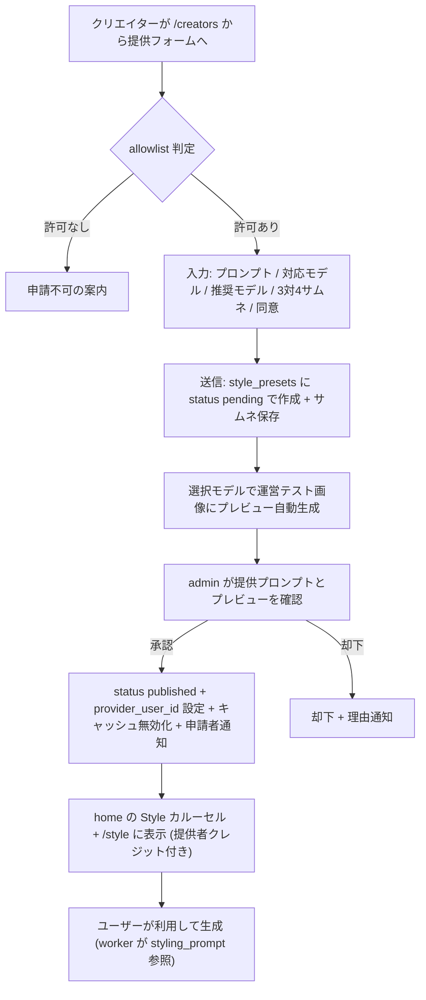
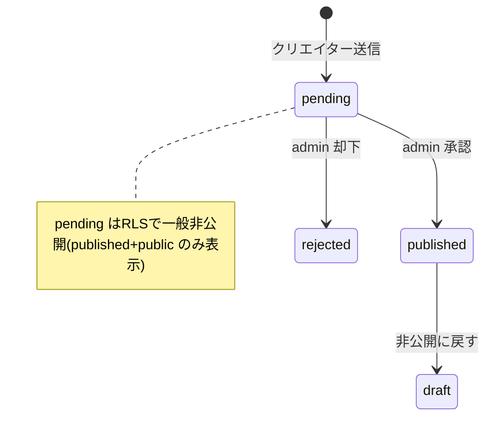
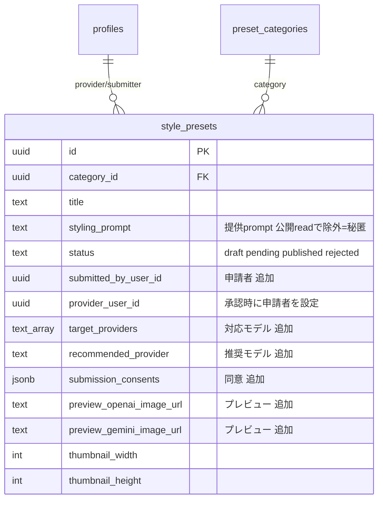
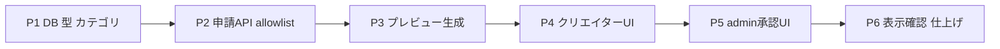

# クリエイター提供プロンプト 申請システム 実装計画書(Phase 1)

作成日: 2026-06-24(改訂: 公開先を style_presets に変更)
対象: 「クリエイターがプロンプトを提供・申請 → 自動プレビュー生成 → admin 承認 → **style として home / /style に公開**」する仕組み

---

## 0. 背景・ゴール

mario さんのように **プロンプトを提供してくれるクリエイター** が増える見込み。運営が毎回手入力で登録するのは間に合わないため、**クリエイター自身がプロンプトを提供・申請** し、承認後に **既存の Style(One-Tap)と同じ並び**(home の Style カルーセル + `/style`)に公開する。

### ユーザー合意済みの確定事項
1. **表示面 = style_presets 系**(home の Style カルーセル + `/style`)。**Inspire 表示は不要** → サムネは **3:4 に統一**。
2. プレビューは **対応モデル(ChatGPT / nanobanana)で自動生成**、**推奨モデル**を1つ指定可。選んだモデルのみ生成。
3. プレビュー用の元画像は **運営の検証用画像**(Inspire と同様。クリエイターからは元画像を受け取らない)。
4. 提供 prompt は **非公開(moat)**。`style_presets.styling_prompt` は公開 read で除外済のためそのまま秘匿になる。
5. 申請者は **招待制(allowlist)**(Phase 1)。
6. 同意項目に「**プロンプトは自作/権利クリア**」を1つ追加。

> 設計変更メモ: 当初は「Creator Looks 基盤(user_style_templates)流用=home/Inspire 表示」で合意したが、表示面を **style_presets** に統一する要望により、公開先を **style_preset** に変更。表示/クレジット/生成/秘匿は既存の style_presets 機構を流用し、新規は主に「**申請 → pending → プレビュー → 承認**」のパイプライン。これは当初 AskUserQuestion の選択肢「/style One-Tap に申請機能を新設」に相当(工数は中)。

---

## 1. コードベース調査結果(file:line 根拠)

### 1-1. style_presets の作成・公開(成果物の作り方)
- 作成 RPC: `create_style_preset`(19引数)`supabase/migrations/20260322113000_add_style_preset_mutation_rpcs.sql:70-136`、category 対応 `20260530080300:11-109`、dual 対応 `20260601100100:14-117`
  - 主要: `p_title` / `p_styling_prompt` / `p_thumbnail_*` / `p_status('draft'|'published')` / `p_category_id`(未指定は coordinate)/ `p_image_input_mode('single'|'dual')`
- admin 作成 API: `app/api/admin/style-presets/route.ts:48-262`(title/styling_prompt/file(jpeg/png/webp 5MB)/category_id 必須)
- provider クレジット: `style_presets.provider_user_id`(`20260622120000_add_provider_user_id_to_style_presets.sql:20-43`、CREATE 後に `UPDATE` で設定)
- model/percoin は **preset/categoryに持たない**。生成 handler/worker が model を決め、percoin は使用 model で決定(`app/(app)/style/generate-async/handler.ts`)。

### 1-2. ★秘匿(moat)は既に成立
- 公開 summary `StylePresetPublicSummary`(`features/style-presets/lib/schema.ts:118-144`)は **styling_prompt を含まない**。`mapRowToPublicSummary`(`style-preset-repository.ts:261-277`)が明示除外。
- RLS(`20260531020000_add_preset_category_visibility.sql:28-40`): `status='published' AND category.visibility='public'` のみ SELECT 可。
- → **提供 prompt を `styling_prompt` に保存しても公開ユーザーには出ない**(moat 維持)。別 secrets テーブル不要。

### 1-3. 表示・クレジット(既存流用)
- home の Style カルーセル: `features/home/components/CachedHomeStylePresetSection.tsx:28-71`(`getPublishedStylePresets`)、`HomeStylePresetCarousel.tsx:309-316`(**3:4** `aspect-[3/4]`)
- /style カード: `features/style/components/StylePresetPreviewCard.tsx:10-16,179-186`(**3:4** 180×240、`StyleProviderCredit` でクレジット表示)
- クレジット解決: `resolveStylePresetProvider`(`features/style-presets/lib/schema.ts:215-249`、preset 優先→category フォールバック)
- キャッシュ: `cacheTag('style-presets')` + `revalidateTag('style-presets','max')`(`features/style-presets/lib/revalidate-style-presets.ts`)

### 1-4. カテゴリ(公開先の箱)
- `preset_categories.visibility`('public'|'admin_only'、既定 admin_only)`20260531020000`。seed は coordinate(public)/chibi(admin_only)`20260530080000:63-68`。
- → クリエイター提供用の **新規 public カテゴリ**を追加(初期 admin_only → 確認後 public)。

### 1-5. プレビュー生成の流用元
- 既存 admin-preview(hidden_prompt→OpenAI/Gemini 生成→保存): `app/api/internal/generate-creator-looks-admin-preview/route.ts:1-361`、トリガ `20260603100400_creator_looks_admin_preview_trigger.sql:26-134`、保存列 `preview_openai_image_url`/`preview_gemini_image_url`(現状は user_style_templates 側)
- 生成コア(OpenAI/Gemini 呼び出し + プロンプト組立)はこの API 内にあり **流用可能**。本機能では **style_presets(pending)** に対し、**運営テスト画像 + 選択provider** で生成し style_presets 側のプレビュー列へ保存する。
- 運営テスト画像: `INSPIRE_TEST_CHARACTER_IMAGE_URL`(Inspire のプレビューで使用中)。

### 1-6. allowlist / 申請パターン(流用)
- `creator_looks_allowlist`(fail-closed)`20260602100200`、`isCreatorLooksEnabledForUser`(`lib/auth/creator-looks.ts:88-101`)
- 同意 zod / cap / 画像処理: `features/inspire/lib/creator-looks-submission.ts`、`creator-looks-image.ts`(WebP quality85、min768/max4096)、`submission-image-constraints.ts`

---

## 2. 概要図

### 2-1. 申請→承認→公開フロー

### 2-2. 状態遷移(style_presets.status を拡張)

### 2-3. データモデル(style_presets 拡張)

---

## 3. EARS 要件定義(主要)

- **When** an allowlisted creator submits the form, **the system shall** create a `style_presets` row with `status='pending'`, `submitted_by_user_id`, the provided `styling_prompt`, the 3:4 thumbnail, `target_providers`, `recommended_provider`, and consents. / 招待済みクリエイター送信時、pending の style_preset を作成する。
- **If** the submitter is not allowlisted (and not admin), **then the system shall** reject the submission. / allowlist 外は拒否。
- **When** a creator-prompt preset becomes `pending`, **the system shall** generate previews only for the selected `target_providers` using the operator test image and the `styling_prompt`, storing results to `preview_openai_image_url`/`preview_gemini_image_url`. / pending 時、選択モデルのみで運営テスト画像にプレビュー生成し保存。
- **If** a provider preview fails, **then the system shall** record the failure and keep the other provider's preview. / 片方失敗でも他方は保持。
- **When** an admin approves, **the system shall** set `status='published'`, set `provider_user_id=submitted_by_user_id`, invalidate `style-presets` cache, and notify the submitter. / 承認時 published 化・クレジット設定・キャッシュ無効化・通知。
- **While** the preset is `published` in a `public` category, **the system shall** show it in the home Style carousel and `/style` with provider credit, and **shall never** expose `styling_prompt` to end users. / 公開中は home/style にクレジット付き表示、prompt は非公開。
- **Where** `recommended_provider` is set, **the system shall** default generation to it. / 推奨モデルを既定に。

---

## 4. ADR(設計判断記録)

### ADR-001: 公開成果物は style_preset(表示要件に合わせ公開先を変更)
- **Context**: 表示面を「home の Style カルーセル + /style」(=style_presets)に統一したい。
- **Decision**: 成果物を style_preset とし、style_presets に申請(pending)パイプラインを足す。
- **Reason**: 表示/クレジット/生成/秘匿が style_presets に既存。mario の nanoblock と同じ場所に集約。
- **Consequence**: 当初の user_style_templates 流用(home/Inspire)から変更。Inspire 表示はしない。

### ADR-002: 提供 prompt は styling_prompt に保存(別 secrets 不要)
- **Decision**: `style_presets.styling_prompt` に保存。公開 summary/RLS で除外されるため非公開。
- **Reason**: style_presets 既存の秘匿が成立済(1-2)。Creator Looks の secrets テーブルは不要。
- **Consequence**: 秘匿は「公開 read 経路が styling_prompt を返さないこと」に依存(テストで担保)。

### ADR-003: 申請保持は style_presets に status='pending' を追加(option a)
- **Decision**: 専用 submission テーブルや user_style_templates 変換ではなく、style_presets に `pending` 状態と申請メタ列を追加。
- **Reason**: 単一エンティティで表示・承認・将来のタグ/検索を一元化。RLS は published+public のみ公開なので pending は自然に非表示。
- **Consequence**: admin の既存 /admin/style-presets 一覧に pending が混じるためフィルタ/タブを追加。代替案(専用テーブル / user_style_templates 変換)は §10 に記載。

### ADR-004: プレビューは生成コアを流用し style_presets(pending)に対して実行
- **Decision**: `generate-creator-looks-admin-preview` の OpenAI/Gemini 生成コアを共通化し、style_presets pending + 運営テスト画像 + `target_providers` で生成→ preview 列保存。
- **Consequence**: 生成ロジックを薄く切り出す小リファクタが必要。

### ADR-005: クリエイター提供用の新規 public カテゴリ
- **Decision**: 「クリエイター提供」カテゴリを新設(初期 admin_only → 確認後 public)。命名は実装時確定(例 `creator_prompts`)。
- **Reason**: 既存 coordinate と分離して可視性を一元制御。複数提供者は preset 単位 provider_user_id で個別クレジット。

### ADR-006: allowlist は creator_looks_allowlist を流用 / ADR-007: 対応モデル+推奨モデル(target_providers[], recommended_provider)/ ADR-008: プレビュー元画像は運営テスト画像 / ADR-009: 同意に「自作・権利クリア」を1項目追加。

---

## 5. 実装計画(フェーズ + TODO)

### Phase 1: DB・型・カテゴリ
- [ ] `style_presets.status` の CHECK に `pending` / `rejected` を追加(既存 draft/published を維持)
- [ ] `style_presets` に `submitted_by_user_id uuid`(FK profiles)、`target_providers text[]`、`recommended_provider text`、`submission_consents jsonb`、`preview_openai_image_url text`、`preview_gemini_image_url text` を追加(全 nullable)
- [ ] `create_style_preset` RPC を拡張(submitter/target/recommended/consents/status='pending' を受ける)or 別 RPC `submit_creator_style_preset`
- [ ] 新規 public カテゴリ seed(初期 admin_only)
- [ ] RLS 再確認: pending は一般非公開のまま(published+public のみ)。admin/owner は service_role/RPC 経由
- [ ] `npx supabase gen types` で型更新、`features/style-presets/lib/schema.ts` に項目追加(公開 summary には **追加しない**=秘匿維持)

### Phase 2: 申請 API・allowlist
- [ ] `POST /api/style-presets/submissions`(新規): allowlist 判定 → 3:4 サムネ処理(`creator-looks-image.ts` 流用)→ pending 作成
- [ ] zod: prompt(必須/最大長)、target_providers、recommended_provider、consents(+自作権利クリア)。`user_id` はサーバセッションから解決
- [ ] cap/レート制限(招待制でも上限)

### Phase 3: プレビュー自動生成
- [ ] admin-preview の生成コアを共通関数へ抽出(OpenAI/Gemini, プロンプト=styling_prompt, 元画像=運営テスト画像)
- [ ] pending 作成をトリガに(RPC/pg_net or API)選択 provider のみ生成 → `preview_*_image_url` に保存。失敗は audit/記録
- [ ] 環境別 URL 解決(preview/staging)

### Phase 4: クリエイター提供 UI(/creators 導線)
- [ ] `/creators`(`CreatorsRecruitGuide.tsx`)に「プロンプトを提供する」CTA → 専用フォーム
- [ ] フォーム: プロンプト / 対応モデル(チェック)/ 推奨モデル(ラジオ)/ **3:4 サムネ(比率を枠で明示・最小768px・10MB・WebP変換)** / 同意
- [ ] /creators のトーン(アニメ・amber/peach・うちの子)に合わせる(`web-design-guidelines`/`ui-ux-pro-max`)。i18n(ja/en)

### Phase 5: admin 承認 UI
- [ ] `/admin/style-presets` に pending タブ/フィルタ + 提供prompt(admin閲覧)・対応/推奨モデル・OpenAI/Gemini プレビュー・サムネ表示
- [ ] 承認: `status='published'` + `provider_user_id=submitted_by_user_id` + `revalidateTag('style-presets')` + 申請者通知。却下: 理由 + 通知

### Phase 6: 表示確認・仕上げ
- [ ] home Style カルーセル + /style に published が出る/ pending は出ないことを確認
- [ ] 提供者クレジット(`StyleProviderCredit`)表示確認(既存流用)
- [ ] 機能フラグ(env)・エラーハンドリング・lint/typecheck/test/build --webpack
- [ ] 実装後 `multiround-adversarial-review`(branch-diff, code)で秘匿/RLS/allowlist 重点レビュー

---

## 6. 修正対象ファイル一覧(主要)

| ファイル | 操作 | 変更内容 |
|---|---|---|
| `supabase/migrations/2026xxxx_style_preset_submission_columns.sql` | 新規 | status 拡張・submitter/target/recommended/consents/preview 列・新カテゴリ |
| `supabase/migrations/2026xxxx_submit_creator_style_preset_rpc.sql` | 新規 | 申請作成 RPC(pending) |
| `app/api/style-presets/submissions/route.ts` | 新規 | クリエイター申請 API(allowlist/画像/zod) |
| `features/style-presets/lib/creator-submission.ts` | 新規 | zod スキーマ・型(prompt/providers/consents) |
| `app/api/internal/generate-style-preset-preview/route.ts`(or 既存共通化) | 新規/修正 | プレビュー生成(運営テスト画像・provider 絞り込み) |
| `features/style-presets/lib/admin-preview-core.ts` | 新規 | OpenAI/Gemini 生成コアの共通化 |
| `features/creators/components/CreatorsRecruitGuide.tsx` | 修正 | 「プロンプトを提供する」導線 |
| `features/creators/components/CreatorPromptSubmissionForm.tsx` | 新規 | 提供フォーム(3:4) |
| `app/(app)/admin/style-presets/...` | 修正 | pending レビュー/承認 UI |
| `messages/ja.ts` `messages/en.ts`(他ロケール) | 修正 | i18n |

---

## 7. 品質・テスト観点
- [ ] **秘匿**: 公開 read(`getPublishedStylePresets`/summary)で styling_prompt が出ないことをテストで固定
- [ ] **権限**: allowlist 外は申請不可(API)。承認は requireAdmin。pending は一般非公開(RLS)
- [ ] **ソース安全性**: submitter/provider はサーバセッション・RPC 内で解決(クライアント body 不可)
- [ ] **DB 強制**: status/target/recommended/consents は CHECK / RPC RAISE EXCEPTION
- [ ] **整合性**: 状態遷移=status CHECK と一致。3:4 サムネの width/height。provider 値域=enum
- [ ] **i18n**: ja/en。**正常/異常/権限/実機**(プレビュー両/片/失敗、allowlist 外、3:4 以外の警告)

---

## 8. ロールバック方針
- 追加列(nullable)中心で後方互換。DOWN 用意。新カテゴリ admin_only 開始で誤公開を防止。
- 機能フラグ(env)で申請導線 OFF 可。既存 style_presets/Style に影響なし。
- フェーズ毎コミットで revert 可。

---

## 9. 使用スキル
| スキル | 用途 | フェーズ |
|---|---|---|
| `/project-database-context` `/supabase-postgres-best-practices` | DB/RLS/RPC | P1-3 |
| `/web-design-guidelines` `/ui-ux-pro-max` | /creators トーン UI | P4 |
| `/test-flow` `/spec-extract` `/test-generate` | テスト | P6 |
| `/git-create-branch` `/git-create-pr` | ブランチ/PR | 実装 |
| `multiround-adversarial-review` | 実装後の敵対的レビュー | P6 |

---

## 10. 代替案(申請保持の置き場所)と open
- **(a) 採用**: style_presets に pending 追加(単一エンティティ・表示一元)。
- (b) 専用 `style_preset_submissions` テーブル: style_presets を汚さないが二重管理 + 承認時変換。
- (c) user_style_templates 流用 → 承認時に style_preset へ変換: プレビュー基盤を最大流用だが二重レコード + home/Inspire 除外フィルタが必要。
- open: 新カテゴリ命名 / プレビュー生成の起動方式(RPC+pg_net or API)/ 環境別 URL / 既存 admin 一覧の pending フィルタ UX。
