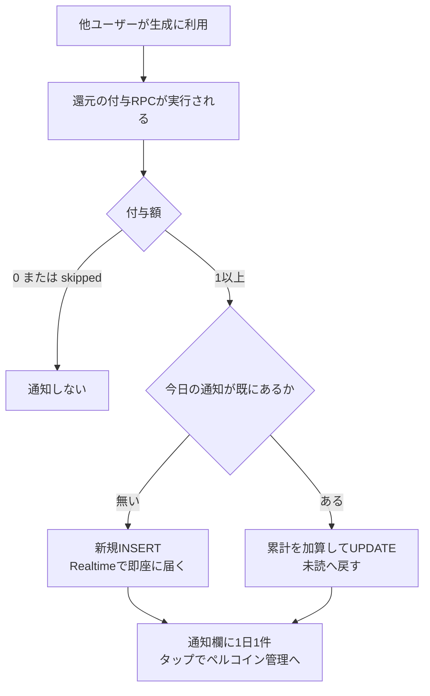
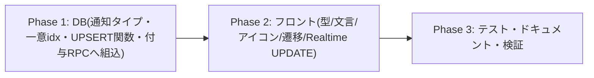

# クリエイター還元の通知（今日ぶん1件・更新方式） 実装計画書

作成日: 2026-08-06
ステータス: 計画（ユーザー決定済みの方針を反映）

## ゴール

クリエイター還元（#483）でペルコインが付与されたことを、受け取った本人が**気づける**ようにする。

現状、還元されても**残高が黙って増えるだけ**で、本人が知る手段が存在しない
（ユーザー向けのペルコイン履歴 UI は無く、履歴を見られるのは管理画面のみ）。
計画時の ADR-003「履歴で確認できるので通知は不要」は前提が誤っていたため、本計画で見直す。

## 方式（ユーザー決定 2026-08-06）

**受け手ごと・JST の日付ごとに通知を1件だけ持ち、利用されるたびに内容を更新する。**

- 表示: 「本日、あなたの作品が◯回利用され◯ペルコイン獲得！」（その日の累計が育つ）
- 更新のたびに未読へ戻すので、**利用されるたびに気づける**
- 通知欄に増える行は**1日1件**なので、いいね・コメント・フォローを押し流さない
- 企画で単価が変わっても、**実際に付与された額を合算**するので数字がずれない

### 「利用のたびに1件ずつ通知」を採らない理由（実測）

過去30日の One-Tap Style 利用（クリエイター設定済み）を集計した結果:

| 指標 | 値 |
|---|---|
| 対象イベント | 552件 / 30日（クリエイターは5人） |
| 1クリエイターあたり | **平均 7.1件/日** |
| 上位10%の日 | 20件/日 |
| 最も多い日 | **52件/日** |

毎回通知にすると多い日はひとりに52件届き、通知欄が還元通知で埋まる。
「もらえて嬉しい」体験は最初の数件がピークで、その後は他の通知を押し流す副作用が上回る。

## コードベース調査結果

| 対象 | 場所 | 現状 |
|---|---|---|
| 還元の付与 | `grant_prompt_usage_reward` / `grant_style_preset_usage_reward`（#483 / `20260806150000`） | 付与成立時のみ `granted` へ。付与額は `apply_usage_reward_grant` の戻り値で得られる |
| 匿名通知の先例 | `notify_on_prompt_usage_milestone`（#477） | `create_notification` を使わず直接 INSERT（自己スキップを回避）。`actor_id = recipient` |
| 匿名判定 | `features/notifications/types.ts` `ANONYMOUS_ACTOR_NOTIFICATION_TYPES` | ここに追加すると、アバター・実名・プロフィール導線が自動で無効になる |
| 一意キーの先例 | `notifications_unique_derived_post_idx` 等の部分ユニークインデックス | `(recipient_id, type, (data->>'...'))` で UPSERT できる |
| **Realtime 購読** | `features/notifications/hooks/useNotifications.ts:328` | **`event: "INSERT"` のみ購読**。UPDATE は届かないため、更新方式にはフロント対応が必須 |
| 遷移先 | `app/(app)/my-page/credits/page.tsx` | ペルコイン管理ページが既にある。ここへ飛ばす |
| 通知OFF設定 | `create_notification` の preference 判定は like/comment/follow のみ | 還元通知は常時ON。設定画面はバックログ（ユーザー判断で今回は見送り） |

## 概要図

## EARS（要件定義）

- **REQ-01**: When 還元の付与が成立したとき, the system shall 受け手のその日（JST）の通知を作成または更新し、累計回数と累計獲得数を反映する。
  誰かに使われてペルコインをもらうたび、通知の数字が増える。
- **REQ-02** (状態駆動): While 同じ受け手・同じ日（JST）の通知が既に存在する, the system shall 行を増やさず既存行を更新する。
  1日に何回使われても通知欄に増えるのは1件だけ。
- **REQ-03**: When 通知が更新されたとき, the system shall 未読へ戻し、**一覧の先頭へ浮上させる**。
  更新のたびにバッジが点き、通知欄の一番上に出るので確実に気づける。
- **REQ-04** (状態駆動): While 付与額が0（設定0・上限到達・自己利用・スキップ）, the system shall 通知を作成・更新しない。
  もらっていないのに通知は来ない。
- **REQ-05**: 通知は匿名とする。誰が利用したかは含めない（既存の節目通知と同じ方針）。
- **REQ-06**: タップ先は `/my-page/credits`（ペルコイン管理）。
- **REQ-07** (異常系): If 通知の作成・更新が失敗したら, then the system shall 警告のみ記録し、**ペルコインの付与自体は成立させる**。
  通知の不具合でコインが入らなくなることはない。
- **REQ-08**: Free と Style の還元は**合算**して1件に集約する。
- **REQ-09**: フロントは通知の UPDATE をリアルタイムに反映して先頭へ移動させる。
  未読バッジの同期は `UnreadNotificationProvider` が同じ UPDATE を購読して行い、このフックからは呼ばない。
- **REQ-10** (異常系): If 既読化や一括既読で UPDATE が大量に発火したら, then the system shall
  **追加のリクエストを一切発生させない**（一覧に無い行は取得しない。未読数の同期も Provider に任せる）。

## ADR（設計判断記録）

### ADR-001: 通知は「受け手 × JST日付」で1行に集約し、UPSERT で更新する

- **Context**: 毎回1件だと多い日で52件/日。日次サマリだけだと即時性が無い。
- **Decision**: `(recipient_id, type, data->>'reward_date')` の部分ユニークインデックスで1行に集約し、
  付与のたびに `ON CONFLICT DO UPDATE` で累計を加算する。
- **Reason**: 「都度気づける」と「通知欄を埋めない」を両立できる。既存の UPSERT 通知と同じ手法。
- **Consequence**: 日付は JST で決める。**`v_notified_at := clock_timestamp()` を一度だけ取得し、
  そこから `reward_date` と `created_at` の両方を導出する**（`now()` はトランザクション開始時刻なので、
  再処理バッチが日をまたぐと「日付は前日・`created_at` は当日」になり同じ日に2行並ぶ）。
  日をまたぐと自然に新しい行になる。

### ADR-002: 累計は通知行の `data` に持ち、付与額から加算する

- **Context**: 表示に必要なのは「今日の回数」と「今日の獲得数」。
- **Decision**: `data.usage_count` / `data.total_amount` を UPDATE 時に `+1` / `+付与額` する。
  再集計クエリは行わない。
- **Reason**: 付与と同一トランザクション内で完結し、単価が途中で変わっても実際の付与額が積まれるため正確。
- **Consequence**: 通知行が唯一の集計元になる。万一ずれても翌日リセットされる（残高は `credit_transactions` が正本）。

### ADR-003: 通知の失敗は付与を巻き込まない（#483 ADR-006 の踏襲）

- **Context**: 付与RPCは記録関数から呼ばれ、その先には生成完了RPCがある。
- **Decision**: 通知の UPSERT を**内側の `BEGIN ... EXCEPTION`** に入れ、失敗しても付与と利用イベントを確定させる。
- **Reason**: 金銭の付与 > 通知。#483 で確立した隔離の規律をそのまま適用する。

### ADR-004（ユーザー決定）: 更新のたびに `created_at` を進めて先頭へ浮上させる

- **Context**: 「更新のたびに先頭へ浮上させたい」（存在感を出し、確実に気づけるようにする）。
- **Decision**: UPSERT の更新時に `created_at`（= `v_notified_at`）も進める。
- **Reason**: 一覧の並び順は**サーバー・クライアントとも `created_at DESC, id DESC` で統一**されているため、
  `created_at` を進めるだけで、追加のソート列やソート式の変更なしに先頭へ浮上する。
  ページングは `created_at|id` のキーセットカーソル方式なので、行が上へ移動しても
  **重複表示にはならない**。ただし**キーセット単体では取りこぼしを防げない**ため、
  ADR-006 の reconciliation と併用して整合を保つ（下記 Consequence で詳述）。
- **Consequence**:
  - この type に限り `created_at` の意味は「最後に付与された時刻」になる。列コメントで明示する。
  - ページング整合: 浮上した行は「カーソルより新しい」側へ移るため、次ページ取得の結果からは外れる。
    クライアントは Realtime の UPDATE で既に先頭に持っているので、**重複表示にならない**。
  - **ただしキーセットだけでは取りこぼしを防げない**（レビュー指摘）。初期取得〜購読成立の間や
    再接続中に古い行が浮上すると、その UPDATE を受け取れず、次ページ取得にも現れないため
    リロードまで一覧に出ない。**購読成立時（初回・再接続）に最新ページを取り直し、
    ID 単位で `created_at` の新しい方を残してマージする reconciliation** を併用して整合を保つ
    （ADR-006）。
  - 別案（`sort_at` 列を追加して `COALESCE` で並べる）は、全通知のクエリ・カーソル・
    インデックス・クライアントの比較関数をすべて変える必要があり、影響範囲が大きいので採らない。

### ADR-005（実装時に改訂）: Realtime の UPDATE は「状態にあればマージ、無ければ原則無視」

- **Context**: 現在の購読は INSERT のみ。また `prependRealtimeNotification` は
  **同じ id が既に存在するとスキップ**する実装なので、UPDATE をそのまま渡しても浮上しない。
- **Decision**: `event: "UPDATE"` を購読し、次のように分岐する。
  1. その id が一覧の状態にある → **payload の変更列を既存行へマージ**してから再ソート（ネットワーク往復なし）
  2. 状態に無い → **原則は無視**する。ただし**未読の還元通知だけは生の行をそのまま差し込む**
     （匿名なので actor / post の enrichment が不要）
  3. 未読バッジの同期は**このフックからは行わない**（`UnreadNotificationProvider` が同じ UPDATE を購読済み）
- **Reason**:
  - 「すべて既読にする」は **DB 上の全未読行**を更新するため、未ロード行の UPDATE も大量に届く。
    ここで `getNotificationById` を呼ぶと**未読件数ぶんのリクエストが並び**、さらに古い通知が
    一覧へ差し込まれてしまう（レビュー指摘）。取得はやめ、還元通知の未読だけを生のまま置く。
  - 未読数をクライアント側で増減させると、既読化 UPDATE と混ざって容易にずれる。サーバーの値を正とする。
    その責務は `UnreadNotificationProvider` が既に持っており（同じ UPDATE を購読済み）、
    このフックから重ねて呼ぶと未読数 API が二重に走る。**バッジ同期は Provider に一本化**する
    （レビュー指摘。フックの `syncUnreadBadgeCount` は Provider の `refreshUnreadCount` を呼ぶだけで、
    フックのローカル未読数は更新しないため、呼んでも二重化するだけだった）。
- **Consequence**: マージ対象は DB の列のみ（`is_read` / `created_at` / `title` / `body` / `data`）。
  actor 等の enrichment 済みフィールドは既存の値を保持する（還元通知は匿名なので actor は元々無い）。

### ADR-006（レビュー指摘で追加）: 購読成立時に最新ページを取り直して取りこぼしを埋める

- **Context**: Realtime は無欠損ではない。初期取得〜購読成立の間や再接続中の UPDATE は届かない。
  浮上した行はカーソルより新しくなるため次ページ取得にも現れず、リロードするまで一覧に出ない。
- **Decision**: `subscribe((status) => ...)` で `SUBSCRIBED`（初回・再接続の両方で発火）を捉え、
  最新ページを取り直して **ID 単位でマージ**する。同一 ID は `created_at` の新しい方を残す。
- **Reason**: 単純な置き換えだと、取得中に届いた Realtime の更新を巻き戻してしまう。
- **Consequence**: マウントごとに1回だけ余分な取得が走るが、「バッジは点いているのに通知が無い」
  状態をリロードまで放置するより安い。

## 実装計画

### Phase 1: DB

- [ ] マイグレーション `2026080616xxxx_add_creator_reward_daily_notification.sql`
  - `notifications.type` の CHECK に `usage_reward_earned` を追加
  - 部分ユニークインデックス `(recipient_id, (data->>'reward_date')) WHERE type = 'usage_reward_earned'`
  - `upsert_usage_reward_notification(p_recipient uuid, p_amount integer)`（service_role 限定）
    - JST 日付を算出し、`ON CONFLICT DO UPDATE` で `usage_count +1` / `total_amount +p_amount` /
      `is_read = false` / **`created_at = v_notified_at`（先頭へ浮上）**。
      `v_notified_at := clock_timestamp()` を一度だけ取り、`reward_date` と共用する
    - `actor_id = p_recipient`（匿名）・`entity_type='user'`・`entity_id = p_recipient`
  - `grant_prompt_usage_reward` / `grant_style_preset_usage_reward` の**付与成立時のみ**呼び出し、
    **内側の例外ブロックで隔離**（ADR-003）
  - カタログ検証（CHECK 値・インデックス・関数・権限）＋ロールバックされる実データ dry-run
    （新規作成 → 2回目で加算されること → 額0では作られないこと → 通知失敗でも付与が残ること）
  - **適用前に本番データでリハーサル**（`COMMIT`→`ROLLBACK` 置換の通し実行。`persta-migration-apply-workflow` の手順）

### Phase 2: フロント

- [ ] `features/notifications/types.ts` — `usage_reward_earned` を型と `ANONYMOUS_ACTOR_NOTIFICATION_TYPES` に追加。`data` に `reward_date` / `usage_count` / `total_amount`
- [ ] `features/notifications/lib/presentation.ts` — 文言生成（回数と獲得数を差し込む）
- [ ] `messages/{ja,en,...}.ts` — 15ロケール分のキー追加
- [ ] `features/notifications/components/NotificationList.tsx` — アイコン（コイン系）追加
- [ ] `features/notifications/hooks/useNotifications.ts` — 遷移先 `/my-page/credits`、
      **UPDATE 購読の追加**（状態にあればマージして再ソート／状態に無い行は**未読の還元通知だけ生行を追加**し
      それ以外は無視／未読バッジの同期は Provider に任せる）、
      **購読成立時の reconciliation**（ADR-006）

### Phase 3: テスト・ドキュメント・検証

- [ ] presentation のテスト（0件・1件・複数・数字の差し込み）
- [ ] `useNotifications` のテスト（UPDATE で**先頭へ浮上**する／状態にある行はマージのみで追加取得しない／
      状態に無い行は**未読の還元通知だけ生行を追加し、既読・他タイプは無視**する／
      還元通知の UPDATE でも未読数 API を直接呼ばない／購読成立時の reconciliation で
      取りこぼしを補完しつつ、ローカルの新しい状態を巻き戻さない）
- [ ] `docs/architecture/data.{ja,en}.md`・`.cursor/rules/database-design.mdc` 同期
- [ ] `npm run lint` / `typecheck` / `test` / `build -- --webpack`

## 品質・テスト観点

- [ ] **通知が増えない**: 同日に複数回付与しても行は1件のまま
- [ ] **数字が正確**: 単価を途中で変えても、実際の付与額の合計になる
- [ ] **付与を巻き込まない**: 通知の UPSERT が失敗しても付与と利用イベントは残る
- [ ] **先頭へ浮上する**: 更新後に一覧の一番上に来る（サーバー再取得後も同じ並び）
- [ ] **未読数がずれない**: 既読化・一括既読の UPDATE で増えない
- [ ] **リクエストが増えない**: 一括既読で行数ぶんの `getNotificationById` が飛ばない。
      還元通知の UPDATE でも未読数 API が二重に走らない（Provider に一本化）
- [ ] **匿名**: 利用者の名前・アバター・プロフィール導線が出ない
- [ ] **0枚では通知しない**: 設定0・上限到達・自己利用のとき無反応

## ロールバック方針

- 通知の作成は付与RPCの内側の例外ブロックにあるため、問題時は UPSERT 関数を no-op に差し替えるだけで停止できる
- 型・インデックスの追加は加算のみ。down は明示しない（既存方針）

## 既知の制約（今回は対応しない）

- **通知OFF設定が無い**: 還元通知は常時ON。設定画面はバックログでまとめて対応（ユーザー判断）
- **上限到達者には届かない**: 無料残高が5万を超えていると付与額0のため通知も出ない（既存のキャップ仕様）
- **ユーザー向けペルコイン履歴UIが無い**: 遷移先は残高が見える `/my-page/credits`。履歴一覧は将来課題
