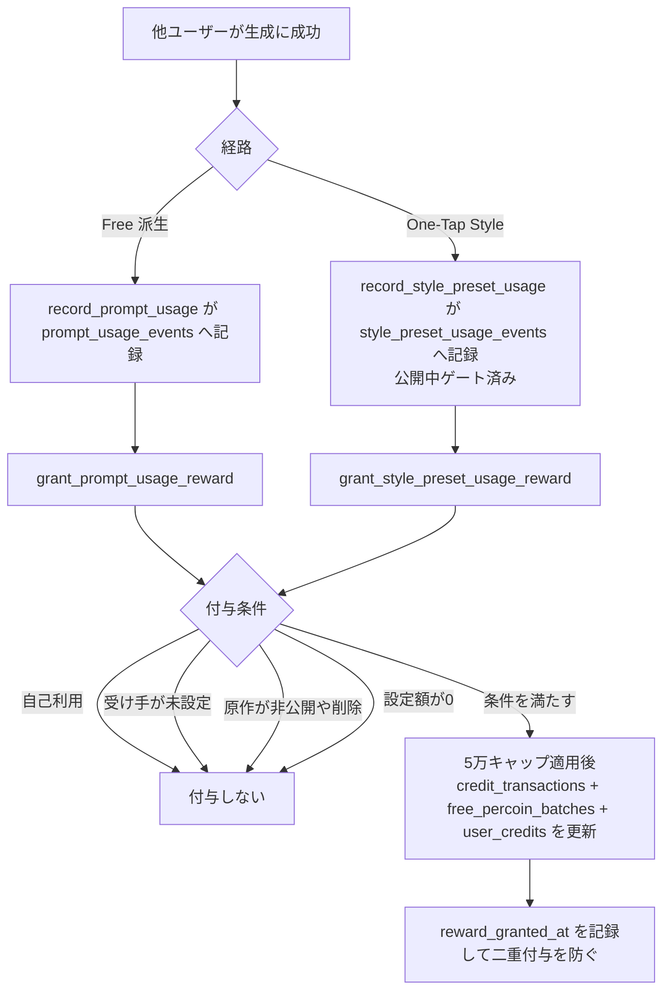
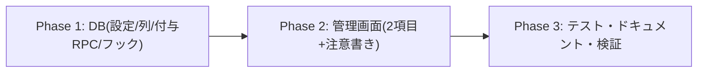

# プロンプト/スタイル利用時のクリエイター還元ペルコイン 実装計画書

作成日: 2026-08-06
ステータス: 計画（ユーザーレビュー待ち）

## ゴール

他ユーザーが生成に利用するたび、**原作者・クリエイターへペルコインを付与**する。

- **Free**: `/free` の公開プロンプトが派生生成に使われたら、原作者へ付与
- **Style**: One-Tap Style のプリセットが生成に使われたら、クリエイター（provider）へ付与
- 付与額は `/admin/percoin-defaults` から **Free 用・Style 用を別々に**設定

### 決定事項（ユーザー承認済み 2026-08-06）

| 項目 | 決定 |
|---|---|
| 付与タイミング | 他ユーザーの生成成功時（既存の利用イベント記録と同一トランザクション） |
| 設定場所 | `/admin/percoin-defaults` に2項目追加 |
| 既定値 | **0 = OFF で出荷**。admin が額を入れて有効化（完走報酬 #409 と同じ段階公開） |
| 運用値 | 通常2ペルコイン、イベント時は最大5ペルコイン |
| 自己利用 | **付与しない** |
| 公開中条件 | #479/#481 と同一の考え方（下記「公開中の定義」参照） |
| 日次上限 | **なし**（経済的に安全。下記の根拠を参照） |
| Free の対象範囲 | 既存どおり「原作投稿から派生生成」のみ。**コピペ経由は対象外である旨を注意書きに明記** |

### 日次上限なしの経済的根拠（実データで検証済み）

1生成の最低コストは **10ペルコイン**（`features/generation/lib/model-config.ts` / `shared/generation/openai-image-model.ts`。多くのモデルは20〜130）。
付与2なら利用者が10払って原作者に2入る = **系全体で常に8の純減**。自作自演を繰り返すほど攻撃者が損をする構造のため、日次上限は不要。
イベント時5でも純減5で安全域。加えて既存の**5万無料残高キャップ**（`get_grantable_free_percoin_amount`）が全付与に効く。

## コードベース調査結果

| 対象 | 場所 | 現状 |
|---|---|---|
| 管理画面 | `app/(app)/admin/percoin-defaults/{page,PercoinDefaultsForm}.tsx` / `app/api/admin/percoin-defaults/route.ts` | `percoin_bonus_defaults`（source PK + CHECK 4値）を読み書き。**source 追加でフォーム項目が増える構造**。ただし現行は `amount` の下限が **1**（テーブル CHECK・zod・フォーム全て） |
| 付与処理の先例 | `supabase/migrations/20260710120000_add_collection_completion_reward.sql` | `grant_collection_completion_reward`。test-and-set 冪等 / 5万キャップ / `credit_transactions` + `free_percoin_batches` + `user_credits` の3点更新 / 有効期限=JST月初+7ヶ月-1秒 / 通知 / service_role 限定。**本実装はこれを踏襲** |
| Free の記録点 | `record_prompt_usage(p_image_job_id)`（本番で `complete_image_job_with_prompt_secrets` から呼ばれる。SECURITY DEFINER） | 成功ジョブから origin/原作者/利用者を導出し `prompt_usage_events` へ冪等 INSERT。現在13件 |
| Style の記録点 | `record_style_preset_usage()` トリガー（`generated_images` AFTER INSERT） | #479 のゲート済み（published × public × is_active × 表示期間）。`style_preset_usage_events` へ INSERT。現在2,289件（うち `was_public_at_generation=true` は29件） |
| 自己利用の判定材料 | `prompt_usage_events(origin_author_id, user_id)` / `style_preset_usage_events(preset_id, user_id)` | Free は列比較で完結。Style は provider 解決（`COALESCE(sp.provider_user_id, pc.provider_user_id)` → **profiles 経由で user_id**。#478 の教訓）が必要 |
| Free の「公開中」 | `validate_derived_prompt_source` | 生成時点で「投稿済み（本人以外）× moderation_status='visible' × generation_type='free' × 根投稿 × ブロックなし × フォロワー」を強制済み。**付与時にも投稿済み・visible を再確認**する |
| キャップ・期限 | `get_grantable_free_percoin_amount` / 完走報酬の期限式 | そのまま再利用 |

## 概要図

## EARS（要件定義）

- **REQ-01**: When 他ユーザーの派生生成が成功して `prompt_usage_events` に記録されたとき, the system shall 原作者へ設定額のペルコインを付与する。
  他の人が自分のプロンプトで画像を作るたび、作者にペルコインが入る。
- **REQ-02**: When 他ユーザーの One-Tap Style 生成が記録されたとき, the system shall そのスタイルのクリエイター（provider）へ設定額を付与する。
  自分が提供したスタイルが使われるたび、クリエイターにペルコインが入る。
- **REQ-03** (状態駆動): While 利用者と受け手が同一ユーザー, the system shall 付与しない。
  自分で自分のプロンプト・スタイルを使っても増えない。
- **REQ-04** (状態駆動): While 設定額が 0（既定）, the system shall 付与も取引記録も行わない。
  admin が額を入れるまで機能は実質 OFF。
- **REQ-05** (状態駆動): While 受け手（原作者 / provider）が解決できない, the system shall 付与しない。
  クリエイター未設定のスタイルでは誰にも付与されない。
- **REQ-06** (状態駆動): While Free の原作が未投稿・非表示（moderation_status ≠ visible）, the system shall 付与しない。
  取り下げ・削除された投稿では還元されない。Style 側は記録時ゲート（#479）により公開中の生成のみが記録されるため追加条件は不要。
- **REQ-07**: When 同一の利用イベントに対して付与処理が再実行されたとき, the system shall 二重付与しない（`reward_granted_at` の test-and-set）。
- **REQ-08** (異常系): If 付与処理が失敗したら, then the system shall 警告のみ記録して**生成の完了処理を巻き戻さない**。
  還元の失敗で生成が失敗扱いになることはない。
- **REQ-09** (状態駆動): While 受け手の無料残高が5万を超える, the system shall キャップ後の額（0を含む）で付与する（既存ルール踏襲）。
- **REQ-10** (権限): 付与 RPC は service_role 限定。額・受け手はすべて DB 内で導出し、クライアント入力を信用しない。

## ADR（設計判断記録）

### ADR-001: 付与は既存の利用イベント記録関数から呼ぶ（新しいフックを作らない）

- **Context**: 付与の発火点は「生成成功時」。候補は ①既存の記録関数内 ②新トリガー ③アプリ層。
- **Decision**: `record_prompt_usage` / `record_style_preset_usage` の INSERT 成功直後に付与 RPC を呼ぶ。
- **Reason**: 両関数とも SECURITY DEFINER で、既に「成功した生成のみ・冪等・公開中ゲート済み」という前提が揃っている。イベント行が付与単位の自然な正本になり、`ON CONFLICT DO NOTHING` で弾かれた再実行では付与も走らない。
- **Consequence**: 記録関数の責務が増える。REQ-08 のとおり付与失敗は WARNING に留め、生成完了を巻き込まない。

### ADR-002: 冪等キーは利用イベント行の `reward_granted_at`（test-and-set）

- **Context**: 二重付与は残高の直接的な毀損。
- **Decision**: 両イベントテーブルに `reward_granted_at timestamptz` を追加し、`UPDATE ... WHERE reward_granted_at IS NULL RETURNING` で1行だけが付与に進む（#409 と同一パターン）。
- **Reason**: 実績のある方式。同一トランザクション内で例外が起きれば未付与へロールバックされる。
- **Consequence**: 過去イベント（Free 13件・Style 2,289件）は `reward_granted_at` が NULL のままだが、**遡及付与は行わない**（記録関数は新規生成でしか走らないため自然に対象外）。

### ADR-003: 1回の付与ごとの通知は出さない

- **Context**: 完走報酬（#409）は付与ごとに通知を作る。
- **Decision**: 本機能では通知を作らない。
- **Reason**: 生成のたびに発火するため通知が洪水になる。利用の節目通知（B案 #477 / #478）が既に「◯回使われました」を伝えており、役割が重複する。付与はペルコイン履歴で確認できる。
- **Consequence**: 「いつ・何で増えたか」は取引履歴の metadata（origin_post_id / preset_id）で追える設計にする。

### ADR-004: 設定は既存 `percoin_bonus_defaults` に source 追加。新 source のみ 0 を許可

- **Context**: 現行 CHECK は `amount >= 1`。既定 0（OFF）を実現するには 0 を許す必要がある。
- **Decision**: `source` の CHECK に2値を追加し、`amount` の CHECK を「新2 source は 0 以上 / 既存4 source は従来どおり 1 以上」の条件付きに変更する。
- **Reason**: 既存ボーナス（登録・ツアー等）の「必ず1以上」という保証を壊さずに、還元だけ OFF 可能にできる。新テーブルを作らないので管理画面の改修が最小。
- **Consequence**: CHECK が条件分岐を持つ。API/フォームも source ごとに下限を出し分ける。

### ADR-005: Style の provider 解決は profiles 経由で user_id を得る

- **Context**: `style_presets.provider_user_id` / `preset_categories.provider_user_id` は **profiles.id** を指す。`profiles.id = user_id` は制約のない偶然の一致（#478 で確認済み）。
- **Decision**: `COALESCE(sp.provider_user_id, pc.provider_user_id)` → `profiles` を join して `user_id` を得る。
- **Reason**: 誤ったユーザーへの付与を防ぐ。クレジット表示・クリエイター通知と同一の解決規則で一貫させる。

## 実装計画

### Phase 1: DB

- [ ] マイグレーション `2026080615xxxx_add_creator_usage_percoin_reward.sql`
  - `percoin_bonus_defaults` の CHECK 更新（source に `prompt_usage_reward` / `style_usage_reward`、amount は新 source のみ 0 可）+ 両 source を **amount 0** で seed
  - `credit_transactions.transaction_type` / `free_percoin_batches.source` の CHECK に2値追加（#409 と同じ手順で現行定義に追加）
  - `prompt_usage_events.reward_granted_at` / `style_preset_usage_events.reward_granted_at` 追加
  - `grant_prompt_usage_reward(p_event_id uuid)` / `grant_style_preset_usage_reward(p_event_id uuid)`（service_role 限定・自己利用/受け手未解決/非公開/額0で早期 return・5万キャップ・3点更新・期限式は #409 と同一）
  - `record_prompt_usage` / `record_style_preset_usage` に付与呼び出しを追加（**例外は WARNING に握って生成完了を巻き込まない**）
  - カタログ検証 + **ロールバックされるサブトランザクションでの実データ dry-run**（自己利用・額0・非公開原作・正常付与・二重実行の各遷移）
  - `NOTIFY pgrst, 'reload schema'`（関数シグネチャ追加のため）

### Phase 2: 管理画面

- [ ] `app/api/admin/percoin-defaults/route.ts` — 新2 source を zod enum に追加し、**新 source のみ min(0)** を許可
- [ ] `app/(app)/admin/percoin-defaults/page.tsx` — ラベル追加（「Freeプロンプトが利用された時の付与数（作者へ）」「One-Tap Styleが利用された時の付与数（クリエイターへ）」）
- [ ] `PercoinDefaultsForm.tsx` — source 別の下限（新2項目は 0 = 付与なし）+ **注意書き**を表示
  - 「0 にすると付与しません」
  - 「自分自身の利用では付与されません」
  - 「**Free はアプリ内の『このプロンプトで作る』経由の生成のみ対象です。プロンプトをコピーして貼り付けた生成は対象外です**」
  - 「公開中（審査中・取り下げ・非公開カテゴリを除く）の利用のみが対象です」

### Phase 3: テスト・ドキュメント・検証

- [ ] 付与ロジックのテスト（DB 関数のため、dry-run + 既存パターンに沿った統合テスト）
- [ ] 管理画面 API のバリデーションテスト（0 許可/1未満拒否の出し分け・境界1000）
- [ ] `docs/architecture/data.ja.md` / `data.en.md`（RPC 一覧・トリガー一覧）+ `.cursor/rules/database-design.mdc`
- [ ] `npm run lint` / `typecheck` / `test` / `build -- --webpack`

## 修正対象ファイル一覧

| ファイル | 操作 | 変更内容 |
|---|---|---|
| `supabase/migrations/2026080615xxxx_add_creator_usage_percoin_reward.sql` | 新規 | 設定 source 追加 / 付与済み列 / 付与RPC2本 / 記録関数のフック / 検証 |
| `app/api/admin/percoin-defaults/route.ts` | 修正 | 新2 source の受領と下限出し分け |
| `app/(app)/admin/percoin-defaults/page.tsx` | 修正 | ラベル定義 |
| `app/(app)/admin/percoin-defaults/PercoinDefaultsForm.tsx` | 修正 | 下限出し分け + 注意書き |
| `tests/...` | 新規/修正 | API バリデーション・付与条件 |
| `docs/architecture/data.{ja,en}.md`・`.cursor/rules/database-design.mdc` | 修正 | RPC/トリガー/テーブル同期 |

## 品質・テスト観点

- [ ] **経済安全性**: 自己利用ゼロ・付与額 < 生成コストの前提が崩れていないか（額は admin 設定のため、フォームに上限1000のまま + 注意書き）
- [ ] **二重付与なし**: 同一イベントの再実行で 0 件
- [ ] **生成の巻き添えなし**: 付与失敗時も生成完了 RPC は成功する
- [ ] **権限**: 付与 RPC は authenticated から実行不可
- [ ] **既存ボーナス不変**: 登録/ツアー/紹介/デイリーの下限1と現行額が変わらない

## ロールバック方針

- 既定 0（OFF）出荷のため、**適用しただけでは1コインも動かない**。問題時は admin で額を 0 に戻せば即停止
- 列・source 追加は加算のみ。down は明示しない（設定値消失リスク回避、既存方針）

## 適用順序

RPC の新規追加のみでシグネチャ変更を伴わないため、**マージ→デプロイ→マイグレーション適用**の通常順で可（アプリは新 RPC を直接呼ばない）。
管理画面の新項目は行が seed 済みで初めて表示されるため、**マイグレーション適用後に admin 画面で額を設定**して有効化する。
