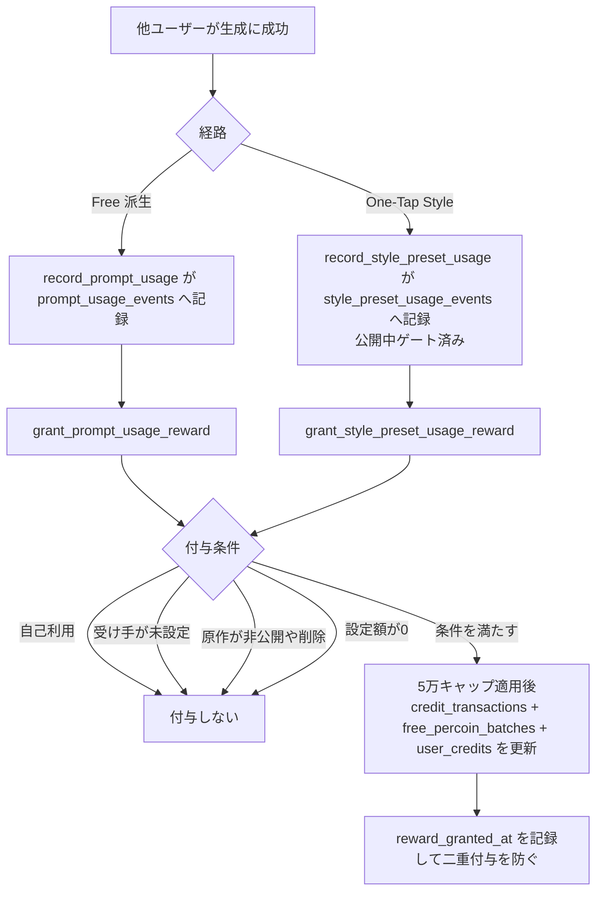
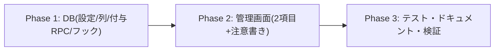

# プロンプト/スタイル利用時のクリエイター還元ペルコイン 実装計画書

作成日: 2026-08-06
ステータス: 計画（ユーザーレビュー待ち）

## ゴール

他ユーザーが生成に利用するたび、**原作者・クリエイターへペルコインを付与**する。

- **Free**: `/free` の公開プロンプトが派生生成に使われたら、原作者へ付与
- **Style**: One-Tap Style のプリセットが生成に使われたら、クリエイター（provider）へ付与
- 付与額は `/admin/percoin-defaults` から **Free 用・Style 用を別々に**設定

### 決定事項（ユーザー承認済み 2026-08-06）

| 項目 | 決定 |
|---|---|
| 付与タイミング | 他ユーザーの生成成功時（既存の利用イベント記録と同一トランザクション） |
| 設定場所 | `/admin/percoin-defaults` に2項目追加 |
| 既定値 | **0 = OFF で出荷**。admin が額を入れて有効化（完走報酬 #409 と同じ段階公開） |
| 運用値 | 通常2ペルコイン、イベント時は最大5ペルコイン |
| 自己利用 | **付与しない** |
| 公開中条件 | #479/#481 と同一の考え方（下記「公開中の定義」参照） |
| 日次上限 | **なし**（経済的に安全。下記の根拠を参照） |
| Free の対象範囲 | 既存どおり「原作投稿から派生生成」のみ。**コピペ経由は対象外である旨を注意書きに明記** |

### 日次上限なしの経済的根拠（実データで検証済み）

1生成の最低コストは **10ペルコイン**（`features/generation/lib/model-config.ts` / `shared/generation/openai-image-model.ts`。多くのモデルは20〜130）。
付与2なら利用者が10払って原作者に2入る = **系全体で常に8の純減**。イベント時5でも純減5で安全域。
加えて既存の**5万無料残高キャップ**（`get_grantable_free_percoin_amount`）が全付与に効く。

**ただしこの純減はあくまで「付与額 < 最低生成コスト(10)」が成り立つ間だけの性質**である（レビュー指摘で明確化）。
自己利用除外は**2アカウントの相互利用**を防げない: A が B のプロンプトで生成（A が10払い B が X 受取）、
B が A のプロンプトで生成（B が10払い A が X 受取）を繰り返すと、ペアの収支は `2X - 20`。
**X が11以上だと生成のたびにペアの残高が増える**。したがって「上限1000のまま運用注意で担保」では不十分で、
**新2 source の上限は DB CHECK で 5 に固定する**（ADR-004 改訂）。日次上限が不要なのは、
この上限固定が前提条件として DB に刻まれている場合に限る。

## コードベース調査結果

| 対象 | 場所 | 現状 |
|---|---|---|
| 管理画面 | `app/(app)/admin/percoin-defaults/{page,PercoinDefaultsForm}.tsx` / `app/api/admin/percoin-defaults/route.ts` | `percoin_bonus_defaults`（source PK + CHECK 4値）を読み書き。**source 追加でフォーム項目が増える構造**。ただし現行は `amount` の下限が **1**（テーブル CHECK・zod・フォーム全て） |
| 付与処理の先例 | `supabase/migrations/20260710120000_add_collection_completion_reward.sql` | `grant_collection_completion_reward`。test-and-set 冪等 / 5万キャップ / `credit_transactions` + `free_percoin_batches` + `user_credits` の3点更新 / 有効期限=JST月初+7ヶ月-1秒 / 通知 / service_role 限定。**本実装はこれを踏襲** |
| Free の記録点 | `record_prompt_usage(p_image_job_id)`（本番で `complete_image_job_with_prompt_secrets` から呼ばれる。SECURITY DEFINER） | 成功ジョブから origin/原作者/利用者を導出し `prompt_usage_events` へ冪等 INSERT。現在13件 |
| Style の記録点 | `record_style_preset_usage()` トリガー（`generated_images` AFTER INSERT） | #479 のゲート済み（published × public × is_active × 表示期間）。`style_preset_usage_events` へ INSERT。現在2,289件（うち `was_public_at_generation=true` は29件） |
| 自己利用の判定材料 | `prompt_usage_events(origin_author_id, user_id)` / `style_preset_usage_events(preset_id, user_id)` | Free は列比較で完結。Style は provider 解決（`COALESCE(sp.provider_user_id, pc.provider_user_id)` → **profiles 経由で user_id**。#478 の教訓）が必要 |
| Free の「公開中」 | `validate_derived_prompt_source` | 生成時点で「投稿済み（本人以外）× moderation_status='visible' × generation_type='free' × 根投稿 × ブロックなし × フォロワー」を強制済み。**付与時にも投稿済み・visible を再確認**する |
| キャップ・期限 | `get_grantable_free_percoin_amount` / 完走報酬の期限式 | そのまま再利用 |

## 概要図



## EARS（要件定義）

- **REQ-01**: When 他ユーザーの派生生成が成功して `prompt_usage_events` に記録されたとき, the system shall 原作者へ設定額のペルコインを付与する。
  他の人が自分のプロンプトで画像を作るたび、作者にペルコインが入る。
- **REQ-02**: When 他ユーザーの One-Tap Style 生成が記録されたとき, the system shall そのスタイルのクリエイター（provider）へ設定額を付与する。
  自分が提供したスタイルが使われるたび、クリエイターにペルコインが入る。
- **REQ-03** (状態駆動): While 利用者と受け手が同一ユーザー, the system shall 付与しない。
  自分で自分のプロンプト・スタイルを使っても増えない。
- **REQ-04** (状態駆動): While 設定額が 0（既定）, the system shall 付与も取引記録も行わない。
  admin が額を入れるまで機能は実質 OFF。
- **REQ-05** (状態駆動): While 受け手（原作者 / provider）が解決できない, the system shall 付与しない。
  クリエイター未設定のスタイルでは誰にも付与されない。
- **REQ-06** (状態駆動): While Free の原作が未投稿・非表示（moderation_status ≠ visible）, the system shall 付与しない。
  取り下げ・削除された投稿では還元されない。Style 側は記録時ゲート（#479）により公開中の生成のみが記録されるため追加条件は不要。
- **REQ-07**: When 同一の利用イベントに対して付与処理が再実行されたとき, the system shall 二重付与しない（`reward_status` の test-and-set）。
- **REQ-08** (異常系): If 付与処理が失敗したら, then the system shall 付与部分のみをロールバックし、**利用イベントの記録と生成の完了処理は確定させる**（ADR-006 の内側例外ブロック）。
  還元の失敗で生成が失敗扱いになったり、利用数・節目通知が失われたりすることはない。
- **REQ-11** (イベント駆動): When 付与に失敗した `pending` 行が一定時間残っているとき, the system shall 再処理で付与を試みる（ADR-007）。
  一時的な失敗で還元が永久に欠落することはない。
- **REQ-12** (状態駆動): While イベントが `legacy`（本機能導入前の既存イベント）, the system shall 再処理の対象にしない。
  過去の利用に遡って付与されることはない。
- **REQ-13** (状態駆動): While 同一の受け手へ**キャップ計算を行う付与**が複数並行して走る, the system shall 受け手単位で直列化し、
  5万無料残高キャップを超えない（ADR-008）。
  対象は `get_grantable_free_percoin_amount` を通る経路 = **本機能の2経路 + 完走報酬 / デイリー / ストリーク / サブスク**。
  **登録ボーナス・ツアーボーナス・紹介ボーナス・admin 付与・返金はそもそもキャップ計算を行わない既存仕様**のため、
  本要件の対象外（下記「キャップ非適用の既存経路」を参照）。
- **REQ-14** (異常系): If 再処理バッチ中の1件が失敗したら, then the system shall その行のみ `pending` に残して後続行の処理を継続し、
  試行回数に応じてバックオフする（ADR-007）。1件の恒久エラーで再処理全体が止まらない。
- **REQ-09** (状態駆動): While 受け手の無料残高が5万を超える, the system shall キャップ後の額（0を含む）で付与する（既存ルール踏襲）。
- **REQ-10** (権限): 付与 RPC は service_role 限定。額・受け手はすべて DB 内で導出し、クライアント入力を信用しない。

## ADR（設計判断記録）

### ADR-001: 付与は既存の利用イベント記録関数から呼ぶ（新しいフックを作らない）

- **Context**: 付与の発火点は「生成成功時」。候補は ①既存の記録関数内 ②新トリガー ③アプリ層。
- **Decision**: `record_prompt_usage` / `record_style_preset_usage` の INSERT 成功直後に付与 RPC を呼ぶ。
- **Reason**: 両関数とも SECURITY DEFINER で、既に「成功した生成のみ・冪等・公開中ゲート済み」という前提が揃っている。イベント行が付与単位の自然な正本になり、`ON CONFLICT DO NOTHING` で弾かれた再実行では付与も走らない。
- **Consequence**: 記録関数の責務が増える。REQ-08 のとおり付与失敗は WARNING に留め、生成完了を巻き込まない。

### ADR-002（改訂）: 付与状態は `reward_status` で持ち、`reward_granted_at` だけに頼らない

- **Context**: 二重付与は残高の直接的な毀損。当初案は `reward_granted_at IS NULL` の test-and-set のみだった。
  しかしレビュー指摘のとおり、それでは **「過去イベント」「額0でOFF中」「終端スキップ（自己利用等）」「一時的な付与失敗」** の4状態が
  すべて NULL に潰れてしまい、再処理すべき行を特定できない。
- **Decision**: 両イベントテーブルに以下を追加する。
  - `reward_status text NOT NULL DEFAULT 'pending'` — `pending` / `granted` / `skipped` / `legacy`
  - `reward_granted_at timestamptz`（付与成立時のみ）/ `reward_processed_at timestamptz`（終端確定時）
  - test-and-set は `UPDATE ... WHERE reward_status = 'pending' RETURNING` で行う（1行だけが処理に進む）
  - 終端スキップ（自己利用・受け手未解決・非公開・額0・キャップ0）は **`skipped` で確定**し、`pending` と区別する
- **Reason**: 「まだ付与できていない（再試行対象）」と「もう付与しない（確定）」を DB 上で判別できるようにするため。
  ペルコインは金銭相当のため、失敗が WARNING ログにしか残らない状態は許容しない。
- **Consequence**: 既存イベント（Free 13件・Style 2,289件）は**マイグレーションで `legacy` にバックフィル**する。
  これを怠ると再処理経路が過去分を拾って遡及付与してしまう（ADR-006 の再処理と対で必須）。

### ADR-006（新規）: 付与失敗を利用イベントから隔離する（内側の例外ブロック）

- **Context**: 付与呼び出しを既存の記録関数へ素直に足すと、**PL/pgSQL のサブトランザクション挙動により重大な副作用**が出る。
  実際の関数定義を確認した結果:
  - `record_style_preset_usage` は **関数全体が単一の `BEGIN ... EXCEPTION WHEN OTHERS` ブロック**。
    EXCEPTION 句を持つブロックはサブトランザクションを張るため、ブロック内で例外が起きると
    **同ブロック内の `style_preset_usage_events` への INSERT ごとロールバックされる**。
    このテーブルは利用数カウントと節目通知の正本なので、付与の失敗で**利用実績と通知まで消える**。
  - `record_prompt_usage` は **EXCEPTION ハンドラを一切持たない**（`RAISE EXCEPTION` はあるがハンドラではない）。
    ここで例外が伝播すると、呼び出し元の `complete_image_job_with_prompt_secrets` にもハンドラが無いため
    **生成完了トランザクション全体が中断＝生成が失敗扱いになり返金される**。
- **Decision**: 付与呼び出しは**必ず内側の独立した `BEGIN ... EXCEPTION WHEN OTHERS ... END` ブロックに入れる**。
  ロールバック範囲を「付与の test-and-set ＋ ウォレット3点更新」だけに限定し、
  利用イベントの INSERT は常に外側で確定させる。失敗時は `reward_status='pending'` のまま WARNING を出す。
- **Reason**: REQ-08（生成を巻き込まない）を、要件の宣言ではなく**構造として保証する**ため。
- **Consequence**: 失敗行は `pending` として残るので、下記の再処理経路で回収できる。

### ADR-007（新規）: 再処理経路（pending の回収）を用意する

- **Context**: 付与が一度失敗すると、現行構造では**永久に欠落する**（実装を確認して確定）:
  - Free: `complete_image_job_with_prompt_secrets` は `status='succeeded'` で**冪等early-return**するため、
    ジョブ再実行では `record_prompt_usage` が二度と呼ばれない。加えて `ON CONFLICT DO NOTHING` で INSERT も再実行されない
  - Style: トリガーは `generated_images` の AFTER INSERT で**一度しか発火しない**
- **Decision**: `reprocess_pending_usage_rewards(p_limit int)`（service_role 限定）を用意し、
  一定時間以上前の `pending` 行を拾って付与 RPC を再実行する。**pg_cron から定期実行**する
  （本番には pg_cron 稼働中。`SELECT public.monitor_creator_looks_extract_failures();` を5分ごとに回す先例あり）。
  **再処理側にも ADR-006 と同じ隔離を適用する**（レビュー指摘。pg_cron の1回の呼び出しは1トランザクションのため、
  1行の例外でバッチ全体がロールバックし、それ以前に成功した付与まで巻き戻る）:
  ```sql
  FOR v_event IN
    SELECT ... FROM ... WHERE reward_status = 'pending'
      AND created_at < now() - interval '5 minutes'
      AND (next_attempt_at IS NULL OR next_attempt_at <= now())
    ORDER BY recipient_id, created_at          -- 並行実行時のロック順序を固定
    LIMIT p_limit
    FOR UPDATE SKIP LOCKED                      -- 実行が重なっても同じ行を掴まない
  LOOP
    BEGIN
      PERFORM public.grant_..._usage_reward(v_event.id);
    EXCEPTION WHEN OTHERS THEN
      -- この行だけ pending のまま残し、後続行の処理を続ける
      -- 注: UPDATE ... SET の右辺は「更新前」の値を参照する。
      -- attempt_count をそのまま乗数に使うと初回失敗が now()+0 = 即時再試行になり、
      -- しかも 5分・10分・15分… の線形増加になってしまう(レビュー指摘)。
      -- 更新前の値に power(2, n) を掛けることで初回5分・以降10分・20分…の
      -- 指数バックオフにし、暴走防止に24時間で頭打ちにする。
      UPDATE ... SET attempt_count = attempt_count + 1,
                     last_error = SQLERRM,
                     next_attempt_at = now() + LEAST(
                       interval '5 minutes' * power(2, attempt_count),
                       interval '24 hours'
                     )
      WHERE id = v_event.id;
      RAISE WARNING 'Pending usage reward failed: event=%, error=%', v_event.id, SQLERRM;
    END;
  END LOOP;
  ```
  併せて `attempt_count int NOT NULL DEFAULT 0` / `last_error text` / `next_attempt_at timestamptz` を持たせ、
  **恒久エラーの無限再試行を指数バックオフで抑え、監視可能にする**。
- **Reason**: 金銭相当の欠損を自動回復可能にする。手動補正の運用負荷をなくす。
  行単位の隔離が無いと、古い1行が毎回失敗するだけで**後続行が恒久的に処理されなくなる**（レビュー指摘）。
- **Consequence**: 再処理は `legacy` を対象外とする（ADR-002 のバックフィルが前提）。
  再処理でも同じ付与 RPC を通すので、冪等性と各種スキップ条件は一箇所に保たれる。
  1バッチで複数受け手の advisory lock を保持することになるため、`p_limit` は小さく（50程度）保ち、
  `ORDER BY recipient_id` でロック取得順を固定する（ADR-008 のロックとの整合）。
  実装時に pg_cron で「行ごとに COMMIT する PROCEDURE」が使えるなら、そちらの方がロック保持時間が短く望ましい。
  使えるかは環境依存のため、**動作確認できた場合のみ採用**し、既定は上記の関数＋行単位例外ブロックとする。

### ADR-008（改訂）: 5万キャップは `get_grantable_free_percoin_amount` の中で受け手単位に直列化する（全経路一括）

- **Context**: `get_grantable_free_percoin_amount` は `user_credits` を**ロックせずに SELECT** している（本番の関数定義で確認）。
  利用イベントの test-and-set は**別々のイベント行**をロックするだけなので、同一クリエイターへの並行付与は直列化されない。
  無料残高 49,998 のときに2件が同時に走ると、双方が残り枠2を計算し、`balance = balance + 2` が順に適用されて **50,002** になる。
  当初案は「新規2経路にだけロックを入れる」だったが、レビュー指摘のとおり
  **advisory lock は競合する全経路が同じキーを取って初めて排他制御になる**。
  既存経路が参加しない限り、REQ-13 の「キャップを超えない」は保証できず best-effort に留まる。
- **Decision**: ロックを個々の付与 RPC ではなく、**`get_grantable_free_percoin_amount` の内部**（残高 SELECT の前）に置く。
  ```sql
  PERFORM pg_advisory_xact_lock(hashtextextended(p_user_id::text, 0));
  ```
  これで**この関数を通る全経路が自動的に同じロック規約に参加する**。トランザクションスコープのロックなので、
  関数から戻った後の呼び出し側のウォレット3点更新まで保持され、コミットで解放される。
- **Reason**: 「5万キャップを全経路の強制上限にする」というレビュー指摘の要求を、**最小の変更で・回帰リスクを増やさずに**満たせるため。
  本番で検証した事実:
  - この関数を使う既存の付与関数は **4関数（5インスタンス）**: `grant_collection_completion_reward` /
    `grant_daily_post_bonus` / `grant_streak_bonus` / `grant_subscription_percoins`（2オーバーロード）
  - **アプリ側（TS）からの直接呼び出しは 0 件** — DB 内の付与関数からしか呼ばれないため、
    参照専用プレビュー用途にロックを持ち込む副作用がない
  - 関数は **VOLATILE**（`provolatile='v'`）なので、advisory lock の呼び出しがプランナのインライン化・
    キャッシュ前提と衝突しない。SECURITY DEFINER ではないが `pg_advisory_xact_lock` は PUBLIC 実行可
  既存4関数の本体を書き換える案（レビュー提案）は、各定義を忠実に再現し直す必要があり**回帰リスクが高い**。
  1関数への追加で同じ保証が得られるなら、そちらを採る。
- **Consequence**: **キャップ計算を行う全経路（本機能2 + 完走報酬 / デイリー / ストリーク / サブスク）で REQ-13 が成立する**。
  同一ユーザーへの付与が同時に走ると片方が待つが、いずれもミリ秒オーダーの処理で実害はない。
  各付与トランザクションが取るロックは受け手1件のみのため、デッドロック経路は生じない
  （複数受け手を1トランザクションで扱う再処理側の扱いは ADR-007 に記載）。

  **ただし「全付与経路でキャップが強制される」わけではない**（レビュー指摘を受けて本番で棚卸しした結果、当初の記述は誤りだった）。
  `free_percoin_batches` へ INSERT する関数のうち、**キャップ計算をそもそも行わない既存経路**が以下のとおり存在する:

  | 経路 | キャップ計算 | 位置づけ |
  |---|---|---|
  | `handle_new_user`（登録ボーナス） | なし | 新規ユーザーは残高0のため実質的に競合しない |
  | `grant_tour_bonus`（20） | なし | **残高49,998時などに超過し得る既存仕様** |
  | `grant_referral_bonus`（50） | なし | **同上** |
  | `grant_admin_bonus` | なし | 運営の裁量付与。意図的な例外 |
  | `refund_percoins` | なし | 返金は消費分の復元であり、キャップで削ると残高が失われる。意図的な例外 |

  これらは**本機能が作った問題ではなく、キャップ導入時点からの既存挙動**（ロックの有無以前に、そもそもキャップを通らない）。
  ツアー・紹介をキャップ対象に含めるかは**「上限に達したユーザーへボーナスを配らない」という製品仕様の変更**にあたるため、
  本 PR では既存挙動を変えず、**運営判断を仰ぐ事項として明記**する（下記「運営に確認したい事項」）。

### ADR-003: 1回の付与ごとの通知は出さない

- **Context**: 完走報酬（#409）は付与ごとに通知を作る。
- **Decision**: 本機能では通知を作らない。
- **Reason**: 生成のたびに発火するため通知が洪水になる。利用の節目通知（B案 #477 / #478）が既に「◯回使われました」を伝えており、役割が重複する。付与はペルコイン履歴で確認できる。
- **Consequence**: 「いつ・何で増えたか」は取引履歴の metadata（origin_post_id / preset_id）で追える設計にする。

### ADR-004（改訂）: 設定は既存 `percoin_bonus_defaults` に source 追加。新 source は **0〜5** に固定

- **Context**: 現行 CHECK は `amount BETWEEN 1 AND 1000`。既定 0（OFF）には 0 が必要。
  さらにレビュー指摘のとおり、**上限1000のままでは admin の入力ミス1回で経済モデルの前提（付与額 < 最低生成コスト10）が崩れる**。
  2アカウントの相互利用では X≥11 で残高が純増するため、上限は運用注意ではなく**不変条件として DB に置く**必要がある。
- **Decision**: `source` の CHECK に2値を追加し、`amount` の CHECK を条件付きにする。
  ```sql
  CHECK (
    (source IN ('prompt_usage_reward', 'style_usage_reward') AND amount BETWEEN 0 AND 5)
    OR
    (source IN ('signup_bonus', 'tour_bonus', 'referral', 'daily_post') AND amount BETWEEN 1 AND 1000)
  )
  ```
  zod・フォームも新2 source のみ `min 0 / max 5` に揃える。
- **Reason**: 既存ボーナスの「必ず1以上」保証を壊さず、還元だけ OFF 可能にしつつ、
  **経済的な安全域（運用値2、イベント時最大5）を DB が強制する**。5 を超える施策が必要になったら、
  最低生成コストとの関係を再レビューするマイグレーションとして明示的に上げる。
- **Consequence**: CHECK が条件分岐を持つ。API/フォームも source ごとに下限・上限を出し分ける。
  境界テストは新2 source が `0/5` 許可・`6`（および 1000）拒否、既存4 source が `1/1000` 許可・`0` 拒否。

### ADR-005: Style の provider 解決は profiles 経由で user_id を得る

- **Context**: `style_presets.provider_user_id` / `preset_categories.provider_user_id` は **profiles.id** を指す。`profiles.id = user_id` は制約のない偶然の一致（#478 で確認済み）。
- **Decision**: `COALESCE(sp.provider_user_id, pc.provider_user_id)` → `profiles` を join して `user_id` を得る。
- **Reason**: 誤ったユーザーへの付与を防ぐ。クレジット表示・クリエイター通知と同一の解決規則で一貫させる。

## 実装計画



### Phase 1: DB

- [ ] マイグレーション `2026080615xxxx_add_creator_usage_percoin_reward.sql`
  - `percoin_bonus_defaults` の CHECK 更新（source に `prompt_usage_reward` / `style_usage_reward`、
    **amount は新 source のみ 0〜5・既存4 source は 1〜1000**）+ 両 source を **amount 0** で seed
  - `credit_transactions.transaction_type` / `free_percoin_batches.source` の CHECK に2値追加（#409 と同じ手順で現行定義に追加）
  - 両イベントテーブルに `reward_status`（既定 `pending`）/ `reward_granted_at` / `reward_processed_at`
    / `attempt_count` / `last_error` / `next_attempt_at` 追加（ADR-002 / ADR-007）
  - **既存イベントを `legacy` にバックフィル**（Free 13件・Style 2,289件。遡及付与の防止に必須）
  - **`get_grantable_free_percoin_amount` に受け手単位の advisory lock を追加**（ADR-008 改訂）。
    これで既存4関数（`grant_collection_completion_reward` / `grant_daily_post_bonus` / `grant_streak_bonus` /
    `grant_subscription_percoins` ×2）を含む**全付与経路が同じロック規約に参加**する（既存関数の本体は変更しない）
  - `grant_prompt_usage_reward(p_event_id uuid)` / `grant_style_preset_usage_reward(p_event_id uuid)`
    （service_role 限定 / `reward_status='pending'` の test-and-set /
    自己利用・受け手未解決・非公開・額0・キャップ0 は **`skipped` で確定** / 付与成立時のみ `granted` /
    3点更新・期限式は #409 と同一）
  - `record_prompt_usage` / `record_style_preset_usage` に付与呼び出しを追加。
    **必ず内側の `BEGIN ... EXCEPTION WHEN OTHERS` ブロックに入れる**（ADR-006）。
    Style 側は既存の外側ハンドラに巻き込まれない位置に置き、イベント INSERT を確定させてから呼ぶ
  - `reprocess_pending_usage_rewards(p_limit int)`（service_role 限定・`legacy` 除外・一定時間経過した `pending` のみ・
    **行単位の内側例外ブロック + `FOR UPDATE SKIP LOCKED` + `ORDER BY recipient_id` + バックオフ更新**。ADR-007）
  - pg_cron 登録（既存の `monitor_creator_looks_extract_failures` と同型の SQL 関数ジョブ）
  - カタログ検証 + **ロールバックされるサブトランザクションでの実データ dry-run**
    （自己利用 / 額0 / 非公開原作 / 正常付与 / 二重実行 / **付与例外時にイベント INSERT が残ること** /
    **`legacy` が再処理されないこと** の各遷移）
  - `NOTIFY pgrst, 'reload schema'`（関数追加のため）

### Phase 2: 管理画面

- [ ] `app/api/admin/percoin-defaults/route.ts` — 新2 source を zod enum に追加し、**新 source は min(0) / max(5)**、既存4 source は従来どおり 1〜1000（ADR-004）
- [ ] `app/(app)/admin/percoin-defaults/page.tsx` — ラベル追加（「Freeプロンプトが利用された時の付与数（作者へ）」「One-Tap Styleが利用された時の付与数（クリエイターへ）」）
- [ ] `PercoinDefaultsForm.tsx` — source 別の下限・上限（新2項目は **0〜5**、0 = 付与なし）+ **注意書き**を表示
  - 「0 にすると付与しません」
  - 「**設定できるのは0〜5です**（1生成の最低コスト10より十分小さい値に制限しています）」
  - 「自分自身の利用では付与されません」
  - 「**Free はアプリ内の『このプロンプトで作る』経由の生成のみ対象です。プロンプトをコピーして貼り付けた生成は対象外です**」
  - 「公開中（審査中・取り下げ・非公開カテゴリを除く）の利用のみが対象です」

### Phase 3: テスト・ドキュメント・検証

- [ ] 付与ロジックのテスト（DB 関数のため、dry-run + 既存パターンに沿った統合テスト）
- [ ] **付与例外時にイベント INSERT が残る**ことの回帰テスト（ADR-006。意図的に失敗させる dry-run）
- [ ] **同一受け手への並行付与テスト**（2セッションでキャップ超過が起きないこと。ADR-008）
- [ ] 管理画面 API のバリデーションテスト（新2 source は `0/5` 許可・`6`/`1000` 拒否、既存4 source は `1/1000` 許可・`0` 拒否）
- [ ] `docs/architecture/data.ja.md` / `data.en.md`（RPC 一覧・トリガー一覧）+ `.cursor/rules/database-design.mdc`
- [ ] `npm run lint` / `typecheck` / `test` / `build -- --webpack`

## 修正対象ファイル一覧

| ファイル | 操作 | 変更内容 |
|---|---|---|
| `supabase/migrations/2026080615xxxx_add_creator_usage_percoin_reward.sql` | 新規 | 設定 source 追加(0〜5) / 付与状態列 + legacy バックフィル / 付与RPC2本(advisory lock) / 再処理RPC + cron / 記録関数のフック(内側例外ブロック) / 検証 |
| `app/api/admin/percoin-defaults/route.ts` | 修正 | 新2 source の受領と下限出し分け |
| `app/(app)/admin/percoin-defaults/page.tsx` | 修正 | ラベル定義 |
| `app/(app)/admin/percoin-defaults/PercoinDefaultsForm.tsx` | 修正 | 下限出し分け + 注意書き |
| `tests/...` | 新規/修正 | API バリデーション・付与条件 |
| `docs/architecture/data.{ja,en}.md`・`.cursor/rules/database-design.mdc` | 修正 | RPC/トリガー/テーブル同期 |

## 品質・テスト観点

- [ ] **経済安全性**: 自己利用ゼロ + **DB CHECK で上限5**（2アカウント相互利用でも純減が保たれる）
- [ ] **二重付与なし**: 同一イベントの再実行で 0 件
- [ ] **生成の巻き添えなし**: 付与失敗時も生成完了 RPC は成功し、**利用イベント行と節目通知が残る**（ADR-006 の回帰テスト）
- [ ] **再処理**: `pending` は回収され、`legacy` / `skipped` は再処理されない
- [ ] **並行制御**: 同一受け手へ2セッションから同時付与してもキャップを超えない（**並行テストを実施**）。
      **本機能同士に加え、キャップ計算を行う既存ボーナス（例: デイリー）との同時実行**でも超えないこと
- [ ] **再処理の堅牢性**: バッチ内の1件が失敗しても、それ以前に成功した付与がロールバックされず、後続行が処理される
- [ ] **バックオフ**: 初回失敗で即時再試行にならず 5分 → 10分 → 20分…と伸び、24時間で頭打ちになる（境界テスト）
- [ ] **既存付与の非回帰**: キャップ関数の変更後も既存4関数（完走報酬・デイリー・ストリーク・サブスク）が従来どおり動く。
      キャップを通らない経路（登録・ツアー・紹介・admin・返金）の挙動も変わらないこと
- [ ] **権限**: 付与 RPC / 再処理 RPC は authenticated から実行不可
- [ ] **既存ボーナス不変**: 登録/ツアー/紹介/デイリーの 1〜1000 と現行額が変わらない

## ロールバック方針

- 既定 0（OFF）出荷のため、**適用しただけでは1コインも動かない**。問題時は admin で額を 0 に戻せば即停止
  （額0は `skipped` 確定なので、後から額を入れても過去分に遡って付与されない）
- 列・source 追加は加算のみ。down は明示しない（設定値消失リスク回避、既存方針）
- 再処理 cron は `cron.unschedule` で単独停止できる

## 別タスク（本 PR のスコープ外）

当初「別タスク」としていた**キャップ計算経路への advisory lock 統一**は、
キャップ関数自体にロックを置く方式（ADR-008 改訂）により**本 PR で解決する**。

## キャップ非適用の既存経路（運営判断: 現状維持 2026-08-06）

レビュー過程で判明した**既存の挙動**です。本機能とは独立しており、**運営判断により現状を維持します**。

- **ツアーボーナス（20）・紹介ボーナス（50）は5万キャップを通らない**。
  無料残高が49,998でも満額が付与され、5万を超えます（キャップ導入当初からの挙動）。
- これをキャップ対象に含めると「上限に達したユーザーにはボーナスを配らない」という**製品仕様の変更**になるため、
  本 PR では変更しない（**運営が現状維持を選択済み**）。将来必要になれば別タスクで扱う。
- `handle_new_user`（登録）は新規ユーザーの残高が0のため実質的に競合しない。
- `grant_admin_bonus`（運営裁量）と `refund_percoins`（返金は消費分の復元）は、
  キャップを通さないことに合理性がある**意図的な例外**。

## 適用順序

RPC の新規追加のみでシグネチャ変更を伴わないため、**マージ→デプロイ→マイグレーション適用**の通常順で可（アプリは新 RPC を直接呼ばない）。
管理画面の新項目は行が seed 済みで初めて表示されるため、**マイグレーション適用後に admin 画面で額を設定**して有効化する。
