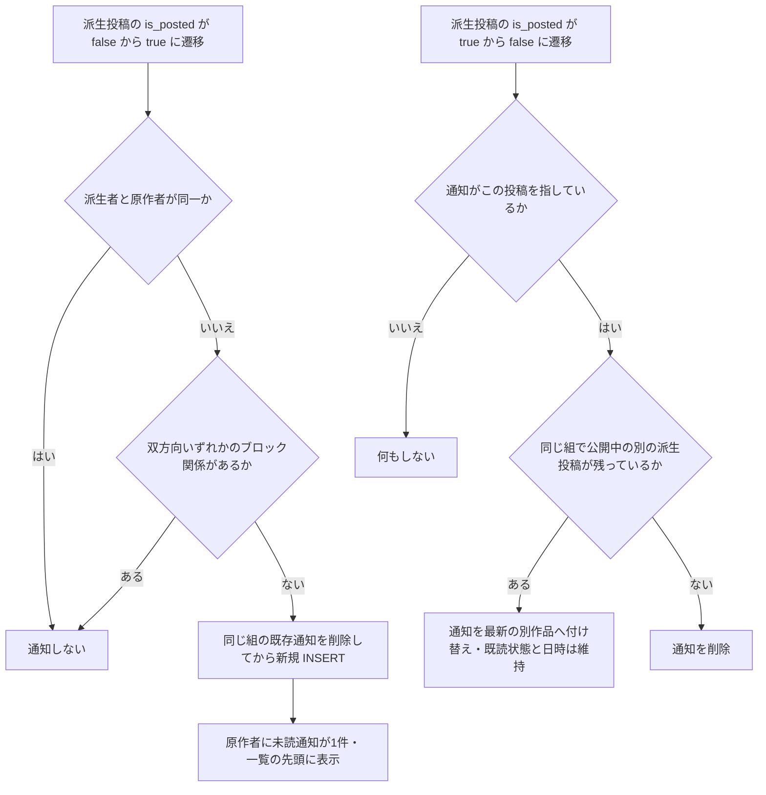
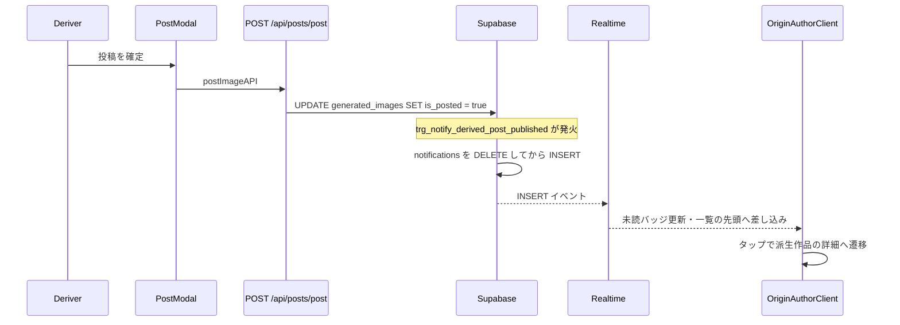
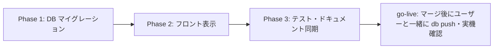

# 派生投稿の通知 実装計画書

- 作成日: 2026-08-04
- ステータス: レビュー待ち
- 前提機能: `/free` プロンプト公開・非公開モード（`docs/planning/free-prompt-private-mode-implementation-plan.md`、PR #464〜#474 で本番稼働済み）
- 関連する先行計画: `docs/planning/post-moderation-notification-implementation-plan.md`（通知 type 追加の直近の前例）

## 0. 背景と目的

`/free` の派生生成（他ユーザーのプロンプトを使った生成）が本番稼働したが、原作者は自分のプロンプトが使われて投稿されたことを知る手段がない。派生投稿には原作クレジットが公開表示されるため関係は既に公開情報であり、**派生投稿が「投稿」されたタイミングで原作者に実名（ニックネーム）通知を届け、承認欲求のループを作る**。

ヒアリングでの決定事項:

| 論点 | 決定 |
|------|------|
| 通知タイミング | 生成時ではなく**投稿時**（A案先行） |
| 実名/匿名 | **実名**（原作クレジットで既に公開されている関係のため） |
| まとめ方 | **原作の投稿ごとに1件**（同一の派生者×原作の組は最大1件。新しい投稿で更新され一覧先頭へ・未読に戻る） |
| 連投対策 | フォロー通知の先例踏襲（取消時に通知も削除 + 組ごと最大1件） |
| ブロック | 双方向いずれかのブロック関係があれば通知しない |
| 通知OFF設定列 | **追加しない**（設定画面自体が未実装のため。次のタスクで設定画面と一緒に） |
| 生成時の匿名集約通知（B案） | **スコープ外**（A案の効果を見てから） |

## 1. コードベース調査結果

### 1-1. 通知基盤（DB 層）

- **`create_notification` の最新定義**は `supabase/migrations/20251215150320_notifications_comment_per_notification.sql:96`。自己通知スキップ・通知設定チェック（like/comment/follow のみ）・UPSERT を内蔵するが、
  - UPSERT の実体は部分ユニークインデックス `notifications_unique_like_follow_idx (recipient_id, actor_id, type, entity_type, entity_id) WHERE type IN ('like','follow')` に依存しており、**新 type では衝突せず毎回 INSERT されて重複する**
  - unique_violation 後の UPDATE は `created_at/title/body/data` のみ更新し、**`is_read`/`read_at` をリセットしない**（案1の「未読に戻る」を満たせない）
  - → 本機能では `create_notification` を使わず、モデレーション outbox dispatcher（`20260728130200:106-107`）と同様に**専用トリガー関数から notifications へ直接 DELETE+INSERT** する
- **type の CHECK 制約**の最新は `20260728130000_extend_notifications_for_post_moderation.sql:22-44`（16値）。追加は DROP → 全列挙 ADD が慣例。`entity_type` は既存 `'post'` を再利用するため変更不要（モデレーション通知と同じ方針）
- **「元イベント消滅 → 通知削除」トリガーの先例**: `delete_notification_on_like_removal` / `delete_notification_on_follow_removal` / `delete_notification_on_comment_deletion`（いずれも `20251214185550_notifications_physical_delete.sql`）。5列完全一致で DELETE する
- **`generated_images` の既存トリガー**は4本。手本は `trg_notify_creator_looks_on_publication`（`20260603100200:135-146`）: `AFTER UPDATE OF is_posted ... WHEN (OLD.is_posted IS DISTINCT FROM NEW.is_posted AND NEW.is_posted = true AND ...)` で「遷移のときだけ」発火し、WHEN 句と関数内ガードを二重化する
- **ホットテーブル注意**: `generated_images` は `record_post_impressions` が集合 UPDATE で叩くため、**新トリガーは必ず `UPDATE OF is_posted` で列を限定する**（`20260730200000:248-255` のコメント）
- **ブロック**: `public.user_blocks (blocker_id, blocked_id)`（`20260208193000:73-106`）。双方向判定の実例は `validate_derived_prompt_source` 最新版 `20260731110000:110-119`
- **系譜列**: `generated_images.source_post_id` / `source_author_id` はトリガー保護済みの信頼できる列（`enforce_generated_image_lineage`）。通知の宛先は `NEW.source_author_id` から追加クエリなしで取れる

### 1-2. 投稿・取消の経路（is_posted の書き換え地点）

| 経路 | ファイル | 内容 |
|------|---------|------|
| 投稿（サーバー） | `features/generation/lib/server-database.ts:122-155` `postImageServer` | `{is_posted: true, caption, posted_at: now}` を UPDATE。`/api/posts/post` と **`/api/posts/update`（キャプション編集）の両方から呼ばれ、編集でも `is_posted=true` を再セットする** |
| 投稿（ブラウザ直） | `features/generation/lib/database.ts:162-185` `postImage` | ブラウザクライアントから `generated_images` を直接 UPDATE する経路が現存（`20260728160000:25-29` に明記）。**API ルートにフックを置くと取りこぼす → DB トリガーが必須** |
| 取消 | `features/generation/lib/server-database.ts:163-187` `unpostImageServer` | `{is_posted: false, caption: null, posted_at: null}` |
| 公開停止（reject） | `apply_admin_moderation_decision_v2`（`20260728160000:162-171`） | `moderation_status='removed'` かつ `is_posted=false`（`posted_at` は保持） |
| 異議認容（復帰） | `decide_post_moderation_appeal`（同ファイル） | `moderation_status='visible'` かつ `is_posted=true` を同一 UPDATE で |
| 退会 | `20260207120000:148` | 一括 `SET is_posted = false` |
| 物理削除 | `app/api/my-page/images/route.ts:131-136` | **未投稿行のみ**削除可能（投稿済みは削除できない）→ 削除は必ず取消を経由するため `AFTER DELETE` トリガーは不要 |

コレクション完走投稿（`app/api/collections/completions/[id]/post/route.ts`）も `is_posted` を触るが `source_post_id IS NULL` のため WHEN 句で自然に除外される。

### 1-3. 表示パイプライン（アプリ層）

- **type を見るのは `features/notifications/lib/presentation.ts:115` の switch だけ**。見出し・本文は type ごとに i18n キーで組み立て、DB の `title`/`body` はフォールバック（`default:` 分岐は落ちずに DB 文言を素通しする）
- **遷移先**は `features/notifications/hooks/useNotifications.ts:426-499` `handleNotificationClick`。`entity_type==='post'` は `/posts/{entity_id}` へ飛ぶ汎用分岐がある（:475-480）
- **サムネイル**は `features/notifications/lib/server-api.ts:10-31` `getResolvedImageId` が唯一の解決ルール（`entity_type==='post'` → `entity_id`）。ここに新 type の分岐を足せば派生作品側のサムネが出る
- **アバタータップ**は `NotificationList.tsx:133-146` の許可リスト（現在 `like`/`comment` のみ）
- **i18n**: `messages/ja.ts:1720-1775` の `notifications` 名前空間（フラット）。ja が型の親で、**残り14ロケールにキーを足さないと `tsc` が落ちる**（これが唯一の網羅性強制）
- **バッジ・一覧の即時反映**: `UnreadNotificationProvider` が Realtime の INSERT/UPDATE を購読して未読数を再取得、`useNotifications` は **INSERT イベントで一覧の先頭に差し込む**（UPDATE では差し込まない）→ 案1を「UPDATE」でなく「DELETE+INSERT」で実装すると、既存クライアントコードのまま新着が即時反映される
- Realtime で届いた生の行は enrichment（actor 名・サムネ）を通らないため、到着直後は actor 名がフォールバック表示になる（like/follow と同じ既存挙動。`data.image_url` を焼き込めばサムネだけは出る）
- **タブ割当・API ルート（4本）・`route-copy.ts` は type 非依存で変更不要**。新 type は自動的に「アクティビティ」タブに出る

### 1-4. テスト資産

- `tests/unit/lib/notification-presentation.test.ts`（見出し組み立て）、`tests/unit/features/notifications/use-notifications.test.tsx`（遷移とフック契約。モック雛形あり）、`tests/integration/api/notifications-route.test.ts`（enrichment 込みの一覧 API）が既存パターン
- **トリガー/RPC の SQL 自動テストは存在しない**（pgTAP なし）→ DB 部分はマイグレーション内の検証 DO ブロック + Supabase Preview + 実機で検証する（`20260731110000` の「実在データで関数本体を最後まで通す」方式を踏襲）

## 2. 概要図

### 2-1. 通知の発生と消滅

「組」= 原作者 recipient・派生者 actor・原作投稿 entity の3つ組。取消・公開停止・退会一括取消はいずれも `is_posted true→false` なので同じ経路で処理される。

### 2-2. 投稿から通知表示までのシーケンス

ブラウザ直 UPDATE の投稿経路（`postImage`）でも同じトリガーが発火する。API ルート側には一切フックを置かない。

## 3. EARS 要件

| ID | タイプ | 要件 |
|----|--------|------|
| REQ-001 | イベント | When a derived post (`source_post_id IS NOT NULL`) transitions `is_posted` from false to true, the system shall create a notification of type `derived_post_published` addressed to the origin author (`source_author_id`), with `entity_type='post'` and `entity_id` = the origin post id. 派生投稿が公開されたとき、原作者へ `derived_post_published` 通知を作成する。entity は原作投稿。 |
| REQ-002 | イベント | When a notification already exists for the same (recipient, actor, origin post) key at publication time, the system shall delete it and insert a fresh one, so the notification points to the latest derived work, returns to unread, and moves to the top of the list. 同じ組の通知が既にあれば削除してから作り直す（最新作を指す・未読に戻る・一覧先頭へ）。組ごとに常に最大1件。 |
| REQ-003 | 異常系 | If the deriver is the origin author, then the system shall not create a notification. 自分の原作から自分で派生した場合は通知しない。 |
| REQ-004 | 異常系 | If a block relationship exists in either direction between the deriver and the origin author, then the system shall not create a notification. 双方向いずれかのブロック関係があれば通知しない（生成後にブロックされた場合を含む）。 |
| REQ-005 | イベント | When the derived post referenced by a notification transitions `is_posted` from true to false (user unpost, moderation removal, account-deletion bulk unpost), the system shall repoint the notification to the latest still-published derived work of the same key, or delete it when none remains. Repointing shall not alter `created_at` or read state. 通知が指す派生投稿が非公開になったら、同じ組の公開中の最新作へ付け替え、無ければ削除する。付け替えでは日時・既読状態を変えない。 |
| REQ-006 | 状態駆動 | While the notification is rendered, the system shall display the deriver's nickname and avatar, the derived work's thumbnail, and a localized headline in all 15 locales that includes the origin caption when present. 表示時は派生者の実名・アバター・派生作品のサムネイルを出し、原作キャプションがあれば見出しに含める（15言語）。 |
| REQ-007 | イベント | When the recipient taps the notification, the system shall navigate to the derived post detail (`/posts/{data.derived_post_id}`); if `data.derived_post_id` is missing, the system shall fall back to the origin post detail (`/posts/{entity_id}`). タップで派生作品の詳細へ。data 欠損時は原作詳細へフォールバック。 |
| REQ-008 | イベント | When the recipient taps the deriver's avatar, the system shall navigate to the deriver's profile. アバタータップで派生者のプロフィールへ。 |
| REQ-009 | 異常系 | If notification creation, repointing, or deletion fails, then the system shall log a warning and shall not fail the posting or unposting transaction. 通知処理の失敗は WARNING に留め、投稿・取消そのものを失敗させない。 |
| REQ-010 | 異常系 | If `generated_images` is updated without an actual `is_posted` transition (e.g., caption edits via `/api/posts/update` that re-send `is_posted=true`), then the system shall not fire the notification trigger. キャプション編集など遷移を伴わない更新では発火しない（WHEN 句で遷移を要求）。 |
| REQ-011 | 状態駆動 | The system shall not fire derived-post notification triggers for rows whose `source_post_id` is NULL (root posts, collection completion posts). root 投稿・コレクション完走投稿では発火しない。 |
| REQ-012 | オプション | Where notification preferences are concerned, the system shall send `derived_post_published` regardless of `notification_preferences` (no per-type toggle in this iteration). 通知OFF設定は本イテレーションでは提供しない（bonus・moderation 系と同じ扱い。設定画面実装時にまとめて対応）。 |

## 4. ADR（設計判断記録）

### ADR-001: 集約単位は「原作者 × 派生者 × 原作投稿」で最大1件

- **Context**: 同じ派生者の連投で通知欄が埋まるのは避けたいが、「どの原作が使われたか」は承認欲求の核なので潰したくない。
- **Decision**: ユニークキーを (recipient_id, actor_id, type, entity_type, entity_id=原作投稿ID) とし、組ごとに最大1件。部分ユニークインデックス `notifications_unique_derived_post_idx` で強制する。
- **Reason**: ヒアリングで案1として合意。like/follow の既存5列キーと同じ形なので、削除トリガーも既存パターンの5列完全一致がそのまま使える。
- **Consequence**: 同じ原作からの2作品目以降は通知からは最新作しか辿れない（利用数カウントやタイムラインで補完）。

### ADR-002: DB トリガー方式（outbox 不採用・API フック不採用）

- **Context**: 投稿経路はサーバー経由 `postImageServer` とブラウザ直 UPDATE `postImage` の2系統ある。モデレーション通知は outbox + pg_cron dispatcher を採用した。
- **Decision**: `AFTER UPDATE OF is_posted` の DB トリガーで通知を直接 INSERT する（creator_looks 公開通知 `trg_notify_creator_looks_on_publication` と同型）。
- **Reason**: API フックは直 UPDATE 経路を取りこぼす。outbox は「欠落が救済機会の喪失になる」moderation 用の重装備で、本通知は欠落してもお祝いが1回消えるだけ。発生源が `generated_images` の UPDATE そのものなので、同一トランザクション内トリガーが最も単純かつ確実。
- **Consequence**: 通知処理は投稿トランザクションに同居する。関数全体を EXCEPTION ガードで包み、失敗しても投稿を巻き込まない（REQ-009。notify_on_follow と同じ二重ガード）。

### ADR-003: entity は原作投稿、遷移とサムネイルは data.derived_post_id

- **Context**: entity_id を派生投稿にするとタップ遷移とサムネイルは既存コードのまま動くが、集約キーが投稿ごとになり案1にならない。原作にすると集約は自然だが、遷移・サムネが原作側を向いてしまう。
- **Decision**: `entity_id` = 原作投稿ID（集約キー）。`data.derived_post_id` に派生投稿IDを持たせ、`handleNotificationClick` に専用分岐、`getResolvedImageId` に type 分岐を1つずつ足して派生作品側へ向ける。
- **Reason**: 集約は DB の制約で強制すべきで、表示の向き先はアプリ層の数行で変えられる。逆方向（entity=派生投稿で集約を後付け）は DB 側が複雑になる。
- **Consequence**: `data.derived_post_id` が欠けた場合は原作詳細へのフォールバックになる（安全側）。data には Realtime 直後表示用の `image_url`（派生作品）と見出し用の `origin_caption` スナップショットも焼き込む。キャプションはスナップショットなので原作の後編集には追従しない（許容）。

### ADR-004: UPSERT ではなく DELETE + INSERT で更新する

- **Context**: `create_notification` の UPSERT は `is_read` をリセットせず、Realtime の UPDATE イベントでは `useNotifications` が一覧に差し込まない。案1は「更新されたら未読に戻り一覧先頭へ」を要求する。
- **Decision**: 専用トリガー関数内で同一キーの既存通知を DELETE してから INSERT する。`create_notification` は使わない（自己通知スキップ・ブロック判定は関数内で自前実装）。部分ユニークインデックスは並行 INSERT の競合バックストップとして維持する（unique_violation は EXCEPTION ガードが吸収し、先勝ちの1件が残る）。
- **Reason**: DELETE+INSERT なら未読リセット・created_at 更新・Realtime INSERT イベントの3つが自動で揃い、クライアント側の変更が不要。`create_notification` の5回目の再定義も回避できる。
- **Consequence**: 通知IDは更新のたびに変わる（既存機能に通知IDへの永続参照はないため影響なし）。

### ADR-005: 再投稿では再通知する（one-shot 列を設けない）

- **Context**: creator_looks は `creator_notified_at` の one-shot 列で「一度だけ通知」を保証した。本機能では取消→再投稿の往復で通知が再発火する。
- **Decision**: one-shot 列は設けず、フォロー通知と同じ「取消で消え、再投稿で再通知」の対称性を採る。
- **Reason**: ヒアリングで合意済み（フォロー通知の先例踏襲）。組ごと最大1件の制約が往復スパムの上限になる（未読は常に1件を超えない）。モデレーション認容で復帰した場合に通知が再生成されるのも自然な挙動。
- **Consequence**: 意図的な取消→再投稿の繰り返しで原作者のバッジを何度も点灯させられる（フォローの付け外しと同程度の既知の許容リスク）。

### ADR-006: 通知OFF設定列は追加しない

- **Context**: `notification_preferences` は like/comment/follow の3列のみで、設定画面自体が存在しない（全員 ON 固定）。
- **Decision**: 列追加も `create_notification` 側のチェック追加も行わない（bonus・creator_looks・moderation 系と同じ扱い）。
- **Reason**: ヒアリングで「足さない。次のタスクで追加しましょう」と合意。UI のない列は死蔵になる。
- **Consequence**: 通知設定画面を作るタスクで、既存の設定なしタイプとまとめて列設計する。

## 5. 実装計画（フェーズ + TODO）

### フェーズ間の依存関係

DB とフロントはどちらが先に本番へ出ても壊れない（新 type の行はトリガー適用まで発生せず、発生後も presentation の default 分岐が DB 文言で表示する）。標準運用どおり **PR マージ → Vercel デプロイ → ユーザーと一緒に `supabase db push` → 実機確認** の順とする。

### Phase 1: DB マイグレーション

目的: 通知の発生・更新・消滅を DB 層で完結させる
ビルド確認: `npm run lint` / `typecheck` / `test` / `build -- --webpack` が通る（このフェーズはフロント無変更なので現状維持）。SQL は PR の Supabase Preview で検証

- [ ] マイグレーション `add_derived_post_notification.sql` を作成（1ファイル、以下を含む）
  - [ ] `notifications_type_check` を DROP → `'derived_post_published'` を加えた17値で ADD（`20260728130000` の書式踏襲。DOWN 不可の理由コメントも同様）
  - [ ] 部分ユニークインデックス `notifications_unique_derived_post_idx ON notifications (recipient_id, actor_id, type, entity_type, entity_id) WHERE type = 'derived_post_published'`
  - [ ] 関数 `notify_on_derived_post_published()`（SECURITY DEFINER / `SET search_path = public, pg_temp`。自己派生スキップ → 双方向ブロックスキップ → profiles からニックネーム・原作から caption 取得 → 同一キー DELETE → INSERT。data は `{derived_post_id, origin_caption, image_url}`。DB フォールバック title は `'<ニックネーム>があなたのプロンプトで作品を投稿しました'`、body は `''`。全体を EXCEPTION WHEN OTHERS → RAISE WARNING で包む）
  - [ ] トリガー `trg_notify_derived_post_published`: `AFTER UPDATE OF is_posted ON generated_images FOR EACH ROW WHEN (OLD.is_posted IS DISTINCT FROM NEW.is_posted AND NEW.is_posted = true AND NEW.source_post_id IS NOT NULL)`（WHEN 句の条件を関数内でも再チェック＝二重ガードの慣例）
  - [ ] 関数 `remove_derived_post_notification()`（通知が OLD.id を指しているときだけ処理。同じ組で `is_posted AND moderation_status='visible'` の最新作を探し、あれば `data.derived_post_id`/`image_url` だけ付け替え（created_at・is_read は不変）、なければ5列一致 + `data->>'derived_post_id'` 一致で DELETE。EXCEPTION ガード付き）
  - [ ] トリガー `trg_remove_derived_post_notification`: `AFTER UPDATE OF is_posted ... WHEN (OLD.is_posted = true AND NEW.is_posted = false AND OLD.source_post_id IS NOT NULL)`
  - [ ] 適用後検証 DO ブロック: (a) CHECK に新値が入ったか、(b) インデックス・トリガー2本・関数2本の存在、(c) 実在ユーザー2名を選び、原作（free・投稿済）＋派生行を実テーブルに INSERT → `is_posted` を true に UPDATE して通知1件を確認 → 同じ組で2件目を投稿して件数が1のまま・derived_post_id が付け替わることを確認 → 取消で削除されることを確認 → **検証行と通知を必ず全削除**。自己派生でスキップされることも確認。ユーザーが2名未満なら NOTICE でスキップ（`20260731110000` の「実在データで本体を最後まで通す」方式）
  - [ ] `NOTIFY pgrst` は不要（Data API に露出する関数シグネチャの変更がないため。`20260728130000` と同じ）
  - [ ] COMMIT 後に DOWN セクション（トリガー2本・関数2本・インデックスの DROP。CHECK は該当行削除後でないと戻せない旨を明記）
- [ ] `supabase db diff` 相当の内容確認と Supabase Preview での SQL 検証（**本番適用はユーザーと一緒に go-live 時**）

### Phase 2: フロント表示

目的: 新 type を一覧で正しく表示し、派生作品へ誘導する
ビルド確認: `npm run lint` / `typecheck` / `test` / `build -- --webpack` すべて緑（15ロケールのキー欠落は typecheck が検出）

- [ ] `features/notifications/types.ts`: `NotificationType` に `'derived_post_published'`、`data` に `derived_post_id?: string` / `origin_caption?: string | null` を追加
- [ ] `features/notifications/lib/presentation.ts`: `NotificationTranslationKey` に `derivedPostTitle` / `derivedPostTitleNoCaption` を追加し、switch に case 追加（`origin_caption` があれば約20文字に切り詰めて `{origin}` に差し込み、なければ NoCaption 版。body は `""`）
- [ ] `messages/ja.ts` の `notifications` 名前空間に2キー追加（例: `derivedPostTitle: "{actor}が「{origin}」のプロンプトで作品を投稿しました"` / `derivedPostTitleNoCaption: "{actor}があなたのプロンプトで作品を投稿しました"`）
- [ ] 残り14ロケール（en/ko/zh-CN/zh-TW/es/pt/fr/de/it/id/th/vi/hi/ar）に同キーを追加
- [ ] `features/notifications/hooks/useNotifications.ts` `handleNotificationClick`: `entity_type` 汎用分岐より前に `type === 'derived_post_published' && data.derived_post_id` → `/posts/{derived_post_id}?from=notifications` の分岐を追加（data 欠損時は既存の post 分岐で原作へフォールバック＝REQ-007）
- [ ] `features/notifications/lib/server-api.ts` `getResolvedImageId`: 新 type のとき `data.derived_post_id ?? entity_id` を返す分岐を追加（サムネ・caption enrichment が派生作品側になる）
- [ ] `features/notifications/components/NotificationList.tsx`: `getNotificationIcon` に case 追加（Sparkles 系アイコン）、`handleActorIconClick` の許可リストに追加（アバタータップで派生者プロフィールへ＝REQ-008）

### Phase 3: テスト・ドキュメント同期

目的: 回帰を固定し、正典ドキュメントを実装に同期する
ビルド確認: 全検証コマンド緑

- [ ] `tests/unit/lib/notification-presentation.test.ts` に追加: 原作キャプションあり／なし／長文切り詰め／actor フォールバックの4ケース
- [ ] `tests/unit/features/notifications/use-notifications.test.tsx` に追加: タップで `/posts/{derived_post_id}` へ遷移、`derived_post_id` 欠損時は `/posts/{entity_id}` フォールバック
- [ ] `tests/integration/api/notifications-route.test.ts` に追加: 新 type の enrichment で派生作品のサムネが付くこと（`getResolvedImageId` の分岐を経由）
- [ ] `docs/architecture/data.ja.md` / `data.en.md`: Trigger map に2行追加（notify / remove）、通知 type 一覧の記述があれば更新
- [ ] `.cursor/rules/database-design.mdc`: notifications の type 列挙とインデックスの記述を更新
- [ ] 実機確認手順の整理（下記テスト観点の「実機確認」）

### 見積り

Phase 1: 0.5日 / Phase 2: 0.5〜1日 / Phase 3: 0.5日 — 合計 **1.5〜2日**。PR は1本（`feat/derived-post-notification` ブランチ）。

## 6. 修正対象ファイル一覧

| ファイル | 操作 | 変更内容 |
|----------|------|----------|
| `supabase/migrations/2026xxxxxx_add_derived_post_notification.sql` | 新規 | CHECK 拡張・部分ユニークインデックス・通知/削除トリガー関数・検証 DO ブロック |
| `features/notifications/types.ts` | 修正 | `NotificationType` と `data` フィールド追加 |
| `features/notifications/lib/presentation.ts` | 修正 | 見出しキー union と switch case 追加 |
| `features/notifications/hooks/useNotifications.ts` | 修正 | タップ遷移の専用分岐追加 |
| `features/notifications/lib/server-api.ts` | 修正 | `getResolvedImageId` に type 分岐追加 |
| `features/notifications/components/NotificationList.tsx` | 修正 | アイコン case・アバタータップ許可リスト追加 |
| `messages/ja.ts` ほか15ロケール全ファイル | 修正 | `derivedPostTitle` / `derivedPostTitleNoCaption` 追加 |
| `tests/unit/lib/notification-presentation.test.ts` | 修正 | 見出しの4ケース追加 |
| `tests/unit/features/notifications/use-notifications.test.tsx` | 修正 | 遷移2ケース追加 |
| `tests/integration/api/notifications-route.test.ts` | 修正 | enrichment 1ケース追加 |
| `docs/architecture/data.ja.md` / `data.en.md` | 修正 | Trigger map 2行追加 |
| `.cursor/rules/database-design.mdc` | 修正 | notifications の type・インデックス記述更新 |

変更しないことが設計上重要なファイル: `create_notification`（再定義しない）、`app/api/posts/post/route.ts`・`app/api/posts/[id]/route.ts`（API フックを置かない）、`app/api/notifications/*`・`notification-tab.ts`・`route-copy.ts`（type 非依存）。

## 7. 品質・テスト観点

### 品質チェックリスト

- [ ] **エラーハンドリング**: トリガー関数2本とも EXCEPTION ガードで投稿・取消トランザクションを守る（REQ-009）。unique_violation は先勝ちで吸収
- [ ] **権限制御**: トリガー関数は SECURITY DEFINER（notify_on_like と同型）。notifications の RLS（本人のみ SELECT）はそのまま。新規 RPC の公開なし
- [ ] **データ整合性**: 部分ユニークインデックスで「組ごと最大1件」を DB 層で強制。`source_post_id`/`source_author_id` はトリガー保護済みの信頼できる列のみ参照
- [ ] **セキュリティ**: ブロック関係の双方向判定（REQ-004）。moderation 通知のような匿名性要件はなし（実名が仕様）
- [ ] **i18n**: 15ロケール全てにキー追加（typecheck で強制）。DB フォールバック title は日本語（like/follow と同じ割り切り）
- [ ] **ホットテーブル配慮**: 新トリガー2本とも `UPDATE OF is_posted` で列限定（インプレッション集計 UPDATE で発火しない）

### テスト観点

| カテゴリ | テスト内容 |
|----------|-----------|
| 正常系 | 派生投稿の公開で原作者に通知1件。見出しに実名＋原作キャプション。タップで派生作品へ。アバターで派生者プロフィールへ |
| 集約 | 同じ組の2作品目で件数1のまま最新作を指し未読に戻る。別の原作からは別通知 |
| 消滅 | 取消で削除。2作品中の最新を取消すと残りの作品へ付け替え（既読状態維持）。公開停止でも同様 |
| 異常系 | 自己派生・ブロック関係で通知なし。キャプション編集（/api/posts/update）で再発火しない |
| 権限テスト | 通知は原作者本人にのみ見える（既存 RLS）。他ユーザーの一覧に出ない |
| 実機確認 | 2アカウントで実施: 派生投稿→通知→タップ遷移→同一原作に2件目→更新確認→取消→削除確認。Realtime のバッジ即時点灯。モバイル表示 |

DB トリガーの自動テスト基盤は無いため（1-4）、DB 部分の検証は「マイグレーション内 DO ブロック（実在データでの一連の投稿→更新→取消シナリオ）＋ Supabase Preview ＋ 実機」の3層で行う。

### テスト実装手順

実装完了後、`/test-flow {Target}` → `/spec-extract` → `/spec-write` → `/test-generate` → `/test-reviewing` → `/spec-verify` の順で実施する。

## 8. ロールバック方針

- **DB**: DOWN セクションにトリガー2本・関数2本・インデックスの DROP を用意。トリガーを落とせば新規発生が止まり、既存通知は `DELETE FROM notifications WHERE type='derived_post_published'` で全消去できる。CHECK 制約は該当行削除後でないと旧16値に戻せない（`20260728130000` と同じ注意書きを明記）
- **フロント**: presentation の default 分岐が DB 文言を素通しするため、フロントだけを戻しても通知は壊れず表示される（文言が日本語固定になるだけ）
- **Git**: フェーズごとにコミットし revert 可能に。PR は1本
- **機能フラグ**: 不要（トリガーの有無がそのままフラグとして機能する）

## 9. 使用スキル

| スキル | 用途 | フェーズ |
|--------|------|----------|
| `/git-create-branch` | `feat/derived-post-notification` 作成 | 実装開始時 |
| `/project-database-context` | DB 設計の参照 | Phase 1 |
| `/test-flow` ほかテスト系 | スペック抽出〜カバレッジ確認 | Phase 3 |
| `/git-create-pr` | PR 作成（日本語タイトル・本文） | 実装完了時 |

## 10. スコープ外（将来タスク）

- **B案: 生成時の匿名集約通知**（『あなたのプロンプトが◯人に利用されました』日次ダイジェスト）。A案の効果を観察してから。データは `prompt_usage_events` に既に貯まっているため後付け可能
- **プッシュ配信**（`pushed_at`/`push_status` 列は全通知タイプで未使用のまま）
- **通知設定画面と per-type の OFF 設定列**（ADR-006。設定画面タスクでまとめて）
- **原作者への金銭的・ポイント的還元**
