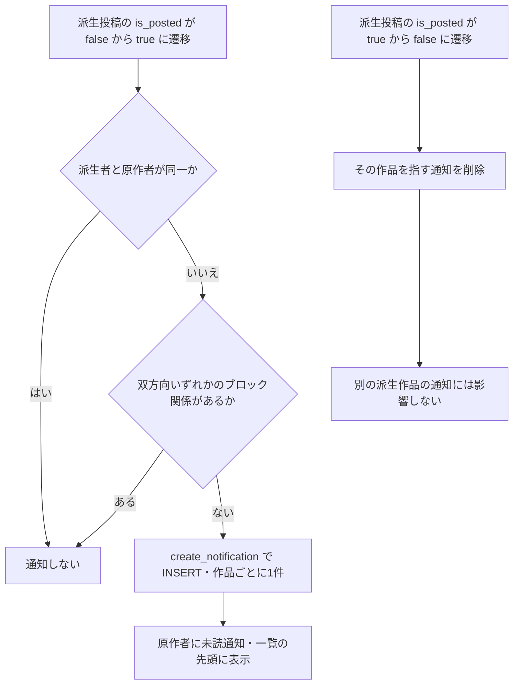
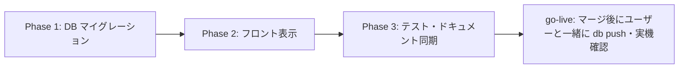

# 派生投稿の通知 実装計画書

- 作成日: 2026-08-04（同日改訂1: 集約単位を案1→案3へ変更=ADR-001 / 同日改訂2: Codex レビュー6件を反映=ADR-005改・ADR-007新設・REQ-006改・REQ-013新設）
- ステータス: レビュー待ち
- 前提機能: `/free` プロンプト公開・非公開モード（`docs/planning/free-prompt-private-mode-implementation-plan.md`、PR #464〜#474 で本番稼働済み）
- 関連する先行計画: `docs/planning/post-moderation-notification-implementation-plan.md`（通知 type 追加の直近の前例）

## 0. 背景と目的

`/free` の派生生成（他ユーザーのプロンプトを使った生成）が本番稼働したが、原作者は自分のプロンプトが使われて投稿されたことを知る手段がない。派生投稿には原作クレジットが公開表示されるため関係は既に公開情報であり、**派生投稿が「投稿」されたタイミングで原作者に実名（ニックネーム）通知を届け、承認欲求のループを作る**。

ヒアリングでの決定事項:

| 論点 | 決定 |
|------|------|
| 通知タイミング | 生成時ではなく**投稿時**（A案先行） |
| 実名/匿名 | **実名**（原作クレジットで既に公開されている関係のため） |
| まとめ方 | **派生投稿ごとに1件**（1作品 = 1通知。通知一覧からすべての派生作品へアクセスできる）。当初は「原作ごとに最大1件」で合意したが、設計精査の結果を受けて変更（ADR-001） |
| 連投対策 | 取消時に通知も削除（いいね通知と同型）+ 作品ごと最大1件をユニークインデックスで保証。派生生成は毎回ペルコインを消費するため、大量連投は経済的に成立しない |
| ブロック | 双方向いずれかのブロック関係があれば通知しない |
| 通知OFF設定列 | **追加しない**（設定画面自体が未実装のため。次のタスクで設定画面と一緒に） |
| 生成時の匿名集約通知（B案） | **スコープ外**（A案の効果を見てから） |

## 1. コードベース調査結果

### 1-1. 通知基盤（DB 層）

- **`create_notification` の最新定義**は `supabase/migrations/20251215150320_notifications_comment_per_notification.sql:96`。自己通知スキップ・通知設定チェック（like/comment/follow のみ）・最外周の EXCEPTION 吸収（通知失敗が呼び出し元トランザクションを巻き込まない）を内蔵しており、**本機能でもこの関数をそのまま呼ぶ**（`notify_on_like` / `notify_on_follow` と同じパターン。ADR-004）
  - 同関数の UPSERT は部分ユニークインデックス `notifications_unique_like_follow_idx ... WHERE type IN ('like','follow')` に依存するため、新 type 用に**同形の部分ユニークインデックスを追加**して並行 INSERT の競合バックストップとする
  - **セキュリティ上の発見（レビュー指摘①・Critical）**: 同関数には GRANT/REVOKE が一切なく、PostgreSQL の既定で PUBLIC に EXECUTE が付くため、**anon / authenticated が Data API（`/rest/v1/rpc/create_notification`）から直接呼び出して任意の宛先・actor・文言の通知を偽造できる**（SECURITY DEFINER のため notifications の RLS も素通り。既存の like/follow 等でも成立する既存脆弱性）。後発の `create_notification_bulk` は REVOKE 済み（`20260602100700:78`）で、元祖だけが開いている。呼び出し元13関数はすべて SECURITY DEFINER（所有者権限で実行されるため REVOKE の影響を受けない）・アプリコードからの直接 RPC 呼び出しはゼロであることを全数確認済み → **本マイグレーションで EXECUTE を封鎖する（ADR-007）**
  - unique_violation 後の UPDATE は `is_read` をリセットしないが、案3では同一キー（同一作品）の再作成は「取消（通知削除）→再投稿（新規 INSERT）」の経路しか通らないため、この UPDATE パスは実質レース時の保険にしかならない
- **type の CHECK 制約**の最新は `20260728130000_extend_notifications_for_post_moderation.sql:22-44`（16値）。追加は DROP → 全列挙 ADD が慣例。`entity_type` は既存 `'post'` を再利用するため変更不要（モデレーション通知と同じ方針）
- **「元イベント消滅 → 通知削除」トリガーの先例**: `delete_notification_on_like_removal` / `delete_notification_on_follow_removal` / `delete_notification_on_comment_deletion`（いずれも `20251214185550_notifications_physical_delete.sql`）。5列完全一致で DELETE する。**本機能の削除トリガーは like 版と完全に同型**
- **`generated_images` の既存トリガー**は4本。手本は `trg_notify_creator_looks_on_publication`（`20260603100200:135-146`）: `AFTER UPDATE OF is_posted ... WHEN (OLD.is_posted IS DISTINCT FROM NEW.is_posted AND NEW.is_posted = true AND ...)` で「遷移のときだけ」発火し、WHEN 句と関数内ガードを二重化する
- **ホットテーブル注意**: `generated_images` は `record_post_impressions` が集合 UPDATE で叩くため、**新トリガーは必ず `UPDATE OF is_posted` で列を限定する**（`20260730200000:248-255` のコメント）
- **ブロック**: `public.user_blocks (blocker_id, blocked_id)`（`20260208193000:73-106`）。双方向判定の実例は `validate_derived_prompt_source` 最新版 `20260731110000:110-119`。ブロック判定は `create_notification` に無いためトリガー関数側で行う
- **系譜列**: `generated_images.source_post_id` / `source_author_id` はトリガー保護済みの信頼できる列（`enforce_generated_image_lineage`）。通知の宛先は `NEW.source_author_id` から追加クエリなしで取れる

### 1-2. 投稿・取消の経路（is_posted の書き換え地点）

| 経路 | ファイル | 内容 |
|------|---------|------|
| 投稿（サーバー） | `features/generation/lib/server-database.ts:122-155` `postImageServer` | `{is_posted: true, caption, posted_at: now}` を UPDATE。`/api/posts/post` と **`/api/posts/update`（キャプション編集）の両方から呼ばれ、編集でも `is_posted=true` を再セットする** |
| 投稿（ブラウザ直） | `features/generation/lib/database.ts:162-185` `postImage` | ブラウザクライアントから `generated_images` を直接 UPDATE する経路が現存（`20260728160000:25-29` に明記）。**API ルートにフックを置くと取りこぼす → DB トリガーが必須** |
| 取消 | `features/generation/lib/server-database.ts:163-187` `unpostImageServer` | `{is_posted: false, caption: null, posted_at: null}` |
| 公開停止（reject） | `apply_admin_moderation_decision_v2`（`20260728160000:162-171`） | `moderation_status='removed'` かつ `is_posted=false`（`posted_at` は保持） |
| 異議認容（復帰） | `decide_post_moderation_appeal`（同ファイル） | `moderation_status='visible'` かつ `is_posted=true` を同一 UPDATE で |
| 退会 | `20260207120000:148` | 一括 `SET is_posted = false` |
| 物理削除 | `app/api/my-page/images/route.ts:131-136` | **未投稿行のみ**削除可能（投稿済みは削除できない）→ 削除は必ず取消を経由するため `AFTER DELETE` トリガーは不要 |

コレクション完走投稿（`app/api/collections/completions/[id]/post/route.ts`）も `is_posted` を触るが `source_post_id IS NULL` のため WHEN 句で自然に除外される。

### 1-3. 表示パイプライン（アプリ層）

- **type を見るのは `features/notifications/lib/presentation.ts:115` の switch だけ**。見出し・本文は type ごとに i18n キーで組み立て、DB の `title`/`body` はフォールバック（`default:` 分岐は落ちずに DB 文言を素通しする）
- **遷移先**は `features/notifications/hooks/useNotifications.ts:426-499` `handleNotificationClick`。`entity_type==='post'` は `/posts/{entity_id}` へ飛ぶ汎用分岐がある（:475-480）→ **entity を派生投稿にすることで、この汎用分岐がそのまま使え、遷移の分岐追加は不要**（ADR-003）
- **サムネイル**は `features/notifications/lib/server-api.ts:10-31` `getResolvedImageId` が唯一の解決ルール（`entity_type==='post'` → `entity_id`）→ **entity が派生投稿なので変更不要。派生作品のサムネイルが自動で付く**
- **アバタータップ**は `NotificationList.tsx:133-146` の許可リスト（現在 `like`/`comment` のみ）
- **i18n**: `messages/ja.ts:1720-1775` の `notifications` 名前空間（フラット）。ja が型の親で、**残り14ロケールにキーを足さないと `tsc` が落ちる**（これが唯一の網羅性強制）
- **バッジ・一覧の即時反映**: `UnreadNotificationProvider` が Realtime の INSERT/UPDATE を購読して未読数を再取得、`useNotifications` は **INSERT イベントで一覧の先頭に差し込む** → 案3は毎回新規 INSERT なので、既存クライアントコードのまま新着が即時反映される
- **Realtime で届いた生の行は enrichment（actor 名・サムネ）を通らない**ため、そのまま出すと到着直後は「ユーザーがあなたのプロンプトで…」とフォールバック表示になる（like/follow に既存する挙動だが、実名通知が主目的の本機能では要件不一致=レビュー指摘④）→ **新着1件を enrichment してから一覧へ差し込む方式に変更する**（既存の全通知タイプも恩恵を受ける。`data.image_url` の焼き込みは enrichment 失敗時のフォールバックとして残す）
- **タブ割当・API ルート（4本）・`route-copy.ts` は type 非依存で変更不要**。新 type は自動的に「アクティビティ」タブに出る

### 1-4. テスト資産

- `tests/unit/lib/notification-presentation.test.ts`（見出し組み立て）、`tests/unit/features/notifications/use-notifications.test.tsx`（遷移とフック契約。モック雛形あり）、`tests/integration/api/notifications-route.test.ts`（enrichment 込みの一覧 API）が既存パターン
- **トリガー/RPC の SQL 自動テストは存在しない**（pgTAP なし）→ DB 部分はマイグレーション内の検証 DO ブロック + Supabase Preview + 実機で検証する（`20260731110000` の「実在データで関数本体を最後まで通す」方式を踏襲）

## 2. 概要図

### 2-1. 通知の発生と消滅

取消・モデレーション公開停止・退会一括取消はいずれも `is_posted true→false` なので、同じ削除経路で処理される。

### 2-2. 投稿から通知表示までのシーケンス

ブラウザ直 UPDATE の投稿経路（`postImage`）でも同じトリガーが発火する。API ルート側には一切フックを置かない。

## 3. EARS 要件

| ID | タイプ | 要件 |
|----|--------|------|
| REQ-001 | イベント | When a derived post (`source_post_id IS NOT NULL`) transitions `is_posted` from false to true, the system shall create a notification of type `derived_post_published` addressed to the origin author (`source_author_id`), with `entity_type='post'` and `entity_id` = the derived post id. 派生投稿が公開されたとき、原作者へ `derived_post_published` 通知を作成する。entity は派生投稿自身。 |
| REQ-002 | イベント | The system shall maintain at most one notification per derived work (enforced by a partial unique index); each newly published derived work shall produce its own unread notification. 1つの派生作品につき通知は最大1件（部分ユニークインデックスで強制）。別の作品はそれぞれ独立した未読通知になり、通知一覧からすべての作品へアクセスできる。 |
| REQ-003 | 異常系 | If the deriver is the origin author, then the system shall not create a notification. 自分の原作から自分で派生した場合は通知しない（`create_notification` の自己通知スキップ＋関数内ガードの二重化）。 |
| REQ-004 | 異常系 | If a block relationship exists in either direction between the deriver and the origin author, then the system shall not create a notification. 双方向いずれかのブロック関係があれば通知しない（生成後にブロックされた場合を含む）。 |
| REQ-005 | イベント | When a derived post transitions `is_posted` from true to false (user unpost, moderation removal, account-deletion bulk unpost), the system shall delete the notification that references it. Other works' notifications shall remain untouched. 派生投稿が非公開になったら、その作品を指す通知を削除する。他の作品の通知には触れない。 |
| REQ-006 | 状態駆動 | While the notification is rendered — including immediately after Realtime arrival — the system shall display the deriver's nickname and avatar, the derived work's thumbnail, and a localized headline in all 15 locales that includes the origin caption when present. 表示時は派生者の実名・アバター・派生作品のサムネイルを出し、原作キャプションがあれば見出しに含める（15言語）。**Realtime で届いた新着の時点から**実名・サムネイルで表示する。 |
| REQ-007 | イベント | When the recipient taps the notification, the system shall navigate to the derived post detail (`/posts/{entity_id}`) via the existing post-entity navigation branch. タップで派生作品の詳細へ（既存の `entity_type='post'` 汎用分岐を利用。専用分岐は設けない）。 |
| REQ-008 | イベント | When the recipient taps the deriver's avatar, the system shall navigate to the deriver's profile. アバタータップで派生者のプロフィールへ。 |
| REQ-009 | 異常系 | If notification creation or deletion fails, then the system shall log a warning and shall not fail the posting or unposting transaction. 通知処理の失敗は WARNING に留め、投稿・取消そのものを失敗させない。 |
| REQ-010 | 異常系 | If `generated_images` is updated without an actual `is_posted` transition (e.g., caption edits via `/api/posts/update` that re-send `is_posted=true`), then the system shall not fire the notification trigger. キャプション編集など遷移を伴わない更新では発火しない（WHEN 句で遷移を要求）。 |
| REQ-011 | 状態駆動 | The system shall not fire derived-post notification triggers for rows whose `source_post_id` is NULL (root posts, collection completion posts). root 投稿・コレクション完走投稿では発火しない。 |
| REQ-012 | オプション | Where notification preferences are concerned, the system shall send `derived_post_published` regardless of `notification_preferences` (no per-type toggle in this iteration). 通知OFF設定は本イテレーションでは提供しない（bonus・moderation 系と同じ扱い。設定画面実装時にまとめて対応）。 |
| REQ-013 | 異常系 | If `create_notification` is invoked via the Data API by the `anon` or `authenticated` roles, then the call shall be rejected with a permission error. anon / authenticated が Data API から `create_notification` を直接呼んだ場合は権限エラーで拒否する（通知偽造・ブロック迂回の封鎖。既存 type にも適用。ADR-007）。 |

## 4. ADR（設計判断記録）

### ADR-001: 集約単位は「派生投稿ごとに1件」（案1からの変更）

- **Context**: ヒアリング当初は「同じ派生者の連投で通知欄が埋まる」懸念から、原作者×派生者×原作投稿で最大1件に集約する案1で合意していた。しかし設計精査で、案1は (a) 未読リセットのための DELETE+INSERT、(b) 取消時に残った作品へ通知を付け替えるロジック、(c) タップ遷移とサムネイルを派生作品へ向け直すフロント専用分岐、を必要とすることが判明した。
- **Decision**: 派生投稿ごとに1件（案3）とする（2026-08-04 ユーザー決定）。
- **Reason**: 通知一覧が「使われた作品のログ」になり、どの作品にも後からアクセスできる方が承認欲求という機能目的に合致する。実装はいいね通知と完全同型で最小になる。連投量は派生生成が毎回ペルコインを消費することが実質上限となり、いいね通知と同程度の件数感に収まる。
- **Consequence**: 同一派生者の多作で通知が複数並ぶことは許容する。件数が問題になった場合の集約は、B案（匿名集約ダイジェスト）の検討時に合わせて再設計する。

### ADR-002: DB トリガー方式（outbox 不採用・API フック不採用）

- **Context**: 投稿経路はサーバー経由 `postImageServer` とブラウザ直 UPDATE `postImage` の2系統ある。モデレーション通知は outbox + pg_cron dispatcher を採用した。
- **Decision**: `AFTER UPDATE OF is_posted` の DB トリガーで通知を作成する（creator_looks 公開通知 `trg_notify_creator_looks_on_publication` と同型）。
- **Reason**: API フックは直 UPDATE 経路を取りこぼす。outbox は「欠落が救済機会の喪失になる」moderation 用の重装備で、本通知は欠落してもお祝いが1回消えるだけ。発生源が `generated_images` の UPDATE そのものなので、同一トランザクション内トリガーが最も単純かつ確実。
- **Consequence**: 通知処理は投稿トランザクションに同居する。関数全体を EXCEPTION ガードで包み、失敗しても投稿を巻き込まない（REQ-009。notify_on_follow と同じ二重ガード）。

### ADR-003: entity は派生投稿そのもの

- **Context**: entity を原作投稿にすると案1の集約キーには都合が良いが、タップ遷移とサムネイルの向き先を `data.derived_post_id` で変える専用分岐がフロント2ファイルに必要だった（旧案）。
- **Decision**: `entity_type='post'` / `entity_id=派生投稿ID` とする。
- **Reason**: タップ遷移（`handleNotificationClick` の `entity_type==='post'` 汎用分岐 → `/posts/{entity_id}`）とサムネイル解決（`getResolvedImageId` → `entity_id`）が既存コードのまま派生作品を向く。フロントの分岐追加が丸ごと不要になる。
- **Consequence**: 原作の情報は見出し用に `data.origin_caption` のスナップショットで持つ（原作キャプションの後編集には追従しない。許容）。`data.image_url` には派生作品の画像 URL を焼き込み、Realtime 到着直後のサムネイル表示に使う（notify_on_like と同じ扱い）。

### ADR-004: create_notification を再利用する

- **Context**: 旧案（原作ごと集約）では未読リセットと Realtime INSERT イベントのために `create_notification` を使わず DELETE+INSERT する必要があった。
- **Decision**: `notify_on_like` / `notify_on_follow` と同じく、トリガー関数から `create_notification` を呼ぶだけにする。
- **Reason**: 案3では作品ごとに毎回新規 INSERT なので、未読・一覧先頭・Realtime 反映がすべて自然に成立する。自己通知スキップ・最外周の EXCEPTION 吸収も無償で得られ、`create_notification` の再定義（5回目）も避けられる。
- **Consequence**: ブロック判定だけは `create_notification` に無いため、トリガー関数側で行う（REQ-004）。並行 INSERT の競合バックストップとして新 type 用の部分ユニークインデックスを追加する（REQ-002）。

### ADR-005: 再投稿では再通知する（one-shot 列を設けない）

- **Context**: creator_looks は `creator_notified_at` の one-shot 列で「一度だけ通知」を保証した。本機能では取消→再投稿の往復で通知が再発火する。
- **Decision**: one-shot 列は設けず、いいね・フォロー通知と同じ「取消で消え、再投稿で再通知」の対称性を採る。
- **Reason**: ヒアリングで合意済み（フォロー通知の先例踏襲）。作品ごと最大1件の制約が往復スパムの上限になる（同一作品の未読は常に1件を超えない）。モデレーション認容で復帰した場合に通知が再生成されるのも自然な挙動。
- **Consequence**: 部分ユニークインデックスは「同時に存在する行数」の上限であり、取消→再投稿の**時系列上の再通知回数は制限しない**。再投稿にはペルコイン消費が無いため、悪意の往復操作で原作者のバッジを繰り返し点灯させられる（レビュー指摘②）。これはいいね・フォローの付け外しに既存する同型のリスクであり、防衛策はブロック（成立後は REQ-004 で通知が止まる）。レビューでは one-shot 化が提案されたが、「取消中に未読を見逃すと原作者がその作品の存在に永遠に気づけない」損失の方が現フェーズでは重いと判断し、再通知維持をユーザー決定（2026-08-04）。問題が顕在化した場合は通知済みマーカー列の後付けで one-shot / cooldown へ移行できる。

### ADR-006: 通知OFF設定列は追加しない

- **Context**: `notification_preferences` は like/comment/follow の3列のみで、設定画面自体が存在しない（全員 ON 固定）。
- **Decision**: 列追加も `create_notification` 側のチェック追加も行わない（bonus・creator_looks・moderation 系と同じ扱い）。
- **Reason**: ヒアリングで「足さない。次のタスクで追加しましょう」と合意。UI のない列は死蔵になる。
- **Consequence**: 通知設定画面を作るタスクで、既存の設定なしタイプとまとめて列設計する。

### ADR-007: 既存 `create_notification` の EXECUTE 封鎖を同梱する

- **Context**: レビューで、`create_notification` に GRANT/REVOKE が無く Data API から anon / authenticated が直接呼べることが指摘された（Critical）。SECURITY DEFINER のため notifications の RLS を素通りし、任意の宛先・actor・文言・data で通知を偽造でき、ブロック関係も迂回できる。新 type の追加でこの経路の悪用価値（偽の派生投稿通知）がさらに上がる。
- **Decision**: 本機能のマイグレーションに `REVOKE ALL ... FROM PUBLIC / anon / authenticated` + `GRANT EXECUTE ... TO service_role` を同梱する（`create_notification_bulk` が既に採っている構成 = `20260602100700:78` に揃える）。
- **Reason**: 呼び出し元13関数（notify_on_like/comment/follow、grant_daily_post_bonus、grant_streak_bonus、creator_looks 系トリガー/RPC ほか）はすべて SECURITY DEFINER で所有者権限で実行されるため REVOKE の影響を受けず、アプリコードからの直接 RPC 呼び出しも存在しないことを全数確認済み。壊れるものが無く、既存 type の偽造経路も同時に塞がる。
- **Consequence**: 権限変更で Data API の関数露出が変わるため `NOTIFY pgrst, 'reload schema'` を付ける。検証 DO ブロックで `has_function_privilege('anon', ...)` / `('authenticated', ...)` が false であることを機械検証する。ロールバックは GRANT の復元だが、偽造経路の再開通を意味するため非推奨（DOWN に明記）。

## 5. 実装計画（フェーズ + TODO）

### フェーズ間の依存関係

DB とフロントはどちらが先に本番へ出ても壊れない（新 type の行はトリガー適用まで発生せず、発生後も presentation の default 分岐が DB 文言で表示する）。標準運用どおり **PR マージ → Vercel デプロイ → ユーザーと一緒に `supabase db push` → 実機確認** の順とする。

### Phase 1: DB マイグレーション

目的: 通知の発生・消滅を DB 層で完結させる
ビルド確認: `npm run lint` / `typecheck` / `test` / `build -- --webpack` が通る（このフェーズはフロント無変更なので現状維持）。SQL は PR の Supabase Preview で検証

- [ ] マイグレーション `add_derived_post_notification.sql` を作成（1ファイル、以下を含む）
  - [ ] `notifications_type_check` を DROP → `'derived_post_published'` を加えた17値で ADD（`20260728130000` の書式踏襲。DOWN 不可の理由コメントも同様）
  - [ ] 部分ユニークインデックス `notifications_unique_derived_post_idx ON notifications (recipient_id, actor_id, type, entity_type, entity_id) WHERE type = 'derived_post_published'`（作品ごと最大1件の保証・並行 INSERT のバックストップ）
  - [ ] 関数 `notify_on_derived_post_published()`（SECURITY DEFINER / `SET search_path = public, pg_temp`。WHEN 句と同条件の関数内ガード → 自己派生の早期 return（`create_notification` 側のスキップと二重化）→ 双方向ブロックで早期 return → profiles からニックネーム・原作から caption 取得 → `PERFORM create_notification(NEW.source_author_id, NEW.user_id, 'derived_post_published', 'post', NEW.id, title, '', jsonb_build_object('origin_caption', ..., 'image_url', NEW.image_url))`。DB フォールバック title は `'<ニックネーム>があなたのプロンプトで作品を投稿しました'`、body は `''`。全体を EXCEPTION WHEN OTHERS → RAISE WARNING で包む）
  - [ ] トリガー `trg_notify_derived_post_published`: `AFTER UPDATE OF is_posted ON generated_images FOR EACH ROW WHEN (OLD.is_posted IS DISTINCT FROM NEW.is_posted AND NEW.is_posted = true AND NEW.source_post_id IS NOT NULL)`
  - [ ] 関数 `delete_notification_on_derived_post_removal()`（5列完全一致で DELETE: recipient=`OLD.source_author_id`, actor=`OLD.user_id`, type, `'post'`, entity_id=`OLD.id`。`delete_notification_on_like_removal` と同型。EXCEPTION ガード付き）
  - [ ] トリガー `trg_delete_notification_on_derived_post_removal`: `AFTER UPDATE OF is_posted ... WHEN (OLD.is_posted = true AND NEW.is_posted = false AND OLD.source_post_id IS NOT NULL)`
  - [ ] **既存 `create_notification(UUID, UUID, TEXT, TEXT, UUID, TEXT, TEXT, JSONB)` の EXECUTE 封鎖（ADR-007 / REQ-013）**: `REVOKE ALL ... FROM PUBLIC; REVOKE ... FROM anon; REVOKE ... FROM authenticated; GRANT EXECUTE ... TO service_role;`（`create_notification_bulk` の `20260602100700:78` と同構成。関数の再定義はしない）
  - [ ] 適用後検証 DO ブロック（データを残さない2段構成）:
    - 構造検証: CHECK に新値が入ったか / インデックス・トリガー2本・関数2本の存在 / `has_function_privilege` で anon・authenticated の `create_notification` EXECUTE が **false** であること
    - 実データ dry-run: **必ずロールバックされるサブトランザクション内**（ネストした BEGIN ブロックで実行し、末尾で専用 SQLSTATE を RAISE → 外側でその SQLSTATE のみ捕捉）で、**ブロック関係の無い**実在ユーザー2名を選び、原作＋派生行を INSERT → 1作品目の投稿で通知1件 → 同じ組の2作品目で通知2件 → 1作品目の取消でその通知だけ削除 → 自己派生でスキップ、を assert する。**ロールバックされた変更は logical decoding の対象外のため Realtime に一切配信されず**、検証データも通知も残らない（レビュー指摘③対応: コミット済みの INSERT+DELETE では WAL 経由で通知画面を開いている実在ユーザーに幽霊通知が出る）。assert 失敗（別 SQLSTATE）は捕捉せず伝播させてマイグレーションを失敗させる。条件を満たすユーザーペアが無ければ NOTICE でスキップ（`20260731110000` の「実在データで本体を最後まで通す」方式は維持）
  - [ ] `NOTIFY pgrst, 'reload schema'` を COMMIT 直前に付ける（REVOKE で Data API の関数露出が変わるため）
  - [ ] COMMIT 後に DOWN セクション（トリガー2本・関数2本・インデックスの DROP、`create_notification` の GRANT 復元=非推奨と明記。CHECK は該当行削除後でないと戻せない旨を明記）
- [ ] `supabase db diff` 相当の内容確認と Supabase Preview での SQL 検証（**本番適用はユーザーと一緒に go-live 時**）

### Phase 2: フロント表示

目的: 新 type を一覧で正しく表示し、派生作品へ誘導する
ビルド確認: `npm run lint` / `typecheck` / `test` / `build -- --webpack` すべて緑（15ロケールのキー欠落は typecheck が検出）

- [ ] `features/notifications/types.ts`: `NotificationType` に `'derived_post_published'`、`data` に `origin_caption?: string | null` を追加（`image_url` は既存フィールドを使う）
- [ ] `features/notifications/lib/presentation.ts`: `NotificationTranslationKey` に `derivedPostTitle` / `derivedPostTitleNoCaption` を追加し、switch に case 追加。`origin_caption` は**書記素クラスタ単位（`Intl.Segmenter`）で先頭20文字に切り詰め、実際に超過した場合のみ `…` を付けて** `{origin}` に差し込む（サロゲートペア・結合文字を途中で分割しない=レビュー指摘⑥）。なければ NoCaption 版。body は `""`
- [ ] `messages/ja.ts` の `notifications` 名前空間に2キー追加（例: `derivedPostTitle: "{actor}が「{origin}」のプロンプトで作品を投稿しました"` / `derivedPostTitleNoCaption: "{actor}があなたのプロンプトで作品を投稿しました"`）
- [ ] 残り14ロケール（en/ko/zh-CN/zh-TW/es/pt/fr/de/it/id/th/vi/hi/ar）に同キーを追加
- [ ] `features/notifications/components/NotificationList.tsx`: `getNotificationIcon` に case 追加（Sparkles 系アイコン）。**actor プロフィールへ遷移できる type の共通 predicate を定義し、`handleActorIconClick` 内のガード（:137）と `isActorProfileLinkNotification`（:201-202）の両方を置き換える**（許可リストが2箇所にあり、片方だけではアバタータップが有効にならない=レビュー指摘⑤。REQ-008）
- [ ] `features/notifications/hooks/useNotifications.ts`: Realtime INSERT で生の `payload.new` をそのまま差し込まず、**新着1件を API 経由で enrichment（actor・post 付与）してから一覧へ追加**する（取得失敗時は従来どおり生の行にフォールバック）。新着時点から実名・アバター・サムネイルが出る=REQ-006（レビュー指摘④。既存の全通知タイプも恩恵を受ける）

**変更不要（entity=派生投稿にした効果）**: `useNotifications.ts` の**遷移分岐**（既存の `entity_type==='post'` 汎用分岐で `/posts/{派生投稿id}` へ飛ぶ）、`server-api.ts` の `getResolvedImageId`（既存ルールで派生作品のサムネ・caption が付く）。

### Phase 3: テスト・ドキュメント同期

目的: 回帰を固定し、正典ドキュメントを実装に同期する
ビルド確認: 全検証コマンド緑

- [ ] `tests/unit/lib/notification-presentation.test.ts` に追加: 原作キャプションあり／なし／actor フォールバック、および切り詰め境界（20文字ちょうど=省略記号なし／超過=`…`付き／絵文字・結合文字を分割しない）
- [ ] `tests/unit/features/notifications/use-notifications.test.tsx` に追加: (a) 新 type が汎用 post 分岐で `/posts/{entity_id}` へ遷移すること、(b) Realtime INSERT の新着が enrichment されて実名・サムネ付きで一覧に入ること（取得失敗時は生の行へフォールバック）
- [ ] NotificationList のアバター遷移テストを新設: 新 type でアバタータップが派生者プロフィールへ遷移すること（predicate 2箇所の統一を固定=REQ-008）
- [ ] `tests/integration/api/notifications-route.test.ts` に追加: 新 type の enrichment で派生作品のサムネが付くこと
- [ ] `docs/architecture/data.ja.md` / `data.en.md`: Trigger map に2行追加（notify / delete）、通知 type 一覧の記述があれば更新
- [ ] `.cursor/rules/database-design.mdc`: notifications の type 列挙とインデックスの記述を更新
- [ ] 実機確認手順の整理（下記テスト観点の「実機確認」）

### 見積り

Phase 1: 0.5日 / Phase 2: 0.5日 / Phase 3: 0.5日 — 合計 **1〜1.5日**。PR は1本（`feat/derived-post-notification` ブランチ）。

## 6. 修正対象ファイル一覧

| ファイル | 操作 | 変更内容 |
|----------|------|----------|
| `supabase/migrations/2026xxxxxx_add_derived_post_notification.sql` | 新規 | CHECK 拡張・部分ユニークインデックス・通知/削除トリガー関数・検証 DO ブロック |
| `features/notifications/types.ts` | 修正 | `NotificationType` と `data.origin_caption` 追加 |
| `features/notifications/lib/presentation.ts` | 修正 | 見出しキー union と switch case 追加 |
| `features/notifications/components/NotificationList.tsx` | 修正 | アイコン case 追加・actor リンク判定を共通 predicate へ統一（2箇所） |
| `features/notifications/hooks/useNotifications.ts` | 修正 | Realtime 新着を enrichment してから一覧へ差し込む |
| `messages/ja.ts` ほか15ロケール全ファイル | 修正 | `derivedPostTitle` / `derivedPostTitleNoCaption` 追加 |
| `tests/unit/lib/notification-presentation.test.ts` | 修正 | 見出しの4ケース追加 |
| `tests/unit/features/notifications/use-notifications.test.tsx` | 修正 | 遷移＋Realtime 新着 enrichment のケース追加 |
| NotificationList のアバター遷移テスト | 新規 | 新 type のアバタータップ遷移を固定 |
| `tests/integration/api/notifications-route.test.ts` | 修正 | enrichment 1ケース追加 |
| `docs/architecture/data.ja.md` / `data.en.md` | 修正 | Trigger map 2行追加 |
| `.cursor/rules/database-design.mdc` | 修正 | notifications の type・インデックス記述更新 |

変更しないことが設計上重要なファイル: `create_notification`（**再定義はしない**。EXECUTE 権限のみ変更=ADR-007）、`features/notifications/lib/server-api.ts`（entity=派生投稿のため既存ルールのまま派生作品のサムネが付く）、`useNotifications.ts` の遷移分岐（汎用 post 分岐のまま。修正は Realtime 差し込みのみ）、`app/api/posts/post/route.ts`・`app/api/posts/[id]/route.ts`（API フックを置かない）、`app/api/notifications/*`・`notification-tab.ts`・`route-copy.ts`（type 非依存）。

## 7. 品質・テスト観点

### 品質チェックリスト

- [ ] **エラーハンドリング**: トリガー関数2本とも EXCEPTION ガードで投稿・取消トランザクションを守る（REQ-009）。`create_notification` 側の吸収と二重
- [ ] **権限制御**: トリガー関数は SECURITY DEFINER（notify_on_like と同型）。notifications の RLS（本人のみ SELECT）はそのまま。新規 RPC の公開なし。**既存 `create_notification` は PUBLIC / anon / authenticated から EXECUTE を REVOKE し service_role のみに GRANT**（ADR-007 / REQ-013）。適用後 DO ブロックで `has_function_privilege` が false であることを機械検証する
- [ ] **データ整合性**: 部分ユニークインデックスで「作品ごと最大1件」を DB 層で強制。`source_post_id`/`source_author_id` はトリガー保護済みの信頼できる列のみ参照
- [ ] **セキュリティ**: ブロック関係の双方向判定（REQ-004）。moderation 通知のような匿名性要件はなし（実名が仕様）
- [ ] **i18n**: 15ロケール全てにキー追加（typecheck で強制）。DB フォールバック title は日本語（like/follow と同じ割り切り）
- [ ] **ホットテーブル配慮**: 新トリガー2本とも `UPDATE OF is_posted` で列限定（インプレッション集計 UPDATE で発火しない）

### テスト観点

| カテゴリ | テスト内容 |
|----------|-----------|
| 正常系 | 派生投稿の公開で原作者に通知1件。見出しに実名＋原作キャプション。タップで派生作品へ。アバターで派生者プロフィールへ |
| 新着表示 | 通知画面を開いたまま受信しても、実名・アバター・サムネイルが即時表示される（Realtime enrichment=REQ-006） |
| 複数作品 | 同じ派生者×同じ原作の2作品目で通知が**2件**になり、それぞれタップで各作品へ飛べる。別の原作・別の派生者も同様に独立 |
| 消滅 | 取消でその作品の通知だけ消える（他の作品の通知は残る）。公開停止でも同様。再投稿で再通知 |
| 異常系 | 自己派生・ブロック関係で通知なし。キャプション編集（/api/posts/update）で再発火しない |
| 権限テスト | 通知は原作者本人にのみ見える（既存 RLS）。他ユーザーの一覧に出ない |
| 実機確認 | 2アカウントで実施: 派生投稿→通知→タップ遷移→同一原作に2件目→通知が2件になること→片方取消→その通知だけ消えること。Realtime のバッジ即時点灯。モバイル表示 |

DB トリガーの自動テスト基盤は無いため（1-4）、DB 部分の検証は「マイグレーション内 DO ブロック（**必ずロールバックされるサブトランザクション**での投稿→2件目→取消シナリオ。Realtime へ漏れず、データも残らない）＋ Supabase Preview ＋ 実機」の3層で行う。

### テスト実装手順

実装完了後、`/test-flow {Target}` → `/spec-extract` → `/spec-write` → `/test-generate` → `/test-reviewing` → `/spec-verify` の順で実施する。

## 8. ロールバック方針

- **DB**: DOWN セクションにトリガー2本・関数2本・インデックスの DROP と、`create_notification` の GRANT 復元（偽造経路の再開通を意味するため非推奨と明記）を用意。トリガーを落とせば新規発生が止まり、既存通知は `DELETE FROM notifications WHERE type='derived_post_published'` で全消去できる。CHECK 制約は該当行削除後でないと旧16値に戻せない（`20260728130000` と同じ注意書きを明記）
- **フロント**: presentation の default 分岐が DB 文言を素通しするため、フロントだけを戻しても通知は壊れず表示される（文言が日本語固定になるだけ）
- **Git**: フェーズごとにコミットし revert 可能に。PR は1本
- **機能フラグ**: 不要（トリガーの有無がそのままフラグとして機能する）

## 9. 使用スキル

| スキル | 用途 | フェーズ |
|--------|------|----------|
| `/git-create-branch` | `feat/derived-post-notification` 作成 | 実装開始時 |
| `/project-database-context` | DB 設計の参照 | Phase 1 |
| `/test-flow` ほかテスト系 | スペック抽出〜カバレッジ確認 | Phase 3 |
| `/git-create-pr` | PR 作成（日本語タイトル・本文） | 実装完了時 |

## 10. スコープ外（将来タスク）

- **B案: 生成時の匿名集約通知**（『あなたのプロンプトが◯人に利用されました』日次ダイジェスト）。A案の効果を観察してから。データは `prompt_usage_events` に既に貯まっているため後付け可能。通知件数が問題になった場合の集約もここで再検討
- **プッシュ配信**（`pushed_at`/`push_status` 列は全通知タイプで未使用のまま）
- **通知設定画面と per-type の OFF 設定列**（ADR-006。設定画面タスクでまとめて）
- **原作者への金銭的・ポイント的還元**
