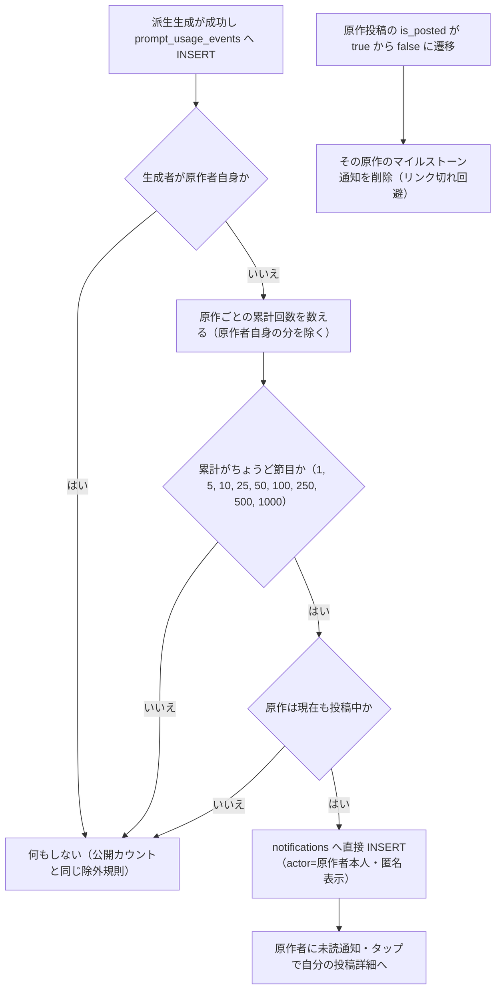

# プロンプト利用数マイルストーン通知（B案） 実装計画書

- 作成日: 2026-08-04
- ステータス: レビュー待ち
- 前提機能: 派生投稿の実名通知（A案、`docs/planning/derived-post-notification-implementation-plan.md`、PR #476 で本番稼働済み）
- 位置づけ: A案が「投稿」を実名で祝うのに対し、B案は**投稿されない静かな利用（生成のみ）を匿名の節目で祝う**

## 0. 背景と目的

`/free` の派生生成は投稿されなくても `prompt_usage_events` に記録され続けているが、原作者には届かない。生成は私的な行為のため個別の実名通知はできない。そこで**利用回数が節目（マイルストーン）に達した瞬間に、匿名の集約通知**を原作者へ届ける：『あなたの「桜ドレス」のプロンプトが5回利用されました🎉』。

ヒアリングでの決定事項:

| 論点 | 決定 |
|------|------|
| 配信の型 | **マイルストーン型**（節目到達の瞬間に発火。日次ダイジェスト型は不採用 = cron 不要） |
| 集約単位 | **原作の投稿ごと** |
| 数えるもの | **回数**（のべ生成回数。原作者自身の生成は除外 = 公開カウントと同じ除外規則） |
| 最小値 | **1回目から**（初回は「初めて利用されました」の特別文言） |
| 過去分 | **ゼロベースライン**（稼働時点の既存カウントに遡って通知しない） |
| 見た目 | **🎉系アイコン**・アバターは運営ロゴ（匿名のため actor を出さない）・サムネは自分の作品。タップで自分の投稿詳細へ |
| 通知OFF設定 | 追加しない（A案 ADR-006 と同じ判断） |

**注記（回数 vs 人数）**: 参照カードで公開中の利用数は `get_prompt_usage_count` = **人数**（`count(DISTINCT user_id)`・原作者除外）。本通知は**のべ回数**なので、2つの数字は別の意味で併存する（通知「10回」・カード「3人」がありうる）。人数に揃えたくなった場合はトリガー内の集計を `count(DISTINCT user_id)` に変えるだけで済む設計とする。

## 1. コードベース調査結果

### 1-1. 集計元データ（すべて稼働済み・変更不要）

- **`prompt_usage_events`**（`20260730200100:39-55`）: `image_job_id UNIQUE`（FK なし・再試行の重複防止）、`origin_post_id` / `origin_author_id` / `user_id` / `created_at`。`origin_author_id` は「後から原作が消えても原作者自身の利用を除外できるように」保存済み（列コメント）
- **書き込みは1経路のみ**: Worker 完了 RPC 内の `INSERT ... ON CONFLICT (image_job_id) DO NOTHING`（`20260730200100:276-288`）。**AFTER INSERT トリガーは実際に行が入ったときだけ発火**する（DO NOTHING 時は発火しない = 冪等性がそのまま効く）
- `idx_prompt_usage_events_origin (origin_post_id)` があり、トリガー内の件数カウントは安価
- 公開カウント: `get_prompt_usage_count(p_origin_post_id)` = `count(DISTINCT user_id)` / `user_id <> origin_author_id`（`20260730200100:306-320`）

### 1-2. 匿名通知の既存パターン（moderation 通知が確立済み）

- `notifications.actor_id` は **NOT NULL**（`20251213013611:13`）→ 匿名通知は **actor_id = recipient 本人**を入れる（moderation の ADR-011 パターン）
- `create_notification` は `recipient = actor` を自己通知としてスキップするため使えない → **直接 INSERT** する。前例 = moderation outbox dispatcher（`20260728130200:106-107`「self-skip を回避するため」）
- 表示側: `NotificationList` の `isSystemNotification`（bonus / moderation）が**運営ロゴのアバター**を出す。`server-api.ts` の actor enrichment は moderation type を除外している → 本 type も同じ除外リストへ
- アバタータップ導線（A案の共通 predicate）には**入れない**（匿名のため）

### 1-3. A案で舗装済みの経路（そのまま乗る）

- type 追加の手順（CHECK 全列挙 / presentation switch / 15ロケール / タブ・バッジ自動対応）
- `entity_type='post'` + `entity_id=原作投稿` → タップは汎用分岐で自分の投稿詳細へ、サムネ・キャプションは既存 enrichment が自動付与（**見出しの「{origin}」は `notification.post.caption` を使う** = 原作キャプションの後編集にも追従。書記素20文字切り詰めは A案のヘルパー `truncateOriginCaption` を再利用）
- Realtime 新着の ID 指定 enrichment（#476）→ 新着時点からサムネ付きで表示される
- 検証 DO ブロックの「必ずロールバックされるサブトランザクション」方式

## 2. 概要図

「ちょうど節目のときだけ発火」により、稼働時点で既にカウントがある投稿（数件）へ遡って通知することはない（= ゼロベースライン）。通知に載る数字は通算の実数なので嘘にならない。

## 3. EARS 要件

| ID | タイプ | 要件 |
|----|--------|------|
| REQ-001 | イベント | When a row is inserted into `prompt_usage_events` and the origin's cumulative usage count (excluding the origin author's own generations) exactly reaches a milestone (1, 5, 10, 25, 50, 100, 250, 500, 1000), the system shall create a `derived_usage_milestone` notification addressed to the origin author with `entity_type='post'` and `entity_id` = the origin post id. 利用イベントの追加で累計回数（原作者自身を除く）がちょうど節目に達したとき、原作者へ通知を作成する。entity は原作投稿。 |
| REQ-002 | 異常系 | If the generating user is the origin author, then the event shall not count toward milestones and shall not notify. 原作者自身の生成は数えず、通知もしない（公開カウント `get_prompt_usage_count` と同じ除外規則）。 |
| REQ-003 | 状態駆動 | While the origin post is not currently published (`is_posted = false` or missing), the system shall not create milestone notifications. 原作が非公開・消滅している間は通知しない（生成完了が取消後に滑り込む競合の防御）。 |
| REQ-004 | イベント | The system shall create at most one notification per (origin post, milestone) pair, enforced by a partial unique index on `(entity_id, (data->>'milestone'))`. 同じ原作×同じ節目の通知は最大1件（部分ユニークインデックスで強制。並行 INSERT はバックストップが吸収）。 |
| REQ-005 | 状態駆動 | The notification shall be anonymous: `actor_id` = recipient, no actor profile enrichment, no avatar tap navigation, operator-logo avatar, 🎉 type icon. 通知は匿名。actor enrichment とアバタータップ導線の対象外とし、運営ロゴ＋🎉アイコンで表示する。 |
| REQ-006 | 状態駆動 | While rendered, the headline shall include the origin caption when present (`notification.post.caption`, grapheme-truncated to 20) and the milestone count, with a dedicated "first use" wording for milestone 1, in all 15 locales. 見出しは原作キャプション（あれば・20文字切り詰め）＋回数。1回目だけ「初めて利用されました」の専用文言。15言語。 |
| REQ-007 | イベント | When the recipient taps the notification, the system shall navigate to the origin post detail (`/posts/{entity_id}`) via the existing post-entity branch. タップで自分の投稿詳細へ（既存汎用分岐。専用分岐なし）。 |
| REQ-008 | イベント | When the origin post transitions `is_posted` from true to false, the system shall delete that post's milestone notifications. Republishing shall not recreate past notifications. 原作の非公開化でその投稿のマイルストーン通知を削除する（リンク切れ回避）。再公開しても過去分は復元しない（次の節目から再開）。 |
| REQ-009 | 異常系 | If notification creation or deletion fails, then the system shall log a warning and shall not fail the generation-completion or unpost transaction. 通知処理の失敗は WARNING に留め、生成完了 RPC・取消処理を巻き込まない。 |
| REQ-010 | オプション | Where notification preferences are concerned, the system shall send `derived_usage_milestone` regardless of `notification_preferences`. 通知OFF設定は提供しない（A案 ADR-006 踏襲）。 |

## 4. ADR（設計判断記録）

### ADR-001: マイルストーン型（日次ダイジェスト型は不採用）

- **Context**: B案の配信タイミングはダイジェスト型（cron + 期間の冪等管理）とマイルストーン型（イベントトリガー）の2択だった。
- **Decision**: マイルストーン型（ユーザー決定 2026-08-04）。
- **Reason**: cron・期間管理・タイムゾーンの論点が丸ごと消え、実装は AFTER INSERT トリガー1本。お祝い感があり、節目の間隔が広がることで頻度が自然に減衰する（スパム制御内蔵）。現状の /free 流通量でも「初回」「5回」は現実的に届く。
- **Consequence**: 「毎日の楽しみ」にはならない。流通量が増えてダイジェストが欲しくなったら、同じ `prompt_usage_events` から別 type として後付けできる。

### ADR-002: 通算回数を数え「ちょうど節目に達した瞬間」のみ発火

- **Context**: ⑤ゼロベースライン（過去分に遡らない）を、ベースライン記録テーブルや稼働日時のハードコードなしで満たしたい。
- **Decision**: 集計は常に通算（`count(*)` / 原作者除外）とし、**新しいイベントで累計がちょうど節目値に一致したときだけ**発火する。
- **Reason**: 稼働時点で既に 8 回の投稿は 9 回目では発火せず、10 回目で「10回」が届く（遡及なし・数字は通算の実数で嘘がない）。ベースラインの保存も日時定数も不要。
- **Consequence**: 並行 INSERT で累計が節目を「飛び越える」理論上の可能性があるが、現在の流通量では無視できる（発生しても次の節目で回復）。通知は**のべ回数**でカードの**人数**と軸が異なる（冒頭の注記。人数へ揃える場合は集計1行の変更）。

### ADR-003: notifications へ直接 INSERT（create_notification 不使用）

- **Context**: `notifications.actor_id` は NOT NULL で、匿名通知は actor に recipient 本人を入れる（moderation ADR-011 パターン）。`create_notification` は recipient=actor を自己通知としてスキップする。
- **Decision**: moderation outbox dispatcher と同じく、トリガー関数から直接 INSERT する。
- **Reason**: self-skip の回避が必要。preference チェックも不要（REQ-010）で、`create_notification` を経由する利点がない。
- **Consequence**: 冪等性は REQ-004 の部分ユニークインデックス＋EXCEPTION ガード（unique_violation は先勝ち吸収）で担保する。

### ADR-004: 節目は固定配列 {1, 5, 10, 25, 50, 100, 250, 500, 1000}

- **Context**: どこまで通知し続けるか。
- **Decision**: 上記9段を関数内の固定配列で持つ。1000 超の段は設けない（必要になったら配列に追加するだけ）。
- **Reason**: 現実の流通量に対して十分。1回目は専用文言「初めて利用されました」で最初の1人の重みを演出する。
- **Consequence**: 段の追加・変更は関数の再定義（マイグレーション1本）で済む。

### ADR-005: 原作の非公開化でマイルストーン通知を削除する

- **Context**: 原作が取消されると `/posts/{origin}` はリンク切れになる。A案は「指す先が消えたら通知も消す」を採った。
- **Decision**: 原作の `is_posted true→false` 遷移でその投稿の `derived_usage_milestone` 通知を削除する専用トリガーを追加する（A案の削除トリガーは派生投稿側の WHEN 条件のため流用不可）。
- **Reason**: リンク切れ通知を残さない方針の一貫性。非公開中は他人の派生生成も止まる（validate が弾く）ため通知の新規発生も自然に止まる。
- **Consequence**: 再公開しても過去の通知は復元しない（ユニークインデックスの行が消えているため、理論上は同じ節目が再発火しうるが、再公開後に新しい利用が節目値ちょうどに達することはない = 累計は既に節目を超えている）。

## 5. 実装計画（フェーズ + TODO）

DB とフロントはどちらが先に本番へ出ても壊れない（A案と同じ。新 type はトリガー適用まで発生せず、発生後も presentation の default 分岐が DB 文言で表示）。**マージ → デプロイ → ユーザーと一緒に `supabase db push` → 実機確認**。

### Phase 1: DB マイグレーション

目的: 節目判定と通知の発生・消滅を DB 層で完結させる
ビルド確認: フロント無変更のため現状維持。SQL は Supabase Preview で検証

- [ ] マイグレーション `add_derived_usage_milestone_notification.sql` を作成
  - [ ] `notifications_type_check` を DROP → `'derived_usage_milestone'` を加えた18値で ADD（`20260804200000` の書式踏襲。3,521行規模の根拠コメントも同様に）
  - [ ] 部分ユニークインデックス `notifications_unique_usage_milestone_idx ON notifications (entity_id, ((data->>'milestone'))) WHERE type = 'derived_usage_milestone'`（REQ-004。moderation の式インデックス前例）
  - [ ] 関数 `notify_on_prompt_usage_milestone()`（SECURITY DEFINER / `SET search_path = public, pg_temp`。自己利用スキップ → 累計カウント（原作者除外・最大節目超過後は `LIMIT 1001` で走査打ち切り=実装レビュー指摘②）→ 節目配列と完全一致判定 → 原作の実在＋`is_posted` 確認（**`FOR SHARE` で非公開化と直列化**し、読み取り後に取消が滑り込んでもリンク切れ通知を残さない=実装レビュー指摘①）→ notifications へ**直接 INSERT**（recipient=actor=原作者、`'post'`、原作ID、DB フォールバック title は日本語、data は `{milestone: n}`）。全体 EXCEPTION → WARNING で生成完了 RPC を守る = REQ-009）
  - [ ] トリガー `trg_notify_prompt_usage_milestone`: `AFTER INSERT ON prompt_usage_events FOR EACH ROW`（書き込みは Worker 完了 RPC の1経路のみ・ON CONFLICT DO NOTHING 時は発火しない）
  - [ ] 関数 `delete_usage_milestone_on_origin_removal()` + トリガー `trg_delete_usage_milestone_on_origin_removal`: `AFTER UPDATE OF is_posted ON generated_images ... WHEN (OLD.is_posted = true AND NEW.is_posted = false AND OLD.source_post_id IS NULL AND OLD.generation_type = 'free')` → `DELETE ... WHERE type='derived_usage_milestone' AND entity_id = OLD.id`（ADR-005。A案トリガーとは WHEN が別）
  - [ ] 適用後検証 DO ブロック（`20260804200000` と同じ2段構成）:
    - 構造検証: CHECK / インデックス / トリガー2本 / 関数2本
    - 実データ dry-run（必ずロールバックされるサブトランザクション）: ブロック関係不問の実在ユーザー2名で、原作（free・投稿済）を作成 → 派生者の usage event を1件 INSERT → **「初めて」通知1件** → 同じ派生者でさらに3件（累計4）→ 通知は増えない → 5件目で **「5回」通知が2件目として追加** → 原作者自身の usage event → カウント・通知とも不変 → 原作を取消 → **マイルストーン通知が全て消える** → 全ロールバック。ペア不足時は NOTICE スキップ
  - [ ] `NOTIFY pgrst` 不要（Data API 露出の変更なし）。COMMIT 後に DOWN セクション
- [ ] Supabase Preview で SQL 検証（本番適用はユーザーと一緒に go-live 時）

### Phase 2: フロント表示

目的: 匿名・🎉・自分の作品サムネで一覧表示する
ビルド確認: lint / typecheck / test / build --webpack 全緑

- [ ] `features/notifications/types.ts`: `NotificationType` に追加、`data.milestone?: number` 追加。**匿名 actor type の共通ヘルパー**（moderation 2種 + 本 type）を定義し、`isModerationNotificationType` 単独参照だった箇所の判定を整理
- [ ] `features/notifications/lib/server-api.ts`: actor enrichment の除外判定を共通ヘルパーへ差し替え（本 type で recipient 本人のプロフィールを actor として引かない）
- [ ] `features/notifications/lib/presentation.ts`: `usageMilestoneFirstTitle` / `usageMilestoneTitle`（+ 各 NoCaption 版、計4キー）。`{origin}` は `notification.post?.caption` を `truncateOriginCaption` で20文字切り詰め、`{count}` は `data.milestone`。body は `""`
- [ ] `messages/ja.ts` + 14ロケール: 4キー追加（例: `usageMilestoneFirstTitle: "あなたの「{origin}」のプロンプトが初めて利用されました"` / `usageMilestoneTitle: "あなたの「{origin}」のプロンプトが{count}回利用されました"`）
- [ ] `features/notifications/components/NotificationList.tsx`: `isSystemNotification` に本 type を追加（運営ロゴのアバター）、`getNotificationIcon` に `PartyPopper` の case 追加。アバタータップ predicate には**入れない**

**変更不要**: `useNotifications.ts`（タップは汎用 post 分岐・Realtime は #476 の ID enrichment がそのまま効く）、通知 API ルート、タブ。

### Phase 3: テスト・ドキュメント同期

- [ ] presentation テスト: 初回文言 / n回文言 / キャプションなし / 20文字切り詰め
- [ ] NotificationList テスト: 本 type が運営ロゴ表示になり、アバターにタップ導線が付かないこと（REQ-005）
- [ ] notifications-route テスト: 本 type で actor が enrichment されないこと
- [ ] `docs/architecture/data.ja.md` / `data.en.md`: Trigger 一覧に2行追加（`prompt_usage_events` / `generated_images`）
- [ ] `.cursor/rules/database-design.mdc`: インデックス・通知連動リスト更新

### 見積り

Phase 1: 0.5日 / Phase 2: 0.5日 / Phase 3: 0.5日 — 合計 **1〜1.5日**。PR 1本（`feat/derived-usage-milestone` ブランチ）。

## 6. 修正対象ファイル一覧

| ファイル | 操作 | 変更内容 |
|----------|------|----------|
| `supabase/migrations/2026xxxxxx_add_derived_usage_milestone_notification.sql` | 新規 | CHECK 18値化・式ユニークインデックス・節目トリガー・原作取消時の削除トリガー・検証 DO |
| `features/notifications/types.ts` | 修正 | type・`data.milestone`・匿名 actor 共通ヘルパー |
| `features/notifications/lib/server-api.ts` | 修正 | actor enrichment 除外を共通ヘルパーへ |
| `features/notifications/lib/presentation.ts` | 修正 | 4キーと switch case（`post.caption` + `truncateOriginCaption` 再利用） |
| `features/notifications/components/NotificationList.tsx` | 修正 | 運営ロゴ判定への追加・PartyPopper アイコン |
| `messages/ja.ts` ほか15ロケール | 修正 | 4キー追加 |
| テスト3ファイル | 修正 | 上記 Phase 3 |
| `docs/architecture/data.ja.md` / `data.en.md`・`.cursor/rules/database-design.mdc` | 修正 | Trigger 一覧・インデックス同期 |

## 7. 品質・テスト観点

- [ ] **生成を巻き込まない**: トリガーは Worker 完了 RPC のトランザクション内で走る。EXCEPTION ガード必須（REQ-009。通知の失敗で生成成功を壊すのが最悪ケース）
- [ ] **冪等性**: usage event 側の `ON CONFLICT DO NOTHING`（発火せず）＋通知側の式ユニークインデックス（先勝ち）の2段
- [ ] **匿名性**: actor enrichment 除外・アバタータップ無効・運営ロゴ表示をテストで固定
- [ ] **実機確認**（2アカウント）: B が A の free 投稿から生成（投稿しない）→ A に「初めて利用されました🎉」→ タップで自分の投稿詳細 → B がさらに4回生成 → 5回目で「5回」通知 → A 自身の生成では何も起きない → 原作取消で通知が消える

## 8. ロールバック方針

- DOWN にトリガー2本・関数2本・インデックスの DROP。既存通知は `DELETE ... WHERE type='derived_usage_milestone'`。CHECK は該当行削除後でないと戻せない（前例踏襲）
- フロントは default 分岐フォールバックで独立にロールバック可能

## 9. スコープ外（将来タスク）

- **日次/週次ダイジェスト型**（流通量が増えたら。同じデータから別 type で後付け可能）
- **One-Tap Style のクリエイター通知**（別タスク。creator_looks 系の既存通知トリガー・type が DB に眠っているため、まず現状調査から）
- **通知OFF設定画面**（A案 ADR-006 と同じ扱い）
- 人数（ユニーク利用者数）ベースへの切替（集計1行の変更で可能。冒頭注記）
