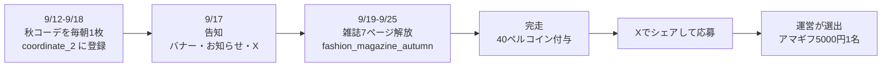
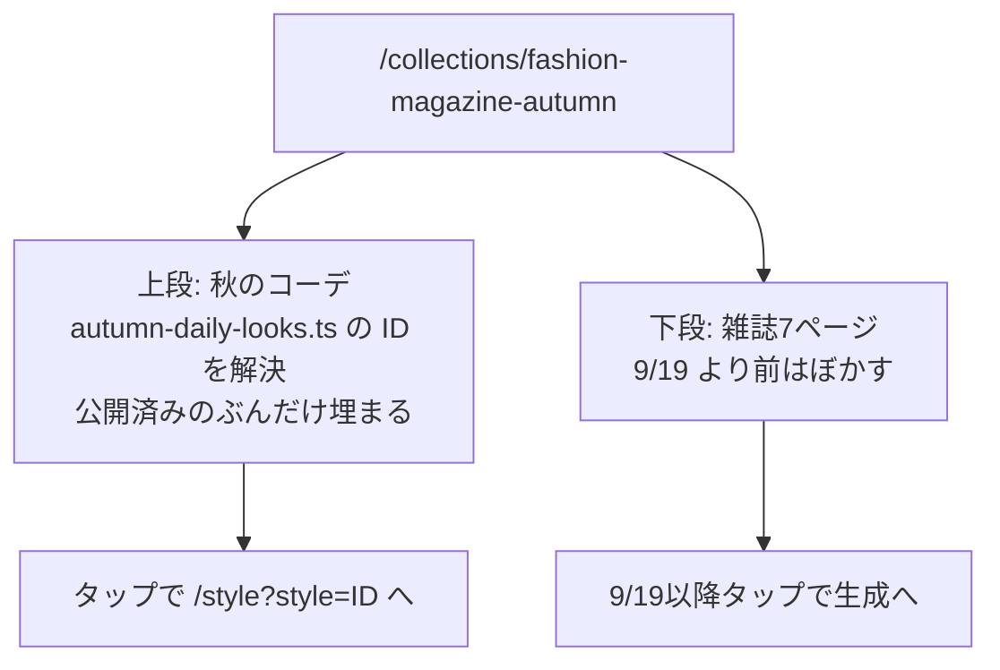
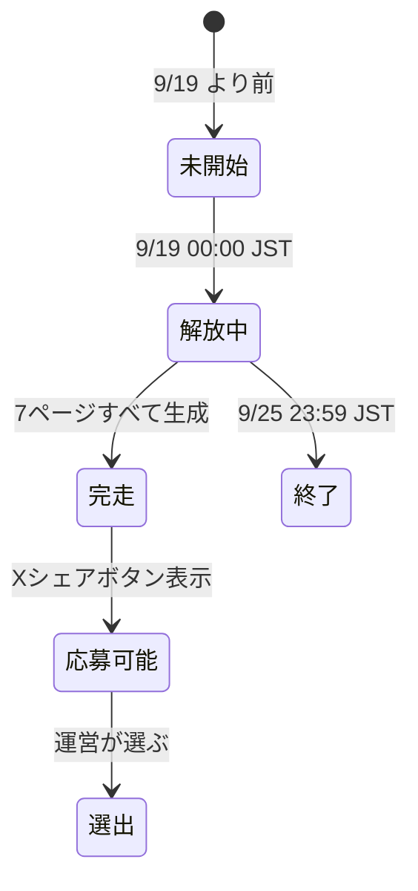
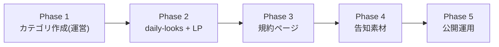

# うちの子のファッション雑誌_秋 実装計画

作成日: 2026-09-11

## 0. 合意事項（ヒアリング 2026-09-11）

| 項目 | 決定 |
|---|---|
| 企画名 | うちの子のファッション雑誌_秋 |
| 第1週 | 2026-09-12(金) 〜 09-18(木)・秋コーデを毎朝1枚（計7枚） |
| 告知 | **2026-09-17**（第1週のコーデが数枚出そろった状態で） |
| 第2週 | 2026-09-19(金) 〜 09-25(木)・雑誌7ページを解放 |
| ページ構成 | COVER / OPENING / MAIN VISUAL / DETAILS / STORY / KEYWORDS / BACK COVER |
| 完走報酬 | 40ペルコイン（夏と同じ） |
| 賞品 | Amazonギフト券 **5,000円 × 1名** |
| 当選者の決め方 | **選出制**（運営が選ぶ）。基準は大まかに示す |
| 第1週の置き場 | **`coordinate_2`（コーディネート2.0）に登録**（豪州と同じ運用） |
| LP の URL | **`/collections/fashion-magazine-autumn` を新設**（夏版はそのまま残す） |
| ハッシュタグ | `#うちの子のファッション雑誌_秋` |

### 前提の検証（実測済み）

無料ユーザーが課金せず完走できることを確認した。**オープン懸賞として成立する前提**であり、
この条件が崩れると企画の法的位置づけが変わる。

| 指標 | 実測（直近14日・内部アカウント除外・課金分を除く） |
|---|---|
| 対象 | 無料プラン 37人 |
| 獲得ペルコイン 中央値 | **140** |
| 完走に必要 | **70**（7ページ × 10pc / ChatGPT Images 2.5 Low） |
| 70以上を獲得した人 | 25人（**68%**） |

---

## 1. コードベース調査結果

### 1-1. 下敷きにする 2 つの既存実装

| 参照元 | 何を借りるか |
|---|---|
| `fashion_magazine_summer`（夏版） | 雑誌カテゴリの構成・LP の構造・規約ページ |
| `travel_to_australia`（豪州版） | 「毎朝1枚の配布 → コレクション解放」の2段構え運用 |

### 1-2. 夏版（fashion_magazine_summer）の実測構成

DB（`preset_categories`）の実値:

| 列 | 値 |
|---|---|
| `key` | `fashion_magazine_summer` |
| `completion_threshold` | 8 |
| `completion_view_mode` | `book`（めくって読む） |
| `sequential_unlock` | true |
| `completion_reward_percoins` | 40 |
| `lottery_target` | true |
| `allow_guest_generation` | false |
| `mount_template_path` | `fashion_magazine_summer/bf968a25-....png` |
| `ogp_template_path` | `fashion_magazine_summer/ogp-template-v1.png` |
| `collection_character_path` | `collection-characters/fashion_magazine_summer/...` |
| 期間 | 2026-08-08 10:00Z 〜 08-16 13:00Z |

実績: **参加者 31人 / 生成 289枚**（1人あたり約9枚。8ページ完走を上回る水準）

ファイル:

| ファイル | 行数 | 役割 |
|---|---|---|
| `app/collections/fashion-magazine/page.tsx` | 55 | metadata（OGP/Twitter）+ `SignupSourceCapture` + Guide |
| `features/collections/components/FashionMagazineGuide.tsx` | 513 | LP 本体。**企画固有値は冒頭の `CAMPAIGN` 定数に集約** |
| `app/campaigns/fashion-magazine-lottery/page.tsx` | 190 | 応募規約（`Section` コンポーネントで 01〜07 の節） |

`FashionMagazineGuide.tsx` 冒頭のコメントに
「期間・賞品などの企画固有値はこのファイル冒頭の定数に集約(終了後の差し替えを1箇所に)」
と明記されており、**再利用を想定した作り**になっている。

### 1-3. 豪州版（travel_to_australia）の2段構え

| ファイル | 役割 |
|---|---|
| `features/collections/lib/australia-daily-looks.ts` | 毎朝のコーデの **preset ID 明示リスト**。`{ day, presetId }` の配列 |
| `app/collections/australia/page.tsx` | `listPublishedStylePresets` で全件取得 → ID リストで `flatMap` して解決 |
| `AustraliaTravelGuide.tsx` | 上段に「旅のあいだ」、下段に「あつめる」。後半未開始の間はサムネをぼかす |

⭐ 設計上の肝（そのまま踏襲する）:

- 毎朝の運用は **`australia-daily-looks.ts` に1行足してデプロイするだけ**
- **未登録・未公開の ID は `flatMap` で黙って落とす**（書き間違えてもページが壊れない）
- 後半の開始判定は `AUSTRALIA_SCRAPBOOK_STARTS_AT` 定数 + **サーバー側で解決して props で渡す**
  （クライアントで `new Date()` を読むと SSR とズレて hydration 警告になる）

### 1-4. 応募ボタンの仕組み

`features/campaigns/components/XLotteryEntryButton.tsx`
- 完走ページの**所有者にだけ**表示される「Xで応募する」ボタン
- `isLotteryEntryOpen(lotteryTarget, entryStartsAt, entryEndsAt, now)` で受付期間を判定
- `ScrapbookReader.tsx:307` から `lotteryTarget` を受け取る

⭐ **`lottery_target` は「応募ボタンを出すか」のフラグでしかなく、抽選/選出の別は持たない。**
選出制でもこのフラグはそのまま true で使える。**表記（文言）だけを変える。**

### 1-5. カテゴリの作成手段

`app/(app)/admin/preset-categories/` に管理画面がある。
誌面台紙・OGP テンプレ・キャラクター画像の**アップロードを伴う**ため、
カテゴリ行は**管理画面から作成する**（migration では作らない）。

---

## 2. 概要図

### 2-1. 企画全体のタイムライン

### 2-2. LP の構成

### 2-3. ページ解放の状態遷移

---

## 3. EARS（要件定義）

### 第1週：秋コーデの配布

- **AUTUMN-001**: When an admin publishes a daily autumn look and adds its preset ID to `autumn-daily-looks.ts`, the system shall display it on the autumn LP in array order.
  運営が秋コーデを公開し `autumn-daily-looks.ts` に ID を追加したとき、LP は配列順でそれを表示すること。

- **AUTUMN-002**: If a preset ID in `autumn-daily-looks.ts` is unregistered, unpublished, or belongs to a hidden category, then the system shall omit it silently without breaking the page.
  ID が未登録・未公開・非公開カテゴリの場合、ページを壊さず黙って省くこと。

### 第2週：雑誌

- **AUTUMN-003**: While the current time is before the magazine start (2026-09-19 00:00 JST), the system shall blur the magazine page thumbnails on the LP.
  雑誌開始前は、LP の雑誌ページのサムネイルをぼかすこと。

- **AUTUMN-004**: The system shall resolve the magazine start判定 on the server and pass it to the client as props.
  雑誌の開始判定はサーバーで解決し、props でクライアントへ渡すこと（hydration ズレ防止）。

- **AUTUMN-005**: When a user generates all 7 pages, the system shall grant 40 percoins and enable the book completion view.
  7ページすべてを生成したとき、40ペルコインを付与し book 完走ビューを有効にすること。

### 応募・選出

- **AUTUMN-006**: While the entry period is open and the viewer owns the completed book, the system shall display the X entry button.
  受付期間中かつ完走物の所有者である間、Xの応募ボタンを表示すること。

- **AUTUMN-007**: The rules page shall state that entry is free and that purchasing percoins does not affect selection.
  規約ページは、応募が無料であること・ペルコインの購入が選出に影響しないことを明記すること。

- **AUTUMN-008**: The rules page shall state that winners are chosen by the operator, and shall describe the criteria in broad terms.
  規約ページは、当選者を運営が選出すること・その観点を大まかに示すこと。

### 異常系

- **AUTUMN-009**: If the category row for `fashion_magazine_autumn` does not exist, then the LP shall fall back to the default threshold and still render.
  カテゴリ行が存在しない場合でも、既定の閾値でページは描画されること（豪州版 `category?.completionThreshold ?? 8` と同じ扱い）。

---

## 4. ADR（設計判断記録）

### ADR-001: 第1週のコーデは専用カテゴリを作らず `coordinate_2` に登録する

- **Context**: 秋コーデ7枚をどこに置くか。専用カテゴリ・雑誌カテゴリへの合流・既存カテゴリの3案があった。
- **Decision**: 秋コーデ7枚は豪州版と同じく `coordinate_2`（コーディネート2.0）に登録し、LP 側は ID の明示リストで拾う。
  雑誌7ページは専用カテゴリ `fashion_magazine_autumn` に置き、**完走条件は 7 ページ**とする（両者は別カテゴリ）。
- **Reason**:
  - カテゴリを増やすとホームの企画棚も増え、導線が散る（豪州版で同じ判断をしている）
  - 企画終了後も**通常のコーデとして残り続ける**。資産が積み上がる
  - （不採用案）雑誌カテゴリに秋コーデも合流させると完走条件が 7+7=14 ページになり、**完走のハードルが2倍**になって完走率が落ちる
- **Consequence**: DB からは「どれが企画のコーデか」を判別できない。`autumn-daily-looks.ts` が唯一の正本になるため、**毎朝の追記を忘れると LP に出ない**。

### ADR-002: LP は新しい URL に置き、夏版を残す

- **Context**: `/collections/fashion-magazine` を差し替えるか、新設するか。
- **Decision**: `/collections/fashion-magazine-autumn` を新設する。
- **Reason**: 豪州・イタリア・ことわざと同じく**企画ごとに1ページ**という既存方針。過去企画のページが生き続け、SEO と被リンクも保たれる。
- **Consequence**: 似たコンポーネントが 2 つ並ぶ。共通化はせず**コピーして秋向けに書き換える**（下記 ADR-003）。

### ADR-003b: LP は装飾主体をやめ、写真主体のルックブックにする

- **Context**: 初稿は月・ススキ・うさぎのイラストを敷き詰めた作りにしたところ、運営から
  **「とてもダサい」**と差し戻された。参考として B:MING by BEAMS の 2021 AUTUMN が示された。
- **Decision**: 装飾をすべて外し、**写真が面積の 7〜8 割を占めるルックブック**に作り替える。
  罫線・囲み・飾りはゼロ。地はほぼ白。見出しは大きな欧文 + 小さな和文。リードは縦組み。
- **Reason**: 失敗の原因は**写真が無い余白を装飾で埋めた**こと。ブランドのLPが成立するのは
  写真が強いから何も足さなくてよいためで、順序が逆だった。運営から秋コーデ7枚の
  作例が入稿されたことで、写真主体が成立する条件が整った。
- **Consequence**:
  - 入稿されたお月見のイラスト7点(月・ススキ・雲・灯籠・お供え・うさぎ・円環)は**LPでは使わない**。
    お知らせ・バナー・X 投稿で活かす
  - 十五夜のモチーフは**写真(和装のルック)と文言**で出す
  - 迷ったら「文字と線を減らし、写真を大きくする」

### ADR-003: Guide コンポーネントは共通化せずコピーする

- **Context**: `FashionMagazineGuide.tsx`(513行) を秋版でどう扱うか。パラメータ化して共用する案もある。
- **Decision**: `FashionMagazineAutumnGuide.tsx` として**コピーし、秋向けに書き換える**。
- **Reason**:
  - LP は**デザインそのものが企画の顔**で、季節ごとに配色・コピー・構成を変える前提。共通化すると分岐だらけになる
  - 既存の企画LP（豪州・イタリア・ことわざ・神コレ）も**すべて独立コンポーネント**。既存方針に揃える
  - 夏版に手を入れないので、**公開中の夏ページを壊すリスクがゼロ**
- **Consequence**: 共通の修正（例: シェア導線の仕様変更）は 2 箇所に入れる必要がある。

### ADR-004: 選出制でも `lottery_target` はそのまま true で使う

- **Context**: 抽選から選出に変わるが、DB のフラグ名は `lottery_target`。
- **Decision**: フラグはそのまま true で使い、**文言だけを「抽選」→「選出」に変える**。列名は変えない。
- **Reason**: このフラグは「応募ボタンを出すか」しか決めておらず、抽選/選出の別を持っていない（`XLotteryEntryButton` / `isLotteryEntryOpen`）。列名変更は夏・ことわざ企画にも波及し、得るものがない。
- **Consequence**: 列名と実態がわずかにズレる。`.cursor/rules/database-design.mdc` に「抽選・選出どちらの企画でも使う応募ボタンのフラグ」と注記して誤読を防ぐ。

### ADR-005: 選出制でもオープン懸賞の要件を夏と同じに保つ

- **Context**: 「抽選」から「選出」に変えると景品表示法上の扱いが変わるのではないか、という論点。
- **Decision**: 夏版と**同じ設計を維持する**（課金不要で完走できる／課金は選出に影響しない旨を明記）。
- **Reason**: 景表法の「懸賞」は、くじ等の偶然性だけでなく**「特定の行為の優劣又は正誤によって定める方法」も含む**。したがって選出（審査）も懸賞であり、必要な条件は変わらない。
- **Consequence**: 規約の文言を「抽選」→「選出」に置き換えつつ、**無料で参加できる旨の記載は必ず残す**。実測でも無料ユーザーの獲得中央値 140pc ＞ 必要 70pc を確認済み。

---

## 5. 実装計画（フェーズ + TODO）

### Phase 1: カテゴリ作成（運営の手作業）

**目的**: `fashion_magazine_autumn` が DB に存在し、7ページ分のプリセットが登録されている。
**ビルド確認**: コード変更なし。

- [ ] 管理画面 `/admin/preset-categories` で `fashion_magazine_autumn` を作成
  - `completion_threshold` = **7** / `completion_view_mode` = `book` / `sequential_unlock` = true
  - `completion_reward_percoins` = 40 / `lottery_target` = true / `allow_guest_generation` = false
  - `visibility` = **admin_only**（9/19 まで一般に出さない）
  - `collection_display_starts_at` = 2026-09-18 15:00Z（= 9/19 00:00 JST）
  - `collection_display_ends_at` = 2026-09-25 14:59Z（= 9/25 23:59 JST）
  - `hashtag_suggestions` に `うちの子のファッション雑誌_秋` を含める
- [ ] 誌面台紙（`mount_template_path`）・OGP テンプレ（`ogp_template_path`）・キャラクター画像をアップロード
  - ⚠️ 台紙は **PNG で保存**（WebP は 415 で弾かれる）
- [ ] 7ページ分のプリセットを登録（COVER / OPENING / MAIN VISUAL / DETAILS / STORY / KEYWORDS / BACK COVER）
- [ ] 第1週の秋コーデ7枚を `coordinate_2` に登録（毎朝1枚ずつ公開）

### Phase 2: daily-looks と LP

**目的**: `/collections/fashion-magazine-autumn` が表示され、公開済みの秋コーデが順に埋まる。
**ビルド確認**: 4検証コマンドが通る。ID を1件も登録していなくてもページが壊れない。

- [ ] `features/collections/lib/autumn-daily-looks.ts` を新規作成
  - 既存 `australia-daily-looks.ts` を写す（`{ day, presetId }` 配列 + 開始判定関数）
  - `AUTUMN_MAGAZINE_STARTS_AT = "2026-09-19T00:00:00+09:00"`
  - `hasAutumnMagazineStarted(now)` を export（**サーバーで解決して props で渡す**）
- [ ] `features/collections/components/FashionMagazineAutumnGuide.tsx` を新規作成
  - `FashionMagazineGuide.tsx` をコピーし、冒頭の `CAMPAIGN` 定数を秋向けに差し替え
    - `issueLabel: "AUTUMN ISSUE 2026"` / `periodLabel: "9/19(金) 〜 9/25(木)"` / `pageCount: 7`
    - `prizeLabel: "Amazonギフト券 5,000円分"` / `winnersLabel: "1名様"`
    - `hashtag: "うちの子のファッション雑誌_秋"` / `rulesPath: "/campaigns/fashion-magazine-autumn-selection"`
  - `CONTENTS` を 7 ページに（EDITOR'S NOTE を落とす）
  - 上段に「秋のコーデ」セクションを追加（豪州版 `AustraliaTravelGuide` の「旅のあいだ」を参考）
  - ⭐ 文言を「抽選」→「選出」に置換（3箇所以上ある。`alt` 属性も含めて漏れなく）
- [ ] `app/collections/fashion-magazine-autumn/page.tsx` を新規作成
  - 豪州版 `app/collections/australia/page.tsx` を参考に、`listPublishedStylePresets` → ID リストで解決
  - `SignupSourceCapture fallbackSource="fashion_magazine_autumn"`
  - metadata（OGP/Twitter）を秋向けに
- [ ] OGP 画像 `/collections/fashion-magazine-autumn/ogp.jpg` を配置
- [ ] テスト: `autumn-daily-looks` の解決（未登録 ID を落とす / 開始判定の境界）

### Phase 3: 規約ページ（選出制）

**目的**: 応募規約が選出制の表記になっている。
**ビルド確認**: 4検証コマンドが通る。

- [ ] `app/campaigns/fashion-magazine-autumn-selection/page.tsx` を新規作成
  - `app/campaigns/fashion-magazine-lottery/page.tsx`（190行）を写す
  - ⭐ 「抽選」→「選出」へ。**「運営が選びます」と、選ぶ観点を大まかに書く**
  - ⭐ **「応募は無料です」「ペルコインの購入は選出に一切影響しません」は必ず残す**（ADR-005）
  - 賞品を 5,000円 × 1名 に
  - 発表方法・時期（夏は「約1週間を目処に」）を秋の日程に

### Phase 4: 告知素材（9/17 に出す）

**目的**: 告知の下書きが揃っている。
**ビルド確認**: コード変更なし（DB の下書きのみ）。

- [ ] お知らせを下書きで作成（画像添付）
- [ ] ホームバナー / ポップアップを下書きで作成（`link_url` = `/collections/fashion-magazine-autumn`）
- [ ] X 投稿文面を用意（文字数は X の重み付けで 280 以内）

### Phase 5: 公開運用

**目的**: 予定どおり公開される。

- [ ] 9/12〜9/18 毎朝: 秋コーデを1枚公開 → `autumn-daily-looks.ts` に1行追記 → デプロイ
- [ ] 9/17: 告知（お知らせ・バナー・ポップアップを published に / X 投稿）
- [ ] 9/19: 雑誌カテゴリを `admin_only` → `public` に
- [ ] 9/25: 会期終了（表示期間で自動的に閉じる）
- [ ] 終了後: 選出 → 当選連絡 → `retrospective_note` に振り返りを記録

---

## 6. 修正対象ファイル一覧

| ファイル | 操作 | 変更内容 |
|---|---|---|
| `features/collections/lib/autumn-daily-looks.ts` | 新規 | 秋コーデの ID リスト + 雑誌開始判定 |
| `features/collections/components/FashionMagazineAutumnGuide.tsx` | 新規 | 秋版 LP（写真主体のルックブック） |
| `public/collections/fashion-magazine-autumn/looks/*.webp` | 新規 | 秋コーデ7枚の作例（運営入稿） |
| `tests/unit/features/collections/fashion-magazine-autumn-guide.test.tsx` | 新規 | 縦組みの組版ガード（縦中横） |
| `app/collections/fashion-magazine-autumn/page.tsx` | 新規 | ルート・metadata・プリセット解決 |
| `app/campaigns/fashion-magazine-autumn-selection/page.tsx` | 新規 | 応募規約（選出制） |
| `public/collections/fashion-magazine-autumn/ogp.jpg` | 新規 | OGP 画像 |
| `tests/unit/features/collections/autumn-daily-looks.test.ts` | 新規 | ID 解決・開始判定の境界 |
| `.cursor/rules/database-design.mdc` | 修正 | `lottery_target` の注記（抽選・選出どちらでも使う） |

DB（管理画面から手作業・migration なし）:

| 対象 | 操作 |
|---|---|
| `preset_categories` | `fashion_magazine_autumn` を1行追加 |
| `style_presets` | 雑誌7枚 + 秋コーデ7枚（後者は `coordinate_2`） |
| `admin_announcements` / `banners` / `popup_banners` | 告知の下書き |

---

## 7. 品質・テスト観点

### 品質チェックリスト

- [ ] **ID の取りこぼし**: `autumn-daily-looks.ts` に未登録・未公開の ID があってもページが壊れないこと
- [ ] **hydration**: 開始判定を**サーバーで解決**して props で渡していること（クライアントで `new Date()` を読まない）
- [ ] **文言の置換漏れ**: 「抽選」が秋版に残っていないこと（`alt` 属性・メタデータも含む）
- [ ] **法令**: 「応募は無料」「課金は選出に影響しない」が規約にあること
- [ ] **i18n**: LP は日本語のみ（既存の企画LPと同じ扱い）

### テスト観点

| カテゴリ | 内容 |
|---|---|
| 正常系 | 登録済み ID が配列順に並ぶ / 7ページ完走で 40pc |
| 異常系 | 未登録 ID を黙って落とす / カテゴリ行が無くても描画される |
| 境界 | 雑誌開始の判定（9/19 00:00 JST の前後） |
| 実機確認 | モバイルで LP のレイアウト・ぼかし表示 |

---

## 8. ロールバック方針

| 対象 | 戻し方 |
|---|---|
| 雑誌カテゴリ | `visibility` を `admin_only` に戻す（ユーザーから即座に消える） |
| LP | ページを消さず、バナー・お知らせを下書きに戻せば導線が消える |
| 秋コーデ | `coordinate_2` の通常コーデなので、企画を中止しても**そのまま残して問題ない** |
| コード | フェーズごとにコミットし、PR 単位で revert 可能 |

---

## 9. 使用スキル

| スキル | 用途 | フェーズ |
|---|---|---|
| `/implementation-planning` | 本計画書 | 計画 |
| `/git-create-pr` | PR 作成 | Phase 2・3 |

---

## 10. 未確定・運営の判断が要る事項

- [ ] 雑誌7ページのプロンプト（中身5ページは「夏と同じ系統」で合意済み。具体の作り込みは未着手）
- [ ] 秋コーデ7枚のプロンプトとサムネイル
- [ ] 誌面台紙・OGP・キャラクター画像
- [ ] 選出の「観点」の具体的な文言（規約に載せる）
- [ ] 当選連絡の方法（夏は X の DM 想定か要確認）
