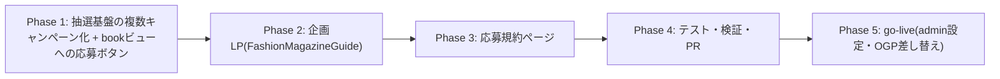

# うちの子のファッション雑誌：夏 企画LP＋Xシェア抽選 実装計画書

作成日: 2026-08-07
ステータス: 承認済み・実装完了（Phase 5 の go-live のみ残）

## ゴール

`fashion_magazine_summer`（8枚構成・book 完走ビュー）の企画ページと、Xシェア抽選キャンペーンを公開する。

- 企画LP: `/collections/fashion-magazine` — **雑誌らしい洗練されたエディトリアルデザイン**で、遊び方をわかりやすく
- 抽選: コンプリート → シェアページを X で公開投稿（@mickey_fuku メンション＋タグ）→ **抽選で5名に Amazonギフト2,000円分**。当選連絡は X の DM

## 決定事項（ユーザー確定 2026-08-07）

| 項目 | 決定 |
|---|---|
| 開催・応募期間 | **2026-08-08(土) 19:00 〜 08-16(日) 21:59（JST）** |
| ハッシュタグ | **#うちの子のファッション雑誌** |
| フォロー条件 | **@mickey_fuku のフォローを応募条件に含める**。理由を規約に明記（当選連絡を X の DM で行うため、フォロー外だと DM を受け取れない設定の方が多い）— フォロワー稼ぎ目的に見えないよう、理由をセットで書く |
| 年齢条件 | **18歳以上**（前回ことわざ企画と同一。日本在住・公開アカウント条件も踏襲） |
| 賞品 | Amazonギフト券 2,000円分 × **5名**（前回は 3,000円 × 1名） |
| URL | `/collections/fashion-magazine`（規約は `/campaigns/fashion-magazine-lottery`） |
| OGP・イラスト | 後日ユーザーから共有。**プレースホルダで実装し、届き次第差し替え** |
| 規約の文言 | **完全に書き下ろし**。参考にした他社企画の文面は構成の参考にとどめ、表現は一切流用しない。構成は自社の前回規約（主催者/応募期間/参加資格/応募方法/賞品/抽選・当選発表/無効となる場合）を踏襲 |

## コードベース調査結果

| 対象 | 場所 | 現状 |
|---|---|---|
| 企画LPの型 | `app/collections/wafer/page.tsx`（薄いページ）＋ `features/collections/components/WaferGuide.tsx`（557行のセクションLP） | kotowaza も同型。新規 `FashionMagazineGuide` を同じ配置で作る |
| 抽選ボタン | `features/campaigns/components/XLotteryEntryButton.tsx` | 所有者のみ・受付期間中のみ表示。タップで X の投稿画面（intent）を開く |
| 抽選設定 | `features/campaigns/x-lottery-campaign.ts` `X_LOTTERY_COPY` | **ことわざ専用の単一定数**（タグ・メンション・賞品名・規約パス）。ボタン内の「抽選で1名様に」も固定文言 → **カテゴリ別設定へ拡張が必要** |
| 対象カテゴリ判定 | `preset_categories.lottery_target` ＋ 表示期間の流用 | `fashion_magazine_summer` は **lottery_target=true 設定済み**。期間は現在テスト値（本日数時間）→ 本番値へ更新が必要 |
| 規約ページの型 | `app/campaigns/kotowaza-lottery/page.tsx`（196行・7セクション） | 同構成で新規ページを書き下ろす |
| **応募ボタンの表示場所** | `app/m/[token]/page.tsx`（台紙ビュー）のみ | **book ビュー（`/m/[token]/book`）には無い**。雑誌は book 表示なので、**追加しないと応募動線が成立しない** |
| カテゴリの現状 | visibility=`admin_only` / 8プリセット全て published / threshold=8 | go-live は「期間設定＋public 化」 |
| 法務方針の先例 | ことわざ企画（メモリ `persta-x-share-lottery-campaign`） | **オープン懸賞に倒す**: 参加無料・課金は当選確率に非影響・無料ペルコインで完走到達可能（8枚×最低10コイン=80。登録50＋ツアー20＋デイリー等で数日あれば無課金到達可）・1完走=1応募・公開アカウント限定 |

## 「Xで応募する」ボタンの挙動（現行実装）

1. 完走ページに**所有者だけ**・**受付期間中だけ**表示される（期間はクライアント時刻で判定）
2. タップすると **X の投稿作成画面が新しいタブで開く**。本文は「定型メッセージ＋@メンション」、URL（シェアページ＝OGPカード）、ハッシュタグが**あらかじめ入力済み**
3. ユーザーは内容を確認して**投稿ボタンを押すだけ**（自動投稿はされない。編集も可能）
4. ボタンの下に「応募規約・注意事項をみる」リンク

## 実装計画

### Phase 1: 抽選基盤（DB変更なし）

- [ ] `x-lottery-campaign.ts` — `X_LOTTERY_COPY` を**カテゴリ key 別の設定マップ**へ拡張
      （`hashtags` / `mention` / `message` / `prizeLabel` / **`winnersLabel`（「5名様」）** / `rulesPath`）。
      ことわざ設定は履歴として残し、`fashion_magazine_summer` を追加
- [ ] `XLotteryEntryButton` — `categoryKey` を受け取り設定を引く。「抽選で**1名様**に」の固定文言を設定値に
- [ ] **book ビューへの応募ボタン追加** — `/m/[token]/book` の**所有者のみ**に、台紙ビューと同じゲート
      （lottery_target × 期間内）で表示。**応募 intent の URL は book ビューの共有URLを使う**
      （`buildPublicMountUrl` が book に対応しているか実装時に確認し、必要なら book 用のURL組み立てを追加）
- [ ] 台紙ビュー側は categoryKey を渡すだけの変更（挙動不変）

### Phase 2: 企画LP `/collections/fashion-magazine`

- [ ] `app/collections/fashion-magazine/page.tsx`（メタデータ・OGPはプレースホルダ画像）
- [ ] `features/collections/components/FashionMagazineGuide.tsx` — **雑誌テイスト**:
      セリフ体見出し・余白の広いレイアウト・モノトーン＋差し色・「VOL. / SUMMER ISSUE」等の誌面的なあしらい。
      神コレのポップ路線とは意図的に別方向へ
- [ ] セクション構成（wafer の型を踏襲しつつ雑誌向けに再構成）:
      1. ヒーロー（表紙ビジュアル・期間・「全8ページの雑誌を、うちの子で。」）
      2. できあがるもの（8ページの誌面構成を目次風に紹介: 表紙〜裏表紙）
      3. 遊び方 3ステップ（写真を選ぶ → 8種類を生成 → コンプリートで1冊完成）
      4. **キャンペーン**（賞品・応募方法・期間・規約リンク）
      5. CTA（/style へ）
- [ ] `/collections` の一覧ページに導線があるか確認し、必要なら追加

### Phase 3: 応募規約 `/campaigns/fashion-magazine-lottery`

- [ ] kotowaza 規約と同じ7セクション構成で**全文書き下ろし**:
      主催者（Persta.AI 運営）/ 応募期間（8/8 19:00〜8/16 21:59）/
      参加資格（日本在住・18歳以上・**X の公開アカウント**）/
      応募方法（①雑誌8ページをコンプリート ②完走ページを「Xで応募する」から公開投稿
      （@mickey_fuku メンション＋ #うちの子のファッション雑誌）③**@mickey_fuku をフォロー
      —— 当選のご連絡を X の DM で行うため、フォローいただいていないと DM をお届けできない場合があります**）/
      賞品（Amazonギフト券2,000円分×5名）/
      抽選・当選発表（期間終了後に抽選し、当選者へ X の DM で連絡。DM への返信をもって確定）/
      無効となる場合（非公開アカウント・タグやメンションの欠落・応募後の投稿削除・複数アカウント等）
- [ ] **オープン懸賞の明記**: 応募は無料、ペルコインの購入有無は当選確率に影響しない、
      無料ペルコインでもコンプリート到達可能である旨

### Phase 4: テスト・検証・PR

- [ ] 設定マップの単体テスト（カテゴリ別の解決・未知カテゴリは非表示）
- [ ] intent URL の組み立て（メッセージ・メンション・タグ・URL）
- [ ] book ビューの応募ボタン表示条件（所有者のみ・期間外は非表示・lottery_target=false は非表示）
- [ ] `npm run lint` / `typecheck` / `test` / `build -- --webpack`
- [ ] PR（計画書同梱・日本語）

### Phase 5: go-live（マージ・デプロイ後、ユーザーと一緒に）

- [ ] admin でカテゴリ期間を本番値へ: 表示期間 = **8/8 19:00 JST 〜 8/16 22:00 JST**
      （終了判定は「〜21:59:59 まで有効」となる。応募受付も同じ期間を流用）
- [ ] OGP画像・イラストの差し替え（ユーザーから共有され次第）
- [ ] visibility を `admin_only` → `public` へ（**8/8 19:00 の公開作業**。期間ゲートがあるため事前に public 化しても 19:00 までは出ないが、公開タイミングは当日ユーザーと確認）
- [ ] 実機確認: LP表示 / 生成 → 8枚コンプリート → book 表示 → 応募ボタン → X 投稿画面の内容

## 品質・テスト観点

- [ ] **応募動線が book ビューで成立する**（雑誌カテゴリの完走ページにボタンが出る）
- [ ] **ことわざ側の非回帰**: 既存の台紙ビュー・設定が壊れない（受付は終了済みだが表示ロジックは共通）
- [ ] 期間外・非対象カテゴリ・非所有者でボタンが出ない
- [ ] 規約の文言が書き下ろしであること（他社文面の流用なし）
- [ ] LP はモバイル最適（企画流入はほぼモバイル）

## ロールバック方針

- DB 変更なし。LP・規約は新規ページなので revert のみで消える
- 抽選の停止は admin の `lottery_target` を false にするだけ（コード変更不要）
