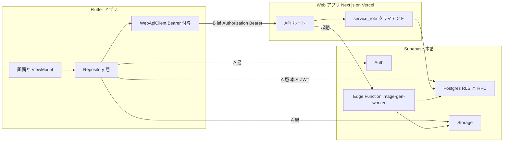
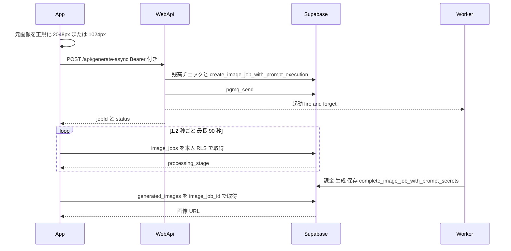
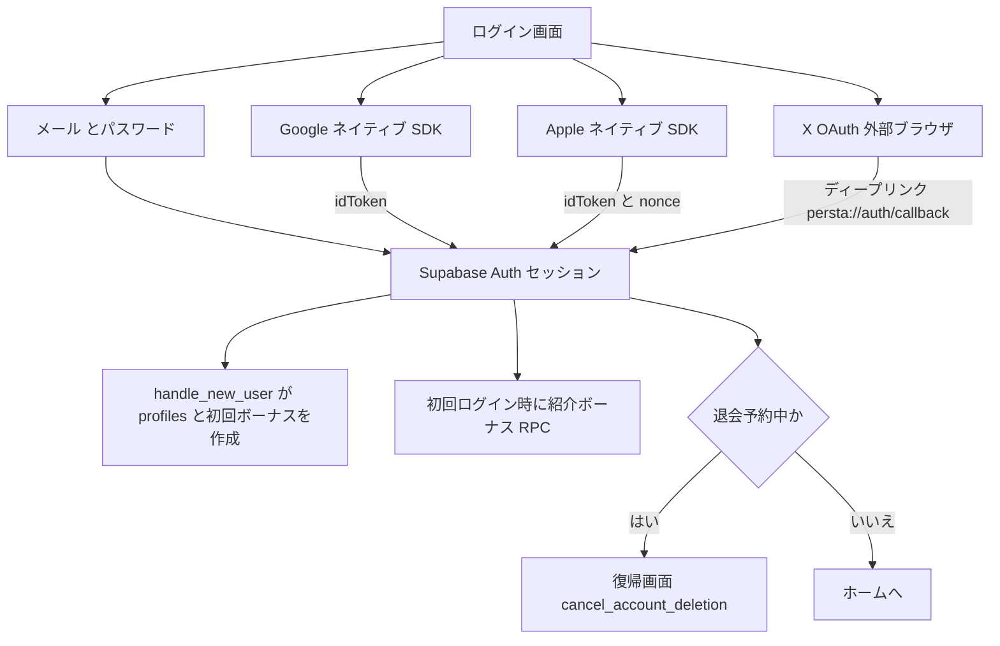
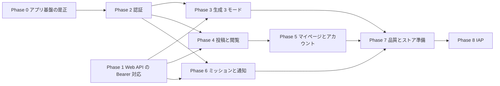

# Flutter アプリ（persta-app）Web 同等化 実装計画

- 作成日: `2026-09-03`
- 対象: `3balljugglerYu/persta-app`（Flutter。main `222215f` 時点）と、本リポジトリ（Web）側の改修
- ステータス: 計画（未着手）
- 正本ドキュメント: `docs/product/screen-flow.md`、`docs/architecture/data.ja.md`、`scripts/check-rpc-grants.mjs`、`docs/API.md`
- 調査方法: 両リポジトリを読み、本番 DB は読み取りクエリ（`supabase db query --linked`）で実測。`file:line` を添えていない記述は仮定として扱う

## 0. ヒアリング結果と前提

| 項目 | 決定 |
| --- | --- |
| スコープ | コア体験まで。認証・ホーム・生成 3 モード・投稿・いいね／コメント／フォロー・通知・マイページ・ミッション・ペルコイン残高。コレクション／企画、絵師カタログ、Inspire、管理画面は対象外 |
| 決済 | 残高と履歴の表示のみ。購入は最終フェーズで IAP（ストア内課金） |
| 認証 | メール＋Google＋Apple＋X |
| リリース | iOS と Android を同時。各フェーズを TestFlight と内部テストで検証 |

計画内で仮定として扱うもの:

- i18n はアプリの現行どおり en／ja の 2 言語（Web の 15 ロケールには追随しない）
- Push 通知は対象外（Web にも送信実装が無く、アプリ内通知のみ）
- 未認証のお試し生成（Web の `/coordinate` 1 日 1 回）はアプリでは提供しない（ADR-005）
- アプリ側の各フェーズは persta-app の Spec Kit（`/speckit.specify` → `/speckit.plan` → `/speckit.tasks`）で仕様化してから実装する（persta-app の constitution 原則 I）

## 1. コードベース調査結果

### 1.1 結論: アプリから Web バックエンドへ到達する 2 系統

アプリと Web は同一の Supabase 本番プロジェクトを共有している（`persta-app/lib/configs/supabase_config.dart:5` の URL と Web の `NEXT_PUBLIC_SUPABASE_URL` が同一プロジェクト参照）。したがって「同等化」の本質は、機能ごとに次のどちらの経路で到達するかを決め、経路が無いものは Web 側に穴を開けることになる。

| 層 | 経路 | 使える条件 | 対象機能 |
| --- | --- | --- | --- |
| A 層 | Supabase 直接（anon key ＋ 本人 JWT、RLS 適用） | テーブルが RLS で本人／公開に開いている、または RPC が `authenticated` に許可されている | 認証、いいね、コメント、フォロー、ブロック、プロフィール編集、統計・残高・履歴、ストック画像、ジョブ進捗、通知の既読、ミッション状態、バナー、閲覧数 |
| B 層 | Web の API ルート（`Authorization: Bearer <access_token>`） | **現状は不可**。Phase 1 で Web 側に Bearer 対応を入れる | 生成 3 モード、投稿（ボーナス付与）、フィード一覧（可視性フィルタ済み）、ハッシュタグ／検索、🔥人気、プロンプト利用（派生）、通報、アバター、通知一覧、運営アナウンス、お問い合わせ、退会申請 |

B 層が現状不可である根拠:

- サーバー用 Supabase クライアントは Cookie からしかセッションを読まない（`lib/supabase/server.ts:9-38`）。全 API の認証入口 `getUser()` もこれに乗る（`lib/auth.ts:18-25`）
- 更新系 24 ルートは `ensureSameOrigin()` で Origin ヘッダーを検査し、無ければ 403（`lib/security/same-origin.ts:17-30`）。生成 2 ルート（`app/api/generate-async/handler.ts`、`app/(app)/style/generate-async/handler.ts`）が該当する
- `proxy.ts` は `/api` も対象で（`proxy.ts:204-215`）、Cookie からセッションを解決し（`proxy.ts:88-96`）、退会中ユーザーの `/api` を 403 にする（`proxy.ts:129-142`）。Bearer だけのリクエストは `userId = null` として素通りするため、退会チェックは Bearer 側で再実装が必要

### 1.2 Web 側の事実

- 生成の受付: `POST /api/generate-async` は JSON で `prompt, sourcePostId, sourceImageBase64, sourceImageMimeType, sourceImageStockId, sourceImageGeneratedId, sourceImageType, backgroundMode, generationType, model, styleTemplateId, overrides, framingMode, creatorLooksMode, outputAspectRatioMode` を受け（`app/api/generate-async/handler.ts:125-153`、スキーマは `features/generation/lib/schema.ts:53`）、`{ jobId, status }` を返す（`handler.ts:633-636`）。ジョブ作成は service_role 専用 RPC `create_image_job_with_prompt_execution`（`supabase/migrations/20260729140000_fix_job_creation_rpc_dropped_column.sql:100-103`）、キュー投入 `pgmq_send` も service_role 専用（`supabase/migrations/20260831120000_lock_down_anon_rpc_execute.sql:85-88`）、その後 Edge Function `image-gen-worker` を起動する（`handler.ts:593-594`）
- One-Tap Style の受付: `POST /style/generate-async` は multipart で `styleId, uploadImage, sourceImageStockId, sourceImageGeneratedId, sourceImageType, backgroundChange, model, framingMode, outputAspectRatioMode, userPrompt, posePrompt` を受ける（`app/(app)/style/generate-async/handler.ts:147-165`）。プリセットの秘匿プロンプトと解放ゲートの認可はサーバー側にある（同 `:171-190`）
- 進捗: `GET /api/generation-status?id=`（`app/api/generation-status/route.ts:117-128`）があるが、`image_jobs` は本人 SELECT が RLS で開いている（`docs/architecture/data.ja.md` RLS 要約）ため、アプリは直接ポーリングできる
- 投稿: `POST /api/posts/post` は admin client で `grant_daily_post_bonus`（service_role 専用）を呼ぶ（`app/api/posts/post/route.ts:26-37`）。アプリからは API 経由が必須
- フィード: `GET /api/posts` は認証不要で `limit / offset / sort / q` を受け、`sort` は `newest, following, daily, week, month, popular, popular_prompts`（`app/api/posts/route.ts:21-53`）。`following` は本人解決が必要なので Bearer 対応後に使う
- 投稿詳細: JSON API は無い（`app/api/posts/[id]/route.ts` は DELETE のみ）。詳細は RSC 側で admin client ＋ 可視性再フィルタ（`features/posts/lib/server-api.ts`）。アプリは公開行の直読みで代替する
- 新規登録の初期化: `auth.users` の trigger `handle_new_user()` が `profiles`、初回ボーナス、`user_credits`、紹介コードを作る（`docs/architecture/data.ja.md:150-170`）。`signup_source` は `raw_user_meta_data->>'signup_source'` から拾う（`supabase/migrations/20260817100000_relax_handle_new_user_signup_source.sql`）。アプリ経由の登録でも自動で揃う
- 認証プロバイダ: メール／Google／X（`features/auth/lib/auth-client.ts:916`）。Apple は無い。X は state 500 文字制限の回避で localStorage と `/auth/callback?p=x` → `/auth/x-complete` を使う（`auth-client.ts:947-975`）
- クライアントから呼べる RPC の正本: `scripts/check-rpc-grants.mjs:49-96`。`get_percoin_balance_breakdown` 等の SECURITY INVOKER 関数は同スクリプトの対象外だが、Web のブラウザから呼んでいるので `authenticated` で実行できる（`features/my-page/lib/api.ts:178,244,272`）
- Realtime: 本番 DB の `supabase_realtime` publication に属するテーブルは **0 件**（`pg_publication_rel` を実測）。Web の `postgres_changes` 購読（`features/notifications/hooks/useNotifications.ts:419-421` ほか）は現状発火していないと考えられる。アプリは Realtime に依存しない
- 元画像の正規化: 2 MB 超は長辺 1024px の JPEG 品質 70、それ以外は 2048px 品質 80（`features/generation/lib/normalize-source-image.ts:81-120`）。Vercel の 4.5 MB 本文上限に収めるための必須処理
- アバター: サーバーで WebP 化して `avatars/{userId}/{timestamp}.{ext}` に保存（`app/api/users/[userId]/avatar/route.ts:112-140`）
- 決済: Stripe Checkout と Webhook（`app/api/credits/checkout/route.ts`、`app/api/stripe/webhook/route.ts`）。冪等性は `stripe_payment_intent_id` の部分ユニーク索引（`supabase/migrations/20260111000649_add_stripe_idempotency_index.sql:9`）。サブスクは free／light／standard／premium（`features/subscription/subscription-config.ts`）
- 機能フラグ: `NEXT_PUBLIC_SEARCH_ENABLED`、`NEXT_PUBLIC_POPULAR_PROMPTS_ENABLED`、`NEXT_PUBLIC_POST_IMPRESSIONS_ENABLED`、`NEXT_PUBLIC_INSPIRE_ENABLED`、`NEXT_PUBLIC_CATALOG_ENABLED` ほか（`lib/env.ts`）。検索と人気は API 側でも判定している（`app/api/posts/route.ts:53` 以降）
- Push 通知の送信実装は無い（`push_subscriptions` テーブルは未使用）

### 1.3 アプリ側の事実

- スタック: Flutter 3.38.9（fvm）、hooks_riverpod 2.6、auto_route 9.3、freezed、slang、supabase_flutter 2.12（`persta-app/pubspec.yaml`、`.fvm/fvm_config.json`）。層構成は `domain/{models,failures,repository}` → `presentation/{providers,screens,components}` → `services`
- 設定: URL と publishable key がハードコード。`--dart-define` 版はコメントアウト（`lib/configs/supabase_config.dart:4-8`）
- 認証: メール＋パスワードのみ（`lib/domain/repository/auth_repository.dart:66-69`）。Supabase 未設定時はメールと平文パスワードを SharedPreferences に保存するモック（`auth_repository.dart:83-92`、`lib/services/local_storage_service.dart:7-9`）。新規登録・再設定・OAuth・ディープリンク設定は無い
- 生成: `image_jobs` へ直接 INSERT（`prompt_text` を含む。`lib/domain/repository/coordinate_repository.dart:96-117`）し `pgmq_send` を呼ぶ（`:125-132`）。本番では `prompt_text` は常に空という CHECK（`supabase/migrations/20260730100000_contract_generated_images_prompt.sql:527-529`）と権限で失敗し、例外を握りつぶして経過時間ベースのモック生成に落ちる（`coordinate_repository.dart:153-155, 215-217, 279-281, 511-513`、モック画像 `:657-660`）。ユーザーには偽の成功が見える
- 元画像: `generated-images/temp/{userId}/…` へ直接アップロード（`coordinate_repository.dart:320-344`）。リサイズ無し（`coordinate_generation_form_section.dart:401-403`）。ストック選択は `picsum.photos` のダミー 3 件固定（`:492-495`）
- ホーム: `generated_images` 直読み（`lib/domain/repository/home_repository.dart:82-90`）。オススメは最大 1000 行を取ってメモリで集計（`:175-220`）。ブロック／通報の可視性フィルタは無い。検索バーは殻（`home_page.dart:432-449`）
- マイページ: 統計は全行取得して Dart で数える（`lib/domain/repository/my_page_repository.dart:179-234`）。残高内訳は 0 固定（`:106-113`）。操作はログアウトのみで、購入・履歴・アカウント・お問い合わせは no-op（`my_page_page.dart:72-96, 569, 590`）
- ミッション・お知らせ: 静的プレースホルダ（`challenge_page.dart:30-91`、`notifications_page.dart:30-91`）
- 端末設定: Android の本番マニフェストに INTERNET 権限が無い（debug／profile のみ）。iOS に `NSPhotoLibraryUsageDescription` と `CFBundleURLTypes` が無い
- テスト: 6 件。全て「Supabase 未設定」経路のみ（`test/test_app.dart:20-26`）
- i18n: en／ja で 180 キー。ハードコード英語が一部残る（`my_page_page.dart:198-200, 600`）

### 1.4 参考にする既存実装

| 用途 | 参考ファイル |
| --- | --- |
| 認証クライアント（Web） | `features/auth/lib/auth-client.ts` |
| 生成リクエストと結果 | `features/generation/lib/async-api.ts`、`features/generation/lib/schema.ts` |
| 生成エラーの正規化 | `features/generation/lib/normalize-generation-error.ts`、`shared/generation/errors.ts` |
| 画像正規化 | `features/generation/lib/normalize-source-image.ts` |
| ストック画像 | `features/generation/lib/database.ts:254-438`、`features/generation/lib/storage.ts:32-46` |
| ミッション画面のデータ | `features/challenges/lib/api.ts` |
| マイページのデータ | `features/my-page/lib/api.ts` |
| 通知の整形 | `features/notifications/hooks/useNotifications.ts` |
| 保存・共有 | `features/generation/lib/download-image.ts` |
| Bearer の既存例（内部用） | `app/api/internal/account-purge/route.ts:147-150` |

## 2. 概要図

### 2.1 到達経路のアーキテクチャ

### 2.2 生成シーケンス（Phase 3 の到達点）

### 2.3 認証シーケンス（Phase 2）

### 2.4 フェーズ間の依存関係

Phase 0（アプリ）と Phase 1（Web）は別リポジトリで独立しているため並行できる。以降は Phase 1 が B 層の前提になる。

## 3. EARS 要件

| ID | 種別 | English | 日本語 |
| --- | --- | --- | --- |
| REQ-01 | Event | When a Web API request carries `Authorization: Bearer <access_token>` and no session cookie, the system shall resolve the user from that token and apply RLS with it. | Web API へのリクエストが Bearer トークンを持ち Cookie を持たないとき、システムはそのトークンからユーザーを解決し、そのユーザーとして RLS を適用しなければならない |
| REQ-02 | Unwanted | If the Bearer-resolved user has `profiles.deactivated_at`, then the system shall reject the request with 403, consistent with the cookie path. | Bearer で解決したユーザーが退会予約中なら、Cookie 経路と同じく 403 で拒否しなければならない |
| REQ-03 | State | While a mutation request is Bearer-authenticated, the system shall skip the same-origin check; cookie-authenticated requests remain subject to it. | Bearer 認証の更新系リクエストでは同一オリジン検査を省略し、Cookie 認証のリクエストは従来どおり検査しなければならない |
| REQ-04 | State | While the app user is not signed in, the system shall allow browsing home, post detail, and public profiles, and shall require sign-in for generation, posting, like, comment, follow, missions, notifications, and my page. | 未ログイン中はホーム、投稿詳細、公開プロフィールの閲覧を許可し、生成、投稿、いいね、コメント、フォロー、ミッション、通知、マイページはログインを要求しなければならない |
| REQ-05 | Event | When a user signs in with email, Google, Apple, or X from the app, the system shall resolve to the same Supabase user (and wallet) as the Web app. | アプリからメール、Google、Apple、X でログインしたとき、Web と同じ Supabase ユーザー（同じウォレット）に解決されなければならない |
| REQ-06 | Event | When the app requests a generation, the system shall create the job only through the Web API; the app shall never insert into `image_jobs`. | アプリが生成を要求したとき、ジョブ作成は Web API 経由のみとし、アプリは `image_jobs` へ直接書き込んではならない |
| REQ-07 | Unwanted | If a backend call fails, then the app shall show an error state and shall never substitute mock or fabricated results. | バックエンド呼び出しが失敗したとき、アプリはエラー状態を表示し、モックや作り物の結果で代替してはならない |
| REQ-08 | Event | When the user posts from the app, the system shall grant the same daily post bonus and prompt-use bonus as the Web app, exactly once per post. | アプリから投稿したとき、Web と同じ投稿ボーナスとプロンプト利用ボーナスを投稿ごとに 1 回だけ付与しなければならない |
| REQ-09 | State | While a prompt is private, the app shall obtain prompt text only through the Web API paths that enforce visibility, and never from tables. | プロンプトが非公開の間、アプリは可視性を強制する Web API 経路からのみ本文を取得し、テーブルから直接読んではならない |
| REQ-10 | State | While a job is in progress, the app shall poll `image_jobs` under RLS, and after the app restarts it shall recover in-progress jobs. | ジョブ進行中はアプリが RLS 下で `image_jobs` をポーリングし、再起動後も進行中ジョブを復旧しなければならない |
| REQ-11 | Event | When an in-app purchase is verified server-side, the system shall credit Percoin exactly once via `apply_percoin_transaction` with the store transaction id as the idempotency key. | ストア内課金がサーバーで検証されたとき、ストアの取引 ID を冪等キーとして `apply_percoin_transaction` でペルコインを 1 回だけ付与しなければならない |
| REQ-12 | Optional | Where a feature flag (search, popular tab) is disabled for the Web, the app shall hide the same feature, and the Web API shall keep rejecting or ignoring the request regardless of the client. | 検索や人気タブのフラグが Web で無効な間はアプリも同機能を隠し、Web API はクライアントに関わらず拒否または無視を続けなければならない |
| REQ-13 | Event | When account deletion is requested from the app, the system shall schedule deletion through the same path as the Web (`/api/account/deactivate`). | アプリから退会申請したとき、Web と同じ経路で削除を予約しなければならない（Apple 審査のアカウント削除要件） |

## 4. ADR（設計判断記録）

### ADR-001: Web API に Bearer 認証を追加し、アプリは Web と同じ API を使う

- **Context**: 生成受付（残高チェック、ストック解決、秘匿プロンプトの実行入力作成、派生元の検証、キュー投入、Worker 起動）と投稿（ボーナスの冪等付与、ハッシュタグ同期、WebP 派生）は Next.js のルートに集約され、依存する RPC は service_role 専用である
- **Decision**: これらを Edge Function へ移植せず、`lib/supabase/server.ts` の `createClient()` に Bearer 経路を追加して、アプリから同じルートを呼ぶ
- **Reason**: 二重実装は秘匿境界（PROMPT-SECRECY-001）と課金の冪等性（GEN-ASYNC-001）を 2 か所で守ることになり、Web で修正した挙動がアプリで再現しない事故が起きる
- **Consequence**: Web 側は `same-origin` の分岐と退会チェックの再実装が必要。API の入出力がアプリとの契約になるため、変更時は `docs/API.md` と OpenAPI を更新し、必要なら強制アップデートで古いアプリを止める

### ADR-002: 読み取りと単純 CRUD は Supabase 直接、フィード一覧だけは Web API

- **Context**: いいね、コメント、フォロー、プロフィール、統計、残高、ジョブ進捗は RLS と `authenticated` 許可の RPC で足りる。一方、フィード一覧はブロック／通報／モデレーション状態の可視性フィルタを Web が RSC で再適用している
- **Decision**: 一覧は `GET /api/posts` を使い、それ以外は Supabase 直接
- **Reason**: 可視性ルールをアプリで再実装すると Web と食い違う。単純 CRUD はサーバーを経由しない方が速く、Vercel の実行時間も消費しない
- **Consequence**: 投稿詳細には JSON API が無いので、公開行の直読みで組み立てる。可視性ルールが将来増えた場合は詳細用の API を Web に足す判断が必要

### ADR-003: ソーシャルログインはネイティブ ID トークン方式、X のみ OAuth とディープリンク

- **Context**: Google は WebView 内 OAuth を拒否する。iOS でサードパーティログインを出すと Apple サインインが審査要件になる。Supabase の X プロバイダは OAuth リダイレクトのみ
- **Decision**: Google と Apple は各ネイティブ SDK で ID トークンを取り `signInWithIdToken`、X は `signInWithOAuth` を外部ブラウザで開き `persta://auth/callback` で受ける
- **Reason**: 審査要件と各社ポリシーを満たす最短経路
- **Consequence**: Supabase ダッシュボードで Apple プロバイダに Bundle ID を追加し、Redirect URLs にアプリのスキームを登録する。Web の X 用回避策（localStorage）はアプリでは SharedPreferences で代替する

### ADR-004: 進捗と通知はポーリングで実装し Realtime に依存しない

- **Context**: 本番 DB の `supabase_realtime` publication にテーブルが 0 件（実測）。Web の `postgres_changes` 購読は現状発火していないと考えられる
- **Decision**: ジョブ進捗は既存の 1.2 秒ポーリング、通知の未読数は画面表示時と一定間隔の再取得にする
- **Reason**: 発火しない前提に乗せると「反映されない」不具合を作り込む。Web と同じ体験になる
- **Consequence**: 将来 Realtime を有効化するときは Web と同時に publication を設定し、両者を切り替える

### ADR-005: 未認証のお試し生成はアプリで提供しない

- **Context**: Web のゲスト生成は Cookie の `persta_guest_id` と IP の複合ハッシュで 1 日 1 回を管理している（`docs/architecture/data.ja.md` の `style_guest_generate_attempts`）。アプリにはこの識別子が無い
- **Decision**: アプリはログイン後にのみ生成できる
- **Reason**: 識別子設計を増やすより、ストアアプリはインストール自体が意思表示でありログイン導線で十分
- **Consequence**: 未ログインでも閲覧はできる。ゲスト向けの文言と CTA はログイン誘導に統一する

### ADR-006: 購入は最終フェーズで IAP、それまでは残高と履歴のみ

- **Context**: ペルコインは AI 生成に使う消費型のデジタル財で、ストア規約上はストア内課金が原則。外部購入への誘導は規約と各国法（日本のスマホソフトウェア競争促進法を含む）で扱いが変わりつつあり、要確認
- **Decision**: Phase 8 まで購入導線を置かず、残高と履歴のみ表示する。Phase 8 で消費型 IAP を実装し、サーバー検証後に `apply_percoin_transaction` で付与する
- **Reason**: 審査で差し戻されるリスクを同等化の本体から切り離す
- **Consequence**: アプリ内では「購入は Web で」等の外部誘導文言も置かない。サブスクを IAP の自動更新に載せるかは Phase 8 で再判断する

### ADR-007: モックフォールバックを全廃し、失敗は失敗として表示する

- **Context**: 現行の生成リポジトリは例外を握りつぶしてモック結果を返す（`coordinate_repository.dart:153-155` ほか）。constitution の「空や利用不可でも綺麗に劣化する」を満たそうとした結果、障害が隠れている
- **Decision**: リポジトリは型付き Failure を投げ、画面は error 状態を出す。テストの差し替えは fake リポジトリで行う
- **Reason**: 偽の成功はユーザーの残高と信頼を毀損する
- **Consequence**: `test/test_app.dart` の「Supabase 未設定」前提を外し、fake を注入する形に変える

### ADR-008: 接続設定は `--dart-define-from-file` で環境ごとに切り替える

- **Context**: URL と publishable key がソースにハードコードされている。publishable key は公開前提の値だが、dev／prod の切替ができない
- **Decision**: `env/dev.json`、`env/prod.json`（git 管理外）から `--dart-define-from-file` で注入し、`SupabaseConfig` は `String.fromEnvironment` のみにする
- **Reason**: ステージング相当の Supabase を後で用意しても差し替えが 1 行で済む
- **Consequence**: CI とローカルの起動コマンドが `--dart-define-from-file=env/dev.json` を必須にする

### ADR-009: 機能フラグはビルド時の `--dart-define` で Web と同名を持つ

- **Context**: 検索と人気タブは Web の `NEXT_PUBLIC_*_ENABLED` で段階公開している。API 側も同じフラグで判定している
- **Decision**: アプリは同名のフラグをビルド時に持ち、UI の表示のみ制御する。判定の正本は API 側に残す
- **Reason**: ランタイムフラグ用のテーブルを新設するほどの頻度ではない
- **Consequence**: フラグ切替にアプリの再ビルドが要る。頻繁に切り替える運用になったら Web に「機能状態」エンドポイントを足す

## 5. 実装計画（フェーズ別 TODO）

各フェーズは単独でビルドとテストが通り、PR 単位で revert できる粒度にする。目安の工数は 1 人で進めた場合の概算で、Phase 0 と Phase 1 は並行できる。

| Phase | 内容 | リポジトリ | 目安 |
| --- | --- | --- | --- |
| 0 | アプリ基盤の是正 | persta-app | 1 週 |
| 1 | Web API の Bearer 対応 | ai_coordinate | 1 週 |
| 2 | 認証 4 方式 | persta-app | 1.5 週 |
| 3 | 生成 3 モード | persta-app | 2 週 |
| 4 | 投稿と閲覧 | persta-app | 2 週 |
| 5 | マイページとアカウント | persta-app | 1 週 |
| 6 | ミッションと通知 | persta-app | 1 週 |
| 7 | 品質とストア準備 | persta-app | 1 週 |
| 8 | IAP | 両方 | 2 週 |

### Phase 0: アプリ基盤の是正（persta-app）

目的: 本番バックエンドに対して「失敗が見える」「環境を切り替えられる」土台を作る。以後のフェーズはこの土台に乗る。
ビルド確認: `fvm flutter analyze` と `fvm flutter test` が通り、`--dart-define-from-file` 付きで実機起動できる。

- [ ] `lib/configs/supabase_config.dart:4-8` のハードコードを `String.fromEnvironment` のみにし、`env/*.json` を `.gitignore` に追加（ADR-008）
- [ ] Supabase 未設定時のモック認証を削除（`lib/domain/repository/auth_repository.dart:83-92`、`lib/services/local_storage_service.dart:7-9`）
- [ ] 生成リポジトリのモックフォールバックを削除し、`CoordinateRepositoryFailure` を投げる（`lib/domain/repository/coordinate_repository.dart:42-44, 153-155, 215-217, 279-281, 511-513, 657-660`）（ADR-007）
- [ ] `android/app/src/main/AndroidManifest.xml` に INTERNET 権限を追加
- [ ] `ios/Runner/Info.plist` に `NSPhotoLibraryUsageDescription`（カメラを使うなら `NSCameraUsageDescription`）を追加
- [ ] `lib/services/web_api_client.dart` を新規作成。base URL、`Authorization: Bearer`（`currentSession.accessToken`、期限切れ時は `refreshSession` 後に再送）、`Accept-Language`、JSON と multipart、Web のエラー形式 `{ error, errorCode }`（`app/api/generate-async/handler.ts:130-134`）を型付き Failure に変換
- [ ] `lib/services/image_normalizer.dart` を新規作成。Web と同じ閾値（`features/generation/lib/normalize-source-image.ts:81-120`）。`flutter_image_compress` などを採用
- [ ] テスト基盤: `test/fakes/` に各 Repository の fake を用意し、`test/test_app.dart:20-26` の未設定前提を外す
- [ ] CI: GitHub Actions で `flutter analyze` と `flutter test`（現状 CI 無し）
- [ ] slang の未使用キーを整理し、ハードコード文言（`my_page_page.dart:198-200, 600`）を i18n 化
- [ ] `AGENTS.md`（persta-app）の自動生成スタブを実運用ルール（層構成、Failure の扱い、生成物の再生成）に書き換え

### Phase 1: Web API の Bearer 認証対応（ai_coordinate）

目的: アプリが Web の API を「同じ本人として」呼べるようにする。Cookie 経路は無変更。
ビルド確認: `npm run lint`、`npm run typecheck`、`npm run test`、`npm run build -- --webpack` が通り、既存の Cookie 経路のテストが緑のまま Bearer の単体・統合テストが追加で緑。

- [x] `lib/supabase/server.ts`: `headers()` に `Authorization: Bearer` があれば、Cookie を読まずそのトークンを `global.headers` に載せたクライアントを返す。ユーザー解決は `supabase.auth.getUser(token)` で行い、無効トークンは未認証扱いにする
- [x] `lib/auth.ts`: `getUser()` は上記に乗るので変更最小。`getSession()` の Bearer 経路を明示する
- [x] `lib/security/same-origin.ts`: Bearer 付きの更新系リクエストは検査をスキップ（REQ-03）。Cookie 経路は従来どおり
- [x] 退会チェック: `proxy.ts:129-142` 相当を Bearer 経路で行う共通ヘルパー（`requireActiveUser()` など）を `lib/auth.ts` に追加し、B 層で使う全ルートに適用（REQ-02）
- [ ] `/api/generate-async`（`app/api/generate-async/handler.ts`）と `/style/generate-async`（`app/(app)/style/generate-async/handler.ts`）を Bearer で疎通確認。ゲスト識別 Cookie に依存する分岐は認証済みのみ通す
- [ ] 以下を Bearer で疎通確認: `POST /api/posts/post`、`GET /api/posts?sort=following`、`GET /api/notifications`、`POST /api/users/[userId]/avatar`、`PATCH /api/users/[userId]/profile`、`POST /api/reports/posts`、`POST /api/posts/prompt-actions`、`GET /api/posts/[id]/prompt-text`、`POST /api/contact`、`POST /api/account/deactivate`、`GET /api/announcements*`、`GET /api/hashtags/*`、`GET /api/style-presets/[id]/unlock-status`
- [x] `docs/API.md` と `/openapi.yaml` に Bearer 認証を追記
- [x] テスト: `tests/unit/lib/` に Bearer 解決の単体テスト、`tests/integration/` に generate-async の Bearer 統合テスト（既存の Cookie テストを参考）
- [ ] 悪用面の再確認: Bearer でも残高チェックと RPC の権限は変わらないこと、`node scripts/check-rpc-grants.mjs` が緑のままであること

### Phase 2: 認証（persta-app）

目的: Web と同じ Supabase ユーザーとして 4 方式でログインでき、新規登録・再設定・退会復帰まで揃う。
ビルド確認: 各方式で実機ログインし、`profiles` 行が既存 Web ユーザーと一致する。

- [ ] メール: 新規登録（`signUp` の `data` に `signup_source` と `referral_code` を載せる。trigger が `raw_user_meta_data` から拾う: `supabase/migrations/20260817100000_relax_handle_new_user_signup_source.sql`）、ログイン、パスワード再設定（`resetPasswordForEmail` とディープリンク）
- [ ] Google: `google_sign_in` で ID トークンを取り `signInWithIdToken(provider: google)`（ADR-003）
- [ ] Apple: `sign_in_with_apple` で nonce 付き ID トークンを取り `signInWithIdToken(provider: apple)`。Supabase ダッシュボードの Apple プロバイダに Bundle ID を追加
- [ ] X: `signInWithOAuth(OAuthProvider.twitter, redirectTo: 'persta://auth/callback')` を外部ブラウザで開く。iOS `CFBundleURLTypes`、Android intent-filter、Supabase の Redirect URLs を設定。紹介コードと遷移先は SharedPreferences に保持（Web の `auth-client.ts:947-975` 相当）
- [ ] 初回ログイン後: `check_and_grant_referral_bonus_on_first_login_with_reason`（`authenticated` 許可: `scripts/check-rpc-grants.mjs:74`）
- [ ] OAuth 経由で `signup_source` が付かない場合、初回のみ `profiles.signup_source` を本人 UPDATE で `app` 系の値に補完（RLS は本人 UPDATE 可）
- [ ] セッション失効: `onAuthStateChange` で `signedOut` を受けたら保護タブをログインへ戻す（`auth.sessionExpired` の文言を使う）
- [ ] 退会予約中: ログイン後に `profiles.deactivated_at` があれば復帰画面（`cancel_account_deletion` RPC）
- [ ] 保護タブのガードを `app_shell_page.dart:58-72` の SnackBar 方式から auto_route の guard へ移し、`CoordinatePage` と `MyPagePage` にも `AuthRequiredState` を出す

### Phase 3: 生成 3 モード（persta-app）

目的: コーデ／じゆう／One-Tap Style を Web と同じ API で生成し、進捗と失敗が正しく見える。
ビルド確認: 実機で 3 モードとも生成成功と残高不足の失敗が表示され、`image_jobs` への直接 INSERT がコードに残っていない。

- [ ] `coordinate_repository.dart:96-132` の直接 INSERT と `pgmq_send` を削除し、`POST /api/generate-async`（JSON。項目は `handler.ts:137-153`）へ置換（REQ-06）
- [ ] One-Tap Style: `POST /style/generate-async`（multipart。項目は `app/(app)/style/generate-async/handler.ts:147-165`）。プリセットは `style_presets`（published）と `preset_categories` を直読み、解放状態は `GET /api/style-presets/[id]/unlock-status`、ワンポイントアドバイスは `style_presets.generation_tip_ja/en`
- [ ] じゆうモード: プロンプト上限 30,000 文字、公開／非公開の選択（既定は非公開。Web `/free` と同じ）
- [ ] 元画像: Phase 0 の正規化を通して base64 送信。ストックは `source_image_stocks` 直読み、`insert_source_image_stock` RPC と Storage 直接アップロード（`features/generation/lib/database.ts:254-438`、`storage.ts:32-46` を参考）。ダミー 3 件（`coordinate_generation_form_section.dart:492-495`）を廃止
- [ ] 進捗: `image_jobs` ポーリング（既存 1.2 秒／90 秒）と再入時の復旧を維持（REQ-10、ADR-004）。`GET /api/generation-status/in-progress` は使わない
- [ ] エラー表示: `shared/generation/errors.ts` のコードを移植し、日本語でないメッセージや URL 入りは伏せる（`normalize-generation-error.ts` と同方針）
- [ ] 費用表示: クライアント定数（`coordinate_repository.dart:583-591`）を廃止し、Web の料金表（`features/generation/lib/model-config.ts`）と同じ値を持つ。共有方法は要確認（10 章）
- [ ] 生成結果: プレビュー → 拡大 → 保存（`share_plus` とギャラリー保存。iOS は連続保存を潰すので 1 枚ずつ）→ 投稿モーダル（Phase 4）
- [ ] 生成タブは Web と同じく「コーデ／One-Tap Style／じゆう」のモード切替で同一タブ（`docs/product/screen-flow.md` 生成導線）

### Phase 4: 投稿と閲覧（persta-app）

目的: ホームからの閲覧、投稿、いいね、コメント、フォローが Web と同じルールで動く。
ビルド確認: アプリで投稿した作品が Web のホームに出て、Web でのいいねとコメントがアプリの詳細に反映される。

- [ ] ホーム一覧: `GET /api/posts?sort=newest|following&limit=&offset=`（`following` は Bearer）。`home_repository.dart:82-90, 175-220` の直読みとメモリ集計を置換（ADR-002）
- [ ] 🔥人気タブ: `sort=popular_prompts`。表示は `--dart-define` の `POPULAR_PROMPTS_ENABLED` に連動（ADR-009）
- [ ] 投稿詳細: `generated_images` と `profiles` の公開行を直読み（RLS）、いいね数とコメント数、投稿者、引用元。プロンプト本文は `GET /api/posts/[id]/prompt-text`（Bearer。REQ-09）
- [ ] 投稿: `POST /api/posts/post`（Bearer。REQ-08）。付与されたボーナスを結果表示。編集と削除は `generated_images` 本人 UPDATE／DELETE
- [ ] いいね: `likes` 直接 INSERT／DELETE。コメントと返信: `comments` 直接、削除は `delete_comment_thread` RPC
- [ ] フォローとブロック: `follows`、`user_blocks` 直接。件数は `get_follow_counts`
- [ ] 閲覧数: `increment_view_count` RPC。通報: `POST /api/reports/posts`（Bearer）
- [ ] プロンプト利用（派生）: `POST /api/posts/prompt-actions`（Bearer）→ Phase 3 の生成へ `sourcePostId` を渡す
- [ ] ハッシュタグ: 投稿時の同期は API 側（`features/posts/lib/hashtag-sync.ts`）。入力補完は `GET /api/hashtags/search`（Bearer）。検索は `GET /api/posts?q=`（フラグ連動）
- [ ] 共有: `share_plus`（Web の `download-image.ts` と同じく、モバイルは共有シート）
- [ ] 戻り導線: `from` 相当のナビゲーション状態を auto_route で保持（`docs/product/screen-flow.md` 戻る導線のルール）

### Phase 5: マイページとアカウント（persta-app）

目的: 自分の作品、統計、残高、プロフィール編集、アカウント管理が Web と同じ内容になる。
ビルド確認: 統計と残高が Web の表示と一致し、アバター変更が Web に反映される。

- [ ] 統計を RPC へ: `my_page_repository.dart:179-234` の全行取得を `get_user_generated_count`、`get_user_like_count`、`get_user_view_count`、`get_follow_counts` に置換
- [ ] 残高内訳と履歴: `get_percoin_balance_breakdown`、`get_percoin_transactions_with_expiry`、`get_percoin_transactions_count`（SECURITY INVOKER。`features/my-page/lib/api.ts:178,244,272` を参考）。`my_page_repository.dart:106-113` の 0 固定を廃止
- [ ] プロフィール編集: `PATCH /api/users/[userId]/profile`（Bearer）
- [ ] アバター: 端末で 256px にリサイズしてから `POST /api/users/[userId]/avatar`（multipart、Bearer）
- [ ] 他ユーザープロフィール: `GET /api/users/[userId]/profile` と投稿一覧、フォローボタン
- [ ] アカウント: ブロック一覧（`user_blocks`）、退会申請 `POST /api/account/deactivate`（Bearer。REQ-13）、お問い合わせ `POST /api/contact`（Bearer）
- [ ] 言語設定（en／ja）。利用規約・プライバシーは Web ページを WebView で表示
- [ ] `my_page_page.dart:72-96, 569, 590` の no-op を実装に差し替え（購入ボタンは Phase 8 まで置かない。ADR-006）

### Phase 6: ミッションと通知（persta-app）

目的: ミッション画面とお知らせ画面をプレースホルダから実装に置き換える。
ビルド確認: ストリークとチュートリアルのボーナスが付与され、Web で発生した通知がアプリに出る。

- [ ] ミッション: `features/challenges/lib/api.ts:62-98` と同じ直読み（`profiles`、`daily_post_bonus_grants`、`prompt_use_bonus_grants`、RPC `get_post_bonus_amounts`、`get_prompt_use_bonus_amount`）
- [ ] ストリーク: `grant_streak_bonus` RPC。チュートリアル: ネイティブのツアー（生成なしの軽量 5 ステップ）と `grant_tour_bonus` RPC
- [ ] 紹介: `generate_referral_code` と紹介リンクの共有
- [ ] 通知一覧: `GET /api/notifications`（Bearer。整形済み）。既読は `notifications` 本人 UPDATE。未読数は表示時と一定間隔の再取得（ADR-004）
- [ ] 通知の種類ごとの遷移: like／comment／reply／follow／bonus／derived_post_published／derived_usage_milestone／moderation
- [ ] 運営アナウンス: `GET /api/announcements` と `[id]`（Bearer）
- [ ] タブの未読バッジ

### Phase 7: 品質とストア準備（persta-app）

目的: 全画面の状態表示と文言を揃え、両ストアに提出できる状態にする。
ビルド確認: TestFlight と内部テストで実機チェックリストが全て通る。

- [ ] 全画面で loading／error／empty／success を監査（constitution の制約）
- [ ] i18n の全キーを en／ja で揃える
- [ ] 強制アップデート: 最小バージョンを返す軽量な仕組み（Web に `GET /api/app/min-version` を足す案。要判断）。ADR-001 の API 契約変更に備える
- [ ] インプレッション送信 `POST /api/posts/impressions/batch`（任意。Web の計測と揃えるなら）
- [ ] iOS: プライバシーマニフェスト、App Tracking なしの宣言。Android: データセーフティ
- [ ] 審査メモ: アカウント削除導線、購入機能なし、ソーシャルログインの説明
- [ ] 実機チェックリスト（4 方式のログイン、3 モードの生成、投稿、通知、退会復帰、言語切替）

### Phase 8: IAP（両リポジトリ）

目的: ペルコインをストア内課金で購入でき、Web と同じウォレットに 1 回だけ反映される。
ビルド確認: サンドボックス購入で `credit_transactions` に 1 行だけ追加され、再送や復元で二重付与されない。

- [ ] 商品設計: 消費型のペルコインパックを Web の価格帯に合わせる。サブスクを自動更新 IAP に載せるかを決める（ADR-006）
- [ ] persta-app: `in_app_purchase`（または RevenueCat）導入、購入・復元・失敗時の再検証
- [ ] ai_coordinate: `POST /api/iap/verify`（Bearer）を新設。App Store Server API と Google Play Developer API で検証し、`apply_percoin_transaction(mode='purchase')` で付与（REQ-11）
- [ ] DB: `credit_transactions` に `store_transaction_id` 列と部分ユニーク索引（`supabase/migrations/20260111000649_add_stripe_idempotency_index.sql` と同型）。RPC を触る場合は `node scripts/check-rpc-grants.mjs` を実行
- [ ] アプリ内の表記（特商法相当、返金ポリシー）と管理画面の売上集計への反映（`features/admin-dashboard` の収益は Stripe 前提のため要確認）
- [ ] 審査提出

## 6. 修正対象ファイル一覧

### ai_coordinate（Web）

| ファイル | 操作 | 変更内容 |
| --- | --- | --- |
| `lib/supabase/server.ts` | 修正 | Bearer ヘッダー検出時にトークン付きクライアントを返す |
| `lib/auth.ts` | 修正 | `requireActiveUser()` を追加し退会中を 403 に |
| `lib/security/same-origin.ts` | 修正 | Bearer 認証時は検査をスキップ |
| `app/api/generate-async/handler.ts` | 修正 | Bearer 経路の動作確認と分岐の整理 |
| `app/(app)/style/generate-async/handler.ts` | 修正 | 同上 |
| `docs/API.md`、`public/openapi.yaml` 相当 | 修正 | Bearer 認証の追記 |
| `tests/unit/lib/supabase-bearer.test.ts` | 新規 | Bearer 解決の単体テスト |
| `tests/integration/api/generate-async-bearer.test.ts` | 新規 | Bearer 統合テスト |
| `app/api/iap/verify/route.ts` | 新規 | Phase 8。レシート検証と付与 |
| `supabase/migrations/2026xxxx_add_store_transaction_id.sql` | 新規 | Phase 8。冪等キー列と索引 |
| `app/api/app/min-version/route.ts` | 新規 | Phase 7。要判断 |

### persta-app（Flutter）

| ファイル | 操作 | 変更内容 |
| --- | --- | --- |
| `lib/configs/supabase_config.dart` | 修正 | `String.fromEnvironment` のみに |
| `lib/services/web_api_client.dart` | 新規 | Bearer 付き HTTP クライアント |
| `lib/services/image_normalizer.dart` | 新規 | Web と同じ閾値の正規化 |
| `lib/domain/repository/auth_repository.dart` | 修正 | 4 方式、登録、再設定、失効処理。モック削除 |
| `lib/domain/repository/coordinate_repository.dart` | 修正 | API 経由の生成、直接 INSERT とモック削除 |
| `lib/domain/repository/style_repository.dart` | 新規 | One-Tap Style のプリセットと生成 |
| `lib/domain/repository/free_generation_repository.dart` | 新規 | じゆうモード |
| `lib/domain/repository/home_repository.dart` | 修正 | `GET /api/posts` へ置換 |
| `lib/domain/repository/post_repository.dart` | 新規 | 詳細、投稿、編集、削除、いいね、コメント、通報 |
| `lib/domain/repository/user_repository.dart` | 新規 | プロフィール、フォロー、ブロック、アバター |
| `lib/domain/repository/my_page_repository.dart` | 修正 | RPC 化、残高内訳 |
| `lib/domain/repository/mission_repository.dart` | 新規 | ミッションとボーナス |
| `lib/domain/repository/notification_repository.dart` | 新規 | 通知とアナウンス |
| `lib/presentation/screens/auth/*` | 修正 | 登録、再設定、ソーシャルボタン |
| `lib/presentation/screens/coordinate/*`、`style/*`、`free/*` | 修正・新規 | 3 モードの画面 |
| `lib/presentation/screens/home/*`、`posts/*`、`users/*` | 修正・新規 | 一覧、詳細、プロフィール |
| `lib/presentation/screens/challenge/*`、`notifications/*` | 修正 | プレースホルダを実装に |
| `lib/presentation/screens/my_page/*`、`account/*` | 修正・新規 | 編集、アカウント、お問い合わせ |
| `lib/routes/app_router.dart` | 修正 | ガード、詳細系ルート、ディープリンク |
| `android/app/src/main/AndroidManifest.xml` | 修正 | INTERNET、intent-filter |
| `ios/Runner/Info.plist` | 修正 | 写真権限、URL スキーム |
| `assets/i18n/en.i18n.json`、`ja.i18n.json` | 修正 | 各フェーズの文言 |
| `test/fakes/*`、`test/**` | 新規・修正 | fake リポジトリと各画面のテスト |
| `.github/workflows/flutter-ci.yml` | 新規 | analyze と test |
| `specs/004-*` 以降 | 新規 | フェーズごとの Spec Kit 成果物 |

## 7. 品質・テスト観点

### 品質チェックリスト

- [ ] **エラーハンドリング**: モックフォールバックが残っていない。API の `errorCode` が画面文言に対応している（REQ-07）
- [ ] **権限制御**: Bearer 経路で RLS が本人 JWT で効いている。退会中が 403 になる（REQ-02）。`node scripts/check-rpc-grants.mjs` が緑
- [ ] **データ整合性**: 投稿ボーナスと IAP 付与が 1 回だけ（REQ-08、REQ-11）
- [ ] **セキュリティ**: プロンプト本文をテーブルから読む経路が無い（REQ-09）。Cookie 経路の同一オリジン検査は維持
- [ ] **i18n**: en／ja が全キー揃う
- [ ] **状態表示**: 全画面で loading／error／empty／success

### テスト観点

| カテゴリ | テスト内容 |
| --- | --- |
| 正常系 | 4 方式のログイン、3 モードの生成、投稿、いいね、コメント、フォロー、通知、統計、残高 |
| 異常系 | 残高不足、無効トークン、失効セッション、ネットワーク断、API の 4xx／5xx が画面に出る |
| 権限テスト | Bearer で他人の `image_jobs` が読めない。退会中の API が 403。プロンプト非公開が漏れない |
| 実機確認 | iOS と Android で写真選択、共有シート、ディープリンク、再起動後のジョブ復旧 |
| Web 回帰 | Cookie 経路の既存テストが緑。同一オリジン検査が Cookie では有効 |

### テスト実装手順

Web 側は `/test-flow` に沿って進める。

1. `/test-flow lib/supabase/server.ts` — 依存関係とスペックの状態を確認
2. `/spec-extract` — Bearer 解決の EARS スペックを抽出
3. `/spec-write` — スペックを精査
4. `/test-generate` — テストコード生成
5. `/test-reviewing` — テストレビュー
6. `/spec-verify` — カバレッジ確認

アプリ側は Spec Kit の `/speckit.tasks` に従い、fake リポジトリを使った widget テストと、実機チェックリストで検証する。

## 8. ロールバック方針

- **Web の Bearer 対応**: ヘッダーが無ければ従来の Cookie 経路になる追加的な変更にする。問題時は `lib/supabase/server.ts` と `same-origin.ts` の 2 ファイルを revert すれば Cookie 経路に影響なく戻せる
- **アプリ**: フェーズごとに PR を分け、ストア配布は TestFlight と内部テストで止められる。公開後の不具合は最小バージョンの引き上げ（Phase 7 の仕組み）で古いビルドを止める
- **DB**: Phase 8 の列追加と索引は既存経路に影響しない追加的な変更にする。マイグレーションは PR の Supabase Preview で検証してから `supabase db push`
- **機能フラグ**: 検索と人気タブは Web と同じフラグで閉じられる。IAP は商品の非公開で購入導線を止められる
- **外部サービス**: Supabase ダッシュボードのプロバイダ設定（Apple、Redirect URLs）は追加のみで、Web のログインに影響しない

## 9. 使用スキル

| スキル | 用途 | フェーズ |
| --- | --- | --- |
| `/project-database-context` | RLS と RPC の確認 | Phase 1、3、4、5、8 |
| `/spec-extract`、`/spec-write`、`/test-generate`、`/test-reviewing`、`/spec-verify` | Web 側のテスト | Phase 1、8 |
| `/tdd` | Bearer 対応と IAP 検証の実装 | Phase 1、8 |
| `/git-create-branch`、`/git-create-pr` | ブランチと PR | 各フェーズ |
| `/codex-webpack-build` | Web のビルド確認 | Phase 1、8 |
| persta-app の `/speckit.specify`、`/speckit.plan`、`/speckit.tasks`、`/speckit.implement` | アプリ側の仕様化と実装 | Phase 0、2〜7 |

## 10. 未検証事項と要確認

1. **Realtime の publication が空**: 本番の `supabase_realtime` にテーブルが無い。Web のいいね、コメント、通知の即時反映は動いていない可能性がある。本計画は依存しないが、Web 側の別課題として確認する
2. **`signInWithIdToken` 経由の `signup_source`**: ID トークン方式では `raw_user_meta_data` に値を載せられない。Phase 2 の「初回のみ本人 UPDATE で補完」で足りるか、trigger 側で既定値を持つかを決める
3. **料金表の共有**: モデル別のペルコイン費用をアプリがどう持つか。ビルド時定数か、Web に `GET /api/generation/pricing` を足すか
4. **外部購入誘導と各国法**: 日本のスマホソフトウェア競争促進法による扱いは要確認。本計画は誘導を置かない前提
5. **サブスクの IAP 化**: 自動更新 IAP に載せる場合は `profiles.subscription_plan` との同期とストア側の Webhook が必要。Phase 8 で再判断
6. **Apple プロバイダの Supabase 設定**: Web は Apple ログイン未提供のため、ダッシュボードの設定が未実施の可能性が高い
7. **Push 通知**: 対象外としたが、ストアアプリでは期待されやすい。実装する場合は FCM／APNs のトークン保存と送信元（Edge Function）が新規に必要
8. **ロケール**: en／ja 以外を求められた場合、Web の `messages/*.ts` から移植する
9. **管理画面のプレビュー権限**: `ADMIN_PREVIEW_USER_IDS` などの運営限定表示をアプリでどう扱うか（人気タブの運営限定期間など）
