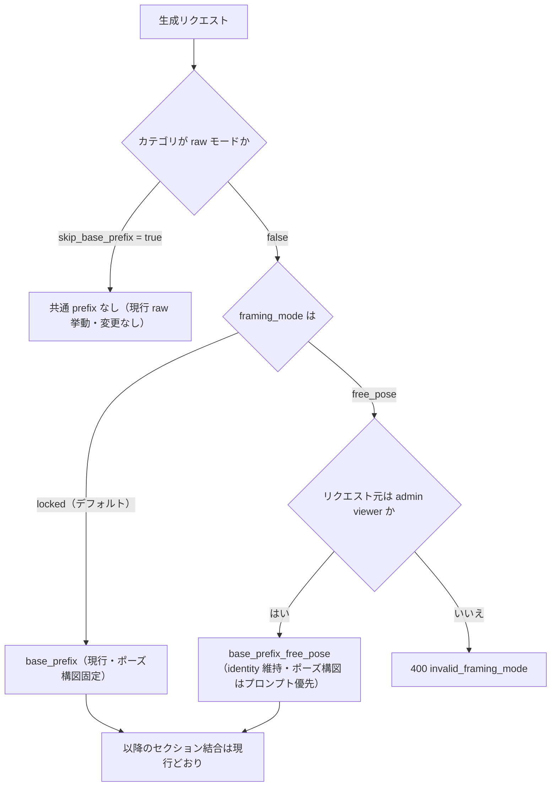
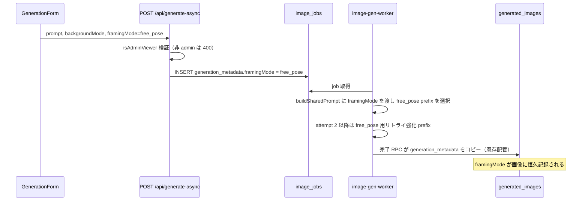
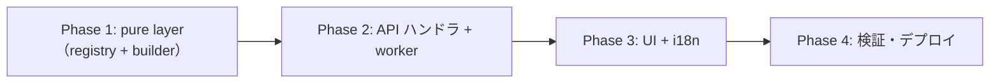

# framing_mode（ポーズ・カメラアングル自由化モード）実装計画

## 背景

コーディネート画面 / Style 画面の画像生成は、`style.base_prefix` / `coordinate.base_prefix`（CRITICAL INSTRUCTION 3 ステップ）により `image_0` のポーズ・カメラアングル・構図を厳密に固定している。これは生成の安定性・品質ガード（写っていない部位の生成防止）のためだが、「キャラクターの見た目は維持しつつ、ポーズやカメラアングルは変えたい」というニーズに応えられない。

既存の raw モード（`preset_categories.skip_base_prefix`）は共通 prefix を**全て**外すモードであり、identity 維持の指示まで消えてしまう。今回はその中間となる新モードを追加する。

## 目的

- 生成フォームのチェックボックスで `framing_mode` を切り替えられるようにする
  - `locked`（デフォルト）: 現行挙動。ポーズ・カメラアングル・構図を固定
  - `free_pose`: 顔・髪型・体型・雰囲気など **identity は維持**しつつ、ポーズ・カメラアングル・構図は**プロンプト指定を優先**
- free_pose 用プレフィックスはレジストリキーとして追加し、`prompt_overrides` 経由で admin が文言調整できるようにする（デプロイ不要のチューニング）
- **admin 限定で先行公開**（`isAdminViewer` 判定）。品質確認後に一般公開（後続フェーズ）
- 生成記録として `generation_metadata.framingMode` を残し、後から品質比較できるようにする

## やらないこと

- 一般ユーザーへの公開（チェックボックスは admin viewer のみ表示。サーバー側でも admin 検証）
- DB マイグレーション（`image_jobs.generation_metadata` / `generated_images.generation_metadata` は既存 JSONB。既存 RPC がコピーするため新カラム不要）
- ペルコイン消費額の変更（通常生成と同額）
- raw モード（`skip_base_prefix=true`）カテゴリとの併用（raw 優先。チェックボックス非表示・フラグ無視）
- Inspire 系・Creator Looks 系の生成フローへの適用（Inspire は既に angle/pose の on/off キーを持つ別系統）
- 一般公開時の出し分け設計（feature flag 等は公開フェーズで検討）

---

## コードベース調査結果 (Phase B)

### B-1: Supabase 接続確認

DB スキーマ変更なしのためスキップ（Edge Function デプロイは Phase 4 で実施）。

### B-2: 既存類似機能・関連実装

#### プロンプト合成（pure layer — ランタイム依存ゼロを維持すること）

| 関心事 | 該当箇所 |
|--------|---------|
| レジストリ（全 17 キー + PromptDefinition） | `shared/generation/prompt-registry.ts:186-346` |
| Style 合成 `buildStyleGenerationPrompt(params, options)` | `shared/generation/style-prompts.ts:90-131`（`options.skipBasePrefix` 分岐が先例） |
| Coordinate 合成 `buildPrompt({generationType, outfitDescription, backgroundMode, sourceImageType, templates})` | `shared/generation/prompt-core.ts:110-190`（coordinate 分岐 168-190） |
| リトライ強化（Style） `buildStyleAttemptReinforcementPrefix(attempt, templates)` | `shared/generation/style-prompts.ts:140-149` |
| リトライ強化（Coordinate） `buildCoordinateAttemptReinforcementPrefix(attempt, templates)` | `shared/generation/prompt-core.ts:299-311` |
| テンプレ変数展開 `applyTemplate` | `shared/generation/prompt-template.ts:26-31` |

- **registry を真とする設計**: `PROMPT_REGISTRY` にキーを追加すれば `/admin/generation-prompts` の一覧・編集 UI に自動列挙される（`app/(app)/admin/generation-prompts/page.tsx:18-74`）。admin UI の手動修正は不要
- **テンプレ解決**: Next.js 側は `resolveAllPromptTemplates()`（`features/generation-prompts/lib/resolve-templates.ts:20-25`、"use cache" + cacheTag）。worker (Deno) 側は `resolveAllPromptTemplatesForWorker()`（`supabase/functions/image-gen-worker/prompt-override.ts:54-96`、60 秒メモリキャッシュ）。**新キー追加だけで両ランタイムに自動反映される**
- ⚠️ `shared/generation/*` は client bundle / Deno worker 双方から import されるため **pure を維持**（`docs/planning/admin-generation-prompt-editor-plan.md` ADR-007 参照）

#### 生成リクエストの 4 経路

| 経路 | プロンプト確定タイミング | framing_mode の扱い |
|------|----------------------|---------------------|
| Style ゲスト同期 `app/(app)/style/generate/handler.ts:497` | handler 内で確定 | ゲストは admin になり得ないため **常に locked**（フラグ無視） |
| Style 認証非同期 `app/(app)/style/generate-async/handler.ts:326` | handler 内で確定し `image_jobs.prompt_text` に保存 | admin 検証のうえ free_pose 反映。**リトライ強化 prefix は worker 側付与**のため metadata で伝搬が必要 |
| Coordinate ゲスト同期 `app/api/coordinate-generate-guest/handler.ts:206` | handler 内で確定 | 常に locked（フラグ無視） |
| Coordinate 認証非同期 `app/api/generate-async/handler.ts:413-437` → worker | **worker が `buildSharedPrompt()` で再構築**（`supabase/functions/image-gen-worker/index.ts:1867-1876`） | `image_jobs.generation_metadata.framingMode` で worker へ伝搬 |

#### リトライ強化 prefix の付与箇所

- worker: `supabase/functions/image-gen-worker/index.ts:2134-2146`（one_tap_style / coordinate とも attempt ≥ 2 で付与）
- Style ゲスト同期: `app/(app)/style/generate/handler.ts:512`
- 既定文言は「Do not extend the crop, widen the framing...」とフレーム固定を再強制するため、**free_pose 時にそのまま使うと矛盾** → free_pose 変種キーが必要

#### generation_metadata の配管（既存）

- `image_jobs.generation_metadata` JSONB（`20260412112000` で追加）
- `generated_images.generation_metadata` JSONB（`20250123140000` で追加済み）
- RPC `complete_image_job_with_generated_images` が job → generated_images へ `COALESCE(p_generation_metadata, v_job.generation_metadata)` でコピー（`20260516120000` L222）
- worker は `{...job.generation_metadata, geminiAttempts}` をマージして渡す（`index.ts:2425-2428`）
- → **job 作成時に `framingMode` キーを入れるだけで生成画像側に恒久記録される**

#### admin 判定パターン

- サーバー判定: `isAdminViewer(userId)`（`lib/env.ts:322-328`、ADMIN_USER_IDS + ADMIN_PREVIEW_USER_IDS）
- クライアントへの伝搬の先例: `app/(app)/style/page.tsx:62` で `isAdminViewer(user?.id ?? null)` → `getPublishedStylePresets({ includeAdminOnly })` → props 渡し
- サーバー側ガードの先例: admin_only プリセットへの非 admin リクエストは 400（`style/generate/handler.ts:255-256`、`generate-async/handler.ts:161-162`）
- **UI 非表示はセキュリティではない**: free_pose リクエストもサーバー側で admin 検証する

#### フォーム UI

- Style: `features/style/components/StylePageClient.tsx` — 背景変更トグル（1817-1852）、userPrompt 入力（1793-1815）の近傍に追加。formData 構築は sync 1239-1257 / async 1342-1378
- Coordinate: `features/generation/components/GenerationForm.tsx:97-281` — backgroundMode ラジオ（111-127）の近傍に追加。`authState` は `app/(app)/coordinate/page.tsx:85-88` の `GenerationFormContainer` 経由
- i18n: 両画面とも next-intl 完全統合（`messages/ja.ts:1272-1451` / `messages/en.ts:1330-1408`、`useTranslations("style")` / `useTranslations("coordinate")`）。ハードコード禁止

### B-3: 影響範囲

- `shared/generation/prompt-registry.ts` への新キー追加は `tests/unit/shared/generation/prompt-registry.test.ts` の網羅テスト（キー整合・変数整合）が自動でカバー
- `BuildStyleGenerationPromptOptions` / `BuildPromptOptions` への optional フィールド追加は呼び出し側に後方互換（既存呼び出しは無変更で locked 挙動）
- worker の変更は `image-gen-worker` のみ。デプロイは `supabase functions deploy image-gen-worker`

### B-4: 参照ドキュメント

- `docs/planning/admin-generation-prompt-editor-plan.md` — prompt_overrides / registry / worker resolver の設計正典
- `docs/architecture/data.ja.md` — generation_metadata の配管方針
- `docs/development/project-conventions.ja.md` — features/ 配下の構成規約

---

## 1. 概要図

### 1.1 プロンプト合成の分岐（Style / Coordinate 共通の考え方）

### 1.2 Coordinate 認証非同期での framingMode 伝搬

---

## 2. EARS（要件定義）

| ID | 要件 |
|----|------|
| REQ-1 | When admin viewer が Style / コーディネート画面の生成フォームを開いたとき, the system shall 「ポーズ・アングルを自由にする（β）」チェックボックス（デフォルト OFF）を表示する。 **EN**: When an admin viewer opens the generation form on the Style or Coordinate page, the system shall display a "free pose & angle (beta)" checkbox, unchecked by default. |
| REQ-2 | While 非 admin ユーザー（ゲスト含む）が生成フォームを利用している間, the system shall チェックボックスを表示せず、常に locked（現行挙動）で生成する。 **EN**: While a non-admin user (including guests) uses the form, the system shall hide the checkbox and always generate in locked mode. |
| REQ-3 | When framing_mode = free_pose で生成リクエストが送信されたとき, the system shall `base_prefix` の代わりに `base_prefix_free_pose`（identity 維持・ポーズ/アングル/構図はプロンプト優先）を用いてプロンプトを合成する。 **EN**: When a generation request specifies free_pose, the system shall compose the prompt with `base_prefix_free_pose` instead of `base_prefix`. |
| REQ-4 | If 非 admin のリクエストに framing_mode = free_pose が含まれていた場合, then the system shall 400 (invalid_framing_mode) を返す。 **EN**: If a non-admin request contains free_pose, then the system shall return 400 (invalid_framing_mode). |
| REQ-5 | Where プリセットカテゴリが raw モード（skip_base_prefix = true）の場合, the system shall framing_mode を無視し（UI 上もチェックボックスを表示しない）、現行 raw 挙動を維持する。 **EN**: Where the preset category is raw mode, the system shall ignore framing_mode (and hide the checkbox), preserving current raw behavior. |
| REQ-6 | When free_pose の生成リトライ（attempt ≥ 2）が発生したとき, the system shall フレーム固定を再強制しない free_pose 用リトライ強化 prefix を用いる。 **EN**: When a retry (attempt ≥ 2) occurs for free_pose, the system shall use a free_pose reinforcement prefix that does not re-assert frame locking. |
| REQ-7 | When free_pose で生成ジョブ / 生成画像が記録されるとき, the system shall `generation_metadata.framingMode = "free_pose"` を記録する（locked 時はキーなし = 後方互換）。 **EN**: When a free_pose job/image is recorded, the system shall persist `generation_metadata.framingMode = "free_pose"` (absent for locked, for backward compatibility). |
| REQ-8 | While admin が `/admin/generation-prompts` を開いている間, the system shall 新規 8 キー（style/coordinate の free_pose prefix・背景 suffix 変種、style/coordinate の free_pose リトライ強化）を一覧に表示し、編集・保存・default 復帰を可能にする（既存機構に自動追従）。 **EN**: While an admin views the prompt editor, the system shall list and allow editing of the 8 new keys via the existing override mechanism. |
| REQ-9 | If `prompt_overrides` の取得に失敗した場合, then the system shall registry default の free_pose 文言へフォールバックし生成を続行する（既存 resolver の挙動を踏襲）。 **EN**: If override resolution fails, then the system shall fall back to registry defaults and continue. |
| REQ-10 | When ペルコイン消費が計算されるとき, the system shall framing_mode に関わらず通常生成と同額とする。 **EN**: When percoin cost is computed, the system shall charge the same amount regardless of framing_mode. |

---

## 3. ADR（設計判断記録）

### ADR-001: boolean ではなく `framing_mode: "locked" | "free_pose"` の enum で表現

- **Context**: チェックボックス 1 個なら boolean でも実装できる。
- **Decision**: API・metadata 上は enum 文字列（省略時 locked）とする。UI はチェックボックスのまま。
- **Reason**: 将来「ポーズのみ自由・アングル固定」等の中間モード追加時に API 互換を保てる。`generation_metadata` 上も自己記述的で品質分析しやすい。
- **Consequence**: バリデーション（未知値 → 400）が 1 段必要。

### ADR-002: 記録は新カラムではなく既存 `generation_metadata` JSONB に載せる

- **Context**: 品質比較のため「どの画像が free_pose か」を恒久記録したい。`generated_images` のカラム肥大への懸念があった。
- **Decision**: `image_jobs.generation_metadata.framingMode` に記録し、既存 RPC のコピー配管で `generated_images` へ伝搬させる。新カラム・マイグレーション・RPC 変更なし。
- **Reason**: (a) 配管が既に存在し追加コストゼロ (b) スキーマを太らせない (c) `generation_metadata->>'framingMode'` で SQL 抽出可能、必要になれば部分インデックスを後付けできる。
- **Consequence**: カラムと違い型制約がないため、キー名・値は本計画の定義（`framingMode`: `"free_pose"`）を正とする。locked はキー自体を書かない（既存レコードとの一貫性）。

### ADR-003: 既存 base_prefix を改変せず、free_pose 専用の新レジストリキーを追加

- **Context**: 既存 prefix に条件文を足す案もあった。
- **Decision**: free_pose 専用キーを **8 キー**新設（実装時に 4 キーから拡張。ADR-005 改訂参照）:
  - `style.base_prefix_free_pose` / `coordinate.base_prefix_free_pose`
  - `style.keep_background_suffix_free_pose` / `style.change_background_suffix_free_pose`
  - `coordinate.keep_background_suffix_free_pose` / `coordinate.change_background_suffix_free_pose`
  - `reinforcement.style_attempt_2plus_free_pose` / `reinforcement.coordinate_attempt_2plus_free_pose`
- **Reason**: (a) 既存生成の挙動に一切影響しない (b) admin が `/admin/generation-prompts` から free_pose 文言だけを独立にチューニングできる（registry を真とする設計により UI は自動列挙） (c) ロールバックが「キーを使わない」だけで済む。
- **Consequence**: locked と free_pose で共通の文言修正は 2 箇所の編集になる。許容（文言の性格が大きく異なるため共通化の利益が薄い）。

### ADR-004: admin 限定は `isAdminViewer` + サーバー側検証の二段構え

- **Context**: 先行公開の対象を「admin だけ」にする必要がある。UI 非表示だけでは API 直叩きで回避できる。
- **Decision**: UI は `isAdminViewer` を Server Component から props で渡して表示制御。API（style generate-async / coordinate generate-async）でも `isAdminViewer(user.id)` を検証し、非 admin の free_pose は 400。ゲスト同期 2 経路は free_pose を受け付けない（パラメータ自体を解釈しない）。
- **Reason**: admin_only プリセットの既存ガード（400）と同じパターンで一貫性がある。ADMIN_PREVIEW_USER_IDS を含む `isAdminViewer` を使うことで、運営の検証協力者にも開放できる。
- **Consequence**: 一般公開時はこの検証を外す（または feature flag に置換する）小さな変更が必要。

### ADR-005（実装時改訂）: free_pose では style suffix を付与せず、背景 suffix は free_pose 変種を使う

- **Context**: 当初案は「suffix 群は現行のまま併用」だったが、実装時の精査で既存 suffix が free_pose と**直接矛盾する**ことが判明した。`coordinate.illustration_style_suffix` は "Preserve the original camera angle, framing, pose, and composition."、`style.real_suffix` も "Preserve the original camera angle, framing ... composition" を含み、`change_background_suffix` も "within the existing framing ... Preserve the camera angle, crop, composition, pose" を指示している。これらを free_pose prefix と併置するとモデルに相反する指示を与え、ポーズ自由化が機能しない恐れが高い。
- **Decision**:
  - real/illustration の **style suffix は free_pose では付与しない**。画風維持（photo は photorealistic のまま、イラストは同じタッチのまま）の指示を `base_prefix_free_pose` の Identity Preservation 項に内包する
  - **背景 suffix（keep/change）は free_pose 変種キーを新設**（「アングルが変わっても同じ環境を新視点で描く」「背景構図は新しいポーズ・アングルに合わせて自由に設計してよい」）
- **Reason**: 矛盾指示の排除が機能成立の前提。キーは増えるがすべて registry 管理で admin がチューニング可能。
- **Consequence**: 新キーが 4 → 8 に増加。free_pose の画風維持・背景品質は admin 検証期間中に重点観察する。

---

## 4. 実装計画（フェーズ＋TODO）

### フェーズ間の依存関係

### Phase 1: pure layer（registry + プロンプト合成）

目的: free_pose の文言とビルダー分岐を、ランタイム非依存の `shared/generation/` に追加する。
ビルド確認: `npm run lint && npm run typecheck && npm run test && npm run build -- --webpack` 全パス。既存テストに影響なし。

- [ ] `shared/generation/framing-mode.ts`（新規・小）: `export type FramingMode = "locked" | "free_pose"` と `parseFramingMode()`（未知値は null）。client/handler/worker から型共有
- [ ] `prompt-registry.ts`: 8 キー追加（ADR-003 / ADR-005 改訂参照）
  - `style.base_prefix_free_pose` / `coordinate.base_prefix_free_pose`（identity + 画風維持を内包、ポーズ・カメラアングル・構図はプロンプト優先、フレーム外の身体部位の生成を許可）
  - `style.keep_background_suffix_free_pose` / `style.change_background_suffix_free_pose` / `coordinate.keep_background_suffix_free_pose` / `coordinate.change_background_suffix_free_pose`（フレーミング固定を課さない背景指示）
  - `reinforcement.style_attempt_2plus_free_pose` / `reinforcement.coordinate_attempt_2plus_free_pose`（フレーム固定を再強制しない再試行文言。supportedVariables: ["attempt"]）
- [ ] `style-prompts.ts`: `BuildStyleGenerationPromptOptions` に `framingMode?: FramingMode` 追加。`skipBasePrefix` 優先 → free_pose なら `style.base_prefix_free_pose` を選択。`buildStyleAttemptReinforcementPrefix(attempt, templates, framingMode?)` 拡張
- [ ] `prompt-core.ts`: `BuildPromptOptions` に `framingMode?: FramingMode` 追加（coordinate 分岐で prefix 選択）。`buildCoordinateAttemptReinforcementPrefix` 同様に拡張
- [ ] 単体テスト追加（既存パターン踏襲: `tests/unit/shared/generation/style-prompts.test.ts` / `prompt-core.test.ts`）
  - free_pose で free_pose prefix が選ばれ、locked/省略時は現行文言（後方互換）
  - skipBasePrefix と free_pose の同時指定は skipBasePrefix 勝ち
  - templates override が free_pose キーにも効く
  - reinforcement の free_pose 変種選択
  - `prompt-registry.test.ts` は網羅テストのため自動カバー（変数整合のみ確認）

### Phase 2: API ハンドラ + worker

目的: 4 経路への配線と admin 検証、metadata 記録。
ビルド確認: 検証コマンド全パス。worker は `deno check`（既存 CI 相当）が通ること。

- [ ] `app/(app)/style/generate-async/handler.ts`: formData から `framingMode` を parse → free_pose なら `isAdminViewer(user.id)` 検証（非 admin は 400 `invalid_framing_mode`、admin_only プリセットの 400 と同パターン）→ `buildStyleGenerationPrompt` に渡す → `generation_metadata.framingMode` 記録（`buildOneTapStyleGenerationMetadata` 呼び出し後にトップレベルでマージ）。raw カテゴリ（skipBasePrefix）時は無視
- [ ] `app/api/generate-async/handler.ts`（coordinate）: 同様に parse + admin 検証 → `ImageJobCreateInput.generation_metadata` に `framingMode` を記録（プロンプトは worker で構築されるため metadata 伝搬のみ）
- [ ] ゲスト同期 2 経路（`style/generate/handler.ts` / `coordinate-generate-guest/handler.ts`）: 変更なし（framingMode パラメータを解釈しない = 常に locked）。コメントで明記
- [ ] `supabase/functions/image-gen-worker/index.ts`:
  - coordinate 分岐（L1867-1876）: `job.generation_metadata?.framingMode` を読み `buildSharedPrompt` に渡す
  - リトライ強化（L2134-2146）: one_tap_style / coordinate とも framingMode を reinforcement builder に渡す
- [ ] 既存メタデータマージ（`index.ts:2425-2428`）が framingMode を生成画像へ運ぶことを確認（コード変更不要の想定。テストまたは目視で確認）

### Phase 3: UI + i18n

目的: admin viewer にのみチェックボックスを表示し、リクエストに載せる。
ビルド確認: 検証コマンド全パス。

- [ ] `app/(app)/style/page.tsx`: 既存の `isAdminViewerFlag`（L62）を `StylePageClient` へ props 追加（例 `canUseFreePose`）
- [ ] `features/style/components/StylePageClient.tsx`: state + チェックボックス UI（背景変更トグル L1817-1852 の直下）。表示条件 = `canUseFreePose && !selectedPreset?.category.skipBasePrefix && 認証済み`。async formData（L1342-1378）に `framingMode` 追加（sync ゲスト経路には載せない）
- [ ] `app/(app)/coordinate/page.tsx` → `GenerationFormContainer` → `features/generation/components/GenerationForm.tsx`: 同様に props 伝搬 + backgroundMode ラジオ（L111-127）近傍にチェックボックス + payload に `framingMode`
- [ ] i18n: `messages/ja.ts` / `messages/en.ts` の `style` / `coordinate` 名前空間にラベル・説明文を追加
  - ja 案: ラベル「ポーズ・アングルを自由にする（β）」/ 説明「キャラクターの見た目は維持しつつ、ポーズやカメラアングルをプロンプトで指定できます。OFF のときは元画像の構図を維持します」
- [ ] チェック ON 時の補足表示（free_pose は構図が大きく変わる旨の軽い注意書き）

### Phase 4: 検証・デプロイ

目的: 品質ゲートと本番反映。
ビルド確認: `npm run lint` / `npm run typecheck` / `npm run test` / `npm run build -- --webpack` 全パス。

- [ ] 単体テスト全体 + 影響範囲の手動確認（typecheck の既存赤 = tests/unit の jest-dom 型エラーは既知。自分の回帰と混同しない）
- [ ] `supabase functions deploy image-gen-worker`（デプロイ前に依存関数・呼び出し元の影響確認）
- [ ] 実機確認（admin アカウント）:
  - Style: locked / free_pose / raw カテゴリで生成し、`image_jobs.prompt_text` と結果を確認
  - Coordinate: free_pose + 各 backgroundMode で生成
  - 非 admin アカウント: チェックボックス非表示、API 直叩きで 400
  - `generated_images.generation_metadata->>'framingMode'` の記録確認（参照系クエリ）
- [ ] `/admin/generation-prompts` に新 4 キーが列挙され編集できることを確認
- [ ] PR 作成（タイトル・本文は日本語、Conventional Commit プレフィックス）

---

## 5. 修正対象ファイル一覧

| ファイル | 操作 | 変更内容 |
|----------|------|----------|
| `shared/generation/framing-mode.ts` | 新規 | `FramingMode` 型 + `parseFramingMode()` |
| `shared/generation/prompt-registry.ts` | 修正 | 新規 8 キー（free_pose prefix ×2、free_pose 背景 suffix ×4、free_pose reinforcement ×2） |
| `shared/generation/style-prompts.ts` | 修正 | options.framingMode 分岐 + reinforcement 拡張 |
| `shared/generation/prompt-core.ts` | 修正 | BuildPromptOptions.framingMode 分岐 + reinforcement 拡張 |
| `app/(app)/style/generate-async/handler.ts` | 修正 | parse + admin 検証 + prompt 反映 + metadata 記録 |
| `app/api/generate-async/handler.ts` | 修正 | parse + admin 検証 + metadata 記録 |
| `supabase/functions/image-gen-worker/index.ts` | 修正 | metadata から framingMode を読み builder へ |
| `app/(app)/style/page.tsx` | 修正 | `canUseFreePose` props 追加 |
| `features/style/components/StylePageClient.tsx` | 修正 | チェックボックス UI + formData |
| `app/(app)/coordinate/page.tsx`（+ GenerationFormContainer） | 修正 | admin flag の props 伝搬 |
| `features/generation/components/GenerationForm.tsx` | 修正 | チェックボックス UI + payload |
| `messages/ja.ts` / `messages/en.ts` | 修正 | ラベル・説明の翻訳キー追加 |
| `tests/unit/shared/generation/style-prompts.test.ts` | 修正 | free_pose 分岐テスト |
| `tests/unit/shared/generation/prompt-core.test.ts` | 修正 | 同上（coordinate） |

---

## 6. 品質・テスト観点

### 品質チェックリスト

- [ ] **権限制御**: 非 admin の free_pose リクエストが 4 経路すべてで通らない（同期 2 経路は解釈せず、非同期 2 経路は 400）
- [ ] **APIパラメータのソース安全性**: admin 判定はサーバーサイドの `getUser()` + `isAdminViewer()` で解決し、クライアント申告を信用しない
- [ ] **後方互換**: framingMode 未指定の既存クライアント・既存ジョブ（metadata にキーなし）が完全に現行挙動
- [ ] **エラーハンドリング**: prompt_overrides 取得失敗時は registry default へフォールバック（既存 resolver の挙動を流用）
- [ ] **i18n**: en/ja 両方の翻訳が揃っている
- [ ] **pure layer 維持**: `shared/generation/` に Next.js / Deno / DB 依存を持ち込まない

### テスト観点

| カテゴリ | テスト内容 |
|----------|-----------|
| 正常系 | free_pose で free_pose prefix・reinforcement が選ばれる。locked / 省略は現行文言と完全一致 |
| 異常系 | 未知の framingMode 値 → 400。非 admin の free_pose → 400 |
| 優先順位 | skipBasePrefix > free_pose。raw カテゴリで free_pose 指定しても raw 出力 |
| 記録 | free_pose ジョブの generation_metadata に framingMode が入り、locked では入らない |
| 実機確認 | admin / 非 admin / ゲストの表示差、両画面での生成結果、metadata 記録 |

テスト実装は `/test-flow` スキルのワークフロー（spec-extract → spec-write → test-generate → test-reviewing → spec-verify）に沿って行う。

---

## 7. ロールバック方針

- **DB**: マイグレーションなし。ロールバック対象なし（metadata の余剰キーは無害）
- **コード**: フェーズごとにコミットし revert 可能。Phase 1-2 のみで止めても挙動変化ゼロ（UI が無ければ free_pose は発火しない）
- **worker**: 問題発生時は直前リビジョンを再デプロイ
- **段階公開**: admin 限定ガード自体がロールアウト制御。品質問題があれば admin に「使わない」周知だけで実質停止できる。文言の問題は `/admin/generation-prompts` の override / default 復帰で即時対応（デプロイ不要）

---

## 8. 使用スキル

| スキル | 用途 | フェーズ |
|--------|------|----------|
| `/git-create-branch` | ブランチ作成 | 実装開始時 |
| `/tdd` | builder 分岐の test-first 実装 | Phase 1 |
| `/test-flow` 系 | テスト体系化 | Phase 4 |
| `/codex-webpack-build` | ビルド検証（--webpack 必須） | 各フェーズ |
| `/git-create-pr` | PR 作成（日本語） | 完了時 |
