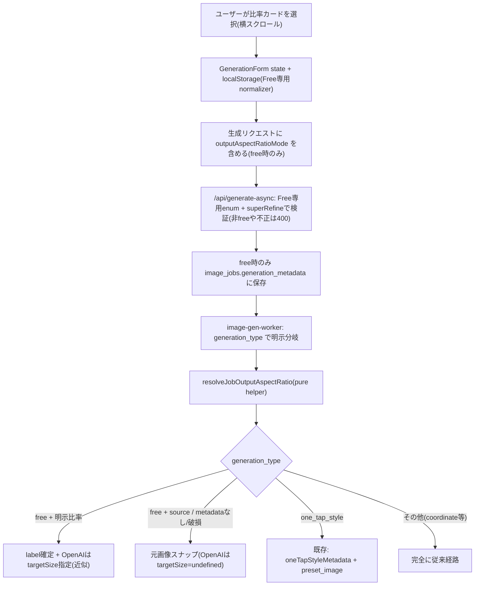
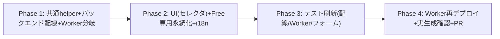

# Free Style 出力比率セレクタ 実装計画

> 設計レビュー（Codex/GPT-5, 2026-07-27）反映済み。Warning 5件・Info 3件を取り込み。
> 主要な変更: (1) Free専用 allowlist で API/永続化のスコープ固定、(2) Worker は
> `generation_type` で明示分岐し pure helper へ抽出、(3) テストを配線・Worker分岐・
> OpenAI targetSize の直接保護へ刷新、(4) OpenAI は16px丸めの近似である旨を明記。

## 概要

Free Style（じゆうモード, `/free`）に、**出力アスペクト比をユーザーが選べる**セレクタを追加する。現状 Free は出力比率を選べず、アップロード元画像の比率に自動スナップされ、プロンプト文での比率指定は無効（画像APIの size/aspectRatio パラメータが優先されるため）。ユーザーが「正方形・縦長・横長」など明示的に比率を選べるようにする。

admin のプリセットカテゴリと同じ選択肢（`source` ＋ 明示9比率）を Free のUIに開放する。One-Tap Style が preset 単位で持つ比率解決を、**Free ではユーザー選択値**として `image_jobs.generation_metadata` 経由で Worker に渡す。

### コードベース調査結果

- **比率の実体**: `shared/generation/gemini-aspect-ratio.ts` の `GEMINI_SUPPORTED_ASPECT_RATIOS`（9段階: 9:16 / 4:5 / 3:4 / 2:3 / 1:1 / 3:2 / 4:3 / 5:4 / 16:9）
- **モード定義**: `shared/generation/style-output-aspect-ratio.ts` の `STYLE_OUTPUT_ASPECT_RATIO_MODES`（`source` / `preset_image` ＋ 明示9比率）、`resolveOutputAspectRatio(mode, aspectDims, presetImageDims)`。**注意**: `normalizeStyleOutputAspectRatioMode` は `preset_image` を有効値として残すため、Free では使えない（Free専用 normalizer が必要）
- **既存テスト**: `resolveOutputAspectRatio` は `tests/unit/shared/generation/style-output-aspect-ratio.test.ts` で検証済み。→ 本機能では**再テストしない**（重複回避）。守るべきは配線と Worker 分岐
- **OpenAI は9比率を近似で出力（確認済み）**: `computeGptImage2OptimalSize`（`shared/generation/openai-image-model.ts:129-190`）は入力比率を保持しつつ 9:16〜16:9 にクランプし、**16pxの倍数に丸める**。よって「4:5」等は厳密比率ではなく**丸め誤差内の近似**（縦横の方向は保たれる）。モデル出し分けは不要
- **現状の Free の比率決定（Worker）**: Gemini 経路（`index.ts:2178-2184`）は free で `resolveGeminiAspectRatio(aspectDims)`＝元画像スナップ。OpenAI 経路（`index.ts:2240-2272`）は one_tap_style のみ明示比率、free は入力画像ベース（`targetSize=undefined`）
- **generated_images への保持経路（確認済み）**: OpenAI 完了RPC は `{...job.generation_metadata, geminiAttempts}` を `p_generation_metadata` に渡す（`index.ts:2691-2717`）。Gemini 通常 insert は `job.generation_metadata` をそのまま保存（`index.ts:2770-2781`）。**両経路とも `outputAspectRatioMode` は保持される**
- **リクエスト**: `features/generation/lib/async-api.ts`（backgroundMode/count/model/framingMode を組み立て）に比率を追加
- **job の metadata**: `app/api/generate-async/handler.ts:463-507` が `generationMetadata` を組み立て `generation_metadata`(JSON) 保存。**DB移行なしで比率を載せられる**
- **永続化パターン**: `features/generation/lib/form-preferences.ts` の `readPreferred*`＋localStorage(try/catch, SSR-safe)
- **i18n**: 言語ファイルは15個。型は `messages/types.ts` の `DeepReplaceStrings` で **ja から自動導出**のため、キー追加時に types.ts の手動編集は不要

## データフロー

## EARS（要件）

| ID | 型 | 要件 |
|----|----|------|
| R1 | Event | When ユーザーが Free で比率カードを選択した時, the system shall 選択比率を state に反映し localStorage に保存する |
| R2 | State | While Free ページ表示中, the system shall 「生成したい内容」の上に横スクロールの比率セレクタ（自動＋明示9比率）を表示する |
| R3 | Event | When 比率を選んで生成した時, the system shall `outputAspectRatioMode` を `image_jobs.generation_metadata` に保存する（free時のみ） |
| R4 | Event | When Worker が free ジョブを処理する時, the system shall generation_metadata の明示比率を Gemini/OpenAI 双方の出力に反映する（source/なし/破損は元画像スナップ） |
| R5 | State | While 初回利用（localStorage 未設定）, the system shall 既定を `source`（自動）とする |
| R6 | Ubiquitous | The system shall 比率セレクタを Free のみに表示・送信する（coordinate/style は現状維持） |
| R7a | If | If localStorage の値が Free の許容外（例: preset_image / 不正値）だった場合, then the system shall `source` にフォールバックする（Free専用 normalizer） |
| R7b | If | If API が非freeで `outputAspectRatioMode` を受け取る／`preset_image`・不正値を受け取った場合, then the system shall 400 で拒否する（Zod enum + superRefine） |
| R7c | If | If Worker が破損／未知の `outputAspectRatioMode` を読んだ場合, then the system shall `source` 相当（元画像スナップ）にフォールバックする |
| R8 | Ubiquitous | The system shall 比率セレクタを単一選択コントロール（radiogroup/radio 相当）として実装し、キーボード操作・色以外での選択表現・RTL を満たす |

## ADR（設計判断）

### ADR-001: 既存の比率解決機構を再利用（新規ロジックを作らない）
- **Decision**: `resolveOutputAspectRatio` / `aspectLabelToDimensions` / `GEMINI_SUPPORTED_ASPECT_RATIOS` を再利用。Free は「ユーザー選択の比率ラベル」を渡すだけ。
- **Reason**: One-Tap Style / admin と同一ロジックで一貫性とテスト資産を活かす。
- **Consequence**: Worker の比率解決は **`generation_type` で明示分岐**（one_tap_style / free / else）し、pure helper `resolveJobOutputAspectRatio` に抽出（ADR-006）。**「metadata存在で分岐」はしない**（将来 coordinate 等が同名キーを持っても影響させない）。

### ADR-002: DB移行なし（generation_metadata に載せる）
- **Decision**: 選択比率は `image_jobs.generation_metadata.outputAspectRatioMode`(JSON) に保存。新カラムなし。
- **Reason**: `generation_metadata` は framingMode 等を載せる汎用JSON。追加移行なし・既存投稿に無影響。
- **Consequence**: `generated_images` への保持は2経路（OpenAI 完了RPC の `{...job.generation_metadata, geminiAttempts}` / Gemini 通常 insert の `job.generation_metadata`）で成立。**両経路 ＋ geminiAttempts 追記で比率キーが失われないことをテストで担保**する（W5）。

### ADR-003: モデル出し分けをしない（OpenAIは近似）
- **Decision**: OpenAI/Gemini とも比率セレクタと独立。全9比率を渡せる。
- **Reason**: Gemini は `imageConfig.aspectRatio` にラベルをそのまま渡す。OpenAI は `getGptImage2TargetSize(sizeTier, aspectLabelToDimensions(label))` で targetSize を算出。
- **Consequence**: **OpenAI は16px丸めのため厳密比率にはならない**（誤差内の近似、縦横方向は保たれる）。「その比率になる」ではなく「誤差許容内の近似・縦横逆転なし」で仕様/テストを記述する。API が算出サイズを実受理することは単体で保証できないため Phase 4 で実生成確認。

### ADR-004: 適用は Free のみ・既定 source・localStorage 記憶
- **Decision**: セレクタは `isFree` 時のみ表示・送信。既定 `source`、選択は Free専用の read/write で永続化。
- **Reason**: ユーザー要望（Free のみ・自動既定・前回記憶）。coordinate/style は既存の比率決定を維持し回帰を避ける。
- **Consequence**: coordinate への横展開は将来タスク。

### ADR-005: Free専用 allowlist でスコープを固定（新規）
- **Decision**: `FREE_OUTPUT_ASPECT_RATIO_MODES = ["source", ...EXPLICIT_OUTPUT_ASPECT_RATIOS] as const`（＝10種、`preset_image` を除外）を新設し、API zod・localStorage normalizer の双方で使う。
- **Reason**: `StyleOutputAspectRatioMode` は preset 前提の `preset_image` を含む。クライアント入力をそのまま許可すると Free で無効な値・将来他モードへの適用余地が生じる。
- **Consequence**: API は Free enum ＋ superRefine（`generationType !== "free"` で `outputAspectRatioMode` 指定を拒否）。localStorage は Free専用 normalizer（許容外は source）。責務分担: **localStorage不正→source / API不正・preset_image・非free→400 / Worker破損→source**。

### ADR-006: Worker 比率解決を pure helper に抽出（新規）
- **Decision**: `resolveJobOutputAspectRatio({ generationType, generationMetadata, oneTapStyleMetadata, inputDimensions })` を抽出し、戻り値を `{ label: GeminiAspectRatio; shouldOverrideOpenAITargetSize: boolean }` とする。Deno/Node 双方から使えるよう `shared/generation/` に置く。
- **Reason**: Gemini 経路と OpenAI 経路で条件がずれる事故を防ぎ、Worker 分岐を単体テストで直接保護する（W2/W4）。
- **Consequence**: Free の `source` は `shouldOverrideOpenAITargetSize=false`（OpenAI 従来の `targetSize=undefined` を維持）、明示比率のみ `true`（targetSize を算出）。one_tap_style は既存挙動を helper 内に集約。

## フェーズ計画

### Phase 1: 共通 helper ＋ バックエンド配線 ＋ Worker 分岐
目的: 選択比率がリクエスト→job→Worker まで流れ、生成種別で正しく分岐して出力に反映される。
ビルド確認: `npm run build -- --webpack` 成功、既存生成の非回帰。

- [ ] `shared/generation/style-output-aspect-ratio.ts`: `FREE_OUTPUT_ASPECT_RATIO_MODES`（source＋明示9比率）と Free専用 normalizer（許容外→source）を追加
- [ ] `shared/generation/job-output-aspect.ts`（新規）: `resolveJobOutputAspectRatio()` を抽出（`generation_type` 明示分岐、`{label, shouldOverrideOpenAITargetSize}` を返す）
- [ ] `features/generation/lib/schema.ts`: `outputAspectRatioMode` を `z.enum(FREE_OUTPUT_ASPECT_RATIO_MODES).optional()` で許可し、superRefine で `generationType !== "free"` のとき指定を 400 拒否
- [ ] `features/generation/lib/async-api.ts` / リクエスト型: `outputAspectRatioMode` を free 時のみ送信
- [ ] `app/api/generate-async/handler.ts`: free かつ値ありのとき Free専用 normalizer を通して `generationMetadata.outputAspectRatioMode` に格納（非free では格納しない）
- [ ] `supabase/functions/image-gen-worker/index.ts`: Gemini 経路（~2178）と OpenAI 経路（~2240-2272）を `resolveJobOutputAspectRatio` 経由に置換。free/one_tap/その他を明示分岐

### Phase 2: UI（比率セレクタ）＋ Free専用永続化 ＋ i18n
目的: Free に横スクロールの比率カードを「生成したい内容」の上に表示。
ビルド確認: `/free` で比率カードが表示・選択でき、選択が保存・復元される。

- [ ] `features/generation/components/AspectRatioSelector.tsx`（新規）: 横スクロールの比率プレビューカード。**radiogroup/radio セマンティクス**、キーボード選択、`aria-checked`（色以外でも選択が分かる）、先頭に「自動」カード（固定枠でなく画像＋自動調整を示す表現）、フォーカスリングが切れない余白、RTL 対応
- [ ] `features/generation/lib/form-preferences.ts`: `readPreferredAspectMode/writePreferredAspectMode`（Free専用 normalizer で許容外→source、SSR-safe。初回 source、マウント後に復元）
- [ ] `features/generation/components/GenerationForm.tsx`: `isFree` のとき PromptInputField の**上**に `AspectRatioSelector` を描画。state・localStorage 復元・送信値に含める
- [ ] `messages/*.ts`（15言語）: セクション見出し／「自動（アップロード画像に合わせる）」／向き（正方形・縦長・横長）の i18n（`free` namespace）。※型は ja から自動導出のため types.ts の手動編集は不要

### Phase 3: テスト刷新（配線・Worker分岐・フォーム統合）
目的: 事故が起きやすい配線と Worker 分岐を直接保護する（shared resolver の再テストはしない）。

- [ ] schema: free＋10値受理 / `preset_image` 拒否 / 非free＋値 拒否 / 不正値 拒否
- [ ] async-api: free 時だけ payload に `outputAspectRatioMode` が載る
- [ ] handler 統合: free＋明示比率が `generation_metadata` に保存 / free＋source の扱い / coordinate では混入しない
- [ ] `resolveJobOutputAspectRatio` 単体: free明示 / free source / metadataなし / 破損metadata / one_tap(source・preset_image・明示) / coordinate等既存 / Gemini・OpenAI 両方
- [ ] OpenAI targetSize: 9比率 × 1K/2K/4K、長辺・総ピクセル上限、16の倍数、縦横方向、期待比率との差が丸め誤差内
- [ ] generated_images 保持: OpenAI 複数画像RPC / Gemini 通常insert / geminiAttempts 追記後も比率キーが残る
- [ ] GenerationForm 統合: セレクタは Free だけ表示 / 選択値が submit まで届く / coordinate では非表示・非送信（hydration 後の選択状態を待つ）
- [ ] `npm run lint` / `typecheck` / `test` / `build -- --webpack` すべてパス

### Phase 4: Worker 再デプロイ ＋ 実生成確認 ＋ PR
- [ ] **Worker 再デプロイ**（比率解決の分岐追加。free 以外は同一挙動）
- [ ] ステージング/本番で **OpenAI が算出 targetSize を実受理して生成できる**ことを実生成で確認（9比率のうち代表を数点）
- [ ] PR 作成（プレビューURLで実機確認）

## 修正対象ファイル一覧

| ファイル | 操作 | 変更内容 |
|----------|------|----------|
| shared/generation/style-output-aspect-ratio.ts | 修正 | FREE_OUTPUT_ASPECT_RATIO_MODES ＋ Free専用 normalizer |
| shared/generation/job-output-aspect.ts | 新規 | resolveJobOutputAspectRatio（生成種別分岐） |
| features/generation/lib/schema.ts | 修正 | Free enum ＋ superRefine（非free拒否） |
| features/generation/lib/async-api.ts | 修正 | free 時のみ outputAspectRatioMode 送信 |
| app/api/generate-async/handler.ts | 修正 | free 時のみ normalizer 経由で metadata 格納 |
| supabase/functions/image-gen-worker/index.ts | 修正 | Gemini/OpenAI 経路を helper 経由に置換 |
| features/generation/components/AspectRatioSelector.tsx | 新規 | 横スクロール比率セレクタ（a11y対応） |
| features/generation/lib/form-preferences.ts | 修正 | 比率の read/write（Free専用 normalizer, SSR-safe） |
| features/generation/components/GenerationForm.tsx | 修正 | free に selector 配置・state・送信 |
| messages/*.ts（15言語） | 修正 | 比率セレクタの i18n（types.ts は不要） |
| tests/unit/features/generation/schema-*.test.ts 等 | 新規/修正 | schema 受理/拒否 |
| tests/unit/features/generation/async-api-aspect.test.ts | 新規 | payload 配線 |
| tests/integration/api/generate-async-*.test.ts | 修正 | handler の metadata 格納/非混入 |
| tests/unit/shared/generation/job-output-aspect.test.ts | 新規 | Worker helper 分岐（Gemini/OpenAI） |
| tests/unit/features/generation/aspect-ratio-selector.test.tsx | 新規 | セレクタUI（a11y/選択） |
| tests/unit/features/generation/form-preferences-aspect.test.ts | 新規 | 永続化（Free normalizer） |

## テスト観点

| カテゴリ | 内容 |
|----------|------|
| 正常系 | Gemini はラベルがそのまま aspectRatio。OpenAI は targetSize 算出（16px丸め後の比率誤差が許容内・縦横逆転なし） |
| 境界/拒否 | schema: preset_image・非free・不正値を400。localStorage/Worker: 許容外は source |
| 保持 | OpenAI RPC / Gemini insert の両経路で generation_metadata の比率が保持（geminiAttempts 追記後も） |
| 非回帰 | coordinate/style/one_tap_style の比率決定・設定UIが不変 |
| a11y | radiogroup/radio・キーボード・色非依存・RTL |
| 実機 | /free スマホ幅で横スクロール・選択・生成→比率反映。OpenAI 実生成の受理（Phase 4） |

## ロールバック方針

- UI/配線は追加的変更。セレクタ非表示に戻せば従来の source 挙動へ
- generation_metadata に比率が無いジョブは従来どおり元画像スナップ（後方互換）
- Worker はロジック追加のみ。旧バージョンでも比率キーを無視するだけで既存生成は不変
- DB移行なしのためロールバック時のスキーマ考慮不要
