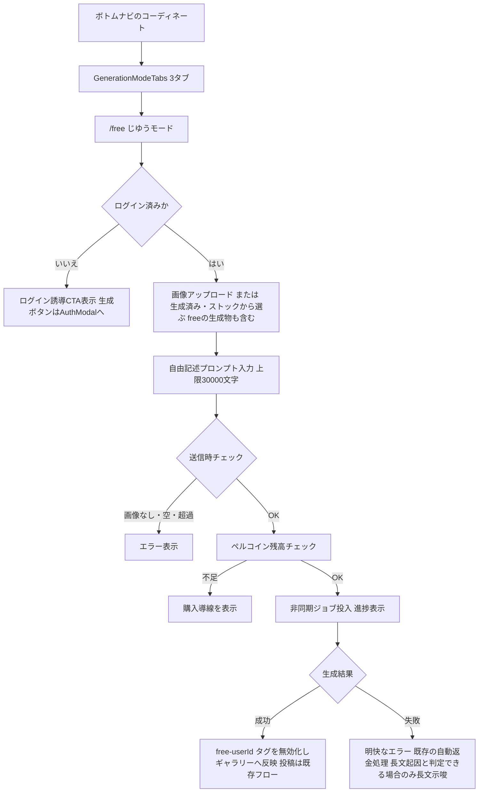
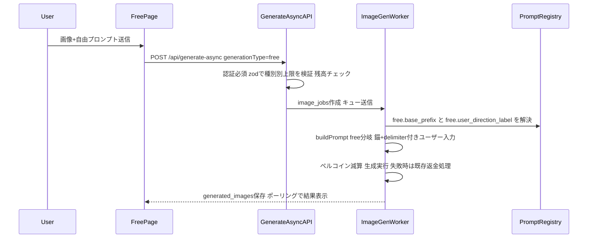
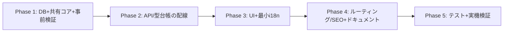

# じゆうモード（自由プロンプト生成）実装計画

- 作成日: 2026-07-26 ／ 改訂: 2026-07-26（設計レビュー指摘11件を反映。改訂履歴は末尾）
- ステータス: 計画（レビュー済み・条件付きGoの6条件を反映済み）
- 関連: `/coordinate`（詳細設定生成）・`/style`（ワンタップ生成）に並ぶ第3の生成モード

## 決定事項

| 項目 | 決定 |
|------|------|
| 名称 | ページ見出し・タブとも「Free Style」（別キーで管理。旧: 見出し「じゆうモード」/タブ「じゆう」から変更）。coordinate=「Coordinate」/style=「One-Tap Style」/inspireの投稿ラベル=「Creator Style」。全15言語で共通の英語ブランド名に統一 |
| ゲスト可否 | 生成はログイン必須。ページ閲覧は公開（SEO対象）。ゲスト生成経路には接続しない |
| 料金 | コーディネートと同額のペルコイン消費（同モデル＝同額が既存機構で自動成立） |
| デフォルトプロンプト | キャラ保持の錨を admin 管理テンプレートとしてサーバー側で結合（UI非表示・ユーザー除去不可） |
| 投稿 | 可能（既存モデレーション適用）。**投稿詳細でのプロンプト表示・コピーも既存モードと同じ扱い（公開）** |
| 設定UI | モデル選択（レンダリング品質・出力サイズを含む）は表示。それ以外（元画像タイプ/背景/ポーズ/枚数）は非表示 |
| プロンプト上限 | free=30,000文字（**JS `string.length`＝UTF-16コード単位基準**）。coordinate/style=1,500は不変。※事前検証で既定モデル OpenAI gpt-image-2 の上限が32,000字と判明したため、錨プロンプト分の余白を確保して30,000字に設定（当初案50,000から変更） |
| 生成モデル | ユーザーが選択可能（GenerationModelControls＝モデル/品質/サイズ）。上限30,000字は選択肢中最も厳しい OpenAI gpt-image-2 の32,000字に錨込みで収まる設計のため、どのモデルでも安全 |
| 入力画像 | 必須（i2i）。text-to-image はスコープ外 |
| 画像ソースピッカー | free の生成物も「生成済み」タブに**含める** |
| 履歴からの適用 | free ページ内で free フォームに適用（モード別イベント名。coordinateへは飛ばさない） |
| 失敗時の返金 | **既存の自動返金処理（ベストエフォート）を踏襲**。返金RPC失敗時は手動対応（ADR-006） |

## コードベース調査結果（要点）

### 再利用できる既存資産

| 資産 | パス | 用途 |
|------|------|------|
| ImageUploader | `features/generation/components/ImageUploader.tsx` | 画像アップロード（props汎用化済み） |
| ImageSourcePicker 一式 + useImageSourcePicker | `features/generation/components/ImageSourcePicker/`・`hooks/useImageSourcePicker.ts` | 「生成済み/ストックから選ぶ」（**許可種別配列に free 追加が必要**） |
| PromptInputField | `features/generation/components/PromptInputField.tsx` | 自由記述欄（/styleと共通化済み） |
| GenerationFormContainer / GenerationForm | `features/generation/components/` | mode prop で拡張（ADR-004） |
| 非同期生成経路 | `app/api/generate-async/handler.ts` → `supabase/functions/image-gen-worker/index.ts` | 認証(401)・zod・残高チェック→ジョブ→Worker減算/生成/保存/失敗時返金(ベストエフォート) |
| プロンプト組立 | `shared/generation/prompt-core.ts`（`buildPrompt`＋`sanitizeUserInput`） | free分岐を追加 |
| テンプレート機構 | `shared/generation/prompt-registry.ts`＋`prompt_overrides`（admin上書き） | 錨テンプレの置き場 |
| ペルコイン | `model-config.ts` `getPercoinCost`＋Worker RPC | 同モデル＝同額のため新規コード不要 |
| 残高UI/購入導線 | `CachedGenerationPercoinBalance.tsx`（`source` prop） | そのまま |
| タブ | `GenerationModeTabs.tsx`＋`generation-mode-preference.ts` | 3タブ目追加 |

### 制約・注意点（調査＋レビューで確定）

- `generation_type` は TEXT + CHECK制約（`image_jobs`/`generated_images` 両方）。'free' 追加のマイグレーション必須。**`ADD CONSTRAINT CHECK` は既存行検査＋強ロックを伴うため運用手順が必要**（Phase 1）
- `GENERATION_PROMPT_MAX_LENGTH=1500` は `features/generation/lib/schema.ts:52` で **`prompt` フィールド自身に `.max(1500)` が付与済み**。superRefine追加だけでは1,501字以上がフィールドレベルで先に失敗する → **共通schemaは `.min(1)` のみにし、上限はsuperRefineで種別別判定に一本化**（ADR-002）
- `generation_type` のユニオンは**複数箇所に重複定義**されている：`shared/generation/prompt-core.ts` / `features/generation/types.ts` / `lib/database.ts` / `lib/server-database.ts` / `CachedGeneratedImageGallery.tsx` の `GalleryGenerationType` / picker の `PICKER_GENERATION_TYPES`。**全列挙箇所の台帳化と追随が必要**（Phase 2）
- 生成完了時のキャッシュ無効化は `/api/revalidate/coordinate` 固定（`GenerationFormContainer.tsx:408`）→ **free 用の revalidate 経路と cacheTag（`free-${userId}`）の新設が必要**（Phase 3）
- Worker の失敗時返金は**「試みる」であり保証ではない**（返金RPC失敗時はログのみでキュー削除: `image-gen-worker/index.ts:3061` 付近）→ ADR-006
- `sanitizeUserInput` は既知フレーズの正規表現除去であり**完全なインジェクション防止ではない**（防御の一層と位置付ける）→ ADR-003
- Worker のリトライ時プロンプト強化（reinforcement）は coordinate / one_tap_style のみ対象（`index.ts:2385` 付近）。free は対象外＝リトライ時も錨のみ → ADR-003 に判断を明記
- `generated_images.prompt` には**全文検索用 trigram インデックス**がある。30,000字の書き込みコスト影響を Phase 1 で計測する
- admin のテンプレ編集は registry 既存キーのみ受理（新キーはコード追加。DBシード不要）。`prompt_overrides` の содержимое上限は100,000字（free錨と両立）

## 概要図

### ユーザー操作フロー

### プロンプト結合シーケンス

## EARS（要件定義）

| # | タイプ | 要件 |
|---|--------|------|
| R1 | Event | When ログイン済みユーザーが画像とプロンプトを入力して生成を実行した時, the system shall generationType="free" で非同期生成ジョブを作成する |
| R2 | State | While ユーザーが未ログイン, the system shall 生成操作を拒否しログイン誘導（AuthModal）を表示する |
| R3 | Event | When プロンプトが組み立てられる時, the system shall admin管理のキャラ保持テンプレート（free.base_prefix）を前置し、ユーザー入力を明示的なdelimiterで区切って結合し、sanitizeUserInput（防御の一層）で無害化する。テンプレートには「ユーザー指示と競合した場合はキャラクター保持を優先する」旨の優先順位を含める |
| R4 | If | If free のプロンプトが30,000文字（string.length基準）を超える場合, then the system shall クライアント・サーバー双方で（サーバーはジョブ作成前に400で）拒否する。coordinate/style の1,500上限は不変であること（境界: 1,500/1,501/30,000/30,001） |
| R5 | If | If ソース画像が未指定の場合, then the system shall 送信を拒否する（i2i必須） |
| R6 | Event | When 生成が実行される時, the system shall coordinateと同じモデル・同額のペルコインを消費し、最終失敗時は**既存の自動返金処理を実行する**（返金RPC失敗時は手動対応となる既知リスクを運用監視で検知する: ADR-006） |
| R7 | If | If モデル側でエラーが発生した場合, then the system shall 分かりやすいエラーメッセージを表示する。**プロバイダのstatus/エラー内容から長文起因と判定できる場合に限り**「プロンプトが長すぎる可能性」を示唆する |
| R8 | Event | When 生成が成功した時, the system shall `free-${userId}` のキャッシュタグを無効化し、freeページのギャラリー・履歴・投稿フロー（モデレーション込み）に結果を接続する |
| R9 | State | While Free Styleページを表示中, the system shall 元画像タイプ/背景/ポーズ/枚数の設定UIを表示しない（生成モデル選択＝品質・出力サイズは表示する。枚数=1固定） |
| R10 | Event | When DBにジョブ/生成物が保存される時, the system shall generation_type='free' をCHECK制約の許可値として受理する |
| R11 | Event | When 画像ソースピッカーの「生成済み」タブを開いた時, the system shall free の生成物も選択肢に含める |
| R12 | Event | When freeページのギャラリーで「このイラストで生成」を実行した時, the system shall **freeページ内のフォームに適用する**（モード別イベントで、coordinate用イベント・文言を流用しない） |

## ADR（設計判断）

### ADR-001: generationType に "free" を新設（coordinate 流用にしない）
- **Context**: coordinate流用ならDB変更不要だが、履歴・分析・ギャラリー・ピッカーの種別フィルタや将来の差別化ができない。
- **Decision**: `"free"` を型union・zod・DB CHECK制約に追加。**重複定義されている型ユニオン全箇所（types.ts / database.ts / server-database.ts / GalleryGenerationType / PICKER_GENERATION_TYPES）を台帳化して追随**し、可能な箇所は共通 `GenerationType` からの導出に寄せて二重管理を減らす。
- **Consequence**: マイグレーション1本＋型追随。列挙漏れは Phase 2 の台帳タスクとテストで防ぐ。

### ADR-002: プロンプト上限はモード別に superRefine へ一本化（free=30,000）
- **Context**: 現行 schema は `prompt` フィールド自身に `.max(1500)` があり、superRefine追加だけでは free の長文が先に落ちる。加えて事前検証で既定モデル OpenAI gpt-image-2 のプロンプト上限が **32,000字**（[OpenAI API Reference](https://developers.openai.com/api/reference/resources/images/methods/generate)）と判明。最終プロンプト＝錨(`free.base_prefix`)＋delimiter＋ユーザー入力 なので、ユーザー入力の上限は錨分の余白を引いて設計する必要がある。
- **Decision**: 共通schemaの `prompt` は `.string().min(1)` のみとし、**上限は superRefine で generationType（default適用後）により出し分ける**: free=**30,000** / それ以外=1,500。文字数基準は JS `string.length`（UTF-16コード単位、既存 `.max()` と同一基準）。`FREE_GENERATION_PROMPT_MAX_LENGTH=30000` を新設し client/server で共用。**Free Style は生成モデルを選択可能**（品質・出力サイズ含む。既定は `DEFAULT_GENERATION_MODEL`、free プランは許可モデルのみ）。上限30,000字は選択肢中もっとも厳しい OpenAI gpt-image-2 の32,000字に錨込みで収まる設計とし、`free.base_prefix` を1,800字未満に保つことで「錨＋30,000字 < 32,000字」を常に満たす（＝プロバイダ側で長さ拒否が起きない設計）。
- **Consequence**: 境界テスト（1,500/1,501/30,000/30,001、default適用後判定）を必須とする。schemaの単純なmax超過が**生成前に決定的な400**を返すため、複雑なモデル別事前チェックは不要になった。`free.base_prefix` の文字数が上限余白を侵さないことを確認するテストを追加。プロンプト本文をログへ出さないことを確認する。

### ADR-003: キャラ保持の錨は registry テンプレート＋サーバー側結合（sanitizeは防御の一層）
- **Context**: prefill案はユーザーが錨を消せる。また `sanitizeUserInput` は既知フレーズの正規表現除去であり、言い換え・多言語・分割表記は防げない＝「完全なインジェクション防止」ではない。
- **Decision**: `free.base_prefix`（キャラ保持指示＋**「ユーザー指示と競合した場合はキャラクター保持を優先」の優先順位文**）と `free.user_direction_label`（ユーザー入力セクションのラベル/delimiter）を registry のコード既定として追加し、buildPrompt の free 分岐でサーバー側結合。ユーザー入力は**明示的なdelimiterで囲む**。必要に応じ末尾の短いidentity保持リマインダも錨テンプレ側で表現できる構成とする。`sanitizeUserInput` は防御の一層と位置付ける（保証とは記載しない）。**Workerのリトライ時強化（reinforcement）は free には適用しない**（錨は毎回のプロンプトに含まれるため。coordinate/one_tap_style 限定の既存挙動を維持）。
- **Consequence**: 錨上書き命令・多言語回避例・sanitize後空文字のテストを prompt-core に追加。admin override の空文字/極端長文の扱い（`prompt_overrides` の既存検証で十分か）を Phase 1 で確認。

### ADR-004: GenerationForm/Container は複製せず mode prop で拡張
- **Context**: Container(1,438行)/Form(785行)の複製は保守負債。フル汎用化も大工事。
- **Decision**: `mode: "coordinate" | "free"`（既定 coordinate）を追加。free では元画像タイプ/背景/ポーズ/枚数の設定UIを非表示（生成モデル選択は表示）・count=1固定・maxLength切替・purchase source/revalidate切替。チュートリアル配線は coordinate 限定でガード。**履歴適用イベントは共通の `COORDINATE_APPLY_FROM_HISTORY_EVENT` を再利用**する（free と coordinate は別ページのため同一イベントでも衝突しない。将来モード非依存名へのリネーム余地あり）。`detailFrom` の戻り先も free に対応させる（`from=free`→`/free`。ROUTES.FREE 追加）。
- **Consequence**: coordinate の挙動は既定値で完全不変（非回帰テストマトリクスで担保: 上限1,500・設定UI表示・イベント名・revalidate先）。

### ADR-005: /free は公開ページ（SEO対象）、生成のみログイン必須
- **Context**: ゲスト不可だが、ページを隠すと検索流入・機能認知の入口を失う。
- **Decision**: `/free` を PUBLIC_PATH_PATTERNS・sitemap・メタデータ整備の対象にする。未ログイン時はログインCTA＋生成時AuthModal。ゲスト生成経路（coordinate-generate-guest）・guest-id Cookie は接続しない。
- **Consequence**: SEO配線は既存パターン（createMarketingPageMetadata / localized re-export）踏襲。

### ADR-006: 失敗時返金は既存のベストエフォート処理を踏襲（本スコープで堅牢化しない）
- **Context**: Worker の返金は「試みる」実装であり、返金RPC失敗時はログのみでキュー削除される（全モード共通の既存挙動）。堅牢化（返金成功後のみメッセージ削除、durable retry）は Worker コアに触る全モード影響の変更。
- **Decision**: 本スコープでは既存挙動を踏襲し、R6 の表現を「既存の自動返金処理を実行する」に留める。**返金RPC失敗はログから検知して手動対応する既知リスク**として明記し、ロールアウト条件に「返金失敗ログの監視方法の確認」を含める。
- **Consequence**: 30,000字によりプロバイダ失敗率が上がる可能性があるため、Phase 1 のモデル別事前検証で失敗率の高い長さ帯を把握する。返金堅牢化は独立した改善タスクとして別途起票候補。

## 実装計画（フェーズ）

デプロイ順序の原則: **DB制約 → API → UI公開** の順（後方互換を保ちながら段階公開）。

各フェーズの完了条件は「コミット可能（lint/typecheck/test/`npm run build -- --webpack` が **main比で新規エラーなし**）」。「ユーザー公開可能」になるのは Phase 4 完了時（タブ・公開パス追加）以降。

### Phase 1: DB＋共有コア＋事前検証
目的: 'free' 種別と錨テンプレ・上限をコアに追加し、長文の実受理性を確認する。

- [x] **モデル別長文事前検証（完了）**: 既定モデル OpenAI gpt-image-2 のプロンプト上限は32,000字（ドキュメント確認済み）。Free Style は生成モデルを選択可能＋入力30,000字上限とし、錨(<1,800字)込みで最も厳しい OpenAI gpt-image-2 の32,000字内に収める設計に確定。Gemini系は上限が大きいためどのモデルでも安全
- [ ] **trigramインデックス影響**: `generated_images.prompt` は最大でも錨込み約32,000字。既存 coordinate/one_tap_style も同カラムを使うため桁は同等。マイグレーション適用時に挿入コストをステージングで軽く確認（ブロッカーではない）
- [ ] マイグレーション新規: 両テーブルのCHECK制約に 'free' 追加。**運用手順**: ステージングで行数・実行時間・lock待ちを測定／必要なら `NOT VALID` → `VALIDATE CONSTRAINT` 方式／`lock_timeout`/`statement_timeout` 設定と失敗時再実行方針を migration コメントに記載
- [ ] `shared/generation/prompt-core.ts`: `GenerationType` に `"free"`、`buildPrompt` free 分岐（`free.base_prefix` 前置＋`free.user_direction_label` によるdelimiter付きユーザー入力）
- [ ] `shared/generation/prompt-registry.ts`: カテゴリ `free`、キー `free.base_prefix`（優先順位文入りのキャラ保持錨）と **`free.user_direction_label`** を追加
- [ ] admin override の検証確認: `prompt_overrides` の既存チェック（≤100,000字）で空文字・極端長文の扱いに問題がないか確認し、必要なら計画修正
- [ ] `lib/generation/prompt-validation.ts`: `FREE_GENERATION_PROMPT_MAX_LENGTH = 30000` 追加
- [ ] `.cursor/rules/database-design.mdc` 更新（'free' 追加、inspire の記載漏れ修正）
- [ ] ユニットテスト: buildPrompt free 分岐（錨結合・delimiter・優先順位文の存在・sanitize・空/空白のみ拒否・**錨上書き命令や多言語回避例が入力されても錨が先頭に残ること**）、coordinate/one_tap_style の非回帰
- [ ] マイグレーション適用（差分をユーザーに提示→承認→ステージング相当確認→本番）

### Phase 2: API/型台帳の配線
目的: generate-async が free を受理し種別別上限を検証。型の全列挙箇所を追随。

- [ ] **generation_type 型台帳の全列挙箇所を追随**: `features/generation/types.ts` / `lib/database.ts` / `lib/server-database.ts`（取得引数） / `CachedGeneratedImageGallery.tsx` の `GalleryGenerationType`（可能なら共通型から導出に変更） / Gallery client・list 側 props / `ImageSourcePicker` の `PICKER_GENERATION_TYPES`（**free を追加**: R11）
- [ ] `features/generation/lib/schema.ts`: `prompt` の `.max(1500)` を**撤去**し `.min(1)` のみに。superRefine で generationType（default適用後）により free=30,000 / 他=1,500 を判定。`generationType` enum に `"free"`
- [ ] `features/generation/lib/async-api.ts` / `types.ts`: リクエスト型に `"free"`
- [ ] `app/api/generate-async/handler.ts`: 透過確認（inspire専用検証に入らないこと）。長文起因4xxの non-retriable 分類（事前検証の結果に応じて）
- [ ] Worker: free 分岐でのプロンプト組立を **OpenAI即時 / OpenAI batch / Gemini の各経路**で検証するテスト（`prompt-override.test.ts` のパターン踏襲）。リトライ強化が free に適用されないことの確認テスト
- [ ] 統合テスト: `generate-async-route.test.ts` に free ケース（401 / 画像なし400 / **境界: 1,500・1,501・30,000・30,001** / 正常202 / coordinateの1,501が引き続き400であること）
- [ ] ギャラリーのページングAPIが free を受理するテスト

### Phase 3: UI実装＋最小i18n
目的: /free ページを coordinate と同一の見た目（設定UIなし）で提供。**このフェーズで使う i18n キーはこのフェーズ内で15言語追加**（ビルド単位を壊さない）。

- [ ] `GenerationForm.tsx` / `GenerationFormContainer.tsx`: `mode` prop（設定UI非表示・model/count固定・maxLength切替・チュートリアル配線ガード・purchase source切替・**モード別履歴適用イベント名**）
- [ ] **キャッシュ無効化経路**: cacheTag を `free-${userId}` とし、`app/api/revalidate/free/route.ts` を新設（既存 `/api/revalidate/coordinate` のパターン踏襲）。`revalidateTag` と `/free`（ロケール付き含む）の反映をテスト
- [ ] `FreePageBody.tsx` 新規（未ログイン→ログインCTA／ログイン済み→残高＋フォーム＋`CachedGeneratedImageGallery generationType="free"`）
- [ ] `app/(app)/free/page.tsx` ＋ `app/[locale]/(app)/free/page.tsx` 新規
- [ ] `GenerationModeTabs.tsx` 3タブ化（タブラベルは短縮形キー）＋幅調整、`generation-mode-preference.ts` に `/free`
- [ ] `detailFrom="free"` の詳細画面戻り先対応
- [ ] エラー文言: 長文起因と判定できる場合のみの示唆文言（R7）
- [ ] `messages/*.ts`（15言語）: `free` namespace（pageTitle「Free Style」/**tabLabel「Free Style」（別キー）**/description/promptLabel/placeholder/loginCta/エラー文言）

### Phase 4: ルーティング/SEO＋ドキュメント
目的: 検索導線と公開仕様ドキュメントの整備。ここで初めてユーザー公開可能になる。

- [ ] `i18n/config.ts`: PUBLIC_PATH_PATTERNS に `/^\/free$/`
- [ ] `app/sitemap.ts`: LOCALIZED_PUBLIC_PATHS に `/free`
- [ ] `docs/openapi.yaml` / `docs/API.md`: generationType enum に 'free' を反映
- [ ] `docs/product/requirements*.md` / `user-stories*.md` / `screen-flow*.md`: じゆうモードを反映

### Phase 5: テスト＋実機検証
目的: 品質担保と最終確認。

- [ ] **coordinate 非回帰マトリクス**: 上限1,500（1,501が拒否）／設定UI全項目表示／履歴適用イベントが従来どおり／revalidate先が coordinate のまま／ゲスト1日1回生成が不変
- [ ] free 正常系: 3タブ切替→画像+プロンプト→生成完了→ギャラリー即時反映（revalidate）→ピッカー「生成済み」に出現→投稿可能
- [ ] free 異常系: 未ログイン（CTA/AuthModal/API 401）／画像なし／空・50,001字拒否／残高不足→購入導線／モデル失敗→エラー文言＋返金ログ確認
- [ ] admin: `free.base_prefix` 上書き→生成プロンプトへ反映
- [ ] プロンプト本文がサーバーログ・エラー監視に出力されないことの確認
- [ ] 全体: lint / typecheck / test / `npm run build -- --webpack`（main比で新規エラーなし）＋ビルド版実機確認

## 修正対象ファイル一覧

| ファイル | 操作 | 変更内容 |
|----------|------|----------|
| `supabase/migrations/<new>_allow_free_generation_type.sql` | 新規 | CHECK制約に 'free'（lock対策コメント込み） |
| `shared/generation/prompt-core.ts` | 修正 | GenerationType追加・buildPrompt free分岐 |
| `shared/generation/prompt-registry.ts` | 修正 | `free.base_prefix`＋`free.user_direction_label` |
| `lib/generation/prompt-validation.ts` | 修正 | FREE用上限30,000 |
| `features/generation/lib/schema.ts` | 修正 | `.max(1500)`撤去＋superRefine種別別上限＋enum |
| `features/generation/types.ts` / `lib/database.ts` / `lib/server-database.ts` | 修正 | 型ユニオンに "free"（台帳追随） |
| `features/generation/lib/async-api.ts` | 修正 | 型に "free" |
| `features/generation/components/CachedGeneratedImageGallery.tsx`（＋client/list props） | 修正 | GalleryGenerationType に "free"（可能なら共通型導出） |
| `features/generation/components/ImageSourcePicker/`（PICKER_GENERATION_TYPES） | 修正 | "free" を許可 |
| `features/generation/components/GenerationForm.tsx` / `GenerationFormContainer.tsx` | 修正 | mode prop（UI/上限/イベント/導線切替） |
| `app/api/revalidate/free/route.ts` | 新規 | free用キャッシュ無効化 |
| `features/generation/components/FreePageBody.tsx` | 新規 | ページ本体RSC |
| `app/(app)/free/page.tsx` ＋ `app/[locale]/(app)/free/page.tsx` | 新規 | ページ＋メタデータ |
| `components/GenerationModeTabs.tsx` | 修正 | 3タブ化 |
| `features/generation/lib/generation-mode-preference.ts` | 修正 | `/free` |
| `i18n/config.ts` / `app/sitemap.ts` | 修正 | 公開パス＋sitemap |
| `messages/*.ts`（15言語） | 修正 | free namespace（tabLabel/pageTitle別キー） |
| `.cursor/rules/database-design.mdc` / `docs/openapi.yaml` / `docs/API.md` / `docs/product/*` | 修正 | 仕様ドキュメント更新 |
| `tests/`（prompt-core / schema / generate-async統合 / worker prompt / UI / gallery API） | 修正/新規 | 境界・非回帰・経路別テスト |

## 品質・テスト観点

- [ ] エラーハンドリング: 残高不足/画像なし/空・境界超過/モデル失敗（返金ログ）
- [ ] 権限: 未ログイン401・AuthModal誘導・ゲスト生成経路非接続
- [ ] データ整合性: CHECK制約・generation_type伝播・返金台帳
- [ ] セキュリティ: sanitize（一層）＋錨の優先順位文＋delimiter。**プロンプト本文の非ログ出力**
- [ ] i18n: 15言語のキー欠落なし（tabLabel/pageTitle別キー）
- [ ] 回帰: coordinate/style の上限・設定UI・イベント・revalidate・ゲスト挙動が完全不変（マトリクス）
- [ ] 運用: 返金失敗ログの監視方法確認をロールアウト条件に含める（ADR-006）

## ロールバック方針

- マイグレーションは許可値追加のみ（追加的）。**generation_type='free' の行が存在する場合は制約縮小（旧制約への復帰）を禁止**。戻す場合は free 行が無いことを確認の上で旧制約を再作成する
- UI はタブ・公開パスが入口（Phase 4）のため、フェーズ単位コミットの revert で非公開化できる。'free' データが残っても既存表示に影響しない（型は前方互換に追随済み）
- 錨テンプレは registry キー削除＋`prompt_overrides` 行削除で無効化可能

## 使用スキル

| スキル | 用途 | タイミング |
|--------|------|-----------|
| ブランチ作成（feat/free-generation-mode） | 実装開始時 | Phase 1 前 |
| `/project-database-context` | CHECK制約・RPC・インデックス確認 | Phase 1 |
| `/test-fixing` | テスト失敗時の指針 | 随時 |
| `/git-create-pr` | PR作成 | 実装完了時 |

## 改訂履歴

- 2026-07-26: 初版
- 2026-07-26: 設計レビュー（条件付きGo）の指摘11件を反映
  - 高-1: zod `.max(1500)` 撤去手順・length基準固定・境界テストを ADR-002/Phase 2 に具体化
  - 高-2: 型台帳（Gallery/database/server-database/picker）の追随タスクとファイル一覧追加、picker に free を含める決定（R11）
  - 高-3: cacheTag `free-${userId}`・`/api/revalidate/free` 新設・反映テストを明記
  - 高-4: 返金は既存ベストエフォート踏襲と明記（ADR-006 新設、R6 を弱め、監視をロールアウト条件化）
  - 中-5: sanitize を「防御の一層」に格下げ、錨の優先順位文・delimiter・回避例テスト・admin override検証を追加、`free.user_direction_label` の記載整合
  - 中-6: モデル別長文事前検証・non-retriable分類・条件付きエラー文言・非ログ確認を追加
  - 中-7: 履歴適用は free ページ内適用＋モード別イベントに決定（R12）、detailFrom対応、プロンプト公開ポリシー明文化
  - 中-8: Worker リトライ強化を free に適用しない判断を ADR-003 に追記、プロバイダ経路別テスト追加
  - 中-9: マイグレーション運用手順（NOT VALID/lock_timeout/計測）とデプロイ順序（DB→API→UI）を追加
  - 低-10: 最小i18nを Phase 3 に統合、フェーズ完了条件を「main比で新規エラーなし」に明確化
  - 低-11: openapi/API.md/product docs の更新タスク追加、タブ短縮形と見出しの別キー化
