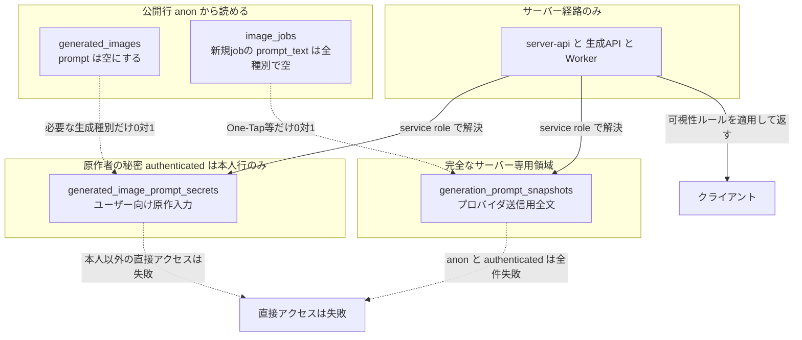
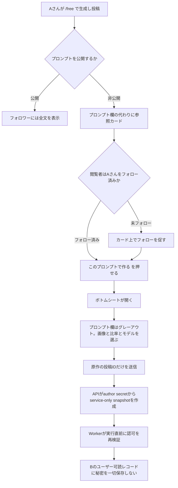
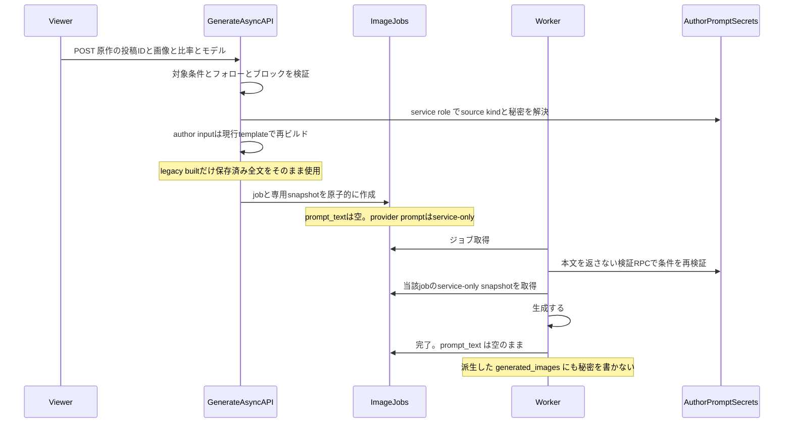
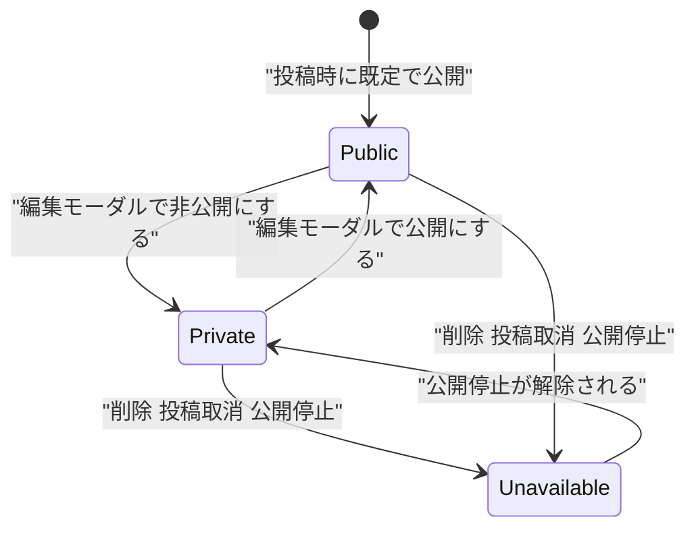
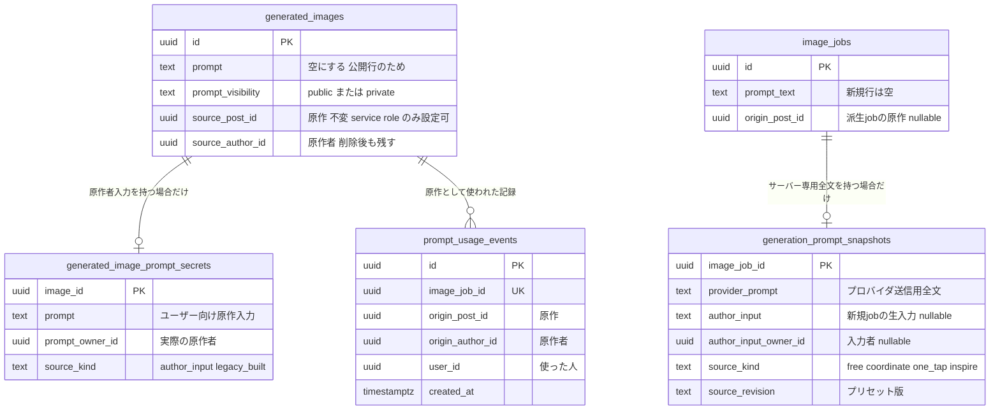
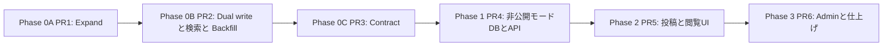

# じゆうモード プロンプト非公開モード 実装計画

作成日: 2026-07-29
最終更新: 2026-07-29（再々レビュー後のF1〜F5を反映。派生再ビルド・legacy表示互換・snapshot必須型・contractランブックを確定）
対象: `/free` 投稿のプロンプト非公開化、および**プロンプト保管の秘匿境界そのものの是正**

## 背景

`/free` の投稿は詳細画面でプロンプトが表示され、フォロワーはコピーして再利用できる。「プロンプトは自分の資産なので見せたくないが、使ってもらえるのは嬉しい」というニーズに対し、秘匿したまま「試せる」導線を用意する。

### 初版計画の重大な誤りと、判明した既存脆弱性

初版は「アプリ層の redaction（`prompt-visibility.ts`）が主要4経路に適用済みだから、列を1つ足せば足りる」としていた。**これは誤りだった。** RLS を見ずにアプリ層だけを見た結論である。

本番実測で確認した事実:

```sql
-- generated_images の SELECT ポリシー（実測）
USING ((is_posted = true AND moderation_status = 'visible') OR (user_id = auth.uid()))
-- roles: {public}

-- テーブル権限（実測）
anon:          SELECT を含む
authenticated: SELECT を含む
```

**RLS は行単位であり、列を絞らない。** したがって公開 anon キーで以下が通る。

```
GET {SUPABASE_URL}/rest/v1/generated_images
    ?is_posted=eq.true&moderation_status=eq.visible&select=prompt,generation_type
```

`redactSensitivePrompts` はサーバーコンポーネントの出力から消しているだけで、**この経路には一切関与しない**。

**本番で読み取れる件数（実測）:**

| generation_type | 読める行数 | ユニークなプロンプト数 |
| --- | --- | --- |
| **one_tap_style** | **689** | **263** |
| coordinate | 229 | 208 |

つまり **運営が作成した One-Tap Style プリセットのプロンプト 263 種が、現在この瞬間も公開 anon キーで取得できる**。「画像のみ公開・プロンプト非公開で moat を作る」という設計意図と正面から反する既存の脆弱性であり、新機能とは独立して存在する。

#### さらに、同じ構造の漏洩が `image_jobs` にもある

レビュー指摘の P0-2（派生者が自分のジョブから秘密を読める）と**まったく同じ構造が、One-Tap Style の既存機能にも存在する**ことを確認した。

```
app/(app)/style/generate-async/handler.ts:578-579
  user_id:     user.id      ← 生成した本人が所有者
  prompt_text: prompt       ← 組み立て済みのプリセット全文
```

`image_jobs` の SELECT RLS は `auth.uid() = user_id` である。したがって **One-Tap Style で生成したユーザーは、自分のジョブ行から運営プリセットのプロンプト全文を読める**。

本番実測: `generation_type = 'one_tap_style'` のジョブ **2,123件すべてに `prompt_text` が入っている**。

対象の投稿が公開されていなくても、**自分が一度生成しさえすればそのプリセットのプロンプトが手に入る**。`generated_images` 側を塞いでも、この経路が残れば moat は開いたままになる。Phase 0 の対象に含める。

**この RLS を是正しない限り、プロンプト非公開モードは成立しない。** 同じ経路から新機能の秘密も抜かれるためである。よって本計画は「新機能の追加」ではなく **「プロンプト保管の秘匿境界を作り直し、その上に新機能を載せる」** ものとして再設計する。

### ヒアリングで確定した仕様

| # | 決定 |
| --- | --- |
| ① | 派生投稿のクレジットは**原作者を表示**。連鎖しても常に原作を指す |
| ② | 元投稿が利用不可のときは生成不可。「現在、ご利用できません」と角の立たない表示 |
| ③ | フォロー判定は**原作者**に対して。カードから直接フォローできる |
| ④ | 派生投稿はプロンプトを表示しない |
| ⑤ | ペルコインは通常の `/free` 生成と同額。原作者への還元はなし |
| ⑥ | 既定は**公開**。投稿者が明示的に非公開を選ぶ。投稿後も切り替え可能 |
| ⑦ | 運営はプロンプト全文を閲覧可。非公開提供を示すバッジを admin に出す |
| ⑧ | 原作者の投稿に**利用数**を表示する（原作者自身の生成は除外） |

---

## コードベース調査結果

### プロンプトが漏れている経路（実測）

| 経路 | 状況 |
| --- | --- |
| PostgREST 直接 SELECT | **anon で `select=prompt` が通る**（上記） |
| `features/generation/lib/database.ts:123,155,342,362` | ブラウザクライアントから `select("*")` |
| `features/event/lib/database.ts:24` | 同上 |
| `image_jobs.prompt_text` | `app/api/generate-async/handler.ts:487` で保存。RLS は `auth.uid() = user_id` なので**所有者は全列を読める** |
| `image_jobs.prompt_text`（One-Tap Style） | `app/(app)/style/generate-async/handler.ts:578-579` で**生成者本人を所有者として運営プリセット全文を保存**。本番 2,123 件すべてに存在 |
| Worker | `supabase/functions/image-gen-worker/index.ts:2743` で `generated_images.prompt` へコピー |
| OpenAI バッチ完了 RPC | `20260517110000_complete_image_job_rpc_dimensions_and_inspire_overrides.sql:115-142` が `v_job.prompt_text` を `generated_images.prompt` へコピー |
| Wardrobe claim | `app/api/wardrobe/claim/save-wardrobe-image.ts:60-80` がクライアント保存値由来の `prompt` を直接 INSERT |
| ブラウザ汎用 INSERT | `features/generation/lib/database.ts:68-105` の `saveGeneratedImage(s)` が `prompt` を含む任意レコードを直接 INSERT 可能 |
| `features/generation/lib/prompt-builder.ts:39-45` | **最終プロンプト全文を `console.log` している** |

### 秘密の所有者と生成画像の所有者は一致しない

`generated_images.user_id` は「画像を生成した人」であり、「プロンプトを開示してよい相手」ではない。

| 生成種別 | 画像所有者 | ユーザー向け原作入力の所有者 | プロバイダ送信用最終プロンプト |
| --- | --- | --- | --- |
| free / coordinate の通常生成 | 生成者 | 生成者 | 本人入力 + 共通指示。本人入力部分のみ本人へ開示可 |
| private free の派生生成 | 派生者 | 原作者 | 派生者には一切開示不可 |
| One-Tap Style | 生成者 | なし | 運営プリセット。生成者には一切開示不可 |
| Inspire / Creator Looks | 生成者 | 入力の由来に依存 | hidden prompt・共通指示を含み、生成者所有とはみなさない |

したがって「全プロンプトを `generated_images.user_id` 所有の1テーブルへ移す」設計は採用しない。**ユーザーに表示し得る原作入力**と、**誰にも直接返さないプロバイダ送信用スナップショット**を分離する。

### legacy 行から生入力は復元できない（本番・コード確認済み）

`generated_images.prompt` と `image_jobs.prompt_text` に保存されているのは、ユーザーの生入力ではなく `buildPromptCore` 適用後の最終プロンプトである。

- `shared/generation/prompt-core.ts:241-252` は `free.base_prefix`・`free.user_direction_label`・`sanitizedDescription` を連結する
- `free.base_prefix` は `shared/generation/prompt-registry.ts:500-506` の運営管理テンプレートで、DB overrideにより版が変わり得る
- `app/api/generate-async/handler.ts:465-521` は生入力を `generation_metadata` に入れず、ビルド済みの `prompt` を `image_jobs.prompt_text` へ保存する

このため、legacy全文から運営prefixだけを安全に剥離してauthor inputを復元することはできない。legacyのfree / coordinateは `source_kind = 'legacy_built'` として、**既存画面がすでに開示しているビルド済み全文を従来と同じ範囲にだけ返す**。これは新しい開示ではなく既存挙動の維持である。

新規jobでは、生入力をservice-only snapshot内の `author_input` として最終プロンプトから分離して保存する。生成成功時にauthor secretへ転記し、以後ユーザー向け表示には生入力だけを使う。ビルド済み最終プロンプトは全生成種別でservice-only snapshotへ保存し、ユーザーが読める `image_jobs.prompt_text` には保存しない。

### job作成経路と終端failedの実態（コード・本番確認済み）

新規jobの作成経路は、次の2ハンドラから `features/generation/lib/async-generation-job-repository.ts:143` の `createImageJob` へ集約されている。

- `app/api/generate-async/handler.ts:524`
- `app/(app)/style/generate-async/handler.ts:619`

snapshotを伴わないjobはprovider promptを解決できず生成不能になるため、各ハンドラの注意事項ではなく `createImageJob(jobData, snapshot)` の必須引数と原子的RPCで不変条件を強制する。

また、現行Workerは `image-gen-worker/index.ts:1596` で `queued` と `failed` の両方をclaimする。本番のfailed jobは180件（attempts 0: 3件、1: 141件、2: 11件、3: 25件）であり、attempts 3の25件はfailed再claimが実際に起きている証拠である。claimをqueued限定へ変えるADR-012は、移行補助だけでなく既存再試行挙動の修正として扱う。

### エラー・Storage の二次経路

- `shared/generation/errors.ts:33-36` の `sanitizeProviderErrorMessage` は API キー形式しか除去しない
- Worker は provider 由来のメッセージを `image_jobs.error_message` と function logs に保存する（`image-gen-worker/index.ts:2931-2988`）
- Worker は provider から返った画像バイト列をそのまま公開 Storage に保存する（`:2614-2629`）。PNG text chunk / EXIF 等のメタデータは現状検査・除去していない

エラー本文と画像メタデータも秘匿境界に含める。

### 本番利用状況と検索影響（2026-07-29実測）

| 指標 | 実測値 |
| --- | --- |
| 公開・visible投稿 | 918件 |
| captionあり | 530件 |
| caption充足率 | **57.7%** |
| `generation_type = 'free'` | 全21件・2ユーザー・投稿0件 |
| `generation_type = 'coordinate'` | 全1,307件・投稿231件 |

検索をcaption + 作者表示名へ変更すると、caption未設定の約42.3%は本文ではヒットしなくなる。作者名検索は残るが、検索対象変更をUIとリリースノートで明示する。

### アプリ層 redaction（境界ではないが防御層として維持する）

`features/generation/lib/prompt-visibility.ts` が `one_tap_style` のみ伏せる実装。適用箇所は `server-api.ts:477,973` / `my-page/lib/server-api.ts:229` / `my-page/lib/api.ts:67`。

### 詳細画面のプロンプト表示

`PostDetailStatic.tsx:440-471` と `PostDetail.tsx`。`oneTapStylePreset ? カード : hasVisiblePrompt ? プロンプト欄 : null` の分岐がある。フォロー判定は `canViewPrompt = isOwner || isFollowingAuthor`（`:97`）。

### One-Tap Style の参照カード（流用元）

`features/style/components/OneTapStyleDetailCard.tsx`。「サムネイル → 確認ダイアログ → 生成画面へ」の構造。

### `/free` の生成フロー

`GenerationForm.tsx:335-350`。入力は画像・プロンプト・モデル・比率の4つのみ。生成 API は `app/api/generate-async/handler.ts`。

### 検索（初版の調査は誤りだった）

**`SearchBar` は `StickyHeader.tsx:289-305` で PC・モバイル双方に常時描画されている。** 初版で「アプリ内に導線が無い」としたのは、`/search` の文字列で grep したため `router.push` でパスを組み立てる `SearchBar.tsx` を取りこぼした結果である。**検索は現に使える機能である。**

- 検索クエリ: `server-api.ts:614,651` の `ilike("prompt", ...)`
- API: `app/api/posts/route.ts:35-38` の `q`
- キャッシュタグ: `search-posts`（`app/api/posts/post/route.ts:122` ほか）

### 削除・所有

- `features/generation/lib/database.ts:170` `deleteGeneratedImage` — **ブラウザから物理削除できる**
- `generated_images` の RLS: INSERT / UPDATE / DELETE いずれも所有者に開放（実測）

### i18n

`messages/` に15ロケール。`messages/ja.ts` が master で `satisfies DeepReplaceStrings<typeof jaMessages>`。**キー追加は15ファイル全てに必要**。

---

## 1. 概要図

### 秘匿境界の再設計（本計画の中核）



### 全体フロー



### 生成のシーケンス（秘密が派生者の所有物にならないこと）



### 状態遷移



### データモデル



---

## 2. EARS 要件定義

### 秘匿境界

- **REQ-001**: The system shall store user-disclosable author input separately from provider-ready prompt snapshots, and `generated_images.prompt` shall not contain prompt text for any row.
  システムは、ユーザーへ開示し得る原作者入力とプロバイダ送信用の最終プロンプトを別の秘密として保存し、`generated_images.prompt` にはいかなる行でもプロンプト本文を保持してはならない。

- **REQ-002**: The system shall deny `SELECT` on author prompt secrets to `anon`, allow direct authenticated access only to the actual prompt author, and deny all direct `anon` and `authenticated` access to provider prompt snapshots.
  システムは原作者入力の秘密を `anon` に拒否し、`authenticated` の直接アクセスは実際の原作者本人の行だけに許可しなければならない。プロバイダ送信用スナップショットは `anon` と `authenticated` の全件を拒否しなければならない。

- **REQ-003**: The system shall never infer prompt ownership from `generated_images.user_id`; it shall use `prompt_owner_id` and the disclosure policy of the prompt source.
  システムは `generated_images.user_id` からプロンプト所有権を推定してはならず、`prompt_owner_id` とプロンプト由来ごとの開示方針を使用しなければならない。

- **REQ-003a**: For legacy rows where raw author input cannot be reconstructed, the system shall classify the built prompt as `legacy_built`, preserve only the existing disclosure scope, and display and copy that exact built value without heuristic extraction.
  生の原作者入力を復元できないlegacy行について、システムはビルド済み全文を `legacy_built` と分類し、既存と同じ開示範囲だけを維持し、推測による抽出や整形をせず保存済み全文をそのまま表示・コピーしなければならない。

- **REQ-003b**: For every new generation job, the system shall persist the provider-ready prompt only in a service-only snapshot and shall separately preserve raw author input only for generation types where that input is user-disclosable.
  すべての新規生成jobについて、システムはプロバイダ送信用全文をservice-only snapshotだけに保存し、ユーザーへ開示可能な生成種別に限って生の原作者入力を別フィールドとして保存しなければならない。

- **REQ-003c**: When the system creates a generation job, it shall atomically create its required provider prompt snapshot, and the repository type shall not permit callers to omit the snapshot.
  システムが生成jobを作成するとき、必須のprovider prompt snapshotを同一トランザクションで作成し、repositoryの型は呼び出し元によるsnapshot省略を許してはならない。

- **REQ-004**: While a prompt is public, the system shall disclose it only to the author and the author's followers, preserving the existing follow gate.
  プロンプトが公開である間、システムは既存のフォローゲートを維持し、投稿者とそのフォロワーにのみ開示しなければならない。

### 既存機能の秘匿（One-Tap Style）

- **REQ-019**: The system shall not persist One-Tap Style or other platform-owned prompt text into user-readable rows; an immutable preset revision or service-only prompt snapshot shall be resolved by the worker.
  システムは One-Tap Style その他の運営所有プロンプトをユーザーが読める行に保存してはならない。Worker は不変のプリセット版、または service-only のプロンプトスナップショットを解決しなければならない。

### 派生生成

- **REQ-005**: When a viewer starts a derived generation, the system shall accept only the origin post id, source image, aspect ratio and model, and shall not accept prompt text.
  閲覧者が派生生成を開始したとき、システムは原作の投稿ID・元画像・比率・モデルのみを受け取り、プロンプト本文を受け取ってはならない。

- **REQ-006**: The system shall not persist the origin prompt into any record owned by the deriving user, including `image_jobs.prompt_text` and the derived `generated_images.prompt`.
  システムは、`image_jobs.prompt_text` と派生した `generated_images.prompt` を含め、派生した利用者が所有するいかなるレコードにも原作のプロンプトを保存してはならない。

- **REQ-007**: When the trusted server creates a derived job, it shall resolve the author secret with the service role, rebuild an `author_input` source with the current free prompt template, use a `legacy_built` source verbatim, and atomically persist only the built result as that derived job's service-only snapshot without copying the origin `author_input`.
  信頼されたサーバーが派生jobを作成するとき、service roleでauthor secretを解決し、`author_input` は現行のfreeプロンプトテンプレートで再ビルドし、`legacy_built` は保存済み全文をそのまま使用し、原作の `author_input` を複製せず、ビルド結果だけを派生job自身のservice-only snapshotとして原子的に保存しなければならない。

- **REQ-007a**: Immediately before a worker sends a derived request to the provider, it shall re-verify availability, visibility, follow and block conditions without depending on the origin job's prompt snapshot, and shall use the derived job's own service-only snapshot.
  Workerが派生リクエストをproviderへ送る直前に、原作jobのprompt snapshotへ依存せず、利用可否・可視性・フォロー・ブロック条件を再検証し、派生job自身のservice-only snapshotを使用しなければならない。

- **REQ-008**: If the source is not a `free` root post with `prompt_visibility = 'private'` and an existing secret, or the origin author is unavailable, or a block relation exists in either direction, then the system shall reject the generation.
  参照先が `free` の根投稿でなく、`prompt_visibility = 'private'` でなく、秘密が存在せず、原作者が利用不可、または双方向いずれかにブロック関係がある場合、システムは生成を拒否しなければならない。

### 出所と改ざん防止

- **REQ-009**: The system shall set `generated_images.source_post_id`, `generated_images.source_author_id`, and `image_jobs.origin_post_id` only from a trusted server path, and shall reject any client-initiated insert or update of these columns.
  システムは `generated_images.source_post_id`、`generated_images.source_author_id`、`image_jobs.origin_post_id` を信頼されたサーバー経路からのみ設定し、クライアント起点のこれらの列の挿入・更新を拒否しなければならない。

- **REQ-010**: The system shall keep `source_post_id` immutable after creation.
  システムは作成後の `source_post_id` を不変にしなければならない。

- **REQ-011**: While the origin post has been deleted, the system shall retain the lineage and render the credit in a disabled state, rather than losing the attribution.
  原作の投稿が削除されている間、システムは出所を保持し、クレジットを無効状態で表示しなければならない。出所を失ってはならない。

- **REQ-012**: When a derived generation completes successfully, the system shall record an immutable usage event, and the usage count shall be computed from those events.
  派生生成が成功したとき、システムは改ざんできない利用イベントを記録し、利用数はそのイベントから算出しなければならない。

### 表示

- **REQ-013**: While a post has a private prompt or a source reference, the system shall render the origin reference card in place of the prompt section.
  投稿のプロンプトが非公開、または出所参照を持つ間、システムはプロンプト欄の代わりに原作の参照カードを表示しなければならない。

- **REQ-014**: If the origin is unavailable for any reason, then the system shall return an identical response shape, status and error code for all causes, and shall not include the origin thumbnail.
  原作がいずれかの理由で利用不可の場合、システムはすべての原因に対して同一のレスポンス形状・ステータス・エラーコードを返し、原作のサムネイルを含めてはならない。

- **REQ-015**: When the author switches a prompt from public to private, the UI shall state that already disclosed content cannot be retracted.
  投稿者がプロンプトを公開から非公開へ切り替えるとき、UI は既に開示された内容を回収できない旨を明示しなければならない。

### 検索

- **REQ-016**: The system shall search `caption` and author display name, and shall not use prompt text as a search key.
  システムは `caption` と作者表示名を検索対象とし、プロンプト本文を検索キーに使ってはならない。

- **REQ-016a**: Before the system clears `generated_images.prompt`, it shall deploy the caption and author-name search path and verify that no production search query depends on the legacy prompt column.
  システムは `generated_images.prompt` を空化する前に、caption・作者名検索をデプロイし、本番検索が旧prompt列へ依存していないことを検証しなければならない。

### ログ

- **REQ-017**: The system shall not write prompt text to application logs, worker logs, APM, or provider error payloads.
  システムはプロンプト本文を、アプリログ・Worker ログ・APM・プロバイダのエラーペイロードに書き出してはならない。

- **REQ-020**: After the contract migration, the database shall reject every insert or update that writes a non-empty value to `generated_images.prompt`.
  contract マイグレーション後、DB は `generated_images.prompt` に非空値を書き込むすべての INSERT / UPDATE を拒否しなければならない。

- **REQ-020a**: After the contract migration, `generated_images.prompt` shall have `DEFAULT ''` in addition to `NOT NULL` and `CHECK (prompt = '')`.
  contract マイグレーション後、`generated_images.prompt` は `NOT NULL` と `CHECK (prompt = '')` に加えて `DEFAULT ''` を持たなければならない。

- **REQ-021**: If a provider returns an error, the system shall store and return only an allowlisted internal error code and shall not persist or log the provider response body.
  プロバイダがエラーを返した場合、システムは allowlist 済みの内部エラーコードだけを保存・返却し、プロバイダのレスポンス本文を永続化またはログ出力してはならない。

- **REQ-022**: Before a provider-generated image is stored in a public bucket, the system shall remove non-pixel metadata or verify that no prompt-bearing metadata exists.
  プロバイダ生成画像を公開バケットへ保存する前に、システムは画素以外のメタデータを除去するか、プロンプトを含むメタデータが存在しないことを検証しなければならない。

- **REQ-023**: When a worker retries or receives the same queue message again, the system shall record at most one prompt usage event for the image job.
  Worker が再試行または同一キューメッセージを再受信したとき、システムは画像ジョブごとに高々1件の利用イベントだけを記録しなければならない。

- **REQ-024**: The system shall not clear a legacy prompt column until dual-write is active and row-level migration verification has succeeded.
  システムは dual-write が稼働し、行単位の移行検証が成功するまで、旧プロンプト列を空化してはならない。

- **REQ-025**: Once the worker has completed its final authorization check and started the provider request, later revocation may prevent delivery but cannot guarantee cancellation of the in-flight provider request.
  Worker が最終認可を終えてプロバイダリクエストを開始した後は、後続の取消によって成果物の提供を止められても、実行中の外部リクエスト自体の取消は保証しない。

- **REQ-026**: If source availability, follow, or block authorization becomes invalid before delivery, the system shall not deliver the generated result and shall refund any deducted Percoins through the existing idempotent `refund_percoins` path.
  成果物提供前に原作の利用可否・フォロー・ブロック認可が無効になった場合、システムは生成結果を提供せず、減算済みペルコインを既存の冪等な `refund_percoins` 経路で返金しなければならない。

- **REQ-027**: A terminal failed job shall not be re-executed in place; a user retry shall create a new job with a new prompt snapshot.
  終端状態のfailed jobをその場で再実行してはならず、ユーザーの再試行は新しいprompt snapshotを持つ新規jobを作成しなければならない。

### 運営

- **REQ-018**: While an admin views a post, the system shall display the full prompt with a badge indicating whether it is provided privately.
  管理者が投稿を閲覧している間、システムはプロンプト全文と、非公開提供かどうかを示すバッジを表示しなければならない。

---

## 3. ADR

### ADR-001（再改訂）: 原作者入力とプロバイダ送信用全文を別の秘密として分離する

**初版の「別テーブル不要」は撤回する。**

- **Context**: `generated_images` の SELECT は行単位で `anon` に開放されているため、本文を同じ行へ置けない。一方、One-Tap Style では生成画像の所有者は利用者だが、最終プロンプトは運営資産である。画像所有者を秘密の所有者とみなすと、別テーブルへ移しても本人 RLS から再漏洩する。
- **Decision**:
  1. `generated_image_prompt_secrets(image_id PK, prompt, prompt_owner_id, source_kind, created_at)` は、投稿者へ表示・再利用し得るプロンプトを持つ。新規行は生のauthor input、legacy行は分離不能なビルド済み全文を `legacy_built` として保持する。直接 SELECT は `auth.uid() = prompt_owner_id` のみ
  2. `generation_prompt_snapshots(image_job_id PK, provider_prompt, author_input, author_input_owner_id, source_kind, source_revision, created_at)` は、**全新規jobのプロバイダ送信用全文**を持つ。ユーザー向け表示対象であるfree / coordinateの生入力だけを `author_input` として分離・一時保持し、生成成功時にauthor secretへ転記する。One-Tap等の補助入力からauthor secretは作らない。`anon` / `authenticated` には一切の権限・ポリシーを与えない。snapshotは当該jobの監査・同一job内の再試行用であり、完成投稿からの長期派生生成の正本にはしない
  3. 派生画像と One-Tap Style 画像には、生成画像所有者が読める author secret を作らない
  4. 新規jobの `image_jobs.prompt_text` は全生成種別で空にし、Workerはservice-only snapshotから生成する
  5. `generated_images.prompt` は全行空にし、contract 後は `DEFAULT ''` と CHECK 制約で非空値を拒否する
- **Reason**:
  1. RLS は列を絞れない。行が見える以上、列は取れる
  2. 「公開プロンプト」もフォロワー限定であり、公開行へ置いてよい本文はない
  3. ユーザー入力と共通 prefix・hidden prompt・プリセット全文では所有者と開示方針が異なる
  4. 完成済みプロンプトをユーザー所有の secrets にまとめると One-Tap Style / Inspire の moat を破る
- **Consequence**: legacyの生入力復元は行わない。現在表示されているfree / coordinateのビルド済み全文は `legacy_built` としてauthor secretへ移し、開示範囲を広げず現状維持する。One-Tap / Inspire等の非開示全文はauthor secretへ入れず、信頼できるjob対応と保存理由がある場合だけservice-only snapshotへ移す。新規行は生入力と最終全文を正しく分離できる。将来 `image_jobs` に保持期限を導入してsnapshotがCASCADE削除されても、完成したfree原作のauthor secretは残り、派生生成を継続できる。

### ADR-002: 派生利用者が所有するレコードに秘密を一切書かない

- **Context**: 初版は「派生投稿の `prompt` 列に原作のプロンプトが入るが UI で隠す」としていた。しかし `image_jobs` の RLS は `auth.uid() = user_id` であり、**派生した利用者は自分のジョブの全列を読める**。Worker も `generated_images.prompt` へコピーする（`image-gen-worker/index.ts:2743`）。UI で隠しても2箇所から平文を取得できる。
- **Decision**: 新規jobでは生成種別を問わず `image_jobs.prompt_text` を空にし、最終全文をservice-only snapshotへ保存する。派生job作成時、信頼済みAPIがservice roleで原作のauthor secretを解決する。`source_kind = 'author_input'` なら `shared/generation/prompt-core.ts` の現行freeテンプレートでprovider promptを再ビルドし、`legacy_built` なら保存済み全文をそのまま使用して、派生job自身のsnapshotとjobを原子的に作成する。派生snapshotの `author_input` / `author_input_owner_id` は必ずNULLとし、原作者入力を派生者の成功処理へ伝播させない。Workerは実行直前に本文を返さない検証RPCで条件を再検証し、派生job自身のsnapshotを使用する。原作jobのprovider snapshotは派生生成に使わない。生成後も派生行にauthor secretを作らない。
- **Reason**: 秘密を「派生者の所有物」に一瞬でも置いた時点で、RLS 上はその人のものになる。表示制御では取り返せない。また `generation_prompt_snapshots` は `image_jobs` の運用ライフサイクルに従うため、完成投稿の長期的な派生可否を依存させない。
- **Consequence**: 生成APIに「投稿IDからauthor secretを解決し、source kindごとに再ビルドまたは直接使用してjobとsnapshotを原子的に作る」経路が増える。新規原作はfreeテンプレート改善後に作成された派生jobで最新の錨を使用し、元生成のprovider promptとのバイト一致は保証しない。作成済みjobの再試行は自身のsnapshotへ固定する。legacyだけは再構成不能なので旧全文へ固定される。job投入後に原作が非公開解除・削除・ブロックされる可能性があるため、Worker実行時にも条件を再検証する（REQ-007 / REQ-007a）。

### ADR-003: `source_post_id` は常に原作を指し、削除後も出所を保持する

- **Context**: A→B→C と派生したとき、根を指すか直前を指すかで意味が変わる。また `ON DELETE SET NULL` にすると、原作の削除で派生の出所が消える。派生投稿は「通常の投稿」に見えるようになり、非公開強制も外れる。
- **Decision**: 常に根を指す。`source_post_id` は **FK 制約を張らない素の UUID** とし、あわせて `source_author_id` を保存する。ただし作成 RPC / trigger は、作成時点で原作が実在すること、root であること、`source_author_id = origin.user_id` であることを検証し、両列を不変にする。原作が削除されても値は残り、解決に失敗したら「現在、ご利用できません」を表示する。
- **Reason**: 出所は削除後も残す必要がある（クレジット・非公開強制・利用数の根拠）。`ON DELETE SET NULL` はこれを破壊する。`RESTRICT` は原作者が自分の投稿を消せなくなるため不可。
- **Consequence**: 削除後は意図的な dangling UUID になるが、不正なUUIDを新規作成することはDBが拒否する。投稿だけが削除された場合は残存プロフィールから原作者を表示する。アカウント完全削除後はPIIの表示名スナップショットを保持せず「削除されたユーザー」と表示する。将来、非PIIの安定した出所レコードが必要になった場合は、削除されない `prompt_origins` tombstone テーブルへ昇格する。中間の投稿がどれだけ広めたかは記録しない。

### ADR-004: 派生投稿は投稿者の選択より優先して非公開にする

- **Context**: 派生した利用者はボトムシートでプロンプトを編集できないため、生成に使われたのは原作のプロンプトそのものである。
- **Decision**: `source_post_id` を持つ投稿は、投稿者が「公開」を選んでも非公開として扱う。投稿モーダルでトグルを出さない。DB trigger でも強制する。
- **Reason**: プロンプトは原作者の資産であり、派生者に公開の権限はない。
- **Consequence**: 派生者は自分の投稿のプロンプトを見られない（ADR-002 により、そもそも所有物として保存されない）。

### ADR-005: 利用不可の理由は開示せず、レスポンス形状も統一する

- **Context**: 元投稿が削除・投稿取消・公開停止・非公開解除のいずれでも生成できない。
- **Decision**: すべて「現在、ご利用できません」に丸める。**文言だけでなく、HTTP ステータス・エラーコード・レスポンスの形も同一にする。** 公開停止された投稿のサムネイルは返さない。
- **Reason**: 「削除時だけサムネイルが欠ける」「公開停止時だけ画像が残る」「ステータスが違う」といった差からも理由は推測できる。**文言を揃えただけでは秘匿にならない。**
- **Consequence**: 原作者が自分で消しただけのケースも同じ表示になる。閲覧者から区別できないが実害はない。

### ADR-006: 生成 API はプロンプトを受け取らず、対象条件を厳格に検証する

- **Context**: プロンプトをクライアント経由で渡すと devtools で見える。また `sourcePostId` の検証が緩いと、**One-Tap Style や Inspire の投稿 ID を渡して秘匿プロンプトを回収できる**。
- **Decision**: `sourcePostId` のみを受け取り、以下をすべて満たすときだけ実行する。
  - 対象が存在し `is_posted = true` かつ `moderation_status = 'visible'`
  - `generation_type = 'free'`
  - 根投稿である（`source_post_id IS NULL`）。派生 ID が渡されたら根へ解決する
  - `prompt_visibility = 'private'`
  - secrets 行が存在する
  - 原作者のアカウントが利用可能
  - リクエスト元が原作者をフォローしている、または本人
  - **双方向いずれにもブロック関係がない**
- **Reason**: 条件が1つでも欠けると別種の秘匿プロンプトの回収経路になる。
- **Consequence**: 検証が長くなるため、専用の SECURITY DEFINER RPC に集約して API と Worker の双方から呼ぶ。

Workerは課金前とprovider呼び出し直前に認可を検証する。課金前に無効なら減算せず終了する。課金後に無効なら成果物を提供せず、既存の `refundPercoinsFromGeneration` → `refund_percoins` RPCで冪等返金する。provider完了後・永続化前にも再検証し、その間に取消された場合は成果物を破棄して同じ返金経路を使う。外部API実行中にDBロックは保持せず、providerへ送信済みのリクエスト自体の取消は保証しない（REQ-025 / REQ-026）。

### ADR-007（改訂）: 検索は残し、対象を公開フィールドへ差し替える

**初版の「検索機能を廃止」は撤回する。**

- **Context**: 初版は「アプリ内に検索ボックスへの導線が無い」として廃止を提案した。**これは調査ミスだった。** `SearchBar` は `StickyHeader.tsx:289-305` で PC・モバイル双方に常時描画されている。`/search` の文字列で grep したため、`router.push` でパスを組み立てる `SearchBar.tsx` を取りこぼした。
- **Decision**: `/search` と検索バーは維持する。`ilike("prompt", ...)` を **`caption` と作者表示名の検索へ差し替える**。作者表示名は公開プロフィールから候補 `user_id` を先に解決するか、既存のblock・report・moderation条件を同じSQL内で維持できる専用RPC/viewで結合する。
- **Reason**:
  1. 現に使える機能であり、廃止は実質的なユーザー機能削除にあたる。秘匿の手段としては過剰
  2. そもそも**プロンプトを検索キーにしている現状自体が是正対象**である。ADR-001 でプロンプトを公開行から外す以上、検索キーにはできない
  3. `caption` は公開が前提のフィールドであり、検索対象として自然
- **Consequence**: 本番のcaption充足率は57.7%（公開visible 918件中530件）で、約42.3%はcaption本文ではヒットしない。プレースホルダとリリースノートで「作品説明・作者名検索」へ変わることを示す。検索差し替えは `generated_images.prompt` 空化の前提なのでPhase 0Bへ前倒しする。ページネーション・並び順・ワイルドカードのエスケープを維持する。

### ADR-008: 利用数は改ざん不可のイベントから算出する

- **Context**: `generated_images` を数える案だったが、同テーブルは所有者が INSERT / UPDATE / DELETE でき、`source_post_id` も書き換えられる。任意の原作 ID を自分の行に設定すれば利用数を水増しできる。派生画像を削除すると利用数が減る問題もある。
- **Decision**: `prompt_usage_events(id, image_job_id UNIQUE, origin_post_id, origin_author_id, user_id, created_at)` を新設し、**生成成功時に service role で冪等記録**する。`record_prompt_usage(p_image_job_id)` は成功済みジョブから origin・原作者・利用者をDB内で導出し、`ON CONFLICT DO NOTHING` とする。利用数は `COUNT(DISTINCT user_id)` で算出し、保存済み `origin_author_id` により原作者自身を除外する。クライアントからの書き込みは不可。
- **Reason**: 表示する数値は改ざんできてはならない。生成画像の削除で数が減るのも実態に合わない（使った事実は消えない）。
- **Consequence**: テーブルが1つ増える。イベントは削除しないため単調増加するが、Worker再試行では増えない。集計RPCはservice-onlyとし、Server APIが原作の閲覧可否を適用してから結果だけをレスポンスへ載せる。クライアントへ任意UUIDで呼べるEXECUTE権限は与えない。

### ADR-009: Phase 0 は expand・backfill・contract の複数デプロイに分ける

- **Context**: Vercel デプロイと `supabase db push`、Edge Function deploy は別操作である。単一PRに additive migration と空化 migration を同梱すると、旧コード停止・テーブル未作成・backfill後の新規行取りこぼしのいずれかが起こる。
- **Decision**: 既存漏洩修正は3段階に分ける。Phase 0A で additive schema、Phase 0B で互換コード・dual-write・backfill・検証、Phase 0C で旧fallback撤去・空化・DB invariantを適用する。各段階を別PR・別デプロイとし、新機能UIより先に完了させる。
- **Reason**: 時間ではなく、dual-write 稼働中の行単位検証を contract の前提にする必要がある。未使用の additive table が一時的に残ることは、データ欠損や漏洩より安全である。
- **Consequence**: 当初の「Phase 0〜5を単一PR」は撤回する。移行中だけ新→旧の dual-read を許すが、secret取得エラー時の無条件fallbackは禁止する。fallbackには期限・観測・撤去PRを必須とする。

### ADR-010: provider error と公開画像メタデータを秘密の出口として扱う

- **Context**: 現在の sanitizer はAPIキーしか除去せず、provider本文を `error_message` とログへ保存し得る。また provider の画像バイト列をそのまま公開Storageへ置いている。
- **Decision**: クライアント可視のエラーはallowlist済み内部コードへ正規化し、provider response body・request body・promptをDB、ログ、APMへ残さない。providerの生バイトが保存されるoriginalを優先調査し、prompt-bearing metadataがあれば公開保存前に除去・再エンコードする。display / thumbnailはSharp再エンコード済みだが、テストでmetadataがないことを確認する。
- **Reason**: UIとDB列を塞いでも、エラー本文やPNG text chunkから本文が出れば機能価値が失われる。
- **Consequence**: 運用デバッグ情報はステータス、内部コード、request id、provider、モデル、所要時間に限定する。元画像の画素としてモデルが文字を描画するケースは技術的に防げないため、秘匿保証は非画素メタデータとシステム出力経路を対象とする。

### ADR-011: 非公開モードの対象は今回 `/free` に限定する

- **Context**: 2026-07-29時点で `free` は全21件・投稿0件、`coordinate` は全1,307件・投稿231件である。coordinateへ広げれば利用面は大きいが、ヒアリングで確定した本機能の対象は `/free` であり、投稿UI・派生生成・互換性の追加検討が必要になる。
- **Decision**: Phase 0の秘匿境界修正と新規jobのauthor input分離は全生成種別へ適用するが、`prompt_visibility = 'private'` を選べるroot投稿は今回 `generation_type = 'free'` に限定する。
- **Reason**: セキュリティ境界は利用数に関係なく全種別で直す。一方、製品機能の対象拡大は実測利用数だけを理由に既存合意を変更せず、別の要件確認を経る。
- **Consequence**: coordinate対応を後から追加する場合は、guard制約・投稿UI・派生可否・legacy built表示を扱う別ADRとforward migrationが必要になる。この後戻りコストを明示的に受け入れる。

### ADR-012: 終端failed jobは再利用せず、新規jobとして再試行する

- **Context**: 現在のWorker claimは `queued` と `failed` の両方を許すが、終端失敗時はqueue messageを削除しており、管理API/UIに既存failed jobの手動再実行経路は見つからない。contractでlegacy `prompt_text` を空化すると、snapshotのないfailed jobは同一行で再生成できない。本番にはfailed jobが180件あり、attempts別に0: 3件、1: 141件、2: 11件、3: 25件である。attempts 3の存在から、failed再claimは実際に発生している。
- **Decision**: Workerが処理開始できるのは `queued` のみとする。内部リトライはstatusを `queued` に戻す。終端 `failed` は不変とし、ユーザーの「再試行」は入力を再送して新しいjobとsnapshotを作る。
- **Reason**: 終端jobの監査状態を保ち、空化済み秘密へ依存する隠れた再実行経路をなくす。
- **Consequence**: これは移行支援だけでなく既存180件に関係する再試行挙動の修正である。Phase 0C前にユーザー向け再試行導線がfailed再claimへ依存せず、新規job作成になっていることを確認する。legacy failed jobを同一IDで手動再実行する運用は廃止する。将来admin再実行を作る場合も、旧jobを複製せず認可・課金・snapshotを再作成する専用RPCを設計する。

### ADR-013: legacy built promptは既存表示を維持し、新規行だけauthor inputを表示する

- **Context**: legacy free / coordinateから生入力を復元できないため、author secretの内容はlegacyでは運営prefix・ラベルを含むビルド済み全文、新規行ではauthor inputのみになる。判断しないまま実装すると、同じプロンプト欄とコピー操作の世代差が偶然の挙動になる。
- **Decision**: `source_kind` をサーバー側の表示解決に使用する。`legacy_built` は保存済み全文を加工せず従来と同じフォローゲートで表示・コピーし、`author_input` は生入力だけを表示・コピーする。prefix剥離、テンプレート一致による抽出、コピー時の再構成は行わない。移行内部の分類でユーザーを混乱させないため「旧形式」ラベルは追加しない。
- **Reason**: legacy全文の推測加工は誤切断・内容改変の危険があり、既存ユーザーが現在見られる内容を移行だけで狭める理由もない。一方、新規行で運営prefixを開示し続ける必要はない。
- **Consequence**: legacyと新規で表示・コピー内容に意図的な世代差が残る。これは互換仕様としてテストする。将来legacy表示を畳む場合は、既存開示仕様の変更として別ADR・告知・forward migrationで扱う。

---

## 4. 実装計画

### フェーズ間の依存関係



### 本番適用ランブック

| 順序 | デプロイ単位 | 必須確認 |
| --- | --- | --- |
| 1 | PR1のadditive migrationを `supabase db push` | 旧Next.js / 旧Workerが正常、secret権限マトリクスが期待どおり |
| 2 | PR2のbackward-compatible Worker | legacy jobは従来どおり、snapshot jobも処理可能 |
| 3 | PR2のNext.js | `createImageJob(jobData, snapshot)` が必須で、新規jobの `prompt_text` が全種別で空。検索がcaption + 作者名へ移行済み |
| 4 | backfill + 検証SQL | 種別件数・行digest・owner・orphan・dual-write後の差分がすべて0 |
| 5 | PR3直前の本番ゲート | user retryが新規jobを作ること、queued / processing件数を再取得して0件または全件snapshot済みであること、既知caption・nickname検索が結果を返すことを記録 |
| 6 | PR3のfallbackなしNext.js / Worker | secret読み取りエラーがfail closed。既存表示・生成が正常 |
| 7 | PR3のcontract migration | 公開列と終端jobを空化し、DB invariantをVALIDATE。直後に同じcaption・nickname検索が0件固定でないことを確認 |
| 8 | PR4以降 | private prompt新機能を初めて有効化 |

各段階でロールバック先は「直前の互換バージョン」とする。順序を飛ばさず、Vercel・DB・Workerのどれが現在の本番バージョンかをリリース記録へ残す。

### Phase 0A: Expand（PR1・マイグレーション先行）

**目的**: 既存コードを壊さず秘密の保存先と原子的書き込み口を追加する
**適用順序**: PR1マージ → `supabase db push` → スキーマ確認。未使用テーブルが先行しても既存挙動は変わらない

- [ ] `generated_image_prompt_secrets`
  - `image_id UUID PK REFERENCES generated_images(id) ON DELETE CASCADE`
  - `prompt TEXT NOT NULL`
  - `prompt_owner_id UUID NOT NULL REFERENCES auth.users(id) ON DELETE CASCADE`
  - `source_kind TEXT NOT NULL CHECK (source_kind IN ('author_input','legacy_built'))`
  - RLSは本人SELECTのみ。`anon`拒否。DMLはservice role /専用RPCのみ
- [ ] `generation_prompt_snapshots`
  - `image_job_id UUID PK REFERENCES image_jobs(id) ON DELETE CASCADE`
  - `provider_prompt TEXT NOT NULL`, `author_input TEXT`, `author_input_owner_id UUID`, `source_kind`, `source_revision`, `created_at`
  - `source_kind` は `free / coordinate / one_tap_style / inspire` 等の生成由来を表す
  - `author_input` はユーザー向け表示対象のfree / coordinateだけに許可し、入力の有無・owner・source kindをCHECK制約で整合させる
  - RLS有効・公開ポリシーなし・`PUBLIC, anon, authenticated` から全権限REVOKE
- [ ] 通常生成の完了を原子的に行うRPCを追加し、画像行・author secret・job成功更新を同一トランザクションに閉じる
- [ ] `complete_image_job_with_generated_images` の新しい定義を追加し、将来のdual-writeに対応できる形にする
- [ ] One-Tap用の「ジョブ + service-only snapshot」作成RPCを追加する。`source_revision` は実行時に変更されないプリセット版または内容ハッシュ
- [ ] SECURITY DEFINER関数は `SET search_path = public, pg_temp`、所有者固定、`PUBLIC / anon / authenticated` のEXECUTEをREVOKEし、必要なservice role経路だけに限定する
- [ ] Supabaseの契約・バックアップ機能を確認
  - PITR契約の有無、通常バックアップの保持期間、復元手順を記録
  - PITR未契約でもPhase 0Cへ進めるよう、通常バックアップまたは暗号化service-only退避の具体策を決める
- [ ] マイグレーション後に `anon` / authenticated他人 / owner / service role の権限マトリクスをPreviewで検証

### Phase 0B: Dual-write・読み取り移行・Backfill（PR2）

**目的**: 新規行の取りこぼしを止めた状態で、既存値を安全に移行する
**デプロイ順序**: backward-compatible Worker → Next.js → backfill・検証

- [ ] Worker を先にデプロイ
  - 全生成種別でsnapshotがあれば使用し、移行前の既存jobだけ `prompt_text` fallbackを許す
  - Gemini/OpenAI双方の画像永続化を新RPCへ統一する
  - `generated_images.prompt` への直接コピーをやめ、新規jobはsnapshotの `author_input` がある場合だけ同一トランザクションでauthor secretを作る
- [ ] Next.jsをデプロイ
  - `ImageJobCreateInput` とは別に必須の `GenerationPromptSnapshotCreateInput` を定義し、repositoryを `createImageJob(jobData, snapshot)` の2引数に変更する。snapshot引数はoptionalにしない
  - 2つの既存呼び出し元を同じ型へ移し、全生成種別で `prompt_text = ''` としたjob・provider prompt・生のauthor inputを専用RPCで原子的に保存する
  - jobだけ、またはsnapshotだけが残る部分成功を許さず、3つ目の生成経路がsnapshotなしでコンパイルできないことを型で保証する（REQ-003c）
  - `saveGeneratedImage(s)` の汎用ブラウザINSERTを削除またはpromptを書けないAPIへ縮小
  - Wardrobe claimの `prompt` を公開列へ保存しない。必要ならtrusted RPCで分類済みsecretへ保存
  - `features/generation/lib/prompt-builder.ts` の最終プロンプトログを削除
- [ ] **検索対象をcontract前に差し替える**（REQ-016 / REQ-016a）
  - `server-api.ts:614,651` のprompt検索をcaption + 公開プロフィール表示名へ変更
  - `caption` と `profiles.nickname` の `%term%` 検索について、`pg_trgm` indexを追加するかPreviewの `EXPLAIN` で不要と判断した根拠を残す
  - 既存のmoderation・block・report・sort・pagination条件を維持し、wildcardをエスケープ
  - `SearchBar` / `StickyHeader` を「作品説明・作者名」に変更
  - caption充足率57.7%と検索対象変更をリリースノートに記載
  - 本番同等データで検索が0件固定にならないことを確認
- [ ] 読み取りを `features/generation/lib/prompt-secrets.ts` へ移行
  - `features/posts/lib/server-api.ts`、`features/my-page/lib/server-api.ts` / `api.ts`
  - ブラウザの `select("*")` を明示列へ変更し `prompt` を除外
  - 移行中のfallbackは「対応するlegacy行でsecretが未作成」の場合だけ。DB障害・権限エラー時はfail closed
- [ ] providerエラーを固定内部コードへ正規化し、response body・prompt・stackをDB/ログへ保存しない
- [ ] 公開Storageへ保存する生成画像の非画素メタデータを除去または形式別に検証
- [ ] idempotent backfill
  - `INSERT ... ON CONFLICT ...` とし、`generation_type` /由来ごとに分類
  - legacy free / coordinateは生入力へ分離せず、ビルド済み全文を `legacy_built` author secretへ移して既存開示範囲を維持
  - legacy One-Tap / Inspire /非開示全文はauthor secretへ入れない。信頼できるjob対応と保存理由があるものだけservice-only snapshotへ移す
  - prefix剥離・テンプレート文字列一致による生入力推定は行わない
  - `legacy_built` と移行対象外は `generation_type` /理由別件数とhashを検証し、平文をログへ出さない
  - backfill中もdual-writeを継続
- [ ] 平文を出力しない検証SQLを実行
  - legacy非空行と移行先の件数を種別ごとに比較
  - 行ごとの `digest(prompt)` を比較
  - owner/source_kind不整合、orphan、移行漏れが0件
  - dual-write開始後に作られた行も差分0件

### Phase 0C: Contract・既存漏洩の閉鎖（PR3）

**目的**: 公開列・ユーザー所有ジョブ・fallbackを完全に閉じ、再発をDBで拒否する
**開始条件**: Phase 0Bが本番稼働し、検索がprompt列へ依存せず、検証SQLが連続して差分0件。queued/processingジョブのsnapshot移行が完了。ユーザー向け再試行が新規job作成であることを確認。Phase 0Aで確定したバックアップ手段の復元点を確認

- [ ] secret→legacyの読み取りfallbackを削除してデプロイし、読み取りエラー率を監視
- [ ] `generated_images.prompt` を空文字へ更新
- [ ] `ALTER COLUMN prompt SET DEFAULT ''` を適用
- [ ] `CHECK (prompt = '')` を `NOT VALID` →検証→VALIDATEの順で追加
- [ ] prompt検索が残っていないことを確認して `idx_generated_images_prompt_trgm` を削除
- [ ] 最新の `complete_image_job_with_generated_images` を含む全永続化経路が空文字しか書かないことを確認
- [ ] 全生成種別の `image_jobs.prompt_text` を段階的に空化
  - succeeded / failed / cancelled等の終端jobを対象にする
  - queued / processingは先にsnapshotへ移すか、完了後に空化する
  - 適用直前にgeneration_type・status・attempts別件数を再取得する。queued / processingが0件でなければ、全件snapshot済みを確認してから進むか完了まで待つ
  - legacy failedは同一jobで再実行せず、ユーザー再試行は新規jobを作る
  - Workerのclaim条件を `queued` のみに変更し、終端failedを再取得しない
  - 固定件数ではなく実行時クエリ結果をgeneration_type・status別に記録
- [ ] contract前後に同じ既知のcaption・nickname検索を本番で実行し、prompt空化後も検索が0件固定にならないことをランブックへ記録する（自動テスト8bではなく運用確認）
- [ ] anonで `generated_images.prompt` が全件空、One-Tap生成者で自分のjob/snapshotから全文を取得できないことを本番同等キーで検証
- [ ] 秘匿境界修正を新機能から独立してリリース完了とする

### Phase 1: 非公開モードのDB・API・Worker（PR4）

**目的**: 可視性・出所・派生生成・冪等利用イベントを実装する

- [ ] `supabase/migrations/2026xxxx_add_free_prompt_visibility.sql`
  - `generated_images` に追加
    - `prompt_visibility TEXT NOT NULL DEFAULT 'public' CHECK (prompt_visibility IN ('public','private'))`
    - `source_post_id UUID`（**FK なし**。ADR-003）
    - `source_author_id UUID`
  - `image_jobs` に `origin_post_id UUID` を追加（FKなし）
  - `source_post_id` に部分インデックス（`WHERE source_post_id IS NOT NULL`）
  - **guard trigger**（DB 層で強制）
    - `source_post_id` が自分自身を指さない
    - `source_post_id` が NOT NULL のとき `prompt_visibility` を `'private'` に強制
    - rootで `prompt_visibility = 'private'` を選べるのは `generation_type = 'free'` のみ
    - **`source_post_id` / `source_author_id` は service role からの書き込みのときのみ設定・変更可**。それ以外の INSERT / UPDATE では拒否（REQ-009）
    - 作成時にoriginの実在・root・free・`source_author_id = origin.user_id` を検証
    - 作成後の `source_post_id` / `source_author_id` 変更を拒否
    - `image_jobs.origin_post_id` はservice-onlyのjob作成RPCだけが設定でき、作成後は変更を拒否
- [ ] `supabase/migrations/2026xxxx_add_prompt_usage_events.sql`
  - `prompt_usage_events(id UUID PK, image_job_id UUID UNIQUE NOT NULL, origin_post_id UUID NOT NULL, origin_author_id UUID NOT NULL, user_id UUID NOT NULL, created_at TIMESTAMPTZ NOT NULL DEFAULT now())`
  - RLS 有効化・公開ポリシーなし・`REVOKE ALL FROM PUBLIC, anon, authenticated`
  - `(origin_post_id)` にインデックス
- [ ] `supabase/migrations/2026xxxx_add_derived_generation_rpcs.sql`
  - `resolve_derived_prompt_source(p_source_post_id, p_requester_id)` — job作成時にADR-006の全条件を検証し、根の投稿ID・原作者ID・author secretの `source_kind` と秘密値を返す。**service role専用**。原作jobのsnapshotは参照しない
  - `validate_derived_prompt_source(p_source_post_id, p_requester_id)` — Worker再検証用。本文を返さず可否・根の投稿ID・原作者IDだけを返すservice-only RPC
  - `record_prompt_usage(p_image_job_id)` — 成功済みjobから値を導出し `ON CONFLICT DO NOTHING`
  - `get_prompt_usage_count(p_origin_post_id)` — service-only。Server APIが原作の閲覧可否を適用した後に `COUNT(DISTINCT user_id)` を取得し、クライアントから任意UUIDを列挙できる直接GRANTはしない
- [ ] `app/api/generate-async/handler.ts`
  - `sourcePostId` と `prompt` の同時指定は400
  - requester idはbodyではなく認証セッションから取得
  - 利用不可は同一の409 + `FREE_SOURCE_UNAVAILABLE`
  - 派生job作成時にauthor secretをservice roleで解決し、`author_input` は現行freeテンプレートで再ビルド、`legacy_built` はそのまま使用する
  - jobのユーザー可読列には `origin_post_id` のみ、`prompt_text = ''` を保存し、再ビルド結果はjobと同じ原子的RPCで派生job自身のservice-only snapshotへ保存する
  - 派生snapshotは `provider_prompt` とtemplate revision/hashだけを持ち、`author_input` / `author_input_owner_id` はNULLに固定する。RPCはこの不変条件に反する派生job作成を拒否する
- [ ] Worker
  - 課金前・provider呼び出し直前・provider完了後の永続化前に、可用性・フォロー・双方向blockを再検証
  - 本文を返さない `validate_derived_prompt_source` で再検証し、provider送信には派生job自身のservice-only snapshotを使用する
  - `generation_prompt_snapshots` は当該jobの監査・再試行に限定し、新しい派生jobの作成可否を原作jobや原作snapshotの保持期間へ依存させない
  - 課金前の認可失敗は減算せず終了。課金後の認可失敗は成果物を破棄し、`refundPercoinsFromGeneration` → `refund_percoins` で冪等返金
  - 外部呼び出し開始後の取消意味論をREQ-025 / REQ-026としてテスト・文書化
  - 派生画像にはauthor secretを作らない
  - 成功トランザクション内で `record_prompt_usage(p_image_job_id)`

### Phase 2: 投稿・閲覧UI（PR5）

**目的**: ユーザー向け投稿・閲覧・派生生成操作を提供する
**ビルド確認**: `npm run lint` / `npm run typecheck` / `npm run build -- --webpack`

- [ ] `features/generation/lib/prompt-visibility.ts` を拡張
  - `getPostPromptDisplayMode(record)` を追加し `"source_reference" | "one_tap_style" | "prompt" | "none"` を返す
  - `prompt_visibility === 'private'` と `source_post_id != null` を非公開条件に加える
- [ ] `features/posts/types.ts` / `features/generation/lib/database.ts` に新列を追加
- [ ] `features/posts/lib/server-api.ts` に `source_reference` の解決を追加
  - 原作の利用可否判定をここに集約。**利用不可なら同一形状で `is_available: false` を返し、サムネイルも含めない**（ADR-005 / REQ-014）
  - 利用数は `get_prompt_usage_count` から取得
  - prompt表示値を `source_kind` で解決し、`legacy_built` は保存済み全文、`author_input` は生入力だけを返す。クライアントへsource kindの判定責務やprovider snapshotを渡さない（ADR-013）
- [ ] `app/api/posts/post/route.ts` / `update/route.ts` に `promptVisibility` を追加
- [ ] `PostModal.tsx` に「プロンプトを公開する」トグル（既定 ON）。派生投稿では出さない
- [ ] 「非公開 かつ 生成前の画像も非表示」のときの注意文
- [ ] `EditPostModal.tsx` に同トグル。**公開→非公開の切替時に「すでに閲覧・コピーされた内容は回収できません」と明示**（REQ-015）
- [ ] `features/posts/components/SourcePromptReferenceCard.tsx` を新規作成
  - `OneTapStyleDetailCard.tsx` の構造を踏襲。原作者名・アバター・サムネイル
  - 未フォローならカード内にフォローボタン
  - 利用数を表示
  - `is_available === false` は無効化して「現在、ご利用できません」
- [ ] `features/generation/components/PromptLockedGenerationSheet.tsx` を新規作成
  - プロンプト欄は disabled + グレーアウトで「プロンプトは非公開です」
  - 入力は画像・比率・モデルの3つ
- [ ] `PostDetailStatic.tsx` / `PostDetail.tsx` を `getPostPromptDisplayMode` の4分岐へ
- [ ] 既存のプロンプト表示・コピーUIは、legacyでは全文、新規ではauthor inputだけを同一の操作で扱う。legacy prefixの抽出・再構成や「旧形式」ラベル追加は行わない（REQ-003a / ADR-013）
- [ ] 15ロケールに文言追加

### Phase 3: Admin・文書・統合検証（PR6）

- [ ] 投稿詳細の admin 閲覧時にプロンプト全文と「プロンプト非公開」バッジ（REQ-018）
- [ ] `ModerationQueueClient.tsx` に同バッジ。審査キュー API に `prompt_visibility` を追加
- [ ] `.cursor/rules/database-design.mdc` / `docs/API.md` / `docs/architecture/data.ja.md` / `data.en.md` を同期
- [ ] `/test-flow` に沿ってテストを実施
- [ ] 各PRは目的別コミットを維持し、PRタイトル・本文を日本語で作成

---

## 5. 修正対象ファイル一覧

| ファイル | 操作 | 変更内容 |
| --- | --- | --- |
| `supabase/migrations/2026xxxx_expand_prompt_secret_boundary.sql` | 新規 | author secret + service-only snapshot + RLS |
| `supabase/migrations/2026xxxx_add_atomic_generation_persistence_rpcs.sql` | 新規 | 画像・秘密・job完了の原子的RPC、既存完了RPC再定義 |
| `supabase/migrations/2026xxxx_backfill_prompt_secrets.sql` | 新規 | 種別分類・冪等backfill・検証SQL |
| `supabase/migrations/2026xxxx_replace_prompt_search_indexes.sql` | 新規 | caption・nickname検索index。旧prompt trigramはcontractで削除 |
| `supabase/migrations/2026xxxx_contract_generated_images_prompt.sql` | 新規 | 公開列の空化 + `DEFAULT ''` + `CHECK (prompt = '')` |
| `supabase/migrations/2026xxxx_add_free_prompt_visibility.sql` | 新規 | generated imageの列3つ、image jobのorigin列、guard trigger |
| `supabase/migrations/2026xxxx_add_prompt_usage_events.sql` | 新規 | 利用イベント |
| `supabase/migrations/2026xxxx_add_derived_generation_rpcs.sql` | 新規 | 検証・記録・集計 RPC |
| `features/generation/lib/prompt-secrets.ts` | 新規 | 秘密の解決 |
| `features/generation/lib/prompt-visibility.ts` | 修正 | 表示モード判定 |
| `features/generation/lib/prompt-builder.ts` | 修正 | **ログ出力の削除** |
| `features/generation/lib/job-types.ts` | 修正 | provider snapshot作成入力型を追加し、snapshot省略を型で防止 |
| `features/generation/lib/async-generation-job-repository.ts` | 修正 | `createImageJob(jobData, snapshot)` を必須化し、原子的作成RPCへ統一 |
| `features/generation/lib/database.ts` | 修正 | `select("*")` を明示列へ。promptを受け取る汎用ブラウザINSERTを削除・縮小 |
| `features/event/lib/database.ts` | 修正 | 同上 |
| `app/api/wardrobe/claim/save-wardrobe-image.ts` | 修正 | `generated_images.prompt` への直接書き込みを廃止 |
| `features/posts/lib/server-api.ts` | 修正 | 出所解決・検索対象の差し替え |
| `features/my-page/lib/server-api.ts` / `api.ts` | 修正 | 読み取り経路の移行 |
| `app/api/generate-async/handler.ts` | 修正 | 全通常jobの生入力/最終全文snapshot化 + `sourcePostId` 経路 |
| `app/(app)/style/generate-async/handler.ts` | 修正 | `prompt_text` を空にし、job + service-only snapshotを原子的に作成 |
| `supabase/migrations/2026xxxx_contract_image_jobs_prompt_text.sql` | 新規 | generation type・status別に既存job全文を安全に空化 |
| `supabase/functions/image-gen-worker/index.ts` | 修正 | snapshot/原作解決・原子的保存・固定エラー・利用記録・画像metadata対策 |
| `supabase/functions/image-gen-worker/openai-image.ts` | 修正 | provider本文を外へ伝播しない固定エラー化 |
| `shared/generation/errors.ts` | 修正 | allowlist済み内部エラーコードと正規化 |
| `app/api/posts/route.ts` | 修正 | 検索パラメータの意味変更 |
| `app/api/posts/post/route.ts` / `update/route.ts` | 修正 | `promptVisibility` |
| `features/posts/components/SearchBar.tsx` | 修正 | プレースホルダ文言 |
| `features/posts/components/StickyHeader.tsx` | 修正 | 同上（必要なら） |
| `features/posts/components/PostModal.tsx` / `EditPostModal.tsx` | 修正 | 公開トグル |
| `features/posts/components/SourcePromptReferenceCard.tsx` | 新規 | 参照カード |
| `features/generation/components/PromptLockedGenerationSheet.tsx` | 新規 | ボトムシート |
| `features/posts/components/PostDetailStatic.tsx` / `PostDetail.tsx` | 修正 | 4分岐化 |
| `app/(app)/admin/moderation/ModerationQueueClient.tsx` | 修正 | 非公開バッジ |
| `app/api/admin/moderation/posts/route.ts` | 修正 | `prompt_visibility` を返す |
| `messages/ja.ts` ほか14ファイル | 修正 | 文言追加（15ロケール） |
| `.cursor/rules/database-design.mdc` / `docs/API.md` / `docs/architecture/data.ja.md` / `data.en.md` / `docs/TEST_PLAN.md` | 修正 | 台帳同期 |

---

## 6. 品質・テスト観点

### 秘匿の検証（最重要。すべて実データ経路で確認する）

| # | テスト内容 |
| --- | --- |
| 1 | **anon キーで `generated_images?select=prompt` を叩いても秘密が返らない** |
| 2 | **anon キーで両secretテーブルを叩くと拒否される** |
| 3 | authenticated本人は自分が原作者のauthor secretだけ読め、他人行とprovider snapshotは全件読めない |
| 4 | **派生者の認証トークンで `image_jobs.prompt_text` を取得しても秘密が無い** |
| 4b | **One-Tap Style で生成したユーザーが、自分の `image_jobs.prompt_text` からプリセット全文を読めない** |
| 4c | One-Tap Style生成者が `generation_prompt_snapshots` を直接SELECTできない |
| 4d | free / coordinate生成者も、自分のjobから運営prefixを含むprovider promptを直接取得できない |
| 5 | **派生者の認証トークンで派生 `generated_images.prompt` を取得しても秘密が無い** |
| 5b | Wardrobe claim・Gemini単枚・OpenAI複数枚・ブラウザhelperの全保存経路で公開列が空 |
| 5c | contract後に非空 `generated_images.prompt` のINSERT / UPDATEがDB制約で拒否される |
| 5d | collection完走投稿RPCがcontract後も空文字で行を作成できる |
| 5e | contract後に `prompt` を省略したINSERTは `DEFAULT ''` で成功し、公開列は空になる |
| 6 | event gallery・生成一覧・無限スクロール・RSC ペイロードに秘密が無い |
| 7 | OGP・JSON-LD・alt・通知・APIレスポンス・`image_jobs.error_message`・function logsに秘密が無い |
| 7b | Gemini/OpenAIのエラー本文に既知の秘密文字列を含めても、固定内部コード以外が保存・返却・ログ出力されない |
| 7c | provider生バイトのoriginalにprompt-bearing metadataがなく、display・thumbもSharp再エンコード後にmetadataがない |
| 8 | 検索が prompt を対象にしていない（プロンプト固有語でヒットしない） |
| 8c | contract後に旧prompt trigram indexがなく、caption・nickname検索の `EXPLAIN` が許容計画である |
| 9 | public→private 切替後、全キャッシュ経路から即座に消える |

### 改ざん・権限

| # | テスト内容 |
| --- | --- |
| 10 | `source_post_id` / `source_author_id` / `image_jobs.origin_post_id` の直接 INSERT / UPDATE が拒否される |
| 10b | 存在しないorigin、非root、原作者不一致で派生行作成がDBで拒否される |
| 10c | 派生job作成RPCがsnapshotの `author_input` / `author_input_owner_id` 非NULLを拒否し、完了時にも派生author secretを作らない |
| 11 | 作成後の `source_post_id` / `source_author_id` 変更が拒否される |
| 12 | One-Tap Style / Inspire / coordinate の投稿 ID を `sourcePostId` に渡すと拒否される |
| 13 | 派生投稿の ID を渡すと根へ解決される |
| 14 | 未フォローの閲覧者が生成 API を直接叩くと拒否される |
| 15 | ブロック関係があると拒否される（双方向とも） |
| 16 | 他人の投稿の `promptVisibility` を更新できない |
| 16b | `free` 以外のroot投稿をprivateへ変更しようとするとDBで拒否される |
| 17 | 利用数がクライアント操作で水増しできない |
| 17b | 同一jobを再実行・再配送しても利用イベントが1件だけである |
| 17c | authenticatedクライアントが集計RPCを直接実行できず、任意origin UUIDの利用状況を列挙できない |

### 利用不可の一貫性

| # | テスト内容 |
| --- | --- |
| 18 | 削除・投稿取消・公開停止・非公開解除の**すべてで同一のレスポンス形状・ステータス・エラーコード**になる |
| 19 | いずれの場合もサムネイルが含まれない |
| 20 | 原作削除後もクレジットと「現在、ご利用できません」が維持される |
| 20b | 原作者のアカウント完全削除後は表示名等のPIIを残さず「削除されたユーザー」と表示する |

### 正常系

| # | テスト内容 |
| --- | --- |
| 21 | フォロー済みの閲覧者がボトムシートから生成でき、`source_post_id` が根に解決される |
| 22 | A→B→C と派生しても C の `source_post_id` は A を指す |
| 23 | 利用数がユニークユーザー数で、原作者自身を除外している |
| 24 | 派生画像を削除しても利用数が減らない |
| 25 | Worker がジョブ投入後に条件が変わったケースを検出して中断する |
| 25b | 最終検証後に取消されたin-flightジョブの成果物提供・返金ポリシーがREQ-025どおりである |
| 25c | One-Tapのpreset更新後もqueued jobは保存済みrevision/snapshotと同じ入力で再試行される |
| 25d | 課金前の認可失敗では減算されず、課金後・provider完了後の認可失敗では成果物を破棄して `refund_percoins` が1回だけ適用される |
| 25e | 終端failed jobをWorkerがclaimせず、ユーザー再試行で新しいjob・snapshotが作られる |
| 25f | 原作job/snapshot削除後も、新しい派生jobをauthor inputと現行freeテンプレートから作成できる。派生snapshotのauthor input列はNULLで、自身のprovider snapshotで再試行し、legacy原作だけは保存済みbuilt全文を使用する |

### 移行（Phase 0）

| # | テスト内容 |
| --- | --- |
| 26 | 実行時のlegacy非空件数と移行先件数を `generation_type` / `source_kind` 別に比較し差分0 |
| 26b | legacy free / coordinateが `legacy_built` として行ごとにdigest一致し、owner/source_kind不整合0、orphan0 |
| 26c | dual-write開始後に作成された行を含め、contract直前の再検証で差分0 |
| 26d | 新規free / coordinateはauthor secretに生入力だけを持ち、provider snapshotとの分離が保たれる |
| 26e | `createImageJob` はsnapshotなしで型チェックを通らず、RPC失敗時にjobまたはsnapshotだけが残らない |
| 27 | 移行後も原作者・許可されたフォロワー向け表示が動き、legacyはbuilt全文、新規はauthor inputだけが表示・コピーされる |
| 28 | `one_tap_style` / Inspire / platform promptが admin/service role 以外に返らない |
| 29 | 全生成種別のqueued / processing jobを壊さずsnapshotへ移行し、終端後に `prompt_text` が空化される |
| 30 | 各デプロイ段階で旧Next.js・新Next.js・旧Worker・新Workerの許容組合せをrunbookどおり確認する |

---

## 7. ロールバック方針

| 対象 | 方針 |
| --- | --- |
| Phase 0A Expand | additive table / RPC は未使用なら残しても既存挙動へ影響しない。削除せず次の修正版で前進する |
| Phase 0B dual-write | contract前は新規書き込みを旧経路へ戻せる。ただしOne-Tapの公開漏洩を再開するrevertは行わず、機能停止または固定エラーで閉じる |
| `generated_images.prompt` の空化 | 列はDROPしないが、公開列への書き戻しは行わない。表示障害はsecret対応コードへのrollbackで復旧する。author secretへ移行しないplatform/未分類値はcanonical preset・信頼できるsnapshot・DBバックアップの有無を確認してから消去する |
| `CHECK (prompt = '')` | アプリを戻す必要がある場合も制約を先に外さず、旧コードが非空値を書かない互換版へ戻す |
| `image_jobs.prompt_text` 空化 | 全生成種別でqueued / processingを先にsnapshotへ移す。終端failedは再利用せず、終端行の平文は復元しない |
| ログ削除 | 単独で安全。revert する理由が無い |
| 検索対象の差し替え | 独立コミット。`caption` 検索で不評なら調整できるが、**prompt 検索へ戻してはならない**（ADR-001 と矛盾する） |
| Phase 1 の列追加 | 既定が `public` / NULL なので、適用しても挙動は変わらない |
| guard trigger | `DROP TRIGGER` で戻せるが、戻すと改ざん防止が失われる |
| 利用イベント | 追記のみ。表示側を先に外せば安全に止められる |
| Worker | backward-compatible版を先に出す。rollback時もsnapshotとlegacy active jobの両方を読める直前版へ戻す |
| UI | PR5をrevertまたは機能導線を隠しても、DBの秘匿境界は維持する |

**適用順序**: Phase 0A → 0B → 検証 → 0C を厳守する。`supabase db push` は各PRに含まれる対象migrationだけであることを `supabase migration list` で確認する。Phase 0C完了前にprivate prompt新機能を公開しない。

---

## 8. 使用スキル

| スキル | 用途 | フェーズ |
| --- | --- | --- |
| `/project-database-context` | DB 設計・RLS・原子的RPC方針の参照 | Phase 0, 1 |
| `/git-create-branch` | ブランチ作成 | 実装開始時 |
| `/test-flow` `/spec-extract` `/spec-write` | テスト設計 | Phase 0B以降 |
| `/test-generate` `/test-reviewing` `/spec-verify` | テスト生成・レビュー | 各PR |
| `/codex-webpack-build` | 本番ビルド検証 | 各フェーズ末 |
| `/git-create-pr` | PR 作成（タイトル・本文は日本語必須） | 実装完了時 |

---

## 前提・未確定事項

- **公開→非公開の切替は「以後の表示を止める」機能であり、過去の秘密化ではない。** すでに閲覧・コピー・キャッシュ・検索エンジンに保存された内容は回収できない。UI と仕様に明記する（REQ-015）
- `generated_images.prompt` は互換のため列を残すが、Phase 0C後は常に空であることをDBが強制する。将来DROPする場合は別ADR・別PRとする
- 移行完了条件は経過日数ではなく、dual-write稼働後の行単位digest・件数・ownership検証が差分0であること
- provider snapshotは当該jobの監査・再試行用であり、新しい派生jobの作成はauthor secretを正本にする。信頼済みAPIが新規 `author_input` を現行テンプレートで再ビルドし、`legacy_built` だけ保存済み全文を使って、派生job自身のsnapshotを原子的に作成する
- legacyと新規ではプロンプト表示・コピー結果に意図的な世代差がある。legacyは従来のbuilt全文、新規はauthor inputのみとし、推測加工や旧形式ラベルは追加しない（ADR-013）
- provider呼び出し開始後の取消は外部送信そのものを巻き戻せない。成果物は永続化・提供せず、減算済みなら既存 `refund_percoins` 経路で返金する（REQ-025 / REQ-026）
- 非公開モードは今回 `/free` のみを対象とし、coordinateへの拡張は別ADR・別forward migrationとする（ADR-011）
- この環境では Docker が使えずローカル Supabase を起動できない。SQL の実挙動は PR の Supabase Preview で検証する
- マイグレーションは main マージで自動適用されない。本番反映は `supabase db push` を手動実行する
- Worker（Edge Function）の変更は `supabase functions deploy image-gen-worker` が別途必要
- **Phase 0〜5を単一PRにする方針は、秘匿境界とデプロイ順序を安全に保証できないため撤回する**。最低でもPhase 0A / 0B / 0Cは別PRとする
- 他14ロケールの翻訳は暫定（英語流用）
- 新規 Markdown はグローバル `.gitignore` の `*.md` に該当するため `git add -f` が必要
