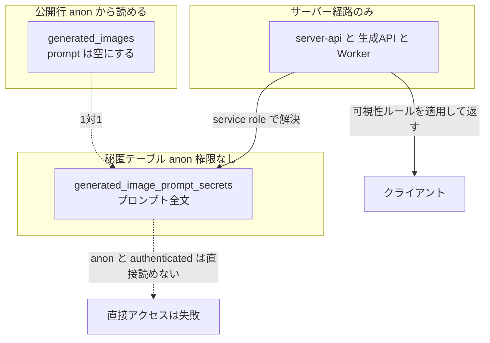
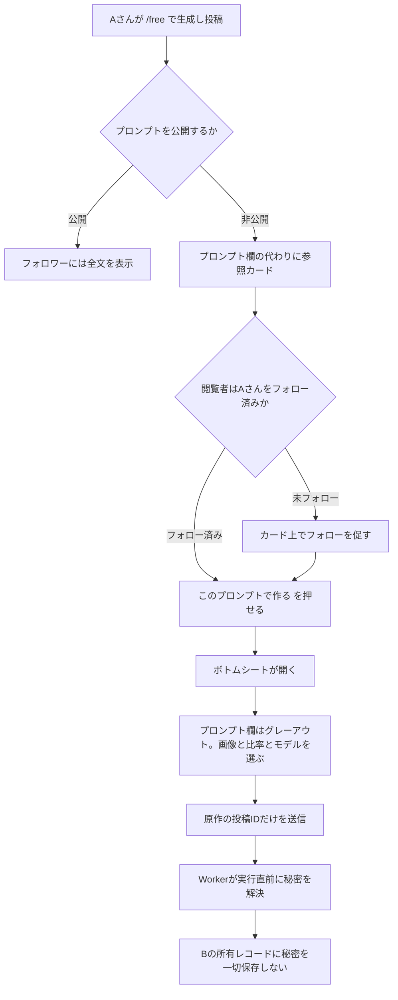
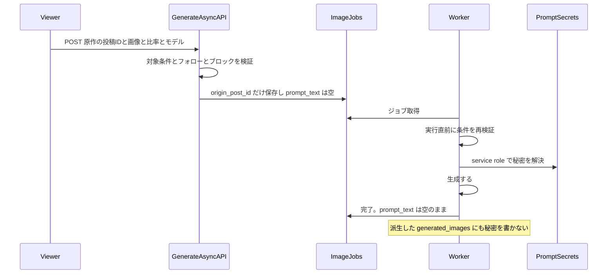
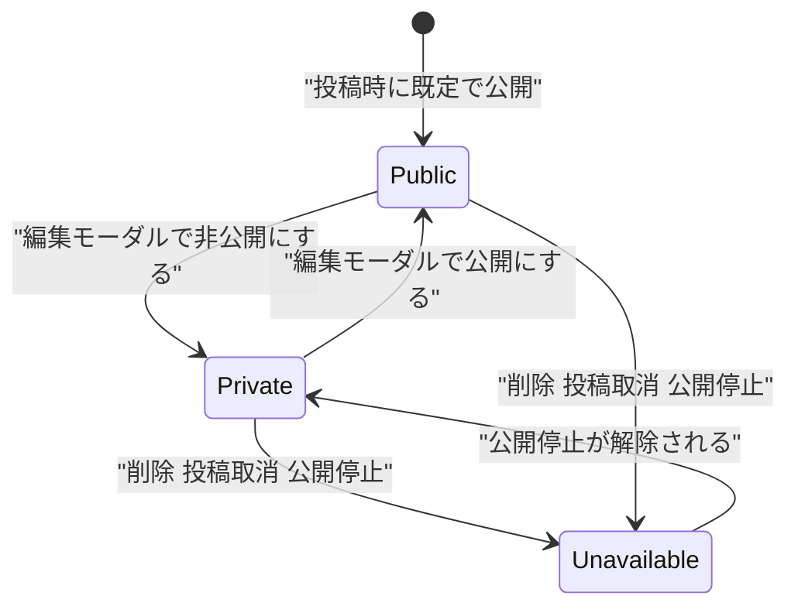
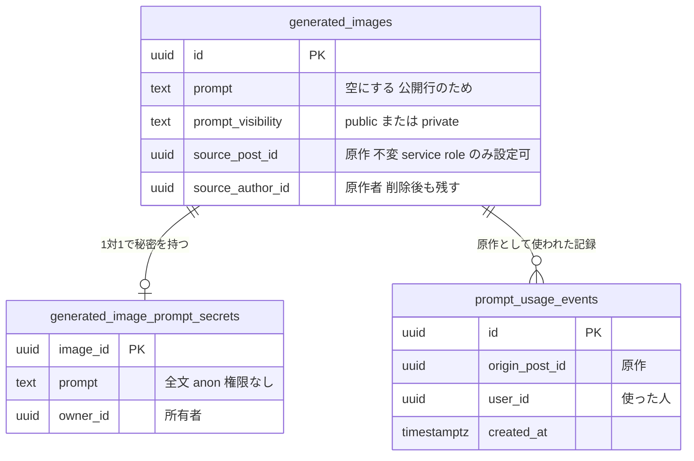
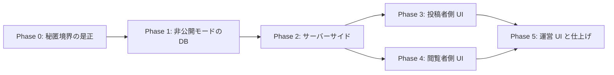

# じゆうモード プロンプト非公開モード 実装計画

作成日: 2026-07-29
最終更新: 2026-07-29（レビュー指摘を受けて全面改訂。**ADR-001 と ADR-007 を撤回**）
対象: `/free` 投稿のプロンプト非公開化、および**プロンプト保管の秘匿境界そのものの是正**

## 背景

`/free` の投稿は詳細画面でプロンプトが表示され、フォロワーはコピーして再利用できる。「プロンプトは自分の資産なので見せたくないが、使ってもらえるのは嬉しい」というニーズに対し、秘匿したまま「試せる」導線を用意する。

### 初版計画の重大な誤りと、判明した既存脆弱性

初版は「アプリ層の redaction（`prompt-visibility.ts`）が主要4経路に適用済みだから、列を1つ足せば足りる」としていた。**これは誤りだった。** RLS を見ずにアプリ層だけを見た結論である。

本番実測で確認した事実:

```sql
-- generated_images の SELECT ポリシー（実測）
USING ((is_posted = true AND moderation_status = 'visible') OR (user_id = auth.uid()))
-- roles: {public}

-- テーブル権限（実測）
anon:          SELECT を含む
authenticated: SELECT を含む
```

**RLS は行単位であり、列を絞らない。** したがって公開 anon キーで以下が通る。

```
GET {SUPABASE_URL}/rest/v1/generated_images
    ?is_posted=eq.true&moderation_status=eq.visible&select=prompt,generation_type
```

`redactSensitivePrompts` はサーバーコンポーネントの出力から消しているだけで、**この経路には一切関与しない**。

**本番で読み取れる件数（実測）:**

| generation_type | 読める行数 | ユニークなプロンプト数 |
| --- | --- | --- |
| **one_tap_style** | **689** | **263** |
| coordinate | 229 | 208 |

つまり **運営が作成した One-Tap Style プリセットのプロンプト 263 種が、現在この瞬間も公開 anon キーで取得できる**。「画像のみ公開・プロンプト非公開で moat を作る」という設計意図と正面から反する既存の脆弱性であり、新機能とは独立して存在する。

#### さらに、同じ構造の漏洩が `image_jobs` にもある

レビュー指摘の P0-2（派生者が自分のジョブから秘密を読める）と**まったく同じ構造が、One-Tap Style の既存機能にも存在する**ことを確認した。

```
app/(app)/style/generate-async/handler.ts:578-579
  user_id:     user.id      ← 生成した本人が所有者
  prompt_text: prompt       ← 組み立て済みのプリセット全文
```

`image_jobs` の SELECT RLS は `auth.uid() = user_id` である。したがって **One-Tap Style で生成したユーザーは、自分のジョブ行から運営プリセットのプロンプト全文を読める**。

本番実測: `generation_type = 'one_tap_style'` のジョブ **2,123件すべてに `prompt_text` が入っている**。

対象の投稿が公開されていなくても、**自分が一度生成しさえすればそのプリセットのプロンプトが手に入る**。`generated_images` 側を塞いでも、この経路が残れば moat は開いたままになる。Phase 0 の対象に含める。

**この RLS を是正しない限り、プロンプト非公開モードは成立しない。** 同じ経路から新機能の秘密も抜かれるためである。よって本計画は「新機能の追加」ではなく **「プロンプト保管の秘匿境界を作り直し、その上に新機能を載せる」** ものとして再設計する。

### ヒアリングで確定した仕様

| # | 決定 |
| --- | --- |
| ① | 派生投稿のクレジットは**原作者を表示**。連鎖しても常に原作を指す |
| ② | 元投稿が利用不可のときは生成不可。「現在、ご利用できません」と角の立たない表示 |
| ③ | フォロー判定は**原作者**に対して。カードから直接フォローできる |
| ④ | 派生投稿はプロンプトを表示しない |
| ⑤ | ペルコインは通常の `/free` 生成と同額。原作者への還元はなし |
| ⑥ | 既定は**公開**。投稿者が明示的に非公開を選ぶ。投稿後も切り替え可能 |
| ⑦ | 運営はプロンプト全文を閲覧可。非公開提供を示すバッジを admin に出す |
| ⑧ | 原作者の投稿に**利用数**を表示する（原作者自身の生成は除外） |

---

## コードベース調査結果

### プロンプトが漏れている経路（実測）

| 経路 | 状況 |
| --- | --- |
| PostgREST 直接 SELECT | **anon で `select=prompt` が通る**（上記） |
| `features/generation/lib/database.ts:123,155,342,362` | ブラウザクライアントから `select("*")` |
| `features/event/lib/database.ts:24` | 同上 |
| `image_jobs.prompt_text` | `app/api/generate-async/handler.ts:487` で保存。RLS は `auth.uid() = user_id` なので**所有者は全列を読める** |
| `image_jobs.prompt_text`（One-Tap Style） | `app/(app)/style/generate-async/handler.ts:578-579` で**生成者本人を所有者として運営プリセット全文を保存**。本番 2,123 件すべてに存在 |
| Worker | `supabase/functions/image-gen-worker/index.ts:2743` で `generated_images.prompt` へコピー |
| `features/generation/lib/prompt-builder.ts:39-45` | **最終プロンプト全文を `console.log` している** |

### アプリ層 redaction（境界ではないが防御層として維持する）

`features/generation/lib/prompt-visibility.ts` が `one_tap_style` のみ伏せる実装。適用箇所は `server-api.ts:477,973` / `my-page/lib/server-api.ts:229` / `my-page/lib/api.ts:67`。

### 詳細画面のプロンプト表示

`PostDetailStatic.tsx:440-471` と `PostDetail.tsx`。`oneTapStylePreset ? カード : hasVisiblePrompt ? プロンプト欄 : null` の分岐がある。フォロー判定は `canViewPrompt = isOwner || isFollowingAuthor`（`:97`）。

### One-Tap Style の参照カード（流用元）

`features/style/components/OneTapStyleDetailCard.tsx`。「サムネイル → 確認ダイアログ → 生成画面へ」の構造。

### `/free` の生成フロー

`GenerationForm.tsx:335-350`。入力は画像・プロンプト・モデル・比率の4つのみ。生成 API は `app/api/generate-async/handler.ts`。

### 検索（初版の調査は誤りだった）

**`SearchBar` は `StickyHeader.tsx:289-305` で PC・モバイル双方に常時描画されている。** 初版で「アプリ内に導線が無い」としたのは、`/search` の文字列で grep したため `router.push` でパスを組み立てる `SearchBar.tsx` を取りこぼした結果である。**検索は現に使える機能である。**

- 検索クエリ: `server-api.ts:614,651` の `ilike("prompt", ...)`
- API: `app/api/posts/route.ts:35-38` の `q`
- キャッシュタグ: `search-posts`（`app/api/posts/post/route.ts:122` ほか）

### 削除・所有

- `features/generation/lib/database.ts:170` `deleteGeneratedImage` — **ブラウザから物理削除できる**
- `generated_images` の RLS: INSERT / UPDATE / DELETE いずれも所有者に開放（実測）

### i18n

`messages/` に15ロケール。`messages/ja.ts` が master で `satisfies DeepReplaceStrings<typeof jaMessages>`。**キー追加は15ファイル全てに必要**。

---

## 1. 概要図

### 秘匿境界の再設計（本計画の中核）



### 全体フロー



### 生成のシーケンス（秘密が派生者の所有物にならないこと）



### 状態遷移



### データモデル



---

## 2. EARS 要件定義

### 秘匿境界

- **REQ-001**: The system shall store prompt text only in `generated_image_prompt_secrets`, and `generated_images.prompt` shall not contain prompt text for any row.
  システムはプロンプト本文を `generated_image_prompt_secrets` にのみ保存し、`generated_images.prompt` にはいかなる行でもプロンプト本文を保持してはならない。

- **REQ-002**: The system shall deny `SELECT` on `generated_image_prompt_secrets` to the `anon` role, and shall permit it to `authenticated` only for rows the requester owns.
  システムは `generated_image_prompt_secrets` の `SELECT` を `anon` に拒否し、`authenticated` には自分が所有する行に限って許可しなければならない。

- **REQ-003**: The system shall return prompt text only to the **owner of the origin prompt** and to admin paths. A deriving user shall not receive it, even for a post that the deriving user owns.
  システムはプロンプト本文を、**原作プロンプトの所有者**と admin 経路にのみ返さなければならない。派生した利用者は、自分が所有する投稿に対してであっても本文を受け取ってはならない。

- **REQ-004**: While a prompt is public, the system shall disclose it only to the author and the author's followers, preserving the existing follow gate.
  プロンプトが公開である間、システムは既存のフォローゲートを維持し、投稿者とそのフォロワーにのみ開示しなければならない。

### 既存機能の秘匿（One-Tap Style）

- **REQ-019**: The system shall not persist One-Tap Style preset prompts into `image_jobs` rows owned by the generating user; the worker shall resolve the preset prompt with the service role at execution time.
  システムは One-Tap Style のプリセットプロンプトを、生成したユーザーが所有する `image_jobs` 行に保存してはならない。Worker が実行時に service role で解決しなければならない。

### 派生生成

- **REQ-005**: When a viewer starts a derived generation, the system shall accept only the origin post id, source image, aspect ratio and model, and shall not accept prompt text.
  閲覧者が派生生成を開始したとき、システムは原作の投稿ID・元画像・比率・モデルのみを受け取り、プロンプト本文を受け取ってはならない。

- **REQ-006**: The system shall not persist the origin prompt into any record owned by the deriving user, including `image_jobs.prompt_text` and the derived `generated_images.prompt`.
  システムは、`image_jobs.prompt_text` と派生した `generated_images.prompt` を含め、派生した利用者が所有するいかなるレコードにも原作のプロンプトを保存してはならない。

- **REQ-007**: When the worker executes a derived job, it shall resolve the secret with the service role immediately before generation, and shall re-verify availability, visibility, follow and block conditions at that time.
  Worker が派生ジョブを実行するとき、生成の直前に service role で秘密を解決し、その時点で利用可否・可視性・フォロー・ブロックの条件を再検証しなければならない。

- **REQ-008**: If the source is not a `free` root post with `prompt_visibility = 'private'` and an existing secret, or the origin author is unavailable, or a block relation exists in either direction, then the system shall reject the generation.
  参照先が `free` の根投稿でなく、`prompt_visibility = 'private'` でなく、秘密が存在せず、原作者が利用不可、または双方向いずれかにブロック関係がある場合、システムは生成を拒否しなければならない。

### 出所と改ざん防止

- **REQ-009**: The system shall set `source_post_id` and `source_author_id` only from a trusted server path, and shall reject any client-initiated insert or update of these columns.
  システムは `source_post_id` と `source_author_id` を信頼されたサーバー経路からのみ設定し、クライアント起点のこれらの列の挿入・更新を拒否しなければならない。

- **REQ-010**: The system shall keep `source_post_id` immutable after creation.
  システムは作成後の `source_post_id` を不変にしなければならない。

- **REQ-011**: While the origin post has been deleted, the system shall retain the lineage and render the credit in a disabled state, rather than losing the attribution.
  原作の投稿が削除されている間、システムは出所を保持し、クレジットを無効状態で表示しなければならない。出所を失ってはならない。

- **REQ-012**: When a derived generation completes successfully, the system shall record an immutable usage event, and the usage count shall be computed from those events.
  派生生成が成功したとき、システムは改ざんできない利用イベントを記録し、利用数はそのイベントから算出しなければならない。

### 表示

- **REQ-013**: While a post has a private prompt or a source reference, the system shall render the origin reference card in place of the prompt section.
  投稿のプロンプトが非公開、または出所参照を持つ間、システムはプロンプト欄の代わりに原作の参照カードを表示しなければならない。

- **REQ-014**: If the origin is unavailable for any reason, then the system shall return an identical response shape, status and error code for all causes, and shall not include the origin thumbnail.
  原作がいずれかの理由で利用不可の場合、システムはすべての原因に対して同一のレスポンス形状・ステータス・エラーコードを返し、原作のサムネイルを含めてはならない。

- **REQ-015**: When the author switches a prompt from public to private, the UI shall state that already disclosed content cannot be retracted.
  投稿者がプロンプトを公開から非公開へ切り替えるとき、UI は既に開示された内容を回収できない旨を明示しなければならない。

### 検索

- **REQ-016**: The system shall search `caption` and author display name, and shall not use prompt text as a search key.
  システムは `caption` と作者表示名を検索対象とし、プロンプト本文を検索キーに使ってはならない。

### ログ

- **REQ-017**: The system shall not write prompt text to application logs, worker logs, APM, or provider error payloads.
  システムはプロンプト本文を、アプリログ・Worker ログ・APM・プロバイダのエラーペイロードに書き出してはならない。

### 運営

- **REQ-018**: While an admin views a post, the system shall display the full prompt with a badge indicating whether it is provided privately.
  管理者が投稿を閲覧している間、システムはプロンプト全文と、非公開提供かどうかを示すバッジを表示しなければならない。

---

## 3. ADR

### ADR-001（改訂）: プロンプトは公開行から分離し、秘匿テーブルへ移す

**初版の「別テーブル不要」は撤回する。**

- **Context**: 初版はアプリ層 redaction を境界とみなした。しかし `generated_images` の SELECT ポリシーは行単位で `anon` に開放されており、`select=prompt` で直接読める。実測で One-Tap Style プリセット 263 種が公開状態にあることを確認した。
- **Decision**: `generated_image_prompt_secrets(image_id PK, prompt, owner_id, created_at)` を新設し、**すべてのプロンプト本文をここへ移す**。`generated_images.prompt` は空にする。RLS は「所有者本人のみ SELECT 可」、`anon` には権限を与えない。書き込みは service role / SECURITY DEFINER RPC のみ。
- **Reason**:
  1. RLS は列を絞れない。行が見える以上、列は取れる
  2. 列単位 GRANT で `prompt` を剥奪する案も検討したが、**`select("*")` を使うブラウザ経路が5箇所あり**（`generation/lib/database.ts:123,155,342,362` と `event/lib/database.ts:24`）、権限が欠けると `select=*` 自体がエラーになる。移行コストは同等以上で、境界としては分離の方が明確
  3. 「公開プロンプト」も実際はフォロワー限定（`canViewPrompt = isOwner || isFollowingAuthor`）であり、**誰でも読める列に置いてよいプロンプトは1つも無い**。よって全件移す
  4. Creator Looks が別テーブルなのは実績のあるパターン。「本人が読めない」問題は、secrets 側に所有者向け RLS を付ければ両立する
- **Consequence**: 既存 919 行分の移行が必要。移行中は二重保持の期間を設ける。読み取りはすべてサーバー経路を通るようになり、ブラウザから直接プロンプトを取る経路は無くなる。

### ADR-002: 派生利用者が所有するレコードに秘密を一切書かない

- **Context**: 初版は「派生投稿の `prompt` 列に原作のプロンプトが入るが UI で隠す」としていた。しかし `image_jobs` の RLS は `auth.uid() = user_id` であり、**派生した利用者は自分のジョブの全列を読める**。Worker も `generated_images.prompt` へコピーする（`image-gen-worker/index.ts:2743`）。UI で隠しても2箇所から平文を取得できる。
- **Decision**: 派生ジョブでは `image_jobs.prompt_text` を空にし、`origin_post_id` のみを保存する。Worker が**実行直前に service role で秘密を解決**し、生成後も派生行の `prompt` を空のままにする。
- **Reason**: 秘密を「派生者の所有物」に一瞬でも置いた時点で、RLS 上はその人のものになる。表示制御では取り返せない。
- **Consequence**: Worker に「投稿 ID から秘密を解決する」経路が増える。ジョブ投入後に原作が非公開解除・削除・ブロックされる可能性があるため、解決時点で条件を再検証する（REQ-007）。

### ADR-003: `source_post_id` は常に原作を指し、削除後も出所を保持する

- **Context**: A→B→C と派生したとき、根を指すか直前を指すかで意味が変わる。また `ON DELETE SET NULL` にすると、原作の削除で派生の出所が消える。派生投稿は「通常の投稿」に見えるようになり、非公開強制も外れる。
- **Decision**: 常に根を指す。`source_post_id` は **FK 制約を張らない素の UUID** とし、あわせて `source_author_id` を保存する。原作が削除されても値は残り、解決に失敗したら「現在、ご利用できません」を表示する。
- **Reason**: 出所は削除後も残す必要がある（クレジット・非公開強制・利用数の根拠）。`ON DELETE SET NULL` はこれを破壊する。`RESTRICT` は原作者が自分の投稿を消せなくなるため不可。
- **Consequence**: 参照整合性が DB で保証されない。解決側で「行が無い」ケースを必ず扱う。中間の投稿がどれだけ広めたかは記録しない（必要になったら `derived_from_post_id` を後から足す）。

### ADR-004: 派生投稿は投稿者の選択より優先して非公開にする

- **Context**: 派生した利用者はボトムシートでプロンプトを編集できないため、生成に使われたのは原作のプロンプトそのものである。
- **Decision**: `source_post_id` を持つ投稿は、投稿者が「公開」を選んでも非公開として扱う。投稿モーダルでトグルを出さない。DB trigger でも強制する。
- **Reason**: プロンプトは原作者の資産であり、派生者に公開の権限はない。
- **Consequence**: 派生者は自分の投稿のプロンプトを見られない（ADR-002 により、そもそも所有物として保存されない）。

### ADR-005: 利用不可の理由は開示せず、レスポンス形状も統一する

- **Context**: 元投稿が削除・投稿取消・公開停止・非公開解除のいずれでも生成できない。
- **Decision**: すべて「現在、ご利用できません」に丸める。**文言だけでなく、HTTP ステータス・エラーコード・レスポンスの形も同一にする。** 公開停止された投稿のサムネイルは返さない。
- **Reason**: 「削除時だけサムネイルが欠ける」「公開停止時だけ画像が残る」「ステータスが違う」といった差からも理由は推測できる。**文言を揃えただけでは秘匿にならない。**
- **Consequence**: 原作者が自分で消しただけのケースも同じ表示になる。閲覧者から区別できないが実害はない。

### ADR-006: 生成 API はプロンプトを受け取らず、対象条件を厳格に検証する

- **Context**: プロンプトをクライアント経由で渡すと devtools で見える。また `sourcePostId` の検証が緩いと、**One-Tap Style や Inspire の投稿 ID を渡して秘匿プロンプトを回収できる**。
- **Decision**: `sourcePostId` のみを受け取り、以下をすべて満たすときだけ実行する。
  - 対象が存在し `is_posted = true` かつ `moderation_status = 'visible'`
  - `generation_type = 'free'`
  - 根投稿である（`source_post_id IS NULL`）。派生 ID が渡されたら根へ解決する
  - `prompt_visibility = 'private'`
  - secrets 行が存在する
  - 原作者のアカウントが利用可能
  - リクエスト元が原作者をフォローしている、または本人
  - **双方向いずれにもブロック関係がない**
- **Reason**: 条件が1つでも欠けると別種の秘匿プロンプトの回収経路になる。
- **Consequence**: 検証が長くなるため、専用の SECURITY DEFINER RPC に集約して API と Worker の双方から呼ぶ。

### ADR-007（改訂）: 検索は残し、対象を公開フィールドへ差し替える

**初版の「検索機能を廃止」は撤回する。**

- **Context**: 初版は「アプリ内に検索ボックスへの導線が無い」として廃止を提案した。**これは調査ミスだった。** `SearchBar` は `StickyHeader.tsx:289-305` で PC・モバイル双方に常時描画されている。`/search` の文字列で grep したため、`router.push` でパスを組み立てる `SearchBar.tsx` を取りこぼした。
- **Decision**: `/search` と検索バーは維持する。`ilike("prompt", ...)` を **`caption` と作者表示名の検索へ差し替える**。
- **Reason**:
  1. 現に使える機能であり、廃止は実質的なユーザー機能削除にあたる。秘匿の手段としては過剰
  2. そもそも**プロンプトを検索キーにしている現状自体が是正対象**である。ADR-001 でプロンプトを公開行から外す以上、検索キーにはできない
  3. `caption` は公開が前提のフィールドであり、検索対象として自然
- **Consequence**: 検索の当たり方が変わる。プロンプト本文でヒットしていたものはヒットしなくなる。`caption` 未設定の投稿は検索に出にくくなるため、リリース時に周知する。

### ADR-008: 利用数は改ざん不可のイベントから算出する

- **Context**: `generated_images` を数える案だったが、同テーブルは所有者が INSERT / UPDATE / DELETE でき、`source_post_id` も書き換えられる。任意の原作 ID を自分の行に設定すれば利用数を水増しできる。派生画像を削除すると利用数が減る問題もある。
- **Decision**: `prompt_usage_events(id, origin_post_id, user_id, created_at)` を新設し、**生成成功時に service role で記録**する。利用数はこのテーブルから `COUNT(DISTINCT user_id)` で算出し、原作者自身を除外する。クライアントからの書き込みは不可。
- **Reason**: 表示する数値は改ざんできてはならない。生成画像の削除で数が減るのも実態に合わない（使った事実は消えない）。
- **Consequence**: テーブルが1つ増える。イベントは削除しないため単調増加する。

---

## 4. 実装計画

### フェーズ間の依存関係



### Phase 0: 秘匿境界の是正（既存脆弱性の修復）

**目的**: プロンプトを公開行から分離し、anon から読めなくする
**ビルド確認**: 移行後も既存のプロンプト表示（フォロワー向け）が壊れないこと

**この Phase は単独で価値がある。** 新機能を作らなくても既存の漏洩を塞ぐため、先行マージ可能な形にする。

- [ ] `supabase/migrations/2026xxxx_add_generated_image_prompt_secrets.sql` を新規作成
  - `generated_image_prompt_secrets(image_id UUID PK REFERENCES generated_images(id) ON DELETE CASCADE, prompt TEXT NOT NULL, owner_id UUID NOT NULL REFERENCES auth.users(id) ON DELETE CASCADE, created_at TIMESTAMPTZ NOT NULL DEFAULT now())`
  - RLS 有効化。SELECT は `auth.uid() = owner_id` のみ。INSERT / UPDATE / DELETE のポリシーは作らない（service role 専用）
  - `REVOKE ALL ON TABLE ... FROM PUBLIC, anon`
  - `owner_id` にインデックス
  - 既存 `20260602100600_creator_looks_db_guard_triggers.sql` の書式を踏襲
- [ ] `supabase/migrations/2026xxxx_backfill_prompt_secrets.sql` を新規作成
  - 既存 `generated_images` から secrets へコピー（919行想定）
  - **この時点では `generated_images.prompt` を空にしない**（読み取り経路の移行が完了するまで二重保持）
- [ ] `features/generation/lib/prompt-secrets.ts` を新規作成
  - `getPromptForViewer(imageId, viewerId)` — 可視性ルール（本人 / フォロワー / admin / one_tap_style / private）を適用して返す。service role で secrets を読む
  - **アプリ層 redaction は防御層として残す**が、境界はここに移す
- [ ] 読み取り経路を `prompt-secrets.ts` 経由へ移行
  - `features/posts/lib/server-api.ts`（`enrichPosts` / `getPost`）
  - `features/my-page/lib/server-api.ts` / `features/my-page/lib/api.ts`
  - **ブラウザからの `select("*")` を明示列に変更**し `prompt` を除外
    `features/generation/lib/database.ts:123,155,342,362` / `features/event/lib/database.ts:24`
- [ ] `supabase/migrations/2026xxxx_clear_generated_images_prompt.sql` を新規作成
  - 読み取り移行の完了を確認した**後**に、`generated_images.prompt` を空文字へ更新
  - 以後の書き込み経路も secrets 側のみにする（Worker / API）
  - **列自体は残す**（`select("*")` の互換と段階的ロールバックのため）
- [ ] **One-Tap Style の `image_jobs.prompt_text` 経路を塞ぐ**（REQ-019）
  - `app/(app)/style/generate-async/handler.ts:578-579` で `prompt_text` にプリセット全文を保存しているのをやめ、`style_preset_id` 等の参照だけを保存する
  - Worker が実行時に service role でプリセットプロンプトを解決する
  - **既存 2,123 件の `prompt_text` を空にするマイグレーションを含める**
  - `generated_images` 側だけ塞いでもこの経路が残れば moat は開いたままになる
- [ ] `features/generation/lib/prompt-builder.ts:39-45` のログ出力を削除（REQ-017）
  - Worker・route・provider エラーにもプロンプトを載せない規約をコメントで明記

### Phase 1: 非公開モードのデータベース

**目的**: 可視性フラグ・出所・利用イベント
**ビルド確認**: 適用してもアプリ挙動は変わらない（既定 `public`）

- [ ] `supabase/migrations/2026xxxx_add_free_prompt_visibility.sql`
  - `generated_images` に追加
    - `prompt_visibility TEXT NOT NULL DEFAULT 'public' CHECK (prompt_visibility IN ('public','private'))`
    - `source_post_id UUID`（**FK なし**。ADR-003）
    - `source_author_id UUID`
  - `source_post_id` に部分インデックス（`WHERE source_post_id IS NOT NULL`）
  - **guard trigger**（DB 層で強制）
    - `source_post_id` が自分自身を指さない
    - `source_post_id` が NOT NULL のとき `prompt_visibility` を `'private'` に強制
    - **`source_post_id` / `source_author_id` は service role からの書き込みのときのみ設定・変更可**。それ以外の INSERT / UPDATE では拒否（REQ-009）
    - 作成後の `source_post_id` 変更を拒否（REQ-010）
- [ ] `supabase/migrations/2026xxxx_add_prompt_usage_events.sql`
  - `prompt_usage_events(id UUID PK, origin_post_id UUID NOT NULL, user_id UUID NOT NULL, created_at TIMESTAMPTZ NOT NULL DEFAULT now())`
  - RLS 有効化・公開ポリシーなし・`REVOKE ALL FROM PUBLIC, anon, authenticated`
  - `(origin_post_id)` にインデックス
- [ ] `supabase/migrations/2026xxxx_add_derived_generation_rpcs.sql`
  - `resolve_derived_prompt_source(p_source_post_id, p_requester_id)` — ADR-006 の全条件を検証し、根の投稿 ID・原作者 ID・プロンプトを返す。**service role 専用**
  - `record_prompt_usage(p_origin_post_id, p_user_id)` — 利用イベントを記録。service role 専用
  - `get_prompt_usage_count(p_origin_post_id)` — `COUNT(DISTINCT user_id)`。原作者自身を除外。`authenticated` に GRANT
- [ ] `supabase db diff` で差分を確認し、ユーザーに提示してから適用

### Phase 2: サーバーサイド

**目的**: 派生生成の経路と検索の是正
**ビルド確認**: `npm run lint` / `npm run typecheck` / `npm run build -- --webpack`

- [ ] `features/generation/lib/prompt-visibility.ts` を拡張
  - `getPostPromptDisplayMode(record)` を追加し `"source_reference" | "one_tap_style" | "prompt" | "none"` を返す
  - `prompt_visibility === 'private'` と `source_post_id != null` を非公開条件に加える
- [ ] `features/posts/types.ts` / `features/generation/lib/database.ts` に新列を追加
- [ ] `features/posts/lib/server-api.ts` に `source_reference` の解決を追加
  - 原作の利用可否判定をここに集約。**利用不可なら同一形状で `is_available: false` を返し、サムネイルも含めない**（ADR-005 / REQ-014）
  - 利用数は `get_prompt_usage_count` から取得
- [ ] **検索対象の差し替え**（ADR-007 / REQ-016）。独立コミットにする
  - `server-api.ts:614,651` の `ilike("prompt", ...)` を `caption` と作者表示名の検索へ変更
  - `SearchBar.tsx` / `StickyHeader.tsx` のプレースホルダ文言を調整
  - `search-posts` キャッシュタグの無効化箇所は現状維持
  - `docs/TEST_PLAN.md` と画面フロー資料の検索記述を更新
- [ ] `app/api/generate-async/handler.ts` を修正
  - `sourcePostId` を受け取る分岐。`prompt` との同時指定は 400
  - `resolve_derived_prompt_source` で検証。失敗は理由を出さず 409 + `FREE_SOURCE_UNAVAILABLE`
  - `image_jobs` には `origin_post_id` のみ保存し `prompt_text` は空（ADR-002 / REQ-006）
- [ ] `supabase/functions/image-gen-worker/index.ts` を修正
  - `origin_post_id` があるジョブは、実行直前に `resolve_derived_prompt_source` を再実行して秘密を解決（REQ-007）
  - 生成後、派生行の `prompt` を空のままにする（`:2743` のコピーを条件分岐）
  - 成功時に `record_prompt_usage` を呼ぶ（REQ-012）
- [ ] `app/api/posts/post/route.ts` / `update/route.ts` に `promptVisibility` を追加

### Phase 3: 投稿者側 UI

- [ ] `PostModal.tsx` に「プロンプトを公開する」トグル（既定 ON）。派生投稿では出さない
- [ ] 「非公開 かつ 生成前の画像も非表示」のときの注意文
- [ ] `EditPostModal.tsx` に同トグル。**公開→非公開の切替時に「すでに閲覧・コピーされた内容は回収できません」と明示**（REQ-015）
- [ ] 15ロケールに文言追加

### Phase 4: 閲覧者側 UI

- [ ] `features/posts/components/SourcePromptReferenceCard.tsx` を新規作成
  - `OneTapStyleDetailCard.tsx` の構造を踏襲。原作者名・アバター・サムネイル
  - 未フォローならカード内にフォローボタン
  - 利用数を表示
  - `is_available === false` は無効化して「現在、ご利用できません」
- [ ] `features/generation/components/PromptLockedGenerationSheet.tsx` を新規作成
  - プロンプト欄は disabled + グレーアウトで「プロンプトは非公開です」
  - 入力は画像・比率・モデルの3つ
- [ ] `PostDetailStatic.tsx` / `PostDetail.tsx` を `getPostPromptDisplayMode` の4分岐へ
- [ ] 15ロケールに文言追加

### Phase 5: 運営 UI と仕上げ

- [ ] 投稿詳細の admin 閲覧時にプロンプト全文と「プロンプト非公開」バッジ（REQ-018）
- [ ] `ModerationQueueClient.tsx` に同バッジ。審査キュー API に `prompt_visibility` を追加
- [ ] `.cursor/rules/database-design.mdc` / `docs/API.md` / `docs/architecture/data.ja.md` / `data.en.md` を同期
- [ ] `/test-flow` に沿ってテストを実施

---

## 5. 修正対象ファイル一覧

| ファイル | 操作 | 変更内容 |
| --- | --- | --- |
| `supabase/migrations/2026xxxx_add_generated_image_prompt_secrets.sql` | 新規 | 秘匿テーブル + RLS |
| `supabase/migrations/2026xxxx_backfill_prompt_secrets.sql` | 新規 | 既存919行の移行 |
| `supabase/migrations/2026xxxx_clear_generated_images_prompt.sql` | 新規 | 公開列の空化 |
| `supabase/migrations/2026xxxx_add_free_prompt_visibility.sql` | 新規 | 列3つ + guard trigger |
| `supabase/migrations/2026xxxx_add_prompt_usage_events.sql` | 新規 | 利用イベント |
| `supabase/migrations/2026xxxx_add_derived_generation_rpcs.sql` | 新規 | 検証・記録・集計 RPC |
| `features/generation/lib/prompt-secrets.ts` | 新規 | 秘密の解決 |
| `features/generation/lib/prompt-visibility.ts` | 修正 | 表示モード判定 |
| `features/generation/lib/prompt-builder.ts` | 修正 | **ログ出力の削除** |
| `features/generation/lib/database.ts` | 修正 | `select("*")` を明示列へ（4箇所） |
| `features/event/lib/database.ts` | 修正 | 同上 |
| `features/posts/lib/server-api.ts` | 修正 | 出所解決・検索対象の差し替え |
| `features/my-page/lib/server-api.ts` / `api.ts` | 修正 | 読み取り経路の移行 |
| `app/api/generate-async/handler.ts` | 修正 | `sourcePostId` 経路 |
| `app/(app)/style/generate-async/handler.ts` | 修正 | プリセット全文の保存をやめ参照のみにする |
| `supabase/migrations/2026xxxx_clear_image_jobs_prompt_text.sql` | 新規 | 既存 2,123 件の `prompt_text` を空化 |
| `supabase/functions/image-gen-worker/index.ts` | 修正 | 実行直前の秘密解決・利用記録 |
| `app/api/posts/route.ts` | 修正 | 検索パラメータの意味変更 |
| `app/api/posts/post/route.ts` / `update/route.ts` | 修正 | `promptVisibility` |
| `features/posts/components/SearchBar.tsx` | 修正 | プレースホルダ文言 |
| `features/posts/components/StickyHeader.tsx` | 修正 | 同上（必要なら） |
| `features/posts/components/PostModal.tsx` / `EditPostModal.tsx` | 修正 | 公開トグル |
| `features/posts/components/SourcePromptReferenceCard.tsx` | 新規 | 参照カード |
| `features/generation/components/PromptLockedGenerationSheet.tsx` | 新規 | ボトムシート |
| `features/posts/components/PostDetailStatic.tsx` / `PostDetail.tsx` | 修正 | 4分岐化 |
| `app/(app)/admin/moderation/ModerationQueueClient.tsx` | 修正 | 非公開バッジ |
| `app/api/admin/moderation/posts/route.ts` | 修正 | `prompt_visibility` を返す |
| `messages/ja.ts` ほか14ファイル | 修正 | 文言追加（15ロケール） |
| `.cursor/rules/database-design.mdc` / `docs/API.md` / `docs/architecture/data.ja.md` / `data.en.md` / `docs/TEST_PLAN.md` | 修正 | 台帳同期 |

---

## 6. 品質・テスト観点

### 秘匿の検証（最重要。すべて実データ経路で確認する）

| # | テスト内容 |
| --- | --- |
| 1 | **anon キーで `generated_images?select=prompt` を叩いても秘密が返らない** |
| 2 | **anon キーで `generated_image_prompt_secrets` を叩くと拒否される** |
| 3 | 他人の認証トークンで secrets を叩いても自分の行しか返らない |
| 4 | **派生者の認証トークンで `image_jobs.prompt_text` を取得しても秘密が無い** |
| 4b | **One-Tap Style で生成したユーザーが、自分の `image_jobs.prompt_text` からプリセット全文を読めない** |
| 5 | **派生者の認証トークンで派生 `generated_images.prompt` を取得しても秘密が無い** |
| 6 | event gallery・生成一覧・無限スクロール・RSC ペイロードに prompt が無い |
| 7 | OGP・JSON-LD・alt テキスト・通知・エラーレスポンス・ログに秘密が無い |
| 8 | 検索が prompt を対象にしていない（プロンプト固有語でヒットしない） |
| 9 | public→private 切替後、全キャッシュ経路から即座に消える |

### 改ざん・権限

| # | テスト内容 |
| --- | --- |
| 10 | `source_post_id` / `source_author_id` の直接 INSERT / UPDATE が拒否される |
| 11 | 作成後の `source_post_id` 変更が拒否される |
| 12 | One-Tap Style / Inspire / coordinate の投稿 ID を `sourcePostId` に渡すと拒否される |
| 13 | 派生投稿の ID を渡すと根へ解決される |
| 14 | 未フォローの閲覧者が生成 API を直接叩くと拒否される |
| 15 | ブロック関係があると拒否される（双方向とも） |
| 16 | 他人の投稿の `promptVisibility` を更新できない |
| 17 | 利用数がクライアント操作で水増しできない |

### 利用不可の一貫性

| # | テスト内容 |
| --- | --- |
| 18 | 削除・投稿取消・公開停止・非公開解除の**すべてで同一のレスポンス形状・ステータス・エラーコード**になる |
| 19 | いずれの場合もサムネイルが含まれない |
| 20 | 原作削除後もクレジットと「現在、ご利用できません」が維持される |

### 正常系

| # | テスト内容 |
| --- | --- |
| 21 | フォロー済みの閲覧者がボトムシートから生成でき、`source_post_id` が根に解決される |
| 22 | A→B→C と派生しても C の `source_post_id` は A を指す |
| 23 | 利用数がユニークユーザー数で、原作者自身を除外している |
| 24 | 派生画像を削除しても利用数が減らない |
| 25 | Worker がジョブ投入後に条件が変わったケースを検出して中断する |

### 移行（Phase 0）

| # | テスト内容 |
| --- | --- |
| 26 | 既存919行が secrets へ漏れなく移行されている |
| 27 | 移行後もフォロワー向けのプロンプト表示が従来どおり動く |
| 28 | `one_tap_style` のプロンプトが admin 以外に返らない |

---

## 7. ロールバック方針

| 対象 | 方針 |
| --- | --- |
| Phase 0 の秘匿テーブル | 二重保持の期間を設けるため、`clear_generated_images_prompt` を当てるまでは読み取り経路を戻せる。**空化した後は戻せない**ので、その前に十分検証する |
| `generated_images.prompt` の空化 | 実行前に secrets への移行完全性を検証する（テスト26）。列自体は残すため、必要なら secrets から書き戻せる |
| ログ削除 | 単独で安全。revert する理由が無い |
| 検索対象の差し替え | 独立コミット。`caption` 検索で不評なら調整できるが、**prompt 検索へ戻してはならない**（ADR-001 と矛盾する） |
| Phase 1 の列追加 | 既定が `public` / NULL なので、適用しても挙動は変わらない |
| guard trigger | `DROP TRIGGER` で戻せるが、戻すと改ざん防止が失われる |
| 利用イベント | 追記のみ。表示側を先に外せば安全に止められる |
| Worker の変更 | 派生ジョブのみの分岐。既存生成には影響しない |
| UI | Phase 3 / 4 を独立コミットにする |

**適用順序**: Phase 0 は既存脆弱性の修復であり、**新機能を待たずに先行して出す価値がある**。Phase 1 のマイグレーションは適用してもアプリ挙動を変えない。

---

## 8. 使用スキル

| スキル | 用途 | フェーズ |
| --- | --- | --- |
| `/project-database-context` | DB 設計・RLS 方針の参照 | Phase 0, 1 |
| `/git-create-branch` | ブランチ作成 | 実装開始時 |
| `/test-flow` `/spec-extract` `/spec-write` | テスト設計 | Phase 5 |
| `/test-generate` `/test-reviewing` `/spec-verify` | テスト生成・レビュー | Phase 5 |
| `/codex-webpack-build` | 本番ビルド検証 | 各フェーズ末 |
| `/git-create-pr` | PR 作成（タイトル・本文は日本語必須） | 実装完了時 |

---

## 前提・未確定事項

- **公開→非公開の切替は「以後の表示を止める」機能であり、過去の秘密化ではない。** すでに閲覧・コピー・キャッシュ・検索エンジンに保存された内容は回収できない。UI と仕様に明記する（REQ-015）
- Phase 0 の `generated_images.prompt` 空化は不可逆に近い。実行前に移行完全性を必ず検証する
- この環境では Docker が使えずローカル Supabase を起動できない。SQL の実挙動は PR の Supabase Preview で検証する
- マイグレーションは main マージで自動適用されない。本番反映は `supabase db push` を手動実行する
- Worker（Edge Function）の変更は `supabase functions deploy image-gen-worker` が別途必要
- 他14ロケールの翻訳は暫定（英語流用）
- 新規 Markdown はグローバル `.gitignore` の `*.md` に該当するため `git add -f` が必要
