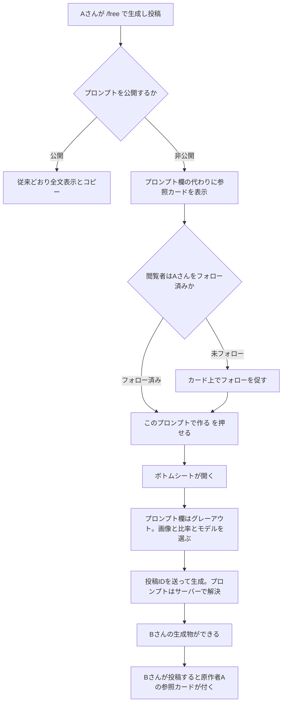
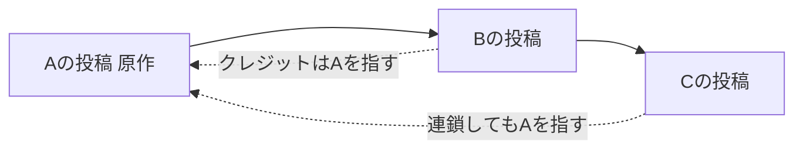
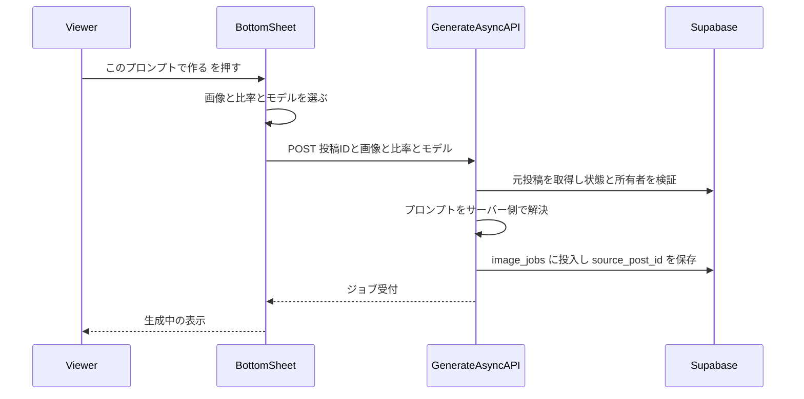
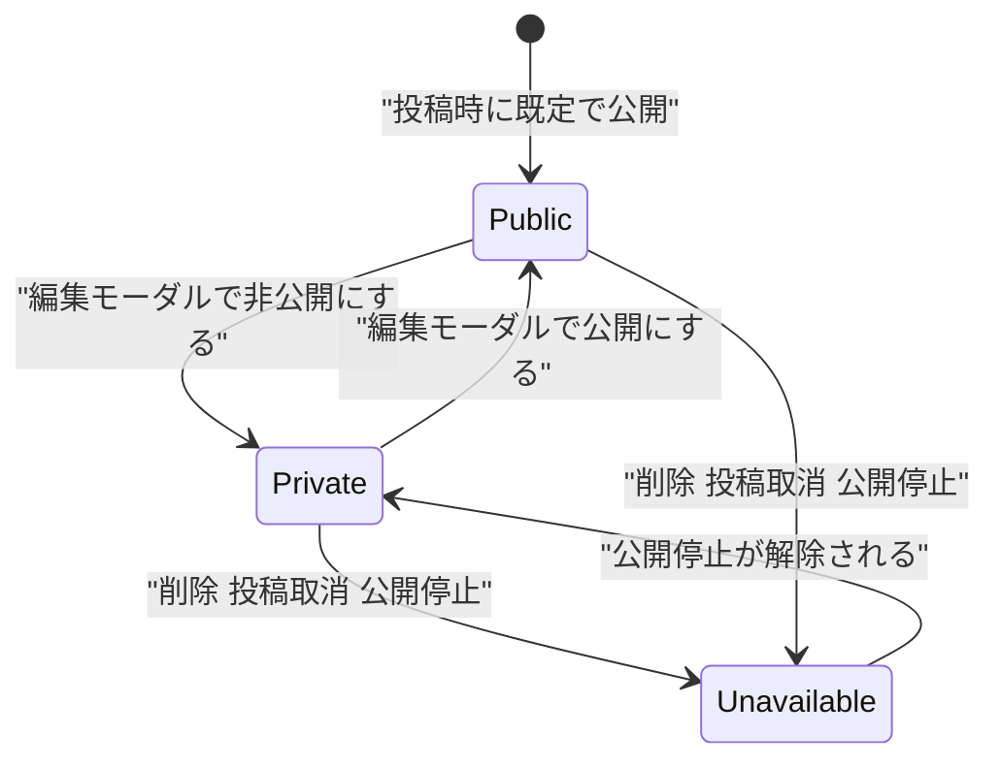
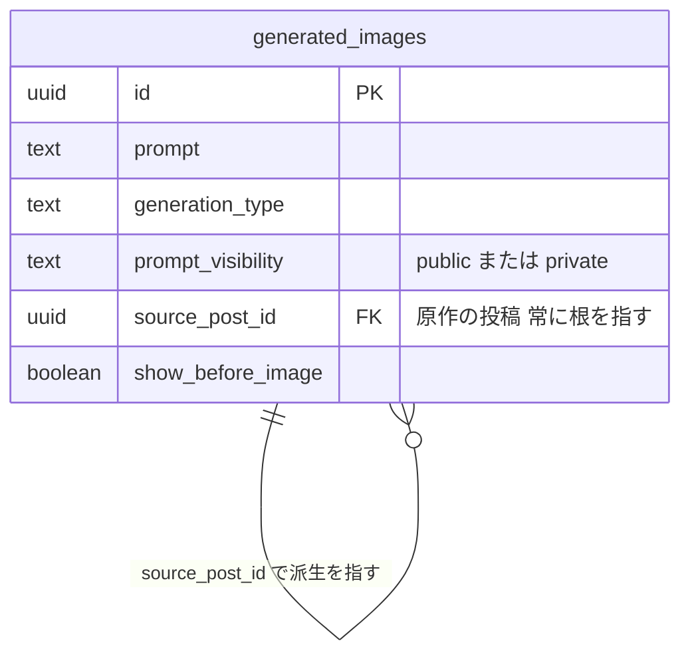
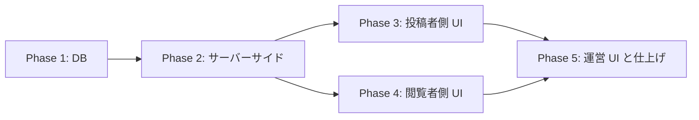

# じゆうモード プロンプト非公開モード 実装計画

作成日: 2026-07-29
対象: `/free`（じゆうモード）投稿のプロンプトを非公開にしつつ、他ユーザーが同じプロンプトで生成できるようにする

## 背景

`/free` の投稿は詳細画面でプロンプトが表示され、フォロワーはコピーして再利用できる。一方で「プロンプトは自分の資産なので見せたくないが、使ってもらえるのは嬉しい」というニーズがある。

単に「コピー禁止」にすると、投稿者は使ってもらう喜びを失い、閲覧者は何もできない。**プロンプトを秘匿したまま「試せる」導線を用意する**ことで、両者の利益が両立する。

### ヒアリングで確定した仕様

| # | 決定 |
| --- | --- |
| ① | 派生投稿のクレジットは**原作者を表示**。連鎖しても常に原作を指す |
| ② | 元投稿が削除／投稿取消／非公開／公開停止のときは**生成不可**。「現在、ご利用できません」と角の立たない表示 |
| ③ | フォロー判定は**原作者**に対して。カードから直接フォローできる |
| ④ | 派生投稿はプロンプトを表示しない。`one_tap_style` の既存分岐を流用 |
| ⑤ | ペルコインは通常の `/free` 生成と同額。原作者への還元はなし |
| ⑥ | 既定は**公開**。投稿者が明示的に非公開を選ぶ |
| ⑦ | 運営はプロンプト全文を閲覧可。非公開提供であることが分かるバッジを admin に出す |
| ⑧ | 原作者の投稿に**利用数**（「42人が使いました」）を表示する |
| ⑨ | 投稿後も編集モーダルで**公開／非公開を切り替えられる** |

---

## コードベース調査結果

### プロンプトの可視性（既存の仕組み）

`features/generation/lib/prompt-visibility.ts` が読み取り時に伏せる方式を実装済み。

```ts
shouldHidePromptForGenerationType(type) // one_tap_style のときだけ true
getVisiblePrompt(record)                // 隠すなら "" を返す
redactSensitivePrompt / redactSensitivePrompts
```

**主要な4経路すべてで適用済みであることを確認した。**

| 経路 | 適用箇所 |
| --- | --- |
| ホームフィード | `features/posts/lib/server-api.ts:477`（`enrichPosts` 内） |
| 投稿詳細 | `features/posts/lib/server-api.ts:973`（`getPost`） |
| プロフィール投稿 | `features/my-page/lib/server-api.ts:229`（`getUserPostsServer`） |
| マイページ生成一覧 | `features/my-page/lib/api.ts:67` |

このため **別テーブルへの退避は不要**。列の追加と redaction の拡張で足りる（ADR-001）。

### 詳細画面のプロンプト表示

`features/posts/components/PostDetailStatic.tsx:440-471` および同構造の `PostDetail.tsx`。

```jsx
{oneTapStylePreset ? (
  <OneTapStyleDetailCard preset={oneTapStylePreset} />   // ← プロンプト欄の代わりにカード
) : hasVisiblePrompt ? (
  <div>…プロンプト全文 + コピーボタン…</div>
) : null}
```

**「プロンプト欄の代わりにカードを出す」分岐が既にある。** ここに第3分岐を足すのが最小変更（ADR-002）。

- フォロー判定: `PostDetailStatic.tsx:97` の `canViewPrompt = isOwner || isFollowingAuthor`
- 未フォロー時は `maskedPrompt`（`*` の羅列）を表示している

### One-Tap Style の参照カード（流用元）

`features/style/components/OneTapStyleDetailCard.tsx`

```
 ラベル → StylePresetPreviewCard（サムネイル・クリック可）
   → AlertDialog で確認
   → router.push(`/style?style=<id>`)
```

**「サムネイル → 確認 → 生成画面へ」という構造がそのまま使える。**

### `/free` の生成フロー

`features/generation/components/GenerationForm.tsx:335-350`

```ts
onSubmit({
  prompt: trimmedPrompt,
  ...commonSourceImage,      // アップロード画像 / stock / generated のいずれか
  sourceImageType: "illustration",
  backgroundMode: "keep",
  count: 1,
  model: effectiveSelectedModel,
  generationType: "free",
  outputAspectRatioMode: aspectMode,
});
```

**じゆうモードの入力は「画像・プロンプト・モデル・比率」の4つだけ**（背景/ポーズ/枚数は固定送信）。ボトムシートはこの4つのうちプロンプトを固定し、残り3つを受け取ればよい。

生成 API は `app/api/generate-async/handler.ts`。`generationType === "free"` の分岐が `:479` にある。

### その他

- 編集モーダル: `features/posts/components/EditPostModal.tsx`。`show_before_image` のトグルが既にあり、同じ場所に追加できる
- フォロー: `app/api/users/[userId]/follow/route.ts`、状態取得は `follow-status`
- `generated_images` の関連列: `prompt` / `generation_type` / `show_before_image` / `style_template_id`（いずれも実在を確認済み）
- Supabase 接続: `npx supabase db query --linked` で参照系の実行を確認済み

### i18n

`messages/` に **15ロケール**。`messages/ja.ts` の `jaMessages` が master で、他は `satisfies DeepReplaceStrings<typeof jaMessages>`。**キー追加は15ファイル全てに必要**。

---

## 1. 概要図

### 全体フロー



### 参照の連鎖



### 生成のシーケンス



### 状態遷移



### データモデル



---

## 2. EARS 要件定義

### 可視性の設定

- **REQ-001**: When a user posts a `/free` generation, the system shall default `prompt_visibility` to `public`.
  ユーザーが `/free` の生成物を投稿したとき、システムは `prompt_visibility` を既定で `public` にしなければならない。

- **REQ-002**: When the author toggles prompt visibility in the post or edit modal, the system shall persist the new value and reflect it on the detail screen immediately.
  投稿者が投稿モーダルまたは編集モーダルで公開設定を切り替えたとき、システムは値を保存し、詳細画面へ即座に反映しなければならない。

- **REQ-003**: While `prompt_visibility` is `private`, the system shall never return the prompt text to any client other than the author's own and admin paths.
  `prompt_visibility` が `private` である間、システムは投稿者本人と admin 以外のいかなるクライアントにもプロンプト文字列を返してはならない。

### 参照カードと生成

- **REQ-004**: While a post has a private prompt, the system shall render a reference card with the origin author's name and thumbnail in place of the prompt section.
  投稿のプロンプトが非公開である間、システムはプロンプト欄の代わりに、原作者名とサムネイルを含む参照カードを表示しなければならない。

- **REQ-005**: While the viewer does not follow the origin author, the system shall present a follow action on the card and shall not allow generation.
  閲覧者が原作者をフォローしていない間、システムはカード上にフォロー導線を出し、生成を許可してはならない。

- **REQ-006**: When the viewer starts a generation from the bottom sheet, the system shall accept only the post id, source image, aspect ratio and model, and shall resolve the prompt server-side.
  閲覧者がボトムシートから生成を開始したとき、システムは投稿ID・元画像・比率・モデルのみを受け取り、プロンプトはサーバー側で解決しなければならない。

- **REQ-007**: If the referenced post is deleted, unposted, suspended, or its prompt is no longer private-shareable, then the system shall reject the generation and display "現在、ご利用できません" without exposing the reason.
  参照先の投稿が削除・投稿取消・公開停止などで利用できない場合、システムは生成を拒否し、理由を露出せずに「現在、ご利用できません」と表示しなければならない。

- **REQ-008**: When a generation derives from another post, the system shall store `source_post_id` pointing to the **origin** post, resolving the chain to its root.
  ある生成が他の投稿から派生したとき、システムは連鎖を根まで解決した**原作**の投稿を `source_post_id` に保存しなければならない。

### 派生投稿

- **REQ-009**: While a post has a `source_post_id`, the system shall treat its prompt as private regardless of the poster's own選択, and shall display the origin's reference card instead of the prompt.
  投稿が `source_post_id` を持つ間、システムは投稿者自身の選択に関わらずプロンプトを非公開として扱い、プロンプト欄の代わりに原作の参照カードを表示しなければならない。

- **REQ-010**: While the origin post is unavailable, the system shall render the derived post's card in a disabled state with "現在、ご利用できません".
  原作の投稿が利用できない間、システムは派生投稿のカードを無効状態にし「現在、ご利用できません」と表示しなければならない。

### 利用数

- **REQ-011**: While a post has been used as an origin, the system shall display the number of distinct users who generated from it.
  投稿が原作として使われている間、システムはそこから生成したユニークユーザー数を表示しなければならない。

- **REQ-012**: The usage count shall exclude the origin author's own generations.
  利用数には原作者自身の生成を含めてはならない。

### 検索

- **REQ-015**: While a post's prompt is private, the system shall exclude it from prompt-based full-text search for anyone other than the author.
  投稿のプロンプトが非公開である間、システムは投稿者本人以外に対して、その投稿をプロンプト全文検索の対象から除外しなければならない。

### 運営

- **REQ-013**: While an admin views a post with a private prompt, the system shall display the full prompt together with a badge indicating that it is provided privately.
  管理者が非公開プロンプトの投稿を閲覧している間、システムはプロンプト全文と、非公開提供であることを示すバッジを表示しなければならない。

- **REQ-014**: The moderation queue shall show the same badge so that reviewers can tell at a glance.
  審査キューにも同じバッジを表示し、審査者が一目で判別できるようにしなければならない。

---

## 3. ADR

### ADR-001: 別テーブルではなく列追加＋読み取り時 redaction にする

- **Context**: Creator Looks は `user_style_template_secrets.hidden_prompt` として別テーブルに隔離している。同じ方式も考えられた。
- **Decision**: `generated_images` に `prompt_visibility` 列を足し、既存の `prompt-visibility.ts` を拡張する。別テーブルは作らない。
- **Reason**:
  1. Creator Looks のプロンプトは**抽出器が生成した、投稿者本人も見ない値**。一方 `/free` のプロンプトは**本人が書いた本人の資産**であり、本人は常に読める必要がある。別テーブルにすると「本人だけ別経路で読む」機構が余分に要る
  2. 読み取り時 redaction の仕組みが**既に存在し、主要4経路すべてに適用済み**であることを確認した。同じレールに乗せるのが最小リスク
  3. 容量は論点にならない。`/free` 投稿21件のプロンプト合計は 48 kB、`generated_images` 全体は 18 MB。Supabase はテーブル数で課金しない
- **Consequence**: 新しい読み取り経路を足すときに redaction を忘れると漏れる。`prompt-visibility.ts` を必ず経由する規約をコメントとテストで固定する。

### ADR-002: 詳細画面は既存の三項分岐に第3の枝を足す

- **Context**: `PostDetailStatic.tsx` / `PostDetail.tsx` に「`one_tap_style` ならカード、そうでなければプロンプト欄」という分岐が既にある。
- **Decision**: `sourceReference ? 参照カード : oneTapStylePreset ? 既存カード : hasVisiblePrompt ? プロンプト欄 : null` の順に評価する。
- **Reason**: 「プロンプト欄の代わりにカードを出す」という構造が実証済みで、レイアウトもそのまま流用できる。新しい表示領域を作るより変更が小さく、既存の見た目とも揃う。
- **Consequence**: 分岐が4段になり読みにくくなる。判定を `getPostPromptDisplayMode(post)` のような関数に切り出し、JSX 側は分岐名で読めるようにする。

### ADR-003: `source_post_id` は常に原作（根）を指す

- **Context**: A→B→C と派生したとき、C が B を指すか A を指すかで意味が変わる。
- **Decision**: 常に根（A）を指す。B から派生するときは `B.source_post_id ?? B.id` を保存する。
- **Reason**: 「沢山使ってもらえると原作者の欲求が満たされる」という本機能の目的に照らすと、伝播するほど原作者から功績が離れる設計は本末転倒。根を指せば利用数の集計も 1 クエリで済む。
- **Consequence**: 中間の B がどれだけ広めたかは記録されない。将来必要になったら `derived_from_post_id` を別途足す（今回は入れない）。

### ADR-004: 派生投稿のプロンプトは投稿者の選択より優先して非公開にする

- **Context**: B はボトムシートでプロンプトを編集できないため、B の投稿の `prompt` 列には A のプロンプトがそのまま入る。
- **Decision**: `source_post_id` を持つ投稿は、投稿者が「公開」を選んでも非公開として扱う。投稿モーダルでもトグルを出さない。
- **Reason**: B の選択を尊重すると A との約束が破れる。プロンプトは A の資産であり、B に公開の権限はない。
- **Consequence**: B は自分の投稿のプロンプトを詳細画面で見られない（自分で書いたものではないため許容）。B が自分でプロンプトを書き直したい場合は `/free` で新規に生成する。

### ADR-005: 利用不可の理由は閲覧者に開示しない

- **Context**: 元投稿が削除／投稿取消／公開停止のいずれでも生成できない。
- **Decision**: すべて「現在、ご利用できません」に丸める。理由は出さない。
- **Reason**: 「公開停止されました」と出すと、第三者に対して原作者が措置を受けた事実を開示することになる。削除と公開停止を区別できると、その投稿が違反したことも推測できてしまう。角が立たず、かつ情報も漏らさない表現に統一する。
- **Consequence**: 原作者が自分で消しただけのケースでも同じ文言になる。閲覧者から見て区別できないが、実害はない。

### ADR-006: 生成 API はプロンプトを受け取らず投稿 ID を受け取る

- **Context**: ボトムシートからの生成でプロンプトをクライアント経由で渡すと、devtools で丸見えになり非公開の意味がない。
- **Decision**: `sourcePostId` を受け取り、サーバー側で元投稿を取得してプロンプトを解決する。取得時に所有者・状態・フォロー関係を検証する。
- **Reason**: 「非公開」を謳う以上、プロンプトが一度でもクライアントへ渡ってはならない。CSS で隠す・APIレスポンスから消すだけでは不十分。
- **Consequence**: 生成 API に「投稿 ID からプロンプトを解決する」分岐が増える。既存の `prompt` 受け取り経路と排他にし、両方指定されたらエラーにする。

### ADR-007: 非公開プロンプトは検索の対象から外す

- **Context**: `features/posts/lib/server-api.ts:614,651` でフィード検索が `ilike("prompt", ...)` を実行している。プロンプト全文が検索キーになっている。
- **Decision**: 非公開プロンプトの投稿は、投稿者本人以外の検索結果から除外する。クエリに `prompt_visibility = 'public'`（または本人）の条件を足す。
- **Reason**: **レスポンスからプロンプトを消しても、検索でヒットする事実そのものが内容を漏らす。** 「ゴシック」で検索してヒットすれば、その語がプロンプトに含まれると分かる。単語を変えて試せば、総当たりで中身を復元できてしまう。redaction だけでは秘匿にならない典型例。
- **Consequence**: 非公開にすると自分の投稿が他人の検索に出なくなる。露出は減るが、これは非公開を選んだ結果として妥当。投稿者本人の検索では従来どおりヒットさせる。

---

## 4. 実装計画

### フェーズ間の依存関係



### Phase 1: データベース

**目的**: 可視性フラグと派生元の記録を追加する
**ビルド確認**: マイグレーション適用後に `npm run typecheck` と `npm run build -- --webpack` が通る（この時点でアプリ挙動は変わらない）

- [ ] `supabase/migrations/2026xxxx_add_free_prompt_visibility.sql` を新規作成
  - `generated_images` に列を追加
    - `prompt_visibility TEXT NOT NULL DEFAULT 'public' CHECK (prompt_visibility IN ('public','private'))`
    - `source_post_id UUID REFERENCES public.generated_images(id) ON DELETE SET NULL`
  - `source_post_id` に部分インデックス（`WHERE source_post_id IS NOT NULL`）。利用数の集計に使う
  - 既存行はすべて `public` になるため挙動は変わらない（REQ-001 / ⑥ と整合）
  - **guard trigger** を追加し、DB 層で不変条件を強制する
    - `source_post_id` が自分自身を指さない
    - `source_post_id` が指す行の `source_post_id` は NULL である（＝常に根を指す。ADR-003）
    - `source_post_id` が NOT NULL のとき `prompt_visibility` は強制的に `'private'`（ADR-004）
  - 既存 `20260602100600_creator_looks_db_guard_triggers.sql` の guard trigger 書式を踏襲
- [ ] `supabase/migrations/2026xxxx_add_free_prompt_usage_count_rpc.sql` を新規作成
  - `get_prompt_usage_count(p_post_id UUID) RETURNS INTEGER`
  - `source_post_id = p_post_id` の投稿から**ユニークな user_id 数**を数え、原作者自身は除外する（REQ-011 / REQ-012）
  - `STABLE` / `SECURITY DEFINER` / `SET search_path = public`
  - `REVOKE ALL FROM PUBLIC, anon` のうえ `authenticated` に GRANT（閲覧者に見せる値のため）
- [ ] `supabase db diff` で差分を確認し、ユーザーに提示してから適用

### Phase 2: サーバーサイド

**目的**: 可視性判定の拡張と、投稿 ID からプロンプトを解決する生成経路
**ビルド確認**: `npm run lint` / `npm run typecheck` / `npm run build -- --webpack` が通る

- [ ] `features/generation/lib/prompt-visibility.ts` を拡張
  - `shouldHidePrompt(record)` を追加。`one_tap_style` に加えて `prompt_visibility === 'private'` と `source_post_id != null` を条件にする
  - 既存の `shouldHidePromptForGenerationType` は残し、内部から呼ぶ（呼出元の互換のため）
  - `getPostPromptDisplayMode(record)` を新設し、`"source_reference" | "one_tap_style" | "prompt" | "none"` を返す。詳細画面の分岐をこの関数名で読めるようにする（ADR-002）
- [ ] `features/generation/lib/database.ts` の `GeneratedImageRecord` に `prompt_visibility` / `source_post_id` を追加
- [ ] `features/posts/types.ts` の `Post` に、参照カード表示用の解決済みフィールドを追加
  - `source_reference?: { post_id, author_id, author_nickname, author_avatar_url, thumbnail_url, is_available } | null`
- [ ] `features/posts/lib/server-api.ts` を修正
  - `getPost` で `source_post_id` があれば原作を取得し `source_reference` を組み立てる
  - **原作が利用可能かの判定**をここに集約する（`is_posted` かつ `moderation_status = 'visible'` かつ行が存在する）。利用不可なら `is_available: false` にし、プロンプトは絶対に載せない（REQ-007 / ADR-005）
  - 利用数は `get_prompt_usage_count` RPC で取得する
- [ ] `features/posts/lib/server-api.ts` の**検索クエリを修正**（ADR-007 / REQ-015）
  - `:614` と `:651` の `ilike("prompt", ...)` に、非公開投稿を除外する条件を足す
  - 投稿者本人の検索では従来どおりヒットさせる
  - **レスポンスから prompt を消すだけでは不十分**。ヒットする事実自体が内容を漏らすため
- [ ] `features/posts/lib/schemas` に相当する zod 定義へ `promptVisibility` を追加（投稿・編集 API 用）
- [ ] `app/api/posts/post/route.ts` と `app/api/posts/update/route.ts` を修正
  - `promptVisibility` を受け取り保存する
  - `source_post_id` を持つ投稿では `private` に強制する（DB trigger と二重）
- [ ] `app/api/generate-async/handler.ts` を修正（ADR-006）
  - `sourcePostId` を受け取る分岐を追加。`prompt` との同時指定はエラー（400）
  - サーバー側で元投稿を取得し、以下をすべて満たすときだけプロンプトを解決する
    - 元投稿が存在し `is_posted = true` かつ `moderation_status = 'visible'`
    - リクエスト元が原作者をフォローしている、または本人（REQ-005 / ③）
  - 満たさない場合は理由を出さずに 409 と `errorCode: FREE_SOURCE_UNAVAILABLE` を返す
  - 生成する `generated_images` 行に `source_post_id`（根に解決した値）を保存する

### Phase 3: 投稿者側 UI

**目的**: 公開／非公開の選択と切り替え
**ビルド確認**: `npm run build -- --webpack` が通る

- [ ] `features/posts/components/PostModal.tsx` を修正
  - 「プロンプトを公開する」トグルを追加（既定 ON）。`show_before_image` の隣に置く
  - **`/free` の投稿かつ派生でないときだけ表示**する。派生投稿では出さない（ADR-004）
  - 「プロンプト非公開 かつ 生成前の画像も非表示」のときだけ注意文を出す
    「どちらも非公開だと、他の人は何ができるか分からず試しにくくなります」
- [ ] `features/posts/components/EditPostModal.tsx` を修正
  - 同じトグルを追加（⑨）。`show_before_image` と同じ扱い
- [ ] `messages/ja.ts` ほか15ロケールに投稿者向けの文言を追加

### Phase 4: 閲覧者側 UI

**目的**: 参照カードとボトムシート
**ビルド確認**: `npm run build -- --webpack` が通る

- [ ] `features/posts/components/SourcePromptReferenceCard.tsx` を新規作成
  - `features/style/components/OneTapStyleDetailCard.tsx` の構造を踏襲（サムネイル → 確認 → 実行）
  - 原作者のニックネーム・アバター・投稿サムネイルを表示
  - 未フォローなら**カード内にフォローボタン**を出す（③）。`app/api/users/[userId]/follow` を使う
  - 利用数「◯人がこのプロンプトを使いました」を表示（⑧ / REQ-011）
  - `is_available === false` のときはカードを無効化し「現在、ご利用できません」（ADR-005）
- [ ] `features/generation/components/PromptLockedGenerationSheet.tsx` を新規作成
  - ボトムシート。プロンプト欄は**表示するが disabled + グレーアウト**し「プロンプトは非公開です」と出す
  - 入力は画像・比率・モデルの3つ（`GenerationForm.tsx:335-350` の `/free` 送信内容から `prompt` を除いたもの）
  - 送信は `sourcePostId` を含めて `generate-async` へ
- [ ] `features/posts/components/PostDetailStatic.tsx` と `PostDetail.tsx` を修正
  - `getPostPromptDisplayMode` による4分岐に置き換える（ADR-002）
  - `source_reference` があれば `SourcePromptReferenceCard` を出す
- [ ] `messages/ja.ts` ほか15ロケールに閲覧者向けの文言を追加

### Phase 5: 運営 UI と仕上げ

**目的**: admin からの可視化とドキュメント同期
**ビルド確認**: `npm run lint` / `npm run typecheck` / `npm run test` / `npm run build -- --webpack`

- [ ] 投稿詳細の admin 閲覧時にプロンプト全文と「プロンプト非公開」バッジを表示（REQ-013）
  - `isFullAdminViewer` の既存判定を使う
- [ ] `app/(app)/admin/moderation/ModerationQueueClient.tsx` に同バッジを追加（REQ-014）
  - 審査キュー API のレスポンスに `prompt_visibility` を含める
- [ ] `.cursor/rules/database-design.mdc` に新列・trigger・RPC を追記
- [ ] `docs/API.md` に `sourcePostId` の受け口と `promptVisibility` を追記
- [ ] `docs/architecture/data.ja.md` / `data.en.md` の RPC カタログに `get_prompt_usage_count` を追記
- [ ] `/test-flow` に沿ってテストを実施

---

## 5. 修正対象ファイル一覧

| ファイル | 操作 | 変更内容 |
| --- | --- | --- |
| `supabase/migrations/2026xxxx_add_free_prompt_visibility.sql` | 新規 | 列2つ + 部分index + guard trigger |
| `supabase/migrations/2026xxxx_add_free_prompt_usage_count_rpc.sql` | 新規 | 利用数の集計 RPC |
| `features/generation/lib/prompt-visibility.ts` | 修正 | `shouldHidePrompt` / `getPostPromptDisplayMode` を追加 |
| `features/generation/lib/database.ts` | 修正 | `GeneratedImageRecord` に列2つ |
| `features/posts/types.ts` | 修正 | `Post` に `source_reference` |
| `features/posts/lib/server-api.ts` | 修正 | 参照解決・利用可否判定・利用数取得 |
| `app/api/posts/post/route.ts` | 修正 | `promptVisibility` の受け取り |
| `app/api/posts/update/route.ts` | 修正 | 同上（後から変更） |
| `app/api/generate-async/handler.ts` | 修正 | `sourcePostId` 経路とサーバー側プロンプト解決 |
| `features/posts/components/PostModal.tsx` | 修正 | 公開トグルと注意文 |
| `features/posts/components/EditPostModal.tsx` | 修正 | 公開トグル |
| `features/posts/components/SourcePromptReferenceCard.tsx` | 新規 | 参照カード |
| `features/generation/components/PromptLockedGenerationSheet.tsx` | 新規 | ボトムシート |
| `features/posts/components/PostDetailStatic.tsx` | 修正 | 4分岐化 |
| `features/posts/components/PostDetail.tsx` | 修正 | 同上 |
| `app/(app)/admin/moderation/ModerationQueueClient.tsx` | 修正 | 非公開バッジ |
| `app/api/admin/moderation/posts/route.ts` | 修正 | `prompt_visibility` を返す |
| `messages/ja.ts` ほか14ファイル | 修正 | 文言追加（15ロケール） |
| `.cursor/rules/database-design.mdc` | 修正 | スキーマ台帳 |
| `docs/API.md` | 修正 | API 台帳 |
| `docs/architecture/data.ja.md` / `data.en.md` | 修正 | RPC カタログ |

---

## 6. 品質・テスト観点

### 品質チェックリスト

- [ ] **プロンプトの秘匿**: 非公開投稿のレスポンスに `prompt` が含まれないこと。フィード・詳細・プロフィール・マイページ・検索のすべてで確認
- [ ] **サーバー側解決**: 生成 API がクライアントから `prompt` を受け取らず、`sourcePostId` から解決していること
- [ ] **権限制御**: フォローしていない閲覧者が生成できないこと。API を直接叩いても拒否されること
- [ ] **データ整合性**: `source_post_id` が常に根を指すこと。自己参照が禁止されていること
- [ ] **i18n**: 15ロケールすべてにキーが揃い typecheck が通ること

### テスト観点

| カテゴリ | テスト内容 |
| --- | --- |
| 秘匿 | 非公開投稿の API レスポンスに `prompt` が含まれない（フィード・詳細・プロフィール・マイページ） |
| 秘匿 | 派生投稿は投稿者が公開を選んでも非公開として扱われる |
| 秘匿 | 投稿者本人と admin は全文を取得できる |
| 秘匿 | **非公開プロンプトの語で検索してもヒットしない**（本人以外）。総当たりで内容を復元できないこと |
| 秘匿 | 投稿者本人の検索では従来どおりヒットする |
| 正常系 | フォロー済みの閲覧者がボトムシートから生成でき、`source_post_id` が根に解決される |
| 正常系 | A→B→C と派生しても C の `source_post_id` は A を指す |
| 正常系 | 利用数がユニークユーザー数で、原作者自身を除外している |
| 異常系 | 元投稿が削除・投稿取消・公開停止のとき生成が 409 になり、理由が露出しない |
| 異常系 | `prompt` と `sourcePostId` の同時指定が 400 |
| 権限テスト | 未フォローの閲覧者が生成 API を直接叩くと拒否される |
| 権限テスト | 他人の投稿の `promptVisibility` を更新できない |
| DB | guard trigger が自己参照と多段参照を拒否する |
| 表示テスト | 詳細画面が4分岐で正しく出し分けられる（参照カード / One-Tap Style / プロンプト欄 / なし） |
| 表示テスト | 利用不可の参照カードが無効表示になる |
| 実機確認 | ボトムシートのグレーアウト表示、フォロー後に生成できるようになる導線 |

### テスト実装手順

`/test-flow` → `/spec-extract` → `/spec-write` → `/test-generate` → `/test-reviewing` → `/spec-verify`

`tests/**` の typecheck エラーと lint の既存赤は main 由来。自分の回帰と誤認しないこと。

---

## 7. ロールバック方針

| 対象 | 方針 |
| --- | --- |
| 列追加（`prompt_visibility` / `source_post_id`） | 既定値が `public` / NULL なので、適用しても既存挙動は変わらない。UI を戻せば実質無効化できる。`DROP COLUMN` はデータ保全確認後のみ |
| guard trigger | `DROP TRIGGER` で戻せるが、戻すと不変条件が失われるため非推奨 |
| 利用数 RPC | `DROP FUNCTION` で安全に戻せる。表示側を先に外すこと |
| 生成 API の `sourcePostId` 分岐 | 既存の `prompt` 経路とは排他の追加実装。分岐を revert すれば従来動作に戻る |
| UI | Phase 3 / Phase 4 を独立コミットにし、フェーズ単位で revert 可能にする |
| 機能フラグ | 設けない。既定が `public` なので、投稿者が選ばない限り従来と同じ挙動になる |

**適用順序**: Phase 1 のマイグレーションを適用してもアプリ挙動は変わらない（既存行はすべて `public`）。先に DB だけ本番適用して様子を見られる。

---

## 8. 使用スキル

| スキル | 用途 | フェーズ |
| --- | --- | --- |
| `/project-database-context` | DB 設計・RLS 方針の参照 | Phase 1 |
| `/git-create-branch` | ブランチ作成 | 実装開始時 |
| `/test-flow` `/spec-extract` `/spec-write` | テスト設計 | Phase 5 |
| `/test-generate` `/test-reviewing` `/spec-verify` | テスト生成・レビュー | Phase 5 |
| `/codex-webpack-build` | 本番ビルド検証 | 各フェーズ末 |
| `/git-create-pr` | PR 作成（タイトル・本文は日本語必須） | 実装完了時 |

---

## 前提・未確定事項

- マイグレーションのタイムスタンプは作成時の日時で確定させる
- 他14ロケールの翻訳は暫定（英語流用）。必要なら別 PR で精査する
- 本リポジトリではマイグレーションは main マージで自動適用されない。本番反映は `supabase db push` を手動実行する
- 新規 Markdown はグローバル `.gitignore` の `*.md` に該当するため、コミット時に `git add -f` が必要
