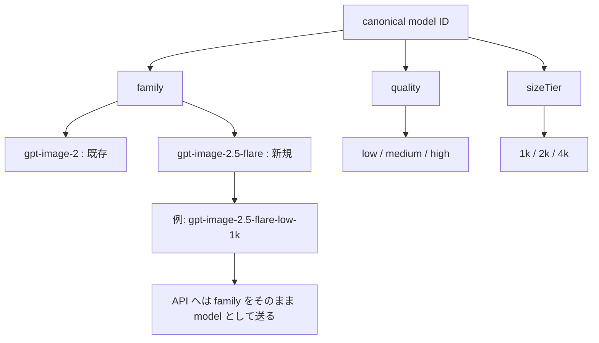
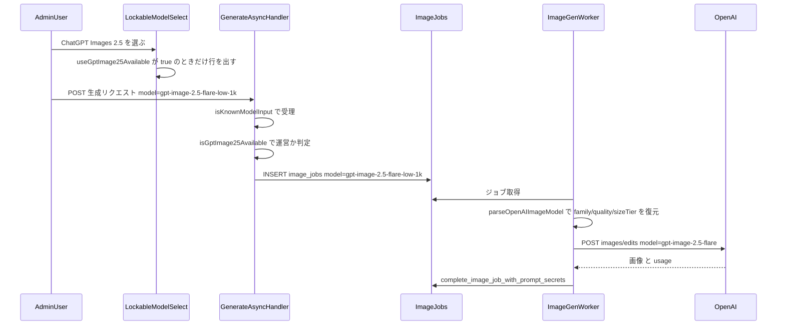
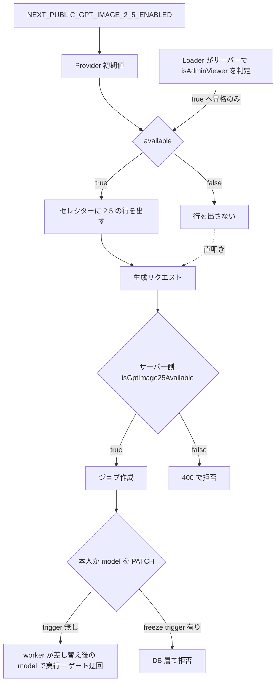
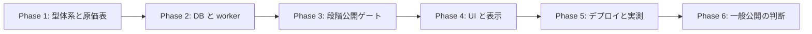

# GPT Images 2.5 (flare) 導入 実装計画

作成日: 2026-09-10
対象: `gpt-image-2.5-flare` を Persta.AI の生成エンジンとして選べるようにする(第一段階は運営限定)

---

## 0. ヒアリング結果(合意事項)

| 項目 | 決定 |
|------|------|
| 移行方針 | **まず運営だけで 2.5 を使えるようにして検証**。既存 `gpt-image-2` は残す |
| 導入モデル | **`gpt-image-2.5-flare` のみ**(`sunburst` は今回見送り) |
| 品質段数 | **既存と同じ low / medium / high の3段**(2.5 の `xhigh` / `max` は出さない) |
| ペルコイン | **2.0 と同額に揃える** |
| セレクター | **「ChatGPT Images 2.5」を1行追加(計4行)**。2.0 と並べて見比べられる形 |
| 検証の合格ライン | ①うちの子の同一性が 2.0 以上 ②生成時間が短い ③実原価が 2.0 と同等以下 ④エラー・保存の事故がない |
| 検証環境 | **本番で運営アカウントだけに開ける** |

---

## 1. コードベース調査結果

### 1-0. Supabase 接続確認(B-1)

**接続できる。** CLI v2.117.0 では macOS Keychain の承認ダイアログ待ちでハングしたため、**v2.95.4 へ戻して `brew pin` した**(2026-09-10)。旧バイナリは既に Keychain の許可を持っており、ダイアログなしで通る。

### 1-0b. 本番の実測ベースライン(2026-09-10 取得)

検証の合格ラインを数字で判定できるよう、2.0 側の現状を先に測っておいた。

**`generated_images.model` の分布(OpenAI 系のみ・全期間)**

| model | 件数 |
|---|---:|
| `gpt-image-2-low-1k` | 3,806 |
| `gpt-image-2-medium-1k` | 375 |
| `gpt-image-2-low`(legacy) | 350 |
| `gpt-image-2-medium-2k` | 10 |
| `gpt-image-2-high-4k` | 6 |
| `gpt-image-2-medium-4k` | 5 |
| `gpt-image-2-high-1k` | 4 |
| `gpt-image-2-low-4k` | 3 |
| `gpt-image-2-low-2k` | 1 |
| `gpt-image-2-high-2k` | **0** |

⭐ **`low-1k` だけで OpenAI 生成の 83%。** 比較は必ず `low-1k` を基準にすること。他の SKU は件数が1桁で、そこで比べても差がノイズに埋もれる。

**生成時間(`image_jobs` の `started_at` → `completed_at`・succeeded のみ・直近90日)**

| model | 件数 | 平均 | 中央値 | p90 |
|---|---:|---:|---:|---:|
| `gpt-image-2-low-1k` | 3,642 | 35.0s | **32.4s** | 50.4s |
| `gpt-image-2-medium-1k` | 387 | 48.7s | 46.5s | 59.2s |
| `gpt-image-2-medium-2k` | 8 | 50.4s | 48.9s | 62.3s |
| `gpt-image-2-medium-4k` | 3 | 55.0s | 51.3s | 60.7s |
| `gpt-image-2-high-4k` | 1 | 95.9s | 95.9s | 95.9s |

⭐ **合格ライン②(生成時間)の判定基準**: `low-1k` の中央値 **32.4 秒**が基準。公称「レイテンシ約50%減」が本当なら 2.5 は **16秒台**に入るはず。ただし `image_jobs` の所要時間には入力画像の取得と Storage への保存も含まれるので、OpenAI 単体の時間ではない点に注意(**差が半分にならなくても即失格ではない**)。

**CHECK 制約の現況**: `generated_images_model_check` / `image_jobs_model_check` はいずれも本番に存在し、16値(canonical 15 + legacy `gpt-image-2-low`)を列挙している(定義長 553 文字・両者同一)。

### 1-1. モデル ID の型体系

`shared/generation/openai-image-model.ts` が OpenAI 系すべての正本。

```
canonical model = `gpt-image-2-{low|medium|high}-{1k|2k|4k}`   … 9通り
```

この 9 値が **型・ペルコイン単価・原価表・UI ラベル・ゲスト/無課金の許可リスト・DB の CHECK 制約** すべての起点になっている。

Gemini 側には**すでに family の先例がある**(`shared/generation/gemini-banana-model.ts`)。`GEMINI_BANANA_FAMILIES = ["nano-2", "nano-pro"]` + `composeGeminiBananaModel(family, sizeTier)` + `parseGeminiBananaModel()` が `{canonical, family, sizeTier}` を返す形。**OpenAI 側にも同じ形を持ち込むのが最小の変更**になる。

### 1-2. API に投げるモデル名はハードコード4箇所

| ファイル | 行 | ランタイム |
|---|---|---|
| `features/generation/lib/openai-image.ts` | 322, 433 | Node(ゲスト同期経路) |
| `supabase/functions/image-gen-worker/openai-image.ts` | 274, 393 | Deno(非同期 worker・本流) |

いずれも `form.append("model", "gpt-image-2")`。この2ファイルは**ビット同等を保つ規約**がコメントで明示されている(変更時は両方を同期させること)。

送信フィールドは `model / prompt / image[] / size / quality / moderation / output_format / n`。

### 1-3. プロバイダ判定とプレフィックス判定の落とし穴

```
"gpt-image-2.5-flare-low-1k".startsWith("gpt-image-")   → true   ✅ OpenAI ルーティングはそのまま通る
"gpt-image-2.5-flare-low-1k".startsWith("gpt-image-2-") → false  ✅ 2.0 用の判定には誤爆しない
```

| 箇所 | 現状 | 2.5 追加時 |
|---|---|---|
| `features/generation/types.ts:210` `isOpenAIImageModel` | `startsWith("gpt-image-")` | **変更不要**(2.5 も OpenAI 経路へ乗る) |
| `supabase/functions/image-gen-worker/index.ts:616` 同上 | 同上 | **変更不要** |
| `features/generation/lib/model-display.ts:17` | `startsWith("gpt-image-")` → `"ChatGPT Images 2.0"` | ⚠️ **2.5 を 2.0 と誤表示する。2.5 の分岐を先に置く** |
| `features/generation/lib/model-tags.ts:78-84` | `startsWith("gpt-image-2-low")` 等 | ⚠️ 2.5 は**どれにも当たらず tier チップが消える**。分岐追加が必要 |

### 1-4. UI(モデル選択)

```
GenerationModelControls (共通・4導線から呼ばれる)
 ├─ LockableModelSelect        … 1段目: ChatGPT Images 2.0 / Nano Banana 2 / Nano Banana Pro
 ├─ GptImage2QualitySelector   … OpenAI 選択時のみ描画(parseGptImage2Model が null なら非表示)
 ├─ GptImage2SizeSelector      … 同上
 └─ GeminiBananaSizeSelector   … Gemini 選択時のみ描画
```

呼び出し元は4つ。**共通コンポーネントなので1箇所直せば4導線すべてに反映される。**

| 呼び出し元 | 画面 |
|---|---|
| `features/style/components/StylePageClient.tsx:2269` | `/style`(ワンタップ) |
| `features/generation/components/GenerationForm.tsx:786` | coordinate / じゆうモード |
| `features/inspire/components/InspirePageClient.tsx:339` | inspire |
| `features/inspire/components/CreatorLooksDetailClient.tsx:250` | Creator Looks 詳細 |

4箇所とも `subscriptionPlan` を props で受け取り、`isModelSelectable={subscriptionPlan === "free" ? isFreePlanAllowedModel : undefined}` を渡している。

### 1-5. 段階公開(運営限定)の確立パターン

`lib/env.ts` に判定を1本化する形が定着している。

```ts
export function isXxxPubliclyEnabled(): boolean { return env.NEXT_PUBLIC_XXX_ENABLED === "true"; }
export function isXxxAvailable(userId: string | null | undefined): boolean {
  return isXxxPubliclyEnabled() || isAdminViewer(userId);
}
```

クライアントへは **Provider(初期値=フラグ) + Suspense 隔離した Loader が true へ昇格** の2段構え(`PopularPromptsAvailabilityProvider` / `PopularPromptsAvailabilityLoader`、`components/LocaleShell.tsx:53,69`)。`ADMIN_USER_IDS` は `NEXT_PUBLIC_` を持たないサーバー専用値なので、クライアント単独では判定できない。

Loader は「一般公開後は即 return null」「`sb-` cookie が無ければ即 return null」で、大半の閲覧者に認証往復を発生させない作りになっている。

### 1-6. サーバー側のモデル検証

| ルート | 検証 |
|---|---|
| `app/api/generate-async/handler.ts:154-165` | `model \|\| DEFAULT_GENERATION_MODEL` → `isModelAvailableForGeneration()` |
| `app/(app)/style/generate-async/handler.ts:161-165, 288-296` | `isKnownModelInput()` → `normalizeModelName()` → `isModelAvailableForGeneration()` |
| `features/generation/lib/schema.ts:103` | `z.enum(KNOWN_MODEL_INPUTS)` |

`isModelAvailableForGeneration()` は **userId を取らない**ので、運営限定ゲートは別途この2ハンドラに足す必要がある(いずれも `user.id` は手元にある)。

なお `isFreePlanAllowedModel` は**クライアント側でしか使われていない**(サーバー側に呼び出しが1つも無い)。無課金プランのモデル制限は意図的に「UI の南京錠 + アップセル」であって認可境界ではない。**2.5 の運営限定ゲートはこれとは性質が違い、実在の境界として作る必要がある。**

### 1-6b. ⭐ 受付後にジョブの `model` を差し替えられる(TOCTOU)

**本番DBで実測した事実:**

| 確認項目 | 結果 |
|---|---|
| `image_jobs` の RLS UPDATE ポリシー | `Users can update their own image_jobs` が `auth.uid() = user_id` のみ。**列の制限なし** |
| `authenticated` への列権限 | `model` を含む**全30列に UPDATE 権限あり** |
| worker のジョブ取得 | 処理時に `select("*").eq("id", jobId)` で**行を再取得**(`supabase/functions/image-gen-worker/index.ts:1543-1547`) |
| worker が使う model | 再取得した `job.model`(同 `:1759`)。**受付時の検証は再評価されない** |

つまり、ログイン済みユーザーは **許可されたモデルでジョブを作った直後、自分の行を PATCH して `model` を差し替えられる**。worker はその値で実行する。

**影響範囲を正確に切ると:**

- ❌ **ペルコインの窃取はできない。** worker の課金額 `getGenerationPercoinAmount(job)` も同じ `job.model` から引くため(同 `:777-796`)、差し替え後のモデルの正価が課金される。残高が足りなければ charging で失敗する
- ➖ **無課金プランの制限突破は、そもそも今でも直接 POST で可能**(上記のとおり UI のみの制限で、意図的にそう設計されている)
- 🚨 **2.5 の運営限定ゲートは、この経路で完全に迂回される。** CHECK 制約に 2.5 を足した瞬間、非運営ユーザーが 2.0 のジョブを作って `model` を `gpt-image-2.5-flare-high-4k` へ書き換えれば実行できてしまう

段階公開の「運営だけ」を実在の境界にするには、**DB 層で `model` を作成後不変にする**必要がある。詳細は ADR-007。

### 1-7. 原価表

`features/admin-dashboard/lib/ai-cost-rates.ts`

- `basis: "measured" | "published" | "derived"` を持ち、admin ダッシュボードのカードに表示される(`AdminAiCostCard.tsx:201`)
- ⚠️ **`MODEL_COST_RATES` に未登録のキーは `getModelRate()` が null を返し、そのモデルの原価が丸ごと 0 円として消える**(ファイル内コメントに明記)
- gpt-image-2 の実測値: 入力画像 1,496 tok(品質・サイズ非依存の固定費)、出力 1k tier で low 172 / medium 1,587 / high 6,345 tok

### 1-8. 既に解決済みだった懸念

`supabase/migrations/20260821100000_raise_generated_images_size_limit.sql` で **`generated-images` バケットの上限は 10MB → 25MB に引き上げ済み**(2026-08-21)。4K 出力が保存で落ちる問題は解消されている。2.5 の 4K でも同じ受け皿が使える。

### 1-9. i18n

`messages/` は **15言語**(`i18n/config.ts:1-17` の `locales` が15個)。`messages/*.ts` は15ファイルで、`messages/ja.ts` が型の正本、**他14ファイル**が `satisfies DeepReplaceStrings<typeof jaMessages>` を持つ。**ja.ts にキーを足すと残り14ファイルすべてで typecheck が落ちる**ため、15ファイル同時に追加する必要がある。モデル名はブランド名なので全言語同一の値でよい(既存 `modelChatGptImages: "ChatGPT Images 2.0"` が15ファイルとも同じ)。

### 1-10. DB の CHECK 制約

`generated_images_model_check` / `image_jobs_model_check` の2本が canonical 値を列挙している。直近の更新は `supabase/migrations/20260510120000_extend_gpt_image_2_models.sql`(DROP → ADD で全列挙し直す形式)。

---

## 2. 概要図

### 2-1. モデル ID の構造(新旧)



### 2-2. 生成リクエストのシーケンス



### 2-3. 運営限定ゲートの二重化



⭐ **3層目の `freeze trigger` が要る**理由は §1-6b。worker は処理時にジョブ行を再取得するため、**受付時の検証は再評価されない**。UI とサーバーの2層だけでは、ジョブ作成後の PATCH で迂回できる。

### 2-4. 検証から一般公開までの状態遷移

```mermaid
stateDiagram-v2
    [*] --> 未実装
    未実装 --> 運営のみ: フラグ未登録 かつ isAdminViewer で通す
    運営のみ --> 実測済み: 品質と時間と原価を計測して原価表を measured へ
    実測済み --> 一般公開: NEXT_PUBLIC_GPT_IMAGE_2_5_ENABLED を true にして再デプロイ
    実測済み --> 撤退: 合格ラインに届かなければ行を消す
    一般公開 --> 二系統併存: 2.0 と 2.5 を両方残す
    一般公開 --> 二五へ統一: 2.0 の行を落とす 別PR
```



---

## 3. EARS(要件定義)

### 3-1. モデル選択

- **REQ-001** (状態駆動) — While the viewer is an admin viewer, the system shall display a "ChatGPT Images 2.5" row in the generation model selector on all four generation surfaces.
  運営プレビュー権限を持つ利用者に対し、4つの生成導線すべてのモデルセレクターに「ChatGPT Images 2.5」の行を表示すること。

- **REQ-002** (状態駆動) — While `NEXT_PUBLIC_GPT_IMAGE_2_5_ENABLED` is not `"true"` and the viewer is not an admin viewer, the system shall not display the "ChatGPT Images 2.5" row.
  フラグが未設定で運営でもない利用者には、2.5 の行を表示しないこと。

- **REQ-003** (イベント駆動) — When the user switches to the ChatGPT Images 2.5 row, the system shall preserve the currently selected quality and size tier if valid, and otherwise fall back to `low` / `1k`.
  2.5 の行へ切り替えたとき、現在の品質とサイズが有効ならそれを維持し、無効なら low / 1k へ落とすこと。

- **REQ-004** (オプション) — Where the selected model family is `gpt-image-2.5-flare`, the system shall offer only `low` / `medium` / `high` as quality options.
  2.5 を選択中の品質選択肢は low / medium / high の3つに限ること(`xhigh` / `max` は提示しない)。

### 3-2. 生成の実行

- **REQ-005** (イベント駆動) — When a generation job whose model family is `gpt-image-2.5-flare` is dispatched, the system shall send `model=gpt-image-2.5-flare` to the OpenAI images API.
  family が 2.5 のジョブを実行するとき、OpenAI へ `model=gpt-image-2.5-flare` を送ること。

- **REQ-006** (異常系) — If a generation request specifies a `gpt-image-2.5-flare-*` model and the requester is not an admin viewer while the public flag is off, then the system shall reject the request with HTTP 400 and not create an image job.
  段階公開中に運営以外が 2.5 を指定して直接リクエストした場合、400 で拒否しジョブを作らないこと。

- **REQ-007** (イベント駆動) — When a 2.5 job completes, the system shall persist `generated_images.model` and `image_jobs.model` as the full canonical ID including the family.
  2.5 のジョブ完了時、family を含む canonical ID をそのまま DB へ保存すること(あとから 2.0 と区別して集計できるようにするため)。

- **REQ-008** (状態駆動) — While the model family is `gpt-image-2.5-flare`, the system shall apply the same per-quality request timeouts as `gpt-image-2` (low 90s / medium 180s / high 300s) until measured otherwise.
  実測するまでは、2.5 のリクエストタイムアウトは 2.0 と同じ値を使うこと。

### 3-3. 課金と原価

- **REQ-009** (状態駆動) — While a 2.5 model is selected, the system shall charge the same percoin amount as the corresponding 2.0 model.
  2.5 選択時のペルコイン消費量は、対応する 2.0 のモデルと同額とすること。

- **REQ-010** — The system shall register every `gpt-image-2.5-flare-*` canonical value in `MODEL_COST_RATES`.
  9つの canonical 値すべてを原価表に登録すること(未登録は原価 0 円として黙って消えるため)。

- **REQ-011** (状態駆動) — While the 2.5 rates have not been measured, the system shall label them `basis: "derived"` in the admin cost dashboard.
  実測前の 2.5 の単価は `derived` として表示し、実測値でないことが読み取れるようにすること。

### 3-4. 表示

- **REQ-012** (イベント駆動) — When a post or generation history entry was generated with a 2.5 model, the system shall display the brand name "ChatGPT Images 2.5".
  2.5 で生成された画像には「ChatGPT Images 2.5」と表示すること(2.0 と混同させない)。

### 3-5. 既存への非干渉

- **REQ-013** — The system shall keep every existing `gpt-image-2-*` behavior unchanged, including the API model name sent to OpenAI, percoin costs, allowed-model lists, and displayed brand name.
  既存 `gpt-image-2-*` の挙動(API へ送るモデル名・ペルコイン・許可リスト・表示名)を一切変えないこと。

- **REQ-014** (異常系) — If a stored preference in `localStorage` names a 2.5 model but the viewer may not use it, then the system shall clamp the effective model to `DEFAULT_GENERATION_MODEL` without rewriting the stored value.
  localStorage に 2.5 が残っている利用者が権限を失った場合、保存値は書き換えず実効値だけ既定モデルへ丸めること。

- **REQ-015** (異常系) — If any update attempts to change `image_jobs.model` after the row is created, then the system shall reject the update at the database layer.
  作成済みの `image_jobs.model` を変更しようとする更新は、DB 層で拒否すること(§1-6b の TOCTOU を塞ぐ。これが無いと REQ-006 の受付ゲートは PATCH 1本で迂回される)。

---

## 4. ADR(設計判断記録)

### ADR-001: family を canonical model ID に含める(env フラグで worker の投げ先を切り替えない)

- **Context**: 「2.0 と 2.5 のどちらを OpenAI へ投げるか」の情報をどこに持つか。worker の環境変数で切り替える案もある。
- **Decision**: canonical model ID に family を含め(`gpt-image-2.5-flare-low-1k`)、DB に保存する。
- **Reason**: 合格ラインに「実原価が 2.0 と同等以下」「生成時間が短い」が含まれる。env で切り替えると **DB のどの行が 2.5 で生成されたか判別できず、検証そのものが成立しない**。原価表・生成時間の集計・投稿詳細の表示はすべて `model` 値を起点にしている。
- **Consequence**: CHECK 制約に9値の追加が要る。UI・型・原価表の変更点が増えるが、いずれも既存の列挙に足すだけで済む。

### ADR-002: Gemini 側と同じ family 型体系を OpenAI 側にも持ち込む

- **Context**: `parseGptImage2Model()` は quality と sizeTier だけを返し、family の概念がない。UI・worker・ゲスト経路の計8箇所がこれに依存している。
- **Decision**: `shared/generation/openai-image-model.ts` に `OPENAI_IMAGE_FAMILIES` / `composeOpenAIImageModel(family, quality, sizeTier)` / `parseOpenAIImageModel()` を追加し、8箇所を移行する。`parseGptImage2Model` は削除する。
- **Reason**: `shared/generation/gemini-banana-model.ts` が全く同じ形(`GEMINI_BANANA_FAMILIES` / `composeGeminiBananaModel` / `parseGeminiBananaModel`)で既に動いており、Gemini 側の selector もこれで書かれている。**新しいパターンを持ち込まずに済む。**
- **Consequence**: `parseGptImage2Model` を残して並存させる案より初期の変更点は多いが、「2.0 用と汎用の2つのパーサ」が並ぶ状態を作らない。片方だけ直して事故る型を潰す。
- ⭐ **実装上の必須事項**: 新パーサは **位置固定の `split("-")` を使わないこと**。現行 `parseGptImage2Model` は `const [, , , quality, sizeTier] = normalized.split("-")` で3番目・4番目を取っている(`shared/generation/openai-image-model.ts:78-85`)。2.5 は `["gpt","image","2.5","flare","low","1k"]` と分割されるため、同じ添字だと `quality="flare"` になる。`parseGeminiBananaModel` と同じく **canonical set への所属確認 + 明示的なマッピング(switch もしくは Record)**で復元する。
- ⭐ 旧 export を削除するときは `features/generation/types.ts:166-179` の **re-export ブロックも更新対象**(`composeGptImage2Model` / `parseGptImage2Model` / `GPT_IMAGE_2_*` をここから再輸出している)。

### ADR-003: 運営限定は Provider + Loader パターンで配る(props を引き回さない)

- **Context**: セレクターの行を出す判定はクライアント側で要る。`ADMIN_USER_IDS` はサーバー専用値なのでクライアント単独では判定できない。4つの呼び出し元はいずれも `subscriptionPlan` を props で受けており、そこに1つ足す案もある。
- **Decision**: `PopularPromptsAvailabilityProvider` / `Loader` と同じ形の `GptImage25AvailabilityProvider` / `Loader` を作り、`LocaleShell` に1組だけ置く。`LockableModelSelect` が hook で読む。
- **Reason**: props 案は「4つのクライアント + その4つを描くサーバーページ」の計8ファイルに触る。Provider 案は provider / loader / LocaleShell / LockableModelSelect の4ファイルで済み、しかも**検索・人気タブと同じ形**になる。
- **Consequence**: Provider の外では `false`(閉じる側)に倒れる。`LocaleShell` の内側で描かれないツリーがあれば行が出ない。既存2つと同じ注意点。

### ADR-004: 原価は `derived` で登録し、実測後に `measured` へ更新する

- **Context**: 単価(per 1M tokens)は 2.0 と同額だが、**出力画像のトークン数が同じとは限らない**。実測は Phase 4 で行う。
- **Decision**: Phase 1 の時点で 2.0 の実測値をそのまま流用し、`basis: "derived"` で9値すべて登録する。
- **Reason**: 未登録のキーは `getModelRate()` が null を返し、原価が丸ごと 0 円として消える(2026-08-14 以前に実際に起きている)。「暫定値でも入れておく」ほうが「黙って 0 円」より安全で、`derived` ラベルが admin カード上で不確かさを明示する。
- **Consequence**: 実測前のダッシュボードは 2.5 の原価を 2.0 と同額として表示する。Phase 4 で実測して置き換える。

### ADR-005: デプロイ順序は マイグレーション → worker → Next.js

- **Context**: 3つのデプロイ先(DB / Edge Function / Vercel)がある。
- **Decision**: 必ず この順で適用する。
- **Reason**:
  - Next.js を先に出すと、運営が 2.5 を選んだ瞬間 `image_jobs` の INSERT が CHECK 制約違反で落ちる
  - worker が古いまま 2.5 のジョブが積まれると、worker の `normalizeModelName()` が `Invalid GPT Image 2 model` を投げてジョブが全部 failed になる
  - 逆順(migration → worker)は**どちらも既存の挙動を1ミリも変えない**ので、間に人間の確認時間を挟んでよい
- **Consequence**: 3ステップの手動デプロイになる。Phase 5 の手順に明記する。
- ⭐ **worker デプロイの完了判定を挟む**。`supabase functions deploy` の成功は「アップロードが通った」であって「新 bundle が実際に走っている」ではない。Next.js を出す前に、**既存 2.0 のジョブを1件流して新 bundle が処理していることを確認する**(completion barrier)。Next.js より前に積まれるのは既存 2.0 のジョブだけなので、通常のキュー待ち自体は問題にならない。
- ⭐ **ロールバック時は「新規受付を閉じる」が先**。旧 worker へ戻すと 2.5 のジョブは `Invalid GPT Image 2 model` で全 failed になる。手順は ①Next.js から 2.5 の受付を止める(行を消す or フラグ) → ②2.5 の `queued` / `processing` が 0 件になるまで待つ → ③worker を戻す、の順。②を飛ばすと処理中のジョブを落とす。
- ⭐ **補正(Phase 2 実装時 2026-09-10)**: 上の順序は「UI を含む Next.js(Phase 4)」を出すときの話。**CHECK 制約の拡張だけは、Phase 3 のサーバー側ゲートより先に出してはいけない**。Phase 1 から `KNOWN_MODEL_INPUTS` が 2.5 を受理しているため、ゲート無しで CHECK を広げると一般ユーザーが直接 POST で 2.5 のジョブを INSERT できる(UI 無しでも API は叩ける)。したがって本番適用の実順序は **①Phase 3 の Next.js(ゲート・UI 無し) → ②worker → ③マイグレーション(CHECK + freeze trigger) → ④Phase 4 の Next.js(UI)**。①〜③はどれも既存 2.0 の挙動を変えないので、間に確認時間を挟んでよい。

### ADR-006: 品質は 3段のまま。`xhigh` / `max` は入れない

- **Context**: 2.5 は `low / medium / high / xhigh / max / auto` をサポートする。
- **Decision**: `low / medium / high` の3段に限る。
- **Reason**: 検証の目的は「同じ設定で 2.0 と 2.5 を見比べる」こと。段数が違うと比較にならない。加えて `xhigh` / `max` は出力トークン数が未知で、原価とタイムアウトの両方を実測しないと出せない。
- **Consequence**: quality と sizeTier の軸を 2.0 とそのまま共有できる(`GPT_IMAGE_2_QUALITIES` / `GPT_IMAGE_2_SIZE_TIERS` を使い回す)。将来 `xhigh` を足すときは family ごとに許可 quality を持つ形へ拡張する。

### ADR-007: `image_jobs.model` を作成後不変にする(DB trigger)

- **Context**: §1-6b のとおり、受付時にモデルを検証してジョブを作っても、ユーザーは自分の行を PATCH して `model` を差し替えられる。worker は処理時に行を再取得するため、受付時の検証が無効化される(TOCTOU)。
- **Decision**: `image_jobs` に **`model` 列を作成後変更させない trigger** を追加する。~~`service_role` からの更新だけは許可する(worker が正規化後の値を書き戻す経路があるため)~~ → **補正(Phase 3 実装時)**: 下記 Consequence のとおり書き戻す経路が存在しないため、role の例外は設けず無条件に拒否する(`20260910120100_freeze_image_jobs_model.sql`)。
- **Reason**: 段階公開の「運営だけ」を実在の境界にするには、**受付だけを守っても足りない**。API ハンドラ側の `isGptImage25Available` は「意図しない選択」を防ぐ UX の層で、悪意ある PATCH に対しては DB 層でしか止められない。RLS の UPDATE ポリシーを列単位に絞る案もあるが、Postgres の RLS は列単位の制限を表現できず、`GRANT UPDATE (col...)` で列権限を絞ると **他の正当な更新経路まで巻き込む**ため、trigger で「変わったこと」を検出するほうが影響が小さい。
- **Consequence**:
  - これは 2.5 に閉じない**モデル選択全体の穴を塞ぐ変更**になる(無課金プランの制限は意図的に UI のみなのでここでは変わらない)
  - trigger 追加後は `node scripts/check-rpc-grants.mjs` の実施対象になる(スクリプトの実在は確認済み)
  - ⭐ **`image_jobs.model` を後から書き戻す経路は存在しない**(TS 側の `.from("image_jobs").update()` 全28箇所と、SQL 側の `UPDATE public.image_jobs` のいずれにも `model` の代入が無いことを確認済み)。したがって trigger は **`OLD.model IS DISTINCT FROM NEW.model` なら無条件で `RAISE EXCEPTION`** の形にしてよく、role による例外を設ける必要がない
  - 認証ユーザーの直接 UPDATE が拒否されることを ~~integration test で固定する~~ → SQL のテスト基盤が無いため、migration 内の `DO $$` 自己検証(一時テーブル)+ Phase 5 の本番適用直後の手動確認で固定する(Phase 3 の実装メモを参照)

---

## 5. 実装計画(フェーズ + TODO)

### フェーズ間の依存関係



---

### Phase 1: 型体系の family 化と原価表(UI 変更なし)

**目的**: canonical model ID に family の概念を導入し、既存 9 値の挙動を1ミリも変えないまま 2.5 の 9 値を型として受け入れられる状態にする。
**ビルド確認**: `npm run lint` / `npm run typecheck` / `npm run test` / `npm run build -- --webpack` がすべて通る。UI 上は何も変わらない(2.5 はどこにも出ない)。

- [x] `shared/generation/openai-image-model.ts` に family 型体系を追加(既存 `shared/generation/gemini-banana-model.ts` の構造をそのまま写す)
  - `OPENAI_IMAGE_FAMILIES = ["gpt-image-2", "gpt-image-2.5-flare"]`
  - `GptImage25FlareCanonicalModel` / `OpenAIImageCanonicalModel`
  - `OPENAI_IMAGE_CANONICAL_MODELS`(18値)
  - `composeOpenAIImageModel(family, quality, sizeTier)`
  - `parseOpenAIImageModel(value) -> {canonical, family, quality, sizeTier} | null`(legacy `gpt-image-2-low` の正規化もここに含める)
  - `toOpenAIApiModelName(family)`(family 文字列がそのまま API モデル名)
  - `OPENAI_IMAGE_PERCOIN_COSTS`(2.5 は 2.0 と同額の9値を追加)
- [x] `parseGptImage2Model` / `composeGptImage2Model` / `GPT_IMAGE_2_PERCOIN_COSTS` の呼び出し元を新 API へ移行し、旧 API を削除(ADR-002)
  - `features/generation/components/GptImage2QualitySelector.tsx:76,86,124`
  - `features/generation/components/GptImage2SizeSelector.tsx:55,65,108`
  - `features/generation/components/LockableModelSelect.tsx:120,128,147`
  - `features/generation/lib/guest-generate.ts:287`
  - `features/generation/lib/model-config.ts:63`
  - `supabase/functions/image-gen-worker/index.ts:94,1097,2595,727`
- [x] `features/generation/types.ts` の `GeminiModel` union と `KNOWN_MODEL_INPUTS` に 2.5 の9値を追加(既存 `GPT_IMAGE_2_CANONICAL_MODELS` の展開を `OPENAI_IMAGE_CANONICAL_MODELS` へ差し替え)
- [x] `features/generation/lib/model-config.ts` の `MODEL_PERCOIN_COSTS` を `OPENAI_IMAGE_PERCOIN_COSTS` 起点に変更(REQ-009)
- [ ] `features/generation/lib/form-preferences.ts:60` の `PERSISTABLE_MODELS` に 2.5 を追加 → **Phase 4 へ移動**(この配列の不変条件は「`GenerationForm` の `<SelectItem>` と一致させる」なので、2.5 の行を出す Phase 4 で一緒に追加する。Phase 1 で先に入れると、選べないモデルが localStorage から復元されうる)
- [x] `features/admin-dashboard/lib/ai-cost-rates.ts` の `MODEL_COST_RATES` に 2.5 の9値を `basis: "derived"` で追加(REQ-010 / REQ-011 / ADR-004)
- [x] ⭐ 回帰ガード: 既存 `gpt-image-2-*` の canonical / percoin / API モデル名 / 原価が 1つも変わらないことをテストで固定(REQ-013)
  - `tests/unit/shared/generation/openai-image-model.test.ts`(新規)と `tests/unit/features/admin-dashboard/build-ai-cost.test.ts` に追加

**Phase 1 の実装メモ(2026-09-10)**:
- worker の `normalizeModelName()` に **暫定の family ガード**を入れた(`family !== "gpt-image-2"` なら throw)。API へ送るモデル名を family に追従させるのは Phase 2 なので、それまで 2.5 のジョブが 2.0 として実行・課金されないための保険。**Phase 2 で撤去する**
- Phase 1 の時点で 2.5 は `KNOWN_MODEL_INPUTS` を通るが、`image_jobs_model_check` が 2.0 のみなので INSERT で弾かれる(route handler は残高チェックと INSERT だけで減算は worker → 課金なし)。**穴が開くのは Phase 2 のマイグレーション + worker デプロイから Phase 3 のゲートまでの間**なので、Phase 2 の本番適用は Phase 3 のコードと同時に行う
- worker の `deno check` は main 時点で 26 件の既存エラー(SupabaseClient 型不一致 / `EdgeRuntime` / `never`)があり、Phase 1 で増減なし

**注意**: この時点では **`GUEST_ALLOWED_MODELS` と `FREE_PLAN_ALLOWED_MODELS` に 2.5 を追加しない**。運営限定の段階では不要で、追加すると一般公開前に穴が開く。

---

### Phase 2: DB の CHECK 制約と worker の実行経路

**目的**: 2.5 の canonical 値を DB が受け入れ、worker が正しい API モデル名で OpenAI を呼べるようにする。
**ビルド確認**: worker の `deno check` が通る。マイグレーションは `supabase db push --dry-run` で本ファイル1本だけが出る。

- [ ] `supabase/migrations/<ts>_allow_gpt_image_2_5_flare_models.sql` を作成(既存 `supabase/migrations/20260510120000_extend_gpt_image_2_models.sql` と同じ DROP → ADD 全列挙形式)**→ Phase 3 の PR へ移動**(理由は下の実装メモ)
  - `generated_images_model_check` に 2.5 の9値を追加
  - `image_jobs_model_check` に同じ9値を追加
  - 適用後の検証ブロック(`DO $$` で制約の存在を確認)を付ける
- [x] `supabase/functions/image-gen-worker/index.ts` の `normalizeModelName()` から **Phase 1 で入れた暫定 family ガード(`family !== "gpt-image-2"` で throw)を撤去**し、2.5 canonical を通す
  - `parseOpenAIImageModel()` 起点への置き換え自体は Phase 1 で完了済み。残っているのはガードの撤去だけ
- [x] `supabase/functions/image-gen-worker/openai-image.ts:274,393` の `form.append("model", "gpt-image-2")` を、呼び出し側から渡された family へ差し替え(REQ-005)
  - `CallOpenAIImageEditBatchParams` / `CallOpenAIImageEditMultiInputParams` に `family` を必須で追加
- [x] `features/generation/lib/openai-image.ts:322,433` に**同じ変更**を入れる(2ファイルはビット同等を保つ規約)
- [x] ⭐ **Node client の呼び出し元3つに `family: "gpt-image-2"` を明示的に渡す**(必須引数化で typecheck が落ちるため。いずれも `quality: "low", sizeTier: "1k"` 固定のプレビュー経路)
  - `app/api/style-templates/preview-generation/handler.ts:429-440`
  - `app/api/internal/generate-creator-looks-admin-preview/route.ts:134-144`
  - `app/api/internal/generate-style-preset-preview/route.ts:117-127`
  - 注: `app/(app)/style/generate/handler.ts:170-172` は client を `dispatchGuestImageGeneration` へ**そのまま渡すだけ**(`:597-605`)なので、この3つとは別に直す必要はない
- [x] ⭐ **OpenAI レスポンスの `usage` を取り出して記録する**(現状 Node/Deno とも `json.data[].b64_json` しか読まず、worker に `usage` の語が1つも無い)
  - `OpenAIImageEditResult` に `usage` を追加(`input_tokens` / `output_tokens` / `input_tokens_details`)。**base64 は絶対に含めない**
  - worker 側で jobId・canonical model・実際に送った API model と紐づけて構造化ログに出す
  - これが無いと Phase 5 の合格ライン③(実原価)が判定できない
- [x] `supabase/functions/image-gen-worker/index.ts` の呼び出し2箇所(1101, 2595 付近)で `family` を渡す
- [x] `features/generation/lib/guest-generate.ts:287` の OpenAI dispatch で `family` を渡す
- [x] `resolveOpenAIRequestTimeoutMs()`(94-103行)の引数型を新パーサの戻り値へ更新(REQ-008: タイムアウト値そのものは 2.0 と同じまま)→ Phase 1 で完了(`ParsedOpenAIImageModel`)
- [ ] `.cursor/rules/database-design.mdc` の `model` 許容値リスト(133行 / 142行付近)を更新 **→ Phase 3 の PR へ移動**(マイグレーションと同じ PR で更新する)

**Phase 2 の実装メモ(2026-09-10)**:
- **マイグレーションと `.cursor/rules/database-design.mdc` の更新は Phase 3 の PR へ移した**。理由: CHECK 拡張のマイグレーションを main に置いたまま Phase 3 のゲートが未マージだと、その間に別件で `supabase db push` した瞬間にゲート無しで 2.5 が INSERT できる窓が開く(地雷)。ゲートのコードと同じ PR に入れれば「マイグレーションが main にある ⇒ ゲートも main にある」が常に成り立つ
- **usage は構造化ログに加えて `image_jobs.generation_metadata.geminiAttempts[]` にも保存する**(`apiModel` + `openaiUsage`)。計画は「構造化ログに出す」だったが、Edge ログは Management API + PAT が要る(`persta-edge-logs-access`)ので、Phase 5 の paired run を DB クエリで済ませられるよう attempt 記録に載せた。ログは `[Job Timeline] OpenAI usage jobId=… stage=main|creator_looks_stage1 dbModel=… apiModel=… inputTokens=… outputTokens=…` の1行
  - `generation_metadata` は `unknown` 型で `mergeSuccessGenerationMetadata` がそのまま書くので、DB 側の変更は不要
  - Creator Looks の段階1(衣装着せ)は `geminiAttempts` に載らない経路なのでログのみ
- `OpenAIImageEditResult` の `apiModel` / `usage` は **optional**(テストのモック結果 ~23 箇所を触らないため)。`family` の引数は**必須**
- worker の暫定 family ガードは撤去した。撤去後も DB の `image_jobs_model_check` が 2.0 のみなので、2.5 のジョブは依然として INSERT 段階で弾かれる(worker まで届かない)
- **worker だけ先にデプロイしても安全**(2.0 のジョブは `family="gpt-image-2"` で今までと同じモデル名を送る)。むしろ先に出しておくと、既存 2.0 のジョブで usage 記録が機能しているかを本番で確かめられる。ただしデプロイはユーザーの指示があってから
- ⚠️ **本番の適用順は ADR-005 の補正どおり**: Phase 3 Next.js(ゲート) → worker → マイグレーション → Phase 4 Next.js(UI)

---

### Phase 3: 運営限定ゲート

**目的**: 2.5 を「運営だけが選べて、運営だけが実行できる」状態にする。UI にはまだ出さない。
**ビルド確認**: 4検証コマンドが通る。フラグ未設定・非運営で `isGptImage25Available()` が false を返すテストが通る。

- [x] `lib/env.ts` に判定を追加(既存 `isPopularPromptsPubliclyEnabled` / `isPopularPromptsAvailable`(`lib/env.ts:465,476`)と同じ形)
  - `NEXT_PUBLIC_GPT_IMAGE_2_5_ENABLED` を `envSchema` と `env` に登録(91-98行 / 209-213行付近)
  - `isGptImage25PubliclyEnabled()` / `isGptImage25Available(userId)`
- [x] `features/generation/components/GptImage25AvailabilityProvider.tsx` を新規作成(既存 `features/posts/components/PopularPromptsAvailabilityProvider.tsx` を写す)
- [x] `features/generation/components/GptImage25AvailabilityLoader.tsx` を新規作成(既存 `features/posts/components/PopularPromptsAvailabilityLoader.tsx` を写す。一般公開後の早期 return と `sb-` cookie チェックも含める)
- [x] `components/LocaleShell.tsx` に Provider と、独立した `<Suspense>` 内の Loader を追加(既存 53行 / 69行の並びに足す)
- [x] ⭐ サーバー側の実行ゲート(REQ-006)。UI を閉じるだけでは足りない
  - `app/api/generate-async/handler.ts:158-165` の `isModelAvailableForGeneration` チェックの直後に、2.5 なら `isGptImage25Available(user.id)` を要求する分岐を追加
  - `app/(app)/style/generate-async/handler.ts:288-296` に同じ分岐を追加
- [x] `features/generation/lib/model-config.ts` の `resolveEffectiveModelForAuthState()` に 2.5 の clamp を追加(REQ-014)
- [x] **(Phase 2 から移動)** `supabase/migrations/20260910120000_allow_gpt_image_2_5_flare_models.sql` を作成(`generated_images_model_check` / `image_jobs_model_check` に 2.5 の9値。既存 `20260510120000_extend_gpt_image_2_models.sql` と同じ DROP → ADD 全列挙形式 + `DO $$` 検証ブロック)。**ゲートのコードと同じ PR に入れる**
- [x] **(Phase 2 から移動)** `.cursor/rules/database-design.mdc` の `model` 許容値リストを更新
- [x] 🚨 **`supabase/migrations/20260910120100_freeze_image_jobs_model.sql` を追加**(ADR-007 / REQ-015)。**この migration が無いまま 2.5 を CHECK に足すと、運営限定ゲートが PATCH 1本で迂回される**
  - `BEFORE UPDATE OF model ON public.image_jobs` の trigger で `OLD.model IS DISTINCT FROM NEW.model` なら `RAISE EXCEPTION`(計画の `BEFORE UPDATE` から `OF model` に絞った。理由は実装メモ)
  - `SECURITY DEFINER` は付けていない(OLD/NEW しか読まないので不要。`SET search_path = public, pg_temp` は付けた)
  - ~~適用後に `node scripts/check-rpc-grants.mjs` を実行~~ → Phase 5 の適用後に実行する(スクリプトの対象は SECURITY DEFINER かつ trigger 以外の関数なので、この trigger 関数自体は検査対象外。実行は他の関数に影響が無いことの確認として行う)
- [x] ~~integration test: 認証ユーザーが自分の `image_jobs.model` を UPDATE しようとすると拒否されること~~ → **リポジトリに SQL を実行するテスト基盤が無い**(Docker 不可・migration を読む Jest テストも無い)ため、migration 内の `DO $$` 自己検証(一時テーブルに同じ trigger 関数を付けて「同値 UPDATE は通る / 変更は拒否 / NULL 化も拒否」を固定)+ PR の Supabase Preview + Phase 5 の本番適用直後の手動確認(下記)で代替する
- [x] 権限テスト: 非運営 + フラグ OFF で 2.5 を直接 POST すると 400 になり `image_jobs` が作られないこと(`tests/integration/api/generate-async-route.test.ts` / `tests/integration/app/style-generate-async-route.test.ts`)

**Phase 3 の実装メモ(2026-09-10)**:
- **2.5 判定のヘルパー `isGptImage25FlareModel(model)` を `shared/generation/openai-image-model.ts` に追加**した(`parseOpenAIImageModel(model)?.family === "gpt-image-2.5-flare"`)。§1-3 のとおり `startsWith("gpt-image-2")` は 2.5 にも一致するので、ハンドラと clamp はこのヘルパーだけを使う
- **サーバーゲートのエラーコード**: `/api/generate-async` は `GENERATION_MODEL_NOT_AVAILABLE_FOR_USER`、`/style/generate-async` は `STYLE_MODEL_NOT_AVAILABLE_FOR_USER`(いずれも 400)。文言は既存の `copy.modelTemporarilyUnavailable`(7言語)を再利用した。UI に 2.5 の行が無い Phase 3 では直接 POST 以外でこの分岐に来ないので、専用文言は追加していない
- **ゲートの位置**: 両ハンドラとも `isModelAvailableForGeneration` の直後 = temp アップロード・残高確認・ジョブ作成のすべてより前。integration test で `uploadSourceImage` / `getUserCreditBalance` / `createImageJob` が呼ばれないことを固定した(Phase 1 時点の「500・temp 画像が残る」から 400 に戻る)
- **`resolveEffectiveModelForAuthState(model, authState, options)`** に `options.gptImage25Available?: boolean` を足した(既定 false = fail closed)。**Phase 4 の予定だった呼び出し側の配線を前倒し**し、`GenerationForm.tsx` / `LockableModelSelect.tsx` / `StylePageClient.tsx` の3箇所で `useGptImage25Available()` の値を渡している。2.5 の行がまだ無いので**表示は何も変わらない**が、Phase 4 で行を足したときに配線忘れで一般ユーザーへ 2.5 が漏れる余地を先に潰した。ゲストは `gptImage25Available=true` でも `GUEST_ALLOWED_MODELS` 外なので既定へ丸まる
- **freeze trigger は `BEFORE UPDATE OF model`**(計画の `BEFORE UPDATE` より絞った)。worker の status 更新(queued → processing → succeeded)は SET 句に `model` を含まないため trigger 自体が呼ばれず、ホットパスに PL/pgSQL の呼び出しが乗らない。既存 `trg_enforce_image_job_origin`(`UPDATE OF origin_post_id`)と同じ考え方。ADR-007 のとおり作成後に `model` を書く正規経路は無い(`complete_image_job_with_prompt_secrets` の `p_model` も `generated_images` の INSERT にしか使わない)ので、role の例外は設けず**無条件に拒否**する
- **migration の自己検証**: SQL のテスト基盤が無いため、`20260910120100` は `DO $$` 内で一時テーブルに同じ関数を `UPDATE OF model` で付け、(a) 他列の更新は通る (b) 同値の SET は通る (c) 値の変更は `raise_exception` で止まり、メッセージに `ADR-007` を含む (d) NULL 化も止まる、を確認してから一時テーブルを落とす。さらに `pg_trigger` で本番テーブルに有効な trigger が付いたことを確認する。`20260910120000` は `pg_get_constraintdef` に 2.5 の9値と旧 `gpt-image-2-low` が含まれることを確認する
- ⭐ **Phase 5 の本番適用直後の手動確認**(trigger の実在確認。ROLLBACK するので副作用なし):
  ```sql
  BEGIN;
  UPDATE public.image_jobs SET model = 'gpt-image-2-low-2k'
  WHERE id = (SELECT id FROM public.image_jobs ORDER BY created_at DESC LIMIT 1);
  ROLLBACK;
  ```
  → `image_jobs.model は作成後に変更できない (ADR-007 / REQ-015)` の例外で止まれば OK
- ⚠️ **この PR をマージしても本番には何も出ない**: migration は手動 `supabase db push`(`persta-migration-apply-workflow`)、Next.js は Vercel の自動デプロイでゲートだけが出る(非運営には 400、運営にも UI が無いので実行経路は直接 POST のみ)。**適用順は Phase 5-A のとおり Next.js(この PR) → worker → migration 2本 → Phase 4**

---

### Phase 4: UI と表示

**目的**: 運営に「ChatGPT Images 2.5」の行が見え、生成結果に正しいブランド名が出る。
**ビルド確認**: 4検証コマンドが通る。ローカルで運営アカウントに行が出て、非運営に出ないことを確認。

- [x] `features/generation/components/LockableModelSelect.tsx`
  - `MODEL_OPTIONS` に `gpt-image-2.5-flare-row`(`labelKey: "modelChatGptImages25"`, `engineTag: "engineOpenai"`)を追加(2.0 の直後 = 2 行目)
  - `useGptImage25Available()` が false のとき、その行を出さない(REQ-001 / REQ-002)
  - `toOptionCanonicalValue()` の family 切り替えロジックを 2.5 に対応(REQ-003: size を維持、無効なら 1k、quality は low)
  - `getCurrentRowValue()` を `parseOpenAIImageModel().family` 起点に変更
- [x] ~~`GptImage2QualitySelector.tsx` / `GptImage2SizeSelector.tsx` を family 対応~~ → **Phase 1 で対応済みだった**。両者とも `parseOpenAIImageModel(value)` → `composeOpenAIImageModel(parsed.family, ...)` の形になっており、2.5 でも family を保ったまま quality / size を組み替える。Phase 4 では**その挙動をテストで固定**し、doc コメントを 2.0 限定の記述から直しただけ
- [x] `features/generation/lib/model-display.ts`
  - `getModelBrandName()`: `startsWith("gpt-image-2.5-")` の分岐を `startsWith("gpt-image-")` より**前**に置いた(REQ-012)。順序を逆にすると落ちるテストも足した
  - `MODEL_LIST_DISPLAY_MAP` に 2.5 の 9 値を追加(`"ChatGPT Images 2.5 | Low"` 等)。`defaultSize` は `GPT_IMAGE_2_TIER_LIMITS` が family 非依存なので 2.0 と同値(1024 / 2048 / 2880)
- [x] `features/generation/lib/model-tags.ts` の `getModelTagsForCanonicalModel()` に 2.5 の3分岐を追加
- [x] i18n: `modelChatGptImages25: "ChatGPT Images 2.5"` を **15ファイルすべて**に追加(ブランド名なので全ロケール同一文字列)
- [x] **(Phase 1 から移動)** `features/generation/lib/form-preferences.ts` の `PERSISTABLE_MODELS` に `GPT_IMAGE_2_5_FLARE_CANONICAL_MODELS` を追加
- [x] ⭐ 回帰ガード: 2.0 のブランド名・tier チップ・表示名が変わらないことをテストで固定
- [x] エラー分類の堅牢化(Node/Deno 両方)。`code === "moderation_blocked"` を **status に依存しない**独立分岐として追加し、既存の `content_policy_violation` + 正規表現(400 限定)はそのまま残した
  - 返金経路: throw した文字列が `isSafetyPolicyBlockedErrorMessage()` で true になることをテストで固定(= non-retriable + 返金の既存経路に載る)

**Phase 4 の実装メモ(2026-09-10)**:
- **行の並びは 2.0 → 2.5 → Nano Banana 2 → Nano Banana Pro**。2.5 は検証中なので既定(2.0)を先頭に残した。全公開時に並べ替えるかは Phase 6 で判断する
- **`useGptImage25Available()` の配線は Phase 3 で前倒し済み**だったので、Phase 4 で足したのは「行を出す / 出さない」の分岐だけ。`resolveEffectiveModelForAuthState` 側の clamp は Phase 3 のまま効いている
- ⭐ **`getModelTagsForCanonicalModel` は元々 2.5 を誤判定しない**(`gpt-image-2.5-flare-low-1k` は `startsWith("gpt-image-2-low")` に一致しない)。それでも 2.5 の分岐を明示したのは、2.0 側の判定を将来 `gpt-image-2` プレフィックスに緩めたときの事故を防ぐため。**危ないのは `model-display.ts` の `startsWith("gpt-image-")` だけ**で、こちらは実際に 2.5 を巻き込むので順序で対処した
- **worker の `isOpenAIImageModel()`(`startsWith("gpt-image-")`)は変更不要**。2.5 も OpenAI 経路に流すのが正しいため、ここは巻き込んで良い箇所
- **Deno 側の `moderation_blocked` 追加は Jest のテスト対象外**(worker は tsconfig の exclude)。Node 側と同一の差分を当てているので、パリティは目視 + `deno check` で担保する
- ⚠️ **検証環境の注意: `deno check --node-modules-dir=auto` を実行してはいけない**。Deno が npm 依存を `node_modules/.deno/` 配下へ入れ直し、`node_modules/stripe` などが package-lock より新しい版へのシンボリックリンクに置き換わる。その状態では lint 22→109 errors・`tsc` の非テストエラー 0→11・`npm run build` が失敗・`style-page-client.test.tsx` が落ちる、という**コード変更と無関係の赤**が一斉に出る。復旧は `npm ci`。worker の型検査が要るときは、リポジトリ本体から切り離した場所で行うこと

---

### Phase 5: デプロイと実測

**目的**: 本番で運営だけが 2.5 を使える状態にし、合格ライン4項目を計測する。
**ビルド確認**: 本番で運営アカウントの生成が成功し、`generated_images.model` に 2.5 の canonical 値が入る。

#### 5-A. デプロイ(ADR-005 + その補正の順序を厳守)

- [ ] **手順0**: Phase 3(サーバー側ゲート・UI 無し)を含む Next.js が本番に出ていることを確認(Phase 3 PR のマージで Vercel が自動デプロイ)。**これより前に CHECK 制約を広げない**
- [ ] **手順1**: `supabase functions deploy image-gen-worker` で worker をデプロイ(Phase 2 の変更。2.0 の挙動は不変)
- [ ] ⭐ **手順1の完了判定(completion barrier)**: デプロイ成功は「アップロードが通った」であって「新 bundle が走っている」ではない。**既存 2.0 の生成を1件実際に流し、新 bundle が処理していること(`generation_metadata.geminiAttempts[0].apiModel = "gpt-image-2"` と `openaiUsage` が入ること)を確認してから**次へ進む
- [ ] **手順2**: `supabase db push --dry-run` で Phase 3 のマイグレーション(CHECK 制約 + `model` freeze trigger)だけが出ることを確認してから適用
- [ ] **手順3**: Phase 4(UI)の Next.js を本番デプロイ。`NEXT_PUBLIC_GPT_IMAGE_2_5_ENABLED` は**登録しない**(運営だけが `isAdminViewer` で通る状態)
- [ ] 一般アカウント(または未ログイン)で 2.5 の行が出ないことを実機確認
- [ ] 🚨 **ゲート迂回のネガティブ確認**: 一般アカウントで 2.0 のジョブを作り、`image_jobs.model` を 2.5 へ PATCH しようとして**拒否される**ことを確認(ADR-007 の trigger が効いているか)

#### 5-B. smoke test(1件ずつ・機能が壊れていないかの確認)

**ここは合格判定ではない。**「そもそも動くか」を最小コストで見るための工程。

- [ ] `low` × `1k` で 2.5 を1件生成し、成功して `generated_images.model` に 2.5 の canonical 値が入ることを確認
- [ ] ⭐ **多入力経路**(Creator Looks もしくは One-Tap Style の dual プリセット)を1件。`image[]` の複数 append が 2.5 で通るか(§10 前提3)
- [ ] ⭐ **`high` × `4k`** を1件。出力 PNG のバイト数を測り、**25MB の上限に対してどれだけ余裕があるか**を記録する(上限引き上げは容量の余裕であって、2.5 の最大 PNG が必ず収まる保証ではない)
- [ ] レスポンスの `usage` がログと `image_jobs.generation_metadata.geminiAttempts[].openaiUsage` に入っていること(Phase 2 で追加した記録が機能しているか)

#### 5-C. 合格判定のための測定(paired run)

⭐ **各1件では判定できない。** 比較対象の 2.0 は n=3,642 の中央値(32.4秒)で、そこに 2.5 の1サンプルをぶつけても、プロバイダ側の揺らぎ・キュー待ち・入力依存を分離できない。

- [ ] **同一入力の paired run** を組む
  - 同じうちの子・同じプロンプト・同じ品質/サイズ(`low` × `1k`)で 2.0 と 2.5 を対にして回す
  - **順序を交互またはランダム化**する(時間帯によるプロバイダ側の混雑が片方に偏るのを防ぐ)
  - 最低でも各 10 ペア。原価は 1件あたり ¥0.35 前後(§1-7 の実測ベース)なので、20件でも実費は小さい
- [ ] 記録する指標を分ける
  - **provider request 時間**(OpenAI への fetch の往復。Phase 2 のログから)
  - **end-to-end 時間**(`image_jobs` の `started_at` → `completed_at`。入力画像取得と Storage 保存を含む)
  - **p50 / p90**(平均だけ見ない。2.0 の p90 は 50.4 秒)
  - **失敗率**
  - **usage 由来の実原価**(input_tokens / output_tokens をそれぞれ記録)
- [ ] 合格ラインの判定
  - ①同一性: paired の画像を並べて目視
  - ②生成時間: **provider request 時間の p50** で比較する。end-to-end には Persta 側の固定費が乗るので、公称の「50%減」がそのまま出るとは限らない
  - ③実原価: usage から算出した1生成あたりの USD が 2.0 と同等以下か
  - ④事故: `processing_stage` が `uploading` / `persisting` で落ちていないか、`error_message` の有無

#### 5-D. 実測値の反映

- [ ] 実測値で `features/admin-dashboard/lib/ai-cost-rates.ts` の 2.5 の単価を更新し、`basis` を `"measured"` へ(1k のみ。2k/4k は `"derived"` のまま)
- [ ] 実測した生成時間に応じて `resolveOpenAIRequestTimeoutMs()` の 2.5 側を調整(短縮できるなら別 family の表へ分ける)
- [ ] ⭐ **再現性の担保**: 実測期間中は API 側で dated snapshot **`gpt-image-2.5-flare-2026-09-08`** を pin するか、少なくとも**実際に送った API model / snapshot をジョブ単位で記録**する(公式に snapshot の存在を確認済み)。DB の canonical ID は family のままでよい。これが無いと、OpenAI 側がエイリアスの中身を差し替えたときに測定値がいつのものか分からなくなる

---

### Phase 6: 一般公開の判断(別 PR)

**目的**: 合格ライン4項目の結果をもって、公開するか撤退するかを決める。
**ビルド確認**: 該当なし(判断フェーズ)。

- [ ] 合格ラインの結果をまとめてユーザーに提示
- [ ] 公開する場合:
  - `GUEST_ALLOWED_MODELS` / `FREE_PLAN_ALLOWED_MODELS` に 2.5 を入れるか決める
  - `NEXT_PUBLIC_GPT_IMAGE_2_5_ENABLED=true` を Vercel env に登録して再デプロイ
  - `DEFAULT_GENERATION_MODEL` を 2.5 へ移すか決める(移す場合は既存ユーザーの localStorage の扱いも決める)
- [ ] 撤退する場合: `LockableModelSelect` の行を落とす(型・DB 制約・原価表は残す。既存データの表示に必要)

---

## 6. 修正対象ファイル一覧

| ファイル | 操作 | 変更内容 | Phase |
|---|---|---|---|
| `shared/generation/openai-image-model.ts` | 修正 | family 型体系・18値の canonical・compose/parse・percoin(1)・`isGptImage25FlareModel`(3) | 1,3 |
| `features/generation/types.ts` | 修正 | union と `KNOWN_MODEL_INPUTS` に 2.5 の9値 | 1 |
| `features/generation/lib/model-config.ts` | 修正 | percoin 表の起点差し替え・`resolveEffectiveModelForAuthState` の clamp | 1,3 |
| `features/generation/lib/form-preferences.ts` | 修正 | `PERSISTABLE_MODELS` に 2.5 | 1 |
| `features/admin-dashboard/lib/ai-cost-rates.ts` | 修正 | `MODEL_COST_RATES` に 2.5 の9値(`derived`)。Phase 5 で `measured` へ | 1,5 |
| `supabase/migrations/20260910120000_allow_gpt_image_2_5_flare_models.sql` | 新規 | 2テーブルの CHECK 制約に9値追加(Phase 2 から移動) | 3 |
| `supabase/migrations/20260910120100_freeze_image_jobs_model.sql` | 新規 | 🚨 `image_jobs.model` を作成後不変にする trigger(ADR-007 / REQ-015)+ 一時テーブルでの自己検証 | 3 |
| `app/api/style-templates/preview-generation/handler.ts` | 修正 | Node client に `family: "gpt-image-2"` を明示 | 2 |
| `app/api/internal/generate-creator-looks-admin-preview/route.ts` | 修正 | 同上 | 2 |
| `app/api/internal/generate-style-preset-preview/route.ts` | 修正 | 同上 | 2 |
| `supabase/functions/image-gen-worker/index.ts` | 修正 | `normalizeModelName` / パーサ移行 / family を client へ渡す / usage を attempt 記録とログへ | 2 |
| `supabase/functions/image-gen-worker/openai-image.ts` | 修正 | `model` を family から送る(274, 393)・`apiModel` / `usage` を結果に載せる | 2 |
| `features/generation/lib/openai-image.ts` | 修正 | 同上(322, 433)。Deno 版とビット同等を保つ | 2 |
| `shared/generation/openai-types.ts` | 修正 | `OpenAIImageUsage` 型と `parseOpenAIImageUsage()`(Node / Deno 共有) | 2 |
| `features/generation/lib/guest-generate.ts` | 修正 | パーサ移行・family を渡す | 1,2 |
| `.cursor/rules/database-design.mdc` | 修正 | `model` 許容値の記述を更新(Phase 2 から移動) | 3 |
| `lib/env.ts` | 修正 | フラグ登録 + `isGptImage25PubliclyEnabled` / `isGptImage25Available` | 3 |
| `features/generation/components/GptImage25AvailabilityProvider.tsx` | 新規 | context + 昇格 | 3 |
| `features/generation/components/GptImage25AvailabilityLoader.tsx` | 新規 | サーバーで運営判定して昇格 | 3 |
| `components/LocaleShell.tsx` | 修正 | Provider と Suspense 隔離の Loader を追加 | 3 |
| `app/api/generate-async/handler.ts` | 修正 | 2.5 のサーバー側実行ゲート | 3 |
| `app/(app)/style/generate-async/handler.ts` | 修正 | 同上 | 3 |
| `features/generation/components/LockableModelSelect.tsx` | 修正 | 可否 hook を clamp へ配線(3)・4行目の追加・family 切替(4) | 3,4 |
| `features/generation/components/GenerationForm.tsx` | 修正 | 可否 hook を `resolveEffectiveModelForAuthState` へ配線(Phase 4 から前倒し) | 3 |
| `features/style/components/StylePageClient.tsx` | 修正 | 同上 | 3 |
| `features/generation/components/GptImage2QualitySelector.tsx` | 修正 | family 対応 | 1,4 |
| `features/generation/components/GptImage2SizeSelector.tsx` | 修正 | family 対応 | 1,4 |
| `features/generation/lib/model-display.ts` | 修正 | ⚠️ 2.5 分岐を先に置く・表示名9値 | 4 |
| `features/generation/lib/model-tags.ts` | 修正 | 2.5 の tier チップ3分岐 | 4 |
| `messages/{ja,en,ar,de,es,fr,hi,id,it,ko,pt,th,vi,zh-CN,zh-TW}.ts` | 修正 | `modelChatGptImages25` を15ファイルに追加 | 4 |
| `tests/unit/features/generation/*.test.ts(x)` | 修正 | 既存の 2.0 テストを新 API へ・2.5 のケース追加 | 1-4 |
| `tests/unit/lib/gpt-image-2-5-env.test.ts` | 新規 | `isGptImage25PubliclyEnabled` / `isGptImage25Available` | 3 |
| `tests/unit/features/generation/gpt-image-2-5-availability.test.tsx` | 新規 | Provider / Upgrade / hook(Provider 外は false) | 3 |
| `tests/integration/api/generate-async-route.test.ts` / `tests/integration/app/style-generate-async-route.test.ts` | 修正 | 非運営 + フラグ OFF の 2.5 POST が 400 でアップロード・ジョブ作成に進まないこと | 3 |

---

## 7. 品質・テスト観点

### 品質チェックリスト

- [ ] **エラーハンドリング**: 2.5 で `content_policy_violation` が返ったとき、既存の `SAFETY_POLICY_BLOCKED_ERROR` → 返金経路にそのまま乗るか
- [ ] **権限制御**: フラグ OFF + 非運営で、UI に出ないこと **と** API が 400 で拒否すること の両方(片方だけでは REQ-06b で踏んだ事故と同型)
- [ ] **データ整合性**: CHECK 制約が Next.js デプロイより先に入っていること(ADR-005)
- [ ] 🚨 **TOCTOU**: `image_jobs.model` の freeze trigger が入っていること。**CHECK 制約に 2.5 を足すのと同じか、それより先**でないと、運営限定ゲートが開いた状態になる
- [ ] **セキュリティ**: `model` はクライアントから来る値。`isKnownModelInput()` の whitelist を必ず通すこと
- [ ] **i18n**: 15ファイルすべてにキーがあること(1つ欠けると typecheck が落ちる)
- [ ] **既存への非干渉**: 2.0 の canonical / percoin / API モデル名 / 表示名 / 原価が1つも変わらないこと

⭐ **DB 層で強制できないもの**: 「2.5 は運営だけ」は model 値そのものが不正ではないため、CHECK 制約では表せない。**API ハンドラ2箇所が唯一の砦**になる(`app/api/generate-async/handler.ts` と `app/(app)/style/generate-async/handler.ts`)。片方だけに入れると、もう片方の導線から抜ける。Phase 3 で両方に入れること。

### テスト観点

| カテゴリ | テスト内容 |
|---|---|
| 正常系 | 2.5 の canonical が parse でき、family/quality/sizeTier が復元される。API へ `gpt-image-2.5-flare` が送られる |
| 正常系 | 品質/サイズを変えても family が維持される。family を切り替えても size が維持される |
| 異常系 | `gpt-image-2.5-sunburst-low-1k` のような未サポート値は `isKnownModelInput` で弾かれる |
| 異常系 | 原価表に9値すべて登録済み(未登録なら 0 円で消えるため、テーブル全走査でテストする) |
| 権限テスト | フラグ OFF + 非運営で 2.5 を POST → 400、`image_jobs` が作られない |
| 権限テスト | フラグ OFF + 運営で 2.5 を POST → ジョブ作成成功 |
| 権限テスト | 認証ユーザーが自分の `image_jobs.model` を UPDATE → DB 層で拒否(REQ-015) |
| 異常系 | `moderation_blocked` の code が返ったとき `SAFETY_POLICY_BLOCKED_ERROR` に分類され、返金経路に乗る(Node/Deno 両方) |
| contract | Node/Deno 双方で、family を渡さない既存経路の FormData `model` が `gpt-image-2` のままであること |
| 回帰 | 2.0 の canonical 9値の percoin / 表示名 / tier チップ / API モデル名がスナップショットと一致 |
| 実機確認 | 本番・運営アカウントで 2.0 と 2.5 を同条件生成し4項目を計測 |
| 実機確認 | 一般アカウントで 2.5 の行が出ないこと |

### テスト実装手順

実装完了後、`/test-flow` スキルに沿って実施する。

1. `/test-flow GptImage25` — 依存関係とスペックの状態を確認
2. `/spec-extract GptImage25` — EARS スペックを抽出
3. `/spec-write GptImage25` — スペックを対話的に精査
4. `/test-generate GptImage25` — テストコード生成
5. `/test-reviewing GptImage25` — テストレビュー
6. `/spec-verify GptImage25` — カバレッジ確認

---

## 8. ロールバック方針

| 対象 | 戻し方 |
|---|---|
| **UI(最速)** | `LockableModelSelect` の `MODEL_OPTIONS` から 2.5 の行を消して再デプロイ。既存データの表示は壊れない |
| **フラグ** | 一般公開後の緊急停止は `NEXT_PUBLIC_GPT_IMAGE_2_5_ENABLED` を消して再デプロイ(検索・人気タブと同じ手) |
| **worker** | ①Next.js から 2.5 の受付を止める → ②2.5 の `queued` / `processing` が 0 件になるまで待つ → ③直前のバージョンを `supabase functions deploy` で再デプロイ。**②を飛ばすと処理中のジョブを落とす**(旧 worker は 2.5 を `Invalid GPT Image 2 model` で弾く) |
| **マイグレーション(CHECK)** | **戻さない。** CHECK 制約から値を消すと、既に 2.5 で生成された行が制約違反になり `generated_images` への以後の書き込みが全部落ちる。追加した値は残す |
| **マイグレーション(freeze trigger)** | **戻さない。** これは 2.5 に閉じないセキュリティ修正で、撤退しても残しておくべきもの |
| **原価表** | 2.5 のエントリは残す(消すと既存 2.5 データの原価が 0 円で消える) |
| **Git** | Phase ごとにコミットする。Phase 1(型体系)は UI 変更を含まないので単独 revert 可能 |

⭐ **戻せないもの**: DB の CHECK 制約と原価表のエントリ。どちらも「値を足す」だけで既存を壊さないので、残しても害はない。

---

## 9. 使用スキル

| スキル | 用途 | フェーズ |
|---|---|---|
| `/project-database-context` | CHECK 制約と既存 model 値の確認 | Phase 2 |
| `/git-create-branch` | ブランチ作成 | 実装開始時 |
| `/git-create-pr` | PR 作成(タイトル・本文は日本語) | 各 Phase 完了時 |
| `/test-flow` `/spec-extract` `/spec-write` `/test-generate` `/test-reviewing` `/spec-verify` | テスト一式 | テスト |

---

## 10. 前提と未確認事項

計画作成時点で**確認できていない**もの。実装中に確かめること。

| # | 前提 | 確かめ方 | リスク |
|---|---|---|---|
| 1 | ~~2.5 が `moderation: "low"` と `output_format: "png"` を受理する~~ | ✅ **公式ガイドで確認済み**。`moderation` は `auto` / `low`、`output_format` は `png` / `jpeg` / `webp`。現行の送信値のままでよい。Phase 5-B の smoke で最終確認 | — |
| 2 | ~~2.5 の出力サイズ制約が 2.0 と同じ~~ | ✅ **公式ガイドで確認済み**。長辺 3,840 / 総 8,294,400px / 16の倍数 で 2.0 と同一。`GPT_IMAGE_2_TIER_LIMITS` を family で分ける必要はない | — |
| 4 | 2.5 の入力画像トークン数が 2.0 と同じ 1,496 tok | Edge ログの `usage` を読む | 原価表の `inputImageUsd` を分ける |
| 5 | ~~Supabase DB へコマンドで接続できる~~ | ✅ **解決済み**。CLI を v2.95.4 へ戻し `brew pin` した(2026-09-10) | — |
| 6 | ~~2.5 も streaming 非対応(2.0 と同じ)~~ | ❌ **この前提は誤り**。公式ガイドは Image API の `partial_images`(0〜3)を **`gpt-image-2.5-flare` / `-sunburst` が対応**すると明記している。2.0 が非対応だったのとは状況が違う | 今回は使わないが、将来 90秒制約を回避する手段が増えた |
| 7 | 2.5 の最大 PNG が `generated-images` の 25MB 上限に収まる | Phase 5-B で `high` × `4k` を1件生成し、バイト数と余裕を記録 | 4K だけ保存段階で落ちる(2026-02〜08 に4件の前例あり) |
| 8 | 2.5 が多入力 `image[]`(Creator Looks / dual プリセット / inspire)に対応する | Phase 5-B で1件試す | 単入力経路だけに 2.5 を出す形へ縮める |

⭐ 前提 1 / 2 / 6 は、レビュー指摘を受けて **OpenAI 公式の Image generation guide を直接確認して解決した**(2026-09-10)。当初「Phase 5 の初回リクエストで確かめる」としていたが、公式に記載があった。

⭐ 残る未確認は **7(保存サイズ)・8(多入力)・4(入力画像トークン数)** の3件で、いずれも Phase 5-B の smoke test で判明する。
