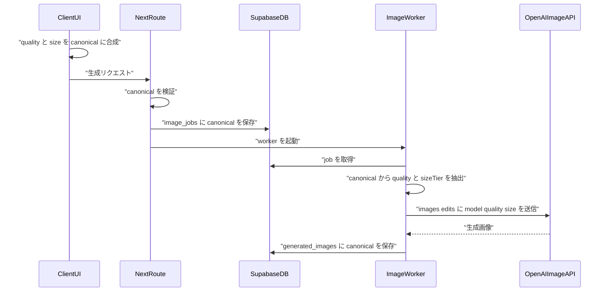
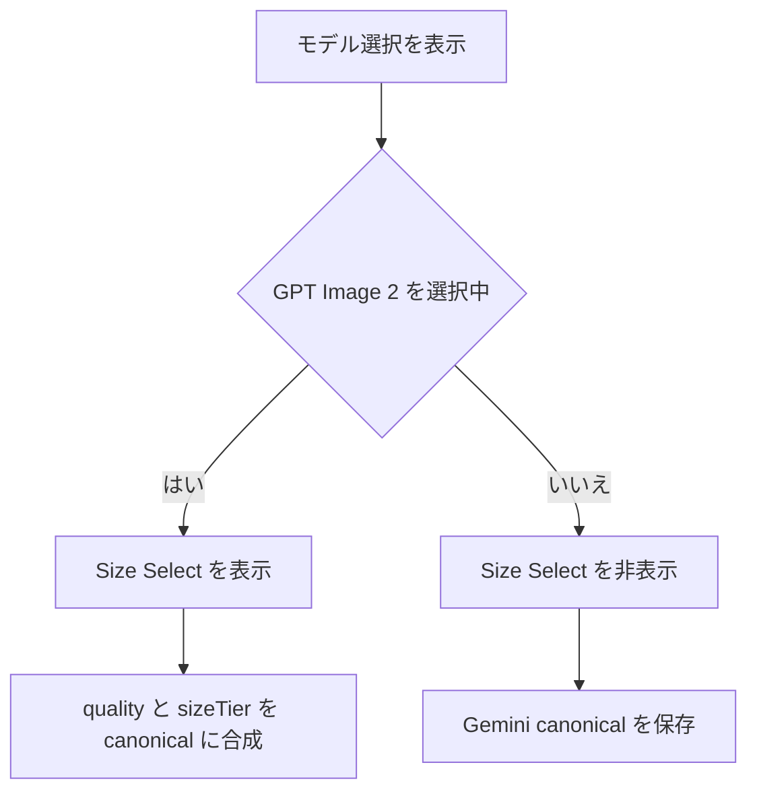
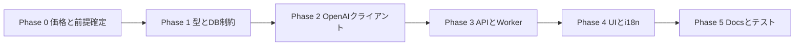

# GPT Image 2 モデル拡張 実装計画

- 作成日: `2026-05-10`
- 対象ブランチ: `feature-model`
- 目的: OpenAI `gpt-image-2` 経路を `quality` と出力サイズ tier の組み合わせに拡張する
- 参照:
  - [OpenAI GPT Image 2 model](https://developers.openai.com/api/docs/models/gpt-image-2)
  - [OpenAI Image generation guide](https://platform.openai.com/docs/guides/image-generation)
  - [OpenAI API pricing](https://platform.openai.com/docs/pricing/)
  - [docs/business/monetization.md](../business/monetization.md)

## コードベース調査結果

- 既存の canonical model は [features/generation/types.ts](../../features/generation/types.ts) の `GeminiModel` / `KNOWN_MODEL_INPUTS` / `normalizeModelName()` が正本。
- 料金は [features/generation/lib/model-config.ts](../../features/generation/lib/model-config.ts) の `MODEL_PERCOIN_COSTS` と、Edge Function 側の [supabase/functions/image-gen-worker/index.ts](../../supabase/functions/image-gen-worker/index.ts) 内 `getPercoinCost()` に重複定義がある。
- OpenAI 呼び出しは Node 版 [features/generation/lib/openai-image.ts](../../features/generation/lib/openai-image.ts) と Deno 版 [supabase/functions/image-gen-worker/openai-image.ts](../../supabase/functions/image-gen-worker/openai-image.ts) の 2 系統。どちらも `model=gpt-image-2`、`quality=low`、`size=1024x1024|1024x1536|1536x1024` が固定。
- 非同期生成 worker は [supabase/functions/image-gen-worker/index.ts](../../supabase/functions/image-gen-worker/index.ts) に model union、正規化、料金、OpenAI 分岐を重複実装しているため、Next.js 側だけの変更では不十分。
- DB は `image_jobs.model` と `generated_images.model` に CHECK 制約があり、現状は `gpt-image-2-low` のみ許可。新 canonical を保存するには migration が必須。既存 migration は [20260425120000_allow_gpt_image_2_low_model.sql](../../supabase/migrations/20260425120000_allow_gpt_image_2_low_model.sql)。
- Supabase remote 接続は `supabase migration list --linked` で確認できた。2026-05-10 時点で `20260502` 以降に local-only / remote-only migration の差分が存在するため、この機能の CHECK 制約 migration を作る前に migration 履歴の扱いを確定する必要がある。
- UI は [features/generation/components/LockableModelSelect.tsx](../../features/generation/components/LockableModelSelect.tsx) を `/coordinate`、`/style`、`/inspire` で共有。現在の Select は `value` が option value と一致する前提なので、GPT Image 2 の「quality 行」と canonical model を分離する設計が必要。
- チュートリアルは [features/tutorial/lib/tour-steps.ts](../../features/tutorial/lib/tour-steps.ts) と [features/tutorial/components/TutorialTourProvider.tsx](../../features/tutorial/components/TutorialTourProvider.tsx) で管理される。`GenerationForm` には `tour-model-select` / `tour-count-select` の `data-tour` があるが、現行 `getTourSteps()` はモデル選択・枚数選択を step に含めていない。Size selector を新しい tour step として追加する場合は、`idx === 7`、`INTERRUPTIBLE_UNTIL_INDEX`、生成開始/完了イベントの `moveNext()` 前提がズレるため同時修正が必要。
- localStorage は [features/generation/lib/form-preferences.ts](../../features/generation/lib/form-preferences.ts) の `PERSISTABLE_MODELS` で受理値を限定している。
- i18n は `messages/*.ts` 形式。`messages/ja.ts` を正本として他 locale が `DeepReplaceStrings<typeof jaMessages>` を満たすため、`ja/en` だけでなく全 locale にキー追加が必要。
- API docs は [docs/API.md](../API.md) と [docs/openapi.yaml](../openapi.yaml) が別途存在し、model enum を更新する必要がある。

## 機能概要

現在の `gpt-image-2-low` を後方互換エイリアスとして残しつつ、保存値を以下の 9 canonical に移行する。

| Quality | Size tier |
| --- | --- |
| `low` | `1k`, `2k`, `4k` |
| `medium` | `1k`, `2k`, `4k` |
| `high` | `1k`, `2k`, `4k` |

canonical 形式:

```text
gpt-image-2-{quality}-{sizeTier}
```

例: `gpt-image-2-medium-2k`

UI は既存のモデル Select に GPT Image 2 の quality 3 行を表示し、GPT Image 2 選択時のみ別の Size Select を表示する。保存値、API 入力、DB 保存値は常に 1 つの canonical 文字列にする。

販売価格は既存 Gemini 価格にできるだけ寄せ、GPT Image 2 の高品質 4K だけ原価余裕を少し上乗せする。

| Quality \ Size | 1K | 2K | 4K |
| --- | ---: | ---: | ---: |
| Low | 10 | 20 | 40 |
| Medium | 20 | 50 | 80 |
| High | 50 | 80 | 130 |

価格の意図:

- Low は現行 `gpt-image-2-low` の軽量枠を維持する。
- Medium は通常利用向けとして、Gemini Standard / Pro より選びやすい価格にする。
- High は Gemini Pro 相当に寄せ、4K のみ GPT Image 2 の高出力 token と入力 token 原価を見て 130 ペルコインにする。

## 概要図

### 生成フロー



### UI 状態



### フェーズ依存関係



## EARS 要件定義

| ID | Type | English | 日本語 |
| --- | --- | --- | --- |
| G2-001 | State-driven | While a user selects a GPT Image 2 model, the system shall store the selected quality and size tier as a single canonical model string. | ユーザーが GPT Image 2 モデルを選択している間、システムは quality と size tier を 1 つの canonical model 文字列として保存しなければならない。 |
| G2-002 | Event-driven | When the user changes the GPT Image 2 size selector, the system shall preserve the current quality and update only the size tier in the canonical model string. | ユーザーが GPT Image 2 の Size セレクタを変更したとき、システムは現在の quality を維持し、canonical model 文字列の size tier だけを更新しなければならない。 |
| G2-003 | Event-driven | When the user changes the GPT Image 2 quality row in the model selector, the system shall preserve the current size tier and update only the quality in the canonical model string. | ユーザーがモデル Select で GPT Image 2 の quality 行を変更したとき、システムは現在の size tier を維持し、canonical model 文字列の quality だけを更新しなければならない。 |
| G2-004 | State-driven | While the selected model is not GPT Image 2, the system shall hide the GPT Image 2 size selector. | 選択中モデルが GPT Image 2 ではない間、システムは GPT Image 2 の Size セレクタを表示してはならない。 |
| G2-005 | Event-driven | When a request uses a new GPT Image 2 canonical model, the system shall pass `quality` and resolved `size` to the OpenAI Images Edit API. | 新しい GPT Image 2 canonical model を使うリクエストでは、システムは `quality` と解決済み `size` を OpenAI Images Edit API に渡さなければならない。 |
| G2-006 | State-driven | While a user is unauthenticated, the system shall allow only guest-approved canonical models and reject other GPT Image 2 cells. | ユーザーが未ログインの間、システムはゲスト許可済み canonical model のみを許可し、それ以外の GPT Image 2 セルを拒否しなければならない。 |
| G2-007 | Event-driven | When an old `gpt-image-2-low` value is read from input, DB, or localStorage, the system shall normalize it to `gpt-image-2-low-1k` for new writes. | 旧 `gpt-image-2-low` 値を input、DB、localStorage から読み込んだとき、システムは新規書き込みでは `gpt-image-2-low-1k` に正規化しなければならない。 |
| G2-008 | Exceptional | If an unknown GPT Image 2 canonical model is received, then the system shall reject it in whitelist-sensitive paths and fall back only where existing fallback behavior already applies. | 未知の GPT Image 2 canonical model を受け取った場合、システムは whitelist が必要な経路では拒否し、既存の fallback 挙動がある箇所でのみ既定値に丸めなければならない。 |
| G2-009 | State-driven | While generating 4K-tier GPT Image 2 outputs, the system shall keep requested sizes within OpenAI limits and document that 4K is a pixel-budget tier, not always a 3840-pixel edge. | GPT Image 2 の 4K tier 生成中、システムは OpenAI の制約内に size を収め、4K が常に 3840px 長辺ではなくピクセル予算 tier であることを文書化しなければならない。 |
| G2-010 | Exceptional | If OpenAI rejects a selected quality or size, then the system shall surface the provider error through the existing OpenAI error handling and refund paths. | OpenAI が選択された quality または size を拒否した場合、システムは既存の OpenAI エラーハンドリングと返金経路に乗せなければならない。 |

## ADR

### ADR-001: canonical model は 1 文字列を維持する

- **Context**: DB、localStorage、API request、billing が現在 `model` 文字列を正本として扱っている。
- **Decision**: `gpt-image-2-medium-2k` のような 1 文字列を canonical とし、UI や OpenAI 呼び出し直前だけ quality / sizeTier に分解する。
- **Reason**: DB schema の変更範囲を CHECK 制約更新に留められ、既存の model-based billing / display / filter パターンを維持できる。
- **Consequence**: UI は「表示用 quality 行」と「保存用 canonical」の変換を持つ必要がある。

### ADR-002: 旧 `gpt-image-2-low` はエイリアスとして残す

- **Context**: 既存 DB、localStorage、テスト、外部 API docs に旧値が残っている。
- **Decision**: `KNOWN_MODEL_INPUTS` と worker の正規化で `gpt-image-2-low` を `gpt-image-2-low-1k` へ変換する。DB CHECK には当面旧値も残し、既存レコードを壊さない。
- **Reason**: 一括 DB 書き換えなしで後方互換を保てる。
- **Consequence**: 旧値の読み取り表示は新値として扱うが、履歴レコードの物理更新は別タスクにできる。

### ADR-003: Size tier は制約内のピクセル予算として定義する

- **Context**: OpenAI は GPT Image 2 で flexible image sizes と high-fidelity image inputs をサポートする一方、任意サイズは API 側の制約に収める必要がある。
- **Decision**: `1k/2k/4k` はユーザー向けには「標準 / 高解像度 / 最高解像度」と表示し、内部的にはピクセル予算 tier として扱う。`2k` は約 4.2MP、`4k` は約 8.3MP 以内の最大 tier とする。推奨 size は `1k=1024x1024/1024x1536/1536x1024`、`2k=2048x2048/1664x2496/2496x1664`、`4k=2880x2880/2352x3520/3520x2352`。
- **Reason**: `2048x3072` は「2K」と呼ぶには大きく、4K tier との差がユーザーに伝わりにくい。約 4MP / 約 8MP の段階にすると価格と体感差が説明しやすい。`3840x2160` は 4K UHD として自然だが、既存の portrait / landscape bucket の 2:3 系から 16:9 系へ変わる。
- **Consequence**: UI では `標準 (1K相当)`、`高解像度 (2K相当)`、`最高解像度 (4K相当・β)` のように表示し、docs では「長辺 3840 固定ではなく総ピクセル tier」と明記する。

### ADR-004: 価格は product decision とし、OpenAI 原価表は見積もり扱いにする

- **Context**: OpenAI 公式ページで確認できるのは GPT Image 2 の model support と pricing/calculator への誘導であり、2k/4k の固定 per-image 表は安定した公開仕様として扱えない。
- **Decision**: `MODEL_PERCOIN_COSTS` は Gemini 価格に近い matrix とし、`Low=10/20/40`、`Medium=20/50/80`、`High=50/80/130` を採用する。`monetization.md` では 2k/4k 原価を「為替と calculator 前提の概算」と表記し、入力画像・テキスト token の課金を除外しない。
- **Reason**: 旧案の `High 4K=350` は粗利余裕が大きすぎ、Premium ユーザーでも月 7 枚程度に制限されるため、ユーザー体験として重い。Gemini Pro の既存価格帯に寄せることで、モデル間の選択を自然にする。
- **Consequence**: High 4K の粗利は旧案より下がるが、`2880x2880` の output token と単一入力画像 token を含めても Light プラン最悪単価で約 70% の粗利を維持しやすい。multi-input で High 4K を解放する場合は 140 ペルコイン以上を再検討する。

### ADR-005: Node 版と Deno 版の差分を shared helper で減らす

- **Context**: Node と Deno の OpenAI client は別ファイルだが、model parsing、quality、size tier、target size の意味は共通。
- **Decision**: runtime 依存のない helper を `shared/generation/openai-image-model.ts` に置き、Next.js 側と Supabase Edge Function 側から参照する。FormData / fetch / File 処理は各 runtime に残す。
- **Reason**: Deno と Node の実装同期漏れを減らす。
- **Consequence**: Deno import は相対パス + `.ts`、Next.js import は alias を使う形になる。

## 実装計画

### Phase 0: 価格と仕様前提の確定

目的: 実装前に「公式仕様」と「社内価格決定」を分離する。
ビルド確認: コード変更なし。

- [ ] `docs/business/monetization.md` に、GPT Image 2 の 9 セル販売価格を product decision として追加する。
- [ ] 2k/4k 原価は OpenAI calculator / token pricing に基づく概算であり、固定 per-image 公式表ではないことを明記する。
- [ ] 入力画像 token と prompt token も edit の原価に含む前提で粗利率表を再計算、または「output cost のみの参考値」と明記する。
- [ ] Size selector の表示文言は `標準 (1K相当)` / `高解像度 (2K相当)` / `最高解像度 (4K相当・β)` とし、「画像の向きに合わせて自動調整」と補足する。
- [ ] `2k` size tier の物理解釈を `2048x2048` / `1664x2496` / `2496x1664`、`4k` を `2880x2880` / `2352x3520` / `3520x2352` で確定する。4K UHD の `3840x2160` を採る場合は ADR-003 を更新する。

### Phase 1: 型定義、shared helper、DB 制約

目的: 新 canonical model を Next.js / Edge Function / DB で保存可能にする。
ビルド確認: `npm run typecheck` が型定義更新後に通る。

- [ ] `shared/generation/openai-image-model.ts` を新規作成し、以下を定義する。
  - `GptImage2Quality = "low" | "medium" | "high"`
  - `GptImage2SizeTier = "1k" | "2k" | "4k"`
  - `GPT_IMAGE_2_CANONICAL_MODELS`
  - `isGptImage2CanonicalModel()`
  - `parseGptImage2Model()`
  - `composeGptImage2Model()`
  - `normalizeLegacyGptImage2Model()`
- [ ] [features/generation/types.ts](../../features/generation/types.ts) の `GeminiModel` に 9 canonical を追加し、`DEFAULT_GENERATION_MODEL` を `gpt-image-2-low-1k` に変更する。
- [ ] `KNOWN_MODEL_INPUTS` には 9 canonical と旧 `gpt-image-2-low` を含め、`normalizeModelName()` では旧値を新値へ正規化する。
- [ ] `GeminiOnlyModel` を `Exclude<GeminiModel, GptImage2CanonicalModel>` 相当に変更する。
- [ ] [supabase/functions/image-gen-worker/index.ts](../../supabase/functions/image-gen-worker/index.ts) の model union / normalize / cost の重複定義を同等更新する。
- [ ] 新 migration を作成し、`generated_images_model_check` と `image_jobs_model_check` に 9 canonical と旧 `gpt-image-2-low` を含める。
- [ ] `.cursor/rules/database-design.mdc` の `image_jobs.model` / `generated_images.model` 説明を更新する。

### Phase 2: OpenAI client の quality / size 対応

目的: OpenAI Images Edit API へ canonical から導出した `quality` と `size` を渡す。
ビルド確認: `tests/unit/features/generation/openai-image.test.ts` が通る。

- [ ] [features/generation/lib/openai-image.ts](../../features/generation/lib/openai-image.ts) の params に `quality` と `sizeTier` を追加する。
- [ ] [supabase/functions/image-gen-worker/openai-image.ts](../../supabase/functions/image-gen-worker/openai-image.ts) も同じ signature に更新する。
- [ ] `resolveOpenAITargetSize(input, sizeTier)` に拡張する。
  - `1k`: `1024x1024` / `1024x1536` / `1536x1024`
  - `2k`: `2048x2048` / `1664x2496` / `2496x1664`
  - `4k`: `2880x2880` / `2352x3520` / `3520x2352`
- [ ] サイズは 16 の倍数、最大エッジ、総ピクセル上限を満たすよう定数とテストで固定する。
- [ ] `callOpenAIImageEditBatch()` と multi-input 版の両方で `form.append("quality", quality)` と `form.append("size", targetSize)` を使う。
- [ ] `moderation=low`、`output_format=png`、GIF 拒否、provider error 分類は現状維持する。

### Phase 3: 呼び出し側、課金、worker 統合

目的: すべての生成経路で canonical から quality / sizeTier を渡す。
ビルド確認: `npm run typecheck` と関連 unit/integration tests が通る。

- [ ] [features/generation/lib/model-config.ts](../../features/generation/lib/model-config.ts) の `MODEL_PERCOIN_COSTS` を 9 セルへ拡張する。
  - low: `1k=10`, `2k=20`, `4k=40`
  - medium: `1k=20`, `2k=50`, `4k=80`
  - high: `1k=50`, `2k=80`, `4k=130`
- [ ] `GUEST_ALLOWED_MODELS` は既存方針を明文化して決める。
  - Gemini kill switch 無効時も考慮するなら base は `gpt-image-2-low-1k` と Gemini 0.5K。
  - OpenAI だけに絞るなら EARS と `docs/API.md` の guest 記述も更新する。
- [ ] `INSPIRE_ALLOWED_MODELS` は 1k 全 quality + 2k/4k の Low/Medium など、運用コストに応じて product decision として確定する。
- [ ] `INSPIRE_PREVIEW_MODELS` は `gpt-image-2-low-1k` に固定する。
- [ ] [features/generation/lib/guest-generate.ts](../../features/generation/lib/guest-generate.ts) で OpenAI 呼び出し前に `parseGptImage2Model()` を使い、`quality` / `sizeTier` を渡す。
- [ ] [app/(app)/style/generate/handler.ts](../../app/(app)/style/generate/handler.ts) の guest sync 経路も同様に更新する。
- [ ] [app/api/generate-async/handler.ts](../../app/api/generate-async/handler.ts) と [app/(app)/style/generate-async/handler.ts](../../app/(app)/style/generate-async/handler.ts) は model validation / balance check が新 canonical を扱えるようにする。
- [ ] [app/api/style-templates/preview-generation/handler.ts](../../app/api/style-templates/preview-generation/handler.ts) は preview 固定値として `low/1k` を明示する。
- [ ] [supabase/functions/image-gen-worker/index.ts](../../supabase/functions/image-gen-worker/index.ts) の OpenAI 分岐で `dbModel` から `quality` / `sizeTier` を抽出し、single / multi-input 両方に渡す。
- [ ] worker の fallback が旧 `gemini-2.5-flash-image` になっている箇所を、Next.js 側の default と矛盾しないよう見直す。ただし履歴互換の影響をテストで確認する。
- [ ] OpenAI の rate limit を吸収するため、OpenAI HTTP 429 / 5xx を retryable provider error として分類し、`Retry-After` があれば尊重する。少なくとも 429 で即時最終失敗・返金にならないことを確認する。
- [ ] OpenAI Tier 1 の IPM が低いため、`MAX_MESSAGES=20` と route からの即時 worker invoke が同時に OpenAI request を増やしすぎないよう、OpenAI 経路の処理数・再試行間隔・`n` の扱いを確認する。

### Phase 4: UI、localStorage、i18n

目的: ユーザーが quality と size tier を自然に選べる UI にする。
ビルド確認: `npm run test -- tests/unit/features/generation/lockable-model-select.test.tsx tests/unit/features/style/style-page-client.test.tsx` が通る。

- [ ] [features/generation/components/LockableModelSelect.tsx](../../features/generation/components/LockableModelSelect.tsx) の `MODEL_OPTIONS` を Gemini 5 行 + GPT Image 2 quality 3 行にする。
- [ ] Select の表示値は canonical ではなく表示用 model family / quality として扱う。GPT Image 2 選択時は `parseGptImage2Model(value).quality` を表示行へ変換する。
- [ ] `GptImage2SizeSelector.tsx` を新規作成し、GPT Image 2 選択中のみ表示する。
- [ ] [features/generation/components/GenerationForm.tsx](../../features/generation/components/GenerationForm.tsx)、[features/style/components/StylePageClient.tsx](../../features/style/components/StylePageClient.tsx)、[features/inspire/components/InspirePageClient.tsx](../../features/inspire/components/InspirePageClient.tsx) に Size selector を組み込む。
- [ ] `/coordinate` のチュートリアルには Size selector 専用 step を追加する。追加時は [features/tutorial/lib/tour-steps.ts](../../features/tutorial/lib/tour-steps.ts) の step 配列と [features/tutorial/components/TutorialTourProvider.tsx](../../features/tutorial/components/TutorialTourProvider.tsx) の index 固定ロジックを同じ PR で更新する。
- [ ] Size selector 追加後、`tour-generate-btn` へのスクロール、生成開始後の `tour-generating` 進行、生成完了後の `tour-first-image` 進行が崩れないことを desktop / mobile で確認する。
- [ ] Size 変更時は `composeGptImage2Model(currentQuality, nextSizeTier)` で canonical を再合成し、`writePreferredModel()` へ渡す。
- [ ] [features/generation/lib/form-preferences.ts](../../features/generation/lib/form-preferences.ts) の `PERSISTABLE_MODELS` に 9 canonical を追加し、旧 `gpt-image-2-low` 読み取り時は `gpt-image-2-low-1k` に書き戻す。
- [ ] [features/generation/lib/model-display.ts](../../features/generation/lib/model-display.ts) に 9 canonical の display info と default size を追加する。
- [ ] `messages/ja.ts` を正本として、`modelGptImage2Low` / `Medium` / `High`、`gptImage2SizeLabel`、`gptImage2Size1k` / `2k` / `4k` を追加する。
- [ ] `messages/en.ts` と他 locale すべてを更新し、`DeepReplaceStrings<typeof jaMessages>` を満たす。

### Phase 5: Docs、テスト、検証

目的: API 契約、ビジネス文書、テストを新仕様に揃える。
ビルド確認: CLAUDE.md の検証コマンドがすべて通る。

- [ ] [docs/API.md](../API.md) の `/api/generate-async` と `/api/coordinate-generate-guest` の model enum / 補足を更新する。
- [ ] [docs/openapi.yaml](../openapi.yaml) の schema enum と default を更新する。
- [ ] [docs/business/monetization.md](../business/monetization.md) に GPT Image 2 料金表、原価前提、再評価運用を追記する。
- [ ] `tests/unit/features/generation/types.test.ts` を 9 canonical、旧 alias、default 変更に対応させる。
- [ ] `tests/unit/features/generation/model-config.test.ts` と `inspire-model-config.test.ts` を料金 matrix と whitelist に対応させる。
- [ ] `tests/unit/features/generation/openai-image.test.ts` に `quality` / `sizeTier` / `FormData` / target size のケースを追加する。
- [ ] `tests/unit/features/generation/form-preferences.test.ts` に旧 localStorage 値の migration を追加する。
- [ ] `tests/unit/features/generation/lockable-model-select*.test.tsx` に quality 行、lock 表示、Size selector 表示条件を追加する。
- [ ] `tests/unit/features/generation/generation-form.test.tsx` と tutorial 関連テストで、Size selector 追加後も `tutorial:advance-to-next`、`tutorial:generation-complete`、`tour-generate-btn` 周辺の flow が維持されることを確認する。
- [ ] `tests/integration/api/coordinate-generate-guest-route.test.ts`、`generate-async-route.test.ts`、`style-generate-route.test.ts`、`style-generate-async-route.test.ts` を新 canonical と旧 alias 互換に更新する。
- [ ] `tests/characterization/api/generate-async-route.char.test.ts` を新 canonical の課金 metadata に合わせる。
- [ ] 検証コマンド:
  - `npm run lint`
  - `npm run typecheck`
  - `npm run test`
  - `npm run build -- --webpack`

## 修正対象ファイル一覧

| ファイル | 操作 | 変更内容 |
| --- | --- | --- |
| `shared/generation/openai-image-model.ts` | 新規 | GPT Image 2 canonical、quality、size tier helper |
| `features/generation/types.ts` | 修正 | 9 canonical、旧 alias、default、GeminiOnlyModel 更新 |
| `features/generation/lib/model-config.ts` | 修正 | 料金 matrix、guest/inspire whitelist 更新 |
| `features/generation/lib/openai-image.ts` | 修正 | quality / sizeTier 引数化、target size 拡張 |
| `supabase/functions/image-gen-worker/openai-image.ts` | 修正 | Deno 版 OpenAI client 同期 |
| `supabase/functions/image-gen-worker/index.ts` | 修正 | model union、normalize、cost、OpenAI 呼び出し更新 |
| `supabase/migrations/YYYYMMDDHHMMSS_extend_gpt_image_2_models.sql` | 新規 | `image_jobs` / `generated_images` model CHECK 更新 |
| `.cursor/rules/database-design.mdc` | 修正 | model 許可値の台帳更新 |
| `features/generation/lib/guest-generate.ts` | 修正 | OpenAI 呼び出しへ quality / sizeTier 渡し |
| `app/api/generate-async/handler.ts` | 修正 | validation / cost / default 新 canonical 対応 |
| `app/(app)/style/generate/handler.ts` | 修正 | guest sync 新 canonical 対応 |
| `app/(app)/style/generate-async/handler.ts` | 修正 | style async 新 canonical 対応 |
| `app/api/style-templates/preview-generation/handler.ts` | 修正 | preview 固定 `low/1k` 明示 |
| `features/generation/components/LockableModelSelect.tsx` | 修正 | GPT Image 2 quality 3 行追加 |
| `features/generation/components/GptImage2SizeSelector.tsx` | 新規 | GPT Image 2 専用 size selector |
| `features/generation/components/GenerationForm.tsx` | 修正 | Size selector 組み込み |
| `features/tutorial/lib/tour-steps.ts` | 確認/必要なら修正 | Size selector を tour step に入れる場合の step 配列更新 |
| `features/tutorial/components/TutorialTourProvider.tsx` | 確認/必要なら修正 | step index 固定ロジック、生成開始/完了イベント進行の確認 |
| `features/style/components/StylePageClient.tsx` | 修正 | Size selector 組み込み |
| `features/inspire/components/InspirePageClient.tsx` | 修正 | Size selector 組み込み |
| `features/generation/lib/form-preferences.ts` | 修正 | localStorage migration / persistable models |
| `features/generation/lib/model-display.ts` | 修正 | 表示名と default size 更新 |
| `messages/*.ts` | 修正 | 全 locale に翻訳キー追加 |
| `docs/business/monetization.md` | 修正 | GPT Image 2 料金と原価前提 |
| `docs/API.md` | 修正 | API 契約更新 |
| `docs/openapi.yaml` | 修正 | OpenAPI enum / default 更新 |
| `tests/**` | 修正 | model 名、課金、UI、OpenAI client テスト更新 |

## 品質・テスト観点

### 品質チェックリスト

- [ ] OpenAI へ送る `quality` は canonical 由来で、ユーザー入力文字列をそのまま FormData に入れない。
- [ ] OpenAI へ送る `size` は定数表からのみ選ぶ。
- [ ] 旧 `gpt-image-2-low` は API input と localStorage で受理され、新規保存では `gpt-image-2-low-1k` へ正規化される。
- [ ] DB CHECK 制約は既存履歴値を壊さない。
- [ ] ゲスト経路は許可外 GPT Image 2 セルを 400 で拒否する。
- [ ] Worker 側の課金額と Next.js route の事前残高チェック額が一致する。
- [ ] OpenAI provider error / no image / timeout / safety blocked の既存返金・試行 release 経路が維持される。
- [ ] `requested_image_count` との掛け算が OpenAI batch でのみ適用される。
- [ ] Gemini kill switch 有効時の `AVAILABLE_MODEL_OPTIONS` が想定通りになる。
- [ ] 全 locale が `DeepReplaceStrings<typeof jaMessages>` を満たす。
- [ ] Size selector 追加後も `/coordinate` チュートリアルの step 進行、スクロール位置、生成ボタン押下後の自動進行が崩れない。

### テスト観点

| カテゴリ | テスト内容 |
| --- | --- |
| 型・正規化 | 9 canonical、旧 alias、未知値、default の normalize |
| 料金 | 9 セルの `MODEL_PERCOIN_COSTS`、worker 側 `getPercoinCost()`、batch count 掛け算 |
| OpenAI client | `quality` / `size` / `n` が FormData に乗ること、1k/2k/4k target size |
| Guest API | `gpt-image-2-low-1k` 成功、旧 `gpt-image-2-low` 互換、2k/4k/medium/high 拒否 |
| Async API | 新 canonical が `image_jobs.model` に保存され、残高不足が新料金で判定される |
| Worker | OpenAI single / multi-input が canonical から quality / sizeTier を抽出する |
| UI | GPT Image 2 選択時だけ Size selector 表示、quality 変更で size 維持、size 変更で quality 維持 |
| Tutorial | Size selector 追加後も `getTourSteps()` の step 数と `TutorialTourProvider` の index 依存処理が一致し、生成開始/完了イベントで正しい step に進む |
| localStorage | 旧値の読み取り migration、新値の永続化、未知値 fallback |
| i18n | `ja` と `en` の key path 一致、他 locale の型整合 |
| Docs | API docs と OpenAPI enum が code の `KNOWN_MODEL_INPUTS` と一致 |

## ロールバック方針

- **コードロールバック**: 9 canonical 対応を revert しても、DB CHECK が旧値を許可していれば既存 `gpt-image-2-low` 運用へ戻せる。
- **DB ロールバック**: CHECK 制約から新 9 canonical を外す前に、新値が `image_jobs` / `generated_images` に存在しないことを確認する。存在する場合は旧値へ変換する migration が必要。
- **機能縮退**: UI から Medium / High / 2k / 4k を外し、`GUEST_ALLOWED_MODELS` と `INSPIRE_ALLOWED_MODELS` を `gpt-image-2-low-1k` のみに絞れば OpenAI API client の拡張は残したまま縮退できる。
- **外部仕様変更時**: OpenAI が任意 size を拒否した場合、`GPT_IMAGE_2_TARGET_SIZES` の 2k/4k を無効化し、該当 canonical を `isModelAvailableForGeneration()` で false にする。
- **価格改定時**: `MODEL_PERCOIN_COSTS`、worker 側 cost、`monetization.md` を同一 PR で更新する。

## 整合性チェック

- **図とスキーマ**: 状態遷移は追加しない。DB 変更は `model` CHECK 制約のみ。
- **認証モデル**: guest は既存 guest sync whitelist、authenticated は既存 async route + worker 課金を維持。
- **データフェッチ**: 新しい API route は追加しない。既存 route handler と worker に model handling を追加する。
- **イベント網羅性**: 新規 analytics event は追加しない。既存 generation job lifecycle を利用する。
- **APIパラメータ安全性**: `quality` / `sizeTier` は request body で別送せず、canonical model からサーバー側で導出する。
- **ビジネスルールのDB層強制**: model 許可値は DB CHECK 制約でも強制する。

## 使用スキル

| スキル | 用途 | フェーズ |
| --- | --- | --- |
| `implementation-planning` | EARS、ADR、フェーズ計画作成 | 計画作成 |
| `project-database-context` | DB 制約、migration、RLS/RPC 方針確認 | Phase 1 |
| `openai-docs` | OpenAI 公式仕様・価格ページ確認 | Phase 0 / Phase 2 |
| `codex-webpack-build` | webpack build 検証方針 | Phase 5 |
