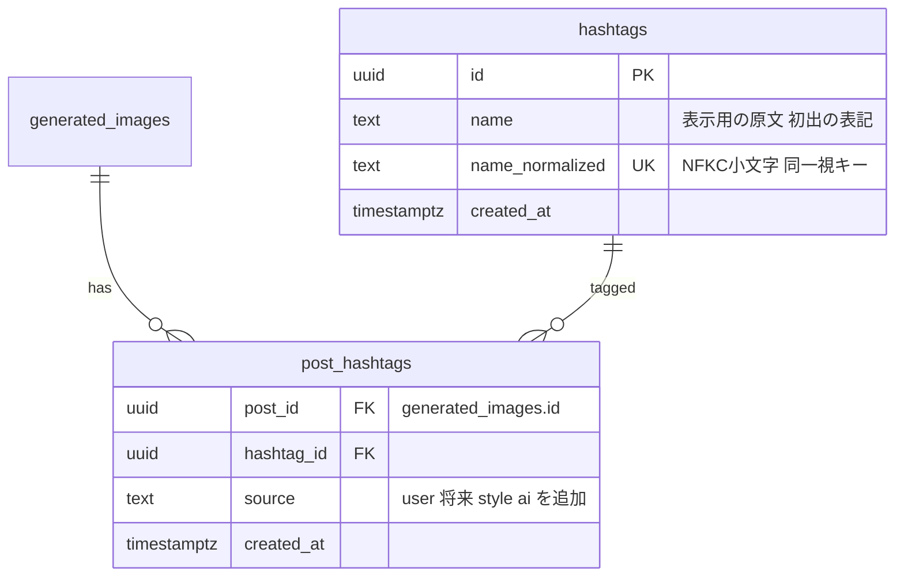
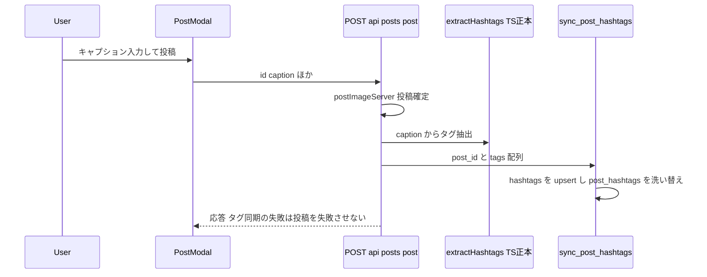
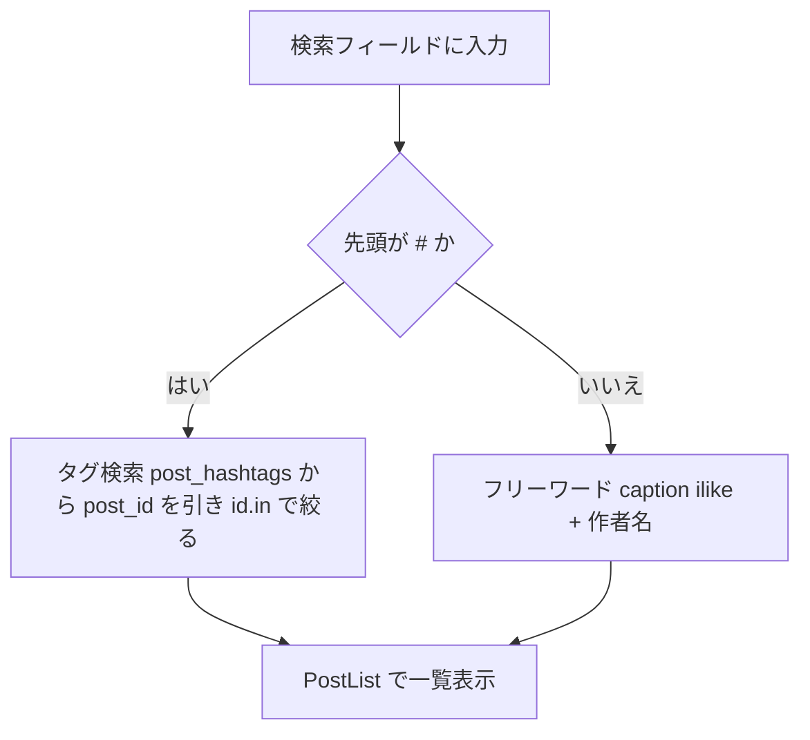
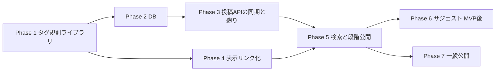

# ハッシュタグと統合検索の実装計画書

作成: 2026-08-28。対象は「説明欄のハッシュタグ化」と「検索の段階公開」。

## 背景と決定事項（ヒアリング済み）

- MVP は**ユーザーが書いたハッシュタグのみ**。AI による自動タグ付け（スタイル由来・画像由来）は**入れない**が、後から足せる器にする
- 検索は**段階公開**する。まず運営権限のみで確認し、問題なければ一般公開（/use-prompts の isAdminViewer 方式と同じ）
- 検索フィールドは X と同じ**統合型**: `#〜` ならタグ検索、それ以外はフリーワード（caption + 作者名。実装済み・#566 でループ修正済み）
- ハッシュタグのリンク先は専用ページではなく `/search?q=%23タグ`（検索を公開する以上、ページを分けない）
- 過去投稿からの遡り抽出を行う（実測: `#` を含む公開キャプションは 1 件のみ。処理は軽い）
- 投稿時のタグ候補（サジェスト）は**計画に含めるが最初のフェーズにしない**。表記ゆれ対策として MVP 直後に足す

### タグの規則（X の実機検証で確定。テストケースの正本）

| 入力 | 結果 |
|---|---|
| `#冬服_みきふく` | 1つのタグ（`_` はタグの一部） |
| `#冬服#みきふく` | **タグなし**（`#` が続くと前のタグごと無効） |
| `#冬服 #みきふく` | 2つのタグ |
| `#冬服、かわいい` | タグ「冬服」（使える文字以外はすべて終端） |
| `#AI` と `#ai` | **同じタグ**（大文字小文字を区別しない。X のサジェスト実測） |

- 使える文字: ひらがな・カタカナ・漢字・英数字・`_`・長音「ー」
- 開始: `#`（全角 `＃` も可）の直前がタグ文字でも `#` でもないこと
- 正規化: NFKC + 小文字化した `name_normalized` で同一視。表示は書かれた原文
- 日本語のゆれ（`#冬服` と `#ふゆふく`）は別タグのまま（サジェストで自然収束を狙う）

## コードベース調査結果（2026-08-28）

| 領域 | 現状 | 主要ファイル |
|---|---|---|
| キャプション表示 | **全箇所が `lib/linkify` を通る**（URL 自動リンク化のトークナイザ）。フィードは `FeedCaption`、詳細は `CollapsibleText linkify` | `lib/linkify.tsx`, `features/posts/components/FeedCaption.tsx`, `CollapsibleText.tsx` |
| フリーワード検索 | 実装済み（caption ilike + nickname → user_id.in）。無限ループは #566 で修正済み | `features/posts/lib/search-filters.ts`, `server-api.ts:381` |
| 検索の入口 | 閉じている。`SEARCH_ENABLED = false`（クライアント定数）と `/search` の redirect | `features/posts/components/StickyHeader.tsx:46`, `app/search/page.tsx` |
| 検索 index | caption / nickname の trigram index 導入済み（`pg_trgm` は extensions スキーマ） | `20260729170000_add_search_indexes.sql` |
| 投稿 API | `POST /api/posts/post` → `postImageServer`。編集は `PUT /api/posts/update` | `app/api/posts/post/route.ts`, `update/route.ts` |
| 段階公開の前例 | `isAdminViewer(user?.id)` でサーバー側ゲート | `lib/env.ts:351`, `app/use-prompts/page.tsx` |
| RPC 方針 | 複数テーブル跨り・冪等が必要な処理は RPC に寄せる | `docs/architecture/data.ja.md` |
| 投稿の规模 | 公開 visible 1,459 件 / caption あり 801 件 / `#` 含み 1 件 | 本番実測 |

## 概要図

### データモデル

### 投稿時のタグ同期

### 検索の分岐

## ユーザーストーリー

### ① タグを付けて投稿する人

冬服のコーデができたので、キャプションに書く。

> うちの子の冬コーデ☃️ #冬服 #ニット

入力欄では普通の文字のまま（MVP では入力中の装飾はしない）。投稿すると、
フィードのキャプションで **#冬服 と #ニット だけが青いリンク**になっている。
自分の投稿にタグが付いた、と一目で分かる。

`#冬服#ニット` と続けて書いてしまった場合はどちらもリンクにならない。
X と同じ挙動なので「あ、スペースが要るんだった」で通じる。

### ② タグから作品を探す人（この機能の本命）

ホームを眺めていて、誰かの投稿の **#冬服** が目に入る。
「冬服って他にどんなのがあるんだろう」とタップすると、
#冬服 の付いた作品だけが並ぶ一覧に移動する。

気に入った作品が Free Style なら、そこから「フォローして生成する」へ
つながる。**タグが、プロンプト利用の入口にもなる。**

### ③ 検索フィールドから探す人

検索バーに「星空」と入れると、キャプションに星空を含む作品と、
名前に星空を含む作者が出る（フリーワード検索）。
「#星空」と入れると、タグ #星空 の付いた作品だけに絞られる。

X と同じ使い分けなので、説明は要らない。

### ④ 段階公開中の一般ユーザー（何も変わらない人）

検索バーは出ない。キャプションの #冬服 も**ただの文字**のまま。
リンクだけ見えて押したら 404、という中途半端な状態には決してならない。

運営が確認を終えてフラグを倒した日から、③の体験がそのまま届く。

### ⑤ タグ検索で自分の投稿が「出ない」人（守られる人）

投稿を取り消した、または公開停止になった作品は、タグ検索の結果からも
消えている。タグの行が残っていても、検索側の可視性フィルタが効く。
「取り消したのにタグから辿れる」は起きない。

## EARS 要件

- REQ-01: When 投稿またはキャプション編集が成立したとき, the system shall キャプションからタグを抽出し `post_hashtags` を洗い替える（When a post is created or its caption is edited, the system shall re-sync extracted hashtags）
- REQ-02: If タグ同期に失敗したとき, then the system shall 投稿自体は成功させ、エラーはログに残す（非致命）
- REQ-03: While キャプションを表示しているとき, the system shall `#タグ` をリンクとして描画し、タップで `/search?q=%23タグ` へ遷移させる
- REQ-04: When 検索クエリが `#` で始まるとき, the system shall `name_normalized` の完全一致でタグ検索する
- REQ-05: When 検索クエリが `#` で始まらないとき, the system shall 既存のフリーワード検索（caption + 作者名）を行う
- REQ-06: While 段階公開中, the system shall 検索の入口（ヘッダーの検索バーと `/search`）を運営権限のみに表示する。一般ユーザーには従来どおり閉じたまま
- REQ-07: 権限: `hashtags` / `post_hashtags` は誰でも読める（公開投稿の派生情報のため）。書き込みは service_role の RPC のみ。クライアント直書き不可
- REQ-08: If 投稿が非公開・削除・公開停止になったとき, then タグ検索の結果に**出ない**こと（既存の可視性フィルタが効く設計にする。post_hashtags の行削除には依存しない）
- REQ-09: タグ抽出の規則は TS の 1 箇所を正本とし、表示リンク化と抽出が同じ関数を使う

## ADR

### ADR-001: タグは正規化テーブル 2 本（hashtags + post_hashtags）

- Context: キャプションから毎回抽出する案もあった
- Decision: 投稿時に抽出して保存する。`hashtags`（名寄せ）+ `post_hashtags`（関連）
- Reason: タグ検索のたびに全キャプション走査は規模とともに破綻する。サジェスト（使用回数順）にも集計が要る。`source` 列で将来の AI/スタイル由来タグを同じ器に入れる
- Consequence: キャプション編集時の再同期が必要（REQ-01 でカバー）。usage_count の実体化は見送り、`count(*)` を都度取る（1,500 件規模では十分）

### ADR-002: 抽出規則の正本は TypeScript、書き込みは RPC

- Context: リポジトリ方針は「複数テーブル跨りは RPC」。しかし抽出規則を SQL に書き写すと表示側（linkify）とズレる
- Decision: 抽出・リンク化は TS の `lib/hashtag.ts` に集約。API がタグ配列まで作り、RPC `sync_post_hashtags(post_id, tags[])` が原子的に洗い替える
- Reason: 規則の二重管理を避ける（`#冬服#` 無効などの細則は正規表現1本に閉じる）。原子性は RPC が担保
- Consequence: RPC 単体ではタグの妥当性を検証しない（長さ・件数上限のみ検証）。呼び出し元は service_role のみ

### ADR-003: リンク先は /search に統一（専用ページを作らない）

- Context: 当初 `/tags/[tag]` 案があった
- Decision: `/search?q=%23タグ` に飛ばす
- Reason: 検索を公開する以上、入口を分けると「タグは動くのに検索は閉じている」という不整合が消え、ページも 1 枚減る
- Consequence: 検索の段階公開が終わるまで、一般ユーザーにはタグリンクを**表示しない**（リンクだけ出て 404 は最悪の体験）。表示も同じフラグでゲートする

### ADR-004: 段階公開はサーバー判定を props で配る

- Context: `SEARCH_ENABLED` はクライアント定数。admin 判定（env の ID リスト）はサーバー秘匿
- Decision: サーバーレイアウト/ページで `isAdminViewer` を判定し、`searchEnabled` として StickyHeader / キャプション表示へ props で渡す。一般公開時はこの値を全員 true にする（env フラグ）
- Consequence: props の通り道が数ファイルに渡る。実装時にレイアウト構成を確認して最短経路を選ぶ（Phase 4 の最初の TODO）

## 実装フェーズ

### Phase 1: タグ規則ライブラリ（正本）
目的: 抽出・リンク化が共有する規則を 1 箇所に確定する
ビルド確認: 新規 lib のみ。既存に触れない

- [ ] `lib/hashtag.ts` — `extractHashtags(text)` と `tokenizeWithHashtags(text)`（`lib/linkify.tsx` のトークン形式に合わせる）
- [ ] 正規化 `normalizeHashtag`（NFKC + toLowerCase）
- [ ] X 実測 5 例（上表）を必須テストケースにする。特に「`#` が続くと前のタグごと無効」
- [ ] 上限を決める: タグ長 50 文字・1 投稿 10 個まで（超過は無視。エラーにしない）

### Phase 2: DB
目的: 保存の器。既存 `20260813100000_add_post_bonus_by_generation_type.sql` の RLS/GRANT パターンを参考
ビルド確認: migration のみ。アプリは未参照

- [ ] `hashtags` / `post_hashtags` テーブル + unique 制約（name_normalized / post_id×hashtag_id）
- [ ] RLS: SELECT は anon/authenticated に許可、書き込みポリシーなし（service_role のみ）
- [ ] RPC `sync_post_hashtags(p_post_id uuid, p_tags text[])` — hashtags upsert + post_hashtags 洗い替え。SECURITY DEFINER、GRANT は service_role のみ
- [ ] index: `post_hashtags(hashtag_id, post_id)`（タグ→投稿の逆引き）
- [ ] 本番適用前に Supabase Preview で検証（マイグレーションは main マージで自動適用されない。手動 `supabase db push`）

### Phase 3: 投稿 API の同期と遡り
目的: 新規投稿・編集でタグが貯まる
ビルド確認: lint / typecheck / test / build

- [ ] `POST /api/posts/post` に同期を追加（`grantDailyPostBonus` と同じ「失敗しても投稿は成功」パターン。`app/api/posts/post/route.ts:157` 参考）
- [ ] `PUT /api/posts/update`（キャプション編集）にも同じ同期
- [ ] 遡りスクリプト: 公開 visible の caption 全件に `extractHashtags` → `sync_post_hashtags`（実測 1 件だが全件を通す。以後の運用にも使える）
- [ ] 投稿取消/削除時は触らない（REQ-08: 検索側の可視性フィルタで消えるため）

### Phase 4: 表示リンク化
目的: キャプションの `#タグ` がリンクになる
ビルド確認: lint / typecheck / test / build

- [ ] props の通り道を確認（ADR-004。`searchEnabled` をどこから渡すか）
- [ ] `lib/linkify.tsx` にハッシュタグトークンを追加（`tokenizeWithHashtags` を利用）。`FeedCaption` と `CollapsibleText` の両方に効くことを確認
- [ ] `searchEnabled=false` のときはリンク化しない（プレーン表示。リンクだけ出て 404 を防ぐ）
- [ ] リンクは `next/link` で `/search?q=%23タグ`。フィードカード内はカード遷移と競合しないよう `stopPropagation`（`FeedCaption` の既存作法に合わせる）

### Phase 5: 検索と段階公開
目的: 運営だけが統合検索を使える状態
ビルド確認: lint / typecheck / test / build + 実機（運営アカウント / 一般アカウントの両方）

- [ ] `search-filters.ts` に `#` 分岐: タグなら `post_hashtags` から post_id を引いて `id.in.(...)`（`matchedAuthorIds` と同型。上限も同様に設ける）
- [ ] `app/search/page.tsx` の redirect を「一般のみ」に変更（運営は旧ページを表示。c1fc058^ から復元）
- [ ] `StickyHeader` の `SEARCH_ENABLED` を props 化（サーバー判定を受ける）
- [ ] sitemap は一般公開まで `/search` を載せない（現状のまま）
- [ ] 実機確認: 運営=検索バー表示・タグ検索・フリーワード検索 / 一般=従来どおり何も見えない

### Phase 6: 投稿時サジェスト（MVP 後。別 PR）
目的: 表記ゆれの自然収束

- [ ] `GET /api/hashtags/suggest?prefix=` — name_normalized 前方一致、使用回数順、上位 8 件
- [ ] `PostModal` のキャプション欄で `#` 入力中に候補表示
- [ ] 表示は原文表記（`#AI` と入力しても既存タグ `#ai` を候補に出す）

### Phase 7: 一般公開
目的: フラグを倒すだけで公開できる状態から、実際に公開する

- [ ] 運営確認の結果を受けて判断
- [ ] `searchEnabled` を全員 true に（env フラグ 1 つ）
- [ ] sitemap へ `/search` を戻す・検索メモリ（persta-search-disabled）の更新

## 修正対象ファイル一覧

| ファイル | 操作 | 変更内容 |
|---|---|---|
| `lib/hashtag.ts` | 新規 | 抽出・正規化・トークナイズ（規則の正本） |
| `supabase/migrations/xxx_add_hashtags.sql` | 新規 | テーブル 2 本 + RLS + sync RPC + index |
| `app/api/posts/post/route.ts` | 修正 | 投稿後にタグ同期（非致命） |
| `app/api/posts/update/route.ts` | 修正 | 編集後にタグ同期 |
| `scripts/backfill-hashtags.ts`（相当） | 新規 | 遡り抽出 |
| `lib/linkify.tsx` | 修正 | ハッシュタグトークン追加 |
| `features/posts/components/FeedCaption.tsx` | 修正 | タグリンク描画 + searchEnabled |
| `features/posts/components/CollapsibleText.tsx` | 修正 | 同上 |
| `features/posts/lib/search-filters.ts` | 修正 | `#` 分岐 |
| `features/posts/lib/server-api.ts` | 修正 | タグ→post_id 解決 |
| `app/search/page.tsx` | 修正 | 運営のみ表示（redirect を条件付きに） |
| `features/posts/components/StickyHeader.tsx` | 修正 | SEARCH_ENABLED の props 化 |
| `messages/ja.ts` ほか全ロケール | 修正 | 文言（必要分） |
| `tests/unit/lib/hashtag.test.ts` ほか | 新規 | X 実測 5 例を含む |

## 品質・テスト観点

- [ ] X 実測 5 例がすべてテストで固定されている（特に `#冬服#みきふく` → タグなし）
- [ ] タグ同期失敗で投稿が失敗しない（REQ-02）
- [ ] 非公開・削除・公開停止の投稿がタグ検索に出ない（REQ-08）
- [ ] 一般ユーザーに検索バー・タグリンクが一切見えない（段階公開中）
- [ ] RLS: クライアントから post_hashtags へ INSERT できない
- [ ] 全ロケールの文言が揃っている（postSuccessViewAction のとき 14 言語必須だった）

## ロールバック方針

- migration は追加のみ（既存テーブル無変更）。テーブル 2 本と RPC の DROP で完全に戻せる
- 表示・検索は `searchEnabled` フラグで一般ユーザーから隔離されており、公開前の revert はユーザー影響ゼロ
- タグ同期は非致命設計のため、RPC を落としても投稿機能は無傷

## 使用スキル

| スキル | 用途 | フェーズ |
|---|---|---|
| `/git-create-branch` | ブランチ作成 | 各 Phase |
| `/test-flow` 系 | テスト整備 | Phase 1, 3, 5 |
| `/git-create-pr` | PR 作成 | 各 Phase |

## 未決事項

1. サジェスト（Phase 6）の発火 UI 詳細（カーソル追従かフッター固定か）は実装時に決める
2. 一般公開（Phase 7)の判断基準は運営確認の結果次第
