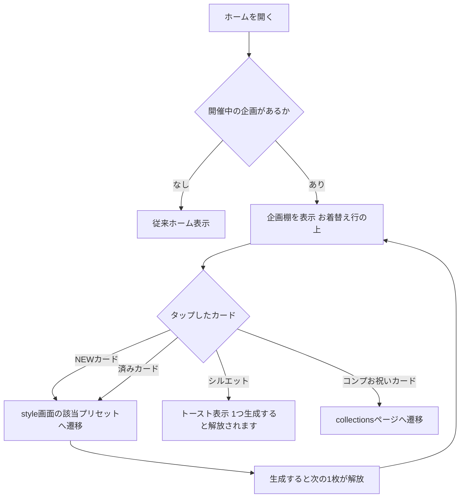
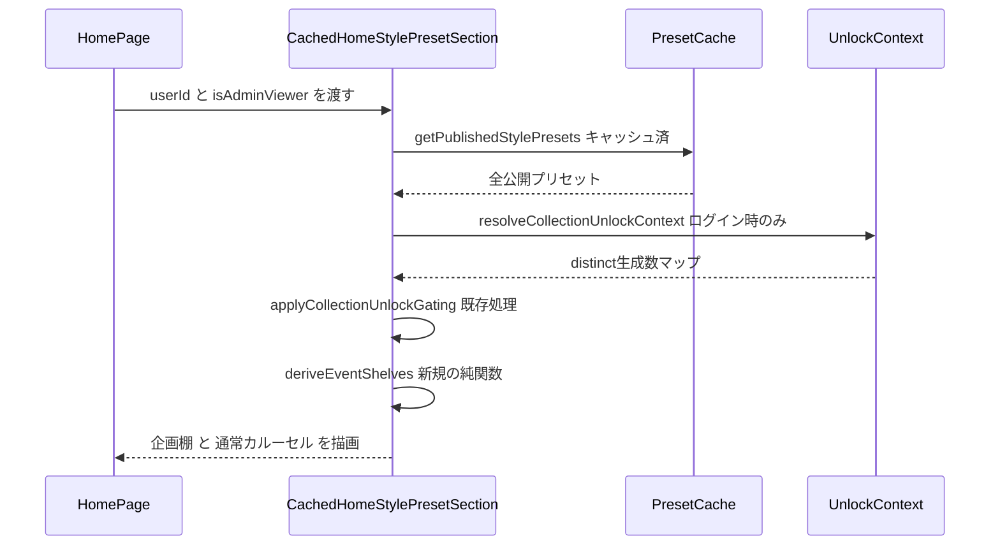
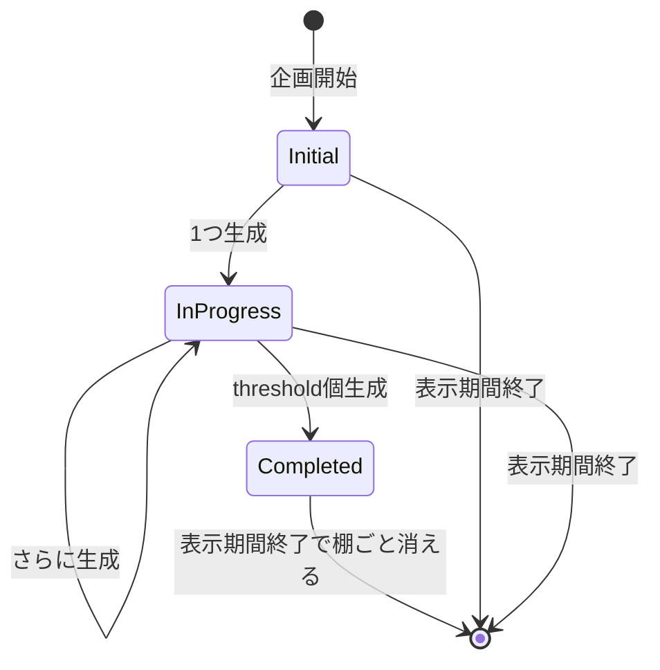
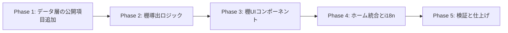

# ホーム「開催中の企画」棚（イベント棚）実装計画書

作成日: 2026-07-11
モック: https://claude.ai/code/artifact/a603d5d0-f184-4e6a-a0d3-7a64722f5f61
関連検討メモ: メモリ `persta-home-discovery-revamp`

## ゴール

ホームの「プロンプトなしでお着替え！」カルーセルの**上**に、開催中のコレクション企画（例: イタリア旅行）専用の横スクロール棚を追加し、企画スタイルの発見性と参加率を高める。

## 確定済みの設計判断（ヒアリング結果）

- 配置: お着替え行の**上**。非開催時は棚ごと非表示（従来ホームに戻る）
- 並び順: **NEW（今生成できる）→ シルエット（次の1枚のみ）→ ✓済み（生成済み・薄め表示）**
- シルエットの見せ方: `/style` の現行 `dripLocked` 表示（黒つぶし+🔒+「あとでとうじょう」ラベル）を**そのまま流用**。次の1枚だけ見せ、その先は出さない（ネタバレ防止方針を踏襲）
- 解放は日付ではなく**ユーザー進捗ベース**（1つ生成すると次が解放。`sequential_unlock` の既存挙動）
- シルエットタップ → 「1つ生成すると解放されます」トースト
- 見出しに進捗カウンター（例: 2/9）、開催終了間際は赤いカウントダウンバッジ（余裕がある間はグレー）
- 全コンプ後: 先頭に🎉お祝いカード（/collections へのリンク）
- 未ログイン: 生成数0の初日状態（表紙NEW+シルエット）で表示。生成時のログイン誘導は既存 `/style` の仕組みに任せる
- 複数企画同時開催: 企画ごとに棚を複数行表示
- 「すべて見る」リンクは**付けない**
- データモデル: **既存コレクション（`preset_categories.is_collection_series=true`）を流用。新テーブル・マイグレーション不要**

## コードベース調査結果

| 対象 | ファイル | 発見事項 |
|------|----------|----------|
| ホーム構成 | `app/[locale]/page.tsx` | セクションごとに Suspense + Cached*Section の合成。`getUser()` / `isAdminViewer` はページ側で解決して props 渡し |
| Style行 | `features/home/components/CachedHomeStylePresetSection.tsx` | **鍵となる発見**: プリセット取得（`getPublishedStylePresets`、キャッシュ済）→ ユーザー別解放コンテキスト解決（`resolveCollectionUnlockContext`）→ ゲート適用（`applyCollectionUnlockGating`）までホームで実施済み。現状は `locked` を**表示できないため除外**している（ここに棚を挿す） |
| カルーセル | `features/home/components/HomeStylePresetCarousel.tsx` | Swiper(FreeMode) + `StylePresetPreviewCard` を流用。クライアントコンポーネント |
| 解放ゲート | `features/collections/lib/collection-unlock-gating.ts` | `sequential_unlock=true`: sort_order 昇順（先頭=表紙）から解放、`index < unlockedCount`=解放済み / `index === unlockedCount`=locked（次の1枚ティザー）/ それ以降=非表示。`unlockedCount = distinctGenerated + batch(既定1)` |
| シルエットUI | `features/style/components/StylePresetPreviewCard.tsx:138-153` | `dripLocked`: 実サムネに `grayscale+brightness(0.18)+blur(2px)` + 🔒 + ラベル。i18nキー `styleDripLockedLabel` |
| カテゴリ情報 | `features/style-presets/lib/schema.ts` / `style-preset-repository.ts` | summary の category に `collectionDisplayStartsAt/EndsAt`・`sequentialUnlock` は**あり**。`isCollectionSeries`・`completionThreshold` は**未公開**（select と mapping への追加が必要） |
| DB実値 | `preset_categories`（本番） | travel_to_italy: `sequential_unlock=true`, `progressive_batch_size=null`(=1), `completion_threshold=9`, 表示期間 7/3〜7/12 |
| 図鑑 | `app/collections/page.tsx` | 存在する。コンプお祝いカードのリンク先に使える |

## 概要図

### ユーザーフロー

### データフロー（サーバー側）

### 棚の状態遷移（ユーザー進捗ベース）

- Initial: NEW(表紙) + シルエット1枚。カウンター 0/9
- InProgress: NEW + シルエット + ✓済み。カウンター k/9
- Completed: 🎉お祝いカード + ✓済み。カウンター 9/9

## EARS（要件定義）

| # | タイプ | 要件 |
|---|--------|------|
| 1 | 状態駆動 | While a collection series category is within its display window (`is_collection_series=true` かつ now が `collection_display_starts_at`〜`ends_at` 内), the system shall render an event shelf above the style preset carousel on Home. / 開催中のコレクション企画がある間、ホームのお着替えカルーセルの上に企画棚を表示する |
| 2 | 状態駆動 | While no collection series is active, the system shall not render the event shelf section at all. / 開催中企画が無い間は、棚セクション自体を描画しない |
| 3 | イベント駆動 | When rendering shelf cards, the system shall order them as NEW (unlocked & not yet generated) → silhouette teaser (next locked one only) → generated (✓済み, dimmed). / 棚は NEW → シルエット（次の1枚のみ）→ ✓済み の順に並べる |
| 4 | イベント駆動 | When the user has generated all `completion_threshold` presets, the system shall show a celebration card first, linking to /collections. / 全数生成済みの場合、先頭に🎉お祝いカードを表示し /collections へリンクする |
| 5 | イベント駆動 | When a silhouette card is tapped, the system shall show a toast "1つ生成すると解放されます" and shall not navigate. / シルエットタップ時はトーストのみ表示し遷移しない |
| 6 | イベント駆動 | When a NEW or generated card is tapped, the system shall navigate to /style with the preset selected (existing carousel behavior). / NEW・済みカードのタップで /style の該当プリセットへ遷移する（既存カルーセルと同挙動） |
| 7 | 状態駆動 | While the user is not logged in, the system shall render the shelf in its initial state (cover as NEW + one silhouette) using the empty unlock context. / 未ログイン時は空コンテキストにより初日状態で表示する |
| 8 | 状態駆動 | While remaining days are low (当日〜1日), the system shall render the countdown badge in red; otherwise gray. / 残り僅かならカウントダウンを赤、それ以外はグレーで表示する |
| 9 | オプション | Where multiple series are active simultaneously, the system shall render one shelf per category, stacked vertically. / 複数企画開催中は企画ごとに棚を縦に並べる |
| 10 | 異常系 | If the unlock context resolution fails, then the system shall fall back to the empty context (initial-state shelf) without breaking the Home render. / 解放コンテキスト解決に失敗しても、空コンテキストで棚を初日状態表示しホーム全体は壊さない（既存挙動踏襲） |
| 11 | 権限 | 追加のRLS変更なし。既存の `style_presets` 公開RLS（published かつ visibility=public）と、`CachedHomeStylePresetSection` の既存 admin プレビュー挙動をそのまま使う |

## ADR（設計判断記録）

### ADR-001: 「イベント」は既存コレクションを流用し新テーブルを作らない

- **Context**: イベントを新概念（複数スタイルを束ねる新テーブル）にするか、既存の `is_collection_series` カテゴリを流用するか。
- **Decision**: 既存コレクション流用。棚のUI要素（表示条件・枠数・解放・済み・コンプ・期限）が全て既存カラム/既存ロジックから導出できることを確認済み。
- **Reason**: 新テーブル＋admin UI＋join追加のコストに対し、現時点で得られる能力の増分がゼロ。
- **Consequence**: 複数カテゴリを束ねる企画が将来必要になったら、その時点で新概念を導入する。

### ADR-002: 棚の導出は `CachedHomeStylePresetSection` 内で行い、追加クエリを発行しない

- **Context**: ホームは全ユーザーが通る最重要ページで、クエリ追加は避けたい。
- **Decision**: 既にホームで解決済みの「キャッシュ済プリセット一覧＋ユーザー別解放コンテキスト（distinct生成数）」だけから棚を導出する純関数 `deriveEventShelves` を追加する。gating の結果から locked を除外する**前**のデータを使う。
- **Reason**: `✓済み = 先頭から distinctGenerated 個`、`NEW = その次の解放済み`、`シルエット = locked の1枚`、`カウンター = distinct/threshold`、`コンプ = distinct >= threshold` と、全て既存取得データの演算で決まる（sequential_unlock は順番にしか生成できないため、この対応は厳密に成立する）。
- **Consequence**: DBクエリ増ゼロ。`collection_completions` は参照しない（コンプ判定は distinct 数で行う）。

### ADR-003: シルエットは `/style` の `dripLocked` 表示を流用する

- **Context**: モック段階では複数シルエット案もあったが、既存 `/style` は「次の1枚だけ黒つぶしティザー、その先は完全非表示」のネタバレ防止方針。
- **Decision**: `StylePresetPreviewCard` の `dripLocked` をそのまま使い、`/style` と同一の見た目・同一の情報公開レベルにする。
- **Consequence**: ホームと `/style` で解放の見え方が完全に一致する。棚のカード枚数は少なめ（初日2枚）になるが、企画枠の装飾（見出し・カウントダウン・専用背景）で棚としての存在感を担保する。

### ADR-004: 機能フラグは導入しない（データ駆動でオンオフ可能なため）

- **Context**: リスク時に即座に消せる手段が必要。
- **Decision**: 環境変数フラグは追加しない。棚は「開催中企画の有無」だけで出し分けるため、admin から `collection_display_ends_at` を過去日時に更新すれば即座に消える。
- **Consequence**: 運用オフ手段はデータ更新（既存 admin 画面）。コードのロールバックは PR revert。

## 実装計画（フェーズ＋TODO）

### フェーズ間の依存関係

### Phase 1: データ層の公開項目追加（マイグレーション無し）

目的: 棚の描画に必要な `isCollectionSeries` / `completionThreshold` をプリセット summary の category に載せる。
ビルド確認: `npm run typecheck`（アプリコード0エラー）＋ `npm run build -- --webpack`。

- [ ] `features/style-presets/lib/style-preset-repository.ts` の埋め込み select（`:108` 付近）に `is_collection_series, completion_threshold` を追加
- [ ] 同ファイルの mapping（`:230` 付近）に `isCollectionSeries` / `completionThreshold` を追加
- [ ] `features/style-presets/lib/schema.ts` の category summary 型に2項目を追加
- [ ] 既存テスト（`tests/unit/features/style-presets/`）のフィクスチャ更新が必要なら追随

### Phase 2: 棚導出ロジック（純関数＋ユニットテスト）

目的: gated プリセット＋解放コンテキストから棚モデルを導出する純関数を作る。
ビルド確認: `npm run test`（新規テスト含め全緑）。

- [ ] `features/home/lib/derive-event-shelves.ts` 新規。入力=（gating適用済みプリセット一覧, `distinctGeneratedByCategoryKey`, now）、出力=棚モデル配列 `{ category, cards: [{ kind: "new"|"teaser"|"done"|"celebration", preset? }], collected, threshold, endsAt }`
  - 対象카テゴリ条件: `isCollectionSeries && sequentialUnlock && 表示期間内`（`collection-unlock-gating.ts` の判定ロジックを参考）
  - 並び順: new → teaser → done（done は sort_order 昇順のまま末尾へ）。collected >= threshold なら celebration を先頭、teaser 無し
  - 複数カテゴリは `collection_display_ends_at` 昇順（終了が近い順）
- [ ] `tests/unit/features/home/derive-event-shelves.test.ts` 新規（初日/中盤/コンプ/期間外/未ログイン=空コンテキスト/複数企画 の6ケース以上）

### Phase 3: 棚UIコンポーネント

目的: モックの見た目を実装する。参考: `HomeStylePresetCarousel.tsx`（Swiper構成）と `StylePresetPreviewCard.tsx`（カード）。
ビルド確認: `npm run lint` ＋ `npm run build -- --webpack`。

- [ ] `features/home/components/HomeEventShelfSection.tsx` 新規（棚1つ分。見出し🔥+企画名+進捗カウンター+カウントダウンバッジ、Swiperレール）
  - カード描画は `StylePresetPreviewCard` を流用（teaser は `dripLocked` + `styleDripLockedLabel`、done は既存カードに ✓バッジ+減光のラッパー）
  - NEWバッジは棚側のオーバーレイで付与（`StylePresetPreviewCard` の変更は最小限に）
  - シルエットタップ → toast（既存の toast 実装を確認して流用。`sonner` 等プロジェクト採用のもの）
  - コンプお祝いカード → `/collections` への `Link`
  - カウントダウン: 残り日数を `collectionDisplayEndsAt` から算出。1日以下=赤 / それ以外=グレー
- [ ] `features/home/components/HomeEventShelfSkeleton.tsx` 新規（既存 `HomeStylePresetCarouselSkeleton.tsx` を参考）

### Phase 4: ホーム統合と i18n

目的: 実データで棚が出るところまで繋ぐ。
ビルド確認: 検証コマンド4点セット全緑。

- [ ] `features/home/components/CachedHomeStylePresetSection.tsx` 修正: gated（locked除外**前**）から `deriveEventShelves` を呼び、棚があれば `HomeEventShelfSection` 群を**カルーセルの上**に描画。通常カルーセルからは開催中企画のプリセットを除外するか検討（重複表示を避けるなら除外。ヒアリングで最終確認）
- [ ] i18n: `messages/ja.ts` / `en.ts` ほか全ロケールファイルにキー追加（棚見出し「開催中の企画」、トースト文言、コンプカード文言、カウントダウン書式）。既存キーの追加パターンを踏襲
- [ ] E2E がホームに依存している場合の追随（`tests/e2e/` でホームのセレクタを grep して確認）

### Phase 5: 検証と仕上げ

目的: 実機確認と品質担保。

- [ ] `npm run lint` / `npm run typecheck` / `npm run test` / `npm run build -- --webpack` 全実行
- [ ] 実機確認（下記テスト観点表）
- [ ] `docs/architecture/` への影響なし確認（DB変更なしのため原則不要）
- [ ] PR作成（`/git-create-pr`、タイトル・本文は日本語）

## 修正対象ファイル一覧

| ファイル | 操作 | 変更内容 |
|----------|------|----------|
| `features/style-presets/lib/style-preset-repository.ts` | 修正 | select と mapping に `is_collection_series` / `completion_threshold` 追加 |
| `features/style-presets/lib/schema.ts` | 修正 | category summary 型に2項目追加 |
| `features/home/lib/derive-event-shelves.ts` | 新規 | 棚モデル導出の純関数 |
| `tests/unit/features/home/derive-event-shelves.test.ts` | 新規 | 導出ロジックのユニットテスト |
| `features/home/components/HomeEventShelfSection.tsx` | 新規 | 棚UI（見出し+カウンター+カウントダウン+レール） |
| `features/home/components/HomeEventShelfSkeleton.tsx` | 新規 | ローディングスケルトン |
| `features/home/components/CachedHomeStylePresetSection.tsx` | 修正 | 棚導出の呼び出しと描画の組み込み |
| `features/style/components/StylePresetPreviewCard.tsx` | 修正(最小) | 必要な場合のみ: doneバッジ/NEWバッジ用の軽微な拡張 |
| `messages/*.ts`（全ロケール） | 修正 | 棚関連の翻訳キー追加 |

## 品質・テスト観点

### 品質チェックリスト

- [ ] **エラーハンドリング**: 解放コンテキスト解決失敗時に空コンテキストへフォールバック（既存挙動を壊さない）
- [ ] **権限制御**: RLS変更なし。admin_only カテゴリのプレビュー挙動（`isAdminViewer`）が棚でも既存と同じに保たれる
- [ ] **データ整合性**: `✓済み=先頭 distinct 個` の導出が sequential_unlock の不変条件（順番にしか生成できない）に依存していることをコードコメントで明記
- [ ] **パフォーマンス**: 追加DBクエリ0を維持（`deriveEventShelves` は純関数）
- [ ] **i18n**: 全ロケールのキーが揃う（typecheck で検出される構成か確認）

### テスト観点

| カテゴリ | テスト内容 |
|----------|-----------|
| 正常系 | 開催中企画で棚表示、NEW→シルエット→済みの並び、生成後の解放反映、コンプでお祝いカード |
| 異常系 | 期間外・企画なしで棚非表示、コンテキスト解決失敗時のフォールバック |
| 権限 | 未ログイン=初日状態、admin_only カテゴリは一般ユーザーに出ない |
| 実機 | iOS Safari / Android Chrome / PC Chrome、横スクロール操作、トースト表示、シークレット垢での進捗確認（既読は端末単位の点に注意） |

### テスト実装手順

実装完了後、`/test-flow derive-event-shelves` を起点に `/spec-extract` → `/test-generate` → `/test-reviewing` → `/spec-verify` を実施。

## ロールバック方針

- **DB**: 変更なし（ロールバック対象なし）
- **運用オフ**: admin から対象カテゴリの `collection_display_ends_at` を過去日時に更新すれば棚は即消える（ADR-004）
- **Git**: フェーズごとにコミットし revert 可能に。UI統合（Phase 4）は単一コミットにまとめ revert 一発で棚が消える状態を保つ

## 使用スキル

| スキル | 用途 | フェーズ |
|--------|------|----------|
| `/project-database-context` | データ層確認 | Phase 1 |
| `/git-create-branch` | ブランチ作成 | 実装開始時 |
| `/tdd` | 導出ロジックのテスト駆動実装 | Phase 2 |
| `/test-flow` ほかテスト系 | テスト実装 | Phase 5 |
| `/git-create-pr` | PR作成（日本語） | Phase 5 |

## 未確定・実装中に確認する事項

1. **通常カルーセルとの重複**: 開催中企画のプリセットを棚に出す場合、下の「プロンプトなしでお着替え！」カルーセルから除外するか（推奨: 除外して重複を避ける）→ 実装前にユーザー確認
2. **トースト実装**: プロジェクト採用の toast ライブラリを Phase 3 冒頭で確認
3. **E2E への影響**: ホームのセレクタに依存する既存 E2E の有無を Phase 4 で確認
4. **計測**: 棚経由の流入を測りたい場合、`style_usage_events` 相当のイベント（棚表示/カードタップ）を追加するか。初期リリースでは「/style 到達後の既存計測」で代替し、必要になったら追加する方針を推奨（受動的な「表示されたが操作されなかった」は未計測となる点は許容）
